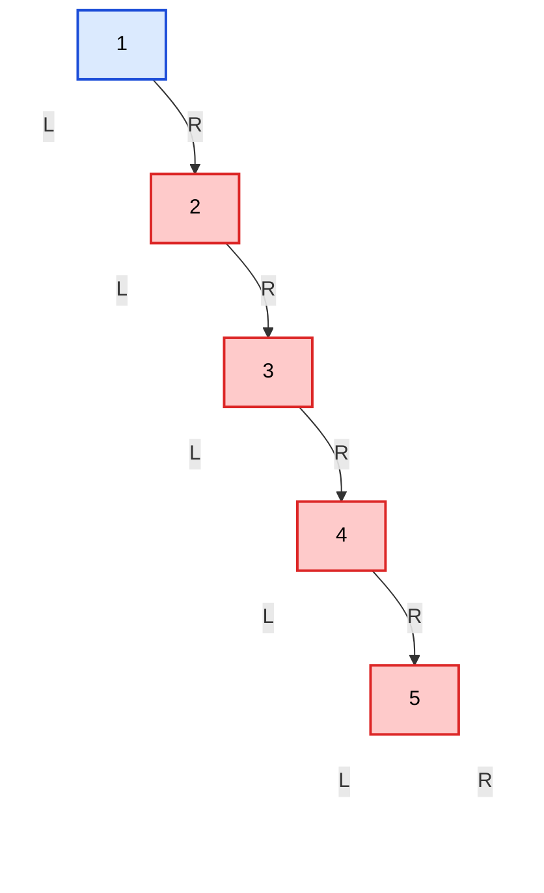
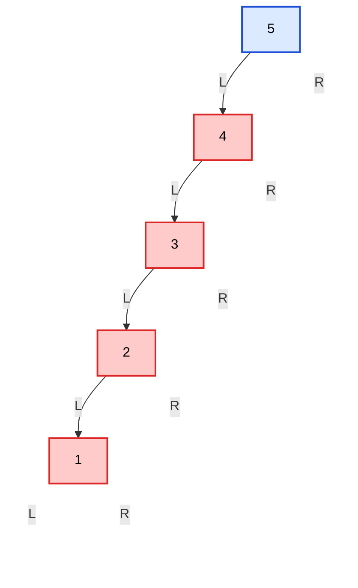
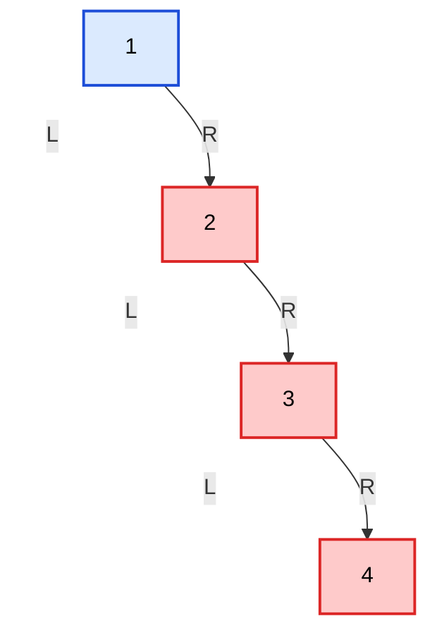
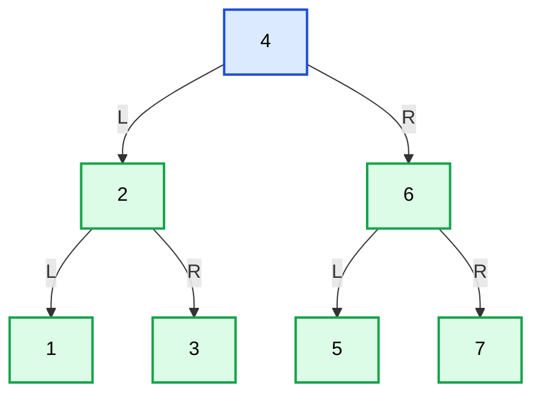
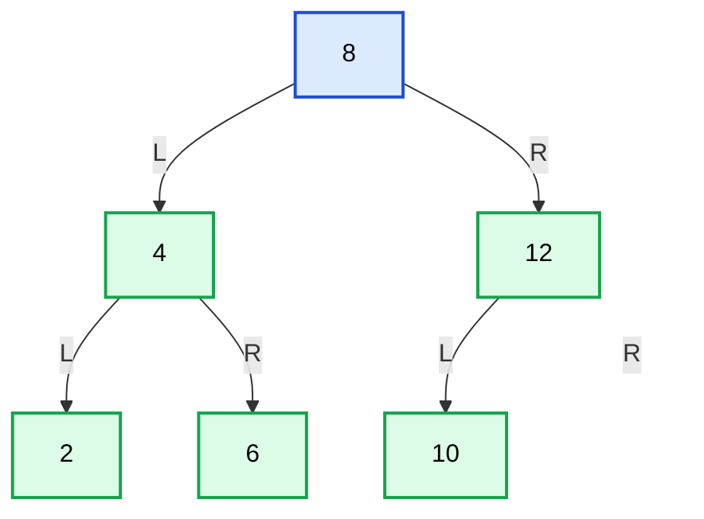
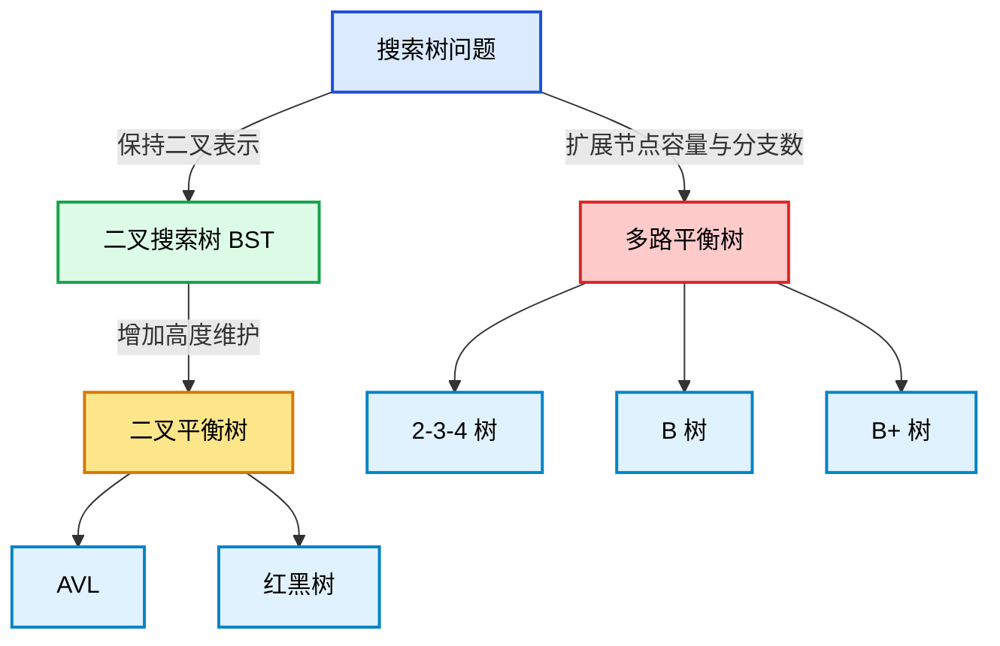

# 第4章\_为什么\_BST\_会退化

## 4.1\_章节内容说明

沿[P03 查找与插入](P03_二叉搜索树_BST.md#3.7_运行查找与插入)、[P22 删除](P22_BST删除与子树回接.md#22.2_从图中的替换走到地址上的回接)和[P23 验证](P23_BST验证与高度边界.md#23.6_运行全子树边界反例)，你已经掌握了 BST 的核心性质：

- 左子树所有节点值 < 根节点
- 右子树所有节点值 > 根节点
- 查找、插入、删除都沿着一条比较路径向下进行
- <span style="color:red;font-weight: bold">中序遍历结果是有序序列</span>

但是，BST 有一个根本缺陷：

> **BST 只约束“值的相对大小关系”，不约束“树的形状”。**

这意味着：

- 它可以长成一棵比较低、比较展开的树
- 也可以长成一条很长的单边链

<span style="color:red;font-weight: bold">一旦 BST 树高失控，BST 原本依赖的性能优势就会消失。</span>

这里保留原重点，同时限定“性能优势”指最坏查找路径的数量级保证；中序仍有序，某个目标恰好位于根时也仍可一次命中。不能把最坏情况退化解释成每一次操作都会变慢。
所以，本章的重点不是再扩展 BST 操作，而是回答一个更关键的问题：

> **为什么 BST 之后还必须继续学习平衡树？**

答案就在于：**BST 会退化，而退化的本质就是树高失控。**

------

## 4.2\_退化问题的提出

保持键集合不变，只改变到达顺序。若两个结果都通过上一章的排序检查，查找过程是否就一样短？先从五个递增键看起。

### 4.2.1\_顺序插入导致的单边增长

BST 的插入规则本身很简单：

- \< 当前节点，向左走
- \> 当前节点，向右走
- 遇到空位置就插入

问题不在规则本身，而在于：

> **插入路径完全受“已有树形 + 输入顺序”共同影响。**

例如按顺序插入：

```text
1, 2, 3, 4, 5
```

最终会得到下面这棵 BST：


```mermaid
graph TD
		A["1"]

		A_L[" "]
		B["2"]

		B_L[" "]
		C["3"]

		C_L[" "]
		D["4"]

		D_L[" "]
		E["5"]

		E_L[" "]
		E_R[" "]

	A -->|L| A_L
	A -->|R| B

	B -->|L| B_L
	B -->|R| C

	C -->|L| C_L
	C -->|R| D

	D -->|L| D_L
	D -->|R| E

	E -->|L| E_L
	E -->|R| E_R

	classDef root_node fill:#dbeafe,stroke:#1d4ed8,stroke-width:2px,color:#000;
	classDef bad_node fill:#fecaca,stroke:#dc2626,stroke-width:2px,color:#000;
	classDef ghost fill:transparent,stroke:transparent,color:transparent;

	class A root_node;
	class B,C,D,E bad_node;
	class A_L,B_L,C_L,D_L,E_L,E_R ghost;


	linkStyle 0 stroke:transparent;
	linkStyle 2 stroke:transparent;
	linkStyle 4 stroke:transparent;
	linkStyle 6 stroke:transparent;
	linkStyle 8 stroke:transparent;
	linkStyle 9 stroke:transparent;
```

这棵树虽然仍然满足 BST 的大小关系，但已经明显不是“展开的树形”，而是在向右单边增长。

### 4.2.2\_树退化为链表的结构现象

所谓“退化”，最典型的现象就是：

> **树的分支结构几乎消失，只剩下一条很长的路径。**

上面那棵树，本质上已经接近下面这种线性结构：

```text
1 -> 2 -> 3 -> 4 -> 5
```

如果反过来按降序插入：

```text
5, 4, 3, 2, 1
```

则会得到左斜树：


```mermaid
graph TD
		A["5"]

		B["4"]
		A_R[" "]

		C["3"]
		B_R[" "]

		D["2"]
		C_R[" "]

		E["1"]
		D_R[" "]

		E_L[" "]
		E_R[" "]

	A -->|L| B
	A -->|R| A_R

	B -->|L| C
	B -->|R| B_R

	C -->|L| D
	C -->|R| C_R

	D -->|L| E
	D -->|R| D_R

	E -->|L| E_L
	E -->|R| E_R

	classDef root_node fill:#dbeafe,stroke:#1d4ed8,stroke-width:2px,color:#000;
	classDef bad_node fill:#fecaca,stroke:#dc2626,stroke-width:2px,color:#000;
	classDef ghost fill:transparent,stroke:transparent,color:transparent;

	class A root_node;
	class B,C,D,E bad_node;
	class A_R,B_R,C_R,D_R,E_L,E_R ghost;


	linkStyle 1 stroke:transparent;
	linkStyle 3 stroke:transparent;
	linkStyle 5 stroke:transparent;
	linkStyle 7 stroke:transparent;
	linkStyle 8 stroke:transparent;
	linkStyle 9 stroke:transparent;
```

所以“退化”不是抽象描述，而是一个非常具体的结构问题：

- 原本应该有分支
- 最后却被压成一条长路径

### 4.2.3\_查找效率从对数级退化到线性级

BST 的查找复杂度本质上是：

```text
O(h)
```

这里的 h 沿用按边计高度，严格写法为 O(h+1)：最多访问 h+1 个非空节点；当 h 随规模增长时，通常简写成 O(h)。这不是每个键都必须走到叶子，命中根仍只访问一次。

当树比较低、比较展开时：

```text
h ≈ log n
```

于是查找复杂度接近：

```text
O(log n)
```

但当树退化成单链时：

```text
h = n - 1
```

于是查找复杂度就退化成：

```text
O(n)
```

这意味着：

- 原本你以为自己在“树上查找”
- 实际上却变成了“沿着一条链线性扫描”

所以必须明确一个判断标准：

> **BST 的效率优势并不是因为它叫“树”，而是因为它的高度足够低。**

------

### 4.2.4\_用节点访问次数观察退化

现在仍使用相同键集合，但把规模从 7 扩大到 15、31。先预测升序构建要经过多少已有节点：第一个键不用比较，第二个经过 1 个，第三个经过 2 个，直到第 n 个经过 n-1 个，总计 n(n-1)/2。最后查找最大键时要经过 n 个节点。

另一组先插中位数，再依次处理左右半区。它预先知道全部数据，只是为本次静态集合安排输入次序，并没有实现动态自平衡。代码使用固定节点池，避免把分配器速度混入观察；这里只记录每次到达一个非空节点的次数，不计空槽，不等同于 CPU 指令数、单独的 < 或 == 执行次数，也不测量时间。

NODE_CAPACITY 是固定池的容量常量，本例为 31；used 是已占用槽数，root 保存数组中根节点的地址，insert_visits 累加构建时经过的节点次数。每次查询的 visits 则从零单独开始，不与构建次数混用。

```c
#include <assert.h>
#include <stddef.h>
#include <stdio.h>

#define NODE_CAPACITY 31

struct bst_node {
    int key;
    struct bst_node *left;
    struct bst_node *right;
};

struct tree_model {
    struct bst_node nodes[NODE_CAPACITY];
    size_t used;
    struct bst_node *root;
    unsigned long insert_visits;
};

/* 返回 1 已插入、0 已存在、-1 池满；一次到达节点计一次访问。 */
static int insert_key(struct tree_model *tree, int key)
{
    struct bst_node **link = &tree->root;
    while (*link) {
        ++tree->insert_visits;
        if (key == (*link)->key)
            return 0;
        link = key < (*link)->key ? &(*link)->left : &(*link)->right;
    }
    if (tree->used == NODE_CAPACITY)
        return -1;
    struct bst_node *node = &tree->nodes[tree->used++];
    *node = (struct bst_node){key, NULL, NULL};
    *link = node;
    return 1;
}

static int insert_middle_first(struct tree_model *tree, int low, int high)
{
    if (low > high)
        return 1;
    int middle = low + (high - low) / 2;
    return insert_key(tree, middle) == 1 &&
           insert_middle_first(tree, low, middle - 1) &&
           insert_middle_first(tree, middle + 1, high);
}

static int tree_height(const struct bst_node *root)
{
    if (!root)
        return -1;
    int left = tree_height(root->left), right = tree_height(root->right);
    return (left > right ? left : right) + 1;
}

static const struct bst_node *find_key(const struct bst_node *root,
                                       int key, unsigned *visits)
{
    *visits = 0;
    while (root) {
        ++*visits;
        if (key == root->key)
            return root;
        root = key < root->key ? root->left : root->right;
    }
    return NULL;
}

static void compare_orders(int count)
{
    /* 池和入口共处同一对象，建好后不按值复制 tree_model。 */
    struct tree_model ordered = {0}, middle_first = {0};
    unsigned ordered_visits, middle_visits;
    for (int key = 1; key <= count; ++key) {
        int inserted = insert_key(&ordered, key);
        assert(inserted == 1);
    }
    int built = insert_middle_first(&middle_first, 1, count);
    assert(built);
    const struct bst_node *a = find_key(ordered.root, count, &ordered_visits);
    const struct bst_node *b = find_key(middle_first.root, count, &middle_visits);
    assert(a && b);
    printf("%d ordered %d %lu %u\n", count, tree_height(ordered.root),
           ordered.insert_visits, ordered_visits);
    printf("%d middle  %d %lu %u\n", count, tree_height(middle_first.root),
           middle_first.insert_visits, middle_visits);
}

int main(void)
{
    printf("nodes order height build_visits find_max_visits\n");
    compare_orders(7);
    compare_orders(15);
    compare_orders(31);
    return 0;
}
```

保存为 [bst_height_model.c](../../../../labs/kernel/tree_basics/materials/bst_height_model.c)，执行：

```bash
gcc -std=c11 -Wall -Wextra -Werror -pedantic bst_height_model.c -o bst_height_model
./bst_height_model
```

输出列依次是节点数、构建顺序、按边高度、构建访问总数、查找最大键的访问数：

```text
nodes order height build_visits find_max_visits
7 ordered 6 21 7
7 middle  2 10 3
15 ordered 14 105 15
15 middle  3 34 4
31 ordered 30 465 31
31 middle  4 98 5
```

ordered 表示升序，middle 表示先中位数。相同的 31 个键，最大键查找分别访问 31 和 5 个节点；两棵树的中序键集合相同。若改成查找 1，升序树会在根立即命中，所以不要把最坏路径的改进改写成“所有键都访问更少”。这正是对固定目标、平均分布和最坏情况必须分别讨论的原因。

节点地址来自 tree_model 内部数组，没有动态释放；建好以后不能按值复制整个 tree_model，因为内部指针仍指向原数组。池最多 31 个对象，满时拒绝新增，已有拓扑不变；查重仍能返回“已存在”。程序只给出这个有限输入范围，求高度和中位数构建的递归也只针对这个范围，不能把容量宏直接放大就宣称可处理任意深度。

## 4.3\_退化的本质原因

节点访问次数来自沿途真正走过的地址。排序规则可以决定方向，却没有要求被放弃的一侧占多少节点；这就是比较有效而路径仍可能很长的原因。

### 4.3.1\_BST\_只约束大小关系\_不约束形状

BST 的定义只有这些：

- 左边小
- 右边大
- 子树本身仍然满足这个规则

请注意，这里面并没有要求：

- 左右子树高度接近
- 左右节点数接近
- 树必须均匀展开
- 树高必须受限

这就意味着：

> **只要大小关系没破坏，再差的树形也仍然是合法 BST。**

例如下面这棵树：


```mermaid
graph TD
		A["1"]

		A_L[" "]
		B["2"]

		B_L[" "]
		C["3"]

		C_L[" "]
		D["4"]

	A -->|L| A_L
	A -->|R| B
	B -->|L| B_L
	B -->|R| C
	C -->|L| C_L
	C -->|R| D

	classDef root_node fill:#dbeafe,stroke:#1d4ed8,stroke-width:2px,color:#000;
	classDef bad_node fill:#fecaca,stroke:#dc2626,stroke-width:2px,color:#000;
	classDef ghost fill:transparent,stroke:transparent,color:transparent;

	class A root_node;
	class B,C,D bad_node;
	class A_L,B_L,C_L ghost;


	linkStyle 0 stroke:transparent;
	linkStyle 2 stroke:transparent;
	linkStyle 4 stroke:transparent;
```

它很差，但仍然是合法 BST。
所以，退化之所以会发生，不是因为插入算法写错了，而是因为：

> **BST 的定义本来就不负责控制树形。**

### 4.3.2\_插入顺序对树形态的直接影响

同一组数据，用不同顺序插入，最终树形可能完全不同。

例如同样使用这些值：

```text
1, 2, 3, 4, 5, 6, 7
```

在本章“空树起步、互异键、普通 BST 插入且无旋转”的前提下，按升序插入就得到右斜链；不是仅有某个概率会这样。
但如果按下面顺序插入：

```text
4, 2, 6, 1, 3, 5, 7
```

则会得到一棵比较规整的 BST：


```mermaid
graph TD
		A["4"]

		B["2"]
		C["6"]

		D["1"]
		E["3"]
		F["5"]
		G["7"]

	A -->|L| B
	A -->|R| C
	B -->|L| D
	B -->|R| E
	C -->|L| F
	C -->|R| G

	classDef root_node fill:#dbeafe,stroke:#1d4ed8,stroke-width:2px,color:#000;
	classDef normal_node fill:#dcfce7,stroke:#16a34a,stroke-width:2px,color:#000;

	class A root_node;
	class B,C,D,E,F,G normal_node;

```

**这说明一个根本事实：**

> **BST 不会自动纠正树形。**

它只是根据当前树和输入顺序，被动生成结果。

### 4.3.3\_删除操作也可能进一步破坏形态

很多人会以为只有插入会导致退化，删除不会。
这个理解不完整。

删除虽然不一定像顺序插入那样直接制造单边链，但它也不会主动修复已经变差的树形。

原因在于：

- 删除只保证 BST 的有序性不被破坏
- 删除并不负责“让树更好看”
- 单孩子删除会发生子树顶替
- 双孩子删除会发生前驱/后继替换

这些动作都只是为了：

```text
删完以后树仍然合法
```

而不是为了：

```text
删完以后树自动变平衡
```

所以必须认识到：

> **BST 的删除目标是维持有序，不是优化形状。**

用前面的七节点树检验这句话：根为 4，左边是 2 带 1、3，右边是 6 带 5、7。依次删除 1、3、2、5，最后剩下 4 → 6 → 7。初始和最终的按边高度都为 2，节点数却从 7 降到 3，分支变成了链。

因此，“删除后更失衡”不一定表示绝对高度上升。对于前章的标准 BST 删除，移除节点或用其唯一孩子顶替不会增加任何保留路径的深度；键覆盖也不增加边。问题是节点规模变小、左右路径差距或高度相对规模变差，而原算法没有修复义务。

------

## 4.4\_为什么需要平衡

已经确认高度问题不是排序错误。新机制必须同时保住原来的取值约束，并让更新后的最长路径与当前节点规模相称。

### 4.4.1\_平衡的目标不是绝对对称

很多初学者会把“平衡”理解成：

- 左右完全一样高
- 左右节点数完全一样
- 图形看上去完全对称

这并不准确。

在搜索树里，所谓“平衡”，核心目标不是几何对称，而是：

> **让树高保持在可接受范围内。**

例如下面这棵树并不完全对称，但树高仍然比较低：


```mermaid
graph TD
		A["8"]

		B["4"]
		C["12"]

		D["2"]
		E["6"]
		F["10"]
		C_R[" "]

	A -->|L| B
	A -->|R| C
	B -->|L| D
	B -->|R| E
	C -->|L| F
	C -->|R| C_R

	classDef root_node fill:#dbeafe,stroke:#1d4ed8,stroke-width:2px,color:#000;
	classDef normal_node fill:#dcfce7,stroke:#16a34a,stroke-width:2px,color:#000;
	classDef ghost fill:transparent,stroke:transparent,color:transparent;

	class A root_node;
	class B,C,D,E,F normal_node;
	class C_R ghost;


	linkStyle 5 stroke:transparent;
```

所以“平衡”的判断标准不应该是“完全对称”，而应该是：

> **树高有没有被有效控制。**

### 4.4.2\_控制树高才是核心目标

BST 的核心操作：

- 查找
- 插入
- 删除

它们的复杂度都依赖于树高 `h`：

```text
O(h)
```

所以真正要解决的问题不是“让图好看”，而是：

```text
让 h 随 n 至多按对数数量级增长，而不是沿 n 线性增长
```

也就是说，平衡树的本质任务是：

> **在保留 BST 有序性的前提下，控制树高。**

### 4.4.3\_平衡树解决的本质问题

平衡树解决的问题可以概括成一句话：

> **在保持 BST 左小右大规则不变的前提下，额外引入结构控制机制，使树高维持在合理范围内。**

这里有两个层面：

#### (1)\_第一层\_仍然必须是\_BST

这里说的是 AVL、红黑树这类 **平衡二叉搜索树**；它们不是脱离 BST 的新结构。后面的多路搜索树会改变“每节点两个孩子”的表示，不能把整个平衡搜索树家族都当成二叉树。
它仍然必须满足：

- 左子树值 \< 根
- 右子树值 \> 根
- 中序遍历有序

#### (2)\_第二层\_还要控制树形

BST 自己不控制树形，所以平衡树必须额外引入机制去修正结构。
本路线中的二叉平衡维护会使用：

- 旋转
- 染色(这里是针对红黑树的)
- 局部重排

这些动作上。

------

### 4.4.4\_何时需要为维护付出代价

如果键集合很小、最大规模已知，逐个走过几十个节点也满足预算，普通 BST 的实现和状态可能已经足够。若集合一次性构建、之后只读，可以像实验一样选择初始树形，或者比较排序数组等静态表示；仅为了“树的名字更高级”加入动态修复没有必要。

若键会持续到达，顺序可能接近有序或由外部输入控制，又要求单次查找的路径有确定上界，就不能把“这次随机顺序看起来不错”当保证。维护平衡把一部分成本移到更新时：更新额外状态、检查祖先、改若干连接；换取未来操作不沿任意长链下降。具体选择还要看读写比例、对象大小、缓存布局以及是否需要范围遍历，实验里的节点访问次数只证明其中一个维度。

## 4.5\_常见平衡思想概览

先看一种能够检查的局部高度规则，再说明为什么还有其他维护状态和节点表示。这里建立各路线面对的约束，具体旋转和红黑修复沿后续章节展开。

### 4.5.1\_严格平衡与弱平衡

不同平衡树对“高度控制”的严格程度并不一样。

可以先粗略分成两类：

| 类型     | 特点                                       | 代表          |
| -------- | ------------------------------------------ | ------------- |
| 严格平衡 | 更严格限制局部高度差                       | AVL[^AVL全称] |
| 弱平衡   | 不要求每个局部都接近，但能控制整体高度上界 | 红黑树        |

这里的“严格”和“弱”是本节比较约束的粗略用语，不是一套统一的分类标准，也不是好坏排序。

### 4.5.2\_AVL\_与红黑树的思路差异

#### (1)\_AVL\_的思路

AVL[^AVL全称] 把局部规则具体化为：**每个节点的左右子树高度差绝对值不超过 1**。这不是“看起来均匀”，而是更新后可以逐点检查的条件。[NIST AVL 定义](https://xlinux.nist.gov/dads/HTML/avltree.html)给出了这一约束及对数级操作界限。

想象在某个叶子下面插入新节点：它自己的高度确定，上层某一边的高度可能增加，影响继续沿祖先路径传播。若每次都重新遍历两棵子树求高度，一次局部检查就可能扫描许多节点。因此实现通常维护高度或平衡因子——即左右高度之差——作为额外状态；插入和删除后更新这些状态，发现违反约束的位置再做结构修复。下一章先解释修复用的旋转怎样保住键序。

代价是维护额外状态、检查祖先以及必要的改边。较紧的高度界限可以限制比较次数，但不直接等于某个应用的运行时间更短；节点布局、读写比例和具体实现也影响结果。不能仅凭“AVL”三个字判断它一定比另一种树快。

#### (2)\_红黑树的思路

另一条路线不逐点规定左右高度差，而是在节点上保存红/黑标记，把约束放到路径上。颜色只是软件维护状态，不参与整数大小比较。后续会用“各路径经过的黑色节点数量相同”配合“红色节点不能连续”解释为什么最长路径受限；这个计数称为黑高，届时再统一空孩子终点和计数约定。

因此不能把“允许局部高度差更大”理解成不维护结构。更新后仍需要检查、改颜色以及必要的旋转，只是恢复的规则不同。[NIST 红黑树条目](https://xlinux.nist.gov/dads/HTML/redblack.html)说明其颜色状态与高度上界；具体推导按本路线先读 P06 的多路模型，再进入 P07。工程中广泛使用不能替代对本场景保证和代价的比较，也不能据此承诺每次更新都比 AVL 调整少。

### 4.5.3\_多路平衡树与二叉平衡树的分化方向

到这里默认每个节点只比较一个键、最多向两个方向走。如果一次访存或页读取能带回较多数据，就会产生另一个问题：为什么不在一个节点里放多个分隔键，一次决定多个子区间中的一个？这会把孩子数从两个扩展为多个，形成多路搜索树。它与二叉平衡树面对的都是搜索路径问题，但改变的是节点容量与分支数，不能在类型继承图里写成 BST 的二叉子类。

例如：

- 2-3-4 树
- B 树
- B+ 树

它们可以放进同一个“平衡搜索树家族”里：


```mermaid
graph TD
	A["搜索树问题"]
	B["二叉搜索树 BST"]
	C["二叉平衡树"]
	D["多路平衡树"]
	E["AVL"]
	F["红黑树"]
	G["2-3-4 树"]
	H["B 树"]
	I["B+ 树"]

	A -->|"保持二叉表示"| B
	B -->|"增加高度维护"| C
	A -->|"扩展节点容量与分支数"| D
	C --> E
	C --> F
	D --> G
	D --> H
	D --> I

	classDef top_node fill:#dbeafe,stroke:#1d4ed8,stroke-width:2px,color:#000;
	classDef bst_node fill:#dcfce7,stroke:#16a34a,stroke-width:2px,color:#000;
	classDef binary_balanced fill:#fde68a,stroke:#d97706,stroke-width:2px,color:#000;
	classDef multi_balanced fill:#fecaca,stroke:#dc2626,stroke-width:2px,color:#000;
	classDef leaf_kind fill:#e0f2fe,stroke:#0284c7,stroke-width:2px,color:#000;

	class A top_node;
	class B bst_node;
	class C binary_balanced;
	class D multi_balanced;
	class E,F,G,H,I leaf_kind;
```

------

## 4.6\_本章小结

同一套比较规则可以走短路径，也可以走长链。下面回收这个差异，说明下一步需要怎样的局部改边能力。

### 4.6.1\_红黑树出现的动机

到这里你应该已经清楚：

- BST 的问题不在查找规则
- 而在树高不受控
- 一旦树高失控，性能优势就消失

所以红黑树出现的动机不是重新发明搜索树，而是：

> **在保留 BST 有序性的前提下，补上树高控制能力。**

### 4.6.2\_为什么后面先学旋转\_而不是直接学红黑树性质

很多教材一上来就讲：

- 红节点
- 黑节点
- 五条性质
- 插入 case
- 删除 case

如果前面没有先理解“BST 为什么会退化”，这些内容就会显得像一组机械规则。

本书接下来讨论 AVL/红黑树的二叉局部重排，其中一个基本操作是：

> **旋转**

为什么先学旋转？

因为旋转解决的是最核心的问题：

- 如何在不破坏 BST 有序性的前提下
- 改变局部树形
- 在合适的失衡位置与方向上改善高度
- 配合该树的维护规则修复失衡

旋转本身只保证在满足前提时维持键序并改变局部形态，单次旋转未必降低整树高度，更不自动证明全局平衡；选择哪里、向哪边转仍由维护算法决定。多路树还会使用分裂、合并和键的重分布，不归结为“所有树最终都只做旋转”。

所以本路线的学习顺序是：

1. 先知道 BST 为什么会退化
2. 再知道平衡树为什么存在
3. 然后学习如何通过局部重排修复树形
4. 最后进入红黑树的具体性质与修复规则

本章已经通过输入顺序和实际访问计数看到高度的作用。继续[P05 旋转](P05_旋转的作用与局部重排.md)，先解释怎样只改少量边而保住中序次序，再考虑何时需要这种改动。

------

[^AVL全称]: 中文通常叫：**AVL 树** 或 **平衡二叉搜索树的一种**。AVL 全称是 **Adelson-Velsky and Landis Tree**。它是以两位提出者的名字命名的： **Georgy Adelson-Velsky** 和 **Evgenii Landis**。
