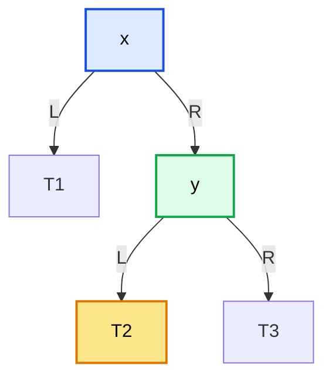
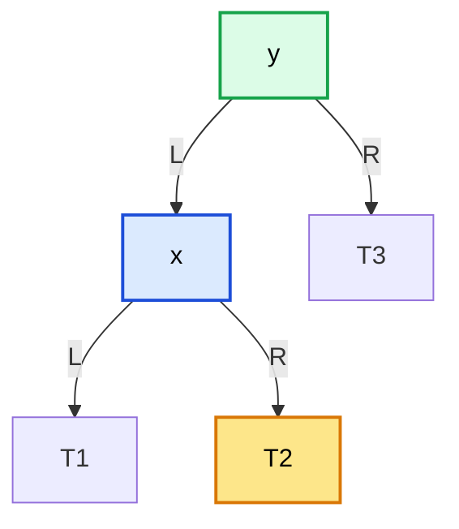
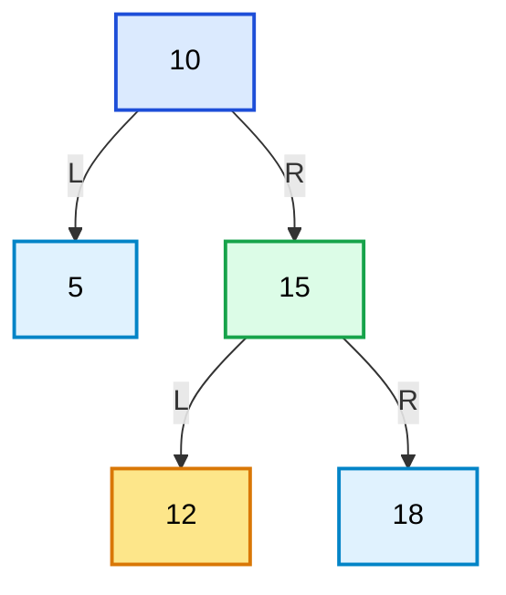
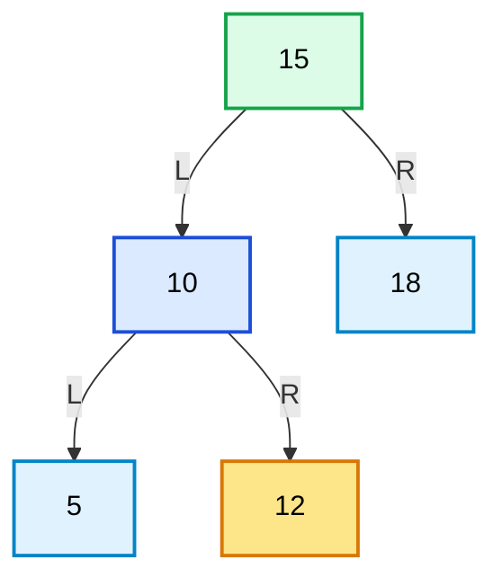
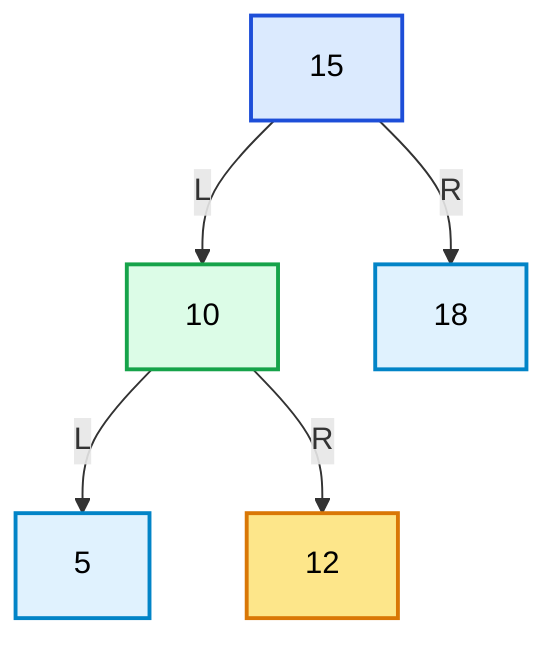
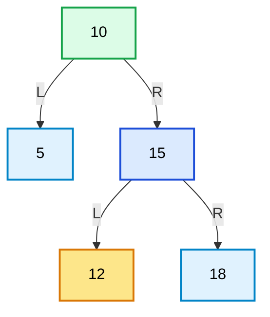

# 第5章\_旋转的作用与局部重排

## 5.1\_章节内容说明

通过[P04 的节点访问实验](P04_为什么_BST_会退化.md#4.2.4_用节点访问次数观察退化)，你已经知道：

- BST 的问题不在“左小右大”的比较规则
- 而在于它**不控制树高**
- 一旦输入顺序不合适，BST 就可能退化成单链结构

那么接下来的关键问题就是：

> **既然树形坏了，怎样在不破坏 BST 有序性的前提下，把局部结构重新调整好？**

先学习一种保持中序次序的局部动作：**旋转（rotation）**。它提升相邻孩子，并为夹在父子之间的子树寻找新的入口。何时做这个动作才能恢复平衡，是后面诊断规则的问题。

旋转不是重新排序全部节点，也不是重新构造整棵树。
它是一种**局部重排操作**：

- 只修改少量节点之间的父子关系
- 保持中序有序性不变
- 改变局部根与路径长度；高度可能下降、不变，也可能上升
- 为 AVL、红黑树等平衡树提供最基本的结构修复动作

本章你要抓住的核心不是“把左旋右旋死记硬背”，而是理解三件事：

1. 为什么旋转不会破坏 BST 的有序性
2. 旋转到底改了哪些父子指针
3. 为什么双旋本质上是两个单旋的组合

------

## 5.2\_旋转为什么存在

先固定重排不能破坏的东西：从左到右访问这些节点时，键的先后次序仍要相同。再观察哪些连接可以改变，最后才讨论平衡算法如何选择这个动作。

### 5.2.1\_不改变中序有序性

BST 的根本不变量是：

> **中序遍历结果必须保持有序。**

所以任何结构调整都必须满足一个前提：

- 形状可以变
- 但中序顺序不能变

旋转之所以能成为平衡树的基础动作，就是因为它满足这一点。

先看一个左旋前后的抽象局部结构。
图中的 `T1`、`T2`、`T3` 不是单个节点，而是三棵满足区间约束的子树。

左旋前：



左旋后：



旋转前的中序顺序是：

```text
T1, x, T2, y, T3
```

旋转后的中序顺序仍然是：

```text
T1, x, T2, y, T3
```

所以旋转改变的是<span style="color:red;">**结构位置**</span>，不是<span style="color:red;">**有序关系**</span>。

### 5.2.2\_通过局部重排改变树形

旋转的本质，不是“把节点值重新排序”，而是：

> **通过局部指针改接，让重心上移或下移。**

还是以上面的左旋为例：

- 原来 `x` 在上，`y` 在下
- 左旋后，`y` 上移为新的局部根
- `x` 下沉为 `y` 的左孩子
- `T2` 从 `y` 的左边改挂到 `x` 的右边

你会看到：

- 参与调整的只是 `x`、`y`、`T2`
- `T1` 和 `T3` 的相对区间没有变化
- 整个局部的“中心”向右侧节点 `y` 偏移

所以旋转是一个典型的 **局部重排** 动作。“中心”指图中的局部根，不是高度保证。右链 10→15→18 对 10 左旋后高度从 2 降到 1；如果原树是根 10、左叶 5、右叶 15，仍对 10 左旋，就得到 15→10→5 的左链，高度从 1 增到 2。两次都保持各自的中序次序，高度结果却不同。

当前程序不交换键，不申请、释放或搬移节点。保存的旧根地址仍指向原对象，但未必还能作为整树入口。结构完整、键序保持和高度受控要分别检查。

### 5.2.3\_旋转是平衡树修复的机械基础

平衡树的修复规则可以很复杂：

- AVL 会看高度差
- 红黑树会看颜色、叔叔节点、黑高等

这里的 AVL 和红黑二叉树以两个局部动作改边，颜色或高度等附加状态仍由各自算法维护：

- 左旋
- 右旋

也就是说：

> **平衡树决定“什么时候旋转”，而旋转本身负责“怎么改结构”。**

你可以把它们分成两个层面：

| 层面     | 负责的问题   |
| -------- | ------------ |
| 平衡规则 | 何时需要调整 |
| 旋转动作 | 具体怎样调整 |

所以不先学旋转，后面的 AVL、红黑树都会变成一堆难以落地的 case。

------

## 5.3\_左旋

先沿 10、15 和夹在它们之间的 12 追一次改边。图中孩子边和程序的反向 `parent` 最终必须描述同一棵树。

### 5.3.1\_左旋前后的局部结构

左旋的前提是：

> **当前节点 `x` 必须存在右孩子 `y`。**

因为左旋的本质，就是让右孩子上移。

先看一个具体数值例子。

左旋前：



左旋后：



这就是左旋的全部结构结果：

- `15` 上移
- `10` 下沉
- `12` 改挂到 `10` 的右边

### 5.3.2\_左旋时父子关系如何变化

左旋时，真正发生变化的父子关系只有几条：

#### (1)\_变化前

```text
x.right = y
y.left  = T2
```

#### (2)\_变化后

```text
y.left  = x
x.right = T2
```

如果再把父指针考虑进来，则还有两步：

- `y` 要接替 `x` 在原父节点中的位置
- `T2` 若非空，要把父指针改成 `x`

所以左旋本质上是下面这组替换：

| 旋转前               | 旋转后                 |
| -------------------- | ---------------------- |
| `x` 是局部根         | `y` 成为局部根         |
| `y` 是 `x` 的右孩子  | `x` 成为 `y` 的左孩子  |
| `T2` 是 `y` 的左子树 | `T2` 变成 `x` 的右子树 |

### 5.3.3\_左旋为什么不破坏\_BST\_性质

左旋为什么合法，核心在于区间关系始终没有变。

在左旋前，BST 区间满足：

```text
T1 < x < T2 < y < T3
```

更准确地说：

- `T1` 中所有值 `< x`
- `T2` 中所有值 `> x` 且 `< y`
- `T3` 中所有值 `> y`

左旋后：

- `x` 仍然在 `T1` 和 `T2` 之间
- `y` 仍然在 `x` 与 `T3` 之间

所以中序顺序不变，BST 性质自然不变。

这就是为什么左旋虽然改了树形，但不会破坏搜索规则。

------

### 5.3.4\_左旋算法说明(成品实现)

前面已经说明了左旋前后的局部结构变化。
如果后续要继续学习红黑树，那么这里只给“局部骨架”是不够的。因为红黑树中的左旋不是孤立动作，而是直接作用于整棵树中的某个节点 `x`。因此，一个真正可用的左旋实现，必须同时覆盖下面几种情况：

1. `x` 可能就是整棵树的根节点
2. `x` 也可能只是某个父节点的左子树根
3. `x` 也可能只是某个父节点的右子树根
4. `x->right` 不能为空，否则左旋无意义
5. `y = x->right` 的左子树 `T2` 可能为空，也可能非空
6. 左旋之后，必须同时维护：
   - 局部子树的新根
   - 原父节点到新子树根的连接
   - `T2` 的重新挂接
   - 所有受影响节点的 `parent` 指针

本节完整处理这几种入口位置；节点表示仍是普通 BST，后续红黑树需要在此结构动作之外维护颜色和其他契约。

------

#### (1)\_左旋覆盖的完整结构场景

设当前左旋点为 `x`，其右孩子为 `y`，并记：

- `P`：`x` 的父节点，可能为空
- `T1`：`x` 的左子树
- `T2`：`y` 的左子树
- `T3`：`y` 的右子树

则左旋前后结构如下。

##### 1)\_左旋前

```text
              P
              |
              x
            /   \
          T1     y
                / \
              T2   T3
```

##### 2)\_左旋后

```text
              P
              |
              y
            /   \
           x     T3
         /   \
       T1     T2
```

这里真正发生的结构变化只有四件事：

1. `y` 上移，接替 `x` 在原父节点 `P` 中的位置
2. `x` 下沉，变成 `y` 的左孩子
3. `T2` 从 `y` 的左边改挂到 `x` 的右边
4. 所有涉及到的 `parent` 指针都必须同步更新

------

#### (2)\_左旋的不变量

一个成品级左旋实现，必须保证两个不变量。

##### 1)\_第一\_不改变\_BST\_的中序有序性

旋转前后，节点的中序顺序必须保持：

```text
T1, x, T2, y, T3
```

也就是说：

- `T1` 中所有值 `< x`
- `T2` 中所有值 `> x` 且 `< y`
- `T3` 中所有值 `> y`

左旋后只是结构位置变化，没有改变这个区间关系。

##### 2)\_第二\_旋转后整棵树仍然是连通的

左旋不是只改局部三四条指针就结束，它必须保证：

- 原父节点仍然能找到这棵子树
- 新局部根能找到下层
- 下层节点也能通过 `parent` 回到上层

所以，成品左旋不只是“局部变形”，而是“局部变形 + 整树回接”。

------

#### (3)\_左旋的完整算法步骤

下面是不额外保存旧父地址和中间子树的写法。关键是写入依赖：覆盖 `y->left` 前要接走或保存 T2，覆盖 `x->parent` 前要完成或保存旧父入口；预先保存这些地址的实现可以采用其他正确顺序。

##### 1)\_第一步\_确定上移节点\_y

```text
y = x->right
```

如果 `x == NULL` 或 `x->right == NULL`，直接返回，左旋不成立。

##### 2)\_第二步\_回接中间子树\_T2

```text
x->right = y->left
```

如果 `T2` 非空，还要补：

```text
T2->parent = x
```

这里先将 T2 接到 `x->right`，因为稍后 `y->left = x` 会覆盖它的原入口。单独提前回接上层不一定丢失 T2；危险在于覆盖唯一入口之后才试图取旧值。

##### 3)\_第三步\_让\_y\_接替\_x\_原来在父节点中的位置

```text
y->parent = x->parent
```

然后分三种情况讨论：

- 如果 `x` 原来是整棵树根，则 `root = y`
- 如果 `x` 原来是父节点的左孩子，则 `x->parent->left = y`
- 如果 `x` 原来是父节点的右孩子，则 `x->parent->right = y`

##### 4)\_第四步\_让\_x\_下沉

```text
y->left = x
x->parent = y
```

到这里，左旋完成。

因此，一个真正成品级的左旋，不是三句，而是下面这组完整动作：

```text
1. 取 y = x->right
2. x->right = y->left
3. 若 y->left 非空，则 y->left->parent = x
4. y->parent = x->parent
5. 若 x 原来是根节点，则 root = y；
   否则若 x 是父节点的左孩子，则 x->parent->left = y；
   那么   x 是父节点的右孩子，则 x->parent->right = y
6. y->left = x
7. x->parent = y
```

这七步，才是后面红黑树推导真正要依赖的左旋算法。

------

### 5.3.5\_C\_成品实现\_左旋

这是带父链和根槽的普通 BST 左旋，完整处理本节的结构回接；它没有 Linux 的节点布局、颜色、AVL 高度或用户汇总值。

调用者必须保证：`*root` 是有限、无环、父子一致的树，`x` 属于该树，节点在操作期间存活，修改期间由本线程独占。开头的检查只处理列出的空输入，不能检测悬空地址、错树节点或错误父链。末尾 `else` 能判为右孩子，依赖这个结构前提。

根变量由调用者保存，`root` 是变量的地址；`parent` 只保存反向连接，不拥有内存。这些普通写入不是一次原子事务：接走 T2 后、最终回接前，父边与孩子边可能暂时不一致。其他线程不能穿插遍历这些中间态。

```c
#include <stdio.h>
#include <stdlib.h>

struct bst_node {
	int key;
	struct bst_node *left;
	struct bst_node *right;
	struct bst_node *parent;
};

/*
 * 成品左旋
 *
 * 参数：
 * root - 整棵树根指针的地址
 * x    - 当前左旋点
 *
 * 说明：
 * 1. 这个版本同时覆盖：
 *    - x 是整棵树根
 *    - x 是父节点的左孩子
 *    - x 是父节点的右孩子
 *
 * 2. 同时维护：
 *    - 根指针
 *    - parent 指针
 *    - 中间子树 T2 的回接
 */
void bst_left_rotate(struct bst_node **root, struct bst_node *x)
{
	struct bst_node *y;

	if (!root || !*root || !x || !x->right)
		return;

	/* y 是上移节点 */
	y = x->right;

	/*
	 * 第一步：把 T2 挂回 x 的右边
	 *
	 * 旋转前：
	 * x->right = y
	 * y->left  = T2
	 *
	 * 旋转后：
	 * x->right = T2
	 */
	x->right = y->left;
	if (y->left)
		y->left->parent = x;

	/*
	 * 第二步：让 y 接替 x 原来的位置
	 */
	y->parent = x->parent;

	if (!x->parent) {
		/* x 原来是整棵树根 */
		*root = y;
	} else if (x == x->parent->left) {
		/* x 原来是父节点的左孩子 */
		x->parent->left = y;
	} else {
		/* x 原来是父节点的右孩子 */
		x->parent->right = y;
	}

	/*
	 * 第三步：让 x 下沉为 y 的左孩子
	 */
	y->left = x;
	x->parent = y;
}
```

------

### 5.3.6\_C++\_成品实现\_左旋

C++ 版用根指针引用表达同一个入口更新责任；下面仍只实现普通 BST 的结构操作。

```cpp
#include <iostream>

struct bst_node {
	int key;
	bst_node *left;
	bst_node *right;
	bst_node *parent;
};

/*
 * 成品左旋（C++ 版）
 *
 * 参数：
 * root - 整棵树根指针的引用
 * x    - 当前左旋点
 */
void bst_left_rotate(bst_node *&root, bst_node *x)
{
	bst_node *y;

	if (!root || !x || !x->right)
		return;

	/* y 是上移节点 */
	y = x->right;

	/* 第一步：回接 T2 */
	x->right = y->left;
	if (y->left)
		y->left->parent = x;

	/* 第二步：让 y 接替 x 原来的位置 */
	y->parent = x->parent;

	if (!x->parent) {
		root = y;
	} else if (x == x->parent->left) {
		x->parent->left = y;
	} else {
		x->parent->right = y;
	}

	/* 第三步：让 x 下沉 */
	y->left = x;
	x->parent = y;
}
```

------

### 5.3.7\_C\_成品示例\_左旋整棵树根

先预测：根从 10 变成 15，中序仍为 `5 10 12 15 18`，12 的父节点变成 10。 节点都是 `main` 的自动对象，整个操作期间有效，不需要分配，也不能对这些地址调用 `free`。完整材料为 [rotate_left_root.c](../../../../labs/kernel/tree_basics/materials/rotate_left_root.c)；在材料目录执行：

```bash
cc -std=c11 -Wall -Wextra -Werror -pedantic rotate_left_root.c -o rotate_left_root
./rotate_left_root
```

`cc` 是宿主 C 编译器，警告按错误处理。中序输出只检查访问顺序；随后还要对照根和父链，不能由排序正确推断高度平衡。

下面先看最简单但仍然是**成品调用方式**的例子：左旋点 `x` 就是整棵树根。

```c
#include <stdio.h>
#include <stdlib.h>

struct bst_node {
	int key;
	struct bst_node *left;
	struct bst_node *right;
	struct bst_node *parent;
};

void bst_left_rotate(struct bst_node **root, struct bst_node *x)
{
	struct bst_node *y;

	if (!root || !*root || !x || !x->right)
		return;

	y = x->right;

	x->right = y->left;
	if (y->left)
		y->left->parent = x;

	y->parent = x->parent;

	if (!x->parent)
		*root = y;
	else if (x == x->parent->left)
		x->parent->left = y;
	else
		x->parent->right = y;

	y->left = x;
	x->parent = y;
}

void inorder_print(const struct bst_node *root)
{
	if (!root)
		return;

	inorder_print(root->left);
	printf("%d ", root->key);
	inorder_print(root->right);
}

int main(void)
{
	/*
	 * 构造：
	 *        10
	 *       /  \
	 *      5    15
	 *          /  \
	 *         12   18
	 */
	struct bst_node n5  = { 5,  NULL, NULL, NULL };
	struct bst_node n12 = { 12, NULL, NULL, NULL };
	struct bst_node n18 = { 18, NULL, NULL, NULL };
	struct bst_node n15 = { 15, &n12, &n18, NULL };
	struct bst_node n10 = { 10, &n5,  &n15, NULL };

	struct bst_node *root = &n10;

	n5.parent = &n10;
	n12.parent = &n15;
	n18.parent = &n15;
	n15.parent = &n10;

	printf("左旋前中序: ");
	inorder_print(root);
	printf("\n");

	bst_left_rotate(&root, &n10);

	printf("左旋后中序: ");
	inorder_print(root);
	printf("\n");

	printf("左旋后根节点: %d\n", root->key);

	return 0;
}
```

运行后应看到：

```text
左旋前中序: 5 10 12 15 18
左旋后中序: 5 10 12 15 18
左旋后根节点: 15
```

这个例子说明：

- 成品左旋能够处理“`x` 就是整棵树根”
- 中序不变
- 根正确更新

------

### 5.3.8\_C\_成品示例\_左旋子树根节点

先预测：整树根 20 不动，`20.left` 从 10 变成 15，12 接到 10 的右边。 节点都是 `main` 的自动对象，整个操作期间有效，不需要分配，也不能对这些地址调用 `free`。完整材料为 [rotate_left_branch.c](../../../../labs/kernel/tree_basics/materials/rotate_left_branch.c)；在材料目录执行：

```bash
cc -std=c11 -Wall -Wextra -Werror -pedantic rotate_left_branch.c -o rotate_left_branch
./rotate_left_branch
```

`cc` 是宿主 C 编译器，警告按错误处理。中序输出只检查访问顺序；随后还要对照根和父链，不能由排序正确推断高度平衡。

下面给出真正更重要的例子：左旋点 `x` 不是整棵树根，而是**整棵树内部某个子树的根**。这才更接近后面红黑树修复时的真实情况。

```c
#include <stdio.h>
#include <stdlib.h>

struct bst_node {
	int key;
	struct bst_node *left;
	struct bst_node *right;
	struct bst_node *parent;
};

void bst_left_rotate(struct bst_node **root, struct bst_node *x)
{
	struct bst_node *y;

	if (!root || !*root || !x || !x->right)
		return;

	y = x->right;

	x->right = y->left;
	if (y->left)
		y->left->parent = x;

	y->parent = x->parent;

	if (!x->parent)	// 当x是根节点，旋转后，y是根节点
		*root = y;
	else if (x == x->parent->left)
		x->parent->left = y;
	else
		x->parent->right = y;

	y->left = x;
	x->parent = y;
}

void inorder_print(const struct bst_node *root)
{
	if (!root)
		return;

	inorder_print(root->left);
	printf("%d ", root->key);
	inorder_print(root->right);
}

static void print_node(const char *name, const struct bst_node *node)
{
	if (!node) {
		printf("%s: NULL\n", name);
		return;
	}

	printf("%s: key=%d", name, node->key);
	if (node->parent)
		printf(", parent=%d\n", node->parent->key);
	else
		printf(", parent=NULL\n");
}

int main(void)
{
	/*
	 * 构造：
	 *           20
	 *          /  \
	 *        10    30
	 *       /  \
	 *      5   15
	 *         /  \
	 *        12  18
	 */
	struct bst_node n5  = { 5,  NULL, NULL, NULL };
	struct bst_node n12 = { 12, NULL, NULL, NULL };
	struct bst_node n18 = { 18, NULL, NULL, NULL };
	struct bst_node n15 = { 15, &n12, &n18, NULL };
	struct bst_node n10 = { 10, &n5,  &n15, NULL };
	struct bst_node n30 = { 30, NULL, NULL, NULL };
	struct bst_node n20 = { 20, &n10, &n30, NULL };

	n5.parent = &n10;
	n12.parent = &n15;
	n18.parent = &n15;
	n15.parent = &n10;
	n10.parent = &n20;
	n30.parent = &n20;

	{
		struct bst_node *root = &n20;

		printf("左旋前中序: ");
		inorder_print(root);
		printf("\n");

		/* 对内部节点 10 左旋 */
		bst_left_rotate(&root, &n10);

		printf("左旋后中序: ");
		inorder_print(root);
		printf("\n");

		print_node("root", root);
		print_node("root->left", root->left);
		print_node("root->left->left", root->left->left);
		print_node("root->left->right", root->left->right);
	}

	return 0;
}
```

这个例子左旋的是 `10`，不是 `20`。
所以它验证的是：

- 左旋点是内部子树根时，父节点回接是否正确
- `20->left` 是否从 `10` 正确变成 `15`
- `12` 是否正确回接到 `10->right`

这才是后面推红黑树时最有用的示例。

------

### 5.3.9\_按三组责任检查左旋

复习时先遮住代码，指出哪个旧地址必须保留，再按中间子树、外部入口和旧根下沉三个责任推导赋值。

#### (1)\_第一组\_上移节点与中间子树回接

```c
y = x->right;
x->right = y->left;
if (y->left)
	y->left->parent = x;
```

#### (2)\_第二组\_新局部根接回原父节点

```c
y->parent = x->parent;

if (!x->parent)
	*root = y;
else if (x == x->parent->left)
	x->parent->left = y;
else
	x->parent->right = y;
```

#### (3)\_第三组\_旧局部根下沉

```c
y->left = x;
x->parent = y;
```

三组动作分别保存中间子树、修复外部入口、建立新父子关系。按责任检查每条边，才能理解：

> **左旋本身就是一个独立、完整、可复用的成品级局部重排算法。**

------

### 5.3.10\_本小节小结

左旋这一节，最终要记住的不是某一张图，而是下面这两层内容。

#### (1)\_第一层\_算法本质

左旋的本质是：

- 让右孩子上移
- 让当前节点下沉
- 让中间子树 `T2` 改挂到新的合法位置

#### (2)\_第二层\_成品实现骨架

一个可以直接用于红黑树推导的左旋，必须完整包含：

```text
1. y = x->right
2. x->right = y->left
3. 若 y->left 非空，则修 y->left->parent
4. 让 y 接替 x 在原父节点中的位置
5. 让 x 下沉为 y 的左孩子
6. 修 x->parent
7. 必要时更新 root
```

因此，左旋真正值得建立的能力不是“看懂图”，而是：

> **看到一个局部结构时，能把它准确翻译成指针修改顺序，并写成覆盖根节点、子树根节点、父子回接和中间子树回接的完整代码。**

------

## 5.4\_右旋

现在以 15 为旧局部根、10 为上移点，追踪中间节点 12 怎样从 10 的右边回到 15 的左边。它应当恢复前例左旋前的结构。

### 5.4.1\_右旋前后的局部结构

右旋与左旋完全对称。
它的前提是：

> **当前节点 `y` 必须存在左孩子 `x`。**

右旋前：



右旋后：



这就是右旋的全部结构结果：

- `10` 上移
- `15` 下沉
- `12` 改挂到 `15` 的左边

------

### 5.4.2\_右旋时父子关系如何变化

右旋和左旋对称，只需把左右方向互换。

#### (1)\_变化前

```text
y.left = x
x.right = T2
```

#### (2)\_变化后

```text
x.right = y
y.left = T2
```

如果考虑父指针，还需要：

- `x` 接替 `y` 在原父节点中的位置
- `T2` 若非空，要把父指针改成 `y`

所以右旋的本质是：

| 旋转前               | 旋转后                 |
| -------------------- | ---------------------- |
| `y` 是局部根         | `x` 成为局部根         |
| `x` 是 `y` 的左孩子  | `y` 成为 `x` 的右孩子  |
| `T2` 是 `x` 的右子树 | `T2` 变成 `y` 的左子树 |

------

### 5.4.3\_右旋为什么不破坏\_BST\_性质

右旋前的区间关系是：

```text
T1 < x < T2 < y < T3
```

右旋后，中序顺序仍然是：

```text
T1, x, T2, y, T3
```

所以 BST 性质不变。

这也是为什么右旋虽然看上去在“改树”，但实际上并没有改变键值的有序关系。

------

### 5.4.4\_右旋算法说明(成品实现)

前面已经说明了右旋前后的局部结构变化。
如果后续要继续学习红黑树，那么这里只给“局部骨架”仍然是不够的。因为红黑树中的右旋不是孤立动作，而是直接作用于整棵树中的某个节点 `y`。因此，一个真正可用的右旋实现，必须同时覆盖下面几种情况：

1. `y` 可能就是整棵树的根节点
2. `y` 也可能只是某个父节点的左子树根
3. `y` 也可能只是某个父节点的右子树根
4. `y->left` 不能为空，否则右旋无意义
5. `x = y->left` 的右子树 `T2` 可能为空，也可能非空
6. 右旋之后，必须同时维护：
   - 局部子树的新根
   - 原父节点到新子树根的连接
   - `T2` 的重新挂接
   - 所有受影响节点的 `parent` 指针

这几种入口位置都由同一个函数处理；它为后续平衡算法提供结构动作，不单独保证红黑性质。

------

#### (1)\_右旋覆盖的完整结构场景

设当前右旋点为 `y`，其左孩子为 `x`，并记：

- `P`：`y` 的父节点，可能为空
- `T1`：`x` 的左子树
- `T2`：`x` 的右子树
- `T3`：`y` 的右子树

则右旋前后结构如下。

##### 1)\_右旋前

```text
              P
              |
              y
            /   \
           x     T3
         /   \
       T1     T2
```

##### 2)\_右旋后

```text
              P
              |
              x
            /   \
           T1    y
                / \
               T2  T3
```

这里真正发生的结构变化只有四件事：

1. `x` 上移，接替 `y` 在原父节点 `P` 中的位置
2. `y` 下沉，变成 `x` 的右孩子
3. `T2` 从 `x` 的右边改挂到 `y` 的左边
4. 所有涉及到的 `parent` 指针都必须同步更新

------

#### (2)\_右旋的不变量

一个成品级右旋实现，必须保证两个不变量。

##### 1)\_第一\_不改变\_BST\_的中序有序性

旋转前后，节点的中序顺序必须保持：

```text
T1, x, T2, y, T3
```

也就是说：

- `T1` 中所有值 `< x`
- `T2` 中所有值 `> x` 且 `< y`
- `T3` 中所有值 `> y`

右旋后只是结构位置变化，没有改变这个区间关系。

##### 2)\_第二\_旋转后整棵树仍然是连通的

右旋不是只改局部几条指针就结束，它必须保证：

- 原父节点仍然能找到这棵子树
- 新局部根能找到下层
- 下层节点也能通过 `parent` 回到上层

所以，成品右旋同样是“局部变形 + 整树回接”。

------

#### (3)\_右旋的完整算法步骤

镜像写法在覆盖 `x->right` 前接走 T2，在覆盖 `y->parent` 前完成旧父入口回接。预存旧地址时可以改变排列，但结果仍须同时满足孩子边、父边和外部根槽的关系。

##### 1)\_第一步\_确定上移节点\_x

```text
x = y->left
```

如果 `y == NULL` 或 `y->left == NULL`，直接返回，右旋不成立。

##### 2)\_第二步\_回接中间子树\_T2

```text
y->left = x->right
```

如果 `T2` 非空，还要补：

```text
T2->parent = y
```

先执行 `x->right = y` 会覆盖 T2 的原入口。本实现先把它接到 `y->left`；也可以先保存 T2 再改边，但不能丢失旧值。

##### 3)\_第三步\_让\_x\_接替\_y\_原来在父节点中的位置

```text
x->parent = y->parent
```

然后分三种情况讨论：

- 如果 `y` 原来是整棵树根，则 `root = x`
- 如果 `y` 原来是父节点的左孩子，则 `y->parent->left = x`
- 如果 `y` 原来是父节点的右孩子，则 `y->parent->right = x`

##### 4)\_第四步\_让\_y\_下沉

```text
x->right = y
y->parent = x
```

到这里，右旋完成。

因此，一个真正成品级的右旋，应当记成下面这组完整动作：

```text
1. x = y->left
2. y->left = x->right
3. 若 x->right 非空，则 x->right->parent = y
4. x->parent = y->parent
5. 把 x 接回原父节点，或者更新 root
6. x->right = y
7. y->parent = x
```

这七步，才是后面红黑树推导真正要依赖的右旋算法。

------

### 5.4.5\_C\_成品实现\_右旋

右旋沿用左旋的存活、成员关系、父子一致和独占前提；空检查不是结构验证。它也只维护结构，AVL 算法需要另外更新高度。

下面给出一份可以直接用于后续红黑树推导的 C 版本右旋。
它不是“局部教学版”，而是**完整版本**。

```c
#include <stdio.h>
#include <stdlib.h>

struct bst_node {
	int key;
	struct bst_node *left;
	struct bst_node *right;
	struct bst_node *parent;
};

/*
 * 成品右旋
 *
 * 参数：
 * root - 整棵树根指针的地址
 * y    - 当前右旋点
 *
 * 说明：
 * 1. 这个版本同时覆盖：
 *    - y 是整棵树根
 *    - y 是父节点的左孩子
 *    - y 是父节点的右孩子
 *
 * 2. 同时维护：
 *    - 根指针
 *    - parent 指针
 *    - 中间子树 T2 的回接
 */
void bst_right_rotate(struct bst_node **root, struct bst_node *y)
{
	struct bst_node *x;

	if (!root || !*root || !y || !y->left)
		return;

	/* x 是上移节点 */
	x = y->left;

	/*
	 * 第一步：把 T2 挂回 y 的左边
	 *
	 * 旋转前：
	 * y->left = x
	 * x->right = T2
	 *
	 * 旋转后：
	 * y->left = T2
	 */
	y->left = x->right;
	if (x->right)
		x->right->parent = y;

	/*
	 * 第二步：让 x 接替 y 原来的位置
	 */
	x->parent = y->parent;

	if (!y->parent) {
		/* y 原来是整棵树根 */
		*root = x;
	} else if (y == y->parent->left) {
		/* y 原来是父节点的左孩子 */
		y->parent->left = x;
	} else {
		/* y 原来是父节点的右孩子 */
		y->parent->right = x;
	}

	/*
	 * 第三步：让 y 下沉为 x 的右孩子
	 */
	x->right = y;
	y->parent = x;
}
```

------

### 5.4.6\_C++\_成品实现\_右旋

C++ 版用根指针引用表达同一个入口更新责任；下面仍只实现普通 BST 的结构操作。

```cpp
#include <iostream>

struct bst_node {
	int key;
	bst_node *left;
	bst_node *right;
	bst_node *parent;
};

/*
 * 成品右旋（C++ 版）
 *
 * 参数：
 * root - 整棵树根指针的引用
 * y    - 当前右旋点
 */
void bst_right_rotate(bst_node *&root, bst_node *y)
{
	bst_node *x;

	if (!root || !y || !y->left)
		return;

	/* x 是上移节点 */
	x = y->left;

	/* 第一步：回接 T2 */
	y->left = x->right;
	if (x->right)
		x->right->parent = y;

	/* 第二步：让 x 接替 y 原来的位置 */
	x->parent = y->parent;

	if (!y->parent) {
		root = x;
	} else if (y == y->parent->left) {
		y->parent->left = x;
	} else {
		y->parent->right = x;
	}

	/* 第三步：让 y 下沉 */
	x->right = y;
	y->parent = x;
}
```

------

### 5.4.7\_C\_成品示例\_右旋整棵树根

先预测：根从 15 变成 10，中序仍为 `5 10 12 15 18`，12 的父节点变成 15。 节点都是 `main` 的自动对象，整个操作期间有效，不需要分配，也不能对这些地址调用 `free`。完整材料为 [rotate_right_root.c](../../../../labs/kernel/tree_basics/materials/rotate_right_root.c)；在材料目录执行：

```bash
cc -std=c11 -Wall -Wextra -Werror -pedantic rotate_right_root.c -o rotate_right_root
./rotate_right_root
```

`cc` 是宿主 C 编译器，警告按错误处理。中序输出只检查访问顺序；随后还要对照根和父链，不能由排序正确推断高度平衡。

下面先看最简单但仍然是**成品调用方式**的例子：右旋点 `y` 就是整棵树根。

```c
#include <stdio.h>
#include <stdlib.h>

struct bst_node {
	int key;
	struct bst_node *left;
	struct bst_node *right;
	struct bst_node *parent;
};

void bst_right_rotate(struct bst_node **root, struct bst_node *y)
{
	struct bst_node *x;

	if (!root || !*root || !y || !y->left)
		return;

	x = y->left;

	y->left = x->right;
	if (x->right)
		x->right->parent = y;

	x->parent = y->parent;

	if (!y->parent)
		*root = x;
	else if (y == y->parent->left)
		y->parent->left = x;
	else
		y->parent->right = x;

	x->right = y;
	y->parent = x;
}

void inorder_print(const struct bst_node *root)
{
	if (!root)
		return;

	inorder_print(root->left);
	printf("%d ", root->key);
	inorder_print(root->right);
}

int main(void)
{
	/*
	 * 构造：
	 *        15
	 *       /  \
	 *      10   18
	 *     /  \
	 *    5   12
	 */
	struct bst_node n5  = { 5,  NULL, NULL, NULL };
	struct bst_node n12 = { 12, NULL, NULL, NULL };
	struct bst_node n18 = { 18, NULL, NULL, NULL };
	struct bst_node n10 = { 10, &n5, &n12, NULL };
	struct bst_node n15 = { 15, &n10, &n18, NULL };

	struct bst_node *root = &n15;

	n5.parent = &n10;
	n12.parent = &n10;
	n18.parent = &n15;
	n10.parent = &n15;

	printf("右旋前中序: ");
	inorder_print(root);
	printf("\n");

	bst_right_rotate(&root, &n15);

	printf("右旋后中序: ");
	inorder_print(root);
	printf("\n");

	printf("右旋后根节点: %d\n", root->key);

	return 0;
}
```

运行后应看到：

```text
右旋前中序: 5 10 12 15 18
右旋后中序: 5 10 12 15 18
右旋后根节点: 10
```

这个例子说明：

- 成品右旋能够处理“`y` 就是整棵树根”
- 中序不变
- 根正确更新

------

### 5.4.8\_C\_成品示例\_右旋子树根节点

先预测：整树根 20 不动，`20.left` 从 15 变成 10，12 接到 15 的左边。 节点都是 `main` 的自动对象，整个操作期间有效，不需要分配，也不能对这些地址调用 `free`。完整材料为 [rotate_right_branch.c](../../../../labs/kernel/tree_basics/materials/rotate_right_branch.c)；在材料目录执行：

```bash
cc -std=c11 -Wall -Wextra -Werror -pedantic rotate_right_branch.c -o rotate_right_branch
./rotate_right_branch
```

`cc` 是宿主 C 编译器，警告按错误处理。中序输出只检查访问顺序；随后还要对照根和父链，不能由排序正确推断高度平衡。

下面给出更重要的例子：右旋点 `y` 不是整棵树根，而是**整棵树内部某个子树的根**。这才更接近后面红黑树修复时的真实情况。

```c
#include <stdio.h>
#include <stdlib.h>

struct bst_node {
	int key;
	struct bst_node *left;
	struct bst_node *right;
	struct bst_node *parent;
};

void bst_right_rotate(struct bst_node **root, struct bst_node *y)
{
	struct bst_node *x;

	if (!root || !*root || !y || !y->left)
		return;

	x = y->left;

	y->left = x->right;
	if (x->right)
		x->right->parent = y;

	x->parent = y->parent;

	if (!y->parent)
		*root = x;
	else if (y == y->parent->left)
		y->parent->left = x;
	else
		y->parent->right = x;

	x->right = y;
	y->parent = x;
}

void inorder_print(const struct bst_node *root)
{
	if (!root)
		return;

	inorder_print(root->left);
	printf("%d ", root->key);
	inorder_print(root->right);
}

static void print_node(const char *name, const struct bst_node *node)
{
	if (!node) {
		printf("%s: NULL\n", name);
		return;
	}

	printf("%s: key=%d", name, node->key);
	if (node->parent)
		printf(", parent=%d\n", node->parent->key);
	else
		printf(", parent=NULL\n");
}

int main(void)
{
	/*
	 * 构造：
	 *           20
	 *          /  \
	 *        15    30
	 *       /  \
	 *     10   18
	 *    /  \
	 *   5   12
	 */
	struct bst_node n5  = { 5,  NULL, NULL, NULL };
	struct bst_node n12 = { 12, NULL, NULL, NULL };
	struct bst_node n10 = { 10, &n5, &n12, NULL };
	struct bst_node n18 = { 18, NULL, NULL, NULL };
	struct bst_node n15 = { 15, &n10, &n18, NULL };
	struct bst_node n30 = { 30, NULL, NULL, NULL };
	struct bst_node n20 = { 20, &n15, &n30, NULL };

	n5.parent = &n10;
	n12.parent = &n10;
	n10.parent = &n15;
	n18.parent = &n15;
	n15.parent = &n20;
	n30.parent = &n20;

	{
		struct bst_node *root = &n20;

		printf("右旋前中序: ");
		inorder_print(root);
		printf("\n");

		/* 对内部节点 15 右旋 */
		bst_right_rotate(&root, &n15);

		printf("右旋后中序: ");
		inorder_print(root);
		printf("\n");

		print_node("root", root);
		print_node("root->left", root->left);
		print_node("root->left->left", root->left->left);
		print_node("root->left->right", root->left->right);
	}

	return 0;
}
```

这个例子右旋的是 `15`，不是 `20`。
所以它验证的是：

- 右旋点是内部子树根时，父节点回接是否正确
- `20->left` 是否从 `15` 正确变成 `10`
- `12` 是否正确回接到 `15->left`

这才是后面推红黑树时最有用的示例。

------

### 5.4.9\_按三组责任检查右旋

对称地检查三组责任：先保留 T2，再接回旧父入口，最后将旧根放到新根右边。

#### (1)\_第一组\_上移节点与中间子树回接

```c
x = y->left;
y->left = x->right;
if (x->right)
	x->right->parent = y;
```

#### (2)\_第二组\_新局部根接回原父节点

```c
x->parent = y->parent;

if (!y->parent)
	*root = x;
else if (y == y->parent->left)
	y->parent->left = x;
else
	y->parent->right = x;
```

#### (3)\_第三组\_旧局部根下沉

```c
x->right = y;
y->parent = x;
```

逐次对照旧值在哪里读取、新值写到哪个槽，就能从图推导右旋，并理解：

> **右旋本身也是一个独立、完整、可复用的成品级局部重排算法。**

------

### 5.4.10\_本小节小结

右旋这一节，最终要记住的不是某一张图，而是下面这两层内容。

#### (1)\_第一层\_算法本质

右旋的本质是：

- 让左孩子上移
- 让当前节点下沉
- 让中间子树 `T2` 改挂到新的合法位置

#### (2)\_第二层\_成品实现骨架

一个可以直接用于红黑树推导的右旋，必须完整包含：

```text
1. x = y->left
2. y->left = x->right
3. 若 x->right 非空，则修 x->right->parent
4. 让 x 接替 y 在原父节点中的位置
5. 让 y 下沉为 x 的右孩子
6. 修 y->parent
7. 必要时更新 root
```

因此，右旋真正值得建立的能力不是“看懂图”，而是：

> **看到一个局部结构时，能把它准确翻译成指针修改顺序，并写成覆盖根节点、子树根节点、父子回接和中间子树回接的完整代码。**

---

### 5.4.11\_用根引用运行一对互逆动作

C 接收根变量的地址，C++ 用 `bst_node *&root` 引用同一个调用者变量。两者改变的都是整树入口，引用不会自动拥有或回收节点。

先保存 `saved_root = root`，再左旋。预测两个指针指向的键：`root` 变成 15，`saved_root` 仍指向 10。撤销时应围绕 **新根 15** 右旋，中间节点 12 的父节点便从 10 回到 15。

下面是完整材料 [rotation_pair.cpp](../../../../labs/kernel/tree_basics/materials/rotation_pair.cpp)。前两个函数沿用上面的 C++ 实现，新增观察只读取本轮涉及的地址和键。

```cpp
#include <iostream>

struct bst_node {
	int key;
	bst_node *left;
	bst_node *right;
	bst_node *parent;
};

/*
 * 成品左旋（C++ 版）
 *
 * 参数：
 * root - 整棵树根指针的引用
 * x    - 当前左旋点
 */
void bst_left_rotate(bst_node *&root, bst_node *x)
{
	bst_node *y;

	if (!root || !x || !x->right)
		return;

	/* y 是上移节点 */
	y = x->right;

	/* 第一步：回接 T2 */
	x->right = y->left;
	if (y->left)
		y->left->parent = x;

	/* 第二步：让 y 接替 x 原来的位置 */
	y->parent = x->parent;

	if (!x->parent) {
		root = y;
	} else if (x == x->parent->left) {
		x->parent->left = y;
	} else {
		x->parent->right = y;
	}

	/* 第三步：让 x 下沉 */
	y->left = x;
	x->parent = y;
}

void bst_right_rotate(bst_node *&root, bst_node *y)
{
	bst_node *x;

	if (!root || !y || !y->left)
		return;

	/* x 是上移节点 */
	x = y->left;

	/* 第一步：回接 T2 */
	y->left = x->right;
	if (x->right)
		x->right->parent = y;

	/* 第二步：让 x 接替 y 原来的位置 */
	x->parent = y->parent;

	if (!y->parent) {
		root = x;
	} else if (y == y->parent->left) {
		y->parent->left = x;
	} else {
		y->parent->right = x;
	}

	/* 第三步：让 y 下沉 */
	x->right = y;
	y->parent = x;
}

int main()
{
    // 自动对象持有节点，指针只描述连接，不拥有或转移内存。
    bst_node n5{5, nullptr, nullptr, nullptr};
    bst_node n12{12, nullptr, nullptr, nullptr};
    bst_node n18{18, nullptr, nullptr, nullptr};
    bst_node n15{15, &n12, &n18, nullptr};
    bst_node n10{10, &n5, &n15, nullptr};
    bst_node *root = &n10;
    bst_node *saved_root = root;
    n5.parent = &n10;
    n12.parent = &n15;
    n18.parent = &n15;
    n15.parent = &n10;

    bst_left_rotate(root, root);
    std::cout << "left: root=" << root->key
              << " saved=" << saved_root->key
              << " middle_parent=" << n12.parent->key << '\n';
    // 逆旋以新的局部根为参数，不能继续把旧根当作右旋点。
    bst_right_rotate(root, root);
    std::cout << "right: root=" << root->key
              << " restored=" << (root == saved_root)
              << " middle_parent=" << n12.parent->key << '\n';
    return 0;
}
```

在材料目录执行：

```bash
c++ -std=c++17 -Wall -Wextra -Werror -pedantic rotation_pair.cpp -o rotation_pair
./rotation_pair
```

预期：

```text
left: root=15 saved=10 middle_parent=10
right: root=10 restored=1 middle_parent=15
```

`restored=1` 只说明根地址相等。再核对所有边：5 始终是 10 的左孩子，18 始终是 15 的右孩子，12 两次换父，两根之间的方向先反转再恢复。没有节点换键或移动地址。

### 5.4.12\_练习入口槽与保证边界

1. 从左旋根示例移除 12 的连接，令 `n15.left` 为空，预测哪些赋值仍执行、哪些父边更新被跳过。
2. 把内部左旋子树挂到更小键父节点的 **右边** 并补齐父链，观察哪个分支负责回接。只改孩子边而忘记 `parent`，是否仍满足前提？
3. 保留根 10、左叶 5、右叶 15，执行左旋。先算前后高度，再解释中序通过为什么不等于修复平衡。
4. 左旋后用旧根副本执行右旋，能否撤销？先画出这次调用选中的上移点。

核对思路：第一题跳过 T2 根的父边写入，`x->right` 仍须写为空，不能保留旧上移点。第二题走旧父的右槽回接；只改单向边破坏函数前提。第三题高度从 1 增到 2，保持的是中序次序。第四题会提升 5，操作的是 10 所在的小子树；正确撤销应对左旋后上移的 15 右旋。

现在能从区间和入口槽推导单旋，并用程序观察。组合动作的选择条件，以及内核怎样组织结构、颜色和调用者约束，是接下来两个不同的问题，不能由普通 BST 函数的结构保证代替。

## 5.5\_Linux\_内核视角\_左右旋在内核中是如何组织的

### 5.5.1\_本节参照的源码文件

本节以 **Linux 5.15** 和 **Linux 6.1** 为参照。就 rbtree 的旋转组织方式而言，这两个版本的关键文件与职责基本一致，后文所说的实现结构可以直接对应到下面这些源码文件：([本地源码](../../../../research/source_reading/linux/upstream_versions/v6.1/Documentation/core-api/rbtree.rst))

1. `lib/rbtree.c`
   红黑树插入修复、删除修复、旋转公共收尾逻辑都在这里。`__rb_insert()`、`____rb_erase_color()`、`__rb_rotate_set_parents()`、`rb_insert_color()`、`rb_erase()` 都属于这个文件的核心内容。([本地源码](../../../../research/source_reading/linux/upstream_versions/v6.1/lib/rbtree.c))
2. `include/linux/rbtree.h`
   对外基础接口在这里声明，例如 `rb_insert_color()`、`rb_erase()`，以及 `rb_link_node()`、`rb_replace_node()`、`rb_first()`、`rb_next()` 等基础辅助接口。([本地源码](../../../../research/source_reading/linux/upstream_versions/v6.1/include/linux/rbtree.h))
3. `include/linux/rbtree_augmented.h`
   增强红黑树接口和回调结构在这里定义，例如 `struct rb_augment_callbacks`、`rb_insert_augmented()` 等。这个文件同时也明确说明：只有增强树相关回调结构和接口是给使用者依赖的，其余很多内容是实现细节。([本地源码](../../../../research/source_reading/linux/upstream_versions/v6.1/include/linux/rbtree_augmented.h))
4. `Documentation/core-api/rbtree.rst`
   这是内核 rbtree 的文档源文件，对应生成文档页面 `core-api/rbtree.html`。它说明了用户如何搜索、插入、删除、遍历，以及增强红黑树如何使用。([本地源码](../../../../research/source_reading/linux/upstream_versions/v6.1/Documentation/core-api/rbtree.rst))

后面本节里出现的“源码骨架”都以这些文件为参照，重点是帮助你把前面学到的 **教学版左旋 / 右旋**，和内核里的**工程版 case 展开实现**对应起来，而不是逐字复刻整段源码。([本地源码](../../../../research/source_reading/linux/upstream_versions/v6.1/lib/rbtree.c))

------

### 5.5.2\_对外接口层\_调用者通常看不到\_左旋\_/\_右旋

从 Linux 内核对外提供的 rbtree 使用方式来看，调用者通常不会直接调用“左旋函数”或“右旋函数”。标准流程是：

1. 先由调用者自己按 BST 规则查找插入位置，再用 `rb_link_node()` 把节点接到树上，随后调用 `rb_insert_color()` 做插入后的红黑修复；
2. 删除时则调用 `rb_erase()`。
3. 因此，从使用者视角看，左右旋不是公开 API，而是被封装在插入 / 删除修复流程内部。6.1 文档对 rbtree 的基本使用方式也是这样描述的。([本地源码](../../../../research/source_reading/linux/upstream_versions/v6.1/include/linux/rbtree.h))

这说明内核对外暴露的是“**怎么把节点接上树并完成修复**”，而不是“**请你自己决定什么时候做左旋、什么时候做右旋**”。也就是说，左右旋在内核里首先是一种**内部实现动作**，而不是用户直接编排的公共算法接口。([本地源码](../../../../research/source_reading/linux/upstream_versions/v6.1/include/linux/rbtree.h))

------

### 5.5.3\_使用者负责什么\_rbtree\_代码又负责什么

`Documentation/core-api/rbtree.rst` 以及 6.1 文档都强调了一点：Linux 的 rbtree 实现采用的是**嵌入式节点设计**，`struct rb_node` 被嵌入到用户自己的数据结构中；同时，内核也不提供比较函数回调，用户必须自己写查找和插入路径逻辑。也就是说，**往左走还是往右走**，是调用者自己决定的；而**接上树后如何保持红黑性质**，则由 rbtree 基础设施负责。([本地源码](../../../../research/source_reading/linux/upstream_versions/v6.1/Documentation/core-api/rbtree.rst))

因此，从职责划分上看：

- **调用者负责**：比较、BST 路径搜索、并发锁保护、业务数据结构组织。
- **rbtree 负责**：`rb_link_node()` 接点、`rb_insert_color()` 插入修复、`rb_erase()` 删除修复，以及遍历与替换等基础树操作。([本地源码](../../../../research/source_reading/linux/upstream_versions/v6.1/include/linux/rbtree.h))

这和很多教学版红黑树有明显差别。教学版通常把“比较、插入、旋转、修复”都写在一个类里，而 Linux 内核把“BST 决策”和“红黑修复”拆开了。这样做更符合内核通用容器的定位。([本地源码](../../../../research/source_reading/linux/upstream_versions/v6.1/Documentation/core-api/rbtree.rst))

------

### 5.5.4\_内核内部\_左右旋没有被做成一个统一公开旋转函数

如果继续往 `lib/rbtree.c` 里看，会发现内核内部**并没有把左旋和右旋彻底包装成一个对使用者公开的统一“旋转总函数”**。当前 5.15 / 6.1 实现里，确实抽取出了一部分公共收尾逻辑，例如 `__rb_rotate_set_parents()`，它专门处理旋转之后“局部新根怎么继承父节点和颜色、旧局部根怎么重新标记、整棵树怎么接回去”的公共部分。([本地源码](../../../../research/source_reading/linux/upstream_versions/v6.1/lib/rbtree.c))

但真正的左右旋指针改接动作，并没有完全隐藏到一个 `rotate(dir, ...)` 的统一总入口里。相反，插入修复的 `__rb_insert()` 和删除修复的 `____rb_erase_color()` 中，左右镜像场景都是**按 case 直接展开**的。源码注释会直接写出`left rotate at parent`、`right rotate at gparent`、`left rotate at sibling`这类语义。也就是说，**内核内部当然在做左旋和右旋，但它们是被嵌在具体修复 case 中的，而不是先抽成一个教学式的完整旋转 API 再由上层调用**。([本地源码](../../../../research/source_reading/linux/upstream_versions/v6.1/lib/rbtree.c))

------

### 5.5.5\_rb\_rotate\_set\_parents()\_内核抽出来的公共收尾逻辑

下面给出一个**按源码结构整理**的关键实现骨架。它不是逐字抄录，而是把 5.15 / 6.1 中这一 helper 的职责直接提炼出来：

```c
static inline void __rb_rotate_set_parents(old, new, root, color)
{
	parent = rb_parent(old);

	new->__rb_parent_color = old->__rb_parent_color;
	rb_set_parent_color(old, new, color);
	__rb_change_child(old, new, parent, root);
}
```

这段骨架表达的意思是：

1. `new` 继承 `old` 原来的父节点和颜色域
2. `old` 的父节点改成 `new`，并被赋予新的颜色
3. 原来指向 `old` 的位置，统一改为指向 `new`

也就是说，内核抽出来的是“**旋转后的父节点 / 颜色公共收尾**”，不是“完整左旋”也不是“完整右旋”。左右旋本体仍然散落在插入 / 删除修复的具体 case 中。5.15 和 6.1 在这里的结构是一致的。([本地源码](../../../../research/source_reading/linux/upstream_versions/v6.1/lib/rbtree.c))

------

### 5.5.6\_插入修复中的旋转\_直接写在\_rb\_insert()\_的\_case\_里

内核插入修复不是“先判断完，再调用一个公开 `left_rotate()` / `right_rotate()` 函数”，而是直接在 `__rb_insert()` 的 case 中把旋转动作展开写出来。

#### (1)\_Case\_2\_先在\_parent\_上做局部旋转

以“父节点是祖父左孩子”的分支为例，当新节点位于 `parent` 的右边时，源码注释会直接写出“**left rotate at parent**”。它的核心动作可以整理成下面这种骨架：

```c
tmp = node->rb_left;

WRITE_ONCE(parent->rb_right, tmp);
WRITE_ONCE(node->rb_left, parent);

if (tmp)
	rb_set_parent_color(tmp, parent, RB_BLACK);

rb_set_parent_color(parent, node, RB_RED);
augment_rotate(parent, node);

parent = node;
tmp = node->rb_right;
```

你可以把它和前面学到的教学版左旋直接对照：

- `node` 这里扮演上移节点
- `parent` 这里是下沉节点
- `tmp` 这里就是中间子树 `T2`

差别只在于：内核把这段动作直接嵌在 Case 2 里，没有包装成一个独立对外函数。([本地源码](../../../../research/source_reading/linux/upstream_versions/v6.1/lib/rbtree.c))

#### (2)\_Case\_3\_再在\_gparent\_上做局部旋转并收尾

紧接着，源码注释会写“**right rotate at gparent**”。其核心动作可以整理成：

```c
WRITE_ONCE(gparent->rb_left, tmp);      /* tmp == parent->rb_right */
WRITE_ONCE(parent->rb_right, gparent);

if (tmp)
	rb_set_parent_color(tmp, gparent, RB_BLACK);

__rb_rotate_set_parents(gparent, parent, root, RB_RED);
augment_rotate(gparent, parent);
```

这里的逻辑和你前面学的“双旋分两步完成”完全一致：

- Case 2 先把“内侧”结构转成“外侧”
- Case 3 再在 `gparent` 上完成最终旋转与收尾

镜像分支则反过来：

- 先“right rotate at parent”
- 再“left rotate at gparent” ([本地源码](../../../../research/source_reading/linux/upstream_versions/v6.1/lib/rbtree.c))

------

### 5.5.7\_删除修复中的旋转\_直接写在\_rb\_erase\_color()\_的\_case\_里

删除修复同样不是通过一个“公开右旋 / 左旋 API”来组织，而是直接在 `____rb_erase_color()` 的四类 case 中展开。

#### (1)\_Case\_1\_兄弟为红\_先围绕\_parent\_旋转

当当前节点在左侧、兄弟在右侧且兄弟为红时，源码注释会直接写“**Case 1 - left rotate at parent**”。其关键动作可以整理为：

```c
tmp1 = sibling->rb_left;

WRITE_ONCE(parent->rb_right, tmp1);
WRITE_ONCE(sibling->rb_left, parent);

rb_set_parent_color(tmp1, parent, RB_BLACK);
__rb_rotate_set_parents(parent, sibling, root, RB_RED);
augment_rotate(parent, sibling);

sibling = tmp1;
```

这一步的作用不是直接修复结束，而是先把红兄弟提上来，把结构改造成后续 case 容易处理的形态。镜像分支则是“**right rotate at parent**”。([本地源码](../../../../research/source_reading/linux/upstream_versions/v6.1/lib/rbtree.c))

#### (2)\_Case\_3\_先在\_sibling\_上旋转\_把近侄红转换成远侄红

删除修复里最典型的“先变形、再终结”动作，就是 Case 3。源码注释会写“**right rotate at sibling**”或镜像的“**left rotate at sibling**”。其骨架整理如下：

```c
tmp1 = tmp2->rb_right;

WRITE_ONCE(sibling->rb_left, tmp1);
WRITE_ONCE(tmp2->rb_right, sibling);
WRITE_ONCE(parent->rb_right, tmp2);

if (tmp1)
	rb_set_parent_color(tmp1, sibling, RB_BLACK);

augment_rotate(sibling, tmp2);

tmp1 = sibling;
sibling = tmp2;
```

它的作用不是“修复结束”，而是：

```text
先把“近侄红”结构转成“远侄红”结构
```

这和教学版红黑树删除里“Case 3 只是为 Case 4 做准备”的理解是一一对应的。([本地源码](../../../../research/source_reading/linux/upstream_versions/v6.1/lib/rbtree.c))

#### (3)\_Case\_4\_最后围绕\_parent\_旋转并做颜色翻转

Case 4 是删除修复的最终收尾场景。源码注释会写“**left rotate at parent + color flips**”或镜像的“**right rotate at parent + color flips**”。其骨架整理如下：

```c
tmp2 = sibling->rb_left;

WRITE_ONCE(parent->rb_right, tmp2);
WRITE_ONCE(sibling->rb_left, parent);

rb_set_parent_color(tmp1, sibling, RB_BLACK);
if (tmp2)
	rb_set_parent(tmp2, parent);

__rb_rotate_set_parents(parent, sibling, root, RB_BLACK);
augment_rotate(parent, sibling);
break;
```

这一段非常适合和你前面学到的“删除修复最终通过一次旋转 + 颜色调整恢复黑高”对照起来看。5.15 / 6.1 在这里的组织方式也是一致的。([本地源码](../../../../research/source_reading/linux/upstream_versions/v6.1/lib/rbtree.c))

------

### 5.5.8\_内核版与教学版的差别到底在哪里

如果把前面学的“成品左旋 / 成品右旋”与内核版对照起来，差别主要不在**结构语义**，而在**组织方式**。

#### (1)\_教学版

教学版通常写成：

```c
left_rotate(root, x);
right_rotate(root, y);
```

优点是：

- 左旋 / 右旋骨架清楚
- 便于先学结构本体
- 便于独立验证算法正确性

#### (2)\_内核版

内核版更像这样：

```text
在 __rb_insert() / ____rb_erase_color() 的具体 case 中，
直接把旋转涉及的指针改接写出来，
然后调用 __rb_rotate_set_parents() 做公共收尾
```

优点是：

- case 与具体修复逻辑贴得更近
- 左右镜像分支可以就地展开
- 便于内联和低开销实现
- 增强树回调 `augment_rotate()` 能直接跟在旋转点之后执行 ([本地源码](../../../../research/source_reading/linux/upstream_versions/v6.1/lib/rbtree.c))

所以你后面看内核 rbtree 源码时，最重要的不是找一个“完整 `left_rotate()` 函数”，而是要能识别：

- 这里正在做的是不是左旋
- 那里正在做的是不是右旋
- 当前这一段是插入修复的 Case 2 / 3，还是删除修复的 Case 1 / 3 / 4
- `__rb_rotate_set_parents()` 为什么恰好出现在这里

这些识别能力，才是从教学版过渡到内核版的关键。([本地源码](../../../../research/source_reading/linux/upstream_versions/v6.1/lib/rbtree.c))

------

### 5.5.9\_增强树视角\_为什么还要看\_include/linux/rbtree\_augmented.h

如果只看普通 rbtree，用 `include/linux/rbtree.h` 和 `lib/rbtree.c` 已经足够。但如果你要理解：

- 为什么内核在旋转点旁边会出现 `augment_rotate(old, new)`
- 为什么增强红黑树要求用户提供 `rotate` 回调
- 为什么增强信息能在旋转后保持正确

那就必须看 `include/linux/rbtree_augmented.h` 和文档中的增强树部分。这个头文件明确说明：对增强红黑树而言，用户需要提供 `struct rb_augment_callbacks`，其中就包括 `rotate(old, new)` 回调；文档也明确说，增强红黑树在插入 / 删除重平衡时会回调用户函数来更新受影响子树的增强信息。([本地源码](../../../../research/source_reading/linux/upstream_versions/v6.1/include/linux/rbtree_augmented.h))

因此，`augment_rotate(parent, node)` 这一类调用不是多余装饰，而是增强树实现中“**旋转之后顺便更新增强数据**”的关键钩子。这也是为什么 `include/linux/rbtree_augmented.h` 也是本节必须列出的参考文件之一。([本地源码](../../../../research/source_reading/linux/upstream_versions/v6.1/include/linux/rbtree_augmented.h))

------

### 5.5.10\_内核实现还有一个额外约束\_WRITE\_ONCE()

当前 5.15 / 6.1 的 `lib/rbtree.c` 在开头都专门说明了一个点：

- 对树结构字段 `rb_left` 和 `rb_right` 的写入必须使用 `WRITE_ONCE()`
- 并且不能在程序顺序上形成临时环路

这是为了支持 **lockless lookups** 的有限向下路径：使用者先保证对象寿命和比较字段有效，孩子写入再同时满足单次访问与不成环的改边顺序要求。即使旋转后的根和所有节点都有效，拿着旧入口的查询仍可能漏掉子树；这个论证不涵盖沿父指针上行的遍历，也不替调用者取得对象引用。本节引用的历史 v6.1 原文仍保留为版本证据；当前固定 Linux 6.12.20 的同类边界及完整 C 反例见[P10 查找单元](P10_Linux_6.12_内核_rbtree_查找_插入与旋转修复.md#10.2.7_rb_find_rcu%28%29_的边界)。教学版单旋假定独占，不能因为最终树形正确就直接搬到并发读者面前。

因此，内核版旋转的关注点不只是：

```text
旋转逻辑对不对
```

还包括：

```text
并发下中间态能不能保证遍历不会形成结构性灾难
```

这也是为什么你在内核源码里看到很多左右孩子写入都用了 `WRITE_ONCE()`，而不是普通赋值。([本地源码](../../../../research/source_reading/linux/upstream_versions/v6.1/lib/rbtree.c))

------

### 5.5.11\_本节小结

Linux 5.15 / 6.1 的 rbtree 在旋转组织上，可以总结为下面四点：

1. **对外接口层**：调用者通常只看到 `rb_link_node()`、`rb_insert_color()`、`rb_erase()`，看不到单独公开的左旋 / 右旋接口。([本地源码](../../../../research/source_reading/linux/upstream_versions/v6.1/include/linux/rbtree.h))
2. **对内实现层**：左右旋仍然明确存在，但它们被直接嵌在 `__rb_insert()` 和 `____rb_erase_color()` 的具体修复 case 中，只把父节点 / 颜色收尾提炼成 `__rb_rotate_set_parents()`。([本地源码](../../../../research/source_reading/linux/upstream_versions/v6.1/lib/rbtree.c))
3. **增强树层**：若使用增强红黑树，则 `include/linux/rbtree_augmented.h` 中定义的回调机制会让旋转动作顺便触发增强信息更新。([本地源码](../../../../research/source_reading/linux/upstream_versions/v6.1/include/linux/rbtree_augmented.h))
4. **工程约束层**：此处历史源码考虑 lockless lookup 场景，对 `rb_left` / `rb_right` 强调 `WRITE_ONCE()` 和不产生临时环的改边顺序；两者仍不提供完整查询、父链遍历或对象寿命保证。([历史原文](../../../../research/source_reading/linux/upstream_versions/v6.1/lib/rbtree.c))

因此，学习内核 rbtree 时，正确的关注点不是：

> “内核有没有一个漂亮的 `left_rotate()` / `right_rotate()` 公开函数？”

而是：

> “我能不能在 `__rb_insert()` 和 `____rb_erase_color()` 的 case 展开代码里，识别出这一步本质上是在做左旋还是右旋？” ([本地源码](../../../../research/source_reading/linux/upstream_versions/v6.1/lib/rbtree.c))

这才是把教学版红黑树真正过渡到 Linux 内核实现版红黑树的关键。

---

## 5.6\_四类失衡结构与组合旋转

单旋保持中序，但不一定降低高度。例如 30→10→20 的 LR 链，只对 30 右旋仍是一条高度为 2 的折线；先对 10 左旋，再对 30 右旋，才能把中间键 20 提为局部根。原本分散在这里的四种图解、C/C++ 分类调度与内部子树完整示例，继续在[P24 组合旋转与形状判断](P24_组合旋转与形状判断.md#24.1_章节内容说明)逐步推演。

按默认顺序先完成 P24，再回到下面的诊断。两级左右关系只识别形状，不证明已失衡；下一节要增加高度证据，决定哪个局部真正需要调整。

## 5.7\_从旋转动作走向高度诊断

P24 已经区分形状和失衡。对于 AVL，接下来需要在每个节点保存高度缓存，从实际变化位置沿父链更新，再由高度差选择局部动作。旋转后能否停止，取决于同一子树的新高度是否等于更新前的高度；插入与删除不能套同一条无条件停止规则。

原诊断与实现框架完整进入 [P25 AVL 高度诊断与更新传播](P25_AVL高度诊断与更新传播.md#25.1_章节内容说明)，在原推演上补齐缓存读写、等高孩子分支、完整 C 程序、分配失败及多层删除案例。默认阅读顺序为本章单旋 → P24 组合 → P25 诊断，随后进入 2-3-4 树和红黑性质；本章 Linux 部分在这些前提建立后回看。
