# 第6章_2-3-4_树_从多路平衡到红黑树的结构桥梁

## 6.1_章节内容说明

这一章的任务，不是让你先去实现一套多路树库，再回来学红黑树。
这一章真正要解决的问题是：

**红黑树到底在“编码”什么结构。**

如果只看红黑树表面，你会看到：

- 黑色
- 红色
- 左旋
- 右旋
- 插入修复
- 删除修复

这些动作都是真实的，但如果没有一个更高层的结构参照物，红黑树就会变成一组离散 case。
而 2-3-4 树的作用，就是把这些离散动作，统一还原成“多路平衡搜索树”的结构变化。

因此，这一章要建立三件事：

1. 2-3-4 树是什么；
2. 它怎样查找、插入、删除；
3. 它怎样被红黑树编码。

------

## 6.2_为什么在红黑树之前引入_2-3-4_树

### 6.2.1_它不是红黑树的代码前置基础

从“能不能写出红黑树代码”这件事上说，2-3-4 树并不是必须先学的。

你完全可以：

- 直接学红黑树五条性质；
- 直接背插入修复 case；
- 直接背删除修复 case；
- 最后写出一套能跑的红黑树实现。

所以严格说，**2-3-4 树不是红黑树代码实现的前置基础。**

但是，这种学法通常有一个明显问题：
你知道“怎么修”，却不知道“为什么这么修”。

例如：

- 为什么父红叔红时要上推？
- 为什么某些情况先旋转再染色？
- 为什么删除黑节点的修复会继续向上？

如果不借助 2-3-4 树，这些动作很容易变成机械记忆。

------

### 6.2.2_它是红黑树的结构理解基础

2-3-4 树给出的不是红黑树的代码模板，而是红黑树的**结构语义解释框架**。

红黑树虽然物理上是一棵二叉树，但它维护的不是单纯的 BST 形态。
它维护的是一种“弱平衡”的搜索结构。

这种结构，在逻辑上更接近：

- 一个节点里可以放多个关键字；
- 一个节点可以有多个孩子；
- 所有叶子位于同一层；
- 插入通过分裂修复；
- 删除通过借位与合并修复。

这正是 2-3-4 树的结构特征。

------

### 6.2.3_它帮助理解_逻辑节点合并_而不是_物理多节点堆叠

这一点必须先讲清楚，否则后面一定混乱。

在 2-3-4 树里，一个节点可以是：

```text
[20]
[20 | 40]
[20 | 40 | 60]
```

这里的 `[20 | 40]` 表示的是：

- 一个节点；
- 节点内部有两个关键字；
- 它不是两个二叉节点串起来。

也就是说，2-3-4 树中的“多关键字节点”是**逻辑节点**。

而红黑树中的每个物理节点只能放一个关键字。
因此红黑树要表达 3-node、4-node 时，只能让多个物理节点共同表达一个逻辑节点。

这就是后面会不断出现的关键词：

> **逻辑合并**

它不是说物理内存真合并成一个节点，
而是说：在解释树的结构时，这几个物理节点应当被视为一个逻辑单元。

------

### 6.2.4_为什么红黑树要借助_2-3-4_树来建立直觉

红黑树最难的地方，不在“旋转”本身，而在“修复动作为什么这样组合”。

2-3-4 树能把这些动作统一解释成下面这些结构事件：

- 节点扩张；
- 满节点分裂；
- 关键字上移；
- 兄弟借位；
- 节点合并；
- 根升高或收缩。

一旦你把红黑树的颜色变化、旋转变化，看成这些高层结构事件的二叉编码，很多 case 就不再是死记硬背。

------

### 6.2.5_本章在整条学习路径中的定位

你前面已经完成了：

- 树的基本结构；
- 二叉树；
- BST；
- BST 退化；
- 旋转。

到这里，旋转只是“局部重排工具”。
但红黑树不是靠旋转自动成立的，它还要有一个“修什么”的目标。

**第6章的作用，就是建立这个目标结构。**

所以这一章是连接：

- 第5章“旋转”
- 第7章“红黑树性质”

之间的桥梁。

------

## 6.3_2-3-4_树的结构与不变量

### 6.3.1_什么是_2-3-4_树

2-3-4 树是一种**多路平衡搜索树**。
它可以看成“最小度数为 2 的 B 树”。

它的结构特征是：

- 一个节点中可放 1~3 个关键字；
- 一个内部节点可有 2~4 个孩子；
- 节点内部关键字升序排列；
- 孩子子树按关键字区间划分；
- 所有叶子位于同一层。

------

### 6.3.2_2-node_1_个关键字_2_个孩子

2-node 的结构最简单。
如果它不是叶子，则它有 1 个关键字、2 个孩子。

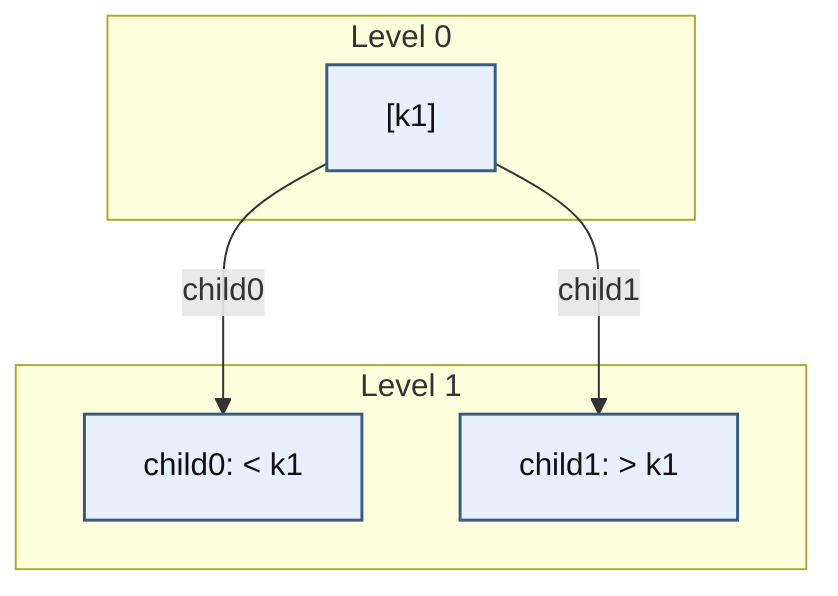

这个结构的约束非常直接：

- 左子树所有关键字 `< k1`
- 右子树所有关键字 `> k1`

------

### 6.3.3_3-node_2_个关键字_3_个孩子

3-node 内部有两个升序关键字，例如：

```text
[k1 | k2]
```

它把值域划分成三个区间：

- `< k1`
- `(k1, k2)`
- `> k2`

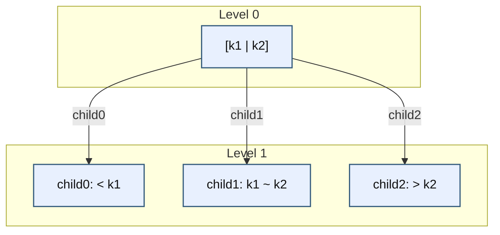

这里要特别注意：

**这不是两个 BST 节点，而是一个逻辑节点内部含两个关键字。**

------

### 6.3.4_4-node_3_个关键字_4_个孩子

4-node 内部有三个升序关键字：

```text
[k1 | k2 | k3]
```

它把值域切成四段：

- `< k1`
- `(k1, k2)`
- `(k2, k3)`
- `> k3`

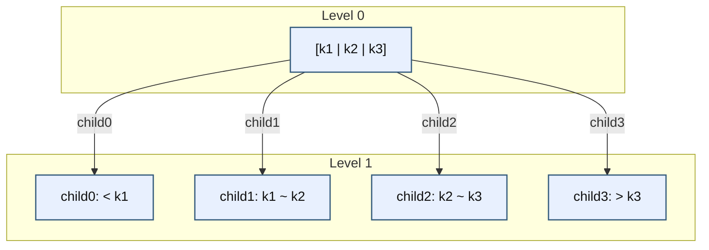

4-node 是后面插入分裂的核心对象。
因为 2-3-4 树的节点容量上界就是 3 个关键字。
再多就必须分裂。

------

### 6.3.5_节点中的关键字如何划分区间

假设节点关键字为：

```text
[k0 | k1 | k2]
```

那么它的孩子区间必须严格对应为：

- `child0`: `(-∞, k0)`
- `child1`: `(k0, k1)`
- `child2`: `(k1, k2)`
- `child3`: `(k2, +∞)`

也就是说，**孩子不是随便挂的**，它们是由关键字划分出来的区间承接者。

这就是 2-3-4 树和普通“多叉树”最根本的区别：
它不是一般树，它是**搜索树**。

------

### 6.3.6_孩子数量为什么总是比关键字数量多_1

这是一个必然结果，不是人为规定。

因为：

- 1 个关键字，把值域切成 2 段；
- 2 个关键字，把值域切成 3 段；
- 3 个关键字，把值域切成 4 段。

所以，对于非叶节点：

> **孩子数 = 关键字数 + 1**

这是搜索区间划分决定的，不是风格问题。

------

### 6.3.7_所有叶子位于同一层的含义

这条性质是 2-3-4 树平衡的核心。

它的含义不是：

- 左右对称；
- 每层节点数一样；
- 每个节点关键字数一样。

它真正表示的是：

> **从根到任何叶子的路径长度相同。**

因此，2-3-4 树不会像普通 BST 那样出现：

- 某一条路径特别深；
- 某一边连续下沉成链表。

------

### 6.3.8_2-3-4_树的平衡条件到底是什么

2-3-4 树的平衡，不是靠旋转后补救，而是靠结构定义直接保证。

其核心不变量如下：

| 不变量         | 含义                         |
| -------------- | ---------------------------- |
| 节点关键字有序 | 节点内关键字严格升序         |
| 子树区间正确   | 每个孩子子树只承接自己的区间 |
| 节点容量有上界 | 最多 3 个关键字              |
| 节点容量有下界 | 非根节点至少 1 个关键字      |
| 所有叶子同层   | 根到叶路径长度一致           |

这些条件共同保证它是“有序 + 平衡”的多路搜索树。

------

## 6.4_2-3-4_树的查找过程

### 6.4.1_为什么查找要先在单节点内部比较多个关键字

BST 每个节点只有一个关键字，所以每到一个节点时只做一次判断：

- 小于，往左；
- 大于，往右；
- 等于，命中。

但 2-3-4 树的单个节点里可能有多个关键字。
所以查找的第一步一定是：

> **先在节点内部比较，确认是否命中；若未命中，再确定应走哪个区间分支。**

也就是说，2-3-4 树的查找不是“节点二选一”，而是“节点内部局部搜索 + 多路下行”。

------

### 6.4.2_单节点内比较后如何决定下行分支

例如节点：

```text
[20 | 40 | 60]
```

查找 `50` 时：

- `50 != 20`
- `50 != 40`
- `50 != 60`
- 且 `40 < 50 < 60`

所以应该走 `(40, 60)` 这一段对应的孩子。

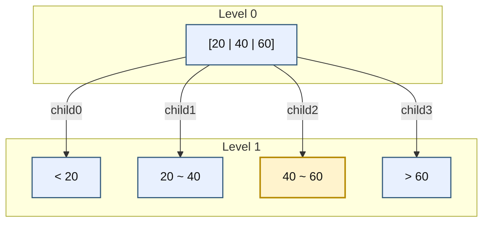

------

### 6.4.3_从根到叶的查找路径如何形成

虽然 2-3-4 树是多路树，但查找路径仍然只有一条。
因为每一层都只会选择一个孩子继续向下。

下面给一个完整例子。

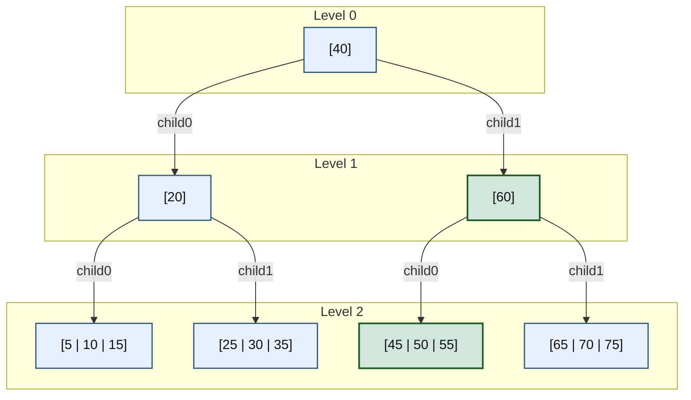

如果查找 `55`，路径就是：

- 根 `[40]`
- 右孩子 `[60]`
- 左孩子 `[45 | 50 | 55]`

------

### 6.4.4_为什么_2-3-4_树的高度通常比_BST_更低

因为 2-3-4 树的一个节点里可容纳多个关键字，
而且一个节点可有更多分支。

所以在相同关键字总数下：

- BST 每层最多把空间分成 2 段；
- 2-3-4 树每层最多把空间分成 4 段。

因此同样规模的数据，2-3-4 树通常层数更少。

------

### 6.4.5_2-3-4_树查找与_BST_查找的本质差别

它们本质上的不同，不在于“2-3-4 树多写几个 if”，而在于结构模型不同。

| 项目           | BST          | 2-3-4 树           |
| -------------- | ------------ | ------------------ |
| 单节点关键字数 | 1            | 1~3                |
| 每层分支数     | 2            | 2~4                |
| 查找动作       | 单关键字比较 | 节点内多关键字比较 |
| 树高           | 可能退化     | 叶子同层           |
| 平衡机制       | 无天然保证   | 结构天然平衡       |

------

### 6.4.6_查找算法伪代码与示例

伪代码如下：

```text
search(node, key):
    if node == null:
        return not_found

    i = 0
    while i < node.key_count and key > node.keys[i]:
        i++

    if i < node.key_count and key == node.keys[i]:
        return found

    if node is leaf:
        return not_found

    return search(node.child[i], key)
```

这个伪代码要抓住两个核心点：

1. 在当前节点中找到第一个 `>= key` 的位置；
2. 若未命中，则下降到对应区间孩子。

------

## 6.5_2-3-4_树的插入_从叶子落点到节点分裂

### 6.5.1_章节内容说明

2-3-4 树的插入，真正需要讲清楚的，不是“插进去之后图长什么样”，而是下面四件事：

第一，新关键字为什么最终落在叶子节点中。
第二，节点满了以后，分裂到底按什么规则执行。
第三，为什么有时会一路向上冲击到根。
第四，代码实现时，到底是“先插到底再回头修”，还是“沿途先修再继续下降”。

这一节必须明确：

> **2-3-4 树插入只有两种主流组织方式：自底向上插入、自顶向下插入。**

它们的树规则不是两套，
它们的区别只在于：

- **分裂发生的时机不同**
- **代码组织方式不同**
- **中间是否允许出现临时溢出节点不同**

因此，本节分成两部分来讲：

1. **自底向上插入**
2. **自顶向下插入**

每一种都给出：

- 核心思想
- 图示过程
- 算法代码

这样读者不会再被“结果先出来、细节后补”的讲法误导。

------

### 6.5.2_自底向上插入

#### (1)_核心思想

自底向上插入的组织方式是：

1. 先按查找规则一直下降到目标叶子；
2. 在叶子里尝试插入新关键字；
3. 若叶子因此溢出，则分裂该叶子；
4. 中位关键字上推到父节点；
5. 若父节点也因此溢出，则继续向上修；
6. 修复沿祖先链一路向上传播，直到某一层不再溢出，或传播到根。

因此，自底向上插入最适合讲清楚下面这条因果链：

> **叶子插入 → 节点溢出 → 分裂 → 上推 → 继续分裂**

它的优点是结构传播关系非常直观。
它的难点是代码实现时需要处理“递归返回分裂结果”。

------

#### (2)_本小节必须固定的代码约定

如果你要把自底向上写成代码，就必须先把“溢出节点如何分裂”说死。
否则像 `[40 | 60 | 80 | 120]` 这种 4-key 临时溢出节点，到底提升 `60` 还是 `80`，代码根本不唯一。

因此，本小节统一采用下面这条**确定性规则**：

> 对于一个按升序排列的 4-key 临时溢出节点
> `[a | b | c | d]`
> **提升上中位数 `c`**，分裂成：
>
> - 左节点 `[a | b]`
> - 右节点 `[d]`

也就是说：

```text
[a | b | c | d]
=> promote c
=> left  = [a | b]
=> right = [d]
```

这个约定必须在本小节一开始就固定，否则后面的代码与图示都不唯一。

请注意：

- 这只是**本小节自底向上实现的固定约定**
- 它不是唯一可能的数学分裂方式
- 但它必须是**代码中的唯一规则**

------

#### (3)_自底向上的局部分裂图

先看一个最小局部图，固定“4-key 临时溢出如何分裂”。

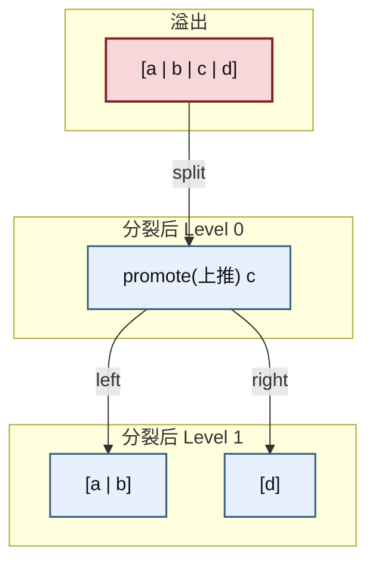

这个图对应的不是“理论想象”，而是你后面代码里必须写死的一条规则。

------

#### (4)_自底向上完整示例

下面给一个完整示例，展示：

- 插入先到叶子；
- 叶子溢出；
- 上推冲击到根；
- 根再分裂。

设当前树为：

- 根：`[40 | 80 | 120]`
- 四个叶子孩子分别为：
  - `[10 | 20]`
  - `[50 | 60 | 70]`
  - `[90 | 100]`
  - `[130 | 140]`

现在插入 `55`。

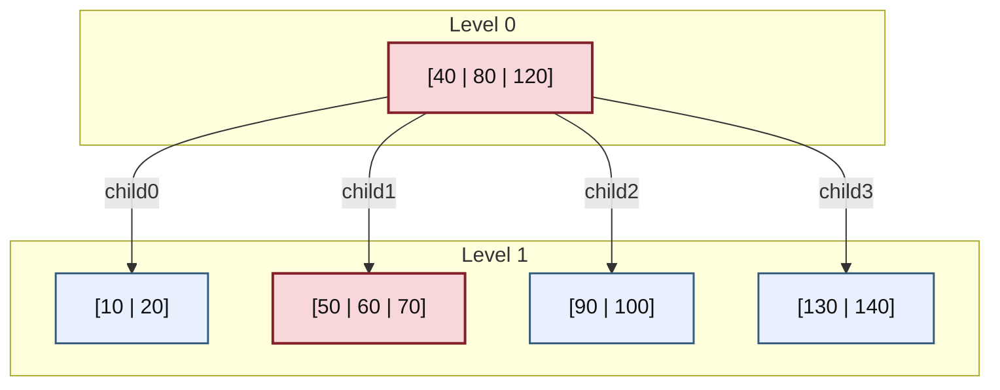

##### 1)_第一步_查找到目标叶子

`55` 满足：

- `40 < 55 < 80`

所以应进入 `child1`，也就是叶子 `[50 | 60 | 70]`。

这一点先用路径图标出来：

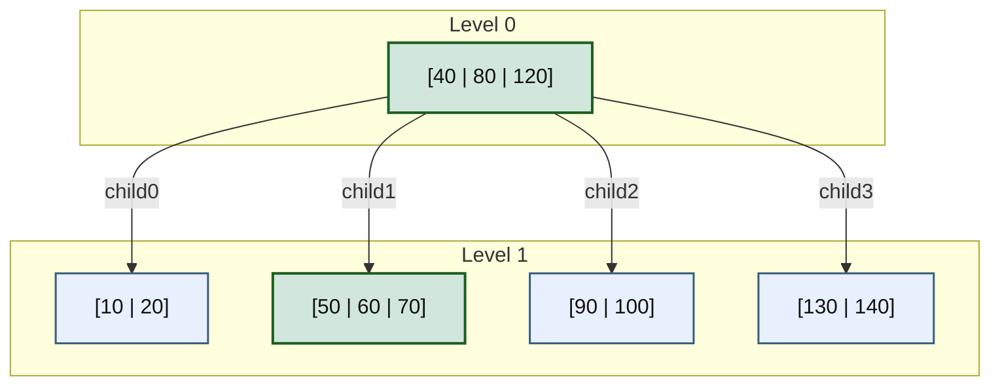

##### 2)_第二步_叶子先插入_形成临时溢出

自底向上写法里，先落到叶子再处理。
因此会先把 `55` 插入叶子 `[50 | 60 | 70]` 中，形成一个临时 4-key 溢出节点：

```text
[50 | 55 | 60 | 70]
```

把这个中间状态单独画出来：

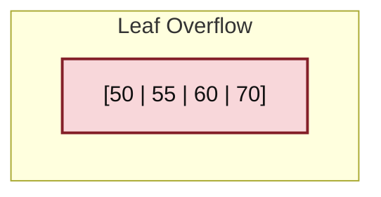

注意：

> 这个节点已经不是合法的 2-3-4 树节点。
> 它只是自底向上插入过程中，叶子“先插入、后修复”的临时溢出状态。

##### 3)_第三步_分裂叶子_并向父节点上推

根据本小节固定规则：

```text
[50 | 55 | 60 | 70]
=> promote 60
=> left  = [50 | 55]
=> right = [70]
```

于是，原根 `[40 | 80 | 120]` 接收 `60` 后，临时变为：

```text
[40 | 60 | 80 | 120]
```

并且孩子变成五个：

- `[10 | 20]`
- `[50 | 55]`
- `[70]`
- `[90 | 100]`
- `[130 | 140]`

临时状态如下：

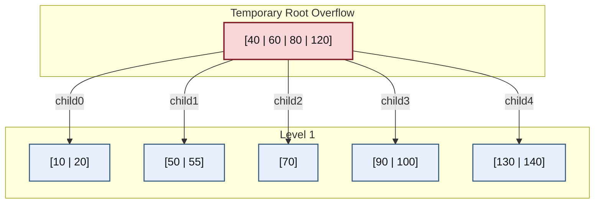

##### 4)_第四步_根节点继续分裂

根现在是一个临时 4-key 溢出节点：

```text
[40 | 60 | 80 | 120]
```

仍按本小节固定规则：

```text
promote 80
left  = [40 | 60]
right = [120]
```

于是得到最终树：

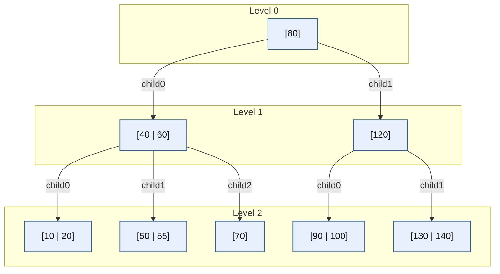

这个例子完整体现了自底向上的特征：

- 先落到叶子；
- 叶子先溢出；
- 分裂后向上推；
- 根再被冲击并分裂。

------

#### (5)_自底向上插入算法代码

下面给出一种适合直接编码的伪代码写法。
它采用的是**自底向上插入**思路，也就是：

1. 先递归下降到目标叶子；
2. 叶子先尝试插入；
3. 若叶子溢出，则在当前层完成分裂；
4. 把“分裂结果”返回给父节点；
5. 父节点接收后若也溢出，则继续向上分裂；
6. 一直传播到根，必要时创建新根。

它的核心思想可以概括成一句话：

> **递归函数不仅负责“往下插入”，还负责把“子树分裂结果”往上带回。**

------

##### 1)_返回结构

```cpp
struct split_result {
	bool 	 did_split;   // 当前节点是否发生了分裂
	int 	 promote_key; // 若分裂，则需要向父节点上推的关键字
	node_234 *right_node; // 若分裂，则新产生的右兄弟节点
};
```

###### a)_解释

这个结构的作用，是让递归函数在“返回上一层”时，顺便把分裂信息一并带回去。

如果某个子节点没有分裂，那么父节点什么都不用做：

```cpp
{ false, 0, nullptr }
```

如果某个子节点分裂了，那么父节点就必须知道三件事：

1. **确实发生了分裂**
2. **哪个 key 要插入到父节点**
3. **新产生的右兄弟是谁**

因此这里不是普通“插入成功/失败”的返回值，而是一个**插入 + 修复传播状态**。

------

##### 2)_递归插入伪代码

```cpp
split_result insert_bottom_up(node_234 *node, int key)
{
	int i = 0;

	// 在当前节点中找到 key 应该进入的孩子编号 i
	// 若当前节点 keys = [k0, k1, ...]，则最终会找到：
	// child[i] 是 key 所属的目标子树
	while (i < node->key_count && key > node->keys[i])
		++i;

	// 情况 1：当前节点已经是叶子
	// 那么自底向上的做法就是：先把 key 插进去，再判断是否溢出
	if (node->leaf) {
		insert_key_into_node(node, key);

		// 若插入后 key_count <= 3，说明当前节点仍然合法
		// 不需要继续向上修复
		if (node->key_count <= 3)
			return { false, 0, nullptr };

		// 若插入后 key_count == 4，说明当前节点临时溢出
		// 需要在当前层执行分裂，并把分裂结果返回给父节点
		return split_overflow_node(node);
	}

	// 情况 2：当前节点不是叶子
	// 先递归把 key 插入到目标子树中
	split_result child_res = insert_bottom_up(node->child[i], key);

	// 如果子节点没有分裂，说明下面那棵子树已经处理完毕
	// 当前节点无需额外修复，直接返回“未分裂”
	if (!child_res.did_split)
		return { false, 0, nullptr };

	// 如果子节点分裂了，那么当前节点必须“接收”这个分裂结果：
	// 1. 把 promote_key 插入到当前节点的 keys[]
	// 2. 把 right_node 挂到正确的位置
	insert_promote_into_parent(node, i, child_res.promote_key, child_res.right_node);

	// 接收完子节点的上推之后，检查当前节点自己是否溢出
	if (node->key_count <= 3)
		return { false, 0, nullptr };

	// 如果当前节点也溢出了，则继续在当前层分裂，
	// 把新的分裂结果再向上一层返回
	return split_overflow_node(node);
}
```

###### a)_解释

这段代码可以按“叶子逻辑”和“内部节点逻辑”两部分理解。

------

###### b)_第一部分_叶子逻辑

如果当前节点是叶子，那么说明查找已经到底了。
这时自底向上的策略是：

- **先插入**
- **再检查是否溢出**

所以叶子部分的流程是：

1. 调用 `insert_key_into_node(node, key)`，把 key 插入当前叶子；
2. 若当前节点插入后仍然只有 1~3 个 key，则合法，直接返回“不分裂”；
3. 若当前节点插入后变成 4 个 key，则说明发生临时溢出，调用 `split_overflow_node()` 在当前层分裂，并把结果返回给父节点。

这正是“自底向上”的本质特征：

> **先让叶子出问题，再把问题往上交。**

------

###### c)_第二部分_内部节点逻辑

如果当前节点不是叶子，那么当前层本身不直接插入 key，
而是先递归把 key 插到某个子节点中去。

这里的关键点是：

> **内部节点并不直接知道子树内部发生了什么，它只能通过 `child_res` 来知道子树是否分裂。**

所以内部节点的处理流程是：

1. 递归下降到目标子树；
2. 看 `child_res.did_split`：
   - 若为 `false`，说明子树已经插完且未分裂，当前层不用管；
   - 若为 `true`，说明子树裂开了，当前层必须接住上推的 key 和新右兄弟；
3. 接住后，当前节点自己也可能因此溢出；
4. 若自己也溢出，则继续分裂并把结果往上返回。

也就是说，这段代码把“向下插入”和“向上修复”合在了一个递归函数里完成。

------

##### 3)_顶层入口伪代码

```cpp
void tree_insert_bottom_up(tree_234 &tree, int key)
{
	// 空树情况：直接创建根节点
	if (tree.root == nullptr) {
		tree.root = create_leaf_with_one_key(key);
		return;
	}

	// 从根开始执行自底向上插入
	split_result res = insert_bottom_up(tree.root, key);

	// 如果根节点最终没有分裂，那么整棵树已经修复完毕
	if (!res.did_split)
		return;

	// 如果根节点也分裂了，就说明原根已经无法继续作为根存在
	// 此时必须新建一个根节点，把上推 key 放进去
	node_234 *new_root = create_internal_node();
	new_root->key_count = 1;
	new_root->keys[0] = res.promote_key;

	// 新根的左孩子仍然是“原来的根（被截断后的左半部分）”
	new_root->child[0] = tree.root;

	// 新根的右孩子是根分裂后新产生的右兄弟
	new_root->child[1] = res.right_node;

	// 更新整棵树的根指针
	tree.root = new_root;
}
```

###### a)_解释

顶层入口的作用很单纯：

- 先调用递归插入；
- 最后只关心一件事：**原来的根有没有分裂**。

如果根没有分裂，那么树高不变，事情结束。
如果根分裂了，说明整个分裂传播已经冲到了最顶层。

这时原来的根已经不够当根用了，因此必须：

1. 新建一个根节点；
2. 把根分裂产生的 `promote_key` 放到新根中；
3. 把旧根当作新根左孩子；
4. 把新生成的右兄弟挂到新根右边。

这也是为什么：

> **只有根分裂，才会让树高增加 1。**

因为只有在这里，代码显式 `new` 了一个新的上层根节点。

------

##### 4)_溢出节点分裂伪代码

这里明确使用本小节固定规则：

> 对 `[a | b | c | d]` 提升 `c`。

```cpp
split_result split_overflow_node(node_234 *node)
{
	// 假设 node 当前临时有 4 个 key：k0, k1, k2, k3
	// 本小节固定规则：提升 k2
	int promote = node->keys[2];

	// 新建右兄弟节点，叶子属性与当前节点一致
	node_234 *right = create_node(node->leaf);

	// 右节点拿最右边的 key：k3
	right->key_count = 1;
	right->keys[0] = node->keys[3];

	if (!node->leaf) {
		// 如果当前节点不是叶子，那么分裂时不仅要分 key，还要分孩子
		// 固定规则如下：
		// left  保留 child0, child1, child2
		// right 得到 child3, child4
		right->child[0] = node->child[3];
		right->child[1] = node->child[4];
	}

	// 左节点保留 k0, k1
	// 这里不需要真的搬动 k0, k1，因为它们本来就在 node 里
	// 只要把 key_count 截断为 2，就等价于左边保留 [k0, k1]
	node->key_count = 2;

	// 返回给父节点：
	// 1. 当前节点发生了分裂
	// 2. 需要上推的 key 是 promote
	// 3. 新产生的右兄弟是 right
	return { true, promote, right };
}
```

###### a)_解释

这个函数是整个自底向上插入里最关键的“局部修复动作”。

它做的事情可以概括成三步：

1. **决定谁上推**
2. **构造右兄弟**
3. **截断左节点**

------

###### b)_第一步_决定谁上推

当前临时溢出节点有 4 个 key：

```text
[k0 | k1 | k2 | k3]
```

本小节规定提升 `k2`，
也就是把第三个 key 作为向父节点报告的 `promote_key`。

这一步如果不先固定，后面的代码根本没法唯一实现。

------

###### c)_第二步_构造右兄弟

右兄弟只拿最右边的 key：

```text
[k3]
```

如果当前节点不是叶子，还必须把最右边两棵孩子也移交给右兄弟。
因为 key 分开了，孩子区间也必须跟着重新分配。

------

###### d)_第三步_截断左节点

左节点保留：

```text
[k0 | k1]
```

这里代码没有显式地再复制一份左节点，
因为当前 `node` 本身就继续充当左节点。
只要把 `key_count` 改成 `2`，它逻辑上就已经变成左半部分了。

所以这段代码体现的是一个常见工程技巧：

> **分裂时往往复用原节点作为左节点，只新建右节点。**

这样能少分配一半对象，也更符合实际实现习惯。

------

##### 5)_这一组代码整体上到底在做什么

把这四段代码连起来看，其实就是一个完整的“递归上传修复协议”：

- 叶子先插入；
- 叶子若溢出，则本层分裂；
- 分裂结果返回给父节点；
- 父节点接住后，若自己也溢出，则继续分裂；
- 一直传播到根；
- 根若分裂，则新建根。

你可以把它理解成一条非常稳定的控制流：

```text
先往下找到叶子
-> 再从出问题的地方开始逐层往上修
-> 若根也被冲击，则补一个新根
```

这就是“自底向上插入”的代码本质。

------

### 6.5.3_自顶向下插入

#### (1)_核心思想

自顶向下插入与自底向上最大的区别，不在“树规则”，而在“分裂时机”。

它的组织方式是：

1. 从根开始下降；
2. 每次准备进入某个孩子前，先检查该孩子是否已满；
3. 如果目标孩子已满，就**先分裂这个孩子**；
4. 分裂后，当前父节点会新增一个关键字，于是重新判断接下来应走左边还是右边；
5. 始终保证：真正进入的下一个节点一定不是满节点；
6. 最终到达叶子时，叶子一定非满，因此可以直接完成插入。

因此，自顶向下插入的核心不变量是：

> **下降过程中不进入满节点。**

这也是工程实现中更常见的组织方式，因为它更容易写成稳定代码。

------

#### (2)_本小节必须固定的代码约定

自顶向下插入时，不允许先出现 4-key 临时溢出节点再去决定“提升谁”。
它分裂的对象永远是一个**合法的满节点**，即恰好 3 个 key 的节点。

对于一个满节点：

```text
[a | b | c]
```

本小节固定规则是：

> **提升中间关键字 `b`**

分裂为：

- 左节点 `[a]`
- 右节点 `[c]`

即：

```text
[a | b | c]
=> promote b
=> left  = [a]
=> right = [c]
```

这个规则与标准 B-tree `split_child()` 写法一致。
它是唯一的、无歧义的，因为 3-key 节点只有一个中间关键字。

这里必须再强调一次：

- 自顶向下分裂的是**满节点**
- 满节点只有 3 个 key
- 所以“谁上推”在代码里是唯一确定的

这正是它比自底向上更容易直接编码的一个重要原因。

------

#### (3)_自顶向下的局部分裂图

先固定局部规则：

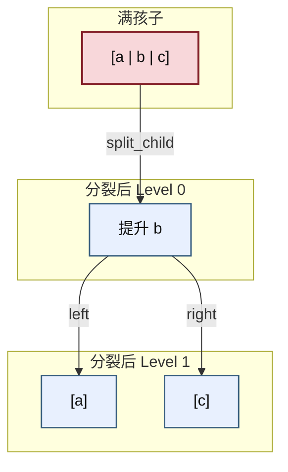

这张图对应的，就是后面代码里的 `split_child(parent, i)` 逻辑。

需要注意的是，这张图表达的不是“父节点自己被分裂”，而是：

> **父节点的第 `i` 个孩子被分裂，其中间 key 被插入父节点。**

也就是说，`split_child(parent, i)` 的语义是：

- `parent->child[i]` 原来是满节点 `[a | b | c]`
- 分裂后：
  - 左半部分仍留在 `child[i]`
  - 新生成右兄弟挂到 `child[i + 1]`
  - `b` 被插入 `parent->keys[]`

------

#### (4)_自顶向下完整示例

仍然使用与前面相同的初始树和相同的插入关键字 `55`，这样你能直接比较两种方法的区别。

设当前树为：

- 根：`[40 | 80 | 120]`
- 四个叶子孩子分别为：
  - `[10 | 20]`
  - `[50 | 60 | 70]`
  - `[90 | 100]`
  - `[130 | 140]`


##### 1)_第一步_根已满_先分裂根

在 **自顶向下插入** 中：

> **只要根节点已满，就先分裂根。**

它不是因为当前插入的 `55` 已经“算出来一定会把根撑爆”。
 而是因为自顶向下算法要强行维持一个不变量：

> **后续下降过程中，不进入满节点。**

根节点是整条下降路径的起点。

> 如果根本身就是满节点，那么它首先就不满足这条不变量，所以必须先处理。

根是满节点 `[40 | 80 | 120]`，
自顶向下写法会在下降前先分裂根。

按固定规则：

```text
[40 | 80 | 120]
=> promote 80
=> left  = [40]
=> right = [120]
```

得到：

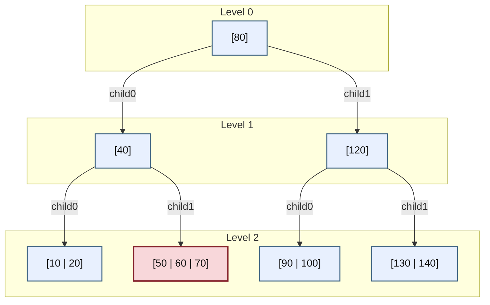

此时根已经稳定，后面 `60` 不会再有机会去决定“谁做新根”。

这一步非常关键，因为它说明：

> 自顶向下代码不会先把根变成一个 4-key 临时溢出节点，再临时决定谁上推。
> 它一开始就把满根按固定规则拆开了。

##### 2)_第二步_继续查找_准备进入目标孩子

插入 `55`：

- 在根 `[80]` 中比较，`55 < 80`，进入左子树 `[40]`
- 在 `[40]` 中比较，`55 > 40`，准备进入右孩子 `[50 | 60 | 70]`

但该目标孩子已经满了。
所以自顶向下算法不会立即进入，而是**先分裂这个孩子**。

这里要注意，当前的控制顺序是：

1. 先决定目标孩子是谁；
2. 检查该孩子是否满；
3. 若满，则在当前层先拆这个孩子；
4. 再决定继续往哪边走。

不是“先走进去，再看里面怎么裂”。

##### 3)_第三步_分裂目标孩子_再重新判定路径

对满孩子 `[50 | 60 | 70]` 分裂：

```text
[50 | 60 | 70]
=> promote 60
=> left  = [50]
=> right = [70]
```

`60` 上推到父节点 `[40]`，父变成 `[40 | 60]`。

局部结构变为：

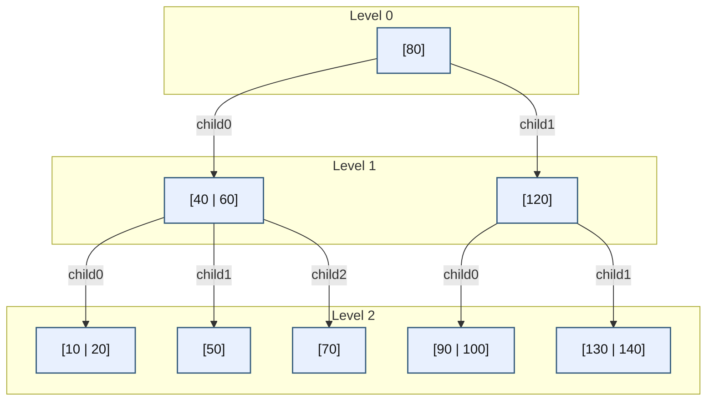

现在重新判断 `55` 的去向：

- `40 < 55 < 60`

所以它应进入中间孩子 `[50]`。

这里必须重新判断路径，原因是：

> 分裂前，父节点只有 `[40]`
> 分裂后，父节点变成 `[40 | 60]`
> 区间划分已经改变，因此不能沿用分裂前的孩子编号。

这也是自顶向下实现里最容易漏掉的一步。

##### 4)_第四步_最终在非满叶子中落位

当前叶子 `[50]` 不是满节点，
所以直接插入：

```text
[50] -> [50 | 55]
```

最终得到：


这个例子说明：

- 根先分裂；
- 后面子节点再分裂；
- 最终新 key 仍然只是在叶子中落位；
- 整个过程中，不会出现“先有 `[40 | 60 | 80 | 120]` 再决定谁做根”的代码状态。

------

#### (5)_自顶向下插入算法代码

自顶向下写法最经典的结构，就是：

- 若根满，先 `split root`
- 之后调用 `insert_non_full()`
- 在 `insert_non_full()` 里，下降前若目标孩子满，则先 `split_child()`

它和自底向上最大的代码差别在于：

> **它不需要通过返回值把分裂结果往上传。**
> 因为每次分裂都在“下降之前”已经处理完了。

在 **自顶向下插入** 中：

> **只要根节点已满，就先分裂根。**

它不是因为当前插入的 节点 已经“算出来一定会把根撑爆”。
 而是因为自顶向下算法要强行维持一个不变量：

> **后续下降过程中，不进入满节点。**

根节点是整条下降路径的起点。
 如果根本身就是满节点，那么它首先就不满足这条不变量，所以必须先处理。

##### 1)_顶层入口伪代码

当前接口只处理根节点，不适用处理子树根节点的通用情况：

```cpp
void tree_insert_top_down(tree_234 &tree, int key)
{
	// 空树情况：直接创建一个只有 1 个 key 的叶子根节点
	if (tree.root == nullptr) {
		tree.root = create_leaf_with_one_key(key);
		return;
	}

	// 如果根节点已满，则不能直接往下走
	// 必须先拆根，保证后续下降时不会进入满节点
	if (tree.root->key_count == 3) {
		node_234 *new_root = create_internal_node();

		// 旧根先挂到新根的 child0，随后 split_child() 会把它拆开
		new_root->child[0] = tree.root;

		// 分裂 old root：
		// old root = [a | b | c]
		// promote b
		// left = [a], right = [c]
		split_child(new_root, 0);

		// 分裂之后，新根就成为整棵树的新入口
		tree.root = new_root;
	}

	// 经过上面的处理后，root 一定不是满节点
	// 于是可以安全地进入“向非满节点插入”的流程
	insert_non_full(tree.root, key);
}
```

###### a)_解释

这段代码只做两件事：

第一，处理空树。
第二，处理“根已满”的特殊情况。

这里最关键的是第二点。
因为自顶向下插入要求：

> **下降时不进入满节点。**

而根节点正是整条下降路径的起点。
所以如果根本身已满，就必须在任何递归下降之前先把它分裂掉。

这也是为什么自顶向下代码里，根分裂会显得“发生得很早”：
不是因为根在结构上更特殊，而是因为代码组织要求先把入口节点处理成非满状态。

##### 2)_insert_non_full_伪代码

在这里就是在递归解决子树根节点，查找、裂变判断和插入操作。

```cpp
void insert_non_full(node_234 *node, int key)
{
	// 情况 1：当前节点是叶子
	// 由于自顶向下算法保证“进入的节点一定不是满节点”，
	// 因此这里可以直接插入，不必再担心叶子溢出
	if (node->leaf) {
		insert_key_into_node(node, key);
		return;
	}

	// 情况 2：当前节点不是叶子
	// 先找出 key 应当进入哪个孩子
	int i = find_child_index(node, key);

	// 如果目标孩子是满节点，则不能直接进入
	// 必须先分裂这个孩子
	if (node->child[i]->key_count == 3) {
		split_child(node, i);

		// 分裂之后，原 child[i] 被拆成：
		// left child  仍在 child[i]
		// right child 挂到 child[i+1]
		// 同时中间 key 被提升到了 node->keys[i]
		//
		// 这时必须重新判断 key 应进入左边还是右边
		if (key > node->keys[i])
			++i;
	}

	// 经过上面的处理后，node->child[i] 一定不是满节点
	// 可以安全地继续递归下降
	insert_non_full(node->child[i], key);
}
```

###### a)_解释

这段代码是自顶向下插入的主体。
它的控制流可以概括成一句话：

> **先检查前方节点是否合法，再决定是否进入。**

如果当前节点是叶子，那么说明已经到达最终落点。
而由于前面已经保证不会进入满节点，因此这里可以直接插入，不需要再判断是否分裂。

如果当前节点是内部节点，那么必须先找到目标孩子编号 `i`。
但找到以后还不能立刻进入它，而是要先检查：

```cpp
node->child[i]->key_count == 3
```

若这个孩子已满，则必须先调用 `split_child(node, i)`。
分裂后，父节点结构改变，因此还要重新判断 key 应进入左子还是右子。
这就是：

```cpp
if (key > node->keys[i])
	++i;
```

这一句的来源。

所以这里最本质的逻辑不是“向下递归”，而是：

> **递归之前先修路。**

##### 3)_split_child_伪代码

这里明确对应规则：

```text
[a | b | c]
=> promote b
=> left  = [a]
=> right = [c]
void split_child(node_234 *parent, int i)
{
	// parent->child[i] 必须是一个满节点
	node_234 *full = parent->child[i];

	// 新建右兄弟，叶子属性与原节点一致
	node_234 *right = create_node(full->leaf);

	// 满节点 full 当前有 3 个 key：
	// full = [a | b | c]
	// 固定规则：提升中间 key b
	int promote = full->keys[1];

	// 右兄弟拿最右边 key c
	right->key_count = 1;
	right->keys[0] = full->keys[2];

	// 原节点 full 继续作为左节点，只保留最左边 key a
	full->key_count = 1;

	// 如果 full 不是叶子，则孩子也要跟着重分配
	// 原来:
	// full.child[0], full.child[1], full.child[2], full.child[3]
	// 分裂后:
	// left  保留 child0, child1
	// right 得到 child2, child3
	if (!full->leaf) {
		right->child[0] = full->child[2];
		right->child[1] = full->child[3];
	}

	// 现在需要把 promote 插入到 parent 的 keys[] 中，
	// 并把 right 插入到 parent 的 child[] 中
	insert_key_and_right_child_into_parent(parent, i, promote, right);
}
```

###### a)_解释

`split_child()` 是自顶向下写法中最关键的局部修复操作。
它的语义不是“把当前节点分裂”，而是：

> **把当前节点的第 `i` 个满孩子分裂。**

这点一定要理解清楚。

它做的事情可以拆成四步：

第一，读取满孩子 `full = parent->child[i]`。
第二，取出其中间 key `full->keys[1]` 作为上推 key。
第三，复用原节点作为左节点，新建一个右兄弟节点。
第四，把上推 key 插入 `parent`，把新右兄弟挂到 `parent->child[i+1]`。

如果被分裂的是内部节点，还必须同步搬迁孩子。
否则 key 分裂以后，孩子区间就会错位。

这段代码最重要的价值在于：

> **它让“上推谁”这件事完全由数组下标决定，而不是靠图形想象。**

所以当你在代码里看到：

```cpp
int promote = full->keys[1];
```

你就应当立刻理解：

- 这里不是“随便选一个”
- 也不是“看图哪个更顺眼”
- 而是**满节点只有 3 个 key，中间 key 唯一确定**

------

### 6.5.4_两种方式的关系

#### (1)_它们的树规则不是两套

无论自底向上还是自顶向下，下面这些规则都不变：

- 新关键字的最终落位仍然发生在叶子；
- 内部节点关键字增加仍然来自子节点分裂上推；
- 节点满时必须分裂；
- 根分裂是唯一会使整棵树增高的分裂。

所以它们不是两种不同的树。

------

#### (2)_它们的区别只在分裂时机

##### 1)_自底向上

- 先落叶；
- 叶子先溢出；
- 然后回头一路向上修。

##### 2)_自顶向下

- 沿途先拆满节点；
- 不进入满孩子；
- 到叶子时直接稳定落位。

所以它们的核心差别不是“树规则变了”，而是：

> **修复动作到底安排在“问题发生之后”，还是“问题发生之前”。**

------

#### (3)_写代码时通常更偏向哪一种

如果目标是：

- 写出稳定代码；
- 减少回溯状态；
- 保持过程可预测；

那么工程上通常更偏向：

> **自顶向下 split-before-descend**

因为它有一个非常稳定的不变量：

> **真正进入的目标节点始终不是满节点。**

这会让代码结构明显更规整。

而自底向上更适合理解结构因果传播，尤其适合理解：

- 为什么分裂会向上传播；
- 为什么根最后也可能被冲击；
- 为什么根分裂会让树高增加 1。

------

### 6.5.5_本节小结

这一节必须记住下面七点。

第一，2-3-4 树插入确实只有两种主流组织方式：**自底向上** 与 **自顶向下**。
第二，两者的树规则相同，区别只在于**何时分裂**。
第三，自底向上是“先插到底，再回头修”，因此更容易展示结构传播链。
第四，自顶向下是“沿途先修，再继续下降”，因此更容易直接编码。
第五，自底向上若允许出现 4-key 临时溢出节点，就必须事先固定“提升谁”的代码规则。
第六，自顶向下分裂的对象始终是合法满节点 `[a | b | c]`，提升的始终是唯一的中间关键字 `b`。
第七，若目标是工程实现和可编码化表达，通常更推荐先掌握**自顶向下写法**，再回过头用**自底向上视角**理解结构传播。

------

## 6.6_2-3-4_树的删除_借位_合并与向下修复

### 6.6.1_为什么删除比插入更复杂

插入的核心问题是“节点装不下”。
删除的核心问题是“节点删空了怎么办”。

更具体地说，删除有两个复杂点：

1. 删除内部关键字时，不能直接破坏区间划分；
2. 删除后可能导致节点关键字数低于下界。

因此删除通常比插入更难。

------

### 6.6.2_删除关键字时为什么常常先转换成叶子删除

如果目标关键字位于内部节点，直接删掉会破坏该节点对子树的区间划分。
所以常见处理方式是：

- 用前驱替换；
- 或用后继替换；
- 然后转成叶子层删除。

这样真正执行“物理删掉一个关键字”的位置，通常落在叶子层。

------

### 6.6.3_删除前为什么要先保证_下行路径不落到_2-node

2-node 只有 1 个关键字。
如果你下降到一个 2-node，再删掉其中关键字，它就会变成 0-key 节点，立即非法。

因此删除算法采用的稳定纪律是：

> **下降之前，保证即将进入的孩子不是 2-node。**

如果它是 2-node，就必须先修复，再进入。

这与插入中的“下降前不进入满节点”是对偶关系。

------

### 6.6.4_什么叫借位(redistribution)

借位的含义是：

- 当前准备进入的孩子是 2-node；
- 但它的某个兄弟不是最小节点，而是还有多余关键字；
- 于是从兄弟那边“借”一个关键字，通过父节点重新分配。

例如：

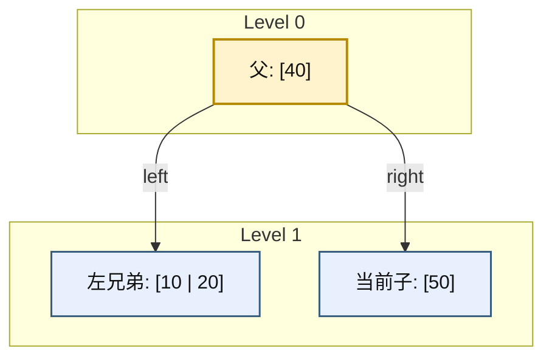

借位后会变成：

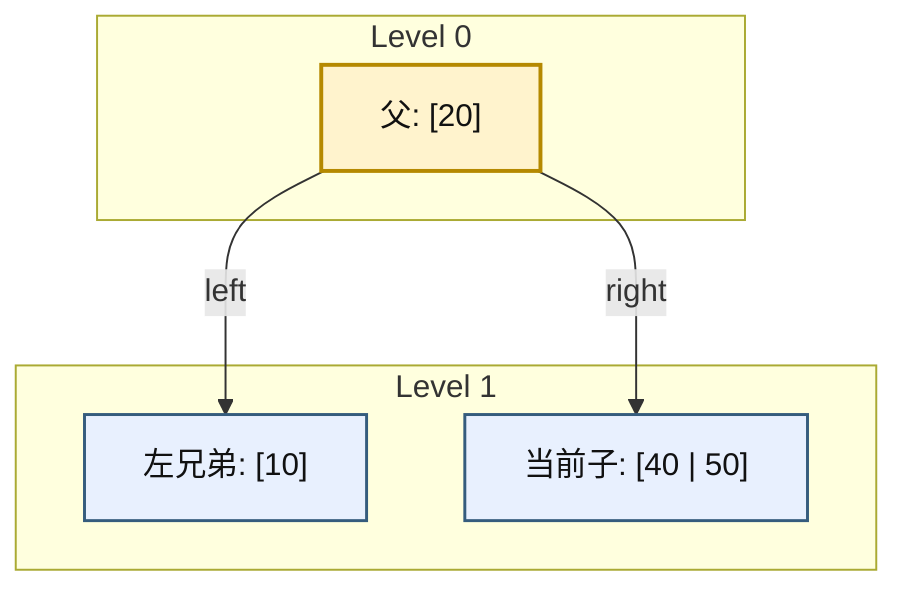

这里不是兄弟“直接给当前子一个数”，
而是：

- 兄弟给父；
- 父再给当前子。

------

### 6.6.5_什么叫合并(merge)

如果兄弟也没有多余关键字，借不到，就只能合并。

合并的含义是：

- 把父节点中间那个分隔关键字下移；
- 和当前 2-node 以及兄弟节点合成一个更大的节点；
- 父节点少一个关键字，少一个孩子。

例如：

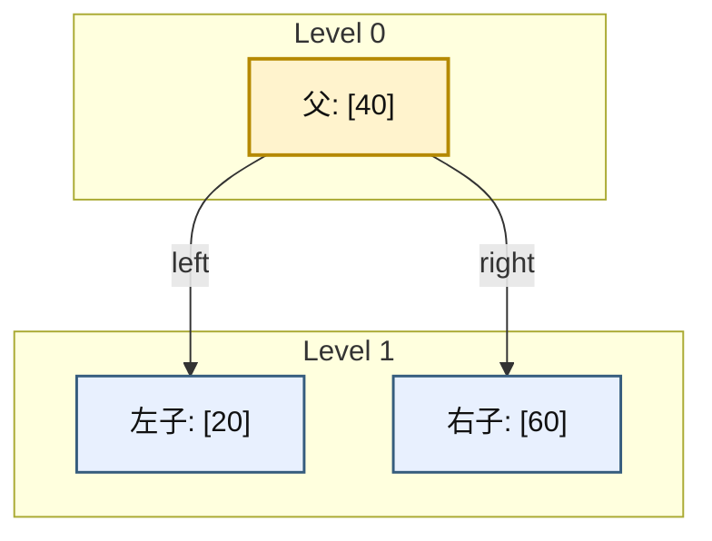

合并后：

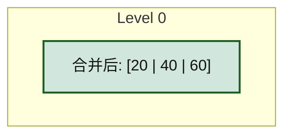

------

### 6.6.6_兄弟节点可借位时的处理逻辑

若准备下降的孩子是 2-node，优先看兄弟能否借。

#### (1)_左兄弟可借

- 左兄弟关键字数至少 2；
- 父中的分隔关键字下移到当前子；
- 左兄弟最大关键字上移到父。

#### (2)_右兄弟可借

- 右兄弟关键字数至少 2；
- 父中的分隔关键字下移到当前子；
- 右兄弟最小关键字上移到父。

如果不是叶子，还必须同步移动孩子指针。

------

### 6.6.7_兄弟节点不可借位时的合并逻辑

若左右兄弟都只有 1 个关键字，则都没有冗余。
这时只能：

- 当前子 + 父中分隔关键字 + 某个兄弟
- 三者合并成一个 4-node

如果父因此关键字数减到下界以下，问题还会继续向上传播。

------

### 6.6.8_根节点缩减的含义

删除中还有一个特殊边界：**根缩减**。

当根只剩 1 个关键字，且两个孩子都是 2-node 时，合并后根可能被清空。
这时新合并出来的节点直接成为根。

```mermaid
graph TD
	subgraph "Before Level 0"
		R["旧根: [40]"]
	end

	subgraph "Before Level 1"
		L["[20]"]
		RR["[60]"]
	end

	subgraph "After Level 0"
		N["新根: [20 | 40 | 60]"]
	end

	R -->|"left"| L
	R -->|"right"| RR
	R -->|"merge"| N

	classDef root_old fill:#f8d7da,stroke:#842029,color:#111,stroke-width:2px;
	classDef root_new fill:#d1e7dd,stroke:#1b5e20,color:#111,stroke-width:2px;
	classDef node_234 fill:#e8f0fe,stroke:#355c7d,color:#111,stroke-width:1.5px;
	class R root_old;
	class L,RR node_234;
	class N root_new;
```

这意味着：

- 整棵树高度减少 1；
- 但所有叶子仍然同层。

------

### 6.6.9_删除算法的完整诊断与修复流程

这一小节不能只写成一句“先查找、再借位、再合并”。
因为 2-3-4 树删除真正困难的地方，不在动作名词，而在：

- **什么时候必须先处理 2-node**
- **什么时候可以直接继续下降**
- **什么时候要把内部节点删除转换成叶子删除**
- **什么时候根会收缩**

如果这些判断条件不写清楚，读者看到“借位 / 合并”三个字，仍然不知道代码该怎么组织。

因此，本小节统一采用**自顶向下删除**口径，并把完整流程整理成：

1. 固定删除不变量；
2. 固定诊断顺序；
3. 固定修复动作；
4. 用具体示例把每一步跑通。

------

#### (1)_本小节采用的删除口径

本小节默认采用 **自顶向下删除**。
它的核心纪律不是“删完了再补”，而是：

> **在准备下降到某个孩子之前，先保证这个孩子不是 2-node。**

这里的理由必须先说死：

- 2-node 只有 1 个关键字；
- 如果你直接下降到一个 2-node，再把其中关键字删掉，它就会变成 0-key 非法节点；
- 因此删除时不能等“删坏了再救”，而要在下降前就把风险消掉。

所以自顶向下删除的真正不变量是：

> **真正进入的目标孩子，必须至少有 2 个关键字。**

这和前面自顶向下插入的“不进入满节点”是完全对应的。

------

#### (2)_先把完整流程写成一句可执行的话

自顶向下删除可以压缩成下面这句“代码化语言”：

> 从根开始查找目标 key；若当前 key 在内部节点中，则先把删除转换成前驱/后继所在子树中的叶子删除；每次准备下降到某个孩子前，若该孩子是 2-node，则先通过兄弟借位或与兄弟及父关键字合并，把它变成非 2-node；随后继续下降；最终在叶子层删除；若根在过程中被清空，则收缩根。

这一句已经比“先借位再合并”更精确，但还不够。
下面必须拆成可检查的步骤。

------

#### (3)_完整诊断顺序

删除时的诊断顺序固定如下。

##### 1)_第一步_在当前节点内部定位_key

在当前节点 `node` 中，先找第一个满足：

```text
node.keys[i] >= key
```

的位置。

此时有两种情况：

- 若 `node.keys[i] == key`，说明目标 key 就在当前节点中；
- 若未命中，则说明目标 key 若存在，一定在某个孩子子树中。

这一步和查找过程完全相同，没有特殊之处。

------

##### 2)_第二步_若当前节点命中_key_先判断它是叶子还是内部节点

若当前节点就是目标 key 所在节点，则分两类：

###### a)_情况_A_当前节点是叶子

这时可以直接删除当前 key。
因为它不会破坏更下层子树区间。

###### b)_情况_B_当前节点是内部节点

这时不能直接把 key 从当前节点抠掉。
因为当前 key 同时是孩子区间的分隔点。
所以必须先把“内部删除”转换成“叶子删除”。

常见做法有两种：

- 用左子树中的**前驱**替换当前 key；
- 或用右子树中的**后继**替换当前 key。

替换后，真正要物理删除的对象就被转移到了更下层，通常最终落到叶子。

所以这里不是“内部节点也能直接删”，而是：

> **内部命中时，通常先转成前驱 / 后继删除。**

------

##### 3)_第三步_若准备下降到某个孩子_先检查该孩子是否为_2-node

这是整个自顶向下删除里最关键的诊断点。

设当前准备进入：

```text
child[i]
```

此时必须先判断：

```text
child[i].key_count == 1 ?
```

如果答案是“否”，说明这个孩子不是 2-node，
可以直接进入。

如果答案是“是”，说明它是 2-node，
此时不能直接进入，必须先处理。

------

##### 4)_第四步_若目标孩子是_2-node_先决定_借位还是合并

若目标孩子是 2-node，则看它相邻兄弟是否有富余关键字。

###### a)_情况_A_某个相邻兄弟至少有_2_个关键字

这说明兄弟不是 2-node，有冗余。
那么可以执行**借位**：

- 父节点中间分隔 key 下移到当前 2-node；
- 兄弟中一个 key 上移到父节点；
- 若不是叶子，还要同步移动一棵孩子子树。

###### b)_情况_B_相邻兄弟都只有_1_个关键字

这说明左右兄弟也都是 2-node，无法借位。
那么只能执行**合并**：

- 把父节点中间分隔 key 下移；
- 与当前 2-node 及相邻 2-node 合成一个更大的节点；
- 父节点失去一个 key 和一个 child。

所以借位与合并的诊断条件可以写得非常明确：

| 目标孩子 | 兄弟情况                         | 动作 |
| -------- | -------------------------------- | ---- |
| 2-node   | 有兄弟可借（兄弟 key_count ≥ 2） | 借位 |
| 2-node   | 左右兄弟都不可借                 | 合并 |

------

##### 5)_第五步_保证目标孩子不再是_2-node_后_再继续下降

一旦借位或合并完成，原来准备进入的那条路径就被“修安全”了。
此时才允许继续进入对应子树。

因此删除控制流不是：

```text
先进入，再看坏没坏
```

而是：

```text
先检查目标孩子
如果它危险，就先修
修好后再进入
```

这就是自顶向下删除的本质。

------

##### 6)_第六步_最终在叶子层完成物理删除

因为前面已经把内部删除转换成前驱 / 后继删除，
并且一路下降时保证“不会落到危险 2-node 中”，
所以最终的物理删除通常发生在叶子层。

这一步才是：

- 真正移除 key；
- 更新节点 key_count；
- 完成删除落地。

------

##### 7)_第七步_若根被清空_则收缩根

如果某次合并把根节点最后一个 key 也消掉了，
那么根就不能再作为根存在。

这时要做的不是保留一个 0-key 根，
而是：

- 若根还有唯一孩子，则让这个孩子上升为新根；
- 若根本来就是叶子，则整棵树变空。

这一步叫做**根收缩**。

因此删除流程最后还必须检查：

> **根是否已经变成 0-key 节点。**

------

#### (4)_把流程画成一张总图

下面先给出一张总流程图，把诊断顺序固定下来。

```mermaid
flowchart TD
	A["开始：从当前节点查找 key"] --> B{"当前节点内命中 key ?"}
	B -- "是" --> C{"当前节点是叶子 ?"}
	C -- "是" --> D["直接删除叶子中的 key"]
	C -- "否" --> E["将删除转换为前驱/后继删除"]
	E --> F["准备下降到前驱/后继所在子树"]
	B -- "否" --> F

	F --> G{"目标孩子是 2-node ?"}
	G -- "否" --> H["直接下降"]
	G -- "是" --> I{"相邻兄弟可借位 ?"}
	I -- "是" --> J["先借位，再下降"]
	I -- "否" --> K["先合并，再下降"]

	H --> L{"到达叶子 ?"}
	J --> L
	K --> L

	L -- "否" --> A
	L -- "是" --> M["在叶子层完成物理删除"]
	M --> N{"根是否被清空 ?"}
	N -- "是" --> O["收缩根"]
	N -- "否" --> P["删除结束"]
	O --> P
```

这张图不是额外内容，而是整节代码组织的骨架。

------

#### (5)_具体示例一_目标_key_已经在叶子中_且目标叶子不是_2-node

先看最简单的一类删除。
这一类是为了说明：**不是所有删除都会触发借位 / 合并。**

设当前树如下：

```mermaid
graph TD
	subgraph "Level 0"
		R["[40]"]
	end

	subgraph "Level 1"
		L["[10 | 20 | 30]"]
		RR["[50 | 60 | 70]"]
	end

	R -->|"child0"| L
	R -->|"child1"| RR

	classDef node_234 fill:#e8f0fe,stroke:#355c7d,color:#111,stroke-width:1.5px;
	class R,L,RR node_234;
```

现在删除 `20`。

##### 1)_诊断过程

- 在根 `[40]` 中比较，`20 < 40`，准备进入左孩子；
- 左孩子 `[10 | 20 | 30]` 不是 2-node，它有 3 个 key；
- 直接进入；
- 在叶子中命中 `20`；
- 叶子删除后得到 `[10 | 30]`。

##### 2)_删除后结果

```mermaid
graph TD
	subgraph "Level 0"
		R["[40]"]
	end

	subgraph "Level 1"
		L["[10 | 30]"]
		RR["[50 | 60 | 70]"]
	end

	R -->|"child0"| L
	R -->|"child1"| RR

	classDef node_234 fill:#e8f0fe,stroke:#355c7d,color:#111,stroke-width:1.5px;
	class R,L,RR node_234;
```

这个例子说明：

- 若目标叶子本身不是 2-node；
- 则不需要借位，也不需要合并；
- 删除可以直接落地。

------

#### (6)_具体示例二_目标孩子是_2-node_但兄弟可借位

这一类例子用来说明：**下降前先借位**。

设当前树如下：

```mermaid
graph TD
	subgraph "Level 0"
		R["[40]"]
	end

	subgraph "Level 1"
		L["[20]"]
		RR["[50 | 60]"]
	end

	R -->|"child0"| L
	R -->|"child1"| RR

	classDef root fill:#fff3cd,stroke:#b58900,color:#111,stroke-width:2px;
	classDef node_234 fill:#e8f0fe,stroke:#355c7d,color:#111,stroke-width:1.5px;
	class R root;
	class L,RR node_234;
```

现在删除 `20`。

##### 1)_如果直接进入左孩子会怎样

左孩子 `[20]` 是 2-node。
若你直接进入它并删除 `20`，它就会变成空节点，非法。

所以必须先处理。

##### 2)_观察兄弟是否可借

右兄弟是 `[50 | 60]`，它有 2 个 key，说明可以借位。

##### 3)_借位过程

- 父节点中的 `40` 下移到左孩子；
- 右兄弟中最小 key `50` 上移到父节点；
- 左孩子由 `[20]` 变为 `[20 | 40]`
- 父节点由 `[40]` 变为 `[50]`
- 右兄弟由 `[50 | 60]` 变为 `[60]`

中间结果如下：

```mermaid
graph TD
	subgraph "After Borrow"
		R["[50]"]
	end

	subgraph "Level 1"
		L["[20 | 40]"]
		RR["[60]"]
	end

	R -->|"child0"| L
	R -->|"child1"| RR

	classDef root fill:#fff3cd,stroke:#b58900,color:#111,stroke-width:2px;
	classDef node_234 fill:#e8f0fe,stroke:#355c7d,color:#111,stroke-width:1.5px;
	class R root;
	class L,RR node_234;
```

##### 4)_然后再删除

现在左孩子已经不是 2-node，
可以安全进入并删除 `20`：

- `[20 | 40] -> [40]`

最终结果：

```mermaid
graph TD
	subgraph "Final"
		R["[50]"]
	end

	subgraph "Level 1"
		L["[40]"]
		RR["[60]"]
	end

	R -->|"child0"| L
	R -->|"child1"| RR

	classDef root fill:#fff3cd,stroke:#b58900,color:#111,stroke-width:2px;
	classDef node_234 fill:#e8f0fe,stroke:#355c7d,color:#111,stroke-width:1.5px;
	class R root;
	class L,RR node_234;
```

这个例子说明：

- 删除前不是直接进 2-node；
- 而是先借位，把它扩成非 2-node；
- 然后再继续删除。

------

#### (7)_具体示例三_目标孩子是_2-node_兄弟也不可借_只能合并

这一类例子用来说明：**下降前先合并**。

设当前树如下：

```mermaid
graph TD
	subgraph "Level 0"
		R["[40]"]
	end

	subgraph "Level 1"
		L["[20]"]
		RR["[60]"]
	end

	R -->|"child0"| L
	R -->|"child1"| RR

	classDef root fill:#fff3cd,stroke:#b58900,color:#111,stroke-width:2px;
	classDef node_234 fill:#e8f0fe,stroke:#355c7d,color:#111,stroke-width:1.5px;
	class R root;
	class L,RR node_234;
```

现在删除 `20`。

##### 1)_先看目标孩子是否危险

目标左孩子 `[20]` 是 2-node，不能直接进入。

##### 2)_再看兄弟能不能借

右兄弟 `[60]` 也只有 1 个 key，说明它也是 2-node，不能借位。

##### 3)_只能合并

把父节点中的 `40` 下移，和左右两个 2-node 合成一个节点：

```text
[20] + 40 + [60] => [20 | 40 | 60]
```

这一步之后，父节点被清空。
结构变成：

```mermaid
graph TD
	subgraph "After Merge"
		M["[20 | 40 | 60]"]
	end

	classDef merged fill:#d1e7dd,stroke:#1b5e20,color:#111,stroke-width:2px;
	class M merged;
```

##### 4)_然后再删除

在合并后的节点中删除 `20`：

```text
[20 | 40 | 60] -> [40 | 60]
```

最后，由于旧根已清空，合并后的节点直接收缩成新根：

```mermaid
graph TD
	subgraph "Final"
		R["[40 | 60]"]
	end

	classDef merged fill:#d1e7dd,stroke:#1b5e20,color:#111,stroke-width:2px;
	class R merged;
```

这个例子说明：

- 若兄弟不能借位，就只能合并；
- 合并可能把父节点清空；
- 若被清空的是根，则必须收缩根。

------

#### (8)_具体示例四_目标_key_在内部节点中_先转成前驱删除

前面三个例子都在删叶子。
现在补上最关键的一类：**内部节点删除**。

设当前树如下：

```mermaid
graph TD
	subgraph "Level 0"
		R["[40]"]
	end

	subgraph "Level 1"
		L["[10 | 20 | 30]"]
		RR["[50 | 60 | 70]"]
	end

	R -->|"child0"| L
	R -->|"child1"| RR

	classDef root fill:#fff3cd,stroke:#b58900,color:#111,stroke-width:2px;
	classDef node_234 fill:#e8f0fe,stroke:#355c7d,color:#111,stroke-width:1.5px;
	class R root;
	class L,RR node_234;
```

现在删除根中的 `40`。

##### 1)_为什么不能直接删

因为 `40` 是左右两棵子树区间的分隔点。
如果直接从根删掉它，根的区间语义就断掉了。

##### 2)_转成前驱删除

选左子树中的最大 key 作为前驱。
左子树 `[10 | 20 | 30]` 中，最大 key 是 `30`。

于是先替换：

```text
根：[40] -> [30]
```

然后，把真正的删除目标改成“从左叶中删除 `30`”。

中间状态如下：

```mermaid
graph TD
	subgraph "After Replace"
		R["[30]"]
	end

	subgraph "Level 1"
		L["[10 | 20 | 30]"]
		RR["[50 | 60 | 70]"]
	end

	R -->|"child0"| L
	R -->|"child1"| RR

	classDef root fill:#fff3cd,stroke:#b58900,color:#111,stroke-width:2px;
	classDef node_234 fill:#e8f0fe,stroke:#355c7d,color:#111,stroke-width:1.5px;
	class R root;
	class L,RR node_234;
```

##### 3)_再删除叶子中的_30

左叶不是 2-node，可以直接删：

```text
[10 | 20 | 30] -> [10 | 20]
```

最终结果：

```mermaid
graph TD
	subgraph "Final"
		R["[30]"]
	end

	subgraph "Level 1"
		L["[10 | 20]"]
		RR["[50 | 60 | 70]"]
	end

	R -->|"child0"| L
	R -->|"child1"| RR

	classDef root fill:#fff3cd,stroke:#b58900,color:#111,stroke-width:2px;
	classDef node_234 fill:#e8f0fe,stroke:#355c7d,color:#111,stroke-width:1.5px;
	class R root;
	class L,RR node_234;
```

这个例子说明：

- 内部节点删除并不是直接抠掉内部 key；
- 而是先把它转成前驱 / 后继删除；
- 真正的物理删除仍然通常落到叶子层。

------

#### (9)_这一小节对应的伪代码骨架

最后把这一节整理成一份伪代码骨架，便于直接映射到实现。

```cpp
erase(node, key):
    在 node 中找到第一个 >= key 的位置 idx

    if idx 命中 key:
        if node 是叶子:
            直接删除 node.keys[idx]
            return
        else:
            if 左孩子不是 2-node:
                用前驱替换，再去左子树删除前驱
            else if 右孩子不是 2-node:
                用后继替换，再去右子树删除后继
            else:
                先把左右孩子与中间 key 合并
                再在合并后的孩子中继续删除
            return

    if node 是叶子:
        return not_found

    // 准备下降到 child[idx]
    if child[idx] 是 2-node:
        if 相邻兄弟可借位:
            先借位
        else:
            先合并

    继续递归删除 child[idx] 中的 key
```

这份伪代码的关键不是语法，而是两条纪律：

第一，**内部命中时先转成前驱 / 后继删除。**
第二，**下降到孩子之前，先保证该孩子不是 2-node。**

------

#### (10)_本小节小结

这一小节最应该记住的不是“借位、合并”这几个名词，而是下面四条顺序规则。

第一，删除时的第一步永远是：**先判断当前节点是否命中 key。**
第二，若命中的是内部节点，则先把删除转换成**前驱 / 后继所在子树中的删除**。
第三，若准备下降到某个孩子，则必须先检查这个孩子是否是 **2-node**；若是，就先借位或合并。
第四，真正的物理删除通常最终发生在叶子层；若根在过程中被清空，则必须执行**根收缩**。

这样整理之后，你再看“自顶向下删除”，就不再会把它理解成：

- 删完再修；
- 或一大堆零散 case。

它其实是一套非常严格的流程控制：

> **先把前方路径修安全，再继续下降，直到能在叶子层稳定完成删除。**

------

### 6.6.10_2-3-4_树的自底向上删除

#### (1)_为什么还要讲_自底向上删除

前面 6.5.9 讲的是 **自顶向下删除**。
它的核心纪律是：

> **在准备下降到某个孩子之前，先保证这个孩子不是 2-node。**

这种写法在 2-3-4 树里很常见，因为它能避免“删完以后才发现节点空了”的大量回溯修复。

但是，从算法组织方式上讲，**2-3-4 树并不是只能自顶向下删除**。
也可以采用一种更接近“先完成删除，再向上回补”的方式，也就是这里要讲的：

> **自底向上删除**

它的核心思想是：

1. 先尽可能把目标 key 删除掉；
2. 若删除后当前节点出现下溢，再把“下溢”这个问题向父节点返回；
3. 父节点决定是借位还是合并；
4. 若父节点自己也因此失衡，则继续向上修复；
5. 必要时一直传播到根，并触发根收缩。

所以，这一节的重点不再是“下降前预防”，而是：

> **删除后，如何识别下溢、如何把下溢往上层修回去。**

------

#### (2)_自底向上删除与自顶向下删除的本质区别

两者都能删掉同一个 key，也都能恢复 2-3-4 树不变量。
区别不在树规则，而在**修复时机**。

| 组织方式     | 核心策略                     | 代码风格           |
| ------------ | ---------------------------- | ------------------ |
| 自顶向下删除 | 下降前先避免进入危险 2-node  | 先修路，再下降     |
| 自底向上删除 | 先删除，再处理下溢并向上回补 | 先出问题，再回溯修 |

也就是说：

- 自顶向下删除更像“提前排险”
- 自底向上删除更像“事后修复”

这一点和前面插入的“自顶向下 / 自底向上”组织差别是对应的。

------

#### (3)_自底向上删除的核心状态_下溢

自底向上删除里，必须先引入一个状态：

> **下溢（underflow）**

对于 2-3-4 树，非根节点最少必须有 1 个关键字。
所以如果某个非根节点在删除后变成：

```text
[]
```

也就是 `key_count == 0`，那么它就发生了下溢。

这个状态并不是合法树状态，而是删除过程中的**临时错误状态**。
自底向上删除的全部修复逻辑，都是围绕这个状态展开的。

------

#### (4)_自底向上删除的总流程

自底向上删除可以压缩成下面这条流程：

1. 从根开始查找目标 key；
2. 若目标 key 在内部节点中，先把它转换成前驱 / 后继所在位置的删除；
3. 继续递归下降，直到真正执行物理删除；
4. 若删除后当前节点仍合法，则直接返回；
5. 若删除后当前节点下溢，则把“下溢”返回给父节点；
6. 父节点检查相邻兄弟是否可借位；
7. 若可借位，则借位消除下溢；
8. 若不可借位，则执行合并；
9. 若父节点因此也下溢，则继续向上返回；
10. 若根被清空，则收缩根。

这套流程的关键是：

> **删除动作先发生，修复动作后发生。**

这和前面的自顶向下删除正好相反。

------

#### (5)_具体示例一_叶子删除后不下溢

先看最简单的情况。
这一类是为了说明：

> **不是所有自底向上删除都会进入借位 / 合并。**

设当前树如下：

```mermaid
graph TD
	subgraph "Level 0"
		R["[40]"]
	end

	subgraph "Level 1"
		L["[10 | 20 | 30]"]
		RR["[50 | 60 | 70]"]
	end

	R -->|"child0"| L
	R -->|"child1"| RR

	classDef node_234 fill:#e8f0fe,stroke:#355c7d,color:#111,stroke-width:1.5px;
	class R,L,RR node_234;
```

现在删除 `20`。

删除过程：

1. 从根 `[40]` 开始查找，`20 < 40`，进入左叶；
2. 在左叶 `[10 | 20 | 30]` 中命中 `20`；
3. 删除后变成 `[10 | 30]`。

结果如下：

```mermaid
graph TD
	subgraph "Level 0"
		R["[40]"]
	end

	subgraph "Level 1"
		L["[10 | 30]"]
		RR["[50 | 60 | 70]"]
	end

	R -->|"child0"| L
	R -->|"child1"| RR

	classDef node_234 fill:#e8f0fe,stroke:#355c7d,color:#111,stroke-width:1.5px;
	class R,L,RR node_234;
```

这里没有下溢，因为叶子删完之后仍然有 2 个关键字。
所以这一类删除不需要回溯修复。

------

#### (6)_具体示例二_叶子删除后下溢_兄弟可借位

现在看第一类真正的回溯修复。

设当前树如下：

```mermaid
graph TD
	subgraph "Level 0"
		R["[40]"]
	end

	subgraph "Level 1"
		L["[20]"]
		RR["[50 | 60]"]
	end

	R -->|"child0"| L
	R -->|"child1"| RR

	classDef root fill:#fff3cd,stroke:#b58900,color:#111,stroke-width:2px;
	classDef node_234 fill:#e8f0fe,stroke:#355c7d,color:#111,stroke-width:1.5px;
	class R root;
	class L,RR node_234;
```

现在删除 `20`。

##### 1)_第一步_先删除

目标 key 在左叶 `[20]` 中。
删除后，左叶立刻变成空节点：

```text
[]
```

中间状态如下：

```mermaid
graph TD
	subgraph "Temporary Underflow"
		R["[40]"]
	end

	subgraph "Level 1"
		L["[]"]
		RR["[50 | 60]"]
	end

	R -->|"child0"| L
	R -->|"child1"| RR

	classDef root fill:#fff3cd,stroke:#b58900,color:#111,stroke-width:2px;
	classDef underflow fill:#f8d7da,stroke:#842029,color:#111,stroke-width:2px;
	classDef node_234 fill:#e8f0fe,stroke:#355c7d,color:#111,stroke-width:1.5px;
	class R root;
	class L underflow;
	class RR node_234;
```

这里就是自底向上删除的关键特征：

> **先让错误状态出现，再回到父节点修。**

##### 2)_第二步_父节点处理下溢

父节点看到左孩子下溢，接着检查右兄弟 `[50 | 60]`。
右兄弟有 2 个关键字，说明可以借位。

借位规则是：

- 父节点中的 `40` 下移到左孩子；
- 右兄弟中的最小 key `50` 上移到父节点；
- 右兄弟剩下 `[60]`

修复后得到：

```mermaid
graph TD
	subgraph "After Borrow"
		R["[50]"]
	end

	subgraph "Level 1"
		L["[40]"]
		RR["[60]"]
	end

	R -->|"child0"| L
	R -->|"child1"| RR

	classDef root fill:#fff3cd,stroke:#b58900,color:#111,stroke-width:2px;
	classDef node_234 fill:#e8f0fe,stroke:#355c7d,color:#111,stroke-width:1.5px;
	class R root;
	class L,RR node_234;
```

这个例子说明：

- 自底向上删除可以先产生下溢；
- 修复不是提前做，而是由父节点在回溯阶段完成；
- 若兄弟可借位，则借位会直接终止修复传播。

------

#### (7)_具体示例三_叶子删除后下溢_兄弟不可借_只能合并

现在看第二类回溯修复：兄弟也帮不上忙。

设当前树如下：

```mermaid
graph TD
	subgraph "Level 0"
		R["[40]"]
	end

	subgraph "Level 1"
		L["[20]"]
		RR["[60]"]
	end

	R -->|"child0"| L
	R -->|"child1"| RR

	classDef root fill:#fff3cd,stroke:#b58900,color:#111,stroke-width:2px;
	classDef node_234 fill:#e8f0fe,stroke:#355c7d,color:#111,stroke-width:1.5px;
	class R root;
	class L,RR node_234;
```

现在删除 `20`。

##### 1)_第一步_先删除

左叶 `[20]` 删除后变成空节点：

```mermaid
graph TD
	subgraph "Temporary Underflow"
		R["[40]"]
	end

	subgraph "Level 1"
		L["[]"]
		RR["[60]"]
	end

	R -->|"child0"| L
	R -->|"child1"| RR

	classDef root fill:#fff3cd,stroke:#b58900,color:#111,stroke-width:2px;
	classDef underflow fill:#f8d7da,stroke:#842029,color:#111,stroke-width:2px;
	classDef node_234 fill:#e8f0fe,stroke:#355c7d,color:#111,stroke-width:1.5px;
	class R root;
	class L underflow;
	class RR node_234;
```

##### 2)_第二步_父节点检查兄弟

右兄弟 `[60]` 也只有 1 个关键字，说明它也是最小节点，不能借位。
于是只能执行合并：

- 把父节点中的 `40` 下移；
- 与空左节点及右兄弟 `[60]` 合成一个更大的节点；
- 父节点被清空。

合并后得到：

```mermaid
graph TD
	subgraph "Merged"
		M["[40 | 60]"]
	end

	classDef merged fill:#d1e7dd,stroke:#1b5e20,color:#111,stroke-width:2px;
	class M merged;
```

由于旧根已经清空，因此这里立即发生**根收缩**。
合并后的节点直接成为新根。

这个例子说明：

- 自底向上删除的“合并”也是在删除之后才判断出来的；
- 父节点可能因此被清空；
- 若被清空的是根，则必须收缩根。

------

#### (8)_具体示例四_内部节点删除_先转成前驱删除_再自底向上修复

前面两个例子都在删叶子。
现在补上内部节点删除。

设当前树如下：

```mermaid
graph TD
	subgraph "Level 0"
		R["[40]"]
	end

	subgraph "Level 1"
		L["[10 | 20 | 30]"]
		RR["[50 | 60 | 70]"]
	end

	R -->|"child0"| L
	R -->|"child1"| RR

	classDef root fill:#fff3cd,stroke:#b58900,color:#111,stroke-width:2px;
	classDef node_234 fill:#e8f0fe,stroke:#355c7d,color:#111,stroke-width:1.5px;
	class R root;
	class L,RR node_234;
```

现在删除根中的 `40`。

##### 1)_第一步_不能直接删内部_key

`40` 是左右子树区间的分隔点。
若直接删除，根的区间语义会丢失。

##### 2)_第二步_转换成前驱删除

选左子树的最大 key 作为前驱。
左叶 `[10 | 20 | 30]` 中，最大 key 是 `30`。

于是：

- 根 `[40]` 先改写为 `[30]`
- 真正要删的对象变成左叶中的 `30`

中间状态如下：

```mermaid
graph TD
	subgraph "After Replace"
		R["[30]"]
	end

	subgraph "Level 1"
		L["[10 | 20 | 30]"]
		RR["[50 | 60 | 70]"]
	end

	R -->|"child0"| L
	R -->|"child1"| RR

	classDef root fill:#fff3cd,stroke:#b58900,color:#111,stroke-width:2px;
	classDef node_234 fill:#e8f0fe,stroke:#355c7d,color:#111,stroke-width:1.5px;
	class R root;
	class L,RR node_234;
```

##### 3)_第三步_再删叶子中的_30

左叶删掉 `30` 后得到 `[10 | 20]`，没有下溢。
最终结果：

```mermaid
graph TD
	subgraph "Final"
		R["[30]"]
	end

	subgraph "Level 1"
		L["[10 | 20]"]
		RR["[50 | 60 | 70]"]
	end

	R -->|"child0"| L
	R -->|"child1"| RR

	classDef root fill:#fff3cd,stroke:#b58900,color:#111,stroke-width:2px;
	classDef node_234 fill:#e8f0fe,stroke:#355c7d,color:#111,stroke-width:1.5px;
	class R root;
	class L,RR node_234;
```

这个例子说明：

- 自底向上删除并不改变“内部节点删除通常先转成前驱 / 后继删除”的本质；
- 真正不同的是：若后续叶子删除引发下溢，修复是在回溯阶段完成。

------

#### (9)_自底向上删除的伪代码骨架

为了把这套流程落到代码，需要一个“向上报告下溢”的返回结构。

可以先定义：

```cpp
struct erase_result {
	bool deleted;     // 是否真的删到了 key
	bool underflow;   // 当前节点删完后是否发生下溢
};
```

然后递归骨架可以整理成：

```cpp
erase_result erase_bottom_up(node_234 *node, int key)
{
	int idx = find_first_ge(node, key);

	// 情况 1：当前节点是叶子
	if (node->leaf) {
		if (idx < node->key_count && node->keys[idx] == key) {
			remove_key_from_leaf(node, idx);

			// 非根节点若被删空，则向上报告下溢
			if (node->key_count == 0)
				return { true, true };

			return { true, false };
		}

		return { false, false };
	}

	// 情况 2：当前节点内部命中 key
	if (idx < node->key_count && node->keys[idx] == key) {
		int pred = get_predecessor(node->child[idx]);
		node->keys[idx] = pred;

		erase_result res = erase_bottom_up(node->child[idx], pred);

		if (res.underflow)
			fix_child_underflow(node, idx);

		return { true, node->key_count == 0 };
	}

	// 情况 3：继续下降到 child[idx]
	erase_result res = erase_bottom_up(node->child[idx], key);

	if (!res.deleted)
		return { false, false };

	if (res.underflow)
		fix_child_underflow(node, idx);

	return { true, node->key_count == 0 };
}
```

顶层入口还要再补一层根处理：

```cpp
void tree_erase_bottom_up(tree_234 &tree, int key)
{
	if (tree.root == nullptr)
		return;

	erase_result res = erase_bottom_up(tree.root, key);

	if (tree.root->key_count == 0) {
		if (tree.root->leaf) {
			delete tree.root;
			tree.root = nullptr;
		} else {
			node_234 *old_root = tree.root;
			tree.root = tree.root->child[0];
			delete old_root;
		}
	}
}
```

这里的关键点是：

- `erase_bottom_up()` 既负责向下删除，也负责把“下溢”向上传；
- `fix_child_underflow()` 才是真正执行借位 / 合并的地方；
- 根收缩不交给普通节点逻辑，而交给顶层入口统一处理。

------

#### (10)_本小节小结

2-3-4 树的自底向上删除并不是不存在，
它只是没有自顶向下删除那样常被当作主讲法。

这一节最重要的结论有四条：

第一，自底向上删除的核心不是“下降前排险”，而是“删除后修复下溢”。
第二，下溢的本质是：**非根节点删除后变成 0-key 非法节点。**
第三，父节点收到下溢后，先判断兄弟能否借位；可借则借，不可借则合并。
第四，若修复一路传播到根并使根清空，则必须执行根收缩。

从组织方式上看：

- 自顶向下删除是“先修路径，再下降”
- 自底向上删除是“先删节点，再回补”

这两种方式都能完成 2-3-4 树删除，但后者在工程实现上通常更复杂。

------

### 6.6.11_红黑树的删除操作_以及红黑树和_2-3-4_树删除操作的对比

#### (1)_为什么红黑树删除总让人觉得_比_2-3-4_树更绕

2-3-4 树删除时，你看到的动作是：

- 借位
- 合并
- 根收缩
- 问题向上继续传播

这些动作非常“结构化”，因为 2-3-4 树直接把“一个逻辑节点里有几个 key”暴露出来了。
一个节点不够用，就是不够用；兄弟能借，就是能借；兄弟不能借，就只能合并。

但红黑树不是这样。
红黑树把同样的结构信息，编码进了：

- 节点颜色
- 父子关系
- 旋转方向
- 黑高是否少了一个

所以红黑树删除看起来更绕，不是因为它在做别的事，而是因为：

> **它在用二叉树的局部旋转与染色，表达 2-3-4 树里“借位 / 合并 / 下溢传播”这些多路树动作。**

因此，这一节不再把红黑树删除当作一堆孤立 case 来讲，
而是直接把它和 2-3-4 树删除放在一张图里、一类结构里、一条逻辑线上对照。

------

#### (2)_先把红黑树删除的目标重新说死

红黑树删除时，表面上是：

1. 先按 BST 规则找到目标节点；
2. 若目标节点有两个孩子，则转成前驱 / 后继位置的删除；
3. 物理上真正删除一个“最多只有一个非空孩子”的节点；
4. 若删掉的是黑色层级，则进入 fix-up。

这一套动作里，真正困难的不是“把节点摘掉”，而是：

> **删掉一个黑节点之后，某条路径会少一个黑。**

2-3-4 树里，这对应的是：

> **某个逻辑节点删完 key 之后，容量不够了。**

所以红黑树删除 fix-up 的本质不是“修 BST”，而是：

- 修黑高
- 修逻辑节点容量
- 修 2-3-4 树编码后的局部结构失衡

------

#### (3)_先把_2-3-4_树与红黑树的编码关系摆在眼前

在真正讲删除 case 之前，必须先把这层映射摆在前面。
否则对比会很飘。

##### 1)_2-node_与红黑树

```mermaid
graph TD
	subgraph "2-3-4"
		A["[20]"]
	end

	subgraph "Red-Black"
		B["20(B)"]
	end

	classDef node234 fill:#e8f0fe,stroke:#355c7d,color:#111,stroke-width:1.5px;
	classDef black fill:#2f2f2f,stroke:#111,color:#fff,stroke-width:2px;
	class A node234;
	class B black;
```

##### 2)_3-node_与红黑树

```mermaid
graph LR
	subgraph "2-3-4"
		A["[10 | 20]"]
	end

	subgraph "Red-Black"
		B["20(B)"]
		C["10(R)"]
		RG[" "]
	end

	B -->|"L"| C
	B -->|"R"| RG

	classDef node234 fill:#e8f0fe,stroke:#355c7d,color:#111,stroke-width:1.5px;
	classDef black fill:#2f2f2f,stroke:#111,color:#fff,stroke-width:2px;
	classDef red fill:#c62828,stroke:#7f0000,color:#fff,stroke-width:2px;
	classDef ghost fill:transparent,stroke:transparent,color:transparent;

	class A node234;
	class B black;
	class C red;
	class RG ghost;

	linkStyle 1 stroke:transparent;
```

##### 3)_4-node_与红黑树

```mermaid
graph LR
	subgraph "2-3-4"
		A["[10 | 20 | 30]"]
	end

	subgraph "Red-Black"
		B["20(B)"]
		C["10(R)"]
		D["30(R)"]
	end

	B -->|"L"| C
	B -->|"R"| D

	classDef node234 fill:#e8f0fe,stroke:#355c7d,color:#111,stroke-width:1.5px;
	classDef black fill:#2f2f2f,stroke:#111,color:#fff,stroke-width:2px;
	classDef red fill:#c62828,stroke:#7f0000,color:#fff,stroke-width:2px;
	class A node234;
	class B black;
	class C,D red;
```

上面三张图必须记住。
因为后面所有“红黑树删除为什么这么修”的答案，最终都要回到一句话：

> **当前这片红黑树局部，到底对应 2-3-4 树里的哪一种逻辑节点状态。**

------

#### (4)_红黑树删除的四类局部语义_分别对应_2-3-4_树的什么

先给一张总表，再逐个讲图。

| 红黑树局部现象         | 2-3-4 树语义                                                |
| ---------------------- | ----------------------------------------------------------- |
| 删除红节点后几乎不用修 | 从 3-node / 4-node 中删掉一个非关键黑层 key，逻辑节点仍够用 |
| 兄弟黑，两个侄子都黑   | 借不到，只能合并，问题上推                                  |
| 兄弟黑，远侄红         | 可以借位，当前层就地修好                                    |
| 兄弟红                 | 当前结构不适合直接借 / 合并，要先旋转转成“兄弟黑”的标准形态 |

下面按这四类来画图。

------

#### (5)_第一类_删的是红节点_对应_2-3-4_树里_逻辑节点仍够用

这是最容易被忽略、但最能建立直觉的一类。

如果物理删除的是一个红节点，例如：

```mermaid
graph LR
	subgraph "Before"
		B["20(B)"]
		L["10(R)"]
		RG[" "]
	end

	B -->|"L"| L
	B -->|"R"| RG

	classDef black fill:#2f2f2f,stroke:#111,color:#fff,stroke-width:2px;
	classDef red fill:#c62828,stroke:#7f0000,color:#fff,stroke-width:2px;
	classDef ghost fill:transparent,stroke:transparent,color:transparent;

	class B black;
	class L red;
	class RG ghost;

	linkStyle 1 stroke:transparent;
```

删除红节点 `10(R)` 之后：

```mermaid
graph TD
	subgraph "After"
		B["20(B)"]
	end

	classDef black fill:#2f2f2f,stroke:#111,color:#fff,stroke-width:2px;
	class B black;
```

这件事在红黑树里为什么常常不需要复杂 fix-up？
因为它在 2-3-4 树里的语义其实只是：

```mermaid
graph TD
	subgraph "2-3-4 Before"
		A["[10 | 20]"]
	end

	subgraph "2-3-4 After"
		B["[20]"]
	end

	A -->|"delete 10"| B

	classDef node234 fill:#e8f0fe,stroke:#355c7d,color:#111,stroke-width:1.5px;
	class A,B node234;
```

也就是说，本来是一个 3-node，删掉一个 key 后退成 2-node，
但它仍然是合法节点，没有下溢。

所以这里最重要的对照结论是：

> **红黑树里“删红节点通常简单”，不是偶然，而是因为它对应 2-3-4 树里“逻辑节点删完仍然够用”。**

------

#### (6)_第二类_兄弟黑且两个侄子都黑_对应_2-3-4_树里的_合并并上推问题

这是红黑树删除里最像 2-3-4 树“合并传播”的一类。

先看红黑树局部。
设当前 `x` 所在路径少了一个黑，`w` 是它的兄弟：

```mermaid
graph LR
	subgraph "Red-Black Local"
		P["P(?)"]
		X["x(BB)"]
		W["w(B)"]
		WL["wl(B)"]
		WR["wr(B)"]
	end

	P -->|"L"| X
	P -->|"R"| W
	W -->|"L"| WL
	W -->|"R"| WR

	classDef black fill:#2f2f2f,stroke:#111,color:#fff,stroke-width:2px;
	classDef doubleblack fill:#555,stroke:#111,color:#fff,stroke-width:2px;
	class P black;
	class W,WL,WR black;
	class X doubleblack;
```

这里的 `x(BB)` 不是说真的有个“双重黑颜色”，
而是表示：**这条路径当前少了一个黑，需要修复。**

当 `w` 是黑，且 `wl`、`wr` 都是黑时，红黑树不会立即在当前层解决问题，
而是执行：

- `w` 染红
- 缺失的黑往父节点方向继续传

也就是问题上推。

为什么？
因为这在 2-3-4 树里的对应语义就是：**当前层借不到，只能合并。**

看 2-3-4 树的等价结构：

```mermaid
graph LR
	subgraph "2-3-4 Before"
		P["[40]"]
		L["[20]"]
		R["[60]"]
	end

	P -->|"child0"| L
	P -->|"child1"| R

	classDef node234 fill:#e8f0fe,stroke:#355c7d,color:#111,stroke-width:1.5px;
	class P,L,R node234;
```

现在如果左边删完 key 后不够用，而右兄弟也只有最小容量，
那就没法借位，只能把父节点 key `40` 拉下来合并：

```mermaid
graph TD
	subgraph "2-3-4 After Merge"
		M["[20 | 40 | 60]"]
	end

	classDef merged fill:#d1e7dd,stroke:#1b5e20,color:#111,stroke-width:2px;
	class M merged;
```

如果父节点因此也承压，问题继续往上。
这和红黑树里“兄弟黑且两侄黑，额外黑上推”是同一件事。

所以这里最关键的对照句是：

> **红黑树里“兄弟黑且两侄黑”不是在借位，而是在做 2-3-4 树里的合并传播。**

------

#### (7)_第三类_兄弟黑且远侄红_对应_2-3-4_树里的_借位成功_当前层结束

这一类是红黑树删除里最像 2-3-4 树“借位”的一类。

先看红黑树局部。
仍设 `x` 路径少黑，兄弟 `w` 为黑，并且远侄为红：

```mermaid
graph LR
	subgraph "Red-Black Local"
		P["P(?)"]
		X["x(BB)"]
		W["w(B)"]
		WL["wl(B)"]
		WR["wr(R)"]
	end

	P -->|"L"| X
	P -->|"R"| W
	W -->|"L"| WL
	W -->|"R"| WR

	classDef black fill:#2f2f2f,stroke:#111,color:#fff,stroke-width:2px;
	classDef red fill:#c62828,stroke:#7f0000,color:#fff,stroke-width:2px;
	classDef doubleblack fill:#555,stroke:#111,color:#fff,stroke-width:2px;
	class P,W,WL black;
	class WR red;
	class X doubleblack;
```

这时通过：

- 围绕父节点旋转
- 兄弟 / 父 / 远侄重新染色

可以在当前层把“少一个黑”的问题直接补平。
不会继续向上传播。

为什么这对应“借位”？
因为在 2-3-4 树里，这恰好就是：

- 目标孩子太小
- 兄弟有富余 key
- 父节点做中转
- 借一个 key 过来
- 当前层立刻恢复合法

看 2-3-4 树的对应局部：

```mermaid
graph LR
	subgraph "2-3-4 Before Borrow"
		P["[40]"]
		L["[20]"]
		R["[50 | 60]"]
	end

	P -->|"child0"| L
	P -->|"child1"| R

	classDef root fill:#fff3cd,stroke:#b58900,color:#111,stroke-width:2px;
	classDef node234 fill:#e8f0fe,stroke:#355c7d,color:#111,stroke-width:1.5px;
	class P root;
	class L,R node234;
```

借位之后：

- 父中的 `40` 下移到左边
- 右兄弟中的最小 key `50` 上移到父

得到：

```mermaid
graph LR
	subgraph "2-3-4 After Borrow"
		P["[50]"]
		L["[20 | 40]"]
		R["[60]"]
	end

	P -->|"child0"| L
	P -->|"child1"| R

	classDef root fill:#fff3cd,stroke:#b58900,color:#111,stroke-width:2px;
	classDef node234 fill:#e8f0fe,stroke:#355c7d,color:#111,stroke-width:1.5px;
	class P root;
	class L,R node234;
```

问题当场解决，不再上推。
这和红黑树里“兄弟黑、远侄红，当前层 fix 完成”完全同构。

所以这里最关键的结论是：

> **红黑树里“远侄红”这一类，本质上就是 2-3-4 树里的借位成功。**

------

#### (8)_第四类_兄弟红_对应_先把局部改造成标准借位_/_合并形态

这一类如果只看红黑树教材，会觉得特别突兀：
为什么兄弟一红，就先旋转一下，再把问题转成别的 case？

原因是：
**兄弟红并不是最终修复态，而是“当前局部编码方式不方便直接借位 / 合并”的中间态。**

先看红黑树局部：

```mermaid
graph LR
	subgraph "Red-Black Local"
		P["P(B)"]
		X["x(BB)"]
		W["w(R)"]
		WL["wl(B)"]
		WR["wr(B)"]
	end

	P -->|"L"| X
	P -->|"R"| W
	W -->|"L"| WL
	W -->|"R"| WR

	classDef black fill:#2f2f2f,stroke:#111,color:#fff,stroke-width:2px;
	classDef red fill:#c62828,stroke:#7f0000,color:#fff,stroke-width:2px;
	classDef doubleblack fill:#555,stroke:#111,color:#fff,stroke-width:2px;
	class P,WL,WR black;
	class W red;
	class X doubleblack;
```

红黑树在这里通常会：

- 先对 `P` 旋转
- 交换 `P` 与 `W` 的颜色
- 把结构转成“兄弟黑”的情况
- 再继续按借位 / 合并逻辑处理

也就是说，兄弟红这一类本质上是在做：

> **结构预处理**

它不是最终语义动作。
它的目的，是把局部红黑树编码变换成一个“能直接看出是借位还是合并”的标准局面。

所以这一类在 2-3-4 树里没有一个“一步对应”的单独动作，
更接近于：

> **先把局部编码形式整理成标准借位 / 合并局面。**

如果必须用一句话压缩：

> **兄弟红不是 2-3-4 树里的独立新操作，而是红黑树二叉编码下的一次“转场动作”。**

------

#### (9)_给出一张_红黑树删除_case_to_2-3-4_树删除语义_总图

为了让对比更强烈，最后给一张总图，把四类关系放到一张图里。

```mermaid
flowchart TD
	A["Red-Black Delete Fixup"] --> B["删的是红节点 or 红孩子顶替"]
	A --> C["兄弟黑 + 两侄黑"]
	A --> D["兄弟黑 + 远侄红"]
	A --> E["兄弟红"]

	B --> B2["2-3-4: 从 3-node/4-node 中<br/>删 key 后仍合法"]
	C --> C2["2-3-4: 借不到，<br/>只能合并，问题上推"]
	D --> D2["2-3-4: 可以借位，<br/>当前层立即修好"]
	E --> E2["2-3-4: 先整理编码形态，<br/>再转入借位/合并语义"]

	classDef rb fill:#f8d7da,stroke:#842029,color:#111,stroke-width:2px;
	classDef t234 fill:#d1e7dd,stroke:#1b5e20,color:#111,stroke-width:2px;
	class A,B,C,D,E rb;
	class B2,C2,D2,E2 t234;
```

这张图的作用不是总结名词，而是帮你牢牢记住：

- 红黑树删除 fix-up 不是凭空存在的
- 它始终在表达 2-3-4 树删除中的那几类核心语义

------

#### (10)_红黑树删除代码骨架_应该怎样理解

最后把代码骨架再放一遍，但这次不把它当“语法”，而是当“结构翻译器”来看。

```cpp
rb_delete(tree, z):
    y = z
    y_original_color = y.color

    if z.left == NIL:
        x = z.right
        transplant(z, z.right)

    else if z.right == NIL:
        x = z.left
        transplant(z, z.left)

    else:
        y = tree_minimum(z.right)
        y_original_color = y.color
        x = y.right

        if y.parent != z:
            transplant(y, y.right)
            y.right = z.right
            y.right.parent = y

        transplant(z, y)
        y.left = z.left
        y.left.parent = y
        y.color = z.color

    if y_original_color == BLACK:
        rb_delete_fixup(tree, x)
```

这段代码的关键不是“记住 transplant 怎么写”，而是理解：

- 前半段做的是 BST 删除化简；
- 真正的 2-3-4 树语义修复，集中在 `rb_delete_fixup(tree, x)`；
- `fixup` 里的旋转与染色，不是在修 BST，而是在补 2-3-4 树删除后的黑高 / 容量问题。

所以你看红黑树删除代码时，应当在脑子里同步翻译：

- 这是在借位吗？
- 这是在合并吗？
- 这是在把问题往上推吗？
- 这是在先做一次结构预处理吗？

只要这样看，红黑树删除就不会再是一堆“为什么突然旋转”的孤立片段。

------

#### (11)_本小节小结

这一版重新整理后，最应该记住的是下面五条。

第一，红黑树删除之所以看起来比 2-3-4 树删除更绕，不是因为它做了更多事情，而是因为它把多路树的删除语义编码成了二叉树上的旋转与染色。
第二，删除红节点通常简单，对应 2-3-4 树里“逻辑节点删掉一个 key 后仍然够用”。
第三，兄弟黑且两个侄子都黑，对应 2-3-4 树里的“借不到，只能合并，问题上推”。
第四，兄弟黑且远侄红，对应 2-3-4 树里的“借位成功，当前层直接修好”。
第五，兄弟红不是一种最终修复语义，而是红黑树编码下的一次“转场动作”，目的是把局部形态转成标准借位 / 合并局面。

------

## 6.7_2-3-4_树为什么天然平衡

### 6.7.1_平衡的关键不是_左右对称_而是_所有叶子同层

2-3-4 树的平衡定义，不是几何意义上的左右对称。
它真正关心的是：

> **所有根到叶路径长度一致。**

因此，局部节点关键字数不一致并不会破坏平衡。

------

### 6.7.2_为什么节点扩张不会破坏整体平衡

向一个 2-node 或 3-node 中插入关键字时，
只是该节点内部关键字数增加，并没有让某条路径额外增加层数。

所以节点扩张不会导致单边下沉。

------

### 6.7.3_为什么分裂只会增加局部高度_不会造成单边退化

只有根分裂才会使整棵树增高。
而根分裂带来的不是“一边更深”，而是“所有原有叶子整体下一层”。

所以 2-3-4 树增高的方式是**整体增高**，不是 BST 那种单侧拉长。

------

### 6.7.4_为什么借位与合并可以在删除中维持层高一致

借位只是关键字重分配，不改变层数。
合并虽然减少了节点数，但只会在必要时通过根缩减，让整棵树统一减高一层。

因此删除修复过程中，层高变化也是全局一致的，不会破坏“叶子同层”。

------

### 6.7.5_2-3-4_树平衡机制与_BST_平衡机制的根本差异

BST 的问题是：

- 节点容量固定为 1；
- 插入只能沿一条路径往下挂；
- 不利输入序列会单边退化。

2-3-4 树的不同点在于：

- 节点先内部扩张；
- 满了再分裂；
- 删除时先借位或合并，再下降；
- 叶层始终齐平。

所以 2-3-4 树不是“事后补救退化”，而是“从定义上避免退化”。

------

## 6.8_从_2-3-4_树到红黑树_真正的桥梁在哪里

### 6.8.1_为什么红黑树不是凭空出现的一组颜色规则

红黑树的颜色规则不是装饰性质。
它们实际上承担的是一种二叉编码任务：

- 用黑节点表达多路树骨架层级；
- 用红节点表达逻辑节点内部的关键字合并；
- 用黑高一致表达叶子同层。

所以红黑树不是“多了一位颜色属性的 BST”，
而是“2-3-4 树的二叉表示”。

我需要在这里强调一个点：

> 不是说这里的 2-3-4树 节点 与 红黑树节点 的转化只有一种形态，是根据个人算法使用的代码规则来规定怎么转化姿态的。所以下面的映射关系是由于代码约束选了一种之后进行的姿态调整，并不是唯一的，或者官方定死的。

------

### 6.8.2_2-node_如何映射到红黑树

2-node：

```text
[20]
```

映射成红黑树时，就是一个黑节点。

```mermaid
graph TD
	subgraph "Level 0"
		N["20(B)"]
	end

	subgraph "Level 1"
		LG[" "]
		RG[" "]
	end

	N -->|"L"| LG
	N -->|"R"| RG

	classDef black_node fill:#2f2f2f,stroke:#111,color:#fff,stroke-width:2px;
	classDef ghost fill:transparent,stroke:transparent,color:transparent;
	class N black_node;
	class LG,RG ghost;
	linkStyle 0 stroke:transparent;
	linkStyle 1 stroke:transparent;
```

------

### 6.8.3_3-node_如何映射到红黑树

3-node：

```text
[10 | 20]
```

可被编码成“一个黑节点 + 一个红节点”的逻辑组合。

为了建立直觉，这里采用左倾画法：

```mermaid
graph TD
	subgraph "Level 0"
		B["20(B)"]
	end

	subgraph "Level 1"
		R["10(R)"]
		RG[" "]
	end

	subgraph "Level 2"
		G1[" "]
		G2[" "]
	end

	B -->|"L"| R
	B -->|"R"| RG
	R -->|"L"| G1
	R -->|"R"| G2

	classDef black_node fill:#2f2f2f,stroke:#111,color:#fff,stroke-width:2px;
	classDef red_node fill:#c62828,stroke:#7f0000,color:#fff,stroke-width:2px;
	classDef ghost fill:transparent,stroke:transparent,color:transparent;
	class B black_node;
	class R red_node;
	class RG,G1,G2 ghost;
	linkStyle 1 stroke:transparent;
	linkStyle 2 stroke:transparent;
	linkStyle 3 stroke:transparent;
```

这里表达的不是“真的多出一个逻辑层”，
而是：

> 红节点应与黑父共同解释为一个逻辑 3-node。

上推的都遵循：**上黑下红** 的原则。由于 **黑色** 表示层级，所以 **红色节点** 与 **黑色父节点** 表示 **同层级**。

------

### 6.8.4_4-node_如何映射到红黑树

4-node：

```text
[10 | 20 | 30]
```

典型编码如下：

```mermaid
graph TD
	subgraph "Level 0"
		B["20(B)"]
	end

	subgraph "Level 1"
		L["10(R)"]
		R["30(R)"]
	end

	subgraph "Level 2"
		G1[" "]
		G2[" "]
		G3[" "]
		G4[" "]
	end

	B -->|"L"| L
	B -->|"R"| R
	L -->|"L"| G1
	L -->|"R"| G2
	R -->|"L"| G3
	R -->|"R"| G4

	classDef black_node fill:#2f2f2f,stroke:#111,color:#fff,stroke-width:2px;
	classDef red_node fill:#c62828,stroke:#7f0000,color:#fff,stroke-width:2px;
	classDef ghost fill:transparent,stroke:transparent,color:transparent;
	class B black_node;
	class L,R red_node;
	class G1,G2,G3,G4 ghost;
	linkStyle 2 stroke:transparent;
	linkStyle 3 stroke:transparent;
	linkStyle 4 stroke:transparent;
	linkStyle 5 stroke:transparent;
```

这个图是后面理解“父红叔红”最关键的结构基础。
因为一个黑节点带两个红孩子，本质上正对应逻辑 4-node。

------

### 6.8.5_红链接为什么可以理解为_逻辑合并

红边的结构语义是：

> 被红边连接的节点，不应被看成新的黑层级骨架，而应并入某个黑节点所代表的逻辑节点中。

因此：

- 红节点不是独立的新逻辑层；
- 它是逻辑节点内部关键字的二叉展开形式。

这就是“红链接 = 逻辑合并”的准确含义。

------

### 6.8.6_颜色在红黑树里承担的结构语义是什么

颜色在红黑树里不是装饰，而是结构控制信息。

#### (1)_黑色的语义

- 定义骨架层级；
- 保证黑高一致；
- 对应 2-3-4 树中“叶子同层”的平衡约束。

#### (2)_红色的语义

- 表示逻辑合并；
- 用于把多个物理节点组合成一个 3-node 或 4-node。

所以颜色不是“为了修复方便才加的标签”，
而是“用二叉节点表达多关键字节点的编码标记”。

------

### 6.8.7_2-3-4_树插入分裂如何对应红黑树插入修复

2-3-4 树插入时，核心事件是：

- 节点扩张；
- 满节点分裂；
- 中间关键字上推。

映射到红黑树时，对应的就是：

- 临时形成逻辑 4-node；
- 染色翻转；
- 必要时旋转，使二叉表示恢复合法。

可以把它理解为：

| 2-3-4 树事件       | 红黑树动作         |
| ------------------ | ------------------ |
| 逻辑 4-node 出现   | 黑父带红孩子的组合 |
| 4-node 分裂        | 染色上推           |
| 二叉表示方向不合适 | 先旋转，再染色     |

------

### 6.8.8_2-3-4_树删除中的借位_/_合并如何对应红黑树删除修复

删除中，两者的对应更明显。

2-3-4 树删除时：

- 目标孩子太小，就先借位；
- 借不到，就合并；
- 若父受影响，继续向上。

红黑树删除时：

- 删除黑节点会让黑高不足；
- 要通过兄弟、父、侄子的颜色关系修复；
- 修复通过旋转与染色传播。

所以红黑树删除修复的本质，其实是在用二叉结构模拟：

- 借位；
- 合并；
- 缺黑上推。

------

## 6.9_2-3-4_树的现实意义_从多路平衡到_B+_树的页级索引思想

### 6.9.1_章节内容说明

前面几节已经说明了 2-3-4 树的结构、不变量、插入分裂、删除合并，以及它与红黑树之间的映射关系。到这里还需要回答一个更现实的问题：

> 既然已经有 AVL 树、红黑树这样的平衡 BST，为什么还需要研究 2-3-4 树以及它扩展出的 B 树、B+ 树？

这个问题不能只从“比较次数”上理解。
在内存、数据库、文件系统、KV 存储中，真正影响性能的不只是 CPU 比较了多少次 key，而是：

```text
访问了多少个节点；
这些节点是否连续；
是否命中 cache line；
是否命中 TLB；
是否命中 buffer pool；
是否命中 page cache；
是否触发磁盘或 SSD 随机 I/O；
是否支持范围扫描；
写入之后能否形成可被高效读取的有序结构。
```

2-3-4 树本身可以看作低阶 B 树。它的现实意义不只是帮助理解红黑树，更重要的是：

```text
它把“一个节点只存一个 key 的二叉搜索模型”，
扩展成了“一个节点存多个 key 的多路搜索模型”。
```

这正是 B 树、B+ 树进入数据库、文件系统、KV 存储的基础。

------

### 6.9.2_为什么不能只从_平衡_BST_理解查找树

AVL 树、红黑树已经解决了普通 BST 的退化问题。它们保证树高在对数级，因此查找、插入、删除都有稳定上界。

但是 AVL 树和红黑树的节点模型仍然是二叉节点：

```mermaid
graph TD
	rb_node["红黑树节点: 1 个 key"]
	left_child["left child"]
	right_child["right child"]

	rb_node --> left_child
	rb_node --> right_child
```

这种结构适合内存对象管理，例如 Linux 内核中的 rbtree：

```c
struct demo_node {
	int 			key;
	struct rb_node 	 node;
};
```

每个业务对象嵌入一个 `rb_node`，节点大小固定，适合 intrusive 结构。

但是数据库、文件系统、KV 存储面对的问题并不只是：

```text
如何比较 key；
如何保持树高为 O(log n)。
```

它们还要面对：

```text
如何减少 page 访问；
如何减少 block 访问；
如何减少随机 I/O；
如何让范围扫描尽量连续；
如何让上层索引页常驻缓存；
如何让逻辑有序映射到物理局部性。
```

因此，多路平衡树并不是在“替代红黑树”，而是在解决另一个层面的工程问题：

```text
红黑树：适合内存中的对象级有序索引；
B/B+ 树：适合 page/block 级的有序索引。
```

------

### 6.9.3_从_2-3-4_树看多路节点的意义

2-3-4 树的节点可以保存 1、2、3 个 key，并对应 2、3、4 个孩子。

```mermaid
graph TD
	node_234["2-3-4 节点: 10 | 20 | 30"]

	child_0["child 0: key < 10"]
	child_1["child 1: 10 <= key < 20"]
	child_2["child 2: 20 <= key < 30"]
	child_3["child 3: key >= 30"]

	node_234 --> child_0
	node_234 --> child_1
	node_234 --> child_2
	node_234 --> child_3
```

这个结构说明：

```text
一个节点不一定只能做一次二分判断；
一个节点可以通过多个 key，把数据集合切成多个区间。
```

红黑树中，一个节点通常只保存一个 key，因此每访问一个节点，只能决定向左还是向右。

2-3-4 树中，一个节点保存多个 key，因此一次节点访问可以选择多个分支之一。

这个思想继续扩展，就形成了 B 树和 B+ 树：

```mermaid
graph TD
	tree_234["2-3-4 树"]
	b_tree["B 树"]
	b_plus_tree["B+ 树"]

	tree_234 --> b_tree
	b_tree --> b_plus_tree
```

2-3-4 树是最低阶的多路平衡树模型。
B 树、B+ 树则把“一个节点多个 key、多个 child”的思想扩大到 page/block 粒度。

------

### 6.9.4_key_是什么_它是排序规则和范围划分的载体

在 B+ 树家族中，key 不只是一个普通数值。更准确地说：

```text
key = 可比较、可排序、可用于划分搜索范围的字段或字段组合。
```

例如数据库中：

```sql
create index idx_age on user(age);
```

此时 `age` 是索引 key。

又例如：

```sql
create index idx_city_age on user(city, age);
```

此时 `(city, age)` 是联合 key。

B+ 树并不关心业务语义，它只要求 key 能够比较：

```text
key_a < key_b
key_a = key_b
key_a > key_b
```

key 在 B+ 树中主要有三种角色：

```mermaid
graph TD
	key["key"]

	leaf_key["叶子节点中的真实索引 key"]
	separator_key["内部节点中的 separator key"]
	query_key["查询时输入的 search key"]

	key --> leaf_key
	key --> separator_key
	key --> query_key
```

其中，内部节点中的 key 通常不是完整数据，而是用于划分子树范围的 separator key。

例如：

```mermaid
graph TD
	root["root page: 30 | 60"]

	child_0["child 0: key < 30"]
	child_1["child 1: 30 <= key < 60"]
	child_2["child 2: key >= 60"]

	root --> child_0
	root --> child_1
	root --> child_2
```

如果查询 `key = 45`，只需要根据 separator key 判断：

```text
30 <= 45 < 60
```

然后访问 `child_1`。

所以 key 的核心用途是：

```text
在内部节点中裁剪搜索范围；
在叶子节点中定位真实记录或记录引用；
在范围扫描中确定起点和终点。
```

------

### 6.9.5_随机插入与有序结果

B+ 树面对的插入输入通常是随机的。

例如插入顺序可能是：

```text
50, 3, 90, 17, 62, 8, 100, 41
```

B+ 树不能提前知道下一个 key 是什么，因此它无法保证写入输入天然有序。

但是 B+ 树会在每次插入时执行受控插入：

```mermaid
graph TD
	random_insert["随机到来的 key"]
	find_leaf["根据 key 定位目标 leaf page"]
	insert_slot["在 leaf page 内找到有序插入位置"]
	keep_order["保持 leaf page 内 key 有序"]
	split_if_needed["页满时执行 split"]
	update_parent["更新父节点 separator key"]
	ordered_tree["形成有序 B+ 树结构"]

	random_insert --> find_leaf
	find_leaf --> insert_slot
	insert_slot --> keep_order
	keep_order --> split_if_needed
	split_if_needed --> update_parent
	update_parent --> ordered_tree
```

因此，关键不是：

```text
插入输入是否有序。
```

而是：

```text
随机输入经过 B+ 树维护之后，结果结构是否有序。
```

B+ 树优化的不是随机写入输入本身，而是写入完成后的索引结构。

可以概括为：

```text
随机写入是输入；
受控插入是过程；
有序索引是结果；
高效查询是收益。
```

------

### 6.9.6_B+_树优化的主要对象是读操作

B+ 树写入时需要维护结构：

```text
页内插入；
页内移动；
页分裂；
父节点 separator key 更新；
必要时继续向上分裂；
根节点可能增长。
```

这些都是写入阶段的成本。

但是这些成本换来的结果是：查询时可以使用稳定的有序结构。

点查路径如下：

```mermaid
graph TD
	query["查询 key"]
	root["root page"]
	internal["internal page"]
	leaf["leaf page"]
	result["目标记录或记录引用"]

	query --> root
	root --> internal
	internal --> leaf
	leaf --> result
```

范围查询路径如下：

```mermaid
graph TD
	locate_start["定位范围起点"]
	leaf_1["leaf page 1"]
	leaf_2["leaf page 2"]
	leaf_3["leaf page 3"]
	stop["到达范围终点"]

	locate_start --> leaf_1
	leaf_1 --> leaf_2
	leaf_2 --> leaf_3
	leaf_3 --> stop
```

因此，B+ 树的核心收益主要体现在读路径：

```text
点查时减少树高；
每层访问一个 page；
页内连续比较多个 key；
root/internal page 更容易被缓存；
范围扫描可以沿叶子层推进；
不需要每个 key 都重新从 root 查找。
```

所以不能说 B+ 树让随机写入本身消失。
更准确地说：

```text
B+ 树用写入阶段的维护成本，换取读取阶段的稳定、高效、有序访问路径。
```

------

### 6.9.7_为什么_减少访问页面次数_有物理意义

在抽象算法中，通常只计算比较次数。
但在真实系统中，访问一个地址并不是统一成本。

CPU、内存、缓存、页表、数据库 buffer pool、文件系统 page cache、磁盘设备之间存在明显层次。

```mermaid
graph TD
	cpu_compare["CPU 比较 key"]
	cache_line["cache line 命中或未命中"]
	tlb["TLB 命中或未命中"]
	memory["内存访问"]
	buffer_pool["数据库 buffer pool"]
	page_cache["OS page cache"]
	block_device["磁盘或 SSD"]

	cpu_compare --> cache_line
	cache_line --> tlb
	tlb --> memory
	memory --> buffer_pool
	buffer_pool --> page_cache
	page_cache --> block_device
```

因此，“减少页面访问次数”的含义包括：

```text
减少 cache miss；
减少 TLB miss；
减少 buffer pool miss；
减少 page cache miss；
减少随机 block I/O；
减少页锁或闩锁获取次数；
减少范围扫描时的重复路径查找。
```

红黑树的访问模式通常是指针追逐：

```mermaid
graph TD
	node_a["node A"]
	node_x["node X"]
	node_m["node M"]
	node_q["node Q"]

	node_a --> node_x
	node_x --> node_m
	node_m --> node_q
```

下一次访问哪个节点，必须等当前节点加载后才能知道。

这种访问属于依赖式加载：

```mermaid
graph TD
	load_node["读取当前 node"]
	compare_key["比较 key"]
	read_child["读取 left/right 指针"]
	load_next["加载下一个 node"]

	load_node --> compare_key
	compare_key --> read_child
	read_child --> load_next
```

B+ 树的访问模式则不同：

```mermaid
graph TD
	load_page["读取一个 page"]
	search_keys["在 page 内连续比较多个 key"]
	select_child["选择一个 child_ref"]
	load_child_page["访问下一层 page"]

	load_page --> search_keys
	search_keys --> select_child
	select_child --> load_child_page
```

B+ 树没有消灭随机访问，但它减少了跨页随机访问次数。
一次 page 访问可以完成多个 key 的范围判断。

------

### 6.9.8_页内连续访问为什么比指针跳转更容易优化

数组下标访问通常快，不是因为语法上使用了 `array[i]`，而是因为它具备以下性质：

```text
地址可计算；
数据连续；
cache line 利用率高；
TLB 局部性好；
硬件预取器容易识别访问模式。
```

页内 key 连续存储时：

```mermaid
graph TD
	page["B+ 树 page"]
	key_array["key array: k1 k2 k3 ... kN"]
	child_array["child_ref array: c0 c1 c2 ... cN"]

	page --> key_array
	page --> child_array
```

CPU 访问一个 key 时，可能会把同一个 cache line 中的相邻 key 一起带入缓存。

```mermaid
graph TD
	access_key_0["访问 key 0"]
	load_cache_line["加载整个 cache line"]
	key_1_ready["key 1 已在 cache line"]
	key_2_ready["key 2 已在 cache line"]
	key_3_ready["key 3 已在 cache line"]

	access_key_0 --> load_cache_line
	load_cache_line --> key_1_ready
	load_cache_line --> key_2_ready
	load_cache_line --> key_3_ready
```

而指针跳转访问中，节点可能分布在不同地址甚至不同页中：

```mermaid
graph TD
	addr_a["地址 A"]
	addr_x["地址 X"]
	addr_m["地址 M"]
	addr_q["地址 Q"]

	addr_a --> addr_x
	addr_x --> addr_m
	addr_m --> addr_q
```

此时硬件预取器很难提前知道下一个地址。

所以，“访问谁不是访问”在抽象逻辑中看似成立，但在真实硬件中不成立。

真实差异在于：

```text
连续访问更容易命中 cache；
随机跳转更容易 cache miss；
连续访问更容易命中 TLB；
随机跳转更容易 TLB miss；
连续访问可以被预取；
依赖式指针跳转很难被预取。
```

------

### 6.9.9_B+_树中的_指针_实际是什么

在内存教学模型中，可以把 B+ 树节点写成：

```c
#define DEMO_MAX_KEYS	128

struct demo_bplus_node {
	unsigned int nr_keys;
	int keys[DEMO_MAX_KEYS];
	struct demo_bplus_node *children[DEMO_MAX_KEYS + 1];
};
```

这里的 `children[]` 是真实内存指针。

但是数据库、文件系统、KV 存储中的持久化结构通常不会直接保存裸指针。

因为裸指针只在当前进程、当前虚拟地址空间、当前运行时有效。
持久化文件中通常保存的是稳定定位符，例如：

```text
page id；
block number；
file offset；
extent address；
tuple id；
row id；
primary key；
block handle。
```

可以这样理解：

```mermaid
graph TD
	logical_ref["逻辑定位符: page_id / block_no / file_offset"]
	cache_layer["buffer pool / page cache / mmap"]
	runtime_addr["运行时内存地址"]
	c_pointer["临时 C 指针"]

	logical_ref --> cache_layer
	cache_layer --> runtime_addr
	runtime_addr --> c_pointer
```

所以真实系统中不是没有指针，而是分成两层：

```text
持久化结构：保存稳定定位符；
运行时访问：通过缓存映射得到临时内存地址。
```

------

### 6.9.10_逻辑有序不等于物理连续

B+ 树能够保证：

```text
key 逻辑有序；
子树范围有序；
叶子层逻辑有序；
所有叶子处于同一层；
节点容量受控。
```

但是它不能单独保证：

```text
逻辑相邻的 leaf page 在物理内存中一定相邻；
逻辑相邻的 leaf page 在磁盘块上一定连续；
随机插入产生的新页一定分配在旧页旁边。
```

例如逻辑顺序可能是：

```mermaid
graph TD
	leaf_1["leaf 1: key 1..100"]
	leaf_2["leaf 2: key 101..200"]
	leaf_3["leaf 3: key 201..300"]

	leaf_1 --> leaf_2
	leaf_2 --> leaf_3
```

但是物理块可能是：

```text
leaf_1 -> block 1000
leaf_2 -> block 8921
leaf_3 -> block 331
```

这说明：

```text
B+ 树直接维护逻辑有序；
物理局部性需要空间分配器进一步配合。
```

空间分配器可以尝试让逻辑相邻页物理上也尽量接近：

```mermaid
graph TD
	logical_order["B+ 树叶子层逻辑有序"]
	allocator["页分配器 / extent 分配器"]
	physical_locality["尽量形成物理局部性"]
	range_scan["范围扫描更接近顺序访问"]

	logical_order --> allocator
	allocator --> physical_locality
	physical_locality --> range_scan
```

因此，本节要明确区分：

| 层次           | B+ 树是否直接保证 | 说明                  |
| -------------- | ----------------- | --------------------- |
| key 逻辑有序   | 保证              | B+ 树核心不变量       |
| 树高平衡       | 保证              | 所有叶子同层          |
| 页内 key 紧凑  | 通常保证          | 由页结构维护          |
| 叶子层逻辑顺序 | 保证              | 支持范围扫描          |
| 物理地址连续   | 不保证            | 依赖分配器            |
| 磁盘块连续     | 不保证            | 依赖文件系统/存储引擎 |

所以，正确理解是：

```text
B+ 树为物理局部性创造条件；
但物理局部性不是 B+ 树单独完成的结果。
```

------

### 6.9.11_写操作可以拆成逻辑修改与空间分配

B+ 树的写操作可以分成几个阶段：

```mermaid
graph TD
	write_op["一次写操作"]
	logical_insert["逻辑插入"]
	page_modify["页内容修改"]
	space_alloc["空间分配"]
	persist_write["持久化写入"]

	write_op --> logical_insert
	write_op --> page_modify
	write_op --> space_alloc
	write_op --> persist_write
```

其中：

```text
逻辑插入：根据 key 找到 leaf page；
页内容修改：插入 key，必要时移动记录；
空间分配：页满时分配新页；
持久化写入：通过 WAL、COW 或后台刷盘落盘。
```

随机写入本身不可预估，但写路径仍然可以被工程系统优化。

例如：

```text
WAL 可以顺序写；
dirty page 可以延迟刷盘；
多个脏页可以批量写回；
页分配器可以尽量分配邻近页；
bulk load 可以先排序再构建索引；
fill factor 可以预留页内空间，减少分裂。
```

因此，不能说写操作完全不可优化。
更准确地说：

```text
随机 key 分布不可预估；
但是写入执行路径可以优化。
```

B+ 树写操作的直接目标是维护有序结构。
空间分配和持久化系统则进一步尝试把逻辑有序转化为物理局部性。

------

### 6.9.12_数据库中的_B+_树应用

数据库索引通常需要支持：

```text
等值查询；
范围查询；
排序；
分页；
前缀匹配；
聚簇存储；
二级索引回表。
```

B+ 树非常适合这些操作。

以数据库表为例：

```text
id      name      age
----------------------
10      a         18
20      b         21
30      c         25
40      d         30
```

如果对 `id` 建立 B+ 树索引，则叶子层可以保存：

```mermaid
graph TD
	root["root: 30"]

	leaf_1["leaf: 10 -> row_ref_10 | 20 -> row_ref_20"]
	leaf_2["leaf: 30 -> row_ref_30 | 40 -> row_ref_40"]

	root --> leaf_1
	root --> leaf_2

	leaf_1 --> leaf_2
```

查询 `id = 40` 时：

```text
访问 root；
判断 40 >= 30；
访问右侧 leaf；
在 leaf 中找到 40。
```

范围查询 `id between 20 and 40` 时：

```text
先定位 key = 20 所在 leaf；
然后沿叶子层继续扫描到 key = 40。
```

这正是 B+ 树相比普通平衡 BST 的重要优势：

```text
点查路径短；
范围扫描天然有序；
叶子页可以顺序推进；
上层内部页容易缓存。
```

------

### 6.9.13_文件系统中的_B/B+_树应用

文件系统管理的不是数据库行，而是：

```text
inode；
目录项；
文件逻辑偏移；
物理块地址；
extent；
空闲空间；
checksum；
引用计数；
快照元数据。
```

例如文件 extent 映射可以抽象为：

```text
文件逻辑偏移范围 -> 磁盘物理块范围
```

图示如下：

```mermaid
graph TD
	file_offset["文件逻辑偏移"]
	extent_tree["extent tree"]
	extent_item["extent: logical_start, length, physical_start"]
	disk_blocks["磁盘物理块范围"]

	file_offset --> extent_tree
	extent_tree --> extent_item
	extent_item --> disk_blocks
```

当文件很大时，如果没有有序索引，查找某个文件偏移对应的物理块就可能需要扫描大量元数据。

使用 B/B+ 树后，可以按逻辑偏移快速定位 extent。

文件系统中的 B 树家族通常用于：

```text
从文件偏移查物理块；
从目录 key 查目录项；
从物理块查引用者；
从地址范围查 checksum；
从空间范围查空闲块；
管理快照和引用计数。
```

所以 B/B+ 树在文件系统中的意义是：

```text
组织大规模有序元数据；
支持范围查找；
支持局部更新；
支持页/块级缓存；
降低元数据查找路径长度。
```

------

### 6.9.14_KV_存储中的_B+_树与_LSM_对比

KV 存储中常见两类路线：

```mermaid
graph TD
	kv_store["KV 存储"]
	bplus_kv["B+ 树型 KV"]
	lsm_kv["LSM 树型 KV"]

	kv_store --> bplus_kv
	kv_store --> lsm_kv
```

B+ 树型 KV 的特点是：

```text
直接维护有序树；
适合读多、范围扫描、事务型嵌入式数据库；
写入可能触发页分裂和随机页修改。
```

LSM 型 KV 的特点是：

```text
写入先进入内存结构；
刷盘形成有序 SST 文件；
后台 compaction 合并；
适合高写入吞吐；
读路径需要查多个层级并依赖 Bloom Filter、block index 等机制。
```

这说明一个重要事实：

```text
B+ 树优化的是持续在线维护有序页结构；
LSM 优化的是把随机写转化为顺序写和后台合并。
```

二者都围绕同一个核心问题：

```text
随机写入输入如何变成可高效读取的有序结构。
```

只是策略不同：

| 结构  | 写入策略           | 读取策略            | 典型优势         |
| ----- | ------------------ | ------------------- | ---------------- |
| B+ 树 | 写时维护有序页     | 直接沿树查找        | 点查、范围查稳定 |
| LSM   | 先顺序写，后台合并 | 多层查找 + 索引过滤 | 写吞吐高         |

------

### 6.9.15_本节形成的正确智脑模型

针对 B+ 树家族，可以建立下面这套模型：

```mermaid
graph TD
	random_write["随机写入 key"]
	controlled_write["受控写入: 定位、插入、分裂、上推"]
	logical_order["形成逻辑有序结构"]
	page_layout["形成页级组织"]
	read_path["读操作按 key 裁剪路径"]
	range_scan["范围扫描沿叶子层推进"]
	cache_benefit["提高缓存与页访问效率"]
	allocator["空间分配器尝试优化物理局部性"]

	random_write --> controlled_write
	controlled_write --> logical_order
	controlled_write --> page_layout

	logical_order --> read_path
	logical_order --> range_scan
	page_layout --> cache_benefit

	logical_order --> allocator
	allocator --> cache_benefit
```

可以总结为：

```text
1. B+ 树面对的写入 key 通常不可预估。

2. B+ 树不能让随机写入输入天然有序。

3. B+ 树通过受控插入，把随机 key 持续整理成有序、平衡、页级组织的索引结构。

4. 这个有序结果主要优化读操作：
   点查时减少访问层数；
   范围查时沿叶子层推进；
   页内访问更连续；
   root/internal page 更容易缓存。

5. B+ 树直接保证逻辑有序，不直接保证物理连续。

6. 空间分配器、buffer pool、page cache、WAL、COW、后台刷盘等机制，
   会进一步尝试把逻辑有序转化为物理局部性和顺序 I/O 收益。
```

------

### 6.9.16_本节小结

本节从 2-3-4 树扩展到了 B 树、B+ 树，目的不是提前进入数据库实现细节，而是回答 2-3-4 树的现实意义。

2-3-4 树说明了：

```text
一个搜索树节点可以保存多个 key；
多个 key 可以划分多个子区间；
多路节点可以降低树高；
所有叶子同层可以保证平衡。
```

B 树、B+ 树进一步把这个思想扩展到 page/block 粒度：

```text
一个节点对应一个 page；
一个 page 保存多个 key；
一次 page 访问完成多个范围判断；
树高显著降低；
范围扫描可以沿叶子层推进；
上层索引页更容易缓存。
```

因此，本节最终结论是：

> **B+ 树家族的价值，不是让随机写入本身消失，而是把随机写入的结果持续维护成有序、平衡、页级组织的索引结构。读操作直接受益，空间分配和缓存机制则进一步尝试把这种逻辑有序转化为物理局部性。**

这也解释了为什么 2-3-4 树不只是红黑树的结构解释工具。
它同时也是理解 B 树、B+ 树、数据库索引、文件系统元数据索引和 KV 存储索引的最小模型。

------

## 6.10_Linux_VMA_管理为什么从红黑树走向_Maple_Tree

### 6.10.1_章节内容说明

本节回答一个工程问题：

> Linux 内核为什么要把 VMA 管理从传统红黑树模型，逐步切换到 Maple Tree？

这个问题不能简单理解成：

```text
红黑树错误；
Maple Tree 是标准 B+ 树；
Maple Tree 负责物理页预取；
Maple Tree 负责虚拟地址到物理地址映射；
Maple Tree 把用户数据页重新排列到更快的硬件层级。
```

这些理解都不准确。

更准确的说法是：

> **VMA 一直是范围对象；旧实现主要用“一个 VMA 一个红黑树节点”的单对象索引方式管理；Maple Tree 则把 VMA 集合直接建模为“非重叠范围集合”。**

Linux 文档说明，每个 `mm_struct` 包含一个 Maple Tree，用来描述该进程虚拟地址空间中的所有 VMA。Maple Tree 官方文档也明确说，它是一种 B-Tree 数据类型，优化用于存储非重叠范围，并支持范围迭代、previous/next 访问和 RCU-safe 模式。([Linux Kernel Documentation](https://docs.kernel.org/mm/process_addrs.html?utm_source=chatgpt.com))

------

### 6.10.2_VMA_管理的对象是什么

VMA 是 Virtual Memory Area，即虚拟内存区域。

一个 VMA 描述一个连续的虚拟地址范围：

```text
[start, end)
```

并且这段虚拟地址范围具有一组共同属性，例如：

```text
访问权限；
匿名映射或文件映射；
是否共享；
是否可写；
是否可执行；
page fault 处理方式；
关联文件；
关联 vm_ops；
NUMA 策略。
```

可以把一个 VMA 抽象成：

```text
[start, end) -> struct vm_area_struct
```

图示如下：

```mermaid
graph TD
	vma["struct vm_area_struct"]
	vma_start["vm_start"]
	vma_end["vm_end"]
	vma_flags["vm_flags"]
	vma_file["vm_file"]
	vma_ops["vm_ops"]

	vma --> vma_start
	vma --> vma_end
	vma --> vma_flags
	vma --> vma_file
	vma --> vma_ops
```

这里必须严格区分三层：

```mermaid
graph TD
	vma_layer["VMA 层: 虚拟地址范围元数据"]
	page_table_layer["页表层: 虚拟页到物理页映射"]
	cache_layer["缓存与存储层: TLB, CPU cache, page cache, disk"]

	vma_layer --> page_table_layer
	page_table_layer --> cache_layer
```

VMA 层负责回答：

```text
这个虚拟地址属于哪个 VMA？
这个 VMA 是否允许当前访问？
这个 VMA 是匿名映射还是文件映射？
page fault 应该走哪类处理路径？
```

它不直接负责：

```text
物理页在哪里；
是否命中 CPU cache；
是否需要从磁盘读入；
是否执行 readahead；
是否把数据预取到更快层级。
```

所以 Maple Tree 优化的是 **VMA 范围索引元数据**，不是用户数据页本体。

------

### 6.10.3_旧模型_一个_VMA_一个红黑树节点

旧 VMA 管理模型可以理解成：

```text
一个 struct vm_area_struct
	对应一个 rb_node

红黑树按照 vm_start 排序

查找 addr 时：
	沿红黑树路径访问 VMA 节点；
	判断 addr 是否落在当前 VMA 的 [vm_start, vm_end) 范围内。
```

结构如下：

```mermaid
graph TD
	mm["mm_struct"]
	rbtree["VMA red-black tree"]

	vma_a["VMA A: start..end"]
	vma_b["VMA B: start..end"]
	vma_c["VMA C: start..end"]

	mm --> rbtree
	rbtree --> vma_a
	rbtree --> vma_b
	rbtree --> vma_c
```

查找路径可以抽象成：

```mermaid
graph TD
	addr["查找 addr"]

	rb_1["访问 rb_node 1: 比较一个 VMA 范围"]
	rb_2["访问 rb_node 2: 比较一个 VMA 范围"]
	rb_3["访问 rb_node 3: 比较一个 VMA 范围"]
	result["找到包含 addr 的 VMA"]

	addr --> rb_1
	rb_1 --> rb_2
	rb_2 --> rb_3
	rb_3 --> result
```

这个模型不是错误的。它的优点是：

```text
红黑树实现成熟；
查找复杂度稳定；
每个 VMA 对象独立；
插入删除局部；
适合“一个对象一个节点”的内核 intrusive 结构。
```

但是，VMA 管理的真实问题不是普通单 key 对象查找，而是 **非重叠范围集合管理**。

------

### 6.10.4_旧模型的问题_VMA_操作不是普通单对象访问

VMA 管理常见操作包括：

```text
find_vma(addr)：找到包含 addr 或位于 addr 之后的 VMA；
find_vma_prev(addr)：找到前一个 VMA；
mmap：寻找足够大的虚拟地址空洞 gap；
munmap：删除或切分一段地址范围；
mprotect：修改一段地址范围权限，可能拆分或合并 VMA；
mremap：移动或扩展映射；
page fault：根据 fault address 查找 VMA 并检查权限；
遍历一个虚拟地址范围内的所有 VMA。
```

这些操作的本质更接近：

```text
range -> object
```

以及：

```text
range lookup；
range iteration；
gap search；
next / previous；
split / merge；
concurrent lookup。
```

旧红黑树模型为了支持这些需求，需要搭配辅助结构：

```mermaid
graph TD
	old_vma["旧 VMA 管理"]
	rbtree["augmented rbtree"]
	list["VMA linked list"]
	cache["vmacache"]

	old_vma --> rbtree
	old_vma --> list
	old_vma --> cache
```

Maple Tree 引入说明中明确提到，它替换了 VMA 管理中的 augmented rbtree、VMA cache 和 VMA linked list，并且长期目标是减少或移除 `mmap_lock` 竞争。([Infradead Lists](https://lists.infradead.org/pipermail/maple-tree/2022-September/001576.html?utm_source=chatgpt.com))

因此，升级不是因为红黑树不能查，而是因为：

> **红黑树是单对象节点索引；VMA 管理本质上是范围集合索引。**

------

### 6.10.5_新模型_把_VMA_集合直接建模为非重叠范围集合

Maple Tree 的建模方式可以理解为：

```text
虚拟地址空间 = 一组非重叠范围
每个范围 = 一个 VMA 或一个空洞
Maple Tree = 管理这些范围的多路索引结构
```

图示如下：

```mermaid
graph TD
	mm["mm_struct"]
	maple["Maple Tree: non-overlapping range index"]

	range_a["range A -> VMA A"]
	range_b["range B -> VMA B"]
	range_c["range C -> VMA C"]

	mm --> maple
	maple --> range_a
	maple --> range_b
	maple --> range_c
```

它和红黑树的关键差异不是“有没有比较”，而是索引节点表达能力不同：

```text
红黑树：
	一个树节点通常表达一个 VMA 对象。

Maple Tree：
	一个树节点可以表达多个范围边界和多个 slot。
```

所以，Maple Tree 把旧模型中的：

```text
一个 VMA 一个 rb_node
```

推进为：

```text
一个索引节点包含多个范围边界和多个 slot
```

这就是多路范围索引的核心。

------

### 6.10.6_为什么叫_Maple_Tree_而不是_B+_Tree

这里要专门说明。

**Maple Tree 里的 Maple，字面意思就是“枫树”。**
但是在技术学习中，不能从“枫树”这个字面去推导算法性质。

它不是因为：

```text
形状像枫树；
分叉像枫叶；
枫树有什么特殊数学性质；
名字本身暗示某种严格算法分类。
```

更稳妥的理解是：

> **Maple Tree 是 Linux 内核工程师给这个具体实现起的个性化工程名字。它是实现名，不是教科书分类名。**

技术上应该这样定位：

```text
Maple Tree 属于 B-Tree 思想方向；
它是 range-based B-tree；
它面向 Linux 内核中的非重叠范围集合管理；
它不是教材里的标准 B+ 树。
```

LWN 对 Maple Tree 的介绍也称它是一个 RCU-safe、range-based B-tree，设计目标是高效使用现代处理器缓存。([LWN.net](https://lwn.net/Articles/901714/?utm_source=chatgpt.com))

因此，书稿里可以这样定稿：

> **Maple Tree 这个名字只表示 Linux 内核里的具体工程实现，不要把“Maple/枫树”与算法性质建立联想。它的技术本质是：面向非重叠范围集合的 RCU-safe B-Tree 变体。**

------

### 6.10.7_Maple_Tree_节点内部保存什么

Maple Tree 的核心不是把 VMA 对象本体连续存放，也不是把用户物理页连续存放。

它优化的是 **索引元数据布局**。

一个 Maple Tree 节点内部可以抽象成：

```mermaid
graph TD
	maple_node["Maple Tree node"]

	pivots["pivot array: range boundaries"]
	slots["slot array: child or entry"]

	pivot_0["pivot 0"]
	pivot_1["pivot 1"]
	pivot_2["pivot 2"]

	slot_0["slot 0"]
	slot_1["slot 1"]
	slot_2["slot 2"]
	slot_3["slot 3"]

	maple_node --> pivots
	maple_node --> slots

	pivots --> pivot_0
	pivots --> pivot_1
	pivots --> pivot_2

	slots --> slot_0
	slots --> slot_1
	slots --> slot_2
	slots --> slot_3
```

其中：

```text
pivot：
	范围边界；
	通常是 unsigned long 类型；
	在 VMA 场景中表示虚拟地址边界。

slot：
	槽位；
	内部节点中通常指向下一层 Maple Tree 节点；
	叶子节点中通常保存最终 entry。

entry：
	用户存入的对象；
	在 VMA 管理中通常是 struct vm_area_struct *。
```

所以它不是拿指针本身做范围比较。

它比较的是：

```text
虚拟地址 addr
和
节点内部的多个范围边界 pivot
```

最终命中的 entry 才通常是 VMA 指针。

------

### 6.10.8_为什么节点内数组式索引有意义

前面讨论中有一个关键疑问：

> 这不就是一次查找多比较几次吗？软件层面有什么意义？

关键区别不是比较次数，而是 **跨节点访问次数**。

红黑树查找路径是：

```mermaid
graph TD
	load_rb_1["加载 rb_node 1"]
	compare_1["比较一个 VMA 范围"]
	load_rb_2["加载 rb_node 2"]
	compare_2["比较一个 VMA 范围"]
	load_rb_3["加载 rb_node 3"]
	compare_3["比较一个 VMA 范围"]

	load_rb_1 --> compare_1
	compare_1 --> load_rb_2
	load_rb_2 --> compare_2
	compare_2 --> load_rb_3
	load_rb_3 --> compare_3
```

Maple Tree 查找路径是：

```mermaid
graph TD
	load_mt_1["加载 Maple Tree 节点 1"]
	compare_many_1["节点内连续比较多个 pivot"]
	load_mt_2["加载 Maple Tree 节点 2"]
	compare_many_2["节点内连续比较多个 pivot"]
	found["命中 VMA"]

	load_mt_1 --> compare_many_1
	compare_many_1 --> load_mt_2
	load_mt_2 --> compare_many_2
	compare_many_2 --> found
```

差别在于：

```text
红黑树：
	一个节点通常只携带一个 VMA 的范围信息；
	比较一次后，可能就要跳到另一个节点。

Maple Tree：
	一个节点内部携带多个范围边界；
	一次节点加载后，可以连续比较多个 pivot；
	然后只选择一个 slot 继续向下。
```

因此，Maple Tree 优化的是：

```text
索引元数据密度；
cache line 利用率；
树高；
指针追逐次数；
范围遍历；
next/prev；
gap 查找；
RCU-safe 读路径。
```

它不是简单地减少比较次数，而是减少跨节点访问和辅助结构依赖。

------

### 6.10.9_为什么不能直接把所有_VMA_做成一个大数组

理论上，按虚拟地址顺序维护一个大数组也能查找：

```text
[vma0][vma1][vma2][vma3][vma4]
```

查找时可以二分。

但是 VMA 集合不是只读结构。它会频繁发生：

```text
mmap 插入新区间；
munmap 删除或切分区间；
mprotect 修改权限并拆分 VMA；
mremap 移动或扩展区间；
栈扩展；
VMA merge；
VMA split。
```

如果用全局大数组，中间插入会导致大量元素移动：

```text
[vma0][vma1][new][vma2][vma3][vma4]
```

问题包括：

```text
插入 O(n)；
删除 O(n)；
扩容困难；
并发读者难以稳定对象地址；
VMA 本体可能被多个路径引用，不适合随意搬移；
split/merge 代价可能过大。
```

继续优化这个思路，合理方向会变成：

```text
分块有序数组 + 上层索引树
```

图示如下：

```mermaid
graph TD
	global_array["全局有序大数组"]
	insert_problem["中间插入删除移动成本高"]
	chunked_array["拆成多个有序块"]
	index_tree["上层用树索引这些块"]
	maple_like["多路范围树结构"]

	global_array --> insert_problem
	insert_problem --> chunked_array
	chunked_array --> index_tree
	index_tree --> maple_like
```

这就接近 Maple Tree / B-Tree 的方向。

因此，Maple Tree 不是替代内存分配器，而是：

```text
VMA 本体仍然独立管理；
Maple Tree 节点保存范围索引元数据；
通过多路节点降低查找层数并改善范围操作。
```

------

### 6.10.10_Maple_Tree_不是页表_也不是预取系统

这里再次明确边界。

Maple Tree 不负责：

```text
虚拟地址到物理地址的最终转换；
物理页分配；
用户数据页预取；
文件页 readahead；
CPU cache 预取；
TLB 填充；
page cache 管理。
```

这些分别属于：

```text
页表；
TLB；
buddy；
slab/slub；
page cache；
swap；
readahead；
文件系统；
块层。
```

Maple Tree 只优化：

```text
VMA 查找；
VMA 范围遍历；
VMA gap 查找；
VMA split/merge 时的索引维护；
并发 page fault 路径中的 VMA 元数据读取。
```

page fault 路径可以粗略表示为：

```mermaid
graph TD
	user_access["用户访问虚拟地址"]
	page_fault["可能发生 page fault"]
	find_vma["查找包含 fault address 的 VMA"]
	check_perm["检查权限和映射属性"]
	handle_fault["根据 VMA 和页表状态处理 fault"]
	update_pte["建立或更新页表映射"]
	resume["返回用户态"]

	user_access --> page_fault
	page_fault --> find_vma
	find_vma --> check_perm
	check_perm --> handle_fault
	handle_fault --> update_pte
	update_pte --> resume
```

Maple Tree 优化的是其中的 `find_vma` 以及相关范围操作，不是后面的物理页访问路径。

------

### 6.10.11_新_VMA_管理解决的核心问题

可以归纳为五点。

#### (1)_范围语义更贴合

VMA 是 `[start, end)` 范围对象。
Maple Tree 原生面向非重叠范围，比“按 `vm_start` 排序的红黑树节点”更贴合。

#### (2)_索引节点信息密度更高

一个 Maple Tree 节点内部有多个 pivot 和 slot。
一次节点访问可以处理多个范围边界。

#### (3)_树高和指针追逐减少

多路节点降低树高。
节点内部连续比较多个 pivot，减少红黑树式的频繁跨节点跳转。

#### (4)_相邻遍历和_gap_查找更自然

VMA 管理经常需要 previous、next、range iteration 和 gap search。
Maple Tree 官方文档明确提到，它支持范围迭代和 cache-efficient 的 previous/next 操作。([Linux Kernel Documentation](https://docs.kernel.org/6.6/core-api/maple_tree.html?utm_source=chatgpt.com))

#### (5)_并发读路径更容易优化

VMA 查询常出现在 page fault 等高频路径。
Maple Tree 支持 RCU-safe 模式，有利于读写并发场景。([Linux Kernel Documentation](https://docs.kernel.org/6.6/core-api/maple_tree.html?utm_source=chatgpt.com))

------

### 6.10.12_本节形成的正确智脑模型

最终模型如下：

```mermaid
graph TD
	old_model["旧 VMA 管理"]
	rbtree["一个 VMA 一个 rb_node"]
	list["链表辅助遍历"]
	cache["vmacache 辅助最近访问"]
	range_problem["真实问题: 非重叠范围集合"]

	new_model["新 VMA 管理"]
	maple["Maple Tree"]
	pivots["节点内多个 pivot"]
	slots["节点内多个 slot"]
	range_lookup["范围查找"]
	gap_search["gap 查找"]
	rcu["RCU-safe 读路径"]

	old_model --> rbtree
	old_model --> list
	old_model --> cache
	rbtree --> range_problem

	range_problem --> new_model
	new_model --> maple
	maple --> pivots
	maple --> slots
	maple --> range_lookup
	maple --> gap_search
	maple --> rcu
```

可以总结为：

```text
1. VMA 一直是范围对象，不是 Maple Tree 出现后才变成范围对象。

2. 旧模型用“一个 VMA 一个红黑树节点”的单对象索引方式管理范围对象。

3. 新模型用 Maple Tree 把 VMA 集合直接建模为非重叠范围集合。

4. Maple Tree 优化的是 VMA 索引元数据访问路径：
   一个节点内部保存多个范围边界和 slot；
   一次节点访问可以完成多次范围裁剪。

5. Maple Tree 不负责物理页预取，不负责页表映射，不替代内存分配器。

6. Maple Tree 这个名字只是 Linux 工程实现的个性化命名，不要从“枫树”字面推导算法性质。
```

------

### 6.10.13_性能比较说明_Maple_Tree_相比红黑树到底快在哪里

讨论 Maple Tree 和红黑树的性能时，不能简单写成：

```text
Maple Tree 比红黑树快多少倍。
```

也不能写成：

```text
Maple Tree 全场景优于红黑树。
```

更准确的说法是：

> **Maple Tree 在 VMA 管理场景中提供的是结构性优化，而不是对所有红黑树使用场景给出固定百分比提升。**

Linux 官方文档对 Maple Tree 的定位是：它是一种 B-Tree 数据类型，优化用于存储非重叠范围，支持范围迭代、previous/next 的 cache-efficient 操作，并支持 RCU-safe 模式；VMA 跟踪是它最重要的用途之一。([Linux Kernel Documentation](https://docs.kernel.org/core-api/maple_tree.html?utm_source=chatgpt.com))

------

#### (1)_不能给出统一提升比例

Maple Tree 的收益取决于 workload，例如：

```text
进程中 VMA 数量；
page fault 频率；
mmap / munmap / mprotect / mremap 操作频率；
是否频繁遍历 VMA；
是否频繁查找 gap；
线程数量；
mmap_lock 竞争程度；
是否能进入 RCU-safe 读路径。
```

因此，它不是一个可以统一概括成：

```text
性能提升 30%
```

的改动。

更合理的表达是：

```text
Maple Tree 在某些 VMA 密集、线程密集、范围遍历密集、mmap_lock 竞争明显的场景中收益更明显；
在某些简单场景中收益可能很小；
在早期 RFC 阶段甚至存在部分回退测试。
```

------

#### (2)_早期_RFC_中给出的性能数据

早期 Maple Tree RFC 和相关报道给出过一些 `will-it-scale` micro-benchmark 数据。

其中比较典型的结果包括：

| 测试项                   | Maple Tree 相对结果 | 说明                                                         |
| ------------------------ | ------------------- | ------------------------------------------------------------ |
| `malloc1-processes`      | 约 **+1% ~ +9%**    | 多进程 malloc 场景                                           |
| `malloc1-threads`        | 约 **+29% ~ +71%**  | 多线程 malloc 场景，提升明显                                 |
| `pthread_mutex1-threads` | 约 **0% ~ +16%**    | 多线程锁相关场景                                             |
| `signal1-processes`      | 约 **+2% ~ +17%**   | 信号相关进程场景                                             |
| `brk1`                   | 约 **-25% ~ -33%**  | 早期 RFC 中存在回退，且作者认为该测试本身可能不准确反映目标行为 |
| `kernbuild` system time  | 约 **-3% ~ -5%**    | 早期阶段存在小幅回退                                         |

这些数字说明两个事实：

```text
第一，Maple Tree 在部分 VMA / mmap_lock 相关压力场景中确实可能带来明显提升。

第二，它不是所有场景无条件提升，不能把某个 micro-benchmark 的高提升直接推广到所有内核路径。
```

Phoronix 对早期 RFC 的报道也提到，当时 Maple Tree 仍是 work-in-progress，但已有一些 scaling benchmark 提升约 1%~17%，在 `malloc1-threads` micro-benchmark 中可达到约 29%~71%。([Phoronix](https://www.phoronix.com/news/Maple-Tree-Linux-RFC?utm_source=chatgpt.com))

------

#### (3)_更重要的是结构性收益_而不是单个百分比

Maple Tree 的性能收益主要来自下面几个结构变化。

```mermaid
graph TD
	maple_perf["Maple Tree 性能收益"]
	shorter_tree["树高更低"]
	dense_node["节点信息密度更高"]
	less_cache_miss["cache miss 更少"]
	less_aux["减少辅助结构"]
	range_iter["范围遍历更自然"]
	rcu_path["RCU-safe 读路径"]

	maple_perf --> shorter_tree
	maple_perf --> dense_node
	maple_perf --> less_cache_miss
	maple_perf --> less_aux
	maple_perf --> range_iter
	maple_perf --> rcu_path
```

Maple Tree 引入说明中明确提到，它是 RCU-safe 的 range-based B-tree，非叶节点和叶子节点具有更高分支因子，因此树比红黑树更短、cache miss 更少；同时它替换了 VMA 管理中的 augmented rbtree、vma cache 和 VMA linked list，长期目标是减少 `mmap_lock` 竞争。([LWN.net](https://lwn.net/Articles/901714/?utm_source=chatgpt.com))

------

#### (4)_为什么树高降低会影响性能

红黑树是二叉结构。
每一层通常只根据一个 VMA 节点做一次范围判断。

```mermaid
graph TD
	rb_lookup["红黑树查找"]
	rb_node_1["访问 rb_node 1"]
	rb_node_2["访问 rb_node 2"]
	rb_node_3["访问 rb_node 3"]
	rb_result["找到 VMA"]

	rb_lookup --> rb_node_1
	rb_node_1 --> rb_node_2
	rb_node_2 --> rb_node_3
	rb_node_3 --> rb_result
```

Maple Tree 是多路范围树。
一个节点内部包含多个 pivot 和 slot，一次节点访问可以完成多个范围边界判断。

```mermaid
graph TD
	mt_lookup["Maple Tree 查找"]
	mt_node_1["访问 Maple node 1"]
	mt_compare_1["节点内比较多个 pivot"]
	mt_node_2["访问 Maple node 2"]
	mt_compare_2["节点内比较多个 pivot"]
	mt_result["找到 VMA"]

	mt_lookup --> mt_node_1
	mt_node_1 --> mt_compare_1
	mt_compare_1 --> mt_node_2
	mt_node_2 --> mt_compare_2
	mt_compare_2 --> mt_result
```

这里的性能差别不是：

```text
Maple Tree 比较次数一定更少。
```

而是：

```text
Maple Tree 跨节点访问次数更少；
指针追逐更少；
cache miss 概率更低；
一次节点加载携带更多索引信息。
```

Oracle 的介绍材料也说明，Maple Tree 非叶节点分支因子约为 10，叶子节点分支因子约为 16；由于分支因子更高，树显著短于红黑树，因此 cache miss 更少。([Oracle Blogs](https://blogs.oracle.com/linux/the-maple-tree-a-new-data-structure-for-linux?utm_source=chatgpt.com))

------

#### (5)_为什么减少辅助结构也算性能收益

旧 VMA 管理不是只有红黑树。

它还依赖：

```text
augmented rbtree；
VMA linked list；
vmacache。
```

Maple Tree patchset 中包含大量替换路径，例如：

```text
find_vma() 使用 Maple Tree 而不是 rbtree；
find_vma_prev() 使用 Maple Tree 而不是 rbtree；
unmapped_area 使用 Maple Tree；
dup_mmap 使用 Maple Tree；
移除 VMA linked list；
移除 vmacache；
多个 mm 路径改用 VMA iterator。
```

v14 patchset 的说明中可以看到这些替换项，包括 `mm: remove rb tree`、`mm: remove the vma linked list`、`mm: remove vmacache` 以及多个子系统改用 VMA iterator。([Infradead Lists](https://lists.infradead.org/pipermail/maple-tree/2022-September/001576.html?utm_source=chatgpt.com))

这类收益不一定直接表现为某个 micro-benchmark 的固定百分比，但它减少了：

```text
多套结构的一致性维护；
链表遍历中的额外 cache miss；
最近访问缓存的维护成本；
VMA 修改时的辅助结构更新；
后续并发读路径优化的阻力。
```

------

#### (6)_哪些场景更可能受益

Maple Tree 更可能在下面这些场景中体现收益：

```text
进程拥有大量 VMA；
频繁 page fault；
频繁 mmap / munmap / mprotect / mremap；
多线程共享同一个 mm_struct；
mmap_lock 竞争明显；
频繁遍历 VMA；
频繁查找虚拟地址空洞 gap；
需要 previous / next VMA 的路径较多。
```

图示如下：

```mermaid
graph TD
	benefit_scene["更可能受益的场景"]
	many_vma["大量 VMA"]
	page_fault["高频 page fault"]
	mmap_ops["频繁 mmap/munmap/mprotect"]
	mmap_lock["mmap_lock 竞争"]
	range_walk["范围遍历"]
	gap_find["gap 查找"]

	benefit_scene --> many_vma
	benefit_scene --> page_fault
	benefit_scene --> mmap_ops
	benefit_scene --> mmap_lock
	benefit_scene --> range_walk
	benefit_scene --> gap_find
```

它不应该被理解为：

```text
所有红黑树场景都应该换成 Maple Tree。
```

如果一个内核子系统只是：

```text
一个对象；
一个 key；
普通查找、插入、删除；
范围遍历少；
gap 查找少；
RCU-safe 读路径不是核心；
```

那么红黑树仍然是合理选择。

------

#### (7)_本小节小结

Maple Tree 相比红黑树的性能优势，不能只看“比较次数”。

真正关键的是：

```text
红黑树：
	一个节点通常表示一个 VMA；
	路径上频繁跨节点访问；
	范围遍历需要辅助结构；
	旧模型还维护 linked list 和 vmacache。

Maple Tree：
	一个节点包含多个 pivot 和 slot；
	一次节点加载完成多个范围判断；
	树高更低；
	范围遍历、previous/next、gap 查找更自然；
	支持 RCU-safe 读路径；
	减少旧 VMA 管理中的多套辅助结构。
```

最终结论：

> **Maple Tree 的性能提升不是固定比例，而是来自 VMA 范围管理模型的结构性优化。对于 VMA 多、范围操作多、并发 page fault 和 mmap_lock 竞争明显的场景，收益更可能显著；对于简单对象查找场景，红黑树依然合理。**

---

### 6.10.14_本节小结

VMA 从红黑树走向 Maple Tree，不是因为红黑树错误，也不是因为内核要用 Maple Tree 做物理页预取。

真正原因是：

> **VMA 管理的本质是非重叠虚拟地址范围集合管理，而不是普通单 key 对象管理。**

红黑树长期可用，是因为它提供稳定的 O(log n) 查找，并且适合内核中“一个对象一个节点”的 intrusive 结构。

但 VMA 管理还需要：

```text
范围查找；
相邻遍历；
gap 查找；
VMA split；
VMA merge；
page fault 路径中的并发读取；
更少的辅助结构；
更高的索引元数据密度。
```

Maple Tree 使用 range-based B-Tree 思想，把多个范围边界和 slot 集中放入一个索引节点中，使 VMA 管理更贴合其真实语义。

最终结论是：

> **Maple Tree 优化的是 VMA 范围索引元数据，不是 VMA 对象本体分配，也不是用户数据页预取。它把旧的“单对象红黑树节点模型”推进为“非重叠范围集合的多路索引模型”。**

------

## 6.11_本章小结

### 6.11.1_2-3-4_树给出的不是代码模板_而是结构解释框架

这一章最重要的收获，不是你多学了一棵树，
而是你获得了一种理解红黑树的高层视角。

以后你看到红黑树时，不应只看到：

- 红
- 黑
- 左旋
- 右旋

而应看到：

- 2-node
- 3-node
- 4-node
- 分裂
- 借位
- 合并

------

### 6.11.2_红黑树本质上是_2-3-4_树的二叉编码

这一句现在可以严格理解了：

- 黑节点负责骨架；
- 红节点负责逻辑合并；
- 黑高一致对应叶子同层；
- 插入修复对应节点分裂；
- 删除修复对应借位与合并。

所以红黑树不是“颜色规则集合”，而是：

> **2-3-4 树的二叉编码形式。**

------

### 6.11.3_下一章将进入红黑树的定义_性质与结构映射

到这里，进入红黑树本体的条件已经具备：

- 你知道它首先是一棵 BST；
- 你知道为什么必须平衡；
- 你知道旋转只是机械工具；
- 你知道红黑树在逻辑上编码的是 2-3-4 树。

所以下一章就可以正式进入：

- 红黑树定义；
- 五条性质；
- 黑高；
- 红红冲突；
- 2-node / 3-node / 4-node 到红黑树的一一映射。

如果你愿意，我下一条直接继续按这套 Mermaid 规范输出 **第7章**。