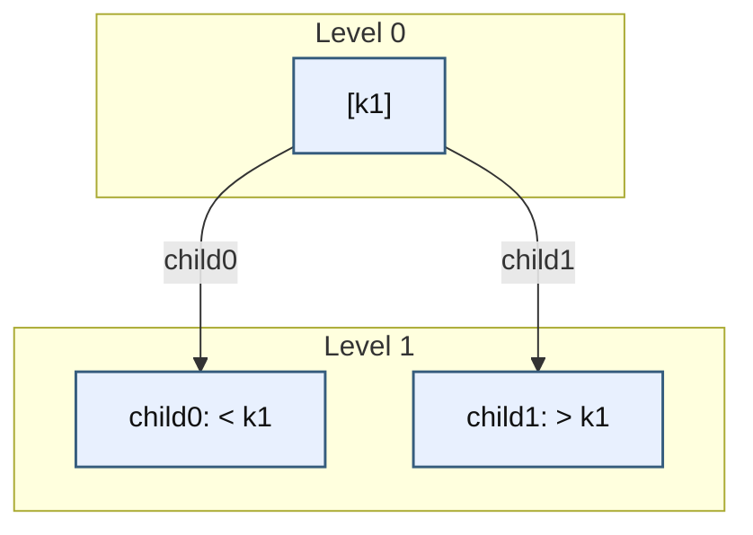
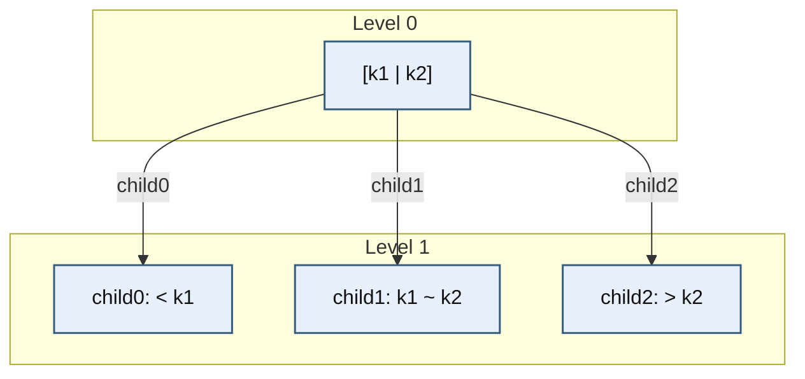
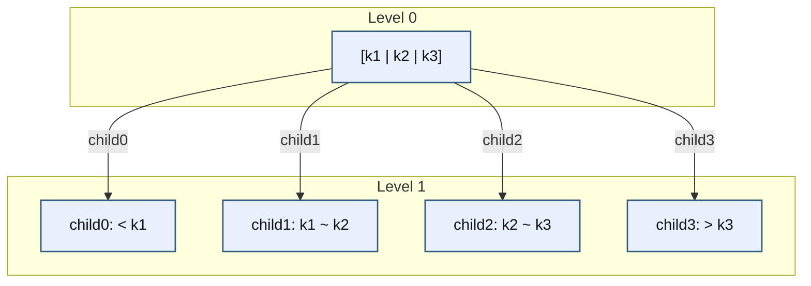
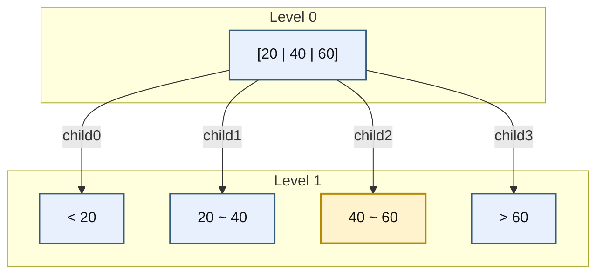
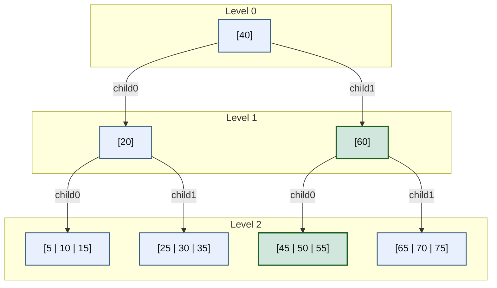
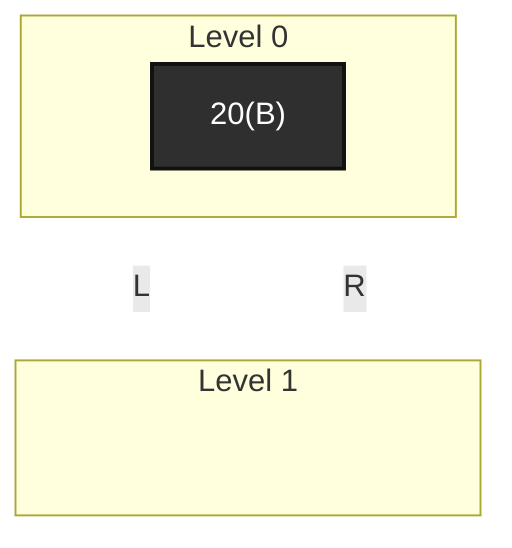
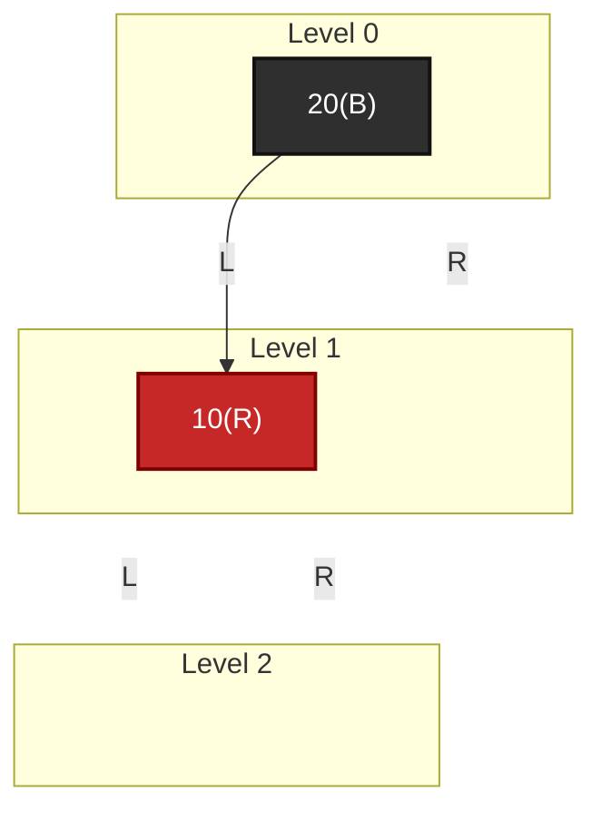
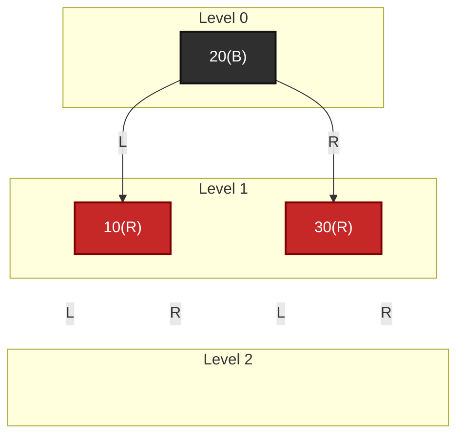

# 第6章\_2-3-4\_树\_从多路平衡到红黑树的结构桥梁

## 6.1\_章节内容说明

P25 已经用高度缓存判断二叉树哪里需要旋转。再换一个设计方向：如果一个节点不必只装一个排序键，新增的键能先放进已有节点，是否可以减少单独向下添一层的机会？当节点装满，又怎样同时保持搜索区间和所有叶子的深度？

先把“每个节点可以装多少键”与“整棵树有多高”分开，再看更新如何维护二者。本章前半段从多关键字节点和只读查找开始，后面才引入分裂、借位与合并。这条路线最终要回答：

**红黑树到底在“编码”什么结构。**

如果只看红黑树表面，你会看到：

- 黑色
- 红色
- 左旋
- 右旋
- 插入修复
- 删除修复

这些动作都是真实的，但如果没有一个更高层的结构参照物，红黑树就会变成一组离散 case。
而 2-3-4 树的作用，就是把这些离散动作，统一还原成“多路平衡搜索树”的结构变化。

因此，这一章要建立三件事：

1. 2-3-4 树是什么；
2. 它怎样查找、插入、删除；
3. 它怎样被红黑树编码。

------

## 6.2\_为什么在红黑树之前引入\_2-3-4\_树

前面的单旋能改变结构，却没有指定应该保持哪一种平衡。这里先选择多关键字节点作为解释模型，目的是让后面的颜色和修复动作有可追踪的结构对象；不要求先完成一套多路容器库。

### 6.2.1\_它不是红黑树的代码前置基础

从“能不能写出红黑树代码”这件事上说，2-3-4 树并不是必须先学的。

你完全可以：

- 直接学红黑树五条性质；
- 直接背插入修复 case；
- 直接背删除修复 case；
- 最后写出一套能跑的红黑树实现。

所以严格说，**2-3-4 树不是红黑树代码实现的前置基础。**

但是，这种学法通常有一个明显问题：
你知道“怎么修”，却不知道“为什么这么修”。

例如：

- 为什么父红叔红时要上推？
- 为什么某些情况先旋转再染色？
- 为什么删除黑节点的修复会继续向上？

如果不借助 2-3-4 树，这些动作很容易变成机械记忆。

------

### 6.2.2\_它是红黑树的结构理解基础

2-3-4 树给出的不是红黑树的代码模板，而是红黑树的**结构语义解释框架**。

红黑树虽然物理上是一棵二叉树，但它维护的不是单纯的 BST 形态。
它维护的是一种“弱平衡”的搜索结构。

这种结构，在逻辑上更接近：

- 一个节点里可以放多个关键字；
- 一个节点可以有多个孩子；
- 所有叶子位于同一层；
- 插入通过分裂修复；
- 删除通过借位与合并修复。

这正是 2-3-4 树的结构特征。

------

### 6.2.3\_它帮助理解\_逻辑节点合并\_而不是\_物理多节点堆叠

这一点必须先讲清楚，否则后面一定混乱。

在 2-3-4 树里，一个节点可以是：

```text
[20]
[20 | 40]
[20 | 40 | 60]
```

这里的 `[20 | 40]` 表示的是：

- 一个节点；
- 节点内部有两个关键字；
- 它不是两个二叉节点串起来。

也就是说，2-3-4 树中的“多关键字节点”是**逻辑节点**。

而红黑树中的每个物理节点只能放一个关键字。
因此红黑树要表达 3-node、4-node 时，只能让多个物理节点共同表达一个逻辑节点。

这就是后面会不断出现的关键词：

> **逻辑合并**

它不是说物理内存真合并成一个节点，
而是说：在解释树的结构时，这几个物理节点应当被视为一个逻辑单元。

------

### 6.2.4\_为什么红黑树要借助\_2-3-4\_树来建立直觉

红黑树最难的地方，不在“旋转”本身，而在“修复动作为什么这样组合”。

2-3-4 树能把这些动作统一解释成下面这些结构事件：

- 节点扩张；
- 满节点分裂；
- 关键字上移；
- 兄弟借位；
- 节点合并；
- 根升高或收缩。

一旦你把红黑树的颜色变化、旋转变化，看成这些高层结构事件的二叉编码，很多 case 就不再是死记硬背。

------

### 6.2.5\_本章在整条学习路径中的定位

你前面已经完成了：

- 树的基本结构；
- 二叉树；
- BST；
- BST 退化；
- 旋转。

到这里，旋转只是“局部重排工具”。
P24/P25 已经给出一种用高度差诊断的方案；红黑树还可以用另一套结构约束判断“修什么”，不能仅靠调用旋转自动成立。

**第6章的作用，就是建立这个目标结构。**

所以这一章是连接：

- 第5章“旋转”
- 第7章“红黑树性质”

之间的桥梁。

------

## 6.3\_2-3-4\_树的结构与不变量

一个盒子多装几个键还不够：必须知道它把搜索范围分成几段、每段交给哪个孩子，以及增加容量以后怎样限制路径长度。下面先固定合法树的样子，后续算法再承担维护它的责任。

### 6.3.1\_什么是\_2-3-4\_树

2-3-4 树是一种 **多路平衡搜索树**：节点内部先用多个有序关键字切出区间，每个孩子承接一个区间。这里先讨论每个关键字只出现一次的集合，采用严格升序和严格区间；需要重复业务键时，可在键外增加稳定的区分字段或为同键保存一个集合，不能静默把两套比较规则混用。

名称中的 2、3、4 指非叶节点的孩子数量。叶子仍可装 1～3 个键，但没有实际孩子；空树使用空根表示。非空根和其他节点至少有一个键，后续更新中的临时空根需要由算法收缩处理。它也常被称为“最小度数为 2 的 B 树”；这个分类名先作为对应关系，当前推导只依赖下面的容量和区间规则。

它的结构特征是：

- 一个节点中可放 1~3 个关键字；
- 一个内部节点可有 2~4 个孩子；
- 节点内部关键字升序排列；
- 孩子子树按关键字区间划分；
- 所有叶子位于同一层。

------

### 6.3.2\_2-node\_1\_个关键字\_2\_个孩子

2-node 的结构最简单。
如果它不是叶子，则它有 1 个关键字、2 个孩子。


```mermaid
graph TD
	subgraph "Level 0"
		N["[k1]"]
	end

	subgraph "Level 1"
		C0["child0: < k1"]
		C1["child1: > k1"]
	end

	N -->|"child0"| C0
	N -->|"child1"| C1

	classDef node_234 fill:#e8f0fe,stroke:#355c7d,color:#111,stroke-width:1.5px;
	class N,C0,C1 node_234;
```

这个结构的约束非常直接：

- 左子树所有关键字 `< k1`
- 右子树所有关键字 `> k1`

------

### 6.3.3\_3-node\_2\_个关键字\_3\_个孩子

3-node 内部有两个升序关键字，例如：

```text
[k1 | k2]
```

它把值域划分成三个区间：

- `< k1`
- `(k1, k2)`
- `> k2`


```mermaid
graph TD
	subgraph "Level 0"
		N["[k1 | k2]"]
	end

	subgraph "Level 1"
		C0["child0: < k1"]
		C1["child1: k1 ~ k2"]
		C2["child2: > k2"]
	end

	N -->|"child0"| C0
	N -->|"child1"| C1
	N -->|"child2"| C2

	classDef node_234 fill:#e8f0fe,stroke:#355c7d,color:#111,stroke-width:1.5px;
	class N,C0,C1,C2 node_234;
```

这里要特别注意：

**这不是两个 BST 节点，而是一个逻辑节点内部含两个关键字。**

------

### 6.3.4\_4-node\_3\_个关键字\_4\_个孩子

4-node 内部有三个升序关键字：

```text
[k1 | k2 | k3]
```

它把值域切成四段：

- `< k1`
- `(k1, k2)`
- `(k2, k3)`
- `> k3`


```mermaid
graph TD
	subgraph "Level 0"
		N["[k1 | k2 | k3]"]
	end

	subgraph "Level 1"
		C0["child0: < k1"]
		C1["child1: k1 ~ k2"]
		C2["child2: k2 ~ k3"]
		C3["child3: > k3"]
	end

	N -->|"child0"| C0
	N -->|"child1"| C1
	N -->|"child2"| C2
	N -->|"child3"| C3

	classDef node_234 fill:#e8f0fe,stroke:#355c7d,color:#111,stroke-width:1.5px;
	class N,C0,C1,C2,C3 node_234;
```

4-node 是后面插入分裂的核心对象。
因为 2-3-4 树的节点容量上界就是 3 个关键字。
再多就必须分裂。

------

### 6.3.5\_节点中的关键字如何划分区间

假设节点关键字为：

```text
[k0 | k1 | k2]
```

那么它的孩子区间必须严格对应为：

- `child0`: `(-∞, k0)`
- `child1`: `(k0, k1)`
- `child2`: `(k1, k2)`
- `child3`: `(k2, +∞)`

也就是说，**孩子不是随便挂的**，它们是由关键字划分出来的区间承接者。

这就是 2-3-4 树和普通“多叉树”最根本的区别：
它不是一般树，它是**搜索树**。

------

### 6.3.6\_孩子数量为什么总是比关键字数量多\_1

先看区间数，再看树怎样表示这些区间。

因为：

- 1 个关键字，把值域切成 2 段；
- 2 个关键字，把值域切成 3 段；
- 3 个关键字，把值域切成 4 段。

所以，对于非叶节点：

> **孩子数 = 关键字数 + 1**

关键字必然划分出这些区间，但“每个内部区间都用一个非空孩子表示”还来自本树的结构不变量。普通多叉搜索结构也可以留下空槽，不能只由区间数推出任意数据结构都有这么多实际孩子。本章的合法非叶节点要求这些孩子全部存在，合法叶子则全部没有孩子，两者不能混搭。

------

### 6.3.7\_所有叶子位于同一层的含义

这条性质是 2-3-4 树平衡的核心。

它的含义不是：

- 左右对称；
- 每层节点数一样；
- 每个节点关键字数一样。

它真正表示的是：

> **从根到任何叶子的路径长度相同。**

因此，2-3-4 树不会像普通 BST 那样出现：

- 某一条路径特别深；
- 某一边连续下沉成链表。

------

### 6.3.8\_2-3-4\_树的平衡条件到底是什么

这些结构条件给出的是更新完成后必须成立的目标，不是定义写在纸上就会自动保持平衡。插入到满节点、从最小容量节点删除时，都可能暂时破坏容量；后面的分裂、借位与合并要说明怎样恢复它们，同时保持叶层一致。

其核心不变量如下：

| 不变量         | 含义                         |
| -------------- | ---------------------------- |
| 节点关键字有序 | 节点内关键字严格升序         |
| 子树区间正确   | 每个孩子子树只承接自己的区间 |
| 节点容量有上界 | 最多 3 个关键字              |
| 节点容量有下界 | 非根节点至少 1 个关键字      |
| 所有叶子同层   | 根到叶路径长度一致           |

这些条件共同保证它是“有序 + 平衡”的多路搜索树。

------

## 6.4\_2-3-4\_树的查找过程

区间和叶层约束已经确定，现在暂时冻结整棵树，只追踪一次查找。每一步先在当前节点决定目标所在的区间，再沿唯一孩子下行；完整程序将分别观察访问节点和比较键的次数。

### 6.4.1\_为什么查找要先在单节点内部比较多个关键字

BST 每个节点只有一个关键字，所以每到一个节点时只做一次判断：

- 小于，往左；
- 大于，往右；
- 等于，命中。

但 2-3-4 树的单个节点里可能有多个关键字。
所以查找的第一步一定是：

> **先在节点内部比较，确认是否命中；若未命中，再确定应走哪个区间分支。**

也就是说，2-3-4 树的查找不是“节点二选一”，而是“节点内部局部搜索 + 多路下行”。

------

### 6.4.2\_单节点内比较后如何决定下行分支

例如节点：

```text
[20 | 40 | 60]
```

查找 `50` 时：

- `50 != 20`
- `50 != 40`
- `50 != 60`
- 且 `40 < 50 < 60`

所以应该走 `(40, 60)` 这一段对应的孩子。


```mermaid
graph TD
	subgraph "Level 0"
		N["[20 | 40 | 60]"]
	end

	subgraph "Level 1"
		C0["< 20"]
		C1["20 ~ 40"]
		C2["40 ~ 60"]
		C3["> 60"]
	end

	N -->|"child0"| C0
	N -->|"child1"| C1
	N -->|"child2"| C2
	N -->|"child3"| C3

	classDef node_234 fill:#e8f0fe,stroke:#355c7d,color:#111,stroke-width:1.5px;
	classDef hit fill:#fff3cd,stroke:#b58900,color:#111,stroke-width:2px;
	class N,C0,C1,C3 node_234;
	class C2 hit;
```

------

### 6.4.3\_从根到叶的查找路径如何形成

虽然 2-3-4 树是多路树，但查找路径仍然只有一条。
因为每一层都只会选择一个孩子继续向下。

下面给一个完整例子。


```mermaid
graph TD
	subgraph "Level 0"
		R["[40]"]
	end

	subgraph "Level 1"
		L["[20]"]
		RR["[60]"]
	end

	subgraph "Level 2"
		A["[5 | 10 | 15]"]
		B["[25 | 30 | 35]"]
		C["[45 | 50 | 55]"]
		D["[65 | 70 | 75]"]
	end

	R -->|"child0"| L
	R -->|"child1"| RR

	L -->|"child0"| A
	L -->|"child1"| B

	RR -->|"child0"| C
	RR -->|"child1"| D

	classDef node_234 fill:#e8f0fe,stroke:#355c7d,color:#111,stroke-width:1.5px;
	classDef path fill:#d1e7dd,stroke:#1b5e20,color:#111,stroke-width:2px;
	class A,B,D,L,R node_234;
	class RR,C path;
```

如果查找 `55`，路径就是：

- 根 `[40]`
- 右孩子 `[60]`
- 左孩子 `[45 | 50 | 55]`

------

### 6.4.4\_为什么\_2-3-4\_树的高度通常比\_BST\_更低

因为 2-3-4 树的一个节点里可容纳多个关键字，
而且一个节点可有更多分支。

所以在相同关键字总数下：

- BST 每层最多把空间分成 2 段；
- 2-3-4 树每层最多把空间分成 4 段。

较大的分支容量给了压低层数的机会，但不是“任意 2-3-4 树都比任意 BST 更矮”的保证；当节点都只装一个键时，它的分支数仍是 2。真正的最坏高度约束来自容量下界与所有叶子同层。

按边数定义非空树高度 h，只有根时 h=0。每个内部节点至少两个孩子、每个节点至少一个键，所以第 d 层至少有 2^d 个节点，得到 n≥1+2+…+2^h=2^(h+1)−1。反过来，每层最多按四倍扩展、每个节点最多三个键，所以 n≤3×(1+4+…+4^h)=4^(h+1)−1。因此：

```text
log4(n + 1) - 1 <= h <= log2(n + 1) - 1
```

这才是对数高度的理由。一次节点访问内部仍可能比较三个键；节点数更少不等于比较次数、CPU 时间或磁盘访问一定同比下降。具体存储布局和访问成本留到后面的页级索引讨论。

------

### 6.4.5\_2-3-4\_树查找与\_BST\_查找的本质差别

它们本质上的不同，不在于“2-3-4 树多写几个 if”，而在于结构模型不同。

| 项目           | BST          | 2-3-4 树           |
| -------------- | ------------ | ------------------ |
| 单节点关键字数 | 1            | 1~3                |
| 非叶节点孩子数 | 最多 2，可缺一侧 | 2～4，活动区间都对应非空孩子 |
| 查找动作       | 单关键字比较 | 节点内多关键字比较 |
| 树高           | 可能退化     | 叶子同层           |
| 平衡维护       | 普通 BST 插删不限制高度 | 更新必须恢复容量、区间与同层叶子 |

------

### 6.4.6\_查找算法伪代码与示例

伪代码如下：

```text
search(node, key):
    if node == null:
        return not_found

    i = 0
    while i < node.key_count and key > node.keys[i]:
        i++

    if i < node.key_count and key == node.keys[i]:
        return found

    if node is leaf:
        return not_found

    return search(node.child[i], key)
```

这个伪代码要抓住两个核心点：

1. 在当前节点中找到第一个 `>= key` 的位置；
2. 若未命中，则下降到对应区间孩子。

------

### 6.4.7\_用完整C程序观察区间下行

回到 6.4.3 的同一棵树：根是 40，第二层是 20 和 60，四片叶子各装三个键。先预测查找 55、52、40、80 的结果。55 和 52 都要走到右侧的左叶，但一个命中、一个缺失；40 在根就结束；80 会一直落到最右区间。

程序中的节点只保存关键字数量、三个键槽和四个孩子槽。数组容量描述可容纳多少元素，key_count 才说明本节点用了多少键。所有对象都是静态 const，整个程序期间存活；没有分配、插入、删除或并发。返回值携带命中的节点地址与键下标，未命中时 node 为 NULL，下标不代表一个可用结果。材料是 [tree234_search.c](../../../../labs/kernel/tree_basics/materials/tree234_search.c)。

```c
#include <assert.h>
#include <stdbool.h>
#include <stddef.h>
#include <stdio.h>

/* 只读教学模型：关键字唯一，非叶节点恰有 key_count + 1 个孩子。 */
struct tree234_node {
    unsigned int key_count;
    int keys[3];
    const struct tree234_node *children[4];
};

struct search_result {
    const struct tree234_node *node;
    unsigned int index;
    unsigned int visited_nodes;
    unsigned int compared_keys;
};

static struct search_result search_tree(const struct tree234_node *node, int key)
{
    struct search_result result = {0};
    while (node) {
        unsigned int index = 0;
        ++result.visited_nodes;
        /* 计数的是参与本轮决策的关键字，不是机器指令或耗时。 */
        while (index < node->key_count) {
            ++result.compared_keys;
            if (key <= node->keys[index])
                break;
            ++index;
        }
        if (index < node->key_count && key == node->keys[index]) {
            result.node = node;
            result.index = index;
            return result;
        }
        /* 合法叶子的所有孩子均为 NULL；未命中时自然结束。 */
        node = node->children[index];
    }
    return result;
}

static const struct tree234_node leaf_a = {3, {5, 10, 15}, {NULL}};
static const struct tree234_node leaf_b = {3, {25, 30, 35}, {NULL}};
static const struct tree234_node leaf_c = {3, {45, 50, 55}, {NULL}};
static const struct tree234_node leaf_d = {3, {65, 70, 75}, {NULL}};
static const struct tree234_node branch_l = {1, {20}, {&leaf_a, &leaf_b}};
static const struct tree234_node branch_r = {1, {60}, {&leaf_c, &leaf_d}};
static const struct tree234_node root = {1, {40}, {&branch_l, &branch_r}};

/* 与树拓扑独立的线性集合，仅供检查返回答案。 */
static bool expected_contains(int key)
{
    static const int expected[] = {
        5, 10, 15, 20, 25, 30, 35, 40, 45, 50, 55, 60, 65, 70, 75
    };
    size_t i;
    for (i = 0; i < sizeof(expected) / sizeof(expected[0]); ++i)
        if (expected[i] == key)
            return true;
    return false;
}

int main(void)
{
    static const int queries[] = {55, 52, 40, 80};
    size_t i;
    int key;
    struct search_result empty = search_tree(NULL, 40);
    assert(!empty.node && empty.visited_nodes == 0 && empty.compared_keys == 0);
    for (i = 0; i < sizeof(queries) / sizeof(queries[0]); ++i) {
        struct search_result result = search_tree(&root, queries[i]);
        printf("key=%d found=%d nodes=%u compared_keys=%u\n",
               queries[i], result.node != NULL,
               result.visited_nodes, result.compared_keys);
    }
    for (key = 0; key <= 80; ++key) {
        struct search_result result = search_tree(&root, key);
        assert((result.node != NULL) == expected_contains(key));
        if (result.node)
            assert(result.index < result.node->key_count &&
                   result.node->keys[result.index] == key);
        assert(result.visited_nodes >= 1 && result.visited_nodes <= 3);
    }
    puts("range_checks=81 passed");
    return 0;
}
```

从材料目录编译并运行：

```bash
cc -std=c11 -Wall -Wextra -Werror -pedantic tree234_search.c -o tree234_search
./tree234_search
```

预期输出为：

```text
key=55 found=1 nodes=3 compared_keys=5
key=52 found=0 nodes=3 compared_keys=5
key=40 found=1 nodes=1 compared_keys=1
key=80 found=0 nodes=3 compared_keys=5
range_checks=81 passed
```

以 55 为例，在根参与决策的键是 40，在第二层是 60，到叶子依次比较 45、50、55，所以访问三个节点，却比较五个键。compared_keys 计的是本次决策考察了几个关键字，不是条件表达式执行数、CPU 指令数或耗时。52 也考察到 55 才知道应落在它左边，但那已经是叶子，因此缺失；不能把“停在某个槽位”当作已经找到一个元素。

while 内的 index 找到第一个不小于目标的键；若相等就返回，否则 index 同时是待进入的区间编号。若所有键都小于目标，index==key_count，孩子数组仍有这个最右槽，但键数组不能再读 keys[index]。这就是命中判断中先检查 index<key_count 的原因。叶子活动孩子全为 NULL，未命中后循环结束；空树一开始就结束，两个计数都为零。

程序只接受结构已经合法的树。它没有验证 key_count 越界、环或空内部区间，也不把“不崩溃”当作输入结构正确。main 用独立线性集合对照 0～80 的答案，能检查这个有限示例的查找结果，不能证明所有可能树形或未来更新算法都正确。

先做三道练习，再进入插入。第一，把查询改为 0，预测三个节点各只考察一个键；它与 80 的访问节点数相同，比较键数却不同。第二，在纸上把右侧左叶的 45 改为 37，叶内仍然有序，但它违反了根 40 分出的祖先区间；查找 37 会去左半树，所以“每个节点内部有序”不够。第三，如果向已满的叶子 [45|50|55] 加入 52，不能仅把 key_count 改成 4：数组没有第四个合法键槽，树的容量规则也已被破坏。下一节要解决的就是怎样用分裂处理这次更新。

------

## 6.5\_2-3-4\_树的插入\_从叶子落点到节点分裂

查找已经给出落点，满叶子却不能直接接收第四个活动键。完整的两套手工推演、十一张图、传播伪代码和 C++ 实验移入[P30 插入与分裂时机](P30_2-3-4树插入与分裂时机.md#30.1_满叶子怎样接收一个新键)，先解释溢出上推，再比较下降前预分裂；重复键、临时容量与失败保持原树也在那里统一处理。

完成 P30 后回到下一节。插入遇到容量上界，删除则可能把节点降到容量下界以下；恢复区间和叶层的责任仍然相同。

## 6.6\_2-3-4\_树的删除\_借位\_合并与向下修复

容量下界、借位、合并与根收缩分别沿[P31 预修复删除](P31_2-3-4树预修复删除.md#31.1_从装不下走到不能删空)和[P32 下溢回溯](P32_2-3-4树下溢回溯与根收缩.md#32.1_把余量准备改成下溢报告)阅读。两个单元都保留完整图例和 C++ 程序；分别建立下行准备与回溯报告后，再进入下面的红黑表示对照。

与红黑删除的成熟 case 对照移到[P33](P33_从多路删除到红黑缺口.md#33.1_在两套规则建立以后对照)，安排在 P07 颜色与黑高定义之后。当前先沿下面两节说明多路更新为何维持叶层，再建立最小二叉编码。
## 6.7\_更新怎样维持叶子同层

P30～P32 已经分别运行插入与两种删除。现在回看同一个不变量：操作前所有叶子同层，哪些局部动作保证操作后仍然如此？这是一项需要算法维护的性质，写出“2-3-4 树”的名字本身不会自动完成维护。

### 6.7.1\_平衡的关键不是\_左右对称\_而是\_所有叶子同层

2-3-4 树的平衡定义，不是几何意义上的左右对称。
它真正关心的是：

> **所有根到叶路径长度一致。**

因此，局部节点关键字数不一致并不会破坏平衡。

------

### 6.7.2\_为什么节点扩张不会破坏整体平衡

向一个 2-node 或 3-node 中插入关键字时，
只是该节点内部关键字数增加，并没有让某条路径额外增加层数。

所以节点扩张不会导致单边下沉。

------

### 6.7.3\_为什么普通分裂不增高\_根分裂才整体增高

非根节点分裂把同一层的一个节点变为两个兄弟，原孩子按区间分给两边；原孩子与新父的边数不变。上推键在父的现有层中占一个槽，父满时重复同一动作。因此分裂传播没有在某一条叶路径中私自插入一层。

只有根分裂才会使整棵树增高。
而根分裂带来的不是“一边更深”，而是“所有原有叶子整体下一层”。

所以 2-3-4 树增高的方式是**整体增高**，不是 BST 那种单侧拉长。

------

### 6.7.4\_为什么借位与合并可以在删除中维持层高一致

借位重新分配键与边界孩子，接受孩子的新父和旧父处于同一层，因此孩子的深度不变。合并把两个同层兄弟和父中的一个键合成一个节点，所有原孩子仍挂在这一层节点的下一层。

自底向上若把内部父清成零键，它仍保留唯一孩子，不在局部直接删掉这层；必须继续向上修复。只有整树根为空时，才能让唯一孩子接任根，使所有叶子一起上移一层。中间状态可违反容量下界，成功返回后才恢复完整不变量。

因此删除修复过程中，层高变化也是全局一致的，不会破坏“叶子同层”。

------

### 6.7.5\_2-3-4\_树平衡机制与\_BST\_平衡机制的根本差异

BST 的问题是：

- 节点容量固定为 1；
- 插入只能沿一条路径往下挂；
- 不利输入序列会单边退化。

2-3-4 树的不同点在于：

- 节点先内部扩张；
- 满了再分裂；
- 删除可先借位/合并再下降，也可先删再回溯；
- 叶层始终齐平。

节点容量和同层叶子的定义给出对数高度界，实际算法则负责每次更新后恢复这些条件。普通 BST 只维护排序；AVL、红黑等增强型 BST 也能通过自己的额外约束控制高度，不能把所有二叉表示都等同于未平衡 BST。

------

## 6.8\_从\_2-3-4\_树到红黑树\_真正的桥梁在哪里

我们已经能维护多关键字节点。下一步想保留每个物理节点只放一个键、只留左右两个孩子的二叉布局，却不丢失原来的逻辑分组。于是需要额外标记“这条连接还在同一个多路节点内部，还是已经跨到下一层”；颜色在这里作为分组标记出现。

### 6.8.1\_为什么红黑树不是凭空出现的一组颜色规则

给每个逻辑组选择一个黑色根，把组内其他键放在它的红色孩子中。红/黑是编码约定，不是硬件属性；图中 R 表示 red 红，B 表示 black 黑。这样可以用：

- 用黑节点表达多路树骨架层级；
- 用红节点表达逻辑节点内部的关键字合并；
- 用每条路径上的黑节点数量一致表达逻辑层数相同；这个计数在 P07 正式称为黑高。

排序约束仍由 BST 承担；颜色再提供逻辑分组和高度约束。接下来只建立合法静态树的编码，插入/删除暂态的旋转与染色要在性质建立后再讨论。

我需要在这里强调一个点：

> 不是说这里的 2-3-4树 节点 与 红黑树节点 的转化只有一种形态，是根据个人算法使用的代码规则来规定怎么转化姿态的。所以下面的映射关系是由于代码约束选了一种之后进行的姿态调整，并不是唯一的，或者官方定死的。

保留上面的阅读批注，同时限定“形态可以选择”的范围：合法编码仍要保持排序和逻辑分组，不能任意染色或旋转。二键 3-node 可以左倾或右倾；三个既定有序键的标准 4-node 编码则以中键为黑根、两端键为红孩子。后文普通红黑树允许两种 3-node 方向，不等于每一组键都有任意多种合法形状。

------

### 6.8.2\_2-node\_如何映射到红黑树

2-node：

```text
[20]
```

映射成红黑树时，就是一个黑节点。


```mermaid
graph TD
	subgraph "Level 0"
		N["20(B)"]
	end

	subgraph "Level 1"
		LG[" "]
		RG[" "]
	end

	N -->|"L"| LG
	N -->|"R"| RG

	classDef black_node fill:#2f2f2f,stroke:#111,color:#fff,stroke-width:2px;
	classDef ghost fill:transparent,stroke:transparent,color:transparent;
	class N black_node;
	class LG,RG ghost;
	linkStyle 0 stroke:transparent;
	linkStyle 1 stroke:transparent;
```

------

### 6.8.3\_3-node\_如何映射到红黑树

3-node：

```text
[10 | 20]
```

可被编码成“一个黑节点 + 一个红节点”的逻辑组合。

为了建立直觉，这里采用左倾画法：


```mermaid
graph TD
	subgraph "Level 0"
		B["20(B)"]
	end

	subgraph "Level 1"
		R["10(R)"]
		RG[" "]
	end

	subgraph "Level 2"
		G1[" "]
		G2[" "]
	end

	B -->|"L"| R
	B -->|"R"| RG
	R -->|"L"| G1
	R -->|"R"| G2

	classDef black_node fill:#2f2f2f,stroke:#111,color:#fff,stroke-width:2px;
	classDef red_node fill:#c62828,stroke:#7f0000,color:#fff,stroke-width:2px;
	classDef ghost fill:transparent,stroke:transparent,color:transparent;
	class B black_node;
	class R red_node;
	class RG,G1,G2 ghost;
	linkStyle 1 stroke:transparent;
	linkStyle 2 stroke:transparent;
	linkStyle 3 stroke:transparent;
```

这里表达的不是“真的多出一个逻辑层”，
而是：

> 红节点应与黑父共同解释为一个逻辑 3-node。

这里黑色 20 和红色 10 是同一个逻辑组。也可以让 10 为黑根、20 为红色右孩子，保留同一 [10|20] 分组；这不是说所有更新中的“上推动作”都一律上黑下红，染色暂态要按具体修复步骤核对。

------

### 6.8.4\_4-node\_如何映射到红黑树

4-node：

```text
[10 | 20 | 30]
```

典型编码如下：


```mermaid
graph TD
	subgraph "Level 0"
		B["20(B)"]
	end

	subgraph "Level 1"
		L["10(R)"]
		R["30(R)"]
	end

	subgraph "Level 2"
		G1[" "]
		G2[" "]
		G3[" "]
		G4[" "]
	end

	B -->|"L"| L
	B -->|"R"| R
	L -->|"L"| G1
	L -->|"R"| G2
	R -->|"L"| G3
	R -->|"R"| G4

	classDef black_node fill:#2f2f2f,stroke:#111,color:#fff,stroke-width:2px;
	classDef red_node fill:#c62828,stroke:#7f0000,color:#fff,stroke-width:2px;
	classDef ghost fill:transparent,stroke:transparent,color:transparent;
	class B black_node;
	class L,R red_node;
	class G1,G2,G3,G4 ghost;
	linkStyle 2 stroke:transparent;
	linkStyle 3 stroke:transparent;
	linkStyle 4 stroke:transparent;
	linkStyle 5 stroke:transparent;
```

这个图是后面理解“父红叔红”最关键的结构基础。
因为一个黑节点带两个红孩子，本质上正对应逻辑 4-node。

图中为突出组内关系隐藏了外部子树。实际编码时，原多路节点的每个孩子区间必须原样接回：

| 多路节点 | 二叉编码 | 外部孩子连接 |
| --- | --- | --- |
| [a]，孩子 C0/C1 | a 黑 | a.left=C0，a.right=C1 |
| [a,b]，孩子 C0/C1/C2 | b 黑、a 红左孩子 | a.left=C0，a.right=C1，b.right=C2 |
| [a,b]，右倾选择 | a 黑、b 红右孩子 | a.left=C0，b.left=C1，b.right=C2 |
| [a,b,c]，孩子 C0～C3 | b 黑、a/c 为红孩子 | a.left=C0，a.right=C1，c.left=C2，c.right=C3 |

每个非空 C 子树继续按同一规则编码，组的根为黑；空孩子在后续性质中作为黑色 NIL 边界计数。只把三个键画对而没有接回四个区间，还不是完整的结构对应。

------

### 6.8.5\_红链接为什么可以理解为\_逻辑合并

红边的结构语义是：

> 被红边连接的节点，不应被看成新的黑层级骨架，而应并入某个黑节点所代表的逻辑节点中。

因此：

- 红节点不是独立的新逻辑层；
- 它是逻辑节点内部关键字的二叉展开形式。

这就是“红链接 = 逻辑合并”的准确含义。

------

### 6.8.6\_颜色在红黑树里承担的结构语义是什么

颜色在红黑树里不是装饰，而是结构控制信息。

#### (1)\_黑色的语义

- 定义骨架层级；
- 保证黑高一致；
- 对应 2-3-4 树中“叶子同层”的平衡约束。

#### (2)\_红色的语义

- 表示逻辑合并；
- 用于把多个物理节点组合成一个 3-node 或 4-node。

每条二叉路径可能额外经过组内红节点，物理边数不必相同；但每经过一个逻辑层恰好经过一个黑根。再给所有末端空边界统一计数，就能把原来叶子同层翻译为相同的黑节点数。禁止连续红链接，是为了不把超过三个键错误压进同一逻辑组；根涂黑则为整个分组提供起点。

------

### 6.8.7\_2-3-4\_树插入分裂如何对应红黑树插入修复

2-3-4 树插入时，核心事件是：

- 节点扩张；
- 满节点分裂；
- 中间关键字上推。

映射到红黑树时，对应的就是：

- 临时形成逻辑 4-node；
- 染色翻转；
- 必要时旋转，使二叉表示恢复合法。

这只是组容量与表示动作的预告，不能按下面三行去逐次替代 P30 的上中位分裂。合法黑父带两个红孩子已经是三键 4-node；新键接入后可能暂时超出该组或违反相邻颜色约束，具体步骤在 P07 的性质与修复单元建立。

可以把局部职责先分开：

| 2-3-4 树事件       | 红黑树动作         |
| ------------------ | ------------------ |
| 合法逻辑 4-node   | 黑父带两个红孩子的组合 |
| 4-node 分裂        | 染色上推           |
| 二叉表示方向不合适 | 先旋转，再染色     |

------

### 6.8.8\_2-3-4\_树删除中的借位\_/\_合并如何对应红黑树删除修复

两种删除已在 P31/P32 分别建立；这里先保留将来比较时要追踪的对象，不要求尚未学习颜色性质的读者判断成熟 case。

2-3-4 树删除时：

- 预修复在下行前准备余量，回溯版先删再报告零键；
- 可借时通过父分隔键搬移余量，不能借时合并；
- 回溯中只有父本身下溢才继续上报。

红黑树删除时：

- 黑位置的旧贡献可能消失，红色接替孩子涂黑则可局部补足；
- 要通过兄弟、父、侄子的颜色关系修复；
- 修复通过旋转与染色传播。

所以红黑树删除修复的本质，其实是在用二叉结构模拟：

- 借位；
- 合并；
- 缺黑上推。

完成 P07 定义及[P36 删除周期](P36_红黑删除与缺黑位置传播.md#36.1_移走对象为何不一定马上产生缺口)后，进入[P33 同阶段对照](P33_从多路删除到红黑缺口.md#33.2_按同一删除阶段比较局部动作)，具体区分红父吸收、黑父传播和近/远侄的编码调整。本节不把全部染色与旋转步骤提前塞入多路模型。

------

## 6.9\_2-3-4\_树的现实意义\_从多路平衡到\_B+\_树的页级索引思想

页级索引的完整单元已组织为[P34 从多路节点到页级索引](P34_从多路节点到页级索引.md#34.1_高度相同不等于访问成本相同)，保留原有概念、图与工程比较，并用 C++ 模型区分页请求、缓存未命中和物理位置。初读先完成 P07 的红黑性质及后续对象接口；进入工程扩展时再沿 P34 阅读页布局和存储成本。

## 6.10\_Linux\_VMA\_管理为什么从红黑树走向\_Maple\_Tree

多路结构还可以索引非重叠地址范围。Linux 用 VMA（Virtual Memory Area，虚拟内存区域）描述映射区间，再用 Maple Tree 管理这些范围。这里先保留应用方向；颜色分组和多路更新建立之后，还需要理解页级成本、范围契约与对象使用期限，才能比较旧 VMA 组合与新索引。

完整的 G/H 地址实例、权限切分、取消映射、空洞查询、C++ 实验及版本边界集中在 [P14 Maple 与 VMA](P14_Maple_Tree_与_VMA_管理.md#14.1_一个地址为什么需要三种查询)。P14 也保留对大数组、页表、RCU 与历史性能数据的分析，不在本基础桥接章重复一套工程教程。Maple 优化的是范围元数据，不是把用户数据页重新排列到更快的硬件层。

## 6.11\_本章小结

进入下一章前，先收回容量、叶层和二叉分组这条主线。页级索引与范围管理增加了其他工程约束，不能反过来替代这里对普通搜索树不变量的解释。

### 6.11.1\_从可运行多路结构获得解释框架

通过本章查找以及 P30～P32 的完整更新程序，我们已经建立多路节点的容量、区间、叶深与失败边界。接下来将这些结论用于解释二叉编码，而不是把逻辑类比当作完整红黑实现。

以后你看到红黑树时，不应只看到：

- 红
- 黑
- 左旋
- 右旋

而应看到：

- 2-node
- 3-node
- 4-node
- 分裂
- 借位
- 合并

------

### 6.11.2\_红黑树本质上是\_2-3-4\_树的二叉编码

这一句现在可以严格理解了：

- 黑节点负责骨架；
- 红节点负责逻辑合并；
- 黑高一致对应叶子同层；
- 插入中的组容量变化需要分裂或重新编码；
- 删除的容量缺口借助借位、合并与父层吸收解释，但具体修复还有二叉对象与槽位责任。

所以红黑树不是“颜色规则集合”，而是：

> **2-3-4 树的二叉编码形式。**

------

### 6.11.3\_下一章将进入红黑树的定义\_性质与结构映射

到这里，进入红黑树本体的条件已经具备：

- 你知道它首先是一棵 BST；
- 你知道为什么必须平衡；
- 你知道旋转只是机械工具；
- 你知道红黑树在逻辑上编码的是 2-3-4 树。

所以下一章就可以正式进入：

- 红黑树定义；
- 五条性质；
- 黑高；
- 红红冲突；
- 2-node / 3-node / 4-node 的合法二叉编码和方向选择。

继续阅读[P07 颜色与性质](P07_红黑树_把_2-3-4_树映射成二叉表示.md#7.2_红黑树的定义与定位)，建立正式约束，再沿 P35/P36 完成更新推演，之后读 P33 的删除对照。
