# 第6章\_2-3-4\_树\_从多路平衡到红黑树的结构桥梁

## 6.1\_章节内容说明

P25 已经用高度缓存判断二叉树哪里需要旋转。再换一个设计方向：如果一个节点不必只装一个排序键，新增的键能先放进已有节点，是否可以减少单独向下添一层的机会？当节点装满，又怎样同时保持搜索区间和所有叶子的深度？

先把“每个节点可以装多少键”与“整棵树有多高”分开，再看更新如何维护二者。本章前半段从多关键字节点和只读查找开始，后面才引入分裂、借位与合并。这条路线最终要回答：

**红黑树到底在“编码”什么结构。**

如果只看红黑树表面，你会看到：

- 黑色
- 红色
- 左旋
- 右旋
- 插入修复
- 删除修复

这些动作都是真实的，但如果没有一个更高层的结构参照物，红黑树就会变成一组离散 case。
而 2-3-4 树的作用，就是把这些离散动作，统一还原成“多路平衡搜索树”的结构变化。

因此，这一章要建立三件事：

1. 2-3-4 树是什么；
2. 它怎样查找、插入、删除；
3. 它怎样被红黑树编码。

------

## 6.2\_为什么在红黑树之前引入\_2-3-4\_树

前面的单旋能改变结构，却没有指定应该保持哪一种平衡。这里先选择多关键字节点作为解释模型，目的是让后面的颜色和修复动作有可追踪的结构对象；不要求先完成一套多路容器库。

### 6.2.1\_它不是红黑树的代码前置基础

从“能不能写出红黑树代码”这件事上说，2-3-4 树并不是必须先学的。

你完全可以：

- 直接学红黑树五条性质；
- 直接背插入修复 case；
- 直接背删除修复 case；
- 最后写出一套能跑的红黑树实现。

所以严格说，**2-3-4 树不是红黑树代码实现的前置基础。**

但是，这种学法通常有一个明显问题：
你知道“怎么修”，却不知道“为什么这么修”。

例如：

- 为什么父红叔红时要上推？
- 为什么某些情况先旋转再染色？
- 为什么删除黑节点的修复会继续向上？

如果不借助 2-3-4 树，这些动作很容易变成机械记忆。

------

### 6.2.2\_它是红黑树的结构理解基础

2-3-4 树给出的不是红黑树的代码模板，而是红黑树的**结构语义解释框架**。

红黑树虽然物理上是一棵二叉树，但它维护的不是单纯的 BST 形态。
它维护的是一种“弱平衡”的搜索结构。

这种结构，在逻辑上更接近：

- 一个节点里可以放多个关键字；
- 一个节点可以有多个孩子；
- 所有叶子位于同一层；
- 插入通过分裂修复；
- 删除通过借位与合并修复。

这正是 2-3-4 树的结构特征。

------

### 6.2.3\_它帮助理解\_逻辑节点合并\_而不是\_物理多节点堆叠

这一点必须先讲清楚，否则后面一定混乱。

在 2-3-4 树里，一个节点可以是：

```text
[20]
[20 | 40]
[20 | 40 | 60]
```

这里的 `[20 | 40]` 表示的是：

- 一个节点；
- 节点内部有两个关键字；
- 它不是两个二叉节点串起来。

也就是说，2-3-4 树中的“多关键字节点”是**逻辑节点**。

而红黑树中的每个物理节点只能放一个关键字。
因此红黑树要表达 3-node、4-node 时，只能让多个物理节点共同表达一个逻辑节点。

这就是后面会不断出现的关键词：

> **逻辑合并**

它不是说物理内存真合并成一个节点，
而是说：在解释树的结构时，这几个物理节点应当被视为一个逻辑单元。

------

### 6.2.4\_为什么红黑树要借助\_2-3-4\_树来建立直觉

红黑树最难的地方，不在“旋转”本身，而在“修复动作为什么这样组合”。

2-3-4 树能把这些动作统一解释成下面这些结构事件：

- 节点扩张；
- 满节点分裂；
- 关键字上移；
- 兄弟借位；
- 节点合并；
- 根升高或收缩。

一旦你把红黑树的颜色变化、旋转变化，看成这些高层结构事件的二叉编码，很多 case 就不再是死记硬背。

------

### 6.2.5\_本章在整条学习路径中的定位

你前面已经完成了：

- 树的基本结构；
- 二叉树；
- BST；
- BST 退化；
- 旋转。

到这里，旋转只是“局部重排工具”。
P24/P25 已经给出一种用高度差诊断的方案；红黑树还可以用另一套结构约束判断“修什么”，不能仅靠调用旋转自动成立。

**第6章的作用，就是建立这个目标结构。**

所以这一章是连接：

- 第5章“旋转”
- 第7章“红黑树性质”

之间的桥梁。

------

## 6.3\_2-3-4\_树的结构与不变量

一个盒子多装几个键还不够：必须知道它把搜索范围分成几段、每段交给哪个孩子，以及增加容量以后怎样限制路径长度。下面先固定合法树的样子，后续算法再承担维护它的责任。

### 6.3.1\_什么是\_2-3-4\_树

2-3-4 树是一种 **多路平衡搜索树**：节点内部先用多个有序关键字切出区间，每个孩子承接一个区间。这里先讨论每个关键字只出现一次的集合，采用严格升序和严格区间；需要重复业务键时，可在键外增加稳定的区分字段或为同键保存一个集合，不能静默把两套比较规则混用。

名称中的 2、3、4 指非叶节点的孩子数量。叶子仍可装 1～3 个键，但没有实际孩子；空树使用空根表示。非空根和其他节点至少有一个键，后续更新中的临时空根需要由算法收缩处理。它也常被称为“最小度数为 2 的 B 树”；这个分类名先作为对应关系，当前推导只依赖下面的容量和区间规则。

它的结构特征是：

- 一个节点中可放 1~3 个关键字；
- 一个内部节点可有 2~4 个孩子；
- 节点内部关键字升序排列；
- 孩子子树按关键字区间划分；
- 所有叶子位于同一层。

------

### 6.3.2\_2-node\_1\_个关键字\_2\_个孩子

2-node 的结构最简单。
如果它不是叶子，则它有 1 个关键字、2 个孩子。

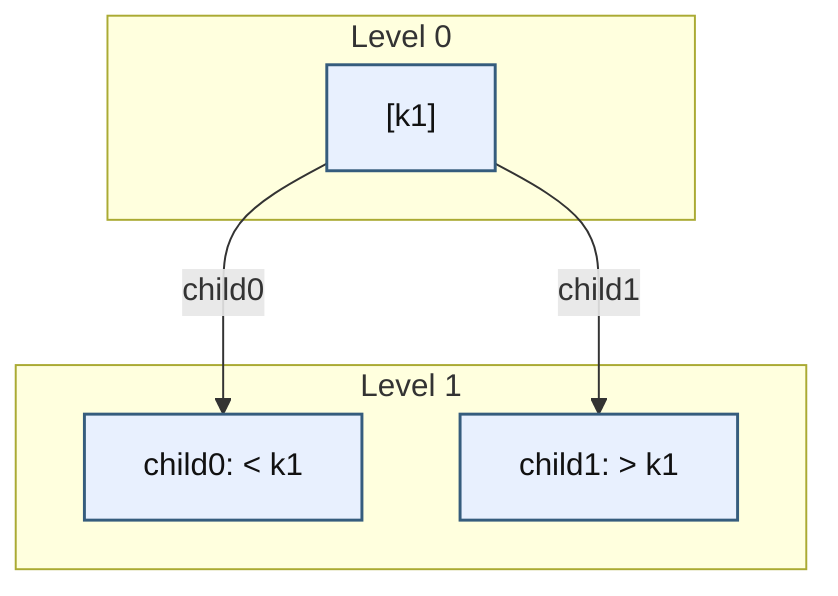
```mermaid
graph TD
	subgraph "Level 0"
		N["[k1]"]
	end

	subgraph "Level 1"
		C0["child0: < k1"]
		C1["child1: > k1"]
	end

	N -->|"child0"| C0
	N -->|"child1"| C1

	classDef node_234 fill:#e8f0fe,stroke:#355c7d,color:#111,stroke-width:1.5px;
	class N,C0,C1 node_234;
```

这个结构的约束非常直接：

- 左子树所有关键字 `< k1`
- 右子树所有关键字 `> k1`

------

### 6.3.3\_3-node\_2\_个关键字\_3\_个孩子

3-node 内部有两个升序关键字，例如：

```text
[k1 | k2]
```

它把值域划分成三个区间：

- `< k1`
- `(k1, k2)`
- `> k2`

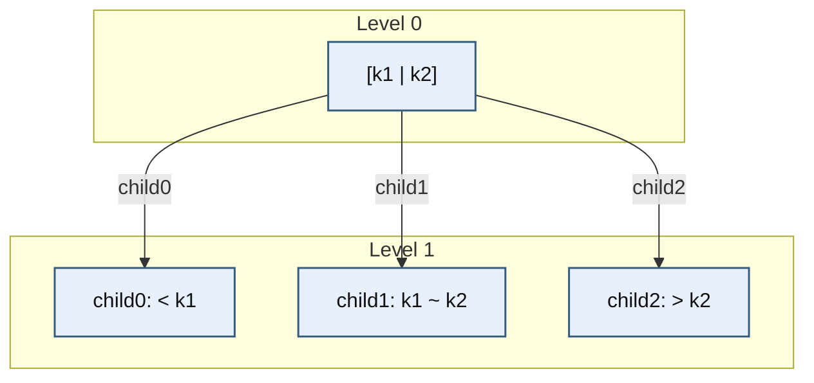
```mermaid
graph TD
	subgraph "Level 0"
		N["[k1 | k2]"]
	end

	subgraph "Level 1"
		C0["child0: < k1"]
		C1["child1: k1 ~ k2"]
		C2["child2: > k2"]
	end

	N -->|"child0"| C0
	N -->|"child1"| C1
	N -->|"child2"| C2

	classDef node_234 fill:#e8f0fe,stroke:#355c7d,color:#111,stroke-width:1.5px;
	class N,C0,C1,C2 node_234;
```

这里要特别注意：

**这不是两个 BST 节点，而是一个逻辑节点内部含两个关键字。**

------

### 6.3.4\_4-node\_3\_个关键字\_4\_个孩子

4-node 内部有三个升序关键字：

```text
[k1 | k2 | k3]
```

它把值域切成四段：

- `< k1`
- `(k1, k2)`
- `(k2, k3)`
- `> k3`

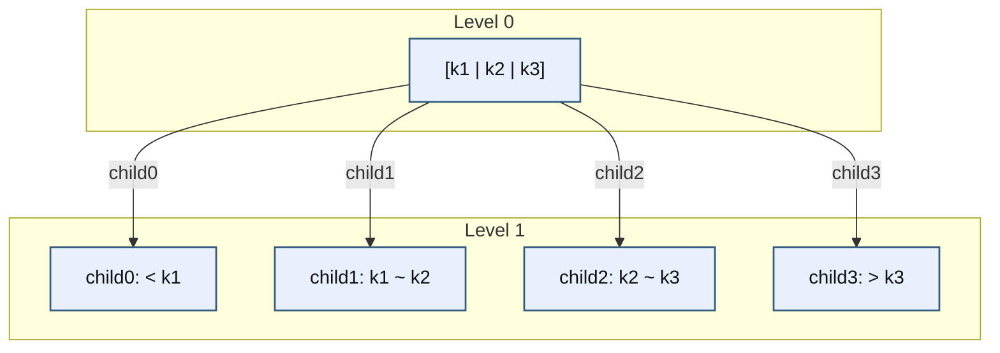
```mermaid
graph TD
	subgraph "Level 0"
		N["[k1 | k2 | k3]"]
	end

	subgraph "Level 1"
		C0["child0: < k1"]
		C1["child1: k1 ~ k2"]
		C2["child2: k2 ~ k3"]
		C3["child3: > k3"]
	end

	N -->|"child0"| C0
	N -->|"child1"| C1
	N -->|"child2"| C2
	N -->|"child3"| C3

	classDef node_234 fill:#e8f0fe,stroke:#355c7d,color:#111,stroke-width:1.5px;
	class N,C0,C1,C2,C3 node_234;
```

4-node 是后面插入分裂的核心对象。
因为 2-3-4 树的节点容量上界就是 3 个关键字。
再多就必须分裂。

------

### 6.3.5\_节点中的关键字如何划分区间

假设节点关键字为：

```text
[k0 | k1 | k2]
```

那么它的孩子区间必须严格对应为：

- `child0`: `(-∞, k0)`
- `child1`: `(k0, k1)`
- `child2`: `(k1, k2)`
- `child3`: `(k2, +∞)`

也就是说，**孩子不是随便挂的**，它们是由关键字划分出来的区间承接者。

这就是 2-3-4 树和普通“多叉树”最根本的区别：
它不是一般树，它是**搜索树**。

------

### 6.3.6\_孩子数量为什么总是比关键字数量多\_1

先看区间数，再看树怎样表示这些区间。

因为：

- 1 个关键字，把值域切成 2 段；
- 2 个关键字，把值域切成 3 段；
- 3 个关键字，把值域切成 4 段。

所以，对于非叶节点：

> **孩子数 = 关键字数 + 1**

关键字必然划分出这些区间，但“每个内部区间都用一个非空孩子表示”还来自本树的结构不变量。普通多叉搜索结构也可以留下空槽，不能只由区间数推出任意数据结构都有这么多实际孩子。本章的合法非叶节点要求这些孩子全部存在，合法叶子则全部没有孩子，两者不能混搭。

------

### 6.3.7\_所有叶子位于同一层的含义

这条性质是 2-3-4 树平衡的核心。

它的含义不是：

- 左右对称；
- 每层节点数一样；
- 每个节点关键字数一样。

它真正表示的是：

> **从根到任何叶子的路径长度相同。**

因此，2-3-4 树不会像普通 BST 那样出现：

- 某一条路径特别深；
- 某一边连续下沉成链表。

------

### 6.3.8\_2-3-4\_树的平衡条件到底是什么

这些结构条件给出的是更新完成后必须成立的目标，不是定义写在纸上就会自动保持平衡。插入到满节点、从最小容量节点删除时，都可能暂时破坏容量；后面的分裂、借位与合并要说明怎样恢复它们，同时保持叶层一致。

其核心不变量如下：

| 不变量         | 含义                         |
| -------------- | ---------------------------- |
| 节点关键字有序 | 节点内关键字严格升序         |
| 子树区间正确   | 每个孩子子树只承接自己的区间 |
| 节点容量有上界 | 最多 3 个关键字              |
| 节点容量有下界 | 非根节点至少 1 个关键字      |
| 所有叶子同层   | 根到叶路径长度一致           |

这些条件共同保证它是“有序 + 平衡”的多路搜索树。

------

## 6.4\_2-3-4\_树的查找过程

区间和叶层约束已经确定，现在暂时冻结整棵树，只追踪一次查找。每一步先在当前节点决定目标所在的区间，再沿唯一孩子下行；完整程序将分别观察访问节点和比较键的次数。

### 6.4.1\_为什么查找要先在单节点内部比较多个关键字

BST 每个节点只有一个关键字，所以每到一个节点时只做一次判断：

- 小于，往左；
- 大于，往右；
- 等于，命中。

但 2-3-4 树的单个节点里可能有多个关键字。
所以查找的第一步一定是：

> **先在节点内部比较，确认是否命中；若未命中，再确定应走哪个区间分支。**

也就是说，2-3-4 树的查找不是“节点二选一”，而是“节点内部局部搜索 + 多路下行”。

------

### 6.4.2\_单节点内比较后如何决定下行分支

例如节点：

```text
[20 | 40 | 60]
```

查找 `50` 时：

- `50 != 20`
- `50 != 40`
- `50 != 60`
- 且 `40 < 50 < 60`

所以应该走 `(40, 60)` 这一段对应的孩子。

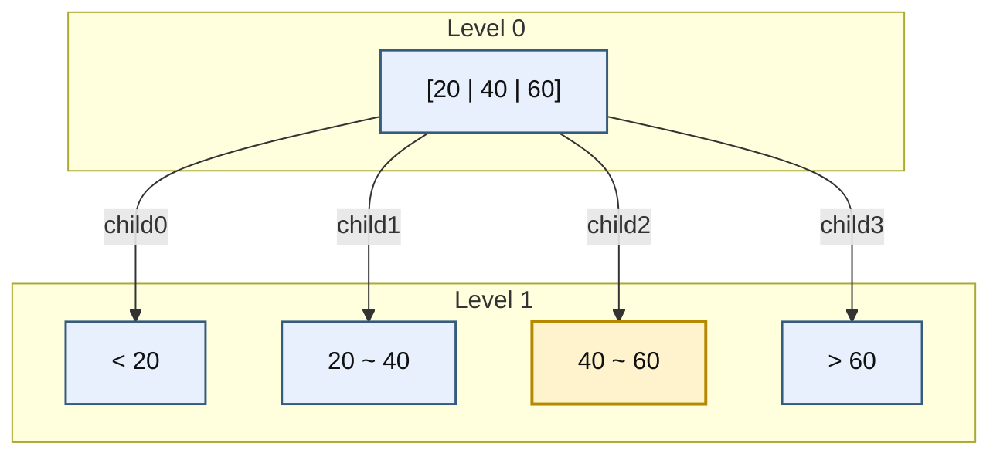
```mermaid
graph TD
	subgraph "Level 0"
		N["[20 | 40 | 60]"]
	end

	subgraph "Level 1"
		C0["< 20"]
		C1["20 ~ 40"]
		C2["40 ~ 60"]
		C3["> 60"]
	end

	N -->|"child0"| C0
	N -->|"child1"| C1
	N -->|"child2"| C2
	N -->|"child3"| C3

	classDef node_234 fill:#e8f0fe,stroke:#355c7d,color:#111,stroke-width:1.5px;
	classDef hit fill:#fff3cd,stroke:#b58900,color:#111,stroke-width:2px;
	class N,C0,C1,C3 node_234;
	class C2 hit;
```

------

### 6.4.3\_从根到叶的查找路径如何形成

虽然 2-3-4 树是多路树，但查找路径仍然只有一条。
因为每一层都只会选择一个孩子继续向下。

下面给一个完整例子。

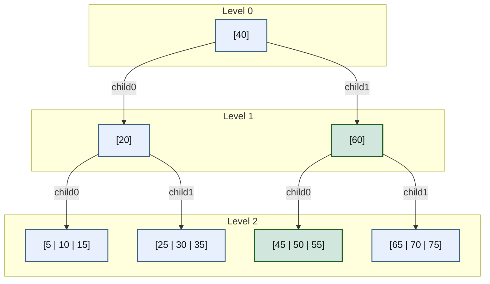
```mermaid
graph TD
	subgraph "Level 0"
		R["[40]"]
	end

	subgraph "Level 1"
		L["[20]"]
		RR["[60]"]
	end

	subgraph "Level 2"
		A["[5 | 10 | 15]"]
		B["[25 | 30 | 35]"]
		C["[45 | 50 | 55]"]
		D["[65 | 70 | 75]"]
	end

	R -->|"child0"| L
	R -->|"child1"| RR

	L -->|"child0"| A
	L -->|"child1"| B

	RR -->|"child0"| C
	RR -->|"child1"| D

	classDef node_234 fill:#e8f0fe,stroke:#355c7d,color:#111,stroke-width:1.5px;
	classDef path fill:#d1e7dd,stroke:#1b5e20,color:#111,stroke-width:2px;
	class A,B,D,L,R node_234;
	class RR,C path;
```

如果查找 `55`，路径就是：

- 根 `[40]`
- 右孩子 `[60]`
- 左孩子 `[45 | 50 | 55]`

------

### 6.4.4\_为什么\_2-3-4\_树的高度通常比\_BST\_更低

因为 2-3-4 树的一个节点里可容纳多个关键字，
而且一个节点可有更多分支。

所以在相同关键字总数下：

- BST 每层最多把空间分成 2 段；
- 2-3-4 树每层最多把空间分成 4 段。

较大的分支容量给了压低层数的机会，但不是“任意 2-3-4 树都比任意 BST 更矮”的保证；当节点都只装一个键时，它的分支数仍是 2。真正的最坏高度约束来自容量下界与所有叶子同层。

按边数定义非空树高度 h，只有根时 h=0。每个内部节点至少两个孩子、每个节点至少一个键，所以第 d 层至少有 2^d 个节点，得到 n≥1+2+…+2^h=2^(h+1)−1。反过来，每层最多按四倍扩展、每个节点最多三个键，所以 n≤3×(1+4+…+4^h)=4^(h+1)−1。因此：

```text
log4(n + 1) - 1 <= h <= log2(n + 1) - 1
```

这才是对数高度的理由。一次节点访问内部仍可能比较三个键；节点数更少不等于比较次数、CPU 时间或磁盘访问一定同比下降。具体存储布局和访问成本留到后面的页级索引讨论。

------

### 6.4.5\_2-3-4\_树查找与\_BST\_查找的本质差别

它们本质上的不同，不在于“2-3-4 树多写几个 if”，而在于结构模型不同。

| 项目           | BST          | 2-3-4 树           |
| -------------- | ------------ | ------------------ |
| 单节点关键字数 | 1            | 1~3                |
| 非叶节点孩子数 | 最多 2，可缺一侧 | 2～4，活动区间都对应非空孩子 |
| 查找动作       | 单关键字比较 | 节点内多关键字比较 |
| 树高           | 可能退化     | 叶子同层           |
| 平衡维护       | 普通 BST 插删不限制高度 | 更新必须恢复容量、区间与同层叶子 |

------

### 6.4.6\_查找算法伪代码与示例

伪代码如下：

```text
search(node, key):
    if node == null:
        return not_found

    i = 0
    while i < node.key_count and key > node.keys[i]:
        i++

    if i < node.key_count and key == node.keys[i]:
        return found

    if node is leaf:
        return not_found

    return search(node.child[i], key)
```

这个伪代码要抓住两个核心点：

1. 在当前节点中找到第一个 `>= key` 的位置；
2. 若未命中，则下降到对应区间孩子。

------

### 6.4.7\_用完整C程序观察区间下行

回到 6.4.3 的同一棵树：根是 40，第二层是 20 和 60，四片叶子各装三个键。先预测查找 55、52、40、80 的结果。55 和 52 都要走到右侧的左叶，但一个命中、一个缺失；40 在根就结束；80 会一直落到最右区间。

程序中的节点只保存关键字数量、三个键槽和四个孩子槽。数组容量描述可容纳多少元素，key_count 才说明本节点用了多少键。所有对象都是静态 const，整个程序期间存活；没有分配、插入、删除或并发。返回值携带命中的节点地址与键下标，未命中时 node 为 NULL，下标不代表一个可用结果。材料是 [tree234_search.c](../../../../labs/kernel/tree_basics/materials/tree234_search.c)。

```c
#include <assert.h>
#include <stdbool.h>
#include <stddef.h>
#include <stdio.h>

/* 只读教学模型：关键字唯一，非叶节点恰有 key_count + 1 个孩子。 */
struct tree234_node {
    unsigned int key_count;
    int keys[3];
    const struct tree234_node *children[4];
};

struct search_result {
    const struct tree234_node *node;
    unsigned int index;
    unsigned int visited_nodes;
    unsigned int compared_keys;
};

static struct search_result search_tree(const struct tree234_node *node, int key)
{
    struct search_result result = {0};
    while (node) {
        unsigned int index = 0;
        ++result.visited_nodes;
        /* 计数的是参与本轮决策的关键字，不是机器指令或耗时。 */
        while (index < node->key_count) {
            ++result.compared_keys;
            if (key <= node->keys[index])
                break;
            ++index;
        }
        if (index < node->key_count && key == node->keys[index]) {
            result.node = node;
            result.index = index;
            return result;
        }
        /* 合法叶子的所有孩子均为 NULL；未命中时自然结束。 */
        node = node->children[index];
    }
    return result;
}

static const struct tree234_node leaf_a = {3, {5, 10, 15}, {NULL}};
static const struct tree234_node leaf_b = {3, {25, 30, 35}, {NULL}};
static const struct tree234_node leaf_c = {3, {45, 50, 55}, {NULL}};
static const struct tree234_node leaf_d = {3, {65, 70, 75}, {NULL}};
static const struct tree234_node branch_l = {1, {20}, {&leaf_a, &leaf_b}};
static const struct tree234_node branch_r = {1, {60}, {&leaf_c, &leaf_d}};
static const struct tree234_node root = {1, {40}, {&branch_l, &branch_r}};

/* 与树拓扑独立的线性集合，仅供检查返回答案。 */
static bool expected_contains(int key)
{
    static const int expected[] = {
        5, 10, 15, 20, 25, 30, 35, 40, 45, 50, 55, 60, 65, 70, 75
    };
    size_t i;
    for (i = 0; i < sizeof(expected) / sizeof(expected[0]); ++i)
        if (expected[i] == key)
            return true;
    return false;
}

int main(void)
{
    static const int queries[] = {55, 52, 40, 80};
    size_t i;
    int key;
    struct search_result empty = search_tree(NULL, 40);
    assert(!empty.node && empty.visited_nodes == 0 && empty.compared_keys == 0);
    for (i = 0; i < sizeof(queries) / sizeof(queries[0]); ++i) {
        struct search_result result = search_tree(&root, queries[i]);
        printf("key=%d found=%d nodes=%u compared_keys=%u\n",
               queries[i], result.node != NULL,
               result.visited_nodes, result.compared_keys);
    }
    for (key = 0; key <= 80; ++key) {
        struct search_result result = search_tree(&root, key);
        assert((result.node != NULL) == expected_contains(key));
        if (result.node)
            assert(result.index < result.node->key_count &&
                   result.node->keys[result.index] == key);
        assert(result.visited_nodes >= 1 && result.visited_nodes <= 3);
    }
    puts("range_checks=81 passed");
    return 0;
}
```

从材料目录编译并运行：

```bash
cc -std=c11 -Wall -Wextra -Werror -pedantic tree234_search.c -o tree234_search
./tree234_search
```

预期输出为：

```text
key=55 found=1 nodes=3 compared_keys=5
key=52 found=0 nodes=3 compared_keys=5
key=40 found=1 nodes=1 compared_keys=1
key=80 found=0 nodes=3 compared_keys=5
range_checks=81 passed
```

以 55 为例，在根参与决策的键是 40，在第二层是 60，到叶子依次比较 45、50、55，所以访问三个节点，却比较五个键。compared_keys 计的是本次决策考察了几个关键字，不是条件表达式执行数、CPU 指令数或耗时。52 也考察到 55 才知道应落在它左边，但那已经是叶子，因此缺失；不能把“停在某个槽位”当作已经找到一个元素。

while 内的 index 找到第一个不小于目标的键；若相等就返回，否则 index 同时是待进入的区间编号。若所有键都小于目标，index==key_count，孩子数组仍有这个最右槽，但键数组不能再读 keys[index]。这就是命中判断中先检查 index<key_count 的原因。叶子活动孩子全为 NULL，未命中后循环结束；空树一开始就结束，两个计数都为零。

程序只接受结构已经合法的树。它没有验证 key_count 越界、环或空内部区间，也不把“不崩溃”当作输入结构正确。main 用独立线性集合对照 0～80 的答案，能检查这个有限示例的查找结果，不能证明所有可能树形或未来更新算法都正确。

先做三道练习，再进入插入。第一，把查询改为 0，预测三个节点各只考察一个键；它与 80 的访问节点数相同，比较键数却不同。第二，在纸上把右侧左叶的 45 改为 37，叶内仍然有序，但它违反了根 40 分出的祖先区间；查找 37 会去左半树，所以“每个节点内部有序”不够。第三，如果向已满的叶子 [45|50|55] 加入 52，不能仅把 key_count 改成 4：数组没有第四个合法键槽，树的容量规则也已被破坏。下一节要解决的就是怎样用分裂处理这次更新。

------

## 6.5\_2-3-4\_树的插入\_从叶子落点到节点分裂

查找已经给出落点，满叶子却不能直接接收第四个活动键。完整的两套手工推演、十一张图、传播伪代码和 C++ 实验移入[P30 插入与分裂时机](P30_2-3-4树插入与分裂时机.md#30.1_满叶子怎样接收一个新键)，先解释溢出上推，再比较下降前预分裂；重复键、临时容量与失败保持原树也在那里统一处理。

完成 P30 后回到下一节。插入遇到容量上界，删除则可能把节点降到容量下界以下；恢复区间和叶层的责任仍然相同。

## 6.6\_2-3-4\_树的删除\_借位\_合并与向下修复

容量下界、借位、合并与根收缩分别沿[P31 预修复删除](P31_2-3-4树预修复删除.md#31.1_从装不下走到不能删空)和[P32 下溢回溯](P32_2-3-4树下溢回溯与根收缩.md#32.1_把余量准备改成下溢报告)阅读。两个单元都保留完整图例和 C++ 程序；分别建立下行准备与回溯报告后，再进入下面的红黑表示对照。

### 6.6.1\_红黑树的删除操作\_以及红黑树和\_2-3-4\_树删除操作的对比

#### (1)\_为什么红黑树删除总让人觉得\_比\_2-3-4\_树更绕

2-3-4 树删除时，你看到的动作是：

- 借位
- 合并
- 根收缩
- 问题向上继续传播

这些动作非常“结构化”，因为 2-3-4 树直接把“一个逻辑节点里有几个 key”暴露出来了。
一个节点不够用，就是不够用；兄弟能借，就是能借；兄弟不能借，就只能合并。

但红黑树不是这样。
红黑树把同样的结构信息，编码进了：

- 节点颜色
- 父子关系
- 旋转方向
- 黑高是否少了一个

所以红黑树删除看起来更绕，不是因为它在做别的事，而是因为：

> **它在用二叉树的局部旋转与染色，表达 2-3-4 树里“借位 / 合并 / 下溢传播”这些多路树动作。**

因此，这一节不再把红黑树删除当作一堆孤立 case 来讲，
而是直接把它和 2-3-4 树删除放在一张图里、一类结构里、一条逻辑线上对照。

------

#### (2)\_先把红黑树删除的目标重新说死

红黑树删除时，表面上是：

1. 先按 BST 规则找到目标节点；
2. 若目标节点有两个孩子，则转成前驱 / 后继位置的删除；
3. 物理上真正删除一个“最多只有一个非空孩子”的节点；
4. 若删掉的是黑色层级，则进入 fix-up。

这一套动作里，真正困难的不是“把节点摘掉”，而是：

> **删掉一个黑节点之后，某条路径会少一个黑。**

2-3-4 树里，这对应的是：

> **某个逻辑节点删完 key 之后，容量不够了。**

所以红黑树删除 fix-up 的本质不是“修 BST”，而是：

- 修黑高
- 修逻辑节点容量
- 修 2-3-4 树编码后的局部结构失衡

------

#### (3)\_先把\_2-3-4\_树与红黑树的编码关系摆在眼前

在真正讲删除 case 之前，必须先把这层映射摆在前面。
否则对比会很飘。

##### 1)\_2-node\_与红黑树

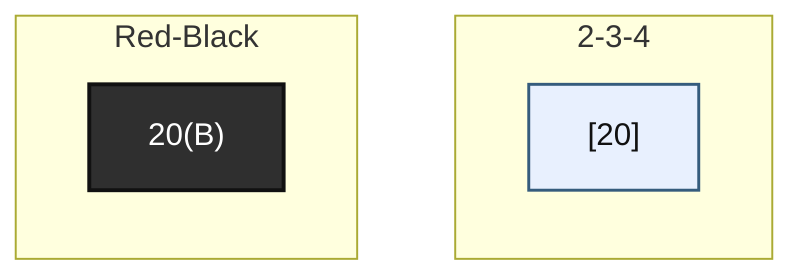
```mermaid
graph TD
	subgraph "2-3-4"
		A["[20]"]
	end

	subgraph "Red-Black"
		B["20(B)"]
	end

	classDef node234 fill:#e8f0fe,stroke:#355c7d,color:#111,stroke-width:1.5px;
	classDef black fill:#2f2f2f,stroke:#111,color:#fff,stroke-width:2px;
	class A node234;
	class B black;
```

##### 2)\_3-node\_与红黑树

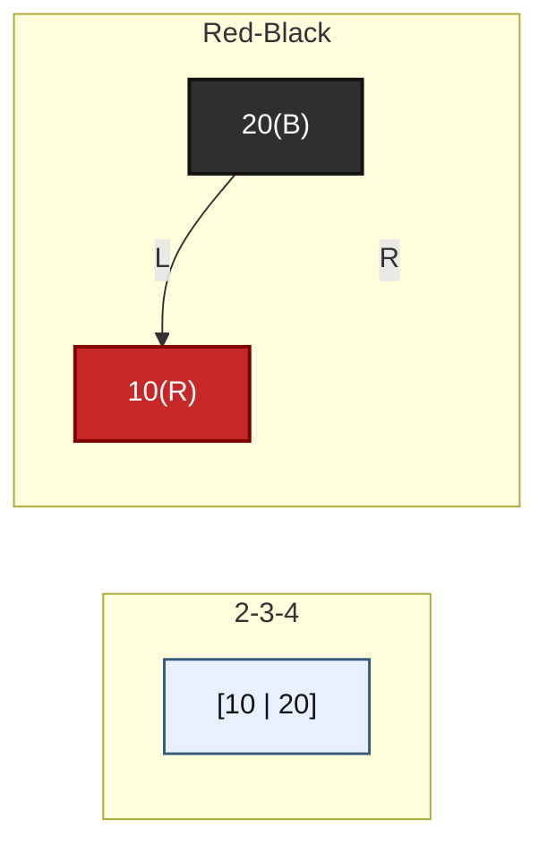
```mermaid
graph LR
	subgraph "2-3-4"
		A["[10 | 20]"]
	end

	subgraph "Red-Black"
		B["20(B)"]
		C["10(R)"]
		RG[" "]
	end

	B -->|"L"| C
	B -->|"R"| RG

	classDef node234 fill:#e8f0fe,stroke:#355c7d,color:#111,stroke-width:1.5px;
	classDef black fill:#2f2f2f,stroke:#111,color:#fff,stroke-width:2px;
	classDef red fill:#c62828,stroke:#7f0000,color:#fff,stroke-width:2px;
	classDef ghost fill:transparent,stroke:transparent,color:transparent;

	class A node234;
	class B black;
	class C red;
	class RG ghost;

	linkStyle 1 stroke:transparent;
```

##### 3)\_4-node\_与红黑树

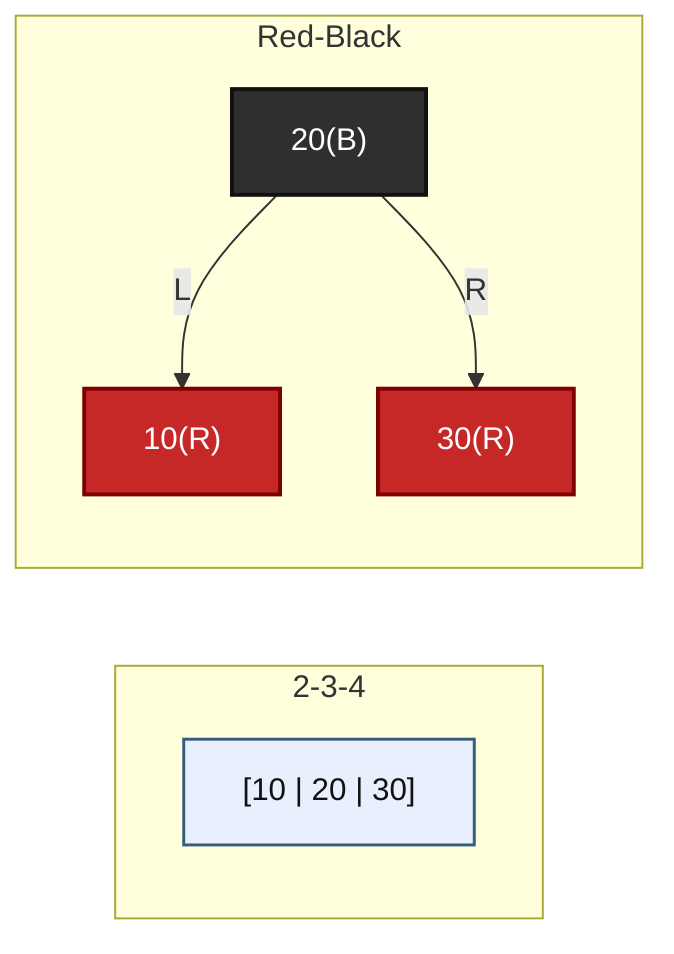
```mermaid
graph LR
	subgraph "2-3-4"
		A["[10 | 20 | 30]"]
	end

	subgraph "Red-Black"
		B["20(B)"]
		C["10(R)"]
		D["30(R)"]
	end

	B -->|"L"| C
	B -->|"R"| D

	classDef node234 fill:#e8f0fe,stroke:#355c7d,color:#111,stroke-width:1.5px;
	classDef black fill:#2f2f2f,stroke:#111,color:#fff,stroke-width:2px;
	classDef red fill:#c62828,stroke:#7f0000,color:#fff,stroke-width:2px;
	class A node234;
	class B black;
	class C,D red;
```

上面三张图必须记住。
因为后面所有“红黑树删除为什么这么修”的答案，最终都要回到一句话：

> **当前这片红黑树局部，到底对应 2-3-4 树里的哪一种逻辑节点状态。**

------

#### (4)\_红黑树删除的四类局部语义\_分别对应\_2-3-4\_树的什么

先给一张总表，再逐个讲图。

| 红黑树局部现象         | 2-3-4 树语义                                                |
| ---------------------- | ----------------------------------------------------------- |
| 删除红节点后几乎不用修 | 从 3-node / 4-node 中删掉一个非关键黑层 key，逻辑节点仍够用 |
| 兄弟黑，两个侄子都黑   | 借不到，只能合并，问题上推                                  |
| 兄弟黑，远侄红         | 可以借位，当前层就地修好                                    |
| 兄弟红                 | 当前结构不适合直接借 / 合并，要先旋转转成“兄弟黑”的标准形态 |

下面按这四类来画图。

------

#### (5)\_第一类\_删的是红节点\_对应\_2-3-4\_树里\_逻辑节点仍够用

这是最容易被忽略、但最能建立直觉的一类。

如果物理删除的是一个红节点，例如：

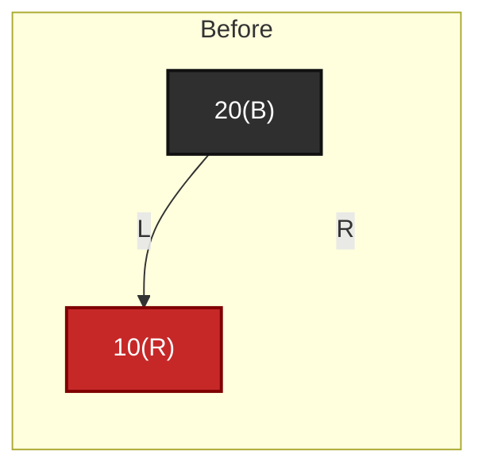
```mermaid
graph LR
	subgraph "Before"
		B["20(B)"]
		L["10(R)"]
		RG[" "]
	end

	B -->|"L"| L
	B -->|"R"| RG

	classDef black fill:#2f2f2f,stroke:#111,color:#fff,stroke-width:2px;
	classDef red fill:#c62828,stroke:#7f0000,color:#fff,stroke-width:2px;
	classDef ghost fill:transparent,stroke:transparent,color:transparent;

	class B black;
	class L red;
	class RG ghost;

	linkStyle 1 stroke:transparent;
```

删除红节点 `10(R)` 之后：

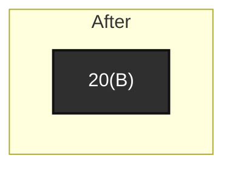
```mermaid
graph TD
	subgraph "After"
		B["20(B)"]
	end

	classDef black fill:#2f2f2f,stroke:#111,color:#fff,stroke-width:2px;
	class B black;
```

这件事在红黑树里为什么常常不需要复杂 fix-up？
因为它在 2-3-4 树里的语义其实只是：

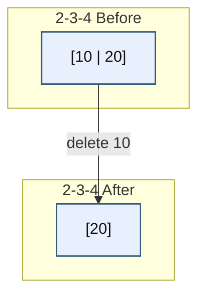
```mermaid
graph TD
	subgraph "2-3-4 Before"
		A["[10 | 20]"]
	end

	subgraph "2-3-4 After"
		B["[20]"]
	end

	A -->|"delete 10"| B

	classDef node234 fill:#e8f0fe,stroke:#355c7d,color:#111,stroke-width:1.5px;
	class A,B node234;
```

也就是说，本来是一个 3-node，删掉一个 key 后退成 2-node，
但它仍然是合法节点，没有下溢。

所以这里最重要的对照结论是：

> **红黑树里“删红节点通常简单”，不是偶然，而是因为它对应 2-3-4 树里“逻辑节点删完仍然够用”。**

------

#### (6)\_第二类\_兄弟黑且两个侄子都黑\_对应\_2-3-4\_树里的\_合并并上推问题

这是红黑树删除里最像 2-3-4 树“合并传播”的一类。

先看红黑树局部。
设当前 `x` 所在路径少了一个黑，`w` 是它的兄弟：

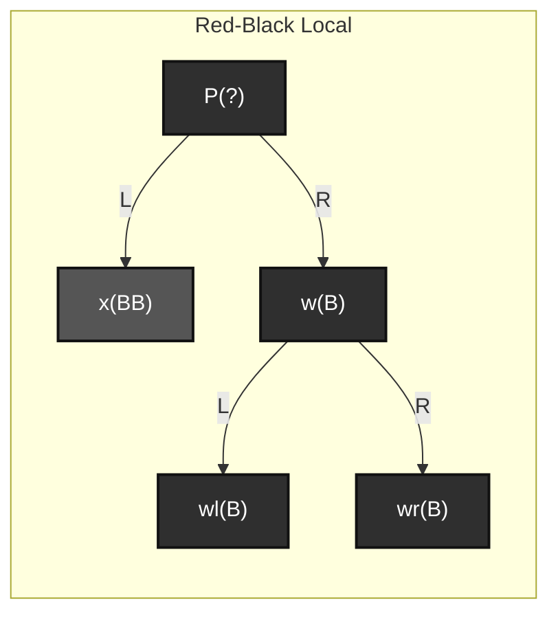
```mermaid
graph LR
	subgraph "Red-Black Local"
		P["P(?)"]
		X["x(BB)"]
		W["w(B)"]
		WL["wl(B)"]
		WR["wr(B)"]
	end

	P -->|"L"| X
	P -->|"R"| W
	W -->|"L"| WL
	W -->|"R"| WR

	classDef black fill:#2f2f2f,stroke:#111,color:#fff,stroke-width:2px;
	classDef doubleblack fill:#555,stroke:#111,color:#fff,stroke-width:2px;
	class P black;
	class W,WL,WR black;
	class X doubleblack;
```

这里的 `x(BB)` 不是说真的有个“双重黑颜色”，
而是表示：**这条路径当前少了一个黑，需要修复。**

当 `w` 是黑，且 `wl`、`wr` 都是黑时，红黑树不会立即在当前层解决问题，
而是执行：

- `w` 染红
- 缺失的黑往父节点方向继续传

也就是问题上推。

为什么？
因为这在 2-3-4 树里的对应语义就是：**当前层借不到，只能合并。**

看 2-3-4 树的等价结构：

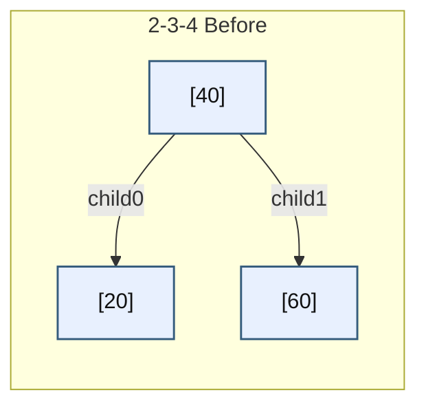
```mermaid
graph LR
	subgraph "2-3-4 Before"
		P["[40]"]
		L["[20]"]
		R["[60]"]
	end

	P -->|"child0"| L
	P -->|"child1"| R

	classDef node234 fill:#e8f0fe,stroke:#355c7d,color:#111,stroke-width:1.5px;
	class P,L,R node234;
```

现在如果左边删完 key 后不够用，而右兄弟也只有最小容量，
那就没法借位，只能把父节点 key `40` 拉下来合并：

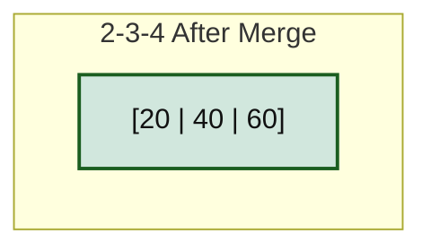
```mermaid
graph TD
	subgraph "2-3-4 After Merge"
		M["[20 | 40 | 60]"]
	end

	classDef merged fill:#d1e7dd,stroke:#1b5e20,color:#111,stroke-width:2px;
	class M merged;
```

如果父节点因此也承压，问题继续往上。
这和红黑树里“兄弟黑且两侄黑，额外黑上推”是同一件事。

所以这里最关键的对照句是：

> **红黑树里“兄弟黑且两侄黑”不是在借位，而是在做 2-3-4 树里的合并传播。**

------

#### (7)\_第三类\_兄弟黑且远侄红\_对应\_2-3-4\_树里的\_借位成功\_当前层结束

这一类是红黑树删除里最像 2-3-4 树“借位”的一类。

先看红黑树局部。
仍设 `x` 路径少黑，兄弟 `w` 为黑，并且远侄为红：

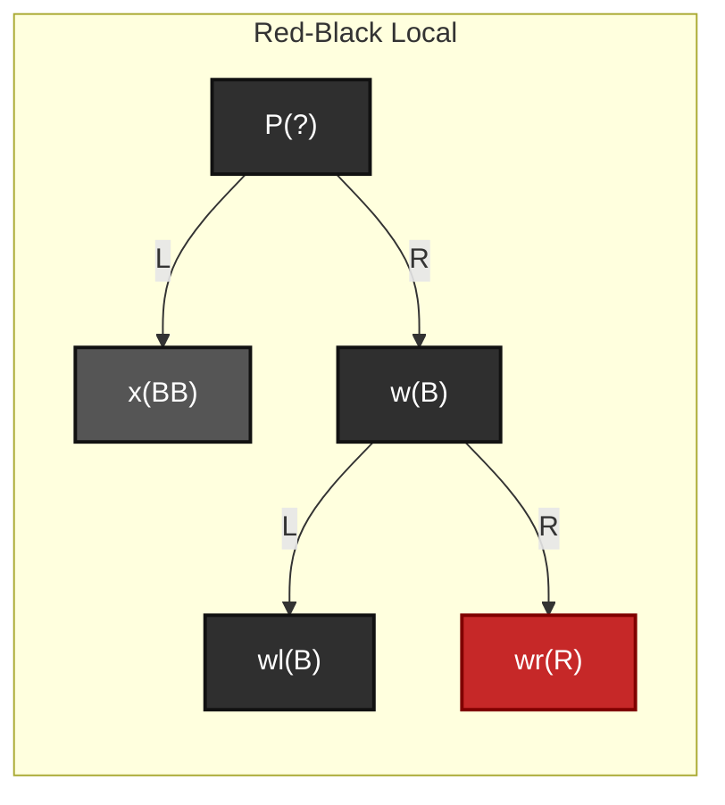
```mermaid
graph LR
	subgraph "Red-Black Local"
		P["P(?)"]
		X["x(BB)"]
		W["w(B)"]
		WL["wl(B)"]
		WR["wr(R)"]
	end

	P -->|"L"| X
	P -->|"R"| W
	W -->|"L"| WL
	W -->|"R"| WR

	classDef black fill:#2f2f2f,stroke:#111,color:#fff,stroke-width:2px;
	classDef red fill:#c62828,stroke:#7f0000,color:#fff,stroke-width:2px;
	classDef doubleblack fill:#555,stroke:#111,color:#fff,stroke-width:2px;
	class P,W,WL black;
	class WR red;
	class X doubleblack;
```

这时通过：

- 围绕父节点旋转
- 兄弟 / 父 / 远侄重新染色

可以在当前层把“少一个黑”的问题直接补平。
不会继续向上传播。

为什么这对应“借位”？
因为在 2-3-4 树里，这恰好就是：

- 目标孩子太小
- 兄弟有富余 key
- 父节点做中转
- 借一个 key 过来
- 当前层立刻恢复合法

看 2-3-4 树的对应局部：

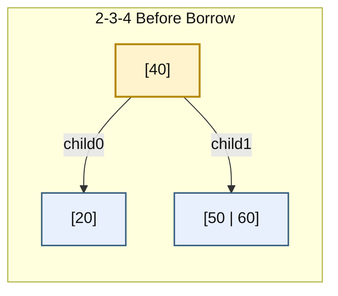
```mermaid
graph LR
	subgraph "2-3-4 Before Borrow"
		P["[40]"]
		L["[20]"]
		R["[50 | 60]"]
	end

	P -->|"child0"| L
	P -->|"child1"| R

	classDef root fill:#fff3cd,stroke:#b58900,color:#111,stroke-width:2px;
	classDef node234 fill:#e8f0fe,stroke:#355c7d,color:#111,stroke-width:1.5px;
	class P root;
	class L,R node234;
```

借位之后：

- 父中的 `40` 下移到左边
- 右兄弟中的最小 key `50` 上移到父

得到：

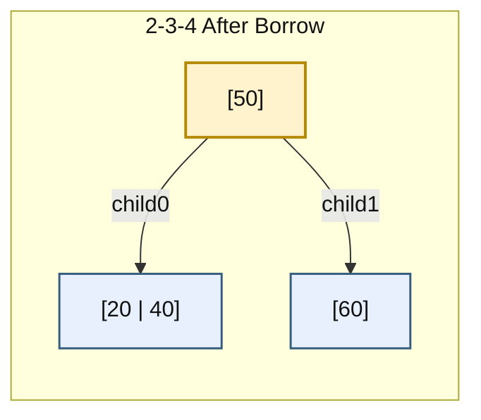
```mermaid
graph LR
	subgraph "2-3-4 After Borrow"
		P["[50]"]
		L["[20 | 40]"]
		R["[60]"]
	end

	P -->|"child0"| L
	P -->|"child1"| R

	classDef root fill:#fff3cd,stroke:#b58900,color:#111,stroke-width:2px;
	classDef node234 fill:#e8f0fe,stroke:#355c7d,color:#111,stroke-width:1.5px;
	class P root;
	class L,R node234;
```

问题当场解决，不再上推。
这和红黑树里“兄弟黑、远侄红，当前层 fix 完成”完全同构。

所以这里最关键的结论是：

> **红黑树里“远侄红”这一类，本质上就是 2-3-4 树里的借位成功。**

------

#### (8)\_第四类\_兄弟红\_对应\_先把局部改造成标准借位\_/\_合并形态

这一类如果只看红黑树教材，会觉得特别突兀：
为什么兄弟一红，就先旋转一下，再把问题转成别的 case？

原因是：
**兄弟红并不是最终修复态，而是“当前局部编码方式不方便直接借位 / 合并”的中间态。**

先看红黑树局部：

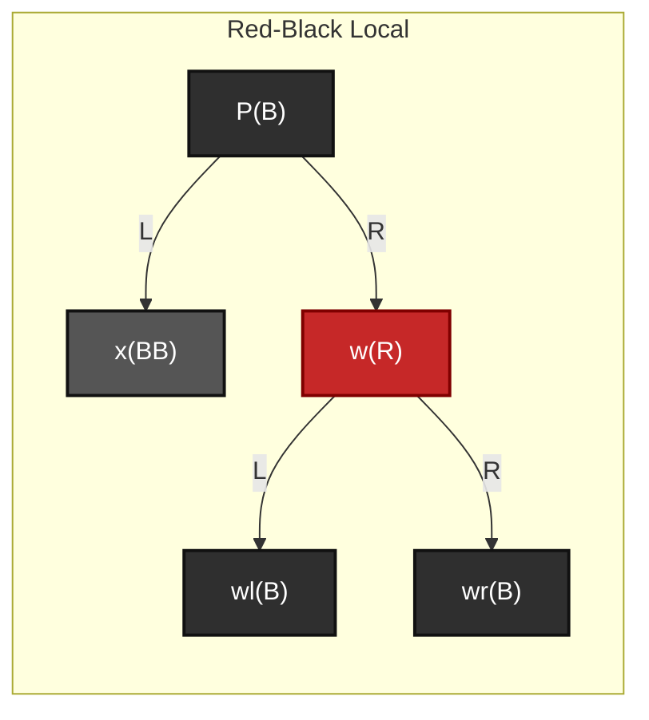
```mermaid
graph LR
	subgraph "Red-Black Local"
		P["P(B)"]
		X["x(BB)"]
		W["w(R)"]
		WL["wl(B)"]
		WR["wr(B)"]
	end

	P -->|"L"| X
	P -->|"R"| W
	W -->|"L"| WL
	W -->|"R"| WR

	classDef black fill:#2f2f2f,stroke:#111,color:#fff,stroke-width:2px;
	classDef red fill:#c62828,stroke:#7f0000,color:#fff,stroke-width:2px;
	classDef doubleblack fill:#555,stroke:#111,color:#fff,stroke-width:2px;
	class P,WL,WR black;
	class W red;
	class X doubleblack;
```

红黑树在这里通常会：

- 先对 `P` 旋转
- 交换 `P` 与 `W` 的颜色
- 把结构转成“兄弟黑”的情况
- 再继续按借位 / 合并逻辑处理

也就是说，兄弟红这一类本质上是在做：

> **结构预处理**

它不是最终语义动作。
它的目的，是把局部红黑树编码变换成一个“能直接看出是借位还是合并”的标准局面。

所以这一类在 2-3-4 树里没有一个“一步对应”的单独动作，
更接近于：

> **先把局部编码形式整理成标准借位 / 合并局面。**

如果必须用一句话压缩：

> **兄弟红不是 2-3-4 树里的独立新操作，而是红黑树二叉编码下的一次“转场动作”。**

------

#### (9)\_给出一张\_红黑树删除\_case\_to\_2-3-4\_树删除语义\_总图

为了让对比更强烈，最后给一张总图，把四类关系放到一张图里。

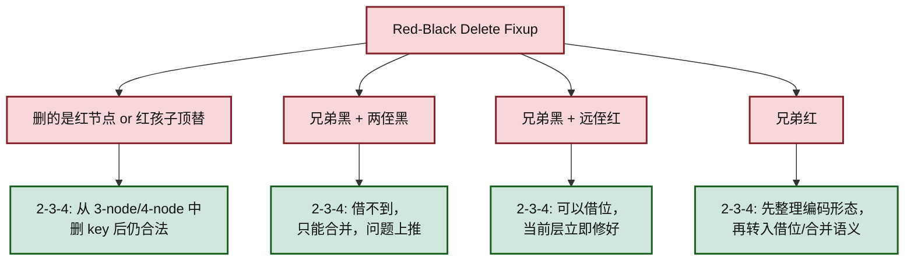
```mermaid
flowchart TD
	A["Red-Black Delete Fixup"] --> B["删的是红节点 or 红孩子顶替"]
	A --> C["兄弟黑 + 两侄黑"]
	A --> D["兄弟黑 + 远侄红"]
	A --> E["兄弟红"]

	B --> B2["2-3-4: 从 3-node/4-node 中<br/>删 key 后仍合法"]
	C --> C2["2-3-4: 借不到，<br/>只能合并，问题上推"]
	D --> D2["2-3-4: 可以借位，<br/>当前层立即修好"]
	E --> E2["2-3-4: 先整理编码形态，<br/>再转入借位/合并语义"]

	classDef rb fill:#f8d7da,stroke:#842029,color:#111,stroke-width:2px;
	classDef t234 fill:#d1e7dd,stroke:#1b5e20,color:#111,stroke-width:2px;
	class A,B,C,D,E rb;
	class B2,C2,D2,E2 t234;
```

这张图的作用不是总结名词，而是帮你牢牢记住：

- 红黑树删除 fix-up 不是凭空存在的
- 它始终在表达 2-3-4 树删除中的那几类核心语义

------

#### (10)\_红黑树删除代码骨架\_应该怎样理解

最后把代码骨架再放一遍，但这次不把它当“语法”，而是当“结构翻译器”来看。

```cpp
rb_delete(tree, z):
    y = z
    y_original_color = y.color

    if z.left == NIL:
        x = z.right
        transplant(z, z.right)

    else if z.right == NIL:
        x = z.left
        transplant(z, z.left)

    else:
        y = tree_minimum(z.right)
        y_original_color = y.color
        x = y.right

        if y.parent != z:
            transplant(y, y.right)
            y.right = z.right
            y.right.parent = y

        transplant(z, y)
        y.left = z.left
        y.left.parent = y
        y.color = z.color

    if y_original_color == BLACK:
        rb_delete_fixup(tree, x)
```

这段代码的关键不是“记住 transplant 怎么写”，而是理解：

- 前半段做的是 BST 删除化简；
- 真正的 2-3-4 树语义修复，集中在 `rb_delete_fixup(tree, x)`；
- `fixup` 里的旋转与染色，不是在修 BST，而是在补 2-3-4 树删除后的黑高 / 容量问题。

所以你看红黑树删除代码时，应当在脑子里同步翻译：

- 这是在借位吗？
- 这是在合并吗？
- 这是在把问题往上推吗？
- 这是在先做一次结构预处理吗？

只要这样看，红黑树删除就不会再是一堆“为什么突然旋转”的孤立片段。

------

#### (11)\_本小节小结

这一版重新整理后，最应该记住的是下面五条。

第一，红黑树删除之所以看起来比 2-3-4 树删除更绕，不是因为它做了更多事情，而是因为它把多路树的删除语义编码成了二叉树上的旋转与染色。
第二，删除红节点通常简单，对应 2-3-4 树里“逻辑节点删掉一个 key 后仍然够用”。
第三，兄弟黑且两个侄子都黑，对应 2-3-4 树里的“借不到，只能合并，问题上推”。
第四，兄弟黑且远侄红，对应 2-3-4 树里的“借位成功，当前层直接修好”。
第五，兄弟红不是一种最终修复语义，而是红黑树编码下的一次“转场动作”，目的是把局部形态转成标准借位 / 合并局面。

------

## 6.7\_2-3-4\_树为什么天然平衡

### 6.7.1\_平衡的关键不是\_左右对称\_而是\_所有叶子同层

2-3-4 树的平衡定义，不是几何意义上的左右对称。
它真正关心的是：

> **所有根到叶路径长度一致。**

因此，局部节点关键字数不一致并不会破坏平衡。

------

### 6.7.2\_为什么节点扩张不会破坏整体平衡

向一个 2-node 或 3-node 中插入关键字时，
只是该节点内部关键字数增加，并没有让某条路径额外增加层数。

所以节点扩张不会导致单边下沉。

------

### 6.7.3\_为什么分裂只会增加局部高度\_不会造成单边退化

只有根分裂才会使整棵树增高。
而根分裂带来的不是“一边更深”，而是“所有原有叶子整体下一层”。

所以 2-3-4 树增高的方式是**整体增高**，不是 BST 那种单侧拉长。

------

### 6.7.4\_为什么借位与合并可以在删除中维持层高一致

借位只是关键字重分配，不改变层数。
合并虽然减少了节点数，但只会在必要时通过根缩减，让整棵树统一减高一层。

因此删除修复过程中，层高变化也是全局一致的，不会破坏“叶子同层”。

------

### 6.7.5\_2-3-4\_树平衡机制与\_BST\_平衡机制的根本差异

BST 的问题是：

- 节点容量固定为 1；
- 插入只能沿一条路径往下挂；
- 不利输入序列会单边退化。

2-3-4 树的不同点在于：

- 节点先内部扩张；
- 满了再分裂；
- 删除时先借位或合并，再下降；
- 叶层始终齐平。

所以 2-3-4 树不是“事后补救退化”，而是“从定义上避免退化”。

------

## 6.8\_从\_2-3-4\_树到红黑树\_真正的桥梁在哪里

### 6.8.1\_为什么红黑树不是凭空出现的一组颜色规则

红黑树的颜色规则不是装饰性质。
它们实际上承担的是一种二叉编码任务：

- 用黑节点表达多路树骨架层级；
- 用红节点表达逻辑节点内部的关键字合并；
- 用黑高一致表达叶子同层。

所以红黑树不是“多了一位颜色属性的 BST”，
而是“2-3-4 树的二叉表示”。

我需要在这里强调一个点：

> 不是说这里的 2-3-4树 节点 与 红黑树节点 的转化只有一种形态，是根据个人算法使用的代码规则来规定怎么转化姿态的。所以下面的映射关系是由于代码约束选了一种之后进行的姿态调整，并不是唯一的，或者官方定死的。

------

### 6.8.2\_2-node\_如何映射到红黑树

2-node：

```json
[20]
```

映射成红黑树时，就是一个黑节点。

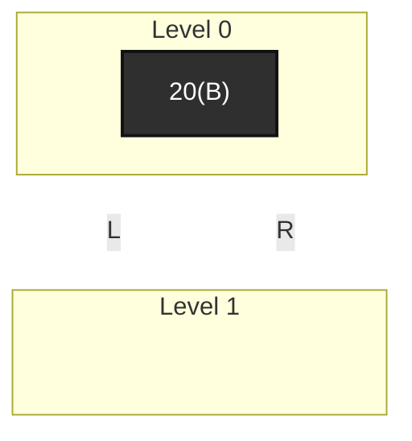
```mermaid
graph TD
	subgraph "Level 0"
		N["20(B)"]
	end

	subgraph "Level 1"
		LG[" "]
		RG[" "]
	end

	N -->|"L"| LG
	N -->|"R"| RG

	classDef black_node fill:#2f2f2f,stroke:#111,color:#fff,stroke-width:2px;
	classDef ghost fill:transparent,stroke:transparent,color:transparent;
	class N black_node;
	class LG,RG ghost;
	linkStyle 0 stroke:transparent;
	linkStyle 1 stroke:transparent;
```

------

### 6.8.3\_3-node\_如何映射到红黑树

3-node：

```text
[10 | 20]
```

可被编码成“一个黑节点 + 一个红节点”的逻辑组合。

为了建立直觉，这里采用左倾画法：

```mermaid
graph TD
	subgraph "Level 0"
		B["20(B)"]
	end

	subgraph "Level 1"
		R["10(R)"]
		RG[" "]
	end

	subgraph "Level 2"
		G1[" "]
		G2[" "]
	end

	B -->|"L"| R
	B -->|"R"| RG
	R -->|"L"| G1
	R -->|"R"| G2

	classDef black_node fill:#2f2f2f,stroke:#111,color:#fff,stroke-width:2px;
	classDef red_node fill:#c62828,stroke:#7f0000,color:#fff,stroke-width:2px;
	classDef ghost fill:transparent,stroke:transparent,color:transparent;
	class B black_node;
	class R red_node;
	class RG,G1,G2 ghost;
	linkStyle 1 stroke:transparent;
	linkStyle 2 stroke:transparent;
	linkStyle 3 stroke:transparent;
```

这里表达的不是“真的多出一个逻辑层”，
而是：

> 红节点应与黑父共同解释为一个逻辑 3-node。

上推的都遵循：**上黑下红** 的原则。由于 **黑色** 表示层级，所以 **红色节点** 与 **黑色父节点** 表示 **同层级**。

------

### 6.8.4\_4-node\_如何映射到红黑树

4-node：

```text
[10 | 20 | 30]
```

典型编码如下：

```mermaid
graph TD
	subgraph "Level 0"
		B["20(B)"]
	end

	subgraph "Level 1"
		L["10(R)"]
		R["30(R)"]
	end

	subgraph "Level 2"
		G1[" "]
		G2[" "]
		G3[" "]
		G4[" "]
	end

	B -->|"L"| L
	B -->|"R"| R
	L -->|"L"| G1
	L -->|"R"| G2
	R -->|"L"| G3
	R -->|"R"| G4

	classDef black_node fill:#2f2f2f,stroke:#111,color:#fff,stroke-width:2px;
	classDef red_node fill:#c62828,stroke:#7f0000,color:#fff,stroke-width:2px;
	classDef ghost fill:transparent,stroke:transparent,color:transparent;
	class B black_node;
	class L,R red_node;
	class G1,G2,G3,G4 ghost;
	linkStyle 2 stroke:transparent;
	linkStyle 3 stroke:transparent;
	linkStyle 4 stroke:transparent;
	linkStyle 5 stroke:transparent;
```

这个图是后面理解“父红叔红”最关键的结构基础。
因为一个黑节点带两个红孩子，本质上正对应逻辑 4-node。

------

### 6.8.5\_红链接为什么可以理解为\_逻辑合并

红边的结构语义是：

> 被红边连接的节点，不应被看成新的黑层级骨架，而应并入某个黑节点所代表的逻辑节点中。

因此：

- 红节点不是独立的新逻辑层；
- 它是逻辑节点内部关键字的二叉展开形式。

这就是“红链接 = 逻辑合并”的准确含义。

------

### 6.8.6\_颜色在红黑树里承担的结构语义是什么

颜色在红黑树里不是装饰，而是结构控制信息。

#### (1)\_黑色的语义

- 定义骨架层级；
- 保证黑高一致；
- 对应 2-3-4 树中“叶子同层”的平衡约束。

#### (2)\_红色的语义

- 表示逻辑合并；
- 用于把多个物理节点组合成一个 3-node 或 4-node。

所以颜色不是“为了修复方便才加的标签”，
而是“用二叉节点表达多关键字节点的编码标记”。

------

### 6.8.7\_2-3-4\_树插入分裂如何对应红黑树插入修复

2-3-4 树插入时，核心事件是：

- 节点扩张；
- 满节点分裂；
- 中间关键字上推。

映射到红黑树时，对应的就是：

- 临时形成逻辑 4-node；
- 染色翻转；
- 必要时旋转，使二叉表示恢复合法。

可以把它理解为：

| 2-3-4 树事件       | 红黑树动作         |
| ------------------ | ------------------ |
| 逻辑 4-node 出现   | 黑父带红孩子的组合 |
| 4-node 分裂        | 染色上推           |
| 二叉表示方向不合适 | 先旋转，再染色     |

------

### 6.8.8\_2-3-4\_树删除中的借位\_/\_合并如何对应红黑树删除修复

删除中，两者的对应更明显。

2-3-4 树删除时：

- 目标孩子太小，就先借位；
- 借不到，就合并；
- 若父受影响，继续向上。

红黑树删除时：

- 删除黑节点会让黑高不足；
- 要通过兄弟、父、侄子的颜色关系修复；
- 修复通过旋转与染色传播。

所以红黑树删除修复的本质，其实是在用二叉结构模拟：

- 借位；
- 合并；
- 缺黑上推。

------

## 6.9\_2-3-4\_树的现实意义\_从多路平衡到\_B+\_树的页级索引思想

### 6.9.1\_章节内容说明

前面几节已经说明了 2-3-4 树的结构、不变量、插入分裂、删除合并，以及它与红黑树之间的映射关系。到这里还需要回答一个更现实的问题：

> 既然已经有 AVL 树、红黑树这样的平衡 BST，为什么还需要研究 2-3-4 树以及它扩展出的 B 树、B+ 树？

这个问题不能只从“比较次数”上理解。
在内存、数据库、文件系统、KV 存储中，真正影响性能的不只是 CPU 比较了多少次 key，而是：

```text
访问了多少个节点；
这些节点是否连续；
是否命中 cache line；
是否命中 TLB；
是否命中 buffer pool；
是否命中 page cache；
是否触发磁盘或 SSD 随机 I/O；
是否支持范围扫描；
写入之后能否形成可被高效读取的有序结构。
```

2-3-4 树本身可以看作低阶 B 树。它的现实意义不只是帮助理解红黑树，更重要的是：

```text
它把“一个节点只存一个 key 的二叉搜索模型”，
扩展成了“一个节点存多个 key 的多路搜索模型”。
```

这正是 B 树、B+ 树进入数据库、文件系统、KV 存储的基础。

------

### 6.9.2\_为什么不能只从\_平衡\_BST\_理解查找树

AVL 树、红黑树已经解决了普通 BST 的退化问题。它们保证树高在对数级，因此查找、插入、删除都有稳定上界。

但是 AVL 树和红黑树的节点模型仍然是二叉节点：

```mermaid
graph TD
	rb_node["红黑树节点: 1 个 key"]
	left_child["left child"]
	right_child["right child"]

	rb_node --> left_child
	rb_node --> right_child
```

这种结构适合内存对象管理，例如 Linux 内核中的 rbtree：

```c
struct demo_node {
	int 			key;
	struct rb_node 	 node;
};
```

每个业务对象嵌入一个 `rb_node`，节点大小固定，适合 intrusive 结构。

但是数据库、文件系统、KV 存储面对的问题并不只是：

```text
如何比较 key；
如何保持树高为 O(log n)。
```

它们还要面对：

```text
如何减少 page 访问；
如何减少 block 访问；
如何减少随机 I/O；
如何让范围扫描尽量连续；
如何让上层索引页常驻缓存；
如何让逻辑有序映射到物理局部性。
```

因此，多路平衡树并不是在“替代红黑树”，而是在解决另一个层面的工程问题：

```text
红黑树：适合内存中的对象级有序索引；
B/B+ 树：适合 page/block 级的有序索引。
```

------

### 6.9.3\_从\_2-3-4\_树看多路节点的意义

2-3-4 树的节点可以保存 1、2、3 个 key，并对应 2、3、4 个孩子。

```mermaid
graph TD
	node_234["2-3-4 节点: 10 | 20 | 30"]

	child_0["child 0: key < 10"]
	child_1["child 1: 10 <= key < 20"]
	child_2["child 2: 20 <= key < 30"]
	child_3["child 3: key >= 30"]

	node_234 --> child_0
	node_234 --> child_1
	node_234 --> child_2
	node_234 --> child_3
```

这个结构说明：

```text
一个节点不一定只能做一次二分判断；
一个节点可以通过多个 key，把数据集合切成多个区间。
```

红黑树中，一个节点通常只保存一个 key，因此每访问一个节点，只能决定向左还是向右。

2-3-4 树中，一个节点保存多个 key，因此一次节点访问可以选择多个分支之一。

这个思想继续扩展，就形成了 B 树和 B+ 树：

```mermaid
graph TD
	tree_234["2-3-4 树"]
	b_tree["B 树"]
	b_plus_tree["B+ 树"]

	tree_234 --> b_tree
	b_tree --> b_plus_tree
```

2-3-4 树是最低阶的多路平衡树模型。
B 树、B+ 树则把“一个节点多个 key、多个 child”的思想扩大到 page/block 粒度。

------

### 6.9.4\_key\_是什么\_它是排序规则和范围划分的载体

在 B+ 树家族中，key 不只是一个普通数值。更准确地说：

```text
key = 可比较、可排序、可用于划分搜索范围的字段或字段组合。
```

例如数据库中：

```sql
create index idx_age on user(age);
```

此时 `age` 是索引 key。

又例如：

```sql
create index idx_city_age on user(city, age);
```

此时 `(city, age)` 是联合 key。

B+ 树并不关心业务语义，它只要求 key 能够比较：

```text
key_a < key_b
key_a = key_b
key_a > key_b
```

key 在 B+ 树中主要有三种角色：

```mermaid
graph TD
	key["key"]

	leaf_key["叶子节点中的真实索引 key"]
	separator_key["内部节点中的 separator key"]
	query_key["查询时输入的 search key"]

	key --> leaf_key
	key --> separator_key
	key --> query_key
```

其中，内部节点中的 key 通常不是完整数据，而是用于划分子树范围的 separator key。

例如：

```mermaid
graph TD
	root["root page: 30 | 60"]

	child_0["child 0: key < 30"]
	child_1["child 1: 30 <= key < 60"]
	child_2["child 2: key >= 60"]

	root --> child_0
	root --> child_1
	root --> child_2
```

如果查询 `key = 45`，只需要根据 separator key 判断：

```text
30 <= 45 < 60
```

然后访问 `child_1`。

所以 key 的核心用途是：

```text
在内部节点中裁剪搜索范围；
在叶子节点中定位真实记录或记录引用；
在范围扫描中确定起点和终点。
```

------

### 6.9.5\_随机插入与有序结果

B+ 树面对的插入输入通常是随机的。

例如插入顺序可能是：

```text
50, 3, 90, 17, 62, 8, 100, 41
```

B+ 树不能提前知道下一个 key 是什么，因此它无法保证写入输入天然有序。

但是 B+ 树会在每次插入时执行受控插入：

```mermaid
graph TD
	random_insert["随机到来的 key"]
	find_leaf["根据 key 定位目标 leaf page"]
	insert_slot["在 leaf page 内找到有序插入位置"]
	keep_order["保持 leaf page 内 key 有序"]
	split_if_needed["页满时执行 split"]
	update_parent["更新父节点 separator key"]
	ordered_tree["形成有序 B+ 树结构"]

	random_insert --> find_leaf
	find_leaf --> insert_slot
	insert_slot --> keep_order
	keep_order --> split_if_needed
	split_if_needed --> update_parent
	update_parent --> ordered_tree
```

因此，关键不是：

```text
插入输入是否有序。
```

而是：

```text
随机输入经过 B+ 树维护之后，结果结构是否有序。
```

B+ 树优化的不是随机写入输入本身，而是写入完成后的索引结构。

可以概括为：

```text
随机写入是输入；
受控插入是过程；
有序索引是结果；
高效查询是收益。
```

------

### 6.9.6\_B+\_树优化的主要对象是读操作

B+ 树写入时需要维护结构：

```text
页内插入；
页内移动；
页分裂；
父节点 separator key 更新；
必要时继续向上分裂；
根节点可能增长。
```

这些都是写入阶段的成本。

但是这些成本换来的结果是：查询时可以使用稳定的有序结构。

点查路径如下：

```mermaid
graph TD
	query["查询 key"]
	root["root page"]
	internal["internal page"]
	leaf["leaf page"]
	result["目标记录或记录引用"]

	query --> root
	root --> internal
	internal --> leaf
	leaf --> result
```

范围查询路径如下：

```mermaid
graph TD
	locate_start["定位范围起点"]
	leaf_1["leaf page 1"]
	leaf_2["leaf page 2"]
	leaf_3["leaf page 3"]
	stop["到达范围终点"]

	locate_start --> leaf_1
	leaf_1 --> leaf_2
	leaf_2 --> leaf_3
	leaf_3 --> stop
```

因此，B+ 树的核心收益主要体现在读路径：

```text
点查时减少树高；
每层访问一个 page；
页内连续比较多个 key；
root/internal page 更容易被缓存；
范围扫描可以沿叶子层推进；
不需要每个 key 都重新从 root 查找。
```

所以不能说 B+ 树让随机写入本身消失。
更准确地说：

```text
B+ 树用写入阶段的维护成本，换取读取阶段的稳定、高效、有序访问路径。
```

------

### 6.9.7\_为什么\_减少访问页面次数\_有物理意义

在抽象算法中，通常只计算比较次数。
但在真实系统中，访问一个地址并不是统一成本。

CPU、内存、缓存、页表、数据库 buffer pool、文件系统 page cache、磁盘设备之间存在明显层次。

```mermaid
graph TD
	cpu_compare["CPU 比较 key"]
	cache_line["cache line 命中或未命中"]
	tlb["TLB 命中或未命中"]
	memory["内存访问"]
	buffer_pool["数据库 buffer pool"]
	page_cache["OS page cache"]
	block_device["磁盘或 SSD"]

	cpu_compare --> cache_line
	cache_line --> tlb
	tlb --> memory
	memory --> buffer_pool
	buffer_pool --> page_cache
	page_cache --> block_device
```

因此，“减少页面访问次数”的含义包括：

```text
减少 cache miss；
减少 TLB miss；
减少 buffer pool miss；
减少 page cache miss；
减少随机 block I/O；
减少页锁或闩锁获取次数；
减少范围扫描时的重复路径查找。
```

红黑树的访问模式通常是指针追逐：

```mermaid
graph TD
	node_a["node A"]
	node_x["node X"]
	node_m["node M"]
	node_q["node Q"]

	node_a --> node_x
	node_x --> node_m
	node_m --> node_q
```

下一次访问哪个节点，必须等当前节点加载后才能知道。

这种访问属于依赖式加载：

```mermaid
graph TD
	load_node["读取当前 node"]
	compare_key["比较 key"]
	read_child["读取 left/right 指针"]
	load_next["加载下一个 node"]

	load_node --> compare_key
	compare_key --> read_child
	read_child --> load_next
```

B+ 树的访问模式则不同：

```mermaid
graph TD
	load_page["读取一个 page"]
	search_keys["在 page 内连续比较多个 key"]
	select_child["选择一个 child_ref"]
	load_child_page["访问下一层 page"]

	load_page --> search_keys
	search_keys --> select_child
	select_child --> load_child_page
```

B+ 树没有消灭随机访问，但它减少了跨页随机访问次数。
一次 page 访问可以完成多个 key 的范围判断。

------

### 6.9.8\_页内连续访问为什么比指针跳转更容易优化

数组下标访问通常快，不是因为语法上使用了 `array[i]`，而是因为它具备以下性质：

```text
地址可计算；
数据连续；
cache line 利用率高；
TLB 局部性好；
硬件预取器容易识别访问模式。
```

页内 key 连续存储时：

```mermaid
graph TD
	page["B+ 树 page"]
	key_array["key array: k1 k2 k3 ... kN"]
	child_array["child_ref array: c0 c1 c2 ... cN"]

	page --> key_array
	page --> child_array
```

CPU 访问一个 key 时，可能会把同一个 cache line 中的相邻 key 一起带入缓存。

```mermaid
graph TD
	access_key_0["访问 key 0"]
	load_cache_line["加载整个 cache line"]
	key_1_ready["key 1 已在 cache line"]
	key_2_ready["key 2 已在 cache line"]
	key_3_ready["key 3 已在 cache line"]

	access_key_0 --> load_cache_line
	load_cache_line --> key_1_ready
	load_cache_line --> key_2_ready
	load_cache_line --> key_3_ready
```

而指针跳转访问中，节点可能分布在不同地址甚至不同页中：

```mermaid
graph TD
	addr_a["地址 A"]
	addr_x["地址 X"]
	addr_m["地址 M"]
	addr_q["地址 Q"]

	addr_a --> addr_x
	addr_x --> addr_m
	addr_m --> addr_q
```

此时硬件预取器很难提前知道下一个地址。

所以，“访问谁不是访问”在抽象逻辑中看似成立，但在真实硬件中不成立。

真实差异在于：

```text
连续访问更容易命中 cache；
随机跳转更容易 cache miss；
连续访问更容易命中 TLB；
随机跳转更容易 TLB miss；
连续访问可以被预取；
依赖式指针跳转很难被预取。
```

------

### 6.9.9\_B+\_树中的\_指针\_实际是什么

在内存教学模型中，可以把 B+ 树节点写成：

```c
#define DEMO_MAX_KEYS	128

struct demo_bplus_node {
	unsigned int nr_keys;
	int keys[DEMO_MAX_KEYS];
	struct demo_bplus_node *children[DEMO_MAX_KEYS + 1];
};
```

这里的 `children[]` 是真实内存指针。

但是数据库、文件系统、KV 存储中的持久化结构通常不会直接保存裸指针。

因为裸指针只在当前进程、当前虚拟地址空间、当前运行时有效。
持久化文件中通常保存的是稳定定位符，例如：

```text
page id；
block number；
file offset；
extent address；
tuple id；
row id；
primary key；
block handle。
```

可以这样理解：

```mermaid
graph TD
	logical_ref["逻辑定位符: page_id / block_no / file_offset"]
	cache_layer["buffer pool / page cache / mmap"]
	runtime_addr["运行时内存地址"]
	c_pointer["临时 C 指针"]

	logical_ref --> cache_layer
	cache_layer --> runtime_addr
	runtime_addr --> c_pointer
```

所以真实系统中不是没有指针，而是分成两层：

```text
持久化结构：保存稳定定位符；
运行时访问：通过缓存映射得到临时内存地址。
```

------

### 6.9.10\_逻辑有序不等于物理连续

B+ 树能够保证：

```text
key 逻辑有序；
子树范围有序；
叶子层逻辑有序；
所有叶子处于同一层；
节点容量受控。
```

但是它不能单独保证：

```text
逻辑相邻的 leaf page 在物理内存中一定相邻；
逻辑相邻的 leaf page 在磁盘块上一定连续；
随机插入产生的新页一定分配在旧页旁边。
```

例如逻辑顺序可能是：

```mermaid
graph TD
	leaf_1["leaf 1: key 1..100"]
	leaf_2["leaf 2: key 101..200"]
	leaf_3["leaf 3: key 201..300"]

	leaf_1 --> leaf_2
	leaf_2 --> leaf_3
```

但是物理块可能是：

```text
leaf_1 -> block 1000
leaf_2 -> block 8921
leaf_3 -> block 331
```

这说明：

```text
B+ 树直接维护逻辑有序；
物理局部性需要空间分配器进一步配合。
```

空间分配器可以尝试让逻辑相邻页物理上也尽量接近：

```mermaid
graph TD
	logical_order["B+ 树叶子层逻辑有序"]
	allocator["页分配器 / extent 分配器"]
	physical_locality["尽量形成物理局部性"]
	range_scan["范围扫描更接近顺序访问"]

	logical_order --> allocator
	allocator --> physical_locality
	physical_locality --> range_scan
```

因此，本节要明确区分：

| 层次           | B+ 树是否直接保证 | 说明                  |
| -------------- | ----------------- | --------------------- |
| key 逻辑有序   | 保证              | B+ 树核心不变量       |
| 树高平衡       | 保证              | 所有叶子同层          |
| 页内 key 紧凑  | 通常保证          | 由页结构维护          |
| 叶子层逻辑顺序 | 保证              | 支持范围扫描          |
| 物理地址连续   | 不保证            | 依赖分配器            |
| 磁盘块连续     | 不保证            | 依赖文件系统/存储引擎 |

所以，正确理解是：

```text
B+ 树为物理局部性创造条件；
但物理局部性不是 B+ 树单独完成的结果。
```

------

### 6.9.11\_写操作可以拆成逻辑修改与空间分配

B+ 树的写操作可以分成几个阶段：

```mermaid
graph TD
	write_op["一次写操作"]
	logical_insert["逻辑插入"]
	page_modify["页内容修改"]
	space_alloc["空间分配"]
	persist_write["持久化写入"]

	write_op --> logical_insert
	write_op --> page_modify
	write_op --> space_alloc
	write_op --> persist_write
```

其中：

```text
逻辑插入：根据 key 找到 leaf page；
页内容修改：插入 key，必要时移动记录；
空间分配：页满时分配新页；
持久化写入：通过 WAL、COW 或后台刷盘落盘。
```

随机写入本身不可预估，但写路径仍然可以被工程系统优化。

例如：

```text
WAL 可以顺序写；
dirty page 可以延迟刷盘；
多个脏页可以批量写回；
页分配器可以尽量分配邻近页；
bulk load 可以先排序再构建索引；
fill factor 可以预留页内空间，减少分裂。
```

因此，不能说写操作完全不可优化。
更准确地说：

```text
随机 key 分布不可预估；
但是写入执行路径可以优化。
```

B+ 树写操作的直接目标是维护有序结构。
空间分配和持久化系统则进一步尝试把逻辑有序转化为物理局部性。

------

### 6.9.12\_数据库中的\_B+\_树应用

数据库索引通常需要支持：

```text
等值查询；
范围查询；
排序；
分页；
前缀匹配；
聚簇存储；
二级索引回表。
```

B+ 树非常适合这些操作。

以数据库表为例：

```text
id      name      age
----------------------
10      a         18
20      b         21
30      c         25
40      d         30
```

如果对 `id` 建立 B+ 树索引，则叶子层可以保存：

```mermaid
graph TD
	root["root: 30"]

	leaf_1["leaf: 10 -> row_ref_10 | 20 -> row_ref_20"]
	leaf_2["leaf: 30 -> row_ref_30 | 40 -> row_ref_40"]

	root --> leaf_1
	root --> leaf_2

	leaf_1 --> leaf_2
```

查询 `id = 40` 时：

```text
访问 root；
判断 40 >= 30；
访问右侧 leaf；
在 leaf 中找到 40。
```

范围查询 `id between 20 and 40` 时：

```text
先定位 key = 20 所在 leaf；
然后沿叶子层继续扫描到 key = 40。
```

这正是 B+ 树相比普通平衡 BST 的重要优势：

```text
点查路径短；
范围扫描天然有序；
叶子页可以顺序推进；
上层内部页容易缓存。
```

------

### 6.9.13\_文件系统中的\_B/B+\_树应用

文件系统管理的不是数据库行，而是：

```text
inode；
目录项；
文件逻辑偏移；
物理块地址；
extent；
空闲空间；
checksum；
引用计数；
快照元数据。
```

例如文件 extent 映射可以抽象为：

```text
文件逻辑偏移范围 -> 磁盘物理块范围
```

图示如下：

```mermaid
graph TD
	file_offset["文件逻辑偏移"]
	extent_tree["extent tree"]
	extent_item["extent: logical_start, length, physical_start"]
	disk_blocks["磁盘物理块范围"]

	file_offset --> extent_tree
	extent_tree --> extent_item
	extent_item --> disk_blocks
```

当文件很大时，如果没有有序索引，查找某个文件偏移对应的物理块就可能需要扫描大量元数据。

使用 B/B+ 树后，可以按逻辑偏移快速定位 extent。

文件系统中的 B 树家族通常用于：

```text
从文件偏移查物理块；
从目录 key 查目录项；
从物理块查引用者；
从地址范围查 checksum；
从空间范围查空闲块；
管理快照和引用计数。
```

所以 B/B+ 树在文件系统中的意义是：

```text
组织大规模有序元数据；
支持范围查找；
支持局部更新；
支持页/块级缓存；
降低元数据查找路径长度。
```

------

### 6.9.14\_KV\_存储中的\_B+\_树与\_LSM\_对比

KV 存储中常见两类路线：

```mermaid
graph TD
	kv_store["KV 存储"]
	bplus_kv["B+ 树型 KV"]
	lsm_kv["LSM 树型 KV"]

	kv_store --> bplus_kv
	kv_store --> lsm_kv
```

B+ 树型 KV 的特点是：

```text
直接维护有序树；
适合读多、范围扫描、事务型嵌入式数据库；
写入可能触发页分裂和随机页修改。
```

LSM 型 KV 的特点是：

```text
写入先进入内存结构；
刷盘形成有序 SST 文件；
后台 compaction 合并；
适合高写入吞吐；
读路径需要查多个层级并依赖 Bloom Filter、block index 等机制。
```

这说明一个重要事实：

```text
B+ 树优化的是持续在线维护有序页结构；
LSM 优化的是把随机写转化为顺序写和后台合并。
```

二者都围绕同一个核心问题：

```text
随机写入输入如何变成可高效读取的有序结构。
```

只是策略不同：

| 结构  | 写入策略           | 读取策略            | 典型优势         |
| ----- | ------------------ | ------------------- | ---------------- |
| B+ 树 | 写时维护有序页     | 直接沿树查找        | 点查、范围查稳定 |
| LSM   | 先顺序写，后台合并 | 多层查找 + 索引过滤 | 写吞吐高         |

------

### 6.9.15\_本节形成的正确智脑模型

针对 B+ 树家族，可以建立下面这套模型：

```mermaid
graph TD
	random_write["随机写入 key"]
	controlled_write["受控写入: 定位、插入、分裂、上推"]
	logical_order["形成逻辑有序结构"]
	page_layout["形成页级组织"]
	read_path["读操作按 key 裁剪路径"]
	range_scan["范围扫描沿叶子层推进"]
	cache_benefit["提高缓存与页访问效率"]
	allocator["空间分配器尝试优化物理局部性"]

	random_write --> controlled_write
	controlled_write --> logical_order
	controlled_write --> page_layout

	logical_order --> read_path
	logical_order --> range_scan
	page_layout --> cache_benefit

	logical_order --> allocator
	allocator --> cache_benefit
```

可以总结为：

```text
1. B+ 树面对的写入 key 通常不可预估。

2. B+ 树不能让随机写入输入天然有序。

3. B+ 树通过受控插入，把随机 key 持续整理成有序、平衡、页级组织的索引结构。

4. 这个有序结果主要优化读操作：
   点查时减少访问层数；
   范围查时沿叶子层推进；
   页内访问更连续；
   root/internal page 更容易缓存。

5. B+ 树直接保证逻辑有序，不直接保证物理连续。

6. 空间分配器、buffer pool、page cache、WAL、COW、后台刷盘等机制，
   会进一步尝试把逻辑有序转化为物理局部性和顺序 I/O 收益。
```

------

### 6.9.16\_本节小结

本节从 2-3-4 树扩展到了 B 树、B+ 树，目的不是提前进入数据库实现细节，而是回答 2-3-4 树的现实意义。

2-3-4 树说明了：

```text
一个搜索树节点可以保存多个 key；
多个 key 可以划分多个子区间；
多路节点可以降低树高；
所有叶子同层可以保证平衡。
```

B 树、B+ 树进一步把这个思想扩展到 page/block 粒度：

```text
一个节点对应一个 page；
一个 page 保存多个 key；
一次 page 访问完成多个范围判断；
树高显著降低；
范围扫描可以沿叶子层推进；
上层索引页更容易缓存。
```

因此，本节最终结论是：

> **B+ 树家族的价值，不是让随机写入本身消失，而是把随机写入的结果持续维护成有序、平衡、页级组织的索引结构。读操作直接受益，空间分配和缓存机制则进一步尝试把这种逻辑有序转化为物理局部性。**

这也解释了为什么 2-3-4 树不只是红黑树的结构解释工具。
它同时也是理解 B 树、B+ 树、数据库索引、文件系统元数据索引和 KV 存储索引的最小模型。

------

## 6.10\_Linux\_VMA\_管理为什么从红黑树走向\_Maple\_Tree

### 6.10.1\_章节内容说明

本节回答一个工程问题：

> Linux 内核为什么要把 VMA 管理从传统红黑树模型，逐步切换到 Maple Tree？

这个问题不能简单理解成：

```text
红黑树错误；
Maple Tree 是标准 B+ 树；
Maple Tree 负责物理页预取；
Maple Tree 负责虚拟地址到物理地址映射；
Maple Tree 把用户数据页重新排列到更快的硬件层级。
```

这些理解都不准确。

更准确的说法是：

> **VMA 一直是范围对象；旧实现主要用“一个 VMA 一个红黑树节点”的单对象索引方式管理；Maple Tree 则把 VMA 集合直接建模为“非重叠范围集合”。**

Linux 文档说明，每个 `mm_struct` 包含一个 Maple Tree，用来描述该进程虚拟地址空间中的所有 VMA。Maple Tree 官方文档也明确说，它是一种 B-Tree 数据类型，优化用于存储非重叠范围，并支持范围迭代、previous/next 访问和 RCU-safe 模式。([Linux Kernel Documentation](https://docs.kernel.org/mm/process_addrs.html?utm_source=chatgpt.com))

------

### 6.10.2\_VMA\_管理的对象是什么

VMA 是 Virtual Memory Area，即虚拟内存区域。

一个 VMA 描述一个连续的虚拟地址范围：

```text
[start, end)
```

并且这段虚拟地址范围具有一组共同属性，例如：

```text
访问权限；
匿名映射或文件映射；
是否共享；
是否可写；
是否可执行；
page fault 处理方式；
关联文件；
关联 vm_ops；
NUMA 策略。
```

可以把一个 VMA 抽象成：

```text
[start, end) -> struct vm_area_struct
```

图示如下：

```mermaid
graph TD
	vma["struct vm_area_struct"]
	vma_start["vm_start"]
	vma_end["vm_end"]
	vma_flags["vm_flags"]
	vma_file["vm_file"]
	vma_ops["vm_ops"]

	vma --> vma_start
	vma --> vma_end
	vma --> vma_flags
	vma --> vma_file
	vma --> vma_ops
```

这里必须严格区分三层：

```mermaid
graph TD
	vma_layer["VMA 层: 虚拟地址范围元数据"]
	page_table_layer["页表层: 虚拟页到物理页映射"]
	cache_layer["缓存与存储层: TLB, CPU cache, page cache, disk"]

	vma_layer --> page_table_layer
	page_table_layer --> cache_layer
```

VMA 层负责回答：

```text
这个虚拟地址属于哪个 VMA？
这个 VMA 是否允许当前访问？
这个 VMA 是匿名映射还是文件映射？
page fault 应该走哪类处理路径？
```

它不直接负责：

```text
物理页在哪里；
是否命中 CPU cache；
是否需要从磁盘读入；
是否执行 readahead；
是否把数据预取到更快层级。
```

所以 Maple Tree 优化的是 **VMA 范围索引元数据**，不是用户数据页本体。

------

### 6.10.3\_旧模型\_一个\_VMA\_一个红黑树节点

旧 VMA 管理模型可以理解成：

```text
一个 struct vm_area_struct
	对应一个 rb_node

红黑树按照 vm_start 排序

查找 addr 时：
	沿红黑树路径访问 VMA 节点；
	判断 addr 是否落在当前 VMA 的 [vm_start, vm_end) 范围内。
```

结构如下：

```mermaid
graph TD
	mm["mm_struct"]
	rbtree["VMA red-black tree"]

	vma_a["VMA A: start..end"]
	vma_b["VMA B: start..end"]
	vma_c["VMA C: start..end"]

	mm --> rbtree
	rbtree --> vma_a
	rbtree --> vma_b
	rbtree --> vma_c
```

查找路径可以抽象成：

```mermaid
graph TD
	addr["查找 addr"]

	rb_1["访问 rb_node 1: 比较一个 VMA 范围"]
	rb_2["访问 rb_node 2: 比较一个 VMA 范围"]
	rb_3["访问 rb_node 3: 比较一个 VMA 范围"]
	result["找到包含 addr 的 VMA"]

	addr --> rb_1
	rb_1 --> rb_2
	rb_2 --> rb_3
	rb_3 --> result
```

这个模型不是错误的。它的优点是：

```text
红黑树实现成熟；
查找复杂度稳定；
每个 VMA 对象独立；
插入删除局部；
适合“一个对象一个节点”的内核 intrusive 结构。
```

但是，VMA 管理的真实问题不是普通单 key 对象查找，而是 **非重叠范围集合管理**。

------

### 6.10.4\_旧模型的问题\_VMA\_操作不是普通单对象访问

VMA 管理常见操作包括：

```text
find_vma(addr)：找到包含 addr 或位于 addr 之后的 VMA；
find_vma_prev(addr)：找到前一个 VMA；
mmap：寻找足够大的虚拟地址空洞 gap；
munmap：删除或切分一段地址范围；
mprotect：修改一段地址范围权限，可能拆分或合并 VMA；
mremap：移动或扩展映射；
page fault：根据 fault address 查找 VMA 并检查权限；
遍历一个虚拟地址范围内的所有 VMA。
```

这些操作的本质更接近：

```text
range -> object
```

以及：

```text
range lookup；
range iteration；
gap search；
next / previous；
split / merge；
concurrent lookup。
```

旧红黑树模型为了支持这些需求，需要搭配辅助结构：

```mermaid
graph TD
	old_vma["旧 VMA 管理"]
	rbtree["augmented rbtree"]
	list["VMA linked list"]
	cache["vmacache"]

	old_vma --> rbtree
	old_vma --> list
	old_vma --> cache
```

Maple Tree 引入说明中明确提到，它替换了 VMA 管理中的 augmented rbtree、VMA cache 和 VMA linked list，并且长期目标是减少或移除 `mmap_lock` 竞争。([Infradead Lists](https://lists.infradead.org/pipermail/maple-tree/2022-September/001576.html?utm_source=chatgpt.com))

因此，升级不是因为红黑树不能查，而是因为：

> **红黑树是单对象节点索引；VMA 管理本质上是范围集合索引。**

------

### 6.10.5\_新模型\_把\_VMA\_集合直接建模为非重叠范围集合

Maple Tree 的建模方式可以理解为：

```text
虚拟地址空间 = 一组非重叠范围
每个范围 = 一个 VMA 或一个空洞
Maple Tree = 管理这些范围的多路索引结构
```

图示如下：

```mermaid
graph TD
	mm["mm_struct"]
	maple["Maple Tree: non-overlapping range index"]

	range_a["range A -> VMA A"]
	range_b["range B -> VMA B"]
	range_c["range C -> VMA C"]

	mm --> maple
	maple --> range_a
	maple --> range_b
	maple --> range_c
```

它和红黑树的关键差异不是“有没有比较”，而是索引节点表达能力不同：

```text
红黑树：
	一个树节点通常表达一个 VMA 对象。

Maple Tree：
	一个树节点可以表达多个范围边界和多个 slot。
```

所以，Maple Tree 把旧模型中的：

```text
一个 VMA 一个 rb_node
```

推进为：

```text
一个索引节点包含多个范围边界和多个 slot
```

这就是多路范围索引的核心。

------

### 6.10.6\_为什么叫\_Maple\_Tree\_而不是\_B+\_Tree

这里要专门说明。

**Maple Tree 里的 Maple，字面意思就是“枫树”。**
但是在技术学习中，不能从“枫树”这个字面去推导算法性质。

它不是因为：

```text
形状像枫树；
分叉像枫叶；
枫树有什么特殊数学性质；
名字本身暗示某种严格算法分类。
```

更稳妥的理解是：

> **Maple Tree 是 Linux 内核工程师给这个具体实现起的个性化工程名字。它是实现名，不是教科书分类名。**

技术上应该这样定位：

```text
Maple Tree 属于 B-Tree 思想方向；
它是 range-based B-tree；
它面向 Linux 内核中的非重叠范围集合管理；
它不是教材里的标准 B+ 树。
```

LWN 对 Maple Tree 的介绍也称它是一个 RCU-safe、range-based B-tree，设计目标是高效使用现代处理器缓存。([LWN.net](https://lwn.net/Articles/901714/?utm_source=chatgpt.com))

因此，书稿里可以这样定稿：

> **Maple Tree 这个名字只表示 Linux 内核里的具体工程实现，不要把“Maple/枫树”与算法性质建立联想。它的技术本质是：面向非重叠范围集合的 RCU-safe B-Tree 变体。**

------

### 6.10.7\_Maple\_Tree\_节点内部保存什么

Maple Tree 的核心不是把 VMA 对象本体连续存放，也不是把用户物理页连续存放。

它优化的是 **索引元数据布局**。

一个 Maple Tree 节点内部可以抽象成：

```mermaid
graph TD
	maple_node["Maple Tree node"]

	pivots["pivot array: range boundaries"]
	slots["slot array: child or entry"]

	pivot_0["pivot 0"]
	pivot_1["pivot 1"]
	pivot_2["pivot 2"]

	slot_0["slot 0"]
	slot_1["slot 1"]
	slot_2["slot 2"]
	slot_3["slot 3"]

	maple_node --> pivots
	maple_node --> slots

	pivots --> pivot_0
	pivots --> pivot_1
	pivots --> pivot_2

	slots --> slot_0
	slots --> slot_1
	slots --> slot_2
	slots --> slot_3
```

其中：

```text
pivot：
	范围边界；
	通常是 unsigned long 类型；
	在 VMA 场景中表示虚拟地址边界。

slot：
	槽位；
	内部节点中通常指向下一层 Maple Tree 节点；
	叶子节点中通常保存最终 entry。

entry：
	用户存入的对象；
	在 VMA 管理中通常是 struct vm_area_struct *。
```

所以它不是拿指针本身做范围比较。

它比较的是：

```text
虚拟地址 addr
和
节点内部的多个范围边界 pivot
```

最终命中的 entry 才通常是 VMA 指针。

------

### 6.10.8\_为什么节点内数组式索引有意义

前面讨论中有一个关键疑问：

> 这不就是一次查找多比较几次吗？软件层面有什么意义？

关键区别不是比较次数，而是 **跨节点访问次数**。

红黑树查找路径是：

```mermaid
graph TD
	load_rb_1["加载 rb_node 1"]
	compare_1["比较一个 VMA 范围"]
	load_rb_2["加载 rb_node 2"]
	compare_2["比较一个 VMA 范围"]
	load_rb_3["加载 rb_node 3"]
	compare_3["比较一个 VMA 范围"]

	load_rb_1 --> compare_1
	compare_1 --> load_rb_2
	load_rb_2 --> compare_2
	compare_2 --> load_rb_3
	load_rb_3 --> compare_3
```

Maple Tree 查找路径是：

```mermaid
graph TD
	load_mt_1["加载 Maple Tree 节点 1"]
	compare_many_1["节点内连续比较多个 pivot"]
	load_mt_2["加载 Maple Tree 节点 2"]
	compare_many_2["节点内连续比较多个 pivot"]
	found["命中 VMA"]

	load_mt_1 --> compare_many_1
	compare_many_1 --> load_mt_2
	load_mt_2 --> compare_many_2
	compare_many_2 --> found
```

差别在于：

```text
红黑树：
	一个节点通常只携带一个 VMA 的范围信息；
	比较一次后，可能就要跳到另一个节点。

Maple Tree：
	一个节点内部携带多个范围边界；
	一次节点加载后，可以连续比较多个 pivot；
	然后只选择一个 slot 继续向下。
```

因此，Maple Tree 优化的是：

```text
索引元数据密度；
cache line 利用率；
树高；
指针追逐次数；
范围遍历；
next/prev；
gap 查找；
RCU-safe 读路径。
```

它不是简单地减少比较次数，而是减少跨节点访问和辅助结构依赖。

------

### 6.10.9\_为什么不能直接把所有\_VMA\_做成一个大数组

理论上，按虚拟地址顺序维护一个大数组也能查找：

```text
[vma0][vma1][vma2][vma3][vma4]
```

查找时可以二分。

但是 VMA 集合不是只读结构。它会频繁发生：

```text
mmap 插入新区间；
munmap 删除或切分区间；
mprotect 修改权限并拆分 VMA；
mremap 移动或扩展区间；
栈扩展；
VMA merge；
VMA split。
```

如果用全局大数组，中间插入会导致大量元素移动：

```text
[vma0][vma1][new][vma2][vma3][vma4]
```

问题包括：

```text
插入 O(n)；
删除 O(n)；
扩容困难；
并发读者难以稳定对象地址；
VMA 本体可能被多个路径引用，不适合随意搬移；
split/merge 代价可能过大。
```

继续优化这个思路，合理方向会变成：

```text
分块有序数组 + 上层索引树
```

图示如下：

```mermaid
graph TD
	global_array["全局有序大数组"]
	insert_problem["中间插入删除移动成本高"]
	chunked_array["拆成多个有序块"]
	index_tree["上层用树索引这些块"]
	maple_like["多路范围树结构"]

	global_array --> insert_problem
	insert_problem --> chunked_array
	chunked_array --> index_tree
	index_tree --> maple_like
```

这就接近 Maple Tree / B-Tree 的方向。

因此，Maple Tree 不是替代内存分配器，而是：

```text
VMA 本体仍然独立管理；
Maple Tree 节点保存范围索引元数据；
通过多路节点降低查找层数并改善范围操作。
```

------

### 6.10.10\_Maple\_Tree\_不是页表\_也不是预取系统

这里再次明确边界。

Maple Tree 不负责：

```text
虚拟地址到物理地址的最终转换；
物理页分配；
用户数据页预取；
文件页 readahead；
CPU cache 预取；
TLB 填充；
page cache 管理。
```

这些分别属于：

```text
页表；
TLB；
buddy；
slab/slub；
page cache；
swap；
readahead；
文件系统；
块层。
```

Maple Tree 只优化：

```text
VMA 查找；
VMA 范围遍历；
VMA gap 查找；
VMA split/merge 时的索引维护；
并发 page fault 路径中的 VMA 元数据读取。
```

page fault 路径可以粗略表示为：

```mermaid
graph TD
	user_access["用户访问虚拟地址"]
	page_fault["可能发生 page fault"]
	find_vma["查找包含 fault address 的 VMA"]
	check_perm["检查权限和映射属性"]
	handle_fault["根据 VMA 和页表状态处理 fault"]
	update_pte["建立或更新页表映射"]
	resume["返回用户态"]

	user_access --> page_fault
	page_fault --> find_vma
	find_vma --> check_perm
	check_perm --> handle_fault
	handle_fault --> update_pte
	update_pte --> resume
```

Maple Tree 优化的是其中的 `find_vma` 以及相关范围操作，不是后面的物理页访问路径。

------

### 6.10.11\_新\_VMA\_管理解决的核心问题

可以归纳为五点。

#### (1)\_范围语义更贴合

VMA 是 `[start, end)` 范围对象。
Maple Tree 原生面向非重叠范围，比“按 `vm_start` 排序的红黑树节点”更贴合。

#### (2)\_索引节点信息密度更高

一个 Maple Tree 节点内部有多个 pivot 和 slot。
一次节点访问可以处理多个范围边界。

#### (3)\_树高和指针追逐减少

多路节点降低树高。
节点内部连续比较多个 pivot，减少红黑树式的频繁跨节点跳转。

#### (4)\_相邻遍历和\_gap\_查找更自然

VMA 管理经常需要 previous、next、range iteration 和 gap search。
Maple Tree 官方文档明确提到，它支持范围迭代和 cache-efficient 的 previous/next 操作。([Linux Kernel Documentation](https://docs.kernel.org/6.6/core-api/maple_tree.html?utm_source=chatgpt.com))

#### (5)\_并发读路径更容易优化

VMA 查询常出现在 page fault 等高频路径。
Maple Tree 支持 RCU-safe 模式，有利于读写并发场景。([Linux Kernel Documentation](https://docs.kernel.org/6.6/core-api/maple_tree.html?utm_source=chatgpt.com))

------

### 6.10.12\_本节形成的正确智脑模型

最终模型如下：

```mermaid
graph TD
	old_model["旧 VMA 管理"]
	rbtree["一个 VMA 一个 rb_node"]
	list["链表辅助遍历"]
	cache["vmacache 辅助最近访问"]
	range_problem["真实问题: 非重叠范围集合"]

	new_model["新 VMA 管理"]
	maple["Maple Tree"]
	pivots["节点内多个 pivot"]
	slots["节点内多个 slot"]
	range_lookup["范围查找"]
	gap_search["gap 查找"]
	rcu["RCU-safe 读路径"]

	old_model --> rbtree
	old_model --> list
	old_model --> cache
	rbtree --> range_problem

	range_problem --> new_model
	new_model --> maple
	maple --> pivots
	maple --> slots
	maple --> range_lookup
	maple --> gap_search
	maple --> rcu
```

可以总结为：

```text
1. VMA 一直是范围对象，不是 Maple Tree 出现后才变成范围对象。

2. 旧模型用“一个 VMA 一个红黑树节点”的单对象索引方式管理范围对象。

3. 新模型用 Maple Tree 把 VMA 集合直接建模为非重叠范围集合。

4. Maple Tree 优化的是 VMA 索引元数据访问路径：
   一个节点内部保存多个范围边界和 slot；
   一次节点访问可以完成多次范围裁剪。

5. Maple Tree 不负责物理页预取，不负责页表映射，不替代内存分配器。

6. Maple Tree 这个名字只是 Linux 工程实现的个性化命名，不要从“枫树”字面推导算法性质。
```

------

### 6.10.13\_性能比较说明\_Maple\_Tree\_相比红黑树到底快在哪里

讨论 Maple Tree 和红黑树的性能时，不能简单写成：

```text
Maple Tree 比红黑树快多少倍。
```

也不能写成：

```text
Maple Tree 全场景优于红黑树。
```

更准确的说法是：

> **Maple Tree 在 VMA 管理场景中提供的是结构性优化，而不是对所有红黑树使用场景给出固定百分比提升。**

Linux 官方文档对 Maple Tree 的定位是：它是一种 B-Tree 数据类型，优化用于存储非重叠范围，支持范围迭代、previous/next 的 cache-efficient 操作，并支持 RCU-safe 模式；VMA 跟踪是它最重要的用途之一。([Linux Kernel Documentation](https://docs.kernel.org/core-api/maple_tree.html?utm_source=chatgpt.com))

------

#### (1)\_不能给出统一提升比例

Maple Tree 的收益取决于 workload，例如：

```text
进程中 VMA 数量；
page fault 频率；
mmap / munmap / mprotect / mremap 操作频率；
是否频繁遍历 VMA；
是否频繁查找 gap；
线程数量；
mmap_lock 竞争程度；
是否能进入 RCU-safe 读路径。
```

因此，它不是一个可以统一概括成：

```text
性能提升 30%
```

的改动。

更合理的表达是：

```text
Maple Tree 在某些 VMA 密集、线程密集、范围遍历密集、mmap_lock 竞争明显的场景中收益更明显；
在某些简单场景中收益可能很小；
在早期 RFC 阶段甚至存在部分回退测试。
```

------

#### (2)\_早期\_RFC\_中给出的性能数据

早期 Maple Tree RFC 和相关报道给出过一些 `will-it-scale` micro-benchmark 数据。

其中比较典型的结果包括：

| 测试项                   | Maple Tree 相对结果 | 说明                                                         |
| ------------------------ | ------------------- | ------------------------------------------------------------ |
| `malloc1-processes`      | 约 **+1% ~ +9%**    | 多进程 malloc 场景                                           |
| `malloc1-threads`        | 约 **+29% ~ +71%**  | 多线程 malloc 场景，提升明显                                 |
| `pthread_mutex1-threads` | 约 **0% ~ +16%**    | 多线程锁相关场景                                             |
| `signal1-processes`      | 约 **+2% ~ +17%**   | 信号相关进程场景                                             |
| `brk1`                   | 约 **-25% ~ -33%**  | 早期 RFC 中存在回退，且作者认为该测试本身可能不准确反映目标行为 |
| `kernbuild` system time  | 约 **-3% ~ -5%**    | 早期阶段存在小幅回退                                         |

这些数字说明两个事实：

```text
第一，Maple Tree 在部分 VMA / mmap_lock 相关压力场景中确实可能带来明显提升。

第二，它不是所有场景无条件提升，不能把某个 micro-benchmark 的高提升直接推广到所有内核路径。
```

Phoronix 对早期 RFC 的报道也提到，当时 Maple Tree 仍是 work-in-progress，但已有一些 scaling benchmark 提升约 1%~17%，在 `malloc1-threads` micro-benchmark 中可达到约 29%~71%。([Phoronix](https://www.phoronix.com/news/Maple-Tree-Linux-RFC?utm_source=chatgpt.com))

------

#### (3)\_更重要的是结构性收益\_而不是单个百分比

Maple Tree 的性能收益主要来自下面几个结构变化。

```mermaid
graph TD
	maple_perf["Maple Tree 性能收益"]
	shorter_tree["树高更低"]
	dense_node["节点信息密度更高"]
	less_cache_miss["cache miss 更少"]
	less_aux["减少辅助结构"]
	range_iter["范围遍历更自然"]
	rcu_path["RCU-safe 读路径"]

	maple_perf --> shorter_tree
	maple_perf --> dense_node
	maple_perf --> less_cache_miss
	maple_perf --> less_aux
	maple_perf --> range_iter
	maple_perf --> rcu_path
```

Maple Tree 引入说明中明确提到，它是 RCU-safe 的 range-based B-tree，非叶节点和叶子节点具有更高分支因子，因此树比红黑树更短、cache miss 更少；同时它替换了 VMA 管理中的 augmented rbtree、vma cache 和 VMA linked list，长期目标是减少 `mmap_lock` 竞争。([LWN.net](https://lwn.net/Articles/901714/?utm_source=chatgpt.com))

------

#### (4)\_为什么树高降低会影响性能

红黑树是二叉结构。
每一层通常只根据一个 VMA 节点做一次范围判断。

```mermaid
graph TD
	rb_lookup["红黑树查找"]
	rb_node_1["访问 rb_node 1"]
	rb_node_2["访问 rb_node 2"]
	rb_node_3["访问 rb_node 3"]
	rb_result["找到 VMA"]

	rb_lookup --> rb_node_1
	rb_node_1 --> rb_node_2
	rb_node_2 --> rb_node_3
	rb_node_3 --> rb_result
```

Maple Tree 是多路范围树。
一个节点内部包含多个 pivot 和 slot，一次节点访问可以完成多个范围边界判断。

```mermaid
graph TD
	mt_lookup["Maple Tree 查找"]
	mt_node_1["访问 Maple node 1"]
	mt_compare_1["节点内比较多个 pivot"]
	mt_node_2["访问 Maple node 2"]
	mt_compare_2["节点内比较多个 pivot"]
	mt_result["找到 VMA"]

	mt_lookup --> mt_node_1
	mt_node_1 --> mt_compare_1
	mt_compare_1 --> mt_node_2
	mt_node_2 --> mt_compare_2
	mt_compare_2 --> mt_result
```

这里的性能差别不是：

```text
Maple Tree 比较次数一定更少。
```

而是：

```text
Maple Tree 跨节点访问次数更少；
指针追逐更少；
cache miss 概率更低；
一次节点加载携带更多索引信息。
```

Oracle 的介绍材料也说明，Maple Tree 非叶节点分支因子约为 10，叶子节点分支因子约为 16；由于分支因子更高，树显著短于红黑树，因此 cache miss 更少。([Oracle Blogs](https://blogs.oracle.com/linux/the-maple-tree-a-new-data-structure-for-linux?utm_source=chatgpt.com))

------

#### (5)\_为什么减少辅助结构也算性能收益

旧 VMA 管理不是只有红黑树。

它还依赖：

```text
augmented rbtree；
VMA linked list；
vmacache。
```

Maple Tree patchset 中包含大量替换路径，例如：

```text
find_vma() 使用 Maple Tree 而不是 rbtree；
find_vma_prev() 使用 Maple Tree 而不是 rbtree；
unmapped_area 使用 Maple Tree；
dup_mmap 使用 Maple Tree；
移除 VMA linked list；
移除 vmacache；
多个 mm 路径改用 VMA iterator。
```

v14 patchset 的说明中可以看到这些替换项，包括 `mm: remove rb tree`、`mm: remove the vma linked list`、`mm: remove vmacache` 以及多个子系统改用 VMA iterator。([Infradead Lists](https://lists.infradead.org/pipermail/maple-tree/2022-September/001576.html?utm_source=chatgpt.com))

这类收益不一定直接表现为某个 micro-benchmark 的固定百分比，但它减少了：

```text
多套结构的一致性维护；
链表遍历中的额外 cache miss；
最近访问缓存的维护成本；
VMA 修改时的辅助结构更新；
后续并发读路径优化的阻力。
```

------

#### (6)\_哪些场景更可能受益

Maple Tree 更可能在下面这些场景中体现收益：

```text
进程拥有大量 VMA；
频繁 page fault；
频繁 mmap / munmap / mprotect / mremap；
多线程共享同一个 mm_struct；
mmap_lock 竞争明显；
频繁遍历 VMA；
频繁查找虚拟地址空洞 gap；
需要 previous / next VMA 的路径较多。
```

图示如下：

```mermaid
graph TD
	benefit_scene["更可能受益的场景"]
	many_vma["大量 VMA"]
	page_fault["高频 page fault"]
	mmap_ops["频繁 mmap/munmap/mprotect"]
	mmap_lock["mmap_lock 竞争"]
	range_walk["范围遍历"]
	gap_find["gap 查找"]

	benefit_scene --> many_vma
	benefit_scene --> page_fault
	benefit_scene --> mmap_ops
	benefit_scene --> mmap_lock
	benefit_scene --> range_walk
	benefit_scene --> gap_find
```

它不应该被理解为：

```text
所有红黑树场景都应该换成 Maple Tree。
```

如果一个内核子系统只是：

```text
一个对象；
一个 key；
普通查找、插入、删除；
范围遍历少；
gap 查找少；
RCU-safe 读路径不是核心；
```

那么红黑树仍然是合理选择。

------

#### (7)\_本小节小结

Maple Tree 相比红黑树的性能优势，不能只看“比较次数”。

真正关键的是：

```text
红黑树：
	一个节点通常表示一个 VMA；
	路径上频繁跨节点访问；
	范围遍历需要辅助结构；
	旧模型还维护 linked list 和 vmacache。

Maple Tree：
	一个节点包含多个 pivot 和 slot；
	一次节点加载完成多个范围判断；
	树高更低；
	范围遍历、previous/next、gap 查找更自然；
	支持 RCU-safe 读路径；
	减少旧 VMA 管理中的多套辅助结构。
```

最终结论：

> **Maple Tree 的性能提升不是固定比例，而是来自 VMA 范围管理模型的结构性优化。对于 VMA 多、范围操作多、并发 page fault 和 mmap_lock 竞争明显的场景，收益更可能显著；对于简单对象查找场景，红黑树依然合理。**

---

### 6.10.14\_本节小结

VMA 从红黑树走向 Maple Tree，不是因为红黑树错误，也不是因为内核要用 Maple Tree 做物理页预取。

真正原因是：

> **VMA 管理的本质是非重叠虚拟地址范围集合管理，而不是普通单 key 对象管理。**

红黑树长期可用，是因为它提供稳定的 O(log n) 查找，并且适合内核中“一个对象一个节点”的 intrusive 结构。

但 VMA 管理还需要：

```text
范围查找；
相邻遍历；
gap 查找；
VMA split；
VMA merge；
page fault 路径中的并发读取；
更少的辅助结构；
更高的索引元数据密度。
```

Maple Tree 使用 range-based B-Tree 思想，把多个范围边界和 slot 集中放入一个索引节点中，使 VMA 管理更贴合其真实语义。

最终结论是：

> **Maple Tree 优化的是 VMA 范围索引元数据，不是 VMA 对象本体分配，也不是用户数据页预取。它把旧的“单对象红黑树节点模型”推进为“非重叠范围集合的多路索引模型”。**

------

## 6.11\_本章小结

### 6.11.1\_2-3-4\_树给出的不是代码模板\_而是结构解释框架

这一章最重要的收获，不是你多学了一棵树，
而是你获得了一种理解红黑树的高层视角。

以后你看到红黑树时，不应只看到：

- 红
- 黑
- 左旋
- 右旋

而应看到：

- 2-node
- 3-node
- 4-node
- 分裂
- 借位
- 合并

------

### 6.11.2\_红黑树本质上是\_2-3-4\_树的二叉编码

这一句现在可以严格理解了：

- 黑节点负责骨架；
- 红节点负责逻辑合并；
- 黑高一致对应叶子同层；
- 插入修复对应节点分裂；
- 删除修复对应借位与合并。

所以红黑树不是“颜色规则集合”，而是：

> **2-3-4 树的二叉编码形式。**

------

### 6.11.3\_下一章将进入红黑树的定义\_性质与结构映射

到这里，进入红黑树本体的条件已经具备：

- 你知道它首先是一棵 BST；
- 你知道为什么必须平衡；
- 你知道旋转只是机械工具；
- 你知道红黑树在逻辑上编码的是 2-3-4 树。

所以下一章就可以正式进入：

- 红黑树定义；
- 五条性质；
- 黑高；
- 红红冲突；
- 2-node / 3-node / 4-node 到红黑树的一一映射。

如果你愿意，我下一条直接继续按这套 Mermaid 规范输出 **第7章**。
