# 第7章\_红黑树\_把\_2-3-4\_树映射成二叉表示

## 7.1\_从多路节点得到可检查的二叉规则

前面已经用 P06 建立多路节点和查找，再由 P30～P32 运行插入、两种删除。一个逻辑节点最多有三个键；若仍希望每个物理节点只保存一个键，就需要记录哪些相邻节点属于同一组。P06 的颜色编码给出了直觉，这一章把直觉变成能逐项检查的规则。

先盯住同一组键 `10、20、30`。它们可以写成黑色 20 带两个红孩子，也可以临时排成黑 30、红 20、红 10 的链。两种表示都按搜索树顺序排列，为什么后一种不能直接当成已经修复的红黑树？答案不能只停在“规定不允许”：我们要看颜色如何限制一组的展开方式，以及每条路径经过了多少黑层。

### 7.1.1\_本章在整条学习路径中的位置

BST 保证按键有序，旋转在保持中序关系的前提下改形状，多路树用节点容量和叶子同层控制高度。红黑树保留二叉结构，以颜色表达组内连接和跨组层级；它不要求读者重新忘掉前面的结构再背另一套口诀。

本章先用五条性质检验静态结构，再理解黑高、红红冲突和缺黑。随后把每类局部表示与 2-3-4 节点对照，推导对数高度。性质成立以后，先运行 [P35 插入修复](P35_红黑插入与红红冲突上推.md#35.3_运行完整插入程序)，再由 [P33 删除对照](P33_从多路删除到红黑缺口.md#33.1_在两套规则建立以后对照)和 P26/P11 的固定内核实现解释具体修复。

### 7.1.2\_本章要解决的核心问题

沿着上面两棵树，需要依次解决五件事：

1. 红黑树首先继承哪些 BST 约束，颜色又增加什么信息？
2. 根、空孩子和连续红节点的规则分别在控制哪种边界？
3. 黑高怎样数，怎样区分红红冲突与黑高缺失？
4. 2-node、3-node、4-node 怎样表示成二叉结构，哪些方向可以自由选择？
5. 局部不对称为何仍有高度上界，怎样从节点数推出它？

在 [性质实验](#7.3.9_让程序区分三种非法结构)中，我们会让一个完整 C++ 程序分别发现颜色、黑高和祖先区间错误。它只检查结果，不执行插入或删除修复；会报错仍不等于会修复。

### 7.1.3\_为什么定义还需要映射与反例

五条性质可以独立用于验证红黑树，不要求每次先构造一棵真实 2-3-4 树。多路映射的价值是帮助解释性质为何有用：黑色代表组的层级，红色表示当前组的展开。两条阅读线互相校准，但不是每次旋转都机械对应一次多路树操作。

## 7.2\_红黑树的定义与定位

先固定键的排序契约，再增加颜色。这样才能把“搜索顺序错了”和“颜色形状错了”分开诊断。

### 7.2.1\_红黑树首先是一棵\_BST

这一点必须先放在最前面，而且要说得非常明确：

> **红黑树首先是一棵二叉搜索树。**

本章先采用唯一整数键，因此完成态的 BST 要求如下。若业务允许重复键，应另定相等键契约或使用含唯一标识的复合键，不能将严格不等式直接照搬过去：

- 左子树中所有关键字小于当前节点关键字；
- 右子树中所有关键字大于当前节点关键字。

这条性质不是“插入删除之前成立，修复之后再想办法补回来”，而是：

> **红黑树的所有操作都必须在不破坏 BST 有序性的前提下进行。**

所以从实现上看：

- 普通 BST 的查找路径规则，红黑树完全继承；
- 红黑树的旋转，不是为了改变有序关系，而是为了改变形状；
- 红黑树的染色，更不会改变关键字顺序，它只改变结构解释方式。

下面先用一个最简单的树形图固定这一点。

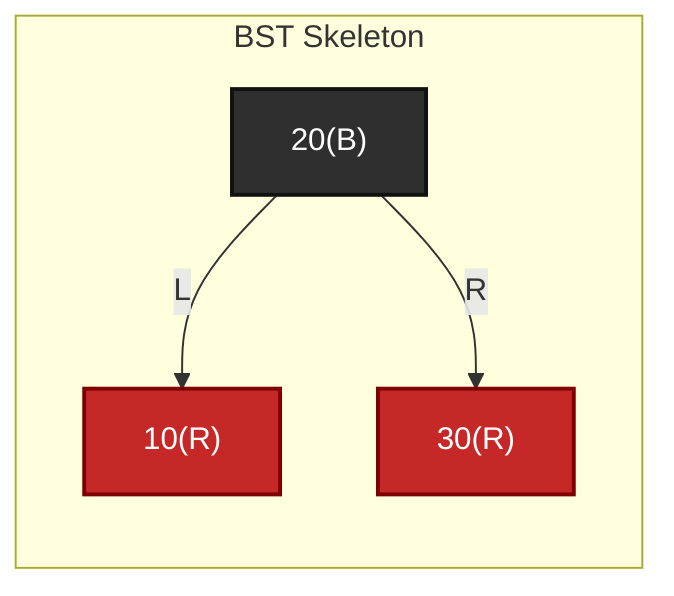

这张图中，颜色可以变化，但关键字关系不会变化：

- `10 < 20 < 30`

<span style="color:red;">保持有序性，这才是红黑树后续一切修复的底线。</span>

------

### 7.2.2\_红黑树在\_BST\_之上额外增加了什么信息

既然红黑树首先是 BST，那么它和普通 BST 的区别就必须说成：

> **它在 BST 基础上，额外给每个节点增加了颜色信息，并对颜色分布施加约束。**

这个“额外增加的信息”并不复杂，表面上只有一位：

- 红
- 黑

但这位信息不是装饰。
它的作用是把一个普通二叉节点，放进一个更高层的结构解释系统里。

下面只声明示意结构，还不是可执行程序；color 表示枚举类型，parent 是父指针。后面完整实验省略 parent，因为本轮只检查孩子可达的静态结构：

```cpp
enum class color { red, black };
struct rb_node {
	int key;                   // 本例使用唯一整数键。
	color shade;               // 保存当前节点的颜色。
	rb_node *left = nullptr;    // 左孩子，空位置按黑色 NIL 解释。
	rb_node *right = nullptr;   // 右孩子。
	rb_node *parent = nullptr;  // 父节点；根没有父节点。
};
```

如果只看字段，确实只是比 BST 多了一个 `shade`。
但真正的差异不在字段数量，而在这位颜色的语义：

- 黑色节点定义骨架层级；
- 红色节点表示“逻辑并入”；
- 红黑规则共同限制树高。

也就是说，红黑树不是“BST + 一个颜色变量”，而是：

> **BST + 一套基于颜色解释局部与全局结构的规则系统。**

------

### 7.2.3\_红黑树中的颜色信息到底在表达什么

这是本章最容易讲虚的一点。
所以必须直接说结构语义，不说空话。

颜色信息主要承担两种作用。

#### (1)\_作用一\_表达局部逻辑合并关系

在红黑树里，一个红节点通常不应被理解为“独立增加了一层新的逻辑节点”。
它更接近于：

> **这个红节点要和某个黑节点共同表示一个 3-node 或 4-node。**

例如：

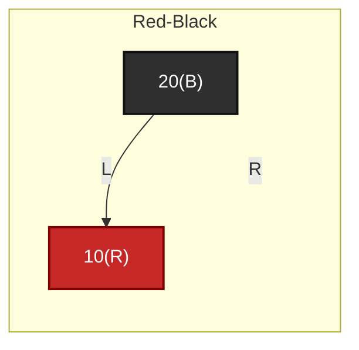

这个局部结构的逻辑语义，不是“多出了一层独立节点”，而是更接近：

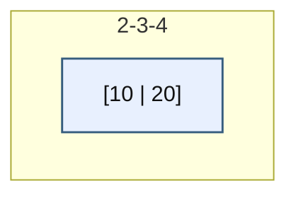

也就是说，颜色首先承担的是**局部结构解释**。

1. <span style="color:black;font-weight:bold;font-style:italic;">黑色节点</span> 表示被 2-3-4树 的逻辑父节点引用的节点；
2. <span style="color:red;font-weight:bold;font-style:italic;">红色节点</span> 表示与 BST 物理父节点引用的节点；

这里说的是逻辑分组职责：黑节点代表当前组，若它不是根，就由上一逻辑组连接到来；红节点与它的直接黑父共同表示当前组。两种颜色的节点都仍有普通二叉孩子指针，并不是黑节点没有物理父指针、红节点只剩某种特殊引用。

------

#### (2)\_作用二\_表达全局层级受控关系

除了局部合并语义，颜色还承担一个更重要的全局作用：

> **约束从根到叶的黑层级数量。**

这一点最终体现为：

- 红节点不能连续；
- 所有路径黑高一致。

所以颜色不只是在“给节点分组”，它还控制：

- 哪些节点算作骨架层；
- 哪些节点只是骨架层内部的逻辑扩张；
- 整棵树的最长路径和最短路径如何被约束。

因此，颜色的真正定义应当理解为：

> **颜色是结构控制信息，不是装饰属性。**

---

#### (3)\_作用三\_2-3-4\_树逻辑节点与红黑树表达结论

在理解这个结论的前提是：

> 2-3-4树的 4-node 逻辑节点内部最多挂3个数据节点。

2-3-4 树中的逻辑节点本质上是一个有序 key 集合，节点内部不存在真正的父子关系。红黑树只是把 2-3-4 树的多 key 逻辑节点转换成二叉搜索树形式。

红黑树中的红链接表示：

> 当前红节点与它的黑色父节点属于同一个 2-3-4 树逻辑节点。

因此：

| 红黑树局部结构      | 对应 2-3-4 树节点 |
| ------------------- | ----------------- |
| 黑节点 + 0 个红孩子 | 2-node，1 个 key  |
| 黑节点 + 1 个红孩子 | 3-node，2 个 key  |
| 黑节点 + 2 个红孩子 | 4-node，3 个 key  |

对于 3-node，例如 `[10 | 20]`，红黑树可以有两种合法表达：

```text
    20(B)
   /
10(R)
```

或者：

```text
10(B)
    \
    20(R)
```

这两种表达都仍然表示同一个 2-3-4 逻辑节点 `[10 | 20]`，只是二叉化方向不同。

但是对于 4-node，例如 `[10 | 20 | 30]`，红黑树必须用中间 key 作为黑色代表节点：

```text
        20(B)
       /     \
   10(R)    30(R)
```

原因是：只有中间 key 作为黑色代表节点，才能同时满足 BST 中序顺序、红黑树不允许连续红节点、以及三个 key 仍属于同一个 2-3-4 逻辑节点。

如果强行使用左 key 或右 key 作为黑色代表节点，例如：

```text
10(B)
    \
    20(R)
        \
        30(R)
```

就会出现连续红节点，违反红黑树性质。

如果为了消除连续红节点而把某些红节点改成黑色，那么它解码回 2-3-4 树时，就不再是原来的一个 4-node `[10 | 20 | 30]`，而是被拆成了不同层级的逻辑节点。

所以结论是：

> 3-node 可以左倾或右倾表达；4-node 若要保持为一个完整的 2-3-4 逻辑节点，必须以中间 key 作为黑色代表节点，左右两个 key 作为红孩子。

注意上面的三键红链仍只有三个键，并没有超过 4-node 的三键容量；它违反的是本章选定的合法二叉编码形状。旋转后改成黑 20 带红 10/30，仍可表示同一组键。因此“红红冲突”不能一律翻译成“已经有第四个键溢出”。禁止连续红还保证每组沿一条下行路径至多展开为一个黑节点接一个红节点，后面据此推导高度。

------

### 7.2.4\_红黑树不是严格平衡树\_而是弱平衡树

这一点必须与 AVL 区分开讲。

红黑树不会要求：

- 左右子树高度差必须不超过 1；
- 每个局部节点都尽可能几何对称。

它允许出现明显的“局部不对称”现象。
例如某条路径可能比另一条路径更长。
但它不允许这种差距失控。

因此，红黑树的平衡不是“严格平衡”，而是：

> **通过黑高受控和红节点不能连续，把树高限制在对数级范围内。**

所以红黑树是一种：

- 不追求最矮；
- 但保证不会退化太严重；
- 不要求每个节点都满足 AVL 的高度差条件；

的平衡树。

本章用 **弱平衡** 表示约束比 AVL 的局部高度差更宽松，不是另一种独立实现类别，也不从这个词推断实际更新一定更快。两者比较还要核对旋转、染色、路径访问和业务负载。

------

### 7.2.5\_红黑树与\_AVL\_2-3-4\_树的定位差异

为了把第 7 章的位置压实，这里给出一个对照表。

| 结构     | 是否是二叉树 | 是否严格平衡   | 平衡控制方式   | 结构解释重点       |
| -------- | ------------ | -------------- | -------------- | ------------------ |
| BST      | 是           | 否             | 无             | 只保证有序         |
| AVL      | 是           | 是             | 高度差严格受限 | 严格平衡           |
| 红黑树   | 是           | 否，属于弱平衡 | 颜色 + 黑高    | 2-3-4 树的二叉编码 |
| 2-3-4 树 | 否，是多路树 | 是             | 叶子同层       | 逻辑多关键字节点   |

这个表必须读出三层意思：

第一，红黑树和 AVL 一样，都是**二叉平衡树**。
第二，红黑树和 2-3-4 树虽然表面形式不同，但结构语义高度相关。
第三，红黑树的定位，不是“颜色更复杂的 BST”，而是“二叉表示下的多路弱平衡搜索树”。

------

## 7.3\_红黑树的五条性质

以下规则描述一轮操作完成后对外可观察的结构。修复中可以暂时带着违例向上推进，但返回时必须恢复契约；查找与验证还要同时检查 BST 顺序。

### 7.3.1\_节点非红即黑

这是最表面的性质，但仍然必须先列出来：

> **每个节点只能是红色或黑色。**

这条性质本身看似简单，甚至显得“像废话”，
因为它只是在说颜色取值域只有两个。

但它的意义在于：

- 为后面的局部结构解释建立离散状态；
- 为“红红冲突”“黑高统计”建立可判断基础；
- 为修复操作限定目标集合。

换句话说，如果没有这条性质，后面的所有颜色规则都没有前提。

因此，这一条虽然简单，但不是多余。

------

### 7.3.2\_根节点为黑

这条性质通常写作：

> **根节点必须是黑色。**

为什么要这样规定？

从实现角度看，这样做能统一很多边界。
从结构角度看，这样做意味着：

- 红黑树的骨架层从根开始；
- 不允许根以“逻辑并入”的方式附属于更上层，因为根上面没有父节点；
- 黑高统计从根出发时不会出现歧义。

这条性质并不是控制树高的主要来源，
但它是一个非常重要的**边界规范**。

它的主要价值在于：

- 统一定义；
- 简化修复结束条件；
- 避免“根是否也能红”带来的额外 case。

------

### 7.3.3\_NIL\_叶子为黑

先看一个最简单的补全图：

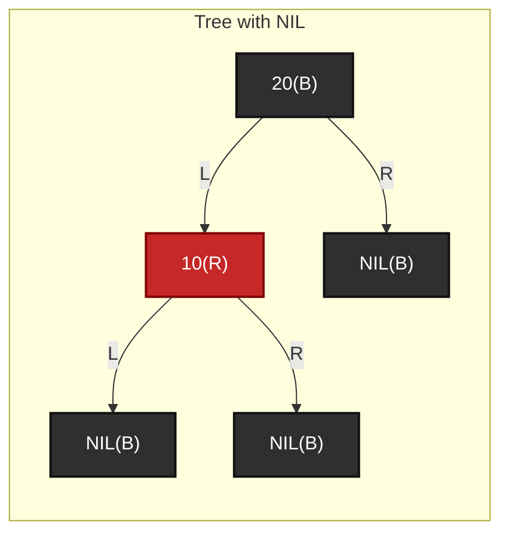

这张图中，真正有 key 的只有 `20` 和 `10`，
但 NIL 叶子作为黑节点参与黑高统计。

这一条如果讲不严，后面删除修复一定会乱。

红黑树教材中常说：

> **所有 NIL 叶子节点都是黑色。**

NIL 是空孩子位置的逻辑名称，不包含业务键。实现可以用共享哨兵对象，也可以用空指针并在算法中专门处理；不是要求每个缺失孩子都分配一个黑色对象。这里要表达的是：

> **逻辑上存在的空叶子哨兵位置。**

例如一个普通二叉节点即使只有左孩子没有右孩子，
在红黑树性质判断时，缺失的右孩子位置也要被视为一个黑色 NIL。

这样做有两个关键作用：

#### (1)\_作用一\_黑高统计才有统一终点

如果没有 NIL 黑叶子，
那么“从根到叶的黑节点数量”这句话就没有统一参照终点。
因为有的路径结束在真实叶子，有的路径结束在空指针位置，语义会不一致。

#### (2)\_作用二\_删除修复才能把\_空孩子\_也纳入统一处理

后面删除 fix-up 里，经常会把某个 `x` 视作 NIL。
这不是偷懒，而是因为 NIL 被当作黑色节点处理后，
很多 case 才能统一进同一套逻辑。

所以这条性质并不是“为了形式完整才补一条”，而是：

> **它是黑高定义和删除修复统一性的基础。**

------

### 7.3.4\_红节点不能有红孩子

这是红黑树里最经典的一条局部性质：

> **若一个节点是红色，则它的两个孩子都必须是黑色。**

更直接地说：

> **不允许出现相邻的两个红节点。**

这条性质约束的是局部结构。
它的本质作用不是“颜色搭配更好看”，而是：

> **禁止把多个物理红节点连续堆叠，从而破坏 2-3-4 树的合法逻辑节点编码。**

为什么？

因为在 2-3-4 树映射里：

- 一个红节点通常表示“并入某个黑节点”
- 若红节点下面再接红节点，就相当于一个逻辑节点内部再继续无界扩张

若不限制红色链，组内展开深度可以无界增加，容量和高度都失去统一约束。不过眼前的三键反例尚未容量溢出，只是二叉编码不合格；修复可能通过重排同一组三键完成，不一定分裂出新逻辑节点。

下面给出一个非法例子。

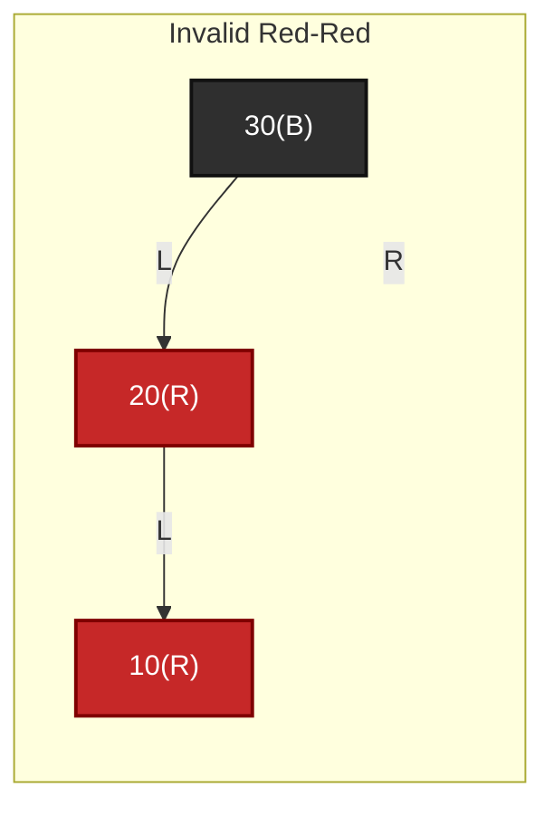

`20(R)` 和 `10(R)` 相邻，就是非法的红红冲突。
后面插入修复首先要解决的，正是这种局部违例。

------

### 7.3.5\_任一路径黑高一致

这是红黑树里最关键的全局性质：

> **从任一节点出发，到其所有后代 NIL 叶子的每一条路径上，黑节点数量都相同。**

这条性质通常简称为：

> **黑高一致**

本章将 bh(x) 定为：从 x 往下到 NIL，**不计 x，计终点 NIL** 的黑节点数；bh(NIL)=0。只有各路径计数一致时，才能用单个 bh(x) 表示它。演示若另含起点会明确注明，不能把两种数字直接混入同一公式。

它控制的不是局部红红关系，而是整棵树的全局层级受控。

必须注意两点。

#### (1)\_第一点\_统计的是黑节点数量\_不是总路径长度

所以两条路径允许：

- 红节点数不同；
- 总边数不同；

但它们的黑节点数必须一致。

#### (2)\_第二点\_这条性质是红黑树\_不会过高\_的根本来源

因为只要：

- 黑节点数一致；
- 红节点又不能连续；

那么最长路径中的红节点数量就不可能无限增加。
这正是后面“最长路径不超过最短路径两倍”的基础。

先给一个简单的合法结构示意。

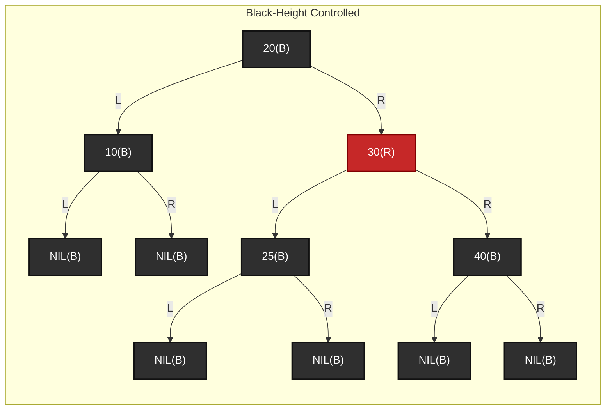

它对应的 2-3-4 树原型可以这样理解：

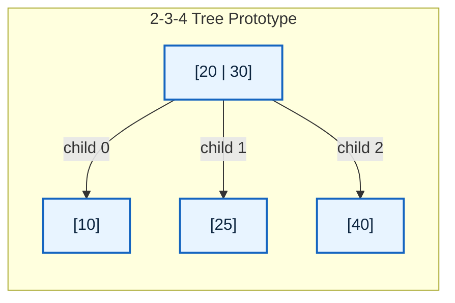

这里的 `20(B) -> 30(R)` 不是在表达普通二叉搜索树中两个完全独立的黑层级，
而是在二叉表示里模拟 2-3-4 树中的同一个 3-节点 `[20 | 30]`。
所以 `30(R)` 虽然让右侧路径多经过一个真实节点，
但它不增加黑高。

从 `A=20(B)` 到各 NIL 的路径上，黑节点数是受控一致的。
如果统计时包含起点 `A` 和终点 `NIL`，所有路径可以归为下面几类：

- `A(B) -> 10(B) -> NIL(B)`，黑节点数为 3；
- `A(B) -> 30(R) -> 25(B) -> NIL(B)`，黑节点数为 3；
- `A(B) -> 30(R) -> 40(B) -> NIL(B)`，黑节点数为 3。

如果按黑高定义不统计起点 `A`，那么所有路径都是 2 个黑节点：

- `10(B) -> NIL(B)`，黑节点数为 2；
- `30(R) -> 25(B) -> NIL(B)`，黑节点数为 2；
- `30(R) -> 40(B) -> NIL(B)`，黑节点数为 2。

再看一个 4-节点的二叉表示示意：

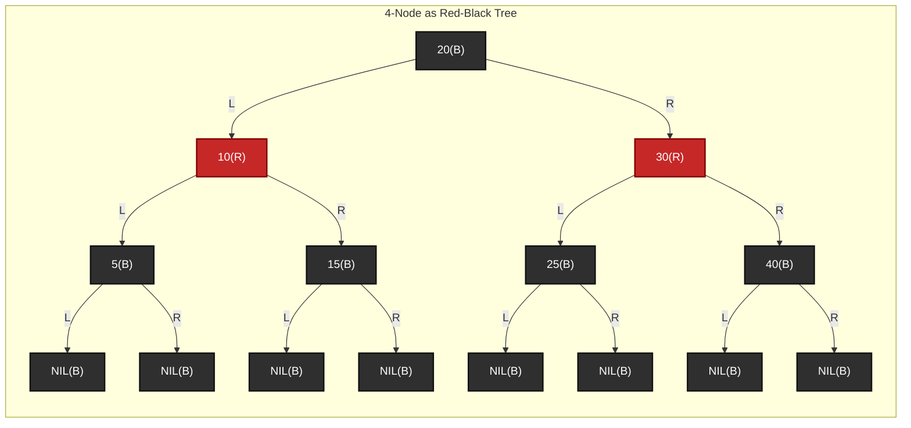

它对应的 2-3-4 树原型是：

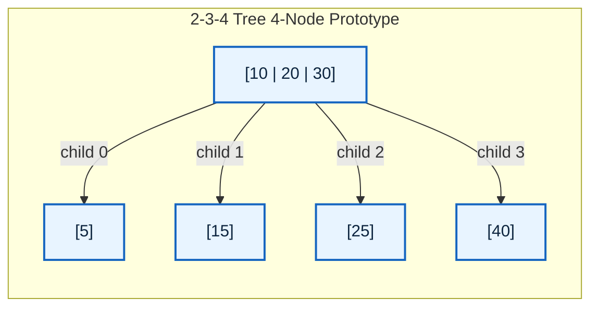

这里的 `10(R) <- 20(B) -> 30(R)` 共同表达 2-3-4 树中的同一个 4-节点 `[10 | 20 | 30]`。
两个红节点只是把多关键字节点拆成二叉形态，不代表黑高增加。

这才是红黑树高度分析真正依赖的性质。

------

### 7.3.6\_五条性质为什么必须整体理解\_而不能孤立记忆

到这里，五条性质已经列全。
但如果只是“逐条背诵”，仍然很容易出问题。

因为五条性质并不是并列摆放的五条口号，
它们实际上分成两类：

#### (1)\_第一类\_定义和边界性质

- 节点非红即黑
- 根为黑
- NIL 为黑

这类性质的作用主要是：

- 统一颜色域；
- 统一边界；
- 统一黑高统计终点。

#### (2)\_第二类\_结构控制性质

- 红节点不能有红孩子
- 任一路径黑高一致

这类性质才真正控制：

- 局部逻辑节点编码是否合法；
- 全局高度是否受控。

所以如果孤立记忆，就很容易把“根为黑”和“黑高一致”当成同等层面的树高控制规则。
实际上并不是。

更准确的理解应当是：

> 五条性质共同构成红黑树定义；
> 但真正承担局部平衡与全局平衡控制核心职责的，是后两条。

------

### 7.3.7\_哪几条性质决定局部约束\_哪几条性质决定全局平衡

最后用一个表把职责再压一遍。

| 性质               | 作用层面        | 主要作用                     |
| ------------------ | --------------- | ---------------------------- |
| 节点非红即黑       | 定义层          | 建立离散颜色状态             |
| 根节点为黑         | 边界层          | 统一根边界和修复终点         |
| NIL 叶子为黑       | 边界层 / 统计层 | 统一黑高统计终点             |
| 红节点不能有红孩子 | 局部结构层      | 禁止连续红，控制局部逻辑并入 |
| 任一路径黑高一致   | 全局平衡层      | 限制树高，约束整体层级       |

所以本节最重要的不是把五条话背下来，
而是把它们分层理解：

- 哪些是定义性质；
- 哪些是边界性质；
- 哪些才是真正的平衡控制性质。

------

### 7.3.8\_本节小结

本节建立了红黑树最基础的形式定义。

第一，红黑树不是“普通 BST 随便涂色”，而是在 BST 基础上叠加了一套颜色约束系统。
第二，五条性质中，前几条更多承担定义和边界统一作用，真正决定局部与全局平衡的是“红节点不能有红孩子”和“黑高一致”。
第三，红红冲突本质上是在说局部逻辑节点编码失控，黑高一致本质上是在说全局骨架层级受控。
第四，后面的插入与删除以修红红或缺黑为核心，还要保持搜索顺序、正确的父子连接，并在整轮完成时统一根等边界。局部规则通过不代表整个实现已经正确。

------

### 7.3.9\_让程序区分三种非法结构

继续使用 7.3.5 的五节点树：黑 20 左接黑 10，右接红 30，红 30 下接黑 25/40。先预测从根到每个 NIL 的黑数，再考虑三个独立改动：把 25 染红、把 10 染红、把 25 的键改为 15。三个改动分别违反什么？只比较直接孩子与父亲的键，能发现第三个错误吗？

完整程序如下，材料为 [rbtree_invariants.cpp](../../../../labs/kernel/tree_basics/materials/rbtree_invariants.cpp)。它验证唯一整数键、颜色域、根黑、没有连续红和左右黑高一致。seen 保存本轮已经遇到的节点地址，遇到环或共享孩子立即拒绝，避免把“不是树的图”当作树递归。

本例要求所有非空指针都指向仍存活、可读且没有并发改动的 node；seen 不能识别任意悬空地址。程序不检查业务对象引用，也不检查父指针，因为示例结构没有保存它。unsigned 统计量只用于能够装入本次有限进程内存的小树，不作为超大数据或恶意深链解析器。

```cpp
#include <algorithm>
#include <cassert>
#include <iostream>
#include <optional>
#include <unordered_set>

enum class color { red, black };

struct node {
    int key;
    color shade;
    node* left = nullptr;
    node* right = nullptr;
};

struct report {
    bool valid;
    unsigned nodes;
    unsigned height;
    unsigned shortest;
    unsigned black_height;
    const char* reason;
};

class checker {
    // 内部 b 计数包含当前节点和终点 NIL；空位置贡献一个黑色。
    struct partial {
        bool valid;
        unsigned nodes;
        unsigned height;
        unsigned shortest;
        unsigned b;
        const char* reason;
    };
    std::unordered_set<const node*> seen;

    static partial invalid(const char* reason) {
        return {false, 0, 0, 0, 0, reason};
    }

    partial walk(const node* current, std::optional<int> low,
                 std::optional<int> high, bool parent_red) {
        if (!current)
            return {true, 0, 0, 0, 1, "ok"};
        if (!seen.insert(current).second)
            return invalid("repeated-node");
        if (current->shade != color::red && current->shade != color::black)
            return invalid("color-domain");
        if ((low && current->key <= *low) || (high && current->key >= *high))
            return invalid("key-order");
        const bool red = current->shade == color::red;
        if (red && parent_red)
            return invalid("red-red");
        const auto left = walk(current->left, low, current->key, red);
        if (!left.valid)
            return left;
        const auto right = walk(current->right, current->key, high, red);
        if (!right.valid)
            return right;
        if (left.b != right.b)
            return invalid("black-height");
        return {true, 1 + left.nodes + right.nodes,
                1 + std::max(left.height, right.height),
                1 + std::min(left.shortest, right.shortest),
                left.b + (red ? 0U : 1U), "ok"};
    }

public:
    report inspect(const node* root) {
        seen.clear();
        // 空树按约定有效；根黑是本例采用的规范化条件。
        if (root && root->shade == color::red)
            return {false, 0, 0, 0, 0, "root-red"};
        const auto result = walk(root, std::nullopt, std::nullopt, false);
        if (!result.valid)
            return {false, 0, 0, 0, 0, result.reason};
        // 对非空黑根减去根自身，留下本章定义的 bh(root)。
        return {true, result.nodes, result.height, result.shortest,
                root ? result.b - 1 : 0, result.reason};
    }
};

static report show(checker& check, const char* name, const node* root) {
    const auto result = check.inspect(root);
    std::cout << name << ": " << result.reason;
    if (result.valid)
        std::cout << " nodes=" << result.nodes << " height=" << result.height
                  << " shortest=" << result.shortest
                  << " bh=" << result.black_height;
    std::cout << '\n';
    return result;
}

int main() {
    node a{20, color::black}, b{10, color::black}, c{30, color::red};
    node d{25, color::black}, e{40, color::black};
    a.left = &b;
    a.right = &c;
    c.left = &d;
    c.right = &e;
    checker check;
    const auto valid = show(check, "valid", &a);
    assert(valid.valid && valid.nodes == 5 && valid.height == 3 &&
           valid.shortest == 2 && valid.black_height == 2);
    d.shade = color::red;
    assert(!show(check, "red child", &a).valid);
    d.shade = color::black;
    b.shade = color::red;
    assert(!show(check, "unequal black paths", &a).valid);
    b.shade = color::black;
    d.key = 15;
    assert(!show(check, "ancestor bound", &a).valid);
    d.key = 25;
    const auto empty = show(check, "empty", nullptr);
    assert(empty.valid && empty.height == 0 && empty.black_height == 0);
    return 0;
}
```

在材料目录运行：

```bash
g++ -std=c++17 -Wall -Wextra -Werror -pedantic rbtree_invariants.cpp -o rbtree_invariants
./rbtree_invariants
```

预期输出：

```text
valid: ok nodes=5 height=3 shortest=2 bh=2
red child: red-red
unequal black paths: black-height
ancestor bound: key-order
empty: ok nodes=0 height=0 shortest=0 bh=0
```

这里 height/shortest 都数到 NIL 的边数：从根到真实叶再到 NIL，单黑根为 1；这与“到真实叶子的边数”差 1。内部 partial.b 包含当前节点和 NIL，空位置返回 1；非空黑根最终减去自身，才得到本章不计起点的 bh(root)。用不同变量名保留两种用途，避免在递归相加时悄悄换口径。

每次 walk 先检查地址是否重复和键的祖先范围，再检查父红当前红；只有左右都合格，才比较两侧 b 并向父返回结果。low/high 用 optional 表示不存在的边界，没有用 key-1/key+1，所以 INT_MIN/INT_MAX 也不需要特殊算术。

这个检查器报告遇到的第一个问题，不枚举全部违例。d.key=15 仍小于父 30，却不大于祖先 20，因此只检查相邻节点会漏掉它；左子树或右子树的所有键都要落在祖先共同限定的区间。

现在做三组渐进练习：

1. 空树、单个黑根、黑根带两个红叶分别预测 height、shortest、bh；不要把 NIL 计入 nodes。
2. 把根染红，再把某一颜色转成枚举域外的值，分别观察 root-red 与 color-domain。颜色取值检查和红红检查不是同一件事。
3. 让两个孩子指针引用同一对象，或让叶子指回根。预期 repeated-node；修正连接后再检查颜色。遇到这种结构错误，不应继续套颜色修复流程。

本程序没有实现任何旋转或染色修复。它建立的是“完成态怎样验收”，后续单元才解释如何恢复违例。

---

## 7.4\_红黑树的核心概念

验证器能指出哪里违反性质，修复还需要描述偏差的种类。先统一黑高计数，再跟踪红红冲突和缺黑分别带着什么状态传播。

### 7.4.1\_黑高

沿用 7.3 的唯一口径：bh(x) 不计 x，计终点 NIL；空位置本身的 bh(NIL)=0。黑叶的 bh 为 1，红叶的 bh 也为 1，因为它们往下都只剩黑色 NIL。若一条路径包含黑 x、黑孩子、NIL，bh(x)=2；把 x 也算入的整段黑节点总数则是 3。

黑高是关于所有下行路径的性质，不是“数一条左路径后就默认其余路径相等”。检查器必须分别取得左右结果并比较。实现可以缓存它，也可以像本章实验一样临时计算；字段是否存在不改变定义。

后面的“少一层黑”指与本来应匹配的另一侧相比出现计数差，不是出现第三种真实颜色。局部修复需要同时明确缺口挂在哪个孩子位置、父节点是谁，以及根边界是否已经使等待的黑层不再必要。

---


### 7.4.2\_红红冲突\_以及它的修复方法

向合法树的空槽接入红叶不会改变原有黑高，却可能与红父相邻。需要看的对象是当前节点 X、父 P、祖父 G 和叔 U；叔红时染色并把检查点上移，叔黑时根据内外侧重新编码。

完整的原图解、算法上下文提问、一般子树证明和 C++ 程序进入 [P35 红红冲突](P35_红黑插入与红红冲突上推.md#35.1_从检查一棵树走到增加一个键)。先完成该单元，再读下面的删除：插入主要保留黑高并处理红红，删除则可能让某个入口少一个黑节点，不能沿用叔叔分支。

### 7.4.3\_删除黑色节点\_以及异常场景处理方法

#### (1)\_删除黑节点后\_真正要看的是兄弟能不能\_借

假设删除后缺黑位置是 `X`：

```text
      P
     / \
    X   S
```

其中：

```text
X：删除黑节点后留下的缺黑位置
P：X 的父节点
S：X 的兄弟节点
```

删除修复真正要判断的是：

```text
S 这个兄弟节点有没有多余的黑高结构可以借？
```

对应到 2-3-4 树就是：

```text
兄弟是 2-node：不能借，只能合并，缺黑可能上推；
兄弟是 3-node / 4-node：可以借 key，通过旋转和变色修复，通常直接结束。
```

红黑树里怎么判断兄弟能不能借？

```text
S 是黑色，并且 S 的两个孩子都是黑色：
	兄弟对应 2-node，不能借。

S 是黑色，并且 S 至少有一个红孩子：
	兄弟对应 3-node 或 4-node，可以借。

S 是红色：
	先旋转，把它转换成黑兄弟情况，再继续判断。
```

------

#### (2)\_第一类\_兄弟没有红孩子\_不能借\_只能合并

这是我前面画的那种情况。

删除前：

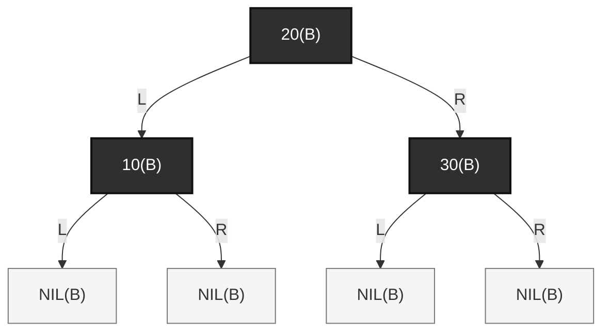

对应 2-3-4 树：


现在删除 `10(B)`。

红黑树变成：

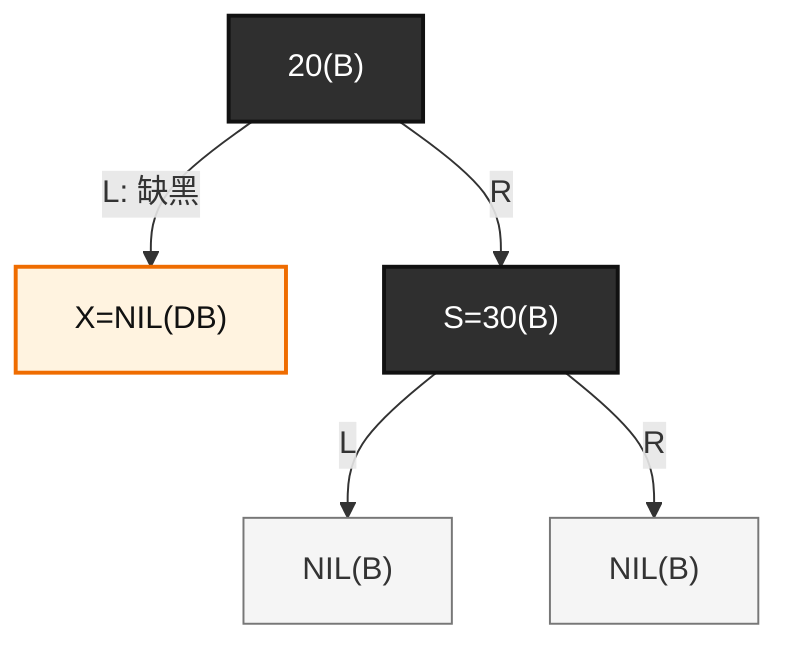

对应 2-3-4 树：

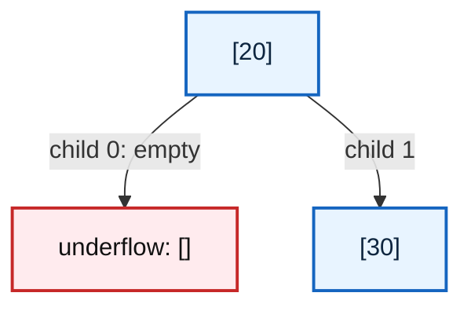

此时右兄弟 `[30]` 是 2-node，只有一个 key，不能借。

所以只能合并：

```text
[] + 20 + [30]
	↓
[20 | 30]
```

红黑树里对应动作是：

```text
S=30(B) 染红；
X 的缺黑被局部抵消；
如果 P 是根，结束；
如果 P 不是根，并且 P 原来是黑色，缺黑继续向上推。
```

修复后：

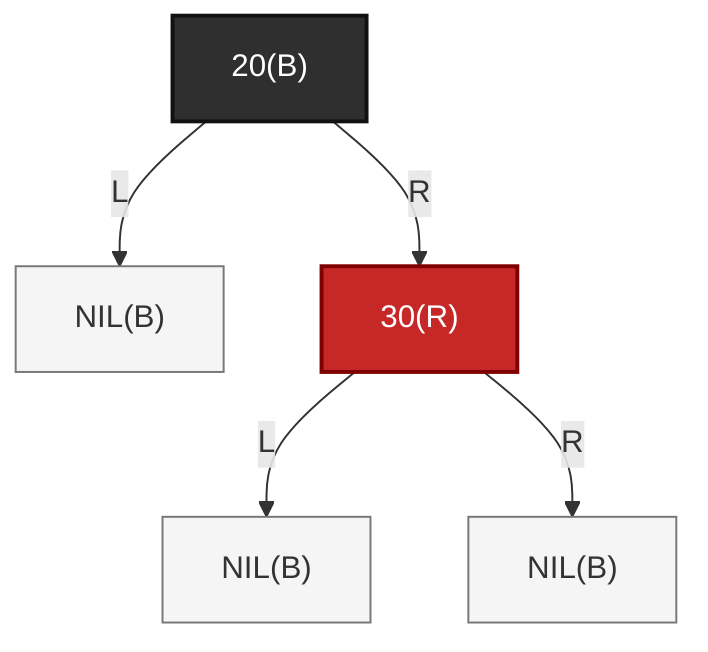

对应 2-3-4 树：

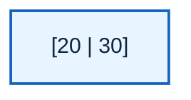

这一类的本质是：

```text
兄弟没有多余 key；
不能借；
只能把父 key 拉下来合并；
如果父节点因此也缺 key，问题继续上推。
```

------

#### (3)\_第二类\_兄弟有远侧红孩子\_可以直接借

现在看你说的情况：

> 子节点原来是黑色，它底下的子子节点是红色怎么办？

这就是兄弟可以借的情况。

删除前红黑树：

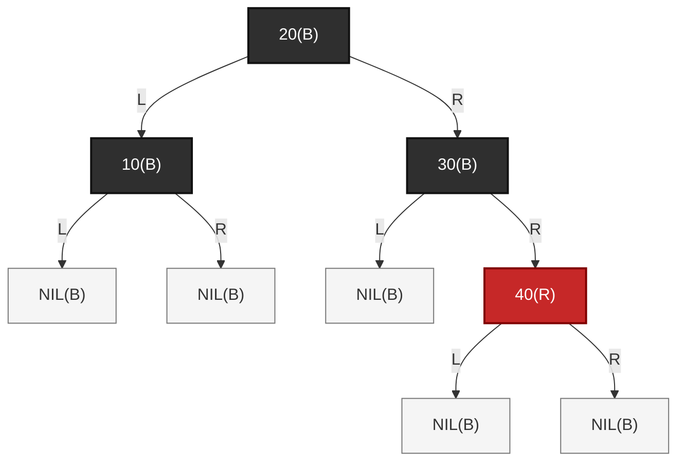

这棵树删除前是合法的。

对应 2-3-4 树：

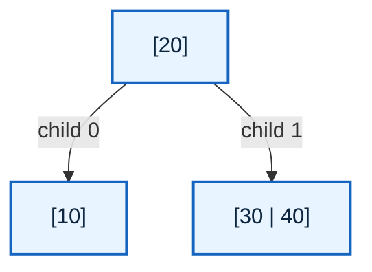

注意右兄弟不是 `[30]`，而是：

```text
[30 | 40]
```

它是 3-node，有两个 key。
这意味着它可以借一个 key 给左侧 underflow 节点。

现在删除 `10(B)`。

红黑树变成：

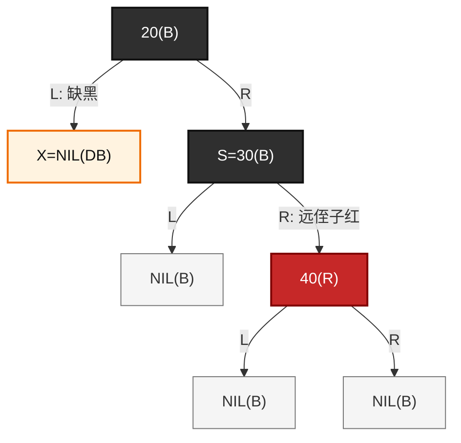

对应 2-3-4 树：

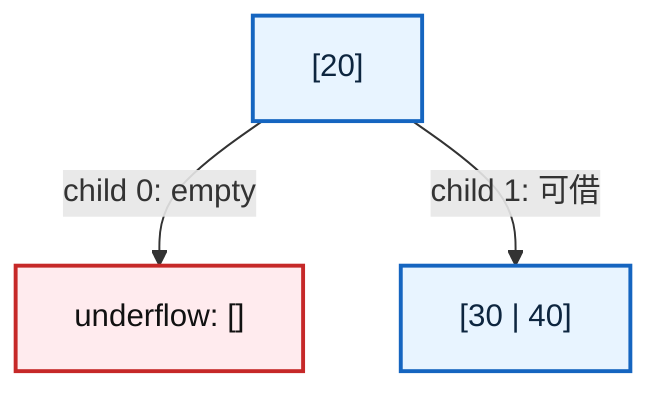

这时修复不是合并，而是**借 key**。

2-3-4 树操作是：

```text
父 key 20 下移到左侧空节点；
右兄弟最小 key 30 上移到父节点；
右兄弟剩下 [40]。
```

结果：

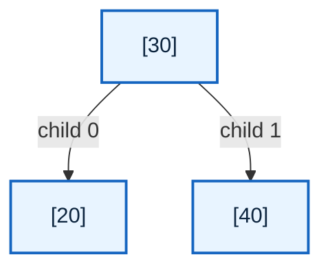

红黑树中对应的是：

```text
S=30(B) 继承 P 的颜色；
P=20 染黑；
远侄子 40(R) 染黑；
对 P=20 左旋；
修复结束。
```

修复后：

```mermaid
graph TD
	rb_s_borrow_after["30(B)"]
	rb_p_borrow_after["20(B)"]
	rb_far_borrow_after["40(B)"]
	rb_p_left_nil_after["NIL(B)"]
	rb_p_right_nil_after["NIL(B)"]
	rb_40_left_nil_after["NIL(B)"]
	rb_40_right_nil_after["NIL(B)"]

	rb_s_borrow_after -->|"L"| rb_p_borrow_after
	rb_s_borrow_after -->|"R"| rb_far_borrow_after

	rb_p_borrow_after -->|"L"| rb_p_left_nil_after
	rb_p_borrow_after -->|"R"| rb_p_right_nil_after

	rb_far_borrow_after -->|"L"| rb_40_left_nil_after
	rb_far_borrow_after -->|"R"| rb_40_right_nil_after

	classDef rb_black fill:#2f2f2f,stroke:#111,color:#fff,stroke-width:2px;
	classDef rb_nil fill:#f5f5f5,stroke:#777,color:#333,stroke-width:1px;

	class rb_s_borrow_after,rb_p_borrow_after,rb_far_borrow_after rb_black;
	class rb_p_left_nil_after,rb_p_right_nil_after,rb_40_left_nil_after,rb_40_right_nil_after rb_nil;
```

这个结果和 2-3-4 树完全对应：

```text
红黑树：
        30(B)
       /     \
   20(B)    40(B)

2-3-4 树：
        [30]
       /    \
    [20]   [40]
```

这一类的本质是：

```text
兄弟不是 2-node，而是 3-node 或 4-node；
兄弟可以借 key；
所以通过旋转和变色把兄弟的一个 key 移到父层，
再把父 key 下移补到缺黑侧；
修复直接结束。
```

------

我是 **GPT-5.5 Thinking**。

下面是重构后的完整版本，直接替换你原来的：

------

#### (4)\_第三类\_兄弟有近侧红孩子\_需要先转换

还有一种情况：

```text
S 是黑色；
S 有红孩子；
但是红孩子在近侧。
```

这里先固定讨论方向：

```text
X 是 P 的左孩子；
S 是 P 的右孩子；
S 的左孩子 SL 是近侄子；
S 的右孩子 SR 是远侄子。
```

也就是：

```text
        P
       / \
      X   S
         / \
        SL  SR
```

其中：

```text
X  = 删除黑节点后留下的缺黑位置；
P  = X 的父节点；
S  = X 的兄弟节点；
SL = S 的左孩子，也就是近侄子；
SR = S 的右孩子，也就是远侄子。
```

对应图如下：

```mermaid
graph TD
	rb_p_pos["P"]
	rb_x_pos["X(DB)"]
	rb_s_pos["S"]
	rb_sl_pos["SL 近侄子"]
	rb_sr_pos["SR 远侄子"]

	rb_p_pos -->|"L"| rb_x_pos
	rb_p_pos -->|"R"| rb_s_pos

	rb_s_pos -->|"L"| rb_sl_pos
	rb_s_pos -->|"R"| rb_sr_pos

	classDef rb_normal fill:#e8f4ff,stroke:#1565c0,color:#0d253f,stroke-width:2px;
	classDef rb_db fill:#fff3e0,stroke:#ef6c00,color:#111,stroke-width:2px;

	class rb_p_pos,rb_s_pos,rb_sl_pos,rb_sr_pos rb_normal;
	class rb_x_pos rb_db;
```

如果 `X` 在右侧，那么所有方向左右镜像。

------

##### 1)\_删除前\_兄弟是黑色\_近侄子是红色

先看删除前的合法红黑树局部：

```mermaid
graph TD
	rb_p_before["P=20(B)"]
	rb_x_before["10(B)"]
	rb_s_before["S=40(B)"]
	rb_x_left_nil_before["NIL(B)"]
	rb_x_right_nil_before["NIL(B)"]
	rb_sl_before["SL=30(R)"]
	rb_sr_before["SR=NIL(B)"]
	rb_sl_left_nil_before["NIL(B)"]
	rb_sl_right_nil_before["NIL(B)"]

	rb_p_before -->|"L"| rb_x_before
	rb_p_before -->|"R"| rb_s_before

	rb_x_before -->|"L"| rb_x_left_nil_before
	rb_x_before -->|"R"| rb_x_right_nil_before

	rb_s_before -->|"L: 近侄子红"| rb_sl_before
	rb_s_before -->|"R: 远侄子黑"| rb_sr_before

	rb_sl_before -->|"L"| rb_sl_left_nil_before
	rb_sl_before -->|"R"| rb_sl_right_nil_before

	classDef rb_black fill:#2f2f2f,stroke:#111,color:#fff,stroke-width:2px;
	classDef rb_red fill:#c62828,stroke:#7f0000,color:#fff,stroke-width:2px;
	classDef rb_nil fill:#f5f5f5,stroke:#777,color:#333,stroke-width:1px;

	class rb_p_before,rb_x_before,rb_s_before rb_black;
	class rb_sl_before rb_red;
	class rb_x_left_nil_before,rb_x_right_nil_before,rb_sr_before,rb_sl_left_nil_before,rb_sl_right_nil_before rb_nil;
```

这个结构删除前是合法的。

从 2-3-4 树视角看：

```text
40(B) + 30(R)
```

表示一个 2-3-4 逻辑节点：

```text
[30 | 40]
```

所以删除前对应的 2-3-4 树是：

```mermaid
graph TD
	tree_root_before["[20]"]
	tree_left_before["[10]"]
	tree_right_before["[30 | 40]"]

	tree_root_before -->|"child 0"| tree_left_before
	tree_root_before -->|"child 1"| tree_right_before

	classDef node234 fill:#e8f4ff,stroke:#1565c0,color:#0d253f,stroke-width:2px;

	class tree_root_before,tree_left_before,tree_right_before node234;
```

这里要注意：

```text
30(R) 不是 2-3-4 树中的下一层节点；
30(R) 是并入 40(B) 的红 key；
因此 30 和 40 共同组成兄弟逻辑节点 [30 | 40]。
```

也就是说，右兄弟不是 2-node，而是 3-node：

```text
[30 | 40]
```

这说明：

```text
兄弟有多余 key；
兄弟可以借；
这类情况不是合并修复，而是借位修复。
```

------

##### 2)\_删除\_10(B)\_后\_左侧出现黑高缺失

现在删除 `10(B)`。

`10(B)` 是黑色叶子节点。删除后，它原来的位置变成 `X=NIL(DB)`：

```mermaid
graph TD
	rb_p_delete["P=20(B)"]
	rb_x_delete["X=NIL(DB)"]
	rb_s_delete["S=40(B)"]
	rb_sl_delete["SL=30(R)"]
	rb_sr_delete["SR=NIL(B)"]
	rb_sl_left_nil_delete["NIL(B)"]
	rb_sl_right_nil_delete["NIL(B)"]

	rb_p_delete -->|"L: 缺黑"| rb_x_delete
	rb_p_delete -->|"R"| rb_s_delete

	rb_s_delete -->|"L: 近侄子红"| rb_sl_delete
	rb_s_delete -->|"R: 远侄子黑"| rb_sr_delete

	rb_sl_delete -->|"L"| rb_sl_left_nil_delete
	rb_sl_delete -->|"R"| rb_sl_right_nil_delete

	classDef rb_black fill:#2f2f2f,stroke:#111,color:#fff,stroke-width:2px;
	classDef rb_red fill:#c62828,stroke:#7f0000,color:#fff,stroke-width:2px;
	classDef rb_nil fill:#f5f5f5,stroke:#777,color:#333,stroke-width:1px;
	classDef rb_db fill:#fff3e0,stroke:#ef6c00,color:#111,stroke-width:2px;

	class rb_p_delete,rb_s_delete rb_black;
	class rb_sl_delete rb_red;
	class rb_sr_delete,rb_sl_left_nil_delete,rb_sl_right_nil_delete rb_nil;
	class rb_x_delete rb_db;
```

这里的 `X=NIL(DB)` 表示：

```text
原来的 10(B) 被删除；
左侧路径少了一个黑；
这个少掉的黑还没有被修复。
```

对应到 2-3-4 树，就是左孩子 `[10]` 删除唯一 key 后变成空节点：

```mermaid
graph TD
	tree_root_delete["[20]"]
	tree_left_delete["underflow: []"]
	tree_right_delete["[30 | 40]"]

	tree_root_delete -->|"child 0: 缺 key"| tree_left_delete
	tree_root_delete -->|"child 1: 可借"| tree_right_delete

	classDef node234 fill:#e8f4ff,stroke:#1565c0,color:#0d253f,stroke-width:2px;
	classDef underflow fill:#ffebee,stroke:#c62828,color:#111,stroke-width:2px;

	class tree_root_delete,tree_right_delete node234;
	class tree_left_delete underflow;
```

此时问题不是：

```text
右兄弟不能借，所以合并。
```

而是：

```text
右兄弟 [30 | 40] 有两个 key，可以借。
```

但是它在红黑树中的表达是：

```text
        40(B)
       /
    30(R)
```

红色 key `30` 位于近侧，不在远侧。

------

##### 3)\_为什么近侄子红不能直接修复

当前局部是：

```text
        20(B)
       /     \
  X=NIL(DB)  40(B)
             /
          30(R)
```

`X` 在左边缺黑，兄弟 `S=40(B)` 在右边。

要通过兄弟借 key 直接补黑，理想状态应该是：

```text
        20(B)
       /     \
  X=NIL(DB)  30(B)
                \
                40(R)
```

也就是：

```text
远侄子为红。
```

原因是：最终修复要对 `P=20` 左旋。
对 `P` 左旋时，必须让红色补偿节点位于外侧，也就是兄弟的右孩子位置，才能在旋转后把它染黑，用来补足缺黑路径的黑高。

但现在红色节点 `30(R)` 在兄弟 `40(B)` 的左侧：

```text
        40(B)
       /
    30(R)
```

它是近侄子红。

所以不能直接对 `P=20` 左旋完成最终修复。
必须先把近侄子红转换成远侄子红。

------

##### 4)\_转换前保留完整子树关系

为了避免误解，下面不用全 NIL 图，而是用 `A/B/C` 表示真实子树。

转换前：

```mermaid
graph TD
	rb_p_conv_before["P=20(B)"]
	rb_x_conv_before["X(DB)"]
	rb_s_conv_before["S=40(B)"]
	rb_sl_conv_before["SL=30(R)"]
	rb_sr_conv_before["C(B)"]
	rb_a_conv_before["A"]
	rb_b_conv_before["B"]

	rb_p_conv_before -->|"L: 缺黑"| rb_x_conv_before
	rb_p_conv_before -->|"R"| rb_s_conv_before

	rb_s_conv_before -->|"L: 近侄子红"| rb_sl_conv_before
	rb_s_conv_before -->|"R: 远侄子黑"| rb_sr_conv_before

	rb_sl_conv_before -->|"L"| rb_a_conv_before
	rb_sl_conv_before -->|"R"| rb_b_conv_before

	classDef rb_black fill:#2f2f2f,stroke:#111,color:#fff,stroke-width:2px;
	classDef rb_red fill:#c62828,stroke:#7f0000,color:#fff,stroke-width:2px;
	classDef rb_subtree fill:#e8f4ff,stroke:#1565c0,color:#0d253f,stroke-width:2px;
	classDef rb_db fill:#fff3e0,stroke:#ef6c00,color:#111,stroke-width:2px;

	class rb_p_conv_before,rb_s_conv_before,rb_sr_conv_before rb_black;
	class rb_sl_conv_before rb_red;
	class rb_a_conv_before,rb_b_conv_before rb_subtree;
	class rb_x_conv_before rb_db;
```

对应的局部结构是：

```text
        20(B)
       /      \
    X(DB)     40(B)
             /     \
          30(R)     C(B)
          /   \
         A     B
```

这里的 BST 顺序关系是：

```text
X < 20 < A < 30 < B < 40 < C
```

这几个子树不能随便丢，因为旋转之后：

```text
B 会从 30 的右子树，变成 40 的左子树。
```

------

##### 5)\_第一步\_对兄弟\_40\_做右旋\_把近侄子红转换成远侄子红

转换动作是：

```text
1. SL=30(R) 染黑；
2. S=40(B) 染红；
3. 对 S=40 做右旋；
4. 新兄弟变成 30(B)；
5. 旧兄弟 40(R) 变成新兄弟 30(B) 的右孩子；
6. 对 X 来说，40(R) 变成新的远侄子红。
```

旋转后：

```mermaid
graph TD
	rb_p_conv_after["P=20(B)"]
	rb_x_conv_after["X(DB)"]
	rb_new_s_conv_after["new S=30(B)"]
	rb_a_conv_after["A"]
	rb_old_s_conv_after["old S=40(R)"]
	rb_b_conv_after["B"]
	rb_c_conv_after["C(B)"]

	rb_p_conv_after -->|"L: 缺黑"| rb_x_conv_after
	rb_p_conv_after -->|"R: 新兄弟"| rb_new_s_conv_after

	rb_new_s_conv_after -->|"L"| rb_a_conv_after
	rb_new_s_conv_after -->|"R: 远侄子红"| rb_old_s_conv_after

	rb_old_s_conv_after -->|"L"| rb_b_conv_after
	rb_old_s_conv_after -->|"R"| rb_c_conv_after

	classDef rb_black fill:#2f2f2f,stroke:#111,color:#fff,stroke-width:2px;
	classDef rb_red fill:#c62828,stroke:#7f0000,color:#fff,stroke-width:2px;
	classDef rb_subtree fill:#e8f4ff,stroke:#1565c0,color:#0d253f,stroke-width:2px;
	classDef rb_db fill:#fff3e0,stroke:#ef6c00,color:#111,stroke-width:2px;

	class rb_p_conv_after,rb_new_s_conv_after,rb_c_conv_after rb_black;
	class rb_old_s_conv_after rb_red;
	class rb_a_conv_after,rb_b_conv_after rb_subtree;
	class rb_x_conv_after rb_db;
```

这个转换必须满足：

```text
旋转前：
        40
       /  \
     30    C
    /  \
   A    B

旋转后：
        30
       /  \
      A    40
          /  \
         B    C
```

所以位置关系是：

```text
30 变成 20 的新右孩子；
40 变成 30 的右孩子；
B 从 30 的右子树，变成 40 的左子树。
```

这一步的本质不是最终修复，而是**形态转换**：

```text
近侄子红
    ↓
远侄子红
```

此时 `X(DB)` 仍然存在，缺黑还没有真正消除。

------

##### 6)\_转换后\_已经进入远侄子红分支

转换后局部变成：

```text
        20(B)
       /      \
    X(DB)     30(B)
             /     \
            A      40(R)
                  /     \
                 B       C(B)
```

对于 `X` 来说：

```text
新兄弟 S = 30(B)；
新兄弟的右孩子 40(R) 是远侄子红。
```

所以现在进入第二类：

```text
兄弟是黑色；
远侄子是红色；
可以直接借；
通过旋转和染色完成最终修复。
```

------

##### 7)\_第二步\_对父节点\_20\_左旋\_完成真正的借位修复

最终修复动作是：

```text
1. 新兄弟 S=30 继承父节点 P=20 的颜色；
2. P=20 染黑；
3. 远侄子 40 染黑；
4. 对 P=20 做左旋；
5. X 的缺黑被消除；
6. 删除修复结束。
```

左旋前：

```mermaid
graph TD
	rb_p_final_before["P=20(B)"]
	rb_x_final_before["X(DB)"]
	rb_s_final_before["S=30(B)"]
	rb_a_final_before["A"]
	rb_far_final_before["F=40(R)"]
	rb_b_final_before["B"]
	rb_c_final_before["C(B)"]

	rb_p_final_before -->|"L: 缺黑"| rb_x_final_before
	rb_p_final_before -->|"R"| rb_s_final_before

	rb_s_final_before -->|"L"| rb_a_final_before
	rb_s_final_before -->|"R: 远侄子红"| rb_far_final_before

	rb_far_final_before -->|"L"| rb_b_final_before
	rb_far_final_before -->|"R"| rb_c_final_before

	classDef rb_black fill:#2f2f2f,stroke:#111,color:#fff,stroke-width:2px;
	classDef rb_red fill:#c62828,stroke:#7f0000,color:#fff,stroke-width:2px;
	classDef rb_subtree fill:#e8f4ff,stroke:#1565c0,color:#0d253f,stroke-width:2px;
	classDef rb_db fill:#fff3e0,stroke:#ef6c00,color:#111,stroke-width:2px;

	class rb_p_final_before,rb_s_final_before,rb_c_final_before rb_black;
	class rb_far_final_before rb_red;
	class rb_a_final_before,rb_b_final_before rb_subtree;
	class rb_x_final_before rb_db;
```

最终修复后：

```mermaid
graph TD
	rb_s_final_after["S=30(B)"]
	rb_p_final_after["P=20(B)"]
	rb_far_final_after["F=40(B)"]
	rb_x_final_after["X=NIL(B)"]
	rb_a_final_after["A"]
	rb_b_final_after["B"]
	rb_c_final_after["C(B)"]

	rb_s_final_after -->|"L"| rb_p_final_after
	rb_s_final_after -->|"R"| rb_far_final_after

	rb_p_final_after -->|"L"| rb_x_final_after
	rb_p_final_after -->|"R"| rb_a_final_after

	rb_far_final_after -->|"L"| rb_b_final_after
	rb_far_final_after -->|"R"| rb_c_final_after

	classDef rb_black fill:#2f2f2f,stroke:#111,color:#fff,stroke-width:2px;
	classDef rb_nil fill:#f5f5f5,stroke:#777,color:#333,stroke-width:1px;
	classDef rb_subtree fill:#e8f4ff,stroke:#1565c0,color:#0d253f,stroke-width:2px;

	class rb_s_final_after,rb_p_final_after,rb_far_final_after,rb_c_final_after rb_black;
	class rb_x_final_after rb_nil;
	class rb_a_final_after,rb_b_final_after rb_subtree;
```

如果 `P=20` 原来是黑色，那么新局部根 `30` 继承黑色，所以最终是：

```text
        30(B)
       /     \
    20(B)   40(B)
```

如果 `P=20` 原来是红色，那么 `30` 继承红色：

```text
        30(R)
       /     \
    20(B)   40(B)
```

这也合法。因为 `30` 继承的是 `P` 原来的颜色，原来 `P` 如果是红色，它的父节点必然是黑色，旋转后不会凭空制造新的上层红红冲突。

------

##### 8)\_2-3-4\_树视角\_这就是借\_key\_不是合并

删除 `10(B)` 后，2-3-4 树处于：

```mermaid
graph TD
	tree_root_borrow_before["[20]"]
	tree_left_borrow_before["underflow: []"]
	tree_right_borrow_before["[30 | 40]"]

	tree_root_borrow_before -->|"child 0: 缺 key"| tree_left_borrow_before
	tree_root_borrow_before -->|"child 1: 可借"| tree_right_borrow_before

	classDef node234 fill:#e8f4ff,stroke:#1565c0,color:#0d253f,stroke-width:2px;
	classDef underflow fill:#ffebee,stroke:#c62828,color:#111,stroke-width:2px;

	class tree_root_borrow_before,tree_right_borrow_before node234;
	class tree_left_borrow_before underflow;
```

因为右兄弟 `[30 | 40]` 有两个 key，所以可以借。

借位过程是：

```text
父 key 20 下移到左侧空节点；
右兄弟最小 key 30 上移到父节点；
右兄弟剩余 key 40 留在右侧。
```

结果：

```mermaid
graph TD
	tree_root_borrow_after["[30]"]
	tree_left_borrow_after["[20]"]
	tree_right_borrow_after["[40]"]

	tree_root_borrow_after -->|"child 0"| tree_left_borrow_after
	tree_root_borrow_after -->|"child 1"| tree_right_borrow_after

	classDef node234 fill:#e8f4ff,stroke:#1565c0,color:#0d253f,stroke-width:2px;

	class tree_root_borrow_after,tree_left_borrow_after,tree_right_borrow_after node234;
```

所以从 2-3-4 树看，完整过程是：

```text
删除前：
        [20]
       /    \
    [10]  [30 | 40]

删除 10 后：
        [20]
       /    \
      []  [30 | 40]

借位后：
        [30]
       /    \
    [20]   [40]
```

这个过程没有降低树高，也没有合并节点。
它只是把右兄弟的一个 key 借给左侧 underflow 节点。

------

##### 9)\_为什么红黑树要分两步\_而\_2-3-4\_树看起来一步完成

在 2-3-4 树里，借位动作可以直接描述为：

```text
[20] 的右兄弟 [30 | 40] 借出 30；
30 上移；
20 下移；
得到 [30]，左右孩子为 [20] 和 [40]。
```

但是红黑树是二叉表示。
右兄弟 `[30 | 40]` 在红黑树里可能有两种表达：

第一种：远侄子红表达：

```text
30(B)
    \
    40(R)
```

第二种：近侄子红表达：

```text
    40(B)
   /
30(R)
```

当前属于第二种。

所以红黑树不能一步完成最终修复，必须先做一次兄弟内部旋转：

```text
40(B) 左红 30(R)
    ↓
30(B) 右红 40(R)
```

然后再执行远侄子红分支的最终修复。

因此：

```text
第一步右旋兄弟 40：
	只是改变 [30 | 40] 的红黑树二叉表达；
	没有真正消除 X 的缺黑。

第二步左旋父节点 20：
	才是真正完成借 key；
	消除 X 的黑高缺失。
```

------

##### 10)\_这一类的本质总结

这一类的本质是：

```text
兄弟确实能借；
但红 key 在近侧；
近侧红不能直接补 X 的缺黑；
所以先把近侧红转换成远侧红；
再执行真正的借 key 修复。
```

可以把它记成：

```text
近侄子红，不是不够借；
而是可借 key 的二叉位置不对。

第一步：
	对兄弟做反向旋转；
	把近侄子红转换成远侄子红。

第二步：
	对父节点做最终旋转；
	完成借 key；
	消除 double black。
```

对应红黑树动作是：

```text
SL 染黑；
S 染红；
对 S 右旋；
转换成远侄子红。

然后：

新兄弟继承 P 的颜色；
P 染黑；
远侄子染黑；
对 P 左旋；
修复结束。
```

对应 2-3-4 树动作是：

```text
      [20]
     /    \
   []   [30 | 40]

借位后：

      [30]
     /    \
  [20]   [40]
```

这一类不是合并修复，而是借位修复。
它之所以多一步，是因为红黑树当前的二叉表达把可借 key 放在了近侧，需要先转换成远侧红形态。

------

我是 **GPT-5.5 Thinking**。

是，这个小节也需要单独修复，而且要重点修两个地方：

1. **“S 是红色”不是最终修复分支，而是纯转换分支。**
2. **它在 2-3-4 树里不是“直接借”或“直接合并”，而是先把红黑树的二叉表达转换成黑兄弟场景，然后再按黑兄弟能不能借继续处理。**

下面给你一版可直接替换的重构版。

------

#### (5)\_第四类\_兄弟是红色\_先转换\_不是直接修复

还有一种容易漏掉的情况：

```text
S 是红色。
```

这里仍然固定讨论一个方向：

```text
X 是 P 的左孩子；
S 是 P 的右孩子；
S 是 X 的兄弟节点。
```

也就是：

```text
        P
       / \
      X   S
```

其中：

```text
X = 删除黑节点后留下的缺黑位置；
P = X 的父节点；
S = X 的兄弟节点。
```

如果 `S` 是红色，那么根据红黑树规则：

```text
P 必须是黑色；
S 的两个直接孩子必须是黑色。
```

注意，这里说的是：

```text
S 的两个直接孩子必须是黑色。
```

不是说：

```text
S 的两个孩子下面不能再有红色节点。
```

也就是说，`S` 的直接孩子是黑色，但这些黑色孩子的子树内部仍然可能包含红色节点。
因此，兄弟红分支旋转之后，仍然需要重新判断新的黑兄弟能不能借。

------

##### 1)\_删除前\_兄弟是红色的合法局部

先看一个删除前合法的红黑树局部：

```mermaid
graph TD
	rb_p_before["P=20(B)"]
	rb_x_before["10(B)"]
	rb_s_before["S=40(R)"]
	rb_x_left_before["NIL(B)"]
	rb_x_right_before["NIL(B)"]
	rb_sl_before["SL=30(B)"]
	rb_sr_before["SR=50(B)"]
	rb_sl_left_before["A"]
	rb_sl_right_before["B"]
	rb_sr_left_before["C"]
	rb_sr_right_before["D"]

	rb_p_before -->|"L"| rb_x_before
	rb_p_before -->|"R"| rb_s_before

	rb_x_before -->|"L"| rb_x_left_before
	rb_x_before -->|"R"| rb_x_right_before

	rb_s_before -->|"L"| rb_sl_before
	rb_s_before -->|"R"| rb_sr_before

	rb_sl_before -->|"L"| rb_sl_left_before
	rb_sl_before -->|"R"| rb_sl_right_before

	rb_sr_before -->|"L"| rb_sr_left_before
	rb_sr_before -->|"R"| rb_sr_right_before

	classDef rb_black fill:#2f2f2f,stroke:#111,color:#fff,stroke-width:2px;
	classDef rb_red fill:#c62828,stroke:#7f0000,color:#fff,stroke-width:2px;
	classDef rb_nil fill:#f5f5f5,stroke:#777,color:#333,stroke-width:1px;
	classDef rb_subtree fill:#e8f4ff,stroke:#1565c0,color:#0d253f,stroke-width:2px;

	class rb_p_before,rb_x_before,rb_sl_before,rb_sr_before rb_black;
	class rb_s_before rb_red;
	class rb_x_left_before,rb_x_right_before rb_nil;
	class rb_sl_left_before,rb_sl_right_before,rb_sr_left_before,rb_sr_right_before rb_subtree;
```

这里的颜色关系是：

```c
P = 20(B)
S = 40(R)
SL = 30(B)
SR = 50(B)
```

由于 `S=40` 是红色，所以它的父节点 `P=20` 必须是黑色。
同时，`S` 的两个直接孩子 `30` 和 `50` 必须是黑色。

------

##### 2)\_对应到\_2-3-4\_树\_P\_和\_S\_属于同一个逻辑节点

红黑树里的：

```text
20(B) + 40(R)
```

表示 2-3-4 树中的一个 3-node：

```text
[20 | 40]
```

`30(B)` 和 `50(B)` 不是并入 `[20 | 40]` 的 key，而是这个 2-3-4 逻辑节点的孩子。

所以删除前对应的 2-3-4 树是：

```mermaid
graph TD
	tree_root_before["[20 | 40]"]
	tree_child_0_before["[10]"]
	tree_child_1_before["[30]"]
	tree_child_2_before["[50]"]

	tree_root_before -->|"child 0"| tree_child_0_before
	tree_root_before -->|"child 1"| tree_child_1_before
	tree_root_before -->|"child 2"| tree_child_2_before

	classDef node234 fill:#e8f4ff,stroke:#1565c0,color:#0d253f,stroke-width:2px;

	class tree_root_before,tree_child_0_before,tree_child_1_before,tree_child_2_before node234;
```

也就是说，兄弟为红时，红黑树局部的 2-3-4 语义不是：

```text
[20] 的右兄弟是 [40]
```

而是：

```text
20 和 40 本来就属于同一个 2-3-4 逻辑节点 [20 | 40]。
```

这一点很重要。
如果只从二叉树角度看，会以为 `40(R)` 是普通兄弟；但从 2-3-4 树角度看，`40(R)` 是和 `20(B)` 合并在一起的同层 key。

------

##### 3)\_删除\_10(B)\_后\_左侧\_child\_0\_发生\_underflow

现在删除 `10(B)`。

`10(B)` 是黑色叶子节点。删除后，它的位置变成缺黑位置 `X=NIL(DB)`：

```mermaid
graph TD
	rb_p_delete["P=20(B)"]
	rb_x_delete["X=NIL(DB)"]
	rb_s_delete["S=40(R)"]
	rb_sl_delete["SL=30(B)"]
	rb_sr_delete["SR=50(B)"]
	rb_sl_left_delete["A"]
	rb_sl_right_delete["B"]
	rb_sr_left_delete["C"]
	rb_sr_right_delete["D"]

	rb_p_delete -->|"L: 缺黑"| rb_x_delete
	rb_p_delete -->|"R"| rb_s_delete

	rb_s_delete -->|"L"| rb_sl_delete
	rb_s_delete -->|"R"| rb_sr_delete

	rb_sl_delete -->|"L"| rb_sl_left_delete
	rb_sl_delete -->|"R"| rb_sl_right_delete

	rb_sr_delete -->|"L"| rb_sr_left_delete
	rb_sr_delete -->|"R"| rb_sr_right_delete

	classDef rb_black fill:#2f2f2f,stroke:#111,color:#fff,stroke-width:2px;
	classDef rb_red fill:#c62828,stroke:#7f0000,color:#fff,stroke-width:2px;
	classDef rb_db fill:#fff3e0,stroke:#ef6c00,color:#111,stroke-width:2px;
	classDef rb_subtree fill:#e8f4ff,stroke:#1565c0,color:#0d253f,stroke-width:2px;

	class rb_p_delete,rb_sl_delete,rb_sr_delete rb_black;
	class rb_s_delete rb_red;
	class rb_x_delete rb_db;
	class rb_sl_left_delete,rb_sl_right_delete,rb_sr_left_delete,rb_sr_right_delete rb_subtree;
```

对应到 2-3-4 树，就是 `[20 | 40]` 的最左孩子 `[10]` 删除后变成空节点：

```mermaid
graph TD
	tree_root_delete["[20 | 40]"]
	tree_child_0_delete["underflow: []"]
	tree_child_1_delete["[30]"]
	tree_child_2_delete["[50]"]

	tree_root_delete -->|"child 0: 缺 key"| tree_child_0_delete
	tree_root_delete -->|"child 1"| tree_child_1_delete
	tree_root_delete -->|"child 2"| tree_child_2_delete

	classDef node234 fill:#e8f4ff,stroke:#1565c0,color:#0d253f,stroke-width:2px;
	classDef underflow fill:#ffebee,stroke:#c62828,color:#111,stroke-width:2px;

	class tree_root_delete,tree_child_1_delete,tree_child_2_delete node234;
	class tree_child_0_delete underflow;
```

这里的 underflow 发生在：

```text
[20 | 40] 的 child 0。
```

也就是：

```text
      [20 | 40]
      /    |    \
    []   [30]  [50]
```

------

##### 4)\_为什么兄弟红时不能直接修复

当前红黑树局部是：

```text
        20(B)
       /     \
  X(DB)      40(R)
             /    \
          30(B)  50(B)
```

从 2-3-4 树看，它对应：

```text
      [20 | 40]
      /    |    \
    []   [30]  [50]
```

这时不能直接套用：

```text
兄弟黑，两个侄子黑；
兄弟染红，缺黑上推。
```

也不能直接套用：

```text
兄弟黑，远侄子红；
旋转染色，直接修复。
```

原因是：

```text
当前兄弟 S 是红色，不是黑色兄弟场景。
```

红黑树删除修复的借位/合并判断，需要建立在：

```text
X 的兄弟是黑色。
```

因为黑色兄弟在红黑树中对应一个独立的 2-3-4 逻辑节点，可以判断它是：

```text
2-node：不能借；
3-node / 4-node：可以借。
```

但红色兄弟 `S=40(R)` 不是独立的 2-3-4 子节点，它和 `P=20(B)` 属于同一个逻辑节点 `[20 | 40]`。

所以必须先转换。

------

##### 5)\_转换动作\_把红兄弟转换成黑兄弟场景

转换动作是：

```text
1. S=40(R) 染黑；
2. P=20(B) 染红；
3. 对 P=20 左旋；
4. 重新计算 X 的兄弟。
```

旋转前：

```mermaid
graph TD
	rb_p_conv_before["P=20(B)"]
	rb_x_conv_before["X(DB)"]
	rb_s_conv_before["S=40(R)"]
	rb_sl_conv_before["SL=30(B)"]
	rb_sr_conv_before["SR=50(B)"]
	rb_a_conv_before["A"]
	rb_b_conv_before["B"]
	rb_c_conv_before["C"]
	rb_d_conv_before["D"]

	rb_p_conv_before -->|"L: 缺黑"| rb_x_conv_before
	rb_p_conv_before -->|"R"| rb_s_conv_before

	rb_s_conv_before -->|"L"| rb_sl_conv_before
	rb_s_conv_before -->|"R"| rb_sr_conv_before

	rb_sl_conv_before -->|"L"| rb_a_conv_before
	rb_sl_conv_before -->|"R"| rb_b_conv_before

	rb_sr_conv_before -->|"L"| rb_c_conv_before
	rb_sr_conv_before -->|"R"| rb_d_conv_before

	classDef rb_black fill:#2f2f2f,stroke:#111,color:#fff,stroke-width:2px;
	classDef rb_red fill:#c62828,stroke:#7f0000,color:#fff,stroke-width:2px;
	classDef rb_db fill:#fff3e0,stroke:#ef6c00,color:#111,stroke-width:2px;
	classDef rb_subtree fill:#e8f4ff,stroke:#1565c0,color:#0d253f,stroke-width:2px;

	class rb_p_conv_before,rb_sl_conv_before,rb_sr_conv_before rb_black;
	class rb_s_conv_before rb_red;
	class rb_x_conv_before rb_db;
	class rb_a_conv_before,rb_b_conv_before,rb_c_conv_before,rb_d_conv_before rb_subtree;
```

对 `P=20` 左旋后：

```mermaid
graph TD
	rb_s_conv_after["S=40(B)"]
	rb_p_conv_after["P=20(R)"]
	rb_sr_conv_after["SR=50(B)"]
	rb_x_conv_after["X(DB)"]
	rb_sl_conv_after["new S=30(B)"]
	rb_a_conv_after["A"]
	rb_b_conv_after["B"]
	rb_c_conv_after["C"]
	rb_d_conv_after["D"]

	rb_s_conv_after -->|"L"| rb_p_conv_after
	rb_s_conv_after -->|"R"| rb_sr_conv_after

	rb_p_conv_after -->|"L: 缺黑"| rb_x_conv_after
	rb_p_conv_after -->|"R: 新兄弟"| rb_sl_conv_after

	rb_sl_conv_after -->|"L"| rb_a_conv_after
	rb_sl_conv_after -->|"R"| rb_b_conv_after

	rb_sr_conv_after -->|"L"| rb_c_conv_after
	rb_sr_conv_after -->|"R"| rb_d_conv_after

	classDef rb_black fill:#2f2f2f,stroke:#111,color:#fff,stroke-width:2px;
	classDef rb_red fill:#c62828,stroke:#7f0000,color:#fff,stroke-width:2px;
	classDef rb_db fill:#fff3e0,stroke:#ef6c00,color:#111,stroke-width:2px;
	classDef rb_subtree fill:#e8f4ff,stroke:#1565c0,color:#0d253f,stroke-width:2px;

	class rb_s_conv_after,rb_sr_conv_after,rb_sl_conv_after rb_black;
	class rb_p_conv_after rb_red;
	class rb_x_conv_after rb_db;
	class rb_a_conv_after,rb_b_conv_after,rb_c_conv_after,rb_d_conv_after rb_subtree;
```

这里必须看清楚位置变化：

```text
旋转前：
        20
       /  \
      X    40
          /  \
        30    50

旋转后：
          40
         /  \
       20    50
      /  \
     X    30
```

也就是说：

```text
40 变成局部根；
20 变成 40 的左孩子；
30 从 40 的左孩子，变成 20 的右孩子；
X 仍然是 20 的左孩子；
X 的新兄弟变成 30。
```

这一步完成后，`X` 的兄弟不再是红色的 `40`，而是黑色的 `30`。

------

##### 6)\_这一步的\_2-3-4\_语义\_逻辑节点还没有真正修复

转换前的 2-3-4 树是：

```text
      [20 | 40]
      /    |    \
    []   [30]  [50]
```

转换后，红黑树形态变了，但 2-3-4 逻辑状态本质上仍然是在处理同一个 underflow：

```text
      [20 | 40]
      /    |    \
    []   [30]  [50]
```

因为这一步只是把红黑树二叉表达从：

```text
20(B) + 右红 40(R)
```

转换成：

```text
40(B) + 左红 20(R)
```

它没有真正消除 `X` 的缺黑。

所以转换后必须继续处理：

```text
X 的新兄弟是 30(B)；
接下来要判断 30(B) 能不能借。
```

这就是为什么说：

```text
兄弟红是转换分支，不是最终修复分支。
```

------

##### 7)\_转换后继续判断\_新兄弟\_30(B)\_能不能借

转换后局部是：

```text
          40(B)
         /     \
     20(R)    50(B)
     /   \
 X(DB)  30(B)
```

现在对于 `X` 来说：

```c
P = 20(R)
S = 30(B)
```

也就是说，新兄弟已经是黑色兄弟。

接下来按黑兄弟分支继续判断：

```text
如果 30(B) 的两个孩子都是黑色：
	进入“兄弟黑，两个侄子黑”分支。

如果 30(B) 有红孩子：
	进入“兄弟黑，近侄子红”或“兄弟黑，远侄子红”分支。
```

在当前最简单示例里，`30(B)` 没有红孩子，因此进入：

```text
兄弟黑，两个侄子黑。
```

动作是：

```text
30(B) 染红；
因为 P=20 是红色，所以 P 染黑；
X 的缺黑被 P 的红色消化；
修复结束。
```

修复后：

```mermaid
graph TD
	rb_root_after_case2["40(B)"]
	rb_left_after_case2["20(B)"]
	rb_right_after_case2["50(B)"]
	rb_x_after_case2["X=NIL(B)"]
	rb_mid_after_case2["30(R)"]
	rb_30_left_after_case2["A"]
	rb_30_right_after_case2["B"]
	rb_50_left_after_case2["C"]
	rb_50_right_after_case2["D"]

	rb_root_after_case2 -->|"L"| rb_left_after_case2
	rb_root_after_case2 -->|"R"| rb_right_after_case2

	rb_left_after_case2 -->|"L"| rb_x_after_case2
	rb_left_after_case2 -->|"R"| rb_mid_after_case2

	rb_mid_after_case2 -->|"L"| rb_30_left_after_case2
	rb_mid_after_case2 -->|"R"| rb_30_right_after_case2

	rb_right_after_case2 -->|"L"| rb_50_left_after_case2
	rb_right_after_case2 -->|"R"| rb_50_right_after_case2

	classDef rb_black fill:#2f2f2f,stroke:#111,color:#fff,stroke-width:2px;
	classDef rb_red fill:#c62828,stroke:#7f0000,color:#fff,stroke-width:2px;
	classDef rb_nil fill:#f5f5f5,stroke:#777,color:#333,stroke-width:1px;
	classDef rb_subtree fill:#e8f4ff,stroke:#1565c0,color:#0d253f,stroke-width:2px;

	class rb_root_after_case2,rb_left_after_case2,rb_right_after_case2 rb_black;
	class rb_mid_after_case2 rb_red;
	class rb_x_after_case2 rb_nil;
	class rb_30_left_after_case2,rb_30_right_after_case2,rb_50_left_after_case2,rb_50_right_after_case2 rb_subtree;
```

对应 2-3-4 树是：

```mermaid
graph TD
	tree_root_after_case2["[40]"]
	tree_left_after_case2["[20 | 30]"]
	tree_right_after_case2["[50]"]

	tree_root_after_case2 -->|"child 0"| tree_left_after_case2
	tree_root_after_case2 -->|"child 1"| tree_right_after_case2

	classDef node234 fill:#e8f4ff,stroke:#1565c0,color:#0d253f,stroke-width:2px;

	class tree_root_after_case2,tree_left_after_case2,tree_right_after_case2 node234;
```

从 2-3-4 树角度看，这相当于：

```text
      [20 | 40]
      /    |    \
    []   [30]  [50]

修复后：

        [40]
       /    \
 [20 | 30] [50]
```

这里发生的是：

```text
空节点 [] 与父 key 20、相邻兄弟 [30] 合并；
父节点 [20 | 40] 失去 20 后剩下 [40]。
```

所以在这个具体例子里，最终修复不是靠 `40` 借，而是转换后让 `[] + 20 + [30]` 合并，并由父节点剩余的 key `40` 保持结构合法。

------

##### 8)\_如果转换后的新兄弟有红孩子怎么办

前面示例中，新兄弟 `30(B)` 没有红孩子，所以转换后进入“兄弟黑，两个侄子黑”。

但是一般情况不能这么死记。

转换后要重新判断新兄弟：

```text
新兄弟 = 原来的 SL
```

如果新兄弟有红孩子，那么它对应 2-3-4 树中的 3-node 或 4-node，可以借 key。

这时继续进入：

```text
兄弟黑，近侄子红；
或者
兄弟黑，远侄子红。
```

也就是说，兄弟红分支只保证一件事：

```text
把红兄弟变成黑兄弟。
```

它不保证：

```text
转换后一定马上结束。
```

也不保证：

```text
转换后一定是合并。
```

转换后的后续动作，取决于新的黑兄弟是否有红孩子。

------

##### 9)\_这一类的本质总结

兄弟红分支的本质是：

```text
当前兄弟 S 是红色；
S 不是独立的 2-3-4 兄弟节点；
S 和 P 属于同一个 2-3-4 逻辑节点；
因此不能直接判断 S 能不能借，也不能直接合并。
```

所以必须先做转换：

```text
S 染黑；
P 染红；
对 P 旋转；
让 X 的新兄弟变成黑色。
```

转换后再继续判断：

```text
新兄弟没有红孩子：
	按“兄弟黑，两个侄子黑”处理；
	可能合并，也可能由红父节点直接消化缺黑。

新兄弟有红孩子：
	按“兄弟黑，近侄子红”或“兄弟黑，远侄子红”处理；
	通过借 key 修复。
```

所以这类情况可以记成：

```text
兄弟红，不是最终修复；
兄弟红，是把当前局部转换成黑兄弟场景。

转换前：
        20(B)
       /     \
   X(DB)    40(R)
            /   \
        30(B)  50(B)

转换后：
          40(B)
         /     \
     20(R)    50(B)
     /   \
 X(DB)  30(B)

此时 X 的新兄弟是 30(B)，然后继续按黑兄弟规则处理。
```

最终一句话：

```text
兄弟是红色时，红黑树不是在这一分支直接补黑；
它只是通过旋转和变色，把“红兄弟”转换成“黑兄弟”，
然后重新进入兄弟黑的借位或合并逻辑。
```

------

我是 **GPT-5.5 Thinking**。

对，下面这几节必须重构。你原来的判断链是对的，但还不够“可用”：它只是列出了代码分支，没有把每个分支和 **2-3-4 树的借位 / 合并 / 转换** 统一起来。

下面给你一版可直接替换的新版。

------

#### (6)\_删除黑节点后的完整判断链

删除黑节点后的修复，不应该记成“看到什么颜色就机械改颜色”，而应该记成：

```text
删除黑节点后，先产生缺黑位置 X；
然后围绕 X 的兄弟 S 判断：

1. S 是红色：
	先转换成黑兄弟场景。

2. S 是黑色，并且没有红孩子：
	说明兄弟是 2-node，不能借，只能合并，缺黑可能上推。

3. S 是黑色，并且有红孩子：
	说明兄弟是 3-node 或 4-node，可以借；
	如果红孩子在远侧，可以直接修复；
	如果红孩子在近侧，先转换成远侧红，再修复。
```

这里先固定一个方向：

```text
X 是缺黑位置；
X 是 P 的左孩子；
S 是 P 的右孩子；
SL 是 S 的左孩子；
SR 是 S 的右孩子。
```

也就是：

```mermaid
graph TD
	rb_p_base["P"]
	rb_x_base["X(DB)"]
	rb_s_base["S"]
	rb_sl_base["SL 近侄子"]
	rb_sr_base["SR 远侄子"]

	rb_p_base -->|"L"| rb_x_base
	rb_p_base -->|"R"| rb_s_base

	rb_s_base -->|"L"| rb_sl_base
	rb_s_base -->|"R"| rb_sr_base

	classDef rb_normal fill:#e8f4ff,stroke:#1565c0,color:#0d253f,stroke-width:2px;
	classDef rb_db fill:#fff3e0,stroke:#ef6c00,color:#111,stroke-width:2px;

	class rb_p_base,rb_s_base,rb_sl_base,rb_sr_base rb_normal;
	class rb_x_base rb_db;
```

如果 `X` 是右孩子，则所有方向左右镜像：

```text
X 是 P 的右孩子；
S 是 P 的左孩子；
S 的右孩子是近侄子；
S 的左孩子是远侄子。
```

------

##### 1)\_第一步\_先看兄弟\_S\_是红色还是黑色

删除修复的第一步一定是看兄弟 `S` 的颜色。

原因是：

```text
只有黑色兄弟才对应一个独立的 2-3-4 兄弟节点；
红色兄弟表示它和父节点 P 属于同一个 2-3-4 逻辑节点。
```

所以：

```text
S 是红色：
	不能直接判断能不能借；
	必须先旋转变色，把它转换成黑兄弟场景。

S 是黑色：
	可以继续判断 S 对应的 2-3-4 节点能不能借。
```

------

##### 2)\_情况一\_S\_是红色\_先转换成黑兄弟

条件：

```text
S 是红色。
```

局部形态：

```mermaid
graph TD
	rb_p_red_case["P=20(B)"]
	rb_x_red_case["X(DB)"]
	rb_s_red_case["S=40(R)"]
	rb_sl_red_case["SL=30(B)"]
	rb_sr_red_case["SR=50(B)"]

	rb_p_red_case -->|"L: 缺黑"| rb_x_red_case
	rb_p_red_case -->|"R"| rb_s_red_case

	rb_s_red_case -->|"L"| rb_sl_red_case
	rb_s_red_case -->|"R"| rb_sr_red_case

	classDef rb_black fill:#2f2f2f,stroke:#111,color:#fff,stroke-width:2px;
	classDef rb_red fill:#c62828,stroke:#7f0000,color:#fff,stroke-width:2px;
	classDef rb_db fill:#fff3e0,stroke:#ef6c00,color:#111,stroke-width:2px;

	class rb_p_red_case,rb_sl_red_case,rb_sr_red_case rb_black;
	class rb_s_red_case rb_red;
	class rb_x_red_case rb_db;
```

动作：

```text
S 染黑；
P 染红；
对 P 左旋；
重新取得 X 的兄弟 S；
继续进入黑兄弟分支。
```

转换后：

```mermaid
graph TD
	rb_s_red_after["40(B)"]
	rb_p_red_after["20(R)"]
	rb_sr_red_after["50(B)"]
	rb_x_red_after["X(DB)"]
	rb_new_s_red_after["30(B)"]

	rb_s_red_after -->|"L"| rb_p_red_after
	rb_s_red_after -->|"R"| rb_sr_red_after

	rb_p_red_after -->|"L: 缺黑"| rb_x_red_after
	rb_p_red_after -->|"R: 新兄弟"| rb_new_s_red_after

	classDef rb_black fill:#2f2f2f,stroke:#111,color:#fff,stroke-width:2px;
	classDef rb_red fill:#c62828,stroke:#7f0000,color:#fff,stroke-width:2px;
	classDef rb_db fill:#fff3e0,stroke:#ef6c00,color:#111,stroke-width:2px;

	class rb_s_red_after,rb_sr_red_after,rb_new_s_red_after rb_black;
	class rb_p_red_after rb_red;
	class rb_x_red_after rb_db;
```

这一步的重点是：

```text
兄弟红不是最终修复；
它只是把“红兄弟”转换成“黑兄弟”。

转换后，X 仍然缺黑；
只是 X 的新兄弟变成了黑色。
```

所以后面还要继续判断：

```text
新兄弟有没有红孩子？
能不能借？
不能借是否需要合并？
```

------

##### 3)\_情况二\_S\_是黑色\_SL\_和\_SR\_都是黑色\_兄弟不能借

条件：

```text
S 是黑色；
SL 是黑色；
SR 是黑色。
```

其中 `NIL` 也按黑色处理。

局部形态：

```mermaid
graph TD
	rb_p_case2["P(?)"]
	rb_x_case2["X(DB)"]
	rb_s_case2["S(B)"]
	rb_sl_case2["SL(B)"]
	rb_sr_case2["SR(B)"]

	rb_p_case2 -->|"L: 缺黑"| rb_x_case2
	rb_p_case2 -->|"R"| rb_s_case2

	rb_s_case2 -->|"L"| rb_sl_case2
	rb_s_case2 -->|"R"| rb_sr_case2

	classDef rb_black fill:#2f2f2f,stroke:#111,color:#fff,stroke-width:2px;
	classDef rb_unknown fill:#e8f4ff,stroke:#1565c0,color:#0d253f,stroke-width:2px;
	classDef rb_db fill:#fff3e0,stroke:#ef6c00,color:#111,stroke-width:2px;

	class rb_s_case2,rb_sl_case2,rb_sr_case2 rb_black;
	class rb_p_case2 rb_unknown;
	class rb_x_case2 rb_db;
```

这表示：

```text
兄弟 S 对应 2-3-4 树中的 2-node；
兄弟没有多余 key；
不能借。
```

所以只能合并。

动作：

```text
S 染红；
X 的缺黑在当前层被局部对齐；
缺黑问题转移到 P。
```

然后分两种情况：

```text
如果 P 原来是红色：
	P 染黑；
	缺黑被 P 消化；
	修复结束。

如果 P 原来是黑色：
	把 X 更新为 P；
	缺黑继续向上修复。
```

这对应 2-3-4 树中的：

```text
underflow [] + 父 key + 兄弟 2-node
	↓
合并成一个节点
```

例如：

```text
      [20]
     /    \
   []    [30]

合并后：

[20 | 30]
```

但是如果父节点因此失去 key，问题可能继续向上。

------

##### 4)\_情况三\_S\_是黑色\_SR\_是红色\_远侄子红\_可以直接借

条件：

```text
S 是黑色；
SR 是红色。
```

局部形态：

```mermaid
graph TD
	rb_p_case3["P(?)"]
	rb_x_case3["X(DB)"]
	rb_s_case3["S(B)"]
	rb_sl_case3["SL(?)"]
	rb_sr_case3["SR(R)"]

	rb_p_case3 -->|"L: 缺黑"| rb_x_case3
	rb_p_case3 -->|"R"| rb_s_case3

	rb_s_case3 -->|"L"| rb_sl_case3
	rb_s_case3 -->|"R: 远侄子红"| rb_sr_case3

	classDef rb_black fill:#2f2f2f,stroke:#111,color:#fff,stroke-width:2px;
	classDef rb_red fill:#c62828,stroke:#7f0000,color:#fff,stroke-width:2px;
	classDef rb_unknown fill:#e8f4ff,stroke:#1565c0,color:#0d253f,stroke-width:2px;
	classDef rb_db fill:#fff3e0,stroke:#ef6c00,color:#111,stroke-width:2px;

	class rb_s_case3 rb_black;
	class rb_sr_case3 rb_red;
	class rb_p_case3,rb_sl_case3 rb_unknown;
	class rb_x_case3 rb_db;
```

这表示：

```text
兄弟 S 对应 2-3-4 树中的 3-node 或 4-node；
兄弟有多余 key；
可以借。
```

动作：

```text
S 继承 P 的颜色；
P 染黑；
SR 染黑；
对 P 左旋；
X 的缺黑被消除；
修复结束。
```

对应 2-3-4 树借位：

```text
      [20]
     /    \
   []   [30 | 40]

借位后：

      [30]
     /    \
  [20]   [40]
```

这一类可以直接结束，因为：

```text
远侄子红提供了可转换成黑色贡献的节点；
旋转后，这个黑色贡献补到缺黑侧；
局部对外黑高保持一致。
```

------

##### 5)\_情况四\_S\_是黑色\_SL\_是红色\_SR\_是黑色\_近侄子红\_需要先转换

条件：

```text
S 是黑色；
SL 是红色；
SR 是黑色。
```

局部形态：

```mermaid
graph TD
	rb_p_case4["P(?)"]
	rb_x_case4["X(DB)"]
	rb_s_case4["S(B)"]
	rb_sl_case4["SL(R)"]
	rb_sr_case4["SR(B)"]

	rb_p_case4 -->|"L: 缺黑"| rb_x_case4
	rb_p_case4 -->|"R"| rb_s_case4

	rb_s_case4 -->|"L: 近侄子红"| rb_sl_case4
	rb_s_case4 -->|"R: 远侄子黑"| rb_sr_case4

	classDef rb_black fill:#2f2f2f,stroke:#111,color:#fff,stroke-width:2px;
	classDef rb_red fill:#c62828,stroke:#7f0000,color:#fff,stroke-width:2px;
	classDef rb_unknown fill:#e8f4ff,stroke:#1565c0,color:#0d253f,stroke-width:2px;
	classDef rb_db fill:#fff3e0,stroke:#ef6c00,color:#111,stroke-width:2px;

	class rb_s_case4,rb_sr_case4 rb_black;
	class rb_sl_case4 rb_red;
	class rb_p_case4 rb_unknown;
	class rb_x_case4 rb_db;
```

这表示：

```text
兄弟确实能借；
但可借的红 key 位于近侧；
不能直接补 X 的缺黑。
```

所以先转换成远侄子红。

动作：

```text
SL 染黑；
S 染红；
对 S 右旋；
重新取得 S；
转换成“远侄子红”情况。
```

转换前：

```text
        S=40(B)
       /
   SL=30(R)
```

转换后：

```text
      SL=30(B)
             \
             S=40(R)
```

然后进入情况三：

```text
新兄弟继承 P 的颜色；
P 染黑；
远侄子染黑；
对 P 左旋；
修复结束。
```

所以近侄子红分支分两步：

```text
第一步：兄弟内部旋转，近侧红变远侧红；
第二步：父节点旋转，完成借位修复。
```

------

##### 6)\_完整判断链伪代码

仍然假设 `X` 是左孩子：

```text
while X 不是根，并且 X 表示缺黑：

	P = parent(X)
	S = right(P)

	if S 是红色：
		S 染黑
		P 染红
		对 P 左旋
		S = right(P)

	if S 是黑色，并且 SL、SR 都是黑色：
		S 染红

		if P 是红色：
			P 染黑
			X 缺黑被消化
			修复结束
		else:
			X = P
			继续向上修复

	else:
		if SR 是黑色：
			SL 染黑
			S 染红
			对 S 右旋
			S = right(P)

		S 继承 P 的颜色
		P 染黑
		SR 染黑
		对 P 左旋
		X 缺黑被消除
		修复结束

最后：
	保证根节点为黑色
```

要注意：

```text
情况一：兄弟红，只是转换。
情况二：兄弟黑，两个侄子黑，可能上推。
情况三：兄弟黑，远侄子红，最终修复。
情况四：兄弟黑，近侄子红，先转换成情况三。
```

------

#### (7)\_用\_2-3-4\_树重新总结

红黑树删除黑节点后的修复，本质上不是“为了旋转而旋转”，而是在模拟 2-3-4 树删除后的三种动作：

```text
1. 兄弟能借：借 key；
2. 兄弟不能借：合并；
3. 红兄弟：先转换表达，再重新判断借还是合并。
```

------

##### 1)\_兄弟能借

2-3-4 树中，如果 underflow 节点的兄弟是 3-node 或 4-node，就说明兄弟有多余 key，可以借。

例如：

```text
      [20]
     /    \
   []   [30 | 40]
```

右兄弟 `[30 | 40]` 有两个 key，可以借。

借位过程：

```text
父 key 20 下移到空节点；
兄弟最小 key 30 上移到父节点；
兄弟剩余 key 40 留在右侧。
```

修复后：

```text
      [30]
     /    \
  [20]   [40]
```

红黑树表现为：

```text
兄弟 S 是黑色；
S 至少有一个红孩子；
说明兄弟对应 3-node 或 4-node；
通过旋转和变色完成借位；
修复通常直接结束。
```

对应关系：

```text
远侄子红：
	可以直接借。

近侄子红：
	可以借，但红 key 位置不对；
	先把近侄子红转换成远侄子红；
	再借。
```

------

##### 2)\_兄弟不能借

2-3-4 树中，如果 underflow 节点的兄弟是 2-node，就说明兄弟没有多余 key，不能借。

例如：

```text
      [20]
     /    \
   []    [30]
```

右兄弟 `[30]` 是 2-node，不能借。

只能合并：

```text
[] + 20 + [30]
	↓
[20 | 30]
```

红黑树表现为：

```text
兄弟 S 是黑色；
S 的两个孩子都是黑色；
说明兄弟对应 2-node；
兄弟不能借；
S 染红；
缺黑可能上推到 P。
```

如果 `P` 原来是红色：

```text
P 染黑；
缺黑被 P 消化；
修复结束。
```

如果 `P` 原来是黑色：

```text
缺黑继续上推到 P；
继续修复。
```

------

##### 3)\_兄弟是红色

红黑树里如果兄弟 `S` 是红色，说明：

```text
S 不是一个独立的 2-3-4 兄弟节点；
S 和 P 属于同一个 2-3-4 逻辑节点。
```

例如：

```text
        20(B)
       /     \
   X(DB)    40(R)
            /   \
        30(B)  50(B)
```

对应 2-3-4 树：

```text
      [20 | 40]
      /    |    \
    []   [30]  [50]
```

此时不能直接说：

```text
兄弟能借
```

也不能直接说：

```text
兄弟不能借
```

因为红色兄弟 `40(R)` 不是独立兄弟节点。

所以先旋转转换：

```text
40(R) 染黑；
20(B) 染红；
对 20 左旋。
```

得到：

```text
          40(B)
         /     \
     20(R)    50(B)
     /   \
 X(DB)  30(B)
```

此时 `X` 的新兄弟变成 `30(B)`，它是黑兄弟。
然后再判断：

```text
30(B) 能不能借？
```

所以兄弟红分支的本质是：

```text
先把红兄弟局面转换成黑兄弟局面；
再进入借位或合并判断。
```

------

#### (8)\_最终结论

删除黑节点触发修复的根本原因不是：

```text
看到黑节点就要调整。
```

而是：

```text
删除了一个黑节点；
替代位置不能提供黑色贡献；
导致某条路径少了一个黑；
于是产生 X(DB) 缺黑位置。
```

删除修复不是盲目旋转，而是围绕 `X` 的兄弟 `S` 判断：

```text
兄弟能不能借 key？
```

完整逻辑是：

```text
1. 如果 S 是红色：
	S 和 P 属于同一个 2-3-4 逻辑节点；
	S 不是独立兄弟节点；
	先旋转变色，转换成黑兄弟；
	然后重新判断。

2. 如果 S 是黑色，并且没有红孩子：
	S 对应 2-3-4 树中的 2-node；
	兄弟不能借；
	只能合并；
	缺黑可能上推。

3. 如果 S 是黑色，并且有红孩子：
	S 对应 2-3-4 树中的 3-node 或 4-node；
	兄弟可以借；
	通过旋转和变色把一个 key 借到缺黑侧；
	修复通常直接结束。

4. 如果红孩子在近侧：
	说明能借，但位置不对；
	先旋转兄弟，把近侧红转换成远侧红；
	再执行最终借位修复。

5. 如果红孩子在远侧：
	可以直接执行最终借位修复。
```

一句话总结：

> **删除黑节点后的修复，本质是处理 2-3-4 树中的 underflow：兄弟能借就借，兄弟不能借就合并，兄弟是红色就先转换成黑兄弟后再判断。红黑树中的旋转和变色，只是这些 2-3-4 树借位、合并、转换动作的二叉树表达。**

------

### 7.4.4\_为什么插入主要是在修红红冲突

插入时，新节点通常会先染成红色。
这样做的理由后面第 8 章会展开，但在本章先抓住结果：

- 染红不会立即增加黑高；
- 因此不会立刻破坏黑高一致；
- 但若父节点也是红色，就会出现红红冲突。

所以插入的主导问题通常是：

> **局部红红冲突**

而不是：

> **黑高整体失衡**

这就是为什么红黑树插入修复看起来大多围绕：

- 父红
- 叔叔红 / 黑
- 染色
- 旋转

来展开。

------

### 7.4.5\_为什么删除主要是在修黑高缺失

删除时，真正危险的是删掉了黑节点。
一旦某条路径少了一个黑，
这条路径与其他路径的黑高就不一致了。

所以删除修复主要在处理的是：

> **黑高缺失如何补回来或继续上传。**

因此删除 fix-up 与插入 fix-up 的重心完全不同：

- 插入主要修“红红冲突”
- 删除主要修“黑高缺失”

这也是为什么很多人觉得删除比插入难。
因为删除不是简单地解决一个局部颜色相邻问题，
而是在修复全局路径骨架计数。

------

### 7.4.6\_黑高与树高度之间的关系

这一小节只先给直觉，不展开正式证明。
正式高度控制会在 7.5 节完整说明。

这里先固定一个非常关键的关系：

- 黑高一致保证“骨架层级”在所有路径上是齐的；
- 红节点不能连续保证“骨架层之间夹的红层”不会无限增加；
- 因此最长路径不会比最短路径长太多。

这意味着：

> 红黑树虽然允许局部不对称，
> 但这种不对称是被严格限制住的。

所以黑高不是一个抽象概念，而是高度受控的直接基础。

------

### 7.4.7\_本节小结

本节把后面插入与删除修复要频繁用到的术语先压实了。

第一，黑高是红黑树全局平衡的定量指标。
第二，红红冲突是插入时最常见的局部违例。
第三，黑高缺失是删除时最核心的全局问题。
第四，插入与删除之所以修复逻辑完全不同，不是因为操作表面不同，而是因为它们破坏的结构性质本来就不同。

------

## 7.5\_2-3-4\_树与红黑树的映射关系

### 7.5.1\_章节内容说明

到前一节为止，红黑树自己的形式定义已经建立起来了：

- 它首先是一棵 BST；
- 它有五条性质；
- 它通过黑高和红红冲突来控制局部与全局结构。

但如果到这里就停下，红黑树仍然会给人一种“规则很多、颜色很多、修复很多”的感觉。
你会知道它要满足哪些条件，却不一定知道：

> **这些条件究竟在模拟什么更高层的结构。**

这一节就是要把这个问题彻底说明白：

> **红黑树不是凭空出现的一套颜色规则。**
> **它本质上是在用二叉树，编码 2-3-4 树这种多路平衡搜索树。**

因此，这一节的任务不是继续背性质，而是做三件事：

第一，把 `2-node / 3-node / 4-node` 分别如何映射到红黑树讲清楚。
第二，把“红链接为什么表示逻辑合并”讲清楚。
第三，把“为什么普通红黑树不要求固定左倾，而左倾红黑树却要固定左倾”讲清楚。

这一节一旦吃透，后面第 8 章和第 9 章的插入 / 删除修复，就不再只是“case 分类”，而会重新回到：

- 逻辑节点在扩张还是分裂；
- 逻辑节点在借位还是合并；
- 红黑树只是在做二叉编码下的局部重排。

------

### 7.5.2\_为什么必须从\_2-3-4\_树视角看红黑树

如果你只从红黑树表面去看它，最容易得到的印象是：

- 根必须黑；
- 红节点不能有红孩子；
- 路径黑高要一致；
- 插入删节点后要染色、要旋转。

这些话都对。
但如果没有 2-3-4 树这层参照，红黑树很容易被理解成：

> “一棵 BST，再附加几条人为规则。”

这会带来两个问题。

#### (1)\_第一\_颜色语义会变空

如果没有 2-3-4 树视角，你很容易把红色理解成：

- 某种危险状态；
- 某种临时状态；
- 某种修复中间色。

但其实红色更重要的结构意义是：

> **它表示某个物理节点，不应该被当成独立逻辑层，而应并入某个黑节点所代表的逻辑节点。**

也就是说，红色首先不是“危险色”，而是“并入色”。

------

#### (2)\_第二\_后续修复会变成死记硬背

比如：

- 为什么父红叔红时只染色不一定旋转？
- 为什么删除时有些情况要把问题继续往上推？
- 为什么有时候先旋转一次只是为了转成另一种情形？

如果没有 2-3-4 树作参照，这些都像是红黑树自己凭空发明出来的修补术。
而一旦你从 2-3-4 树看，就会发现这些动作其实是在表达：

- 逻辑 4-node 的分裂；
- 借位成功；
- 合并后问题上传；
- 先把局部形态转成标准借位 / 分裂形态。

所以这一节不是“补充理解”，而是后续第 8、9 章的真正结构基础。

------

### 7.5.3\_2-node\_如何映射到红黑树

先看最简单的逻辑节点：`2-node`。

`2-node` 的定义非常直接：

- 1 个关键字；
- 若是内部节点，则有 2 个孩子；
- 本身已经是一个合法、最小的逻辑节点。

例如：

```mermaid
graph LR
	subgraph "2-3-4"
		A["[20]"]
	end

	classDef node234 fill:#e8f0fe,stroke:#355c7d,color:#111,stroke-width:1.5px;
	class A node234;
```

它映射到红黑树时，不需要任何额外展开。
最直接的二叉表示就是一个黑节点：

```mermaid
graph LR
	subgraph "Red-Black"
		B["20(B)"]
		LG[" "]
		RG[" "]
	end

	B -->|"L"| LG
	B -->|"R"| RG

	classDef black fill:#2f2f2f,stroke:#111,color:#fff,stroke-width:2px;
	classDef ghost fill:transparent,stroke:transparent,color:transparent;

	class B black;
	class LG,RG ghost;

	linkStyle 0 stroke:transparent;
	linkStyle 1 stroke:transparent;
```

这说明：

> **单独一个黑节点，逻辑上就对应一个 2-node。**

这里没有红节点参与，也没有合并关系。
它就是红黑树骨架层最基本的单位。

------

#### (1)\_为什么\_2-node\_对应黑节点而不是红节点

因为黑节点承担的是“骨架层”语义。
而 2-node 本身就是一个独立逻辑节点，不需要并入别人，也不需要被别人吸收。

如果你把一个独立逻辑节点映射成红节点，就会出现语义问题：

- 红节点按红黑树解释，通常意味着它依附于某个黑节点；
- 但 2-node 并不依附于别人，它自己就是完整节点。

所以：

> **2-node 必须对应黑节点。**

这也是为什么红黑树中，所有逻辑骨架层最终都落在黑节点上。

------

### 7.5.4\_3-node\_如何映射到红黑树

现在进入最关键的第一个“非平凡映射”：`3-node`。

`3-node` 的定义是：

- 2 个关键字；
- 3 个区间；
- 逻辑上仍然是一个节点。

例如：

```mermaid
graph LR
	subgraph "2-3-4"
		A["[10 | 20]"]
	end

	classDef node234 fill:#e8f0fe,stroke:#355c7d,color:#111,stroke-width:1.5px;
	class A node234;
```

但红黑树的一个物理节点只能放 1 个 key。
因此一个 `3-node` 不可能用“单个红黑树节点”表达。
它必须展开成两个物理节点。

------

#### (1)\_普通红黑树中的\_3-node\_映射有两种等价形式

这是必须讲清楚的一点。
普通红黑树并不要求“红链接必须左倾”。
因此同一个逻辑 `3-node`，在普通红黑树里可以有两种对称编码。

##### 1)\_形式一\_左红编码

```mermaid
graph LR
	subgraph "2-3-4"
		A["[10 | 20]"]
	end

	subgraph "Red-Black"
		B["20(B)"]
		C["10(R)"]
		RG[" "]
	end

	B -->|"L"| C
	B -->|"R"| RG

	classDef node234 fill:#e8f0fe,stroke:#355c7d,color:#111,stroke-width:1.5px;
	classDef black fill:#2f2f2f,stroke:#111,color:#fff,stroke-width:2px;
	classDef red fill:#c62828,stroke:#7f0000,color:#fff,stroke-width:2px;
	classDef ghost fill:transparent,stroke:transparent,color:transparent;

	class A node234;
	class B black;
	class C red;
	class RG ghost;

	linkStyle 1 stroke:transparent;
```

##### 2)\_形式二\_右红编码

```mermaid
graph LR
	subgraph "2-3-4"
		A["[10 | 20]"]
	end

	subgraph "Red-Black"
		B["10(B)"]
		LG[" "]
		C["20(R)"]
	end

	B -->|"L"| LG
	B -->|"R"| C

	classDef node234 fill:#e8f0fe,stroke:#355c7d,color:#111,stroke-width:1.5px;
	classDef black fill:#2f2f2f,stroke:#111,color:#fff,stroke-width:2px;
	classDef red fill:#c62828,stroke:#7f0000,color:#fff,stroke-width:2px;
	classDef ghost fill:transparent,stroke:transparent,color:transparent;

	class A node234;
	class B black;
	class C red;
	class LG ghost;

	linkStyle 0 stroke:transparent;
```

这两棵树在普通红黑树里都是合法的。
它们表达的逻辑含义都是：

> **两个物理节点共同表示一个 3-node。**

------

#### (2)\_为什么这里的红节点不能被当成\_多出了一层

这是很多人第一次学红黑树时最容易出错的地方。

看下面这个红黑树局部：

```mermaid
graph LR
	subgraph "Red-Black"
		B["20(B)"]
		C["10(R)"]
		RG[" "]
	end

	B -->|"L"| C
	B -->|"R"| RG

	classDef black fill:#2f2f2f,stroke:#111,color:#fff,stroke-width:2px;
	classDef red fill:#c62828,stroke:#7f0000,color:#fff,stroke-width:2px;
	classDef ghost fill:transparent,stroke:transparent,color:transparent;

	class B black;
	class C red;
	class RG ghost;

	linkStyle 1 stroke:transparent;
```

如果你把它看成：

- 一层黑节点；
- 下一层红节点；
- 于是逻辑高度真的多了一层；

那就会彻底误解红黑树。

它正确的解释是：

> **这个红节点不构成新的独立逻辑层。**
> **它逻辑上并入黑节点，一起表示 2-3-4 树中的单个 3-node。**

所以红节点在这里不是“更深一层的独立骨架”，而是“同一逻辑节点的展开部分”。

这就是“红链接表示逻辑合并”的第一层具体含义。

------

### 7.5.5\_4-node\_如何映射到红黑树

接下来是 `4-node`。

`4-node` 的定义是：

- 3 个关键字；
- 4 个区间；
- 逻辑上仍然是一个节点。

例如：

```mermaid
graph LR
	subgraph "2-3-4"
		A["[10 | 20 | 30]"]
	end

	classDef node234 fill:#e8f0fe,stroke:#355c7d,color:#111,stroke-width:1.5px;
	class A node234;
```

它在红黑树里的经典编码方式是：

- 中间 key 作为黑节点；
- 左右两个 key 作为红孩子；

也就是：

```mermaid
graph LR
	subgraph "2-3-4"
		A["[10 | 20 | 30]"]
	end

	subgraph "Red-Black"
		B["20(B)"]
		C["10(R)"]
		D["30(R)"]
	end

	B -->|"L"| C
	B -->|"R"| D

	classDef node234 fill:#e8f0fe,stroke:#355c7d,color:#111,stroke-width:1.5px;
	classDef black fill:#2f2f2f,stroke:#111,color:#fff,stroke-width:2px;
	classDef red fill:#c62828,stroke:#7f0000,color:#fff,stroke-width:2px;

	class A node234;
	class B black;
	class C,D red;
```

这个图必须牢牢记住。
因为它正是后面插入修复中“父红叔红”那一类情形的结构原型。

------

#### (1)\_为什么\_4-node\_恰好对应\_一个黑节点带两个红孩子

因为 `4-node` 逻辑上有 3 个 key。
红黑树一个物理节点只能存 1 个 key。
所以它需要 3 个物理节点来表达。

同时，这 3 个物理节点又不能被解释成 3 层独立逻辑骨架。
否则逻辑高度会被凭空拉长。

因此最自然的编码就是：

- 中间 key 作为黑骨架；
- 左右 key 作为红色并入部分；
- 三者共同表示一个逻辑节点。

所以：

> **黑节点带两个红孩子，逻辑上就是一个 4-node。**

这不是一种“常见巧合”，而是结构上的对应关系。

------

#### (2)\_为什么红红冲突会被理解成\_逻辑节点编码超限

现在可以把这个问题说得更透了。

如果一个红节点下面再接一个红节点，例如：

```mermaid
graph LR
	subgraph "Invalid"
		A["30(B)"]
		B["20(R)"]
		C["10(R)"]
		RG[" "]
	end

	A -->|"L"| B
	A -->|"R"| RG
	B -->|"L"| C

	classDef black fill:#2f2f2f,stroke:#111,color:#fff,stroke-width:2px;
	classDef red fill:#c62828,stroke:#7f0000,color:#fff,stroke-width:2px;
	classDef ghost fill:transparent,stroke:transparent,color:transparent;

	class A black;
	class B,C red;
	class RG ghost;

	linkStyle 1 stroke:transparent;
```

那它意味着什么？

它意味着：

- `20(R)` 逻辑上本应并入 `30(B)`；
- 但 `10(R)` 又继续并入 `20(R)`；
- 于是这一串红链接不再像一个合法的 3-node 或 4-node 编码；
- 而像一个继续膨胀的非法逻辑节点。

所以红红冲突的本质不是“颜色相邻不优雅”，而是：

> **你试图用红链接把逻辑节点扩到 4-node 上限之外。**

这也正是后面插入修复首先要处理的结构问题。

------

### 7.5.6\_红链接为什么可以理解为\_逻辑合并

现在把前面几节压缩成一句更本质的话：

> **红链接的作用，是告诉解释者：这条边连接的两个物理节点，不应被当成两个独立逻辑节点，而应在更高层结构上合并理解。**

这里必须注意，“红链接”不是一个标准字段名，
它指的是：

- 一个红节点与其黑父之间的连接关系；
- 或更抽象地说，红色所表达的“依附 / 并入”语义。

举例来说：

```mermaid
graph LR
	subgraph "Red-Black"
		B["20(B)"]
		C["10(R)"]
		RG[" "]
	end

	B -->|"L"| C
	B -->|"R"| RG

	classDef black fill:#2f2f2f,stroke:#111,color:#fff,stroke-width:2px;
	classDef red fill:#c62828,stroke:#7f0000,color:#fff,stroke-width:2px;
	classDef ghost fill:transparent,stroke:transparent,color:transparent;

	class B black;
	class C red;
	class RG ghost;

	linkStyle 1 stroke:transparent;
```

这棵二叉树从物理上看，当然是两个节点。
但从逻辑上解释时，不应该说“这里有两个独立多路树节点”，
而应说：

> **这里有一个 3-node，被拆成了两个物理二叉节点。**

所以“红链接 = 逻辑合并”的真正含义是：

- 红节点不增加新的逻辑骨架层；
- 红节点只是当前逻辑节点内部的一部分展开。

------

### 7.5.7\_为什么一个逻辑节点会展开成多个物理节点

这个问题如果不单独说一句，后面很多读者会始终有个心理障碍：

> “既然 2-3-4 树里一个节点能放多个 key，红黑树为什么不直接也这么做？”

答案很直接：

> **因为红黑树选择的是“保留二叉树接口与操作模型”，而不是保留多关键字节点物理形态。**

也就是说，红黑树希望继续保留：

- 二叉查找路径；
- 左旋 / 右旋这种局部操作；
- 简单统一的节点结构；
- 二叉树风格的实现方式。

但这样一来，一个节点里就不能再物理存放多个 key。
于是只能把：

- 一个逻辑 3-node 展开成两个物理节点；
- 一个逻辑 4-node 展开成三个物理节点。

所以：

> **红黑树是用“物理多节点”来编码“逻辑单节点”。**

这正是“二叉编码”四个字的真正含义。

------

### 7.5.8\_为什么普通红黑树不要求固定左倾

到这里，自然会出现一个问题：

既然 `3-node` 可以映射成两种形式：

- 左红
- 右红

那为什么普通红黑树不要求统一成一种？

答案是：

> **因为普通红黑树只关心逻辑语义正确，不要求编码形式唯一。**

只要满足：

- BST 有序性；
- 红黑五条性质；
- 黑高一致；
- 红节点不连续；

那么一个 `3-node` 用左红表示还是右红表示，在普通红黑树里都合法。

也就是说，普通红黑树的关注点是：

- 结构是否合法；
- 平衡是否受控；

而不是：

- 同一个逻辑节点是否必须用唯一方向编码。

所以普通红黑树允许编码有镜像自由度。

------

### 7.5.9\_左倾红黑树与普通红黑树在映射上的差别

左倾红黑树（LLRB）就是在这一点上额外加约束的一种变体。

它会规定：

> **所有表示 3-node 的红链接，都必须左倾。**

也就是说，像下面这种形式：

```mermaid
graph LR
	subgraph "Allowed in LLRB"
		B["20(B)"]
		C["10(R)"]
		RG[" "]
	end

	B -->|"L"| C
	B -->|"R"| RG

	classDef black fill:#2f2f2f,stroke:#111,color:#fff,stroke-width:2px;
	classDef red fill:#c62828,stroke:#7f0000,color:#fff,stroke-width:2px;
	classDef ghost fill:transparent,stroke:transparent,color:transparent;

	class B black;
	class C red;
	class RG ghost;

	linkStyle 1 stroke:transparent;
```

是允许的；
而下面这种右红编码：

```mermaid
graph LR
	subgraph "Forbidden in LLRB"
		B["10(B)"]
		LG[" "]
		C["20(R)"]
	end

	B -->|"L"| LG
	B -->|"R"| C

	classDef black fill:#2f2f2f,stroke:#111,color:#fff,stroke-width:2px;
	classDef red fill:#c62828,stroke:#7f0000,color:#fff,stroke-width:2px;
	classDef ghost fill:transparent,stroke:transparent,color:transparent;

	class B black;
	class C red;
	class LG ghost;

	linkStyle 0 stroke:transparent;
```

在 LLRB 中通常会被视为需要调整。

这意味着：

- 普通红黑树：逻辑正确即可，编码可左右镜像；
- 左倾红黑树：逻辑正确之外，还要求编码规范统一。

所以左倾红黑树不是“另一种树本质”，而是：

> **给红黑树的 2-3-4 映射再加了一条“编码规范化”约束。**

------

### 7.5.10\_2-3-4\_树到红黑树的映射总图

最后把这一节最重要的三种映射放到一张总图里收束。

```mermaid
graph LR
	subgraph "2-node"
		A1["[20]"]
	end

	subgraph "RB for 2-node"
		B1["20(B)"]
	end

	subgraph "3-node"
		A2["[10 | 20]"]
	end

	subgraph "RB for 3-node"
		B2["20(B)"]
		C2["10(R)"]
		RG2[" "]
	end

	subgraph "4-node"
		A3["[10 | 20 | 30]"]
	end

	subgraph "RB for 4-node"
		B3["20(B)"]
		C3["10(R)"]
		D3["30(R)"]
	end

	B2 -->|"L"| C2
	B2 -->|"R"| RG2
	B3 -->|"L"| C3
	B3 -->|"R"| D3

	classDef node234 fill:#e8f0fe,stroke:#355c7d,color:#111,stroke-width:1.5px;
	classDef black fill:#2f2f2f,stroke:#111,color:#fff,stroke-width:2px;
	classDef red fill:#c62828,stroke:#7f0000,color:#fff,stroke-width:2px;
	classDef ghost fill:transparent,stroke:transparent,color:transparent;

	class A1,A2,A3 node234;
	class B1,B2,B3 black;
	class C2,C3,D3 red;
	class RG2 ghost;

	linkStyle 1 stroke:transparent;
```

这张图就是第 6 章和第 7 章之间最重要的桥。
后面第 8 章和第 9 章里，凡是看到：

- 红红冲突
- 染色上推
- 删除 fix-up
- 旋转配合染色

你都应该回到这张图来想：

> **当前这一片红黑树局部，到底对应 2-3-4 树里的什么逻辑节点变化。**

------

### 7.5.11\_本节小结

这一节的重点，不是多记几张图，而是把下面四个认识真正固定下来。

第一，红黑树不是“颜色版 BST”，而是 **2-3-4 树的二叉编码**。
第二，黑节点承担逻辑骨架层语义，红节点承担逻辑并入语义。
第三，`2-node / 3-node / 4-node` 分别对应：

- 单黑节点
- 黑 + 红
- 黑 + 两红
  第四，普通红黑树不要求编码唯一，因此 `3-node` 可以左红也可以右红；左倾红黑树则在此基础上额外要求编码统一左倾。

------

## 7.6\_红黑树为什么能控制树高

先比较同一节点的两条下行路径，再将黑高与整个子树的节点数量联系起来。两步都完成，才能从“路径比例有限”得到“高度是对数级”。

### 7.6.1\_章节内容说明

前面已经建立了两个关键结论。

第一，红黑树首先是一棵 BST，它不能破坏关键字的中序有序关系。

第二，红黑树又不是普通 BST，它通过颜色把一棵二叉树解释成 2-3-4 树的二叉编码。

现在必须回答一个新的问题：

> **既然红黑树不是严格平衡树，它为什么仍然能够保证高度受控？**

这个问题不能只用一句 `O(log n)` 带过。

因为如果只说：

> 红黑树高度是 `O(log n)`

读者仍然不知道：

- 哪条性质在限制高度；
- 红节点为什么不能连续；
- 黑高一致为什么能控制全局；
- 为什么最长路径不会无限增长；
- 为什么红黑树允许局部不对称，却不会退化成链表。

所以本节要做的事情，是把红黑树的高度控制分成两层来说明：

第一层，从红黑树五条性质出发，解释：

> **红节点不能连续 + 黑高一致 = 路径长度受控。**

第二层，从 2-3-4 树映射出发，解释：

> **红黑树的黑色骨架，本质上对应 2-3-4 树的层级结构。**

这两层讲清楚以后，红黑树的“弱平衡”就不再是抽象结论，而是一套可以被结构推导出来的约束系统。

------

### 7.6.2\_红节点不能连续的意义

红黑树中有一条非常重要的局部性质：

> **红节点不能有红孩子。**

也就是说，下面这种结构是非法的：

```mermaid
graph LR
	subgraph "Invalid Red-Red Path"
		G["30(B)"]
		P["20(R)"]
		RG[" "]
		X["10(R)"]
		PR[" "]
	end

	G -->|"L"| P
	G -->|"R"| RG

	P -->|"L"| X
	P -->|"R"| PR

	classDef black fill:#2f2f2f,stroke:#111,color:#fff,stroke-width:2px;
	classDef red fill:#c62828,stroke:#7f0000,color:#fff,stroke-width:2px;
	classDef ghost fill:transparent,stroke:transparent,color:transparent;

	class G black;
	class P,X red;
	class RG,PR ghost;

	linkStyle 1 stroke:transparent;
	linkStyle 3 stroke:transparent;
```

这张图里，`20(R)` 的左孩子 `10(R)` 也是红色节点，因此违反红黑树性质。

如果只从颜色规则看，它只是“红色后面不能再接红色”。

但从 2-3-4 树映射看，它的含义更明确：

> **连续红节点会导致一个逻辑节点的编码越界。**

因为红节点表示“并入某个黑色代表节点”。

合法的最大逻辑节点是 4-node，也就是最多三个 key：

```text
[10 | 20 | 30]
```

它在红黑树中对应：

```mermaid
graph LR
	subgraph "Valid 4-Node Encoding"
		B["20(B)"]
		L["10(R)"]
		R["30(R)"]
	end

	B -->|"L"| L
	B -->|"R"| R

	classDef black fill:#2f2f2f,stroke:#111,color:#fff,stroke-width:2px;
	classDef red fill:#c62828,stroke:#7f0000,color:#fff,stroke-width:2px;

	class B black;
	class L,R red;
```

这里的结构是合法的，因为：

- `20(B)` 是这个逻辑 4-node 的黑色代表节点；
- `10(R)` 和 `30(R)` 是并入当前逻辑节点的两个红色物理节点；
- 没有出现红节点继续带红孩子的情况。

如果允许红节点继续连接红节点，就会出现下面这种非法编码：

```mermaid
graph LR
	subgraph "Encoding Overflow"
		G["30(B)"]
		P["20(R)"]
		RG[" "]
		X["10(R)"]
		PG[" "]
	end

	G -->|"L"| P
	G -->|"R"| RG

	P -->|"L"| X
	P -->|"R"| PG

	classDef black fill:#2f2f2f,stroke:#111,color:#fff,stroke-width:2px;
	classDef red fill:#c62828,stroke:#7f0000,color:#fff,stroke-width:2px;
	classDef ghost fill:transparent,stroke:transparent,color:transparent;

	class G black;
	class P,X red;
	class RG,PG ghost;

	linkStyle 1 stroke:transparent;
	linkStyle 3 stroke:transparent;
```

这时 `20(R)` 已经表示自己要并入 `30(B)` 所在的逻辑节点，而 `10(R)` 又继续并入 `20(R)`。

该三键链没有超过 4-node 容量，但不符合一个黑代表加直接红孩子的编码。若允许这种链继续任意增长，就不能靠一组至多两步的展开限制高度；因此这里验证的是编码与深度约束，不是从三键数出四键溢出。

所以，红节点不能连续的真正意义是：

> **限制红色扩展不能无限向下延伸，从而保证一个逻辑节点最多只能编码成合法的 4-node。**

从高度控制角度看，它还有一个更直接的作用：

> **对任一 x 到后代 NIL 的路径，不计 x、计 NIL 时，红节点都能与其后的黑节点配对，数量不超过黑节点。**

因为红节点不能连续，所以每出现一个红节点，它的下面如果还要继续延伸，必须先经过黑节点。

于是最长路径最多只能呈现下面这种交替结构：

```text
黑 -> 红 -> 黑 -> 红 -> 黑 -> 红 -> NIL
```

而不能变成：

```text
黑 -> 红 -> 红 -> 红 -> 红 -> NIL
```

这就是后面“最长路径不会超过最短路径两倍”的基础。

------

### 7.6.3\_黑高一致的意义

红节点不能连续，只能限制局部。

真正控制整棵树高度的，是另一条性质：

> **从任一节点出发，到所有后代 NIL 叶子的路径上，黑节点数量必须一致。**

这就是黑高一致。

先看一个合法局部：

```mermaid
graph LR
	subgraph "Black-Height Controlled Tree"
		A["20(B)"]
		B["10(B)"]
		C["30(R)"]
		D["NIL(B)"]
		E["NIL(B)"]
		F["25(B)"]
		G["40(B)"]
		H["NIL(B)"]
		I["NIL(B)"]
		J["NIL(B)"]
		K["NIL(B)"]
	end

	A -->|"L"| B
	A -->|"R"| C

	B -->|"L"| D
	B -->|"R"| E

	C -->|"L"| F
	C -->|"R"| G

	F -->|"L"| H
	F -->|"R"| I

	G -->|"L"| J
	G -->|"R"| K

	classDef black fill:#2f2f2f,stroke:#111,color:#fff,stroke-width:2px;
	classDef red fill:#c62828,stroke:#7f0000,color:#fff,stroke-width:2px;

	class A,B,D,E,F,G,H,I,J,K black;
	class C red;
```

从 `20(B)` 出发统计到 NIL 的黑节点数量：

```text
20(B) -> 10(B) -> NIL(B)
```

黑节点数为 3。

右侧路径：

```text
20(B) -> 30(R) -> 25(B) -> NIL(B)
```

黑节点数也是 3。

另一条右侧路径：

```text
20(B) -> 30(R) -> 40(B) -> NIL(B)
```

黑节点数仍然是 3。

注意这里的关键点：

> **路径长度可以不同，但黑节点数量必须一致。**

`30(R)` 让右侧路径多经过了一个物理节点，但它是红色节点，不增加黑高。

这就是红黑树允许局部不对称的原因。

它不是要求：

```text
每条路径经过的节点数量完全一样
```

而是要求：

```text
每条路径经过的黑色骨架层数量一样
```

从 2-3-4 树视角看，这就等价于：

> **所有叶子处在相同的多路树层级。**

因为黑节点代表骨架层，红节点只是当前骨架层内部的展开。

因此：

```text
黑高一致
=
2-3-4 树叶子同层
```

这是本节最核心的结构对应。

------

### 7.6.4\_最短路径与最长路径分别由什么构成

理解高度控制，必须先区分两种路径。

第一种是最短路径。

在固定黑高下，全黑路径给出长度下界；但一棵给定树的实际最短路径不一定全黑。先用下图说明这种下界的组成：

```mermaid
graph LR
	subgraph "Shortest Path"
		rb_root["40(B)"]
		rb_left_1["20(B)"]
		rb_right_ghost_1[" "]

		rb_left_2["10(B)"]
		rb_right_ghost_2[" "]

		rb_nil_left["NIL(B)"]
		rb_nil_right_ghost[" "]
	end

	rb_root -->|"L"| rb_left_1
	rb_root -->|"R"| rb_right_ghost_1

	rb_left_1 -->|"L"| rb_left_2
	rb_left_1 -->|"R"| rb_right_ghost_2

	rb_left_2 -->|"L"| rb_nil_left
	rb_left_2 -->|"R"| rb_nil_right_ghost

	classDef rb_black fill:#2f2f2f,stroke:#111,color:#fff,stroke-width:2px;
	classDef rb_ghost fill:transparent,stroke:transparent,color:transparent;

	class rb_root,rb_left_1,rb_left_2,rb_nil_left rb_black;
	class rb_right_ghost_1,rb_right_ghost_2,rb_nil_right_ghost rb_ghost;

	linkStyle 1 stroke:transparent;
	linkStyle 3 stroke:transparent;
	linkStyle 5 stroke:transparent;
```

图只画一条路径，透明分支表示省略的子树，不表示那些位置全部为 NIL；否则这种长黑链不能成为完整合法红黑树。这条展示路径没有红节点。

如果存在达到下界的路径，它的形式就是：

```text
黑 -> 黑 -> 黑 -> ... -> NIL
```

也就是说，路径长度主要由黑节点数量决定。

第二种是最长路径。

最长路径会尽可能在黑节点之间插入红节点，但由于红节点不能连续，所以只能交替出现：

```mermaid
graph LR
	subgraph "Longest Path"
		rb_root["70(B)"]
		rb_right_ghost_1[" "]

		rb_left_1["60(R)"]
		rb_right_ghost_2[" "]

		rb_left_2["50(B)"]
		rb_right_ghost_3[" "]

		rb_left_3["40(R)"]
		rb_right_ghost_4[" "]

		rb_left_4["30(B)"]
		rb_right_ghost_5[" "]

		rb_left_5["20(R)"]
		rb_right_ghost_6[" "]

		rb_nil_left["NIL(B)"]
		rb_nil_right_ghost[" "]
	end

	rb_root -->|"L"| rb_left_1
	rb_root -->|"R"| rb_right_ghost_1

	rb_left_1 -->|"L"| rb_left_2
	rb_left_1 -->|"R"| rb_right_ghost_2

	rb_left_2 -->|"L"| rb_left_3
	rb_left_2 -->|"R"| rb_right_ghost_3

	rb_left_3 -->|"L"| rb_left_4
	rb_left_3 -->|"R"| rb_right_ghost_4

	rb_left_4 -->|"L"| rb_left_5
	rb_left_4 -->|"R"| rb_right_ghost_5

	rb_left_5 -->|"L"| rb_nil_left
	rb_left_5 -->|"R"| rb_right_ghost_6

	classDef rb_black fill:#2f2f2f,stroke:#111,color:#fff,stroke-width:2px;
	classDef rb_red fill:#c62828,stroke:#7f0000,color:#fff,stroke-width:2px;
	classDef rb_ghost fill:transparent,stroke:transparent,color:transparent;

	class rb_root,rb_left_2,rb_left_4,rb_nil_left rb_black;
	class rb_left_1,rb_left_3,rb_left_5 rb_red;
	class rb_right_ghost_1,rb_right_ghost_2,rb_right_ghost_3,rb_right_ghost_4,rb_right_ghost_5,rb_right_ghost_6,rb_nil_right_ghost rb_ghost;

	linkStyle 1 stroke:transparent;
	linkStyle 3 stroke:transparent;
	linkStyle 5 stroke:transparent;
	linkStyle 7 stroke:transparent;
	linkStyle 9 stroke:transparent;
	linkStyle 11 stroke:transparent;
```

这条路径的形式是：

```text
黑 -> 红 -> 黑 -> 红 -> 黑 -> 红 -> NIL
```

这是固定黑高下使路径变长的交替方式；不声称每棵树的实际最长路径都恰好达到这种极限。两幅图是组成示意，不是同一棵树的完整快照。

如果再让红节点下面继续接红节点，就会违反红节点不能连续的性质。

所以：

- 路径下界：只计必要的黑节点；
- 路径上界：允许每两个黑节点间至多插入一个红节点；
- 红节点不能连续，使最长路径无法无限拉长；
- 黑高一致，使所有路径拥有相同数量的黑色骨架层。

这两个条件合起来，就把红黑树的高度限制住了。

------

### 7.6.5\_为什么最长路径不会超过最短路径的两倍

现在固定单位。h(x) 是从 x 到后代 NIL 的最大 **边数**；因为末端是 NIL，它等于这条路径上的真实节点数。空树 h=0，单个黑根 h=1。若使用“到最深真实叶子的边数”，非空树会少 1；不能把两个 height 数值交替使用。

设 b=bh(x)，沿路径不计 x、计 NIL。令 r 为同一计数范围内的红节点数，则路径边数 L=b+r。因为红节点不相邻且终点黑，每个红节点后面都能配对一个黑节点，所以 0≤r≤b。于是每条路径都有：

```text
b <= L <= 2*b
shortest >= b
longest <= 2*b <= 2*shortest
```

这里不需要假设实际最短路径全黑，也不需要把约等式当成等式。若一棵黑根带两个红叶，每条根到 NIL 的路径长度都是 2，而 bh(root)=1；最短路径并不等于 b，以上不等式仍成立。

用图表示如下：

```mermaid
graph LR
	subgraph shortest_tree["Shortest"]
		short_root["B"]
		short_left_1["B"]
		short_right_1[" "]

		short_left_2["B"]
		short_right_2[" "]

		short_nil["NIL(B)"]
		short_nil_right[" "]
	end

	subgraph longest_tree["Longest"]
		long_root["B"]
		long_right_1[" "]

		long_left_1["R"]
		long_right_2[" "]

		long_left_2["B"]
		long_right_3[" "]

		long_left_3["R"]
		long_right_4[" "]

		long_left_4["B"]
		long_right_5[" "]

		long_nil["NIL(B)"]
		long_nil_right[" "]
	end

	short_root -->|"L"| short_left_1
	short_root -->|"R"| short_right_1
	short_left_1 -->|"L"| short_left_2
	short_left_1 -->|"R"| short_right_2
	short_left_2 -->|"L"| short_nil
	short_left_2 -->|"R"| short_nil_right

	long_root -->|"L"| long_left_1
	long_root -->|"R"| long_right_1
	long_left_1 -->|"L"| long_left_2
	long_left_1 -->|"R"| long_right_2
	long_left_2 -->|"L"| long_left_3
	long_left_2 -->|"R"| long_right_3
	long_left_3 -->|"L"| long_left_4
	long_left_3 -->|"R"| long_right_4
	long_left_4 -->|"L"| long_nil
	long_left_4 -->|"R"| long_nil_right

	classDef rb_black fill:#2f2f2f,stroke:#111,color:#fff,stroke-width:2px;
	classDef rb_red fill:#c62828,stroke:#7f0000,color:#fff,stroke-width:2px;
	classDef rb_ghost fill:transparent,stroke:transparent,color:transparent;

	class short_root,short_left_1,short_left_2,short_nil rb_black;
	class long_root,long_left_2,long_left_4,long_nil rb_black;
	class long_left_1,long_left_3 rb_red;
	class short_right_1,short_right_2,short_nil_right rb_ghost;
	class long_right_1,long_right_2,long_right_3,long_right_4,long_right_5,long_nil_right rb_ghost;

	linkStyle 1 stroke:transparent;
	linkStyle 3 stroke:transparent;
	linkStyle 5 stroke:transparent;
	linkStyle 7 stroke:transparent;
	linkStyle 9 stroke:transparent;
	linkStyle 11 stroke:transparent;
	linkStyle 13 stroke:transparent;
	linkStyle 15 stroke:transparent;
```

这张图不是在表达具体 key 的 BST 结构，而是在表达路径组成方式。

它要强调的是：

> **最长路径的增长，只能来自在黑节点之间插入红节点；而红节点不能连续，所以最多把路径长度放大到两倍。**

所以红黑树的平衡不是 AVL 那种局部高度差平衡，而是：

> **全局黑高一致 + 局部禁止连续红，共同限制路径比例。**

这就是红黑树弱平衡的数学基础。

------

### 7.6.6\_为什么红黑树高度仍然是\_O(log\_n)

路径比例本身还不够：一条只有一个孩子的全黑链也有“最长等于最短”的某种表面说法。红黑树必须把 **每个缺失孩子的 NIL** 都算进去，并要求所有这些路径等黑高，所以这条链通常立即失败。接下来用节点数说明为何高黑层必须带来足够多的分支。

令 n(x) 为以 x 为根的子树中真实节点的数量，不含 NIL。要证明：

```text
n(x) >= 2^bh(x) - 1
```

按子树规模归纳。x 是 NIL 时，n(x)=0、bh(x)=0，等式成立。对非空 x，设 b=bh(x)，每个孩子 y 的黑高至少为 b-1：若 y 黑，计数从 y 往下时不再计 y，所以少 1；若 y 红，去掉 y 不减少黑数，bh(y)=b。孩子是 NIL 的边界同样满足这一关系。

归纳假设已经适用于两个更小的孩子子树，因而：

```text
n(x) = 1 + n(left) + n(right)
     >= 1 + (2^(b-1)-1) + (2^(b-1)-1)
     = 2^b - 1
```

非空 x 的 b 至少是 1，因此这里没有依赖负指数的整数计数。树根取 x 后，n+1≥2^b，得到 b≤log2(n+1)。再接上上一节的 h≤2b：

```text
h <= 2*bh(root) <= 2*log2(n+1)
```

空树单独使用 h=0；单黑根 n=1、b=1、h=1，也符合上界。上界不是每棵树的实际高度，更不能据此断言红黑树比 AVL 更矮。

沿一条路径的查询和结构修复因此有 O(log(n+1)) 的节点级上界，但整次业务操作还要计入比较器、分配、对象复制与同步成本。标准红黑树更新可以限制旋转数量，却仍可能沿路径传播染色；AVL 与红黑树的具体性能必须按实现和负载比较，不能只用“弱平衡所以修复更便宜”作选择依据。

---

### 7.6.7\_用\_2-3-4\_树视角重看红黑树高度控制

最后再回到本章最重要的主线：

> **红黑树是 2-3-4 树的二叉编码。**

2-3-4 树本身是严格平衡的多路搜索树。

例如：

```mermaid
graph LR
	subgraph "2-3-4 Tree"
		A["[20 | 40]"]
		B["[10]"]
		C["[30]"]
		D["[50 | 60]"]
	end

	A -->|"child 0"| B
	A -->|"child 1"| C
	A -->|"child 2"| D

	classDef node234 fill:#e8f0fe,stroke:#355c7d,color:#111,stroke-width:1.5px;

	class A,B,C,D node234;
```

在 2-3-4 树中，所有叶子都在同一层。

再加上每个内部节点至少有两个孩子，逻辑层数增加就至少按二叉分支增长节点数量。叶子同层不是孤立的充分理由，容量和孩子数约束共同给出对数高度。

红黑树只是把 2-3-4 树中的多 key 逻辑节点展开成二叉节点。

例如：

```text
[10 | 20 | 30]
```

展开为：

```mermaid
graph LR
	subgraph "Red-Black Encoding"
		B["20(B)"]
		L["10(R)"]
		R["30(R)"]
	end

	B -->|"L"| L
	B -->|"R"| R

	classDef black fill:#2f2f2f,stroke:#111,color:#fff,stroke-width:2px;
	classDef red fill:#c62828,stroke:#7f0000,color:#fff,stroke-width:2px;

	class B black;
	class L,R red;
```

在这个过程中：

- 黑节点表示 2-3-4 树的一层；
- 红节点表示当前层内部的 key 展开；
- 红节点不会增加 2-3-4 树的层级；
- 黑高一致对应 2-3-4 树叶子同层；
- 红节点不能连续对应 2-3-4 树逻辑节点容量受限。

因此，红黑树高度受控的本质不是“颜色本身很神奇”，而是：

> **红黑树通过颜色，把 2-3-4 树的层级平衡约束编码到了二叉树中。**

换句话说：

```text
2-3-4 树的高度
=
红黑树的黑色骨架高度
```

红节点只是二叉编码引入的展开成本。

由于一个 2-3-4 逻辑节点最多展开成：

```text
一个黑节点 + 两个红节点
```

所以二叉展开后的红黑树高度最多只会在黑色骨架高度基础上增加一个受控倍数。

这就是红黑树既不是严格平衡树，又能保证对数高度的真正原因。

------

### 7.6.8\_本节小结

本节回答了一个核心问题：

> **红黑树为什么允许局部不对称，却仍然不会退化成普通 BST？**

答案可以分成四层。

第一，红节点不能连续，限制了红色扩展不能无限向下延伸。

第二，黑高一致，保证所有路径拥有相同数量的黑色骨架层。

第三，每条路径长度 L 都满足 bh≤L≤2bh；不要求给定树恰好存在全黑最短路，因此：

```text
最长路径 <= 2 * 最短路径
```

第四，从 2-3-4 树视角看，红黑树的黑高一致就是 2-3-4 树叶子同层在二叉编码中的表现。

所以红黑树的高度控制不是靠局部对称，而是靠：

> **黑色骨架层级一致 + 红色展开数量受限。**

这一点必须在进入第 8 章之前彻底建立。

因为后面插入修复和删除修复，本质上都不是为了让左右子树“看起来一样高”，而是为了恢复：

- 红节点不能连续；
- 黑高一致；
- 2-3-4 树逻辑节点编码合法。

------

## 7.7\_为后续修复做准备\_插入与删除到底在修什么

### 7.7.1\_章节内容说明

到这里，本章已经完成了三个基础工作。

第一，前面已经说明红黑树首先是一棵 BST，它必须始终保持二叉搜索树的中序有序关系。

第二，前面已经说明红黑树的五条性质不是孤立规则，而是共同约束局部结构、边界条件和全局黑高。

第三，前面已经说明 2-3-4 树与红黑树之间存在明确映射关系：红黑树可以理解为 2-3-4 树的二叉编码。

因此，本节不再重新展开红红冲突、黑高缺失，也不再重复说明 2-node、3-node、4-node 如何映射成红黑树。

本节只做一件事：

> **把前面已经讲清楚的结构结论，整理成后续插入修复和删除修复的阅读方法。**

后面第 8 章和第 9 章会正式进入红黑树插入修复与删除修复。那时会出现大量局部结构调整，包括染色、左旋、右旋、向上继续修复等动作。

如果没有本节的准备，读者很容易把这些动作理解成一组孤立 case。

但红黑树修复不应该这样学。

更准确的理解方式是：

```text
插入修复：
	看新插入节点是否导致局部 2-3-4 节点编码非法。

删除修复：
	看删除黑节点后是否导致某条路径黑高缺失。
```

所以，本节的作用是把后续算法章节的阅读原则提前建立起来。

------

### 7.7.2\_插入时首先最容易破坏哪条性质

插入时首先最容易破坏的是：

> **红节点不能有红孩子。**

原因前面已经讲过，这里只从后续算法视角再收束一次。

红黑树插入通常分成两个阶段：

```text
第一阶段：按照 BST 规则找到插入位置；
第二阶段：按照红黑树规则修复颜色与结构。
```

第一阶段只关心 key 的大小关系。

也就是说，新节点插入到哪里，首先由下面这条规则决定：

```text
左子树 key < 当前节点 key < 右子树 key
```

因此，插入后的节点位置首先必须满足 BST 有序性。

第二阶段才处理红黑树性质。

为了尽量不破坏黑高，新插入节点通常先染成红色。这样做的结果是：

```text
如果父节点是黑色：
	新红节点不会造成红红冲突，通常可以直接结束。

如果父节点是红色：
	新红节点与父节点连续，形成红红冲突。
```

所以，第 8 章分析插入修复时，第一判断点不是“整棵树是否平衡”，而是：

```text
当前节点的父节点是否为红色？
```

如果父节点不是红色，插入修复通常直接结束。

如果父节点是红色，才进入后续修复流程。

因此，第 8 章的插入修复主线可以提前概括为：

> **插入修复从红红冲突出发，目标是把局部重新整理成合法的 2-3-4 节点编码。**

------

### 7.7.3\_删除时首先最容易破坏哪条性质

删除时首先最容易破坏的是：

> **任一路径黑高一致。**

插入时，新节点可以先染红，从而尽量不改变路径黑高。

但删除不同。

如果删除的是红节点，它通常不会减少路径上的黑节点数量，因此问题较小。

如果删除的是黑节点，那么它所在路径上的黑节点数量可能减少 1，从而导致这条路径相对其他路径出现黑高缺失。

所以，第 9 章分析删除修复时，第一判断点不是红红冲突，而是：

```text
删除是否导致某条路径少了一个黑节点？
```

如果没有造成黑高缺失，删除修复可以结束。

如果造成黑高缺失，修复逻辑就必须围绕缺黑位置继续进行。

删除修复中常见的核心角色包括：

```text
X：当前缺黑位置；
P：X 的父节点；
S：X 的兄弟节点；
SL：S 的左孩子；
SR：S 的右孩子。
```

后续删除修复不是随意调整这些节点，而是在判断：

```text
兄弟节点是否能提供黑高？
如果能借，如何借？
如果不能借，是否只能合并并把缺黑向上推？
```

因此，第 9 章的删除修复主线可以提前概括为：

> **删除修复从黑高缺失出发，目标是通过借位、合并或缺黑上推，恢复所有路径黑高一致。**

------

### 7.7.4\_染色操作在红黑树中承担什么职责

染色不是装饰操作。

它也不是为了让节点颜色“看起来合法”。

在红黑树中，染色承担的是结构语义修改。

红黑树里的颜色至少影响三件事。

| 染色影响对象 | 结构含义                                                 |
| ------------ | -------------------------------------------------------- |
| 黑高贡献     | 节点染黑后计入黑高，染红后不计入黑高                     |
| 逻辑归属     | 红节点表示并入某个黑节点所在的 2-3-4 逻辑节点            |
| 层级变化     | 插入分裂、删除合并、缺黑上推时，颜色变化表示逻辑层级调整 |

因此，后续看到染色时，不应该简单理解成：

```text
把颜色改成合法状态
```

而应该理解成：

```text
改变当前节点在 2-3-4 逻辑结构中的层级身份
```

插入修复中，染色常用于表达：

```text
满节点分裂；
中间 key 上推；
局部红红冲突向上转移。
```

删除修复中，染色常用于表达：

```text
兄弟节点合并；
缺黑被父节点吸收；
缺黑继续向上层传播。
```

所以，染色的职责可以概括为：

> **染色负责颜色语义，包括黑高贡献、逻辑合并关系、分裂上推状态和合并传播状态。**

------

### 7.7.5\_旋转操作在红黑树中承担什么职责

旋转的职责和染色不同。

染色改变颜色语义。

旋转改变局部结构位置。

但是旋转有一个绝对前提：

> **旋转必须保持 BST 的中序有序性。**

旋转不能破坏 key 的大小关系。

它只能在保持中序顺序不变的前提下，调整局部父子关系。

因此，旋转主要解决的是“位置问题”。

在插入修复中，旋转常用于：

```text
让中间 key 成为局部根；
把内侧结构转换成外侧结构；
把局部非法编码重新整理成合法编码。
```

在删除修复中，旋转常用于：

```text
把红兄弟转换成黑兄弟；
把可借位的红孩子调整到可修复位置；
从兄弟侧借黑高并恢复路径平衡。
```

所以后续看到旋转时，不应该只记：

```text
这里左旋；
那里右旋。
```

而应该先问三个问题：

```text
当前哪个 key 应该成为局部根？
当前哪些子树必须保持中序位置？
当前结构是否只是位置不对？
```

只要这三个问题明确，旋转方向就不是死记硬背。

因此，旋转的职责可以概括为：

> **旋转负责结构位置，包括局部根调整、中序关系保持、内外侧结构转换和借位位置调整。**

------

### 7.7.6\_为什么红黑树修复不能只靠旋转

红黑树修复不能只靠旋转。

原因是：

> **旋转只能改变局部拓扑，不能改变颜色语义。**

旋转可以改变：

```text
谁是父节点；
谁是左孩子；
谁是右孩子；
哪个 key 成为局部根。
```

但是旋转不能自动改变：

```text
哪个节点计入黑高；
哪个节点表示逻辑合并；
哪个节点承担上推 key；
缺黑是否已经被吸收。
```

例如插入修复中，旋转可以把中间 key 调整到局部根位置，但如果不配合染色，这个中间 key 不一定会成为合法的黑色代表节点。

再例如删除修复中，旋转可以把兄弟侧的节点调整到合适位置，但如果不配合染色，缺黑路径和非缺黑路径之间的黑高关系仍然可能不一致。

所以，旋转解决的是结构位置问题，不解决颜色语义问题。

因此：

> **只靠旋转，不能完整恢复红黑树性质。**

------

### 7.7.7\_为什么红黑树修复不能只靠染色

红黑树修复也不能只靠染色。

原因是：

> **染色可以改变颜色语义，但不能改变 BST 局部结构。**

染色可以改变：

```text
节点是否计入黑高；
节点是否表示逻辑合并；
缺黑是否继续向上转移。
```

但是染色不能改变：

```text
谁是局部根；
谁在左边；
谁在右边；
中间 key 是否处在正确结构位置。
```

典型情况是插入修复中的内侧结构。

如果三个 key 的有序关系是：

```text
10 < 20 < 30
```

而当前结构中 `20` 处在内侧位置，那么最终要把局部整理成合法 4-node 编码时，`20` 应该成为局部根。

这个位置变化无法通过染色完成。

必须通过旋转调整结构。

删除修复也一样。

如果兄弟节点拥有可借位的红孩子，但这个红孩子处在不适合直接完成修复的位置，也需要先通过旋转调整局部结构，再配合染色恢复黑高。

所以：

> **只靠染色，不能完整恢复红黑树性质。**

染色和旋转必须配合：

```text
旋转负责位置；
染色负责语义。
```

------

### 7.7.8\_为什么后续不能把插入\_/\_删除\_case\_当作死记硬背

第 8 章和第 9 章会出现很多 case。

如果只记 case，很容易写成下面这种机械规则：

```text
叔叔红，怎么做；
叔叔黑，怎么做；
兄弟红，怎么做；
兄弟黑，怎么做；
近侄子红，怎么做；
远侄子红，怎么做。
```

这种记法有两个问题。

第一，它不能解释为什么要这样修。

第二，它很容易在实现时把方向、父子关系、颜色继承写错。

更可靠的方式是先看结构语义。

插入修复时，应先问：

```text
当前局部红黑树是否还能表示合法的 2-node / 3-node / 4-node？
如果不能，应该通过分裂、上推或重编码恢复哪种结构？
```

删除修复时，应先问：

```text
当前缺黑位置能否从兄弟侧借到黑高？
如果不能借，是否只能合并并把缺黑继续向上推？
```

因此，后续读 case 的顺序应该是：

```text
第一步：先看当前局部结构语义；
第二步：再识别当前节点、父节点、叔叔或兄弟节点；
第三步：最后才决定染色和旋转动作。
```

不能反过来。

也就是说，不能先背动作，再反推结构。

而应该先理解结构，再得到动作。

所以，第 8 章和第 9 章的阅读原则是：

> **先判断当前局部对应 2-3-4 树中的哪种结构变化，再把这个变化翻译成红黑树的旋转和染色。**

------
