# 第8章_Linux_6.12_内核_rbtree_基础结构与工程模型

## 8.1_章节内容说明

### 8.1.1_本章在整条学习路径中的位置

前面章节已经完成了红黑树的理论路径：

```text
树
	↓
二叉树
	↓
二叉搜索树 BST
	↓
BST 退化
	↓
旋转
	↓
2-3-4 树
	↓
红黑树结构语义
	↓
Linux 内核 rbtree 工程实现
```

到这里，已经可以明确红黑树的几个基础结论：

```text
红黑树首先是一棵 BST；

红黑树在 BST 之上增加颜色信息；

颜色信息用于约束树高；

红黑树不是严格平衡树，而是弱平衡树；

红黑树可以看成 2-3-4 树的二叉编码；

插入主要修复红红冲突；

删除主要修复黑高缺失；

旋转负责局部父子关系调整；

染色负责黑高和逻辑节点关系调整。
```

本章开始进入 Linux 6.12 内核真实实现。这里不再停留在教材式节点结构，也不再把插入、删除修复画成孤立 case，而是直接分析 Linux 6.12 中 rbtree 的工程代码。

本章要回答的问题是：

```text
Linux 6.12 内核如何表示红黑树节点？

Linux 6.12 内核如何保存颜色？

Linux 6.12 内核为什么不把 key / value 放进 rb_node？

Linux 6.12 内核为什么不提供统一 compare 回调？

Linux 6.12 内核如何完成插入挂接？

Linux 6.12 内核如何完成插入修复？

Linux 6.12 内核如何完成删除修复？

Linux 6.12 内核如何完成中序遍历？

Linux 6.12 内核如何扩展 cached rbtree？

Linux 6.12 内核如何扩展 augmented rbtree？

Linux 6.12 内核如何划分 rbtree 与调用者之间的职责边界？
```

Linux 6.12 的 rbtree 文档把红黑树定义为用于保存可排序 key/value 数据的自平衡二叉搜索树；文档也明确区分了 rbtree、radix tree 和 hash table：radix tree 面向稀疏整数索引，hash table 不保持排序，而 rbtree 保持排序并可按顺序遍历。([GitHub](https://raw.githubusercontent.com/torvalds/linux/v6.12/Documentation/core-api/rbtree.rst))

------

### 8.1.2_本章以_Linux_6.12_rbtree_源码为主线

本章以 Linux 6.12 的 rbtree 代码为主线，重点阅读以下文件：

```text
include/linux/rbtree_types.h

include/linux/rbtree.h

include/linux/rbtree_augmented.h

lib/rbtree.c

Documentation/core-api/rbtree.rst
```

各文件的职责如下：

```text
include/linux/rbtree_types.h
	定义 rb_node、rb_root、rb_root_cached 等基础类型。

include/linux/rbtree.h
	定义普通 rbtree 的对外接口、辅助宏、遍历接口、
	普通插入删除接口、cached rbtree 接口。

include/linux/rbtree_augmented.h
	定义 augmented rbtree 相关回调和增强接口。

lib/rbtree.c
	实现插入修复、删除修复、旋转收尾、遍历、替换等核心逻辑。

Documentation/core-api/rbtree.rst
	说明 rbtree 的设计背景、使用方式和调用者责任。
```

Linux 6.12 的 `include/linux/rbtree_types.h` 中，`struct rb_node` 由 `__rb_parent_color`、`rb_right`、`rb_left` 三个字段组成；`struct rb_root` 只保存根节点指针；`struct rb_root_cached` 在普通根之外增加 `rb_leftmost`，用于缓存最左节点。([GitHub](https://raw.githubusercontent.com/torvalds/linux/v6.12/include/linux/rbtree_types.h))

本章源码阅读顺序如下：

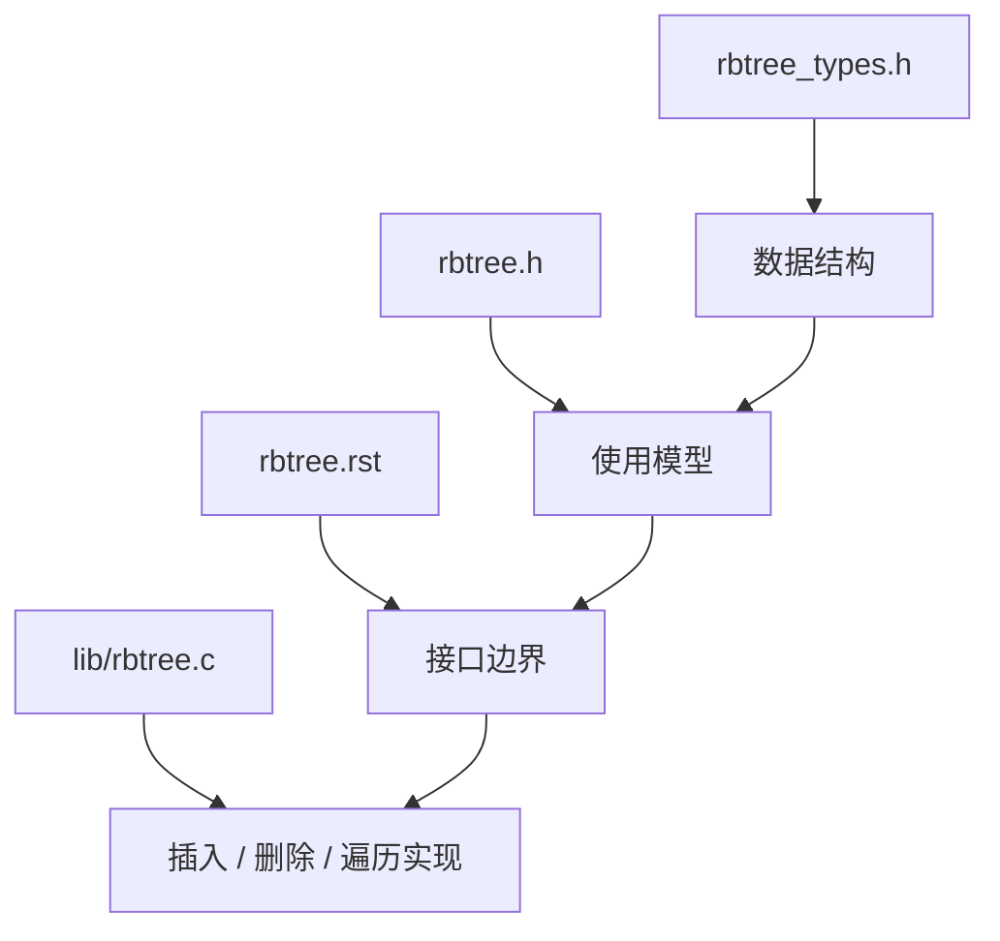

这个顺序非常重要。不能一开始就直接阅读 `____rb_erase_color()`。删除修复代码依赖父指针编码、颜色编码、NULL 叶子语义、旋转收尾逻辑、增强回调逻辑和调用者挂接语义。如果没有前面的结构基础，删除修复源码会变成一组难以理解的分支。

------

### 8.1.3_本章要解决的核心问题

本章要解决的核心问题可以分成五组。

第一组，数据结构问题：

```text
struct rb_node 为什么不保存 key？

struct rb_node 为什么不保存 value？

struct rb_node 为什么没有独立 parent 字段？

struct rb_node 为什么没有独立 color 字段？

__rb_parent_color 为什么可以同时保存父指针和颜色？

struct rb_root 为什么只保存一个根节点指针？

struct rb_root_cached 为什么只缓存 leftmost？
```

第二组，接口职责问题：

```text
为什么使用者必须自己写查找逻辑？

为什么使用者必须自己写插入搜索逻辑？

为什么 rbtree 核心不提供统一 compare 回调？

为什么 rb_link_node() 只负责 BST 挂接？

为什么 rb_insert_color() 只负责红黑修复？

为什么 rb_erase() 不释放业务对象？
```

第三组，源码实现问题：

```text
插入修复循环如何表达父红问题？

父红叔红在内核源码中如何处理？

父红叔黑在内核源码中如何处理？

左侧 case 和右侧 mirror case 如何组织？

删除时结构删除和颜色修复如何分层？

删除修复如何表达缺黑位置？

兄弟为红、双侄黑、近侄红、远侄红如何落到源码分支？
```

第四组，工程扩展问题：

```text
rb_first() 如何找到最小节点？

rb_next() 如何找到中序后继？

rb_replace_node() 为什么要求新旧节点排序位置一致？

rb_root_cached 如何优化最小节点访问？

augmented rbtree 如何维护子树增强信息？
```

第五组，并发与调试问题：

```text
为什么 rbtree 核心不内置锁？

调用者需要保护哪些路径？

WRITE_ONCE() 在 rbtree 中有什么意义？

如何验证 BST 有序性？

如何验证红黑性质？

如何定位旋转后的父指针错误？

如何定位重复 key 或替换 key 错误？
```

------

### 8.1.4_理论红黑树与内核_rbtree_的阅读边界

理论红黑树关注的是：

```text
BST 有序性；

红黑五条性质；

插入红红冲突；

删除黑高缺失；

旋转保持中序有序；

染色恢复黑高约束。
```

Linux 6.12 rbtree 关注的是：

```text
节点字段如何压缩；

接口如何降低间接调用；

业务对象如何嵌入 rb_node；

调用者如何负责比较逻辑；

调用者如何负责对象生命周期；

调用者如何负责并发保护；

插入和删除如何在最少接口中完成；

遍历和替换如何保持排序关系；

cached 和 augmented 如何扩展普通 rbtree。
```

所以阅读 Linux rbtree 时，要把问题分成两层：

```text
第一层：红黑树理论约束
	它解释为什么这些旋转和染色是正确的。

第二层：Linux 工程实现约束
	它解释为什么代码要这样组织字段、接口、回调和内存关系。
```

本章后续阅读源码时，始终围绕这条主线：

```text
理论负责解释正确性；
工程负责解释代码形态。
```

------

## 8.2_Linux_内核为什么需要_rbtree

### 8.2.1_内核中的有序对象管理问题

内核中存在大量需要按 key 管理对象的场景。这些 key 可以是：

```text
虚拟地址；

文件偏移；

定时器到期时间；

I/O 请求起始扇区；

调度实体的虚拟运行时间；

区间起点；

资源 ID；

优先级；

时间戳。
```

这类对象管理通常不只要求保存对象，还要求支持：

```text
按 key 查找；

按 key 插入；

按 key 删除；

找到最小 key；

找到最大 key；

找到前驱；

找到后继；

按 key 顺序遍历；

判断某个 key 是否落在某个范围附近；

在对象数量增长后仍保持稳定复杂度。
```

如果只需要保存少量对象，链表可以完成任务。如果只需要等值查找，哈希表可以完成任务。但是当需求包含有序关系、前驱后继、最小最大、范围扫描时，就需要有序结构。

rbtree 的基本定位是：

```text
用于动态维护一组可排序对象；

在查找、插入、删除之间取得稳定折中；

提供顺序遍历能力；

提供前驱和后继访问能力；

避免普通 BST 因输入顺序退化成链表。
```

Linux 6.12 的 rbtree 文档列举了多个内核历史使用场景，包括 I/O 调度器、高精度定时器、文件系统目录项、VMA、epoll 文件描述符、加密 key 和网络调度等。([GitHub](https://raw.githubusercontent.com/torvalds/linux/v6.12/Documentation/core-api/rbtree.rst))

------

### 8.2.2_为什么链表不适合大规模有序查找

链表的结构特点是：

```text
每个节点只记录相邻节点；

查找时只能逐个比较；

不能通过一次比较排除大范围节点；

即使链表本身有序，定位插入位置仍需要线性扫描。
```

如果链表有 `n` 个节点，按 key 查找通常需要：

```text
O(n)
```

有序插入也通常需要：

```text
O(n)
```

因为必须先找到插入位置。

链表适合：

```text
节点数量少；

只需要简单遍历；

插入删除位置已经知道；

不需要复杂排序查找；

不需要前驱后继之外的快速定位。
```

链表不适合：

```text
节点数量较多；

需要频繁按 key 查找；

需要频繁有序插入；

需要在大规模对象中保持稳定查找成本；

需要按 key 找到相邻对象。
```

红黑树通过 BST 有序性减少查找路径，通过颜色约束控制树高。因此，在对象数量增长时，它可以把查找、插入、删除维持在：

```text
O(log n)
```

这里的重点不是“红黑树永远比链表好”，而是：

```text
当对象规模和查找频率达到一定程度，并且 key 有排序意义时，
链表的线性扫描成本会成为结构性问题。
```

------

### 8.2.3_为什么哈希表不能替代_rbtree_的有序遍历

哈希表主要解决等值查找：

```text
给定 key，快速找到 key 对应的对象。
```

它关注的是：

```text
key == target
```

不关注：

```text
key < target

key > target

target 的前驱

target 的后继

最小 key

最大 key

按 key 顺序遍历

某个区间内的所有 key
```

哈希表在合适情况下可以接近 O(1) 等值查找，但它不保持全局排序关系。因此，它不能直接回答：

```text
当前最小对象是谁？

大于 X 的第一个对象是谁？

从 A 到 B 的对象有哪些？

删除当前对象后，下一个有序对象是谁？
```

rbtree 的价值在于同时提供：

```text
动态插入；

动态删除；

按 key 查找；

按 key 顺序遍历；

最小最大节点；

前驱后继节点；

稳定 O(log n) 上界。
```

所以哈希表和 rbtree 的边界可以这样理解：

| 结构                  | 主要能力                     | 主要限制             | 适用场景       |
| --------------------- | ---------------------------- | -------------------- | -------------- |
| 链表                  | 简单组织、顺序遍历           | 查找通常 O(n)        | 小规模对象     |
| 哈希表                | 等值查找                     | 不维护排序           | key 到对象映射 |
| rbtree                | 有序查找、前驱后继、顺序遍历 | 实现和维护成本更高   | 有序对象管理   |
| XArray / radix 类结构 | 整数索引映射                 | 不等价于任意比较排序 | index 到对象   |
| Maple Tree            | 范围映射                     | 不是通用比较树       | VMA 等范围管理 |

Linux 6.12 的 rbtree 文档也明确区分了 rbtree、radix tree 和 hash table：radix tree 使用 long integer index 做稀疏数组式访问，hash table 不保持排序，而 rbtree 保存可排序数据并可按顺序遍历。([GitHub](https://raw.githubusercontent.com/torvalds/linux/v6.12/Documentation/core-api/rbtree.rst))

------

### 8.2.4_为什么_AVL_通常不是内核中的首选折中

AVL 树也是自平衡二叉搜索树。它比红黑树更严格地控制左右子树高度差，因此查找路径通常更短。但是更严格的平衡意味着插入和删除时需要更强的维护。

红黑树的工程折中是：

```text
不追求严格高度平衡；

允许局部高度差；

通过黑高和红节点限制控制整体树高；

减少插入和删除维护成本；

保持查找、插入、删除的 O(log n) 上界。
```

Linux 6.12 的 rbtree 文档说明，红黑树类似 AVL 树，但插入和删除具有更快的实时有界最坏情况表现：插入最多两次旋转，删除最多三次旋转；代价是查找略慢，但仍保持 O(log n)。([GitHub](https://raw.githubusercontent.com/torvalds/linux/v6.12/Documentation/core-api/rbtree.rst))

这说明红黑树不是为了取得“最短查找路径”，而是为了在以下目标之间折中：

```text
查找复杂度稳定；

插入复杂度稳定；

删除复杂度稳定；

旋转次数受控；

实现成本可接受；

工程性能可预测。
```

内核中大量对象不是只查不改，而是频繁插入、删除、查找混合进行。此时，红黑树的弱平衡更适合作为通用底层结构。

------

### 8.2.5_rbtree_在内核中的工程定位

Linux rbtree 不是一个完整的泛型容器。

它不是这种接口：

```c
map_insert(tree, key, value);
map_find(tree, key);
map_erase(tree, key);
```

它也不保存：

```text
key；

value；

比较函数；

对象数量；

锁；

内存分配策略。
```

Linux rbtree 提供的是底层树维护接口：

```text
rb_node：
	嵌入业务对象中的红黑树节点。

rb_root：
	红黑树根。

rb_link_node：
	把新节点按调用者搜索出的父子位置挂接到树中。

rb_insert_color：
	挂接后修复红黑性质。

rb_erase：
	从树中删除节点并修复红黑性质。

rb_first / rb_next：
	按中序关系遍历节点。

rb_replace_node：
	在排序位置不变的前提下替换节点。
```

调用者负责：

```text
定义业务结构体；

在业务结构体中嵌入 rb_node；

定义 key；

编写比较逻辑；

编写查找函数；

编写插入搜索函数；

决定重复 key 语义；（所以，解决key重复问题不在数据结构内，在使用者）

管理对象分配和释放；

管理并发锁；

决定是否使用 cached rbtree；

决定是否使用 augmented rbtree。
```

Linux 6.12 的 `rbtree.h` 注释明确说明，

* <span style="color:red;">使用 rbtree 时需要实现自己的 insert 和 search core，以避免回调带来的性能损失</span>；
* `rbtree.h` 该头文件还提供 `rb_link_node()`、`rb_insert_color()`、`rb_erase()`、遍历、替换、cached rbtree、RCU 相关和辅助查找插入接口。([GitHub](https://raw.githubusercontent.com/torvalds/linux/v6.12/include/linux/rbtree.h))

这就是 Linux rbtree 与教材实现的最大差异之一。

教材实现通常把树设计成完整容器：

```text
节点中有 key；

节点中有 value；

树中有 compare；

树中可能有 size；

树接口负责插入、查找、删除的完整逻辑。
```

Linux 内核实现只维护通用结构关系：

```text
rbtree 核心维护红黑树结构；

业务层维护排序语义和对象语义。
```

------

### 8.2.6_rbtree_与_XArray_Maple_Tree_radix_tree_的职责边界

Linux 内核中有多种查找结构。rbtree 只是其中之一。

rbtree 适合：

```text
key 可比较大小；

需要顺序关系；

需要动态插入删除；

需要前驱后继；

需要最小最大；

需要 O(log n) 上界；

对象不是简单连续整数索引。
```

XArray、radix tree 类结构更偏向：

```text
整数索引到对象；

稀疏数组；

页缓存、ID 到对象映射等场景。
```

Maple Tree 更偏向：

```text
范围映射；

地址区间管理；

VMA 这类区间集合；

减少锁竞争和提高范围查询效率的场景。
```

所以不能把 rbtree 当成内核所有索引问题的统一答案。它的准确定位是：

```text
内核中用于有序对象管理的基础结构之一。
```

它解决的是“比较排序下的动态集合”问题，而不是所有映射问题。

------

### 8.2.7_本节小结

本节固定以下结论：

```text
第一，内核需要 rbtree，是因为很多对象需要按 key 有序管理。

第二，链表适合小规模或简单遍历，不适合大规模有序查找。

第三，哈希表适合等值查找，不适合顺序遍历、前驱后继、范围扫描。

第四，红黑树相对 AVL 的价值在于弱平衡折中和更新成本控制。

第五，Linux rbtree 不是泛型 map，而是底层红黑树结构维护接口。

第六，排序语义、对象生命周期、并发保护都由调用者负责。
```

------

## 8.3_Linux_6.12_rbtree_源码文件总览

这一节应该先把 **Linux 6.12 自己的结构讲稳**，再把它和教材模型对齐。下面这版按“源码结构 → 字段语义 → 工程意图 → 教材对比 → 总结心智模型”的顺序讲解。

### 8.3.1_include/linux/rbtree_types.h_基础类型定义

[include/linux/rbtree_types.h](../../../../research/source_reading/linux/include/linux/rbtree_types.h) 是阅读 Linux 6.12 rbtree 的入口文件。

它定义三类基础结构：

```text
struct rb_node

struct rb_root

struct rb_root_cached
```

等价视图如下：

```c
struct rb_node {
	unsigned long __rb_parent_color;
	struct rb_node *rb_right;
	struct rb_node *rb_left;
};

struct rb_root {
	struct rb_node *rb_node;
};

struct rb_root_cached {
	struct rb_root rb_root;
	struct rb_node *rb_leftmost;
};
```

源代码如下所示：

```c
struct rb_node {
	unsigned long  __rb_parent_color;
	struct rb_node *rb_right;
	struct rb_node *rb_left;
} __attribute__((aligned(sizeof(long))));
/* 这个对齐看起来可能没有意义，但据说 CRIS 需要它 */

struct rb_root {
	struct rb_node *rb_node;
};

/*
 * 缓存最左节点的红黑树。
 *
 * 我们没有缓存最右节点，这是基于内存占用与能够
 * 从 O(1) rb_last() 中受益的潜在用户数量之间的权衡。
 * 这样做并不值得；需要这个功能的用户始终可以显式
 * 实现这套逻辑。
 *
 * 此外，想同时缓存两个指针的用户可能会觉得这有点
 * 不对称，但这是可以接受的。
 */
struct rb_root_cached {
	struct rb_root rb_root;
	struct rb_node *rb_leftmost;
};

#define RB_ROOT (struct rb_root) { NULL, }
#define RB_ROOT_CACHED (struct rb_root_cached) { {NULL, }, NULL }
```

这三个结构分别承担不同职责：

```text
struct rb_node：
	表示一个红黑树节点；
	只保存树结构信息；
	不保存业务 key；
	不保存业务 value。

struct rb_root：
	表示一棵普通 rbtree 的根；
	只保存根节点指针。

struct rb_root_cached：
	表示一棵缓存最左节点的 rbtree；
	在普通根之外增加 rb_leftmost。
```

Linux 6.12 的源码中，`rbtree_types.h` 还定义了 `RB_ROOT` 和 `RB_ROOT_CACHED`，分别用于初始化普通空树和 cached 空树。

这个文件很短，但它决定了 Linux rbtree 的核心风格：

```text
节点嵌入业务对象；

颜色和父指针压缩存储；

根结构极简；

最左节点缓存作为可选扩展。
```

------

#### (1)_三个基础结构的整体关系

先不要急着把它和教材红黑树对比。

先只站在 Linux 源码自己的角度看，`rbtree_types.h` 其实只想表达一件事：

```text
Linux rbtree 只提供树结构骨架。
```

它没有定义 key，没有定义 value，没有定义比较函数，也没有定义节点分配方式。

整体关系如下：

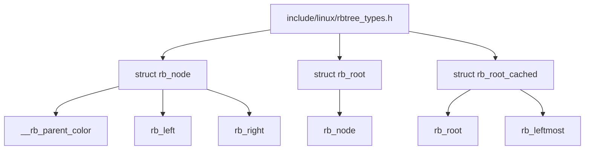

这张图要记住两个重点：

```text
第一，rb_node 是树节点本身；
第二，rb_root 和 rb_root_cached 是树的入口。
```

但是这个“树节点”不是业务节点。

它只是一个可以被挂进红黑树的结构件。

------

#### (2)_struct_rb_node_Linux_rbtree_的节点骨架

Linux 中的 `struct rb_node` 定义如下：

```c
struct rb_node {
	unsigned long  __rb_parent_color;
	struct rb_node *rb_right;
	struct rb_node *rb_left;
} __attribute__((aligned(sizeof(long))));
```

字段可以拆开看：

```text
__rb_parent_color：
	同时保存父节点指针和当前节点颜色。

rb_right：
	指向右孩子。

rb_left：
	指向左孩子。
```

结构示意图如下：

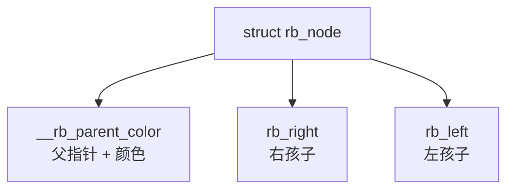

这里最容易让人不适应的是：

```text
Linux rb_node 没有单独的 parent 字段；
Linux rb_node 没有单独的 color 字段；
Linux rb_node 没有 key；
Linux rb_node 没有 value。
```

也就是说，Linux 的 `struct rb_node` 不是教材里那种完整节点。

它只是红黑树算法需要的最小结构信息。

------

#### (3)_rb_parent_color_父指针和颜色压缩存储

教材里通常会把父指针和颜色分开写：

```c
struct rb_node {
	enum rb_color color;
	struct rb_node *parent;
	struct rb_node *left;
	struct rb_node *right;
};
```

但 Linux 不是这样。

Linux 把父指针和颜色放进同一个字段：

```c
unsigned long  __rb_parent_color;
```

逻辑上可以把它理解成：

```text
__rb_parent_color =
	父节点地址的高位部分
	+
	颜色标志位
```

示意图如下：

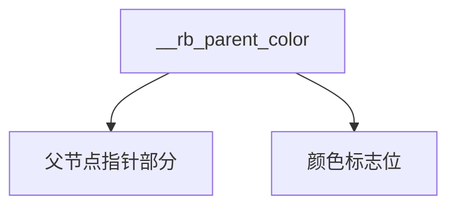

为什么可以这么做？

原因在于 `struct rb_node` 有对齐要求：

```c
__attribute__((aligned(sizeof(long))))
```

源码注释中也说：

```c
/* 这个对齐看起来可能没有意义，但据说 CRIS 需要它 */
```

从算法理解角度，可以先建立这个印象：

```text
节点地址因为对齐，低位通常不会被真实地址使用；

Linux 借用这些低位保存颜色信息；

剩余高位仍然表示父节点地址。
```

这就是 Linux rbtree 代码里经常看到 parent/color 位运算的根本原因。

它不是算法理论变了，而是工程存储方式变了。

教材红黑树写成：

```text
node->parent
node->color
```

Linux 里面变成：

```text
node->__rb_parent_color
```

只是表现形式不同，本质上仍然需要回答两个问题：

```text
当前节点的父节点是谁？

当前节点是红色还是黑色？
```

---

#### (4)_rb_left_和_rb_right_左右孩子仍然是显式指针

虽然 Linux 压缩了父指针和颜色，但左右孩子没有压缩。

```c
struct rb_node *rb_right;
struct rb_node *rb_left;
```

也就是说，红黑树最基本的二叉搜索树结构仍然清晰存在：

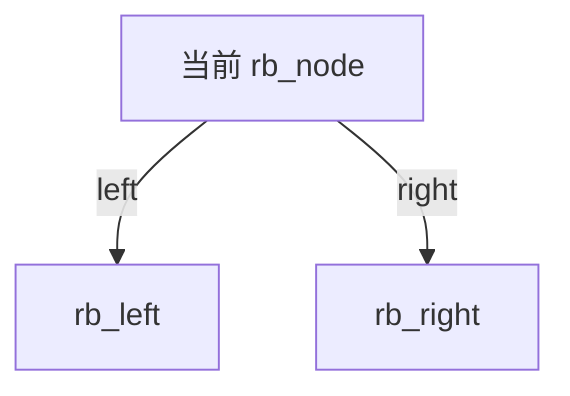

所以读 Linux rbtree 时，不要被 `__rb_parent_color` 吓住。

它看起来不像教材，但红黑树的基本树形关系没有变：

```text
每个节点最多两个孩子；

左子树小于当前节点；

右子树大于当前节点；

插入和删除仍然围绕旋转、染色、父子关系调整展开。
```

真正变化的是：

```text
Linux 不替你保存 key；

Linux 不替你比较大小；

Linux 不把 parent/color 明面拆成两个字段。
```

------

#### (5)_struct_rb_root_普通红黑树根

普通红黑树根结构非常简单：

```c
struct rb_root {
	struct rb_node *rb_node;
};
```

它只有一个字段：

```text
rb_node：
	指向整棵红黑树的根节点。
```

示意图如下：

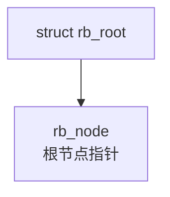

如果树为空，`rb_node` 就是 `NULL`。

源码中提供了空树初始化宏：

```c
#define RB_ROOT (struct rb_root) { NULL, }
```

也就是：

```text
普通空 rbtree =
	rb_root.rb_node = NULL
```

空树结构如下：

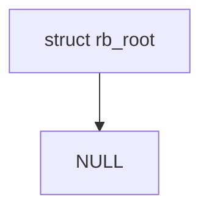

这体现了 Linux rbtree 的极简设计：

```text
rb_root 不保存节点数量；

rb_root 不保存比较函数；

rb_root 不保存 key 类型；

rb_root 不保存 value 类型；

rb_root 不保存 NIL 哨兵节点；

rb_root 只保存根节点指针。
```

它只回答一个问题：

```text
这棵树的根在哪里？
```

##### 1)_Tip_RB_ROOT_对象式宏_把结构体默认初始化封装成可复用模板

Linux rbtree 中定义了一个非常短的宏：

```c
#define RB_ROOT (struct rb_root) { NULL, }
```

它不是宏函数，而是**对象式宏**。

宏函数一般带参数：

```c
#define MACRO(x) ...
```

而 `RB_ROOT` 没有参数：

```c
#define RB_ROOT ...
```

所以它的本质就是：**预处理阶段的文本替换**。

也就是说，源码里只要出现：

```c
RB_ROOT
```

预处理后就会被替换成：

```c
(struct rb_root) { NULL, }
```

------

###### a)_它真正解决的问题_避免到处手动初始化结构体成员

`struct rb_root` 的定义很简单：

```c
struct rb_root {
	struct rb_node *rb_node;
};
```

一棵空红黑树，本质上就是：

```c
root.rb_node = NULL;
```

如果没有 `RB_ROOT`，使用者可能到处都要手写：

```c
struct rb_root root;

root.rb_node = NULL;
```

或者：

```c
struct rb_root root = {
	.rb_node = NULL,
};
```

这些写法都能工作，但问题是：

```text
每个使用者都要知道 struct rb_root 的内部成员；

每个使用者都要手动写默认初始化逻辑；

如果结构体以后扩展字段，初始化写法也容易分散在各处；

代码语义上是在操作成员，而不是表达“我要一棵空树”。
```

所以 Linux 用 `RB_ROOT` 把这个默认初始化动作封装起来：

```c
struct rb_root root = RB_ROOT;
```

这句话表达的不是：

```text
我手动把 rb_node 设置成 NULL。
```

而是：

```text
我要一个标准的空 rb_root。
```

这才是 `RB_ROOT` 的核心价值。

------

###### b)_RB_ROOT_的宏展开方式

当代码写成：

```c
struct rb_root root = RB_ROOT;
```

预处理后等价于：

```c
struct rb_root root = (struct rb_root) { NULL, };
```

其中：

```c
(struct rb_root) { NULL, }
```

是 C 语言的**复合字面量**。

它可以理解为：

```text
临时构造一个 struct rb_root 类型的匿名对象；
用 { NULL, } 初始化它；
然后用这个对象初始化 root。
```

由于 `struct rb_root` 只有一个成员：

```c
struct rb_node *rb_node;
```

所以：

```c
(struct rb_root) { NULL, }
```

等价于：

```c
(struct rb_root) {
	.rb_node = NULL,
}
```

最终效果就是：

```text
root.rb_node = NULL
```

------

###### c)_为什么要写成带类型的_(struct_rb_root)_{_NULL,_}

如果宏只是写成：

```c
#define RB_ROOT { NULL, }
```

那么它只能比较自然地用于定义时初始化：

```c
struct rb_root root = RB_ROOT;
```

展开后是：

```c
struct rb_root root = { NULL, };
```

这没有问题。

但是如果后面想重新置空：

```c
root = RB_ROOT;
```

就会展开成：

```c
root = { NULL, };
```

这在 C 语言里不是合法赋值表达式。

所以 Linux 写成：

```c
#define RB_ROOT (struct rb_root) { NULL, }
```

这样 `RB_ROOT` 展开后是一个**类型明确的结构体值表达式**。

因此它既可以用于定义时初始化：

```c
struct rb_root root = RB_ROOT;
```

也可以用于后续重新赋值：

```c
root = RB_ROOT;
```

展开后就是：

```c
root = (struct rb_root) { NULL, };
```

含义是：

```text
把 root 重新设置为一个标准空树根。
```

------

###### d)_它不是为了避免结构体赋值_而是为了避免手动成员初始化

这里要分清楚。

当写：

```c
root = RB_ROOT;
```

宏展开后是：

```c
root = (struct rb_root) { NULL, };
```

这本质上仍然是一次结构体赋值。

所以 `RB_ROOT` 不是为了避免结构体赋值。

它真正避免的是到处手写：

```c
root.rb_node = NULL;
```

也就是说，它避免的是：

```text
手动操作结构体成员；

手动维护结构体默认值；

手动关心结构体内部布局。
```

它把这些细节封装成一个统一的“默认初始化模板”。

------

###### e)_从语义上理解_RB_ROOT

可以把 `RB_ROOT` 理解成：

```text
struct rb_root 的标准空值模板。
```

也可以理解成：

```text
Linux rbtree 提供的空树根默认初始化器。
```

所以：

```c
struct rb_root root = RB_ROOT;
```

应该翻译成：

```text
定义一棵普通 Linux rbtree；
并把它初始化为空树。
```

而不是只机械地理解为：

```text
把 root.rb_node 赋值为 NULL。
```

后者只是实现效果，前者才是源码语义。

------

###### f)_RB_ROOT_CACHED_也是同一类思想

源码里还有一个 cached rbtree 的初始化宏：

```c
#define RB_ROOT_CACHED (struct rb_root_cached) { {NULL, }, NULL }
```

对应结构是：

```c
struct rb_root_cached {
	struct rb_root rb_root;
	struct rb_node *rb_leftmost;
};
```

所以：

```c
struct rb_root_cached root = RB_ROOT_CACHED;
```

展开后等价于：

```c
struct rb_root_cached root =
	(struct rb_root_cached) { {NULL, }, NULL };
```

进一步理解就是：

```c
struct rb_root_cached root = {
	.rb_root = {
		.rb_node = NULL,
	},
	.rb_leftmost = NULL,
};
```

含义是：

```text
普通红黑树根为空；

最左节点缓存也为空。
```

它和 `RB_ROOT` 的设计思想完全一样：**把结构体的默认空状态封装成一个随时可用的标准值。**

------

###### g)_使用时需要注意

`RB_ROOT` 只是初始化或重置树根：

```c
root = RB_ROOT;
```

它不会释放树里原来挂着的节点。

如果原来的树中已经有节点，直接执行：

```c
root = RB_ROOT;
```

只是让 `root.rb_node` 变成 `NULL`，相当于切断了根到原树的入口。

原来的节点对象不会自动释放，也不会自动遍历删除。

所以 `RB_ROOT` 适合用于：

```text
定义一棵新树；

初始化一个空 root；

在确认树中没有节点后重置 root。
```

不应该把它理解成：

```text
删除整棵红黑树。
```

------

###### h)_本质总结

`RB_ROOT` 的核心不是“宏很短”，而是它把一种结构体默认初始化行为封装成了统一的语义接口。

```text
没有 RB_ROOT：
	使用者需要手动知道并初始化 root.rb_node = NULL。

有了 RB_ROOT：
	使用者只需要表达 root = RB_ROOT，
	也就是“给我一个标准空红黑树根”。
```

所以它本质上是一种初始化语法糖：

```text
对象式宏
	+
	复合字面量
	+
	结构体默认空状态
```

组合起来形成：

```text
可复用、类型明确、语义统一的结构体默认初始化模板。
```

一句话记忆：

```text
RB_ROOT 是 Linux rbtree 用对象式宏封装出来的“空树根默认值”，
它的核心作用是避免使用者到处手动初始化 struct rb_root 的成员。
```

------

#### (6)_struct_rb_root_cached_缓存最左节点的红黑树根

`struct rb_root_cached` 是普通 rbtree 的增强版本：

```c
struct rb_root_cached {
	struct rb_root rb_root;
	struct rb_node *rb_leftmost;
};
```

它包含两个部分：

```text
rb_root：
	普通红黑树根。

rb_leftmost：
	整棵树中最左侧节点的缓存。
```

示意图如下：

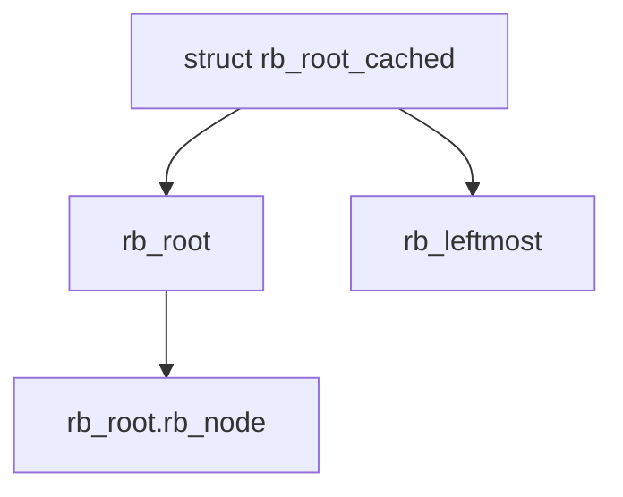

源码中对应的初始化宏是：

```c
#define RB_ROOT_CACHED (struct rb_root_cached) { {NULL, }, NULL }
```

也就是：

```text
cached 空树 =
	rb_root.rb_node = NULL
	rb_leftmost = NULL
```

空树结构如下：

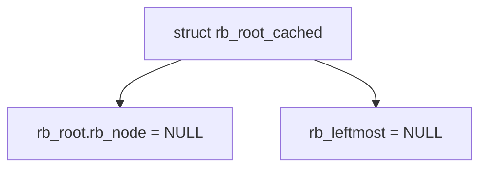

------

#### (7)_为什么只缓存最左节点

源码注释中特别解释了一点：

```text
Linux 缓存了 leftmost；
Linux 没有缓存 rightmost。
```

原因不是不能做，而是不值得。

普通 `rb_root` 查找最小节点时，需要从根开始一路向左：

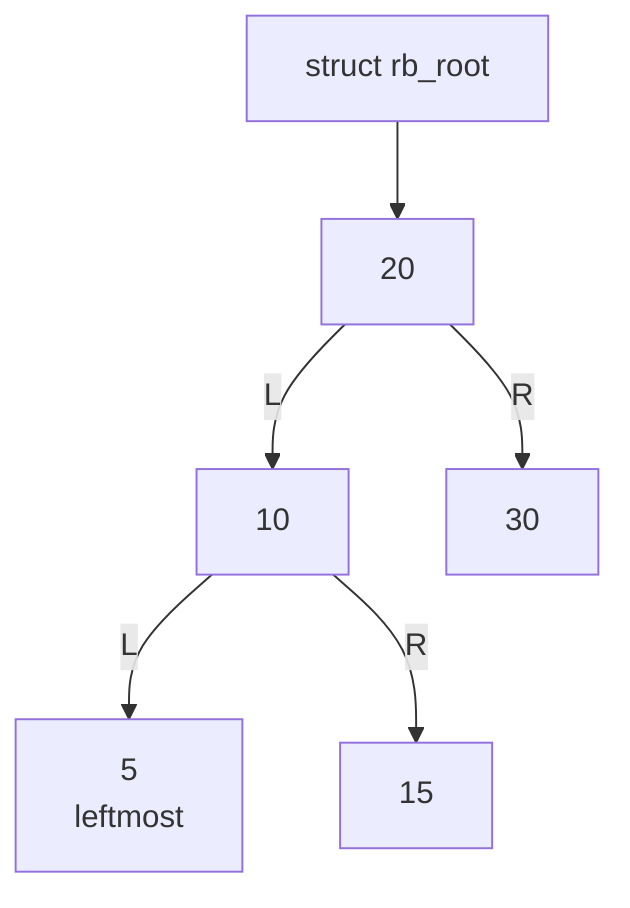

查找过程是：

```text
root
 -> left
 -> left
 -> left
直到没有更左的节点
```

这个过程的复杂度是：

```text
O(log n)
```

而 `rb_root_cached` 直接保存了最左节点：

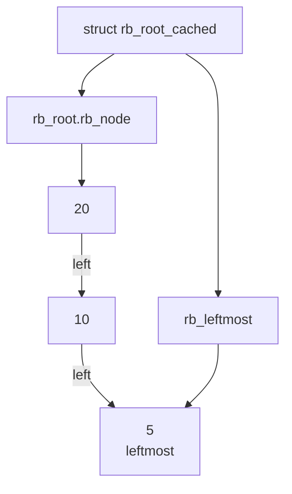

这样获取最小节点时，可以直接返回：

```text
root_cached->rb_leftmost
```

复杂度变成：

```text
O(1)
```

但是如果再缓存最右节点，就需要在 `struct rb_root_cached` 里再增加一个字段。

Linux 源码注释中的判断是：

```text
为了少数可能需要 O(1) rb_last() 的用户，
让所有使用 rb_root_cached 的结构都多付出一个字段的空间成本，
不划算。
```

所以它只缓存最左节点，不缓存最右节点。

这体现了 Linux 内核里的典型工程思维：

```text
不是理论上对称，就一定要实现对称；

不是功能能做，就一定要进入基础设施；

基础结构的每一个字段，都要考虑长期空间成本；

高频需求可以内建，低频需求交给使用者自己实现。
```

------

#### (8)_Linux_rbtree_的第一层心智模型

到这里，先不要急着看插入和删除。

只看 `rbtree_types.h`，应该先建立这张图：

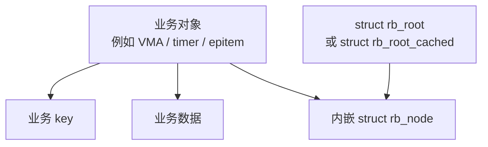

这张图是理解 Linux rbtree 的关键。

Linux 不是让红黑树节点保存业务对象。

Linux 是让业务对象内部嵌入红黑树节点。

也就是说：

```text
不是 rb_node 拥有业务数据；

而是业务对象拥有 rb_node。
```

如果写成伪代码，就是：

```c
struct my_object {
	unsigned long key;
	void *value;
	struct rb_node node;
};
```

这里真正挂进 rbtree 的是：

```text
my_object.node
```

而不是：

```text
my_object 本身
```

但当 rbtree 找到一个 `struct rb_node *` 后，又可以通过 `rb_entry()` 找回外层业务对象：

```c
struct my_object *obj;

obj = rb_entry(node, struct my_object, node);
```

逻辑如下：

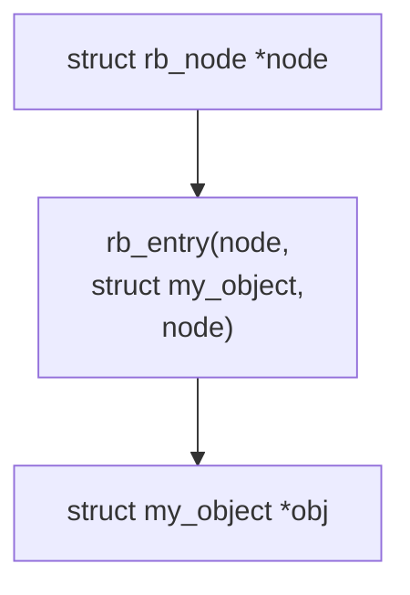

所以 Linux rbtree 的真实模型是：

```text
rb_node 负责进入树；

业务对象负责保存数据；

rb_entry 负责从树节点找回业务对象。
```

**rb_entry()源码**

[include/linux/rbtree.h](../../../../research/source_reading/linux/include/linux/rbtree.h)

```c
#define	rb_entry(ptr, type, member) container_of(ptr, type, member)
```

老传统了，这和内核链表操作时一个套路。参考[`container_of`：通过成员地址反推结构体地址](../../../foundations/c_language/gnu_extensions/C_language_extension.md#1.3.2_container_of_通过成员地址反推结构体地址)

------

#### (9)_与教材红黑树的结构差异

前面已经把 Linux 自己的结构讲清楚了，现在再和教材模型对比，才不会乱。

教材里的红黑树节点通常长这样：

```c
struct rb_node {
	key_type key;
	value_type value;
	enum color color;
	struct rb_node *parent;
	struct rb_node *left;
	struct rb_node *right;
};
```

这种节点同时承担两类职责：

```text
树结构职责：
	parent
	left
	right
	color

业务数据职责：
	key
	value
```

示意图如下：

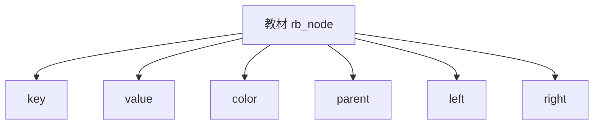

Linux 的节点则是：

```c
struct rb_node {
	unsigned long  __rb_parent_color;
	struct rb_node *rb_right;
	struct rb_node *rb_left;
};
```

示意图如下：

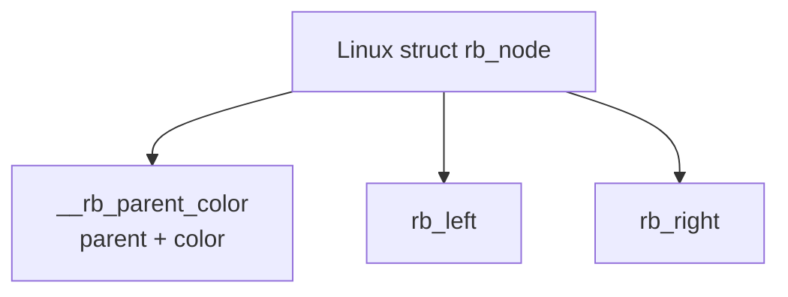

两者第一层差异就是：

```text
教材节点 = 树结构 + 业务数据；

Linux rb_node = 纯树结构节点。
```

所以教材讲红黑树时，常常会说：

```text
向红黑树插入 key = 20 的节点。
```

但 Linux rbtree 更准确的说法是：

```text
把某个业务对象中的 rb_node 挂入红黑树；
业务对象的 key 由使用者自己解释。
```

------

#### (10)_教材模型_红黑树是数据结构容器

教材里的红黑树经常被讲成一个完整容器。

比如：

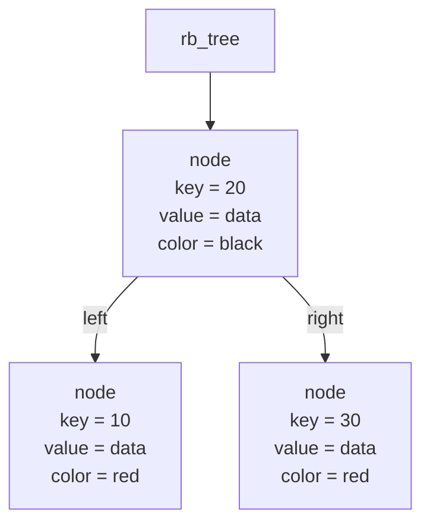

这种模型里，红黑树库通常负责：

```text
保存 key；

保存 value；

比较 key；

寻找插入位置；

创建或接收节点；

维护红黑树平衡；

提供 search / insert / delete 接口。
```

所以教材里的红黑树更像：

```text
一个完整的数据结构容器。
```

用户把 key 和 value 放进去，红黑树帮你组织它们。

------

#### (11)_Linux_模型_红黑树是嵌入式节点维护工具

Linux 模型完全不同。

Linux 中常见写法是：

```c
struct my_object {
	unsigned long key;
	void *value;
	struct rb_node node;
};
```

关系如下：

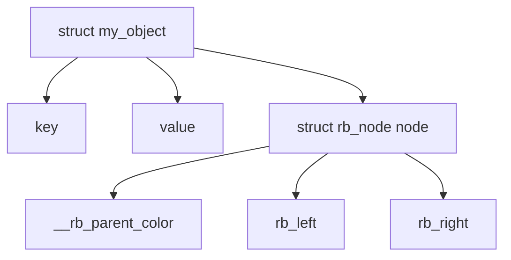

这时，rbtree 只认识：

```text
struct rb_node
```

它不认识：

```text
struct my_object

key

value

业务含义
```

这就是 Linux rbtree 的核心风格：

```text
红黑树算法只维护结构；

业务代码自己决定排序语义。
```

所以 Linux rbtree 不是“容器”。

它更像是一套基础设施：

```text
你把 rb_node 嵌入自己的对象；

你自己根据 key 找到插入位置；

你调用 rb_link_node() 建立父子关系；

你调用 rb_insert_color() 修复红黑树性质；

需要取回业务对象时，用 rb_entry() 反推出外层结构。
```

------

#### (12)_空叶子差异_教材_NIL_节点_vs_Linux_NULL_指针

教材中经常引入黑色 `NIL` 哨兵节点。

教材模型一般是：

```text
所有空叶子都是黑色 NIL；

真实节点的空孩子不指向 NULL，而是指向 NIL；

这样红黑树性质描述更统一。
```

示意图如下：

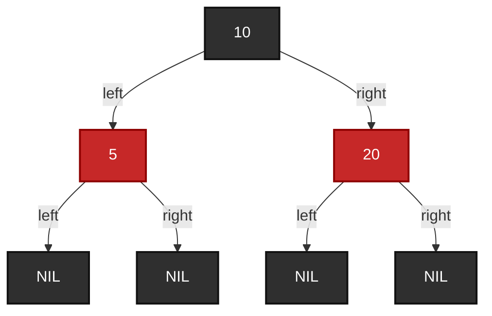

Linux rbtree 不使用显式 NIL 节点。

Linux 中空子树直接用 `NULL` 表示：

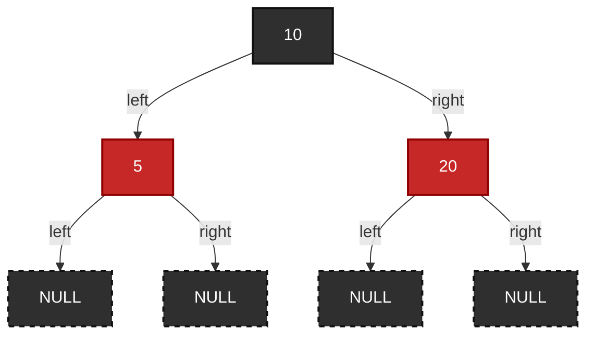

这会导致阅读源码时出现一个心理落差：

```text
教材里：
	空叶子也是一个黑色节点；
	很多性质可以对 NIL 节点直接描述。

Linux 里：
	空叶子是 NULL；
	NULL 在理论上等价于黑色叶子；
	但代码实现上要通过空指针判断处理边界。
```

所以后面看删除修复时，要在脑子里做这个转换：

```text
教材里的黑色 NIL
	≈
Linux 里的 NULL 空子树
```

否则你会觉得 Linux 删除修复代码和教材案例对不上。

------

#### (13)_根结构差异_完整_tree_对象_vs_极简_rb_root

教材里的红黑树根结构可能会设计成：

```c
struct rb_tree {
	struct rb_node *root;
	struct rb_node *nil;
	int size;
	int (*compare)(...);
};
```

它可能包含：

```text
root

nil

size

compare

allocator

debug 信息
```

示意图如下：

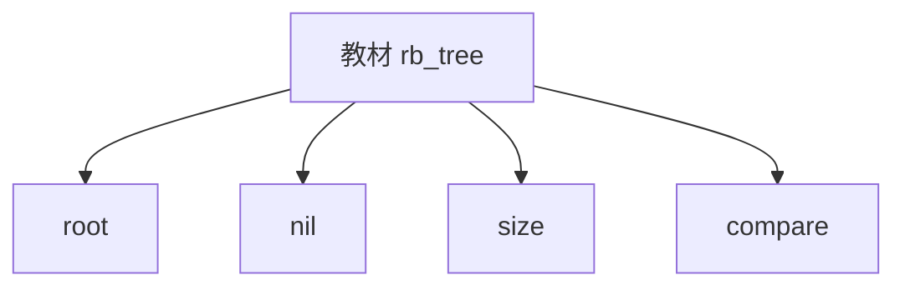

Linux 的普通根结构只有：

```c
struct rb_root {
	struct rb_node *rb_node;
};
```

示意图如下：

```mermaid
graph TD
	rb_linux_root["struct rb_root"]
	rb_linux_root_ptr["rb_node"]

	rb_linux_root --> rb_linux_root_ptr
```

这说明 Linux 的 `rb_root` 不负责：

```text
节点数量统计；

比较函数保存；

key 类型管理；

value 类型管理；

内存分配策略；

NIL 哨兵维护。
```

Linux 的 `rb_root` 只负责：

```text
保存根节点指针。
```

这也是为什么 Linux rbtree 的插入和查找不像教材那样“一步到位”。

因为 Linux 根本没有保存比较函数，也不知道你的 key 在哪里。

------

#### (14)_对比总结表

| 对比项             | 教材红黑树                            | Linux rbtree                                      |
| ------------------ | ------------------------------------- | ------------------------------------------------- |
| 节点定位           | 数据节点                              | 嵌入式结构节点                                    |
| 节点是否保存 key   | 通常保存                              | 不保存                                            |
| 节点是否保存 value | 通常保存                              | 不保存                                            |
| 颜色字段           | 通常独立保存                          | 与父指针压缩到 `__rb_parent_color`                |
| 父指针字段         | 通常独立保存                          | 与颜色压缩到 `__rb_parent_color`                  |
| 左右孩子           | `left` / `right`                      | `rb_left` / `rb_right`                            |
| 空叶子             | 常用黑色 `NIL` 哨兵                   | 使用 `NULL` 表示空子树                            |
| 根结构             | 可能包含 root / nil / size / compare  | `struct rb_root` 只保存 `rb_node`                 |
| 最小节点缓存       | 教材通常不强调                        | `struct rb_root_cached` 可缓存 `rb_leftmost`      |
| 比较逻辑           | 树库可能负责                          | 使用者自己负责                                    |
| 插入接口           | 可能封装成 `insert(tree, key, value)` | 用户搜索 + `rb_link_node()` + `rb_insert_color()` |
| 业务对象关系       | 节点就是业务数据                      | 业务对象内嵌 `rb_node`                            |
| 设计目标           | 教学清晰、算法完整                    | 低开销、可嵌入、适合内核大量对象                  |

------

#### (15)_一张总图总结差异

```mermaid
graph TD
	rb_compare_root["红黑树实现风格对比"]

	rb_compare_root --> rb_textbook_side["教材红黑树"]
	rb_compare_root --> rb_linux_side["Linux rbtree"]

	rb_textbook_side --> rb_textbook_data["节点保存 key / value"]
	rb_textbook_side --> rb_textbook_color_field["color 独立字段"]
	rb_textbook_side --> rb_textbook_parent_field["parent 独立字段"]
	rb_textbook_side --> rb_textbook_nil_node["常见 NIL 哨兵节点"]
	rb_textbook_side --> rb_textbook_container["偏容器模型"]
	rb_textbook_side --> rb_textbook_full_api["insert/search/delete 可能完整封装"]

	rb_linux_side --> rb_linux_no_data["rb_node 不保存业务数据"]
	rb_linux_side --> rb_linux_pack["parent + color 压缩存储"]
	rb_linux_side --> rb_linux_null["NULL 表示空子树"]
	rb_linux_side --> rb_linux_embed["rb_node 嵌入业务对象"]
	rb_linux_side --> rb_linux_min_root["rb_root 极简"]
	rb_linux_side --> rb_linux_cached["可选缓存 rb_leftmost"]
	rb_linux_side --> rb_linux_user_cmp["用户自己比较和搜索"]
```

------

#### (16)_本节结论

这一节的重点不是背 `struct rb_node` 有几个字段。

真正要建立的是下面这个心智模型：

```text
Linux rbtree 的 rb_node 不是业务节点；

Linux rbtree 的 rb_root 不是完整容器；

Linux rbtree 不保存 key；

Linux rbtree 不保存 value；

Linux rbtree 不保存比较函数；

Linux rbtree 只维护节点之间的红黑树结构关系。
```

因此，后面继续阅读 `include/linux/rbtree.h` 和 `lib/rbtree.c` 时，要用下面的方式对标教材红黑树：

```text
教材里的 node->parent：
	对应 Linux 的 __rb_parent_color 中的 parent 部分。

教材里的 node->color：
	对应 Linux 的 __rb_parent_color 中的 color 位。

教材里的 node->left / node->right：
	对应 Linux 的 rb_left / rb_right。

教材里的 NIL 黑叶子：
	对应 Linux 的 NULL 空子树。

教材里的 rb_insert(tree, key, value)：
	对应 Linux 中用户搜索位置 + rb_link_node() + rb_insert_color()。

教材里的业务节点：
	对应 Linux 中外层业务对象，而不是 struct rb_node 本身。
```

也就是说，Linux 不是改变了红黑树算法本质，而是把教材中的“完整容器式红黑树”拆成了更适合内核的“嵌入式节点维护工具”。

这就是 Linux rbtree 看起来不像教材红黑树的根本原因。

------

### 8.3.2_include/linux/rbtree.h_普通_rbtree_对外接口

`include/linux/rbtree.h` 是普通 rbtree 使用者最常接触的头文件。

它提供以下类别的接口和宏：

```text
父节点与业务对象还原：
	rb_parent()
	rb_entry()

空树与空节点判断：
	RB_EMPTY_ROOT()
	RB_EMPTY_NODE()
	RB_CLEAR_NODE()

普通插入删除：
	rb_link_node()
	rb_insert_color()
	rb_erase()

遍历：
	rb_first()
	rb_last()
	rb_next()
	rb_prev()

后序遍历：
	rb_first_postorder()
	rb_next_postorder()
	rbtree_postorder_for_each_entry_safe()

节点替换：
	rb_replace_node()
	rb_replace_node_rcu()

cached rbtree：
	rb_first_cached()
	rb_insert_color_cached()
	rb_erase_cached()
	rb_replace_node_cached()
	rb_add_cached()

辅助查找与插入：
	rb_add()
	rb_find()
	rb_find_add()
	rb_find_add_rcu()
	rb_find()
	rb_find_rcu()
	rb_find_first()
	rb_next_match()
	rb_for_each()
```

其中最重要的普通插入路径是：

```text
调用者自己查找插入位置；

调用 rb_link_node() 完成 BST 挂接；

调用 rb_insert_color() 完成红黑修复。
```

Linux 6.12 的 `rbtree.h` 中，`rb_link_node()` 会设置 `node->__rb_parent_color` 为 parent，清空左右孩子，然后把 `node` 挂到 `*rb_link`；`rb_link_node_rcu()` 则用 `rcu_assign_pointer()` 完成链接发布。([GitHub](https://raw.githubusercontent.com/torvalds/linux/v6.12/include/linux/rbtree.h))

这说明 `rbtree.h` 不是提供完整 map 容器，而是提供底层构件。

------

### 8.3.3_include/linux/rbtree_augmented.h_增强_rbtree_接口

普通 rbtree 只维护：

```text
BST 有序性；

红黑性质；

父子链接；

节点颜色；

中序遍历关系。
```

它不会自动维护业务层扩展信息。

但是有些场景需要在每个节点上维护“子树聚合信息”，例如：

```text
子树最大区间终点；

子树最大值；

子树最小值；

子树统计值；

子树覆盖范围；

子树资源占用信息。
```

这类需求使用 augmented rbtree。

augmented rbtree 的核心是：

```text
树仍然是红黑树；

排序规则仍然由调用者决定；

红黑修复仍然由 rbtree 核心完成；

额外信息由调用者提供回调维护。
```

Linux 6.12 的 `rbtree_augmented.h` 定义了 `struct rb_augment_callbacks`，包含 `propagate`、`copy`、`rotate` 三个回调；文件注释也说明，只有该回调结构以及 `rb_insert_augmented()`、`rb_erase_augmented()` 原型是预期公开的，其余内容属于实现细节。([GitHub](https://raw.githubusercontent.com/torvalds/linux/v6.12/include/linux/rbtree_augmented.h))

增强回调通常可以这样理解：

```text
propagate：
	从某个节点向上更新增强信息。

copy：
	节点替换时复制增强信息。

rotate：
	旋转时更新 old/new 两个节点的增强信息。
```

因此，augmented rbtree 的关键不是重新实现一棵树，而是在红黑树旋转和结构变化时保持业务扩展信息同步。

------

### 8.3.4_lib/rbtree.c_核心实现文件

`lib/rbtree.c` 是 rbtree 的核心实现文件。

它实现以下主要逻辑：

```text
插入修复：
	__rb_insert()
	rb_insert_color()
	__rb_insert_augmented()

删除修复：
	____rb_erase_color()
	__rb_erase_color()
	rb_erase()

旋转公共逻辑：
	__rb_rotate_set_parents()

普通遍历：
	rb_first()
	rb_last()
	rb_next()
	rb_prev()

后序遍历：
	rb_first_postorder()
	rb_next_postorder()

节点替换：
	rb_replace_node()
	rb_replace_node_rcu()

增强树删除：
	rb_erase_augmented()
```

Linux 6.12 的 `lib/rbtree.c` 是普通 rbtree 的核心实现文件，源码中包含插入、删除、旋转、遍历、替换和 augmented rbtree 相关实现。([GitHub](https://raw.githubusercontent.com/torvalds/linux/v6.12/lib/rbtree.c))

`lib/rbtree.c` 还包含 lockless lookup 相关说明：更新树结构中 `rb_left`、`rb_right` 指针时需要使用 `WRITE_ONCE()`，并且程序顺序上不能临时制造树结构环；这样不能保证无锁遍历一定看到完整树，但能保证遍历只看到有效元素并且不会陷入循环。([GitHub](https://raw.githubusercontent.com/torvalds/linux/v6.12/lib/rbtree.c))

这说明 Linux rbtree 源码不仅实现红黑树算法，还考虑了工程可见性问题：

```text
指针更新顺序；

无锁查找观察到的中间状态；

旋转过程中不能形成循环；

编译器不能随意拆分关键指针写入；

增强回调需要和旋转同步。
```

------

### 8.3.5_Documentation/core-api/rbtree.rst_官方使用说明

官方文档主要说明 rbtree 的使用方式和边界。

其中几个关键点是：

```text
rbtree 用于可排序 key/value 数据；

实现位于 lib/rbtree.c；

使用时包含 linux/rbtree.h；

rb_node 嵌入业务结构体；

通过 rb_entry() 或 container_of() 还原业务对象；

使用者自己实现 search 和 insert；

锁由使用者负责；

插入时先 rb_link_node()，再 rb_insert_color()；

删除时调用 rb_erase()；

rb_erase() 不释放业务对象；

rb_replace_node() 要求新旧节点 key 一致；

rb_first()、rb_next() 用于中序遍历；

rb_root_cached 用于缓存最左节点；

augmented rbtree 用于维护子树增强信息。
```

这些内容构成 Linux 6.12 rbtree 的使用契约。([GitHub](https://raw.githubusercontent.com/torvalds/linux/v6.12/Documentation/core-api/rbtree.rst))

阅读源码时，应当把官方文档作为接口语义参考，把 `lib/rbtree.c` 作为实现参考。

------

### 8.3.6_为什么源码阅读应当从类型定义开始

阅读 rbtree 不能直接从插入修复或删除修复开始。

如果一开始直接看：

```text
__rb_insert()

____rb_erase_color()

__rb_rotate_set_parents()
```

会遇到大量难以理解的细节：

```text
__rb_parent_color 是什么？

rb_parent() 为什么要清低位？

rb_red_parent() 为什么能直接取父节点？

rb_set_parent_color() 为什么同时设置父节点和颜色？

WRITE_ONCE() 为什么包住 rb_left / rb_right？

NULL 为什么能代表黑色 NIL？

augment_rotate() 为什么出现在旋转路径中？
```

因此正确顺序是：

```text
先理解 rb_node；

再理解 rb_root；

再理解 rb_node 如何嵌入业务结构体；

再理解使用者如何查找插入位置；

再理解 rb_link_node()；

最后理解 rb_insert_color() 和 rb_erase()。
```

这不是阅读习惯问题，而是源码依赖关系决定的。

------

### 8.3.7_本节小结

本节固定源码入口：

```text
rbtree_types.h：
	理解 rb_node、rb_root、rb_root_cached。

rbtree.h：
	理解普通 rbtree 接口、辅助宏、遍历接口、cached 接口。

rbtree_augmented.h：
	理解增强树回调机制。

lib/rbtree.c：
	理解插入修复、删除修复、旋转、遍历、替换实现。

rbtree.rst：
	理解官方使用方式和调用者职责。
```

后续所有分析都围绕这些文件展开。

------

## 8.4_Linux_rbtree_的数据结构设计

### 8.4.1_struct_rb_node_的字段组成

Linux 6.12 中，`struct rb_node` 的核心字段是：

```c
struct rb_node {
	unsigned long __rb_parent_color;
	struct rb_node *rb_right;
	struct rb_node *rb_left;
};
```

它只保存红黑树结构信息：

```text
__rb_parent_color：
	父节点指针和颜色标志的压缩编码。

rb_right：
	右孩子。

rb_left：
	左孩子。
```

它不保存：

```text
key；

value；

独立 parent 字段；

独立 color 字段；

比较函数；

业务对象指针。
```

教材中常见节点结构是：

```c
struct demo_rbtree_node {
	int key;
	int value;
	int color;
	struct demo_rbtree_node *parent;
	struct demo_rbtree_node *left;
	struct demo_rbtree_node *right;
};
```

Linux 内核不是这样设计。Linux 的 `rb_node` 通常嵌入业务对象：

```c
struct demo_rb_item {
	int key;
	int value;
	struct rb_node node;
};
```

结构关系如下：

```mermaid
graph TD
	demo_item["struct demo_rb_item"]
	demo_key["key"]
	demo_value["value"]
	demo_node["struct rb_node node"]
	demo_parent_color["__rb_parent_color"]
	demo_right["rb_right"]
	demo_left["rb_left"]

	demo_item --> demo_key
	demo_item --> demo_value
	demo_item --> demo_node
	demo_node --> demo_parent_color
	demo_node --> demo_right
	demo_node --> demo_left
```

这里要固定一个核心认识：

```text
rb_node 不是业务节点本身；
rb_node 是业务对象内部的一段树链接字段。
```

业务对象知道自己的 key 和 value。rbtree 核心只维护树结构。

------

### 8.4.2_rb_parent_color_为什么把父指针和颜色压在一起

理论红黑树通常有两个字段：

```text
parent；

color。
```

Linux rbtree 把它们合并到：

```text
unsigned long __rb_parent_color;
```

原因是内核对象地址通常满足对齐要求，指针低位可以用于保存标志位。颜色只需要一位即可表达：

```text
红；

黑。
```

因此，`__rb_parent_color` 可以理解成：

```text
高位：
	parent 指针主体。

低位：
	颜色标志和内部状态位。
```

示意如下：

```mermaid
graph TD
	rb_parent_color["__rb_parent_color"]
	rb_parent_bits["高位：parent 指针"]
	rb_color_bits["低位：color 标志"]

	rb_parent_color --> rb_parent_bits
	rb_parent_color --> rb_color_bits
```

读取父节点时，不能直接把 `__rb_parent_color` 当指针用，而要清除低位标志：

```text
rb_parent(node)
	= 去掉低位标志后的 parent 指针。
```

Linux 6.12 的 `rbtree.h` 中，`rb_parent(r)` 通过对 `__rb_parent_color` 执行 `& ~3` 获取父节点；`RB_EMPTY_NODE()` 和 `RB_CLEAR_NODE()` 也都基于 `__rb_parent_color` 编码节点状态。([GitHub](https://raw.githubusercontent.com/torvalds/linux/v6.12/include/linux/rbtree.h))

设置父节点和颜色时，也不能分开随意写，而要使用内核提供的辅助逻辑：

```text
rb_set_parent_color(node, parent, color)
	= parent 地址 | color 标志。
```

Linux 6.12 的 `rbtree_augmented.h` 中定义了 `RB_RED`、`RB_BLACK`、`rb_color()`、`rb_is_red()`、`rb_is_black()`、`rb_set_parent()`、`rb_set_parent_color()` 等底层颜色与父指针辅助逻辑。([GitHub](https://raw.githubusercontent.com/torvalds/linux/v6.12/include/linux/rbtree_augmented.h))

这种设计的工程收益是：

```text
减少一个字段；

减小 rb_node 结构体大小；

提高节点密度；

改善缓存局部性；

减少大量内核对象嵌入 rb_node 时的内存成本。
```

代价是：

```text
源码可读性下降；

调试时不能直接读取 parent；

颜色也不是独立字段；

必须通过辅助宏理解父指针和颜色。
```

这体现了 Linux 内核常见取舍：

```text
用更复杂的字段编码，换取更紧凑的数据结构。
```

------

### 8.4.3_为什么颜色可以使用指针低位存储

颜色可以放入指针低位，前提是 `struct rb_node` 的地址满足对齐要求。

Linux 6.12 的 `struct rb_node` 带有 `aligned(sizeof(long))` 对齐属性；源码注释还提到该对齐与特定架构需求有关。([GitHub](https://raw.githubusercontent.com/torvalds/linux/v6.12/include/linux/rbtree_types.h))

当对象按机器字对齐时，有效地址的低若干位固定为 0。红黑树颜色只需要极少标志位，因此可以把这些低位用于颜色编码。

可以理解为：

```text
真实 parent 地址：
	低位为 0。

编码后的 __rb_parent_color：
	高位仍然是 parent 地址；
	低位写入颜色标志。
```

读取 parent 时清除低位：

```text
parent = __rb_parent_color & ~低位掩码
```

读取 color 时查看低位：

```text
color = __rb_parent_color & 颜色掩码
```

这个设计必须遵守几个规则：

```text
不能直接使用 __rb_parent_color 作为 parent；

不能设置 parent 时破坏 color；

不能设置 color 时破坏 parent；

调试时需要先解码；

所有修改必须通过内核辅助函数或宏完成。
```

因此，后续阅读源码时要记住：

```text
__rb_parent_color 是编码字段，不是普通字段。
```

------

### 8.4.4_rb_left_与_rb_right_的含义

`rb_left` 和 `rb_right` 是红黑树作为二叉搜索树的左右孩子指针。

它们表达的是结构关系：

```text
rb_left：
	当前节点的左孩子。

rb_right：
	当前节点的右孩子。
```

但是它们不保存排序规则。排序规则由调用者保证。

对于业务对象：

```c
struct demo_rb_item {
	int key;
	struct rb_node node;
};
```

如果调用者规定：

```text
左子树 key < 当前 key

右子树 key > 当前 key
```

那么插入搜索代码就必须严格按这个规则走：

```text
新 key 小于当前 key：
	进入 rb_left；

新 key 大于当前 key：
	进入 rb_right；

新 key 等于当前 key：
	按业务规则处理重复 key。
```

rbtree 核心不会检查这个规则。

如果调用者写错比较逻辑：

```text
小于时走右边；

大于时走左边；

查找和插入使用不同规则；

替换节点时 key 改变；

重复 key 处理不一致；
```

那么树仍然可能满足红黑颜色性质，但 BST 有序性已经被业务层破坏。

所以必须明确：

```text
rb_left / rb_right 只保存结构链接；
BST 排序语义由调用者负责。
```

------

### 8.4.5_struct_rb_root_的作用

`struct rb_root` 表示一棵普通 rbtree 的根。

它的结构非常简单：

```c
struct rb_root {
	struct rb_node *rb_node;
};
```

语义是：

```text
rb_node == NULL：
	空树。

rb_node != NULL：
	指向根节点。
```

初始化普通 rbtree 时使用：

```c
struct rb_root root = RB_ROOT;
```

`rb_root` 不保存：

```text
节点数量；

锁；

比较函数；

业务类型；

最小节点；

最大节点；

内存分配器。
```

所以如果业务需要这些信息，必须自己封装：

```c
struct demo_rb_tree {
	struct rb_root root;
	unsigned int count;
	spinlock_t lock;
};
```

这说明 Linux rbtree 的根结构只承担一个职责：

```text
找到整棵树的根节点。
```

其他业务状态全部由调用者维护。

------

### 8.4.6_struct_rb_root_cached_的作用

普通 `struct rb_root` 只保存根节点。如果要获取最小节点，需要从根开始一直向左走：

```c
struct rb_node *node;

node = root->rb_node;
while (node->rb_left)
	node = node->rb_left;
```

这个过程复杂度是：

```text
O(log n)
```

如果某个子系统频繁需要获取最小节点，例如：

```text
最早到期的定时器；

最小地址区间；

最小 key 的等待对象；

调度队列中的最小排序项；
```

每次都从根向左查找会产生重复成本。

`struct rb_root_cached` 通过缓存最左节点解决这个问题：

```c
struct rb_root_cached {
	struct rb_root rb_root;
	struct rb_node *rb_leftmost;
};
```

其中：

```text
rb_root：
	普通 rbtree 根。

rb_leftmost：
	当前树中最左节点，也就是最小 key 节点。
```

获取最小节点时可以直接使用：

```c
rb_first_cached(&root_cached);
```

Linux 6.12 文档说明，cached rbtree 把获取最左节点从普通 `rb_first()` 的 O(logN) 优化为简单指针访问，代价是增加一个指针并在插入删除时维护该缓存。([GitHub](https://raw.githubusercontent.com/torvalds/linux/v6.12/Documentation/core-api/rbtree.rst))

注意：

```text
rb_root_cached 不是新的红黑树算法；
它只是普通 rbtree 加了一个 leftmost 缓存。
```

------

### 8.4.7_RB_ROOT_与_RB_ROOT_CACHED_初始化语义

普通 rbtree 初始化：

```c
struct rb_root root = RB_ROOT;
```

cached rbtree 初始化：

```c
struct rb_root_cached root = RB_ROOT_CACHED;
```

语义分别是：

```text
RB_ROOT：
	创建一棵空的普通 rbtree；
	root.rb_node == NULL。

RB_ROOT_CACHED：
	创建一棵空的 cached rbtree；
	root.rb_root.rb_node == NULL；
	root.rb_leftmost == NULL。
```

Linux 6.12 的 `rbtree_types.h` 中，`RB_ROOT` 初始化为 `{ NULL, }`，`RB_ROOT_CACHED` 初始化为 `{ {NULL, }, NULL }`。([GitHub](https://raw.githubusercontent.com/torvalds/linux/v6.12/include/linux/rbtree_types.h))

这两个宏只初始化树根，不初始化业务节点。

业务节点是否已经在树中，需要由节点状态和调用者逻辑共同管理。

------

### 8.4.8_RB_EMPTY_ROOT()_与空树判断

`RB_EMPTY_ROOT(root)` 用于判断一棵树是否为空。

语义是：

```text
root->rb_node == NULL
```

如果返回真，说明树中没有节点。

它只判断树根，不判断某个业务节点是否已经插入。

因此：

```text
RB_EMPTY_ROOT()
	判断树是否为空。

RB_EMPTY_NODE()
	判断某个节点是否处于游离状态。
```

kernel源码：

```c
// tools/include/linux/rbtree.h

#define RB_EMPTY_ROOT(root)  (READ_ONCE((root)->rb_node) == NULL)

/* 'empty' nodes are nodes that are known not to be inserted in an rbtree */
#define RB_EMPTY_NODE(node)  \
	((node)->__rb_parent_color == (unsigned long)(node))

#define RB_CLEAR_NODE(node)  \
	((node)->__rb_parent_color = (unsigned long)(node))
```

这两个接口语义不同，不能混用。

Linux 6.12 的 `rbtree.h` 中，`RB_EMPTY_ROOT(root)` 使用 `READ_ONCE((root)->rb_node) == NULL` 判断空树。([GitHub](https://raw.githubusercontent.com/torvalds/linux/v6.12/include/linux/rbtree.h))

------

### 8.4.9_RB_EMPTY_NODE()_与节点游离状态判断

`RB_EMPTY_NODE(node)` 用于判断一个 `rb_node` 是否处于空节点状态。

Linux rbtree 使用特殊编码表示空节点：

```text
node->__rb_parent_color == (unsigned long)node
```

也就是说，节点的 parent_color 指向自身。

这不是正常树结构中的父节点关系，而是一个节点状态标记。

对应接口是：

```c
RB_CLEAR_NODE(node);
```

它的作用是：

```text
把 node 标记为未链接状态。
```

Linux 6.12 的 `rbtree.h` 中，`RB_EMPTY_NODE(node)` 和 `RB_CLEAR_NODE(node)` 都基于 `node->__rb_parent_color == (unsigned long)(node)` 这类自指编码。([GitHub](https://raw.githubusercontent.com/torvalds/linux/v6.12/include/linux/rbtree.h))

典型使用顺序是：

```c
rb_erase(&item->node, &root);
RB_CLEAR_NODE(&item->node);
```

必须注意：

```text
RB_CLEAR_NODE() 不会把节点从树里摘除；

rb_erase() 才负责删除树结构关系；

RB_CLEAR_NODE() 只是删除后的节点状态标记。
```

错误做法是：

```text
节点仍在树中；

直接调用 RB_CLEAR_NODE()；

不调用 rb_erase()。
```

这样会导致树中已有父子指针仍然指向该节点，而该节点自身状态又被标记为空，最终造成结构破坏。

------

### 8.4.10_RB_CLEAR_NODE()_的工程意义

`RB_CLEAR_NODE()` 的意义在于管理节点生命周期状态。

它常用于解决这些问题：

```text
一个业务对象当前是否已经挂入 rbtree？

删除后如何标记节点已经不在树中？

如何避免重复删除？

如何避免重复插入？

对象暂时保留但节点已从树中移除时，如何标识状态？
```

示例语义：

```c
if (!RB_EMPTY_NODE(&item->node))
	return -EEXIST;
```

表示：

```text
如果节点不是空节点，说明它可能已经在树中；
此时拒绝重复插入。
```

再如：

```c
if (RB_EMPTY_NODE(&item->node))
	return -ENOENT;
```

表示：

```text
如果节点为空，说明它不在树中；
此时不能删除。
```

但是它不能替代并发保护：

```text
RB_EMPTY_NODE() 不是锁；

RB_CLEAR_NODE() 不是同步机制；

多个线程同时插入、删除、检查同一个节点时，仍然需要锁或 RCU 规则。
```

------

### 8.4.11_本节小结

本节固定 Linux 6.12 rbtree 的数据结构基础：

```text
struct rb_node：
	只保存树结构链接；
	不保存 key；
	不保存 value；
	不保存独立 parent；
	不保存独立 color。

__rb_parent_color：
	同时编码父节点和颜色；
	读取和写入都必须通过辅助宏或函数。

rb_left / rb_right：
	保存左右孩子；
	排序语义由调用者保证。

struct rb_root：
	只保存根节点；
	不保存锁、数量、比较函数、业务类型。

struct rb_root_cached：
	在普通根基础上缓存最左节点；
	用于优化频繁获取最小节点的场景。

RB_EMPTY_ROOT：
	判断树是否为空。

RB_EMPTY_NODE / RB_CLEAR_NODE：
	管理单个节点是否处于游离状态。
```

---

