# 第8章\_Linux\_6.12\_内核\_rbtree\_基础结构与工程模型

## 8.1\_章节内容说明

平衡算法已经能够维护键的顺序，本章接下来问：树链接和业务对象怎样共存？先确定阅读分工，再把工程结构接到前面的理论。

### 8.1.1\_本章在整条学习路径中的位置

前面的链条是“树 → 二叉搜索树 → 退化与旋转 → 2-3-4 树 → 红黑编码”。[P07](P07_红黑树_把_2-3-4_树映射成二叉表示.md#7.7.9_用反例回顾本章并选择下一步)已经说明：颜色限制路径长度，旋转改变局部父子关系，染色与旋转共同恢复约束。完整插入和删除分别在 [P35](P35_红黑插入与红红冲突上推.md)与 [P36](P36_红黑删除与缺黑位置传播.md)建立。现在仍有一个工程问题：如果业务对象本来就存在，为什么还要为了进入树另造一份带 key/value 的节点？

设想我们管理一组待处理任务。每个任务已有编号、到期时间和执行所需的数据；查询者想知道“最早的是谁”“不早于 35 的第一个是谁”“40 时刻有哪些任务”。树应该组织这些对象，却不应该替业务决定如何比较、怎样分配和何时释放。本章从这个分工进入 Linux 的节点、根、颜色编码和游离标记。

本章只把 **对象怎样进入树的表示与责任边界** 建立起来。嵌入成员与地址还原在 [P09](P09_Linux_6.12_内核_rbtree_嵌入式节点与使用者接口.md)继续；查询、接入及完整更新分别进入后续章节。源码阅读不意味着每章都要同时展开插入、删除、遍历和并发。

### 8.1.2\_本章以\_Linux\_6.12\_rbtree\_源码为主线

本书使用 NXP 官方 `linux-imx` 的 Linux 6.12.20，发布标签 `lf-6.12.20-2.0.0`，固定提交 `dfaf2136deb2af2e60b994421281ba42f1c087e0`。后文的“Linux 6.12”均受此边界约束，本地实验提交不作为证据。首次进入版本实现时先打开 [rbtree 源码阅读索引](../../../../research/source_reading/rbtree/navigation/P01_Linux_6.12_rbtree源码阅读索引.md#1.1_固定提交与阅读边界)，再按下面的职责定位；不是凭目录名推定源码版本。

| 上游位置 | 带着什么问题读 |
| --- | --- |
| `include/linux/rbtree_types.h` | 节点、普通根和缓存根分别存什么，哪些业务状态不在其中 |
| `include/linux/rbtree.h` | 哪些接口只挂接、哪些接口带搜索，调用者要提供什么 |
| `include/linux/rbtree_augmented.h` | 父色与父槽如何改写，增广回调怎样接入更新 |
| `lib/rbtree.c` | 接入以后如何修复，如何遍历与替换对象 |
| `Documentation/core-api/rbtree.rst` | 普通使用模型、锁与对象所有权如何分工 |

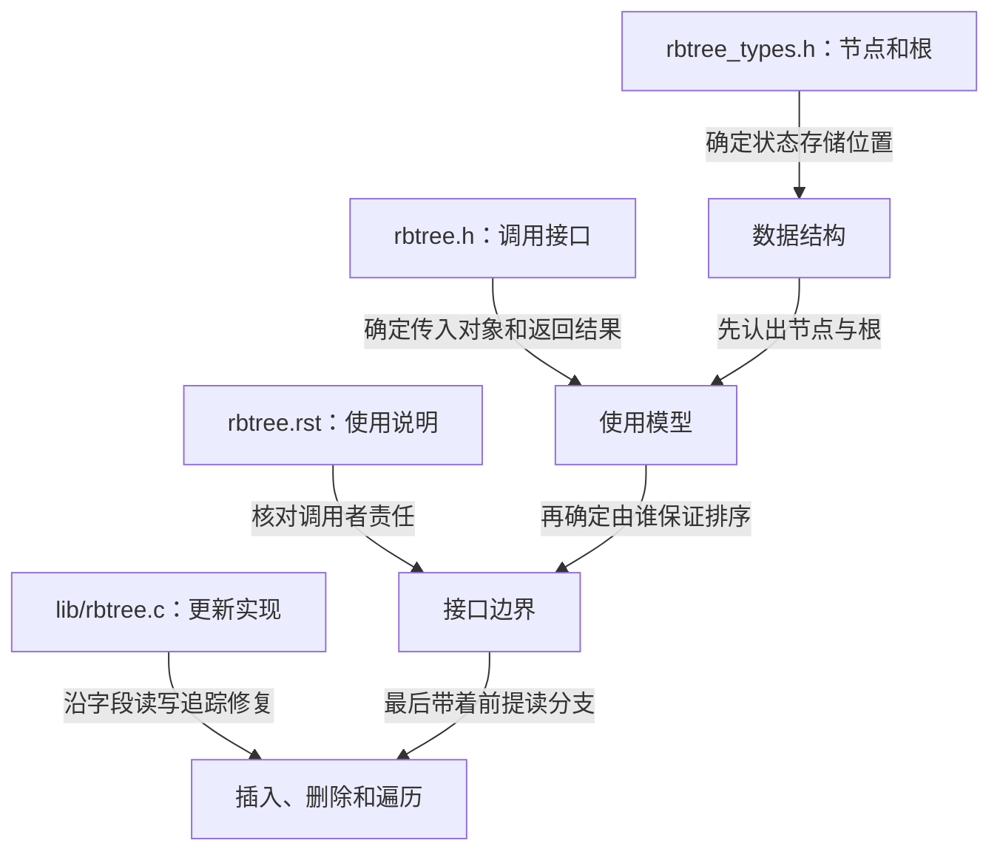
```mermaid
graph TD
    rb_types["rbtree_types.h：节点和根"] -->|确定状态存储位置| rb_data["数据结构"]
    rb_api["rbtree.h：调用接口"] -->|确定传入对象和返回结果| rb_usage["使用模型"]
    rb_doc["rbtree.rst：使用说明"] -->|核对调用者责任| rb_contract["接口边界"]
    rb_impl["lib/rbtree.c：更新实现"] -->|沿字段读写追踪修复| rb_algorithm["插入、删除和遍历"]
    rb_data -->|先认出节点与根| rb_usage
    rb_usage -->|再确定由谁保证排序| rb_contract
    rb_contract -->|最后带着前提读分支| rb_algorithm
```

不要从删除修复函数的第一条 `if` 开始猜算法：它使用父色编码、空孩子及缺口父槽，还会经过增广回调。先知道传入状态意味着什么，分支才有可检验的含义。后面的源码章节负责这些具体兑现，本章不会用函数名代替它们的前提。

### 8.1.3\_本章要解决的核心问题

整条工程路线仍需回答原来的五组问题，但阅读任务分开放置：

| 问题组 | 本章建立的认识 | 继续阅读 |
| --- | --- | --- |
| 数据结构 | 为什么节点不存 key/value，父地址与颜色怎样共存，普通根与最左缓存有什么区别 | 本章 8.3、8.4；嵌入地址进入 P09 |
| 接口职责 | 比较、重复键、分配、锁归调用者；挂接与修复各自承诺什么 | [查询](P10_Linux_6.12_内核_rbtree_查找与返回边界.md)、[接入](P26_Linux红叶接入与插入修复.md) |
| 修复实现 | 红红冲突与缺黑仍是理论问题，Linux 用具体字段和游标表达它们 | [删除与父槽](P11_Linux_6.12_内核_rbtree_删除与缺黑修复.md)及 P26 |
| 工程扩展 | 顺序遍历、同键替换、缓存最小值、维护子树摘要分别是不同需求 | [遍历](P27_Linux有序遍历与整树销毁.md)、[替换](P28_Linux同键替换与旧对象退出.md)、[扩展](P12_Linux_6.12_内核_rbtree_工程扩展_并发与验证.md) |
| 并发与诊断 | 有序、颜色与父链正确，不等于并发查询、发布和回收已经安全 | 先按 P10 的查询边界区分返回承诺，再在调用场景中选择保护规则 |

这样既保留问题全景，也不让第一次看到 `rb_node` 的读者同时背下所有修复分支。`WRITE_ONCE()`、锁和 RCU 都不能仅凭名字获得线程安全的结论；需要分别证明哪些访问受到保护、哪些对象仍然存活。

### 8.1.4\_理论红黑树与内核\_rbtree\_的阅读边界

理论给出“有序关系不变、颜色约束恢复”的证明。工程表示进一步决定：一个节点放在哪里、谁能取得它的地址、根改变时写哪个槽、退出树后谁还有权访问业务对象。两者需要互相对照，不能把字段压缩当成新的平衡算法，也不能把算法正确性当成生命周期证明。

例如，理论删除成功意味着目标不再属于树。业务对象可能还被别的索引或使用者持有，不能据此立即释放。反过来，清除一个“未挂入”标记也不等于改好了父节点的孩子指针。后文会在具体字段中再次遇到这两个差别。

## 8.2\_Linux\_内核为什么需要\_rbtree

暂时不拆节点字段。先用同一组任务比较几种组织方式，找出哪些业务要求必须由有序索引承担，哪些责任始终属于调用者。

### 8.2.1\_内核中的有序对象管理问题

先让任务编号与排序键分开。下面按到达顺序收到六个任务，记作“到期时间:编号”：

```text
40:4, 10:1, 40:2, 70:6, 25:3, 55:5
```

编号回答“是不是同一个任务”，到期时间回答“谁应该先处理”。两个任务可以同时到期；若业务要求确定的先后顺序，可用 `(到期时间, 编号)` 作为复合键，先比时间，相等再比编号。只比较时间也可以，但那时“等价对象”是一组任务，接口必须明确返回任意一个、第一项还是整组，不能把它误认为唯一编号查询。

本场景要求动态插入、取消、改期，读取最早任务，找不早于给定时间的第一项，并顺序处理一段时间内的任务。虚拟地址、文件偏移、起始扇区、区间起点、资源标识符、优先级、时间戳或调度实体的排序量，都可能形成其他场景的键；**键的名字不决定结构，实际操作决定结构**。取消已知对象和先按键找到对象的成本也要分开。

固定版本的 rbtree 使用文档保留了 2007 年的历史例子，包括输入输出请求调度、高精度定时器、ext3 文件系统目录项、虚拟内存区域（Virtual Memory Area，VMA）、epoll 文件就绪监视、密钥和网络调度。它说明应用问题的多样性，不是“6.12 所有这些模块仍采用相同结构”的现状清单。例如 VMA 的当前范围管理进入 [Maple 专章](P14_Maple_Tree_与_VMA_管理.md)，调度实体的具体键也须查相应版本，不能由此写成所有调度器都按同一个量排序。

### 8.2.2\_为什么链表不适合大规模有序查找

若按到达顺序把六个任务接成链表，要找最早任务，需要先把 `40:4` 当候选，看到 `10:1` 后更新候选，再读完余下四项才能证明没有更早的。下一次新任务到达后，除非额外维护最小值，读取最早任务还得再扫描。节点增加时，读完 `n` 个键所需工作随 `n` 增长。

改成按时间排列的链表，表头确实可以直接回答“最早是谁”，但插入 `55:5` 时必须沿有序链走到 `40:4` 与 `70:6` 之间。链表只有相邻地址，一次比较不能跳到尚未访问的中部；找不早于 35 的位置同样需要从入口推进。已持有节点且有必要的前驱/双向链接时，摘链可以是常数次指针修改，这并不消除此前定位的扫描。

红黑树把相同键关系放进左右子树。比较当前节点后，可以排除整个不满足方向的子树；颜色约束又阻止路径随插入顺序退化为长度 `n`。查找或更新的结构工作具有 `O(log n)` 上界，比较一次若需要扫描长字符串，其自身成本还要计入，不能把所有键比较都当成免费。

因此，少量对象、几乎总是全量遍历、已知位置的频繁摘接，仍可以选择链表。有序定位反复扫描的大集合才暴露本场景的主要问题。不存在脱离对象布局、规模和负载的“超过多少项一定更快”；本章讨论算法工作量，不把它伪装成缓存或墙钟时间测量。

### 8.2.3\_为什么哈希表不能替代\_rbtree\_的有序遍历

按任务编号建立哈希表后，编号 4 可直接确定待查桶，再在桶中核对相等关系；它很适合“取消编号 4”这样的定位。可是桶号来自散列函数，桶 5 不表示比桶 4 更晚到期。即使已找到时间 40 的任务，也不能从下一个桶推断下一个到期时间。

要在这个哈希表里找最早对象，仍需遍历所有候选，或者另外维护一个有序索引。后一种设计完全可行，但新增和取消时要同时维护两个入口，业务对象的寿命也要覆盖两个入口的读者。哈希表平均常数级的等值查询，不能自动兑现最小值、前驱后继或范围输出。

在树中找到第一个满足下界的节点后，可以沿中序后继输出后面的 `k` 个结果；完整范围查询不能只写 `O(log n)` 而忽略至少输出 `k` 项的成本。逐步遍历与端点维护在后续章节展开。

| 实际问题 | 首先考虑什么 | 本场景还缺什么 |
| --- | --- | --- |
| 只按编号找到一个对象 | 哈希表；同时考虑冲突与装载情况 | 到期顺序须另行组织 |
| 小集合或按已有链接遍历 | 链表 | 从任意键快速定位有序位置 |
| 比较排序、邻居与动态范围 | 红黑树等有序搜索结构 | 比较、重复键和对象保护策略仍由业务定义 |
| 长时间只读取一份已排好序的数据 | 有序数组及二分查找 | 插入/删除通常要移动后续元素 |

### 8.2.4\_怎样比较\_AVL\_与红黑树的维护成本

AVL 限制每个节点左右子树高度差不超过一；红黑树允许更宽的局部形状，通过黑高与红节点规则限制整体高度。AVL 的更紧高度上界可能减少某些查找的比较次数，但并不保证每一组数据、每一次查找都更短。节点分布、比较代价和访问局部性仍会影响实际结果。

两者插入都可能向根检查状态；AVL 的高度平衡检查不能简单等同于“每层都旋转”。红黑插入最多两次普通旋转，但叔红上推可能经过多层；删除最多三次旋转，黑色缺口仍可能反复向上合并。旋转次数有常数上界，**整个更新不是常数时间，更不是固定时延承诺**。AVL 删除可能在多个祖先处重新失衡，它承担更严格高度条件带来的维护工作。P35/P36 的计数实验可用来区分“多少次旋转”与“访问多少层”。

固定版使用文档把这种旋转边界作为红黑树的工程优点。我们据此理解 Linux 的公共实现选择，但不把它扩大成“内核里 AVL 总不好”或“红黑树一定延迟更低”。读多改少、比较昂贵时，可以评估更紧的高度约束；已有成熟的 rbtree 接口、动态更新多且有序查询丰富时，可以先评估红黑树。最后仍用同一负载检查比较、路径、更新和内存开销。

### 8.2.5\_rbtree\_在内核中的工程定位

在任务例子里，业务对象已有时间、编号和执行数据。Linux 的 `rb_node` 只是嵌入其中的树链接：不保存业务 key/value、对象数量、分配器、锁或树级比较函数。`rb_root` 只提供进入树的根指针。一个业务对象可以参与不同索引，但每一棵同时存在的树需要它自己的链接成员，不能让同一个节点的左右孩子同时表达两套顺序。

底层调用路径先由业务比较得到空孩子槽，再让 `rb_link_node()` 挂接红叶，随后由 `rb_insert_color()` 修复颜色与结构。它们不知道“到期时间”是什么意思，所以也不会替业务纠正查找方向或重复键策略。`rb_erase()` 撤销树成员关系并修复结构，不负责释放任务对象；`rb_first()` / `rb_next()` 只沿既有顺序返回节点；同键替换则要求新对象继续满足原排序位置。

原阅读批注保留如下，它针对手写搜索与底层接入模型：

* <span style="color:red;">使用 rbtree 时需要实现自己的 insert 和 search core，以避免回调带来的性能损失</span>；

这条设计动机不能扩展成“固定版本没有任何比较函数接口”。本版头文件还提供接收 `less` 的 `rb_add()`，以及接收 `cmp` 的 `rb_find()`、`rb_find_add()` 等辅助接口。区别在于 **比较语义由调用者提供，树根不保存比较策略**；使用者可以手写搜索，也可调用这些辅助函数。是否消除了间接调用取决于具体调用点及编译结果，本章没有测量它的性能。具体签名与分支分别见 [rb_add 的不查重接入](../../../../research/source_reading/rbtree/source_explanations/include/linux/rbtree.h.md#1.6_不查重的rb_add)、[rb_find 的任意匹配](../../../../research/source_reading/rbtree/source_explanations/include/linux/rbtree.h.md#1.1_rb_find的任意匹配)和 [rb_find_add 的查重](../../../../research/source_reading/rbtree/source_explanations/include/linux/rbtree.h.md#1.7_查重后插入与RCU发布变体)。

调用者因此要明确六件事：业务类型与嵌入成员、比较顺序、相等时允许几个对象、分配与回收时机、访问保护，以及是否要维护最左缓存或子树摘要。颜色修复只解决其中的树结构约束，不会顺手替它们作决定。

### 8.2.6\_rbtree\_与\_XArray\_Maple\_Tree\_radix\_tree\_的职责边界

这些名字不在同一个比较维度上。rbtree 依靠调用者的大小关系导航，键可以是整数，也可以是复合量；“键是整数”不会使它失效。若业务本来就是非负整数索引到对象，XArray 及历史 radix tree 则按索引位段组织稀疏数组式关系，无须让业务逐节点定义任意比较顺序。页缓存的索引问题属于这种方向，但实际接口与同步仍须看使用版本。

Maple Tree 面向范围关联。若任务变成“给定地址落在哪一段映射里”“哪里有足够大的空洞”，只按区间起点排序还没有完整表达这些查询的边界与摘要。Maple 的范围表示在 P14 独立建立。不能仅凭换成多路树就承诺锁竞争消失：节点布局、读写协议、范围合并和对象生命周期都要分别核对。

| 排序或寻址依据 | 适合继续研究的结构 | 不应偷换的结论 |
| --- | --- | --- |
| 任意可比较键、复合键、前驱后继 | rbtree 等比较搜索树 | 整数键也可以使用它 |
| 整数索引中的稀疏槽 | XArray、radix 类索引 | 不等于任意用户比较器容器 |
| 地址范围、范围覆盖与空洞 | Maple Tree | 不等于无条件无锁或性能更快 |

对于最早任务，如果唯一需求是“插入并取最小”，还应比较优先队列/堆；只有当相邻位置、任意范围或其他有序查询也成为需求，树的额外能力才有理由付出维护成本。本节选择结构的依据是操作集合，不是给产品名排优先级。

### 8.2.7\_把排序契约变成可观察结果

先在宿主运行一个完整 C++17 程序，隔开两个问题：业务怎样定义顺序，与 Linux 怎样用嵌入节点实现顺序。这里用 `std::set` 保存任务指针，**不假定标准库内部一定使用红黑树，也不把它当成 Linux rbtree 的仿真**；它只帮助观察同一业务比较关系带来的结果。Linux 节点地址和字段留到后续单元。

运行前预测：编号 4 最早到达，它会最先输出吗？时间 40 的两项会不会互相覆盖？另一块内存中的 `40:2` 会不会因为地址不同而插入成功？

```cpp
#include <array>
#include <iostream>
#include <limits>
#include <set>

struct job {
    int deadline;
    int id;
};

struct by_deadline {
    bool operator()(const job *left, const job *right) const noexcept
    {
        // 到期时间相同时再比较编号，不用整数相减作比较。
        if (left->deadline != right->deadline)
            return left->deadline < right->deadline;
        return left->id < right->id;
    }
};

using job_index = std::set<job *, by_deadline>;

void print_jobs(const char *label, const job_index &index)
{
    std::cout << label;
    for (const job *item : index)
        std::cout << ' ' << item->deadline << ':' << item->id;
    std::cout << '\n';
}

int main()
{
    // 数组拥有对象，索引只保存指针；程序期间数组地址不变。
    std::array<job, 6> jobs{{{40, 4}, {10, 1}, {40, 2},
                            {70, 6}, {25, 3}, {55, 5}}};
    job_index index;
    for (job &item : jobs)
        index.insert(&item);
    print_jobs("ordered:", index);

    if (!index.empty())
        std::cout << "earliest: " << (*index.begin())->id << '\n';

    // 最小编号使同一到期时间的所有对象都不落在探针之前。
    job probe{35, std::numeric_limits<int>::min()};
    auto first = index.lower_bound(&probe);
    if (first != index.end())
        std::cout << "at least 35: " << (*first)->id << '\n';
    std::cout << "deadline 40:";
    probe.deadline = 40;
    for (auto it = index.lower_bound(&probe);
         it != index.end() && (*it)->deadline == 40; ++it)
        std::cout << ' ' << (*it)->id;
    std::cout << '\n';

    // 不同地址也可能有等价的排序键，地址不决定查重结果。
    job equivalent{40, 2};
    const auto result = index.insert(&equivalent);
    std::cout << "equivalent inserted: " << result.second << '\n';
    if (result.second)
        return 1;

    job *changed = &jobs[0];
    const auto old = index.find(changed);
    if (old == index.end())
        return 2;
    index.erase(old);             // 先撤销索引中的旧位置。
    changed->deadline = 5;        // 再修改业务对象，地址和编号保持不变。
    if (!index.insert(changed).second)
        return 3;
    print_jobs("rescheduled:", index);

    index.clear();                // 清索引不会销毁数组中的业务对象。
    std::cout << "after clear: index=" << index.size()
              << " objects=" << jobs.size()
              << " changed=" << changed->deadline << ':' << changed->id << '\n';
    return 0;
}
```

从仓库根目录编译材料，不需要内核头文件：

```bash
g++ -std=c++17 -Wall -Wextra -Werror -pedantic \
    labs/kernel/tree_basics/materials/ordered_jobs.cpp -o ordered_jobs
./ordered_jobs
```

Windows 原生工具链可指定 `-o ordered_jobs.exe`，在 PowerShell 用 `./ordered_jobs.exe` 运行。源文件见 [ordered_jobs.cpp](../../../../labs/kernel/tree_basics/materials/ordered_jobs.cpp)。预期结果为：

```text
ordered: 10:1 25:3 40:2 40:4 55:5 70:6
earliest: 1
at least 35: 2
deadline 40: 2 4
equivalent inserted: 0
rescheduled: 5:4 10:1 25:3 40:2 55:5 70:6
after clear: index=0 objects=6 changed=5:4
```

排序器只读取时间和编号，数组地址、插入先后都不参与比较。所以 `40:2` 与 `40:4` 不等价，而不同地址的第二个 `40:2` 等价，`set` 拒绝后者。此示例预先给每个任务唯一编号；复合键唯一不等于编号唯一，若业务允许传入新任务，还需另外检查编号规则。

`lower_bound` 要找不小于探针的第一项。探针 `(35, 最小 int)` 在时间 35 的所有编号之前，因此不会遗漏同一时间的任务；将时间改成 40 后，从首项一直推进到时间不再相同，就得到整组。不要用“最大编号再加一”构造上界，这在极值处会溢出。

改期时先用旧键找出索引项并摘除，再改对象，最后按新键接回。若直接修改一个仍被索引引用的对象，原位置不会自动搬迁，随后的比较搜索就失去了原来的有序前提。`clear()` 清理的是索引中的指针记录，任务数组仍由本作用域拥有，所以最后一行仍能读取编号 4。程序结束前对象地址保持稳定；若把数组换成会重新分配的动态容器，必须另行保证指针不失效。

这不是一个包含异常回滚的任务服务：`std::set` 分配失败会抛异常，示例没有捕获；改期摘除后若重插分配失败，也没有恢复原索引的事务保证。本实验验证正常串行排序与所有权边界，不验证故障恢复、内核锁或性能。Linux 的对象分配和树接入分工将在具体接口中重新说明。

动手做三项修改：

1. 只保留“比较到期时间”的分支，再运行。哪次插入不再成功？检查每次 `insert` 的返回值，解释为什么这不是随机丢任务。若要同时间多对象，恢复编号次序，或明确换用允许等价成员的容器和查询契约。
2. 把探针改为 80，先判断迭代器是否等于 `end()`，再决定是否读取对象；没有满足下界的对象不等于可以解引用一个空结果。
3. 给任务新增 `payload` 字段并修改它。若比较器不读取该字段，排序依据没有变化；若以后把它加入比较器，原地修改就不再安全。说明“哪些字段不可在树中直接改”由什么决定。

第一题中两个时间 40 的对象在比较关系上等价，`set` 只保留先成功插入的一项；完整复合键才能按本章要求留下二者。第二题返回尾迭代器。第三题的边界是比较关系而非字段名。这三项结果把前面的选择条件落到了具体对象：有序性、相等语义、地址寿命都由业务参与定义，后面的 `rb_node` 只负责承载链接。


## 8.3\_Linux\_6.12\_rbtree\_源码文件总览

这一节应该先把 **Linux 6.12 自己的结构讲稳**，再把它和教材模型对齐。下面这版按“源码结构 → 字段语义 → 工程意图 → 教材对比 → 总结心智模型”的顺序讲解。

### 8.3.1\_include/linux/rbtree\_types.h\_基础类型定义

[include/linux/rbtree_types.h](../../../../research/source_reading/linux/include/linux/rbtree_types.h) 是阅读 Linux 6.12 rbtree 的入口文件。

它定义三类基础结构：

```text
struct rb_node

struct rb_root

struct rb_root_cached
```

等价视图如下：

```c
struct rb_node {
	unsigned long __rb_parent_color;
	struct rb_node *rb_right;
	struct rb_node *rb_left;
};

struct rb_root {
	struct rb_node *rb_node;
};

struct rb_root_cached {
	struct rb_root rb_root;
	struct rb_node *rb_leftmost;
};
```

源代码如下所示：

```c
struct rb_node {
	unsigned long  __rb_parent_color;
	struct rb_node *rb_right;
	struct rb_node *rb_left;
} __attribute__((aligned(sizeof(long))));
/* 这个对齐看起来可能没有意义，但据说 CRIS 需要它 */

struct rb_root {
	struct rb_node *rb_node;
};

/*
 * 缓存最左节点的红黑树。
 *
 * 我们没有缓存最右节点，这是基于内存占用与能够
 * 从 O(1) rb_last() 中受益的潜在用户数量之间的权衡。
 * 这样做并不值得；需要这个功能的用户始终可以显式
 * 实现这套逻辑。
 *
 * 此外，想同时缓存两个指针的用户可能会觉得这有点
 * 不对称，但这是可以接受的。
 */
struct rb_root_cached {
	struct rb_root rb_root;
	struct rb_node *rb_leftmost;
};

#define RB_ROOT (struct rb_root) { NULL, }
#define RB_ROOT_CACHED (struct rb_root_cached) { {NULL, }, NULL }
```

这三个结构分别承担不同职责：

```text
struct rb_node：
	表示一个红黑树节点；
	只保存树结构信息；
	不保存业务 key；
	不保存业务 value。

struct rb_root：
	表示一棵普通 rbtree 的根；
	只保存根节点指针。

struct rb_root_cached：
	表示一棵缓存最左节点的 rbtree；
	在普通根之外增加 rb_leftmost。
```

Linux 6.12 的源码中，`rbtree_types.h` 还定义了 `RB_ROOT` 和 `RB_ROOT_CACHED`，分别用于初始化普通空树和 cached 空树。

这个文件很短，但它决定了 Linux rbtree 的核心风格：

```text
节点嵌入业务对象；

颜色和父指针压缩存储；

根结构极简；

最左节点缓存作为可选扩展。
```

------

#### (1)\_三个基础结构的整体关系

先不要急着把它和教材红黑树对比。

先只站在 Linux 源码自己的角度看，`rbtree_types.h` 其实只想表达一件事：

```text
Linux rbtree 只提供树结构骨架。
```

它没有定义 key，没有定义 value，没有定义比较函数，也没有定义节点分配方式。

整体关系如下：

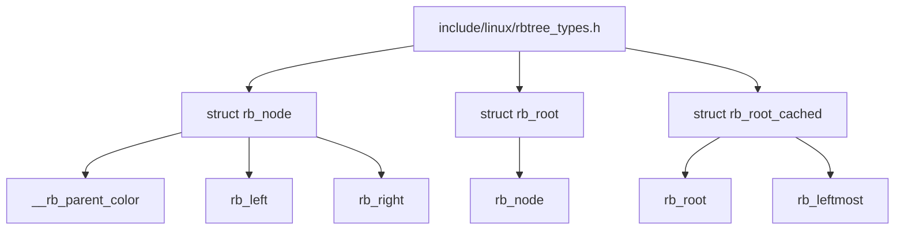
```mermaid
graph TD
	rb_type_file["include/linux/rbtree_types.h"]

	rb_type_file --> rb_node_type["struct rb_node"]
	rb_type_file --> rb_root_type["struct rb_root"]
	rb_type_file --> rb_cached_type["struct rb_root_cached"]

	rb_node_type --> rb_parent_color["__rb_parent_color"]
	rb_node_type --> rb_left_ptr["rb_left"]
	rb_node_type --> rb_right_ptr["rb_right"]

	rb_root_type --> rb_root_node_ptr["rb_node"]

	rb_cached_type --> rb_inner_root["rb_root"]
	rb_cached_type --> rb_leftmost_ptr["rb_leftmost"]
```

这张图要记住两个重点：

```text
第一，rb_node 是树节点本身；
第二，rb_root 和 rb_root_cached 是树的入口。
```

但是这个“树节点”不是业务节点。

它只是一个可以被挂进红黑树的结构件。

------

#### (2)\_struct\_rb\_node\_Linux\_rbtree\_的节点骨架

Linux 中的 `struct rb_node` 定义如下：

```c
struct rb_node {
	unsigned long  __rb_parent_color;
	struct rb_node *rb_right;
	struct rb_node *rb_left;
} __attribute__((aligned(sizeof(long))));
```

字段可以拆开看：

```text
__rb_parent_color：
	同时保存父节点指针和当前节点颜色。

rb_right：
	指向右孩子。

rb_left：
	指向左孩子。
```

结构示意图如下：

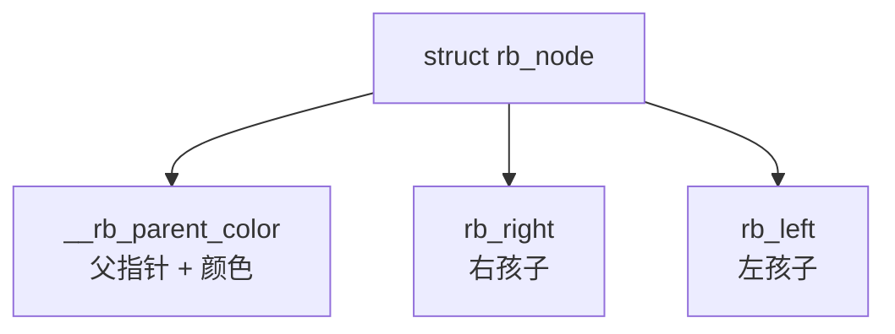
```mermaid
graph TD
	rb_node["struct rb_node"]

	rb_node --> rb_parent_color_field["__rb_parent_color<br/>父指针 + 颜色"]
	rb_node --> rb_right_field["rb_right<br/>右孩子"]
	rb_node --> rb_left_field["rb_left<br/>左孩子"]
```

这里最容易让人不适应的是：

```text
Linux rb_node 没有单独的 parent 字段；
Linux rb_node 没有单独的 color 字段；
Linux rb_node 没有 key；
Linux rb_node 没有 value。
```

也就是说，Linux 的 `struct rb_node` 不是教材里那种完整节点。

它只是红黑树算法需要的最小结构信息。

------

#### (3)\_rb\_parent\_color\_父指针和颜色压缩存储

教材里通常会把父指针和颜色分开写：

```c
struct rb_node {
	enum rb_color color;
	struct rb_node *parent;
	struct rb_node *left;
	struct rb_node *right;
};
```

但 Linux 不是这样。

Linux 把父指针和颜色放进同一个字段：

```c
unsigned long  __rb_parent_color;
```

逻辑上可以把它理解成：

```text
__rb_parent_color =
	父节点地址的高位部分
	+
	颜色标志位
```

示意图如下：

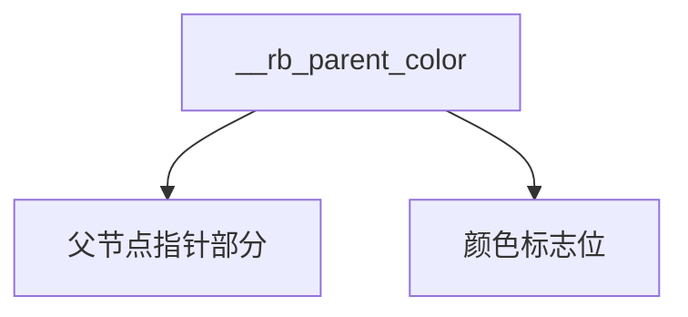
```mermaid
graph TD
	rb_parent_color["__rb_parent_color"]

	rb_parent_color --> rb_parent_part["父节点指针部分"]
	rb_parent_color --> rb_color_part["颜色标志位"]
```

为什么可以这么做？

原因在于 `struct rb_node` 有对齐要求：

```c
__attribute__((aligned(sizeof(long))))
```

源码注释中也说：

```c
/* 这个对齐看起来可能没有意义，但据说 CRIS 需要它 */
```

从算法理解角度，可以先建立这个印象：

```text
节点地址因为对齐，低位通常不会被真实地址使用；

Linux 借用这些低位保存颜色信息；

剩余高位仍然表示父节点地址。
```

这就是 Linux rbtree 代码里经常看到 parent/color 位运算的根本原因。

它不是算法理论变了，而是工程存储方式变了。

教材红黑树写成：

```bash
node->parent
node->color
```

Linux 里面变成：

```bash
node->__rb_parent_color
```

只是表现形式不同，本质上仍然需要回答两个问题：

```text
当前节点的父节点是谁？

当前节点是红色还是黑色？
```

---

#### (4)\_rb\_left\_和\_rb\_right\_左右孩子仍然是显式指针

虽然 Linux 压缩了父指针和颜色，但左右孩子没有压缩。

```c
struct rb_node *rb_right;
struct rb_node *rb_left;
```

也就是说，红黑树最基本的二叉搜索树结构仍然清晰存在：

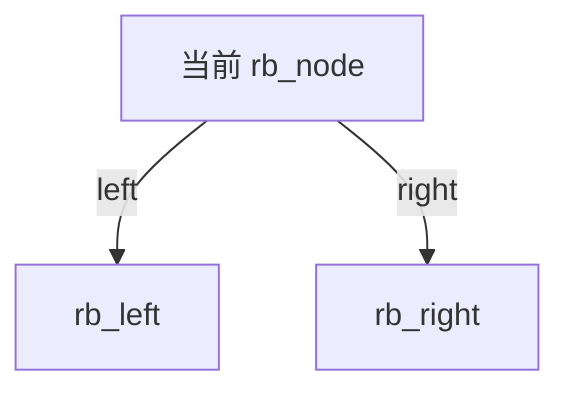
```mermaid
graph TD
	rb_parent["当前 rb_node"]
	rb_left_child["rb_left"]
	rb_right_child["rb_right"]

	rb_parent -->|left| rb_left_child
	rb_parent -->|right| rb_right_child
```

所以读 Linux rbtree 时，不要被 `__rb_parent_color` 吓住。

它看起来不像教材，但红黑树的基本树形关系没有变：

```text
每个节点最多两个孩子；

左子树小于当前节点；

右子树大于当前节点；

插入和删除仍然围绕旋转、染色、父子关系调整展开。
```

真正变化的是：

```text
Linux 不替你保存 key；

Linux 不替你比较大小；

Linux 不把 parent/color 明面拆成两个字段。
```

------

#### (5)\_struct\_rb\_root\_普通红黑树根

普通红黑树根结构非常简单：

```c
struct rb_root {
	struct rb_node *rb_node;
};
```

它只有一个字段：

```text
rb_node：
	指向整棵红黑树的根节点。
```

示意图如下：

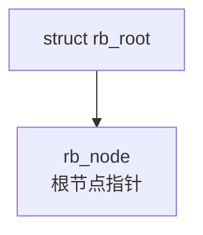
```mermaid
graph TD
	rb_root["struct rb_root"]
	rb_root_node["rb_node<br/>根节点指针"]

	rb_root --> rb_root_node
```

如果树为空，`rb_node` 就是 `NULL`。

源码中提供了空树初始化宏：

```c
#define RB_ROOT (struct rb_root) { NULL, }
```

也就是：

```text
普通空 rbtree =
	rb_root.rb_node = NULL
```

空树结构如下：

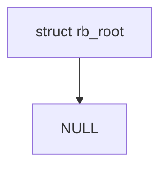
```mermaid
graph TD
	rb_empty_root["struct rb_root"]
	rb_empty_null["NULL"]

	rb_empty_root --> rb_empty_null
```

这体现了 Linux rbtree 的极简设计：

```text
rb_root 不保存节点数量；

rb_root 不保存比较函数；

rb_root 不保存 key 类型；

rb_root 不保存 value 类型；

rb_root 不保存 NIL 哨兵节点；

rb_root 只保存根节点指针。
```

它只回答一个问题：

```text
这棵树的根在哪里？
```

##### 1)\_Tip\_RB\_ROOT\_对象式宏\_把结构体默认初始化封装成可复用模板

Linux rbtree 中定义了一个非常短的宏：

```c
#define RB_ROOT (struct rb_root) { NULL, }
```

它不是宏函数，而是**对象式宏**。

宏函数一般带参数：

```c
#define MACRO(x) ...
```

而 `RB_ROOT` 没有参数：

```c
#define RB_ROOT ...
```

所以它的本质就是：**预处理阶段的文本替换**。

也就是说，源码里只要出现：

```c
RB_ROOT
```

预处理后就会被替换成：

```c
(struct rb_root) { NULL, }
```

------

###### a)\_它真正解决的问题\_避免到处手动初始化结构体成员

`struct rb_root` 的定义很简单：

```c
struct rb_root {
	struct rb_node *rb_node;
};
```

一棵空红黑树，本质上就是：

```c
root.rb_node = NULL;
```

如果没有 `RB_ROOT`，使用者可能到处都要手写：

```c
struct rb_root root;

root.rb_node = NULL;
```

或者：

```c
struct rb_root root = {
	.rb_node = NULL,
};
```

这些写法都能工作，但问题是：

```text
每个使用者都要知道 struct rb_root 的内部成员；

每个使用者都要手动写默认初始化逻辑；

如果结构体以后扩展字段，初始化写法也容易分散在各处；

代码语义上是在操作成员，而不是表达“我要一棵空树”。
```

所以 Linux 用 `RB_ROOT` 把这个默认初始化动作封装起来：

```c
struct rb_root root = RB_ROOT;
```

这句话表达的不是：

```text
我手动把 rb_node 设置成 NULL。
```

而是：

```text
我要一个标准的空 rb_root。
```

这才是 `RB_ROOT` 的核心价值。

------

###### b)\_RB\_ROOT\_的宏展开方式

当代码写成：

```c
struct rb_root root = RB_ROOT;
```

预处理后等价于：

```c
struct rb_root root = (struct rb_root) { NULL, };
```

其中：

```c
(struct rb_root) { NULL, }
```

是 C 语言的**复合字面量**。

它可以理解为：

```text
临时构造一个 struct rb_root 类型的匿名对象；
用 { NULL, } 初始化它；
然后用这个对象初始化 root。
```

由于 `struct rb_root` 只有一个成员：

```c
struct rb_node *rb_node;
```

所以：

```c
(struct rb_root) { NULL, }
```

等价于：

```c
(struct rb_root) {
	.rb_node = NULL,
}
```

最终效果就是：

```c
root.rb_node = NULL
```

------

###### c)\_为什么要写成带类型的\_(struct\_rb\_root)\_{\_NULL,\_}

如果宏只是写成：

```c
#define RB_ROOT { NULL, }
```

那么它只能比较自然地用于定义时初始化：

```c
struct rb_root root = RB_ROOT;
```

展开后是：

```c
struct rb_root root = { NULL, };
```

这没有问题。

但是如果后面想重新置空：

```c
root = RB_ROOT;
```

就会展开成：

```c
root = { NULL, };
```

这在 C 语言里不是合法赋值表达式。

所以 Linux 写成：

```c
#define RB_ROOT (struct rb_root) { NULL, }
```

这样 `RB_ROOT` 展开后是一个**类型明确的结构体值表达式**。

因此它既可以用于定义时初始化：

```c
struct rb_root root = RB_ROOT;
```

也可以用于后续重新赋值：

```c
root = RB_ROOT;
```

展开后就是：

```c
root = (struct rb_root) { NULL, };
```

含义是：

```text
把 root 重新设置为一个标准空树根。
```

------

###### d)\_它不是为了避免结构体赋值\_而是为了避免手动成员初始化

这里要分清楚。

当写：

```c
root = RB_ROOT;
```

宏展开后是：

```c
root = (struct rb_root) { NULL, };
```

这本质上仍然是一次结构体赋值。

所以 `RB_ROOT` 不是为了避免结构体赋值。

它真正避免的是到处手写：

```c
root.rb_node = NULL;
```

也就是说，它避免的是：

```text
手动操作结构体成员；

手动维护结构体默认值；

手动关心结构体内部布局。
```

它把这些细节封装成一个统一的“默认初始化模板”。

------

###### e)\_从语义上理解\_RB\_ROOT

可以把 `RB_ROOT` 理解成：

```text
struct rb_root 的标准空值模板。
```

也可以理解成：

```text
Linux rbtree 提供的空树根默认初始化器。
```

所以：

```c
struct rb_root root = RB_ROOT;
```

应该翻译成：

```text
定义一棵普通 Linux rbtree；
并把它初始化为空树。
```

而不是只机械地理解为：

```text
把 root.rb_node 赋值为 NULL。
```

后者只是实现效果，前者才是源码语义。

------

###### f)\_RB\_ROOT\_CACHED\_也是同一类思想

源码里还有一个 cached rbtree 的初始化宏：

```c
#define RB_ROOT_CACHED (struct rb_root_cached) { {NULL, }, NULL }
```

对应结构是：

```c
struct rb_root_cached {
	struct rb_root rb_root;
	struct rb_node *rb_leftmost;
};
```

所以：

```c
struct rb_root_cached root = RB_ROOT_CACHED;
```

展开后等价于：

```c
struct rb_root_cached root =
	(struct rb_root_cached) { {NULL, }, NULL };
```

进一步理解就是：

```c
struct rb_root_cached root = {
	.rb_root = {
		.rb_node = NULL,
	},
	.rb_leftmost = NULL,
};
```

含义是：

```text
普通红黑树根为空；

最左节点缓存也为空。
```

它和 `RB_ROOT` 的设计思想完全一样：**把结构体的默认空状态封装成一个随时可用的标准值。**

------

###### g)\_使用时需要注意

`RB_ROOT` 只是初始化或重置树根：

```c
root = RB_ROOT;
```

它不会释放树里原来挂着的节点。

如果原来的树中已经有节点，直接执行：

```c
root = RB_ROOT;
```

只是让 `root.rb_node` 变成 `NULL`，相当于切断了根到原树的入口。

原来的节点对象不会自动释放，也不会自动遍历删除。

所以 `RB_ROOT` 适合用于：

```text
定义一棵新树；

初始化一个空 root；

在确认树中没有节点后重置 root。
```

不应该把它理解成：

```text
删除整棵红黑树。
```

------

###### h)\_本质总结

`RB_ROOT` 的核心不是“宏很短”，而是它把一种结构体默认初始化行为封装成了统一的语义接口。

```text
没有 RB_ROOT：
	使用者需要手动知道并初始化 root.rb_node = NULL。

有了 RB_ROOT：
	使用者只需要表达 root = RB_ROOT，
	也就是“给我一个标准空红黑树根”。
```

所以它本质上是一种初始化语法糖：

```text
对象式宏
	+
	复合字面量
	+
	结构体默认空状态
```

组合起来形成：

```text
可复用、类型明确、语义统一的结构体默认初始化模板。
```

一句话记忆：

```text
RB_ROOT 是 Linux rbtree 用对象式宏封装出来的“空树根默认值”，
它的核心作用是避免使用者到处手动初始化 struct rb_root 的成员。
```

------

#### (6)\_struct\_rb\_root\_cached\_缓存最左节点的红黑树根

`struct rb_root_cached` 是普通 rbtree 的增强版本：

```c
struct rb_root_cached {
	struct rb_root rb_root;
	struct rb_node *rb_leftmost;
};
```

它包含两个部分：

```text
rb_root：
	普通红黑树根。

rb_leftmost：
	整棵树中最左侧节点的缓存。
```

示意图如下：

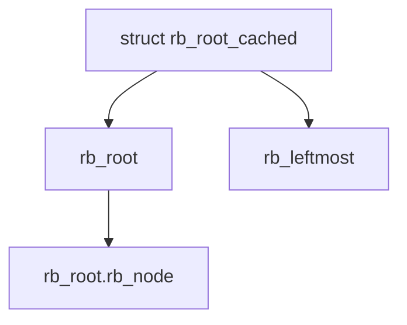
```mermaid
graph TD
	rb_cached_root["struct rb_root_cached"]

	rb_cached_root --> rb_cached_inner_root["rb_root"]
	rb_cached_root --> rb_cached_leftmost["rb_leftmost"]

	rb_cached_inner_root --> rb_cached_root_node["rb_root.rb_node"]
```

源码中对应的初始化宏是：

```c
#define RB_ROOT_CACHED (struct rb_root_cached) { {NULL, }, NULL }
```

也就是：

```text
cached 空树 =
	rb_root.rb_node = NULL
	rb_leftmost = NULL
```

空树结构如下：

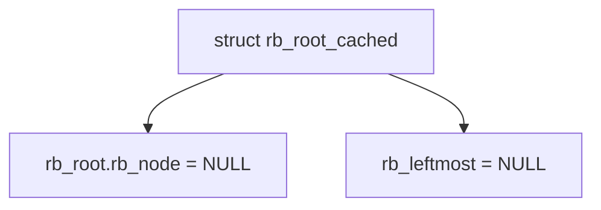
```mermaid
graph TD
	rb_cached_empty["struct rb_root_cached"]
	rb_cached_empty_root["rb_root.rb_node = NULL"]
	rb_cached_empty_leftmost["rb_leftmost = NULL"]

	rb_cached_empty --> rb_cached_empty_root
	rb_cached_empty --> rb_cached_empty_leftmost
```

------

#### (7)\_为什么只缓存最左节点

源码注释中特别解释了一点：

```text
Linux 缓存了 leftmost；
Linux 没有缓存 rightmost。
```

原因不是不能做，而是不值得。

普通 `rb_root` 查找最小节点时，需要从根开始一路向左：

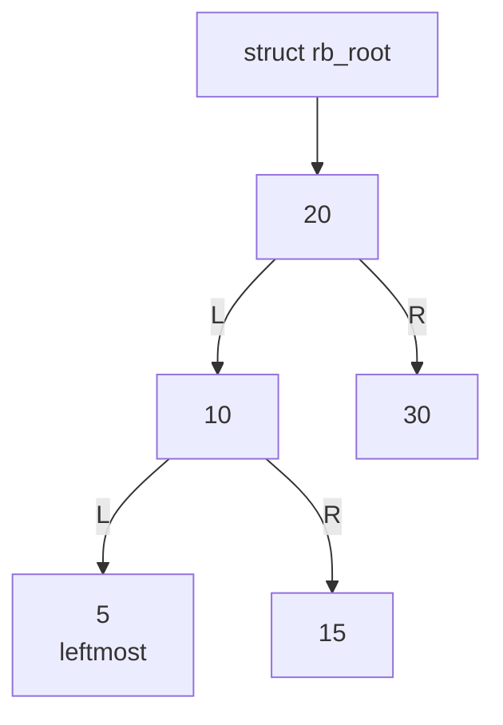
```mermaid
graph TD
	rb_normal_root["struct rb_root"]
	rb_node_20["20"]
	rb_node_10["10"]
	rb_node_30["30"]
	rb_node_5["5<br/>leftmost"]
	rb_node_15["15"]

	rb_normal_root --> rb_node_20

	rb_node_20 -->|L| rb_node_10
	rb_node_20 -->|R| rb_node_30

	rb_node_10 -->|L| rb_node_5
	rb_node_10 -->|R| rb_node_15
```

查找过程是：

```text
root
 -> left
 -> left
 -> left
直到没有更左的节点
```

这个过程的复杂度是：

```text
O(log n)
```

而 `rb_root_cached` 直接保存了最左节点：

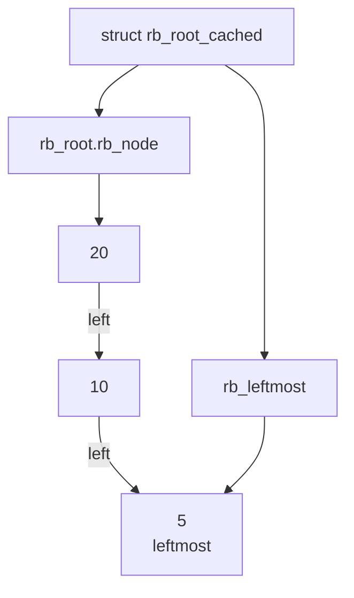
```mermaid
graph TD
	rb_cached_tree["struct rb_root_cached"]
	rb_cached_root_ptr["rb_root.rb_node"]
	rb_cached_left_ptr["rb_leftmost"]

	rb_c20["20"]
	rb_c10["10"]
	rb_c5["5<br/>leftmost"]

	rb_cached_tree --> rb_cached_root_ptr
	rb_cached_tree --> rb_cached_left_ptr

	rb_cached_root_ptr --> rb_c20
	rb_c20 -->|left| rb_c10
	rb_c10 -->|left| rb_c5

	rb_cached_left_ptr --> rb_c5
```

这样获取最小节点时，可以直接返回：

```text
root_cached->rb_leftmost
```

复杂度变成：

```text
O(1)
```

但是如果再缓存最右节点，就需要在 `struct rb_root_cached` 里再增加一个字段。

Linux 源码注释中的判断是：

```text
为了少数可能需要 O(1) rb_last() 的用户，
让所有使用 rb_root_cached 的结构都多付出一个字段的空间成本，
不划算。
```

所以它只缓存最左节点，不缓存最右节点。

这体现了 Linux 内核里的典型工程思维：

```text
不是理论上对称，就一定要实现对称；

不是功能能做，就一定要进入基础设施；

基础结构的每一个字段，都要考虑长期空间成本；

高频需求可以内建，低频需求交给使用者自己实现。
```

------

#### (8)\_Linux\_rbtree\_的第一层心智模型

到这里，先不要急着看插入和删除。

只看 `rbtree_types.h`，应该先建立这张图：

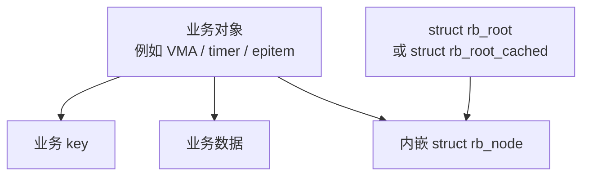
```mermaid
graph TD
	rb_user_obj["业务对象<br/>例如 VMA / timer / epitem"]
	rb_user_key["业务 key"]
	rb_user_data["业务数据"]
	rb_embedded_node["内嵌 struct rb_node"]

	rb_tree_root["struct rb_root<br/>或 struct rb_root_cached"]

	rb_user_obj --> rb_user_key
	rb_user_obj --> rb_user_data
	rb_user_obj --> rb_embedded_node

	rb_tree_root --> rb_embedded_node
```

这张图是理解 Linux rbtree 的关键。

Linux 不是让红黑树节点保存业务对象。

Linux 是让业务对象内部嵌入红黑树节点。

也就是说：

```text
不是 rb_node 拥有业务数据；

而是业务对象拥有 rb_node。
```

如果写成伪代码，就是：

```c
struct my_object {
	unsigned long key;
	void *value;
	struct rb_node node;
};
```

这里真正挂进 rbtree 的是：

```text
my_object.node
```

而不是：

```text
my_object 本身
```

但当 rbtree 找到一个 `struct rb_node *` 后，又可以通过 `rb_entry()` 找回外层业务对象：

```c
struct my_object *obj;

obj = rb_entry(node, struct my_object, node);
```

逻辑如下：

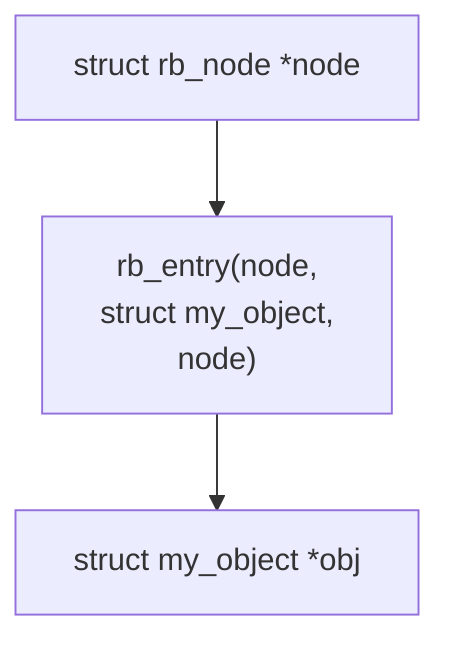
```mermaid
graph TD
	rb_found_node["struct rb_node *node"]
	rb_entry_macro["rb_entry(node,<br/>struct my_object,<br/>node)"]
	rb_outer_obj["struct my_object *obj"]

	rb_found_node --> rb_entry_macro
	rb_entry_macro --> rb_outer_obj
```

所以 Linux rbtree 的真实模型是：

```text
rb_node 负责进入树；

业务对象负责保存数据；

rb_entry 负责从树节点找回业务对象。
```

**rb_entry()源码**

[include/linux/rbtree.h](../../../../research/source_reading/linux/include/linux/rbtree.h)

```c
#define	rb_entry(ptr, type, member) container_of(ptr, type, member)
```

老传统了，这和内核链表操作时一个套路。参考[`container_of`：通过成员地址反推结构体地址](../../../foundations/c_language/gnu_extensions/C_language_extension.md#1.3.2_container_of_通过成员地址反推结构体地址)

------

#### (9)\_与教材红黑树的结构差异

前面已经把 Linux 自己的结构讲清楚了，现在再和教材模型对比，才不会乱。

教材里的红黑树节点通常长这样：

```c
struct rb_node {
	key_type key;
	value_type value;
	enum color color;
	struct rb_node *parent;
	struct rb_node *left;
	struct rb_node *right;
};
```

这种节点同时承担两类职责：

```text
树结构职责：
	parent
	left
	right
	color

业务数据职责：
	key
	value
```

示意图如下：

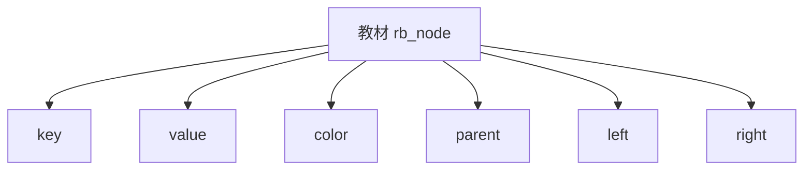
```mermaid
graph TD
	rb_textbook_node["教材 rb_node"]

	rb_textbook_node --> rb_textbook_key["key"]
	rb_textbook_node --> rb_textbook_value["value"]
	rb_textbook_node --> rb_textbook_color["color"]
	rb_textbook_node --> rb_textbook_parent["parent"]
	rb_textbook_node --> rb_textbook_left["left"]
	rb_textbook_node --> rb_textbook_right["right"]
```

Linux 的节点则是：

```c
struct rb_node {
	unsigned long  __rb_parent_color;
	struct rb_node *rb_right;
	struct rb_node *rb_left;
};
```

示意图如下：

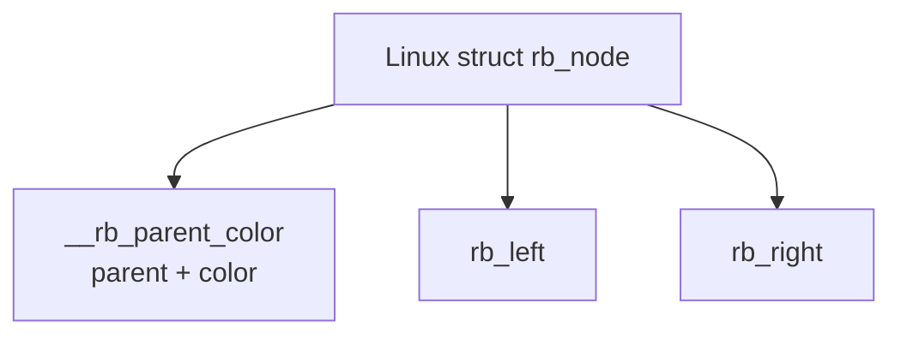
```mermaid
graph TD
	rb_linux_node["Linux struct rb_node"]

	rb_linux_node --> rb_linux_parent_color["__rb_parent_color<br/>parent + color"]
	rb_linux_node --> rb_linux_left["rb_left"]
	rb_linux_node --> rb_linux_right["rb_right"]
```

两者第一层差异就是：

```text
教材节点 = 树结构 + 业务数据；

Linux rb_node = 纯树结构节点。
```

所以教材讲红黑树时，常常会说：

```text
向红黑树插入 key = 20 的节点。
```

但 Linux rbtree 更准确的说法是：

```text
把某个业务对象中的 rb_node 挂入红黑树；
业务对象的 key 由使用者自己解释。
```

------

#### (10)\_教材模型\_红黑树是数据结构容器

教材里的红黑树经常被讲成一个完整容器。

比如：

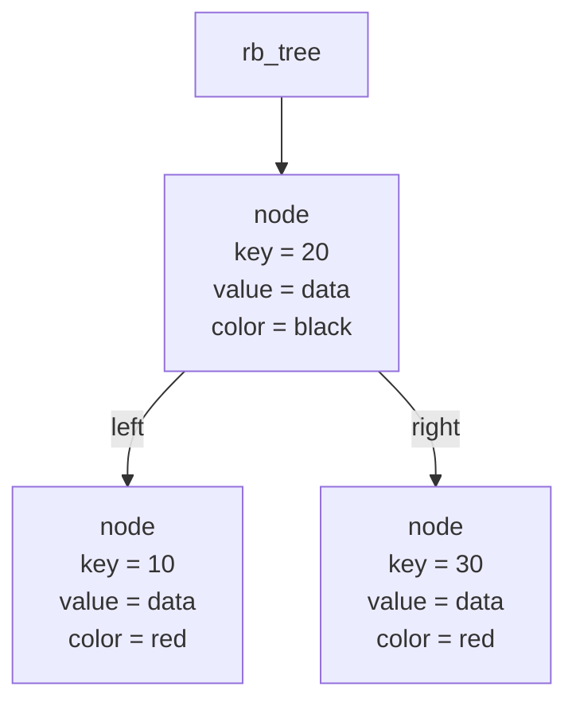
```mermaid
graph TD
	rb_tree_root["rb_tree"]
	rb_node_20["node<br/>key = 20<br/>value = data<br/>color = black"]
	rb_node_10["node<br/>key = 10<br/>value = data<br/>color = red"]
	rb_node_30["node<br/>key = 30<br/>value = data<br/>color = red"]

	rb_tree_root --> rb_node_20
	rb_node_20 -->|left| rb_node_10
	rb_node_20 -->|right| rb_node_30
```

这种模型里，红黑树库通常负责：

```text
保存 key；

保存 value；

比较 key；

寻找插入位置；

创建或接收节点；

维护红黑树平衡；

提供 search / insert / delete 接口。
```

所以教材里的红黑树更像：

```text
一个完整的数据结构容器。
```

用户把 key 和 value 放进去，红黑树帮你组织它们。

------

#### (11)\_Linux\_模型\_红黑树是嵌入式节点维护工具

Linux 模型完全不同。

Linux 中常见写法是：

```c
struct my_object {
	unsigned long key;
	void *value;
	struct rb_node node;
};
```

关系如下：

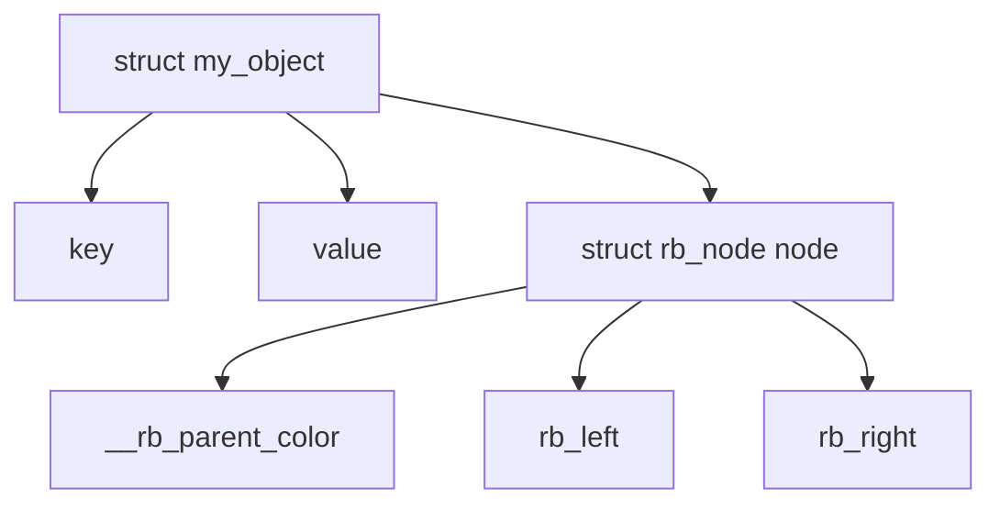
```mermaid
graph TD
	rb_object["struct my_object"]

	rb_object --> rb_object_key["key"]
	rb_object --> rb_object_value["value"]
	rb_object --> rb_object_node["struct rb_node node"]

	rb_object_node --> rb_node_parent_color["__rb_parent_color"]
	rb_object_node --> rb_node_left["rb_left"]
	rb_object_node --> rb_node_right["rb_right"]
```

这时，rbtree 只认识：

```text
struct rb_node
```

它不认识：

```text
struct my_object

key

value

业务含义
```

这就是 Linux rbtree 的核心风格：

```text
红黑树算法只维护结构；

业务代码自己决定排序语义。
```

所以 Linux rbtree 不是“容器”。

它更像是一套基础设施：

```text
你把 rb_node 嵌入自己的对象；

你自己根据 key 找到插入位置；

你调用 rb_link_node() 建立父子关系；

你调用 rb_insert_color() 修复红黑树性质；

需要取回业务对象时，用 rb_entry() 反推出外层结构。
```

------

#### (12)\_空叶子差异\_教材\_NIL\_节点\_vs\_Linux\_NULL\_指针

教材中经常引入黑色 `NIL` 哨兵节点。

教材模型一般是：

```text
所有空叶子都是黑色 NIL；

真实节点的空孩子不指向 NULL，而是指向 NIL；

这样红黑树性质描述更统一。
```

示意图如下：

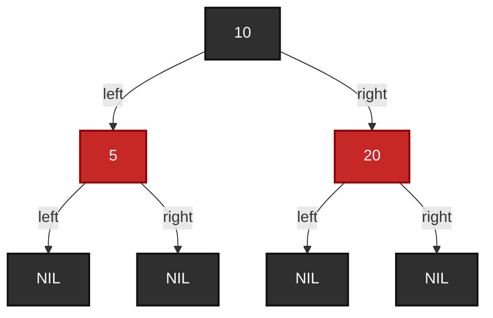
```mermaid
graph TD
	rb_text_10["10"]
	rb_text_5["5"]
	rb_text_20["20"]
	rb_nil_1["NIL"]
	rb_nil_2["NIL"]
	rb_nil_3["NIL"]
	rb_nil_4["NIL"]

	rb_text_10 -->|left| rb_text_5
	rb_text_10 -->|right| rb_text_20
	rb_text_5 -->|left| rb_nil_1
	rb_text_5 -->|right| rb_nil_2
	rb_text_20 -->|left| rb_nil_3
	rb_text_20 -->|right| rb_nil_4

	classDef rbBlack fill:#2f2f2f,stroke:#111,color:#fff,stroke-width:2px;
	classDef rbRed fill:#c62828,stroke:#8e0000,color:#fff,stroke-width:2px;

	class rb_text_10,rb_nil_1,rb_nil_2,rb_nil_3,rb_nil_4 rbBlack;
	class rb_text_5,rb_text_20 rbRed;
```

Linux rbtree 不使用显式 NIL 节点。

Linux 中空子树直接用 `NULL` 表示：

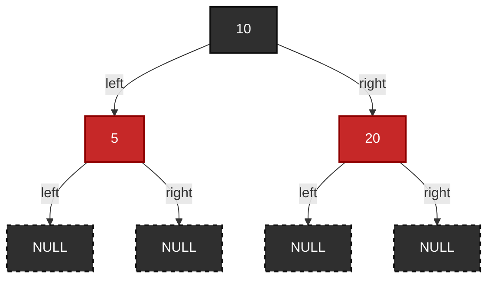
```mermaid
graph TD
	rb_linux_10["10"]
	rb_linux_5["5"]
	rb_linux_20["20"]
	rb_null_1["NULL"]
	rb_null_2["NULL"]
	rb_null_3["NULL"]
	rb_null_4["NULL"]

	rb_linux_10 -->|left| rb_linux_5
	rb_linux_10 -->|right| rb_linux_20
	rb_linux_5 -->|left| rb_null_1
	rb_linux_5 -->|right| rb_null_2
	rb_linux_20 -->|left| rb_null_3
	rb_linux_20 -->|right| rb_null_4

	classDef rbBlack fill:#2f2f2f,stroke:#111,color:#fff,stroke-width:2px;
	classDef rbRed fill:#c62828,stroke:#8e0000,color:#fff,stroke-width:2px;
	classDef rbNull fill:#2f2f2f,stroke:#111,color:#fff,stroke-width:2px,stroke-dasharray: 5 5;

	class rb_linux_10 rbBlack;
	class rb_linux_5,rb_linux_20 rbRed;
	class rb_null_1,rb_null_2,rb_null_3,rb_null_4 rbNull;
```

这会导致阅读源码时出现一个心理落差：

```text
教材里：
	空叶子也是一个黑色节点；
	很多性质可以对 NIL 节点直接描述。

Linux 里：
	空叶子是 NULL；
	NULL 在理论上等价于黑色叶子；
	但代码实现上要通过空指针判断处理边界。
```

所以后面看删除修复时，要在脑子里做这个转换：

```text
教材里的黑色 NIL
	≈
Linux 里的 NULL 空子树
```

否则你会觉得 Linux 删除修复代码和教材案例对不上。

------

#### (13)\_根结构差异\_完整\_tree\_对象\_vs\_极简\_rb\_root

教材里的红黑树根结构可能会设计成：

```c
struct rb_tree {
	struct rb_node *root;
	struct rb_node *nil;
	int size;
	int (*compare)(...);
};
```

它可能包含：

```text
root

nil

size

compare

allocator

debug 信息
```

示意图如下：

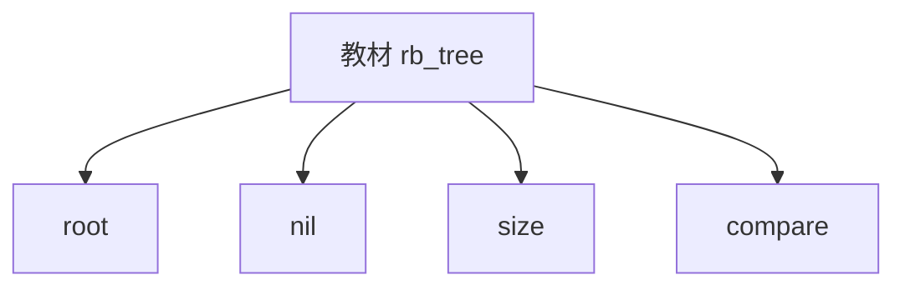
```mermaid
graph TD
	rb_textbook_tree["教材 rb_tree"]

	rb_textbook_tree --> rb_textbook_root["root"]
	rb_textbook_tree --> rb_textbook_nil["nil"]
	rb_textbook_tree --> rb_textbook_size["size"]
	rb_textbook_tree --> rb_textbook_compare["compare"]
```

Linux 的普通根结构只有：

```c
struct rb_root {
	struct rb_node *rb_node;
};
```

示意图如下：

```mermaid
graph TD
	rb_linux_root["struct rb_root"]
	rb_linux_root_ptr["rb_node"]

	rb_linux_root --> rb_linux_root_ptr
```

这说明 Linux 的 `rb_root` 不负责：

```text
节点数量统计；

比较函数保存；

key 类型管理；

value 类型管理；

内存分配策略；

NIL 哨兵维护。
```

Linux 的 `rb_root` 只负责：

```text
保存根节点指针。
```

这也是为什么 Linux rbtree 的插入和查找不像教材那样“一步到位”。

因为 Linux 根本没有保存比较函数，也不知道你的 key 在哪里。

------

#### (14)\_对比总结表

| 对比项             | 教材红黑树                            | Linux rbtree                                      |
| ------------------ | ------------------------------------- | ------------------------------------------------- |
| 节点定位           | 数据节点                              | 嵌入式结构节点                                    |
| 节点是否保存 key   | 通常保存                              | 不保存                                            |
| 节点是否保存 value | 通常保存                              | 不保存                                            |
| 颜色字段           | 通常独立保存                          | 与父指针压缩到 `__rb_parent_color`                |
| 父指针字段         | 通常独立保存                          | 与颜色压缩到 `__rb_parent_color`                  |
| 左右孩子           | `left` / `right`                      | `rb_left` / `rb_right`                            |
| 空叶子             | 常用黑色 `NIL` 哨兵                   | 使用 `NULL` 表示空子树                            |
| 根结构             | 可能包含 root / nil / size / compare  | `struct rb_root` 只保存 `rb_node`                 |
| 最小节点缓存       | 教材通常不强调                        | `struct rb_root_cached` 可缓存 `rb_leftmost`      |
| 比较逻辑           | 树库可能负责                          | 使用者自己负责                                    |
| 插入接口           | 可能封装成 `insert(tree, key, value)` | 用户搜索 + `rb_link_node()` + `rb_insert_color()` |
| 业务对象关系       | 节点就是业务数据                      | 业务对象内嵌 `rb_node`                            |
| 设计目标           | 教学清晰、算法完整                    | 低开销、可嵌入、适合内核大量对象                  |

------

#### (15)\_一张总图总结差异

```mermaid
graph TD
	rb_compare_root["红黑树实现风格对比"]

	rb_compare_root --> rb_textbook_side["教材红黑树"]
	rb_compare_root --> rb_linux_side["Linux rbtree"]

	rb_textbook_side --> rb_textbook_data["节点保存 key / value"]
	rb_textbook_side --> rb_textbook_color_field["color 独立字段"]
	rb_textbook_side --> rb_textbook_parent_field["parent 独立字段"]
	rb_textbook_side --> rb_textbook_nil_node["常见 NIL 哨兵节点"]
	rb_textbook_side --> rb_textbook_container["偏容器模型"]
	rb_textbook_side --> rb_textbook_full_api["insert/search/delete 可能完整封装"]

	rb_linux_side --> rb_linux_no_data["rb_node 不保存业务数据"]
	rb_linux_side --> rb_linux_pack["parent + color 压缩存储"]
	rb_linux_side --> rb_linux_null["NULL 表示空子树"]
	rb_linux_side --> rb_linux_embed["rb_node 嵌入业务对象"]
	rb_linux_side --> rb_linux_min_root["rb_root 极简"]
	rb_linux_side --> rb_linux_cached["可选缓存 rb_leftmost"]
	rb_linux_side --> rb_linux_user_cmp["用户自己比较和搜索"]
```

------

#### (16)\_本节结论

这一节的重点不是背 `struct rb_node` 有几个字段。

真正要建立的是下面这个心智模型：

```text
Linux rbtree 的 rb_node 不是业务节点；

Linux rbtree 的 rb_root 不是完整容器；

Linux rbtree 不保存 key；

Linux rbtree 不保存 value；

Linux rbtree 不保存比较函数；

Linux rbtree 只维护节点之间的红黑树结构关系。
```

因此，后面继续阅读 `include/linux/rbtree.h` 和 `lib/rbtree.c` 时，要用下面的方式对标教材红黑树：

```text
教材里的 node->parent：
	对应 Linux 的 __rb_parent_color 中的 parent 部分。

教材里的 node->color：
	对应 Linux 的 __rb_parent_color 中的 color 位。

教材里的 node->left / node->right：
	对应 Linux 的 rb_left / rb_right。

教材里的 NIL 黑叶子：
	对应 Linux 的 NULL 空子树。

教材里的 rb_insert(tree, key, value)：
	对应 Linux 中用户搜索位置 + rb_link_node() + rb_insert_color()。

教材里的业务节点：
	对应 Linux 中外层业务对象，而不是 struct rb_node 本身。
```

也就是说，Linux 不是改变了红黑树算法本质，而是把教材中的“完整容器式红黑树”拆成了更适合内核的“嵌入式节点维护工具”。

这就是 Linux rbtree 看起来不像教材红黑树的根本原因。

------

### 8.3.2\_include/linux/rbtree.h\_普通\_rbtree\_对外接口

`include/linux/rbtree.h` 是普通 rbtree 使用者最常接触的头文件。

它提供以下类别的接口和宏：

```text
父节点与业务对象还原：
	rb_parent()
	rb_entry()

空树与空节点判断：
	RB_EMPTY_ROOT()
	RB_EMPTY_NODE()
	RB_CLEAR_NODE()

普通插入删除：
	rb_link_node()
	rb_insert_color()
	rb_erase()

遍历：
	rb_first()
	rb_last()
	rb_next()
	rb_prev()

后序遍历：
	rb_first_postorder()
	rb_next_postorder()
	rbtree_postorder_for_each_entry_safe()

节点替换：
	rb_replace_node()
	rb_replace_node_rcu()

cached rbtree：
	rb_first_cached()
	rb_insert_color_cached()
	rb_erase_cached()
	rb_replace_node_cached()
	rb_add_cached()

辅助查找与插入：
	rb_add()
	rb_find()
	rb_find_add()
	rb_find_add_rcu()
	rb_find()
	rb_find_rcu()
	rb_find_first()
	rb_next_match()
	rb_for_each()
```

其中最重要的普通插入路径是：

```text
调用者自己查找插入位置；

调用 rb_link_node() 完成 BST 挂接；

调用 rb_insert_color() 完成红黑修复。
```

Linux 6.12 的 `rbtree.h` 中，`rb_link_node()` 会设置 `node->__rb_parent_color` 为 parent，清空左右孩子，然后把 `node` 挂到 `*rb_link`；`rb_link_node_rcu()` 则用 `rcu_assign_pointer()` 完成链接发布。([本地源码](../../../../research/source_reading/linux/include/linux/rbtree.h))

这说明 `rbtree.h` 不是提供完整 map 容器，而是提供底层构件。

------

### 8.3.3\_include/linux/rbtree\_augmented.h\_增强\_rbtree\_接口

普通 rbtree 只维护：

```text
BST 有序性；

红黑性质；

父子链接；

节点颜色；

中序遍历关系。
```

它不会自动维护业务层扩展信息。

但是有些场景需要在每个节点上维护“子树聚合信息”，例如：

```text
子树最大区间终点；

子树最大值；

子树最小值；

子树统计值；

子树覆盖范围；

子树资源占用信息。
```

这类需求使用 augmented rbtree。

augmented rbtree 的核心是：

```text
树仍然是红黑树；

排序规则仍然由调用者决定；

红黑修复仍然由 rbtree 核心完成；

额外信息由调用者提供回调维护。
```

Linux 6.12 的 `rbtree_augmented.h` 定义了 `struct rb_augment_callbacks`，包含 `propagate`、`copy`、`rotate` 三个回调；文件注释也说明，只有该回调结构以及 `rb_insert_augmented()`、`rb_erase_augmented()` 原型是预期公开的，其余内容属于实现细节。([本地源码](../../../../research/source_reading/linux/include/linux/rbtree_augmented.h))

增强回调通常可以这样理解：

```text
propagate：
	从某个节点向上更新增强信息。

copy：
	节点替换时复制增强信息。

rotate：
	旋转时更新 old/new 两个节点的增强信息。
```

因此，augmented rbtree 的关键不是重新实现一棵树，而是在红黑树旋转和结构变化时保持业务扩展信息同步。

------

### 8.3.4\_lib/rbtree.c\_核心实现文件

`lib/rbtree.c` 是 rbtree 的核心实现文件。

它实现以下主要逻辑：

```text
插入修复：
	__rb_insert()
	rb_insert_color()
	__rb_insert_augmented()

删除修复：
	____rb_erase_color()
	__rb_erase_color()
	rb_erase()

旋转公共逻辑：
	__rb_rotate_set_parents()

普通遍历：
	rb_first()
	rb_last()
	rb_next()
	rb_prev()

后序遍历：
	rb_first_postorder()
	rb_next_postorder()

节点替换：
	rb_replace_node()
	rb_replace_node_rcu()

增强树删除：
	rb_erase_augmented()
```

Linux 6.12 的 `lib/rbtree.c` 是普通 rbtree 的核心实现文件，源码中包含插入、删除、旋转、遍历、替换和 augmented rbtree 相关实现。([本地源码](../../../../research/source_reading/linux/lib/rbtree.c))

`lib/rbtree.c` 还包含 lockless lookup 相关说明：更新树结构中 `rb_left`、`rb_right` 指针时需要使用 `WRITE_ONCE()`，并且程序顺序上不能临时制造树结构环；这样不能保证无锁遍历一定看到完整树，但能保证遍历只看到有效元素并且不会陷入循环。([本地源码](../../../../research/source_reading/linux/lib/rbtree.c))

这说明 Linux rbtree 源码不仅实现红黑树算法，还考虑了工程可见性问题：

```text
指针更新顺序；

无锁查找观察到的中间状态；

旋转过程中不能形成循环；

编译器不能随意拆分关键指针写入；

增强回调需要和旋转同步。
```

------

### 8.3.5\_Documentation/core-api/rbtree.rst\_官方使用说明

官方文档主要说明 rbtree 的使用方式和边界。

其中几个关键点是：

```text
rbtree 用于可排序 key/value 数据；

实现位于 lib/rbtree.c；

使用时包含 linux/rbtree.h；

rb_node 嵌入业务结构体；

通过 rb_entry() 或 container_of() 还原业务对象；

使用者自己实现 search 和 insert；

锁由使用者负责；

插入时先 rb_link_node()，再 rb_insert_color()；

删除时调用 rb_erase()；

rb_erase() 不释放业务对象；

rb_replace_node() 要求新旧节点 key 一致；

rb_first()、rb_next() 用于中序遍历；

rb_root_cached 用于缓存最左节点；

augmented rbtree 用于维护子树增强信息。
```

这些内容构成 Linux 6.12 rbtree 的使用契约。([本地源码](../../../../research/source_reading/linux/Documentation/core-api/rbtree.rst))

阅读源码时，应当把官方文档作为接口语义参考，把 `lib/rbtree.c` 作为实现参考。

------

### 8.3.6\_为什么源码阅读应当从类型定义开始

阅读 rbtree 不能直接从插入修复或删除修复开始。

如果一开始直接看：

```text
__rb_insert()

____rb_erase_color()

__rb_rotate_set_parents()
```

会遇到大量难以理解的细节：

```text
__rb_parent_color 是什么？

rb_parent() 为什么要清低位？

rb_red_parent() 为什么能直接取父节点？

rb_set_parent_color() 为什么同时设置父节点和颜色？

WRITE_ONCE() 为什么包住 rb_left / rb_right？

NULL 为什么能代表黑色 NIL？

augment_rotate() 为什么出现在旋转路径中？
```

因此正确顺序是：

```text
先理解 rb_node；

再理解 rb_root；

再理解 rb_node 如何嵌入业务结构体；

再理解使用者如何查找插入位置；

再理解 rb_link_node()；

最后理解 rb_insert_color() 和 rb_erase()。
```

这不是阅读习惯问题，而是源码依赖关系决定的。

------

### 8.3.7\_本节小结

本节固定源码入口：

```text
rbtree_types.h：
	理解 rb_node、rb_root、rb_root_cached。

rbtree.h：
	理解普通 rbtree 接口、辅助宏、遍历接口、cached 接口。

rbtree_augmented.h：
	理解增强树回调机制。

lib/rbtree.c：
	理解插入修复、删除修复、旋转、遍历、替换实现。

rbtree.rst：
	理解官方使用方式和调用者职责。
```

后续所有分析都围绕这些文件展开。

------

## 8.4\_Linux\_rbtree\_的数据结构设计

### 8.4.1\_struct\_rb\_node\_的字段组成

Linux 6.12 中，`struct rb_node` 的核心字段是：

```c
struct rb_node {
	unsigned long __rb_parent_color;
	struct rb_node *rb_right;
	struct rb_node *rb_left;
};
```

它只保存红黑树结构信息：

```text
__rb_parent_color：
	父节点指针和颜色标志的压缩编码。

rb_right：
	右孩子。

rb_left：
	左孩子。
```

它不保存：

```text
key；

value；

独立 parent 字段；

独立 color 字段；

比较函数；

业务对象指针。
```

教材中常见节点结构是：

```c
struct demo_rbtree_node {
	int key;
	int value;
	int color;
	struct demo_rbtree_node *parent;
	struct demo_rbtree_node *left;
	struct demo_rbtree_node *right;
};
```

Linux 内核不是这样设计。Linux 的 `rb_node` 通常嵌入业务对象：

```c
struct demo_rb_item {
	int key;
	int value;
	struct rb_node node;
};
```

结构关系如下：

```mermaid
graph TD
	demo_item["struct demo_rb_item"]
	demo_key["key"]
	demo_value["value"]
	demo_node["struct rb_node node"]
	demo_parent_color["__rb_parent_color"]
	demo_right["rb_right"]
	demo_left["rb_left"]

	demo_item --> demo_key
	demo_item --> demo_value
	demo_item --> demo_node
	demo_node --> demo_parent_color
	demo_node --> demo_right
	demo_node --> demo_left
```

这里要固定一个核心认识：

```text
rb_node 不是业务节点本身；
rb_node 是业务对象内部的一段树链接字段。
```

业务对象知道自己的 key 和 value。rbtree 核心只维护树结构。

------

### 8.4.2\_rb\_parent\_color\_为什么把父指针和颜色压在一起

理论红黑树通常有两个字段：

```text
parent；

color。
```

Linux rbtree 把它们合并到：

```c
unsigned long __rb_parent_color;
```

原因是内核对象地址通常满足对齐要求，指针低位可以用于保存标志位。颜色只需要一位即可表达：

```text
红；

黑。
```

因此，`__rb_parent_color` 可以理解成：

```text
高位：
	parent 指针主体。

低位：
	颜色标志和内部状态位。
```

示意如下：

```mermaid
graph TD
	rb_parent_color["__rb_parent_color"]
	rb_parent_bits["高位：parent 指针"]
	rb_color_bits["低位：color 标志"]

	rb_parent_color --> rb_parent_bits
	rb_parent_color --> rb_color_bits
```

读取父节点时，不能直接把 `__rb_parent_color` 当指针用，而要清除低位标志：

```text
rb_parent(node)
	= 去掉低位标志后的 parent 指针。
```

Linux 6.12 的 `rbtree.h` 中，`rb_parent(r)` 通过对 `__rb_parent_color` 执行 `& ~3` 获取父节点；`RB_EMPTY_NODE()` 和 `RB_CLEAR_NODE()` 也都基于 `__rb_parent_color` 编码节点状态。([本地源码](../../../../research/source_reading/linux/include/linux/rbtree.h))

设置父节点和颜色时，也不能分开随意写，而要使用内核提供的辅助逻辑：

```text
rb_set_parent_color(node, parent, color)
	= parent 地址 | color 标志。
```

Linux 6.12 的 `rbtree_augmented.h` 中定义了 `RB_RED`、`RB_BLACK`、`rb_color()`、`rb_is_red()`、`rb_is_black()`、`rb_set_parent()`、`rb_set_parent_color()` 等底层颜色与父指针辅助逻辑。([本地源码](../../../../research/source_reading/linux/include/linux/rbtree_augmented.h))

这种设计的工程收益是：

```text
减少一个字段；

减小 rb_node 结构体大小；

提高节点密度；

改善缓存局部性；

减少大量内核对象嵌入 rb_node 时的内存成本。
```

代价是：

```text
源码可读性下降；

调试时不能直接读取 parent；

颜色也不是独立字段；

必须通过辅助宏理解父指针和颜色。
```

这体现了 Linux 内核常见取舍：

```text
用更复杂的字段编码，换取更紧凑的数据结构。
```

------

### 8.4.3\_为什么颜色可以使用指针低位存储

颜色可以放入指针低位，前提是 `struct rb_node` 的地址满足对齐要求。

Linux 6.12 的 `struct rb_node` 带有 `aligned(sizeof(long))` 对齐属性；源码注释还提到该对齐与特定架构需求有关。([本地源码](../../../../research/source_reading/linux/include/linux/rbtree_types.h))

当对象按机器字对齐时，有效地址的低若干位固定为 0。红黑树颜色只需要极少标志位，因此可以把这些低位用于颜色编码。

可以理解为：

```text
真实 parent 地址：
	低位为 0。

编码后的 __rb_parent_color：
	高位仍然是 parent 地址；
	低位写入颜色标志。
```

读取 parent 时清除低位：

```text
parent = __rb_parent_color & ~低位掩码
```

读取 color 时查看低位：

```text
color = __rb_parent_color & 颜色掩码
```

这个设计必须遵守几个规则：

```text
不能直接使用 __rb_parent_color 作为 parent；

不能设置 parent 时破坏 color；

不能设置 color 时破坏 parent；

调试时需要先解码；

所有修改必须通过内核辅助函数或宏完成。
```

因此，后续阅读源码时要记住：

```text
__rb_parent_color 是编码字段，不是普通字段。
```

------

### 8.4.4\_rb\_left\_与\_rb\_right\_的含义

`rb_left` 和 `rb_right` 是红黑树作为二叉搜索树的左右孩子指针。

它们表达的是结构关系：

```text
rb_left：
	当前节点的左孩子。

rb_right：
	当前节点的右孩子。
```

但是它们不保存排序规则。排序规则由调用者保证。

对于业务对象：

```c
struct demo_rb_item {
	int key;
	struct rb_node node;
};
```

如果调用者规定：

```text
左子树 key < 当前 key

右子树 key > 当前 key
```

那么插入搜索代码就必须严格按这个规则走：

```text
新 key 小于当前 key：
	进入 rb_left；

新 key 大于当前 key：
	进入 rb_right；

新 key 等于当前 key：
	按业务规则处理重复 key。
```

rbtree 核心不会检查这个规则。

如果调用者写错比较逻辑：

```text
小于时走右边；

大于时走左边；

查找和插入使用不同规则；

替换节点时 key 改变；

重复 key 处理不一致；
```

那么树仍然可能满足红黑颜色性质，但 BST 有序性已经被业务层破坏。

所以必须明确：

```text
rb_left / rb_right 只保存结构链接；
BST 排序语义由调用者负责。
```

------

### 8.4.5\_struct\_rb\_root\_的作用

`struct rb_root` 表示一棵普通 rbtree 的根。

它的结构非常简单：

```c
struct rb_root {
	struct rb_node *rb_node;
};
```

语义是：

```text
rb_node == NULL：
	空树。

rb_node != NULL：
	指向根节点。
```

初始化普通 rbtree 时使用：

```c
struct rb_root root = RB_ROOT;
```

`rb_root` 不保存：

```text
节点数量；

锁；

比较函数；

业务类型；

最小节点；

最大节点；

内存分配器。
```

所以如果业务需要这些信息，必须自己封装：

```c
struct demo_rb_tree {
	struct rb_root root;
	unsigned int count;
	spinlock_t lock;
};
```

这说明 Linux rbtree 的根结构只承担一个职责：

```text
找到整棵树的根节点。
```

其他业务状态全部由调用者维护。

------

### 8.4.6\_struct\_rb\_root\_cached\_的作用

普通 `struct rb_root` 只保存根节点。如果要获取最小节点，需要从根开始一直向左走：

```c
struct rb_node *node;

node = root->rb_node;
while (node->rb_left)
	node = node->rb_left;
```

这个过程复杂度是：

```text
O(log n)
```

如果某个子系统频繁需要获取最小节点，例如：

```text
最早到期的定时器；

最小地址区间；

最小 key 的等待对象；

调度队列中的最小排序项；
```

每次都从根向左查找会产生重复成本。

`struct rb_root_cached` 通过缓存最左节点解决这个问题：

```c
struct rb_root_cached {
	struct rb_root rb_root;
	struct rb_node *rb_leftmost;
};
```

其中：

```text
rb_root：
	普通 rbtree 根。

rb_leftmost：
	当前树中最左节点，也就是最小 key 节点。
```

获取最小节点时可以直接使用：

```c
rb_first_cached(&root_cached);
```

Linux 6.12 文档说明，cached rbtree 把获取最左节点从普通 `rb_first()` 的 O(logN) 优化为简单指针访问，代价是增加一个指针并在插入删除时维护该缓存。([本地源码](../../../../research/source_reading/linux/Documentation/core-api/rbtree.rst))

注意：

```text
rb_root_cached 不是新的红黑树算法；
它只是普通 rbtree 加了一个 leftmost 缓存。
```

------

### 8.4.7\_RB\_ROOT\_与\_RB\_ROOT\_CACHED\_初始化语义

普通 rbtree 初始化：

```c
struct rb_root root = RB_ROOT;
```

cached rbtree 初始化：

```c
struct rb_root_cached root = RB_ROOT_CACHED;
```

语义分别是：

```text
RB_ROOT：
	创建一棵空的普通 rbtree；
	root.rb_node == NULL。

RB_ROOT_CACHED：
	创建一棵空的 cached rbtree；
	root.rb_root.rb_node == NULL；
	root.rb_leftmost == NULL。
```

Linux 6.12 的 `rbtree_types.h` 中，`RB_ROOT` 初始化为 `{ NULL, }`，`RB_ROOT_CACHED` 初始化为 `{ {NULL, }, NULL }`。([本地源码](../../../../research/source_reading/linux/include/linux/rbtree_types.h))

这两个宏只初始化树根，不初始化业务节点。

业务节点是否已经在树中，需要由节点状态和调用者逻辑共同管理。

------

### 8.4.8\_RB\_EMPTY\_ROOT()\_与空树判断

`RB_EMPTY_ROOT(root)` 用于判断一棵树是否为空。

语义是：

```c
root->rb_node == NULL
```

如果返回真，说明树中没有节点。

它只判断树根，不判断某个业务节点是否已经插入。

因此：

```text
RB_EMPTY_ROOT()
	判断树是否为空。

RB_EMPTY_NODE()
	判断某个节点是否处于游离状态。
```

kernel源码：

```c
// tools/include/linux/rbtree.h

#define RB_EMPTY_ROOT(root)  (READ_ONCE((root)->rb_node) == NULL)

/* 'empty' nodes are nodes that are known not to be inserted in an rbtree */
#define RB_EMPTY_NODE(node)  \
	((node)->__rb_parent_color == (unsigned long)(node))

#define RB_CLEAR_NODE(node)  \
	((node)->__rb_parent_color = (unsigned long)(node))
```

这两个接口语义不同，不能混用。

Linux 6.12 的 `rbtree.h` 中，`RB_EMPTY_ROOT(root)` 使用 `READ_ONCE((root)->rb_node) == NULL` 判断空树。([本地源码](../../../../research/source_reading/linux/include/linux/rbtree.h))

------

### 8.4.9\_RB\_EMPTY\_NODE()\_与节点游离状态判断

`RB_EMPTY_NODE(node)` 用于判断一个 `rb_node` 是否处于空节点状态。

Linux rbtree 使用特殊编码表示空节点：

```c
node->__rb_parent_color == (unsigned long)node
```

也就是说，节点的 parent_color 指向自身。

这不是正常树结构中的父节点关系，而是一个节点状态标记。

对应接口是：

```c
RB_CLEAR_NODE(node);
```

它的作用是：

```text
把 node 标记为未链接状态。
```

Linux 6.12 的 `rbtree.h` 中，`RB_EMPTY_NODE(node)` 和 `RB_CLEAR_NODE(node)` 都基于 `node->__rb_parent_color == (unsigned long)(node)` 这类自指编码。([本地源码](../../../../research/source_reading/linux/include/linux/rbtree.h))

典型使用顺序是：

```c
rb_erase(&item->node, &root);
RB_CLEAR_NODE(&item->node);
```

必须注意：

```text
RB_CLEAR_NODE() 不会把节点从树里摘除；

rb_erase() 才负责删除树结构关系；

RB_CLEAR_NODE() 只是删除后的节点状态标记。
```

错误做法是：

```text
节点仍在树中；

直接调用 RB_CLEAR_NODE()；

不调用 rb_erase()。
```

这样会导致树中已有父子指针仍然指向该节点，而该节点自身状态又被标记为空，最终造成结构破坏。

------

### 8.4.10\_RB\_CLEAR\_NODE()\_的工程意义

`RB_CLEAR_NODE()` 的意义在于管理节点生命周期状态。

它常用于解决这些问题：

```text
一个业务对象当前是否已经挂入 rbtree？

删除后如何标记节点已经不在树中？

如何避免重复删除？

如何避免重复插入？

对象暂时保留但节点已从树中移除时，如何标识状态？
```

示例语义：

```c
if (!RB_EMPTY_NODE(&item->node))
	return -EEXIST;
```

表示：

```text
如果节点不是空节点，说明它可能已经在树中；
此时拒绝重复插入。
```

再如：

```c
if (RB_EMPTY_NODE(&item->node))
	return -ENOENT;
```

表示：

```text
如果节点为空，说明它不在树中；
此时不能删除。
```

但是它不能替代并发保护：

```text
RB_EMPTY_NODE() 不是锁；

RB_CLEAR_NODE() 不是同步机制；

多个线程同时插入、删除、检查同一个节点时，仍然需要锁或 RCU 规则。
```

------

### 8.4.11\_本节小结

本节固定 Linux 6.12 rbtree 的数据结构基础：

```text
struct rb_node：
	只保存树结构链接；
	不保存 key；
	不保存 value；
	不保存独立 parent；
	不保存独立 color。

__rb_parent_color：
	同时编码父节点和颜色；
	读取和写入都必须通过辅助宏或函数。

rb_left / rb_right：
	保存左右孩子；
	排序语义由调用者保证。

struct rb_root：
	只保存根节点；
	不保存锁、数量、比较函数、业务类型。

struct rb_root_cached：
	在普通根基础上缓存最左节点；
	用于优化频繁获取最小节点的场景。

RB_EMPTY_ROOT：
	判断树是否为空。

RB_EMPTY_NODE / RB_CLEAR_NODE：
	管理单个节点是否处于游离状态。
```

---
