# 第9章_Linux_6.12_内核_rbtree_嵌入式节点与使用者接口

## 9.1_章节内容说明

### 9.1.1_本章在_Linux_rbtree_学习路线中的位置

第 8 章已经把 Linux rbtree 的基础类型、源码文件和工程模型讲清楚。本章继续向使用者视角推进，重点回答一个问题：Linux rbtree 不是现成的泛型 map，使用者究竟要怎样把业务对象、排序规则、生命周期和 rbtree 底层接口组合起来。

### 9.1.2_本章要解决的核心问题

本章重点讲清楚四件事：第一，为什么 `struct rb_node` 要嵌入业务结构体；第二，为什么 key、value、比较规则和对象释放都由调用者负责；第三，如何写查找、插入和删除的使用框架；第四，并发保护和节点生命周期为什么不能交给 rbtree 核心自动处理。

------

## 9.2_嵌入式节点设计_为什么内核不做泛型容器

Linux 内核 rbtree 最核心的工程特点，不是“红黑树算法本身”，而是它采用了**嵌入式节点设计**。

普通用户态容器经常这样设计：

```c
struct tree_node {
	int key;
	void *value;
	struct tree_node *left;
	struct tree_node *right;
	struct tree_node *parent;
};
```

也就是说，树节点本身保存 key、value、左右孩子、父节点，然后容器负责比较、插入、查找、删除。

但是 Linux 内核 rbtree 不是这样。

Linux 内核的 `struct rb_node` 只保存树结构需要的基础信息：

```c
struct rb_node {
	unsigned long  __rb_parent_color;
	struct rb_node *rb_right;
	struct rb_node *rb_left;
} __attribute__((aligned(sizeof(long))));
```

它不保存：

```text
key；
value；
compare 回调；
对象释放逻辑；
业务状态；
并发锁。
```

真正的业务对象需要自己定义，然后把 `struct rb_node` 嵌入进去：

```c
struct my_node {
	int key;
	int value;
	struct rb_node rb;
};
```

这就是 Linux 内核 rbtree 的基本使用模型：

```text
业务对象拥有 rb_node；
rbtree 只管理 rb_node；
调用者通过 rb_entry() 从 rb_node 找回业务对象。
```

整体关系如下：

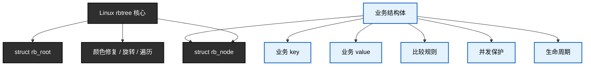

这张图要表达的核心是：

```text
rbtree 核心不理解业务对象。
rbtree 核心只理解 rb_node。
```

所以 Linux rbtree 不是一个完整的“泛型 map 容器”，而是一个**可以嵌入业务对象内部的红黑树基础设施**。

------

### 9.2.1_struct_rb_node_为什么嵌入业务结构体

Linux 内核里，rbtree 的典型业务结构不是这样：

```c
struct rb_node {
	int key;
	void *value;
	struct rb_node *left;
	struct rb_node *right;
};
```

而是这样：

```c
struct my_node {
	int key;
	int value;
	struct rb_node rb;
};
```

也就是说：

```text
struct my_node 是业务对象；
key/value 是业务字段；
rb 是这个业务对象挂入红黑树所需的节点。
```

它的内存关系可以这样看：

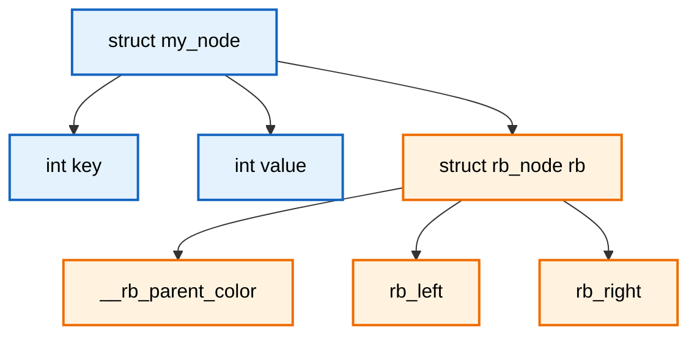

这个模型里有一个关键方向：

```text
不是 rb_node 拥有 my_node；
而是 my_node 拥有 rb_node。
```

换句话说，红黑树节点只是业务对象里的一个成员。

这和 Linux 内核链表的设计完全一致。

链表通常这样用：

```c
struct my_obj {
	int id;
	struct list_head list;
};
```

红黑树通常这样用：

```c
struct my_obj {
	int key;
	struct rb_node rb;
};
```

哈希链表通常这样用：

```c
struct my_obj {
	int key;
	struct hlist_node hnode;
};
```

这是一种统一的内核设计风格：

```text
基础设施节点嵌入业务对象；
基础设施只维护节点关系；
业务代码通过节点反推出外层对象。
```

一个业务对象甚至可以同时嵌入多个基础设施节点：

```c
struct my_obj {
	int id;
	struct rb_node rb;
	struct list_head list;
	struct hlist_node hnode;
	struct kref ref;
};
```

图示如下：

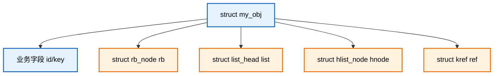

这带来的直接好处是：一个对象可以根据不同需求，同时进入不同管理结构。

例如：

```text
按 key 挂入 rbtree；
按创建顺序挂入 list；
按 hash key 挂入 hash table；
通过 kref 管理引用计数。
```

如果 rbtree 自己包装业务对象，或者通过 `void *data` 反向指向业务对象，这种组合就会变得笨重。

对比两种设计。

普通泛型容器模型：

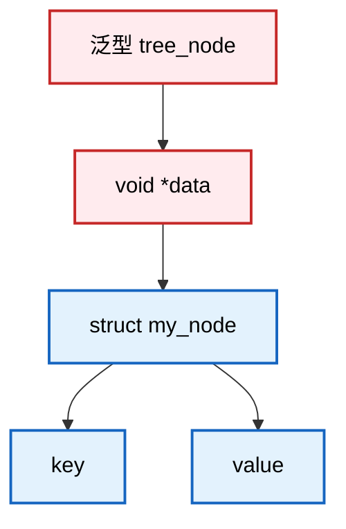

Linux 内核嵌入式节点模型：

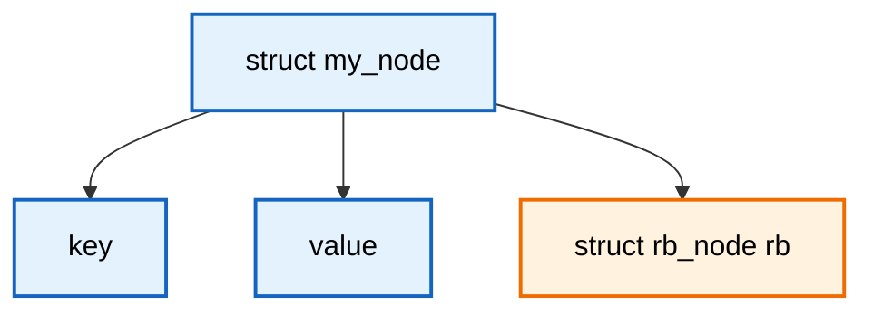

两者的差异是：

```text
泛型容器：tree_node -> void *data -> 业务对象
内核 rbtree：业务对象内部直接包含 rb_node
```

Linux 内核选择后者，是为了减少间接层、减少额外分配、增强类型清晰度，并把对象生命周期交还给业务代码控制。

------

### 9.2.2_container_of()_如何从_rb_node_还原业务对象

既然 rbtree 里面挂的是 `struct rb_node`，那么遍历、查找、删除时，经常只能先拿到：

```c
struct rb_node *node;
```

但是业务代码真正需要的是：

```c
struct my_node *item;
```

这就需要从 `rb_node` 反推出它所在的业务结构体。

这件事由 `container_of()` 完成。

假设业务结构体如下：

```c
struct my_node {
	int key;
	int value;
	struct rb_node rb;
};
```

内存布局可以抽象为：

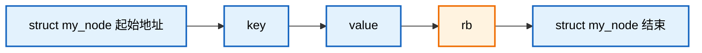

如果现在只知道 `rb` 成员地址，那么可以通过成员偏移反推出整个结构体的起始地址。

公式是：

```text
外层结构体地址 = 成员地址 - 成员在结构体中的偏移量
```

对于上面的结构，就是：

```text
struct my_node 地址 = rb 成员地址 - offsetof(struct my_node, rb)
```

图示如下：

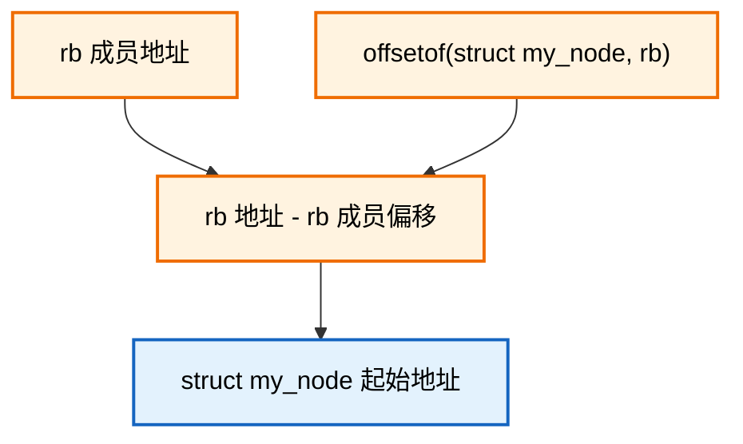

这就是 `container_of()` 的本质。

它不是查表，不是搜索，也不是运行时反射。它就是一次地址计算。

可以把它理解成：

```text
已知房间地址；
已知房间距离大门的偏移；
反推出房子大门地址。
```

对应到结构体：

```text
已知 rb 成员地址；
已知 rb 在 struct my_node 中的偏移；
反推出 struct my_node 起始地址。
```

正向访问是：

```c
&item->rb
```

反向还原是：

```c
container_of(&item->rb, struct my_node, rb)
```

关系如下：

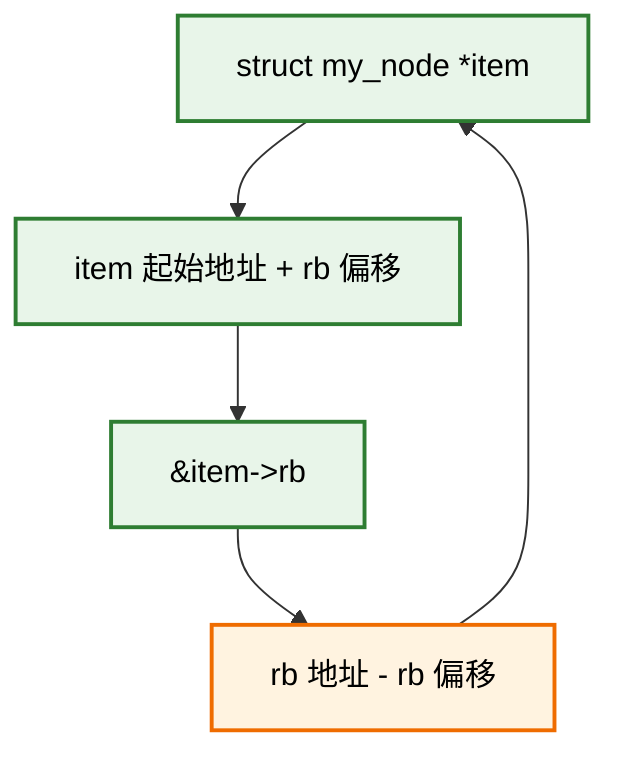

`container_of()` 能工作，依赖两个前提：

```text
第一，rb_node 必须真实嵌入在业务结构体中；
第二，调用者必须提供正确的外层类型和成员名。
```

如果类型写错，结果就是错误地址。

例如，实际对象是：

```c
struct my_node {
	int key;
	struct rb_node rb;
};
```

但是你错误写成：

```c
struct other_node *bad;

bad = container_of(node, struct other_node, rb);
```

那么 `bad` 得到的就是错误对象。

所以 `container_of()` 很高效，但也要求调用者非常清楚当前 `rb_node` 属于哪种业务结构。

------

### 9.2.3_rb_entry()_的封装意义

在 rbtree 代码里，通常不会直接写：

```c
container_of(node, struct my_node, rb)
```

而是写：

```c
rb_entry(node, struct my_node, rb)
```

`rb_entry()` 本质上就是对 `container_of()` 的封装。

可以近似理解为：

```c
#define rb_entry(ptr, type, member) container_of(ptr, type, member)
```

它的意义不是新增能力，而是增强语义。

在红黑树上下文里：

```c
struct my_node *this;

this = rb_entry(parent, struct my_node, rb);
```

这句话读起来非常直接：

```text
parent 是一个 rb_node；
它嵌在 struct my_node 的 rb 成员里；
现在把它还原成 struct my_node。
```

图示如下：

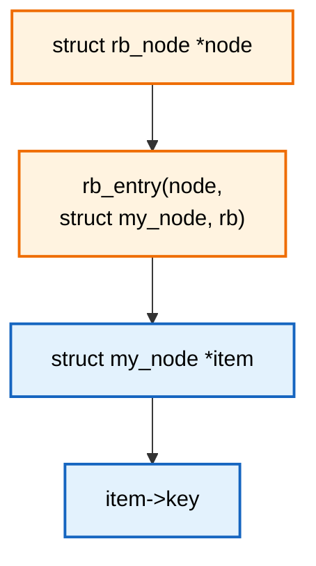

`rb_entry()` 和 `container_of()` 的关系可以这样看：

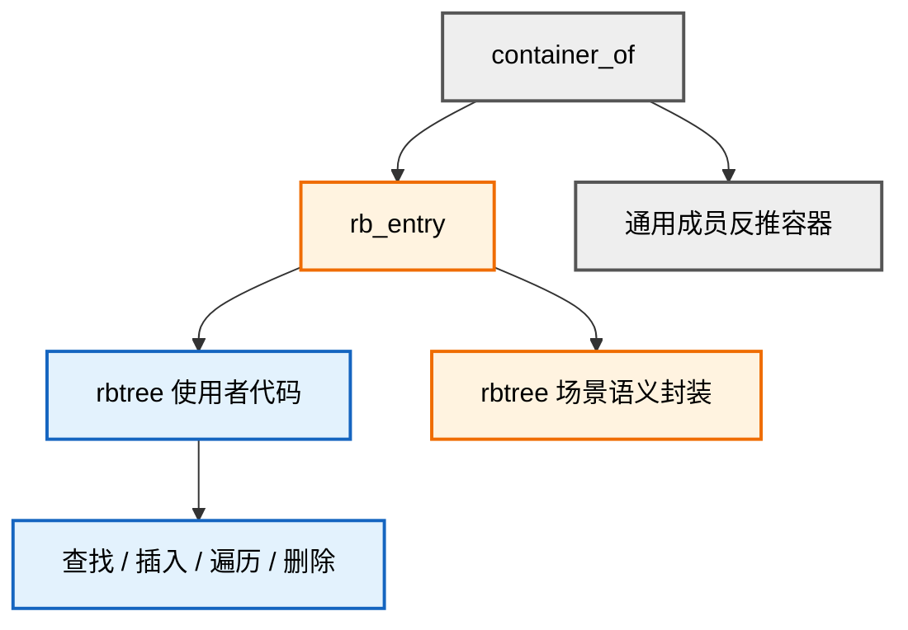

常见使用场景有三个。

查找时：

```c
while (node) {
	struct my_node *this;

	this = rb_entry(node, struct my_node, rb);

	if (key < this->key)
		node = node->rb_left;
	else if (key > this->key)
		node = node->rb_right;
	else
		return this;
}
```

遍历时：

```c
for (node = rb_first(root); node; node = rb_next(node)) {
	struct my_node *item;

	item = rb_entry(node, struct my_node, rb);
	pr_info("key=%d\n", item->key);
}
```

删除时：

```c
rb_erase(&item->rb, root);
kfree(item);
```

这几个场景共同说明：

```text
rbtree API 操作 rb_node；
业务逻辑操作 my_node；
rb_entry() 是二者之间的转换桥梁。
```

------

### 9.2.4_内核为什么不把_key_value_放进_struct_rb_node

很多人第一次看内核 rbtree 会疑惑：

```text
红黑树不是要比较 key 吗？
为什么 struct rb_node 里没有 key？
```

原因是：**内核里的 key 没有统一形态**。

不同子系统对“排序键”的定义完全不同。

例如：

```text
定时器：key 可能是 expires 到期时间；
调度器：key 可能是 vruntime；
内存管理：key 可能是虚拟地址起点；
I/O 调度：key 可能是磁盘扇区号；
驱动资源管理：key 可能是 id、地址、句柄；
区间管理：key 可能是 start/end 范围。
```

如果 `struct rb_node` 内置一个 key，会马上遇到问题：

```text
key 是 int 还是 unsigned long？
key 是 32 位还是 64 位？
key 是单字段还是多字段？
key 是普通标量还是区间？
key 相等时是否允许重复？
key 相等时是否还要比较第二关键字？
```

这些问题没有统一答案。

所以 Linux rbtree 的选择是：

```text
rb_node 不保存 key；
key 由业务对象自己保存；
比较规则由调用者自己实现。
```

简单 key 场景：

```c
struct my_node {
	int key;
	struct rb_node rb;
};
```

排序逻辑：

```c
if (item->key < this->key)
	link = &parent->rb_left;
else if (item->key > this->key)
	link = &parent->rb_right;
else
	return -EEXIST;
```

对应关系：

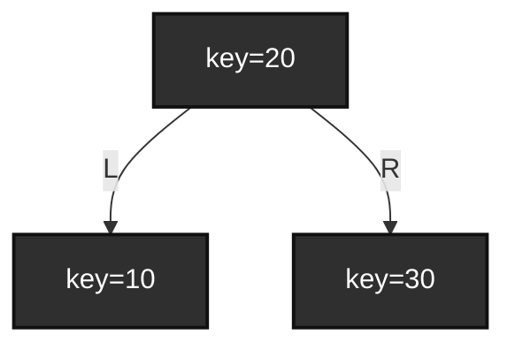

复合 key 场景：

```c
struct my_node {
	u32 major;
	u32 minor;
	struct rb_node rb;
};
```

排序规则可能是：

```text
先比较 major；
major 相等再比较 minor。
```

示意图如下：

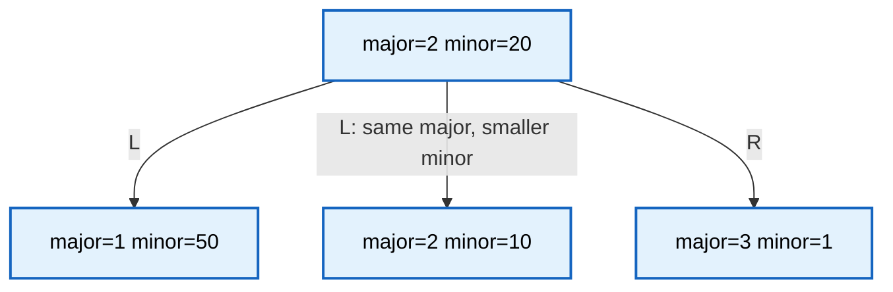

这个图只是表达排序语义，不代表最终树一定长成这样。重点是：

```text
major/minor 合起来才是完整排序 key。
```

区间 key 场景：

```c
struct my_range {
	unsigned long start;
	unsigned long end;
	struct rb_node rb;
};
```

它可能按 `start` 排序：

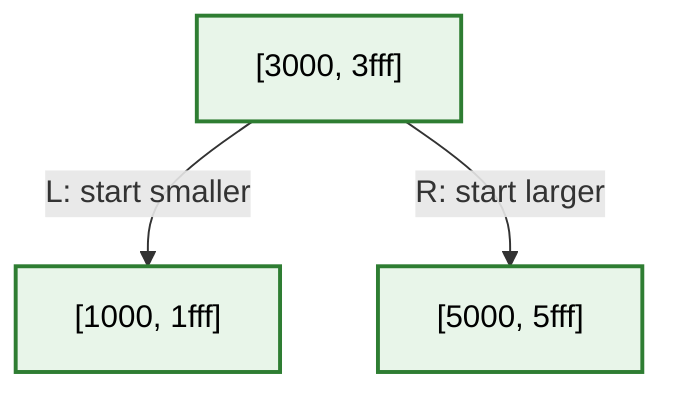

但区间对象通常不只需要排序，还可能需要判断：

```text
某个地址是否落入区间；
两个区间是否重叠；
某个范围是否冲突；
子树内最大的 end 是多少。
```

这就不是一个固定 `key` 字段能解决的问题了。

所以内核 rbtree 不把 key/value 放进 `struct rb_node`，本质原因是：

```text
rb_node 是基础设施节点；
key/value 是业务语义；
内核不把业务语义塞进基础设施节点。
```

------

### 9.2.5_内核为什么不提供统一比较回调

很多用户态容器会提供统一比较回调：

```c
struct tree {
	struct rb_node *root;
	int (*cmp)(const void *a, const void *b);
};
```

然后插入时由容器内部调用：

```c
tree->cmp(new_obj, current_obj);
```

Linux rbtree 没有把这种比较回调作为核心模型。

它不会在 `struct rb_root` 里保存 `cmp`，也不会要求所有插入都走统一的：

```c
rb_insert(root, node, cmp);
```

主要原因有三个：

```text
第一，比较逻辑经常强绑定业务语义；
第二，函数指针回调会带来额外间接调用；
第三，手写比较路径更容易让编译器优化。
```

重复 key 策略就是最典型例子。

策略一：不允许重复 key。

```c
if (item->key < this->key)
	link = &parent->rb_left;
else if (item->key > this->key)
	link = &parent->rb_right;
else
	return -EEXIST;
```

策略二：允许重复 key，重复 key 统一插到右侧。

```c
if (item->key < this->key)
	link = &parent->rb_left;
else
	link = &parent->rb_right;
```

策略三：key 相同后继续比较地址，形成严格全序。

```c
if (item->key < this->key)
	link = &parent->rb_left;
else if (item->key > this->key)
	link = &parent->rb_right;
else if (item < this)
	link = &parent->rb_left;
else
	link = &parent->rb_right;
```

这三种从红黑树结构上都可以成立，但业务语义完全不同。

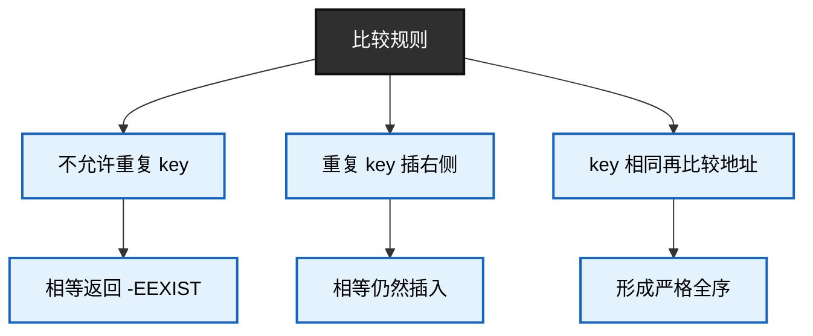

统一比较回调无法替调用者决定这些策略。

所以 Linux rbtree 的核心思路是：

```text
你自己写比较逻辑；
你自己决定重复 key 语义；
rbtree 只负责挂接后的颜色修复和结构维护。
```

另外，手写比较路径也更清楚。

例如：

```c
while (*link) {
	parent = *link;
	this = rb_entry(parent, struct my_node, rb);

	if (item->key < this->key)
		link = &parent->rb_left;
	else if (item->key > this->key)
		link = &parent->rb_right;
	else
		return -EEXIST;
}
```

这段代码一眼就能看出：

```text
按照 item->key 排序；
小于走左边；
大于走右边；
相等认为重复。
```

如果封装成泛型比较回调，比较语义就被藏到另一个函数里了。

当然，Linux 6.12 的 rbtree 也提供了 `rb_find()`、`rb_find_add()` 这类辅助接口，它们可以基于比较函数工作。但这些是辅助接口，不是 rbtree 的唯一使用模型。

------

### 9.2.6_少一层函数指针间接调用带来的性能意义

内核 rbtree 不强制使用统一比较回调，还有一个性能原因：少一层函数指针间接调用。

如果采用泛型插入模型，可能类似这样：

```c
int rb_insert_generic(struct rb_root *root,
		      struct rb_node *node,
		      int (*cmp)(struct rb_node *a, struct rb_node *b));
```

每走一层树，都要调用一次：

```c
cmp(node, current);
```

红黑树高度是 `O(log n)`，所以一次查找或插入大概要比较 `log n` 次。

如果每次比较都是函数指针间接调用，路径大概是：

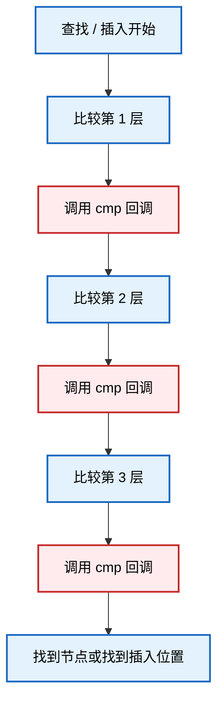

函数指针调用有几个问题：

```text
调用目标不如普通函数直接；
编译器通常难以内联；
类型信息容易丢失；
调试路径不如手写比较直观；
在高频路径中会累积成本。
```

而手写比较是这样：

```c
if (item->key < this->key)
	link = &parent->rb_left;
else if (item->key > this->key)
	link = &parent->rb_right;
else
	return -EEXIST;
```

它的路径更直接：

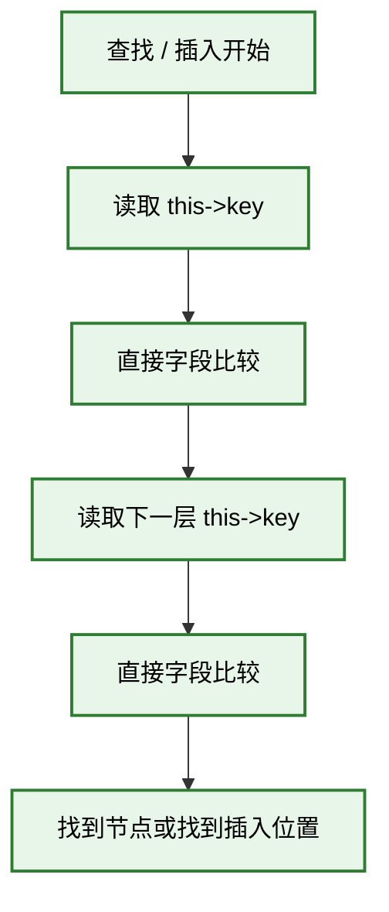

这就是内核常见的设计倾向：

```text
少抽象；
少间接调用；
让类型和字段尽量暴露给编译器；
让高频路径尽量直接。
```

这并不是说函数指针比较一定不能用，而是说内核 rbtree 不把它作为强制模型。

总结一下：

```text
需要极致清晰和高频性能时，手写 search/insert；
需要复用和封装时，可以使用 rb_find* / rb_add* 辅助接口。
```

------

### 9.2.7_节点嵌入式设计对缓存局部性的影响

嵌入式节点设计还有一个实际好处：缓存局部性通常更好。

如果采用泛型容器设计，树节点和业务对象可能是两块内存。

```c
struct generic_rb_node {
	struct generic_rb_node *left;
	struct generic_rb_node *right;
	struct generic_rb_node *parent;
	void *data;
};

struct my_node {
	int key;
	int value;
};
```

访问 key 时路径是：

```text
先访问 generic_rb_node；
再通过 void *data 找到 my_node；
再访问 my_node->key。
```

图示如下：

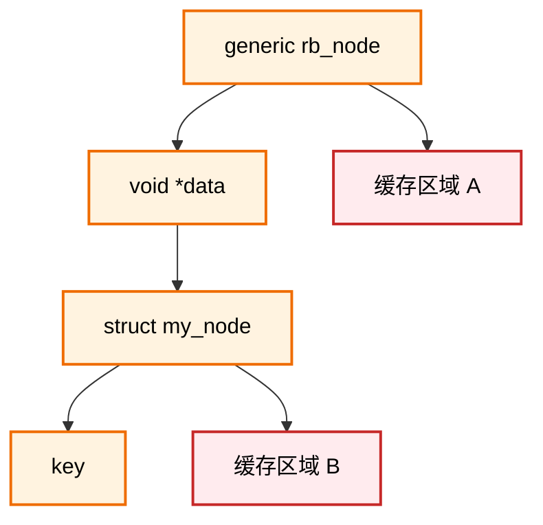

而 Linux 内核嵌入式节点是：

```c
struct my_node {
	int key;
	int value;
	struct rb_node rb;
};
```

访问路径是：

```text
rb_node 在 my_node 内部；
通过 rb_entry() 回到 my_node；
key 和 rb 通常在同一个业务对象附近。
```

图示如下：

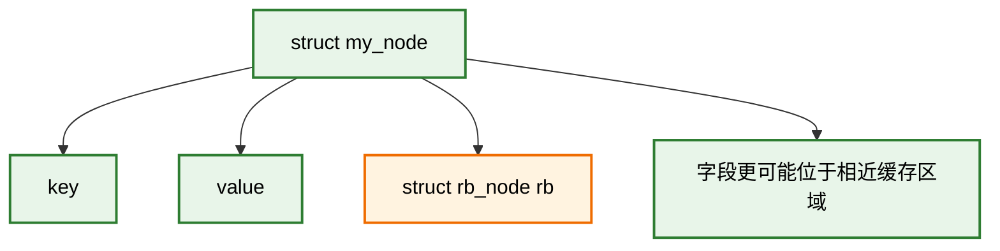

这里不能绝对说 `key` 和 `rb` 一定在同一条 cache line 里，因为这取决于结构体布局、字段顺序、对象大小、分配器和对齐方式。

但相比“树节点一块内存、业务对象另一块内存”，嵌入式节点至少减少了：

```text
一次额外对象分配；
一次 void * 间接访问；
一层节点到对象的跳转；
一部分缓存不命中的可能性。
```

在内核中，这种设计很常见。

例如：

```c
struct list_head list;
struct hlist_node hnode;
struct rb_node rb;
struct work_struct work;
struct kref ref;
```

它们的共同点是：

```text
基础设施节点嵌入业务对象。
```

这样业务对象既可以挂链表，也可以挂红黑树，还可以加入工作队列或者引用计数系统。

------

### 9.2.8_节点生命周期为什么由调用者管理

Linux rbtree 不负责分配节点，也不负责释放节点。

也就是说，rbtree 不会帮你做：

```c
kmalloc();
kfree();
```

它只负责红黑树结构本身：

```text
把已有的 rb_node 挂入树；
把已有的 rb_node 从树中摘除；
维护插入后的颜色和平衡；
维护删除后的颜色和平衡。
```

但是，业务对象什么时候分配、什么时候初始化、什么时候可以释放、是否还有并发读者、是否需要引用计数、是否需要 RCU 延迟释放，这些都不属于 rbtree 的职责范围。

所以必须先建立一个清晰边界：

```text
rb_link_node() / rb_insert_color() 只表示“节点进入树结构”；
rb_erase() 只表示“节点离开树结构”；
节点离开树结构，不等于业务对象可以立即释放。
```

换句话说：

```text
从 rbtree 摘除，只是对象生命周期中的一个阶段；
不是对象生命周期的终点。
```

生命周期关系应该这样理解：

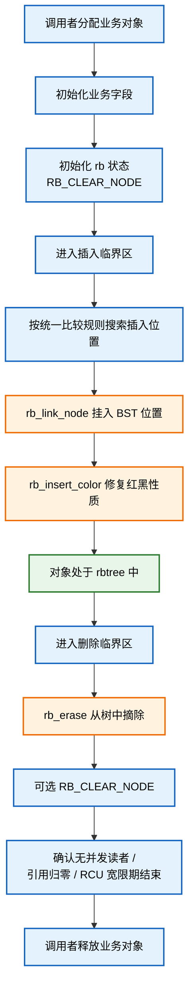

这张图里最重要的是中后段：

```text
rb_erase()
    ↓
可选 RB_CLEAR_NODE()
    ↓
确认无访问者
    ↓
释放对象
```

不能把它简化成：

```c
rb_erase(&item->rb, root);
kfree(item);
```

然后默认认为这就是安全流程。

这段代码只有在非常受限的场景下才成立：

```text
没有并发读者；
没有 RCU 查找；
没有引用计数；
对象没有挂在其他结构中；
没有 timer / workqueue / 中断 / DMA / 回调路径仍可能访问对象；
调用者已经持有正确的锁；
树是该对象的唯一所有者。
```

如果这些条件不满足，`rb_erase()` 后立即 `kfree()` 就可能变成 use-after-free。

------

在非并发、无额外引用的简单场景中，删除流程可以写成：

```c
/*
 * 简单独占场景：
 *
 * 前提：
 *   - 当前路径持有必要的锁；
 *   - 没有并发读者；
 *   - 没有 RCU；
 *   - 没有引用计数；
 *   - 对象只由这棵 rbtree 管理；
 *   - 删除后不会再被其他路径访问。
 */
rb_erase(&item->rb, root);
RB_CLEAR_NODE(&item->rb);
kfree(item);
```

这里的 `RB_CLEAR_NODE()` 不是释放动作，它只是把节点标记成“不在树中”。

如果对象马上释放，`RB_CLEAR_NODE()` 不是绝对必要；但是在模板代码或可复用对象场景中，保留它更安全，能够避免后续误判节点仍然挂在树中。

------

更严谨的删除接口通常应该拆成两步。

第一步，只负责从树中摘除对象：

```c
static int my_tree_remove(struct my_tree *tree, int key,
			  struct my_node **removed)
{
	struct my_node *item;

	if (!removed)
		return -EINVAL;

	*removed = NULL;

	spin_lock(&tree->lock);

	item = my_tree_search_locked(tree, key);
	if (!item) {
		spin_unlock(&tree->lock);
		return -ENOENT;
	}

	/*
	 * rb_erase() 只负责从 rbtree 中摘除节点。
	 * 它不会释放 struct my_node。
	 */
	rb_erase(&item->rb, &tree->root);

	/*
	 * 如果对象后续可能复用，或者代码需要判断节点是否仍在树中，
	 * 可以清理 rb_node 状态。
	 */
	RB_CLEAR_NODE(&item->rb);

	*removed = item;

	spin_unlock(&tree->lock);
	return 0;
}
```

第二步，由调用者根据对象所有权决定是否释放：

```c
struct my_node *item;
int ret;

ret = my_tree_remove(&tree, key, &item);
if (!ret)
	kfree(item);
```

这种写法比直接在删除函数内部 `kfree()` 更清晰，因为它把两个动作分开了：

```text
从树中摘除；
释放业务对象。
```

这两个动作不是同一件事。

------

如果存在 RCU 读侧查找，那么删除后不能立即释放对象。

错误示例：

```c
spin_lock(&tree->lock);
rb_erase(&item->rb, &tree->root);
spin_unlock(&tree->lock);

kfree(item);	/* 错误：RCU 读者可能仍然持有 item */
```

更合理的模型是：

```c
spin_lock(&tree->lock);

rb_erase(&item->rb, &tree->root);
RB_CLEAR_NODE(&item->rb);

spin_unlock(&tree->lock);

/*
 * 等待 RCU 读侧临界区结束后再释放对象。
 */
call_rcu(&item->rcu, my_node_rcu_free);
```

其中释放函数类似：

```c
static void my_node_rcu_free(struct rcu_head *rcu)
{
	struct my_node *item;

	item = container_of(rcu, struct my_node, rcu);
	kfree(item);
}
```

RCU 场景的生命周期应该这样看：

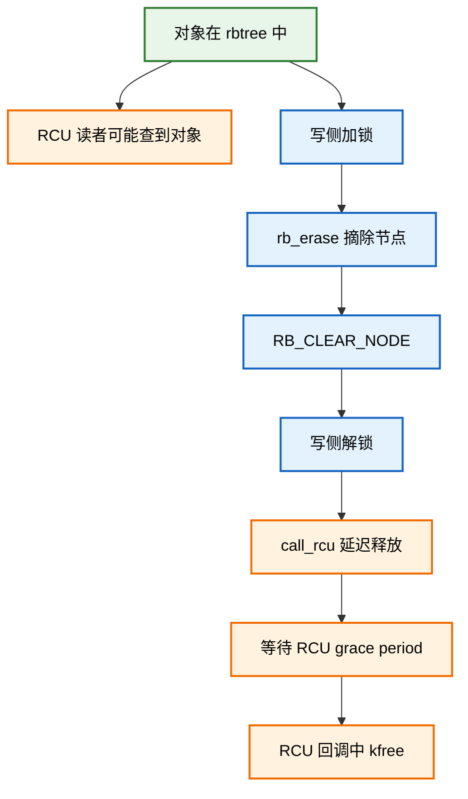

这张图的核心是：

```text
rb_erase() 只是让后续新查找不能再从树中找到该对象；
但已经开始的 RCU 读者，可能仍然持有旧对象指针。
```

所以 RCU 场景下，删除和释放必须分离。

------

如果对象使用引用计数，逻辑也类似。

从 rbtree 中摘除，只表示：

```text
这个对象不再能通过树查到。
```

但对象是否释放，要看引用计数是否归零。

示意流程如下：

```mermaid
graph TD
	in_tree["对象在 rbtree 中"]
	lookup_get["查找路径获取引用"]
	other_user["其他路径持有引用"]
	remove_tree["rb_erase 从树中摘除"]
	not_find["后续不能再从树中查到"]
	put_ref["释放一个引用"]
	ref_zero{"引用计数为 0?"}
	keep_alive["对象继续存活"]
	free_obj["释放对象"]

	in_tree --> lookup_get
	in_tree --> other_user
	in_tree --> remove_tree
	remove_tree --> not_find
	not_find --> put_ref
	lookup_get --> put_ref
	other_user --> put_ref
	put_ref --> ref_zero
	ref_zero -->|否| keep_alive
	ref_zero -->|是| free_obj

	classDef state fill:#e8f5e9,stroke:#2e7d32,color:#000,stroke-width:2px;
	classDef ref fill:#e3f2fd,stroke:#1565c0,color:#000,stroke-width:2px;
	classDef free fill:#fff3e0,stroke:#ef6c00,color:#000,stroke-width:2px;

	class in_tree,not_find state;
	class lookup_get,other_user,put_ref,ref_zero,keep_alive ref;
	class remove_tree,free_obj free;
```

所以引用计数场景也不能简单写成：

```c
rb_erase(&item->rb, root);
kfree(item);
```

而应该是：

```c
rb_erase(&item->rb, root);
RB_CLEAR_NODE(&item->rb);
my_node_put(item);
```

至于 `my_node_put()` 里面是否真正释放对象，要看引用计数。

------

为什么 rbtree 不自动释放对象？

因为 rbtree 根本不知道对象是怎么来的。

业务对象可能来自：

```text
kmalloc；
kzalloc；
slab cache；
静态全局对象；
percpu 对象；
引用计数对象；
RCU 延迟释放对象；
devm 管理资源；
其他子系统私有分配器。
```

如果 rbtree 试图自动释放对象，它必须知道：

```text
用 kfree 还是 kmem_cache_free；
是否还有引用计数；
是否需要 call_rcu 延迟释放；
是否还挂在别的链表里；
是否还被 timer 使用；
是否还被 workqueue 使用；
是否还被中断路径访问；
是否还有硬件 DMA 或回调路径可能访问。
```

这些都不是 rbtree 能知道的。

所以 Linux rbtree 的边界是：

```text
rbtree 负责树结构；
调用者负责对象生命。
```

可以用下面这张图总结责任边界：

```mermaid
graph TD
	rbtree_core["Linux rbtree"]
	tree_link["挂入树 rb_link_node"]
	tree_fix["插入修复 rb_insert_color"]
	tree_erase["摘除节点 rb_erase"]
	tree_walk["遍历辅助 rb_first/rb_next"]

	user_code["调用者"]
	obj_alloc["对象分配"]
	obj_init["业务初始化"]
	obj_cmp["比较规则"]
	obj_lock["锁 / RCU / 引用计数"]
	obj_clear["节点状态清理"]
	obj_free["对象释放"]

	rbtree_core --> tree_link
	rbtree_core --> tree_fix
	rbtree_core --> tree_erase
	rbtree_core --> tree_walk

	user_code --> obj_alloc
	user_code --> obj_init
	user_code --> obj_cmp
	user_code --> obj_lock
	user_code --> obj_clear
	user_code --> obj_free

	classDef rb fill:#2f2f2f,stroke:#111,color:#fff,stroke-width:2px;
	classDef user fill:#e3f2fd,stroke:#1565c0,color:#000,stroke-width:2px;

	class rbtree_core,tree_link,tree_fix,tree_erase,tree_walk rb;
	class user_code,obj_alloc,obj_init,obj_cmp,obj_lock,obj_clear,obj_free user;
```

最后，还要特别强调 `RB_CLEAR_NODE()` 和 `RB_EMPTY_NODE()` 的边界。

`RB_CLEAR_NODE()` 的意义是：

```text
把 rb_node 标记成“当前不在树中”。
```

`RB_EMPTY_NODE()` 的意义是：

```text
检查 rb_node 是否处于这种“未挂树 / 已清理”状态。
```

但是它们不是同步机制。

也就是说，下面这种逻辑不能替代锁：

```c
if (!RB_EMPTY_NODE(&item->rb)) {
	rb_erase(&item->rb, root);
	RB_CLEAR_NODE(&item->rb);
}
```

这段代码在没有并发的情况下可以表达节点状态检查；但在并发场景下，两个线程可能同时判断、同时删除，仍然会出问题。

所以必须记住：

```text
RB_EMPTY_NODE() 不是锁；
RB_CLEAR_NODE() 不是锁；
rb_erase() 不是锁；
rbtree 本身不提供并发保护。
```

并发场景必须由调用者使用：

```text
spinlock；
mutex；
rwlock；
RCU；
引用计数；
或者其他业务同步机制。
```

本小节的结论是：

```text
rb_erase() 只表示节点离开 rbtree；
节点离开 rbtree 不等于对象可以释放；
对象释放必须由调用者在确认没有任何访问者之后执行。
```

这也是 Linux rbtree 生命周期设计最重要的工程边界。

------

### 9.2.9_本节小结

本节的核心是理解 Linux rbtree 的嵌入式节点设计。

Linux rbtree 和普通泛型容器最大的区别是：

```text
普通泛型容器：容器拥有节点，节点再指向业务对象；
Linux rbtree：业务对象拥有 rb_node，rbtree 只管理 rb_node。
```

最终责任边界如下：

```mermaid
graph TD
	rbtree["Linux rbtree"]
	rb_manage["维护 rb_node 树结构"]
	rb_color["维护颜色"]
	rb_rotate["执行旋转"]
	rb_traverse["提供遍历辅助"]

	user["调用者"]
	user_obj["定义业务对象"]
	user_key["定义 key"]
	user_cmp["定义比较规则"]
	user_dup["定义重复 key 策略"]
	user_lock["负责并发保护"]
	user_life["负责对象生命周期"]

	rbtree --> rb_manage
	rbtree --> rb_color
	rbtree --> rb_rotate
	rbtree --> rb_traverse

	user --> user_obj
	user --> user_key
	user --> user_cmp
	user --> user_dup
	user --> user_lock
	user --> user_life

	classDef rb fill:#2f2f2f,stroke:#111,color:#fff,stroke-width:2px;
	classDef user_class fill:#e3f2fd,stroke:#1565c0,color:#000,stroke-width:2px;

	class rbtree,rb_manage,rb_color,rb_rotate,rb_traverse rb;
	class user,user_obj,user_key,user_cmp,user_dup,user_lock,user_life user_class;
```

本节需要记住六个结论。

第一，`struct rb_node` 是嵌入业务结构体的，不是一个带 key/value 的完整容器节点。

```c
struct my_node {
	int key;
	int value;
	struct rb_node rb;
};
```

第二，rbtree API 操作的是 `struct rb_node`，业务代码需要通过 `rb_entry()` 找回外层对象。

```c
struct my_node *item;

item = rb_entry(node, struct my_node, rb);
```

第三，Linux rbtree 不把 key 放进 `struct rb_node`，因为内核对象的 key 形态没有统一标准。

第四，Linux rbtree 不强制统一比较回调，因为比较规则往往就是业务语义的一部分。

第五，`rb_erase()` 只负责从树中摘除节点，不负责释放业务对象。

```c
rb_erase(&item->rb, root);
kfree(item);
```

第六，`RB_CLEAR_NODE()` 只是节点状态标记，不是并发保护机制。

用一句话总结本节：

```text
Linux rbtree 不是“替你管理对象的泛型容器”，而是“让你的业务对象具备红黑树挂载能力的内核基础设施”。
```

---

## 9.3_使用者视角_如何在内核中使用_rbtree

前面 8.4 已经明确了 Linux rbtree 的核心设计边界：

```text
rbtree 不保存 key；
rbtree 不保存 value；
rbtree 不负责比较；
rbtree 不负责对象分配；
rbtree 不负责对象释放；
rbtree 不负责并发保护。
```

所以使用 Linux rbtree 时，调用者必须自己完成一整套外部逻辑：

```text
定义业务结构体；
在业务结构体中嵌入 struct rb_node；
定义树根 struct rb_root；
明确 key 字段；
明确排序规则；
明确重复 key 策略；
编写查找函数；
编写插入搜索路径；
调用 rb_link_node() 挂接节点；
调用 rb_insert_color() 修复红黑性质；
调用 rb_erase() 摘除节点；
删除后决定何时释放业务对象；
用锁或 RCU 保护并发访问。
```

这就是 Linux rbtree 的使用者视角。

它不像用户态容器那样：

```c
map.insert(key, value);
map.find(key);
map.erase(key);
```

内核 rbtree 更像是给你一组底层零件：

```text
rb_node；
rb_root；
rb_link_node()；
rb_insert_color()；
rb_erase()；
rb_first()；
rb_next()；
```

然后你自己把它们拼成适合业务对象的管理结构。

整体流程如下：

```mermaid
graph TD
	define_obj["定义业务结构体"]
	embed_rb["嵌入 struct rb_node"]
	define_root["定义 struct rb_root"]
	define_key["明确 key 字段"]
	define_cmp["明确排序规则"]
	define_dup["明确重复 key 策略"]
	search_func["编写查找函数"]
	insert_search["编写插入搜索路径"]
	link_node["rb_link_node 挂接"]
	insert_fix["rb_insert_color 修复"]
	erase_node["rb_erase 删除"]
	free_obj["调用者决定释放对象"]
	lock_rule["调用者负责锁 / RCU / 生命周期"]

	define_obj --> embed_rb
	embed_rb --> define_root
	define_root --> define_key
	define_key --> define_cmp
	define_cmp --> define_dup
	define_dup --> search_func
	define_dup --> insert_search
	insert_search --> link_node
	link_node --> insert_fix
	search_func --> erase_node
	erase_node --> free_obj
	define_root --> lock_rule
	search_func --> lock_rule
	insert_search --> lock_rule
	erase_node --> lock_rule

	classDef user fill:#e3f2fd,stroke:#1565c0,color:#000,stroke-width:2px;
	classDef rb fill:#fff3e0,stroke:#ef6c00,color:#000,stroke-width:2px;
	classDef warn fill:#ffebee,stroke:#c62828,color:#000,stroke-width:2px;

	class define_obj,embed_rb,define_root,define_key,define_cmp,define_dup,search_func,insert_search,free_obj,lock_rule user;
	class link_node,insert_fix,erase_node rb;
```

这张图说明一个核心事实：

```text
Linux rbtree 的完整使用，不是只会调用 rb_insert_color()。
真正的使用闭环，是调用者把“业务语义”和“rbtree 结构维护”正确拼接起来。
```

------

### 9.3.1_定义业务结构体

使用 Linux rbtree 的第一步，是定义业务结构体。

因为 Linux rbtree 不提供通用 key/value 节点，所以你必须先回答一个问题：

```text
我要用红黑树管理什么对象？
```

例如，你要管理一组按整数 key 排序的对象，可以定义：

```c
struct demo_rb_item {
	int key;
	int value;
	struct rb_node rb;
};
```

这里有三类字段：

```text
key   ：排序字段；
value ：业务数据；
rb    ：挂入 Linux rbtree 的节点。
```

关系如下：

```mermaid
graph TD
	item["struct demo_rb_item"]
	key_field["int key"]
	value_field["int value"]
	rb_field["struct rb_node rb"]

	item --> key_field
	item --> value_field
	item --> rb_field

	classDef obj fill:#e3f2fd,stroke:#1565c0,color:#000,stroke-width:2px;
	classDef rb fill:#fff3e0,stroke:#ef6c00,color:#000,stroke-width:2px;

	class item,key_field,value_field obj;
	class rb_field rb;
```

这个结构体的含义不是：

```text
rb_node 里面保存 demo_rb_item。
```

而是：

```text
demo_rb_item 里面嵌入 rb_node。
```

所以 `demo_rb_item` 才是真正的业务对象。

`struct rb_node rb` 只是让它具备“挂入红黑树”的能力。

------

业务结构体可以很简单，也可以很复杂。

简单对象：

```c
struct demo_rb_item {
	int key;
	struct rb_node rb;
};
```

带业务值的对象：

```c
struct demo_rb_item {
	int key;
	int value;
	struct rb_node rb;
};
```

带引用计数的对象：

```c
struct demo_rb_item {
	int key;
	int value;
	refcount_t refcnt;
	struct rb_node rb;
};
```

带 RCU 释放能力的对象：

```c
struct demo_rb_item {
	int key;
	int value;
	struct rb_node rb;
	struct rcu_head rcu;
};
```

带多个管理结构的对象：

```c
struct demo_rb_item {
	int key;
	int value;

	struct rb_node rb;
	struct list_head list;
	struct hlist_node hnode;
	refcount_t refcnt;
};
```

这体现了 Linux 内核对象的常见风格：

```text
业务对象可以同时挂入多个基础设施；
rbtree 只是其中一种组织方式。
```

图示如下：

```mermaid
graph TD
	item["struct demo_rb_item"]
	key_value["key / value"]
	rb_node["struct rb_node rb"]
	list_node["struct list_head list"]
	hash_node["struct hlist_node hnode"]
	ref_node["refcount_t refcnt"]

	item --> key_value
	item --> rb_node
	item --> list_node
	item --> hash_node
	item --> ref_node

	classDef obj fill:#e3f2fd,stroke:#1565c0,color:#000,stroke-width:2px;
	classDef infra fill:#fff3e0,stroke:#ef6c00,color:#000,stroke-width:2px;

	class item,key_value obj;
	class rb_node,list_node,hash_node,ref_node infra;
```

所以定义业务结构体时，不能只想：

```text
我要放一个 rb_node。
```

还要想清楚：

```text
这个对象由谁分配？
谁持有它？
是否允许并发访问？
是否需要引用计数？
是否需要 RCU？
删除后是否马上释放？
是否还挂在别的数据结构里？
```

这些问题决定了后面插入、删除、释放的安全边界。

------

### 9.3.2_在业务结构体中嵌入_struct_rb_node

定义业务结构体后，必须在其中嵌入：

```c
struct rb_node rb;
```

例如：

```c
struct demo_rb_item {
	int key;
	int value;
	struct rb_node rb;
};
```

这一步非常关键。

因为 Linux rbtree 操作的不是 `struct demo_rb_item *`，而是：

```c
struct rb_node *
```

也就是说，真正挂入树的是：

```c
&item->rb
```

不是：

```c
item
```

插入时：

```c
rb_link_node(&item->rb, parent, link);
rb_insert_color(&item->rb, root);
```

删除时：

```c
rb_erase(&item->rb, root);
```

遍历时：

```c
struct rb_node *node;

for (node = rb_first(root); node; node = rb_next(node)) {
	struct demo_rb_item *item;

	item = rb_entry(node, struct demo_rb_item, rb);
}
```

完整关系如下：

```mermaid
graph TD
	root["struct rb_root"]
	rb_20["struct rb_node rb<br/>key=20 所属对象"]
	rb_10["struct rb_node rb<br/>key=10 所属对象"]
	rb_30["struct rb_node rb<br/>key=30 所属对象"]

	obj_20["struct demo_rb_item<br/>key=20 value=..."]
	obj_10["struct demo_rb_item<br/>key=10 value=..."]
	obj_30["struct demo_rb_item<br/>key=30 value=..."]

	root --> rb_20
	rb_20 -->|L| rb_10
	rb_20 -->|R| rb_30

	obj_20 --> rb_20
	obj_10 --> rb_10
	obj_30 --> rb_30

	classDef rb fill:#2f2f2f,stroke:#111,color:#fff,stroke-width:2px;
	classDef obj fill:#e3f2fd,stroke:#1565c0,color:#000,stroke-width:2px;

	class root,rb_20,rb_10,rb_30 rb;
	class obj_20,obj_10,obj_30 obj;
```

这个图要注意：

```text
树结构由 rb_node 组成；
业务对象通过内嵌 rb_node 参与树结构；
从 rb_node 回到业务对象，需要 rb_entry()。
```

如果一个业务结构体里有多个 `struct rb_node`，那么它可以同时挂入多棵不同的 rbtree。

例如：

```c
struct demo_rb_item {
	int id;
	unsigned long deadline;

	struct rb_node id_node;
	struct rb_node deadline_node;
};
```

这表示：

```text
id_node 可以挂入按 id 排序的树；
deadline_node 可以挂入按 deadline 排序的树。
```

图示如下：

```mermaid
graph TD
	item["struct demo_rb_item"]
	id_key["id"]
	deadline_key["deadline"]
	id_node["struct rb_node id_node"]
	deadline_node["struct rb_node deadline_node"]

	id_tree["按 id 排序的 rbtree"]
	deadline_tree["按 deadline 排序的 rbtree"]

	item --> id_key
	item --> deadline_key
	item --> id_node
	item --> deadline_node

	id_tree --> id_node
	deadline_tree --> deadline_node

	classDef obj fill:#e3f2fd,stroke:#1565c0,color:#000,stroke-width:2px;
	classDef rb fill:#fff3e0,stroke:#ef6c00,color:#000,stroke-width:2px;
	classDef tree fill:#2f2f2f,stroke:#111,color:#fff,stroke-width:2px;

	class item,id_key,deadline_key obj;
	class id_node,deadline_node rb;
	class id_tree,deadline_tree tree;
```

这种设计非常灵活，但也带来一个要求：

```text
每棵树必须使用对应的 rb_node 成员；
rb_entry() 还原对象时，也必须填写对应的成员名。
```

例如：

```c
item = rb_entry(node, struct demo_rb_item, id_node);
```

和：

```c
item = rb_entry(node, struct demo_rb_item, deadline_node);
```

是两个不同含义。

如果成员名写错，就会反推出错误地址。

------

### 9.3.3_定义_struct_rb_root_根节点

有了业务节点，还需要定义树根。

普通 rbtree 使用：

```c
struct rb_root root = RB_ROOT;
```

或者封装到自己的树对象里：

```c
struct demo_rb_tree {
	struct rb_root root;
	spinlock_t lock;
};
```

初始化时：

```c
static struct demo_rb_tree demo_tree = {
	.root = RB_ROOT,
	.lock = __SPIN_LOCK_UNLOCKED(demo_tree.lock),
};
```

或者在运行时初始化：

```c
static void demo_tree_init(struct demo_rb_tree *tree)
{
	tree->root = RB_ROOT;
	spin_lock_init(&tree->lock);
}
```

`struct rb_root` 本质上只保存一个指针：

```c
struct rb_root {
	struct rb_node *rb_node;
};
```

它指向整棵红黑树的根节点。

空树时：

```text
root.rb_node == NULL
```

图示如下：

```mermaid
graph TD
	root_empty["struct rb_root<br/>rb_node = NULL"]
	root_nonempty["struct rb_root<br/>rb_node = root node"]
	rb_root_node["root rb_node"]
	rb_left_node["left child"]
	rb_right_node["right child"]

	root_nonempty --> rb_root_node
	rb_root_node -->|L| rb_left_node
	rb_root_node -->|R| rb_right_node

	classDef empty fill:#eeeeee,stroke:#555,color:#000,stroke-width:2px;
	classDef rb fill:#2f2f2f,stroke:#111,color:#fff,stroke-width:2px;

	class root_empty empty;
	class root_nonempty,rb_root_node,rb_left_node,rb_right_node rb;
```

根节点只是树入口，不保存：

```text
节点数量；
比较函数；
锁；
key 信息；
value 信息；
释放函数。
```

所以如果业务需要这些信息，需要自己封装。

例如：

```c
struct demo_rb_tree {
	struct rb_root root;
	spinlock_t lock;
	unsigned int count;
};
```

这时 `count` 需要调用者自己维护：

```c
tree->count++;
tree->count--;
```

rbtree 核心不会帮你统计节点数量。

图示如下：

```mermaid
graph TD
	tree["struct demo_rb_tree"]
	root["struct rb_root root"]
	lock["spinlock_t lock"]
	count["unsigned int count"]
	policy["业务策略"]

	tree --> root
	tree --> lock
	tree --> count
	tree --> policy

	classDef tree_class fill:#e3f2fd,stroke:#1565c0,color:#000,stroke-width:2px;
	classDef rb fill:#fff3e0,stroke:#ef6c00,color:#000,stroke-width:2px;
	classDef policy_class fill:#e8f5e9,stroke:#2e7d32,color:#000,stroke-width:2px;

	class tree,lock,count,policy tree_class;
	class root rb;
```

封装树对象的好处是：

```text
把 root、lock、count、业务策略放在一起；
避免到处传裸 struct rb_root；
便于后续扩展 cached rbtree 或 augmented rbtree；
便于把查找、插入、删除接口封装成统一模块。
```

所以工程模板里不建议只用一个裸全局变量：

```c
static struct rb_root root = RB_ROOT;
```

更推荐封装：

```c
struct demo_rb_tree {
	struct rb_root root;
	spinlock_t lock;
	unsigned int count;
};
```

------

### 9.3.4_明确_key_字段和排序规则

定义完业务结构体和根节点后，下一步必须明确 key 字段。

例如：

```c
struct demo_rb_item {
	int key;
	int value;
	struct rb_node rb;
};
```

这里的排序 key 是：

```c
item->key
```

排序规则是：

```text
key 小的在左子树；
key 大的在右子树；
key 相等按业务策略处理。
```

最基础的 BST 关系如下：

```mermaid
graph TD
	rb_20["key=20"]
	rb_10["key=10"]
	rb_30["key=30"]
	rb_05["key=5"]
	rb_15["key=15"]

	rb_20 -->|L| rb_10
	rb_20 -->|R| rb_30
	rb_10 -->|L| rb_05
	rb_10 -->|R| rb_15

	classDef node fill:#2f2f2f,stroke:#111,color:#fff,stroke-width:2px;
	class rb_20,rb_10,rb_30,rb_05,rb_15 node;
```

这棵树满足：

```text
5 < 10 < 15 < 20 < 30
```

rbtree 的颜色和平衡，是在这个 BST 有序关系基础上维护的。

也就是说：

```text
红黑树首先是一棵二叉搜索树；
然后才是带颜色平衡约束的二叉搜索树。
```

如果 BST 排序规则本身错了，红黑修复也救不了。

例如，插入时用 `key` 排序：

```c
if (item->key < this->key)
	link = &parent->rb_left;
else if (item->key > this->key)
	link = &parent->rb_right;
```

但是查找时用 `value` 查：

```c
if (value < this->value)
	node = node->rb_left;
else if (value > this->value)
	node = node->rb_right;
```

这就是错误的。

因为树是按 `key` 排出来的，不能按 `value` 路径查找。

错误关系如下：

```mermaid
graph TD
	insert_rule["插入规则：按 key 排序"]
	tree_shape["树形结构由 key 决定"]
	search_rule["查找规则：按 value 查找"]
	search_wrong["查找路径可能错误"]

	insert_rule --> tree_shape
	tree_shape --> search_rule
	search_rule --> search_wrong

	classDef good fill:#e8f5e9,stroke:#2e7d32,color:#000,stroke-width:2px;
	classDef bad fill:#ffebee,stroke:#c62828,color:#000,stroke-width:2px;

	class insert_rule,tree_shape good;
	class search_rule,search_wrong bad;
```

所以排序规则必须统一：

```text
插入用什么规则；
查找就用什么规则；
删除定位也必须用什么规则；
遍历结果也按这个规则有序。
```

------

排序规则也可以是复合 key。

例如：

```c
struct demo_rb_item {
	u32 major;
	u32 minor;
	struct rb_node rb;
};
```

排序规则：

```text
先比较 major；
major 相等再比较 minor。
```

可以写成比较函数：

```c
static int demo_item_cmp_key(u32 major, u32 minor,
			     const struct demo_rb_item *item)
{
	if (major < item->major)
		return -1;
	if (major > item->major)
		return 1;

	if (minor < item->minor)
		return -1;
	if (minor > item->minor)
		return 1;

	return 0;
}
```

也可以比较两个对象：

```c
static int demo_item_cmp_item(const struct demo_rb_item *a,
			      const struct demo_rb_item *b)
{
	if (a->major < b->major)
		return -1;
	if (a->major > b->major)
		return 1;

	if (a->minor < b->minor)
		return -1;
	if (a->minor > b->minor)
		return 1;

	return 0;
}
```

这种比较规则形成的是一个全序关系：

```text
(major, minor)
```

图示如下：

```mermaid
graph TD
	k_2_20["major=2 minor=20"]
	k_1_50["major=1 minor=50"]
	k_2_10["major=2 minor=10"]
	k_3_01["major=3 minor=1"]

	k_2_20 -->|L: major smaller| k_1_50
	k_2_20 -->|L: same major minor smaller| k_2_10
	k_2_20 -->|R: major larger| k_3_01

	classDef node fill:#e3f2fd,stroke:#1565c0,color:#000,stroke-width:2px;
	class k_2_20,k_1_50,k_2_10,k_3_01 node;
```

这张图只是表达排序语义，不代表红黑树最后一定长成这个形状。真正形状还会受到插入顺序和红黑修复影响。

但是不管形状怎么变化，它必须始终满足：

```text
左子树所有 key < 当前 key；
右子树所有 key > 当前 key。
```

------

### 9.3.5_明确重复_key_的业务语义

使用 rbtree 前必须明确一个问题：

```text
key 相等时怎么办？
```

这不是 rbtree 自动替你决定的。

常见策略有三种。

第一种：不允许重复 key。

这是最简单、最常见的工程模板。

插入时：

```c
if (item->key < this->key)
	link = &parent->rb_left;
else if (item->key > this->key)
	link = &parent->rb_right;
else
	return -EEXIST;
```

这种策略适合：

```text
id -> object；
fd -> object；
address -> object；
handle -> object；
唯一 key 资源管理。
```

图示如下：

```mermaid
graph TD
	insert_key["插入 key=20"]
	exist_key["树中已有 key=20"]
	return_exist["返回 -EEXIST"]
	no_insert["不调用 rb_link_node <br/>/ rb_insert_color"]

	insert_key --> exist_key
	exist_key --> return_exist
	return_exist --> no_insert

	classDef warn fill:#ffebee,stroke:#c62828,color:#000,stroke-width:2px;
	class insert_key,exist_key,return_exist,no_insert warn;
```

这里非常重要：

```text
如果发现重复 key，不能调用 rb_link_node()；
也不能调用 rb_insert_color()。
```

因为节点没有被正确挂入树，调用修复函数没有意义，还可能破坏结构。

------

第二种：允许重复 key，重复 key 统一插到一边。

例如重复 key 全部插到右子树：

```c
if (item->key < this->key)
	link = &parent->rb_left;
else
	link = &parent->rb_right;
```

这种策略简单，但有一个问题：

```text
查找 key 时只能找到其中一个；
如果要找到所有相同 key，需要继续遍历相邻节点；
如果重复 key 特别多，局部路径可能退化。
```

图示如下：

```mermaid
graph TD
	rb_20_a["key=20 A<br>(B)"]
	rb_10["key=10<br>(B)"]
	rb_20_b["key=20 B<br>(B)"]
	rb_20_b_nil_left["　"]
	rb_20_c["key=20 C<br>(R)"]

	rb_20_a -->|L| rb_10
	rb_20_a -->|R: equal goes right| rb_20_b

	rb_20_b -->|L| rb_20_b_nil_left
	rb_20_b -->|R: equal goes right| rb_20_c

	classDef black fill:#2f2f2f,stroke:#111,color:#fff,stroke-width:2px;
	classDef red fill:#c62828,stroke:#8e0000,color:#fff,stroke-width:2px;
	classDef nil fill:#ffffff,stroke:#ffffff,color:#ffffff;

	class rb_20_a,rb_10,rb_20_b black;
	class rb_20_c red;
	class rb_20_b_nil_left nil;
```

这不一定是最终红黑树形态，因为旋转会调整结构。但重复 key 策略会影响查找和遍历语义。

------

第三种：key 相等后引入第二排序条件，形成严格全序。

例如：

```c
if (item->key < this->key)
	link = &parent->rb_left;
else if (item->key > this->key)
	link = &parent->rb_right;
else if (item < this)
	link = &parent->rb_left;
else
	link = &parent->rb_right;
```

这表示：

```text
先按 key 排序；
key 相等时按对象地址排序；
这样每个节点都有唯一位置。
```

这种策略适合需要允许同 key 但又希望树结构有严格排序的场景。

不过它也有问题：

```text
按地址排序通常没有业务含义；
跨生命周期后地址复用可能影响调试理解；
查找同 key 的所有对象时仍然需要额外遍历。
```

所以实际工程中更常见的做法是：

```text
如果 key 应该唯一，就拒绝重复；
如果 key 天然重复，就设计专门的重复 key 管理方式；
例如 key 对应一个链表，或者使用 rb_find_first()/rb_next_match() 一类辅助模式。
```

重复 key 策略对后续函数有直接影响：

```mermaid
graph TD
	dup_policy["重复 key 策略"]
	insert_func["插入函数"]
	search_func["查找函数"]
	delete_func["删除函数"]
	traverse_func["遍历函数"]

	dup_policy --> insert_func
	dup_policy --> search_func
	dup_policy --> delete_func
	dup_policy --> traverse_func

	classDef policy fill:#2f2f2f,stroke:#111,color:#fff,stroke-width:2px;
	classDef func fill:#e3f2fd,stroke:#1565c0,color:#000,stroke-width:2px;

	class dup_policy policy;
	class insert_func,search_func,delete_func,traverse_func func;
```

结论是：

```text
重复 key 不是 rbtree 的小细节，而是业务索引语义的一部分。
```

------

### 9.3.6_编写查找函数

查找函数是 rbtree 使用者必须自己写的核心接口之一。

因为 rbtree 不知道你的 key 在哪里，也不知道怎么比较。

对于最简单的整数 key，可以写成：

```c
static struct demo_rb_item *
demo_rb_search(struct rb_root *root, int key)
{
	struct rb_node *node = root->rb_node;

	while (node) {
		struct demo_rb_item *item;

		item = rb_entry(node, struct demo_rb_item, rb);

		if (key < item->key)
			node = node->rb_left;
		else if (key > item->key)
			node = node->rb_right;
		else
			return item;
	}

	return NULL;
}
```

这段代码的结构非常重要。

第一步，从根节点开始：

```c
struct rb_node *node = root->rb_node;
```

第二步，只要当前节点不为空，就继续比较：

```c
while (node) {
	...
}
```

第三步，通过 `rb_entry()` 找回业务对象：

```c
item = rb_entry(node, struct demo_rb_item, rb);
```

第四步，按照同一套排序规则决定向左还是向右：

```c
if (key < item->key)
	node = node->rb_left;
else if (key > item->key)
	node = node->rb_right;
else
	return item;
```

第五步，走到空节点说明没找到：

```c
return NULL;
```

查找路径如下：

```mermaid
graph TD
	start["从 root->rb_node 开始"]
	is_null{"node == NULL?"}
	entry["rb_entry 还原业务对象"]
	compare{"比较 key"}
	go_left["key 更小：进入 rb_left"]
	go_right["key 更大：进入 rb_right"]
	found["key 相等：返回 item"]
	not_found["走到 NULL：返回 NULL"]

	start --> is_null
	is_null -->|是| not_found
	is_null -->|否| entry
	entry --> compare
	compare -->|key < item->key| go_left
	compare -->|key > item->key| go_right
	compare -->|key == item->key| found
	go_left --> is_null
	go_right --> is_null

	classDef flow fill:#e3f2fd,stroke:#1565c0,color:#000,stroke-width:2px;
	classDef result fill:#e8f5e9,stroke:#2e7d32,color:#000,stroke-width:2px;
	classDef fail fill:#ffebee,stroke:#c62828,color:#000,stroke-width:2px;

	class start,is_null,entry,compare,go_left,go_right flow;
	class found result;
	class not_found fail;
```

这个查找函数依赖一个前提：

```text
树中所有节点都是按照 item->key 排序插入的。
```

如果插入时用了别的规则，查找就不可靠。

------

如果树对象带锁，则可以分成两个版本。

内部版本要求调用者已经持锁：

```c
static struct demo_rb_item *
demo_rb_search_locked(struct demo_rb_tree *tree, int key)
{
	struct rb_node *node = tree->root.rb_node;

	while (node) {
		struct demo_rb_item *item;

		item = rb_entry(node, struct demo_rb_item, rb);

		if (key < item->key)
			node = node->rb_left;
		else if (key > item->key)
			node = node->rb_right;
		else
			return item;
	}

	return NULL;
}
```

外部版本负责加锁：

```c
static struct demo_rb_item *
demo_rb_search(struct demo_rb_tree *tree, int key)
{
	struct demo_rb_item *item;

	spin_lock(&tree->lock);
	item = demo_rb_search_locked(tree, key);
	spin_unlock(&tree->lock);

	return item;
}
```

但是这个外部版本有一个生命周期问题：

```text
如果解锁后返回 item，而其他线程可能删除并释放 item，
那么调用者拿到的 item 可能变成悬空指针。
```

所以并发场景下，查找函数不能随便返回裸指针。

更安全的模型通常是：

```text
查找后在锁内使用；
或者查找成功后增加引用计数；
或者使用 RCU 并保证释放延迟；
或者把需要的数据复制出来。
```

错误模型：

```c
spin_lock(&tree->lock);
item = demo_rb_search_locked(tree, key);
spin_unlock(&tree->lock);

return item; /* 如果 item 可能被并发释放，这就危险 */
```

安全模型之一：锁内使用。

```c
spin_lock(&tree->lock);

item = demo_rb_search_locked(tree, key);
if (item)
	do_something(item);

spin_unlock(&tree->lock);
```

安全模型之二：引用计数。

```c
spin_lock(&tree->lock);

item = demo_rb_search_locked(tree, key);
if (item)
	refcount_inc(&item->refcnt);

spin_unlock(&tree->lock);

return item;
```

这说明：

```text
查找函数不只是算法问题，还涉及对象生命周期。
```

------

### 9.3.7_编写插入搜索函数

插入不是直接调用 `rb_insert_color()`。

Linux rbtree 插入分为两段：

```text
第一段：调用者按 BST 规则搜索插入落点；
第二段：rbtree 负责挂接节点并修复红黑性质。
```

插入搜索阶段需要维护两个变量：

```c
struct rb_node **link;
struct rb_node *parent;
```

典型写法：

```c
static int
demo_rb_insert(struct demo_rb_tree *tree, struct demo_rb_item *item)
{
	struct rb_node **link = &tree->root.rb_node;
	struct rb_node *parent = NULL;

	spin_lock(&tree->lock);

	while (*link) {
		struct demo_rb_item *this;

		parent = *link;
		this = rb_entry(parent, struct demo_rb_item, rb);

		if (item->key < this->key)
			link = &parent->rb_left;
		else if (item->key > this->key)
			link = &parent->rb_right;
		else {
			spin_unlock(&tree->lock);
			return -EEXIST;
		}
	}

	rb_link_node(&item->rb, parent, link);
	rb_insert_color(&item->rb, &tree->root);

	spin_unlock(&tree->lock);
	return 0;
}
```

这里最关键的是：

```c
struct rb_node **link = &tree->root.rb_node;
```

`link` 是二级指针。

它表示：

```text
当前要检查的“子节点指针本身”的地址。
```

初始时，它指向根指针：

```text
link = &root->rb_node
```

如果往左走：

```text
link = &parent->rb_left
```

如果往右走：

```text
link = &parent->rb_right
```

最终当：

```c
*link == NULL
```

说明找到了新节点应该挂入的位置。

图示如下：

```mermaid
graph TD
	root_link["link = &root->rb_node"]
	check_root{"*link 是否为空?"}
	parent_20["parent = key=20"]
	go_left["item->key 更小<br/>link = &parent->rb_left"]
	go_right["item->key 更大<br/>link = &parent->rb_right"]
	empty_slot["*link == NULL<br/>找到插入位置"]
	link_node["rb_link_node(&item->rb, parent, link)"]

	root_link --> check_root
	check_root -->|否| parent_20
	parent_20 --> go_left
	parent_20 --> go_right
	go_left --> empty_slot
	go_right --> empty_slot
	empty_slot --> link_node

	classDef flow fill:#e3f2fd,stroke:#1565c0,color:#000,stroke-width:2px;
	classDef rb fill:#fff3e0,stroke:#ef6c00,color:#000,stroke-width:2px;

	class root_link,check_root,parent_20,go_left,go_right,empty_slot flow;
	class link_node rb;
```

`parent` 则记录：

```text
新节点最终要挂在哪个父节点下面。
```

如果树为空：

```text
parent == NULL
link == &root->rb_node
```

这时新节点会成为根节点。

如果树不为空，`parent` 就是新节点的父节点。

插入搜索的状态关系如下：

```mermaid
graph TD
	root["root"]
	parent_node["parent"]
	link_slot["link 指向的空孩子位置"]
	new_item["new item"]

	root --> parent_node
	parent_node -->|L or R| link_slot
	link_slot --> new_item

	classDef rb fill:#2f2f2f,stroke:#111,color:#fff,stroke-width:2px;
	classDef slot fill:#fff3e0,stroke:#ef6c00,color:#000,stroke-width:2px;
	classDef item fill:#e3f2fd,stroke:#1565c0,color:#000,stroke-width:2px;

	class root,parent_node rb;
	class link_slot slot;
	class new_item item;
```

这就是为什么插入函数需要两个变量：

```text
parent：告诉新节点它的父节点是谁；
link：告诉父节点的哪个孩子指针要指向新节点。
```

------

插入前还应该考虑节点状态。

如果模板中使用 `RB_EMPTY_NODE()` 判断节点是否已经挂树，那么对象初始化时应调用：

```c
RB_CLEAR_NODE(&item->rb);
```

插入前检查：

```c
if (!RB_EMPTY_NODE(&item->rb))
	return -EINVAL;
```

完整示意：

```c
static void demo_rb_item_init(struct demo_rb_item *item,
			      int key, int value)
{
	item->key = key;
	item->value = value;
	RB_CLEAR_NODE(&item->rb);
}
```

插入时：

```c
if (!RB_EMPTY_NODE(&item->rb))
	return -EINVAL;
```

注意：

```text
RB_EMPTY_NODE() 只能作为状态检查；
不能替代锁；
不能解决并发插入/删除问题。
```

------

### 9.3.8_调用_rb_link_node()_完成_BST_挂接

插入搜索完成后，会得到：

```text
parent：新节点的父节点；
link：新节点应该挂入的位置。
```

然后调用：

```c
rb_link_node(&item->rb, parent, link);
```

`rb_link_node()` 的作用是把新节点接入普通 BST 结构。

它大致完成三件事：

```text
设置新节点的父节点；
清空新节点的左右孩子；
让 *link 指向新节点。
```

逻辑可以理解为：

```c
node->__rb_parent_color = (unsigned long)parent;
node->rb_left = NULL;
node->rb_right = NULL;
*link = node;
```

注意这里还没有完成红黑树修复。

也就是说，调用 `rb_link_node()` 后，树只是满足了普通 BST 的挂接关系，还没有保证红黑树性质完全成立。

挂接前：

```mermaid
graph TD
	parent["parent"]
	empty_slot["NULL child slot"]
	new_node["new node"]

	parent -->|L or R| empty_slot
	new_node -.等待挂接.-> empty_slot

	classDef rb fill:#2f2f2f,stroke:#111,color:#fff,stroke-width:2px;
	classDef empty fill:#eeeeee,stroke:#555,color:#000,stroke-width:2px;
	classDef new fill:#e3f2fd,stroke:#1565c0,color:#000,stroke-width:2px;

	class parent rb;
	class empty_slot empty;
	class new_node new;
```

挂接后：

```mermaid
graph TD
	parent["parent"]
	new_node["new node"]
	nil_left["NULL"]
	nil_right["NULL"]

	parent -->|L or R| new_node
	new_node -->|L| nil_left
	new_node -->|R| nil_right

	classDef rb fill:#2f2f2f,stroke:#111,color:#fff,stroke-width:2px;
	classDef empty fill:#eeeeee,stroke:#555,color:#000,stroke-width:2px;
	classDef new fill:#e3f2fd,stroke:#1565c0,color:#000,stroke-width:2px;

	class parent rb;
	class new_node new;
	class nil_left,nil_right empty;
```

从 BST 角度看，这一步已经把节点放进了正确位置。

但是从红黑树角度看，还可能出现问题。

最典型的问题是：

```text
新节点是红色；
如果父节点也是红色；
就会出现连续红节点；
违反红黑树性质。
```

所以 `rb_link_node()` 后必须继续调用：

```c
rb_insert_color(&item->rb, &tree->root);
```

------

`rb_link_node()` 的职责边界非常重要。

它不负责：

```text
比较 key；
查找插入位置；
处理重复 key；
修复红黑颜色；
旋转；
加锁；
释放对象；
维护业务计数。
```

它只负责：

```text
把 node 放到 parent 的某个孩子位置上。
```

所以错误用法是：

```c
rb_link_node(&item->rb, parent, link);
/* 忘记 rb_insert_color() */
```

这样树可能暂时还是 BST，但不再保证红黑树平衡。

另一个错误用法是：

```c
rb_link_node(&item->rb, parent, link);
rb_insert_color(&item->rb, root);
```

但是 `parent` 和 `link` 不是通过同一套比较规则搜索得到的。

这会破坏 BST 有序性。红黑树修复只能修颜色和旋转，不能帮你纠正业务排序错误。

------

### 9.3.9_调用_rb_insert_color()_完成红黑修复

`rb_link_node()` 完成 BST 挂接后，必须调用：

```c
rb_insert_color(&item->rb, &tree->root);
```

这一步负责恢复红黑树性质。

插入分层如下：

```mermaid
graph TD
	insert_start["插入新业务对象"]
	search_pos["调用者搜索 BST 位置"]
	link_node["rb_link_node 挂接"]
	bst_ok["BST 位置正确"]
	color_maybe_bad["可能出现红黑性质破坏"]
	insert_fix["rb_insert_color 修复"]
	rbtree_ok["重新成为合法 rbtree"]

	insert_start --> search_pos
	search_pos --> link_node
	link_node --> bst_ok
	bst_ok --> color_maybe_bad
	color_maybe_bad --> insert_fix
	insert_fix --> rbtree_ok

	classDef user fill:#e3f2fd,stroke:#1565c0,color:#000,stroke-width:2px;
	classDef rb fill:#fff3e0,stroke:#ef6c00,color:#000,stroke-width:2px;
	classDef ok fill:#e8f5e9,stroke:#2e7d32,color:#000,stroke-width:2px;
	classDef warn fill:#ffebee,stroke:#c62828,color:#000,stroke-width:2px;

	class insert_start,search_pos user;
	class link_node,insert_fix rb;
	class bst_ok,rbtree_ok ok;
	class color_maybe_bad warn;
```

要理解 `rb_insert_color()`，先记住插入修复的基本事实：

```text
新插入节点按红色处理；
如果父节点是黑色，不破坏红黑性质；
如果父节点是红色，会出现红红冲突；
修复逻辑围绕父节点、叔叔节点、祖父节点展开。
```

为什么新节点按红色处理？

因为如果新节点直接作为黑色插入，会让某些路径黑高增加，影响范围更大。

红色插入的好处是：

```text
不会改变路径黑高；
只可能制造红红冲突；
红红冲突通常可以通过染色和旋转局部修复。
```

插入后的典型冲突如下：

```mermaid
graph TD
	g_node["G(B)"]
	p_node["p(R)"]
	u_node["U(B/NIL)"]
	n_node["n(R)"]

	p_nil_right[" "]
	u_nil_left[" "]
	u_nil_right[" "]

	g_node -->|L| p_node
	g_node -->|R| u_node

	p_node -->|L| n_node
	p_node --> p_nil_right

	u_node --> u_nil_left
	u_node --> u_nil_right

	classDef black fill:#2f2f2f,stroke:#111,color:#fff,stroke-width:2px;
	classDef red fill:#c62828,stroke:#8e0000,color:#fff,stroke-width:2px;
	classDef nil fill:#eeeeee,stroke:#555,color:#000,stroke-width:2px;
	classDef ghost fill:transparent,stroke:transparent,color:transparent;

	class g_node,u_node black;
	class p_node,n_node red;
	class p_nil_right,u_nil_left,u_nil_right ghost;

	linkStyle 3 stroke:transparent;
	linkStyle 4 stroke:transparent;
	linkStyle 5 stroke:transparent;
```

这里 `n(R)` 和 `p(R)` 连续为红，违反红黑树性质。

`rb_insert_color()` 就是用颜色翻转和旋转消除这种冲突。

但是从使用者角度，不需要在插入函数里自己处理这些 case。

使用者只需要保证：

```text
节点已经按 BST 规则挂到正确位置；
然后把新节点和 root 传给 rb_insert_color()。
```

也就是说：

```c
rb_link_node(&item->rb, parent, link);
rb_insert_color(&item->rb, &tree->root);
```

这两句必须成对出现。

如果插入失败，比如重复 key：

```c
return -EEXIST;
```

就不能调用 `rb_link_node()`，也不能调用 `rb_insert_color()`。

正确结构：

```c
if (duplicate)
	return -EEXIST;

rb_link_node(&item->rb, parent, link);
rb_insert_color(&item->rb, root);
```

错误结构：

```c
if (duplicate)
	goto out;

rb_link_node(&item->rb, parent, link);

out:
rb_insert_color(&item->rb, root); /* 错误：重复 key 时 item 根本没挂入树 */
```

所以插入函数要保持一个清晰状态机：

```mermaid
graph TD
	start["开始插入"]
	search["搜索插入位置"]
	dup{"发现重复 key?"}
	fail["返回 -EEXIST<br/>不挂接，不修复"]
	link["rb_link_node"]
	fix["rb_insert_color"]
	success["返回 0"]

	start --> search
	search --> dup
	dup -->|是| fail
	dup -->|否| link
	link --> fix
	fix --> success

	classDef flow fill:#e3f2fd,stroke:#1565c0,color:#000,stroke-width:2px;
	classDef rb fill:#fff3e0,stroke:#ef6c00,color:#000,stroke-width:2px;
	classDef fail_class fill:#ffebee,stroke:#c62828,color:#000,stroke-width:2px;
	classDef ok fill:#e8f5e9,stroke:#2e7d32,color:#000,stroke-width:2px;

	class start,search,dup flow;
	class link,fix rb;
	class fail fail_class;
	class success ok;
```

------

### 9.3.10_调用_rb_erase()_删除节点

删除节点时，使用：

```c
rb_erase(&item->rb, &tree->root);
```

但是要注意，`rb_erase()` 的输入不是 key，而是节点本身。

所以删除一般分两步：

```text
第一步：根据 key 查找到业务对象；
第二步：对该对象内嵌的 rb_node 调用 rb_erase()。
```

例如：

```c
static int demo_rb_remove(struct demo_rb_tree *tree, int key,
			  struct demo_rb_item **removed)
{
	struct demo_rb_item *item;

	if (!removed)
		return -EINVAL;

	*removed = NULL;

	spin_lock(&tree->lock);

	item = demo_rb_search_locked(tree, key);
	if (!item) {
		spin_unlock(&tree->lock);
		return -ENOENT;
	}

	rb_erase(&item->rb, &tree->root);
	RB_CLEAR_NODE(&item->rb);

	*removed = item;

	spin_unlock(&tree->lock);
	return 0;
}
```

这里故意没有在函数内部 `kfree(item)`。

原因是：

```text
rb_erase() 只是把节点从树中摘除；
对象是否可以释放，要由调用者根据生命周期决定。
```

删除流程如下：

```mermaid
graph TD
	remove_start["开始删除 key"]
	search_key["根据 key 查找 item"]
	found{"是否找到?"}
	not_found["返回 -ENOENT"]
	erase_node["rb_erase(&item->rb, root)"]
	clear_node["RB_CLEAR_NODE 可选"]
	return_item["返回 removed item"]
	lifetime_decide["调用者决定释放 / 延迟释放 / put 引用"]

	remove_start --> search_key
	search_key --> found
	found -->|否| not_found
	found -->|是| erase_node
	erase_node --> clear_node
	clear_node --> return_item
	return_item --> lifetime_decide

	classDef flow fill:#e3f2fd,stroke:#1565c0,color:#000,stroke-width:2px;
	classDef rb fill:#fff3e0,stroke:#ef6c00,color:#000,stroke-width:2px;
	classDef fail fill:#ffebee,stroke:#c62828,color:#000,stroke-width:2px;
	classDef life fill:#e8f5e9,stroke:#2e7d32,color:#000,stroke-width:2px;

	class remove_start,search_key,found,return_item flow;
	class erase_node,clear_node rb;
	class not_found fail;
	class lifetime_decide life;
```

`rb_erase()` 内部会处理三类结构删除情况：

```text
被删节点没有左孩子；
被删节点没有右孩子；
被删节点左右孩子都存在。
```

如果删除导致红黑性质破坏，内部会继续做删除修复。

使用者不用手写这些 case。

但是使用者必须保证：

```text
传入的 item 确实在这棵树中；
当前没有并发修改破坏树；
删除期间持有必要的锁；
删除后不再通过这棵树访问 item；
对象释放时没有其他访问者。
```

错误用法：

```c
rb_erase(&item->rb, &tree_a->root);
```

但 `item` 实际挂在 `tree_b` 中。

这会直接破坏树结构。

所以工程模板中要避免“裸 `rb_erase()` 到处调用”，更推荐封装为：

```c
demo_rb_remove(tree, key, &removed);
```

或者：

```c
demo_rb_remove_item(tree, item);
```

这样可以在统一入口里维护锁、状态、计数、生命周期策略。

------

### 9.3.11_删除后为什么要由调用者释放业务对象

这一点在 8.4.8 已经强调过，这里从使用者流程角度再收束一次。

`rb_erase()` 的语义是：

```text
把 rb_node 从 rbtree 中摘除。
```

它不是：

```text
释放业务对象。
```

所以：

```c
rb_erase(&item->rb, &tree->root);
```

执行后，只能说明：

```text
item->rb 不再属于这棵 rbtree。
```

不能说明：

```text
item 可以马上 kfree。
```

是否可以释放，要看对象所有权。

最简单的独占场景：

```c
ret = demo_rb_remove(&tree, key, &item);
if (!ret)
	kfree(item);
```

这个场景成立的前提是：

```text
没有并发读者；
没有引用计数；
没有 RCU；
没有其他结构持有 item；
没有异步回调可能访问 item。
```

如果对象有引用计数，应该是：

```c
ret = demo_rb_remove(&tree, key, &item);
if (!ret)
	demo_item_put(item);
```

如果对象使用 RCU，应该是：

```c
ret = demo_rb_remove(&tree, key, &item);
if (!ret)
	call_rcu(&item->rcu, demo_item_rcu_free);
```

对象释放策略图如下：

```mermaid
graph TD
	removed["item 已从 rbtree 摘除"]
	no_ref{"是否有并发读者 / 引用 / RCU?"}
	direct_free["可以直接 kfree"]
	ref_put["引用计数 put"]
	rcu_free["call_rcu 延迟释放"]
	wait_done["等待引用归零或 RCU 宽限期"]
	final_free["最终释放对象"]

	removed --> no_ref
	no_ref -->|没有| direct_free
	no_ref -->|引用计数| ref_put
	no_ref -->|RCU| rcu_free

	direct_free --> final_free
	ref_put --> wait_done
	rcu_free --> wait_done
	wait_done --> final_free

	classDef state fill:#e8f5e9,stroke:#2e7d32,color:#000,stroke-width:2px;
	classDef decision fill:#f3e5f5,stroke:#6a1b9a,color:#000,stroke-width:2px;
	classDef action fill:#e3f2fd,stroke:#1565c0,color:#000,stroke-width:2px;
	classDef free fill:#fff3e0,stroke:#ef6c00,color:#000,stroke-width:2px;

	class removed state;
	class no_ref decision;
	class ref_put,rcu_free,wait_done action;
	class direct_free,final_free free;
```

这就是为什么通用删除接口最好不要在内部无条件 `kfree()`。

更好的分层是：

```text
remove：从树中摘除；
release：根据生命周期策略释放。
```

------

### 9.3.12_插入_查找_删除为什么必须使用同一套比较规则

这是使用 rbtree 最关键的工程不变量之一。

红黑树的平衡修复只保证：

```text
树高受控；
红黑性质成立；
中序遍历仍然是 BST 顺序。
```

但前提是：

```text
调用者插入时放对了 BST 位置。
```

如果插入、查找、删除使用不同规则，那么树结构会从业务语义上损坏。

例如，插入时按 `key`：

```c
if (item->key < this->key)
	link = &parent->rb_left;
else if (item->key > this->key)
	link = &parent->rb_right;
```

查找时也必须按 `key`：

```c
if (key < item->key)
	node = node->rb_left;
else if (key > item->key)
	node = node->rb_right;
else
	return item;
```

删除时也必须先按 `key` 找到对应对象：

```c
item = demo_rb_search_locked(tree, key);
if (!item)
	return -ENOENT;

rb_erase(&item->rb, &tree->root);
```

统一关系如下：

```mermaid
graph TD
	compare_rule["统一比较规则"]
	insert_path["插入路径"]
	search_path["查找路径"]
	delete_path["删除定位"]
	traverse_order["中序遍历顺序"]

	compare_rule --> insert_path
	compare_rule --> search_path
	compare_rule --> delete_path
	compare_rule --> traverse_order

	classDef rule fill:#2f2f2f,stroke:#111,color:#fff,stroke-width:2px;
	classDef path fill:#e3f2fd,stroke:#1565c0,color:#000,stroke-width:2px;

	class compare_rule rule;
	class insert_path,search_path,delete_path,traverse_order path;
```

错误情况：

```text
插入按 key；
查找按 value；
删除按 id；
遍历却假设按 timestamp 有序。
```

这会导致：

```text
明明节点存在却查不到；
删除错节点；
中序遍历结果不符合预期；
重复 key 处理混乱；
后续 rb_erase() 可能操作错误对象。
```

红黑树不会帮你发现这个问题。

因为对 rbtree 核心来说，它只看到 `rb_node` 指针和颜色，它不知道你业务上的 key 是否一致。

------

比较规则最好封装成统一函数。

例如：

```c
static int demo_item_cmp_key(int key, const struct demo_rb_item *item)
{
	if (key < item->key)
		return -1;
	if (key > item->key)
		return 1;
	return 0;
}
```

查找使用它：

```c
cmp = demo_item_cmp_key(key, item);
if (cmp < 0)
	node = node->rb_left;
else if (cmp > 0)
	node = node->rb_right;
else
	return item;
```

插入也可以使用对象比较函数：

```c
static int demo_item_cmp_item(const struct demo_rb_item *a,
			      const struct demo_rb_item *b)
{
	if (a->key < b->key)
		return -1;
	if (a->key > b->key)
		return 1;
	return 0;
}
```

插入时：

```c
cmp = demo_item_cmp_item(item, this);
if (cmp < 0)
	link = &parent->rb_left;
else if (cmp > 0)
	link = &parent->rb_right;
else
	return -EEXIST;
```

这样做的好处是：

```text
比较规则集中；
查找和插入不容易写偏；
复合 key 更容易维护；
后续切换重复 key 策略时更清楚。
```

------

### 9.3.13_使用者还需要负责锁和节点生命周期

Linux rbtree 本身不加锁。

所以如果这棵树可能被多个上下文访问，调用者必须自己提供同步机制。

例如：

```c
struct demo_rb_tree {
	struct rb_root root;
	spinlock_t lock;
	unsigned int count;
};
```

插入时：

```c
spin_lock(&tree->lock);
/* search + rb_link_node + rb_insert_color */
spin_unlock(&tree->lock);
```

删除时：

```c
spin_lock(&tree->lock);
/* search + rb_erase + RB_CLEAR_NODE */
spin_unlock(&tree->lock);
```

查找时是否加锁，取决于对象生命周期模型。

如果查找后只在锁内使用对象：

```c
spin_lock(&tree->lock);

item = demo_rb_search_locked(tree, key);
if (item)
	do_something(item);

spin_unlock(&tree->lock);
```

这是比较简单的模型。

如果查找后要把对象指针返回给调用者，就必须保证对象不会在解锁后被释放。

常见方式有：

```text
引用计数；
RCU；
更高层对象锁；
调用者约定树生命周期；
复制数据而不是返回裸指针。
```

风险图如下：

```mermaid
graph TD
	search_lock["加锁查找 item"]
	unlock_tree["释放 tree lock"]
	return_ptr["返回 item 指针"]
	other_delete["其他线程删除并释放 item"]
	use_after_free["调用者使用悬空指针"]

	search_lock --> unlock_tree
	unlock_tree --> return_ptr
	unlock_tree --> other_delete
	return_ptr --> use_after_free
	other_delete --> use_after_free

	classDef danger fill:#ffebee,stroke:#c62828,color:#000,stroke-width:2px;
	class search_lock,unlock_tree,return_ptr,other_delete,use_after_free danger;
```

安全模型之一：引用计数。

```mermaid
graph TD
	search_lock["加锁查找 item"]
	get_ref["找到后增加引用计数"]
	unlock_tree["释放 tree lock"]
	return_ptr["返回 item 指针"]
	user_done["使用完成"]
	put_ref["释放引用"]
	ref_zero{"引用归零?"}
	free_obj["释放对象"]
	keep_obj["继续存活"]

	search_lock --> get_ref
	get_ref --> unlock_tree
	unlock_tree --> return_ptr
	return_ptr --> user_done
	user_done --> put_ref
	put_ref --> ref_zero
	ref_zero -->|是| free_obj
	ref_zero -->|否| keep_obj

	classDef safe fill:#e8f5e9,stroke:#2e7d32,color:#000,stroke-width:2px;
	classDef action fill:#e3f2fd,stroke:#1565c0,color:#000,stroke-width:2px;

	class search_lock,get_ref,unlock_tree,return_ptr,user_done,put_ref,ref_zero action;
	class free_obj,keep_obj safe;
```

安全模型之二：RCU。

```mermaid
graph TD
	rcu_read["rcu_read_lock"]
	search_rcu["RCU 查找 item"]
	use_item["读侧使用 item"]
	rcu_unlock["rcu_read_unlock"]

	writer_lock["写侧加锁"]
	erase_node["rb_erase 摘除"]
	call_rcu_node["call_rcu 延迟释放"]
	grace_period["等待所有旧读者退出"]
	free_obj["释放对象"]

	rcu_read --> search_rcu
	search_rcu --> use_item
	use_item --> rcu_unlock

	writer_lock --> erase_node
	erase_node --> call_rcu_node
	call_rcu_node --> grace_period
	grace_period --> free_obj

	classDef rcu fill:#fff3e0,stroke:#ef6c00,color:#000,stroke-width:2px;
	classDef writer fill:#e3f2fd,stroke:#1565c0,color:#000,stroke-width:2px;
	classDef free fill:#e8f5e9,stroke:#2e7d32,color:#000,stroke-width:2px;

	class rcu_read,search_rcu,use_item,rcu_unlock rcu;
	class writer_lock,erase_node,call_rcu_node writer;
	class grace_period,free_obj free;
```

但是 RCU 不是简单把锁去掉。

它要求：

```text
读侧使用 rcu_read_lock()；
写侧仍然需要同步多个写者；
删除后不能立即释放对象；
对象字段访问要符合 RCU 规则；
更新指针要注意发布顺序。
```

因此，对普通工程模板来说，第一版建议使用锁保护：

```text
先把 spinlock/mutex 模型写正确；
后续再扩展 RCU 版本。
```

------

### 9.3.14_本节小结

本节从使用者视角梳理了 Linux rbtree 的完整使用流程。

它不是一个自动管理对象的泛型容器，而是一套需要调用者配合的树结构基础设施。

完整使用闭环如下：

```mermaid
graph TD
	step_1["1. 定义业务结构体"]
	step_2["2. 嵌入 struct rb_node"]
	step_3["3. 定义 struct rb_root"]
	step_4["4. 明确 key 和排序规则"]
	step_5["5. 明确重复 key 策略"]
	step_6["6. 编写 search"]
	step_7["7. 编写插入搜索路径"]
	step_8["8. rb_link_node 挂接"]
	step_9["9. rb_insert_color 修复"]
	step_10["10. search 后 rb_erase 删除"]
	step_11["11. 调用者处理释放"]
	step_12["12. 调用者负责锁和生命周期"]

	step_1 --> step_2
	step_2 --> step_3
	step_3 --> step_4
	step_4 --> step_5
	step_5 --> step_6
	step_5 --> step_7
	step_7 --> step_8
	step_8 --> step_9
	step_6 --> step_10
	step_10 --> step_11
	step_1 --> step_12
	step_6 --> step_12
	step_7 --> step_12
	step_10 --> step_12

	classDef step fill:#e3f2fd,stroke:#1565c0,color:#000,stroke-width:2px;
	classDef rb fill:#fff3e0,stroke:#ef6c00,color:#000,stroke-width:2px;
	classDef warn fill:#ffebee,stroke:#c62828,color:#000,stroke-width:2px;

	class step_1,step_2,step_3,step_4,step_5,step_6,step_7,step_11,step_12 step;
	class step_8,step_9,step_10 rb;
```

本节需要记住以下结论。

第一，使用 rbtree 前，必须先定义业务结构体，并在其中嵌入 `struct rb_node`。

```c
struct demo_rb_item {
	int key;
	int value;
	struct rb_node rb;
};
```

第二，`struct rb_root` 只是树根，不保存比较函数、节点数量、锁或生命周期策略。

```c
struct demo_rb_tree {
	struct rb_root root;
	spinlock_t lock;
	unsigned int count;
};
```

第三，查找、插入、删除必须使用同一套排序规则。

```text
插入按 key；
查找也必须按 key；
删除定位也必须按 key。
```

第四，重复 key 策略必须在插入前明确。

```text
不允许重复；
允许重复并统一插一侧；
或者 key 相等后引入第二排序条件。
```

第五，插入不是直接调用 `rb_insert_color()`，而是先搜索 BST 落点，再挂接，再修复。

```c
rb_link_node(&item->rb, parent, link);
rb_insert_color(&item->rb, &tree->root);
```

第六，删除不是传 key 给 rbtree，而是先查到对象，再删除对象里的 `rb_node`。

```c
item = demo_rb_search_locked(tree, key);
rb_erase(&item->rb, &tree->root);
```

第七，`rb_erase()` 只负责从树中摘除节点，不负责释放业务对象。

```text
摘除节点 != 释放对象。
```

第八，rbtree 不提供并发保护，调用者必须自己使用锁、RCU 或引用计数。

本节可以用一句话收束：

```text
Linux rbtree 的使用者不是调用一个现成 map，而是把业务对象、排序规则、生命周期和 rbtree 底层接口组合成一个可靠的工程容器。
```

