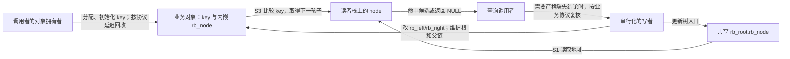
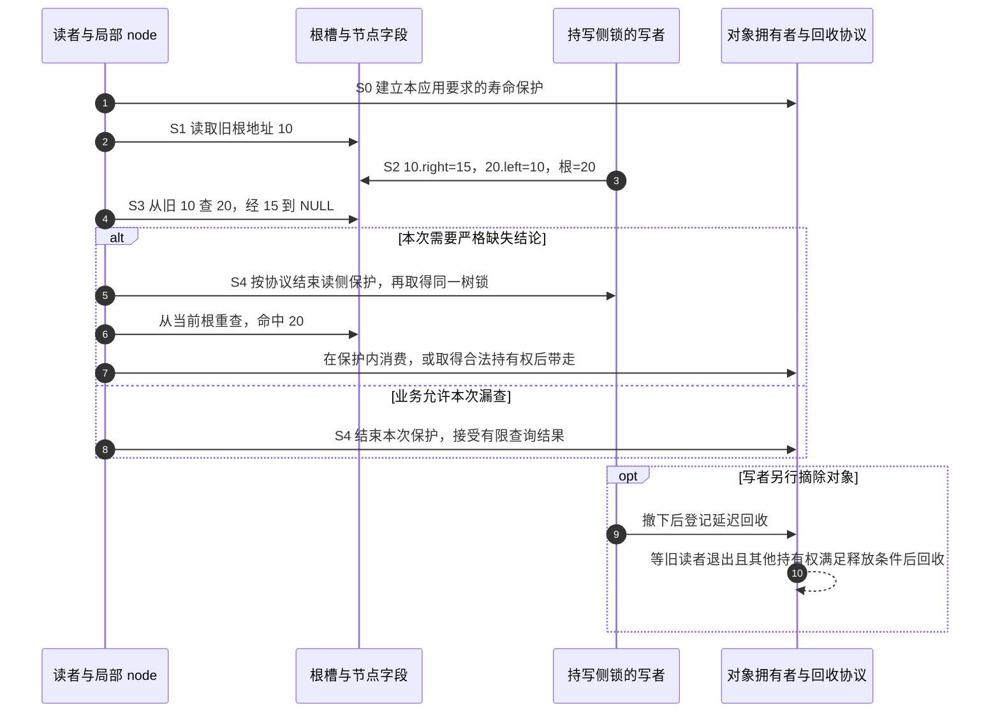
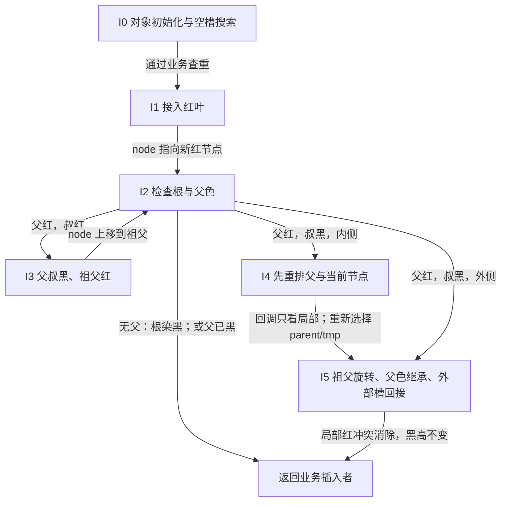

# 第10章\_Linux\_6.12\_内核\_rbtree\_查找\_插入与旋转修复

## 10.1\_章节内容说明

本章开始把视角推进到算法源码。先追踪一个具体任务：树中三个业务对象的 key 都是 10，查找应当返回哪一个？当别的执行者正在旋转时，返回 NULL 又能说明什么？把这两个问题说清楚以后，再追踪新节点如何接入并修复颜色。

### 10.1.1\_本章在\_Linux\_rbtree\_学习路线中的位置

第 8 章已经讲清楚 Linux rbtree 的基础结构：

```text
struct rb_node
struct rb_root
struct rb_root_cached
__rb_parent_color
rb_left / rb_right
RB_EMPTY_ROOT()
RB_EMPTY_NODE()
RB_CLEAR_NODE()
```

第 9 章从使用者视角讲清楚了 Linux rbtree 的工程边界：

```text
业务对象自己保存 key；
业务结构体内嵌 struct rb_node；
调用者自己写比较逻辑；
调用者自己写查找和插入落点搜索；
调用者负责对象生命周期和并发保护；
rbtree 核心只维护树结构和红黑性质。
```

本章重点不是再重复“红黑树插入有三个 case”，而是要把 Linux 6.12 的真实代码读顺：

```text
rb_find()
rb_find_first()
rb_next_match()
rb_add()
rb_find_add()
rb_link_node()
rb_insert_color()
__rb_insert()
__rb_rotate_set_parents()
```

也就是说，本章把“调用者如何找到位置”和“内核如何完成插入修复”连成一条完整路径。

------

### 10.1.2\_本章参照的源码文件

版本入口是[固定源码阅读索引](../../../../research/source_reading/rbtree/navigation/P01_Linux_6.12_rbtree源码阅读索引.md#1.1_固定提交与阅读边界)：NXP 官方 lf-6.12.20-2.0.0，提交 dfaf2136deb2af2e60b994421281ba42f1c087e0，Linux 6.12.20。目录名和本地实验提交不作为证据。查找函数的唯一函数体讲解见[查找模块导读](../../../../research/source_reading/rbtree/navigation/P02_查找路径与返回边界导读.md#2.2_按一次查找定位源码)。

本章对应以下上游文件原文：

* [include/linux/rbtree.h](../../../../research/source_reading/linux/include/linux/rbtree.h)
* [lib/rbtree.c](../../../../research/source_reading/linux/lib/rbtree.c)
* [include/linux/rbtree_augmented.h](../../../../research/source_reading/linux/include/linux/rbtree_augmented.h)

其中：

- include/linux/rbtree.h 提供：

  - rb_link_node()、

  - rb_add()、

  - rb_find_add()、

  - rb_find()、

  - rb_find_first()、

  - rb_next_match() 等接口。


- lib/rbtree.c 提供：

  - rb_insert_color()、

  - 内部 \_\_rb_insert()、

  - \_\_rb_rotate_set_parents()

  - 以及普通 rbtree 的非 augmented 包装。


- include/linux/rbtree_augmented.h 提供：

  - 提供颜色宏、
  - 父指针操作、
  - __rb_change_child() 等底层辅助函数。


阅读顺序建议如下：

```text
先看查找：
	rb_find()
	rb_find_first()
	rb_next_match()

再看插入落点：
	rb_add()
	rb_find_add()
	rb_link_node()

最后看插入修复：
	rb_insert_color()
	__rb_insert()
	__rb_rotate_set_parents()
```

这样读的好处是，先把 BST 有序路径搞清楚，再看红黑修复时，就不会把“业务排序”和“颜色旋转”混在一起。

------

## 10.2\_rbtree\_查找逻辑\_手写\_search\_与内核辅助接口

先把树固定在一个不变的时刻，追踪“业务键怎样使一次查找选择左或右”。然后允许多个对象匹配同一个查询，最后才引入查找期间发生旋转的情况；每一步只放松一个前提。

### 10.2.1\_查找逻辑为什么不在\_rbtree\_核心中实现

Linux rbtree 的核心结构是 `struct rb_node`，它只有：

```c
unsigned long __rb_parent_color;
struct rb_node *rb_right;
struct rb_node *rb_left;
```

它没有：

```text
key；
value；
compare 回调；
节点类型信息；
业务对象生命周期信息。
```

因此，rbtree 核心根本不知道两个节点谁大谁小。

查找逻辑必须由使用者提供，原因有两个。

第一，业务 key 不在 `struct rb_node` 中。

```c
struct demo_item {
	int key;
	int value;
	struct rb_node rb;
};
```

rbtree 核心只能看到 `rb`，看不到 `key`，除非使用者通过 `rb_entry()` 把 `rb_node` 还原为 `demo_item`。

第二，不同业务的排序规则不同。

排序规则可能是：

```text
单个整数 key；
地址区间起点；
结束时间；
虚拟运行时间；
复合 key；
允许重复 key 后按第二字段排序；
区间树中的区间起点。
```

如果内核 rbtree 强行提供统一 compare 回调，就会把所有使用者都拖进函数指针调用模型。Linux rbtree 的设计选择是：

```text
普通路径：使用者手写 search / insert core，直接表达业务比较；
辅助路径：rbtree.h 提供 rb_find()、rb_add() 等内联辅助接口；
rbtree 核心：只管链接、旋转、染色、遍历、替换。
```

这里没有“手写一定更快”的排序。辅助接口是内联函数，比较函数能否被内联取决于调用点和编译结果；性能还受树形、键分布和访问局部性影响。选择时先看接口能否表达业务语义，需要比较速度时再针对同一工作负载测量。

这就是第 9 章讲过的核心边界：

```text
排序语义属于调用者；
红黑树结构维护属于 rbtree。
```

------

### 10.2.2\_rb\_entry()\_如何把\_rb\_node\_还原为业务对象

查找时拿到的是 `struct rb_node *node`。

要比较 key，必须先还原业务对象：

```c
struct demo_item *item;

item = rb_entry(node, struct demo_item, rb);
```

`rb_entry()` 本质上是 `container_of()`：

```c
#define rb_entry(ptr, type, member) container_of(ptr, type, member)
```

含义是：

```text
已知：
	ptr    指向结构体内部的 rb_node 成员；
	type   外层业务结构体类型；
	member rb_node 在业务结构体中的成员名。

求：
	外层业务结构体对象地址。
```

图示如下：

```text
struct demo_item
+------------------+
| key              |
| value            |
| rb               |  <--- node 指向这里
| other fields     |
+------------------+

rb_entry(node, struct demo_item, rb)
	↓
struct demo_item *
```

所以查找函数通常长这样：

```c
static struct demo_item *demo_search(struct rb_root *root, int key)
{
	struct rb_node *node = root->rb_node;

	while (node) {
		struct demo_item *item;

		item = rb_entry(node, struct demo_item, rb);

		if (key < item->key)
			node = node->rb_left;
		else if (key > item->key)
			node = node->rb_right;
		else
			return item;
	}

	return NULL;
}
```

这一段代码里面，真正属于 rbtree 的只有：

```text
root->rb_node
node->rb_left
node->rb_right
rb_entry()
```

真正属于业务的则是：

```text
struct demo_item
item->key
key < item->key
key > item->key
```

这就是 Linux rbtree 的查找分层。

------

### 10.2.3\_如何根据\_key\_决定进入左子树或右子树

rbtree 首先是一棵 BST。

BST 的查找规则是：

```text
目标 key 小于当前节点 key：
	进入左子树。

目标 key 大于当前节点 key：
	进入右子树。

目标 key 等于当前节点 key：
	查找成功。
```

在 Linux rbtree 中，这个判断不由核心完成，而是由业务代码完成。

例如：

```c
if (key < item->key)
	node = node->rb_left;
else if (key > item->key)
	node = node->rb_right;
else
	return item;
```

这段代码的关键不在写法，而在不变量：

```text
查找的左/右判断必须与建树时建立的中序次序相容。
```

如果插入时按 `item->key`，查找时也必须按 `item->key`。

如果要查找完整的 `(start, end)`，就按建树所用的字典序比较两个字段。也可以只查询 start：按 start 分组的节点在这个中序顺序中连续，因此查找较小 start 向左、较大 start 向右仍然成立；相等时返回某个成员，或者用下文的 first/next 枚举整个组。

不能随意改成只按 end 剪枝。例如中序为 `(1, 100)、(2, 5)、(3, 50)`，end 的 100、5、50 并不有序。从根 `(2, 5)` 按 end=100 向右，会错过左侧已有的目标。关键是查询比较能否正确排除整棵子树，而不是比较函数是否逐字相同。

红黑树修复只能保证：

```text
旋转后中序顺序不变；
红黑性质恢复；
树高受控。
```

它不能修复业务比较规则写错的问题。

错误示例：

```text
插入按 address 排序；
查找按 size 排序；
删除按 id 定位。
```

这会导致：

```text
节点明明存在却查不到；
删除定位错误；
中序遍历不符合业务期望；
rb_erase() 可能摘错树上的节点。
```

------

### 10.2.4\_查找成功与查找失败的返回语义

普通查找通常有两种返回方式。

第一种，返回业务对象：

```c
struct demo_item *demo_search(struct rb_root *root, int key);
```

查找成功返回 `struct demo_item *`，失败返回 `NULL`。

第二种，返回 `struct rb_node *`：

```c
struct rb_node *rb_find(const void *key,
                        const struct rb_root *tree,
                        int (*cmp)(const void *key, const struct rb_node *));
```

`rb_find()` 是 `rbtree.h` 中提供的辅助接口。它仍然需要调用者提供 `cmp()`，只是把 while 循环封装起来。

`rb_find()` 的核心逻辑可以概括成：

```c
node = tree->rb_node;

while (node) {
	c = cmp(key, node);

	if (c < 0)
		node = node->rb_left;
	else if (c > 0)
		node = node->rb_right;
	else
		return node;
}

return NULL;
```

注意返回的是 `struct rb_node *`。

如果调用者需要业务对象，应先区分未找到；普通 `rb_entry()` 不替你处理空指针：

```c
item = node ? rb_entry(node, struct demo_item, rb) : NULL;
```

这里还没有取得额外引用。若返回后要离开锁或 RCU（Read-Copy Update，读—复制—更新）的读侧保护区，必须按该对象的寿命协议保留引用或复制数据，不能只带走裸指针。这里用到的是它让旧读者完成访问后再回收对象的寿命职责，具体读侧模型在下文链接的 RCU 专题中建立。

这里有一个工程取舍：

```text
手写 search：
	可以直接返回业务对象；
	可以内联业务比较；
	最贴近具体场景；
	代码重复更多。

rb_find()：
	封装查找循环；
	需要 cmp 回调；
	返回 rb_node；
	适合比较规则已经函数化的场景。
```

------

### 10.2.5\_重复\_key\_场景下为什么普通查找不一定够用

如果树中不允许重复 key，普通查找足够：

```text
key 相等：
	返回当前节点。
```

但如果允许多个节点具有相同 key，就必须先定义“相等节点”的组织方式。

常见策略有三种：

```text
第一，不允许重复 key。
	插入时发现相等就返回 -EEXIST，表示对象已存在。

第二，允许重复 key，并约定相等节点统一插到右侧。
	中序遍历时相等节点会形成一段连续区间。

第三，使用复合 key。
	先按主 key 排序；
	主 key 相等后按 secondary key 排序；
	按复合字段区分业务身份；仍须决定完整复合键相等时拒绝还是保留多个对象。
```

“相等插右侧”只决定 **本次插入的落点**。设相同 key 的 A、B、C 依次接成右链，对 A 左旋后 B 升到根，A 在 B 的左侧，C 在右侧；中序仍为 A、B、C。旋转保持的是非递减键序，不是“相等者永远只在右边”。所以遇到相等以后，左侧也可能还有相等成员。

普通 `rb_find()` 在重复 key 场景下只保证找到某个匹配节点，不保证是第一个。上面旋转后的树会先命中 B；如果要第一个，应找到 A，而不是把 B 误当成插入最早或唯一的对象。

所以 `rbtree.h` 还提供了：

```text
rb_find_first()
rb_next_match()
rb_for_each()
```

这组接口用于处理“同一个 key 对应多个节点”的场景。

------

### 10.2.6\_rb\_find\_first()\_rb\_next\_match()\_与\_rb\_for\_each()\_的语义

`rb_find_first()` 的目标是：

```text
找到 key 匹配区间中最左边的那个节点。
```

它的逻辑和普通查找不同。

普通查找遇到相等就返回：

```c
c == 0:
	return node;
```

`rb_find_first()` 遇到相等时不会马上返回，而是先记录 `match`，然后继续向左找：

```c
if (c <= 0) {
	if (!c)
		match = node;
	node = node->rb_left;
}
```

这表示：

```text
当前节点已经匹配；
但是左子树里可能还有更靠前的匹配节点；
所以先保存当前 match，再继续向左。
```

最后返回 `match`。

`rb_next_match()` 则从当前匹配节点开始：

```text
先调用 rb_next(node) 找中序后继；
再用 cmp(key, node) 判断后继是否仍然匹配；
如果匹配，返回后继；
如果不匹配，返回 NULL。
```

`rb_for_each()` 是宏封装：

```text
先 rb_find_first()；
再不断 rb_next_match()。
```

这组接口成立的前提是：

```text
相同 key 的节点在中序顺序中必须是连续的一段。
```

如果插入规则破坏了这个连续性，`rb_find_first()` 和 `rb_next_match()` 的语义就不可靠。

`rb_for_each()` 它适合这种树：

```text
中序顺序：

key=10, id=A
key=10, id=B
key=10, id=C
key=20, id=D
key=30, id=E
```

查询 `key=10` 时，`rb_for_each()` 等价于：

```text
rb_find_first(10)    -> key=10, id=A
rb_next_match(10,A) -> key=10, id=B
rb_next_match(10,B) -> key=10, id=C
rb_next_match(10,C) -> NULL，因为下一个是 key=20
```

所以它的工程语义是：

```text
遍历某个 key 对应的一组等价节点
```

不是：

```text
遍历所有节点
```

遍历所有节点还是用：

```c
for (node = rb_first(&root); node; node = rb_next(node)) {
	...
}
```

Linux rbtree 文档里也把 `rb_first()`、`rb_last()`、`rb_next()`、`rb_prev()` 归为“按排序顺序遍历整棵树”的接口。

------

### 10.2.7\_rb\_find\_rcu()\_的边界

前面的查询先假定树在查找期间保持稳定。现在让一个写者与读者交错：读者已经把根 10 存入局部变量，写者把 20 旋到根。读者手里的地址仍然是 10，10 的右孩子却已经改成中间子树 15。它查询 20 时走到 15，再走到空指针；20 从未删除，读者仍可能报告未找到。

这就是 **假阴性**：目标存在，本次查询却返回不存在。原因不是比较错了，而是这条查询路径由不同时刻的树边拼成；整次查找没有得到一个稳定快照。

`rb_find_rcu()` 在向下读取孩子时使用：

```c
rcu_dereference_raw(node->rb_left)
rcu_dereference_raw(node->rb_right)
```

但固定版函数的首次取根仍写成 `node = tree->rb_node`。不能把它描述成“每次读取都自动带 RCU 保护”；它既不进入读侧临界区，也不获取锁、增加引用、检查业务对象有效性或替调用者确认根入口的发布协议。具体语句见[rb_find_rcu 实现](../../../../research/source_reading/rbtree/source_explanations/include/linux/rbtree.h.md#1.4_rb_find_rcu的孩子读取与缺失边界)。

源码还要求两件独立的事：孩子指针写入使用 `WRITE_ONCE()`，以及旋转的写入顺序不在程序顺序中构造临时环。后者不能从前者自动推出。对于 10→20 的边，如果先把 20.left 指回 10，却还没有撤去 10.right→20，查询 15 会在 10 和 20 之间反复往返；哪怕两次赋值都标上 `WRITE_ONCE()`，这个结构环仍存在。正确写序先把 10.right 改为中间子树，再建立 20.left→10。

这项设计保住的是 **沿左右孩子向下搜索的有限路径**，并不让整个旋转原子化，也不保证看到全部子树。源码注释还明确将父指针更新排除在这项论证之外；`rb_next()` 会沿父链上行，不能据此声称并发 `rb_for_each()` 也安全。



节点字段是共享状态，`node`、比较结果和匹配候选是读者局部状态。这里没有一个由 rbtree 维护的“旋转完成”通知，也没有查找自动重试计数。调用者若需要严格的“确实不存在”，可以用与写者相同的锁重新搜索；是否允许直接接受假阴性，要由业务语义决定。

把一次查询按 S0～S4 串起来，才能看清路径与寿命是两件事：



图中的锁复核和寿命交接是 **调用者方案**，不是 `rb_find_rcu()` 的内置动作。尤其不要在不能睡眠的 RCU 读区里照抄“取得任意锁”；按锁类型和上下文安排退出、重新加锁及重新搜索。RCU 的保护细节沿用[RCU 权威路线](../../synchronization_and_asynchrony/synchronization/rcu/大纲.md)，本节只定位 rbtree 留给调用者的责任。

“若返回节点则匹配正确”也有前提：比较规则与键值稳定、相关字段已正确发布、节点仍然活着。它不表示函数替你延长了寿命，更不表示对象离开保护后仍有效。需要最容易推理的强查询时，先用锁覆盖完整操作；只有读侧确实允许上述返回边界、且有完整发布与回收协议时，才考虑这种弱查询路径。

------

### 10.2.8\_手写\_search\_与\_rb\_find*()\_辅助接口的取舍

可以把查找接口分成两层：

```text
第一层：传统手写 search。
	业务代码完全控制比较、返回对象、锁和生命周期。

第二层：rbtree.h 辅助接口。
	内核提供查找循环；
	调用者提供 cmp；
	接口返回 rb_node。
```

选择手写 search 的理由：

```text
需要返回业务对象；
比较逻辑很短；
不希望引入函数指针；
需要在查找过程中做额外业务判断；
需要严格控制锁和引用计数。
```

选择 `rb_find*()` 的理由：

```text
比较逻辑已经抽象为 cmp；
需要复用统一查找模板；
需要处理重复 key 的第一个匹配节点；
需要使用 rb_for_each() 遍历同 key 节点。
```

无论选择哪种方式，都必须守住同一个底线：

```text
查找的剪枝必须与插入建立的中序次序相容。
```

------

### 10.2.9\_本节小结

本节把 Linux rbtree 的查找逻辑固定成以下几点：

```text
第一，rbtree 核心不知道 key，所以查找逻辑属于调用者。

第二，查找时必须通过 rb_entry() 从 rb_node 还原业务对象。

第三，查找路径本质上仍然是 BST 路径。

第四，rb_find() 只是辅助封装，不改变调用者负责比较规则这个事实。

第五，重复 key 场景要使用 rb_find_first()、rb_next_match() 或业务自定义规则。

第六，rb_find_rcu() 不是完整无锁容器，它可能在并发旋转中出现 false negative。
```

------

### 10.2.10\_用完整C程序观察相等节点和旧路径

先预测三个结果：相等节点左旋后谁位于左侧；从旧根查询新根的 key 会不会漏掉；故意把撤边与反接颠倒，查询中间值会怎样。下面使用全部存活的自动对象，把读写事件 **串行重放**，不创建线程，也不让普通 C 指针发生数据竞争。它是查找路径模型，不是可替代 Linux rbtree 的实现：没有颜色修复、父指针、RCU 或内存屏障。

```c
#include <stdio.h>

/* 只保存本次观察所需的向下连接，不模拟 Linux 颜色或父指针。 */
struct lookup_node {
    int key;
    char tag;
    struct lookup_node *left;
    struct lookup_node *right;
};

static struct lookup_node *find_any(struct lookup_node *node, int key)
{
    while (node) {
        if (key < node->key)
            node = node->left;
        else if (key > node->key)
            node = node->right;
        else
            return node;
    }
    return NULL;
}

static struct lookup_node *find_first(struct lookup_node *node, int key)
{
    struct lookup_node *match = NULL;

    while (node) {
        if (key <= node->key) {
            if (key == node->key)
                match = node;
            node = node->left;
        } else {
            node = node->right;
        }
    }
    return match;
}

/* 调用者保证存在右孩子；三个普通写入只在这个串行模型中执行。 */
static void rotate_left(struct lookup_node **root)
{
    struct lookup_node *old = *root;
    struct lookup_node *up = old->right;
    struct lookup_node *middle = up->left;

    old->right = middle; /* 先撤去旧的向上路径。 */
    up->left = old;      /* 再建立反向父子连接。 */
    *root = up;
}

/* 只用于故意造环的实验：到达预算时停止，绝不挂住终端。 */
static struct lookup_node *find_bounded(struct lookup_node *node, int key,
                                        unsigned int budget, int *exhausted)
{
    *exhausted = 0;
    while (node && budget) {
        --budget;
        if (key == node->key)
            return node;
        node = key < node->key ? node->left : node->right;
    }
    *exhausted = node != NULL;
    return NULL;
}

int main(void)
{
    struct lookup_node a = {10, 'A', NULL, NULL};
    struct lookup_node b = {10, 'B', NULL, NULL};
    struct lookup_node c = {10, 'C', NULL, NULL};
    struct lookup_node x = {10, 'X', NULL, NULL};
    struct lookup_node middle = {15, 'M', NULL, NULL};
    struct lookup_node y = {20, 'Y', NULL, NULL};
    struct lookup_node *root = &a;
    struct lookup_node *saved;
    struct lookup_node *any;
    struct lookup_node *first;
    int exhausted;

    a.right = &b;
    b.right = &c;
    rotate_left(&root);
    any = find_any(root, 10);
    first = find_first(root, 10);
    printf("equal: root=%c left=%c any=%c first=%c\n",
           root->tag, root->left->tag,
           any ? any->tag : '-', first ? first->tag : '-');

    x.right = &y;
    y.left = &middle;
    root = &x;
    saved = root; /* 模拟读者已经取走旧根，随后写者完成旋转。 */
    rotate_left(&root);
    printf("stale: saved=%d current=%d miss=%d current_hit=%d\n",
           saved->key, root->key, find_any(saved, 20) == NULL,
           find_any(root, 20) == &y);

    /* 重置后故意先反接：X.right 仍是 Y，而 Y.left 已经变为 X。 */
    x.right = &y;
    y.left = &middle;
    root = &x;
    y.left = &x;
    (void)find_bounded(root, 15, 6, &exhausted);
    printf("bad_order: budget_exhausted=%d cycle=%d\n",
           exhausted, x.right == &y && y.left == &x);

    /* 补上撤边和根更新；所有对象在 main 返回前一直存活。 */
    x.right = &middle;
    root = &y;
    printf("repaired: middle_hit=%d\n", find_any(root, 15) == &middle);
    return 0;
}
```

完整材料为[lookup_paths.c](../../../../labs/kernel/tree_basics/materials/lookup_paths.c)。在仓库根目录执行；`cc` 为支持 C11 的编译器，程序只依赖标准库：

```bash
cc -std=c11 -Wall -Wextra -Werror -pedantic \
  labs/kernel/tree_basics/materials/lookup_paths.c -o lookup_paths
./lookup_paths
```

输出应为：

```text
equal: root=B left=A any=B first=A
stale: saved=10 current=20 miss=1 current_hit=1
bad_order: budget_exhausted=1 cycle=1
repaired: middle_hit=1
```

第一行同时观察任意匹配和最左匹配。第二行不是释放后访问：旧根 10 一直存活，只是它不再能向下到达新根 20。第三行用六步预算让错误路径安全停止；循环来自 10.right→20 与 20.left→10，两条边的地址可以直接核对。第四行先补上撤边再更新根，查询 15 恢复正常。三个现象都不需要弱内存序才能出现，因此“只要加屏障就解决一切”解释不了它们。

`find_bounded()` 是演示防挂措施；预算耗尽只说明这次还未结束，并不是通用判环算法。足够长的合法路径也可能用完预算。Linux 的 `rb_find*` 没有这里的六步上限，不能把它当成内核自动检测坏树的证据。

试着修改程序，再解释观察：

1. 把三个相等键改为 10、20、30，查询 20。旋转后任意匹配和最左匹配都为 B；多个返回结果来自等价类，而非 first 额外改变树形。
2. 第二段从旧 10 查询 15，会命中 M；旧入口并非必然查不到任何东西。查询 20 的失败不能推出“整棵旧子树失效”。
3. 在坏写序的中间态查询 10 或 20，会提前命中。只用这些测试键不能排除结构环；15 才会在两条相反方向的边之间往返。
4. 若业务要确认“key=20 不存在才插入”，能直接根据旧路径的 NULL 插入吗？不能。应在与写者一致的保护下重新查重并插入，否则会把弱查询的漏查变成重复对象。

这一单元已经区分返回值与查询承诺。下一节保留同一业务比较规则，改为寻找一个可以写入的新节点槽；旋转和染色在接入之后发生。

## 10.3\_rbtree\_插入前半段\_搜索落点与\_rb\_link\_node()

搜索已经给出了“去左边还是右边”，现在把最后的空指针保存为可写的槽地址。普通路径先接入红叶，再修复颜色；完整接口讲解见[红叶挂接与发布](../../../../research/source_reading/rbtree/source_explanations/include/linux/rbtree.h.md#1.5_红叶挂接与发布)，源码位置与阶段关系见[插入模块导读](../../../../research/source_reading/rbtree/navigation/P03_红叶接入与冲突修复导读.md#3.2_一轮插入怎样推进)。下面逐步解释两个局部变量怎样把比较结果变成共享树中的一条边。

### 10.3.1\_插入为什么先按\_BST\_规则搜索落点

红黑树插入分成两段：

```text
第一段：按 BST 规则把新节点挂到叶子位置。
第二段：修复可能出现的红黑性质破坏。
```

Linux rbtree 对这两段的分工非常清楚：

```text
调用者负责：
	搜索插入落点；
	确定 parent；
	确定 link；
	处理重复 key。

rbtree 核心负责：
	rb_link_node() 挂接；
	rb_insert_color() 修复。
```

这意味着插入修复不是从“一个孤立节点”开始的，而是从“已经挂到 BST 正确位置的新节点”开始。

如果新节点位置放错，后面的旋转和染色也救不回来。

因为旋转只保持已有中序关系，不会重新理解业务 key。

------

### 10.3.2\_struct\_rb\_node\_link\_的二级指针意义

插入搜索时常见写法是：

```c
struct rb_node **link = &root->rb_node;
struct rb_node *parent = NULL;

while (*link) {
	parent = *link;

	if (new_key < this_key)
		link = &parent->rb_left;
	else if (new_key > this_key)
		link = &parent->rb_right;
	else
		return -EEXIST;
}
```

这里 `link` 的类型是：

```c
struct rb_node **link;
```

它不是当前节点，而是“指向当前节点指针字段的地址”。

刚开始：

```c
link = &root->rb_node
```

如果向左走：

```c
link = &parent->rb_left
```

如果向右走：

```c
link = &parent->rb_right
```

当循环结束时：

```text
*link == NULL
```

这说明 `link` 正好指向应该挂入新节点的位置：

```text
可能是 root->rb_node；
可能是某个 parent->rb_left；
可能是某个 parent->rb_right。
```

因此 `rb_link_node()` 只需要：

```c
*rb_link = node;
```

就能把新节点接到正确位置。

------

### 10.3.3\_parent\_指针在插入搜索中的作用

`parent` 记录的是新节点最终父节点。

当 `*link == NULL` 时：

```text
parent 是最后一个非空节点；
link 是 parent 的某个孩子指针地址；
新节点应该成为 parent 的左孩子或右孩子。
```

空树时：

```c
root->rb_node == NULL
link = &root->rb_node
parent = NULL
```

新节点会成为根节点。

非空树时：

```text
parent != NULL
link == &parent->rb_left 或 &parent->rb_right
```

新节点会成为 `parent` 的孩子。

`rb_link_node()` 需要 `parent`，是因为新节点的 `__rb_parent_color` 要初始化为父指针。

源码逻辑是：

```c
node->__rb_parent_color = (unsigned long)parent;
node->rb_left = node->rb_right = NULL;
*rb_link = node;
```

这里颜色位没有显式加 `RB_RED`，因为 `RB_RED` 的值是 0。

所以：

```text
node->__rb_parent_color = parent + 0
```

等价于：

```text
新节点父指针是 parent；
新节点颜色是红色。
```

这和红黑树插入理论一致：

```text
新插入节点先按红色处理。
```

------

### 10.3.4\_rb\_link\_node()\_的接口语义

`rb_link_node()` 只做三件事：

```text
设置新节点父指针和颜色；
清空新节点左右孩子；
把新节点挂到 link 指向的位置。
```

它不做这些事：

```text
不比较 key；
不判断重复；
不查找插入位置；
不修复红黑性质；
不加锁；
不分配内存；
不维护业务计数；
不维护 cached leftmost；
不维护 augmented 信息。
```

因此插入最小闭环是：

```c
rb_link_node(&item->rb, parent, link);
rb_insert_color(&item->rb, root);
```

这两句不能颠倒，也不能缺其中任何一句。

如果只调用 `rb_link_node()`：

```text
新节点已经进入 BST；
但红黑性质可能已经坏掉。
```

如果没有先调用 `rb_link_node()` 就调用 `rb_insert_color()`：

```text
node 尚未正确接入树；
parent / root / 颜色上下文不成立。
```

------

### 10.3.5\_rb\_link\_node\_rcu()\_与\_RCU\_发布顺序

`rb_link_node_rcu()` 和 `rb_link_node()` 的区别在最后一步：

```c
rcu_assign_pointer(*rb_link, node);
```

普通版本是：

```c
*rb_link = node;
```

RCU 版本的含义是：

```text
先初始化 node 的父指针、左右孩子等字段；
再用 RCU 发布语义把 node 挂到树上。
```

这样 RCU 读者通过孩子指针看到新节点时，应该能看到该节点之前已经初始化好的字段。

但是仍然要注意：

```text
rb_link_node_rcu() 只处理链接发布；
它不解决多个写者并发插入；
它不解决删除后的对象释放；
它不让旋转变成原子操作。
```

所以 RCU 插入仍然需要写侧同步，读侧也要服从 RCU 生命周期规则。

------

### 10.3.6\_rb\_add()\_rb\_find\_add()\_与\_rb\_find\_add\_rcu()\_的封装边界

`rbtree.h` 提供了几个辅助插入接口。

`rb_add()` 的语义是：

```text
按 less() 找到落点；
不处理重复 key；
相等或不小于时走右侧；
挂接后调用 rb_insert_color()。
```

它适合：

```text
调用者已经允许重复；
或者调用者已按自己的身份规则保证本次不重复；
不需要发现等价节点。
```

`rb_find_add()` 的语义是：

```text
按 cmp() 查找等价节点；
如果找到等价节点，返回已有节点；
如果没有找到，挂接新节点并修复；
插入成功返回 NULL。
```

也就是说：

```text
返回非 NULL：
	插入失败，因为已有等价节点。

返回 NULL：
	没有等价节点，新节点已经插入。
```

`rb_find_add_rcu()` 则在挂接时使用 `rb_link_node_rcu()`。

这三个辅助接口都没有改变一个事实：

```text
比较规则仍然由调用者提供。
```

它们只是把搜索落点和挂接修复封装到同一个内联函数里。

------

### 10.3.7\_rb\_link\_node()\_与普通\_BST\_插入的对应关系

普通 BST 插入可以分成：

```text
查找空孩子位置；
设置新节点父指针；
设置新节点左右孩子为空；
父节点孩子指针指向新节点。
```

Linux rbtree 中：

```text
查找空孩子位置：
	调用者 while 循环维护 parent 和 link。

设置新节点父指针：
	rb_link_node() 写 __rb_parent_color。

设置新节点左右孩子为空：
	rb_link_node() 写 rb_left / rb_right。

父节点孩子指针指向新节点：
	rb_link_node() 写 *rb_link = node。
```

差异在于颜色：

```text
普通 BST 没有颜色；
Linux rbtree 的新节点通过 __rb_parent_color 低位自然成为红色。
```

所以 `rb_link_node()` 可以理解为：

```text
把一个“红色新节点”挂到 BST 叶子位置。
```

------

### 10.3.8\_本节小结

本节固定以下结论：

```text
第一，插入修复之前必须先完成 BST 挂接。

第二，link 是指向“应该写入新节点的孩子指针”的二级指针。

第三，parent 是新节点的父节点。

第四，rb_link_node() 只挂接，不修复。

第五，rb_link_node() 默认把新节点初始化为红色。

第六，rb_add()、rb_find_add() 是辅助封装，不改变调用者负责比较规则这个事实。
```

------

## 10.4\_rbtree\_插入后半段\_rb\_insert\_color()\_与插入修复

接入红叶以后，路径黑数没有增加；现在只需解决根为红或红父红子的冲突。先沿下文的案例推演，再到[完整固定实现](../../../../research/source_reading/rbtree/source_explanations/lib/rbtree.c.md#1.3_插入修复的两侧分支)对照实际变量和写入。该实现保留本章原中文注释与图形，并按官方固定提交保留 WRITE_ONCE、tmp 复用及左右分支；父色写入另见[打包接口](../../../../research/source_reading/rbtree/source_explanations/include/linux/rbtree_augmented.h.md#1.1_父色打包写入)。

`__rb_insert()` 的入口前提是：**节点已经被 `rb_link_node()` 挂进树里**。它不负责查找插入位置、不负责比较 key、不负责处理重复 key，只负责把“插入红节点后可能破坏的红黑树性质”修回来。Linux 文档也明确说明，rbtree 的插入位置查找和锁保护由使用者自己负责，核心库只提供链接、着色、旋转等基础操作。

最核心的不变量是：

```text
node 一定是红色。
```

所以插入修复只围绕一个问题：

```text
node 是红色；
parent 如果也是红色，就违反“红节点不能有红孩子”。
```

也就是典型的红红冲突。

### 10.4.1\_rb\_insert\_color()\_的对外语义

普通插入收尾调用：

```c
rb_insert_color(node, root);
```

它的对外语义是：

```text
node 已经通过 rb_link_node() 挂入 root；
node 当前按红色节点处理；
rb_insert_color() 从 node 开始向上修复；
修复结束后，整棵树重新满足红黑性质。
```

它不负责：

```text
搜索插入位置；
判断重复 key；
维护业务字段；
维护锁；
维护对象生命周期。
```

普通包装将 node、root 和空旋转回调传给内部核心，函数体只在[普通与增广入口](../../../../research/source_reading/rbtree/source_explanations/lib/rbtree.c.md#1.4_普通与增广入口)展开。这里继续区分这个短包装与它调用的完整修复过程。

这里 `dummy_rotate` 是普通 rbtree 的空增强回调。

增强树版本会把真实 `augment_rotate` 传进去。

所以真正的插入修复核心是：

```text
__rb_insert()
```

------

### 10.4.2\_rb\_insert\_color()\_与内部\_rb\_insert()\_的关系

Linux rbtree 把插入修复写成：

```text
外层接口：
	rb_insert_color()
	__rb_insert_augmented()

内部核心：
	__rb_insert(node, root, augment_rotate)
```

普通 rbtree：

```c
augment_rotate = dummy_rotate
```

增强 rbtree：

```text
augment_rotate = 用户提供的 rotate 回调
```

这样普通树和增强树共享同一份旋转染色逻辑。

差别只在：

```text
旋转后是否需要更新增强信息。
```

这就是为什么 `__rb_insert()` 的参数里有：

```c
void (*augment_rotate)(struct rb_node *old, struct rb_node *new)
```

代码在每次局部旋转的规定位置调用：

```c
augment_rotate(old, new);
```

普通树中它什么都不做。

增强树中它会修正子树增强字段。但“调用回调”不等于整个树已经恢复一致：内侧 Case 2 调用时，祖父的孩子槽与上移节点的父色尚未完全回接。它紧接着还要进入 Case 3；回调必须遵守局部聚合更新契约，不能沿父链随意遍历或通知其他任务插入已完成。

------

### 10.4.3\_插入修复循环的不变量

`__rb_insert()` 一开始取：

```c
struct rb_node *parent = rb_red_parent(node), *gparent, *tmp;
```

这里有一个很关键的点：

```text
rb_red_parent(node) 只有在 node 是红色时才适合这样取父指针。
```

因为新插入节点是红色，`__rb_parent_color` 低位为 0，直接强转就等价于父指针。

循环中的注释给出不变量：

```text
Loop invariant: node is red.
```

这句话解释了后面为什么可以直接从打包字段取父地址；每次叔红上推都会先把新的 node 染红，读者可以沿 continue 前的赋值自行检查它仍成立。

整个插入修复围绕这个不变量展开：

```text
当前 node 是红色；
如果 parent 是黑色，红黑性质没有破坏；
如果 parent 是红色，就出现红红冲突；
修复红红冲突时，可能把 gparent 染红并继续向上；
继续向上时，新的 node 仍然是红色。
```

所以循环的核心不是“从插入点一直向上扫”，而是：

```text
只要当前红色 node 和它的红色 parent 形成冲突，就处理。
```

------

### 10.4.4\_为什么新插入节点按红色处理

插入一个节点有两种直觉选择：

```text
插成黑色；
插成红色。
```

如果插成黑色，会立刻增加某些路径的黑高。

这会破坏性质 5：

```text
从任一节点到所有 NULL 叶子的黑节点数量相同。
```

黑高变化会向上影响很多祖先。

如果插成红色，则不会增加任何路径黑高。

除空树插入还需把新根变黑以外，可能破坏的是性质 4：

```text
红节点不能有红孩子。
```

也就是只可能出现：

```text
parent red
node red
```

这个冲突通常可以通过局部染色和旋转修复。

Linux rbtree 的 `rb_link_node()` 正好利用 `RB_RED == 0`：

```text
node->__rb_parent_color = parent
```

低位颜色自然就是红色。

------

### 10.4.5\_父节点为空和父节点为黑的快速结束路径

`__rb_insert()` 先处理根节点场景：

```c
if (!parent) {
	rb_set_parent_color(node, NULL, RB_BLACK);
	break;
}
```

含义是：

```text
如果新节点没有父节点，它就是根；
根必须是黑色；
设置为黑色后结束。
```

这覆盖两种情况：

```text
第一，插入的是空树中的第一个节点。

第二，Case 1 染色后把 gparent 当成新的 node 向上推进，
     最后推进到了根。
```

接着处理父节点为黑：

```c
if (rb_is_black(parent))
	break;
```

含义是：

```text
node 是红色；
parent 是黑色；
没有红红冲突；
插入红色节点没有改变黑高；
修复结束。
```

所以真正进入 case 分析的前提是：

```text
parent 是红色。
```

此时一定存在祖父节点。

原因是：

```text
根节点必须是黑色；
parent 是红色；
所以 parent 不可能是根；
因此 parent 一定有 gparent。
```

源码直接使用：

```c
gparent = rb_red_parent(parent);
```

------

### 10.4.6\_左侧\_case\_的入口判断

源码先取：

```c
tmp = gparent->rb_right;
if (parent != tmp) {
	/* parent == gparent->rb_left */
	...
}
```

这段判断看起来绕，但含义是：

```text
tmp 是 gparent 的右孩子；
如果 parent 不是右孩子；
那么 parent 就是 gparent 的左孩子。
```

也就是进入左侧 case：

```text
        G
       / \
      p   u
     /
    n
```

这里：

```text
gparent = G
parent  = p
tmp     = u，也就是 uncle
node    = n
```

如果 `parent == tmp`，则说明 parent 是右孩子，进入镜像 case。

Linux 源码把左侧和右侧镜像都展开写了，没有抽象成统一函数。

从读代码的角度可以直接看到：

```text
左侧分支直接写左旋和右旋所需的字段；
右侧分支给出镜像字段；
不需要在一个通用旋转函数中另解方向参数。
```

代价是：

```text
源码阅读时要手动对照左右镜像。
```

这说明的是当前实现组织方式，不是在没有对照构建和测量的情况下证明它更快；实际机器码、回调是否内联及成本仍受编译配置影响。

------

### 10.4.7\_Case\_1\_父红叔红\_染色并向上推进

左侧 case 中，`tmp = gparent->rb_right` 表示叔叔节点。

如果：

```text
tmp 存在；
tmp 是红色；
```

就是父红叔红。

结构如下：

```text
      G(B)
     /    \
   p(R)  u(R)
   /
 n(R)
```

修复动作：

```text
p 染黑；
u 染黑；
G 染红；
把 G 当成新的 node，继续向上修复。
```

源码对应：

```c
rb_set_parent_color(tmp, gparent, RB_BLACK);
rb_set_parent_color(parent, gparent, RB_BLACK);
node = gparent;
parent = rb_parent(node);
rb_set_parent_color(node, parent, RB_RED);
continue;
```

为什么要继续？

因为 G 被染红以后，可能和 G 的父节点形成新的红红冲突。

从 2-3-4 树视角看，这相当于：

```text
4-node 分裂；
中间 key 上推；
如果父逻辑节点也满了，就继续向上分裂。
```

所以 Case 1 是唯一会继续循环的插入 case。

------

### 10.4.8\_Case\_2\_父红叔黑且当前节点是内侧孩子

左侧 case 中，叔叔不是红色后，源码取：

```c
tmp = parent->rb_right;
if (node == tmp) {
	...
}
```

这表示：

```text
parent 是 gparent 的左孩子；
node 是 parent 的右孩子。
```

结构是 LR：

```text
      G
     /
    p
     \
      n
```

这是内侧孩子。

Case 2 的目标不是一步完成修复，而是先把 LR 转成 LL。

动作是：

```text
围绕 parent 左旋；
让 node 上来；
让 parent 变成 node 的左孩子；
然后落入 Case 3。
```

源码对应：

```c
tmp = node->rb_left;
WRITE_ONCE(parent->rb_right, tmp);
WRITE_ONCE(node->rb_left, parent);
if (tmp)
	rb_set_parent_color(tmp, parent, RB_BLACK);
rb_set_parent_color(parent, node, RB_RED);
augment_rotate(parent, node);
parent = node;
tmp = node->rb_right;
```

这里最容易迷糊的是 `tmp`。

在旋转前：

```c
tmp = node->rb_left
```

它是 node 的左子树。

左旋 parent 后，这棵子树会变成 parent 的右子树。

所以：

```c
parent->rb_right = tmp
node->rb_left = parent
```

然后：

```c
parent = node
tmp = node->rb_right
```

这是为了把局部结构转换成 Case 3 期待的变量状态。

------

### 10.4.9\_Case\_3\_父红叔黑且当前节点是外侧孩子

Case 3 处理外侧结构。

左侧 case 中外侧结构是 LL：

```text
        G
       / \
      p   U
     /
    n
```

修复动作：

```text
围绕 G 右旋；
p 成为局部子树根；
G 成为 p 的右孩子；
p 继承 G 原来的父节点和颜色；
G 被染红。
```

源码：

```c
WRITE_ONCE(gparent->rb_left, tmp);
WRITE_ONCE(parent->rb_right, gparent);
if (tmp)
	rb_set_parent_color(tmp, gparent, RB_BLACK);
__rb_rotate_set_parents(gparent, parent, root, RB_RED);
augment_rotate(gparent, parent);
break;
```

这里 `tmp` 表示：

```text
parent->rb_right
```

右旋后，它会成为 `gparent->rb_left`。

`__rb_rotate_set_parents(gparent, parent, root, RB_RED)` 是公共收尾：

```text
old = gparent
new = parent
new 继承 old 原来的父节点和颜色；
old 的父节点改成 new；
old 的颜色改成 RB_RED；
old 在原父节点那里的孩子位置改成 new。
```

Case 3 修复后可以直接结束。

原因是：

```text
局部红红冲突已经消除；
局部根 parent 继承 gparent 原来的颜色；
黑高保持一致；
不需要继续向上。
```

------

### 10.4.10\_右侧\_mirror\_case

右侧 case 是左侧的镜像。

进入条件是：

```c
parent == gparent->rb_right
```

此时叔叔是：

```c
tmp = gparent->rb_left
```

三种情况镜像为：

```text
Case 1：
	父红叔红，染色并向上推进。

Case 2：
	parent 是右孩子，node 是 parent 的左孩子；
	这是 RL；
	先围绕 parent 右旋，变成 RR。

Case 3：
	parent 是右孩子，node 是 parent 的右孩子；
	这是 RR；
	围绕 gparent 左旋并结束。
```

只看孩子边的方向，镜像关系可记为下表。它刻意省略父色、外部槽和访问形式，不是可执行的上游函数体；完整语句见[固定插入实现](../../../../research/source_reading/rbtree/source_explanations/lib/rbtree.c.md#1.3_插入修复的两侧分支)。

```text
Case 2：
	parent->rb_left = tmp;
	node->rb_right = parent;

Case 3：
	gparent->rb_right = tmp;
	parent->rb_left = gparent;
```

阅读镜像 case 时建议不要重新背一套。

直接把左侧 case 的方向全部互换：

```text
left  <-> right
LL    <-> RR
LR    <-> RL
right rotate <-> left rotate
```

------

### 10.4.11\_插入路径中的\_augment\_rotate()\_回调

源码在局部旋转规定的时点调用：

```c
augment_rotate(old, new);
```

普通 rbtree 中：

```c
augment_rotate = dummy_rotate
```

所以没有实际动作。

增强 rbtree 中：

```text
augment_rotate = 用户提供的 rotate 回调
```

它负责更新增强信息。

其中 Case 2 尚未完成外部槽和全部父色的回接；这里更新的是回调契约允许的局部统计，不是发布插入完成。没有旋转的插入不调用它，所以它也不能承担每次插入的业务成员计数。

为什么旋转会影响增强信息？

因为增强信息通常描述子树范围，例如：

```text
子树最大结束地址；
子树最大权值；
子树聚合统计；
区间树的 max_hi。
```

旋转改变了两个节点的子树归属。

即使中序顺序不变，子树边界也变了，所以增强字段必须重算。

普通红黑树不关心这个字段。

增强红黑树必须在旋转点修正它。

------

### 10.4.12\_插入修复与\_2-3-4\_树节点分裂的对应关系

第 7 章已经讲过：

```text
红黑树可以看成 2-3-4 树的二叉编码。
```

插入修复对应关系如下：

```text
父红叔红：
	对应 4-node 分裂。
	p 和 u 染黑，G 染红；
	相当于逻辑节点拆开，中间 key 上推。

父红叔黑且 node 是内侧孩子：
	先旋转改变二叉编码形态；
	把内侧结构转换成外侧结构。

父红叔黑且 node 是外侧孩子：
	旋转并染色；
	对应局部重新编码成合法 2-3-4 节点。
```

这个视角能解释为什么 Case 1 要继续向上，而 Case 3 可以结束。

```text
Case 1：
	上推可能让父逻辑节点溢出，所以继续。

Case 3：
	局部重排后没有继续上推，所以结束。
```

------

### 10.4.13\_插入完成后调用者还需要维护哪些业务状态

`rb_insert_color()` 结束后，只能说明：

```text
rbtree 结构合法；
红黑性质恢复；
root 指向正确；
父指针和颜色已经更新。
```

它不说明：

```text
业务计数已经加一；
对象引用计数已经设置；
锁已经释放；
cached leftmost 已经维护；
augmented 信息已经完整传播；
重复 key 策略已经正确。
```

普通调用者往往还要做：

```c
tree->count++;
```

cached rbtree 要在插入时正确传入 `leftmost`。

augmented rbtree 要按其聚合规则在修复前准备搜索路径上的增强信息，并调用 `rb_insert_augmented()`。如果允许查重失败，就不能无条件先把统计当作成功插入来修改；应先确定接纳该对象，或为提前修改设计正确回滚。具体方案由 P12 的增强单元继续说明。

RCU 插入还要注意发布顺序和对象生命周期。

所以插入完整流程应该记成：

```text
业务对象初始化
	↓
搜索落点，保存 parent/link、最左判断及需要更新的聚合路径
	↓
发现重复则失败返回
	↓
确认接纳后按增强协议准备路径统计（普通树无此步）
	↓
rb_link_node()
	↓
rb_insert_color() 或 rb_insert_augmented()
	↓
更新业务计数 / 状态
```

------

### 10.4.14\_本节小结

本节固定以下结论：

```text
第一，rb_insert_color() 的核心是 __rb_insert()。

第二，__rb_insert() 的循环不变量是 node is red。

第三，父黑直接结束，父红才进入 case。

第四，父红叔红是染色并向上推进。

第五，父红叔黑且内侧孩子，先旋转成外侧结构。

第六，父红叔黑且外侧孩子，围绕祖父旋转并结束。

第七，Linux 源码把左侧 case 和右侧 mirror case 展开写。

第八，augment_rotate() 让普通 rbtree 和 augmented rbtree 共享同一套旋转修复代码。
```

把刚才各个分支合在一起，注意“上推继续”与“旋转后结束”的区别。图中 I0～I5 与固定源码导读对应；状态留在已说明的节点父色/孩子字段中，node 等局部游标只决定本次调用下一步从哪里读。



------

### 10.4.15\_在内核模块中观察五组插入

现在把刚才的图形交给真实接口。前三个键分别组成 LL、LR、RR、RL：先预测第三次插入是否需要内侧预处理，最终根是否都是 20。第五组 50、30、70、20 则让新 20 遇到红父 30 和红叔 70；这次没有旋转，父叔变黑，祖父 50 被上推后重新作为黑根退出。

下面的业务结构 note_item 内嵌 rb_node；insert_item 用 parent/link 找槽并拒绝重复，再顺序调用挂接与修复。run_case 的根和四个节点都在它的栈上，所有查找和打印在返回前结束，地址从不逃逸，也没有注册到别的子系统。因此这个私有观察不需要共享树锁、不需要堆分配和删除回收。若以后把根保存到全局或交给工作队列，必须先重新设计寿命与同步，不能保留这里的自动对象。

| 本例接口或检查点 | 当前职责 | 条件与误用后果 | 固定实现 |
| --- | --- | --- | --- |
| rb_link_node | 把私有红叶写入空槽 | 先完成比较；节点不能已在另一棵树中 | [挂接](../../../../research/source_reading/rbtree/source_explanations/include/linux/rbtree.h.md#1.5_红叶挂接与发布) |
| rb_insert_color | 恢复根颜色或红红冲突 | 接入后调用；不会重新查重或管理内存 | [修复](../../../../research/source_reading/rbtree/source_explanations/lib/rbtree.c.md#1.3_插入修复的两侧分支) |
| rb_first/rb_next | 稳定树上按中序打印 | 此处没有并发修改；不从弱查询推导父链安全 | [固定原文](../../../../research/source_reading/linux/lib/rbtree.c)，具体后继实现进入 P11 |
| node_color 与根检查 | 显示该版本最低颜色位，核对预期根 | 只观察，不是完整红黑性质验证器 | [父色边界](../../../../research/source_reading/rbtree/source_explanations/include/linux/rbtree_augmented.h.md#1.1_父色打包写入) |

```c
// SPDX-License-Identifier: GPL-2.0
/* 私有插入观察：所有节点与根仅在 run_case 内存活，不发布给外部读者。 */
#include <linux/init.h>
#include <linux/module.h>
#include <linux/rbtree.h>
#include <linux/errno.h>

struct note_item {
    int key;
    struct rb_node rb;
};

static int insert_item(struct rb_root *root, struct note_item *item)
{
    struct rb_node **link = &root->rb_node;
    struct rb_node *parent = NULL;

    while (*link) {
        struct note_item *entry = rb_entry(*link, struct note_item, rb);

        parent = *link;
        if (item->key < entry->key)
            link = &parent->rb_left;
        else if (item->key > entry->key)
            link = &parent->rb_right;
        else
            return -EEXIST;
    }
    rb_link_node(&item->rb, parent, link);
    rb_insert_color(&item->rb, root);
    return 0;
}

/* 本次固定版本将最低位用于颜色：黑为 1，红为 0；只做观察。 */
static char node_color(const struct rb_node *node)
{
    return (node->__rb_parent_color & 1UL) ? 'B' : 'R';
}

static int run_case(const char *name, const int *keys, unsigned int count,
                    int expected_root)
{
    struct note_item items[4] = {0};
    struct rb_root root = RB_ROOT;
    struct rb_node *node;
    struct note_item *top;
    unsigned int i;
    int error;

    if (!count || count > ARRAY_SIZE(items))
        return -EINVAL;
    for (i = 0; i < count; ++i) {
        items[i].key = keys[i];
        error = insert_item(&root, &items[i]);
        if (error)
            return error;
    }
    top = rb_entry(root.rb_node, struct note_item, rb);
    if (top->key != expected_root || node_color(root.rb_node) != 'B')
        return -EINVAL;
    pr_info("note_rbtree_insert: %s root=%d\n", name, top->key);
    for (node = rb_first(&root); node; node = rb_next(node)) {
        struct note_item *item = rb_entry(node, struct note_item, rb);
        struct rb_node *parent = rb_parent(node);

        if (parent) {
            struct note_item *up = rb_entry(parent, struct note_item, rb);

            pr_info("note_rbtree_insert: key=%d parent=%d color=%c\n",
                    item->key, up->key, node_color(node));
        } else {
            pr_info("note_rbtree_insert: key=%d parent=none color=%c\n",
                    item->key, node_color(node));
        }
    }
    /* 根和节点都不逃逸；没有分配、注册、回调或等待释放的外部持有者。 */
    return 0;
}

static int __init note_rbtree_insert_init(void)
{
    static const int cases[5][4] = {
        {30, 20, 10, 0}, {30, 10, 20, 0},
        {10, 20, 30, 0}, {10, 30, 20, 0},
        {50, 30, 70, 20}
    };
    static const char *const names[5] = {"LL", "LR", "RR", "RL", "recolor"};
    unsigned int i;

    for (i = 0; i < ARRAY_SIZE(cases); ++i) {
        int error = run_case(names[i], cases[i], i == 4 ? 4 : 3,
                             i == 4 ? 50 : 20);

        if (error) {
            pr_err("note_rbtree_insert: %s failed: %d\n", names[i], error);
            return error;
        }
    }
    return 0;
}

static void __exit note_rbtree_insert_exit(void)
{
    pr_info("note_rbtree_insert: observation complete\n");
}
module_init(note_rbtree_insert_init);
module_exit(note_rbtree_insert_exit);
MODULE_LICENSE("GPL");
MODULE_DESCRIPTION("私有红黑树插入、父链与颜色观察");
```

材料是[note_rbtree_insert.c](../../../../labs/kernel/tree_basics/materials/note_rbtree_insert.c)，同目录 [Makefile](../../../../labs/kernel/tree_basics/materials/Makefile)只构建这个模块，不把此前的宿主 C 程序编入内核。下面在 **Linux 构建环境的仓库根目录** 执行，先按[模块构建路线](../../../../engineering/build/kernel_modules/大纲.md#1.1_四章怎样连起来)准备与目标运行内核匹配的构建目录、配置和交叉工具链：

```bash
: "${KERNEL_BUILD:?先设置与目标内核匹配的构建目录}"
: "${CROSS_COMPILE:?先设置ARM交叉编译器前缀}"
make -C "$KERNEL_BUILD" M="$PWD/labs/kernel/tree_basics/materials" \
  ARCH=arm CROSS_COMPILE="$CROSS_COMPILE" modules
```

把生成的 ko 部署到对应 ARM 目标后，在目标上执行；不能把 ARM 模块加载进宿主 x86 内核。加载只运行这个私有观察，没有设备节点或后台工作：

```bash
sudo insmod ./note_rbtree_insert.ko
sudo dmesg | tail -n 30
sudo rmmod note_rbtree_insert
```

按本章推导，四组三键日志均应显示根 20 为黑，10 和 30 为红且父为 20。叔红组应为根 50 黑、30 黑且父 50、70 黑且父 50、20 红且父 30。日志逐行中序打印，所以叔红组的键次序仍是 20、30、50、70，不按插入顺序输出。

这些是目标运行时应核对的预期。当前材料已通过 ARM 头环境的语法检查，尚未取得目标 Kbuild、装卸与真实日志；不能把源码推导当成已在板上运行。加载失败时先查看 dmesg：格式/版本/符号不匹配属于构建部署问题，程序若发现根不符则返回 EINVAL，重复插入返回 EEXIST。失败前可能已经打印前几组结果，不能把部分日志当作五组全部完成。

再做三次修改，先预测再运行：

1. 把 LL 的第三个键改成 20。insert_item 应发现重复，模块初始化失败；新节点没有接入。所有对象仍在私有栈范围，失败不留下外部资源。
2. 只保留 50、30、70 三键。根仍为 50，30/70 尚为红；第四键触发的变色不是每次插入都会发生。
3. 如果把成员计数写在 augment_rotate 中，五组输入会不会都正确加一？不会。有的修复零次旋转，有的两次；业务成员计数必须放在插入成功路径，而非旋转回调里。

接下来回看公共收尾：为什么只换局部孩子还不够，哪些字段要继承，哪个槽才是外部入口。

## 10.5\_rb\_rotate\_set\_parents()\_旋转后的公共收尾逻辑

单旋和双旋已经排好了局部左右边，却还要回答“从整棵树的入口怎样到达新局部根”。[父槽替换](../../../../research/source_reading/rbtree/source_explanations/include/linux/rbtree_augmented.h.md#1.2_替换父节点或根的入口槽)与[父色收尾](../../../../research/source_reading/rbtree/source_explanations/lib/rbtree.c.md#1.2_父槽与颜色收尾)分别承担外部边和节点自身字段的写入；真实函数体只在这两个标题下展开，原中文参数说明一并保留。下面仍按旧根、新根与外部父节点的关系解释它们为何必须配对。

### 10.5.1\_为什么旋转后的父子关系更新容易出错

旋转不只是交换两个节点。

一次旋转至少涉及：

```text
旧子树根 old；
新子树根 new；
old 的原父节点 parent；
old 和 new 之间的父子关系；
被转移的中间子树 tmp；
root->rb_node 或 parent->rb_left / parent->rb_right；
颜色继承和颜色重设。
```

如果手写每个 case 的收尾，很容易漏掉：

```text
根节点替换；
父节点孩子指针替换；
old 的父指针；
new 的父指针；
old / new 的颜色；
tmp 的父指针。
```

所以 Linux rbtree 抽出了：

```c
__rb_rotate_set_parents(old, new, root, color)
```

它负责旋转后的公共父指针和颜色收尾。

------

### 10.5.2\_old\_与\_new\_的含义

`old` 是旋转前的局部子树根。

`new` 是旋转后的局部子树根。

例如插入左侧 Case 3：

```text
旋转前：

        G(old)
       /
      p(new)
     /
    n

旋转后：

      p(new)
     /     \
    n       G(old)
```

调用是：

```c
__rb_rotate_set_parents(gparent, parent, root, RB_RED);
```

也就是：

```c
old = gparent
new = parent
color = RB_RED
```

含义是：

```text
new 接管 old 原来的位置；
old 成为 new 的孩子；
old 被设置为指定颜色。
```

------

### 10.5.3\_新子树根如何继承旧子树根的父节点与颜色

函数第一步：

```c
struct rb_node *parent = rb_parent(old);
new->__rb_parent_color = old->__rb_parent_color;
```

这表示：

```text
new 继承 old 原来的父节点；
new 继承 old 原来的颜色。
```

为什么要继承颜色？

因为旋转后，`new` 会占据 `old` 原来在整棵树中的位置。

从更高层祖先看：

```text
这棵局部子树的黑高不应该因为根节点换人而变化。
```

让 `new` 继承 `old` 的颜色，就是为了维持这棵局部子树对外表现不变。

------

### 10.5.4\_旧子树根如何重新设置父节点与颜色

函数第二步：

```c
rb_set_parent_color(old, new, color);
```

这表示：

```text
old 的父节点变成 new；
old 的颜色设置为调用者指定的 color。
```

在插入 Case 3 中：

```c
color = RB_RED
```

所以旧祖父节点 G 会变成红色。

在删除 Case 4 中，调用者可能传：

```c
color = RB_BLACK
```

所以旧 parent 会变成黑色。

这说明 `__rb_rotate_set_parents()` 不是固定为插入服务的。

它是旋转收尾通用工具，由调用者根据 case 传入 old 应该获得的颜色。

------

### 10.5.5\_rb\_change\_child()\_的作用

函数最后一步：

```c
__rb_change_child(old, new, parent, root);
```

它负责把 `old` 在原父节点中的位置替换成 `new`。

如果 `old` 原来有父节点：

```text
old 是 parent->rb_left：
	parent->rb_left = new

old 是 parent->rb_right：
	parent->rb_right = new
```

如果 `old` 原来没有父节点：

```text
old 是整棵树根；
root->rb_node = new
```

所以这一步解决的是：

```text
局部旋转以后，整棵树如何重新接上这棵局部子树。
```

这一步如果漏掉，就会出现：

```text
子树内部看起来旋转成功；
但父节点或 root 仍然指向旧节点；
整棵树结构断裂。
```

------

### 10.5.6\_为什么旋转中要小心\_WRITE\_ONCE()

`lib/rbtree.c` 开头的 lockless lookup 注释强调：

```text
所有 rb_left / rb_right 的树结构写入都要使用 WRITE_ONCE()。
```

目的不是让旋转原子化。

目的有两个：

```text
第一，避免编译器把结构指针写入优化成读者难以理解的形式。

第二，配合旋转写入顺序，避免无锁读者在程序顺序中看到临时环。
```

源码也明确说明：

```text
lockless iteration 不保证正确遍历；
旋转不是原子的；
查找可能漏掉整个子树；
但遍历不会卡在环里；
如果返回元素，那么返回的是正确元素。
```

这里的“遍历”只指注释讨论的向下查找，仍要求对象寿命和比较字段有效；不能扩展到沿父指针上行的遍历。完整反例见[旧路径实验](#10.2.10_用完整C程序观察相等节点和旧路径)。这就是它与其他前提共同构成的边界：

```text
它约束单次结构指针访问；无临时环还依赖写入顺序；
不保证并发查找完整性；
不替代锁；
不替代 RCU 生命周期管理。
```

------

### 10.5.7\_本节小结

`__rb_rotate_set_parents()` 是理解 Linux rbtree 源码的关键函数。

它做了三件事：

```text
第一，new 继承 old 原来的父节点和颜色。

第二，old 的父节点改成 new，并设置为指定颜色。

第三，用 __rb_change_child() 把 old 在原父节点或 root 中的位置替换成 new。
```

插入修复和删除修复都依赖它完成旋转后的公共收尾。

如果只看 case 图，不看这个函数，很容易误以为 Linux 源码漏写了父指针或根节点更新。

实际上，这些收尾动作被集中到了这里。

------

## 10.6\_本章小结

本章把 Linux rbtree 的查找、插入落点和插入修复串成了一条源码路径：

```text
查找：
	rb_entry()
	手写 search
	rb_find()
	rb_find_first()
	rb_next_match()

插入落点：
	parent
	link
	rb_link_node()
	rb_add()
	rb_find_add()

插入修复：
	rb_insert_color()
	__rb_insert()
	Case 1 / Case 2 / Case 3
	left side / mirror side
	augment_rotate()
	__rb_rotate_set_parents()
```

本章最重要的结论是：

```text
Linux rbtree 的插入不是一个函数完成所有事情。

调用者负责把节点放到 BST 正确位置；
rbtree 核心负责从这个位置开始恢复红黑性质。
```

插入修复的核心心智模型是：

```text
node 始终是红色；
父黑则结束；
父红则修红红冲突；
父红叔红靠染色上推；
父红叔黑靠旋转和染色局部结束。
```

下一章继续进入删除路径。

删除比插入更难，是因为它不只是处理红红冲突，而是要处理黑高缺失；Linux 源码也把删除拆成了“结构删除”和“颜色修复”两段。
