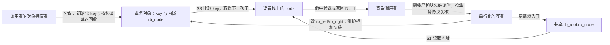
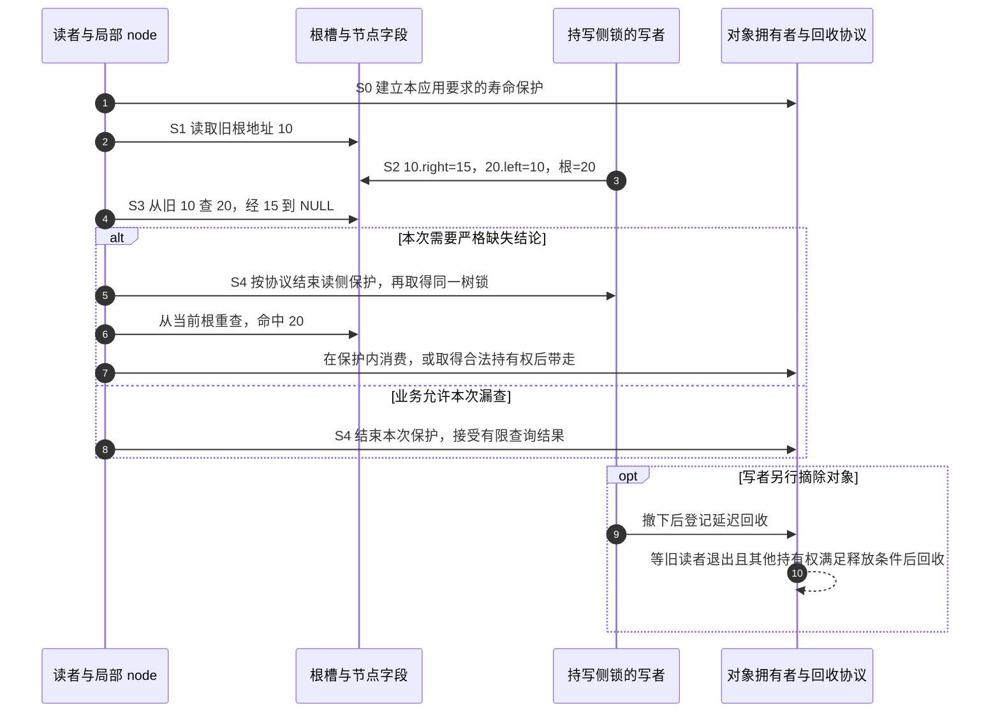

# 第10章\_Linux\_6.12\_内核\_rbtree\_查找与返回边界

树中三个业务对象的 key 都是 10，查找应当返回哪一个？当别的执行者正在旋转时，返回 NULL 又能说明什么？本章从已经建立的嵌入式节点出发，逐步区分任意匹配、最左匹配与可能漏查的返回值，并用完整 C 程序观察这些差别。

## 10.1\_从业务对象走到一条查询路径

P08 已经说明 rb_node 保存父色和左右孩子，P09 已经区分业务 key、内嵌节点与对象寿命：比较规则来自调用者，树不会替我们猜业务身份。本章只读取路径，先假定树稳定，再逐步增加重复键和并发旋转的约束；写空槽和修复颜色进入下一章 P26。

固定源码身份沿[总索引](../../../../research/source_reading/rbtree/navigation/P01_Linux_6.12_rbtree源码阅读索引.md#1.1_固定提交与阅读边界)核对：NXP 官方 Linux 6.12.20，提交 dfaf2136deb2af2e60b994421281ba42f1c087e0。[查询模块导读](../../../../research/source_reading/rbtree/navigation/P02_查找路径与返回边界导读.md#2.2_按一次查找定位源码)组织局部游标和真实函数入口；后文先在本章把返回承诺讲清楚，再用链接核对固定语句。

## 10.2\_rbtree\_查找逻辑\_手写\_search\_与内核辅助接口

先把树固定在一个不变的时刻，追踪“业务键怎样使一次查找选择左或右”。然后允许多个对象匹配同一个查询，最后才引入查找期间发生旋转的情况；每一步只放松一个前提。

### 10.2.1\_查找逻辑为什么不在\_rbtree\_核心中实现

Linux rbtree 的核心结构是 `struct rb_node`，它只有：

```c
unsigned long __rb_parent_color;
struct rb_node *rb_right;
struct rb_node *rb_left;
```

它没有：

```text
key；
value；
compare 回调；
节点类型信息；
业务对象生命周期信息。
```

因此，rbtree 核心根本不知道两个节点谁大谁小。

查找逻辑必须由使用者提供，原因有两个。

第一，业务 key 不在 `struct rb_node` 中。

```c
struct demo_item {
	int key;
	int value;
	struct rb_node rb;
};
```

rbtree 核心只能看到 `rb`，看不到 `key`，除非使用者通过 `rb_entry()` 把 `rb_node` 还原为 `demo_item`。

第二，不同业务的排序规则不同。

排序规则可能是：

```text
单个整数 key；
地址区间起点；
结束时间；
虚拟运行时间；
复合 key；
允许重复 key 后按第二字段排序；
区间树中的区间起点。
```

如果内核 rbtree 强行提供统一 compare 回调，就会把所有使用者都拖进函数指针调用模型。Linux rbtree 的设计选择是：

```text
普通路径：使用者手写 search / insert core，直接表达业务比较；
辅助路径：rbtree.h 提供 rb_find()、rb_add() 等内联辅助接口；
rbtree 核心：只管链接、旋转、染色、遍历、替换。
```

这里没有“手写一定更快”的排序。辅助接口是内联函数，比较函数能否被内联取决于调用点和编译结果；性能还受树形、键分布和访问局部性影响。选择时先看接口能否表达业务语义，需要比较速度时再针对同一工作负载测量。

这就是第 9 章讲过的核心边界：

```text
排序语义属于调用者；
红黑树结构维护属于 rbtree。
```

------

### 10.2.2\_rb\_entry()\_如何把\_rb\_node\_还原为业务对象

查找时拿到的是 `struct rb_node *node`。

要比较 key，必须先还原业务对象：

```c
struct demo_item *item;

item = rb_entry(node, struct demo_item, rb);
```

`rb_entry()` 本质上是 `container_of()`：

```c
#define rb_entry(ptr, type, member) container_of(ptr, type, member)
```

含义是：

```text
已知：
	ptr    指向结构体内部的 rb_node 成员；
	type   外层业务结构体类型；
	member rb_node 在业务结构体中的成员名。

求：
	外层业务结构体对象地址。
```

图示如下：

```text
struct demo_item
+------------------+
| key              |
| value            |
| rb               |  <--- node 指向这里
| other fields     |
+------------------+

rb_entry(node, struct demo_item, rb)
	↓
struct demo_item *
```

所以查找函数通常长这样：

```c
static struct demo_item *demo_search(struct rb_root *root, int key)
{
	struct rb_node *node = root->rb_node;

	while (node) {
		struct demo_item *item;

		item = rb_entry(node, struct demo_item, rb);

		if (key < item->key)
			node = node->rb_left;
		else if (key > item->key)
			node = node->rb_right;
		else
			return item;
	}

	return NULL;
}
```

这一段代码里面，真正属于 rbtree 的只有：

```text
root->rb_node
node->rb_left
node->rb_right
rb_entry()
```

真正属于业务的则是：

```text
struct demo_item
item->key
key < item->key
key > item->key
```

这就是 Linux rbtree 的查找分层。

------

### 10.2.3\_如何根据\_key\_决定进入左子树或右子树

rbtree 首先是一棵 BST。

BST 的查找规则是：

```text
目标 key 小于当前节点 key：
	进入左子树。

目标 key 大于当前节点 key：
	进入右子树。

目标 key 等于当前节点 key：
	查找成功。
```

在 Linux rbtree 中，这个判断不由核心完成，而是由业务代码完成。

例如：

```c
if (key < item->key)
	node = node->rb_left;
else if (key > item->key)
	node = node->rb_right;
else
	return item;
```

这段代码的关键不在写法，而在不变量：

```text
查找的左/右判断必须与建树时建立的中序次序相容。
```

如果插入时按 `item->key`，查找时也必须按 `item->key`。

如果要查找完整的 `(start, end)`，就按建树所用的字典序比较两个字段。也可以只查询 start：按 start 分组的节点在这个中序顺序中连续，因此查找较小 start 向左、较大 start 向右仍然成立；相等时返回某个成员，或者用下文的 first/next 枚举整个组。

不能随意改成只按 end 剪枝。例如中序为 `(1, 100)、(2, 5)、(3, 50)`，end 的 100、5、50 并不有序。从根 `(2, 5)` 按 end=100 向右，会错过左侧已有的目标。关键是查询比较能否正确排除整棵子树，而不是比较函数是否逐字相同。

红黑树修复只能保证：

```text
旋转后中序顺序不变；
红黑性质恢复；
树高受控。
```

它不能修复业务比较规则写错的问题。

错误示例：

```text
插入按 address 排序；
查找按 size 排序；
删除按 id 定位。
```

这会导致：

```text
节点明明存在却查不到；
删除定位错误；
中序遍历不符合业务期望；
rb_erase() 可能摘错树上的节点。
```

------

### 10.2.4\_查找成功与查找失败的返回语义

普通查找通常有两种返回方式。

第一种，返回业务对象：

```c
struct demo_item *demo_search(struct rb_root *root, int key);
```

查找成功返回 `struct demo_item *`，失败返回 `NULL`。

第二种，返回 `struct rb_node *`：

```c
struct rb_node *rb_find(const void *key,
                        const struct rb_root *tree,
                        int (*cmp)(const void *key, const struct rb_node *));
```

`rb_find()` 是 `rbtree.h` 中提供的辅助接口。它仍然需要调用者提供 `cmp()`，只是把 while 循环封装起来。

`rb_find()` 的核心逻辑可以概括成：

```c
node = tree->rb_node;

while (node) {
	c = cmp(key, node);

	if (c < 0)
		node = node->rb_left;
	else if (c > 0)
		node = node->rb_right;
	else
		return node;
}

return NULL;
```

注意返回的是 `struct rb_node *`。

如果调用者需要业务对象，应先区分未找到；普通 `rb_entry()` 不替你处理空指针：

```c
item = node ? rb_entry(node, struct demo_item, rb) : NULL;
```

这里还没有取得额外引用。若返回后要离开锁或 RCU（Read-Copy Update，读—复制—更新）的读侧保护区，必须按该对象的寿命协议保留引用或复制数据，不能只带走裸指针。这里用到的是它让旧读者完成访问后再回收对象的寿命职责，具体读侧模型在下文链接的 RCU 专题中建立。

这里有一个工程取舍：

```text
手写 search：
	可以直接返回业务对象；
	可以内联业务比较；
	最贴近具体场景；
	代码重复更多。

rb_find()：
	封装查找循环；
	需要 cmp 回调；
	返回 rb_node；
	适合比较规则已经函数化的场景。
```

------

### 10.2.5\_重复\_key\_场景下为什么普通查找不一定够用

如果树中不允许重复 key，普通查找足够：

```text
key 相等：
	返回当前节点。
```

但如果允许多个节点具有相同 key，就必须先定义“相等节点”的组织方式。

常见策略有三种：

```text
第一，不允许重复 key。
	插入时发现相等就返回 -EEXIST，表示对象已存在。

第二，允许重复 key，并约定相等节点统一插到右侧。
	中序遍历时相等节点会形成一段连续区间。

第三，使用复合 key。
	先按主 key 排序；
	主 key 相等后按 secondary key 排序；
	按复合字段区分业务身份；仍须决定完整复合键相等时拒绝还是保留多个对象。
```

“相等插右侧”只决定 **本次插入的落点**。设相同 key 的 A、B、C 依次接成右链，对 A 左旋后 B 升到根，A 在 B 的左侧，C 在右侧；中序仍为 A、B、C。旋转保持的是非递减键序，不是“相等者永远只在右边”。所以遇到相等以后，左侧也可能还有相等成员。

普通 `rb_find()` 在重复 key 场景下只保证找到某个匹配节点，不保证是第一个。上面旋转后的树会先命中 B；如果要第一个，应找到 A，而不是把 B 误当成插入最早或唯一的对象。

所以 `rbtree.h` 还提供了：

```text
rb_find_first()
rb_next_match()
rb_for_each()
```

这组接口用于处理“同一个 key 对应多个节点”的场景。

------

### 10.2.6\_rb\_find\_first()\_rb\_next\_match()\_与\_rb\_for\_each()\_的语义

`rb_find_first()` 的目标是：

```text
找到 key 匹配区间中最左边的那个节点。
```

它的逻辑和普通查找不同。

普通查找遇到相等就返回：

```c
c == 0:
	return node;
```

`rb_find_first()` 遇到相等时不会马上返回，而是先记录 `match`，然后继续向左找：

```c
if (c <= 0) {
	if (!c)
		match = node;
	node = node->rb_left;
}
```

这表示：

```text
当前节点已经匹配；
但是左子树里可能还有更靠前的匹配节点；
所以先保存当前 match，再继续向左。
```

最后返回 `match`。

`rb_next_match()` 则从当前匹配节点开始：

```text
先调用 rb_next(node) 找中序后继；
再用 cmp(key, node) 判断后继是否仍然匹配；
如果匹配，返回后继；
如果不匹配，返回 NULL。
```

`rb_for_each()` 是宏封装：

```text
先 rb_find_first()；
再不断 rb_next_match()。
```

这组接口成立的前提是：

```text
相同 key 的节点在中序顺序中必须是连续的一段。
```

如果插入规则破坏了这个连续性，`rb_find_first()` 和 `rb_next_match()` 的语义就不可靠。

`rb_for_each()` 它适合这种树：

```text
中序顺序：

key=10, id=A
key=10, id=B
key=10, id=C
key=20, id=D
key=30, id=E
```

查询 `key=10` 时，`rb_for_each()` 等价于：

```text
rb_find_first(10)    -> key=10, id=A
rb_next_match(10,A) -> key=10, id=B
rb_next_match(10,B) -> key=10, id=C
rb_next_match(10,C) -> NULL，因为下一个是 key=20
```

所以它的工程语义是：

```text
遍历某个 key 对应的一组等价节点
```

不是：

```text
遍历所有节点
```

遍历所有节点还是用：

```c
for (node = rb_first(&root); node; node = rb_next(node)) {
	...
}
```

Linux rbtree 文档里也把 `rb_first()`、`rb_last()`、`rb_next()`、`rb_prev()` 归为“按排序顺序遍历整棵树”的接口。

------

### 10.2.7\_rb\_find\_rcu()\_的边界

前面的查询先假定树在查找期间保持稳定。现在让一个写者与读者交错：读者已经把根 10 存入局部变量，写者把 20 旋到根。读者手里的地址仍然是 10，10 的右孩子却已经改成中间子树 15。它查询 20 时走到 15，再走到空指针；20 从未删除，读者仍可能报告未找到。

这就是 **假阴性**：目标存在，本次查询却返回不存在。原因不是比较错了，而是这条查询路径由不同时刻的树边拼成；整次查找没有得到一个稳定快照。

`rb_find_rcu()` 在向下读取孩子时使用：

```c
rcu_dereference_raw(node->rb_left)
rcu_dereference_raw(node->rb_right)
```

但固定版函数的首次取根仍写成 `node = tree->rb_node`。不能把它描述成“每次读取都自动带 RCU 保护”；它既不进入读侧临界区，也不获取锁、增加引用、检查业务对象有效性或替调用者确认根入口的发布协议。具体语句见[rb_find_rcu 实现](../../../../research/source_reading/rbtree/source_explanations/include/linux/rbtree.h.md#1.4_rb_find_rcu的孩子读取与缺失边界)。

源码还要求两件独立的事：孩子指针写入使用 `WRITE_ONCE()`，以及旋转的写入顺序不在程序顺序中构造临时环。后者不能从前者自动推出。对于 10→20 的边，如果先把 20.left 指回 10，却还没有撤去 10.right→20，查询 15 会在 10 和 20 之间反复往返；哪怕两次赋值都标上 `WRITE_ONCE()`，这个结构环仍存在。正确写序先把 10.right 改为中间子树，再建立 20.left→10。

这项设计保住的是 **沿左右孩子向下搜索的有限路径**，并不让整个旋转原子化，也不保证看到全部子树。源码注释还明确将父指针更新排除在这项论证之外；`rb_next()` 会沿父链上行，不能据此声称并发 `rb_for_each()` 也安全。



节点字段是共享状态，`node`、比较结果和匹配候选是读者局部状态。这里没有一个由 rbtree 维护的“旋转完成”通知，也没有查找自动重试计数。调用者若需要严格的“确实不存在”，可以用与写者相同的锁重新搜索；是否允许直接接受假阴性，要由业务语义决定。

把一次查询按 S0～S4 串起来，才能看清路径与寿命是两件事：



图中的锁复核和寿命交接是 **调用者方案**，不是 `rb_find_rcu()` 的内置动作。尤其不要在不能睡眠的 RCU 读区里照抄“取得任意锁”；按锁类型和上下文安排退出、重新加锁及重新搜索。RCU 的保护细节沿用[RCU 权威路线](../../synchronization_and_asynchrony/synchronization/rcu/大纲.md)，本节只定位 rbtree 留给调用者的责任。

“若返回节点则匹配正确”也有前提：比较规则与键值稳定、相关字段已正确发布、节点仍然活着。它不表示函数替你延长了寿命，更不表示对象离开保护后仍有效。需要最容易推理的强查询时，先用锁覆盖完整操作；只有读侧确实允许上述返回边界、且有完整发布与回收协议时，才考虑这种弱查询路径。

------

### 10.2.8\_手写\_search\_与\_rb\_find*()\_辅助接口的取舍

可以把查找接口分成两层：

```text
第一层：传统手写 search。
	业务代码完全控制比较、返回对象、锁和生命周期。

第二层：rbtree.h 辅助接口。
	内核提供查找循环；
	调用者提供 cmp；
	接口返回 rb_node。
```

选择手写 search 的理由：

```text
需要返回业务对象；
比较逻辑很短；
不希望引入函数指针；
需要在查找过程中做额外业务判断；
需要严格控制锁和引用计数。
```

选择 `rb_find*()` 的理由：

```text
比较逻辑已经抽象为 cmp；
需要复用统一查找模板；
需要处理重复 key 的第一个匹配节点；
需要使用 rb_for_each() 遍历同 key 节点。
```

无论选择哪种方式，都必须守住同一个底线：

```text
查找的剪枝必须与插入建立的中序次序相容。
```

------

### 10.2.9\_本节小结

本节把 Linux rbtree 的查找逻辑固定成以下几点：

```text
第一，rbtree 核心不知道 key，所以查找逻辑属于调用者。

第二，查找时必须通过 rb_entry() 从 rb_node 还原业务对象。

第三，查找路径本质上仍然是 BST 路径。

第四，rb_find() 只是辅助封装，不改变调用者负责比较规则这个事实。

第五，重复 key 场景要使用 rb_find_first()、rb_next_match() 或业务自定义规则。

第六，rb_find_rcu() 不是完整无锁容器，它可能在并发旋转中出现 false negative。
```

------

### 10.2.10\_用完整C程序观察相等节点和旧路径

先预测三个结果：相等节点左旋后谁位于左侧；从旧根查询新根的 key 会不会漏掉；故意把撤边与反接颠倒，查询中间值会怎样。下面使用全部存活的自动对象，把读写事件 **串行重放**，不创建线程，也不让普通 C 指针发生数据竞争。它是查找路径模型，不是可替代 Linux rbtree 的实现：没有颜色修复、父指针、RCU 或内存屏障。

```c
#include <stdio.h>

/* 只保存本次观察所需的向下连接，不模拟 Linux 颜色或父指针。 */
struct lookup_node {
    int key;
    char tag;
    struct lookup_node *left;
    struct lookup_node *right;
};

static struct lookup_node *find_any(struct lookup_node *node, int key)
{
    while (node) {
        if (key < node->key)
            node = node->left;
        else if (key > node->key)
            node = node->right;
        else
            return node;
    }
    return NULL;
}

static struct lookup_node *find_first(struct lookup_node *node, int key)
{
    struct lookup_node *match = NULL;

    while (node) {
        if (key <= node->key) {
            if (key == node->key)
                match = node;
            node = node->left;
        } else {
            node = node->right;
        }
    }
    return match;
}

/* 调用者保证存在右孩子；三个普通写入只在这个串行模型中执行。 */
static void rotate_left(struct lookup_node **root)
{
    struct lookup_node *old = *root;
    struct lookup_node *up = old->right;
    struct lookup_node *middle = up->left;

    old->right = middle; /* 先撤去旧的向上路径。 */
    up->left = old;      /* 再建立反向父子连接。 */
    *root = up;
}

/* 只用于故意造环的实验：到达预算时停止，绝不挂住终端。 */
static struct lookup_node *find_bounded(struct lookup_node *node, int key,
                                        unsigned int budget, int *exhausted)
{
    *exhausted = 0;
    while (node && budget) {
        --budget;
        if (key == node->key)
            return node;
        node = key < node->key ? node->left : node->right;
    }
    *exhausted = node != NULL;
    return NULL;
}

int main(void)
{
    struct lookup_node a = {10, 'A', NULL, NULL};
    struct lookup_node b = {10, 'B', NULL, NULL};
    struct lookup_node c = {10, 'C', NULL, NULL};
    struct lookup_node x = {10, 'X', NULL, NULL};
    struct lookup_node middle = {15, 'M', NULL, NULL};
    struct lookup_node y = {20, 'Y', NULL, NULL};
    struct lookup_node *root = &a;
    struct lookup_node *saved;
    struct lookup_node *any;
    struct lookup_node *first;
    int exhausted;

    a.right = &b;
    b.right = &c;
    rotate_left(&root);
    any = find_any(root, 10);
    first = find_first(root, 10);
    printf("equal: root=%c left=%c any=%c first=%c\n",
           root->tag, root->left->tag,
           any ? any->tag : '-', first ? first->tag : '-');

    x.right = &y;
    y.left = &middle;
    root = &x;
    saved = root; /* 模拟读者已经取走旧根，随后写者完成旋转。 */
    rotate_left(&root);
    printf("stale: saved=%d current=%d miss=%d current_hit=%d\n",
           saved->key, root->key, find_any(saved, 20) == NULL,
           find_any(root, 20) == &y);

    /* 重置后故意先反接：X.right 仍是 Y，而 Y.left 已经变为 X。 */
    x.right = &y;
    y.left = &middle;
    root = &x;
    y.left = &x;
    (void)find_bounded(root, 15, 6, &exhausted);
    printf("bad_order: budget_exhausted=%d cycle=%d\n",
           exhausted, x.right == &y && y.left == &x);

    /* 补上撤边和根更新；所有对象在 main 返回前一直存活。 */
    x.right = &middle;
    root = &y;
    printf("repaired: middle_hit=%d\n", find_any(root, 15) == &middle);
    return 0;
}
```

完整材料为[lookup_paths.c](../../../../labs/kernel/tree_basics/materials/lookup_paths.c)。在仓库根目录执行；`cc` 为支持 C11 的编译器，程序只依赖标准库：

```bash
cc -std=c11 -Wall -Wextra -Werror -pedantic \
  labs/kernel/tree_basics/materials/lookup_paths.c -o lookup_paths
./lookup_paths
```

输出应为：

```text
equal: root=B left=A any=B first=A
stale: saved=10 current=20 miss=1 current_hit=1
bad_order: budget_exhausted=1 cycle=1
repaired: middle_hit=1
```

第一行同时观察任意匹配和最左匹配。第二行不是释放后访问：旧根 10 一直存活，只是它不再能向下到达新根 20。第三行用六步预算让错误路径安全停止；循环来自 10.right→20 与 20.left→10，两条边的地址可以直接核对。第四行先补上撤边再更新根，查询 15 恢复正常。三个现象都不需要弱内存序才能出现，因此“只要加屏障就解决一切”解释不了它们。

`find_bounded()` 是演示防挂措施；预算耗尽只说明这次还未结束，并不是通用判环算法。足够长的合法路径也可能用完预算。Linux 的 `rb_find*` 没有这里的六步上限，不能把它当成内核自动检测坏树的证据。

试着修改程序，再解释观察：

1. 把三个相等键改为 10、20、30，查询 20。旋转后任意匹配和最左匹配都为 B；多个返回结果来自等价类，而非 first 额外改变树形。
2. 第二段从旧 10 查询 15，会命中 M；旧入口并非必然查不到任何东西。查询 20 的失败不能推出“整棵旧子树失效”。
3. 在坏写序的中间态查询 10 或 20，会提前命中。只用这些测试键不能排除结构环；15 才会在两条相反方向的边之间往返。
4. 若业务要确认“key=20 不存在才插入”，能直接根据旧路径的 NULL 插入吗？不能。应在与写者一致的保护下重新查重并插入，否则会把弱查询的漏查变成重复对象。

这一单元已经区分返回值与查询承诺。下一章保留同一业务比较规则，改为[寻找可以写入的新节点槽](P26_Linux红叶接入与插入修复.md#26.2_rbtree_插入前半段_搜索落点与_rb_link_node%28%29)；旋转和染色在接入之后发生。

## 10.3\_从读空槽转向写空槽

现在可以区分三个问题：是否碰到一个匹配对象，是否找到了匹配区间的第一个，以及一次 NULL 是否足以支持“确实不存在”的业务判断。还必须单独确认返回对象在使用时是否仍然存活，不能用匹配正确替代寿命保护。

接下来的[P26 红叶接入与插入修复](P26_Linux红叶接入与插入修复.md#26.1_章节内容说明)开始修改树。搜索不仅要记住节点，还要保存最终空槽的地址；把新红叶写进去以后，才由颜色和局部旋转恢复平衡。返回[专题路线](大纲.md#1.1_沿问题进入现有章节)。
