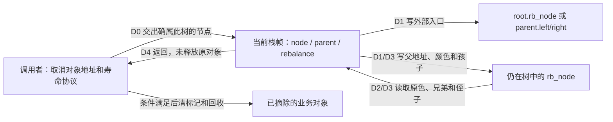
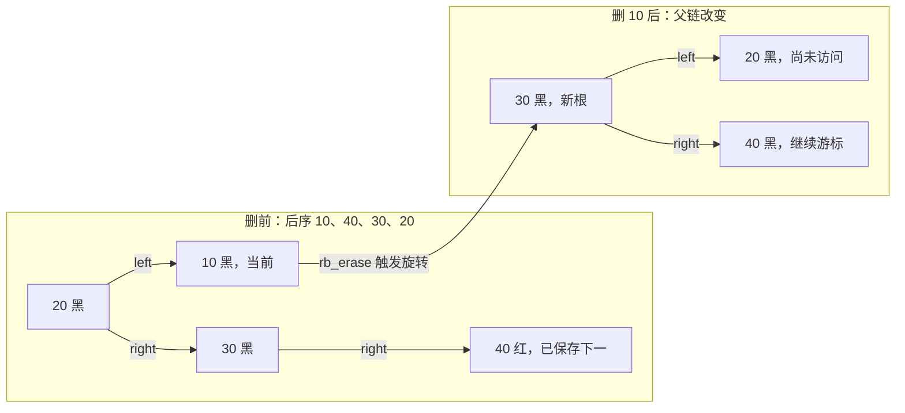
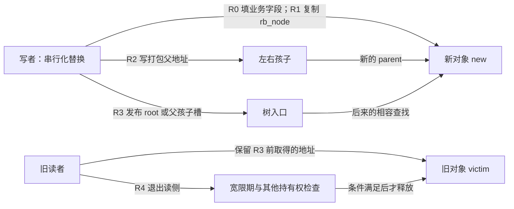
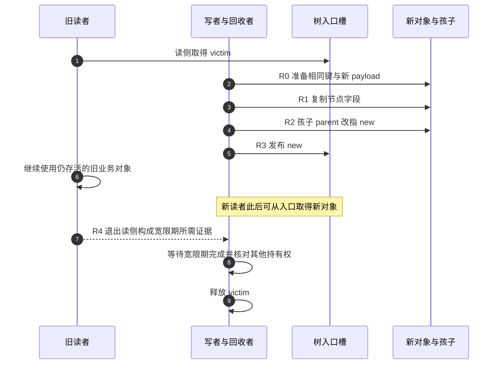

# 第11章\_Linux\_6.12\_内核\_rbtree\_删除\_遍历与替换

## 11.1\_章节内容说明

先固定取消请求的身份：程序要摘除的是哪一个对象，树准备把它的位置交给谁，以及这两件事为什么不能混在一起。带着这三个问题回收插入章的结论，再进入本章的删除周期。

### 11.1.1\_本章在\_Linux\_rbtree\_学习路线中的位置

[P26 插入单元](P26_Linux红叶接入与插入修复.md#26.5_本章小结)已经讲完插入路径，继续沿用前文的二叉搜索树（Binary Search Tree，BST）排序规则：

```text
调用者先按 BST 规则搜索落点；
rb_link_node() 把红色新节点挂到树上；
rb_insert_color() 调用 __rb_insert() 修复红红冲突；
旋转收尾由 __rb_rotate_set_parents() 统一处理。
```

现在一个排队请求要取消：它的 key 为 20，其他代码仍把请求地址当作身份。调用 rb_erase 以后，20 的位置可能由后继 25 接管，但被取消的必须仍是原来的 20 对象。若只照抄前面教学 BST 的“复制后继 key”写法，就可能把 20 对象变成 25，而真正摘掉的却是别人仍在使用的 25 对象。

本章从这个现场进入删除：先区分 **业务对象的摘除** 与 **树中位置的接管**，再追踪少掉的黑色贡献。默认树由当前调用者独占；共享树须先按业务协议串行化写入，并保护所有参与对象的寿命。完成以后应能画出“谁离开、谁移动、哪个父槽缺黑”，并用后面的完整模块观察结果。

删除比插入更难，原因是插入通常只会制造：

```text
红红冲突
```

而删除黑色节点可能制造：

```text
黑高缺失
```

黑高缺失不是一个真实节点颜色能直接表达的状态。Linux 源码用 `node == NULL`、`parent` 和循环不变量来表达这个“少一个黑色”的位置。

本章还会顺带讲遍历和替换接口，因为删除后的对象清理、遍历销毁、节点替换都和树结构维护密切相关。

------

### 11.1.2\_本章参照的源码文件

本章版本沿用[固定源码总索引](../../../../research/source_reading/rbtree/navigation/P01_Linux_6.12_rbtree源码阅读索引.md#1.1_固定提交与阅读边界)：NXP 官方 Linux 6.12.20 固定提交，不使用本地实验提交。主要参照：

- [include/linux/rbtree.h](../../../../research/source_reading/linux/include/linux/rbtree.h)

- [lib/rbtree.c](../../../../research/source_reading/linux/lib/rbtree.c)

- [include/linux/rbtree_augmented.h](../../../../research/source_reading/linux/include/linux/rbtree_augmented.h)

其中：

```text
include/linux/rbtree_augmented.h
	实现 __rb_erase_augmented()，负责结构删除。

lib/rbtree.c
	实现 rb_erase()、____rb_erase_color()、遍历、替换。

include/linux/rbtree.h
	声明遍历、替换、postorder 遍历宏和 cached 包装接口。
```

删除阅读顺序建议：

```text
先看 rb_erase()
	↓
再看 __rb_erase_augmented()
	↓
再看 ____rb_erase_color()
```

不要一上来就读 `____rb_erase_color()`。

如果没有先理解结构删除返回的 `rebalance` 是什么，删除修复的 `parent`、`node == NULL`、`sibling` 都会显得很抽象。

------


### 11.1.3\_一轮取消经过哪些状态

这不是单一颜色状态机。孩子/父地址决定拓扑，颜色决定各路径黑高；局部 node、parent、rebalance 只在当前栈帧中标记进度，业务对象的在树标记和持有权又属于调用者。把四者分开，才能解释为什么“树已摘除”和“可以释放”是两件事。

| 阶段 | 谁读写什么 | 进入和退出条件 |
| --- | --- | --- |
| D0 确认取消对象 | 调用者在保护范围内查找，保留业务对象地址 | 对象确属此树；不存在则不调用删除 |
| D1 摘除和移位 | 删除实现写根/父孩子槽、孩子父地址；必要时移动后继 | 原对象不再由根可达，其他对象身份不变 |
| D2 判断缺黑 | 实现读取被挪走位置的原颜色，写局部 rebalance | 红孩子可染黑抵偿；否则黑色空缺交给父节点；根空树直接结束 |
| D3 修复 | 实现读兄弟/侄子，写孩子槽和父色，更新局部游标 | 变形、上推或局部抵偿；返回时排序和红黑性质恢复 |
| D4 业务退出 | 调用者更新成员标记、引用与回收协议 | 旧对象可能仍存活；何时释放不由 rb_erase 决定 |

这里用一棵已合法的树看 D1/D2：根 20 黑，左 10 黑，右 30 黑，30 的左孩子 25 红。取消根时，25 没有孩子，是深后继。将 30.left 清空、25 接到根槽，25 继承 20 的黑色，10/30 的父指针都改为 25。25 原位置为红，没减黑高，所以 D3 不执行。若只看被取消的 20 为黑，就会错误预言一定需要修复。



图中没有另一个修复执行者；所有树字段由当前写者按步骤更新，读者不能依赖每条语句之间都构成一棵完整稳定的树。精确的同步回调及函数间交接见[版本模块时序](../../../../research/source_reading/rbtree/navigation/P04_对象摘除与缺黑修复导读.md#4.2_从对象到缺黑父槽)。

## 11.2\_rbtree\_删除前半段\_rb\_erase()\_与结构删除

删除前半段需要把父节点或根原来指向 node 的槽，改指向保留下来的孩子或后继。这与插入旋转的外部槽回接是同一种操作；[父槽替换的唯一实现](../../../../research/source_reading/rbtree/source_explanations/include/linux/rbtree_augmented.h.md#1.2_替换父节点或根的入口槽)保留完整参数与中文说明，本节继续追踪删除特有的状态变化。

`__rb_change_child()` 允许 new 为 NULL，只改“父或根→孩子”的边，不改 new 自身的父色。parent 非空时必须已经是 old 的真实父节点，parent 为空时 old 必须是根；函数不验证这两项前提。删除调用者因此还需配对维护新节点自身字段，不能以为换一条入口边就完成整次替换。固定版本与共享实现见[源码总索引](../../../../research/source_reading/rbtree/navigation/P01_Linux_6.12_rbtree源码阅读索引.md#1.1_固定提交与阅读边界)。


### 11.2.1\_结构摘除返回什么

取消请求时，调用者交出的是对象内的节点地址。结构删除先把这个地址从可达树中摘掉：零或一个孩子时改一条外部入口；两个孩子时移动后继对象，保留其他对象的地址与业务键。它不会把后继的业务数据覆盖到被取消对象中。

这一段可以完成局部补黑，也可能留下一个待修复的空孩子槽。返回值 rebalance 是这个槽的父节点，存放在调用者的局部变量中。非 NULL 才进入下一步；删除唯一黑根虽然减少了黑色贡献，但树已为空，没有另一侧需要对齐，返回 NULL。

[结构摘除的完整实现](../../../../research/source_reading/rbtree/source_explanations/include/linux/rbtree_augmented.h.md#1.3_结构摘除与缺黑父槽)保留原逐步中文注释及两种后继图，下面 11.2.7～11.2.13 先逐项推导为什么要这样改边。

### 11.2.2\_缺黑修复接收什么

修复接收 rebalance 指向的父节点，内部第一次令 node=NULL。缺黑不是把某个节点涂成第三种颜色，而是“这条下行路径比兄弟路径少一个黑色”的关系。兄弟在另一孩子槽中，读兄弟和侄子的颜色便可决定把缺口上推还是在本层抵偿。

[两侧完整修复实现](../../../../research/source_reading/rbtree/source_explanations/lib/rbtree.c.md#1.5_缺黑修复的四种转换)保留原四类、镜像和中文图解。11.3 按同一父、兄弟、近侄、远侄解释每个转折；先建立这些角色，再逐句阅读函数。

### 11.2.3\_普通接口把两步接起来

普通 rb_erase 先执行结构摘除，随后只在返回父节点非空时进入颜色修复；传入的增强回调为空函数，因此不维护业务统计。这条分支在[删除入口的唯一实现](../../../../research/source_reading/rbtree/source_explanations/lib/rbtree.c.md#1.6_删除入口与黑色位辅助)展开。

两步都在当前调用栈中同步完成，没有后台修复任务。函数返回只证明调用前提成立时树已恢复合法结构；它不证明旧对象无人持有，也没有替业务清除“已登记”状态。

### 11.2.4\_rb\_erase()\_的对外语义

普通删除接口是：

```c
void rb_erase(struct rb_node *node, struct rb_root *root);
```

注意它接收的是：

```text
要删除的 rb_node；
所在树的 root。
```

它不是：

```text
按 key 删除。
```

所以调用者通常要先查找。下面 ENOENT 是“没有找到所需对象”的错误码名，返回负值表示本次取消没有执行：

```c
item = demo_search(root, key);
if (!item)
	return -ENOENT;

rb_erase(&item->rb, root);
```

`rb_erase()` 的语义是：

```text
从 root 所代表的 rbtree 中摘除 node；
如果删除破坏红黑性质，就做颜色修复；
不释放业务对象。
```

它不负责：

```text
根据 key 查找；
判断 node 是否真的属于这棵树；
释放外层业务对象；
维护引用计数；
维护调用者的锁；
清理 node 的游离状态。
```

删除后是否调用 `RB_CLEAR_NODE()`，由调用者决定。这个宏将仍存活节点的自身地址写入父色字段，作为“已知游离”的标记；它不负责摘除或回收。只对本例已独占、确实离树的节点清标记；有旧读者时还须核对它们是否继续读取旧字段。

------

### 11.2.5\_删除为什么拆成\_结构删除\_和\_颜色修复

Linux 删除路径是两段式：

```c
rebalance = __rb_erase_augmented(node, root, &dummy_callbacks);
if (rebalance)
	____rb_erase_color(rebalance, root, dummy_rotate);
```

第一段：

```text
__rb_erase_augmented()
```

负责 BST 层面的结构删除：

```text
没有左孩子；
没有右孩子；
左右孩子都存在，需要找中序后继。
```

第二段：

```text
____rb_erase_color()
```

负责红黑性质修复：

```text
如果删除黑色节点导致某条路径少一个黑色；
就从 rebalance 指示的位置开始修复。
```

为什么要拆开？

因为结构删除和颜色修复关注的问题不同。

结构删除关注：

```text
BST 有序性；
父子指针；
中序后继；
被替换节点的位置；
augmented 信息复制和传播。
```

颜色修复关注：

```text
黑高缺失；
兄弟节点颜色；
侄子节点颜色；
旋转和染色。
```

这两层分开以后，源码中的 `rebalance` 就成了连接点：

```text
结构删除返回一个 parent；
如果 parent 非 NULL，说明需要从这个 parent 下方的缺黑位置开始修复。
```

------

### 11.2.6\_rb\_erase\_augmented()\_的基础作用

`__rb_erase_augmented()` 位于 `include/linux/rbtree_augmented.h`。

虽然名字里有 augmented，但普通 `rb_erase()` 也复用它。

普通 rbtree 传入的是 dummy callbacks：

```text
propagate：空函数；
copy：空函数；
rotate：空函数。
```

增强树则传入真实回调。

因此 `__rb_erase_augmented()` 是通用结构删除骨架。

它返回：

```c
struct rb_node *rebalance;
```

返回值语义：

```text
rebalance == NULL：
	结构删除已经局部解决颜色问题；
	不需要进入 ____rb_erase_color()。

rebalance != NULL：
	删除导致某个位置缺少一个黑色；
	rebalance 是缺黑位置的父节点；
	需要进入删除修复。
```

这里要特别注意：

```text
rebalance 不是“被删节点”；
rebalance 也不是“替换节点”；
rebalance 是删除修复入口所需的 parent。
```

------

### 11.2.7\_Case\_1\_被删节点没有左孩子

源码开头：

```c
struct rb_node *child = node->rb_right;
struct rb_node *tmp = node->rb_left;
```

如果：

```c
tmp == NULL
```

说明：

```text
node 没有左孩子。
```

此时 `child` 是右孩子，可能为 NULL。

结构上只需要让 `child` 接替 `node` 的位置：

```text
parent = node 的父节点；
__rb_change_child(node, child, parent, root);
```

如果 `child` 存在，源码会：

```c
child->__rb_parent_color = node->__rb_parent_color;
rebalance = NULL;
```

这表示：

```text
child 接替 node 的父节点和颜色；
不需要额外删除修复。
```

为什么？

因为在红黑树中，如果被删节点只有一个非空孩子，那么这个孩子必然是红色，而被删节点必然是黑色。

让红色 child 接替黑色 node 的位置并继承黑色，相当于：

```text
用 child 补上 node 原来的黑色贡献；
黑高不缺失。
```

如果 `child == NULL`：

```text
删除的是一个没有孩子的节点。
```

此时：

```text
如果 node 是红色：
	删掉红色叶子不会影响黑高，不需要修复。

如果 node 是黑色且 parent 非空：
	这条路径少了一个黑色，需要从 parent 开始修复。
若删掉唯一根，parent 为 NULL，结果为空树，直接结束。
```

源码对应：

```text
rebalance = node 是黑色 ? parent : NULL;
```

------

### 11.2.8\_Case\_2\_被删节点没有右孩子

如果第一种情况不成立，但：

```c
child == NULL
```

说明：

```text
node 有左孩子；
node 没有右孩子。
```

此时左孩子 `tmp` 接替 node 的位置。

源码做：

```c
tmp->__rb_parent_color = node->__rb_parent_color;
__rb_change_child(node, tmp, parent, root);
rebalance = NULL;
```

这里也不需要进入删除修复。

原因和 Case 1 中有一个非空孩子的场景一样：

```text
这个唯一孩子必须是红色；
被删节点必须是黑色；
孩子继承被删节点颜色后，局部黑高保持不变。
```

所以 Case 1 和 Case 2 本质上都是：

```text
被删节点最多只有一个非空孩子。
```

如果有非空孩子，它会继承被删节点颜色，避免缺黑。

如果没有非空孩子，则要看被删节点是不是黑色。

------

### 11.2.9\_Case\_3\_被删节点左右孩子都存在

如果：

```text
node->rb_left != NULL
node->rb_right != NULL
```

仅把入口改成某个孩子会丢下另一个子树，必须另做回接。Linux 选右子树中序后继，因为它没有左孩子，原位置最多只有一个孩子，因而能回到已经解决的简单删除。中序前驱也可构造对称方案，这里按固定实现选后继：

```text
找 node 的中序后继 successor；
用 successor 接替 node 的位置；
再从 successor 原来的位置删掉 successor。
```

中序后继是：

```text
node 右子树中的最左节点。
```

Linux 源码把两孩子删除分成两个子情况。

第一种：

```text
node 的右孩子本身就是 successor。
```

也就是：

```text
node->rb_right->rb_left == NULL
```

结构：

```text
    (n)             (s)
    / \             / \
  (x) (s)   -->   (x) (c)
        \
        (c)
```

第二种：

```text
successor 是 node 右子树中更深的最左节点。
```

结构：

```text
    (n)             (s)
    / \             / \
  (x) (y)   -->   (x) (y)
      /               /
    (p)             (p)
    /               /
  (s)             (c)
    \
    (c)
```

这两个子情况都要保证：

```text
successor 接替 node 的位置；
node 左子树挂到 successor 左边；
深后继时 node 原右子树挂到 successor 右边；
直接右孩子为后继时保留它的原右孩子，不把它自己接给自己；
successor 原位置由 child2 接替；
successor 继承 node 的父节点和颜色；
如果 successor 原位置删掉黑色贡献，则返回 rebalance。
```

------

### 11.2.10\_为什么两孩子删除要寻找中序后继

BST 有序性要求：

```text
唯一键：左子树所有 key < node key < 右子树所有 key。
允许重复键：左侧 <= node key <= 右侧，旋转后同键可在两边。
```

删除有两个孩子的节点时，不能随便拿一个孩子上来。

如果直接让左孩子上来：

```text
左孩子的右子树如何接回？
原右子树如何接回？
局部有序性容易复杂化。
```

使用中序后继的好处是：

```text
successor 是右子树中最小的节点；
successor 不小于 node 左子树所有节点（唯一键时严格大于）；
successor 小于或等于 node 右子树中其他节点；
所以 successor 可以接替 node 的排序位置。
```

也可以使用中序前驱。

Linux rbtree 选择中序后继。

------

### 11.2.11\_后继节点如何接管被删节点的位置

无论 successor 是右孩子还是右子树深处的最左节点，最终都要做：

```text
successor->rb_left = node->rb_left;
node->rb_left 的 parent 改成 successor；
successor 继承 node 原来的 parent 和 color；
node 原父节点的孩子指针改成 successor。
```

源码中关键动作包括：

```c
WRITE_ONCE(successor->rb_left, tmp);
rb_set_parent(tmp, successor);

pc = node->__rb_parent_color;
tmp = __rb_parent(pc);
__rb_change_child(node, successor, tmp, root);
successor->__rb_parent_color = pc;
```

其中：

```text
pc 保存 node 原来的父指针和颜色；
successor->__rb_parent_color = pc 表示 successor 继承 node 的位置颜色。
```

这一步非常重要。

因为从 node 的父节点以上看：

```text
这棵子树的根从 node 换成 successor；
但这棵子树对外的黑高贡献应该保持一致。
```

所以 successor 必须继承 node 的颜色。

------

### 11.2.12\_后继原位置如何处理\_child2

successor 原位置被挪走后，需要让它原来的右孩子 `child2` 接上。

为什么只有右孩子？

因为 successor 是右子树的最左节点。

所以：

```text
successor 没有左孩子；
successor 可能有右孩子 child2。
```

如果 successor 是 node 的右孩子：

```c
parent = successor;
child2 = successor->rb_right;
```

如果 successor 在更深处：

```text
parent 是 successor 原来的父节点；
child2 = successor->rb_right;
parent->rb_left = child2;
```

接下来判断是否需要颜色修复：

```text
如果 child2 存在：
	child2 接替 successor 原位置；
	child2 染黑；
	rebalance = NULL。

如果 child2 不存在：
	如果 successor 原来是黑色：
		删掉 successor 原位置会造成缺黑；
		rebalance = parent。
	否则：
		删掉红色 successor 不影响黑高；
		rebalance = NULL。
```

源码对应：

```c
if (child2) {
	rb_set_parent_color(child2, parent, RB_BLACK);
	rebalance = NULL;
} else {
	rebalance = rb_is_black(successor) ? parent : NULL;
}
```

注意这里判断的是：

```text
successor 原位置的颜色。
```

之后 successor 会继承 node 的颜色。

------

### 11.2.13\_删除路径中\_augmented\_信息如何维护

`__rb_erase_augmented()` 同时服务普通树和增强树。

增强树需要维护子树增强信息，所以删除过程中有三个回调点：

```text
augment->copy(node, successor)
augment->propagate(parent, successor)
augment->propagate(tmp, NULL)
```

含义分别是：

```text
copy：
	successor 接替 node 的位置时，复制 node 的增强信息。

propagate(parent, successor)：
	successor 从原位置移走后，原路径上的增强信息需要向上更新，
	到 successor 之前停止，不更新 stop 本身；增强值不变时也可能更早结束。

propagate(tmp, NULL)：
	结构删除最终完成后，从受影响节点继续向根方向更新；允许因值不变早停。
```

普通 rbtree 传入 dummy callbacks，所以这些动作会被优化为空。

这就是 Linux rbtree 结构删除写在 `rbtree_augmented.h` 中的原因：

```text
普通树和增强树共用删除骨架；
增强树在必要位置插入回调；
普通树靠 dummy callback 消除额外成本。
```

------

### 11.2.14\_本节小结

本节固定结构删除的几个结论：

```text
第一，rb_erase() 先调用 __rb_erase_augmented() 做结构删除。

第二，__rb_erase_augmented() 返回 rebalance，表示是否需要颜色修复。

第三，没有左孩子或没有右孩子时，最多一个孩子接替 node。

第四，如果唯一孩子存在，合法树保证它为红色；继承黑色后无需另进修复循环。

第五，左右孩子都存在时，用中序后继 successor 接替 node。

第六，successor 继承 node 原来的父节点和颜色。

第七，successor 原位置被删掉后，是否缺黑取决于 successor 原来的颜色和 child2。

第八，augmented rbtree 在结构删除中通过 copy 和 propagate 维护增强信息。
```

------

## 11.3\_rb\_erase\_color()\_删除修复核心

结构删除已经把对象摘走，剩下的是父节点某一方向少一个黑色。只把父或兄弟随意染黑会改变另一侧的路径，因此要同时观察兄弟和两位侄子；下面逐步判断何时能本层抵偿，何时只能把缺口交给上层。代码沿用 P26 的颜色常量 RB_RED（红 0）、RB_BLACK（黑 1）和孩子写入宏 WRITE_ONCE；后者约束一次访问，不给整次旋转加锁或提供原子完成。

### 11.3.1\_删除修复循环的不变量

`____rb_erase_color()` 位于 `lib/rbtree.c`。

函数入口：

```c
____rb_erase_color(struct rb_node *parent, struct rb_root *root,
		   void (*augment_rotate)(struct rb_node *old,
					  struct rb_node *new))
```

它没有传入缺黑节点。

内部初始化：

```c
struct rb_node *node = NULL, *sibling, *tmp1, *tmp2;
```

也就是说，第一次循环中：

```c
node == NULL
parent == rebalance
```

这正是在表达：

```text
parent 的某个孩子位置缺少一个黑色；
这个缺黑位置可能是 NULL。
```

源码注释给出循环不变量：

```text
node is black, or NULL on first iteration;
node is not the root;
all leaf paths going through parent and node have black count 1 lower.
```

翻译成学习语言：

```text
当前 node 位置可以看成一个黑色位置；
它不是整棵树根；
经过 parent -> node 方向的路径，比 parent 另一侧路径少一个黑色；
修复目标就是把这个缺少的黑色补掉、转移掉或在更高层解决。
```

------

### 11.3.2\_为什么删除修复处理的是\_少一个黑色\_的位置

教材经常用“双黑节点”描述删除修复。

Linux 源码没有真的创建 double-black 节点。

它用：

```text
node
parent
sibling
```

来表达缺黑位置。

第一次进入时 `node == NULL`，但仍然可以修复，是因为：

```text
parent 告诉我们缺黑位置的父节点是谁；
sibling 可以通过 parent 的另一个孩子找到；
缺黑方向可以通过 node 和 sibling 的关系判断。
```

源码一开始：

```c
sibling = parent->rb_right;
if (node != sibling) {
	/* node == parent->rb_left */
	...
} else {
	/* node == parent->rb_right */
	...
}
```

如果 `node != parent->rb_right`，说明缺黑位置在左边。

否则缺黑位置在右边。

为什么没有另传一个“左或右”标志？初次缺口是空槽，另一侧的兄弟必非空。否则删除前一侧含待删黑节点、另一侧只含 NULL，黑高本就不相等，与合法树前提冲突。所以不会出现左右都空却仍需调用此循环的歧义。

因为第一次 `node == NULL`，这段判断也能工作：

```text
如果 parent->rb_right 不是 NULL，则 node != sibling，缺黑在左；
如果 parent->rb_right 也是 NULL，则缺口在右，非空兄弟在左；
上推以后 node 是真实黑节点，仍按相同身份比较确定方向。
```

理解删除修复时，最好不要死盯“node 是哪个真实节点”。

更准确的说法是：

```text
node 表示当前缺黑方向上的节点位置；
它可能是真实黑节点，也可能是 NULL 叶子位置。
```

------

### 11.3.3\_左侧删除修复总览

先看左侧分支：

```c
node == parent->rb_left
sibling = parent->rb_right
```

结构可以画成：

```text
      P
     / \
    N   S
       / \
      Sl  Sr
```

其中：

```text
N 是缺黑方向；
S 是兄弟；
Sl 是近侄；
Sr 是远侄。
```

左侧删除修复有四个 case：

```text
Case 1：
	兄弟 S 是红色。

Case 2：
	兄弟 S 是黑色，两个侄子都是黑色。

Case 3：
	兄弟 S 是黑色，远侄 Sr 是黑色，近侄 Sl 是红色。

Case 4：
	兄弟 S 是黑色，远侄 Sr 是红色。
```

这四个 case 的目标不是并列的。

它们的关系是：

```text
Case 1 把红兄弟转换成黑兄弟；
Case 3 把近侄红转换成远侄红；
Case 4 进行最终旋转并结束；
Case 2 可能把缺黑向上推进。
```

------

### 11.3.4\_Case\_1\_兄弟为红\_先转换成黑兄弟

如果：

```text
rb_is_red(sibling)
```

说明兄弟 S 是红色。

结构：

```text
      P(B)
     /   \
    N     s(R)
         /   \
       Sl(B) Sr(B)
```

由于红节点不能有红孩子，所以 S 的两个孩子为黑；这里还必须证明它们非空。删除前 N 方向多一个黑色，S 自己为红不贡献黑色，只能靠下方黑孩子补齐路径。因此这两孩子不能只是 NULL。这比“NULL 也算黑”多了一项黑高约束，也是源码直接改近侄父色而不判空的依据。

Case 1 的动作是：

```text
围绕 parent 左旋；
sibling 成为局部子树根；
parent 变成 sibling 的左孩子；
parent 染红；
sibling 继承 parent 原来的颜色；
缺黑位置仍然在 parent 的左侧；
新的 sibling 变成原来的 Sl。
```

源码：

```text
tmp1 = sibling->rb_left;
parent->rb_right = tmp1;
sibling->rb_left = parent;
tmp1 的 parent 改成 parent；
__rb_rotate_set_parents(parent, sibling, root, RB_RED);
augment_rotate(parent, sibling);
sibling = tmp1;
```

Case 1 不会直接结束。

它只是把局面转换成：

```text
兄弟为黑的情况。
```

这样后面就可以进入 Case 2、Case 3 或 Case 4。

从 2-3-4 树视角看，红兄弟表示父节点和兄弟处在一种倾斜编码中，先旋转是为了换一个视角，让真正可借位或可合并的黑兄弟暴露出来。

------

### 11.3.5\_Case\_2\_兄弟为黑且双侄黑\_染色并向上推进

Case 1 处理后，或者一开始兄弟就是黑色。

源码先看远侄：

```c
tmp1 = sibling->rb_right;
if (!tmp1 || rb_is_black(tmp1)) {
	tmp2 = sibling->rb_left;
	if (!tmp2 || rb_is_black(tmp2)) {
		Case 2
	}
}
```

左侧删除中：

```text
tmp1 = Sr，远侄；
tmp2 = Sl，近侄。
```

Case 2 条件：

```text
S 是黑色；
Sl 是黑色或 NULL；
Sr 是黑色或 NULL。
```

结构：

```text
      (p)
     /   \
    N     S(B)
         /   \
       Sl(B) Sr(B)
```

动作：

```text
S 染红。
```

这样做的含义是：

```text
兄弟侧少一个黑色；
与缺黑侧 N 对齐；
parent 子树内部黑高恢复一致。
```

把缺黑侧下方的黑节点数记为 h；兄弟为黑且两侄黑时，兄弟方向原先贡献 h+1。将兄弟染红使它也贡献 h，两侧因此相等。若父原为红，父改黑会给两条路径同时加一，恢复该子树原有的对外贡献；若父原为黑，不能再靠“黑改黑”增加贡献，整棵父子树仍比删除前少一，只有继续上推或到整树根统一降黑高。这解释了为什么相同的兄弟染红动作会有两个不同出口。

但是 parent 这一层可能出现两种情况。

如果 parent 是红色：

```text
把 parent 染黑；
缺黑被 parent 的红色补掉；
修复结束。
```

如果 parent 是黑色：

```text
parent 这棵子树整体对外少了一个黑色；
缺黑向上推进到 parent；
若它还有父节点则继续循环；若已到黑根，所有路径统一少一黑，直接结束。
```

源码对应：

```c
rb_set_parent_color(sibling, parent, RB_RED);
if (rb_is_red(parent))
	rb_set_black(parent);
else {
	node = parent;
	parent = rb_parent(node);
	if (parent)
		continue;
}
break;
```

这就是删除修复比插入更难的地方：

```text
插入 Case 1 是红色上推；
删除 Case 2 是缺黑上推。
```

------

### 11.3.6\_Case\_3\_兄弟为黑且近侄红\_转换成远侄红

Case 3 条件：

```text
S 是黑色；
远侄 Sr 是黑色；
近侄 Sl 是红色。
```

结构：

```text
      (p)
     /   \
    N     S(B)
         /   \
       sl(R) sr(B)
```

这个结构不能直接用 parent 左旋结束，因为远侄不是红色。

所以先围绕 sibling 右旋：

```text
Sl 上来；
S 下去；
把近侄红转换成远侄红形态。
```

下面仅用普通赋值表达改边方向；真实实现保留 WRITE_ONCE，见[唯一修复标题](../../../../research/source_reading/rbtree/source_explanations/lib/rbtree.c.md#1.5_缺黑修复的四种转换)：

```text
tmp1 = tmp2->rb_right;
sibling->rb_left = tmp1;
tmp2->rb_right = sibling;
parent->rb_right = tmp2;
if (tmp1)
	rb_set_parent_color(tmp1, sibling, RB_BLACK);
augment_rotate(sibling, tmp2);
tmp1 = sibling;
sibling = tmp2;
```

这里旋转后：

```text
sibling 变成原来的 Sl；
tmp1 变成原来的 S；
```

然后继续落入 Case 4。

这里要把抽象算法和实际字段分开。常见图先把近侄染黑、旧兄弟染红，再画旋转；Linux 固定实现把这些父色赋值推迟到 Case 4。当前回调现场，近侄仍红，旧兄弟仍黑，近侄的 parent 还可能指回旧兄弟。它只允许依据局部孩子关系维护增强值，不能沿父链任意遍历或宣告全树稳定。Case 4 的 tmp1 因而有两种来历：直接进入时是红远侄，经 Case 3 进入时是旧黑兄弟。两路最后都把它设黑。

Case 3 也不是最终修复。

它的目标是：

```text
把近侄红转换成远侄红，交给 Case 4 一步结束。
```

------

### 11.3.7\_Case\_4\_兄弟为黑且远侄红\_旋转并结束修复

Case 4 条件：

```text
S 是黑色；
远侄 Sr 是红色。
```

结构：

```text
      (p)
     /   \
    N     S(B)
         /   \
      (sl)  sr(R)
```

动作：

```text
围绕 parent 左旋；
S 接替 parent 的位置，并继承 parent 的颜色；
parent 染黑；
Sr 染黑；
缺黑被消除；
修复结束。
```

下面仍是改边方向摘要，不是另一份上游函数体：

```text
tmp2 = sibling->rb_left;
parent->rb_right = tmp2;
sibling->rb_left = parent;
rb_set_parent_color(tmp1, sibling, RB_BLACK);
if (tmp2)
	rb_set_parent(tmp2, parent);
__rb_rotate_set_parents(parent, sibling, root, RB_BLACK);
augment_rotate(parent, sibling);
break;
```

这里：

```text
tmp1 是远侄 Sr；
tmp2 是近侄 Sl。
```

`rb_set_parent_color(tmp1, sibling, RB_BLACK)` 把远侄染黑。

`__rb_rotate_set_parents(parent, sibling, root, RB_BLACK)` 让：

```text
sibling 继承 parent 原来的颜色；
parent 成为 sibling 的孩子；
parent 被设置为黑色。
```

为什么可以结束？

因为旋转和染色以后：

```text
缺黑方向补上了黑色；
兄弟侧也保持黑高；
局部子树对外黑高恢复到删除前的状态。
```

对直接进入 Case 4 的情形可以逐条数黑：令 N 子树贡献 h，近侄也贡献 h；红远侄不贡献黑色，其两个子树各贡献 h。父 P 原颜色的贡献记为 p，黑为 1、红为 0。删除后 N 路径只有 p+h，兄弟方向为 p+1+h。旋转后新根 S 继承 p，左边 P 变黑，经过 N 或近侄都是 p+1+h；右边远侄也变黑，两条路径同样是 p+1+h。所有方向一致，而且回到删除前的对外黑高，故不必继续上推。由 Case 3 进入时应先按上一节的实际字段完成两步合并，不能把“远侄已红”当作回调现场的事实。

------

### 11.3.8\_右侧删除与左侧删除的镜像关系

右侧分支是左侧分支的镜像。

条件：

```c
node == parent->rb_right
sibling = parent->rb_left
```

结构：

```text
      P
     / \
    S   N
   / \
 Sl  Sr
```

此时：

```text
近侄 = Sr
远侄 = Sl
```

四个 case 镜像为：

```text
Case 1：
	兄弟 S 为红，围绕 parent 右旋。

Case 2：
	兄弟 S 黑，两个侄子黑，S 染红，缺黑可能上推。

Case 3：
	兄弟 S 黑，远侄 Sl 黑，近侄 Sr 红，
	围绕 sibling 左旋。

Case 4：
	兄弟 S 黑，远侄 Sl 红，
	围绕 parent 右旋并结束。
```

阅读右侧源码时，直接把左侧的方向互换：

```text
left  <-> right
rb_left <-> rb_right
left rotate <-> right rotate
Sl <-> Sr
```

不要再背一套新的逻辑。

------

### 11.3.9\_删除修复与\_2-3-4\_树借位\_/\_合并的对应关系

删除修复可以从 2-3-4 树角度理解。

```text
缺黑位置：
	对应 2-3-4 树中某个下行分支缺少 key，需要修复。

兄弟为黑且双侄黑：
	兄弟逻辑节点也不可借；
	只能合并，缺失向父层传播。

兄弟为黑且远侄红：
	兄弟逻辑节点可借；
	通过旋转和染色完成借位，修复结束。

兄弟为红：
	先旋转改变兄弟形态；
	把问题转换成黑兄弟场景。

近侄红远侄黑：
	先在兄弟内部调整；
	把可借 key 调整到远侄方向，再进入最终借位。
```

这能解释为什么删除 Case 2 会继续向上，而 Case 4 会结束。

```text
Case 2：
	合并后父层可能少 key，所以向上。

Case 4：
	借位成功，局部修复完成。
```

------

### 11.3.10\_删除修复为什么比插入修复更难读

删除修复难读有几个原因。

第一，缺黑不是一个真实节点。

```text
插入时 node 是真实红节点；
删除时 node 可能是 NULL，表示缺黑位置。
```

第二，入口传的是 parent。

```text
____rb_erase_color(parent, ...)
```

而不是传“被删节点”。

第三，删除分成结构删除和颜色修复。

如果不理解 `rebalance`，就不知道 `parent` 从哪里来。

第四，case 之间是转换关系。

```text
Case 1 转成黑兄弟；
Case 3 转成远侄红；
Case 4 最终结束；
Case 2 可能向上。
```

第五，左右镜像全部展开写。

这让源码长度翻倍，也让变量 `tmp1`、`tmp2` 的含义随方向变化。

所以读删除修复时，建议固定一个方向先读。

比如先读：

```text
node == parent->rb_left
```

把左侧四个 case 完全理解后，再把方向镜像到右侧。

------

### 11.3.11\_本节小结

删除修复的核心是处理黑高缺失。

Linux 源码用：

```text
node
parent
sibling
tmp1
tmp2
```

表达教材中的：

```text
x
parent
brother
near nephew
far nephew
```

左侧删除四个 case 可以这样记：

```text
兄弟红：
	先旋转，转成黑兄弟。

兄弟黑，双侄黑：
	兄弟染红，缺黑可能向上。

兄弟黑，近侄红，远侄黑：
	先围绕兄弟旋转，转成远侄红。

兄弟黑，远侄红：
	围绕 parent 旋转并染色，修复结束。
```

------


### 11.3.12\_用完整模块观察取消请求

上一节解释了修复，现在让两个完整输入把“删除对象”和“回收内存”分开。第一组插入 20、10、30、25，再取消 20：应由数组中原来保存 25 的那个对象接管根，其他对象的 key 不变。第二组插入 20、10、30、25、40，先删 10：黑叶留下缺口，右兄弟有红远侄，可在本层完成修复。

材料为[note_rbtree_erase.c](../../../../labs/kernel/tree_basics/materials/note_rbtree_erase.c)。它与插入模块各自独立构建；数组节点和根仅在 run_case 内使用，无内存申请、外部发布或异步持有者。遇到重复 key、非法删除下标或检查失败就返回错误，没有堆资源需要回收。此处 linked 是我们自己的成员状态，库并不维护这个 bool。

模块外壳与 P26 相同：RB_ROOT 是空根初始化宏，ARRAY_SIZE 取得实际数组元素数；重复键返回 -EEXIST，非法输入或本例检查失败返回 -EINVAL，都是负错误码。SPDX 头注释和 MODULE_LICENSE 属于源码/模块的许可证声明，GPL-2.0 是这里采用的许可证标识，不参与树算法。观察状态的 RB_EMPTY_NODE 宏只比较节点自己的标记，不遍历整树。

| 接口或观察点 | 这里负责什么 | 前提及误用后果 | 版本入口 |
| --- | --- | --- | --- |
| rb_link_node / rb_insert_color | 建立每组合法初始树 | 独占树、唯一键、未入树对象；重复挂接会破坏结构 | [接入](../../../../research/source_reading/rbtree/source_explanations/include/linux/rbtree.h.md#1.5_红叶挂接与发布)、[修复](../../../../research/source_reading/rbtree/source_explanations/lib/rbtree.c.md#1.3_插入修复的两侧分支) |
| rb_erase | 摘除指定数组对象并修复 | linked 由本例维护，不能删两次或传错 root | [删除入口](../../../../research/source_reading/rbtree/source_explanations/lib/rbtree.c.md#1.6_删除入口与黑色位辅助) |
| RB_CLEAR_NODE / RB_EMPTY_NODE | 设置/读取节点自己的游离标记 | 只在对象仍存活、已摘除时使用；不查树、不提供并发保护 | [标记实现](../../../../research/source_reading/rbtree/source_explanations/include/linux/rbtree.h.md#1.8_游离标记不等于成员搜索) |
| rb_first / rb_next | 返回后按序观察幸存对象 | 保持独占与对象存活；11.4 解释父链，不能在旋转中间随意调用 | [固定 lib/rbtree.c](../../../../research/source_reading/linux/lib/rbtree.c) |
| inspect_tree | 查对象地址、数量、顺序、键未改变 | 这是本例的有限检查，不检查任意坏指针、黑高或所有父链 | 本节完整定义 |

```c
// SPDX-License-Identifier: GPL-2.0
/* 独占小树：观察真实 rb_erase，所有对象仅在 run_case 内存活。 */
#include <linux/init.h>
#include <linux/module.h>
#include <linux/rbtree.h>
#include <linux/errno.h>

struct note_item {
    int key;
    bool linked;
    struct rb_node rb;
};

static int insert_item(struct rb_root *root, struct note_item *item)
{
    struct rb_node **link = &root->rb_node;
    struct rb_node *parent = NULL;

    while (*link) {
        struct note_item *entry = rb_entry(*link, struct note_item, rb);
        parent = *link;
        if (item->key < entry->key)
            link = &parent->rb_left;
        else if (item->key > entry->key)
            link = &parent->rb_right;
        else
            return -EEXIST;
    }
    rb_link_node(&item->rb, parent, link);
    rb_insert_color(&item->rb, root);
    item->linked = true;
    return 0;
}

/* 中序观察同时核对原数组对象身份；不是任意坏指针检查器。 */
static int inspect_tree(const char *name, struct rb_root *root,
                        struct note_item *items, const int *keys,
                        unsigned int count, unsigned int expected)
{
    bool seen[8] = {false};
    struct rb_node *node;
    unsigned int visited = 0, i;
    int previous = 0;
    bool first = true;

    for (node = rb_first(root); node; node = rb_next(node)) {
        struct note_item *item;
        if (++visited > count)
            return -EINVAL;
        for (i = 0; i < count && node != &items[i].rb; ++i) {}
        if (i == count || seen[i] || !items[i].linked)
            return -EINVAL;
        seen[i] = true;
        item = &items[i];
        if (!first && item->key <= previous)
            return -EINVAL;
        first = false;
        previous = item->key;
        pr_info("erase %s live[%u]=%d color=%c\n", name, i, item->key,
                (node->__rb_parent_color & 1UL) ? 'B' : 'R');
    }
    for (i = 0; i < count; ++i)
        if (seen[i] != items[i].linked || items[i].key != keys[i])
            return -EINVAL;
    return visited == expected ? 0 : -EINVAL;
}

static int run_case(const char *name, const int *keys, const unsigned int *order,
                    unsigned int count)
{
    struct note_item items[8] = {0};
    struct rb_root root = RB_ROOT;
    unsigned int i;
    int error;

    if (!count || count > ARRAY_SIZE(items))
        return -EINVAL;
    for (i = 0; i < count; ++i) {
        items[i].key = keys[i];
        RB_CLEAR_NODE(&items[i].rb);
        error = insert_item(&root, &items[i]);
        if (error)
            return error;
    }
    error = inspect_tree(name, &root, items, keys, count, count);
    if (error)
        return error;
    for (i = 0; i < count; ++i) {
        struct note_item *victim;
        bool empty_after_erase;
        if (order[i] >= count || !items[order[i]].linked)
            return -EINVAL;
        victim = &items[order[i]];
        rb_erase(&victim->rb, &root);
        /* 本例对象仍存活，先观察删除并不自动设置游离标记。 */
        empty_after_erase = RB_EMPTY_NODE(&victim->rb);
        victim->linked = false;
        RB_CLEAR_NODE(&victim->rb);
        pr_info("erase %s removed=%d empty_before_clear=%d empty_after_clear=%d\n",
                name, victim->key, empty_after_erase, RB_EMPTY_NODE(&victim->rb));
        error = inspect_tree(name, &root, items, keys, count, count - i - 1);
        if (error)
            return error;
    }
    /* 无堆分配、外部发布或回调；成功和失败都只结束这个私有观察。 */
    return root.rb_node ? -EINVAL : 0;
}

static int __init note_init(void)
{
    static const int transplant[] = {20, 10, 30, 25};
    static const unsigned int transplant_order[] = {0, 1, 2, 3};
    static const int borrow[] = {20, 10, 30, 25, 40};
    static const unsigned int borrow_order[] = {1, 0, 2, 3, 4};
    int error;

    error = run_case("transplant", transplant, transplant_order,
                     ARRAY_SIZE(transplant));
    if (error)
        return error;
    return run_case("borrow", borrow, borrow_order, ARRAY_SIZE(borrow));
}

static void __exit note_exit(void)
{
    pr_info("erase observation unloaded\n");
}
module_init(note_init);
module_exit(note_exit);
MODULE_LICENSE("GPL");
MODULE_DESCRIPTION("私有红黑树删除与对象身份观察");
```

先预测再运行。第一组删 20 之后，中序数组身份应为 [1]=10、[3]=25、[2]=30，25 接根；被删的 [0] 仍保留 key=20，只是不再可达。删除后、清标记前的 empty_before_clear 预期为 0，清标记后为 1：rb_erase 没有替调用者写“节点地址等于打包字段”的游离标记。最后删空树时，不需要制造一个额外“缺黑根”。第二组首次删除后根应为 30，20 和 40 为黑，25 为红；可依据四类修复解释，而不是只比较打印顺序。

```bash
# 在准备好目标 ARM 构建树与交叉工具链的 Linux 环境运行。
# KERNEL_BUILD 是与目标运行内核及配置匹配、已准备好的构建目录。
: "${KERNEL_BUILD:?请先设置目标内核构建目录}"
: "${CROSS_COMPILE:?请先设置目标交叉工具链前缀}"
cd labs/kernel/tree_basics/materials
make -C "$KERNEL_BUILD" M="$PWD" ARCH=arm CROSS_COMPILE="$CROSS_COMPILE" modules
# 将 note_rbtree_erase.ko 放到目标机后，在目标机执行：
sudo insmod ./note_rbtree_erase.ko
sudo dmesg | tail -n 100
sudo rmmod note_rbtree_erase
```

上段是操作步骤，前段是预期现象。本批完成的是 ARM 语法检查及宿主 C 算法验证，尚未执行目标 Kbuild、MODPOST、装卸或取得实际日志。宿主模型将打包父色的整型改用 uintptr_t 以适配 Windows LLP64，仅检查串行算法；不能拿它证明真实内核 ABI、RCU 或 SMP。部署的版本与配置核对沿用[P26 模块前提](P26_Linux红叶接入与插入修复.md#26.3.15_在内核模块中观察五组插入)。

### 11.3.13\_沿同一个对象做三道练习

1. 第一组把删除顺序改为先 25、再 20。先画每次删前颜色和后继地址，再预测第二次是否需要 D3。检查每个对象的 key 始终不变，不能用中序键序列掩盖身份丢失。
2. 暂时去掉删除后的 RB_CLEAR_NODE，只保留 linked=false，观察两个标记为什么不同。恢复之后，再把同一删除下标重复一次：本例应由 linked 检查返回错误，不要绕过它实际执行重复 rb_erase。
3. 只保留一个键，再删它。预测 root、rebalance 的含义和最终日志，解释为什么“删的是黑节点”不足以推出一定进入颜色循环。随后改成两个键，预测红孩子如何继承黑色。

第一题的起点仍是原合法树：先删红 25 不减黑高，之后删 20 的直接后继 30 原为黑且无孩子，缺口在移位后的 30.right。第三题分别检验空树退出与红孩子补位。完成这些推演后，11.4 再追问怎样找到“下一个仍在树里的对象”，以及为什么后序 safe 不能任意夹入会重排结构的删除。

## 11.4\_rbtree\_遍历接口

取消一个请求以后，程序可能要继续取消下一项；关闭整个私有索引时，又可能只想回收所有对象。这两种任务都会说“保存 next”，但下一对象的依据不同：前者沿中序排序，后者沿孩子先于父的完成关系。本节沿同一组节点解释为什么它们允许的修改不同，默认调用者独占树并保持需要读取的对象存活。

### 11.4.1\_遍历为什么本质上是\_BST\_中序关系

rbtree 是红黑树，也是 BST。

所以按 key 从小到大遍历，本质上是中序遍历：

```text
左子树
当前节点
右子树
```

Linux rbtree 没有递归遍历接口，而是提供：

```text
rb_first()
rb_last()
rb_next()
rb_prev()
```

它们允许调用者从某个节点开始按排序顺序前进或后退。前面的递归遍历需要栈记住从哪里回来；这里的 rb_node 父地址已经保存了回程，调用者只需当前游标。父链和孩子链都必须稳定，函数本身不取得锁或引用；不能把 P10 仅向下的 RCU 查询边界扩展成这些接口的保证。

以下把一轮记为 W0 建立根和寿命保护、W1 取得当前、W2 计算下一、W3 处理当前、W4 推进。阶段名属于讲解，内核没有对应的 W 字段；共享拓扑在 rb_node，pos/n 两个游标在调用者的局部变量中。版本函数与[模块导读](../../../../research/source_reading/rbtree/navigation/P05_有序推进与整树销毁导读.md#5.1_拓扑与游标分别保存在哪)分别承担代码证据与地址定位。

------

### 11.4.2\_rb\_first()\_与\_rb\_last()

`rb_first()` 返回最小节点。

逻辑很简单：

```text
从 root->rb_node 开始；
一直向 rb_left 走；
直到没有左孩子；
这个节点就是最小节点。
```

`rb_last()` 返回最大节点：

```text
从 root->rb_node 开始；
一直向 rb_right 走；
直到没有右孩子；
这个节点就是最大节点。
```

空树时二者都返回 `NULL`，这里的空是有效 root 对象内部的 rb_node=NULL；不是把 root 参数本身传为 NULL。完整语句见[中序端点与父链推进](../../../../research/source_reading/rbtree/source_explanations/lib/rbtree.c.md#1.7_中序端点与父链推进)。

这两个函数不关心颜色。

原因是：

```text
最小 / 最大只由 BST 有序性决定；
与红黑颜色无关。
```

------

### 11.4.3\_rb\_next()\_中序后继

`rb_next(node)` 返回中序后继，即中序序列里的下一对象。允许重复键时，下一对象的 key 可能相等；这个接口不会跳过全部同键节点寻找严格更大的值。

分两种情况。

第一，当前节点有右孩子：

```text
后继在右子树中；
具体是右子树里的最左节点。
```

逻辑：

```c
node = node->rb_right;
while (node->rb_left)
	node = node->rb_left;
return node;
```

第二，当前节点没有右孩子：

```text
后继在祖先方向。
```

向上找第一个满足：

```text
当前节点是其父节点的左孩子
```

的父节点。

这个父节点就是后继。理由是：从一个右孩子回到父时，父比这一侧更早，已经访问过，所以还要向上；第一次从左孩子回到父，父还排在已完成的左子树之后，正好是下一项。

源码逻辑：

```c
while ((parent = rb_parent(node)) && node == parent->rb_right)
	node = parent;

return parent;
```

如果一路向上都没有找到，说明当前节点已经是最大节点，返回 `NULL`。

------

### 11.4.4\_rb\_prev()\_中序前驱

`rb_prev(node)` 是 `rb_next()` 的镜像。

如果当前节点有左孩子：

```text
前驱是左子树里的最右节点。
```

如果当前节点没有左孩子：

```text
向上找第一个满足：
当前节点是其父节点右孩子
的父节点。
```

颜色同样不参与。

因为前驱 / 后继只取决于 BST 结构。

------

### 11.4.5\_RB\_EMPTY\_NODE()\_对遍历的保护

`rb_next()` 和 `rb_prev()` 开头都有：

```c
if (RB_EMPTY_NODE(node))
	return NULL;
```

`RB_EMPTY_NODE()` 判断的是：

```text
node->__rb_parent_color == (unsigned long)node
```

这是 `RB_CLEAR_NODE()` 设置出来的游离状态。

它用于表达：

```text
这个节点已知不在任何 rbtree 中。
```

如果一个节点已经从树中摘除并清理，再调用 `rb_next()` 没有意义。

这个保护可以让仍存活、已清标记的节点返回 NULL。它不允许把已经释放的内存传进去；rb_next/prev 在访问宏前也没有判断 node 是否为 NULL，不能用这个标记检查替代空指针判断。

但要注意：

```text
RB_EMPTY_NODE() 不是并发安全判断；
也不能替代“节点是否真的属于某棵树”的完整校验。
```

------

### 11.4.6\_后序遍历接口与整棵树销毁场景

Linux rbtree 还提供后序遍历：

```text
rb_first_postorder()
rb_next_postorder()
rbtree_postorder_for_each_entry_safe()
```

后序遍历顺序是：

```text
先访问孩子；
再访问父节点。
```

这很适合销毁整棵树。

原因是：

```text
释放父节点之前，先释放它的左右子树；
不会因为父节点先释放而丢失孩子指针。
```

`rb_first_postorder()` 会找到：

```text
从根开始，优先向左；没有左则向右；
直到这条左优先路径的叶子，并非寻找全树深度最大的叶子。
```

假设根左边是一片浅叶子、右边有三层分支，后序仍先处理左叶子，不能为了“最深”先去右侧。left_deepest 是上游辅助函数名，不是全树最大深度搜索。

`rb_next_postorder()` 根据当前节点和父节点关系决定下一位置：当前是左孩子且父有右子树时，进入右子树的第一个后序节点；否则下一项就是父。它不再下降进当前已经完成的孩子。完整实现见[后序推进](../../../../research/source_reading/rbtree/source_explanations/lib/rbtree.c.md#1.8_后序推进只跨向未完成部分)，宏的两个局部游标见[后序 safe](../../../../research/source_reading/rbtree/source_explanations/include/linux/rbtree.h.md#1.9_后序safe的两个局部游标)。

释放当前对象后，旧父的孩子字段可以暂时保留旧地址；它不是一棵可交给普通查询者的有效剩余树。后序算法不会再跟随那条已完成的孩子路径，整轮结束后由调用者重置根为空。其安全性依赖没有外部读者、没有重排、所有下一步所需对象仍存活，不是名称里的 safe 自动提供并发保护。

------

### 11.4.7\_遍历过程中删除节点的限制

`rbtree_postorder_for_each_entry_safe()` 名字里有 safe，但它的 safe 有边界。

它允许：

```text
循环体释放当前 pos 指向的对象内存；
因为下一步 n 已经提前保存。
```

但它不能处理：

```text
循环过程中调用 rb_erase() 导致树重新平衡。
```

原因是 `rb_erase()` 可能旋转。

旋转会改变尚未访问节点的结构关系，导致遍历漏节点。

所以文档语义是：

```text
适合整棵树销毁；
不适合边遍历边做会重排树结构的删除。
```

如果需要遍历并删除，常见做法是：

```text
先用 rb_first() / rb_next() 保存 next；
再删除当前节点；
在独占树、只删除当前对象且 next 仍存活的条件下继续；
或者每次重新从根取最左节点，再删除它。
```

------

### 11.4.8\_为什么一个保存的地址仍会漏访

按 10、20、30、40 插入后，树为根 20 黑、左 10 黑、右 30 黑且 30.right=40 红。原后序为 10、40、30、20。第一轮 W2 在旧结构中保存 40；W3 删除黑叶 10 后，平衡会让 30 成根，20 成它的左孩子，40 为右孩子。



W4 继续到保存的 40，它的父现在是 30；按新后序规则下一项为 30。到 30 时父为 NULL，于是循环结束。20 明明仍存活、仍在合法树里，却落在游标已经跨过的左侧。因此提前保存 next 只保护了这一个地址，没保存完整未来的完成次序。

为什么中序“保存 next 再删当前”可以成立？删除和旋转保留其他对象的排序及身份，所以原来的中序后继仍是幸存集合的下一项；后序却取决于父子形状，旋转后次序可以变化。这个结论以独占、只删当前和 next 全程存活为前提，不能用来容许其他写者随意修改。

| 当前目标 | 可采用的循环 | 每轮还保证什么 |
| --- | --- | --- |
| 按键取消并继续操作剩余索引 | rb_next 先保存，再 rb_erase 当前 | 剩余树仍合法；树操作本身仍需同步 |
| 只需清空，但想让每步剩余树都可查 | 每次 rb_first，再 rb_erase | 简单而有重复找最左及修复成本，整轮通常 O(n log n) 上界 |
| 排除外部使用者后的整树回收 | 后序 safe 只释放当前，最后置空根 | 不维持可查询剩余树，不调用会重排的删除 |

固定树只读的一轮中序或后序推进总计 O(n)、游标 O(1)，但单次 next 可以走高 h 的路径。中序取消额外执行 n 次删除，其总成本不能仍写成只读遍历的 O(n)。

### 11.4.9\_运行完整遍历与销毁模块

材料[note_rbtree_walk.c](../../../../labs/kernel/tree_basics/materials/note_rbtree_walk.c)使用与上节相同的四键。先反向读取，再按中序保存下一项、摘除并释放；重新构建后按后序 safe 回收。最后的错误混用只使用仍存活的自动对象，不释放它们，用漏访 20 展示限制。

该模块在初始化函数内独占各棵树，没有外部发布或其他读者。kmalloc 申请外层对象，GFP_KERNEL 表示当前可睡眠上下文的常规申请；申请失败返回 -ENOMEM。重复键拒绝入树，尚未入树的对象单独释放，已入树部分由后序回收；失败出口把根恢复为空。kfree 释放外层对象，因此必须先计算仍需读取当前节点的 next。基础模块声明、错误码和数组宏沿用前两节。

| 接口 | 本例的状态职责 | 必须满足的边界 | 固定实现 |
| --- | --- | --- | --- |
| rb_first/last、rb_next/prev | W1 起点、W2 中序前后对象 | 非空节点、稳定父孩子链、对象存活 | [四个遍历函数](../../../../research/source_reading/rbtree/source_explanations/lib/rbtree.c.md#1.7_中序端点与父链推进) |
| rb_erase | W3 中序取消，保留合法剩余树 | 只摘当前，保存的 next 仍存活 | [删除入口](../../../../research/source_reading/rbtree/source_explanations/lib/rbtree.c.md#1.6_删除入口与黑色位辅助) |
| rb_first_postorder/next_postorder | 找后序起点及未完成父/右子树 | 不与旋转重排混用 | [后序函数](../../../../research/source_reading/rbtree/source_explanations/lib/rbtree.c.md#1.8_后序推进只跨向未完成部分) |
| rbtree_postorder_for_each_entry_safe | 循环体前保存另一个局部游标 | 仅当前可失效，宏不取锁或引用 | [两个游标宏](../../../../research/source_reading/rbtree/source_explanations/include/linux/rbtree.h.md#1.9_后序safe的两个局部游标) |

```c
// SPDX-License-Identifier: GPL-2.0
/* 私有遍历实验：正确销毁使用堆对象，错误混用只用自动对象。 */
#include <linux/init.h>
#include <linux/module.h>
#include <linux/rbtree.h>
#include <linux/slab.h>
#include <linux/errno.h>

struct walk_item {
    int key;
    unsigned int id;
    struct rb_node rb;
};

static int insert_item(struct rb_root *root, struct walk_item *item)
{
    struct rb_node **slot = &root->rb_node;
    struct rb_node *parent = NULL;

    while (*slot) {
        struct walk_item *other = rb_entry(*slot, struct walk_item, rb);
        parent = *slot;
        if (item->key < other->key)
            slot = &parent->rb_left;
        else if (item->key > other->key)
            slot = &parent->rb_right;
        else
            return -EEXIST;
    }
    rb_link_node(&item->rb, parent, slot);
    rb_insert_color(&item->rb, root);
    return 0;
}

/* 调用者已排除外部读者；不调用 rb_erase，也不再查找半销毁的树。 */
static unsigned int destroy_tree(struct rb_root *root)
{
    struct walk_item *pos, *next;
    unsigned int count = 0;

    rbtree_postorder_for_each_entry_safe(pos, next, root, rb) {
        pr_info("walk destroy id=%u key=%d\n", pos->id, pos->key);
        ++count;
        kfree(pos);
    }
    *root = RB_ROOT;
    return count;
}

static int build_tree(struct rb_root *root, const int *keys, unsigned int count)
{
    unsigned int i;
    int error;

    *root = RB_ROOT;
    for (i = 0; i < count; ++i) {
        struct walk_item *item = kmalloc(sizeof(*item), GFP_KERNEL);
        if (!item) {
            error = -ENOMEM;
            goto fail;
        }
        item->key = keys[i];
        item->id = i;
        error = insert_item(root, item);
        if (error) {
            kfree(item); /* 尚未入树的对象单独回收。 */
            goto fail;
        }
    }
    return 0;
fail:
    destroy_tree(root); /* 已入树部分统一回收，失败返回空根。 */
    return error;
}

static int show_bad_mix(void)
{
    const int keys[] = {10, 20, 30, 40};
    struct walk_item items[4] = {0};
    struct rb_root root = RB_ROOT;
    struct rb_node *node, *next;
    unsigned int i, visited = 0;
    int error;

    for (i = 0; i < ARRAY_SIZE(items); ++i) {
        items[i].key = keys[i];
        items[i].id = i;
        error = insert_item(&root, &items[i]);
        if (error)
            return error;
    }
    for (node = rb_first_postorder(&root); node; node = next) {
        if (++visited > ARRAY_SIZE(items))
            return -EINVAL;
        next = rb_next_postorder(node);
        pr_info("walk bad_mix erase=%d\n",
                rb_entry(node, struct walk_item, rb)->key);
        rb_erase(node, &root); /* 故意重排，仅观察漏访；不释放任何对象。 */
    }
    if (visited != 3 || root.rb_node != &items[1].rb)
        return -EINVAL;
    pr_info("walk bad_mix missed=%d\n", items[1].key);
    return 0;
}

static int __init note_init(void)
{
    const int keys[] = {10, 20, 30, 40};
    struct rb_root root = RB_ROOT;
    struct rb_node *node, *next;
    int error;

    error = build_tree(&root, keys, ARRAY_SIZE(keys));
    if (error)
        return error;
    for (node = rb_last(&root); node; node = rb_prev(node))
        pr_info("walk reverse key=%d\n",
                rb_entry(node, struct walk_item, rb)->key);
    /* 独占树，保存的下一对象全程存活；每次只删除当前对象。 */
    for (node = rb_first(&root); node; node = next) {
        struct walk_item *item = rb_entry(node, struct walk_item, rb);
        next = rb_next(node);
        rb_erase(node, &root);
        pr_info("walk inorder erase=%d\n", item->key);
        kfree(item);
    }
    if (root.rb_node) {
        destroy_tree(&root);
        return -EINVAL;
    }

    error = build_tree(&root, keys, ARRAY_SIZE(keys));
    if (error)
        return error;
    if (destroy_tree(&root) != ARRAY_SIZE(keys))
        return -EINVAL;
    return show_bad_mix();
}

static void __exit note_exit(void)
{
    pr_info("walk observation unloaded\n");
}
module_init(note_init);
module_exit(note_exit);
MODULE_LICENSE("GPL");
MODULE_DESCRIPTION("有序取消与后序整树销毁观察");
```

预期反向输出 40、30、20、10；中序取消输出 10、20、30、40；后序销毁输出 10、40、30、20。错误混用输出取消 10、40、30 后报告漏掉 20。root=RB_ROOT 是调用者在整轮销毁后重置入口，safe 宏自身不会清根。

```bash
# 在已准备好匹配目标 ARM 的构建环境中执行。
: "${KERNEL_BUILD:?请先设置目标内核构建目录}"
: "${CROSS_COMPILE:?请先设置目标交叉工具链前缀}"
cd labs/kernel/tree_basics/materials
make -C "$KERNEL_BUILD" M="$PWD" ARCH=arm CROSS_COMPILE="$CROSS_COMPILE" modules
# 将 note_rbtree_walk.ko 放到目标机后，在目标机执行：
sudo insmod ./note_rbtree_walk.ko
sudo dmesg | tail -n 100
sudo rmmod note_rbtree_walk
```

本批已完成 ARM 语法检查；以明确宿主接口适配直接包含材料也得到上述顺序，并检查八个分配失败位置、重复键、空树和单节点的回收。另用固定遍历核心核对六对象全排列的三种次序与保存后继删除，包括重复键。宿主使用 uintptr_t 适配 Windows 父色位宽，GNU C 保留宏的语句表达式；这些都不是目标 Linux ABI、并发或真实内核执行。目标 Kbuild、装卸和实际日志仍未完成。

先做三道修改练习，再进入小结：

1. 把四键中的 40 改成 5，先手画最终树与两种访问次序。错误混用函数中的固定漏访检查是原四键实验的断言，改输入以后必须重新推导，不能期待所有树都恰好漏同一节点。
2. 只让 build_tree 处理空输入或单节点。说明后序 safe 为什么不会漏最后一个根，以及最终谁把 root 置空。
3. 在独立学习副本中给 build_tree 增加第几次申请失败的可控条件，依次试验每个失败位置，检查未入树对象和已入树部分分别由谁释放。不能仅看到返回 -ENOMEM 就认定不存在泄漏。

### 11.4.10\_本节小结

遍历接口的核心结论：

```text
第一，rb_first() / rb_last() 分别找最左 / 最右节点。

第二，rb_next() / rb_prev() 基于 BST 中序关系，不依赖颜色。

第三，RB_EMPTY_NODE() 可以识别已清理游离节点，但不是并发保护。

第四，后序遍历适合销毁整棵树。

第五，postorder safe 不等于可以任意 rb_erase() 并继续遍历。
```

------

## 11.5\_rb\_replace\_node()\_与\_rb\_replace\_node\_rcu()

取消请求会减少成员，销毁会结束对象寿命。现在换一个要求：队列里键为 20 的请求仍然存在，但其业务数据已在另一块内存里准备好。我们希望后续查询取得新对象，同时允许已经拿到旧对象的读者完成自己的工作。重新删除再插入能够实现新的排序，但如果排序根本没变，就没有必要重新寻找落点或修复树形。

本节沿用上一节的成员与地址区别，只增加“把一个已有位置交给另一个对象”。先在独占树中完成交接，再讨论 RCU 发布和 cached 额外入口；RCU 基本读侧与宽限期见[专题入口](../../synchronization_and_asynchrony/synchronization/rcu/大纲.md#1.1_专题定位)。固定版本的具体函数从[源码总索引](../../../../research/source_reading/rbtree/navigation/P01_Linux_6.12_rbtree源码阅读索引.md#1.2_按问题选择源码入口)进入，[替换模块导读](../../../../research/source_reading/rbtree/navigation/P06_同键替换与旧对象退出导读.md#6.2_一轮替换怎样交接入口)把下面的交接阶段对应到实际入口。

### 11.5.1\_替换节点与删除再插入的区别

`rb_replace_node()` 的语义是：

```text
用 new 替换 victim 在树中的位置；
不重新比较 key；
不重新平衡；
不改变排序位置。
```

它不是：

```text
删除旧节点，再按新 key 插入新节点。
```

因此它有一个硬性条件：

```text
new 必须和 victim 处在同一个排序位置。
```

也就是说：

```text
new 的 key 必须等价于 victim 的 key；
或者至少对树中所有其他节点的比较结果保持一致。
```

固定版本的接口文档要求相同 key。若排序由多个字段共同决定，“相同”须覆盖整个比较键，不能只比较展示出来的编号。不同键偶然仍落在左右子树允许的区间内，数学上未必立即破坏顺序；但替换函数既不检查这个区间，也不负责重新排序，不应把这种偶然当作修改 key 的接口保证。

这种情况应该：

```text
先 rb_erase(victim)；
再按新 key 搜索落点；
再 rb_link_node() + rb_insert_color()。
```

------

### 11.5.2\_*new\_=\_*victim\_的工程意义

源码中最关键的一句是：

```c
*new = *victim;
```

这会复制：

```text
victim->__rb_parent_color
victim->rb_left
victim->rb_right
```

含义是：

```text
new 直接继承 victim 的父指针、颜色、左右孩子。
```

然后修正左右孩子的父指针：

```text
如果 victim->rb_left 存在：
	它的 parent 改成 new。

如果 victim->rb_right 存在：
	它的 parent 改成 new。
```

最后：

```text
__rb_change_child(victim, new, parent, root)
```

把 victim 在父节点或 root 中的位置替换成 new。

整个过程没有旋转，也没有染色修复。这里的 `new` 和 `victim` 都是 `struct rb_node *`：赋值只复制嵌入节点，不会复制外层业务结构体的 payload、引用计数、其他索引或增广字段。新业务数据由调用者在交接前准备，不能指望这句赋值帮忙迁移。

原因是：

```text
树的结构形状没有改变；
new 完全接管 victim 的结构位置和颜色；
红黑性质保持不变。
```

调用开始前，victim 必须仍是这棵树的成员，new 必须是尚未挂入其他位置的有效节点；调用者负责串行化写者，并让读者遵循相容的访问协议。替换不会清空 victim 的三个结构字段，也不会调用 `RB_CLEAR_NODE()`。旧地址已经不属于从根可达的成员，`RB_EMPTY_NODE(victim)` 却仍可能为假：它是显式标记检查，不是成员搜索。保存旧地址只允许继续使用协议保住的业务数据，不授权从它调用普通后继遍历。

------

### 11.5.3\_为什么\_replacement\_必须保持相同排序位置

红黑树旋转和替换都默认 BST 中序顺序不被破坏。

`rb_replace_node()` 不调用比较函数。

它不会检查：

```text
new 是否大于左子树所有节点；
new 是否小于右子树所有节点；
new 是否符合父节点方向。
```

所以调用者必须保证：

```text
new 放在 victim 的位置仍然满足业务排序。
```

适合场景：

```text
替换对象壳子；
迁移对象内存；
同 key 对象更新；
需要保留树位置但换业务结构体实例。
```

不适合场景：

```text
修改 key；
从按地址排序改成按长度排序；
替换成另一个排序位置不同的对象。
```

------

### 11.5.4\_rb\_replace\_node\_rcu()\_与\_RCU\_读侧安全

RCU 版本和普通版本结构相似，也会：

```text
*new = *victim;
修正子节点 parent；
替换父节点孩子指针或 root。
```

区别在最后一步：

```text
__rb_change_child_rcu(victim, new, parent, root)
```

它使用：

```text
rcu_assign_pointer()
```

而且源码注释强调：

```text
最后才更新父节点指向 new 的指针。
```

原因是：

```text
RCU 读者一旦通过父节点看到 new；
在相容的 RCU 读取与发布协议下，应能看到发布前准备的新节点及向前的孩子链接。
```

所以 RCU 替换的顺序是：

```text
先准备 new；
先修正 new 周围的子节点关系；
最后发布父节点到 new 的指针。
```

这仍然不等于：

```text
可以不管理 victim 生命周期。
```

RCU 读者可能仍持有 victim，发布后立刻释放它会让旧读者访问已回收内存。旧对象退出索引后，必须完成该保护域要求的宽限期，并满足业务可能额外持有的引用条件；这两项不能随意互相替代。替换函数本身既不等待，也不安排释放。

把这件事放在同一个周期中，便能区分“树入口已经交接”和“旧对象可以释放”：

| 阶段 | 谁改什么 | 后续谁读取以及何时退出 |
| --- | --- | --- |
| R0 私有准备 | 写者填好新对象的相同键和新 payload；新节点尚未发布 | 写者确认旧成员、写者互斥和读者协议成立 |
| R1 继承结构 | 写者把旧 rb_node 的三个字段复制到新 rb_node | 后续操作据此继承孩子、父地址和颜色；业务字段仍是新对象自己的 |
| R2 修正回指 | 写者把两个孩子的打包父地址改向 new，保留孩子颜色 | 这是共享结构变化，发生在 R3 之前；普通父链读者不能据此获得一致快照 |
| R3 发布入口 | 写者通过 rcu_assign_pointer 修改父节点的孩子槽或 root->rb_node | 后来经过该入口的相容读者可以取得 new；此前持有 victim 的读者仍可能访问旧对象 |
| R4 退出与回收 | 旧读者退出保护域，回收者等待所需宽限期并核对其他持有权 | 只有所有回收前提均成立，才可释放或重用 victim |





图中的退出箭头表示 RCU 汇聚退出证据，不要求读者直接调用或通知这个写者。公共接口、实际 Tiny/Tree 实现怎样获得证据由 [RCU 源码索引](../../../../research/source_reading/rcu/navigation/P01_Linux_6.12_RCU源码总阅读索引.md#1.6_建议的源码阅读顺序)继续展开。

R2 先于 R3，说明发布的只是外部入口，不是把所有父子指针作为一个原子事务提交。它不能让普通 `rb_next()`、`rb_prev()` 自动成为并发安全遍历，也不能承诺多次查找属于同一快照。前文 `rb_find_rcu()` 对根的初次读取仍是普通读取，孩子路径才使用其具体 RCU 读取方式；替换函数不会替调用者改写查找协议。参见[最后发布的唯一实现](../../../../research/source_reading/rbtree/source_explanations/lib/rbtree.c.md#1.9_同键替换的普通与RCU入口)。

------

### 11.5.5\_rb\_replace\_node\_cached()\_如何维护最左缓存

cached rbtree 额外保存：

```text
root->rb_leftmost
```

所以替换时如果：

```text
victim 正好是 rb_leftmost
```

就要把缓存改成：

```text
new
```

实际先后顺序是：先判断 victim 是否为缓存的最左节点，若是就把 `rb_leftmost` 指向 new，然后调用普通替换。完整源码只在[缓存包装的唯一实现](../../../../research/source_reading/rbtree/source_explanations/include/linux/rbtree.h.md#1.10_替换时的最左缓存入口)展开。

这再次说明：

```text
cached 信息不属于普通 rb_root；
使用 cached 接口时，必须走 cached 包装函数维护它。
```

如果直接对 cached tree 调用普通 `rb_replace_node()`，最左缓存可能失效。

注意这个顺序的代价：cached 入口已经指向 new 时，普通替换还没有执行 R1，new 的结构字段可能尚未继承完成。因此调用者的保护必须覆盖整个包装调用，不能让无保护读者从缓存提前进入新节点。固定版本没有 `rb_replace_node_cached_rcu()` 这一组合接口；把名字接在一起不能产生一个新的并发协议。

增广树还多一层业务状态。子树最大值、计数等通常位于外层对象中，复制 rb_node 不会自动接管它们。即使形状和 key 没变，新 payload 若改变增广量的含义，调用者仍需按该量的定义重新计算、传播并保护读取；不能一律复制旧值后声称缓存正确。

------

### 11.5.6\_本节小结

替换接口的核心结论：

```text
第一，rb_replace_node() 是原地结构替换，不是删除再插入。

第二，new 会复制 victim 的父指针、颜色、左右孩子。

第三，replacement 必须保持相同排序位置，不能改变 key 语义。

第四，RCU 版本最后发布父节点孩子指针，使相容的 RCU 读者取得发布前准备的新节点；它不等待旧读者退出。

第五，cached tree 替换最左节点时必须维护 rb_leftmost。
```

------

### 11.5.7\_运行同键替换观察模块

先预测三种观察。普通场景用键 10、20、30 建树，把根上的键 20 换成 payload 为 1000 的新对象；cached 场景把最左的键 10 换掉；RCU 场景只用一个键 20，同时保留先前取得的旧地址和发布后取得的新地址。前两组仍应遍历到三个成员，后一组的两个地址应分别读到 payload 1 和 2。

下面是完整模块，材料为 [note_rbtree_replace.c](../../../../labs/kernel/tree_basics/materials/note_rbtree_replace.c)。普通与 cached 根都是函数内的私有自动对象；`RB_ROOT_CACHED` 是空缓存根的初始化宏，同时把普通根指针与最左缓存设为空。RCU 组在一个任务中顺序重放地址交接，没有其他线程或外部入口。这样能先观察接口究竟复制什么、留下什么，而不把调度时机混进第一个实验。

```c
// SPDX-License-Identifier: GPL-2.0
/* 私有替换观察：普通/cached 使用自动对象，RCU 场景只作单任务顺序重放。 */
#include <linux/init.h>
#include <linux/module.h>
#include <linux/rbtree.h>
#include <linux/rcupdate.h>
#include <linux/slab.h>
#include <linux/errno.h>

struct replace_item {
    int key;
    int payload;
    struct rb_node rb;
};

static int insert_item(struct rb_root *root, struct replace_item *item)
{
    struct rb_node **slot = &root->rb_node;
    struct rb_node *parent = NULL;
    while (*slot) {
        struct replace_item *entry = rb_entry(*slot, struct replace_item, rb);
        parent = *slot;
        if (item->key < entry->key)
            slot = &parent->rb_left;
        else if (item->key > entry->key)
            slot = &parent->rb_right;
        else
            return -EEXIST;
    }
    rb_link_node(&item->rb, parent, slot);
    rb_insert_color(&item->rb, root);
    return 0;
}

static int run_private(bool cached)
{
    struct replace_item items[3] = {0};
    struct replace_item replacement = {0};
    struct rb_root_cached root = RB_ROOT_CACHED;
    struct rb_node saved_rb, *node;
    struct replace_item *victim;
    unsigned int i, visited = 0;
    int error;

    for (i = 0; i < ARRAY_SIZE(items); ++i) {
        items[i].key = (i + 1) * 10;
        items[i].payload = i + 1;
        error = insert_item(&root.rb_root, &items[i]);
        if (error)
            return error;
    }
    /* 根尚未发布：完成私有构建后一次性建立最左缓存。 */
    root.rb_leftmost = rb_first(&root.rb_root);
    victim = cached ? &items[0] : &items[1];
    replacement.key = victim->key;
    replacement.payload = 1000;
    saved_rb = victim->rb;

    if (cached)
        rb_replace_node_cached(&victim->rb, &replacement.rb, &root);
    else
        rb_replace_node(&victim->rb, &replacement.rb, &root.rb_root);
    if (replacement.payload != 1000 || victim->key != replacement.key ||
        victim->rb.__rb_parent_color != saved_rb.__rb_parent_color ||
        victim->rb.rb_left != saved_rb.rb_left || victim->rb.rb_right != saved_rb.rb_right)
        return -EINVAL;
    if (cached && root.rb_leftmost != &replacement.rb)
        return -EINVAL;
    if (!cached && root.rb_root.rb_node != &replacement.rb)
        return -EINVAL;
    for (node = rb_first(&root.rb_root); node; node = rb_next(node)) {
        struct replace_item *entry = rb_entry(node, struct replace_item, rb);
        if (++visited > ARRAY_SIZE(items) || node == &victim->rb)
            return -EINVAL;
        if ((node->rb_left && rb_parent(node->rb_left) != node) ||
            (node->rb_right && rb_parent(node->rb_right) != node))
            return -EINVAL;
        pr_info("replace %s key=%d payload=%d\n",
                cached ? "cached" : "plain", entry->key, entry->payload);
    }
    pr_info("replace old key=%d payload=%d empty_marker=%d\n",
            victim->key, victim->payload, RB_EMPTY_NODE(&victim->rb));
    return visited == ARRAY_SIZE(items) ? 0 : -EINVAL;
}

static int run_rcu_replay(void)
{
    struct replace_item *old, *new, *saved, *published;
    struct rb_root root = RB_ROOT;
    struct rb_node *node;
    int error = 0;

    old = kmalloc(sizeof(*old), GFP_KERNEL);
    if (!old)
        return -ENOMEM;
    new = kmalloc(sizeof(*new), GFP_KERNEL);
    if (!new) {
        kfree(old);
        return -ENOMEM;
    }
    old->key = new->key = 20;
    old->payload = 1;
    new->payload = 2;
    rb_link_node(&old->rb, NULL, &root.rb_node);
    rb_insert_color(&old->rb, &root);

    /* 本任务既保存旧视图又执行替换，无其他写者；不是并发压力测试。 */
    rcu_read_lock();
    node = rcu_dereference(root.rb_node);
    saved = rb_entry(node, struct replace_item, rb);
    rb_replace_node_rcu(&old->rb, &new->rb, &root);
    node = rcu_dereference(root.rb_node);
    published = rb_entry(node, struct replace_item, rb);
    if (saved != old || published != new || saved->payload != 1 || published->payload != 2)
        error = -EINVAL;
    pr_info("replace rcu saved_payload=%d published_payload=%d\n",
            saved->payload, published->payload);
    rcu_read_unlock();

    /* 私有根不再使用；等待必须在退出读侧后，其他持有权本例不存在。 */
    rb_erase(&new->rb, &root);
    synchronize_rcu();
    kfree(old);
    kfree(new);
    return error;
}

static int __init note_init(void)
{
    int error = run_private(false);
    if (error)
        return error;
    error = run_private(true);
    if (error)
        return error;
    return run_rcu_replay();
}
static void __exit note_exit(void)
{
    pr_info("replace observation unloaded\n");
}
module_init(note_init);
module_exit(note_exit);
MODULE_LICENSE("GPL");
MODULE_DESCRIPTION("同键替换与旧对象寿命观察");
```

`run_private()` 在私有构建结束后建立最左缓存。它保存旧节点的三个字段，再检查替换没有清掉旧字段、新 payload 没有被复制覆盖、孩子 parent 指向新成员，而且从根遍历已经找不到 victim。自动对象退出函数时一起结束寿命；不存在外部引用，所以不需要把它们交给异步回收。

`run_rcu_replay()` 先申请两个对象，再进入读侧取得旧地址。在同一个读侧区间里执行不等待的替换，并重新取得新入口。这不是两个 CPU 的并发测试，而是对“地址在交接前后分别指向谁”的确定性重放。随后先退出读侧，停止使用私有树，再调用 `synchronize_rcu()`，最后释放两个对象。若第二次申请失败，只释放已经申请成功的旧对象；尚未建立树，无须执行删除或宽限期等待。

不能把等待移进 `rcu_read_lock()` 与 `rcu_read_unlock()` 之间。公共使用约束要求在允许等待的上下文调用；在当前记录的 UP、非抢占 Tiny RCU 配置中，[具体实现可能立即完成](../../../../research/source_reading/rcu/source_explanations/P13_Linux_6.12_Tiny_RCU源码实现.md#13.12_synchronize_rcu立即返回不等于没有宽限期语义)，但这不取消读侧约束，也不意味着该示例观察到了跨 CPU 等待。

在匹配目标内核的构建环境中，从仓库根执行：

```bash
# KDIR 指向已经准备好的目标内核构建目录。
make -C "$KDIR" M="$PWD/labs/kernel/tree_basics/materials" modules
# 把模块放到对应 Linux 目标后，在模块所在目录加载。
sudo insmod note_rbtree_replace.ko
sudo dmesg | tail -n 30
sudo rmmod note_rbtree_replace
```

交叉构建继续使用插入实验已说明的 ARCH、CROSS_COMPILE 和匹配配置，不把 Windows 宿主编译结果当成可加载模块。下面是按程序推演的核心日志，省略内核时间戳，**不是本次目标机运行实录**：

```text
replace plain key=10 payload=1
replace plain key=20 payload=1000
replace plain key=30 payload=3
replace old key=20 payload=2 empty_marker=0
replace cached key=10 payload=1000
replace cached key=20 payload=2
replace cached key=30 payload=3
replace old key=10 payload=1 empty_marker=0
replace rcu saved_payload=1 published_payload=2
```

先解释为什么 old 的 empty_marker 为 0，却已经不能从根找到它。再将普通场景改为替换叶子，预测哪些孩子回指步骤会跳过。最后为业务对象增加一个独立引用计数，回答：宽限期完成时计数仍非零，能否立即释放？答案仍是否定的；宽限期只完成其保护域内的读者条件，不撤销另一种持有权。

还可以做一个不需要并发的边界练习：把三键树的根 20 替换成键 25，顺序可能碰巧仍合法；换成 35 则会把原右孩子 30 放在错误的一侧。这个对照说明函数没有检查排序契约，不能用一次“看起来没坏”的运行证明改 key 正确。正式更新排序键仍应删除、重新搜索并插入。

现在我们能够分别解释结构交接、缓存入口与旧对象寿命。下一章在这些具体限制之上处理并发保护、增广和工程验证，不能只因为某个函数名带 rcu 就跳过整套对象协议。

------

## 11.6\_本章小结

本章补齐了 Linux rbtree 删除、遍历和替换三条源码路径。

删除路径要记成两段：

```text
rb_erase()
	↓
__rb_erase_augmented()
	结构删除，返回 rebalance
	↓
____rb_erase_color()
	如果 rebalance 非 NULL，修复黑高缺失
```

删除修复四个 case 要记成转换关系：

```text
兄弟红：
	先旋转，转成黑兄弟。

兄弟黑，双侄黑：
	兄弟染红，缺黑可能向上。

兄弟黑，近侄红：
	先旋转兄弟，转成远侄红。

兄弟黑，远侄红：
	旋转 parent 并染色，修复结束。
```

遍历路径要记成：

```text
rb_first / rb_last：
	找最左 / 最右。

rb_next / rb_prev：
	找中序后继 / 前驱。

postorder：
	适合整棵树销毁，但不能随意和 rb_erase() 重排混用。
```

替换路径要记成：

```text
rb_replace_node() 不比较 key；
new 必须保持 victim 的排序位置；
它只是复制结构关系并替换父节点指针。
```

下一章继续讲 cached rbtree、augmented rbtree、并发控制、示例代码、调试验证和内核使用场景。
