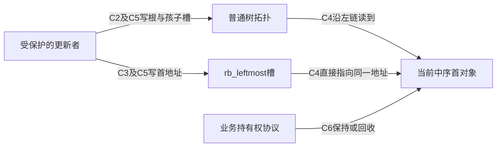
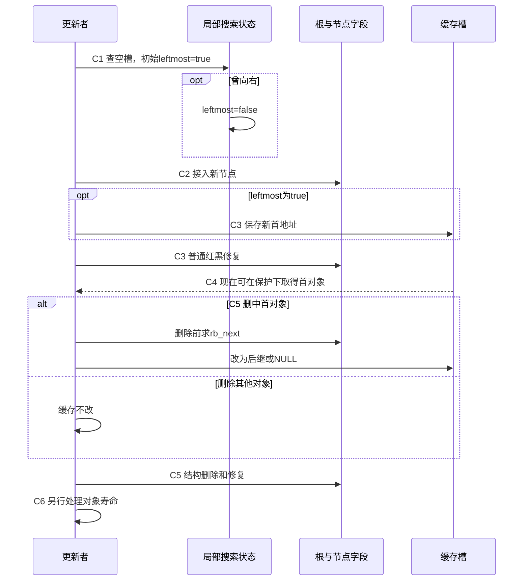

# 第12章\_Linux\_6.12\_内核\_rbtree\_工程扩展\_并发与验证

## 12.1\_章节内容说明

[P37 调用者框架](P37_构建rbtree调用者接口.md#37.16_运行完整的私有调用者框架)已把对象、计数和失败清理接成程序，后续查询、插入、删除、遍历和同键替换又逐项建立了底层契约。现在回到一组按到期时间排序的任务：若业务反复问“下一件事是什么”，每次都从根重新向左查找是否值得？

### 12.1.1\_本章在\_Linux\_rbtree\_学习路线中的位置

默认路线 P08/P09/P37 → P10/P26 → P11/P27/P28 → P29 已建立类型、业务持有权、更新与返回边界。P28 留下额外缓存与摘要的维护责任；[P29 完成边界](P29_普通旋转与Linux修复的完成边界.md#29.5_回顾与练习)说明回调中间态不等于整轮完成。本章据此讨论三类不同问题：保存一个可直接取得的首节点入口、随子树变化维护摘要，以及在真实读写协议下验证结果。它们不互相替代。

先在 12.2 解释缓存根的正常与故障过程，再进入增强信息、并发、接口和验证。取首常量时间不等于删除或整个调度操作常量时间；增加一个指针也不表示它自动具有新的并发保证。

### 12.1.2\_本章参照的源码文件

固定版本从[NXP Linux 6.12.20 源码总索引](../../../../research/source_reading/rbtree/navigation/P01_Linux_6.12_rbtree源码阅读索引.md#1.1_固定提交与阅读边界)进入，不再引用旧的 kernel_source 路径。正文解释为何需要这些状态；实现语句按上游位置在源码层单独展开：

| 上游位置 | 本章的阅读任务 |
| --- | --- |
| include/linux/rbtree_types.h | rb_root_cached 的普通根和最左入口 |
| include/linux/rbtree.h | 缓存取首、插入、删除、替换包装与比较辅助 |
| include/linux/rbtree_augmented.h | 增强回调、旋转时摘要与删除传播 |
| lib/rbtree.c | 通用修复、遍历、替换及无锁下行的说明边界 |

先沿[缓存模块导读](../../../../research/source_reading/rbtree/navigation/P08_最左缓存与结构更新导读.md#8.2_沿接入与摘除跟踪C0到C6)观察状态地址，再按需要进入具体实现；不能把当前本地配置或实验分支头当作固定发布证据。

## 12.2\_cached\_rbtree\_struct\_rb\_root\_cached

cached rbtree 是在普通树之外维护一个中序首地址的包装。没有改变红黑修复算法，而是增加了一项必须与树结构共同维护的不变量：稳定观察时，缓存地址应与沿左链找到的首节点 **完全相同**。有等价键时，“也是一个最小键”还不足以证明对象身份正确。

### 12.2.1\_为什么要缓存最左节点

普通根只保存拓扑根地址。`rb_first(root)` 从根逐次读取左孩子，直到没有更左的节点；实际读取几层取决于当前形状，红黑高度给出对数上界，空树则直接返回空。一次查询已经很便宜，但频繁重复会访问同一段路径。

设某个稳定树形取得首节点需要读 L 个节点，业务在下一次更新前询问一千次。普通方式仍做一千次左链查找；若在更新时保存首地址，一千次询问就各读一次缓存槽。这是操作数量的推导，不是缓存未命中或时间的实测，也没有假定每次左链都落到主存。

`struct rb_root_cached` 包含普通 `rb_root` 与 `rb_leftmost` 两个入口，完整类型见[缓存根实现](../../../../research/source_reading/rbtree/source_explanations/include/linux/rbtree_types.h.md#1.3_rb_root_cached增加一个最左入口)。`rb_first_cached()` 只读取后者，因此取得地址是 O(1)，但它不查树、不加锁、不取得引用，更不保证返回对象仍活着。宏体见[直接取首](../../../../research/source_reading/rbtree/source_explanations/include/linux/rbtree.h.md#1.12_缓存取首只读取入口)。

最早到期任务或下一个时间线事件是自然场景；若业务还需按位置、资格等额外条件挑选，最左节点未必就是最终候选。例如不能仅凭“调度器有虚拟运行时间”就推导所有版本的下一任务只读最左缓存，具体场景在本章后面分别核对。

### 12.2.2\_为什么只缓存最左节点\_不缓存最右节点

缓存不只占一枚指针，还在插入、删除和替换时增加判断与写入。两端都缓存，则每个采用该结构的根都需额外存储，并让两端的更新协议保持一致。固定头文件选择只提供最左入口；这是这份接口的工程取舍，不是最右端点在算法上难以缓存。

只有偶尔取最小、树很小或主要按任意键查询时，继续用普通根可以省掉额外不变量。反复取首且更新路径可统一维护缓存时，cached 根才更有吸引力。若需要频繁取最大或两端，业务可以另行设计对应入口，但要明确所有修改如何维护它们；不能只给结构体增加一个字段。

已有缓存根不因“也需要最大值”就一定不适用：仍可沿右链偶尔查询最大值，或在确有收益时增加另一端缓存。选择依据是观察与更新负载、字段成本和维护复杂度，最终性能需要同一场景测量。

### 12.2.3\_rb\_insert\_color\_cached()\_的使用方式

沿用普通插入的空槽搜索。新增局部布尔量 leftmost，初始 true：若一路向左，新节点将排在所有现存节点之前；只要有一次向右，就已有一个节点位于它之前，此后再向左也无法抹掉那个祖先。因此第一次向右时置 false，之后不恢复。

这里跟踪的是 **实际插入路径**。若等价键按“不小于则向右”处理，新对象并不是已有等价组中的首对象；不能只判断新键是否等于当前最小键就传 true。`rb_add_cached()` 已把搜索、标志计算、挂接和 cached 修复组合起来，它不做唯一键拒绝；需要拒绝重复的业务仍须使用相应搜索契约。

手写路径先 rb_link_node 接入空槽，再传入正确 leftmost 给 rb_insert_color_cached。包装先按标志写缓存，再调用普通修复。此时不是两份独立可随意观察的结构：C2 挂接后缓存可能仍旧，C3 写缓存后红黑修复可能尚未完成，调用者必须保护整个操作。

| 阶段 | 状态实际在哪里，谁修改 | 稳定性与后续动作 |
| --- | --- | --- |
| C0 初始化 | 调用者写普通根与 rb_leftmost 为 NULL | 空树与空缓存同时成立 |
| C1 搜索 | 更新者的局部 parent、link、leftmost | 遇右置 false，直到得到空槽 |
| C2 挂接 | rb_link_node 写节点字段和根/孩子槽 | 尚未完成缓存及红黑修复 |
| C3 缓存与修复 | cached 包装按标志写 rb_leftmost，再调用普通插入修复 | 返回后才向受保护观察者承诺一致 |
| C4 取首 | 读者按协议读 rb_leftmost | 只省查找路径，不替代对象寿命保护 |
| C5 摘除 | 更新者必要时先用旧拓扑求后继并改缓存，再结构删除 | 返回时重新满足缓存等于当前中序首 |
| C6 退出 | 调用者处理其他入口和持有权 | 与树中是否还保存旧地址是不同问题 |





源码对应[搜索产生标志](../../../../research/source_reading/rbtree/source_explanations/include/linux/rbtree.h.md#1.15_辅助插入如何产生最左标志)与[缓存先写、修复随后](../../../../research/source_reading/rbtree/source_explanations/include/linux/rbtree.h.md#1.13_缓存写入先于插入修复)。rb_add_cached 返回新节点仅表示它新成首节点；返回 NULL 时节点也已经插入，不能按“失败”释放它。

### 12.2.4\_rb\_erase\_cached()\_如何更新最左缓存

若删除对象不是当前 rb_leftmost，首对象不变；若是，新的首对象是它的中序后继。必须在旧对象仍处于原拓扑时计算 rb_next，再修改缓存并调用 rb_erase。删除后旧节点不再是有效遍历起点，即使它的字段没有被清零；旋转和回接也可能改变其他节点的链接。

最后一个对象没有后继，缓存变为 NULL，结构删除后普通根也为空。返回值却要更仔细地读：固定 rb_erase_cached 的局部返回值初始 NULL，仅在删中缓存时赋为后继。因此下面两种删除都返回 NULL：删除非首对象而缓存未变；删除最后对象而后继为空。不能由这个返回值直接判断当前树是否有首节点。完整函数见[缓存删除](../../../../research/source_reading/rbtree/source_explanations/include/linux/rbtree.h.md#1.14_缓存删除先取后继)。

同键替换也属于维护入口的操作：若旧对象正是缓存对象，即使键值不变，也必须改成新对象地址。[P28 缓存替换](P28_Linux同键替换与旧对象退出.md)及[唯一包装实现](../../../../research/source_reading/rbtree/source_explanations/include/linux/rbtree.h.md#1.10_替换时的最左缓存入口)已区分这个地址身份变化。更新缓存没有撤销已有读者保存的旧地址，C6 仍须按持有权协议完成。

### 12.2.5\_cached\_rbtree\_的使用边界

使用 cached 根时，插入、删除、替换都要维持额外入口。只调用普通 rb_erase 可能留下“所有红黑性质都对，首指针却错”的状态。若旧对象被释放，继续相信缓存就会使用失效地址；若它尚存活，错误也不能因为暂时不崩溃而被忽略。

普通根和缓存不是一次原子写入，更没有因宏只读一个指针就自动支持无锁读者。当前标准包装需调用者完整保护更新；若需要另一种读写协议，应单独证明缓存发布、节点拓扑和回收条件，而不是把普通替换换成带 RCU 后缀的函数后就宣布完成。

#### (1)\_运行缓存一致性实验

下面用五个私有任务观察两种返回值与一次故障。按 `(deadline, id)` 排序，这组数据没有重复完整键；数组中的 active 是实验核对台账，不是 Linux 自动维护字段。它让我们独立扫描仍在树中的对象预测最小地址，再与普通左链和缓存比较。完整材料为 [note_rbtree_cached.c](../../../../labs/kernel/tree_basics/materials/note_rbtree_cached.c)：

```c
// SPDX-License-Identifier: GPL-2.0
/* 私有自动对象：缓存故障演示不会释放对象，也不发布并发入口。 */
#include <linux/init.h>
#include <linux/module.h>
#include <linux/rbtree.h>
#include <linux/errno.h>

struct cached_job {
    int deadline;
    unsigned int id;
    bool active;
    struct rb_node rb;
};

static bool job_less(struct rb_node *a, const struct rb_node *b)
{
    struct cached_job *first = rb_entry(a, struct cached_job, rb);
    const struct cached_job *second = rb_entry(b, struct cached_job, rb);
    if (first->deadline != second->deadline)
        return first->deadline < second->deadline;
    return first->id < second->id;
}

/* 数组扫描独立预测最小对象，不从缓存或树的左链生成预期值。 */
static bool cache_matches(struct rb_root_cached *root, struct cached_job *jobs,
                          unsigned int count)
{
    struct cached_job *expected = NULL;
    unsigned int i;
    for (i = 0; i < count; ++i) {
        if (jobs[i].active && (!expected || job_less(&jobs[i].rb, &expected->rb)))
            expected = &jobs[i];
    }
    return rb_first_cached(root) == (expected ? &expected->rb : NULL) &&
           rb_first(&root->rb_root) == (expected ? &expected->rb : NULL);
}

static int __init note_cached_init(void)
{
    struct cached_job jobs[] = {
        {.deadline = 40, .id = 0}, {.deadline = 10, .id = 1},
        {.deadline = 40, .id = 2}, {.deadline = 25, .id = 3},
        {.deadline = 70, .id = 4}
    };
    struct rb_root_cached root = RB_ROOT_CACHED;
    struct rb_node *result;
    unsigned int i;

    if (!cache_matches(&root, jobs, ARRAY_SIZE(jobs)))
        return -EINVAL;
    for (i = 0; i < ARRAY_SIZE(jobs); ++i) {
        result = rb_add_cached(&jobs[i].rb, &root, job_less);
        jobs[i].active = true;
        if (result != (i < 2 ? &jobs[i].rb : NULL) ||
            !cache_matches(&root, jobs, ARRAY_SIZE(jobs)))
            return -EINVAL;
    }
    pr_info("note_cached: five inserts, first=10:1\n");

    result = rb_erase_cached(&jobs[4].rb, &root); /* 删除非最小的 70。 */
    jobs[4].active = false;
    if (result || !cache_matches(&root, jobs, ARRAY_SIZE(jobs)))
        return -EINVAL;
    pr_info("note_cached: erase non-first returns NULL, first still exists\n");

    result = rb_erase_cached(&jobs[1].rb, &root); /* 最小从 10 变为 25。 */
    jobs[1].active = false;
    if (result != &jobs[3].rb || !cache_matches(&root, jobs, ARRAY_SIZE(jobs)))
        return -EINVAL;
    pr_info("note_cached: erase first returns 25:3\n");

    /* 故意混用普通删除：树结构更新，但额外入口仍指向已摘除的25。 */
    rb_erase(&jobs[3].rb, &root.rb_root);
    jobs[3].active = false;
    if (cache_matches(&root, jobs, ARRAY_SIZE(jobs)))
        return -EINVAL;
    pr_info("note_cached: ordinary erase leaves a stale cache\n");
    /* 故障演示中对象仍活着且完全独占，重建缓存后继续观察。 */
    root.rb_leftmost = rb_first(&root.rb_root);
    if (!cache_matches(&root, jobs, ARRAY_SIZE(jobs)))
        return -EINVAL;

    while ((result = rb_first_cached(&root)) != NULL) {
        struct cached_job *item = rb_entry(result, struct cached_job, rb);
        rb_erase_cached(result, &root);
        item->active = false;
        if (!cache_matches(&root, jobs, ARRAY_SIZE(jobs)))
            return -EINVAL;
    }
    pr_info("note_cached: empty tree and empty cache agree\n");
    return 0;
}

static void __exit note_cached_exit(void)
{
    /* 根与节点均为初始化期间私有自动对象，没有外部保存其地址。 */
}
module_init(note_cached_init);
module_exit(note_cached_exit);
MODULE_LICENSE("GPL");
MODULE_DESCRIPTION("Private cached rbtree invariant exercise");
```

先预测：插入 40:0 时它是首对象；插入 10:1 后首对象改变；后面三次返回 NULL，但都已插入。删除 70:4 返回 NULL 且树不空；删除 10:1 返回后继 25:3。故意用普通删除摘掉 25:3 时，树会修复，缓存仍保存那个旧成员地址，数组核对就会发现不一致。

故障对象是仍然存活的局部数组元素，程序不会释放它，也没有并发入口。因此这里能安全比较地址并在独占条件下重新计算缓存，以便继续后面的观察；这不是建议生产代码对任意悬空缓存进行解引用后再修补。真正的修正是让所有合法修改路径维持不变量。

所有对象与根都仅在初始化函数里存活，既无动态申请也无外部发布，任何检查失败返回都没有堆对象或共享入口需要回收。成功路径逐个 cached 摘除到空。程序没有用 RB_EMPTY_NODE 作为台账，因此不要求额外清游离标记；若业务采用该协议，应按自己的安全时机维护。

已有 [Makefile](../../../../labs/kernel/tree_basics/materials/Makefile) 登记该模块。Linux 构建环境先设置匹配目标内核的 KDIR，并按工具链设置 ARCH/CROSS_COMPILE；在仓库根目录构建：

```bash
: "${KDIR:?先设置匹配目标内核的构建目录}"
make -C "$KDIR" M="$PWD/labs/kernel/tree_basics/materials" modules
```

把 note_rbtree_cached.ko 放到匹配目标系统后，从它所在目录执行：

```bash
sudo insmod ./note_rbtree_cached.ko
sudo dmesg | tail -n 30
sudo rmmod note_rbtree_cached
```

成功时预期五条核心消息如下；初始化失败时先检查 insmod 错误和日志，不假定模块已经加载：

```text
note_cached: five inserts, first=10:1
note_cached: erase non-first returns NULL, first still exists
note_cached: erase first returns 25:3
note_cached: ordinary erase leaves a stale cache
note_cached: empty tree and empty cache agree
```

本轮 ARMv7 前端与宿主显式适配检查已执行，目标 Kbuild、MODPOST、装卸及这组目标日志未执行。宿主父色位宽和访问宏有适配，只检查串行算法与接口返回，不证明内核 ABI、并发可见性或实际缓存性能。

### 12.2.6\_本节小结

缓存把反复查找首节点的工作移到更新者维护的额外入口，但不改变树操作和寿命契约。按 C0～C6 核对的是两个槽、树结构与对象持有三组不同状态；稳定时首地址一致，中间态需被保护。三个练习检查这个认识：

1. 将 25 的输入改为 5，哪次插入会新成首节点？它会排在 10 之前，rb_add_cached 那次返回该节点；测试预期也须随输入契约改变，不能继续硬编码“只有前两次返回节点”。
2. 删除非首对象时返回 NULL，能据此清空 root.rb_leftmost 吗？不能，NULL 在这个分支只是没有新的首地址要报告，原缓存仍正确。
3. 只比较缓存键值与最小键值，能发现所有错误吗？不能，两个等价键对象地址不同；还需核对当前中序首对象身份以及它是否仍为有效成员。

下一节不再缓存一个端点，而是给每个子树增加摘要。旋转仍保持中序关系，却会改变哪些节点属于某个子树，因此仅保存最左地址的办法不能直接维护区间最大值等增强信息。


## 12.3\_augmented\_rbtree\_增强红黑树

### 12.3.1\_什么是\_augmented\_rbtree

普通 rbtree 只维护：

```text
BST 排序关系；
红黑性质；
父子指针；
颜色。
```

augmented rbtree 还要求每个业务节点保存某种“子树聚合信息”。

典型例子：

```text
区间树中，每个节点保存子树最大 end；
这样查询某个点或区间是否重叠时，可以跳过不可能命中的子树。
```

增强信息可能是：

```text
子树最大值；
子树最小值；
子树区间上界；
子树统计量；
调度或内存管理中的聚合元数据。
```

普通 rbtree 不知道这些业务字段。

所以 Linux 用回调让使用者参与维护。

------

### 12.3.2\_struct\_rb\_augment\_callbacks\_的三个回调

增强树回调结构：

```c
struct rb_augment_callbacks {
	void (*propagate)(struct rb_node *node, struct rb_node *stop);
	void (*copy)(struct rb_node *old, struct rb_node *new);
	void (*rotate)(struct rb_node *old, struct rb_node *new);
};
```

三个回调分别处理三类变化。

`propagate`：

```text
从某个节点向上重新计算增强信息；
直到 stop 或根。
```

插入、删除后，沿路径上的祖先子树内容变了，需要传播更新。

`copy`：

```text
删除有两个孩子的节点时，successor 接替 node 的位置；
successor 需要复制 node 的增强信息。
```

`rotate`：

```text
旋转改变两个节点的子树范围；
old 和 new 的增强信息需要更新。
```

这三个回调正好对应 rbtree 结构变化的三个位置：

```text
路径变化；
节点替换；
旋转变化。
```

------

### 12.3.3\_增强信息为什么需要随旋转更新

旋转保持中序顺序，但会改变子树归属。

例如左旋：

```text
    old                 new
      \                /
      new     -->    old
      /                \
     T                T
```

中序顺序不变：

```text
old 左侧
old
T
new
new 右侧
```

但子树范围变了：

```text
old 旋转后不再覆盖 new 的右子树；
new 旋转后覆盖 old 整个局部子树。
```

如果增强信息是“子树最大 end”，那么：

```text
new 的增强信息通常先继承 old；
old 的增强信息需要根据新左右孩子重新计算。
```

`RB_DECLARE_CALLBACKS()` 生成的 rotate 回调就是这个思路：

```text
new->augmented = old->augmented;
重新计算 old。
```

这和旋转后的结构关系一致：

```text
new 接替 old 原来的局部子树根位置；
old 变成 new 的一个孩子。
```

------

### 12.3.4\_RB\_DECLARE\_CALLBACKS()\_与\_RB\_DECLARE\_CALLBACKS\_MAX()

`rbtree_augmented.h` 提供宏帮助生成回调。

通用宏：

```text
RB_DECLARE_CALLBACKS()
```

需要调用者提供：

```text
业务结构体类型；
rb_node 成员名；
增强字段名；
重新计算函数。
```

它生成：

```text
xxx_propagate()
xxx_copy()
xxx_rotate()
struct rb_augment_callbacks xxx
```

另一个常用宏：

```text
RB_DECLARE_CALLBACKS_MAX()
```

用于这种典型模式：

```text
节点的增强字段 = 当前节点值、左子树增强值、右子树增强值三者最大值。
```

这正适合区间树的 `subtree_last` / `max_end` 一类字段。

宏的价值是：

```text
减少手写回调错误；
统一旋转、复制、传播的处理模板；
让常见“子树最大值”增强模式更容易使用。
```

------

### 12.3.5\_rb\_insert\_augmented()\_的插入流程

增强树插入不能只调用：

```c
rb_insert_color()
```

而是调用：

```c
rb_insert_augmented(node, root, augment);
```

但在调用之前，使用者还必须：

```text
沿插入搜索路径更新增强信息。
```

原因是：

```text
新节点加入后，它的所有祖先子树内容都变了；
即使后面没有旋转，这些祖先的增强字段也可能需要更新。
```

插入流程应该是：

```text
搜索插入落点；
沿路径根据新节点更新祖先增强字段；
rb_link_node() 挂接；
rb_insert_augmented() 做红黑修复；
如果修复中发生旋转，rotate 回调更新旋转点增强字段。
```

`rb_add_augmented_cached()` 的源码中也体现了这一点：

```text
rb_link_node()
augment->propagate(parent, NULL)
rb_insert_augmented_cached()
```

注释里标了 `suboptimal`，因为它是在挂接后从 parent 向上统一传播，不一定是最优路径更新方式，但语义是完整的。

------

### 12.3.6\_rb\_erase\_augmented()\_的删除流程

增强树删除调用：

```c
rb_erase_augmented(node, root, augment);
```

内部仍然是两段：

```text
__rb_erase_augmented()
	结构删除，同时调用 copy / propagate；

__rb_erase_color()
	如果需要颜色修复，旋转时调用 augment->rotate。
```

删除时增强信息最容易出错的位置有两个。

第一，后继节点接替被删节点。

这时需要：

```text
augment->copy(node, successor)
```

让 successor 继承 node 原位置的增强信息。

第二，successor 从原位置移走。

这会改变 successor 原路径上的子树内容，所以需要：

```text
augment->propagate(parent, successor)
```

最后结构删除完成后，还会：

```text
augment->propagate(tmp, NULL)
```

继续向上修正。

如果删除修复发生旋转，则：

```text
augment_rotate(parent, sibling)
```

会更新旋转相关节点。

------

### 12.3.7\_增强树为什么容易让代码体积膨胀

`rbtree_augmented.h` 注释提到：

```text
被编译单元最好只有一个 rb_erase_augmented() 调用点，
因为内联会导致代码体积增加。
```

原因是：

```text
增强树为了性能，大量使用 __always_inline；
回调和删除骨架会被内联展开；
每个不同调用点都可能实例化一份较大的代码。
```

这是性能和代码体积的取舍。

内核倾向于：

```text
热点数据结构路径尽量减少间接调用；
允许局部代码体积增加；
但提醒使用者控制调用点。
```

------

### 12.3.8\_本节小结

augmented rbtree 的核心结论：

```text
第一，增强树在普通排序关系之外维护子树聚合信息。

第二，propagate、copy、rotate 分别处理路径传播、节点替换和旋转更新。

第三，插入增强树时，调用者要先维护插入路径上的增强信息。

第四，删除增强树时，结构删除和颜色修复都可能触发增强信息更新。

第五，增强树为了性能大量内联，代码体积更容易膨胀。
```

------

## 12.4\_rbtree\_与并发控制

### 12.4.1\_为什么\_rbtree\_核心不内置锁

Linux rbtree 不保存锁。

原因是不同使用场景的并发模型不同：

```text
有的树只在单线程初始化阶段使用；
有的树由 spinlock 保护；
有的树由 mutex 保护；
有的读侧走 RCU；
有的对象还有引用计数；
有的树嵌在更大的对象锁之下。
```

如果 rbtree 核心内置锁，会带来问题：

```text
锁类型无法统一；
锁粒度无法统一；
中断上下文和进程上下文需求不同；
可能和调用者已有锁重复；
无法处理对象生命周期。
```

所以 Linux rbtree 只提供结构操作。

并发保护由调用者决定。

------

### 12.4.2\_使用者需要保护哪些操作

至少需要保护：

```text
查找和插入之间的竞争；
两个插入之间的竞争；
插入和删除之间的竞争；
两个删除之间的竞争；
遍历和删除之间的竞争；
删除和对象释放之间的竞争；
替换和读者访问之间的竞争。
```

一个简单模型是：

```c
spin_lock(&tree->lock);
/* search / insert / erase / replace */
spin_unlock(&tree->lock);
```

如果查找结果要在解锁后使用，还需要：

```text
引用计数；
RCU；
对象生命周期保证；
或者复制数据而不是返回裸指针。
```

否则容易出现：

```text
查找到 item；
释放锁；
另一个 CPU 删除并释放 item；
当前 CPU 继续使用 item；
use-after-free。
```

------

### 12.4.3\_WRITE\_ONCE()\_在\_rbtree\_实现中的意义

`lib/rbtree.c` 开头有一段 lockless lookup 注释。

本节按[固定版本索引](../../../../research/source_reading/rbtree/navigation/P01_Linux_6.12_rbtree源码阅读索引.md#1.1_固定提交与阅读边界)核对；[P10 完整 C 实验](P10_Linux_6.12_内核_rbtree_查找与返回边界.md#10.2.10_用完整C程序观察相等节点和旧路径)已经展示旧根漏查和错误写序形成的环，这里把它落实为调用者的并发边界。

它强调：

```text
所有对 rb_left 和 rb_right 的树结构写入必须使用 WRITE_ONCE()。
同时，写入顺序不能在程序顺序中构造临时环。
```

目的不是提供完整无锁正确性。

在比较字段和对象寿命有效、并满足上述改边约束时，注释讨论的向下查询具有以下有限保证：

```text
读者不会因为临时结构看到循环而卡死；
遍历会最终结束；
如果读者返回某个元素，这个元素是正确的。
```

它不保证：

```text
读者一定能看到所有节点；
读者一定不会漏掉并发旋转影响的子树；
查找返回 NULL 就代表节点不存在；
对象生命周期自动安全。
```

`WRITE_ONCE()` 约束单次访问，不能替代第二条改边顺序要求；先建立反向边、后撤旧边仍会出现环。注释还明确不涵盖父指针的循环检查，所以 `rb_next()` 或 `rb_for_each()` 沿父链前进时，不能借用这项向下查询保证。整个论证也不自动授予对象的返回后寿命。

------

### 12.4.4\_RCU\_查找与普通修改路径的区别

RCU 相关接口包括：

```text
rb_link_node_rcu()
rb_find_rcu()
rb_replace_node_rcu()
```

它们分别解决不同问题。

`rb_link_node_rcu()`：

```text
用 rcu_assign_pointer() 发布新节点链接；
保证读者看到链接时，新节点基本字段已经初始化。
```

`rb_find_rcu()`：

```text
读侧用 rcu_dereference_raw() 读取左右孩子；
允许 RCU 读路径下降查找。
```

固定版的首次取根仍是普通 `tree->rb_node` 表达式，函数内没有建立读侧临界区、重扫或取得引用。真实语句见[查找实现](../../../../research/source_reading/rbtree/source_explanations/include/linux/rbtree.h.md#1.4_rb_find_rcu的孩子读取与缺失边界)；入口发布、读侧保护与结果处置仍由调用者证明。

`rb_replace_node_rcu()`：

```text
先准备 replacement；
最后用 RCU 方式更新父节点孩子槽或根槽；
相容读者从发布入口取得 new 时，读取发布前准备的载荷和前向结构。
```

孩子的 parent 在最后发布之前已经改向 new，因此这不保证父链遍历的原子快照。cached 包装又先更新最左缓存，不能直接当成 RCU 组合接口。完整交接与回收条件见[同键替换周期](P28_Linux同键替换与旧对象退出.md#28.2.4_rb_replace_node_rcu%28%29_与_RCU_读侧安全)及[缓存入口](P28_Linux同键替换与旧对象退出.md#28.2.5_rb_replace_node_cached%28%29_如何维护最左缓存)。

但是写侧修改仍然需要同步。

RCU 不是多个写者同时旋转、插入、删除的许可证。

采用对应 RCU 读侧寿命方案时，撤下对象后应按该方案等待旧读者；如果还有引用持有者，也必须满足它们的释放条件。典型流程是：

```text
rb_erase()
call_rcu()
对应宽限期结束，且其他持有权已满足释放条件后回收
```

------

### 12.4.5\_lockless\_lookup\_能保证什么\_不能保证什么

可以把 lockless lookup 的保证写成两列。以下仍以正确发布、寿命受保护、比较字段稳定、孩子写入及其顺序符合上一节约束为前提，仅讨论向下查找。

能保证：

```text
不会因为临时环导致无限循环；
遍历到的节点是有效结构节点；
如果找到了匹配元素，它是正确的。
```

不能保证：

```text
一定找到并发存在的节点；
一定看到完整树结构；
不需要锁或 RCU 生命周期；
删除对象后可以立即释放；
多个写者可以无锁并发修改。
```

所以工程上不能把 rbtree 当成自动无锁容器。

更准确的理解是：

```text
rbtree 的指针写入方式尽量不给无锁读者制造灾难；
但正确并发语义仍然由调用者设计。
```

------

### 12.4.6\_本节小结

并发部分的结论：

```text
第一，rbtree 不内置锁，因为锁模型属于使用场景。

第二，调用者必须保护 search/insert/erase/replace 的并发关系。

第三，返回业务对象指针时必须处理生命周期。

第四，孩子访问约束与不成环的改边顺序共同支持有限的向下路径，但不保证查找完整性或父链遍历。

第五，RCU 接口只处理读侧访问和发布顺序，不替代写侧同步。
```

------

## 12.5\_Linux\_内核\_rbtree\_示例代码

### 12.5.1\_示例目标与约束

下面构造一个最小示例：

```text
按 int key 管理 demo_rb_item；
不允许重复 key；
使用 spinlock 保护树；
插入、查找、删除都使用同一套比较规则；
删除后返回对象，由调用者释放。
```

这不是完整内核模块，只是展示 rbtree 使用骨架。

------

### 12.5.2\_定义业务结构体与树对象

```c
struct demo_rb_item {
	int key;
	int value;
	struct rb_node rb;
};

struct demo_rb_tree {
	struct rb_root root;
	spinlock_t lock;
	unsigned int count;
};
```

初始化：

```c
static void demo_tree_init(struct demo_rb_tree *tree)
{
	tree->root = RB_ROOT;
	spin_lock_init(&tree->lock);
	tree->count = 0;
}
```

这里 `struct rb_root` 只保存根节点。

锁和计数都是业务层自己加的。

------

### 12.5.3\_实现统一比较函数

```c
static int demo_cmp_key(int key, const struct demo_rb_item *item)
{
	if (key < item->key)
		return -1;
	if (key > item->key)
		return 1;
	return 0;
}

static int demo_cmp_item(const struct demo_rb_item *a,
			 const struct demo_rb_item *b)
{
	return demo_cmp_key(a->key, b);
}
```

这样查找和插入都能使用同一套 key 规则。

这比到处手写 `<`、`>` 更不容易写偏。

------

### 12.5.4\_实现查找

```c
static struct demo_rb_item *
demo_search_locked(struct demo_rb_tree *tree, int key)
{
	struct rb_node *node = tree->root.rb_node;

	while (node) {
		struct demo_rb_item *item;
		int cmp;

		item = rb_entry(node, struct demo_rb_item, rb);
		cmp = demo_cmp_key(key, item);

		if (cmp < 0)
			node = node->rb_left;
		else if (cmp > 0)
			node = node->rb_right;
		else
			return item;
	}

	return NULL;
}
```

函数名里带 `_locked`，表示调用者必须已经持有 `tree->lock`。

这是内核代码中常见的命名习惯：

```text
把锁语义写进函数名，避免误用。
```

------

### 12.5.5\_实现插入

```c
static int demo_insert(struct demo_rb_tree *tree,
		       struct demo_rb_item *item)
{
	struct rb_node **link = &tree->root.rb_node;
	struct rb_node *parent = NULL;

	spin_lock(&tree->lock);

	while (*link) {
		struct demo_rb_item *this;
		int cmp;

		parent = *link;
		this = rb_entry(parent, struct demo_rb_item, rb);
		cmp = demo_cmp_item(item, this);

		if (cmp < 0)
			link = &parent->rb_left;
		else if (cmp > 0)
			link = &parent->rb_right;
		else {
			spin_unlock(&tree->lock);
			return -EEXIST;
		}
	}

	rb_link_node(&item->rb, parent, link);
	rb_insert_color(&item->rb, &tree->root);
	tree->count++;

	spin_unlock(&tree->lock);
	return 0;
}
```

这里有几个关键点：

```text
发现重复 key 时，不调用 rb_link_node()；
只有成功找到空 link 后才挂接；
rb_link_node() 后立刻 rb_insert_color()；
count 在修复完成后增加；
整个修改路径在锁内完成。
```

------

### 12.5.6\_实现删除

```c
static int demo_remove(struct demo_rb_tree *tree, int key,
		       struct demo_rb_item **removed)
{
	struct demo_rb_item *item;

	if (!removed)
		return -EINVAL;

	*removed = NULL;

	spin_lock(&tree->lock);

	item = demo_search_locked(tree, key);
	if (!item) {
		spin_unlock(&tree->lock);
		return -ENOENT;
	}

	rb_erase(&item->rb, &tree->root);
	RB_CLEAR_NODE(&item->rb);
	tree->count--;
	*removed = item;

	spin_unlock(&tree->lock);
	return 0;
}
```

这个函数只从树中摘除节点，不释放对象。

调用者可以根据生命周期选择：

```c
kfree(item);
demo_item_put(item);
call_rcu(&item->rcu, demo_item_free_rcu);
```

这正是 Linux rbtree 的对象生命周期边界。

------

### 12.5.7\_实现中序遍历

```c
static void demo_dump_locked(struct demo_rb_tree *tree)
{
	struct rb_node *node;

	for (node = rb_first(&tree->root); node; node = rb_next(node)) {
		struct demo_rb_item *item;

		item = rb_entry(node, struct demo_rb_item, rb);
		pr_info("key=%d value=%d\n", item->key, item->value);
	}
}
```

中序遍历输出顺序就是 key 从小到大。

如果遍历期间可能有并发修改，应按协议稳定遍历依赖的拓扑并保护对象寿命。仅延迟释放不能稳定父链；中序循环的条件见[有序推进](P27_Linux有序遍历与整树销毁.md#27.2.8_为什么一个保存的地址仍会漏访)。

------

### 12.5.8\_实现整棵树清理

一种简单清理方式是反复取最小节点：

```c
static void demo_clear(struct demo_rb_tree *tree)
{
	struct rb_node *node;

	spin_lock(&tree->lock);
	while ((node = rb_first(&tree->root))) {
		struct demo_rb_item *item;

		item = rb_entry(node, struct demo_rb_item, rb);
		rb_erase(node, &tree->root);
		RB_CLEAR_NODE(node);
		tree->count--;
		spin_unlock(&tree->lock);

		kfree(item);

		spin_lock(&tree->lock);
	}
	spin_unlock(&tree->lock);
}
```

也可以使用后序遍历做销毁，但要注意第 11 章讲过的限制：

```text
postorder safe 不适合循环体中随意 rb_erase() 导致重平衡后继续依赖原遍历关系。
```

最保守的写法是：

```text
每次 rb_first()；
每次 rb_erase()；
直到树空。
```

每次重新取最左可以避开上一次游标因旋转失效的问题，但上面每轮释放锁，整个清理不是原子事务。要保证最终清空，还须停止或约束其他写者继续插入；kfree 也要求没有外部持有者。后序整树回收需要更强的排他销毁前提，完整对照见[遍历与销毁模块](P27_Linux有序遍历与整树销毁.md#27.2.9_运行完整遍历与销毁模块)。

------

### 12.5.9\_示例代码的边界

这个示例没有覆盖：

```text
RCU 读侧；
引用计数；
重复 key；
cached rbtree；
augmented rbtree；
错误注入；
模块参数；
调试断言。
```

但它覆盖了普通 rbtree 使用的核心闭环：

```text
定义对象；
嵌入 rb_node；
统一比较；
查找；
插入；
删除；
遍历；
生命周期交给调用者。
```

------

## 12.6\_Linux\_rbtree\_调试与验证

### 12.6.1\_如何验证\_BST\_有序性

最直接的方法是中序遍历。

遍历时记录上一个 key：

```text
prev_key <= current_key
```

如果不允许重复：

```text
prev_key < current_key
```

一旦出现逆序，说明：

```text
插入比较规则错误；
替换节点 key 错误；
手写 search / insert 不一致；
或者某处错误修改了 rb_left / rb_right。
```

红黑修复不会主动检查业务 key。

所以 BST 有序性验证必须由业务层或调试工具完成。

------

### 12.6.2\_如何验证父指针正确性

递归或栈遍历整棵树，对每个节点检查：

```text
如果 node->rb_left 存在：
	rb_parent(node->rb_left) == node

如果 node->rb_right 存在：
	rb_parent(node->rb_right) == node
```

根节点检查：

```text
rb_parent(root->rb_node) == NULL
```

父指针错误常见来源：

```text
手写旋转错误；
错误使用 rb_replace_node()；
破坏 __rb_parent_color；
把节点重复插入不同树；
删除后继续把旧节点当树中节点使用。
```

------

### 12.6.3\_如何验证红节点没有红孩子

遍历每个节点：

```text
如果 node 是红色：
	left 必须是 NULL 或黑色；
	right 必须是 NULL 或黑色。
```

Linux 中 NULL 叶子按黑色理解。

所以检查逻辑是：

```text
NULL 不算红；
非 NULL 才需要 rb_is_red()。
```

如果出现红红冲突，重点排查：

```text
插入后是否忘记 rb_insert_color()；
删除修复是否被跳过；
是否手动改过颜色；
是否误用 rb_replace_node() 替换了不等价节点。
```

------

### 12.6.4\_如何验证所有路径黑高一致

黑高验证可以递归实现。

对每个节点：

```text
左子树黑高；
右子树黑高；
二者必须相等；
当前节点是黑色则返回子树黑高 + 1；
当前节点是红色则返回子树黑高。
```

NULL 叶子按黑色叶子处理时，要统一计数规则。

可以约定：

```text
NULL 返回 1；
黑色实体节点在子树黑高基础上 +1；
红色实体节点不增加。
```

也可以约定：

```text
NULL 返回 0；
只统计实体黑节点。
```

关键是整棵检查使用同一套规则。

黑高不一致通常说明：

```text
删除黑色节点后没有正确修复；
Case 2 向上推进处理错；
Case 4 染色错；
父指针或旋转导致子树接错。
```

------

### 12.6.5\_如何验证\_cached\_rbtree\_的\_rb\_leftmost

cached 验证很简单：

```text
rb_first(&root->rb_root) == root->rb_leftmost
```

如果不相等，说明 cached 信息失效。

常见原因：

```text
插入时 leftmost 参数算错；
对 cached tree 调用了普通 rb_insert_color()；
删除时调用了普通 rb_erase()；
替换最左节点时调用了普通 rb_replace_node()；
手动移动节点但没有维护 rb_leftmost。
```

------

### 12.6.6\_如何验证\_augmented\_rbtree\_的增强信息

增强树验证要按业务字段重算。

例如增强字段是子树最大 end：

```text
expected = node->end;
if (left)
	expected = max(expected, left->subtree_max);
if (right)
	expected = max(expected, right->subtree_max);
node->subtree_max 必须等于 expected。
```

可以整树递归重新计算一遍，并与节点保存值比较。

如果错误，重点排查：

```text
插入搜索路径上是否更新了增强信息；
rotate 回调是否正确；
copy 回调是否正确；
删除 successor 原路径是否 propagate；
是否混用了普通 rb_insert_color() / rb_erase()。
```

------

### 12.6.7\_如何构造插入修复测试序列

可以构造三类插入序列。

父红叔红：

```text
插入形成 4-node 分裂。
例如先让祖父有两个红孩子，再向其中一个红孩子下插入。
```

内侧结构：

```text
LR：插入 30, 10, 20
RL：插入 10, 30, 20
```

外侧结构：

```text
LL：插入 30, 20, 10
RR：插入 10, 20, 30
```

这些序列能触发：

```text
Case 1 染色；
Case 2 预旋转；
Case 3 最终旋转。
```

------

### 12.6.8\_如何构造删除修复测试序列

删除修复测试更适合从目标形态反推。

要覆盖：

```text
兄弟红；
兄弟黑双侄黑；
兄弟黑近侄红；
兄弟黑远侄红。
```

测试思路：

```text
先构造一棵合法红黑树；
选择删除一个黑色叶子或黑色单子树位置；
观察 rebalance parent、sibling、near nephew、far nephew。
```

不要只看最终中序结果。

删除测试应该同时验证：

```text
BST 有序性；
父指针；
红红冲突；
黑高一致；
root 为黑；
遍历前驱后继；
cached / augmented 信息。
```

------

### 12.6.9\_本节小结

调试验证要分层：

```text
BST 层：
	中序顺序。

结构层：
	父指针、root、左右孩子。

红黑层：
	根黑、红节点无红孩子、黑高一致。

工程扩展层：
	cached leftmost、augmented 字段。

生命周期层：
	删除后不再通过树访问、对象释放安全。
```

只验证中序遍历不够。

一棵树可能中序顺序正确，但红黑性质已经坏了，后续复杂插入删除迟早出问题。

------

## 12.7\_Linux\_rbtree\_常见误区

### 12.7.1\_误以为内核\_rbtree\_会自动比较\_key

不会。

`struct rb_node` 不保存 key。

比较逻辑必须由调用者提供。

------

### 12.7.2\_误以为\_rb\_link\_node()\_已完成红黑修复

没有。

`rb_link_node()` 只做 BST 挂接。

挂接后必须调用：

```c
rb_insert_color()
```

或增强树版本：

```c
rb_insert_augmented()
```

------

### 12.7.3\_误以为\_rb\_erase()\_会释放业务对象

不会。

`rb_erase()` 只摘除 `rb_node`。

业务对象释放由调用者决定。

------

### 12.7.4\_误以为\_rb\_replace\_node()\_可以替换任意\_key

不能。

`rb_replace_node()` 不重新比较。

replacement 必须保持相同排序位置。

------

### 12.7.5\_误以为遍历时可以任意删除节点

不能。

`rb_erase()` 可能旋转，破坏遍历过程中预期的结构关系。

删除遍历要专门设计。

------

### 12.7.6\_误以为\_rbtree\_自带并发保护

没有。

锁、RCU、引用计数都属于调用者责任。

------

### 12.7.7\_误以为\_RCU\_接口让所有修改路径都无锁安全

不会。

RCU 接口主要处理读侧访问和发布顺序。

多个写者之间仍然需要同步。

------

### 12.7.8\_误以为\_cached\_/\_augmented\_会自动维护业务字段

不会。

cached 需要正确维护 `leftmost`。

augmented 需要正确提供并调用回调。

------

## 12.8\_Linux\_rbtree\_在内核中的典型使用场景

### 12.8.1\_高精度定时器为什么适合缓存最小节点

高精度定时器关心：

```text
下一个最早到期的定时器是谁？
```

这就是最小 key 查询。

如果 key 是到期时间，最早到期就是最左节点。

因此 cached rbtree 非常适合这种场景：

```text
插入删除保持有序；
rb_first_cached() O(1) 获取最早到期事件。
```

------

### 12.8.2\_调度实体按虚拟运行时间排序的思路

调度器需要在可运行实体中选择合适对象。

如果按虚拟运行时间排序：

```text
vruntime 小的实体更靠左；
最左节点代表当前最应该运行的实体之一。
```

rbtree 能提供：

```text
动态插入；
动态删除；
按 vruntime 排序；
快速找到最小 vruntime。
```

这种场景同样能从 leftmost 缓存受益。

------

### 12.8.3\_I/O\_调度与按位置排序

I/O 请求可能按扇区、偏移或设备位置排序。

有序结构可以支持：

```text
找到相邻请求；
合并相邻区间；
按位置选择下一个请求；
减少随机跳转成本。
```

哈希表适合等值查找，但不适合前驱后继和范围邻近关系。

rbtree 的中序关系正适合这类需求。

------

### 12.8.4\_epoll\_等对象集合为什么可能需要有序管理

某些对象集合不仅需要保存对象，还需要：

```text
按 fd、地址、时间或其他 key 管理；
快速查找；
有序遍历；
插入删除稳定。
```

rbtree 可以作为底层有序集合。

但是否使用 rbtree，要看具体内核版本和具体子系统实现。

不要把“某场景历史上用过 rbtree”理解成“永远必须用 rbtree”。

------

### 12.8.5\_VMA\_历史上使用\_rbtree\_与后来转向\_Maple\_Tree\_的原因

VMA 是虚拟内存区域。

它天然是范围结构：

```text
[start, end)
```

历史上可以用 rbtree 按起始地址组织 VMA。

这样能支持：

```text
按地址查找所在 VMA；
查找前驱后继；
插入删除区间。
```

但 VMA 管理不是单纯的点 key 有序集合。

它更偏向：

```text
范围查找；
范围更新；
减少锁竞争；
更适合缓存和批量遍历的数据结构。
```

Maple Tree 为这类非重叠范围提供容器接口。完整取舍与 G/H 更新实例见[P14](P14_Maple_Tree_与_VMA_管理.md#14.1_一个地址为什么需要三种查询)，不能仅因实现更新就认定所有负载更快。

更准确地说，新内核的 VMA 管理已经从传统：

```text
mm_struct
	-> mmap        // VMA 链表
	-> mm_rb       // VMA 红黑树
```

转向：

```text
mm_struct
	-> mm_mt       // maple_tree
```

也就是：

```c
struct maple_tree mm_mt;
```

VMA 查找、遍历、插入、删除更多走 `maple_tree` / `vma_iterator` 这一套。

Maple Tree 官方文档把它描述为一种 B-Tree 数据类型，优化用于保存非重叠范围，支持范围迭代、cache-efficient 的 previous / next 访问和 RCU-safe 模式，并明确说它最重要的用途是跟踪 VMA。([Linux Kernel Documentation](https://docs.kernel.org/core-api/maple_tree.html))

Maple Tree 引入补丁系列也明确提到，它替换了 VMA 管理里的 augmented rbtree、VMA cache 和 VMA linked list；补丁组织中还包含从 `mm_struct` 移除 rbtree、引入 VMA iterator 等修改。([LKML](https://lkml.iu.edu/2202.1/09876.html))

但这句话不能扩大成：

```text
新内核已经不用 rbtree；
任务管理也改成 Maple Tree；
所有有序集合都应该换成 Maple Tree。
```

更稳的边界是：

| 子系统 | 新内核主要结构或方向 |
| --- | --- |
| 虚拟内存 VMA 管理 | Maple Tree |
| 页缓存 / 一些整数 ID 索引 | XArray / radix tree 演进 |
| 普通内核有序集合 | rbtree 仍然大量存在 |
| 公平调度任务选择 | 从 CFS 语义走向 EEVDF，不是 Maple Tree |

任务调度容易和这里混淆。

老 CFS 经典讲法里，可运行实体按 `vruntime` 组织在 `tasks_timeline` 红黑树上。

新内核公平调度的核心语义转向 EEVDF，关注的是 lag 和 virtual deadline，选择 eligible 且虚拟截止时间更早的任务。([Linux Kernel Documentation](https://docs.kernel.org/scheduler/sched-eevdf.html))

这属于调度算法语义变化，不是“调度任务也改用 Maple Tree”。

所以这里的学习重点是：

```text
rbtree 适合有序对象集合；
Maple Tree 更适合某些范围映射和 VMA 场景；
数据结构选择要看访问模式，而不是只看复杂度公式。
```

一句话总结：

```text
Maple Tree 主要替代的是内存管理里的 VMA rbtree / linked list 模型；
它不是泛泛替代整个内核中的 rbtree，也不是任务调度 EEVDF 的同义词。
```

------

### 12.8.6\_interval\_tree\_与\_augmented\_rbtree\_的关系

区间树是 augmented rbtree 的典型应用。

每个节点保存：

```text
区间起点；
区间终点；
子树最大终点。
```

按起点排序形成 BST。

查询某个区间是否重叠时，根据子树最大终点剪枝：

```text
如果左子树最大终点小于查询起点；
左子树不可能有重叠区间；
可以跳过。
```

这就是增强信息的价值：

```text
不改变 rbtree 的排序结构；
额外保存子树摘要；
让查询可以剪枝。
```

------

### 12.8.7\_从使用场景反推结构选择

可以用下面的方式选择结构：

| 需求 | 更可能适合的结构 |
| --- | --- |
| 小规模简单遍历 | 链表 |
| 等值查找 | 哈希表 |
| 整数索引到对象 | XArray / radix 类结构 |
| 有序 key、前驱后继、最小最大 | rbtree |
| 频繁取最小 key | cached rbtree |
| 需要子树聚合信息 | augmented rbtree |
| 范围映射和区间管理 | Maple Tree / interval tree 等 |

不要把 rbtree 当万能结构。

它解决的是：

```text
动态有序集合。
```

------

## 12.9\_本章小结

本章把 Linux rbtree 的工程扩展收束起来。

cached rbtree 的核心是：

```text
用 rb_leftmost 把 rb_first() 优化成 O(1)；
代价是插入、删除、替换时必须维护缓存。
```

augmented rbtree 的核心是：

```text
在普通红黑树结构之外维护子树增强信息；
通过 propagate、copy、rotate 三个回调覆盖路径传播、节点替换和旋转更新。
```

并发控制的核心是：

```text
rbtree 不内置锁；
WRITE_ONCE() 需要配合不成环的改边顺序，且向下查找保证不涵盖父链遍历；
RCU 接口处理发布和读侧访问；
完整并发语义仍然属于调用者。
```

调试验证的核心是：

```text
不能只验证中序顺序；
还要验证父指针、红黑性质、黑高、cached leftmost、augmented 字段和对象生命周期。
```

到这里，Linux 6.12 rbtree 的工程实现主线已经完整：

```text
基础结构
	↓
嵌入式节点与使用者接口
	↓
查找、插入与旋转修复
	↓
删除、遍历与替换
	↓
cached / augmented / 并发 / 验证 / 场景
```

接着先读[P34 页级索引与访问成本](P34_从多路节点到页级索引.md#34.1_高度相同不等于访问成本相同)，区分页请求、缓存和存储定位，再沿 P13 继续多路页布局和范围查询。
