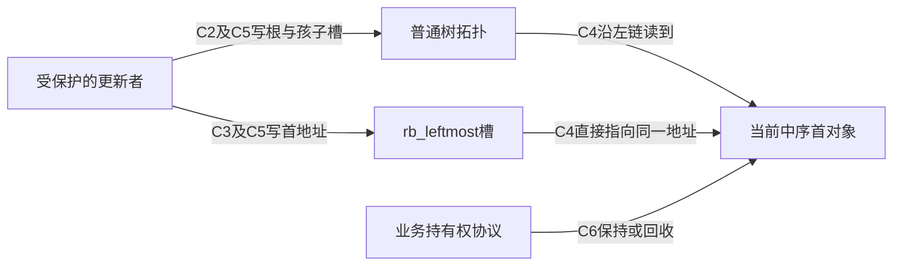
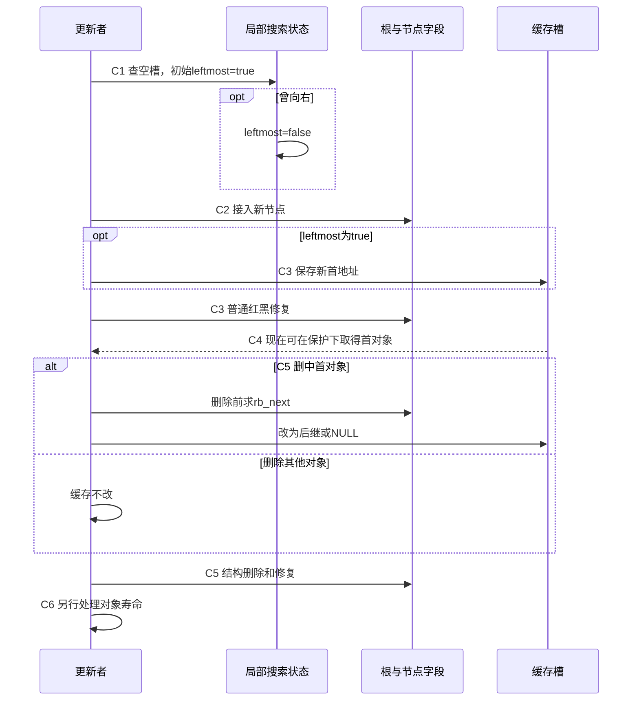
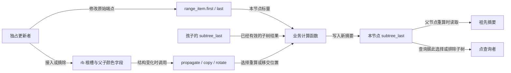
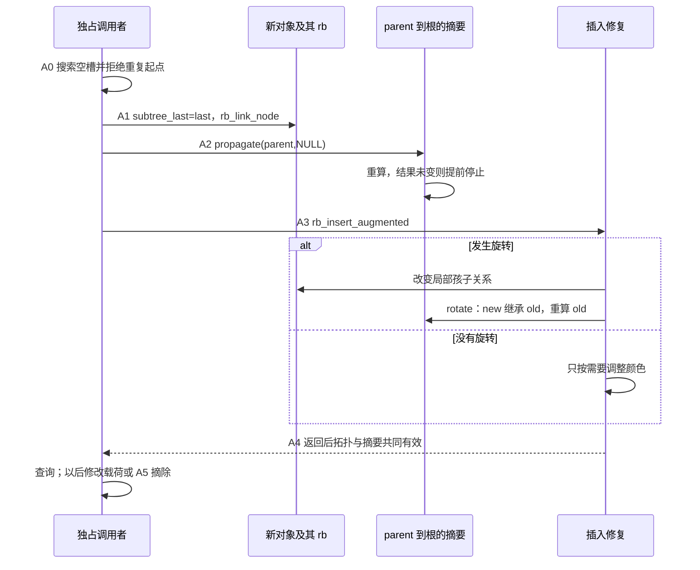
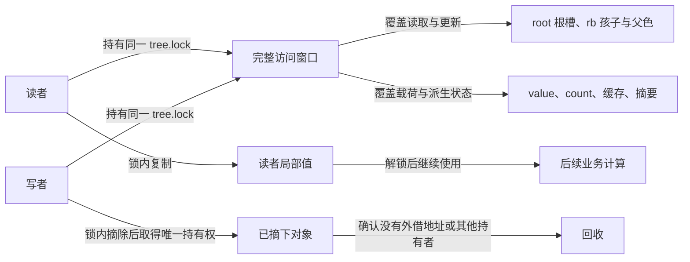
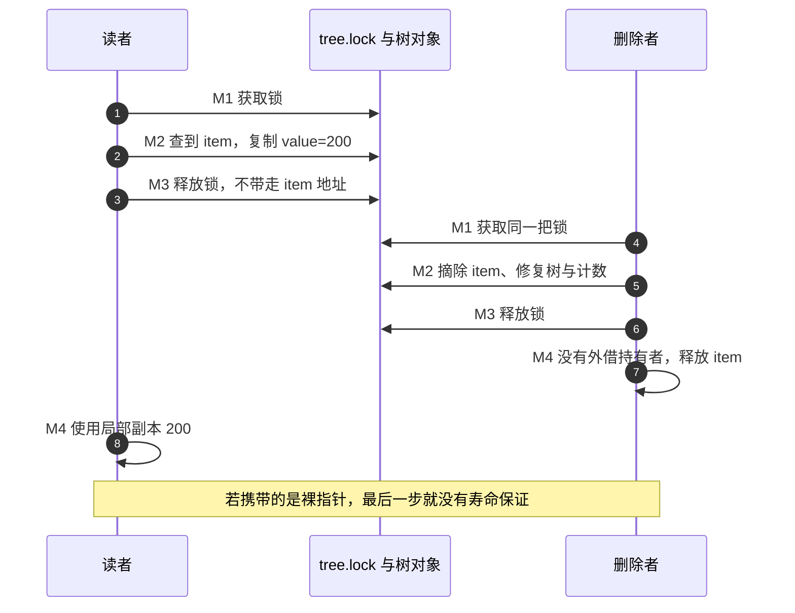
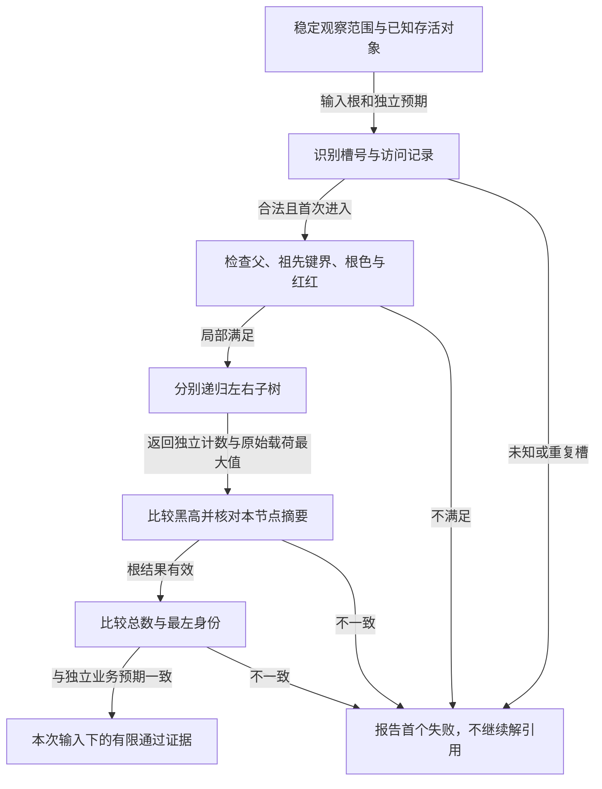

# 第12章\_Linux\_6.12\_内核\_rbtree\_工程扩展\_并发与验证

## 12.1\_章节内容说明

[P37 调用者框架](P37_构建rbtree调用者接口.md#37.16_运行完整的私有调用者框架)已把对象、计数和失败清理接成程序，后续查询、插入、删除、遍历和同键替换又逐项建立了底层契约。现在回到一组按到期时间排序的任务：若业务反复问“下一件事是什么”，每次都从根重新向左查找是否值得？

### 12.1.1\_本章在\_Linux\_rbtree\_学习路线中的位置

默认路线 P08/P09/P37 → P10/P26 → P11/P27/P28 → P29 已建立类型、业务持有权、更新与返回边界。P28 留下额外缓存与摘要的维护责任；[P29 完成边界](P29_普通旋转与Linux修复的完成边界.md#29.5_回顾与练习)说明回调中间态不等于整轮完成。本章据此讨论三类不同问题：保存一个可直接取得的首节点入口、随子树变化维护摘要，以及在真实读写协议下验证结果。它们不互相替代。

先在 12.2 解释缓存根的正常与故障过程，再进入增强信息、并发、接口和验证。取首常量时间不等于删除或整个调度操作常量时间；增加一个指针也不表示它自动具有新的并发保证。

### 12.1.2\_本章参照的源码文件

固定版本从[NXP Linux 6.12.20 源码总索引](../../../../research/source_reading/rbtree/navigation/P01_Linux_6.12_rbtree源码阅读索引.md#1.1_固定提交与阅读边界)进入，不再引用旧的 kernel_source 路径。正文解释为何需要这些状态；实现语句按上游位置在源码层单独展开：

| 上游位置 | 本章的阅读任务 |
| --- | --- |
| include/linux/rbtree_types.h | rb_root_cached 的普通根和最左入口 |
| include/linux/rbtree.h | 缓存取首、插入、删除、替换包装与比较辅助 |
| include/linux/rbtree_augmented.h | 增强回调、旋转时摘要与删除传播 |
| lib/rbtree.c | 通用修复、遍历、替换及无锁下行的说明边界 |

先沿[缓存模块导读](../../../../research/source_reading/rbtree/navigation/P08_最左缓存与结构更新导读.md#8.2_沿接入与摘除跟踪C0到C6)观察状态地址，再按需要进入具体实现；不能把当前本地配置或实验分支头当作固定发布证据。

## 12.2\_cached\_rbtree\_struct\_rb\_root\_cached

cached rbtree 是在普通树之外维护一个中序首地址的包装。没有改变红黑修复算法，而是增加了一项必须与树结构共同维护的不变量：稳定观察时，缓存地址应与沿左链找到的首节点 **完全相同**。有等价键时，“也是一个最小键”还不足以证明对象身份正确。

### 12.2.1\_为什么要缓存最左节点

普通根只保存拓扑根地址。`rb_first(root)` 从根逐次读取左孩子，直到没有更左的节点；实际读取几层取决于当前形状，红黑高度给出对数上界，空树则直接返回空。一次查询已经很便宜，但频繁重复会访问同一段路径。

设某个稳定树形取得首节点需要读 L 个节点，业务在下一次更新前询问一千次。普通方式仍做一千次左链查找；若在更新时保存首地址，一千次询问就各读一次缓存槽。这是操作数量的推导，不是缓存未命中或时间的实测，也没有假定每次左链都落到主存。

`struct rb_root_cached` 包含普通 `rb_root` 与 `rb_leftmost` 两个入口，完整类型见[缓存根实现](../../../../research/source_reading/rbtree/source_explanations/include/linux/rbtree_types.h.md#1.3_rb_root_cached增加一个最左入口)。`rb_first_cached()` 只读取后者，因此取得地址是 O(1)，但它不查树、不加锁、不取得引用，更不保证返回对象仍活着。宏体见[直接取首](../../../../research/source_reading/rbtree/source_explanations/include/linux/rbtree.h.md#1.12_缓存取首只读取入口)。

最早到期任务或下一个时间线事件是自然场景；若业务还需按位置、资格等额外条件挑选，最左节点未必就是最终候选。例如不能仅凭“调度器有虚拟运行时间”就推导所有版本的下一任务只读最左缓存，具体场景在本章后面分别核对。

### 12.2.2\_为什么只缓存最左节点\_不缓存最右节点

缓存不只占一枚指针，还在插入、删除和替换时增加判断与写入。两端都缓存，则每个采用该结构的根都需额外存储，并让两端的更新协议保持一致。固定头文件选择只提供最左入口；这是这份接口的工程取舍，不是最右端点在算法上难以缓存。

只有偶尔取最小、树很小或主要按任意键查询时，继续用普通根可以省掉额外不变量。反复取首且更新路径可统一维护缓存时，cached 根才更有吸引力。若需要频繁取最大或两端，业务可以另行设计对应入口，但要明确所有修改如何维护它们；不能只给结构体增加一个字段。

已有缓存根不因“也需要最大值”就一定不适用：仍可沿右链偶尔查询最大值，或在确有收益时增加另一端缓存。选择依据是观察与更新负载、字段成本和维护复杂度，最终性能需要同一场景测量。

### 12.2.3\_rb\_insert\_color\_cached()\_的使用方式

沿用普通插入的空槽搜索。新增局部布尔量 leftmost，初始 true：若一路向左，新节点将排在所有现存节点之前；只要有一次向右，就已有一个节点位于它之前，此后再向左也无法抹掉那个祖先。因此第一次向右时置 false，之后不恢复。

这里跟踪的是 **实际插入路径**。若等价键按“不小于则向右”处理，新对象并不是已有等价组中的首对象；不能只判断新键是否等于当前最小键就传 true。`rb_add_cached()` 已把搜索、标志计算、挂接和 cached 修复组合起来，它不做唯一键拒绝；需要拒绝重复的业务仍须使用相应搜索契约。

手写路径先 rb_link_node 接入空槽，再传入正确 leftmost 给 rb_insert_color_cached。包装先按标志写缓存，再调用普通修复。此时不是两份独立可随意观察的结构：C2 挂接后缓存可能仍旧，C3 写缓存后红黑修复可能尚未完成，调用者必须保护整个操作。

| 阶段 | 状态实际在哪里，谁修改 | 稳定性与后续动作 |
| --- | --- | --- |
| C0 初始化 | 调用者写普通根与 rb_leftmost 为 NULL | 空树与空缓存同时成立 |
| C1 搜索 | 更新者的局部 parent、link、leftmost | 遇右置 false，直到得到空槽 |
| C2 挂接 | rb_link_node 写节点字段和根/孩子槽 | 尚未完成缓存及红黑修复 |
| C3 缓存与修复 | cached 包装按标志写 rb_leftmost，再调用普通插入修复 | 返回后才向受保护观察者承诺一致 |
| C4 取首 | 读者按协议读 rb_leftmost | 只省查找路径，不替代对象寿命保护 |
| C5 摘除 | 更新者必要时先用旧拓扑求后继并改缓存，再结构删除 | 返回时重新满足缓存等于当前中序首 |
| C6 退出 | 调用者处理其他入口和持有权 | 与树中是否还保存旧地址是不同问题 |





源码对应[搜索产生标志](../../../../research/source_reading/rbtree/source_explanations/include/linux/rbtree.h.md#1.15_辅助插入如何产生最左标志)与[缓存先写、修复随后](../../../../research/source_reading/rbtree/source_explanations/include/linux/rbtree.h.md#1.13_缓存写入先于插入修复)。rb_add_cached 返回新节点仅表示它新成首节点；返回 NULL 时节点也已经插入，不能按“失败”释放它。

### 12.2.4\_rb\_erase\_cached()\_如何更新最左缓存

若删除对象不是当前 rb_leftmost，首对象不变；若是，新的首对象是它的中序后继。必须在旧对象仍处于原拓扑时计算 rb_next，再修改缓存并调用 rb_erase。删除后旧节点不再是有效遍历起点，即使它的字段没有被清零；旋转和回接也可能改变其他节点的链接。

最后一个对象没有后继，缓存变为 NULL，结构删除后普通根也为空。返回值却要更仔细地读：固定 rb_erase_cached 的局部返回值初始 NULL，仅在删中缓存时赋为后继。因此下面两种删除都返回 NULL：删除非首对象而缓存未变；删除最后对象而后继为空。不能由这个返回值直接判断当前树是否有首节点。完整函数见[缓存删除](../../../../research/source_reading/rbtree/source_explanations/include/linux/rbtree.h.md#1.14_缓存删除先取后继)。

同键替换也属于维护入口的操作：若旧对象正是缓存对象，即使键值不变，也必须改成新对象地址。[P28 缓存替换](P28_Linux同键替换与旧对象退出.md)及[唯一包装实现](../../../../research/source_reading/rbtree/source_explanations/include/linux/rbtree.h.md#1.10_替换时的最左缓存入口)已区分这个地址身份变化。更新缓存没有撤销已有读者保存的旧地址，C6 仍须按持有权协议完成。

### 12.2.5\_cached\_rbtree\_的使用边界

使用 cached 根时，插入、删除、替换都要维持额外入口。只调用普通 rb_erase 可能留下“所有红黑性质都对，首指针却错”的状态。若旧对象被释放，继续相信缓存就会使用失效地址；若它尚存活，错误也不能因为暂时不崩溃而被忽略。

普通根和缓存不是一次原子写入，更没有因宏只读一个指针就自动支持无锁读者。当前标准包装需调用者完整保护更新；若需要另一种读写协议，应单独证明缓存发布、节点拓扑和回收条件，而不是把普通替换换成带 RCU 后缀的函数后就宣布完成。

#### (1)\_运行缓存一致性实验

下面用五个私有任务观察两种返回值与一次故障。按 `(deadline, id)` 排序，这组数据没有重复完整键；数组中的 active 是实验核对台账，不是 Linux 自动维护字段。它让我们独立扫描仍在树中的对象预测最小地址，再与普通左链和缓存比较。完整材料为 [note_rbtree_cached.c](../../../../labs/kernel/tree_basics/materials/note_rbtree_cached.c)：

```c
// SPDX-License-Identifier: GPL-2.0
/* 私有自动对象：缓存故障演示不会释放对象，也不发布并发入口。 */
#include <linux/init.h>
#include <linux/module.h>
#include <linux/rbtree.h>
#include <linux/errno.h>

struct cached_job {
    int deadline;
    unsigned int id;
    bool active;
    struct rb_node rb;
};

static bool job_less(struct rb_node *a, const struct rb_node *b)
{
    struct cached_job *first = rb_entry(a, struct cached_job, rb);
    const struct cached_job *second = rb_entry(b, struct cached_job, rb);
    if (first->deadline != second->deadline)
        return first->deadline < second->deadline;
    return first->id < second->id;
}

/* 数组扫描独立预测最小对象，不从缓存或树的左链生成预期值。 */
static bool cache_matches(struct rb_root_cached *root, struct cached_job *jobs,
                          unsigned int count)
{
    struct cached_job *expected = NULL;
    unsigned int i;
    for (i = 0; i < count; ++i) {
        if (jobs[i].active && (!expected || job_less(&jobs[i].rb, &expected->rb)))
            expected = &jobs[i];
    }
    return rb_first_cached(root) == (expected ? &expected->rb : NULL) &&
           rb_first(&root->rb_root) == (expected ? &expected->rb : NULL);
}

static int __init note_cached_init(void)
{
    struct cached_job jobs[] = {
        {.deadline = 40, .id = 0}, {.deadline = 10, .id = 1},
        {.deadline = 40, .id = 2}, {.deadline = 25, .id = 3},
        {.deadline = 70, .id = 4}
    };
    struct rb_root_cached root = RB_ROOT_CACHED;
    struct rb_node *result;
    unsigned int i;

    if (!cache_matches(&root, jobs, ARRAY_SIZE(jobs)))
        return -EINVAL;
    for (i = 0; i < ARRAY_SIZE(jobs); ++i) {
        result = rb_add_cached(&jobs[i].rb, &root, job_less);
        jobs[i].active = true;
        if (result != (i < 2 ? &jobs[i].rb : NULL) ||
            !cache_matches(&root, jobs, ARRAY_SIZE(jobs)))
            return -EINVAL;
    }
    pr_info("note_cached: five inserts, first=10:1\n");

    result = rb_erase_cached(&jobs[4].rb, &root); /* 删除非最小的 70。 */
    jobs[4].active = false;
    if (result || !cache_matches(&root, jobs, ARRAY_SIZE(jobs)))
        return -EINVAL;
    pr_info("note_cached: erase non-first returns NULL, first still exists\n");

    result = rb_erase_cached(&jobs[1].rb, &root); /* 最小从 10 变为 25。 */
    jobs[1].active = false;
    if (result != &jobs[3].rb || !cache_matches(&root, jobs, ARRAY_SIZE(jobs)))
        return -EINVAL;
    pr_info("note_cached: erase first returns 25:3\n");

    /* 故意混用普通删除：树结构更新，但额外入口仍指向已摘除的25。 */
    rb_erase(&jobs[3].rb, &root.rb_root);
    jobs[3].active = false;
    if (cache_matches(&root, jobs, ARRAY_SIZE(jobs)))
        return -EINVAL;
    pr_info("note_cached: ordinary erase leaves a stale cache\n");
    /* 故障演示中对象仍活着且完全独占，重建缓存后继续观察。 */
    root.rb_leftmost = rb_first(&root.rb_root);
    if (!cache_matches(&root, jobs, ARRAY_SIZE(jobs)))
        return -EINVAL;

    while ((result = rb_first_cached(&root)) != NULL) {
        struct cached_job *item = rb_entry(result, struct cached_job, rb);
        rb_erase_cached(result, &root);
        item->active = false;
        if (!cache_matches(&root, jobs, ARRAY_SIZE(jobs)))
            return -EINVAL;
    }
    pr_info("note_cached: empty tree and empty cache agree\n");
    return 0;
}

static void __exit note_cached_exit(void)
{
    /* 根与节点均为初始化期间私有自动对象，没有外部保存其地址。 */
}
module_init(note_cached_init);
module_exit(note_cached_exit);
MODULE_LICENSE("GPL");
MODULE_DESCRIPTION("Private cached rbtree invariant exercise");
```

先预测：插入 40:0 时它是首对象；插入 10:1 后首对象改变；后面三次返回 NULL，但都已插入。删除 70:4 返回 NULL 且树不空；删除 10:1 返回后继 25:3。故意用普通删除摘掉 25:3 时，树会修复，缓存仍保存那个旧成员地址，数组核对就会发现不一致。

故障对象是仍然存活的局部数组元素，程序不会释放它，也没有并发入口。因此这里能安全比较地址并在独占条件下重新计算缓存，以便继续后面的观察；这不是建议生产代码对任意悬空缓存进行解引用后再修补。真正的修正是让所有合法修改路径维持不变量。

所有对象与根都仅在初始化函数里存活，既无动态申请也无外部发布，任何检查失败返回都没有堆对象或共享入口需要回收。成功路径逐个 cached 摘除到空。程序没有用 RB_EMPTY_NODE 作为台账，因此不要求额外清游离标记；若业务采用该协议，应按自己的安全时机维护。

已有 [Makefile](../../../../labs/kernel/tree_basics/materials/Makefile) 登记该模块。Linux 构建环境先设置匹配目标内核的 KDIR，并按工具链设置 ARCH/CROSS_COMPILE；在仓库根目录构建：

```bash
: "${KDIR:?先设置匹配目标内核的构建目录}"
make -C "$KDIR" M="$PWD/labs/kernel/tree_basics/materials" modules
```

把 note_rbtree_cached.ko 放到匹配目标系统后，从它所在目录执行：

```bash
sudo insmod ./note_rbtree_cached.ko
sudo dmesg | tail -n 30
sudo rmmod note_rbtree_cached
```

成功时预期五条核心消息如下；初始化失败时先检查 insmod 错误和日志，不假定模块已经加载：

```text
note_cached: five inserts, first=10:1
note_cached: erase non-first returns NULL, first still exists
note_cached: erase first returns 25:3
note_cached: ordinary erase leaves a stale cache
note_cached: empty tree and empty cache agree
```

本轮 ARMv7 前端与宿主显式适配检查已执行，目标 Kbuild、MODPOST、装卸及这组目标日志未执行。宿主父色位宽和访问宏有适配，只检查串行算法与接口返回，不证明内核 ABI、并发可见性或实际缓存性能。

### 12.2.6\_本节小结

缓存把反复查找首节点的工作移到更新者维护的额外入口，但不改变树操作和寿命契约。按 C0～C6 核对的是两个槽、树结构与对象持有三组不同状态；稳定时首地址一致，中间态需被保护。三个练习检查这个认识：

1. 将 25 的输入改为 5，哪次插入会新成首节点？它会排在 10 之前，rb_add_cached 那次返回该节点；测试预期也须随输入契约改变，不能继续硬编码“只有前两次返回节点”。
2. 删除非首对象时返回 NULL，能据此清空 root.rb_leftmost 吗？不能，NULL 在这个分支只是没有新的首地址要报告，原缓存仍正确。
3. 只比较缓存键值与最小键值，能发现所有错误吗？不能，两个等价键对象地址不同；还需核对当前中序首对象身份以及它是否仍为有效成员。

下一节不再缓存一个端点，而是给每个子树增加摘要。旋转仍保持中序关系，却会改变哪些节点属于某个子树，因此仅保存最左地址的办法不能直接维护区间最大值等增强信息。


## 12.3\_augmented\_rbtree\_增强红黑树

缓存一个最左地址之后，再看另一种附加状态：每个节点为整棵子树保存一份摘要。本节沿区间查询建立摘要的含义，再追踪它在接入、旋转和摘除时如何保持有效。

### 12.3.1\_什么是\_augmented\_rbtree

最左缓存回答了“当前第一个对象在哪”，却不能替我们回答另一类问题：一批有效地址范围按起点排好了，地址 72 落在哪个范围里？设每个对象保存闭区间 `[first,last]`，两个端点都包含在范围内。只看起点，`[30,80]` 能覆盖 72，`[35,40]` 却不能。按起点比较一次后，不能像查找一个确定键那样简单地丢弃另一半区间。

最直接的方法是按序检查每个范围。这种方法容易验证，数据很少、查询不频繁时也完全值得保留。缺口出现在范围多而点查询频繁时：大量范围早已在 72 之前结束，查询却仍须逐个读取对象才能知道这一点。我们想为整棵子树留一份摘要，提前回答“这里有没有结束位置足够大的区间”。

给每个业务对象增加 `subtree_last`，表示 **以自己的 rb 成员为根的整棵子树中最大的 last**。于是节点的摘要满足：

```text
subtree_last = max(自己的 last,
                   左子树的 subtree_last（如果有左孩子）,
                   右子树的 subtree_last（如果有右孩子）)
```

如果某棵子树的摘要小于 72，其中每个区间都已在 72 之前结束，可以整体跳过。这就是增强红黑树的起点：普通树继续负责排序与平衡，业务对象多存一份可沿树形组合的子树信息。子树计数、最小值、最大值和区间上界都可能承担这样的职责；具体摘要应由查询问题推出，不能因为宏现成就随手塞一个统计字段。

这里同时维护三组状态：父子关系与颜色、排序载荷 `first/last`、摘要 `subtree_last`。树依旧平衡并不证明摘要正确。一个新增区间改变了祖先覆盖的对象集合，旋转改变了局部根所覆盖的对象集合，删除又从集合中拿走一个对象；普通修复代码不知道我们的 last 存在哪，因而需要业务回调在这些事件上同步摘要。



图中的通信是同一更新调用内对对象字段的读写，没有自动的跨 CPU 通知协议。示例使用私有对象；若放到共享树，保护范围必须同时覆盖拓扑、载荷和摘要。只锁旋转或者只把摘要改成原子变量，不能让查询看到同一时刻的一组状态。

### 12.3.2\_struct\_rb\_augment\_callbacks\_的三个回调

先从[固定版本阅读索引](../../../../research/source_reading/rbtree/navigation/P01_Linux_6.12_rbtree源码阅读索引.md#1.1_固定提交与阅读边界)进入源码，再看[增强模块的 A0～A5](../../../../research/source_reading/rbtree/navigation/P09_子树摘要与增强回调导读.md#9.2_沿A0到A5维护同一份摘要)。本节使用 NXP 官方固定 Linux 6.12.20 的接口；宏和字段的唯一实现放在[回调结构](../../../../research/source_reading/rbtree/source_explanations/include/linux/rbtree_augmented.h.md#1.7_三个回调的结构契约)，正文先建立它们为什么分成三类。

| 变化 | 回调 | 它交付什么 |
| --- | --- | --- |
| 一条祖先路径覆盖的对象集合改变 | `propagate(node, stop)` | 从 node 向父方向重算，stop 不包含在重算范围内；模板发现结果未变可提前结束 |
| 删除中后继接替旧节点的位置 | `copy(old, new)` | 把旧局部根的摘要交给新局部根，作为接替过程的起点；不是复制整个业务对象 |
| 旋转改变两个局部根的子树范围 | `rotate(old, new)` | 让提升后的 new 接住旧整体摘要，再重算覆盖范围缩小的 old |

这里的 old/new 指特定结构动作的两个节点，不是“申请新对象再释放旧对象”。copy 后也不意味着删除完成：旧摘要可能仍把将被删除的范围计算在内，之后必须重新传播。判断完成要看整次更新的稳定观察点，不能把某个回调返回当作全部不变量已恢复。

### 12.3.3\_增强信息为什么需要随旋转更新

保留此前的左旋模型，把没画出的外侧子树记成 L 和 R：

```text
        old                         new
       /   \                       /   \
      L    new        -->        old    R
          /   \                 /   \
         T     R               L     T
```

旋转前后的中序顺序始终是 `L, old, T, new, R`。提升后的 new 覆盖的对象集合，与旋转前 old 覆盖的集合完全相同。因此，对“集合内所有 last 的最大值”来说，new 可以直接继承 old 原有的摘要。随后 old 只覆盖 L、自己和 T，必须根据自己的新孩子重算；若仍沿用旧摘要，它可能继续宣称自己包含 R 中最大的端点。

这解释了模板 rotate 的顺序：先把 old 的旧摘要写给 new，再强制重算 old。先重算 old 再复制，会把较小的新集合摘要错交给 new。把 new 的当前孩子简单合并也不一定安全，因为其中 old 的摘要正在等待修正。

这套移交有两个前提。第一，旋转前 old 的摘要已经正确；所以不能靠旋转顺便修复所有此前漏掉的传播。第二，摘要只取决于这批对象的聚合内容，不取决于当前树形。最大值、正确类型与运算约束下的计数或求和可以满足这种旋转不变性；子树高度和依赖树形的哈希通常不能直接套用这个复制模板。后者需要另行设计回调，并证明每个修复事件上的更新顺序。

### 12.3.4\_RB\_DECLARE\_CALLBACKS()\_与\_RB\_DECLARE\_CALLBACKS\_MAX()

现在再看生成器就不只是记参数名了。`RB_DECLARE_CALLBACKS` 接受可见性、回调组名称、业务结构体、嵌入 rb 成员、摘要字段，以及重算函数。它生成同组的 propagate、copy、rotate 和回调表。重算函数接收业务节点与 `exit` 布尔参数：`exit=true` 时若结果未变，返回 true 允许传播停止；否则写入结果并返回 false。旋转回调传 false，要求 old 真正完成一次重算，不允许把提前退出作为省略更新的理由。

提前结束不是碰运气。假设节点的两个孩子摘要已经正确，本节点由旧值重算得到相同值，而祖先只通过这个摘要感知这棵子树，那么祖先输入没有变化，自然无须继续。若祖先还读取其他未纳入摘要的变化量，或者孩子摘要已经过时，这条推理便不成立。

`RB_DECLARE_CALLBACKS_MAX` 在通用模板外再生成一层最大值计算：调用者只需提供返回 **单个节点原始标量** 的函数，生成器读取存在的孩子摘要、取最大值、比较旧值，再交给通用回调。示例的 `item_last()` 返回 last，不是返回 subtree_last。把缓存值再次当成原始值会使删除最大值后无法降下来。

具体参数与宏体分别在[通用回调模板](../../../../research/source_reading/rbtree/source_explanations/include/linux/rbtree_augmented.h.md#1.8_通用模板的停止与移交)和[最大值生成器](../../../../research/source_reading/rbtree/source_explanations/include/linux/rbtree_augmented.h.md#1.9_从本节点标量生成最大值)。宏只减少重复代码，不能替调用者证明摘要的数学含义，也不会替新叶子初始化业务字段。

### 12.3.5\_rb\_insert\_augmented()\_的插入流程

选择一个容易验证的插入顺序：先完成查重，再初始化新叶子的摘要为自己的 last，接入空槽，从 parent 向上传播，最后调用增强插入修复。查重阶段没有修改祖先，所以重复起点失败不会留下“树没插入、摘要却变大”的半次操作。本例故意拒绝重复起点；它是示例的业务政策，不是红黑树接口的普遍要求。



这个先接入再向上传播的顺序，与固定版本的 [rb_add_augmented_cached](../../../../research/source_reading/rbtree/source_explanations/include/linux/rbtree_augmented.h.md#1.11_缓存增强插入的挂接与传播)一致。该辅助函数还维护最左缓存，但不会替使用者初始化叶子摘要或拒绝重复业务键。它从 parent 开始传播，若叶子缓存没初始化，错误会由孩子传到祖先。

另一种设计可在搜索下降时更新路径上的最大值，避免之后重走父链；但它必须保证不会在后续查重、分配或其他失败中留下未发生的插入。应先解决失败语义，再讨论少走一次路径的收益。固定辅助函数的 `suboptimal` 注释不等于正确性缺陷，也不证明任意改成边搜边写都会更合适。

尤其要区分“增强插入接口”与“完整业务插入”。[rb_insert_augmented](../../../../research/source_reading/rbtree/source_explanations/include/linux/rbtree_augmented.h.md#1.10_增强插入只接入旋转回调)把 rotate 交给平衡修复，**并不自动从新节点执行 propagate**。若本次无旋转，缺少 A2 的错误更容易藏住：键序、颜色和父链全对，祖先摘要仍是旧值。

### 12.3.6\_rb\_erase\_augmented()\_的删除流程

插入时最大值常常只增不减，删除却必须处理最大值消失。设一棵子树同时包含 `[30,80]` 和 `[35,40]`，删去前者后，摘要应降到剩余对象的最大终点，不能保留 80。保留偏大的值不总是“只是多查几步”：查询怎样使用摘要决定了错误后果，本节后面的单路径查找就会据此选错方向。

增强删除仍沿已有[对象摘除与缺黑修复 D0～D4](../../../../research/source_reading/rbtree/navigation/P04_对象摘除与缺黑修复导读.md#4.2_从对象到缺黑父槽)前进。新的职责是给这些结构事件配上摘要操作：

| 结构事件 | 摘要的变化与接下来的读者 |
| --- | --- |
| 直接移走零/单孩子节点 | 从结构变化所在的祖先开始传播，让上层读到剩余子树的摘要 |
| 右孩子直接作为后继 | copy 将旧位置摘要暂交后继；后继完成接管后，再从它向上重算 |
| 后继来自右子树深处 | copy 之后先从后继的旧 parent 传播到 successor 之前，修复移走后继留下的旧路径 |
| 后继接管左右子树并换入旧位置 | 从已接管的 successor 向根传播，扣除真正被删对象的贡献 |
| 还需颜色修复并发生旋转 | rotate 更新旋转的局部摘要；颜色变化本身不改变最大值 |

深层后继需要两段传播，是因为它既离开一个位置，又接管另一个位置。第一段的 stop 是 successor，**不重算 stop 本身**；此时它尚处在接替过程之中。最后一次传播才使用接管完成后的左右孩子重算。copy 提供旧位置的比较基准，不是断言新位置最终仍等于旧值。只保留 copy 而删掉末次传播，会把被删最大值继续算进结果。

唯一结构代码仍在[结构摘除与缺黑父槽](../../../../research/source_reading/rbtree/source_explanations/include/linux/rbtree_augmented.h.md#1.3_结构摘除与缺黑父槽)，公共收尾见[增强删除与旋转回调](../../../../research/source_reading/rbtree/source_explanations/include/linux/rbtree_augmented.h.md#1.12_增强删除的两段收尾)。不要把 copy 回调当成 `rb_replace_node` 的通用增强包装；换入业务对象时，其载荷和祖先摘要也必须符合自己的业务协议。

还有一种不改变树形的更新：保持 first 不动，将 `[30,80]` 的 last 改为 33。此时应先改原始 last，再从这个节点调用 propagate，保留旧 subtree_last 供计算器比较。若先把 subtree_last 改成 33，再从自己传播，模板可能发现“算出的 33 与当前 33 一样”而立即停下，祖先仍保留 80。排序键 first 改变则不同，应按受保护的摘除与重新插入处理，不能仅传播摘要。

### 12.3.7\_增强树为什么容易让代码体积膨胀

固定版本的 `Documentation/core-api/rbtree.rst` 提醒：增强删除的传播与复制回调可能被内联进删除骨架，使编译结果较大；每个增强树使用者宜集中一个增强删除调用点。原文讨论的是 **编译器可能内联造成的代码体积**，不是“每个编译单元只能拥有一棵增强树”的接口限制。

将删除集中在一个业务封装里，可以同时集中成员关系、同步和对象退出的约束，避免多处展开相同组合。最终机器码是否重复、重复多少，还受编译器、优化和链接影响；没有反汇编或体积对照时，不能把宏数量直接换算成性能或字节数。本例没有进行这种测量。

### 12.3.8\_本节小结

#### (1)\_运行完整区间摘要实验

下面的完整模块把六个闭区间插入私有树，查找点 72，再缩短其中唯一覆盖 72 的区间，最后逐个删除。材料是 [note_rbtree_augmented.c](../../../../labs/kernel/tree_basics/materials/note_rbtree_augmented.c)，构建入口仍是前节使用的 [Makefile](../../../../labs/kernel/tree_basics/materials/Makefile)。这里没有向其他任务发布任何节点，自动对象一直活到初始化返回；模块退出函数无待回收对象。

`inspect_summary()` 递归读取原始 last 独立计算期望值，逐个核对缓存，而不是拿缓存验证缓存。空子树返回 0 只因本例端点为非负无符号数，不能原封不动推广到允许负数的最大值问题。

`insert_range()` 的 `-EEXIST` 表示相同起点已存在，`-EINVAL` 表示无效范围或实验检查失败。返回失败时没有发布新对象，也没有改动已有摘要；它不提供在树节点上重复插入同一成员的通用防护，调用者仍须保证每个待插成员尚未挂接。

```c
// SPDX-License-Identifier: GPL-2.0
/* 闭区间摘要：私有自动对象，不发布并发入口。 */
#include <linux/init.h>
#include <linux/module.h>
#include <linux/rbtree_augmented.h>
#include <linux/errno.h>

struct range_item {
    unsigned long first;
    unsigned long last;
    unsigned long subtree_last;
    struct rb_node rb;
};

static unsigned long item_last(struct range_item *item)
{
    return item->last;
}

RB_DECLARE_CALLBACKS_MAX(static, range_callbacks, struct range_item, rb,
                        unsigned long, subtree_last, item_last)

static int insert_range(struct rb_root *root, struct range_item *item)
{
    struct rb_node **link = &root->rb_node;
    struct rb_node *parent = NULL;
    if (item->first > item->last)
        return -EINVAL;
    while (*link) {
        struct range_item *entry = rb_entry(*link, struct range_item, rb);
        parent = *link;
        if (item->first < entry->first)
            link = &parent->rb_left;
        else if (item->first > entry->first)
            link = &parent->rb_right;
        else
            return -EEXIST; /* 重复起点失败时尚未改任何祖先摘要。 */
    }
    item->subtree_last = item->last;
    rb_link_node(&item->rb, parent, link);
    range_callbacks.propagate(parent, NULL);
    rb_insert_augmented(&item->rb, root, &range_callbacks);
    return 0;
}

/* 独立递归读取原始 last，不拿缓存字段计算期望最大值。 */
static unsigned long inspect_summary(struct rb_node *node, bool *valid)
{
    struct range_item *item;
    unsigned long result, child;
    if (!node)
        return 0;
    item = rb_entry(node, struct range_item, rb);
    result = item->last;
    child = inspect_summary(node->rb_left, valid);
    if (child > result)
        result = child;
    child = inspect_summary(node->rb_right, valid);
    if (child > result)
        result = child;
    if (item->subtree_last != result)
        *valid = false;
    return result;
}

/* 返回任意覆盖 point 的闭区间；只能在本例独占且摘要正确时使用。 */
static struct range_item *find_point(struct rb_root *root, unsigned long point)
{
    struct rb_node *node = root->rb_node;
    while (node) {
        struct range_item *item = rb_entry(node, struct range_item, rb);
        if (node->rb_left) {
            struct range_item *left = rb_entry(node->rb_left, struct range_item, rb);
            if (left->subtree_last >= point) {
                node = node->rb_left;
                continue;
            }
        }
        if (item->first > point)
            return NULL;
        if (item->last >= point)
            return item;
        node = node->rb_right;
    }
    return NULL;
}

static int __init note_augmented_init(void)
{
    struct range_item items[] = {
        {.first=20,.last=21}, {.first=10,.last=12}, {.first=30,.last=80},
        {.first=25,.last=29}, {.first=35,.last=40}, {.first=5,.last=6}
    };
    struct rb_root root = RB_ROOT;
    struct range_item *found;
    bool valid = true;
    unsigned int i;
    for (i = 0; i < ARRAY_SIZE(items); ++i) {
        if (insert_range(&root, &items[i]))
            return -EINVAL;
        inspect_summary(root.rb_node, &valid);
        if (!valid)
            return -EINVAL;
    }
    found = find_point(&root, 72);
    if (found != &items[2])
        return -EINVAL;
    pr_info("note_augmented: max=80, point72 finds [30,80]\n");

    /* 排序起点不变，只改载荷；从该节点重算，不预先覆盖旧摘要。 */
    items[2].last = 33;
    range_callbacks.propagate(&items[2].rb, NULL);
    if (inspect_summary(root.rb_node, &valid) != 40 || !valid ||
        find_point(&root, 72))
        return -EINVAL;
    pr_info("note_augmented: payload shrinks, max=40, point72 absent\n");

    for (i = 0; i < ARRAY_SIZE(items); ++i) {
        rb_erase_augmented(&items[i].rb, &root, &range_callbacks);
        inspect_summary(root.rb_node, &valid);
        if (!valid)
            return -EINVAL;
    }
    if (root.rb_node)
        return -EINVAL;
    pr_info("note_augmented: all removals preserve summaries\n");
    return 0;
}

static void __exit note_augmented_exit(void)
{
    /* 自动存储对象已在初始化返回前结束，未向外部发布地址。 */
}
module_init(note_augmented_init);
module_exit(note_augmented_exit);
MODULE_LICENSE("GPL");
MODULE_DESCRIPTION("Private augmented rbtree interval summary exercise");
```

程序中的 `find_point()` 每层只选一条路，返回任意一个覆盖区间，不枚举所有重叠项。为什么左摘要足够大时可以直接向左？若当前起点大于查询点，当前与右子树都不能命中，只需继续在左边找；即使左边最后也没有答案，也没有丢失右边的候选。若当前起点不大于查询点，左子树所有起点都更小；左摘要至少等于查询点，便保证左侧确实存在一个足够长的区间。沿这套选择向下走，遇到当前起点已大于点即可退出；在排除左边且自己未覆盖后，才进入右边。这依赖起点有序与摘要精确共同成立，单独平衡没有用。

每步下降一层，所以树有效时这次点查找走 O(log n) 高度；程序中的递归审查仍是 O(n)，用于教学检查而非热点查询。先预测再在与目标内核匹配、已配置并准备的构建树上运行：

```bash
# 在仓库根目录，使用与目标内核匹配的构建树。
make -C "$KERNEL_BUILD" M="$PWD/labs/kernel/tree_basics/materials" modules
# 只在上述构建对应的目标内核上装入这个模块。
sudo insmod labs/kernel/tree_basics/materials/note_rbtree_augmented.ko
sudo dmesg | tail -n 20
sudo rmmod note_rbtree_augmented
```

三个业务日志的预期内容为：

```text
note_augmented: max=80, point72 finds [30,80]
note_augmented: payload shrinks, max=40, point72 absent
note_augmented: all removals preserve summaries
```

本轮实际执行的是宿主固定算法的明确位宽适配夹具与 ARMv7 前端语法检查，并未执行目标 Kbuild、MODPOST 或装卸。宿主覆盖 720 种插入次序各配 12 种移除次序，包含端点增减、重复/非法范围失败、120960 个稳定状态和 11007360 次逐点线性对照；这验证有限样本下的字段维护与查询语义，不是目标运行日志或真实并发证据。

#### (2)\_改变摘要之前先预测查询

1. 用根 `[20,21]`、左孩子 `[10,80]`、右孩子 `[30,40]` 手算摘要。将左摘要错误改成 12，查询 72 会走哪里？随后恢复，确认正确答案位于左侧。
2. 把左区间改为 `[10,12]` 并正确传播，再把左摘要错误写成 100，查询 35。它会被引向左树并返回空，错过右边 `[30,40]`。因此对这个不回溯算法，摘要偏大同样可能漏查；只有具体查询算法允许回溯等额外保证时，才可能把偏大限定为效率问题。
3. 保持树形，用前文“先改 last，再提前覆盖本节点摘要”的错误顺序，解释根为什么停留在 80。使用独立递归检查定位错误，恢复正确摘要后再继续下一项；不要在生产树注入这些错误。
4. 给区间增加相同起点，决定是拒绝、合并，还是添加稳定 id 作为第二排序键。修改比较与线性对照后重新检验；不能只删除 EEXIST 就默认所有查询契约没有变化。

回看三种回调，它们维护的是路径重算、位置接替和局部旋转三个不同事件。选择增强树的收益是让查询从精确子树信息中排除工作，代价是每个对象的存储、每次变更的维护和更强的同步不变量。数据小或更新远多于查询时，应保留直接扫描这一简单基线。现在我们能说明独占更新后哪些字段共同有效，尚未说明并发读者怎样获得这样的观察点；下一节继续讨论外部同步。

------


## 12.4\_rbtree\_与并发控制

上一节把拓扑、载荷和摘要放在同一更新周期里，现在要让另一个执行者来读它。关键问题随之改变：不再只是“操作返回后字段是否正确”，还要问“谁可能在操作尚未结束时看见哪些字段，以及操作结束后谁仍持有对象”。

### 12.4.1\_为什么\_rbtree\_核心不内置锁

从一个普通任务索引开始：写者插入或取消任务，读者按编号取任务值。只在单线程初始化期间访问时，无须为了不存在的竞争增加锁。一旦两个执行者同时进入，就可能都从根走到同一个空槽，各自准备把自己的节点挂进去；后写入者覆盖前者的入口，前者已经返回“成功”的对象却不可达。平衡算法并没有机会替我们补救这次竞争。

在所有调用外面加同一把锁，可以先获得一个简单而有力的模型：持锁者完成整个搜索、挂接、修复与附加状态维护，另一个执行者随后才观察结果。但具体应使用可睡眠的 mutex，还是适合相应原子上下文的自旋锁，取决于调用现场。若对象已经处在更大范围的锁下，再在树里藏一把锁还会改变锁顺序与粒度，却依旧不知道返回指针会被用多久。

因此 Linux rbtree 保留结构操作，把同步和寿命协议交给调用者。进程、软中断、硬中断等入口是否共享这棵树，会决定同锁访问是否还需要处理本地中断或其他上下文重入；不能把一个演示用 `spin_lock()` 包装无条件用于所有上下文。本节只建立访问协议，锁本身的实现和选择继续由[同步专题](../../synchronization_and_asynchrony/大纲.md)中的对应机制承担。

树的维护者应先回答四个不同问题：写者如何串行化，读者能否观察中间树形，返回值需要有多强的存在性保证，对象何时才没人继续访问。这四个答案组合成容器协议，不能由一个“无锁”标签代替。

### 12.4.2\_使用者需要保护哪些操作

假设两个 CPU 都要插入唯一键 20。若“查找 20”加锁后解锁，“接入 20”再重新加锁，那么两者仍可先后查到空，然后各自插入。锁确实存在，却保护错了事务边界。查重、保存空槽、挂接与修复必须处在同一次受保护操作内；中途释放保护后保存的槽地址，也可能因其他删除而失效。

相同道理适用于两个插入、插入与删除、两个删除、遍历与删除、替换与读者访问。缓存根和增强树再增加两份状态：rb_leftmost 与业务摘要也必须在同一个观察边界内完成维护。对节点字段逐个加锁并不能组成一次完整的树更新。



这里存在 **结构状态、观察结果和寿命状态** 三个独立维度。用 M0～M4 走一轮完整操作：

| 阶段 | 读者路径 | 删除者路径 | 可见状态 |
| --- | --- | --- | --- |
| M0 准备 | 准备接收值的局部变量 | 准备要删除的键 | 还没取得树的访问权 |
| M1 进入 | 取得 tree.lock | 取得同一 tree.lock | 互相排除，前一轮修改已交付 |
| M2 操作 | 搜索并把 value 复制到局部变量 | 搜索、摘除、修复、维护 count 与附加状态 | 中间态只归当前持锁者使用 |
| M3 离开 | 释放锁，仅带走副本 | 释放锁，带走本例唯一拥有的摘下对象 | 后续读者可看见新树 |
| M4 后续 | 使用自己的普通值 | 确认无其他使用者后释放对象 | 值副本与对象地址不再互相依赖 |

这正是[P37 完整调用者框架](P37_构建rbtree调用者接口.md#37.16_运行完整的私有调用者框架)中 read_value 和 remove_item 的配对关系。若 read_value 改为解锁后返回裸指针，删除者可能立即执行 M4，前一个读者再取 value 就是释放后访问。锁覆盖了查询过程，却没有覆盖指针离开后的使用。



复制不适合所有业务。若必须保留对象身份，应在原保护仍有效时取得合法的长期持有权；若采用 RCU 读侧寿命，则要在匹配的读侧范围里完成受保护访问。引用归零与 RCU 旧读者结束可能同时成为回收条件，不能把它们写成随意替换的三选一。具体所有权推导已在[P09 双索引寿命](P09_Linux_6.12_内核_rbtree_嵌入式节点与使用者接口.md#%281%29_两个入口关闭之后谁还在使用对象)建立。

#### (1)\_用两个线程观察复制值与删除

先把复杂树缩成一个入口槽，只保留这次要验证的“查找命中—带走什么—删除回收”关系。下面是完整的用户态 C 程序，使用 POSIX 线程的互斥锁与条件变量；它没有实现红黑树，也没有模拟自旋锁。结构体里的 slot 是共享对象入口，phase 是实验调度状态，两者都由 lock 保护。条件变量负责唤醒等待者，但条件的真实内容保存在 phase 中，因此等待总在 while 里复查。

程序安排两次试验。读取先发生时，读者复制 200，删除者释放原对象，读者最后使用副本。删除先发生时，读者看到空入口，输出变量保持 -1。双方用 phase 明确排列这两种次序，避免用休眠时长猜测谁先运行。

```c
// SPDX-License-Identifier: MIT
/* 用户态双线程寿命实验：只有一个入口槽，不实现树或内核自旋锁。 */
#include <pthread.h>
#include <stdio.h>
#include <stdlib.h>

struct item { int value; };
struct registry {
    pthread_mutex_t lock;
    pthread_cond_t changed;
    struct item *slot;
    unsigned int phase;
    int read_first;
};

static void require_ok(int code)
{
    if (code != 0) {
        fprintf(stderr, "pthread error: %d\n", code);
        exit(EXIT_FAILURE);
    }
}

/* 调用时持锁；等待会放锁，返回前重新持锁，醒来必须复查条件。 */
static void wait_phase(struct registry *registry, unsigned int expected)
{
    while (registry->phase < expected)
        require_ok(pthread_cond_wait(&registry->changed, &registry->lock));
}

static void *reader(void *argument)
{
    struct registry *registry = argument;
    int found = 0, copied = -1;
    require_ok(pthread_mutex_lock(&registry->lock));
    wait_phase(registry, registry->read_first ? 0 : 1);
    if (registry->slot) {
        copied = registry->slot->value; /* 对象仍受锁保护时只复制普通值。 */
        found = 1;
    }
    ++registry->phase;
    require_ok(pthread_cond_broadcast(&registry->changed));
    require_ok(pthread_mutex_unlock(&registry->lock));

    /* 等删除者实际 free 完毕，再使用副本；没有保留对象地址。 */
    require_ok(pthread_mutex_lock(&registry->lock));
    wait_phase(registry, 2);
    require_ok(pthread_mutex_unlock(&registry->lock));
    if (found)
        printf("read-first: copy=%d remains after free\n", copied);
    else
        printf("erase-first: absent, output=%d\n", copied);
    return NULL;
}

static void *eraser(void *argument)
{
    struct registry *registry = argument;
    struct item *removed;
    require_ok(pthread_mutex_lock(&registry->lock));
    wait_phase(registry, registry->read_first ? 1 : 0);
    removed = registry->slot;
    registry->slot = NULL; /* 关闭唯一入口，后来的读者只能看到空。 */
    require_ok(pthread_mutex_unlock(&registry->lock));
    free(removed);         /* 读者从不带走指针，此时没有剩余使用者。 */

    require_ok(pthread_mutex_lock(&registry->lock));
    ++registry->phase;     /* 在释放完成之后通知实验调度条件。 */
    require_ok(pthread_cond_broadcast(&registry->changed));
    require_ok(pthread_mutex_unlock(&registry->lock));
    return NULL;
}

int main(void)
{
    for (int read_first = 1; read_first >= 0; --read_first) {
        struct registry registry = {.phase=0, .read_first=read_first};
        pthread_t read_thread, erase_thread;
        registry.slot = malloc(sizeof *registry.slot);
        if (!registry.slot)
            return EXIT_FAILURE;
        registry.slot->value = 200;
        require_ok(pthread_mutex_init(&registry.lock, NULL));
        require_ok(pthread_cond_init(&registry.changed, NULL));
        require_ok(pthread_create(&read_thread, NULL, reader, &registry));
        require_ok(pthread_create(&erase_thread, NULL, eraser, &registry));
        require_ok(pthread_join(read_thread, NULL));
        require_ok(pthread_join(erase_thread, NULL));
        if (registry.slot || registry.phase != 2)
            return EXIT_FAILURE;
        require_ok(pthread_cond_destroy(&registry.changed));
        require_ok(pthread_mutex_destroy(&registry.lock));
    }
    return EXIT_SUCCESS;
}
```

材料为[copy_under_lock.c](../../../../labs/kernel/tree_basics/materials/copy_under_lock.c)。在具备 POSIX 线程支持的环境中，从仓库根目录编译运行：

```bash
cc -std=c11 -Wall -Wextra -Werror -pthread \
  labs/kernel/tree_basics/materials/copy_under_lock.c -o /tmp/copy_under_lock
/tmp/copy_under_lock
```

预期输出：

```text
read-first: copy=200 remains after free
erase-first: absent, output=-1
```

本轮在宿主的 MinGW pthread 支持下实际编译执行，并重复 512 次有序读/删实验，另注入两个分配失败点，核对输出和未回收对象数。它验证这里的互斥、交接和复制关系，不提供 Linux 内核自旋、IRQ、RCU 或 ARM 内存序结论。生产代码的线程创建失败如何撤销既有任务还需单独设计；本小程序遇 pthread 错误直接退出整个进程。

如果想观察裸指针的错误，不要把程序改成真的解引用已释放对象来追求“崩溃截图”。在纸上将 copied 换成地址，沿图中最后一步判断谁仍保有对象即可；释放后访问可能暂时打印旧值，这种偶然结果不构成正确性证据。

### 12.4.3\_WRITE\_ONCE()\_在\_rbtree\_实现中的意义

完整锁的代价是读者也要参与同一同步：竞争时等待，保护范围拉长时其他访问更晚进入。若业务的读取很多，便会考虑让读者不持写者那把锁。但这不是把锁行删掉即可得到的优化，因为一轮旋转有多个独立写入，读者可以夹在其中继续下降。

本节按[固定版本索引](../../../../research/source_reading/rbtree/navigation/P01_Linux_6.12_rbtree源码阅读索引.md#1.1_固定提交与阅读边界)阅读 lib/rbtree.c 开头的说明。它要求孩子边写入使用 WRITE_ONCE，并要求写入的程序顺序不制造临时环。WRITE_ONCE 约束指定的单次访问，不把两次改边合成事务，也不提供“树形已全部切换”的通知。

沿[P10 完整 C 路径实验](P10_Linux_6.12_内核_rbtree_查找与返回边界.md#10.2.10_用完整C程序观察相等节点和旧路径)再看一次：旧根 10 的右孩子是 20，中间子树为 15。左旋先把 `10.right` 改为 15，再把 `20.left` 改为 10，最后让根指向 20。旧根已被读者取走时，它仍能从 10 到 15，却不能向下走回 20。查 20 得到 NULL，真实的 20 仍在树里；对象从头到尾都可以存活，漏查并不需要发生内存回收。

若倒过来先写 `20.left=10`，而 `10.right` 还等于 20，中间的两条边就构成环。即使两个赋值都写了 WRITE_ONCE，查询某些中间键仍可能来回走。由此可见，“单次访问约束”和“不成环的写序”解决的是不同缺口，二者缺一不可。

固定注释讨论的是有限的 **向下查找**：满足发布、比较字段稳定、节点寿命及改边约束时，路径不会因这种临时环卡死，找到的对象满足比较条件。但旋转非原子，可能漏掉整棵子树；NULL 不证明键不存在。__rb_parent_color 的父边不在该注释的循环检查范围内，rb_next 或带父链的遍历不能借用这份保证。具体路径映射见[查询 L0～L3](../../../../research/source_reading/rbtree/navigation/P02_查找路径与返回边界导读.md#2.4_旋转期间沿什么路径继续)。

### 12.4.4\_RCU\_查找与普通修改路径的区别

RCU（Read-Copy Update，读—复制—更新）的读侧保护与发布/回收协议，可以为特定读者提供访问对象的时间边界，但不会把整棵树旋转变成原子快照。通用机制沿[RCU 权威专题](../../synchronization_and_asynchrony/synchronization/rcu/大纲.md#1.3_因果阅读地图)阅读，这里只核对树接口接入了哪一部分。

| 接口 | 固定实现承担的动作 | 调用者仍需完成的事 |
| --- | --- | --- |
| rb_link_node_rcu | 初始化节点结构，再以 rcu_assign_pointer 发布空入口 | 发布前准备业务载荷，满足读侧取得协议，串行化写者；后续平衡仍可能旋转 |
| rb_find_rcu | 用比较回调向下搜索，孩子读取使用 rcu_dereference_raw | 建立匹配读侧保护，证明入口读取、比较字段和寿命有效；函数不取引用、不重扫 |
| rb_replace_node_rcu | 准备新节点结构，更新孩子父边，最后以 RCU 方式发布父/根入口 | 同排序位置替换、载荷预先有效、旧对象延迟回收；不授予父链快照 |

固定版 rb_find_rcu 的第一次取根仍是普通 `tree->rb_node` 表达式，不能把带 RCU 后缀的名字当成“入口到出口都已经替我证明”。真实语句和限制见[查找唯一实现](../../../../research/source_reading/rbtree/source_explanations/include/linux/rbtree.h.md#1.4_rb_find_rcu的孩子读取与缺失边界)。这种具体读取边界必须与使用者协议一起审查，不应擅自把源码改写成想象中的更强接口。

替换时，孩子的 parent 在新父/根入口发布之前就改向 new，因此父子两个方向不是同时切换。cached 替换还先更新最左槽，不自动组成一个 cached RCU 协议。完整交接继续看[P28 同键替换](P28_Linux同键替换与旧对象退出.md#28.2.4_rb_replace_node_rcu%28%29_与_RCU_读侧安全)和[缓存包装](P28_Linux同键替换与旧对象退出.md#28.2.5_rb_replace_node_cached%28%29_如何维护最左缓存)，这里不再复制函数体。

写者的互斥同样没有消失。两个写者同时修改一个孩子槽、颜色或增强摘要，RCU 不替它们仲裁。摘除只关闭后来的发现入口，已经拿到旧地址的读者仍可能继续使用；在对应 RCU 回收方案中，旧对象须保留到相关旧读者结束，再满足其他引用等回收条件。call_rcu 只是排队安排回调，不在调用点同步等待；回调届时是否能直接释放，还由完整持有权协议决定。

先有“对象仍活着”，才有资格讨论“旧路径是否找到”；先有字段发布与稳定比较，命中才有含义。反过来，即使这些条件全部满足，旋转造成的漏查仍可存在。增加延迟回收并不会让旧根重新获得通往新根的边。

### 12.4.5\_lockless\_lookup\_能保证什么\_不能保证什么

现在可以用同一业务问题选择方案：按任务编号查询后，是只需尽力找到一个候选，还是必须据“没找到”创建唯一新任务？前者有时允许短暂假阴性，后者通常不能把一次无读锁 NULL 当作最终缺失。

| 业务要求 | 完整共同锁覆盖的查找 | 满足前述条件的无读锁向下查找 |
| --- | --- | --- |
| 看到稳定的受保护拓扑 | 在锁内成立，前提是所有相关写者都遵守同锁 | 不承诺，旋转可以插在两次读取间 |
| 命中后取得对象值 | 可在锁内复制，解锁后使用副本 | 在合法读侧范围读取；带出对象另需持有权 |
| 返回空说明这一受保护时刻确实缺失 | 完整搜索并遵守比较规则时成立 | 不成立，旧路径可能漏掉实际存在对象 |
| 随后按缺失创建唯一键 | 查重到接入持续持锁，或重新取得写保护后再查 | 进入写侧序列后必须按业务协议重新判定，不能沿旧结果直接挂接 |
| 整树遍历或精确缓存/增强查询 | 同一保护覆盖完整过程和全部相关字段 | 向下查找注释不提供父链、缓存或摘要的一致快照 |

因此选择条件不只是“读多写少”。如果必须严格缺失、全序遍历或同时读取多份关联字段，先保留完整保护这一基线。若考虑不持写锁的读路径，需要明确接受哪些漏查，如何处理后续动作，并分别证明发布、稳定比较、读侧寿命与写侧串行化。想用重试或版本号补强也必须设计完整协议：重试不能挽救已经访问释放内存的那一次读取，不能只在函数尾加一个计数比较。

### 12.4.6\_本节小结

用三组已有实验分别回答三个问题：本节双线程程序说明锁内复制怎样避免把寿命责任带到锁外；P10 路径程序说明所有对象都存活时仍会漏查或因错误写序成环；P28 替换模块说明新入口发布和旧对象退出是不同阶段。这些证据互补，不能把其中一组的成功外推成“内核树已经并发安全”。

1. 把查重和接入拆成两段锁，按两个写者各自看到空的顺序画出四步时间线。重新组合事务以后，第二个写者应返回什么？
2. 把本节复制结果改为“取得引用后返回对象”，指出引用应在哪个保护尚有效的步骤取得，以及删除者现在还缺什么才能 free。这里只修改协议图，不运行释放后访问。
3. 运行 P10 的 lookup_paths.c，解释旧根漏查为什么不是延迟回收能够修复的错误。再说明 rb_next 沿父边为何超出同一论证范围。
4. 回到增强区间树，假设读者读到新孩子和旧摘要。借助上一节错误摘要的反例，说明只保证每个字段单次读取为什么不够；为完整保护写出应覆盖的状态集合。

本节建立的是操作、观察与寿命三种边界。接下来审查完整示例时，应把锁放置、返回约定、失败回滚与资源退出一起读，不能只看 rb_insert_color 和 rb_erase 是否出现。

------


## 12.5\_Linux\_内核\_rbtree\_示例代码

现在回到[P37 的完整调用者模块](P37_构建rbtree调用者接口.md#37.16_运行完整的私有调用者框架)。此前它让我们把一次操作写完整；经过缓存、增强和并发单元，现在应能解释为什么接口边界要这样划分。本节沿同一份可运行程序复查比较、持有权与退出过程，遍历再接到 P27 的专门实验，不另外维护一套只有片段、没有初始化与失败清理的框架。

### 12.5.1\_示例目标与约束

实例仍按 int key 管理业务对象，拒绝重复 key，使用同一把锁保护完整操作。成功插入把对象交给树，失败仍由调用者负责；查询只复制 value，删除交还独占对象。程序所有入口在模块初始化期间私有使用，没有外借指针或 RCU 读者，这才使示例中的删除后释放成立。

完整材料是[note_rbtree_owner.c](../../../../labs/kernel/tree_basics/materials/note_rbtree_owner.c)。先预测四次输入 `20,10,30,20` 后的 count、key=20 的查询值、第四个对象归谁释放，再对照原完整程序与本节各步。目标构建和装卸命令保留在 P37，不能把宿主检查输出当作目标内核已经运行。

### 12.5.2\_定义业务结构体与树对象

demo_item 拥有 key、value 与嵌入的 rb；demo_tree 拥有 root、lock、count。rb_node 不知道 key 放在哪，也不会替容器计数或取锁。初始化将 root 设为 RB_ROOT、count 设为 0，并初始化业务锁；单个新对象还要按本例采用的成员协议建立游离标记。

这些定义的推导分别见[P37 业务对象](P37_构建rbtree调用者接口.md#37.2_定义业务结构体)与[根对象](P37_构建rbtree调用者接口.md#37.4_定义_struct_rb_root_根节点)。把 root 重新赋空只改变入口值，不会遍历并释放此前的业务对象；初始化和销毁不是互逆的一条赋值语句。

### 12.5.3\_实现统一比较函数

完整模块现在让搜索和插入共同调用 compare_key。它返回两个关系判断结果的差，结果只能是 -1、0、1；相减的是布尔判断结果，不是两个任意 int 键，因此不因 INT_MIN 与 INT_MAX 之差溢出。

搜索把查询键交给比较器，插入把新对象的 key 交给同一比较器。若业务需要对象对对象的接口，它应委托这一规则而不是维护第二份略有差别的次序。原三态比较的完整推导见[P37 同一套比较规则](P37_构建rbtree调用者接口.md#37.13_插入_查找_删除为什么必须使用同一套比较规则)；复合键还须在所有调用点保持相同字段顺序，不能只改插入。

### 12.5.4\_实现查找

search_locked 从根出发，根据同一比较器向左、向右或命中；名字中的 locked 是调用前置条件，函数名本身不会加锁。它是内部助手，其返回指针只在相应保护与寿命条件内使用。

对外的 read_value 在锁内找到对象并复制值，然后才解锁。查询失败返回 ENOENT 且保持输出变量原值；传入空输出地址返回 EINVAL。这样调用者通过返回码判定是否取得结果，而不是把某个业务值当作“没找到”的特殊标志。完整查找与危险裸指针反例见[P37 查找单元](P37_构建rbtree调用者接口.md#37.7_编写查找函数)，真实线程的值副本交接由上一节实验解释。

### 12.5.5\_实现插入

insert_item 先取得树锁，验证成员符合本例的游离约定，再从根查重并保存空槽。发现重复键时返回 EEXIST，不挂接、不修复、不增加 count；对象还归调用者。找到允许的空槽才依次 rb_link_node、rb_insert_color、count 加一，最后解锁。

这段先后关系保证其他遵守同锁协议的访问者不会观察到“计数已经增加却还不可查”的半次操作。成员自指标记只是调用者遵守的约定，不是全局树成员数据库；必须先初始化成员，而且不能通过随意 RB_CLEAR_NODE 把仍挂在别处的成员伪装成可插入。具体空槽与节点初始化见[P37 插入搜索](P37_构建rbtree调用者接口.md#37.8_编写插入搜索函数)。

再检查失败后的对象：程序在锁外分配新对象，插入成功由整树管理，失败则释放本次未移交的对象。不能因为发现了重复 key 就释放树中原有的那个对象。把分配放到允许睡眠的锁外，并不自动免除再次查重的责任；本例在接入锁内完成最终判定。

### 12.5.6\_实现删除

remove_item 先检查输出地址并把它置空，锁内搜索；缺失时返回 ENOENT，调用者不会收到上次留下的旧指针。命中后 rb_erase、按本例协议标为游离、递减 count，再通过输出参数交还对象。这些接口约定与[删除单元](P37_构建rbtree调用者接口.md#37.11_调用_rb_erase%28%29_删除节点)对应。

此模块没有外借对象地址，所以删除成功后可以在锁外 kfree。若换成引用计数设计，删除只撤销树的持有权，实际释放须等相应引用协议；若换成 RCU 读者，旧字段及对象须保留到相关读者退出；若两者同时存在，两个条件都要满足。**这些是不同的完整容器协议，不能只把最后一行 kfree 换成 put 或 call_rcu 就宣布改造完成。**

尤其在旧读者可能继续使用节点字段时，不能照搬本例立即 RB_CLEAR_NODE 的动作。标记写入、键修改、再次入树与内存释放各有前提，沿[P09 对象退出](P09_Linux_6.12_内核_rbtree_嵌入式节点与使用者接口.md#9.2.8_节点生命周期为什么由调用者管理)和 P28 替换周期继续判断。

### 12.5.7\_实现中序遍历

遍历仍是 rb_first 取得首节点，rb_next 沿孩子或父链推进，rb_entry 还原业务对象，再读取 key/value。若比较规则是唯一整数键，完整稳定遍历应按 key 严格递增；允许等价键时不能再套用这一唯一性断言。

此任务的完整可运行实验集中在[P27 遍历与销毁模块](P27_Linux有序遍历与整树销毁.md#27.2.9_运行完整遍历与销毁模块)。调用者须在整个遍历范围稳定所依赖的拓扑并保护对象；只让节点暂时不释放，不能稳定父链。若要把 key/value 带到锁外慢慢打印，应在受保护范围复制有限数据，再处理输出；不能把长期打印的成本和上下文要求隐藏在一个名叫 dump_locked 的助手里。

### 12.5.8\_实现整棵树清理

完整 owner 模块的 destroy_tree 每轮重新取 rb_first、摘除并递减 count，然后解锁释放；下一轮重新从根定位，不携带上一轮可能被旋转改变关系的遍历游标。这正是原反复取最小节点方案的有效部分，已由[P27 有序推进与销毁](P27_Linux有序遍历与整树销毁.md#27.2.8_为什么一个保存的地址仍会漏访)解释。

但“每轮正确”还不等于“整个清理原子完成”：如果另外的写者可以在两轮之间不停插入，循环可能迟迟无法结束，退出时刻的业务关闭承诺也没有建立。因此完整销毁需要先关闭或约束新入口，再保证没有外部使用者；私有初始化示例天然满足这个前提。

后序整树销毁是另一套更强的排他协议。postorder safe 只保存约定的下一对象，不能在循环体任意 rb_erase 重平衡后继续依赖旧关系。不要把“safe”解释成并发、任意修改或任意释放都安全。初始化失败同样要在返回前清理已接入对象，不能指望失败的模块以后再调用退出函数替我们收尾。

### 12.5.9\_示例代码的边界

通过这次回访，定义对象、嵌入节点、初始化根、统一比较、查询、插入、删除、遍历和清理已经各有完整程序与职责。普通框架不声称实现 RCU、引用计数、重复键容纳、cached 或 augmented；这些扩展需要前面分别建立的附加不变量，不能把片段机械拼接。

先做三项修改预测：把第二个 20 改成 40 后 count 应怎样变化；传空的移除输出参数时能否改变树；把一个 int 键换成极值时比较符号是否还正确。现有宿主夹具重新检查了插入/删除排列、重复与成员状态、输出约定、分配失败和极值比较；目标 Kbuild、MODPOST、模块装卸与实际内核日志仍未执行。

剩下的问题是“我怎样知道这一轮做对了”。只看到有序输出，无法排除父链、黑高或附加状态损坏。下一节把验证拆成彼此独立的证据，而不把一次模块成功加载当成所有正确性条件都已满足。

------


## 12.6\_Linux\_rbtree\_调试与验证

一组任务按 10、20、30 打印出来，只说明这次输出有序，不能说明父链、颜色、最左缓存和区间摘要都正确。上一节已经区分容器承担的多种状态，验证也应分别寻找它们的证据。本节最终组合一个完整 C 检查器，但先明确它能安全读取什么。

检查不能在任意损坏地址上盲目递归，也不能一边与写者竞争一边要求每个中间状态都满足最终不变量。应先取得业务规定的稳定观察范围和对象寿命，必要时形成一致的私有快照；再以已知对象池、访问记录和容量上限限制结构遍历。对未知指针，诊断器本身并没有凭空多出解引用权限。



### 12.6.1\_如何验证\_BST\_有序性

若完整稳定的中序序列满足相邻键严格递增，它符合唯一键的排序要求；允许等价键时改为非递减，并按业务契约检查等价组。如果使用的是 `(deadline,id)` 复合键，检查器必须调用同一顺序的比较规则，不能只看 deadline。

不要只比较每个节点与其直接孩子。根为 20，右孩子为 30，而 30 的左孩子是 15：15 小于自己的父，局部检查通过，却跑到了 20 的右子树。完整验证必须携带所有祖先累积的上下界，或真正检查整个中序序列。下面的 C 模型选择上下界，并用独立布尔标志表示界是否存在；不拿 INT_MIN/INT_MAX 冒充缺失边界，也不做 key±1，以免极值被错拒或溢出。

出现逆序时，检查插入比较、查找比较、替换位置和原地键修改，也要检查孩子边是否接错。红黑修复维护颜色与平衡，不读取业务 key 来替我们识别这些错误。

### 12.6.2\_如何验证父指针正确性

从一个已知父向左或向右进入孩子时，孩子保存的 parent 应指回这个父；进入根时预期父为空。空树没有根对象，因此不能为了检查空树而解引用 root->rb_node。共享根入口、孩子槽和孩子记录的父地址，是必须互相对应的不同存储位置。

检查器还要区分树与一般有向图。孩子边回到已经访问过的节点，可能形成环，也可能让两个父共享一个孩子。两种情况都应拒绝，否则普通递归可能无限进入或者把一个对象计算两次。本文用整数槽号和 seen 数组做已知对象识别，最多进入八个不同对象；它检查的是逻辑拓扑，不把索引数字转换成任意真实地址。

父链错误常来自手写旋转遗漏反向边、同键替换没完成交接、父色字被破坏、同一嵌入成员重复接入或在删除后继续当作在树节点使用。若父指针检查失败，不要继续用 rb_next 在错误父链上打印“更多证据”；先在有界已知对象内定位错误。

### 12.6.3\_如何验证红节点没有红孩子

从根下降时，把当前节点是否为红传给孩子；父红且当前红便形成冲突。NIL 位置视为黑，不解引用它。根黑应单独作为稳定红黑树的规范化条件检查，否则一棵仅含红根的树没有红红相邻，也可能绕过只看父子的断言。

检查失败后，应追问插入是否只挂接未修复、删除是否绕开了修复、是否有人直接改色；错误替换或拓扑破坏也可能同时影响多项性质。报告“red-red”只定位了一个现象，不能证明唯一根因一定是忘记 rb_insert_color。回调内部的某些中间态也不能套用操作返回后的完整树断言。

### 12.6.4\_如何验证所有路径黑高一致

对每个节点分别取得左右子树的黑计数，二者必须相等；相等以后再加上当前节点的黑贡献，向父返回。本文内部约定空位置返回 1，黑实体加 1，红实体加 0，所以返回值包含当前节点与终点 NIL。这是递归计算的局部计数，与前面某些章节用“排除当前根”定义的 bh(root) 差一个明确的根贡献，不能混用数字。

也可以选择 NIL 返回 0，只计黑实体。只要整次递归和预期值都使用同一约定，两侧相等性判断一致。选定规则以后再观察删除缺黑：忘记根收尾、Case 2 上推位置错误、Case 4 染色错误、旋转接错子树，都可能造成差异。不要通过给某一侧额外补 1 来“让测试绿了”，那相当于让检查器替被测算法掩盖缺口。

### 12.6.5\_如何验证\_cached\_rbtree\_的\_rb\_leftmost

稳定的缓存根应满足 `rb_first(&root->rb_root) == root->rb_leftmost`，比较的是节点身份而不只是最小 key 的数值。存在多个等价键时，不同对象可能拥有相同最小值，但只有当前中序首对象才是这个缓存的目标。

前提是向下结构已经可以安全遍历，否则用 rb_first 验缓存本身可能困在环里。完整模型从已经验证的左子树结果返回首槽号，再与独立存储的 first 比较；真实测试还应对照业务侧预期存活对象，避免结构与计数一起出错后互相“证明”。插入 leftmost 标志算错、混用普通插入/删除/替换、直接移动节点，都会造成缓存与结构分离，前面完整缓存模块已给出可观察反例。

### 12.6.6\_如何验证\_augmented\_rbtree\_的增强信息

最大值摘要应从每个节点的原始载荷独立计算。递归先得到左右子树的 **计算结果**，再与本节点载荷取最大，最后比较本节点缓存。不要读取两个孩子的 subtree_max 当作检查器的“真值”，否则孩子缓存的同源错误可能一路传上来。

下面模型用 score 表示非负业务评分，subtree_max 表示整棵子树的最高评分；它与前面区间末端的最大值使用同一聚合规则，但不承诺区间查询语义。空子树返回 0 只适合这个非负标量域。查出错误时，沿叶子初始化、插入路径传播、rotate、copy、后继旧路径及末次传播逐一检查，也别漏掉只改载荷时的传播或普通接口混用。

### 12.6.7\_如何构造插入修复测试序列

从空树依次插入以下唯一键，先手画冲突再观察完整修复后的性质：

| 输入次序 | 暴露的问题 | 应关注的动作 |
| --- | --- | --- |
| 30、20、10 | 左外侧红红 | 最终右旋与染色 |
| 10、20、30 | 右外侧红红 | 最终左旋与染色 |
| 30、10、20 | 左内侧红红 | 先预旋转，再按外侧收尾 |
| 10、30、20 | 右内侧红红 | 镜像预旋转和收尾 |
| 20、10、30、5 | 父红叔红 | 染黑父叔、冲突向祖父传播并处理根 |

这些短序列区分基本动作，却不覆盖多层上推、重复键政策、分配失败或极值比较。完整[P35 插入实验](P35_红黑插入与红红冲突上推.md#35.1_从检查一棵树走到增加一个键)建立基本算法，再把排列、业务对照和失败点加到各自接口的测试里。最终形状检查和修复分支计数是两类证据：随机输入多，不等于目标分支真的发生过。

### 12.6.8\_如何构造删除修复测试序列

删除应先由目标前态反推：兄弟红、兄弟黑且双侄黑、近侄红远侄黑、远侄红，分别推动不同修复。左右缺口都要覆盖，还要包括无缺黑返回、红孩子接替变黑、后继直接接替和深层后继移位。黑节点只有一个非空孩子时，在合法红黑树中该孩子承担的形态会限制修复路径；不能笼统认为“删黑色单孩子节点”一定进入完整兄弟分支。

先证明初始树合法，再记录删的是谁、物理移位的是谁、缺口父槽在哪，最后核对结构、颜色和业务状态。已有[P36 删除周期](P36_红黑删除与缺黑位置传播.md#36.1_移走对象为何不一定马上产生缺口)和固定源码删除实验分别承担抽象与具体分支，不用只凭最后一行中序输出反推中间 case 已正确。

一个操作后的联合检查至少包括有序性、父链、根黑、红红、黑高、成员计数、前驱后继以及所用的缓存/增强状态。对象仍存在于另一个索引、读者仍持有引用等事实不会从树形中自动显现，还须有独立所有权证据。

### 12.6.9\_本节小结

#### (1)\_运行有界快照检查器

下面的完整 C 程序构造一棵三节点基线树，每次恢复基线后只注入一类错误。颜色用 bool 表示，边和父均使用整数索引，NIL 为 -1；已知数组是它唯一能读取的对象集合。检查遇到第一个错误立即返回，诊断名称表示首先失败的不变量，不保证枚举全部根因。

```c
// SPDX-License-Identifier: MIT
/* 有界快照模型：整数索引只指向已知存活数组，不检查任意内核指针。 */
#include <stdbool.h>
#include <stdio.h>
#include <string.h>

#define CAPACITY 8
#define NIL (-1)
struct node {
    bool live, red;
    int key, parent, left, right;
    unsigned int score, subtree_max;
};
struct tree {
    struct node pool[CAPACITY];
    int root, first;
    unsigned int count;
};
struct result {
    const char *error;
    unsigned int count, black, maximum;
    int first;
};

static struct result failure(const char *error)
{
    return (struct result){.error=error, .first=NIL};
}

static struct result walk(const struct tree *tree, int index, int parent,
                          bool parent_red, bool has_low, int low,
                          bool has_high, int high, bool seen[CAPACITY])
{
    if (index == NIL)
        return (struct result){.black=1, .first=NIL}; /* 黑计数包含 NIL。 */
    if (index < 0 || index >= CAPACITY || !tree->pool[index].live)
        return failure("invalid-index");
    if (seen[index])
        return failure("repeated-node");
    seen[index] = true; /* 每个槽最多访问一次，环和共享孩子都会被拒绝。 */
    const struct node *node = &tree->pool[index];
    if (node->parent != parent)
        return failure("parent");
    if ((has_low && node->key <= low) || (has_high && node->key >= high))
        return failure("key-order");
    if (parent == NIL && node->red)
        return failure("root-red");
    if (parent_red && node->red)
        return failure("red-red");
    struct result left = walk(tree, node->left, index, node->red,
                              has_low, low, true, node->key, seen);
    if (left.error)
        return left;
    struct result right = walk(tree, node->right, index, node->red,
                               true, node->key, has_high, high, seen);
    if (right.error)
        return right;
    if (left.black != right.black)
        return failure("black-height");
    unsigned int maximum = node->score;
    if (left.maximum > maximum)
        maximum = left.maximum;
    if (right.maximum > maximum)
        maximum = right.maximum;
    if (node->subtree_max != maximum)
        return failure("summary");
    return (struct result){.count=1+left.count+right.count,
        .black=left.black+(node->red ? 0U : 1U), .maximum=maximum,
        .first=left.first == NIL ? index : left.first};
}

static struct result inspect(const struct tree *tree)
{
    bool seen[CAPACITY] = {false};
    struct result result = walk(tree, tree->root, NIL, false,
                                false, 0, false, 0, seen);
    if (result.error)
        return result;
    if (result.count != tree->count)
        return failure("count");
    if (result.first != tree->first)
        return failure("cached-first");
    return result;
}

static struct tree baseline(void)
{
    return (struct tree){
        .pool={
            {.live=true,.red=false,.key=20,.parent=NIL,.left=1,.right=2,.score=5,.subtree_max=9},
            {.live=true,.red=true,.key=10,.parent=0,.left=NIL,.right=NIL,.score=2,.subtree_max=2},
            {.live=true,.red=true,.key=30,.parent=0,.left=NIL,.right=NIL,.score=9,.subtree_max=9}
        }, .root=0,.first=1,.count=3
    };
}

static int expect(const char *name, const struct tree *tree, const char *expected)
{
    struct result result = inspect(tree);
    const char *actual = result.error ? result.error : "ok";
    printf("%s: %s\n", name, actual);
    return strcmp(actual, expected) != 0;
}

int main(void)
{
    int failed = 0;
    struct tree tree = baseline();
    failed += expect("valid", &tree, "ok");
    tree.pool[1].key = 21;
    failed += expect("wrong key", &tree, "key-order");
    tree = baseline(); tree.pool[1].parent = 2;
    failed += expect("wrong parent", &tree, "parent");
    tree = baseline(); tree.pool[0].red = true;
    failed += expect("red root", &tree, "root-red");
    tree = baseline(); tree.pool[3] = (struct node){.live=true,.red=true,.key=5,
        .parent=1,.left=NIL,.right=NIL,.score=1,.subtree_max=1};
    tree.pool[1].left = 3; tree.count = 4; tree.first = 3;
    failed += expect("red child", &tree, "red-red");
    tree = baseline(); tree.pool[1].red = false;
    failed += expect("unequal paths", &tree, "black-height");
    tree = baseline(); tree.first = 2;
    failed += expect("stale cache", &tree, "cached-first");
    tree = baseline(); tree.pool[0].subtree_max = 5;
    failed += expect("stale summary", &tree, "summary");
    tree = baseline(); tree.count = 4;
    failed += expect("wrong count", &tree, "count");
    tree = baseline(); tree.pool[1].left = 0;
    failed += expect("cycle", &tree, "repeated-node");
    tree = baseline(); tree.pool[0].right = CAPACITY;
    failed += expect("unknown child", &tree, "invalid-index");
    tree = (struct tree){.root=NIL,.first=NIL};
    failed += expect("empty", &tree, "ok");
    return failed ? 1 : 0;
}
```

材料为[rb_snapshot_check.c](../../../../labs/kernel/tree_basics/materials/rb_snapshot_check.c)。在仓库根目录执行：

```bash
cc -std=c11 -O2 -Wall -Wextra -Werror \
  labs/kernel/tree_basics/materials/rb_snapshot_check.c -o /tmp/rb_snapshot_check
/tmp/rb_snapshot_check
```

十二行依次为：

```text
valid: ok
wrong key: key-order
wrong parent: parent
red root: root-red
red child: red-red
unequal paths: black-height
stale cache: cached-first
stale summary: summary
wrong count: count
cycle: repeated-node
unknown child: invalid-index
empty: ok
```

本轮还将前面固定增强算法宿主夹具的 120960 个稳定状态转换为已知槽快照，每轮检查合法结果，再注入错误计数和非空根摘要；原始字段、树结构和独立业务成员台账共同组成对照。没有把实际内核任意地址交给程序，也没有据此宣称并发快照采集、父色指令或目标内核运行已验证。

#### (2)\_让失败证据比成功日志更具体

1. 把坏孩子设成一个未标 live 的有效槽号，再设成 -2；解释为什么都在解引用之前拒绝。让左右子树共享同一对象时，哪个检查先发现错误？
2. 为右子树增加一个局部小于父、却越过根界的键，比较只看父子的检查与当前祖先界检查。再用 INT_MIN/INT_MAX 验证缺失边界不占用合法键。
3. 让缓存指向最小键相同但身份不同的对象，解释为何检查应比较身份。这个唯一键快照模型需先扩展比较政策才可容纳等价键，不能直接关掉顺序断言。
4. 如果少接入一个业务对象，同时把 count 也少记一，当前结构可能全部通过。指出缺少的是哪份独立业务成员清单；结构自洽不等于业务操作没有丢失。

树的结构、红黑平衡、工程附加状态和对象寿命分层验证，才能定位“何种承诺没有成立”。成功只对已经执行的输入与检查范围提供有限证据；从未进入的路径、尚未稳定的共享状态、未受保护的地址都不能由一次未报错覆盖。

------

## 12.7\_Linux\_rbtree\_常见误区

用前面的反例回顾接口边界，比单背“会/不会”更容易在自己的代码里识别问题。下面每个误区都对应一个已经建立的状态或证据缺口。

### 12.7.1\_误以为内核\_rbtree\_会自动比较\_key

rb_node 只提供结构成员，不知道业务 key 的类型和位置。辅助搜索接口可以调用使用者提供的比较器，却不会替使用者决定等价键政策。插入按一个字段、查询按另一个字段时，树仍可能颜色平衡却查不到对象；共同比较规则由 P37 完整模块落实。

### 12.7.2\_误以为\_rb\_link\_node()\_已完成红黑修复

它把新叶子接入空槽，尚未处理红父和红孩子冲突。普通调用者还要执行 rb_insert_color；增强树要先使路径摘要有效，再执行增强修复。使用已经包含挂接与修复的辅助接口时则不能重复修复，判断依据是接口完整契约，不是函数名里有没有 insert。

### 12.7.3\_误以为\_rb\_erase()\_会释放业务对象

它修改的是树成员关系与平衡。对象可能还有其他索引入口、引用或旧读者，摘除返回无法证明这些持有者已经消失；也不会替使用者写入某种全局“已释放”状态。释放、复用和清成员标记分别服从已有寿命协议。

### 12.7.4\_误以为\_rb\_replace\_node()\_可以替换任意\_key

替换接管原来的结构位置，不重新搜索和排序。新载荷必须满足同一排序位置及业务约束；否则红黑颜色与父子连接都可能正确，却违反祖先键界。需要改变排序位置时应采用对应的摘除和重新接入协议，缓存与增强信息也要按其契约维护。

### 12.7.5\_误以为遍历时可以任意删除节点

下一节点的推进可能依赖正在被旋转的父子关系。保存了一个地址，只解决“手中有没有地址”，并未证明之后还能按原路线覆盖所有对象。普通有序删除、反复取首、排他后序销毁各有前提，不能借 safe 后缀把它们混为一个允许任意改树的循环。

### 12.7.6\_误以为\_rbtree\_自带并发保护

函数里的一次孩子写入不等于完整操作被别人排除。多个写者、读者的中间观察、返回后的对象寿命、缓存与摘要一致性都在调用者协议中；有锁但查重到接入中途解锁，仍能破坏唯一性。

### 12.7.7\_误以为\_RCU\_接口让所有修改路径都无锁安全

RCU 发布和旧读者寿命不仲裁两个写者，也不把旋转组合成快照。对象都活着时仍可能沿旧根漏查；父链遍历和增强查询又有额外状态。需要严格缺失或长期带出对象时，必须继续处理那些接口尚未交付的保证。

### 12.7.8\_误以为\_cached\_/\_augmented\_会自动维护业务字段

cached 要求正确的最左身份，augmented 要求业务定义的计算和回调在正确阶段运行。忘记传播、错误初始化叶子、复制了旋转后 old 的缩小摘要，都可能留下“排序全对、答案错误”的树。要验证这些扩展，应读取独立原始载荷与成员预期，而不是只运行一遍普通中序打印。

这些误区已经把结构选择所需的保证列清楚。接下来看具体内核场景时，应同时核对“按什么排序、查询什么、维护什么摘要、谁提供同步”，而不是因为见到 rb_root 就套上同一套用途说明。

------


## 12.8\_Linux\_rbtree\_在内核中的典型使用场景

### 12.8.1\_高精度定时器为什么适合缓存最小节点

高精度定时器关心：

```text
下一个最早到期的定时器是谁？
```

这就是最小 key 查询。

如果 key 是到期时间，最早到期就是最左节点。

因此 cached rbtree 非常适合这种场景：

```text
插入删除保持有序；
rb_first_cached() O(1) 获取最早到期事件。
```

------

### 12.8.2\_调度实体按虚拟运行时间排序的思路

调度器需要在可运行实体中选择合适对象。

如果按虚拟运行时间排序：

```text
vruntime 小的实体更靠左；
最左节点代表当前最应该运行的实体之一。
```

rbtree 能提供：

```text
动态插入；
动态删除；
按 vruntime 排序；
快速找到最小 vruntime。
```

这种场景同样能从 leftmost 缓存受益。

------

### 12.8.3\_I/O\_调度与按位置排序

I/O 请求可能按扇区、偏移或设备位置排序。

有序结构可以支持：

```text
找到相邻请求；
合并相邻区间；
按位置选择下一个请求；
减少随机跳转成本。
```

哈希表适合等值查找，但不适合前驱后继和范围邻近关系。

rbtree 的中序关系正适合这类需求。

------

### 12.8.4\_epoll\_等对象集合为什么可能需要有序管理

某些对象集合不仅需要保存对象，还需要：

```text
按 fd、地址、时间或其他 key 管理；
快速查找；
有序遍历；
插入删除稳定。
```

rbtree 可以作为底层有序集合。

但是否使用 rbtree，要看具体内核版本和具体子系统实现。

不要把“某场景历史上用过 rbtree”理解成“永远必须用 rbtree”。

------

### 12.8.5\_VMA\_历史上使用\_rbtree\_与后来转向\_Maple\_Tree\_的原因

VMA 是虚拟内存区域。

它天然是范围结构：

```text
[start, end)
```

历史上可以用 rbtree 按起始地址组织 VMA。

这样能支持：

```text
按地址查找所在 VMA；
查找前驱后继；
插入删除区间。
```

但 VMA 管理不是单纯的点 key 有序集合。

它更偏向：

```text
范围查找；
范围更新；
减少锁竞争；
更适合缓存和批量遍历的数据结构。
```

Maple Tree 为这类非重叠范围提供容器接口。完整取舍与 G/H 更新实例见[P14](P14_Maple_Tree_与_VMA_管理.md#14.1_一个地址为什么需要三种查询)，不能仅因实现更新就认定所有负载更快。

更准确地说，新内核的 VMA 管理已经从传统：

```text
mm_struct
	-> mmap        // VMA 链表
	-> mm_rb       // VMA 红黑树
```

转向：

```text
mm_struct
	-> mm_mt       // maple_tree
```

也就是：

```c
struct maple_tree mm_mt;
```

VMA 查找、遍历、插入、删除更多走 `maple_tree` / `vma_iterator` 这一套。

Maple Tree 官方文档把它描述为一种 B-Tree 数据类型，优化用于保存非重叠范围，支持范围迭代、cache-efficient 的 previous / next 访问和 RCU-safe 模式，并明确说它最重要的用途是跟踪 VMA。([Linux Kernel Documentation](https://docs.kernel.org/core-api/maple_tree.html))

Maple Tree 引入补丁系列也明确提到，它替换了 VMA 管理里的 augmented rbtree、VMA cache 和 VMA linked list；补丁组织中还包含从 `mm_struct` 移除 rbtree、引入 VMA iterator 等修改。([LKML](https://lkml.iu.edu/2202.1/09876.html))

但这句话不能扩大成：

```text
新内核已经不用 rbtree；
任务管理也改成 Maple Tree；
所有有序集合都应该换成 Maple Tree。
```

更稳的边界是：

| 子系统 | 新内核主要结构或方向 |
| --- | --- |
| 虚拟内存 VMA 管理 | Maple Tree |
| 页缓存 / 一些整数 ID 索引 | XArray / radix tree 演进 |
| 普通内核有序集合 | rbtree 仍然大量存在 |
| 公平调度任务选择 | 从 CFS 语义走向 EEVDF，不是 Maple Tree |

任务调度容易和这里混淆。

老 CFS 经典讲法里，可运行实体按 `vruntime` 组织在 `tasks_timeline` 红黑树上。

新内核公平调度的核心语义转向 EEVDF，关注的是 lag 和 virtual deadline，选择 eligible 且虚拟截止时间更早的任务。([Linux Kernel Documentation](https://docs.kernel.org/scheduler/sched-eevdf.html))

这属于调度算法语义变化，不是“调度任务也改用 Maple Tree”。

所以这里的学习重点是：

```text
rbtree 适合有序对象集合；
Maple Tree 更适合某些范围映射和 VMA 场景；
数据结构选择要看访问模式，而不是只看复杂度公式。
```

一句话总结：

```text
Maple Tree 主要替代的是内存管理里的 VMA rbtree / linked list 模型；
它不是泛泛替代整个内核中的 rbtree，也不是任务调度 EEVDF 的同义词。
```

------

### 12.8.6\_interval\_tree\_与\_augmented\_rbtree\_的关系

区间树是 augmented rbtree 的典型应用。

每个节点保存：

```text
区间起点；
区间终点；
子树最大终点。
```

按起点排序形成 BST。

查询某个区间是否重叠时，根据子树最大终点剪枝：

```text
如果左子树最大终点小于查询起点；
左子树不可能有重叠区间；
可以跳过。
```

这就是增强信息的价值：

```text
不改变 rbtree 的排序结构；
额外保存子树摘要；
让查询可以剪枝。
```

------

### 12.8.7\_从使用场景反推结构选择

可以用下面的方式选择结构：

| 需求 | 更可能适合的结构 |
| --- | --- |
| 小规模简单遍历 | 链表 |
| 等值查找 | 哈希表 |
| 整数索引到对象 | XArray / radix 类结构 |
| 有序 key、前驱后继、最小最大 | rbtree |
| 频繁取最小 key | cached rbtree |
| 需要子树聚合信息 | augmented rbtree |
| 范围映射和区间管理 | Maple Tree / interval tree 等 |

不要把 rbtree 当万能结构。

它解决的是：

```text
动态有序集合。
```

------

## 12.9\_本章小结

本章把 Linux rbtree 的工程扩展收束起来。

cached rbtree 的核心是：

```text
用 rb_leftmost 把 rb_first() 优化成 O(1)；
代价是插入、删除、替换时必须维护缓存。
```

augmented rbtree 的核心是：

```text
在普通红黑树结构之外维护子树增强信息；
通过 propagate、copy、rotate 三个回调覆盖路径传播、节点替换和旋转更新。
```

并发控制的核心是：

```text
rbtree 不内置锁；
WRITE_ONCE() 需要配合不成环的改边顺序，且向下查找保证不涵盖父链遍历；
RCU 接口处理发布和读侧访问；
完整并发语义仍然属于调用者。
```

调试验证的核心是：

```text
不能只验证中序顺序；
还要验证父指针、红黑性质、黑高、cached leftmost、augmented 字段和对象生命周期。
```

到这里，Linux 6.12 rbtree 的工程实现主线已经完整：

```text
基础结构
	↓
嵌入式节点与使用者接口
	↓
查找、插入与旋转修复
	↓
删除、遍历与替换
	↓
cached / augmented / 并发 / 验证 / 场景
```

接着先读[P34 页级索引与访问成本](P34_从多路节点到页级索引.md#34.1_高度相同不等于访问成本相同)，区分页请求、缓存和存储定位，再沿 P13 继续多路页布局和范围查询。
