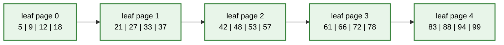
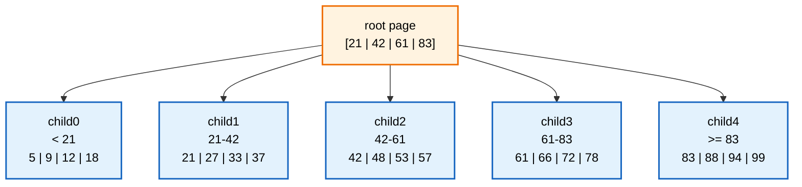
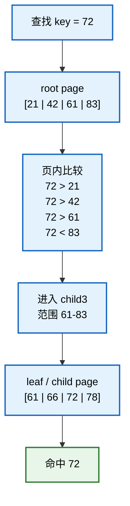
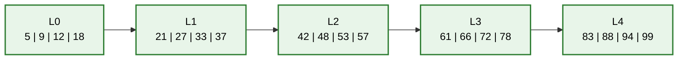
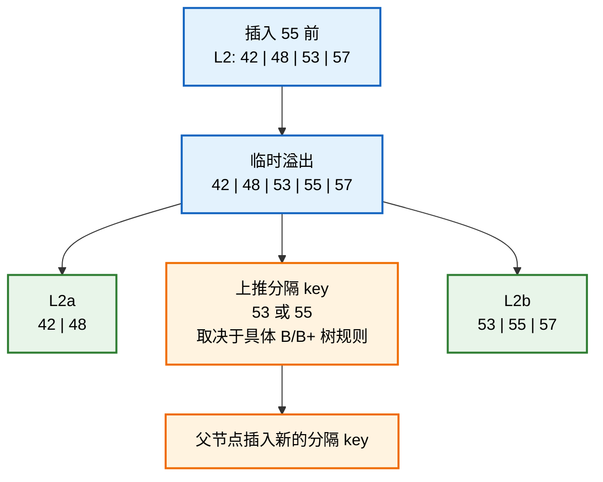
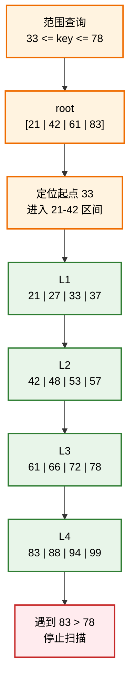
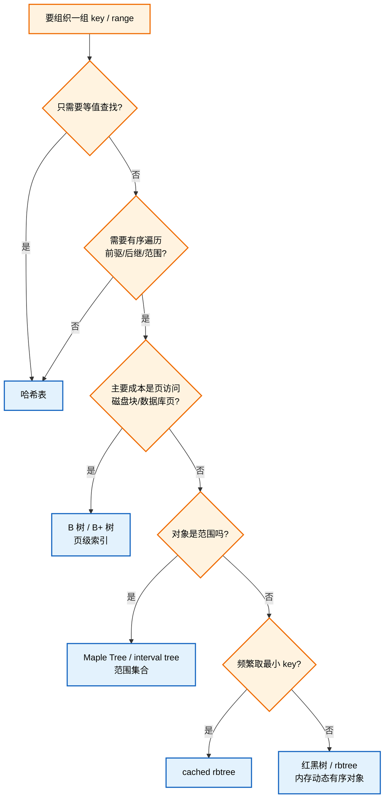

# 第13章_再扩展到_B_树与_B+_树

## 13.1_章节内容说明

前面已经完成了红黑树这条线：

```text
BST 的有序性
	↓
旋转维护局部结构
	↓
2-3-4 树提供多路平衡直觉
	↓
红黑树把 2-3-4 树编码成二叉树
	↓
Linux rbtree 把红黑树落成内核工程接口
```

本章不再重复红黑树插入、删除和 Linux `rbtree` 源码细节。

本章的作用是把视野从“内存中的二叉平衡树”扩展到“页级索引中的多路平衡树”。

换句话说，本章要回答的问题是：

```text
红黑树已经能保证 O(log n)，为什么还需要 B 树 / B+ 树？
B 树 / B+ 树为什么要让一个节点保存多个 key？
B+ 树为什么特别适合数据库和文件系统索引？
红黑树、2-3-4 树、B 树、B+ 树之间到底是什么关系？
```

本章后面的图都围绕同一个复杂场景展开：

```text
假设有一批按 key 排序的记录：

5, 9, 12, 18, 21, 27, 33, 37, 42, 48,
53, 57, 61, 66, 72, 78, 83, 88, 94, 99

这些记录不是只放在内存对象里，而是组织在页或块中。
```

如果用红黑树，每个 key 可以是一个独立节点。

如果用 B+ 树，这些 key 可能被组织成多个叶子页：



本章要反复回答一个问题：

```text
为什么页级索引宁愿让一个节点装多个 key，也不愿把每个 key 都拆成独立二叉节点？
```

------

## 13.2_为什么在红黑树之后学习_B_树_/_B+_树

红黑树和 B 树 / B+ 树都属于查找树家族。

它们都在解决同一个大问题：

```text
如何在一组动态变化的数据中，保持较高的查找、插入、删除效率。
```

但是它们面对的主要成本不同。

红黑树主要面对的是内存中的指针结构成本。

B 树 / B+ 树主要面对的是页访问成本。

这就是两类结构的分水岭。

------

### 13.2.1_红黑树解决内存中的二叉平衡问题

红黑树首先是一棵 BST。

它的每个物理节点通常只保存一个 key，并通过左右孩子指针连接：

```text
        key
       /   \
   smaller larger
```

如果这棵树不平衡，查找路径可能退化成链表。

红黑树通过颜色规则把高度控制在对数级。

所以红黑树解决的是：

```text
在内存指针结构中，如何避免 BST 退化。
```

Linux `rbtree` 也正是沿着这个方向设计的。

它适合管理动态有序对象，例如：

```text
按时间排序的定时器；
按虚拟运行时间排序的调度实体；
需要前驱、后继、最小值、最大值的对象集合。
```

------

### 13.2.2_B_树解决多路平衡与外存访问问题

B 树仍然是平衡搜索树。

但它不是二叉树，而是多路搜索树。

一个节点里可以保存多个 key，并拥有多个孩子：

```text
          [ 10 | 20 | 30 ]
          /    |    |    \
       <10  10-20 20-30  >30
```

这样做的直接结果是：

```text
树变矮了。
```

如果数据存放在磁盘、SSD、数据库页、文件系统块里，树高就不只是算法里的抽象数字。

它常常对应：

```text
需要访问多少个页面；
需要做多少次 I/O；
需要经过多少层缓存未命中。
```

所以 B 树解决的是：

```text
通过提高节点分支数，减少页级访问次数。
```

------

### 13.2.3_B+_树解决页级索引与范围查询问题

B+ 树可以看成 B 树在工程索引场景中的进一步变形。

它的典型特点是：

```text
内部节点只保存索引 key；
真实数据记录集中放在叶子节点；
叶子节点之间按 key 顺序串起来。
```

结构可以简化理解为：

```text
            [ 30 | 60 ]
            /    |    \
         ...    ...    ...

叶子层：

[1, 5, 9] -> [30, 42, 58] -> [60, 71, 88]
```

这让 B+ 树特别适合范围查询。

例如查询：

```text
key 在 [30, 80] 之间的所有记录
```

流程通常是：

```text
先从根节点定位到第一个满足条件的叶子页；
然后沿着叶子链表向后顺序扫描；
直到 key 超出范围为止。
```

这比在一棵普通二叉树里反复找后继更适合页式存储。

------

### 13.2.4_红黑树与_B/B+_树的共同基础

红黑树、B 树、B+ 树的共同基础都是有序查找。

它们都依赖一个核心前提：

```text
key 能够比较大小，并且比较规则稳定。
```

没有稳定的比较规则，就没有 BST 有序性，也没有 B 树节点内部的区间划分。

前面学习 BST 时讲过：

```text
左子树 < 当前节点 < 右子树
```

到了 B 树，这个思想扩展成：

```text
多个 key 把孩子区间切成多段。
```

例如节点：

```text
[ 10 | 20 | 30 ]
```

会把数据分成四个区间：

```text
(-∞, 10)
(10, 20)
(20, 30)
(30, +∞)
```

所以 B 树不是抛弃 BST 思想，而是把“二分区间”扩展成了“多分区间”。

------

### 13.2.5_红黑树与_B/B+_树的工程分工

可以先用一句话区分：

```text
红黑树更偏内存对象管理；
B/B+ 树更偏页级索引管理。
```

更具体一点：

| 结构 | 典型节点形态 | 更关注的成本 | 典型场景 |
| --- | --- | --- | --- |
| 红黑树 | 一个节点一个 key，左右指针 | 树高、指针维护、旋转成本 | 内核对象集合、定时器、调度实体 |
| B 树 | 一个节点多个 key，多个孩子 | 页访问次数、节点分裂合并 | 文件系统、外存索引 |
| B+ 树 | 内部节点索引，叶子节点存数据 | 范围扫描、页缓存、顺序访问 | 数据库索引、文件系统索引 |

红黑树的优势是节点小、结构直接、适合频繁动态更新的内存对象。

B+ 树的优势是节点大、扇出高、叶子有序，适合把大量记录组织在页里。

------

## 13.3_B_树

B 树是一种多路平衡搜索树。

它和 2-3-4 树有天然联系。

前面第 6 章讲的 2-3-4 树可以看成一种小阶数的 B 树：

```text
2-node：1 个 key，2 个孩子；
3-node：2 个 key，3 个孩子；
4-node：3 个 key，4 个孩子。
```

B 树把这个思想推广到更大的阶数。

------

### 13.3.1_多路搜索树的基本结构

二叉搜索树每个节点最多两个孩子。

B 树节点可以有很多孩子。

一个节点如果有 `m` 个孩子，通常会有 `m - 1` 个 key 用来划分区间。

例如：

```text
              [ 20 | 50 | 80 ]
              /    |    |    \
           <20  20-50 50-80  >80
```

这个节点有 3 个 key，最多可以引出 4 个孩子方向。

节点中的 key 必须有序排列：

```text
20 < 50 < 80
```

孩子子树也必须落入对应区间。

这和 BST 的左右子树约束是同一个思想，只是区间数量变多了。

把复杂一点的情况画出来：



这张图体现了多路树的关键：

```text
一次访问 root page，就能把搜索空间切成 5 段。
```

在红黑树中，一层只能做一次二分。

在 B 树 / B+ 树中，一层可以用多个 key 做多段划分。

------

### 13.3.2_节点中多个_key_的组织方式

B 树节点内部通常按数组方式保存 key。

可以抽象成：

```c
struct btree_node {
	int nr_keys;
	int keys[MAX_KEYS];
	struct btree_node *children[MAX_KEYS + 1];
	bool leaf;
};
```

这不是某个具体内核实现，只是帮助理解结构。

重点在于：

```text
keys[] 负责页内有序比较；
children[] 负责指向下一层区间；
nr_keys 说明当前节点实际保存了多少个 key；
leaf 说明当前节点是不是叶子。
```

一个节点内部保存多个 key 的好处是：

```text
一次读入一个节点，就能完成多次比较；
一次节点访问，可以排除多个区间；
树的高度可以显著降低。
```

------

### 13.3.3_B_树的查找过程

B 树查找分两层：

```text
先在当前节点内部查找；
再根据比较结果选择一个孩子继续向下。
```

假设当前节点是：

```text
[ 20 | 50 | 80 ]
```

查找 `65`：

```text
65 > 20
65 > 50
65 < 80
```

所以应该进入 `(50, 80)` 对应的孩子。

查找伪代码可以这样理解：

```text
btree_search(node, key):
	在 node.keys[] 中找到第一个 >= key 的位置 i

	如果 keys[i] == key:
		查找成功

	如果 node 是叶子:
		查找失败

	否则:
		进入 children[i]
```

如果节点内部 key 很多，页内查找可以用线性查找，也可以用二分查找。

具体选择取决于节点大小、缓存行为和实现复杂度。

用前面的复杂节点查找 `72`。



这条路径里真正昂贵的通常不是：

```text
在 root page 内比较 4 个 key。
```

而是：

```text
访问 root page；
访问 child page。
```

所以页级索引的目标是减少“跨页访问次数”。

------

### 13.3.4_B_树的插入分裂

B 树插入和 2-3-4 树插入的核心直觉一致：

```text
先找到叶子落点；
如果节点还有空间，就直接插入；
如果节点已满，就分裂节点，并把中间 key 上推到父节点。
```

例如一个节点已满：

```text
[ 10 | 20 | 30 ]
```

再插入 `25` 后，临时结果可以看成：

```text
[ 10 | 20 | 25 | 30 ]
```

如果阶数不允许保存 4 个 key，就要分裂。

一种简化理解是：

```text
左节点：[10]
上推：  [20]
右节点：[25 | 30]
```

上推的 key 会插入父节点。

如果父节点也满了，分裂会继续向上传播。

如果根节点分裂，树高增加一层。

这和第 6 章讲过的 2-3-4 树插入分裂是同一类机制。

下面看一个稍复杂的分裂传播例子。

假设每个叶子页最多保存 4 个 key，当前叶子链如下：



现在插入：

```text
key = 55
```

它应该落在：

```text
L2：42 | 48 | 53 | 57
```

插入后临时变成：

```text
42 | 48 | 53 | 55 | 57
```

超过页容量，于是分裂：



如果父节点也满了，就继续向上分裂。

这和 2-3-4 树完全同构：

```text
节点容量满了；
插入导致溢出；
中间分隔 key 上推；
父节点也满则继续传播；
根分裂则树高增加。
```

------

### 13.3.5_B_树的删除合并

B 树删除比插入复杂。

原因也和 2-3-4 树类似：

```text
删除可能让某个节点 key 数量不足；
为了保持平衡和节点容量约束，需要借位或合并。
```

常见处理有三类：

```text
如果兄弟节点 key 足够，可以从兄弟借一个 key；
如果兄弟节点也不够，可以和兄弟合并；
如果内部节点删除 key，通常转换成前驱或后继 key 的删除。
```

删除真正难的地方不在“把 key 拿掉”，而在：

```text
拿掉之后，如何让所有节点仍然满足最小 key 数量约束；
如何让所有叶子仍然位于同一层；
如何让父节点中的分隔 key 与孩子区间继续匹配。
```

这和红黑树删除修复的关系很近。

红黑树删除修复里的“缺黑”，从 2-3-4 树视角看，就是某个逻辑节点容量不足后需要借位或合并。

------

### 13.3.6_为什么_B_树适合页式存储

B 树适合页式存储，是因为一个节点可以设计成接近一个页面大小。

假设一个页面是 4KB。

如果一个 B 树节点正好放在一个页面里，那么一次页面读取可以拿到：

```text
多个 key；
多个孩子指针或块号；
一整段有序区间信息。
```

这比红黑树每次只读一个小节点更适合外存。

红黑树查找路径虽然也是 O(log n)，但每下一层都可能跳到完全不同的内存位置或页面。

B 树通过更高扇出降低树高：

```text
每层排除大量区间；
访问层数减少；
页缓存命中更友好；
顺序和局部访问更容易优化。
```

所以不能只看复杂度公式。

在页式存储场景中：

```text
访问一次页面的成本，远高于在页面内部比较几十个 key 的成本。
```

------

## 13.4_B+_树

B+ 树是工程索引里更常见的形态。

它和 B 树的区别不是“名字多了一个加号”，而是数据组织方式发生了变化。

------

### 13.4.1_B+_树与_B_树的结构差异

B 树中，内部节点和叶子节点都可以保存实际数据。

B+ 树中，通常只有叶子节点保存实际数据或数据指针，内部节点只保存索引 key。

对比一下：

| 项目 | B 树 | B+ 树 |
| --- | --- | --- |
| 数据位置 | 内部节点和叶子节点都可能保存数据 | 数据集中在叶子节点 |
| 内部节点作用 | 同时参与索引和数据保存 | 主要负责导航 |
| 叶子节点 | 不一定串联 | 通常按 key 顺序串联 |
| 范围查询 | 可以做，但不如 B+ 树顺 | 非常适合 |
| 工程索引 | 可用 | 更常见 |

B+ 树牺牲了一点“在内部节点直接命中数据”的机会，换来了更整齐的索引结构和更强的范围扫描能力。

------

### 13.4.2_叶子节点存储数据

B+ 树的叶子节点保存完整数据记录，或者保存指向数据记录的位置。

可以简化理解为：

```text
叶子页：

[ key1 -> record1 | key2 -> record2 | key3 -> record3 ]
```

如果是数据库索引，叶子节点里可能保存：

```text
主键值；
行记录；
行记录地址；
二级索引到主键的映射。
```

不同数据库实现细节不同，但结构思想相同：

```text
真正需要返回给上层的数据，集中在叶子层。
```

这样做的好处是查询路径稳定。

无论查找哪个 key，通常都要走到叶子层。

这让实现更统一，也方便范围查询从叶子层开始连续扫描。

------

### 13.4.3_内部节点只存索引

B+ 树内部节点主要负责导航。

它保存的是分隔 key 和孩子指针：

```text
            [ 30 | 60 | 90 ]
            /    |    |    \
         child0 child1 child2 child3
```

内部节点不保存完整记录后，同样大小的页面可以容纳更多 key。

这会带来一个重要结果：

```text
内部节点扇出更高，树更矮。
```

树越矮，从根到叶需要访问的页面越少。

这正是 B+ 树适合大规模索引的关键原因。

------

### 13.4.4_叶子链表与范围查询

B+ 树的叶子节点通常按 key 顺序串联。

例如：

```text
[ 1 | 5 | 9 ] -> [ 12 | 18 | 25 ] -> [ 30 | 42 | 50 ]
```

如果查询范围是：

```text
key >= 12 && key <= 42
```

只需要：

```text
1. 从根节点定位到 key >= 12 的第一个叶子位置；
2. 在当前叶子页内顺序扫描；
3. 沿叶子链表继续扫描后续叶子页；
4. 遇到 key > 42 后停止。
```

这就是 B+ 树比红黑树更适合范围查询的地方。

红黑树也能做范围遍历。

Linux `rbtree` 可以通过 `rb_first()`、`rb_next()` 或自定义查找起点实现有序遍历。

但红黑树的遍历是沿节点指针找中序后继，而 B+ 树的范围扫描是沿叶子页顺序前进。

对于页式存储，后者更符合缓存和 I/O 模型。

下面用一个复杂范围查询推演。

查询：

```text
key BETWEEN 33 AND 78
```

B+ 树先定位范围起点 `33` 所在叶子页，然后沿叶子链表顺序扫描。



返回结果来自连续叶子页：

```text
L1：33, 37
L2：42, 48, 53, 57
L3：61, 66, 72, 78
```

这就是 B+ 树范围扫描的优势：

```text
先走树定位起点；
后面沿叶子页顺序前进；
不需要每个结果都重新从根查找；
也不需要像二叉树那样频繁沿父指针找中序后继。
```

------

### 13.4.5_B+_树为什么适合数据库索引

数据库索引非常看重几件事：

```text
等值查找；
范围查询；
排序输出；
尽量少的页面访问；
可控的插入、删除维护成本。
```

B+ 树正好贴合这些需求。

等值查找时：

```text
从根节点逐层定位到叶子节点；
在叶子节点找到对应 key。
```

范围查询时：

```text
先定位起点；
再沿叶子链表顺序扫描。
```

排序输出时：

```text
叶子层天然按 key 有序。
```

页面访问方面：

```text
内部节点扇出高；
树高低；
根节点和上层内部节点容易常驻缓存。
```

所以数据库索引常常优先选择 B+ 树，而不是红黑树。

这不是因为红黑树复杂度不好，而是因为红黑树的节点粒度不适合数据库页模型。

------

### 13.4.6_B+_树为什么适合文件系统索引

文件系统也经常面对类似问题：

```text
按文件偏移查找数据块；
按目录项名称查找目录记录；
管理大量 extent；
在磁盘块或页缓存之间组织索引。
```

这些对象通常不是零散地放在小内存节点里，而是和块、页、extent 等概念绑定。

B+ 树的多路节点很适合这种场景：

```text
一个节点对应一个磁盘块或页面；
节点内部保存多个 key；
树高较低；
范围扫描和顺序访问更自然。
```

这也是为什么很多数据库和文件系统索引结构都能看到 B 树或 B+ 树思想。

具体实现未必叫“B+ 树”，也可能加入 extent、日志、写时复制、校验和、压缩等工程机制。

但底层直觉仍然是：

```text
用多路平衡结构减少页级访问，并保持 key 的有序组织。
```

------

## 13.5_红黑树_2-3-4_树_B_树_B+_树的关系图谱

这一节把几种结构放到同一张图里看。

不要把它们理解成互相替代的“高级版”和“低级版”。

更准确的理解是：

```text
它们面对不同层级的成本模型。
```

------

### 13.5.1_二叉平衡树与多路平衡树

红黑树是二叉平衡树。

B 树 / B+ 树是多路平衡树。

两者都保持有序，也都控制高度。

差别在于每个节点能分出多少个方向。

```text
红黑树：

        20
       /  \
     <20  >20

B 树：

        [ 20 | 50 | 80 ]
        /    |    |    \
     <20  20-50 50-80  >80
```

红黑树每层最多二分。

B 树每层可以多分。

这使得 B 树在大规模页式索引中更容易降低高度。

------

### 13.5.2_内存结构与外存结构

红黑树更自然地工作在内存对象场景。

它的节点通常是业务结构体的一部分：

```c
struct demo_item {
	int key;
	struct rb_node rb;
};
```

B+ 树更自然地工作在页式结构场景。

它的节点常常对应一个页面或磁盘块：

```text
page
	metadata
	key array
	child pointers / record slots
```

所以选择数据结构时，要先问：

```text
我管理的是内存里的对象，还是页里的索引项？
```

如果是内存对象集合，红黑树往往简单直接。

如果是页级索引，大扇出结构通常更合适。

------

### 13.5.3_单_key_节点与多_key_节点

红黑树的物理节点通常只有一个排序 key。

B/B+ 树的节点保存多个 key。

这会影响很多工程细节。

红黑树的调整单位是：

```text
单个节点；
父子指针；
颜色；
旋转。
```

B/B+ 树的调整单位是：

```text
节点内部 key 数组；
孩子数组；
节点分裂；
节点合并；
兄弟借位。
```

这也是为什么第 6 章先讲 2-3-4 树很重要。

2-3-4 树让你提前见过：

```text
一个逻辑节点保存多个 key；
插入满节点需要分裂；
删除容量不足需要借位或合并。
```

B 树只是把这个思想推广到了更大的节点容量。

------

### 13.5.4_指针跳转成本与页访问成本

红黑树查找时，路径大概是：

```text
root -> left/right -> left/right -> ...
```

每一步都是一次节点跳转。

在内存中，这个成本通常可以接受。

B+ 树查找时，路径大概是：

```text
root page -> internal page -> leaf page
```

每一步是一个页面级访问。

页面内部再比较多个 key。

两者复杂度都可以写成 O(log n)，但底层常数差别很大。

在数据库或文件系统里，重要的是：

```text
少访问几个页面，比少做几十次整数比较更有价值。
```

所以 B+ 树宁愿让节点内部更复杂，也要降低树高。

------

### 13.5.5_工程场景选择依据

可以用下面这张表快速判断：

| 需求 | 更可能适合的结构 |
| --- | --- |
| 内存中的动态有序对象集合 | 红黑树 |
| 需要频繁取最小 key | cached rbtree |
| 需要子树聚合信息 | augmented rbtree / interval tree |
| 大规模页式索引 | B 树 / B+ 树 |
| 数据库范围查询 | B+ 树 |
| 文件系统块或 extent 索引 | B/B+ 树类结构 |
| 非重叠范围映射管理 | Maple Tree 类结构 |
| 等值查找为主，不要求有序 | 哈希表 |
| 整数 ID 到指针的映射 | XArray / radix 类结构 |

这张表不是绝对规则。

它只是提醒自己：

```text
数据结构选择要看访问模式、更新模式、内存布局和并发约束。
```

不要只凭复杂度公式选结构。

可以把选择过程画成一张决策图：



这张图的意义是：

```text
先看访问模式；
再看数据放在哪里；
最后才看具体树名。
```

------

### 13.5.6_Maple_Tree_在这张图谱中的位置

Maple Tree 不应该简单理解成“Linux 版 B+ 树”，也不应该理解成“新 rbtree”。

更准确的定位是：

```text
Maple Tree 是 Linux 内核里的 RCU-safe、range-based B-Tree 变体；
它面向非重叠范围集合；
VMA 管理是它最重要的使用场景。
```

从红黑树学习路线看，它的意义在于：

```text
红黑树：
	一个对象一个 rb_node；
	按单个 key 组织动态有序集合。

Maple Tree：
	一个节点保存多个 pivot / slot；
	按范围边界组织非重叠区间集合。
```

所以新内核 VMA 从 rbtree 走向 Maple Tree，并不是说 rbtree 被全面淘汰。

准确说法是：

```text
VMA 管理从传统 rbtree + linked list + vmacache 模型，
转向 Maple Tree + VMA iterator 模型。
```

这和公平调度从 CFS 走向 EEVDF 是两件事。

前者是内存管理中 VMA 范围索引结构变化。

后者是调度器选择可运行任务的算法语义变化。

------

## 13.6_本章小结

本章把红黑树之后的查找树家族做了一次横向扩展。

第一，红黑树解决的是内存中的二叉平衡问题。

它通过颜色和旋转控制 BST 高度，适合动态有序对象集合。

第二，B 树解决的是多路平衡和页级访问问题。

它让一个节点保存多个 key，用更大的扇出降低树高。

第三，B+ 树进一步把数据集中到叶子层，让内部节点专注导航，并通过叶子链表优化范围查询。

第四，2-3-4 树是理解这些结构的桥梁。

它既能解释红黑树颜色的结构语义，也能提前展示 B 树的多 key 节点、分裂、借位和合并。

最后可以把整组学习路线压缩成一句话：

```text
红黑树是把多路平衡思想编码成内存二叉树；
B/B+ 树是把多路平衡思想扩展到页级索引。
```

学到这里，红黑树这组笔记就不只是“会背五条性质”，而是能从工程成本出发，理解不同查找树为什么会长成不同样子。
