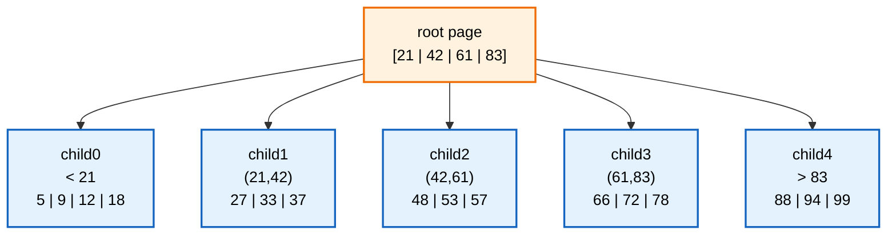
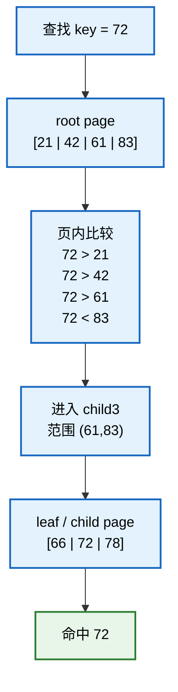
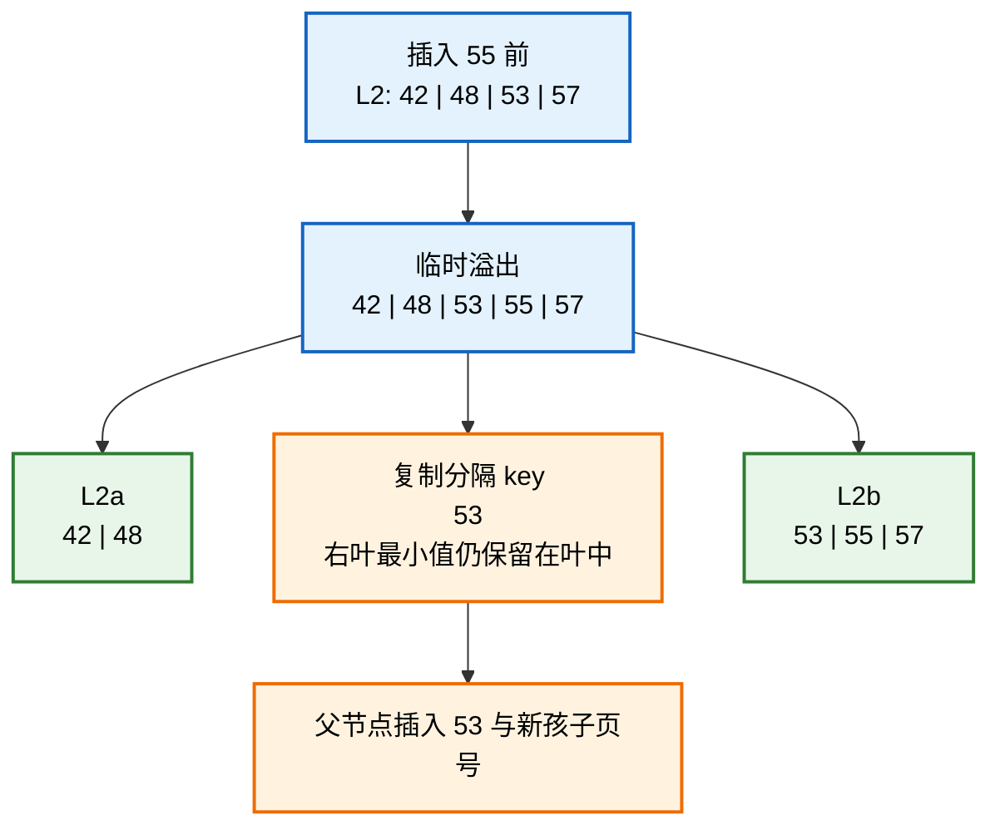
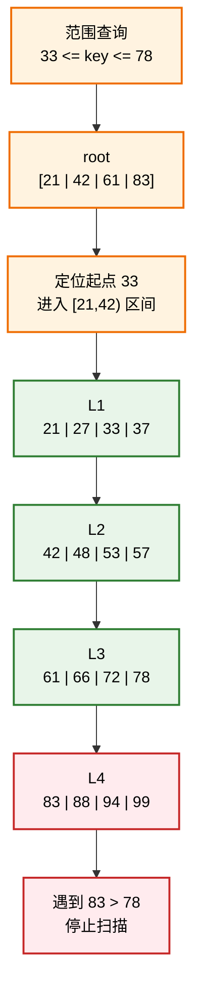
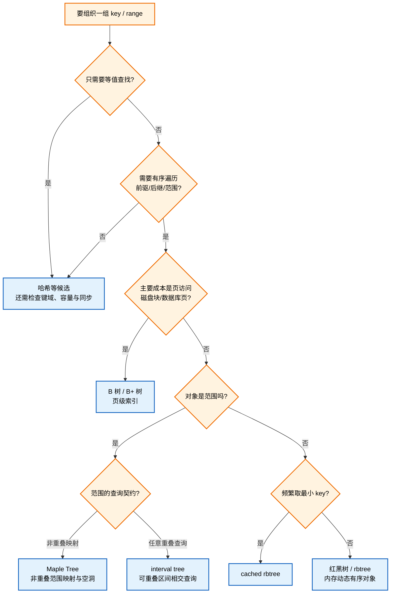

# 第13章\_再扩展到\_B\_树与\_B+\_树

## 13.1\_章节内容说明

红黑树已让我们看到：排序关系由比较器决定，平衡维护控制路径高度，缓存与摘要把一部分查询工作移到更新阶段。现在把对象的承载单位改成页：一次取得一页，能否顺便得到更多键和候选记录？先沿[P34 页请求计数实验](P34_从多路节点到页级索引.md#34.3_运行页请求与未命中的计数模型)回顾页请求、缓存未命中与后端读取的区别，再进入本章的具体布局。

贯穿实例仍是这二十条唯一整数键记录：

```text
5, 9, 12, 18, 21, 27, 33, 37, 42, 48,
53, 57, 61, 66, 72, 78, 83, 88, 94, 99
```

先把每四条记录放在一个叶页里，逻辑上按键串联：


```mermaid
flowchart LR
	L0["leaf page 0<br/>5 | 9 | 12 | 18"]
	L1["leaf page 1<br/>21 | 27 | 33 | 37"]
	L2["leaf page 2<br/>42 | 48 | 53 | 57"]
	L3["leaf page 3<br/>61 | 66 | 72 | 78"]
	L4["leaf page 4<br/>83 | 88 | 94 | 99"]

	L0 --> L1 --> L2 --> L3 --> L4

	classDef leaf fill:#e8f5e9,stroke:#2e7d32,color:#000,stroke-width:2px;
	class L0,L1,L2,L3,L4 leaf;
```

这一层尚未解释如何快速找到起点，也没有说明更新时怎样增加页。本章会先区分两种分隔方式：B 树可以把实际键记录移到内部节点，B+ 树让记录留在叶层，内部保存导航用的分隔键。再追踪相等键、插入 55 与范围 `[33,78]`，最后运行完整 C++ 页模型。

重点不是把“一个节点多个键”当成更高级的标签，而是弄清哪些字节被读入、相等时走哪条边、分裂时哪个键仍留在叶子、以及为这些选择增加了什么更新责任。

## 13.2\_为什么在红黑树之后学习\_B\_树\_/\_B+\_树

前面从 BST 的有序性走到旋转、2-3-4 节点与红黑编码，再进入 Linux 的嵌入式对象接口。现在仍在解决动态有序集合，改变的是节点布局和主要成本。二叉平衡和多路平衡都可以存在于内存，页式结构也不必每次访问设备；先看具体承载方式，不能把“内存/磁盘”当作数学定义。

### 13.2.1\_红黑树解决内存中的二叉平衡问题

一个典型的内存红黑节点保存一条业务记录的嵌入成员，通过左右地址连接其他对象。颜色约束防止树退化成链，沿键查找只走对数高度。需要稳定对象身份、动态接入摘除、前驱后继或最小值的场景，可以直接利用这一模型。

这种布局也带来地址依赖：只有读到当前孩子地址，才能继续去下一节点。对象可能分散在不同缓存行或页里，也可能由分配器聚集在一起；不能只看树高便断言每层都发生一次设备 I/O。Linux 定时队列和有序对象集合可作具体例子，当前固定版公平调度的 deadline 与资格关系则见[P12 场景核对](P12_Linux_6.12_内核_rbtree_工程扩展_并发与验证.md#12.8.2_调度实体按虚拟运行时间排序的思路)，不再简写为当前版总按 vruntime 取首。

### 13.2.2\_B\_树解决多路平衡与外存访问问题

如果后端一次取得一页，只让页里很少的字节参与导航，可能浪费已经支付的页请求成本。把多个有序键与多个孩子定位符放在同一节点，读入后就能将候选范围划成更多段；下一层只进入其中一段。扇出增大以后，同样规模所需的层数通常下降。

这并未省掉页内工作：节点内需要线性或二分比较，插入可能搬移键和定位符，页满后要分裂。若页本来已经驻留且比较键很长，页内成本也可能明显；若后端读取主导，减少需要取得的页通常更有价值。因此树高描述路径上的节点层数，页请求、缓存未命中和物理 I/O 仍要分别计数。

### 13.2.3\_B+\_树解决页级索引与范围查询问题

在 B 树中找到一个内部记录即可结束等值查询，但记录分布在不同层。若经常要返回一段相邻键，可以考虑让 **所有叶层记录按次序集中**，内部节点只做导航，再为叶子建立后继页链接。这就是本章采用的 B+ 树模型。

例如内部用 30、60 分隔，三个叶子保存 `[1,5,9]`、`[30,42,58]`、`[60,71,88]`。找 30 时不能在内部看到分隔键就宣布已取得记录，而要进入对应叶页。查 `[30,80]` 时先定位起点，再沿叶页继续到超过 80；一次页内可处理多个结果。

它并不使红黑树不能做范围查询。红黑树定位起点后同样可以逐个求后继，无须为每个结果重新从根查找。这里比较的是后继的承载单位、父链或页链的访问及局部性，不是把另一种正确算法写成低效的反复全树搜索。

### 13.2.4\_红黑树与\_B/B+\_树的共同基础

稳定的全序或约定好的比较关系，是所有这些搜索结构的前提。唯一键 BST 的一条记录把子树分成左右两段；B 树内部的 10、20、30 则把 **未留在当前节点的记录** 分到 `(-∞,10)`、`(10,20)`、`(20,30)`、`(30,+∞)` 四个开区间，相等键已经在当前节点命中。

B+ 树还需要单独声明分隔约定。本章选“分隔键等于右孩子子树的最小键”：同样写着 10、20、30 时，孩子区间变成 `(-∞,10)`、`[10,20)`、`[20,30)`、`[30,+∞)`，相等键必须向右继续。还存在其他边界约定，不能把本章规则当作所有产品的统一文件格式。

### 13.2.5\_红黑树与\_B/B+\_树的工程分工

| 结构 | 本章采用的节点职责 | 需要一起比较的收益和成本 |
| --- | --- | --- |
| 红黑树 | 一条业务记录对应一个嵌入式二叉成员 | 对象身份直接、接入粒度小；路径上有地址依赖和父子维护 |
| B 树 | 一个节点容纳多条键记录及区间孩子 | 更高扇出、可能内部命中；页内移动和分裂合并需要维护记录归属 |
| B+ 树 | 内部导航，叶层保存记录或记录定位符 | 内部容量与叶层扫描可分别优化；命中需到叶层，更新还要维护分隔键和叶链 |

这些是候选条件，不是按名字排性能名次。记录大小、键编码、节点占用、缓存、并发和持久化规则都能改变代价。接下来先在同一批二十条记录上观察两种记录归属，再讨论工程选择。

## 13.3\_B\_树

2-3-4 树已经演示了一个节点可保存多个键，并通过借位、合并与分裂维持容量。B 树推广这一思路；“阶”在资料中有不同口径，本节明确以 **最多 m 个孩子、最多 m−1 个键** 说明容量。非根节点至少有 `ceil(m/2)−1` 个键，非叶根至少有两个孩子，所有叶子处于同一层；空树和叶根单独处理。

### 13.3.1\_多路搜索树的基本结构

含 k 个键的内部节点有 k+1 个有效孩子，键按序存放，每个孩子覆盖相邻键之间的区间。叶子没有有效孩子，不能因为结构里预留了数组就认为叶子也有 k+1 棵空实体子树。

用最多五个孩子的 B 树组织二十条记录，内部的 21、42、61、83 是实际记录的一部分，所以它们不再重复放进叶子：


```mermaid
flowchart TD
	root["root page<br/>[21 | 42 | 61 | 83]"]

	c0["child0<br/>< 21<br/>5 | 9 | 12 | 18"]
	c1["child1<br/>(21,42)<br/>27 | 33 | 37"]
	c2["child2<br/>(42,61)<br/>48 | 53 | 57"]
	c3["child3<br/>(61,83)<br/>66 | 72 | 78"]
	c4["child4<br/>> 83<br/>88 | 94 | 99"]

	root --> c0
	root --> c1
	root --> c2
	root --> c3
	root --> c4

	classDef root fill:#fff3e0,stroke:#ef6c00,color:#000,stroke-width:2px;
	classDef child fill:#e3f2fd,stroke:#1565c0,color:#000,stroke-width:2px;
	class root root;
	class c0,c1,c2,c3,c4 child;
```

根保存四条，五个叶子合计十六条，总数仍是二十。一次取得根节点后，可以在页内比较四个键，决定命中还是进入五段之一。我们刚刚增加的是每层分流能力，不是让一次 CPU 比较同时判断五个区间。

### 13.3.2\_节点中多个\_key\_的组织方式

抽象节点仍可用下面的字段表达；MAX_KEYS 是由节点容量决定的正整数常量占位符，这不是某个磁盘格式的完整 C 定义：

```c
struct btree_node {
    int nr_keys;                         /* 当前有效键数。 */
    int keys[MAX_KEYS];                  /* 页内有序键。 */
    struct btree_node *children[MAX_KEYS + 1]; /* 内存模型的孩子地址。 */
    bool leaf;                           /* 叶子不读取孩子数组。 */
};
```

内存模型可以使用地址，持久页往往需要页号或其他定位符，再经过缓存与存储映射才能取得页内容。nr_keys 区分预留容量与有效内容；页里可能还有记录定位、长度、校验等元数据，不能用一个 C sizeof 自动推导真实可容纳键数。

### 13.3.3\_B\_树的查找过程

先在当前键数组找到第一个不小于查询键的位置 i。i 可能等于 nr_keys，此时它表示所有键都更小，不能先读取越界的 keys[i]。完整分支为：

```text
若树空，返回未找到。
在当前节点求第一个 keys[i] >= key 的位置，允许 i == nr_keys。
若 i < nr_keys 且 keys[i] == key，命中当前记录。
否则若当前节点为叶子，返回未找到。
否则进入 children[i]，重复上述过程。
```

例如 `[20,50,80]` 中查 65，比较后进入 `(50,80)` 对应孩子。对本章二十条记录查 72，则经过根的 61 与 83 之间，进入只含 66、72、78 的叶子：


```mermaid
flowchart TD
	start["查找 key = 72"]
	root["root page<br/>[21 | 42 | 61 | 83]"]
	compare["页内比较<br/>72 > 21<br/>72 > 42<br/>72 > 61<br/>72 < 83"]
	child["进入 child3<br/>范围 (61,83)"]
	leaf["leaf / child page<br/>[66 | 72 | 78]"]
	hit["命中 72"]

	start --> root --> compare --> child --> leaf --> hit

	classDef step fill:#e3f2fd,stroke:#1565c0,color:#000,stroke-width:2px;
	classDef hit fill:#e8f5e9,stroke:#2e7d32,color:#000,stroke-width:2px;
	class start,root,compare,child,leaf step;
	class hit hit;
```

查 61 与查 72 的关键区别是前者在根已经命中，后者继续到叶。页内线性查找和二分查找都可实现位置选择，哪个更划算还要看键数、编码与缓存；P34 已经说明两次页请求不自动等于两次后端读取。

### 13.3.4\_B\_树的插入分裂

先找到允许的叶子落点，有容量则移开后续键并接入。容量不足时，必须遵守选定的分裂时机和暂存容量。以前面 2-3-4 模型的最多三个键为例，`[10,20,30]` 插入 25 可在暂存区形成 `[10,20,25,30]`，上移 20，留下 `[10]` 和 `[25,30]`；这是原来的自底向上示例，不是向正式三槽数组越界写第四项。

若采用本节最多四个键的容量，满节点 `[10,20,30,40]` 加入 25 后，暂存五项，上移中间记录 25，两侧各留两项。**上移记录离开孩子**，这条记录现在归父节点持有。父节点也满时继续分裂；旧根分裂则创建新根，树高增加。预分裂与溢出后回溯的完整程序仍见[P30 两种插入](P30_2-3-4树插入与分裂时机.md#30.3_运行完整的两种插入)。

回到当前 B 树布局，55 落在 `[48,53,57]`，插入后四项仍未超本节容量，因而不分裂。下一节同一批记录的 B+ 叶子包含 `[42,48,53,57]`，插入 55 却会溢出。这个差别来自记录是否已经上移，不是两个算法对同一个节点一会儿说满、一会儿说不满。

### 13.3.5\_B\_树的删除合并

删除以后如果仍满足最小占用，局部更新即可。若孩子少于下限，父节点可从有余量的相邻兄弟调配一项：父分隔记录下移，兄弟边缘记录上移替代；内部节点还要连同相应孩子区间一起转移。若兄弟没有余量，则把两个孩子与中间父记录合并，父再少一项，可能继续向上处理。

被删记录在内部时，通常先由适当的前驱或后继接替，再处理来源节点的删除；根失去最后分隔而只余一个孩子时，可以收缩根。这些步骤既维持容量，又保持区间归属和叶深一致。完整的先准备余量与后报告下溢两种过程分别见[P31 预修复删除](P31_2-3-4树预修复删除.md#31.3_运行完整预修复删除)和[P32 下溢回溯](P32_2-3-4树下溢回溯与根收缩.md#32.3_内部零键节点怎样继续传播)。

红黑删除的缺黑可借多路节点容量变化理解，但具体二叉编码和中间态必须按[P33 对照](P33_从多路删除到红黑缺口.md#33.1_在两套规则建立以后对照)逐步映射，不能把任何缺黑语句直接改名为“少一个键”就代替证明。

### 13.3.6\_为什么\_B\_树适合页式存储

以一个假设的 4 KiB 页为例，先扣除页头，再按键、记录信息、孩子定位符和槽表的编码计算容量，才知道可以提供多大扇出。若节点设计成一个页，请求一次就可取得多组比较边界，减少路径层数；若节点跨页，或记录变长，还要重新计算实际访问。

代价是页内移动、分裂合并、额外空间余量，以及持久化系统里的日志或写时复制等更新工作。上层节点较少，可能更容易驻留，但缓存命中要由实际工作集和策略决定。页已经在内存时，“少读一页比几十次比较贵得多”也不再是无条件结论。

## 13.4\_B+\_树

B 树已经能保持有序和多路平衡。现在增加一个明确约束：记录统一留在叶层，让内部节点只负责把查询带到正确叶子。分隔键的含义、等值走向和分裂规则会随之改变。

### 13.4.1\_B+\_树与\_B\_树的结构差异

| 问题 | 本章 B 树 | 本章 B+ 树 |
| --- | --- | --- |
| 实际记录在哪 | 内部和叶节点都可保存 | 记录或记录定位符在叶层 |
| 内部键相等时怎么办 | 可以命中当前记录 | 按约定向右继续到叶子 |
| 内部分隔的意义 | 当前实际记录与相邻孩子界 | 右孩子子树的最小键副本 |
| 叶层分裂怎样处理边界 | 上移记录从孩子移出 | 复制右叶最小键到父，叶中仍保留记录 |
| 范围推进 | 可中序推进，跨不同层记录 | 可从起始叶沿叶链推进 |

B+ 树放弃了某些内部直接命中的机会，换取统一叶层和可能更小的内部项。不要据此断言所有 B+ 树文件格式都相同；本章规则是为了让同一个例子能够逐步验算。

### 13.4.2\_叶子节点存储数据

叶项可保存完整记录，也可保存返回记录所需的定位符。聚簇与二级索引、堆记录或其他存储安排决定“找到叶项”之后是否还要读取另一处记录；不是每个产品都把一整行放进所有叶页。具体数据库格式比较与资料入口仍沿[P34 页与记录](P34_从多路节点到页级索引.md#34.2_从比较次数走到页与记录)。

本章只把整数键本身当作记录，因此能直接观察重复、缺失和输出次序。叶链表示逻辑次序，不承诺这些叶页在文件或设备上连续，也不把 next 页号当成物理相邻块。

### 13.4.3\_内部节点只存索引

二十条记录全部保留在开头五个叶页里，内部根存右侧各叶最小值的副本 `[21,42,61,83]`。其孩子区间为 `<21`、`[21,42)`、`[42,61)`、`[61,83)`、`>=83`。查 42 时，相等应进入第三个孩子；停在内部只能得到导航边界，尚未取得叶记录。

先把分裂前的叶层再画一次，用来与更新后逐项比较：


```mermaid
flowchart LR
	L0["L0<br/>5 | 9 | 12 | 18"]
	L1["L1<br/>21 | 27 | 33 | 37"]
	L2["L2<br/>42 | 48 | 53 | 57"]
	L3["L3<br/>61 | 66 | 72 | 78"]
	L4["L4<br/>83 | 88 | 94 | 99"]
	L0 --> L1 --> L2 --> L3 --> L4

	classDef leaf fill:#e8f5e9,stroke:#2e7d32,color:#000,stroke-width:2px;
	class L0,L1,L2,L3,L4 leaf;
```

插入 55 时，L2 暂存 `[42,48,53,55,57]`。本例按左两项、右三项分裂，所以复制到父节点的边界必须是 **53**，它仍是右叶第一条记录。如果选择 55 作边界，就必须相应改成左三项、右两项；不能保持图中右叶仍含 53，却把相等路由边界写成“53 或 55 都行”。


```mermaid
flowchart TD
	before["插入 55 前<br/>L2: 42 | 48 | 53 | 57"]
	temp["临时溢出<br/>42 | 48 | 53 | 55 | 57"]
	left["L2a<br/>42 | 48"]
	promote["复制分隔 key<br/>53<br/>右叶最小值仍保留在叶中"]
	right["L2b<br/>53 | 55 | 57"]
	parent["父节点插入 53 与新孩子页号"]

	before --> temp
	temp --> left
	temp --> promote
	temp --> right
	promote --> parent

	classDef old fill:#e3f2fd,stroke:#1565c0,color:#000,stroke-width:2px;
	classDef new fill:#e8f5e9,stroke:#2e7d32,color:#000,stroke-width:2px;
	classDef mid fill:#fff3e0,stroke:#ef6c00,color:#000,stroke-width:2px;
	class before,temp old;
	class left,right new;
	class promote,parent mid;
```

分裂还要完成两个不同连接：父孩子数组插入新页号，叶链把原 L2.next 移交给新页并让 L2.next 指向新页。新根边界成为 `[21,42,53,61,83]`；内部原本若也满了，一般 B+ 实现还需内部拆分并可能增高。下一小节的有限模型给根预留八个分隔槽，只演示叶分裂；根无法再接孩子时明确失败且保持旧状态，不假装实现任意高度更新。

### 13.4.4\_叶子链表与范围查询

查询闭范围 `[33,78]` 时，先按内部边界定位包含起点的叶子，再跳过该页中小于 33 的项，沿 next 继续，读到第一项大于 78 时结束。以下保留分裂前的范围轨迹：


```mermaid
flowchart TD
	query["范围查询<br/>33 <= key <= 78"]
	root["root<br/>[21 | 42 | 61 | 83]"]
	locate["定位起点 33<br/>进入 [21,42) 区间"]
	L1["L1<br/>21 | 27 | 33 | 37"]
	L2["L2<br/>42 | 48 | 53 | 57"]
	L3["L3<br/>61 | 66 | 72 | 78"]
	L4["L4<br/>83 | 88 | 94 | 99"]
	stop["遇到 83 > 78<br/>停止扫描"]

	query --> root --> locate --> L1 --> L2 --> L3 --> L4 --> stop

	classDef scan fill:#e8f5e9,stroke:#2e7d32,color:#000,stroke-width:2px;
	classDef root fill:#fff3e0,stroke:#ef6c00,color:#000,stroke-width:2px;
	classDef stop fill:#ffebee,stroke:#c62828,color:#000,stroke-width:2px;

	class L1,L2,L3 scan;
	class query,root,locate root;
	class L4,stop stop;
```

L1 返回 33、37，L2 返回 42、48、53、57，L3 返回 61、66、72、78。L4 的 83 只用于发现上界已经越过，不应放进结果；某些额外页边界元数据可以让实现更早停止，本模型没有加入这种优化。插入 55 后，范围里多一条 55，逻辑相邻的新页号是 5，它的后继仍是页 3，可见顺序链不要求页号递增。

#### (1)\_运行等值路由与叶分裂模型

完整程序采用固定一层根索引、最多九个叶页、每叶四条记录。所有页都在本进程数组里，页号只作逻辑标识；没有真实磁盘 I/O、缓存淘汰、并发读者或崩溃恢复。选择这条边界，是为了先把分隔键、记录归属和叶链三件事核对清楚。

插入前先查重复和根容量，失败不改页；成功时在五项局部数组中形成顺序，再写回原叶或分裂。valid 独立检查孩子页号唯一、占用、全部键的严格次序、分隔副本和叶链相互对应。snapshot 导出字段值，用来比较失败前后状态，避免对带填充字节的 C++ 对象直接做字节比较。

本模型是调用者独占的一次顺序更新，不是分布式状态机。索引槽、叶记录和叶链是三组相关状态，统一由 insert 修改；contains 读取索引和叶记录，scan 另外读取叶链。以插入 55 为例，可以按下面的阶段对照程序：

| 阶段 | 触发与状态变化 | 存储位置和后续使用 |
| --- | --- | --- |
| S0 定位与预检 | route 得到槽 2、页 2；排除重复和无法增加孩子的情况 | 只读 separators、children 与 pages；拒绝直接返回，调用者继续使用旧树 |
| S1 暂存顺序 | 五项局部 pending 得到 42、48、53、55、57 | 栈上数组仍未发布，原页保持旧内容 |
| S2 分配记录归属 | 原页 size 变 2，新页 5 的 size 变 3；分别复制两项和三项 | pages[2] 与 pages[5] 持有记录；非活动数组槽的旧值不算记录 |
| S3 接通两条路径 | 新页 next 接过原后继 3，原页 next 改为 5；孩子槽插入 5，child_count 变 6 | pages 的 next 供扫描，children 供定位；两条路径必须指向同一逻辑次序 |
| S4 刷新边界并返回 | refresh_separators 写出 21、42、53、61、83，再返回 inserted | separators 供下一次 route 读取；调用者此时才能运行查询和 valid |

S2、S3 期间结构尚未满足完整不变量，不能让另一个线程同时观察。普通未满页插入直接在 S2 写回该页，然后进入 S4；即使没有分裂，新键若成为第一页的最小值，也必须按整体边界规则检查。这个顺序程序没有发布屏障、锁或读者重试，增加共享读者需要另外设计协议。

```cpp
// SPDX-License-Identifier: MIT
// 固定一层索引与最多九个叶页：观察等值路由、叶分裂和链式范围扫描。
#include <algorithm>
#include <array>
#include <cassert>
#include <iostream>
#include <limits>
#include <vector>

enum class insert_result { inserted, duplicate, full };

class page_index {
    static constexpr unsigned leaf_capacity = 4;
    static constexpr unsigned max_leaves = 9;
    struct leaf_page {
        unsigned size = 0;
        std::array<int, leaf_capacity> keys{};
        int next = -1;
    };
    std::array<leaf_page, max_leaves> pages{};
    std::array<unsigned, max_leaves> children{};
    std::array<int, max_leaves - 1> separators{};
    unsigned child_count = 1;

    unsigned route(int key) const {
        unsigned slot = 0;
        // 分隔键等于右子树最小值；相等必须向右。
        while (slot + 1 < child_count && key >= separators[slot])
            ++slot;
        return slot;
    }

    void refresh_separators() {
        for (unsigned i = 1; i < child_count; ++i)
            separators[i - 1] = pages[children[i]].keys[0];
    }

public:
    static page_index example() {
        constexpr int keys[] = {5,9,12,18,21,27,33,37,42,48,
                                53,57,61,66,72,78,83,88,94,99};
        page_index tree;
        tree.child_count = 5;
        for (unsigned i = 0; i < 5; ++i) {
            tree.children[i] = i;
            tree.pages[i].size = leaf_capacity;
            tree.pages[i].next = i == 4 ? -1 : static_cast<int>(i + 1);
            std::copy_n(keys + i * leaf_capacity, leaf_capacity, tree.pages[i].keys.begin());
        }
        tree.refresh_separators();
        return tree;
    }

    unsigned leaf_id_for(int key) const { return children[route(key)]; }

    bool contains(int key) const {
        const auto &page = pages[leaf_id_for(key)];
        return std::binary_search(page.keys.begin(), page.keys.begin() + page.size, key);
    }

    std::vector<int> scan(int low, int high) const {
        std::vector<int> result;
        if (low > high)
            return result;
        int id = static_cast<int>(leaf_id_for(low));
        while (id != -1) {
            const auto &page = pages[static_cast<unsigned>(id)];
            for (unsigned i = 0; i < page.size; ++i) {
                if (page.keys[i] > high)
                    return result;
                if (page.keys[i] >= low)
                    result.push_back(page.keys[i]);
            }
            id = page.next;
        }
        return result;
    }

    insert_result insert(int key) {
        const unsigned slot = route(key), id = children[slot];
        auto &page = pages[id];
        if (contains(key))
            return insert_result::duplicate;
        // 固定根不能继续增加孩子时，先失败；尚未改任何页或分隔键。
        if (page.size == leaf_capacity && child_count == max_leaves)
            return insert_result::full;
        std::array<int, leaf_capacity + 1> pending{};
        unsigned position = 0;
        while (position < page.size && page.keys[position] < key) {
            pending[position] = page.keys[position];
            ++position;
        }
        pending[position] = key;
        for (unsigned i = position; i < page.size; ++i)
            pending[i + 1] = page.keys[i];
        const unsigned total = page.size + 1;
        if (total <= leaf_capacity) {
            std::copy_n(pending.begin(), total, page.keys.begin());
            page.size = total;
        } else {
            const unsigned fresh_id = child_count;
            auto &right = pages[fresh_id];
            page.size = 2;
            right.size = total - page.size;
            std::copy_n(pending.begin(), page.size, page.keys.begin());
            std::copy_n(pending.begin() + page.size, right.size, right.keys.begin());
            right.next = page.next;
            page.next = static_cast<int>(fresh_id);
            for (unsigned i = child_count; i > slot + 1; --i)
                children[i] = children[i - 1];
            children[slot + 1] = fresh_id;
            ++child_count;
        }
        refresh_separators();
        return insert_result::inserted;
    }

    bool valid() const {
        if (child_count == 0 || child_count > max_leaves)
            return false;
        std::array<bool, max_leaves> seen{};
        bool has_previous = false;
        int previous = 0;
        for (unsigned slot = 0; slot < child_count; ++slot) {
            unsigned id = children[slot];
            if (id >= child_count || seen[id])
                return false;
            seen[id] = true;
            const auto &page = pages[id];
            if (page.size > leaf_capacity || (child_count > 1 && page.size < 2))
                return false;
            if (slot && separators[slot - 1] != page.keys[0])
                return false;
            int next = slot + 1 < child_count ? static_cast<int>(children[slot + 1]) : -1;
            if (page.next != next)
                return false;
            for (unsigned i = 0; i < page.size; ++i) {
                if (has_previous && previous >= page.keys[i])
                    return false;
                previous = page.keys[i];
                has_previous = true;
            }
        }
        return true;
    }

    // 只导出逻辑状态供失败不改树检查，不比较带填充字节的对象内存。
    std::vector<int> snapshot() const {
        std::vector<int> result{static_cast<int>(child_count)};
        for (unsigned i = 0; i < max_leaves; ++i) {
            result.push_back(static_cast<int>(children[i]));
            result.push_back(static_cast<int>(pages[i].size));
            result.push_back(pages[i].next);
            result.insert(result.end(), pages[i].keys.begin(), pages[i].keys.end());
        }
        result.insert(result.end(), separators.begin(), separators.end());
        return result;
    }
};

static void show(const char *name, const std::vector<int> &keys) {
    std::cout << name << ':';
    for (int key : keys)
        std::cout << ' ' << key;
    std::cout << '\n';
}

int main() {
    auto tree = page_index::example();
    assert(tree.valid() && tree.contains(21) && tree.leaf_id_for(21) == 1);
    show("before", tree.scan(33,78));
    assert(tree.insert(55) == insert_result::inserted && tree.valid());
    assert(tree.contains(53) && tree.leaf_id_for(53) == 5);
    show("after", tree.scan(33,78));
    const auto saved = tree.snapshot();
    assert(tree.insert(55) == insert_result::duplicate && tree.snapshot() == saved);
    std::cout << "separator 53 routes to new leaf 5; duplicate leaves state unchanged\n";
    return 0;
}
```

材料为[bplus_leaf_pages.cpp](../../../../labs/kernel/tree_basics/materials/bplus_leaf_pages.cpp)。编译运行：

```bash
c++ -std=c++17 -O2 -Wall -Wextra -Werror \
  labs/kernel/tree_basics/materials/bplus_leaf_pages.cpp -o /tmp/bplus_leaf_pages
/tmp/bplus_leaf_pages
```

预期输出：

```text
before: 33 37 42 48 53 57 61 66 72 78
after: 33 37 42 48 53 55 57 61 66 72 78
separator 53 routes to new leaf 5; duplicate leaves state unchanged
```

实际宿主验证覆盖七个新键的 5040 种插入次序、35280 个操作后状态，逐点和多组范围与 std::set 对照；5904 次容量拒绝及重复插入均未改状态，空树和整数极值也已检查。这是有限高度模型的语义验证，不是数据库 B+ 引擎实现或存储性能结论。

#### (2)\_修改之前先推演边界

1. 查 21、42、53 和 83，分别指出分裂前后进入哪个叶页。若 route 把 `>=` 改成 `>`，哪几个合法记录会走错页？
2. 把左右分裂改为三项与两项，重新推导插入 55 后的分隔值及 contains(53)。不能只改边界副本而不改页内容。
3. 继续插入直到根不能容纳新叶，比较 full 前后 snapshot。普通 B+ 树要怎样通过根分裂继续，而本例为什么选择在任何写入前拒绝？
4. 设想删除右叶第一条记录 53：即使叶子未下溢，父分隔也可能需要更新。若下溢借位或合并，还要维护叶链、父边界和容量；这些是扩展完整删除所需的额外职责，本程序没有实现删除。

### 13.4.5\_B+\_树为什么适合数据库索引

等值查找需要定位叶项，范围查询与排序输出需要从某个边界开始继续读取。内部项若比完整记录小，同样页预算可以容纳更多孩子定位信息；叶层又让一页中的多条相邻记录连续参与扫描。这两件事共同解释了 B+ 风格布局与这些需求的联系。

换来的成本包括插入时移动槽位、分裂及边界传播、删除再分布或合并，以及并发和持久化规则。大记录、长比较键、压缩编码、缓存热度和二级索引的再次定位都可能改变实际代价。这里讨论适用原因，不声称所有数据库索引都是本章格式，也不把二叉树描述成无法提供有序范围结果。

### 13.4.6\_B+\_树为什么适合文件系统索引

文件系统可能按逻辑文件偏移查块范围，也可能按名称或名称派生键查目录项。extent 表示一段映射范围，索引需要在节点间定位并判断当前记录是否覆盖目标；具体结构取决于对象类型，不能把所有文件系统目录或块映射都称为同一棵 B+ 树。

P34 已以固定 ext4 范围格式说明内部索引、叶范围与 inode 内根的区别。一个节点通常按块或页预算组织多项，但根也可能内嵌，叶子未必使用本章同样的 next 链。日志、写时复制、校验和、压缩等工程机制会继续增加更新约束；不能仅因文件里出现多路节点就推导完整崩溃一致性。

## 13.5\_红黑树\_2-3-4\_树\_B\_树\_B+\_树的关系图谱

现在把已经分别建立的模型放到一起比较。它们共享有序关系，却可以在节点容量、记录位置、边界约定和物理承载上作不同选择，不是互相淘汰的一串版本。

### 13.5.1\_二叉平衡树与多路平衡树

红黑树的物理节点最多两个孩子，颜色把某些节点组合成逻辑多路关系；B 树直接在一个物理节点里保存多个键和孩子。2-3-4 树以较小容量展示多路平衡，所以既可用于红黑编码推理，也可用于理解大容量节点的更新。两种联系相同的是区间与平衡思想，不是每次旋转都对应一次外存页分裂。

### 13.5.2\_内存结构与外存结构

嵌入式 rb_node 适合保留业务对象地址和细粒度成员关系，多项页布局适合在一次页取得后处理多条索引信息。但 B/B+ 树也可全部驻留内存，红黑节点也可能被分配到相邻页；真正需要核对的是访问粒度、对象身份、缓存与持久定位，而不是树名对应哪一种存储设备。

### 13.5.3\_单\_key\_节点与多\_key\_节点

红黑调整主要改变节点间的父子关系和颜色，不搬动外层业务对象；多路数组更新通常还要移动页内键、值或槽，分裂和合并改变记录归属。若外部长期保存了某条记录所在数组位置，更新后它可能失效，必须设计稳定记录标识或位置重新查询协议。页号稳定也不代表页内偏移永远稳定。

### 13.5.4\_指针跳转成本与页访问成本

比较两套结构时，应至少区分页内比较次数、逻辑节点/页请求、各层缓存未命中和必要的设备读取。高扇出减少高度有明确结构依据，却不保证命中率、总 CPU 周期或更新写入量同比改善。根与上层常驻时，冷叶的成本可能主导；全部数据很小时，额外页结构管理也可能成为主要开销。先沿 P34 的同输入计数建立口径，再决定是否需要测量。

### 13.5.5\_工程场景选择依据

| 需求 | 候选与首先要问的边界 |
| --- | --- |
| 动态有序对象、保持对象身份 | 红黑树；同步与对象退出由谁管理 |
| 频繁取首、或按摘要剪枝 | cached/augmented；增加的状态怎样维护 |
| 大规模页式有序索引 | B/B+；记录在哪、边界约定、分裂合并和页预算 |
| 非重叠范围映射与空洞 | Maple 类范围结构；覆盖和更新契约 |
| 任意重叠区间的相交查询 | interval tree；摘要和输出规模 |
| 等值查询或整数到对象映射 | 哈希、XArray 等候选；排序是否必需、键域是否匹配 |

下面的图用于提出下一组问题，不是自动选型器；小数组等简单方案和具体并发约束仍须一起比较：


```mermaid
flowchart TD
	start["要组织一组 key / range"]
	eq{"只需要等值查找?"}
	hash["哈希等候选<br/>还需检查键域、容量与同步"]
	order{"需要有序遍历<br/>前驱/后继/范围?"}
	rb["红黑树 / rbtree<br/>内存动态有序对象"]
	page{"主要成本是页访问<br/>磁盘块/数据库页?"}
	bplus["B 树 / B+ 树<br/>页级索引"]
	range{"对象是范围吗?"}
	overlap{"范围的查询契约?"}
	maple["Maple Tree<br/>非重叠范围映射与空洞"]
	interval["interval tree<br/>可重叠区间相交查询"]
	min{"频繁取最小 key?"}
	cached["cached rbtree"]

	start --> eq
	eq -->|是| hash
	eq -->|否| order
	order -->|否| hash
	order -->|是| page
	page -->|是| bplus
	page -->|否| range
	range -->|是| overlap
	overlap -->|非重叠映射| maple
	overlap -->|任意重叠查询| interval
	range -->|否| min
	min -->|是| cached
	min -->|否| rb

	classDef choice fill:#fff3e0,stroke:#ef6c00,color:#000,stroke-width:2px;
	classDef struct fill:#e3f2fd,stroke:#1565c0,color:#000,stroke-width:2px;
	class start,eq,order,page,range,overlap,min choice;
	class hash,rb,bplus,maple,interval,cached struct;
```

先确定访问和更新模式，再确定数据粒度、资源预算、保护与持久化边界，最后才给候选结构命名。只有在同一负载和同一保证下比较，所谓“更适合”才有可操作的含义。

### 13.5.6\_Maple\_Tree\_在这张图谱中的位置

Maple Tree 是 Linux 中以非重叠范围为对象、使用多路 pivot/slot 组织的 B-Tree 变体，支持其规定的 RCU 使用模式。它不是仅因节点多路就能等同于本章叶链 B+ 模型，也不是任何访问都自动无锁。具体范围查询、空洞、更新和读侧条件由[P14](P14_Maple_Tree_与_VMA_管理.md#14.1_一个地址为什么需要三种查询)建立。

VMA 从传统红黑树、链表及缓存组合走向 mm_mt 与范围迭代，改变的是地址范围容器；公平调度由 CFS 思路走向 EEVDF，改变的是资格与截止时间的选择语义。P12 已核对当前固定调度代码仍组合红黑树、缓存和增强摘要，不能将两种变化混为“内核统一换了新树”。

## 13.6\_本章小结

同样一组键，B 树可把实际记录上移到内部，B+ 树则把导航副本放到内部而让记录留在叶层。相等路由和分裂动作必须服从这条记录归属约定：本章 B 树内部可以命中，B+ 树相等向右继续；B+ 右叶首项为 53 时，父分隔也必须与它一致。

页式布局让一次取得的数据承担更多比较和扫描工作，同时增加页内移动、分隔维护、叶链与容量处理。完整有限模型验证了这些小闭环，尚未实现任意高度、删除、并发或持久化；复杂度和宿主运行都不能代替那些额外保证。

继续进入[P14 范围实例](P14_Maple_Tree_与_VMA_管理.md#14.1_一个地址为什么需要三种查询)，观察当对象从独立键变成非重叠范围时，哪些接口与状态又需要改变。学习树结构的目标，是能由查询关系和工程成本推导布局，而不仅是背下几种树的名字。
