# 第14章_Maple_Tree_与_VMA_管理

## 14.1_专有名词说明

1. VMA：virtual memory areas，虚拟内存域；
2. EEVDF：Earliest Eligible Virtual Deadline First。它是 Linux 公平调度器里的一个调度算法，解决的是：当前 CPU 上有多个 runnable task，下一次应该选谁运行？

3.

## 14.2_章节内容说明

这一章是对前面 rbtree 使用场景的一次补充澄清。

前面第 8-12 章已经把 Linux `rbtree` 的基础结构、使用方式、插入删除修复、cached / augmented / RCU 边界讲完。

但是学习 Linux 内核数据结构时，很容易记住一句话：

```text
新内核里，VMA 管理已经从 rbtree 转向 Maple Tree。
```

这句话大方向是对的，但它必须加上边界：

```text
Maple Tree 主要替代的是内存管理里的 VMA rbtree / linked list / vmacache 模型；
它不是整个内核中所有 rbtree 的替代品；
它也不是公平调度从 CFS 走向 EEVDF 的原因；
它不是页表，也不是物理页预取机制。
```

本章不把 Maple Tree 当成一个完整源码实现章来写。

本章只解决一个问题：

```text
为什么 VMA 这种范围对象适合从 rbtree 管理方式转向 Maple Tree 管理方式？
```

参考资料：

```text
Linux Maple Tree 文档：
https://docs.kernel.org/core-api/maple_tree.html

Linux EEVDF 调度文档：
https://docs.kernel.org/scheduler/sched-eevdf.html

Maple Tree 引入补丁说明：
https://lkml.iu.edu/2202.1/09876.html
```

------

## 14.3_Maple_Tree_是什么

Maple Tree 是 Linux 内核中的一种范围索引结构。

Linux 官方文档把它定位为：

```text
B-Tree 数据类型；
优化用于保存非重叠范围；
范围大小可以是 1；
支持范围迭代；
支持 cache-efficient 的 previous / next 访问；
可以进入 RCU-safe 模式；
最重要的用途是跟踪 virtual memory areas，也就是 VMA。
```

所以它不是普通哈希表，也不是普通红黑树。

更接近的说法是：

```text
RCU-safe、面向非重叠范围集合的 B-Tree 变体。
```

这句话里有三个关键词。

第一，range-based。

Maple Tree 管理的核心对象不是离散的单个 key，而是范围：

```text
[start, end]
```

或者在 VMA 语义里更常见的：

```text
[vm_start, vm_end)
```

第二，B-Tree。

Maple Tree 不是二叉结构。

它走的是多路树方向，一个节点可以保存多个边界和多个槽位，因此树通常比“一个对象一个二叉节点”的结构更矮。

第三，RCU-safe。

Maple Tree 可以配置成 RCU-safe 模式，让读路径和写路径在一定约束下并发工作。

但这不等于写侧无锁。

官方文档明确说明，写者仍然必须通过锁同步，可以使用默认 spinlock，也可以配置外部锁。

------

## 14.4_VMA_管理的对象是什么

VMA 是 Virtual Memory Area，即虚拟内存区域。

一个 VMA 描述进程虚拟地址空间中的一段连续区域：

```text
[vm_start, vm_end)
```

例如：

```text
代码段 VMA；
堆 VMA；
栈 VMA；
mmap 文件映射 VMA；
匿名映射 VMA；
共享库映射 VMA。
```

一个 VMA 本身不是物理页。

它是虚拟地址空间里的元数据对象。

它通常描述：

```text
这段虚拟地址范围从哪里开始，到哪里结束；
这段范围允许读、写、执行哪些权限；
这段范围是匿名映射还是文件映射；
这段范围发生 page fault 时应该怎么处理；
这段范围是否能和相邻 VMA 合并。
```

所以 VMA 层主要回答的是：

```text
某个虚拟地址属于哪个 VMA？
某次访问是否符合 VMA 权限？
某段地址范围是否和现有 VMA 重叠？
某段范围能否拆分、合并、扩展或删除？
```

它不是直接回答：

```text
这个虚拟地址最终映射到哪个物理页？
这个物理页是否在内存中？
这个页表项怎么填写？
```

那些问题属于页表、缺页处理和物理内存管理路径。

Maple Tree 优化的是 VMA 范围索引元数据，不是用户数据页本体。

------

## 14.5_VMA_管理为什么适合_Maple_Tree

VMA 的核心语义是范围，而不是单点 key。

内核常见 VMA 操作包括：

```text
find_vma(addr)：
	找到包含 addr 或位于 addr 之后的 VMA。

vma_lookup(addr)：
	查找包含 addr 的 VMA。

vma_find(start, end)：
	在一段地址范围内查找 VMA。

vma_find_intersection(start, end)：
	查找和某个范围相交的 VMA。

mmap：
	插入新的 VMA 范围。

munmap：
	删除或拆分一段 VMA 范围。

mprotect：
	修改权限，可能导致 VMA split / merge。

mremap：
	移动、扩展或收缩映射范围。

page fault：
	根据 fault address 快速定位 VMA 并检查权限。
```

这些操作有三个共同点。

第一，它们经常以地址范围为单位。

不是简单地查：

```text
key == x
```

而是查：

```text
addr 是否落在某个 [start, end) 中；
range 是否和已有范围重叠；
从某个地址开始下一个 VMA 是谁；
某段地址区间里有哪些 VMA。
```

第二，VMA 之间天然不重叠。

同一个 `mm_struct` 的 VMA 集合表示一个进程地址空间的各段映射。

这些映射区间不能随意重叠。

第三，VMA 操作经常需要 previous / next 和 range iteration。

比如：

```text
合并时要看前一个和后一个 VMA；
拆分后要调整相邻范围；
查找 unmapped area 时要找空洞；
遍历某段虚拟地址范围时要连续访问多个 VMA。
```

因此，Maple Tree 的“非重叠范围集合 + 多路索引 + 范围迭代”模型，比普通“一个 VMA 一个 rb_node”的模型更贴近 VMA 的真实语义。

------

## 14.6_贯穿本章的复杂_VMA_示例

为了避免后面只停留在概念上，本章先固定一个稍微复杂一点的进程地址空间。

下面这个例子不是某个真实进程的完整布局，只是把 VMA 管理中最常见的复杂情况放在同一张图里：

```text
低地址

0x00400000 ─ 0x00452000  text        r-xp  /bin/app
0x00651000 ─ 0x00657000  data        rw-p  /bin/app
0x01000000 ─ 0x01280000  heap        rw-p  anonymous

0x40000000 ─ 0x40021000  libA text   r-xp  /lib/libA.so
0x40021000 ─ 0x40024000  libA rodata r--p  /lib/libA.so
0x40024000 ─ 0x40028000  libA data   rw-p  /lib/libA.so

0x50000000 ─ 0x50010000  mmap file   r--p  /tmp/data.bin
0x50010000 ─ 0x50030000  mmap anon   rw-p  anonymous

0x7ffde000 ─ 0x80000000  stack       rw-p  grow-down

高地址
```

为了让图更适合后续推演，把这些 VMA 简写为：

```text
A：text
B：data
C：heap
D：libA text
E：libA rodata
F：libA data
G：mmap file
H：mmap anon
I：stack
```

地址空间可以画成：


这个例子里可以推演很多真实操作：

```text
page fault addr = 0x01012000：
	应该命中 heap VMA C。

page fault addr = 0x00460000：
	落在 A 和 B 之间的 gap，不应该命中 VMA。

mprotect 0x50008000-0x50018000：
	跨越 G 的后半段和 H 的前半段，可能导致两个 VMA split。

munmap 0x50008000-0x50028000：
	可能把 G/H 切掉中间一段，并留下前后残片。

mmap 新区域 size = 0x20000：
	需要查找一个足够大的 unmapped gap。

stack grow：
	需要判断 I 前面的 gap 是否允许栈向低地址扩展。
```

如果使用普通红黑树管理 VMA，树的排序 key 通常是 `vm_start`。

但是上面这些问题真正关心的是：

```text
addr 是否落在 [vm_start, vm_end)；
range 是否和已有 VMA 相交；
range 两侧的 previous / next VMA 是谁；
哪里存在足够大的 gap；
修改一个 range 后会产生几个 VMA 片段。
```

这就是 Maple Tree 更贴合 VMA 的原因。

它不是因为红黑树“不能查”，而是因为 VMA 管理的主要语义不是单点 key，而是非重叠范围集合。

------

## 14.7_旧模型_rbtree_+_linked_list_+_vmacache

### 14.7.1_用复杂示例看旧模型的三套结构

> VMA 管理的对象是“虚拟地址范围 + 属性”。
>
> rbtree 可以支持：
>     addr 命中查找；
>     范围遍历；
>     gap 查找；
>     split / merge。
>
> 但 rbtree 做这些时，很多能力需要外部补：
>     范围判断靠调用方；
>     顺序遍历靠 linked list；
>     gap 查找靠 augmentation；
>     局部性优化靠 vmacache；
>     并发读侧还要额外设计。
>
> Maple Tree 的意义是：
>     直接把“非重叠地址范围集合”作为一等模型；
>     用一套结构同时承载查找、遍历、gap、更新和 RCU 演进。

仍然使用前面的 A-I 这组 VMA。

旧模型里，至少可以从三套结构看同一组 VMA。

第一套，rbtree 视角：

```text
按 vm_start 排序；
每个 VMA 是一个 rb_node；
查找 addr 时沿红黑树路径比较 vm_start / vm_end。
```

教学化示意图如下：

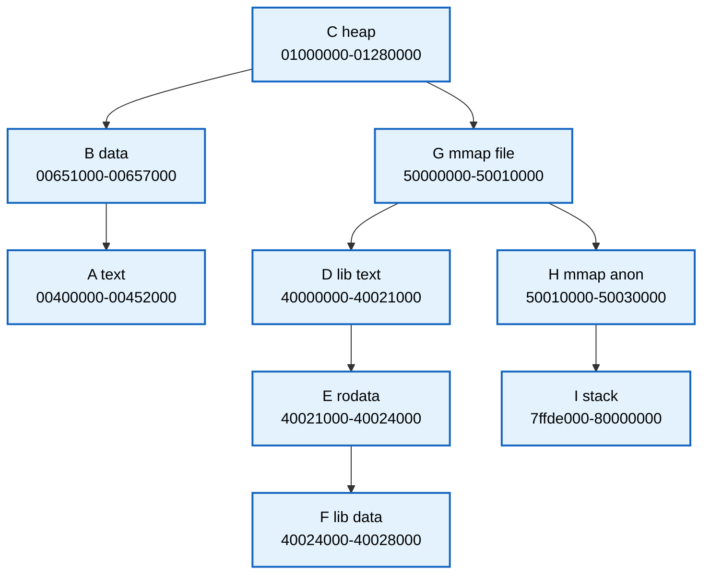

这张图不是在画真实内核某一刻的红黑树颜色，只是在表达旧模型的关键点：

```text
一个 VMA 对象对应一个树节点；
树按 vm_start 排序；
查找需要沿二叉路径访问多个 VMA 对象。
```

第二套，linked list 视角：

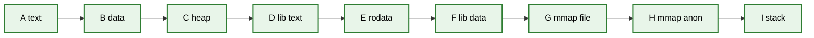

链表很适合：

```text
找前一个 VMA；
找后一个 VMA；
按地址顺序遍历整段 VMA；
合并时检查邻居。
```

第三套，vmacache 视角：

```text
最近访问过的若干 VMA 被缓存起来；
如果 page fault 地址落在最近 VMA 附近，可以避免完整树查找。
```

把三者放在同一张图中：

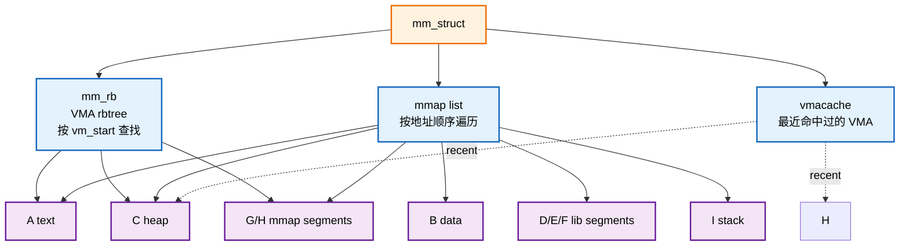

这张图要说明的不是“旧模型很差”，而是：

```text
旧模型用多套结构拼出 VMA 管理所需能力。
```

rbtree 负责查找。

linked list 负责顺序。

vmacache 负责热点。

这些结构组合起来可以工作，但在复杂更新路径里必须保持一致。

------

### 14.7.2_复杂操作一_mprotect_跨两个_VMA_时旧模型要维护什么

继续看示例中的两个相邻 VMA：

```text
G：0x50000000-0x50010000  r-- file
H：0x50010000-0x50030000  rw- anon
```

假设执行：

```text
mprotect(0x50008000, 0x10000, PROT_READ)
```

也就是修改：

```text
0x50008000-0x50018000
```

这个范围跨越了：

```text
G 的后半段；
H 的前半段。
```

修改前：

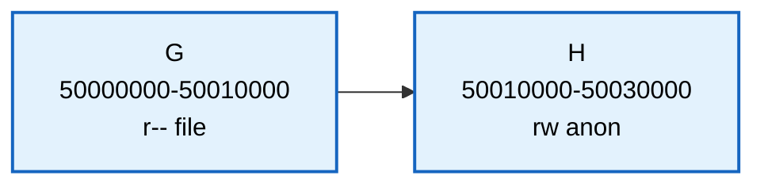

修改范围：

```text
50008000-50018000
```

修改后可能变成：

```text
G1：50000000-50008000  r-- file
G2：50008000-50010000  r-- file  修改范围内
H1：50010000-50018000  r-- anon  修改范围内
H2：50018000-50030000  rw- anon
```

是否能合并还要看：

```text
权限；
文件映射对象；
偏移；
flags；
anon_vma；
其他 VMA 属性。
```

教学化拆分图：

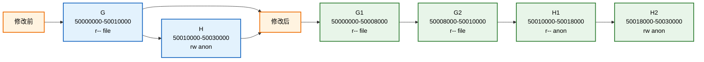

旧模型下，这类操作可能要维护：

```text
rbtree：
	删除原 G/H 节点；
	插入 G1/G2/H1/H2 或更新部分节点；
	保持按 vm_start 排序。

linked list：
	调整前后指针；
	保证线性顺序还是 G1 -> G2 -> H1 -> H2。

vmacache：
	旧 G/H 可能失效；
	需要刷新或避免命中旧对象。

VMA 生命周期：
	拆出来的新 VMA 要初始化；
	被删除或替换的 VMA 要按引用和 RCU 规则释放。
```

这就是旧模型的维护成本。

不是查找复杂度一个 O(log n) 能完全概括的。

------

### 14.7.3_复杂操作二_munmap_造成前后残片和中间空洞

再看：

```text
G：50000000-50010000
H：50010000-50030000
```

执行：

```text
munmap(0x50008000, 0x20000)
```

也就是删除：

```text
50008000-50028000
```

删除前：

```text
G + H 覆盖 50000000-50030000
```

删除后：

```text
50000000-50008000  保留，G 前半段
50008000-50028000  空洞
50028000-50030000  保留，H 后半段
```

图示：

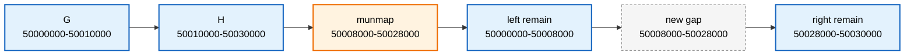

这个例子里，VMA 管理真正关心的是：

```text
删除范围与哪些 VMA 相交；
每个相交 VMA 是被完整删除、切掉前半段、切掉后半段，还是被一分为二；
删除后形成的新 gap 能否被后续 mmap 使用；
前后相邻 VMA 是否可以合并。
```

Maple Tree 的范围模型天然围绕这些问题组织。

而 rbtree 旧模型要通过：

```text
按 vm_start 找第一个相交 VMA；
沿链表或后继继续遍历相交 VMA；
逐个删除 / 修改 / 插入；
同步维护辅助结构。
```

来完成同一件事。

------

## 14.8_新模型_mm_mt_与_VMA_iterator

新模型可以简化理解为：

```c
struct mm_struct {
	struct maple_tree mm_mt;
};
```

也就是：

```text
mm_struct
	-> mm_mt
```

`mm_mt` 是当前进程地址空间里 VMA 集合的 Maple Tree 索引。

VMA 查找、遍历、插入、删除，更多围绕：

```text
maple_tree；
maple_state / ma_state；
vma_iterator；
vma_lookup()；
vma_find()；
vma_find_intersection()；
```

来组织。

可以把变化画成：

```text
旧模型：

mm_struct
	├── mmap      -> VMA linked list
	├── mm_rb     -> VMA rbtree
	└── vmacache

新模型：

mm_struct
	└── mm_mt     -> Maple Tree
	                 └── VMA iterator
```

这里要抓住核心变化：

```text
旧模型偏“单 VMA 节点 + 辅助链表 + 缓存”；
新模型偏“非重叠范围集合 + 多路范围索引 + iterator”。
```

VMA iterator 的意义是：

```text
让 VMA 遍历、查找、插入、删除围绕同一个范围索引状态推进；
避免调用者到处手动维护 rbtree 节点、链表节点和缓存状态；
让范围操作表达得更贴近 VMA 真实语义。
```

------

### 14.8.1_用复杂示例看_Maple_Tree_的范围视角

仍然用 A-I 这组 VMA。

Maple Tree 不要求你把每个 VMA 想成一个二叉树节点。

更自然的理解是：

```text
一组非重叠范围被压进多路索引节点；
节点内部用 pivot 切分地址空间；
slot 指向下一层节点或具体 VMA entry；
iterator 带着当前位置在范围集合里移动。
```

教学化示意图如下：

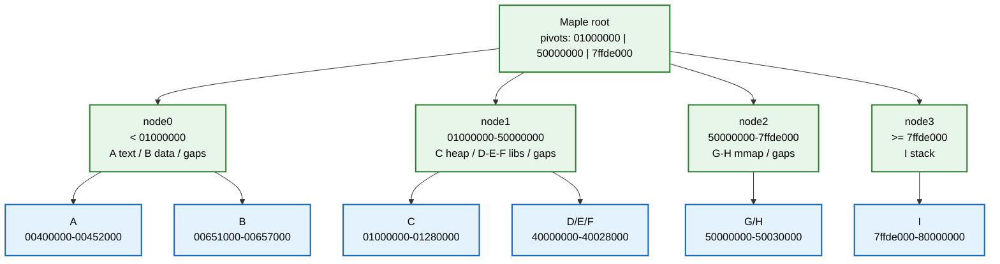

这张图不是 Maple Tree 真实节点布局的逐字段复刻。

它表达的是心智模型：

```text
rbtree 从一个 VMA 节点跳到另一个 VMA 节点；
Maple Tree 从一个范围索引节点进入某个范围区间。
```

对 VMA 来说，这个模型更贴近：

```text
地址空间本来就是由一段段范围和空洞组成的。
```

------

### 14.8.2_page_fault_查找路径对比

假设发生 page fault：

```text
fault address = 0x50012000
```

这个地址落在：

```text
H：0x50010000-0x50030000
```

旧 rbtree 模型可以理解为：

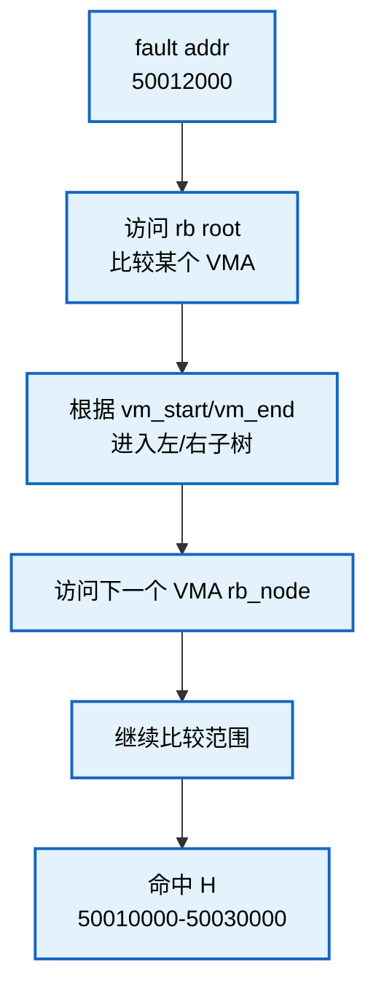

Maple Tree 模型可以理解为：

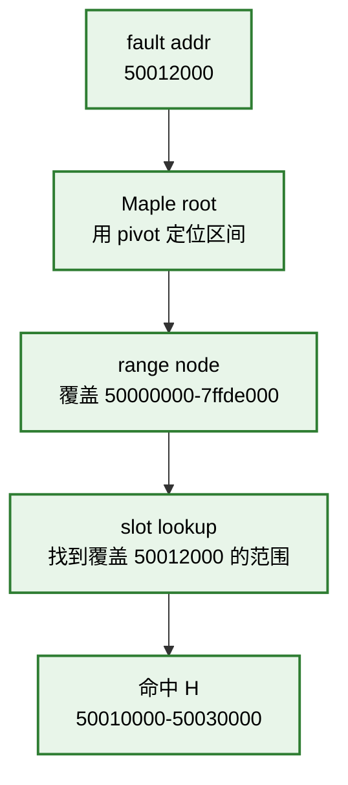

二者都能找到 VMA。

差异是：

```text
rbtree：
	以 VMA 对象为树节点；
	路径上每步比较一个 VMA 范围；
	前后遍历还依赖链表或后继。

Maple Tree：
	以范围索引节点为单位；
	一个节点里有多个 pivot / slot；
	更适合范围定位和范围迭代。
```

------

### 14.8.3_gap_search_为什么是_VMA_管理的核心需求

VMA 管理不只是查已有 VMA。

`mmap` 还经常需要找空洞。

例如要映射：

```text
size = 0x20000
```

需要在地址空间里找一个足够大的 unmapped area。

在前面的地址图中，gap 有很多：

```text
A-B 之间 gap；
B-C 之间 gap；
C-D 之间 large gap；
F-G 之间 gap；
H-I 之间 gap。
```

如果只用“一个 VMA 一个 rb_node”的模型，gap 不是显式对象。

它通常存在于：

```text
前一个 VMA 的 vm_end；
后一个 VMA 的 vm_start；
二者之间的差。
```

也就是说，gap 是两个 VMA 之间推导出来的。

Maple Tree 支持 gap 查找能力，这和 VMA 场景高度贴合。

可以用图表示：

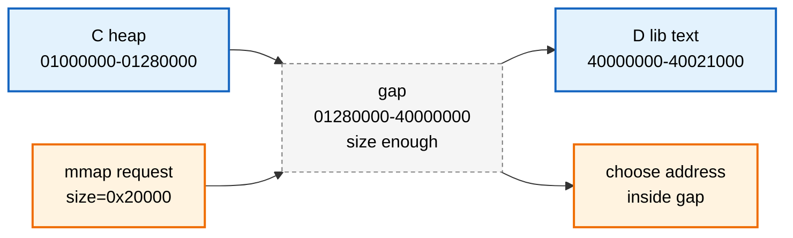

这正是为什么不能只说：

```text
VMA 查找是按 vm_start 查找。
```

更完整的说法是：

```text
VMA 管理需要同时处理已映射范围和未映射空洞。
```

------

## 14.9_Maple_Tree_节点内部可以怎样理解

本章不展开 Maple Tree 源码，但可以建立一个抽象模型。

Maple Tree 节点内部可以粗略理解为：

```text
maple node
	├── pivots：范围边界
	└── slots：边界对应的下一层节点或存储对象
```

在 VMA 场景中：

```text
pivot：
	可以理解成虚拟地址范围边界。

slot：
	可以指向下一层 Maple Tree 节点；
	也可以在叶层关联到 VMA 对象。
```

这和 rbtree 的模型不同。

rbtree 模型是：

```text
一个 VMA 对象
	嵌入一个 rb_node
	通过 rb_left / rb_right 串进二叉树
```

Maple Tree 模型更像：

```text
一个索引节点里保存多个范围边界；
每个边界区间对应一个 slot；
通过多路下降定位目标范围。
```

所以二者的心智模型是：

```text
rbtree：
	一个对象一个树节点。

Maple Tree：
	一个树节点管理多个范围边界和多个槽位。
```

这就是 Maple Tree 能减少树高、改善缓存局部性的基础。

------

### 14.9.1_pivot_/_slot_和_B+_树节点的区别

为了防止把 Maple Tree 误读成普通 B+ 树，这里做一个对照。

B+ 树内部节点常见模型：

```text
keys:
	[30 | 60 | 90]

children:
	<30
	30-60
	60-90
	>=90
```

Maple Tree 的教学化模型：

```text
pivots:
	[01000000 | 50000000 | 7ffde000]

slots:
	<01000000                -> node0
	01000000-50000000        -> node1
	50000000-7ffde000        -> node2
	>=7ffde000               -> node3
```

相似点：

```text
都是多路；
都是用节点内部边界减少树高；
都是尽量让一个缓存友好的节点承载更多导航信息。
```

差异点：

```text
B+ 树主要是 key 到 record 的页级索引；
Maple Tree 主要是 index / range 到 entry 的内核范围映射；
Maple Tree 还要处理非重叠范围、gap、RCU-safe、保留值和内核指针约束。
```

所以：

```text
Maple Tree 属于 B-Tree 思想方向；
但不能把它直接当作教材 B+ 树。
```

------

## 14.10_Maple_Tree_的普通_API_与高级_API

官方文档把 Maple Tree 接口大致分成普通 API 和高级 API。

普通 API 更容易使用。

典型接口包括：

```text
mtree_store()
mtree_store_range()
mtree_insert()
mtree_insert_range()
mtree_load()
mtree_erase()
mt_find()
mt_for_each()
mt_next()
mt_prev()
mtree_destroy()
```

普通 API 的特点是：

```text
封装程度更高；
内部处理常见锁和 RCU 规则；
适合多数使用者；
不要求使用者自己写 search core。
```

这点和 Linux `rbtree` 很不一样。

`rbtree` 的普通使用方式要求：

```text
调用者自己写 search；
调用者自己写 insert core；
调用者自己决定比较规则；
调用者自己加锁。
```

Maple Tree 普通 API 则更像一个范围映射容器接口。

高级 API 围绕 `ma_state` 展开。

常见接口包括：

```text
mas_walk()
mas_store()
mas_erase()
mas_for_each()
mas_next()
mas_prev()
mas_find()
mas_empty_area()
mas_empty_area_rev()
mas_preallocate()
mas_pause()
```

高级 API 的特点是：

```text
性能和控制力更强；
可以复用 walk 状态；
适合复杂范围操作；
调用者要更小心锁、RCU 和状态管理。
```

把它们和 VMA 对起来，可以这样理解：

```text
普通 API：
	像是“直接对树做存取操作”。

高级 API / vma iterator：
	像是“带着当前范围状态在 VMA 集合里移动和修改”。
```

------

### 14.10.1_rbtree_使用方式和_Maple_Tree_普通_API_的差异

前面第 9 章讲过，Linux `rbtree` 的典型使用方式是：

```text
调用者定义业务结构体；
业务结构体内嵌 rb_node；
调用者手写 search；
调用者手写 insert core；
调用者决定比较规则；
rb_link_node() + rb_insert_color() 完成插入；
rb_erase() 完成删除修复。
```

Maple Tree 普通 API 的方向不同。

它提供的是更接近范围映射容器的接口：

```text
store index/range -> entry；
load index -> entry；
find range；
iterate range；
erase index/range。
```

对比表：

| 项目 | Linux rbtree | Maple Tree |
| --- | --- | --- |
| 基本对象 | `struct rb_node` 嵌入业务对象 | index / range 映射到 entry |
| 查找逻辑 | 调用者手写 search | 普通 API 不要求手写 search |
| 排序方式 | 调用者自定义比较规则 | 按 unsigned long index / range |
| 典型用途 | 动态有序对象集合 | 非重叠范围集合 / 稀疏范围映射 |
| 遍历 | `rb_first()` / `rb_next()` | `mt_for_each()` / `mas_for_each()` 等 |
| 并发 | 调用者负责锁和生命周期 | API 封装更多锁和 RCU 细节，但写侧仍要同步 |

这不是谁高级谁低级的问题。

它们抽象层次不同。

`rbtree` 更像：

```text
给你红黑树结构维护工具，你自己组合成业务容器。
```

Maple Tree 普通 API 更像：

```text
给你一个面向 index/range 的内核映射容器。
```

------

## 14.11_Maple_Tree_的锁和_RCU_边界

Maple Tree 支持 RCU-safe 模式，但这句话不能误读。

官方文档说明：

```text
Maple Tree 使用 RCU 和内部 spinlock 同步访问；
一些读接口内部会进入 RCU 读侧；
一些写接口内部会获取 ma_lock；
写者仍然必须同步；
也可以配置外部锁。
```

所以它和 `rbtree` 的并发边界不同。

Linux `rbtree` 的普通接口更底层：

```text
rbtree 核心不内置锁；
调用者自己决定 spinlock、mutex、RCU、引用计数；
RCU 版本接口只处理部分发布和读取语义。
```

Maple Tree 的普通 API 封装了更多同步细节：

```text
普通读接口可内部使用 RCU；
普通写接口可内部使用 Maple Tree 的锁；
高级 API 允许更复杂的外部锁和状态管理。
```

但两个结构都不能替调用者解决对象生命周期的全部问题。

比如从 Maple Tree 里查到一个 VMA 指针后，仍然要考虑：

```text
当前是否持有 mmap_lock；
是否在 RCU 读侧；
VMA 是否可能被并发删除；
返回指针在锁释放后能否继续使用；
是否需要引用或其他生命周期保证。
```

所以不要把 RCU-safe 理解成：

```text
所有访问都可以随便无锁。
```

更准确的理解是：

```text
Maple Tree 设计了适合 RCU 读路径的树结构和 API，
但具体对象生命周期仍然要符合内核内存管理的同步规则。
```

------

### 14.11.1_复杂并发场景_page_fault_读路径与_munmap_写路径

理解 RCU-safe 时，可以想一个高频场景：

```text
CPU0：
	用户程序访问 0x50012000，触发 page fault，需要查 VMA H。

CPU1：
	另一个线程正在 munmap 0x50008000-0x50028000，
	会拆分 / 删除 G 和 H 的部分范围。
```

教学化流程图：

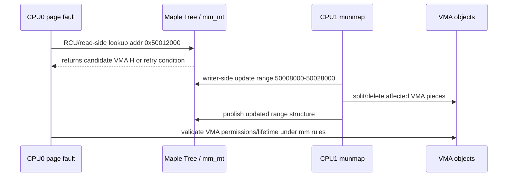

这个图要表达的不是“page fault 一定无锁完成”。

它要表达的是：

```text
Maple Tree 设计目标之一，是让范围索引更适合 RCU 读路径；
但写侧 munmap 仍然必须同步；
VMA 对象本身的生命周期仍然受 mm 同步规则约束。
```

也就是说：

```text
树结构的 RCU-safe
	不等于
业务对象可以随便释放。
```

这和第 12 章讲 rbtree RCU 边界时的结论一致，只是 Maple Tree 在 API 和结构层面封装得更多。

------

## 14.12_Maple_Tree_为什么不是普通_B+_树

Maple Tree 和 B/B+ 树有亲缘关系，因为它们都属于多路树思想。

但不要把 Maple Tree 直接等同于教科书 B+ 树。

B+ 树通常用来说明：

```text
内部节点只存索引；
叶子节点保存数据；
叶子节点按 key 顺序串联；
非常适合数据库范围查询。
```

Maple Tree 面向的是 Linux 内核范围管理场景。

它要处理：

```text
内核指针存储；
非重叠范围；
gap 查找；
RCU-safe 读路径；
内部锁或外部锁；
节点预分配；
VMA split / merge；
VMA iterator；
特殊值保留和指针编码限制。
```

所以更稳的说法是：

```text
Maple Tree 是面向 Linux 内核范围管理场景设计的 B-Tree 变体。
```

它借用了多路树降低高度、提高节点信息密度、改善缓存局部性的思想。

但它的接口、锁模型、范围语义和工程约束都不是教材 B+ 树可以完整概括的。

------

## 14.13_Maple_Tree_不是页表_也不是预取系统

这个误区很常见。

因为 Maple Tree 管 VMA，而 VMA 又和虚拟内存相关，所以容易误以为：

```text
Maple Tree 负责虚拟地址到物理地址转换；
Maple Tree 替代页表；
Maple Tree 负责物理页预取；
Maple Tree 让用户数据页连续存放。
```

这些都不对。

地址访问路径可以粗略拆成：

```text
CPU 访问虚拟地址
	↓
TLB / 页表翻译
	↓
如果缺页，进入 page fault
	↓
内核根据 fault address 查找 VMA
	↓
检查权限和映射类型
	↓
根据匿名页、文件页、COW 等路径处理缺页
```

Maple Tree 参与的是：

```text
根据 fault address 查找对应 VMA；
遍历、插入、删除 VMA 范围；
查找虚拟地址空洞；
维护 VMA 范围集合。
```

它不负责：

```text
页表项硬件翻译；
物理页分配器；
页缓存本身；
磁盘预读；
把用户数据页重新排列成连续物理内存。
```

一句话：

```text
Maple Tree 优化的是 VMA 索引元数据路径，不是物理内存访问路径本身。
```

------

### 14.13.1_page_fault_路径中的_Maple_Tree_位置

用图把 Maple Tree 放进 page fault 路径里：

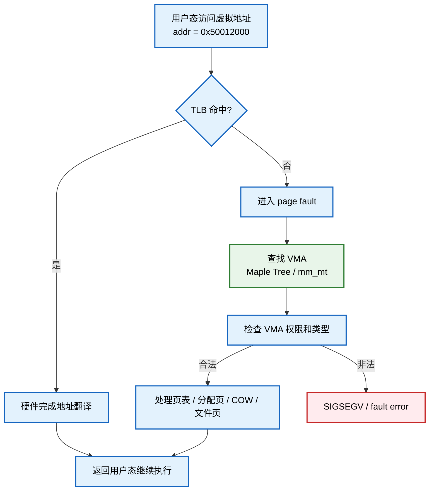

图里只有 `查找 VMA` 这一段属于 Maple Tree 优化范围。

后面的：

```text
页表项；
物理页；
COW；
文件页读入；
TLB 更新；
缺页异常返回；
```

不是 Maple Tree 自己负责。

所以不能说：

```text
Maple Tree 优化整个虚拟地址到物理地址翻译过程。
```

更准确地说：

```text
Maple Tree 优化 page fault 等路径中的 VMA 元数据查找和范围管理部分。
```

------

## 14.14_不能把_Maple_Tree_扩大成_所有_rbtree_都被替代

Maple Tree 替代 VMA rbtree，不等于整个内核不用 rbtree。

更准确的分类是：

| 子系统或场景 | 更准确的结构理解 |
| --- | --- |
| 虚拟内存 VMA 管理 | Maple Tree |
| 页缓存 / 一些 ID 索引 | XArray / radix tree 演进 |
| 普通内核有序对象集合 | rbtree 仍然适合 |
| 高精度定时器等最小 key 场景 | cached rbtree 仍然合理 |
| 区间重叠查询 | augmented rbtree / interval tree 仍有意义 |
| 公平调度语义 | CFS 到 EEVDF，不是 Maple Tree |

所以这句话要避免：

```text
新内核都改用 Maple Tree 了。
```

更准确的说法是：

```text
新内核的 VMA 内存区域管理，从传统 rbtree + linked list + vmacache 模型转向 Maple Tree；
但普通有序集合、定时器、epoll、I/O 调度等场景仍可能继续使用 rbtree 或其他结构。
```

数据结构替换不是“新结构全面战胜旧结构”。

更常见的真实原因是：

```text
某个子系统的访问模式变得更适合另一种结构。
```

VMA 是范围集合，所以 Maple Tree 更贴合。

普通按 key 排序的内存对象集合，rbtree 仍然是清楚、稳定、成本可控的选择。

------

### 14.14.1_更细的结构选择图

把前面学过的结构放到同一张决策图里：

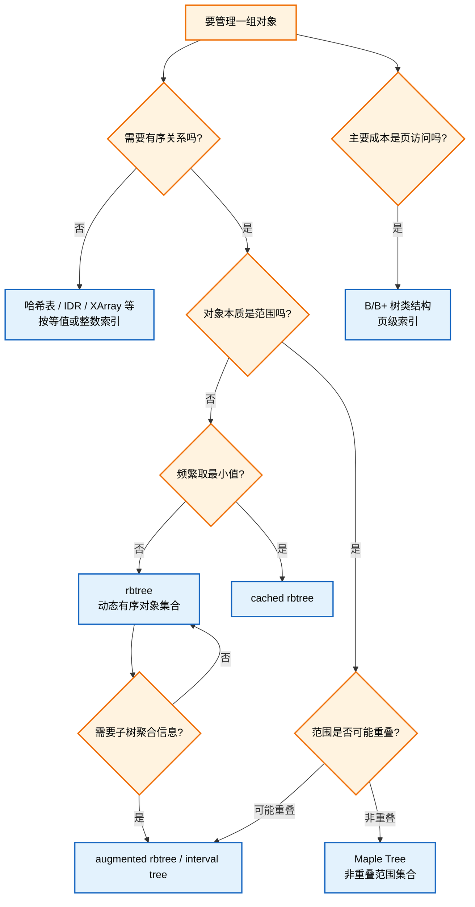

这张图的关键是：

```text
Maple Tree 不是 rbtree 的普遍替代；
它更适合非重叠范围集合。
```

VMA 刚好满足这个条件。

------

## 14.15_不要和_EEVDF_调度混淆

### 14.15.1_EEVDF_介绍

**EEVDF = Earliest Eligible Virtual Deadline First。**

它是 Linux 公平调度器里的一个调度算法，解决的是：

> 当前 CPU 上有多个 runnable task，下一次应该选谁运行？

不是数据结构，不是 Maple Tree，不是 XArray，也不是 rbtree 的替代品。

#### (1)_名字拆开看

```
EEVDF
= Earliest Eligible Virtual Deadline First
= 最早“合格”的虚拟截止时间优先
```

核心概念：

| 概念                 | 含义                                             |
| -------------------- | ------------------------------------------------ |
| **virtual runtime**  | 虚拟运行时间，用来衡量任务已经占用了多少公平份额 |
| **lag**              | 任务是“欠 CPU 时间”还是“多拿了 CPU 时间”         |
| **eligible**         | 当前是否有资格被调度                             |
| **virtual deadline** | 虚拟截止时间，越早越应该先运行                   |

---

### 14.15.2_Maple_tree_与CFS区别

任务调度这边也容易混淆。

老 CFS 的经典讲法是：

```text
可运行调度实体按 vruntime 放在 tasks_timeline 红黑树中；
调度器倾向于选择 vruntime 较小的实体。
```

Linux 官方 CFS 文档也明确说，CFS 使用按时间排序的红黑树构建运行时间线。

后来公平调度语义开始转向 EEVDF。

EEVDF 关注：

```text
lag；
eligible；
virtual deadline；
选择更早 virtual deadline 的任务。
```

Linux 官方 EEVDF 文档说明，EEVDF 会使用 lag 判断任务是否 eligible，并在 eligible 任务中选择 virtual deadline 更早者运行。

这件事和 Maple Tree 不是一条线。

可以这样分开记：

```text
VMA 管理变化：
	rbtree / linked list / vmacache -> Maple Tree / VMA iterator

公平调度变化：
	CFS vruntime 语义 -> EEVDF lag + virtual deadline 语义
```

前者是内存管理的数据结构变化。

后者是调度器选择任务的算法语义变化。

不要把它们合并成：

```text
任务管理也改成 Maple Tree。
```

更准确地说：

```text
Maple Tree 是 VMA 范围索引模型变化；
EEVDF 是公平调度策略变化。
```

------

## 14.16_和前面_rbtree_章节的关系

学到这里，容易产生一个问题：

```text
既然 VMA 从 rbtree 走向 Maple Tree，那前面学 rbtree 还有什么意义？
```

答案是：

```text
rbtree 仍然是理解内核有序对象管理的基础结构；
Maple Tree 的出现反而能帮助看清 rbtree 的适用边界。
```

前面第 8-12 章讲的 Linux rbtree，适合回答：

```text
一个业务对象如何嵌入 rb_node；
如何按 key 手写 search；
如何插入、删除、旋转、染色；
cached 最左节点如何优化最小值访问；
augmented 信息如何随旋转更新；
调用者如何负责锁和生命周期。
```

本章讲的 Maple Tree，适合回答：

```text
当对象本质是非重叠范围集合时，为什么单对象 rbtree 模型不一定最贴合；
为什么多路范围索引可以减少树高和辅助结构；
为什么 VMA 管理需要 iterator、gap search、RCU-safe 等工程特性。
```

所以两者不是互相否定。

它们是同一条学习线上的两个层次：

```text
rbtree：
	动态有序对象集合。

Maple Tree：
	动态非重叠范围集合。
```

------

## 14.17_复杂示例总复盘

最后回到本章开头的复杂地址空间。

```text
A text
B data
C heap
D/E/F libA segments
G mmap file
H mmap anon
I stack
```

如果用旧模型思考：

```text
查找一个地址：
	走 rbtree。

顺序遍历 VMA：
	走 linked list。

最近访问命中：
	靠 vmacache。

修改一段范围：
	可能同时改 rbtree、linked list、vmacache 和 VMA 生命周期。
```

如果用 Maple Tree 思考：

```text
查找一个地址：
	在 mm_mt 中按范围定位。

遍历一段范围：
	用 iterator 沿范围前进。

查找空洞：
	用 range/gap 语义定位 unmapped area。

修改一段范围：
	围绕 range update / iterator / ma_state 更新非重叠范围集合。
```

这就是本章最重要的变化：

```text
不是“红黑树慢，所以换 Maple Tree”；
而是“VMA 是范围集合，所以用范围树表达更贴切”。
```

------

## 14.18_本章小结

本章最重要的结论是：

```text
你记的是 Maple Tree；
它主要替代的是内存管理里的 VMA rbtree / linked list / vmacache 模型；
它不是泛泛替代所有 rbtree。
```

更完整地说：

```text
第一，Maple Tree 是 RCU-safe、面向非重叠范围的 B-Tree 变体。

第二，VMA 天然是 [vm_start, vm_end) 范围对象，因此很适合 Maple Tree。

第三，旧 VMA 管理大致是 rbtree + linked list + vmacache，多套结构需要同步维护。

第四，新 VMA 管理围绕 mm_mt、maple_tree、ma_state 和 vma_iterator 展开。

第五，Maple Tree 优化的是 VMA 范围索引元数据路径，不是页表、物理页分配器或预取系统。

第六，Maple Tree 不是普通 B+ 树，而是 Linux 内核场景下的范围 B-Tree 变体。

第七，rbtree 在普通有序集合、cached 最小值、augmented 区间树等场景中仍然有价值。

第八，调度器从 CFS 走向 EEVDF 是调度算法语义变化，不是 Maple Tree 替代调度树。
```

一句话压缩：

```text
Maple Tree 是 VMA 范围索引模型的升级，不是整个内核 rbtree 世界的终结。
```

