# 第14章\_Maple\_Tree\_与\_VMA\_管理

## 14.1\_一个地址为什么需要三种查询

前面已经看到，多路节点可以把更多边界放在一次索引访问附近。但如果查找的不是整数 30，而是进程访问的地址 `0x50012000`，怎样判断它属于哪段映射？如果地址正好落在空洞，应该返回空，还是返回后面最近的一段？准备映射一块新区域时，我们甚至要查找“尚未存对象”的地方。

这些问题属于 **虚拟地址范围管理**。本章以两个相邻区域 G、H 为主线：先区别精确命中、向后查找与范围相交，再观察跨边界改权限和取消映射怎样改变区间。随后把相同操作放到旧红黑树组合与 Maple Tree 上，比较它们保存什么、维护什么，以及范围索引不能替调用方完成什么。

阅读依赖是前面的有序树和 [P34 页级索引的成本模型](P34_从多路节点到页级索引.md#34.1_高度相同不等于访问成本相同)。本章用 C++ 顺序容器执行区间语义，不重新实现 Maple Tree；读完应能画出 G/H 修改后的片段、预测边界查询，并说明树读安全为什么不等于返回对象可永久使用。

## 14.2\_先把地址空间和调度任务分开

VMA 是 **Virtual Memory Area，虚拟内存区域**，描述一个进程地址空间中具有一组共同属性的连续虚拟地址。`mm_struct` 是内核保存这个地址空间管理状态的对象；同一进程的多个线程通常共享它。Maple Tree 是范围索引实现的名称，用于把地址范围关联到 VMA。

一次内存访问可能需要查询 VMA；决定当前哪个可运行任务获得 CPU 则属于调度。本章后面保留 EEVDF 调度算法的对照，用来划清职责，此时不需要先学完调度器。Maple Tree 也不承担页表翻译、物理页分配或数据预取。

先记住本章只讨论的映射：`虚拟地址范围 → VMA 元数据对象`。VMA 本身与它描述的用户数据页不是同一块内存。

## 14.3\_Maple\_Tree\_是什么

Maple Tree 是 Linux 内核中的一种范围索引结构。

固定版本文档把它定位为 B-Tree 范围容器。这里先说明 RCU 是 Read-Copy Update（读复制更新），用于约束并发读取、更新与旧节点回收；其具体使用条件在 14.11 展开。容器提供的能力包括：

```text
B-Tree 数据类型；
优化用于保存非重叠范围；
范围大小可以是 1；
支持范围迭代；
支持 cache-efficient 的 previous / next 访问；
可以启用 RCU（Read-Copy Update，读复制更新）模式保护树的并发读取；
最重要的用途是跟踪 virtual memory areas，也就是 VMA。
```

所以它不是普通哈希表，也不是普通红黑树。

更接近的说法是：

```text
RCU-safe、面向非重叠范围集合的 B-Tree 变体。
```

这句话里有三个关键词。

第一，range-based。

Maple Tree 管理的核心对象不是离散的单个 key，而是范围：

```text
[start, end]
```

或者在 VMA 语义里更常见的：

```text
[vm_start, vm_end)
```

第二，B-Tree。

Maple Tree 不是二叉结构。

它走的是多路树方向，一个节点可以保存多个边界和多个槽位，因此树通常比“一个对象一个二叉节点”的结构更矮。

第三，RCU-safe。

Maple Tree 可以配置成 RCU-safe 模式，让读路径和写路径在一定约束下并发工作。

但这不等于写侧无锁。

写者仍须串行化，默认可用树内自旋锁，也可由调用方提供外部锁。RCU 延后旧节点的回收，使正在读取旧结构的任务不立即碰到已释放的节点；它不替 VMA 字段提供一整套锁规则。14.11 先闭合外部读写锁这条路径，再限定 RCU 分支。

本章当前实现以 NXP 官方 Linux 6.12.20 固定提交为准；先从 [Maple 范围源码阅读索引](../../../../research/source_reading/maple_tree/navigation/P01_Linux_6.12_Maple范围源码阅读索引.md#1.2_按读者问题进入证据)进入。旧模型另标 Linux v5.19，2020 年 RFC 数据另作历史讨论，三者不混用。

------

## 14.4\_VMA\_管理的对象是什么

VMA 是 Virtual Memory Area，即虚拟内存区域。

一个 VMA 的 vm_start 字段保存包含式起点，vm_end 字段保存排除式终点，描述进程虚拟地址空间中的一段连续区域：

```text
[vm_start, vm_end)
```

例如：

```text
代码段 VMA；
堆 VMA；
栈 VMA；
mmap 文件映射 VMA；
匿名映射 VMA；
共享库映射 VMA。
```

一个 VMA 本身不是物理页。

它是虚拟地址空间里的元数据对象。

它通常描述：

```text
这段虚拟地址范围从哪里开始，到哪里结束；
这段范围允许读、写、执行哪些权限；
这段范围是匿名映射还是文件映射；
这段范围发生 page fault（缺页或访问保护异常）时应该怎么处理；
这段范围是否能和相邻 VMA 合并。
```

所以 VMA 层主要回答的是：

```text
某个虚拟地址属于哪个 VMA？
某次访问是否符合 VMA 权限？
某段地址范围是否和现有 VMA 重叠？
某段范围能否拆分、合并、扩展或删除？
```

它不是直接回答：

```text
这个虚拟地址最终映射到哪个物理页？
这个物理页是否在内存中？
这个页表项怎么填写？
```

那些问题属于页表、缺页处理和物理内存管理路径。VMA 可关联文件对象及映射操作表 vm_ops，后者给出这类映射需要的处理回调；NUMA（Non-Uniform Memory Access，非一致内存访问）策略涉及在多内存节点机器上如何选分配位置。这些属性帮助处理路径作决定，不表示 VMA 内已经放着全部物理页号。

Maple Tree 优化的是 VMA 范围索引元数据，不是用户数据页本体。

------

## 14.5\_VMA\_管理为什么适合\_Maple\_Tree

VMA 的核心语义是范围，而不是单点 key。

内核常见 VMA 操作包括：

```text
find_vma(addr)：
	找到包含 addr 或位于 addr 之后的 VMA。

vma_lookup(addr)：
	查找包含 addr 的 VMA。

vma_find(vmi, end)：
	从调用方的迭代器当前位置向后找，end 是排除式上界。

find_vma_intersection(mm, start, end)：
	查找和某个范围相交的 VMA。

mmap：
	选择或使用指定地址建立映射，更新已有范围集合。

munmap：
	删除或拆分一段 VMA 范围。

mprotect：
	修改权限，可能导致 VMA split / merge。

mremap：
	移动、扩展或收缩映射范围。

page fault：
	根据 fault address 快速定位 VMA 并检查权限。
```

这些操作有三个共同点。

第一，它们经常以地址范围为单位。

不是简单地查：

```c
key == x
```

而是查：

```text
addr 是否落在某个 [start, end) 中；
range 是否和已有范围重叠；
从某个地址开始下一个 VMA 是谁；
某段地址区间里有哪些 VMA。
```

第二，VMA 之间天然不重叠。

同一个 `mm_struct` 的 VMA 集合表示一个进程地址空间的各段映射。

这些映射区间不能随意重叠。

第三，VMA 操作经常需要 previous / next 和 range iteration。

比如：

```text
合并时要看前一个和后一个 VMA；
拆分后要调整相邻范围；
查找 unmapped area 时要找空洞；
遍历某段虚拟地址范围时要连续访问多个 VMA。
```

因此，Maple Tree 将这些范围操作放入同一套容器契约。红黑树也能表达这些语义；真正的取舍是哪些信息由调用方维护、哪些由容器维护，以及查询与修改的实际成本。

------

## 14.6\_贯穿本章的复杂\_VMA\_示例

为了避免后面只停留在概念上，本章先固定一个稍微复杂一点的进程地址空间。

下面固定一张教学地址图。所有范围右端不包含，地址按 4 KiB 对齐；这不是某个真实进程的装载记录，也不假定每种体系结构都使用这套用户地址上限。r/w/x 表示读/写/执行，p 表示私有映射，anon 表示匿名映射；代码段、数据段和库的名字用来说明属性来源。

```text
低地址

0x00400000 ─ 0x00452000  text        r-xp  /bin/app
0x00651000 ─ 0x00657000  data        rw-p  /bin/app
0x01000000 ─ 0x01280000  heap        rw-p  anonymous

0x40000000 ─ 0x40021000  libA text   r-xp  /lib/libA.so
0x40021000 ─ 0x40024000  libA rodata r--p  /lib/libA.so
0x40024000 ─ 0x40028000  libA data   rw-p  /lib/libA.so

0x50000000 ─ 0x50010000  mmap file   r--p  /tmp/data.bin
0x50010000 ─ 0x50030000  mmap anon   rw-p  anonymous

0x7ffde000 ─ 0x80000000  stack       rw-p  grow-down

高地址
```

为了让图更适合后续推演，把这些 VMA 简写为：

```text
A：text
B：data
C：heap
D：libA text
E：libA rodata
F：libA data
G：mmap file
H：mmap anon
I：stack
```

地址空间可以画成：


```mermaid
flowchart LR
	addr0["低地址"]
	A["A text<br/>00400000-00452000<br/>r-x file"]
	gap1["gap<br/>00452000-00651000"]
	B["B data<br/>00651000-00657000<br/>rw file"]
	gap2["gap<br/>00657000-01000000"]
	C["C heap<br/>01000000-01280000<br/>rw anon"]
	gap3["large gap"]
	D["D lib text<br/>40000000-40021000<br/>r-x file"]
	E["E rodata<br/>40021000-40024000<br/>r-- file"]
	F["F lib data<br/>40024000-40028000<br/>rw file"]
	gap4["gap"]
	G["G mmap file<br/>50000000-50010000<br/>r-- file"]
	H["H mmap anon<br/>50010000-50030000<br/>rw anon"]
	gap5["gap"]
	I["I stack<br/>7ffde000-80000000<br/>rw grow-down"]
	addr1["高地址"]

	addr0 --> A --> gap1 --> B --> gap2 --> C --> gap3 --> D --> E --> F --> gap4 --> G --> H --> gap5 --> I --> addr1

	classDef vma fill:#e3f2fd,stroke:#1565c0,color:#000,stroke-width:2px;
	classDef gap fill:#f5f5f5,stroke:#777,color:#000,stroke-dasharray:4 3;
	classDef addr fill:#fff3e0,stroke:#ef6c00,color:#000,stroke-width:2px;

	class A,B,C,D,E,F,G,H,I vma;
	class gap1,gap2,gap3,gap4,gap5 gap;
	class addr0,addr1 addr;
```

这个例子里可以推演多种操作。PROT_NONE 是撤去读写执行访问权限的参数；它不会取消映射本身，所以与 munmap 形成空洞不同：

```text
page fault addr = 0x01012000：
	应该命中 heap VMA C。

page fault addr = 0x00460000：
	落在 A 和 B 之间的 gap，不应该命中 VMA。

mprotect 0x50008000-0x50018000，设为 PROT_NONE：
	撤去该段访问权限，跨越 G 后半段和 H 前半段，形成四个属性片段。

munmap 0x50008000-0x50028000：
	可能把 G/H 切掉中间一段，并留下前后残片。

mmap 新区域 size = 0x20000：
	需要查找一个足够大的 unmapped gap。

stack grow：
	需要判断 I 前面的 gap 是否允许栈向低地址扩展。
```

如果使用普通红黑树管理 VMA，树的排序 key 通常是 `vm_start`。

但是上面这些问题真正关心的是：

```text
addr 是否落在 [vm_start, vm_end)；
range 是否和已有 VMA 相交；
range 两侧的 previous / next VMA 是谁；
哪里存在足够大的 gap；
修改一个 range 后会产生几个 VMA 片段。
```

这就是 Maple Tree 更贴合 VMA 的原因。

它不是因为红黑树“不能查”，而是因为 VMA 管理的主要语义不是单点 key，而是非重叠范围集合。

------

## 14.7\_旧模型\_rbtree\_+\_linked\_list\_+\_vmacache

同一组 A～I 对象同时参与按地址定位、顺序访问与最近命中。先看各入口各自节省什么，再观察一次改动如何跨入口维护一致性。

### 14.7.1\_用复杂示例看旧模型的三套结构

旧模型以 Linux v5.19 为对照：`mm_struct.mm_rb` 是树根，VMA 内嵌 `vm_rb` 并保存 `vm_next/vm_prev`，`rb_subtree_gap` 汇总子树空洞；最近命中缓存则属于每个任务，不能画成 mm 内的一张共享缓存。[旧版范围结构](https://raw.githubusercontent.com/torvalds/linux/v5.19/include/linux/mm_types.h)与[任务结构](https://raw.githubusercontent.com/torvalds/linux/v5.19/include/linux/sched.h)分别说明这两类所有权。

红黑树已经支持后继遍历，链表是这版 VMA 管理采用的直接相邻入口，并非红黑树遍历在算法上必须另有链表。增广空洞信息也能加速空洞搜索。升级要比较整个组合的维护成本，不能先拿掉旧方案的有效能力。

仍然使用前面的 A-I 这组 VMA。

旧模型里，至少可以从三套结构看同一组 VMA。

第一套，rbtree 视角：

```text
按 vm_start 排序；
每个 VMA 是一个 rb_node；
查找 addr 时沿红黑树路径比较 vm_start / vm_end。
```

教学化示意图如下：

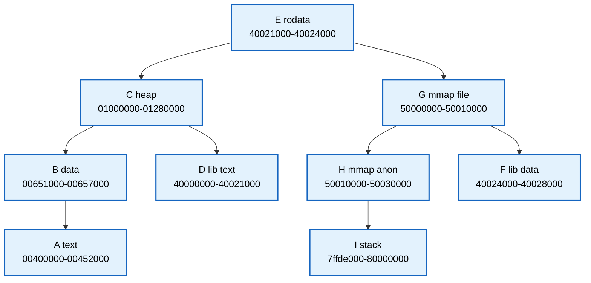
```mermaid
flowchart TD
	C["C heap<br/>01000000-01280000"]
	B["B data<br/>00651000-00657000"]
	G["G mmap file<br/>50000000-50010000"]
	A["A text<br/>00400000-00452000"]
	D["D lib text<br/>40000000-40021000"]
	H["H mmap anon<br/>50010000-50030000"]
	E["E rodata<br/>40021000-40024000"]
	F["F lib data<br/>40024000-40028000"]
	I["I stack<br/>7ffde000-80000000"]

	E --> C
	E --> G
	C --> B
	C --> D
	B --> A
	G --> F
	G --> H
	H --> I

	classDef rb fill:#e3f2fd,stroke:#1565c0,color:#000,stroke-width:2px;
	class C,B,G,A,D,H,E,F,I rb;
```

这张图是满足二叉排序关系的示意，不是内核快照。若根 E、C/G、B/D/F/H 为黑，A/I 为红，也可满足黑高约束；颜色省略是为了突出对象入口：

```text
一个 VMA 对象对应一个树节点；
树按 vm_start 排序；
查找需要沿二叉路径访问多个 VMA 对象。
```

第二套，linked list 视角：

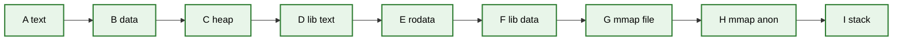
```mermaid
flowchart LR
	A["A text"] --> B["B data"] --> C["C heap"] --> D["D lib text"] --> E["E rodata"] --> F["F lib data"] --> G["G mmap file"] --> H["H mmap anon"] --> I["I stack"]

	classDef list fill:#e8f5e9,stroke:#2e7d32,color:#000,stroke-width:2px;
	class A,B,C,D,E,F,G,H,I list;
```

链表很适合：

```text
找前一个 VMA；
找后一个 VMA；
按地址顺序遍历整段 VMA；
合并时检查邻居。
```

第三套，vmacache 视角：

```text
最近访问过的若干 VMA 被缓存起来；
如果地址仍落在缓存 VMA 内且缓存有效，可以避免完整树查找；仅仅“在附近”并不保证命中。
```

把三者放在同一张图中：

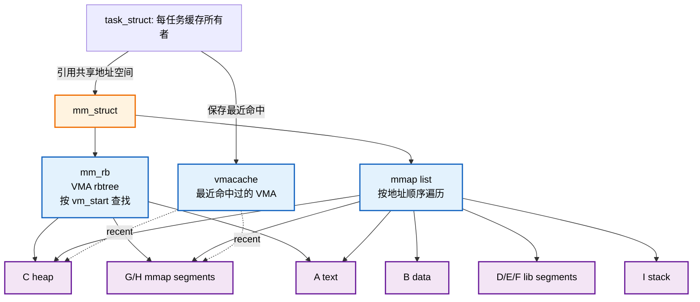
```mermaid
flowchart TD
	mm["mm_struct"]

	rb["mm_rb<br/>VMA rbtree<br/>按 vm_start 查找"]
	list["mmap list<br/>按地址顺序遍历"]
	cache["vmacache<br/>最近命中过的 VMA"]

	A["A text"]
	B["B data"]
	C["C heap"]
	D["D/E/F lib segments"]
	G["G/H mmap segments"]
	I["I stack"]

	mm --> rb
	mm --> list
	task["task_struct: 每任务缓存所有者"] -->|保存最近命中| cache
	task -->|引用共享地址空间| mm

	rb --> A
	rb --> C
	rb --> G
	list --> A
	list --> B
	list --> C
	list --> D
	list --> G
	list --> I
	cache -.recent.-> C
	cache -.recent.-> G

	classDef root fill:#fff3e0,stroke:#ef6c00,color:#000,stroke-width:2px;
	classDef index fill:#e3f2fd,stroke:#1565c0,color:#000,stroke-width:2px;
	classDef vma fill:#f3e5f5,stroke:#6a1b9a,color:#000,stroke-width:2px;

	class mm root;
	class rb,list,cache index;
	class A,B,C,D,G,I vma;
```

这张图要说明的不是“旧模型很差”，而是：

```text
旧模型用多套结构拼出 VMA 管理所需能力。
```

rbtree 负责查找。

linked list 负责顺序。

vmacache 负责热点。

这些结构组合起来可以工作，但在复杂更新路径里必须保持一致。

------

### 14.7.2\_复杂操作一\_mprotect\_跨两个\_VMA\_时旧模型要维护什么

继续看示例中的两个相邻 VMA：

```text
G：0x50000000-0x50010000  r-- file
H：0x50010000-0x50030000  rw- anon
```

假设执行：

```text
mprotect(0x50008000, 0x10000, PROT_NONE)
```

也就是修改：

```text
0x50008000-0x50018000
```

这个范围跨越了：

```text
G 的后半段；
H 的前半段。
```

修改前：

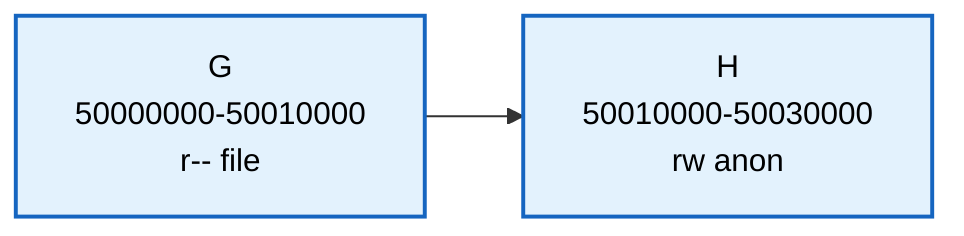
```mermaid
flowchart LR
	G["G<br/>50000000-50010000<br/>r-- file"]
	H["H<br/>50010000-50030000<br/>rw anon"]
	G --> H

	classDef old fill:#e3f2fd,stroke:#1565c0,color:#000,stroke-width:2px;
	class G,H old;
```

修改范围：

```text
50008000-50018000
```

假定调用成功、不计后续其他请求，撤去访问权限后的逻辑片段为：

```text
G1：50000000-50008000  r-- file
G2：50008000-50010000  --- file  修改范围内
H1：50010000-50018000  --- anon  修改范围内
H2：50018000-50030000  rw- anon
```

这里 G 原本只读，若仍改为 PROT_READ（允许读），就不能用“G 一定拆分”作推导；改用 PROT_NONE 才同时改变 G 与 H 的属性。G2 与 H1 虽同为无权限，但一个文件映射、一个匿名映射，不因此合并。其他相邻片段能否合并还要看：

```text
权限；
文件映射对象；
偏移；
flags；
anon_vma；
其他 VMA 属性。
```

教学化拆分图：

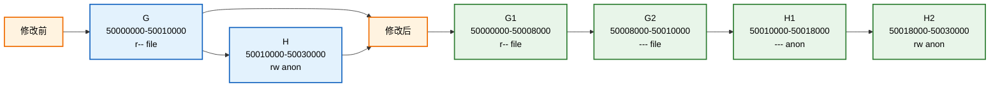
```mermaid
flowchart LR
	before["修改前"]
	G["G<br/>50000000-50010000<br/>r-- file"]
	H["H<br/>50010000-50030000<br/>rw anon"]

	after["修改后"]
	G1["G1<br/>50000000-50008000<br/>r-- file"]
	G2["G2<br/>50008000-50010000<br/>--- file"]
	H1["H1<br/>50010000-50018000<br/>--- anon"]
	H2["H2<br/>50018000-50030000<br/>rw anon"]

	before --> G --> H
	G --> after
	H --> after
	after --> G1 --> G2 --> H1 --> H2

	classDef old fill:#e3f2fd,stroke:#1565c0,color:#000,stroke-width:2px;
	classDef new fill:#e8f5e9,stroke:#2e7d32,color:#000,stroke-width:2px;
	classDef mark fill:#fff3e0,stroke:#ef6c00,color:#000,stroke-width:2px;

	class G,H old;
	class G1,G2,H1,H2 new;
	class before,after mark;
```

旧模型下，这类操作可能要维护：

```text
rbtree：
	删除原 G/H 节点；
	插入 G1/G2/H1/H2 或更新部分节点；
	保持按 vm_start 排序。

linked list：
	调整前后指针；
	保证线性顺序还是 G1 -> G2 -> H1 -> H2。

vmacache：
	旧 G/H 可能失效；
	需要刷新或避免命中旧对象。

VMA 生命周期：
	拆出来的新 VMA 要初始化；
	被删除或替换的 VMA 要遵守该版本的锁和对象释放规则，不能套用另一版本的 RCU 路径。
```

这就是旧模型的维护成本。

不是查找复杂度一个 O(log n) 能完全概括的。

------

### 14.7.3\_复杂操作二\_munmap\_造成前后残片和中间空洞

再看：

```text
G：50000000-50010000
H：50010000-50030000
```

执行：

```text
munmap(0x50008000, 0x20000)
```

也就是删除：

```text
50008000-50028000
```

删除前：

```text
G + H 覆盖 50000000-50030000
```

删除后：

```text
50000000-50008000  保留，G 前半段
50008000-50028000  空洞
50028000-50030000  保留，H 后半段
```

图示：

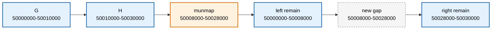
```mermaid
flowchart LR
	G0["G<br/>50000000-50010000"]
	H0["H<br/>50010000-50030000"]
	op["munmap<br/>50008000-50028000"]
	L["left remain<br/>50000000-50008000"]
	hole["new gap<br/>50008000-50028000"]
	R["right remain<br/>50028000-50030000"]

	G0 --> H0 --> op
	op --> L --> hole --> R

	classDef old fill:#e3f2fd,stroke:#1565c0,color:#000,stroke-width:2px;
	classDef gap fill:#f5f5f5,stroke:#777,color:#000,stroke-dasharray:4 3;
	classDef op fill:#fff3e0,stroke:#ef6c00,color:#000,stroke-width:2px;
	class G0,H0,L,R old;
	class hole gap;
	class op op;
```

这个例子里，VMA 管理真正关心的是：

```text
删除范围与哪些 VMA 相交；
每个相交 VMA 是被完整删除、切掉前半段、切掉后半段，还是被一分为二；
删除后形成的新 gap 能否被后续 mmap 使用；
前后相邻 VMA 是否可以合并。
```

Maple Tree 可维护取消映射后的空区间，但拆分 VMA、处理页表和回收映射资源仍由 mm 路径完成。索引容器不能独自执行整个 munmap。

而 rbtree 旧模型要通过：

```text
按 vm_start 找第一个相交 VMA；
沿链表或后继继续遍历相交 VMA；
逐个删除 / 修改 / 插入；
同步维护辅助结构。
```

来完成同一件事。

------

## 14.8\_新模型\_mm\_mt\_与\_VMA\_iterator

新模型可以简化理解为：

```text
mm_struct 的相关成员：struct maple_tree mm_mt
（位置摘记，不是完整结构体定义）
```

也就是：

```text
mm_struct
	-> mm_mt
```

`mm_mt` 是当前进程地址空间里 VMA 集合的 Maple Tree 索引。

VMA 查找、遍历、插入、删除，更多围绕：

```text
maple_tree；
maple_state / ma_state；
vma_iterator；
vma_lookup()；
vma_find()；
find_vma_intersection()；
```

来组织。

可以把变化画成：

```text
旧模型：

mm_struct
	├── mmap      -> VMA linked list
	├── mm_rb     -> VMA rbtree
	└── vmacache_seqnum -> 失效代号（具体缓存属于 task_struct）

新模型：

mm_struct
	└── mm_mt     -> Maple Tree

调用方局部的 VMA iterator -> 引用 mm_mt，记录当前范围与遍历位置
```

这里要抓住核心变化：

```text
旧模型偏“单 VMA 节点 + 辅助链表 + 缓存”；
新模型偏“非重叠范围集合 + 多路范围索引 + iterator”。
```

VMA iterator 是调用方拥有的游标对象，不是长期挂在树下的共享节点。它包含 ma_state 操作状态，记录索引、范围末端和当前位置；多个调用方各用各的游标。它的意义是：

```text
让 VMA 遍历、查找、插入、删除围绕同一个范围索引状态推进；
避免调用者到处手动维护 rbtree 节点、链表节点和缓存状态；
让范围操作表达得更贴近 VMA 真实语义。
```

------

### 14.8.1\_用复杂示例看\_Maple\_Tree\_的范围视角

仍然用 A-I 这组 VMA。

Maple Tree 不要求你把每个 VMA 想成一个二叉树节点。

更自然的理解是：

```text
一组非重叠范围被压进多路索引节点；
节点内部用 pivot 切分地址空间；
slot 指向下一层节点或具体 VMA entry；
iterator 带着当前位置在范围集合里移动。
```

教学化示意图如下：

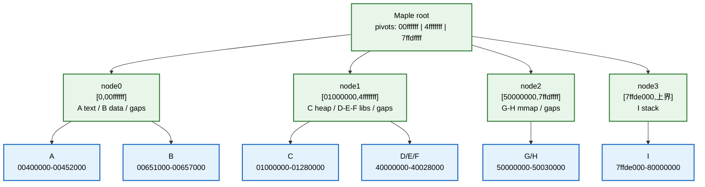
```mermaid
flowchart TD
	root["Maple root<br/>pivots: 00ffffff | 4fffffff | 7ffdffff"]

	n0["node0<br/>[0,00ffffff]<br/>A text / B data / gaps"]
	n1["node1<br/>[01000000,4fffffff]<br/>C heap / D-E-F libs / gaps"]
	n2["node2<br/>[50000000,7ffdffff]<br/>G-H mmap / gaps"]
	n3["node3<br/>[7ffde000,上界]<br/>I stack"]

	A["A<br/>00400000-00452000"]
	B["B<br/>00651000-00657000"]
	C["C<br/>01000000-01280000"]
	D["D/E/F<br/>40000000-40028000"]
	G["G/H<br/>50000000-50030000"]
	I["I<br/>7ffde000-80000000"]

	root --> n0
	root --> n1
	root --> n2
	root --> n3

	n0 --> A
	n0 --> B
	n1 --> C
	n1 --> D
	n2 --> G
	n3 --> I

	classDef mt fill:#e8f5e9,stroke:#2e7d32,color:#000,stroke-width:2px;
	classDef vma fill:#e3f2fd,stroke:#1565c0,color:#000,stroke-width:2px;
	class root,n0,n1,n2,n3 mt;
	class A,B,C,D,G,I vma;
```

此图使用 Maple 的包含式 pivot：等于 pivot 的索引仍走同号槽。它是人为选取的多层布局，九个 VMA 并不必然需要这样的高度；空洞也会占据语义上的范围，不是 VMA 对象。

它表达的是心智模型：

```text
rbtree 从一个 VMA 节点跳到另一个 VMA 节点；
Maple Tree 从一个范围索引节点进入某个范围区间。
```

对 VMA 来说，这个模型更贴近：

```text
地址空间本来就是由一段段范围和空洞组成的。
```

------

### 14.8.2\_page\_fault\_查找路径对比

假设发生 page fault：

```text
fault address = 0x50012000
```

这个地址落在：

```text
H：0x50010000-0x50030000
```

旧 rbtree 模型可以理解为：

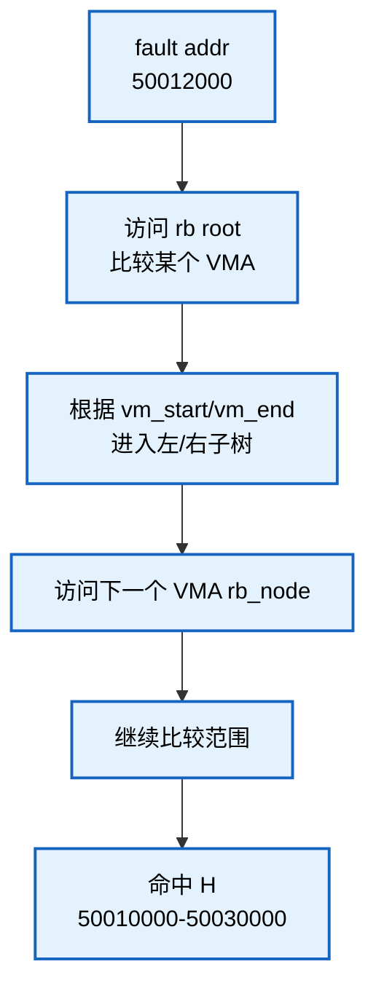
```mermaid
flowchart TD
	start["fault addr<br/>50012000"]
	rb0["访问 rb root<br/>比较某个 VMA"]
	rb1["根据 vm_start/vm_end<br/>进入左/右子树"]
	rb2["访问下一个 VMA rb_node"]
	rb3["继续比较范围"]
	hit["命中 H<br/>50010000-50030000"]

	start --> rb0 --> rb1 --> rb2 --> rb3 --> hit

	classDef step fill:#e3f2fd,stroke:#1565c0,color:#000,stroke-width:2px;
	class start,rb0,rb1,rb2,rb3,hit step;
```

Maple Tree 模型可以理解为：

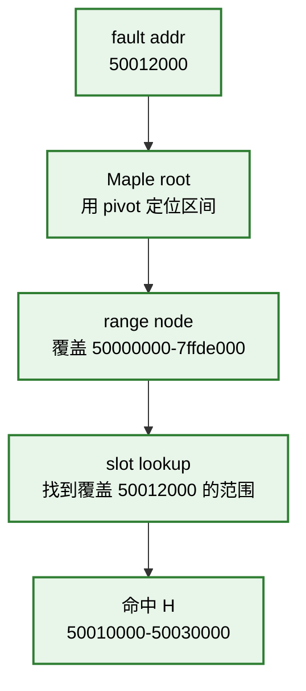
```mermaid
flowchart TD
	start["fault addr<br/>50012000"]
	root["Maple root<br/>用 pivot 定位区间"]
	node["range node<br/>覆盖 50000000-7ffde000"]
	slot["slot lookup<br/>找到覆盖 50012000 的范围"]
	hit["命中 H<br/>50010000-50030000"]

	start --> root --> node --> slot --> hit

	classDef mt fill:#e8f5e9,stroke:#2e7d32,color:#000,stroke-width:2px;
	class start,root,node,slot,hit mt;
```

二者都能找到 VMA。

差异是：

```text
rbtree：
	以 VMA 对象为树节点；
	路径上每步比较一个 VMA 范围；
	前后遍历还依赖链表或后继。

Maple Tree：
	以范围索引节点为单位；
	一个节点里有多个 pivot / slot；
	更适合范围定位和范围迭代。
```

------

### 14.8.3\_gap\_search\_为什么是\_VMA\_管理的核心需求

VMA 管理不只是查已有 VMA。

`mmap` 还经常需要找空洞。

例如要映射：

```text
size = 0x20000
```

需要在地址空间里找一个足够大的 unmapped area。

在前面的地址图中，gap 有很多：

```text
A-B 之间 gap；
B-C 之间 gap；
C-D 之间 large gap；
F-G 之间 gap；
H-I 之间 gap。
```

如果只用“一个 VMA 一个 rb_node”的模型，gap 不是显式对象。

它通常存在于：

```text
前一个 VMA 的 vm_end；
后一个 VMA 的 vm_start；
二者之间的差。
```

也就是说，gap 是两个 VMA 之间推导出来的。

普通范围树可存空值；初始化时启用 MT_FLAGS_ALLOC_RANGE 的分配树还维护子树最大空洞，便于跳过容纳不下请求的孩子。这一汇总占空间，降低同大小内部节点能保存的槽数，并增加更新成本。VMA 的 mm_mt 选择了这个配置。

可以用图表示：

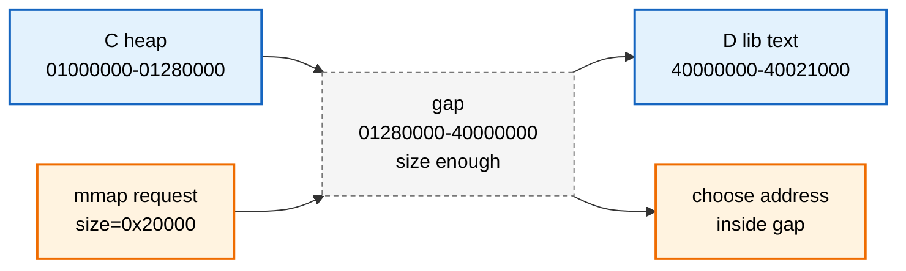
```mermaid
flowchart LR
	C["C heap<br/>01000000-01280000"]
	gap_large["gap<br/>01280000-40000000<br/>size enough"]
	D["D lib text<br/>40000000-40021000"]
	op["mmap request<br/>size=0x20000"]
	result["choose address<br/>inside gap"]

	C --> gap_large --> D
	op --> gap_large --> result

	classDef vma fill:#e3f2fd,stroke:#1565c0,color:#000,stroke-width:2px;
	classDef gap fill:#f5f5f5,stroke:#777,color:#000,stroke-dasharray:4 3;
	classDef op fill:#fff3e0,stroke:#ef6c00,color:#000,stroke-width:2px;

	class C,D vma;
	class gap_large gap;
	class op,result op;
```

这正是为什么不能只说：

```text
VMA 查找是按 vm_start 查找。
```

更完整的说法是：

```text
VMA 管理需要同时处理已映射范围和未映射空洞。
长度够只是必要条件，还要考虑搜索上下限、地址对齐、随机化和栈保护间隔；图中 choose address 不是保证下一次 mmap 必定选中该处。
```

------

## 14.9\_Maple\_Tree\_节点内部可以怎样理解

本章不展开 Maple Tree 源码，但可以建立一个抽象模型。

Maple Tree 节点内部可以粗略理解为：

```text
maple node
	├── pivots：范围边界
	└── slots：边界对应的下一层节点或存储对象
```

在 VMA 场景中：

```text
pivot：
	可以理解成虚拟地址范围边界。

slot：
	可以指向下一层 Maple Tree 节点；
	也可以在叶层关联到 VMA 对象。
```

这和 rbtree 的模型不同。

rbtree 模型是：

```text
一个 VMA 对象
	嵌入一个 rb_node
	通过 rb_left / rb_right 串进二叉树
```

Maple Tree 模型更像：

```text
一个索引节点里保存多个范围边界；
每个边界区间对应一个 slot；
通过多路下降定位目标范围。
```

所以二者的心智模型是：

```text
rbtree：
	一个对象一个树节点。

Maple Tree：
	一个树节点管理多个范围边界和多个槽位。
```

多个边界放在一个索引对象里，使同次下行可利用邻近元数据；较高有效分支数有机会缩短依赖指针链。不过一个节点可能跨多条缓存行，加载一个节点不是一次硬件加载，缓存未命中也不必随树高同比减少。节点占用率、查询分布与更新带来的分配成本仍要测量。

------

### 14.9.1\_pivot\_/\_slot\_和\_B+\_树节点的区别

为了防止把 Maple Tree 误读成普通 B+ 树，这里做一个对照。

B+ 树内部节点常见模型：

```text
keys:
	[30 | 60 | 90]

children:
	<30
	[30,60)
	[60,90)
	>=90
```

Maple Tree 的教学化模型：

```text
pivots:
	[00ffffff | 4fffffff | 7ffdffff]

slots:
	[0,00ffffff]             -> node0
	[01000000,4fffffff]       -> node1
	[50000000,7ffdffff]       -> node2
	[7ffde000,父范围上界]     -> node3
```

相似点：

```text
都是多路；
都是用节点内部边界减少树高；
都是尽量让一个缓存友好的节点承载更多导航信息。
```

差异点：

```text
前章所选的数据库 B+ 树例子按 key 到 record 组织页级索引；
Maple Tree 主要是 index / range 到 entry 的内核范围映射；
Maple Tree 还要处理非重叠范围、gap、RCU-safe、保留值和内核指针约束；它也能作为内存索引，不能根据名字推断节点对应存储设备页。
```

所以：

```text
Maple Tree 属于 B-Tree 思想方向；
但不能把它直接当作教材 B+ 树。
```

------

### 14.9.2\_范围边界和节点容量都带有前提

VMA 用半开区间 `[start,end)`，Maple 索引用包含两端的 `[first,last]`。只有确认 `start < end` 后才能转换为 `[start,end-1]`；空区间不能先减一，否则无符号的 0 会变成最大值。反方向也不能一律算 `last+1`：通用 Maple 范围可以到 ULONG_MAX，而同宽整数无法表示它之后的位置。VMA 的有效用户范围有自己的约束，不能把通用容器边界直接抄成 VMA 地址上限。

以 G/H 的共同边界 `0x50010000` 为例，G 对应闭区间末端是 `0x5000ffff`，因此边界本身属于 H。在节点里寻找第一个不小于 index 的有效 pivot，等于 pivot 时留在其对应槽；最后一槽上界由当前父范围确定。14.8 图中的 pivot 都据此减一。它和前章采用“右孩子最小键”为分隔键的 B+ 例子方向不同，不能仅背诵“相等一律向右”。

内核节点使用 unsigned long 边界，槽可能指向下一层，也可能关联最终对象；NULL 表示未存对象的空范围。指针不是比较键。`maple_range_64` 名字里的 64 不意味着在 ARM32 构建中 unsigned long 自动变为 64 位。CONFIG_64BIT 表示 64 位内核构建，BUILD_VDSO32_64 是头文件中的另一容量选择条件，不应只凭宿主位宽判断。固定头文件按构建条件选择容量：

| 构建条件 | 范围节点槽数组上限 | 带空洞汇总节点槽数组上限 |
| --- | --- | --- |
| CONFIG_64BIT 或 BUILD_VDSO32_64 | 16 | 10 |
| 普通 32 位分支 | 32 | 21 |

这些是数组容量，不是每个节点始终装满的分支数；节点类型、有效项、元数据占用与填充情况还会影响可用项。带 gap 汇总的布局用额外空间换取快速排除不够大的子树。本次 ARM32 配置走后一分支，因此早期文章中的 10/16 不能不加条件抄成所有 Maple 树的固定事实。[版本模块导读](../../../../research/source_reading/maple_tree/navigation/P02_范围契约与查询入口.md#2.2_先核对区间再核对容量)给出对应声明位置。

如果局部数组有帮助，为何不把所有 VMA 放进一张大数组？要先区分 **VMA 本体数组** 与 **VMA 指针数组**。移动前者可能改变对象地址；移动后者不会搬走 VMA，但中间插入仍要移动后续指针，扩容和并发发布也要另行处理。静态、小规模集合可以接受这些成本，不能因存在移动就说数组一无是处。


```mermaid
flowchart LR
    array["按地址排序的指针数组"]
    movement["中间插入：后缀槽位移动，VMA 本体不动"]
    chunks["限制每块大小：移动约束在块内"]
    index["块增加后：上层索引负责选块"]
    tree["多路范围树候选"]
    array -->|"出现频繁更新"| movement
    movement -->|"减少一次移动跨度"| chunks
    chunks -->|"避免顺序找块"| index
    index -->|"仍需分裂、合并与同步"| tree
```

Maple 节点集中的是索引元数据，不要求 VMA 本体或用户物理页连续。它增加了独立节点的分配、再平衡和 RCU 回收工作；减少树高不能抹掉这些成本。

### 14.9.3\_运行G与H的区间模型

现在先预测三个结果：查询共同边界属于谁；在 G 前面一个地址调用精确查询和向后查询会不会相同；取消中间 `0x20000` 字节后，留下哪两段。

下面是完整 C++17 程序，材料为 [vma_range_model.cpp](../../../../labs/kernel/tree_basics/materials/vma_range_model.cpp)。它用有序 vector 保存半开区间，以顺序扫描刻意隔离“查询契约”与“树的实现”。权限值 1 表示读、2 表示写、3 表示读写、0 表示无访问权限；owner 只区分 G/H 来源，不是完整文件偏移或匿名映射状态。

程序的查询返回 vector 内对象地址，仅在容器未修改时可用。protect 与 unmap 构造新的片段后替换容器，旧地址随之失效；这与真实内核 VMA 的分配方式不同，但可以直接提醒我们：查到指针和取得长期使用权是两件事。protect 的“范围必须全覆盖，否则一点不改”是本模型的契约，不宣称 Linux mprotect 对所有失败都提供相同回滚保证。

```cpp
#include <algorithm>
#include <cassert>
#include <cstdint>
#include <iomanip>
#include <iostream>
#include <optional>
#include <utility>
#include <vector>

using address = std::uint64_t;

struct region {
    address start;
    address end;
    unsigned permissions;
    char owner;
};

class range_map {
public:
    std::vector<region> regions;

    // 输入是有效、递增且不重叠的半开区间；空洞没有对象。
    explicit range_map(std::vector<region> input) : regions(std::move(input)) {
        for (std::size_t i = 0; i < regions.size(); ++i) {
            assert(regions[i].start < regions[i].end);
            assert(i == 0 || regions[i - 1].end <= regions[i].start);
        }
    }

    const region* lookup(address index) const {
        for (const auto& item : regions)
            if (item.start <= index && index < item.end)
                return &item;
        return nullptr;
    }

    const region* find(address index) const {
        for (const auto& item : regions)
            if (index < item.end)
                return &item;
        return nullptr;
    }

    const region* intersection(address start, address end) const {
        if (start >= end)
            return nullptr;
        const auto* item = find(start);
        return item && item->start < end ? item : nullptr;
    }

    // 仅寻找给定窗口内最低的连续空洞，不模拟对齐和栈保护间隔。
    std::optional<address> gap(address low, address high, address length) const {
        if (low >= high || length == 0 || length > high - low)
            return std::nullopt;
        address cursor = low;
        for (const auto& item : regions) {
            if (item.end <= cursor)
                continue;
            if (item.start >= high)
                break;
            if (item.start > cursor && length <= item.start - cursor)
                return cursor;
            cursor = std::max(cursor, item.end);
            if (cursor >= high)
                return std::nullopt;
        }
        return length <= high - cursor ? std::optional<address>(cursor)
                                       : std::nullopt;
    }

    // 修改已有映射；要求全部覆盖才修改，这是教学模型自己的失败契约。
    bool protect(address start, address end, unsigned permissions) {
        if (start >= end)
            return false;
        address cursor = start;
        for (const auto& item : regions) {
            if (item.end <= cursor)
                continue;
            if (item.start > cursor)
                return false;
            cursor = std::min(end, item.end);
            if (cursor == end)
                break;
        }
        if (cursor != end)
            return false;
        rewrite(start, end, permissions, false);
        return true;
    }

    void unmap(address start, address end) {
        if (start < end)
            rewrite(start, end, 0, true);
    }

private:
    void rewrite(address start, address end, unsigned permissions, bool erase) {
        std::vector<region> next;
        for (const auto& item : regions) {
            if (end <= item.start || item.end <= start) {
                next.push_back(item);
                continue;
            }
            if (item.start < start)
                next.push_back({item.start, start, item.permissions, item.owner});
            if (!erase)
                next.push_back({std::max(start, item.start), std::min(end, item.end),
                                permissions, item.owner});
            if (end < item.end)
                next.push_back({end, item.end, item.permissions, item.owner});
        }
        // 为了直接观察切分保留相邻片段，不模拟 Linux 的合并条件。
        regions.swap(next);
    }
};

static void show(const range_map& map) {
    for (const auto& item : map.regions)
        std::cout << item.owner << " [" << std::hex << item.start << ','
                  << item.end << ") permissions=" << item.permissions << '\n';
}

int main() {
    const std::vector<region> original{
        {0x50000000, 0x50010000, 1, 'G'},
        {0x50010000, 0x50030000, 3, 'H'}
    };
    range_map map(original);
    assert(map.lookup(0x50010000)->owner == 'H');
    assert(map.lookup(0x4fffffff) == nullptr);
    assert(map.find(0x4fffffff)->owner == 'G');
    assert(map.intersection(0x4fff0000, 0x50000000) == nullptr);
    assert(map.intersection(0x4fff0000, 0x50000001)->owner == 'G');
    const bool protected_all = map.protect(0x50008000, 0x50018000, 0);
    assert(protected_all);
    std::cout << "protect:\n";
    show(map);
    map = range_map(original);
    map.unmap(0x50008000, 0x50028000);
    std::cout << "unmap:\n";
    show(map);
    const auto vacant = map.gap(0x50000000, 0x50030000, 0x20000);
    assert(vacant && *vacant == 0x50008000);
    std::cout << "gap=" << std::hex << *vacant << '\n';
    return 0;
}
```

在材料目录编译运行；命令中的 g++ 指 C++ 编译器，不需要 Python：

```bash
g++ -std=c++17 -Wall -Wextra -Werror -pedantic vma_range_model.cpp -o vma_range_model
./vma_range_model
```

预期输出：

```text
protect:
G [50000000,50008000) permissions=1
G [50008000,50010000) permissions=0
H [50010000,50018000) permissions=0
H [50018000,50030000) permissions=3
unmap:
G [50000000,50008000) permissions=1
H [50028000,50030000) permissions=3
gap=50008000
```

第一次操作保留四片；重置到原 G/H 后再取消中段，剩两片。区间切分沿着原对象逐个求交：左残片继承原属性，中段改变权限或删除，右残片继续继承；未相交的对象原样保留。这也解释了为何只调用一次容器“写入范围”不能包办 Linux 的 VMA 分裂、文件偏移、页表和对象回收。

空洞查找先排除长度为零或超出窗口的请求，用 `length <= high-cursor` 判断容纳关系，避免先做 `cursor+length` 溢出。程序不模拟对齐、栈保护间隔、随机化、节点分裂、空洞汇总或并发，它的线性时间不能拿来测量 Maple Tree 性能。

动手改三处，再解释结果：

1. 把取消映射上界设为 `0x50010000`：H 应完整留下，边界查询仍命中 H。
2. 在 G 与 H 之间制造空洞，再让 protect 横跨它：本模型应返回 false 且保持原片段；Linux 系统调用的错误/回滚行为需另做目标验证。
3. 把 gap 请求长度增加 1：现有中间空洞不够，窗口内应找不到结果。若增大 high，尾部空洞可能再次成为候选，不是“树查询失败后永远没有空间”。

---

## 14.10\_Maple\_Tree\_的普通\_API\_与高级\_API

官方文档把 Maple Tree 接口大致分成普通 API 和高级 API。

API 即 Application Programming Interface，供调用方使用的程序接口。普通接口封装常见操作，但读者仍需按所选锁模式遵守对象保护约定。

典型接口包括：

```text
mtree_store()
mtree_store_range()
mtree_insert()
mtree_insert_range()
mtree_load()
mtree_erase()
mt_find()
mt_for_each()
mt_next()
mt_prev()
mtree_destroy()
```

普通 API 的特点是：

```text
封装程度更高；
内部处理常见锁和 RCU 规则；
适合多数使用者；
不要求使用者自己写 search core。
```

这点和 Linux `rbtree` 很不一样。

`rbtree` 的普通使用方式要求：

```text
调用者自己写 search；
调用者自己写 insert core；
调用者自己决定比较规则；
调用者自己加锁。
```

Maple Tree 普通 API 则更像一个范围映射容器接口。

高级 API 围绕 `ma_state` 展开。

常见接口包括：

```text
mas_walk()
mas_store()
mas_erase()
mas_for_each()
mas_next()
mas_prev()
mas_find()
mas_empty_area()
mas_empty_area_rev()
mas_preallocate()
mas_pause()
```

高级 API 的特点是：

```text
允许复用操作位置与预分配，具体是否更快取决于调用路径；
可以复用 walk 状态；
适合复杂范围操作；
调用者要更小心锁、RCU 和状态管理。
```

把它们和 VMA 对起来，可以这样理解：

```text
普通 API：
	像是“直接对树做存取操作”。

高级 API / vma iterator：
	像是“带着当前范围状态在 VMA 集合里移动和修改”。
```

------

### 14.10.1\_rbtree\_使用方式和\_Maple\_Tree\_普通\_API\_的差异

前面的 [P26 红叶接入与插入修复](P26_Linux红叶接入与插入修复.md#26.1_章节内容说明)讲过，Linux `rbtree` 的典型使用方式是：

```text
调用者定义业务结构体；
业务结构体内嵌 rb_node；
调用者手写 search；
调用者手写 insert core；
调用者决定比较规则；
rb_link_node() + rb_insert_color() 完成插入；
rb_erase() 完成删除修复。
```

Maple Tree 普通 API 的方向不同。

它提供的是更接近范围映射容器的接口：

```text
store index/range -> entry；
load index -> entry；
find range；
iterate range；
erase 所在的整段范围，或通过 store NULL 清除指定子范围。
```

对比表：

| 项目 | Linux rbtree | Maple Tree |
| --- | --- | --- |
| 基本对象 | `struct rb_node` 嵌入业务对象 | index / range 映射到 entry |
| 查找逻辑 | 调用者手写 search | 普通 API 不要求手写 search |
| 排序方式 | 调用者自定义比较规则 | 按 unsigned long index / range |
| 典型用途 | 动态有序对象集合 | 非重叠范围集合 / 稀疏范围映射 |
| 遍历 | `rb_first()` / `rb_next()` | `mt_for_each()` / `mas_for_each()` 等 |
| 并发 | 调用者负责锁和生命周期 | API 封装更多锁和 RCU 细节，但写侧仍要同步 |

这不是谁高级谁低级的问题。

它们抽象层次不同。

`rbtree` 更像：

```text
给你红黑树结构维护工具，你自己组合成业务容器。
```

Maple Tree 普通 API 更像：

```text
给你一个面向 index/range 的内核映射容器。
```

------

## 14.11\_Maple\_Tree\_的锁和\_RCU\_边界

范围索引保存的是 VMA 指针。即使树节点仍可读取，指针指向的对象也可能正在改权限、改边界或退出地址空间。要使用结果，必须同时解决 **树结构可读、对象存活、属性稳定** 三个问题。

先固定最容易闭合的路径：查询者持有地址空间 `mm->mmap_lock` 的读锁，修改者持有其写锁。这里的读写锁让多个只读操作共存，范围写入必须等待这些读者退出。Maple 的 `mm_mt` 位于共享 mm；VMA 对象另行分配；游标 `vma_iterator` 位于各调用方自己的执行上下文。锁保护期间才能把三类状态看成可使用的一组，不能保存一个 VMA 指针、释放所有保护后继续访问。

`MM_MT_FLAGS` 将 VMA 树配置为记录空洞、使用外部锁及 RCU 模式。`kernel/fork.c` 的地址空间初始化把外部锁关联到 `mm->mmap_lock`。这没有取消外部同步要求：`find_vma` 的固定版本实现还检查 mmap 锁的持有条件。接口、返回边界与锁断言见[三类查询的实现讲解](../../../../research/source_reading/maple_tree/source_explanations/mm/mmap.c.md#1.2_find_vma与上界)。

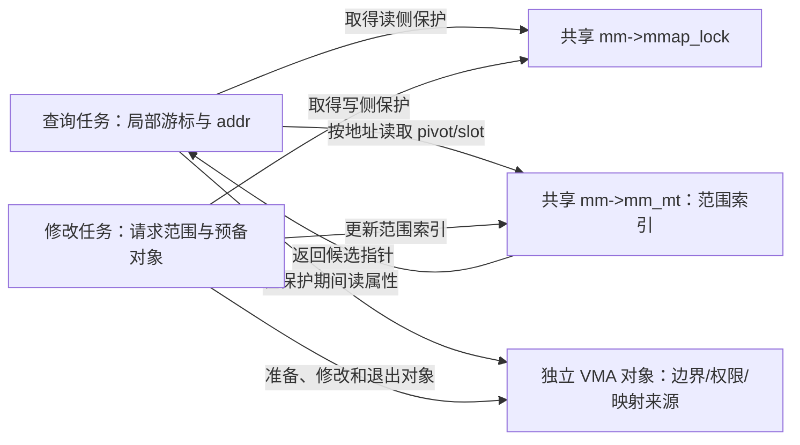
```mermaid
flowchart LR
    reader["查询任务：局部游标与 addr"]
    writer["修改任务：请求范围与预备对象"]
    lock["共享 mm->mmap_lock"]
    tree["共享 mm->mm_mt：范围索引"]
    objects["独立 VMA 对象：边界/权限/映射来源"]
    reader -->|"取得读侧保护"| lock
    writer -->|"取得写侧保护"| lock
    reader -->|"按地址读取 pivot/slot"| tree
    tree -->|"返回候选指针"| reader
    reader -->|"在保护期间读属性"| objects
    writer -->|"更新范围索引"| tree
    writer -->|"准备、修改和退出对象"| objects
```

### 14.11.1\_复杂并发场景\_page\_fault\_读路径与\_munmap\_写路径

现在让查询 H 的任务与取消 G/H 中段映射的任务交错。下图描述外部锁下的 **VMA 元数据观察周期**，不是整个缺页处理函数逐行时序。进入页表修改等后续阶段可能释放或重取锁，必须按对应路径重新判断，不能把这个图当成“所有缺页从头到尾都持同一锁”。

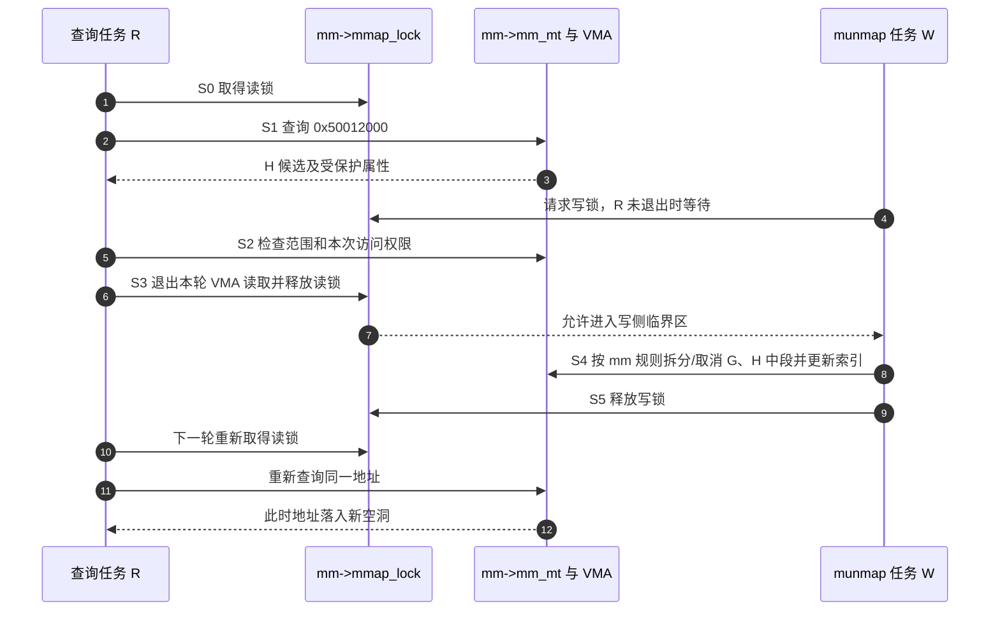
```mermaid
sequenceDiagram
    autonumber
    participant R as 查询任务 R
    participant L as mm->mmap_lock
    participant M as mm->mm_mt 与 VMA
    participant W as munmap 任务 W
    R->>L: S0 取得读锁
    R->>M: S1 查询 0x50012000
    M-->>R: H 候选及受保护属性
    W->>L: 请求写锁，R 未退出时等待
    R->>M: S2 检查范围和本次访问权限
    R->>L: S3 退出本轮 VMA 读取并释放读锁
    L-->>W: 允许进入写侧临界区
    W->>M: S4 按 mm 规则拆分/取消 G、H 中段并更新索引
    W->>L: S5 释放写锁
    R->>L: 下一轮重新取得读锁
    R->>M: 重新查询同一地址
    M-->>R: 此时地址落入新空洞
```

S0～S3 的私有查询状态由 R 维护；共享边界和索引在本周期内由锁阻止 W 同时改动。S4 改变的是共享映射关系，不是把 R 的旧游标直接交给 W。R 再次进入时重新查询，不能沿用锁外的旧 H 指针。这里等待方得到继续执行的依据来自读写锁的释放与获取，不是每次查询向所有 CPU 广播。

RCU（读复制更新）允许另一种树节点读取方式：写者发布新路径，旧节点延后回收，读者在规定的读侧区间内访问可追踪的节点。被移除的“全程读写互斥”成本换成了发布顺序、旧节点保留、重试和对象同步，而不是所有通信都消失。普通 `mtree_load` 内部短暂进入 RCU，只保护其内部查找过程；函数返回后不会自动替业务对象持有引用或 VMA 锁。

固定版本还存在 `CONFIG_PER_VMA_LOCK` 控制的 `lock_vma_under_rcu`：它从树取得候选后尝试稳定该 VMA，并再次检查隔离状态和地址边界，失败不能直接使用候选。这个分支需结合各架构调用方阅读；本次 ARM32 配置未启用它，不能把其他架构的 RCU 缺页快路径宣称为当前目标的运行现象。源码模块导读保留[同步分支入口](../../../../research/source_reading/maple_tree/navigation/P02_范围契约与查询入口.md#2.4_返回指针的使用期限)，本章实验只验证独占区间语义，不模拟 RCU。

高级 `mas_*` 接口把更多锁与游标管理责任交给调用方；普通 `mt*` 接口的内部保护也不等于外部锁模式下可以绕过调用约定。释放树节点和释放 VMA 是不同对象的生命周期。

## 14.12\_Maple\_Tree\_为什么不是普通\_B+\_树

Maple 字面上是“枫树”，这里是具体实现的名称；不能从植物名称推出分支数或平衡规则。Maple Tree 和 B/B+ 树都采用多路组织，但名称相近也不意味着接口契约相同。

但不要把 Maple Tree 直接等同于教科书 B+ 树。

B+ 树通常用来说明：

```text
内部节点只存索引；
叶子节点保存数据；
叶子节点按 key 顺序串联；
非常适合数据库范围查询。
```

Maple Tree 面向的是 Linux 内核范围管理场景。

它要处理：

```text
内核指针存储；
非重叠范围；
gap 查找；
RCU-safe 读路径；
内部锁或外部锁；
节点预分配；
VMA split / merge；
VMA iterator；
特殊值保留和指针编码限制。
```

所以更稳的说法是：

```text
Maple Tree 是面向 Linux 内核范围管理场景设计的 B-Tree 变体。
```

它借用了多路树降低高度、提高节点信息密度、改善缓存局部性的思想。

但它的接口、锁模型、范围语义和工程约束都不是教材 B+ 树可以完整概括的。

------

## 14.13\_Maple\_Tree\_不是页表\_也不是预取系统

现在把范围管理放回一次访问中，检查索引优化发生在哪一段。

因为 Maple Tree 管 VMA，而 VMA 又和虚拟内存相关，所以容易误以为：

```text
Maple Tree 负责虚拟地址到物理地址转换；
Maple Tree 替代页表；
Maple Tree 负责物理页预取；
Maple Tree 让用户数据页连续存放。
```

这些都不对。下面提到的 TLB（Translation Lookaside Buffer）是地址翻译缓存，页表则保存翻译与访问控制信息；两者的访问层次不由 VMA 索引取代。

地址访问路径可以粗略拆成：

```text
CPU 访问虚拟地址
	↓
TLB / 页表翻译
	↓
若页表翻译或权限等条件不满足，产生异常；TLB 未命中本身不等于异常
	↓
内核根据 fault address 查找 VMA
	↓
检查权限和映射类型
	↓
根据匿名页、文件页、COW 等路径处理缺页
```

Maple Tree 参与的是：

```text
根据 fault address 查找对应 VMA；
遍历、插入、删除 VMA 范围；
查找虚拟地址空洞；
维护 VMA 范围集合。
```

它不负责：

```text
页表项硬件翻译；
物理页分配器；
页缓存本身；
磁盘预读；
把用户数据页重新排列成连续物理内存。
```

一句话：

```text
Maple Tree 优化的是 VMA 索引元数据路径，不是物理内存访问路径本身。
```

------

### 14.13.1\_page\_fault\_路径中的\_Maple\_Tree\_位置

TLB 是 Translation Lookaside Buffer，保存近期的地址翻译。下图选用硬件页表遍历模型：TLB 未命中仍可能从有效页表得到翻译；命中也不能绕过权限检查。COW（Copy-on-Write，写时复制）造成的保护异常则可能是正常优化路径。固定版本 [页表文档](https://github.com/nxp-imx/linux-imx/blob/dfaf2136deb2af2e60b994421281ba42f1c087e0/Documentation/mm/page_tables.rst)解释这一区别，图不规定全部架构的异常入口细节。

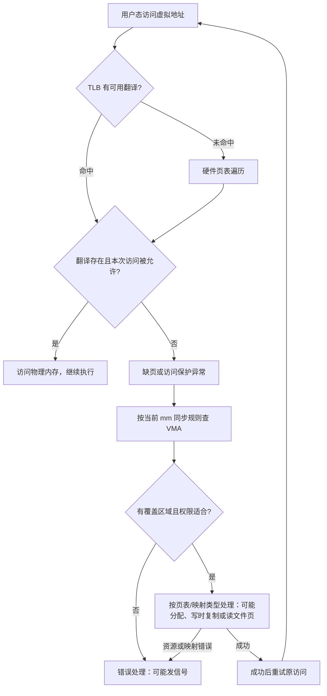
```mermaid
flowchart TD
    user["用户态访问虚拟地址"]
    tlb{"TLB 有可用翻译?"}
    walk["硬件页表遍历"]
    permit{"翻译存在且本次访问被允许?"}
    access["访问物理内存，继续执行"]
    fault["缺页或访问保护异常"]
    query["按当前 mm 同步规则查 VMA"]
    valid{"有覆盖区域且权限适合?"}
    handle["按页表/映射类型处理：可能分配、写时复制或读文件页"]
    retry["成功后重试原访问"]
    error["错误处理：可能发信号"]
    user --> tlb
    tlb -->|"命中"| permit
    tlb -->|"未命中"| walk --> permit
    permit -->|"是"| access
    permit -->|"否"| fault --> query --> valid
    valid -->|"是"| handle
    valid -->|"否"| error
    handle -->|"成功"| retry --> user
    handle -->|"资源或映射错误"| error
```

图中“按当前 mm 同步规则查 VMA”使用范围索引；余下处理还可能遍历映射，但 Maple 本身并不执行硬件地址翻译。处理失败也不保证每次都只产生同一种信号。

后面的：

```text
页表项；
物理页；
COW；
文件页读入；
TLB 更新；
缺页异常返回；
```

不是 Maple Tree 自己负责。

所以不能说：

```text
Maple Tree 优化整个虚拟地址到物理地址翻译过程。
```

更准确地说：

```text
Maple Tree 优化 page fault 等路径中的 VMA 元数据查找和范围管理部分。
```

------

## 14.14\_不能把\_Maple\_Tree\_扩大成\_所有\_rbtree\_都被替代

Maple Tree 替代 VMA rbtree，不等于整个内核不用 rbtree。

先把类型区分开：CFS（Completely Fair Scheduler）和后面的 EEVDF 讨论调度策略；XArray 是稀疏整数索引容器；cached/augmented 是对红黑树入口缓存和子树汇总的扩展。下表给出场景入口，不将它们当作同一类型的竞争产品：

| 子系统或场景 | 更准确的结构理解 |
| --- | --- |
| 虚拟内存 VMA 管理 | Maple Tree |
| 页缓存 / 一些 ID 索引 | XArray / radix tree 演进 |
| 普通内核有序对象集合 | rbtree 仍然适合 |
| 高精度定时器等最小 key 场景 | cached rbtree 仍然合理 |
| 区间重叠查询 | augmented rbtree / interval tree 仍有意义 |
| 公平调度语义 | CFS 到 EEVDF，不是 Maple Tree |

所以这句话要避免：

```text
新内核都改用 Maple Tree 了。
```

更准确的说法是：

```text
新内核的 VMA 内存区域管理，从传统 rbtree + linked list + vmacache 模型转向 Maple Tree；
但普通有序集合、定时器、epoll、I/O 调度等场景仍可能继续使用 rbtree 或其他结构。
```

数据结构替换不是“新结构全面战胜旧结构”。

更常见的真实原因是：

```text
某个子系统的访问模式变得更适合另一种结构。
```

VMA 是范围集合，所以 Maple Tree 更贴合。

普通按 key 排序的内存对象集合，rbtree 仍然是清楚、稳定、成本可控的选择。

------

### 14.14.1\_更细的结构选择图

下图按查询契约列候选，不是自动选型器。XArray 是内核的稀疏整数索引容器，支持按索引迭代，不能因为它出现在“等值”分支就说它没有顺序。cached 最小值与 augmented 子树汇总也可以同时使用。

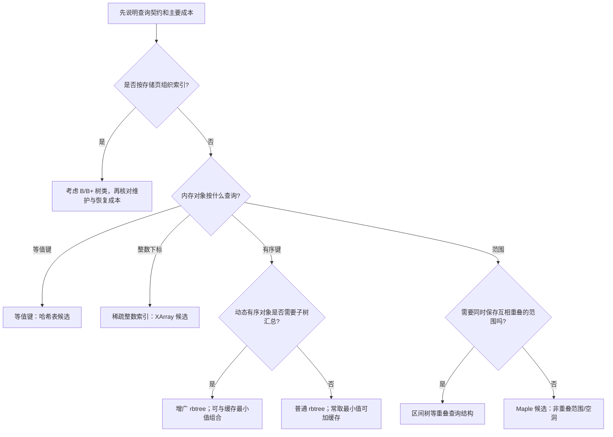
```mermaid
flowchart TD
    start["先说明查询契约和主要成本"]
    storage{"是否按存储页组织索引?"}
    disk["考虑 B/B+ 树类，再核对维护与恢复成本"]
    kind{"内存对象按什么查询?"}
    equal["等值键：哈希表候选"]
    integer["稀疏整数索引：XArray 候选"]
    ordered{"动态有序对象是否需要子树汇总?"}
    aug["增广 rbtree；可与缓存最小值组合"]
    rb["普通 rbtree；常取最小值可加缓存"]
    ranges{"需要同时保存互相重叠的范围吗?"}
    interval["区间树等重叠查询结构"]
    maple["Maple 候选：非重叠范围/空洞"]
    start --> storage
    storage -->|"是"| disk
    storage -->|"否"| kind
    kind -->|"等值键"| equal
    kind -->|"整数下标"| integer
    kind -->|"有序键"| ordered
    kind -->|"范围"| ranges
    ordered -->|"是"| aug
    ordered -->|"否"| rb
    ranges -->|"是"| interval
    ranges -->|"否"| maple
```

这张图的关键是：

```text
Maple Tree 不是 rbtree 的普遍替代；
它更适合非重叠范围集合。
```

VMA 刚好满足这个条件。

------

## 14.15\_不要和\_EEVDF\_调度混淆

同一个版本既可能更新调度策略，也可能更新内存管理索引。先区分算法要选择的对象，再比较所依赖的数据结构，才能避免把两个变化串成一条错误因果链。

### 14.15.1\_EEVDF\_介绍

**EEVDF = Earliest Eligible Virtual Deadline First。**

它是 Linux 公平调度器里的一个调度算法，解决的是：

> 当前 CPU 上有多个 runnable task，下一次应该选谁运行？

不是数据结构，不是 Maple Tree，不是 XArray，也不是 rbtree 的替代品。

#### (1)\_名字拆开看

```text
EEVDF
= Earliest Eligible Virtual Deadline First
= 最早“合格”的虚拟截止时间优先
```

核心概念：

| 概念                 | 含义                                             |
| -------------------- | ------------------------------------------------ |
| **virtual runtime**  | 虚拟运行时间，用来衡量任务已经占用了多少公平份额 |
| **lag**              | 任务是“欠 CPU 时间”还是“多拿了 CPU 时间”         |
| **eligible**         | 当前是否有资格被调度                             |
| **virtual deadline** | 虚拟截止时间，越早越应该先运行                   |

---

### 14.15.2\_Maple\_tree\_与CFS区别

任务调度这边也容易混淆。

CFS 是 Completely Fair Scheduler，完全公平调度器。经典模型的说法是：

```text
可运行调度实体按 vruntime 放在 tasks_timeline 红黑树中；
调度器倾向于选择 vruntime 较小的实体。
```

Linux 官方 CFS 文档也明确说，CFS 使用按时间排序的红黑树构建运行时间线。

后来公平调度语义开始转向 EEVDF。

EEVDF 关注：

```text
lag；
eligible；
virtual deadline；
选择更早 virtual deadline 的任务。
```

在本仓库固定版本中，pick_eevdf 仍从 tasks_timeline 的红黑树根读取，并结合可运行资格和虚拟截止时间选择实体。虚拟截止时间用于公平份额排序，不是硬实时截止期限；这里仅说明策略与结构的分工，不把不同内核版本的完整 EEVDF 行为压成这几句话。证据来自固定提交 kernel/sched/fair.c，见[基线的本批核对记录](../../../../research/source_reading/linux/SOURCE_BASELINE.md#1.28_Maple范围与VMA查询证据)。

这件事和 Maple Tree 不是一条线。

可以这样分开记：

```text
VMA 管理变化：
	rbtree / linked list / vmacache -> Maple Tree / VMA iterator

公平调度变化：
	CFS vruntime 语义 -> EEVDF lag + virtual deadline 语义
```

前者是内存管理的数据结构变化。

后者是调度器选择任务的算法语义变化。

不要把它们合并成：

```text
任务管理也改成 Maple Tree。
```

更准确地说：

```text
Maple Tree 是 VMA 范围索引模型变化；
EEVDF 是公平调度策略变化。
```

------

## 14.16\_和前面\_rbtree\_章节的关系

学到这里，容易产生一个问题：

```text
既然 VMA 从 rbtree 走向 Maple Tree，那前面学 rbtree 还有什么意义？
```

答案是：

```text
rbtree 仍然是理解内核有序对象管理的基础结构；
Maple Tree 的出现反而能帮助看清 rbtree 的适用边界。
```

前面第 8-12 章讲的 Linux rbtree，适合回答：

```text
一个业务对象如何嵌入 rb_node；
如何按 key 手写 search；
如何插入、删除、旋转、染色；
cached 最左节点如何优化最小值访问；
augmented 信息如何随旋转更新；
调用者如何负责锁和生命周期。
```

本章讲的 Maple Tree，适合回答：

```text
当对象本质是非重叠范围集合时，为什么单对象 rbtree 模型不一定最贴合；
为什么多路范围索引可以减少树高和辅助结构；
为什么 VMA 管理需要 iterator、gap search、RCU-safe 等工程特性。
```

所以两者不是互相否定。

它们是同一条学习线上的两个层次：

```text
rbtree：
	动态有序对象集合。

Maple Tree：
	动态非重叠范围集合。
```

------

## 14.17\_复杂示例总复盘

最后回到本章开头的复杂地址空间。

```text
A text
B data
C heap
D/E/F libA segments
G mmap file
H mmap anon
I stack
```

如果用旧模型思考：

```text
查找一个地址：
	走 rbtree。

顺序遍历 VMA：
	走 linked list。

最近访问命中：
	靠 vmacache。

修改一段范围：
	可能同时改 rbtree、linked list、vmacache 和 VMA 生命周期。
```

如果用 Maple Tree 思考：

```text
查找一个地址：
	在 mm_mt 中按范围定位。

遍历一段范围：
	用 iterator 沿范围前进。

查找空洞：
	用 range/gap 语义定位 unmapped area。

修改一段范围：
	围绕 range update / iterator / ma_state 更新非重叠范围集合。
```

这就是本章最重要的变化：

```text
不是“红黑树慢，所以换 Maple Tree”；
而是“VMA 是范围集合，所以用范围树表达更贴切”。
```

------

### 14.17.1\_怎样读历史性能表而不误用它

原先用于解释 Maple 收益的数字来自 2020 年 12 月 RFC（Request for Comments，征求意见补丁）。它以 Linux 5.10-rc1 为基线，在 144 核机器运行 mmtests；作者明确说该版尚未支持 32 位、当时运行在非 RCU 模式。它不是本仓库 ARM32/Linux 6.12.20 的测量，更不能拿来证明当前 RCU 缺页路径收益。[原始 RFC](https://lkml.iu.edu/hypermail/linux/kernel/2012.1/03913.html)

保留原摘要数字时，必须把摘要与逐项结果区别开：

| 作者的摘要项 | 原摘要范围 | 阅读限制 |
| --- | --- | --- |
| malloc1-processes | 约 +1%～+9% | 同信详细结果也有负值，不是所有进程数都提升 |
| malloc1-threads | 约 +29%～+71% | 不是详细结果的最小/最大值 |
| pthread_mutex1-threads | 约 0%～+16% | 不代表所有线程数都非负 |
| signal1-processes | 约 +2%～+17% | 是历史摘要，不能当置信区间 |
| brk1 | 约 -25%～-33% | 作者对测试目标提出疑问，但不能据此删除回退 |
| kernbuild system time | 约 -3%～-5% 的性能变化 | 是系统 CPU 时间增加造成的回退，不是耗时减少 |

例如同一份详细结果中，malloc1-threads 的 110 线程项为 -63.21%，而 2 线程项为 +1295.39%。只摘 +29%～+71% 会把复杂曲线改写成稳定收益。系统时间、墙钟时间和单位时间完成量的“越大越好”方向也不同，比较前要先说明指标。

2022 年 v14 补丁说明可用于确认替换红黑树、VMA 链表与缓存的演进范围，但不能把不同补丁版本的数字并入一张无版本表。[v14 原始说明](https://lists.infradead.org/pipermail/maple-tree/2022-September/001576.html)

现在能够提出的是待验证假设：VMA 多、查找或范围迭代多时，较短的索引依赖链可能减少访问成本；写入密集时，节点分配、复制和汇总维护也可能增加成本。mmap_lock 竞争明显时，必须确认到底更换了查询结构还是也改变了锁协议，不能把两者收益混算。小集合、热点命中、不同填充率和不同机器均可能给出不同结果。

要验证本机，应固定内核提交、配置、机器、VMA 数量、地址分布、线程数和操作比例，分别记录吞吐、延迟、CPU 时间、内存用量与可取得的缓存/锁指标，重复运行并报告波动。本章仅运行区间语义模型，没有执行这项性能实验。

---

## 14.18\_本章小结

本章最重要的结论是：

```text
你记的是 Maple Tree；
它主要替代的是内存管理里的 VMA rbtree / linked list / vmacache 模型；
它不是泛泛替代所有 rbtree。
```

更完整地说：

```text
第一，Maple Tree 是 RCU-safe、面向非重叠范围的 B-Tree 变体。

第二，VMA 天然是 [vm_start, vm_end) 范围对象，因此很适合 Maple Tree。

第三，旧 VMA 管理大致是 rbtree + linked list + vmacache，多套结构需要同步维护。

第四，新 VMA 管理围绕 mm_mt、maple_tree、ma_state 和 vma_iterator 展开。

第五，Maple Tree 优化的是 VMA 范围索引元数据路径，不是页表、物理页分配器或预取系统。

第六，Maple Tree 不是普通 B+ 树，而是 Linux 内核场景下的范围 B-Tree 变体。

第七，rbtree 在普通有序集合、cached 最小值、augmented 区间树等场景中仍然有价值。

第八，调度器从 CFS 走向 EEVDF 是调度算法语义变化，不是 Maple Tree 替代调度树。
```

回到最初的问题，地址相等时到底命中 G 还是 H，取决于区间的包含规则；查不到时返回空还是下一段，取决于查询契约；得到指针后能否继续读，取决于锁与对象生命周期。三者不能由“用了多路树”一句话替代。

下一章进入 [Linux 6.12 Maple 源码与接口层次](P15_Linux_6.12_Maple_Tree_源码结构与_API_分层.md#15.1_本章涉及的源码文件)，进一步追踪这些契约怎样落在节点与操作状态上。
