# 第15章_Linux_6.12_Maple_Tree_源码结构与_API_分层

第 14 章已经把 Maple Tree 放回了正确的位置：它主要是 Linux 新内核里 VMA 管理从 `rbtree + linked list + vmacache` 迁移出来后的核心索引结构，不是所有红黑树的替代品，也不是调度器从 CFS 走到 EEVDF 的原因。

这一章开始进入 Linux 6.12 源码。

但是这里不要一上来就从 `lib/maple_tree.c` 第 1 行开始硬读。Maple Tree 的工程实现有几个容易把人绕晕的点：

1. 它不是“普通 B 树源码”那么直白，很多信息压进了指针低位、节点类型、树标志和状态机里。
2. 它有两层 API：`mtree_*()` 是普通接口，`mas_*()` 是高级接口。
3. VMA 并不直接把所有操作都写成 `mtree_store()` / `mtree_load()`，而是包了一层 `vma_iterator`。
4. 它支持范围存储、空洞搜索、RCU 读侧、预分配节点、删除后的延迟释放，所以源码里有大量“为了工程语义而存在”的结构。

所以本章先做一件事：建立源码阅读地图。

读完本章，至少要能回答下面几个问题：

```text
1. Maple Tree 的核心源码文件分别负责什么？
2. struct maple_tree、struct maple_node、struct ma_state 各自代表什么？
3. 为什么 VMA 使用的是 mm->mm_mt，而不是每个 VMA 自己带 rb_node？
4. mtree_*()、mas_*()、vma_iter_*() 三层接口是什么关系？
5. vma_lookup()、find_vma()、find_vma_intersection() 到底分别走哪条路径？
6. 后面继续深读 mas_store()、mas_find()、gap search 时，应该从哪里切进去？
```

本章的源码片段会保留内核标识符原名，但把片段里的英文注释译成中文。这样既能对照源码，又不会让阅读节奏被英文注释打断。

------

## 15.1_本章涉及的源码文件

本章主要对照这些 Linux 6.12 源码文件：

| 文件 | 本章关注点 |
| --- | --- |
| [Documentation/core-api/maple_tree.rst](../../../../research/source_reading/linux/Documentation/core-api/maple_tree.rst) | 官方文档，说明 Maple Tree 的目标、普通 API、高级 API、锁规则 |
| [include/linux/maple_tree.h](../../../../research/source_reading/linux/include/linux/maple_tree.h) | 核心结构体、宏、状态机、API 声明 |
| [lib/maple_tree.c](../../../../research/source_reading/linux/lib/maple_tree.c) | Maple Tree 的核心算法实现 |
| [include/linux/mm_types.h](../../../../research/source_reading/linux/include/linux/mm_types.h) | `mm_struct` 里的 `mm_mt`，以及 `vma_iterator` 定义 |
| [include/linux/mm.h](../../../../research/source_reading/linux/include/linux/mm.h) | `vma_lookup()`、`vma_find()`、`vma_next()`、`vma_iter_*()` 这类 VMA 访问封装 |
| [mm/mmap.c](../../../../research/source_reading/linux/mm/mmap.c) | `find_vma()`、`find_vma_prev()`、`find_vma_intersection()`、mmap/munmap 相关路径 |
| [mm/memory.c](../../../../research/source_reading/linux/mm/memory.c) | page fault、页表释放、unmap 路径里对 VMA 迭代器的使用 |

如果把它们画成一张图，结构大概是这样：

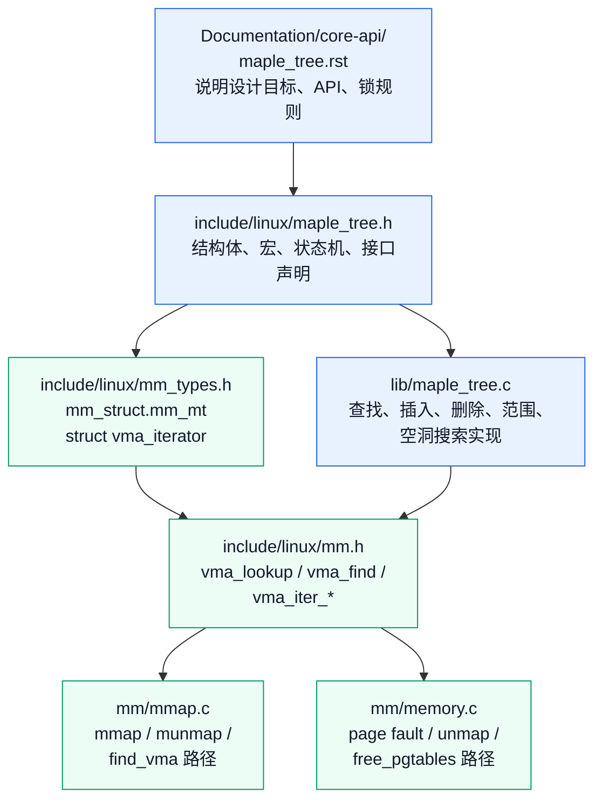

注意这张图里有两条阅读路线：

```text
Maple Tree 自身实现路线：
Documentation → maple_tree.h → maple_tree.c

VMA 工程接入路线：
mm_types.h → mm.h → mmap.c / memory.c → maple_tree.c
```

如果目标是理解算法，应该走第一条。

如果目标是理解“为什么缺页异常、mmap、munmap 都会碰到 Maple Tree”，应该走第二条。

本系列后面会把两条路线合并起来读，但本章先把边界立住。

------

## 15.2_从官方文档先抓住_Maple_Tree_的语义

官方文档对 Maple Tree 的定位很明确：它是一种 B-Tree 风格的数据结构，面向“非重叠范围”的索引。范围可以大到一段地址区间，也可以小到只有一个 index。

这句话非常重要。

普通红黑树存的是“一个节点一个 key”：

```text
key -> object
```

Maple Tree 存的经常是：

```text
[start, last] -> object
```

在 VMA 场景里，这个 object 就是 `struct vm_area_struct *`：

```text
[vm_start, vm_end - 1] -> struct vm_area_struct *
```

为什么是 `vm_end - 1`？

因为 Linux VMA 自己习惯用半开区间：

```text
[vm_start, vm_end)
```

也就是 `vm_start` 包含在 VMA 内，`vm_end` 不包含在 VMA 内。

而 <span style="color:red;">Maple Tree 内部使用的是闭区间</span>：

```text
[index, last]
```

所以 VMA 放进 Maple Tree 时，经常要把 `vm_end` 转成 `vm_end - 1`。

这一点后面读 `vma_iter_bulk_store()`、`vma_iter_clear_gfp()`、`mas_set_range()` 时会反复出现。

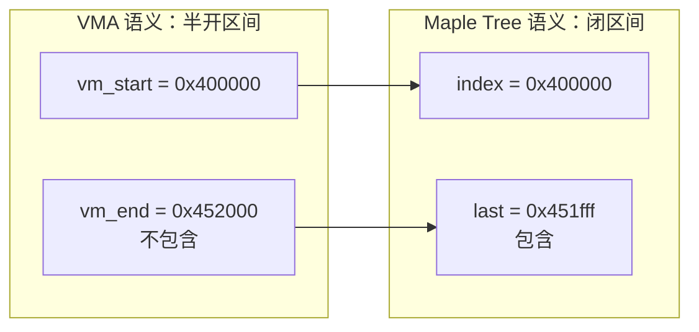

官方文档还把 API 分成两层：

| API 层 | 典型函数 | 适合谁用 |
| --- | --- | --- |
| 普通 API | `mtree_load()`、`mtree_store()`、`mtree_store_range()`、`mtree_erase()`、`mt_find()` | 不想管理状态机，只想查、插、删、遍历 |
| 高级 API | `MA_STATE()`、`mas_walk()`、`mas_store()`、`mas_find()`、`mas_empty_area()`、`mas_pause()` | 需要跨多次操作复用状态、预分配节点、做范围修改、和 VM 子系统深度配合 |

VMA 管理大量使用高级 API，因为它经常需要：

```text
1. 查找某个地址命中的 VMA；
2. 查找某个地址之后的第一个 VMA；
3. 查找一段范围是否和已有 VMA 相交；
4. mmap 时找空洞；
5. munmap / mprotect 时拆分、删除、替换 VMA；
6. 在持有 mmap_lock 的情况下做批量修改；
7. 在 RCU 读侧做快速查找。
```

这些操作如果只靠一个“普通 map”接口，会很别扭。

------

## 15.3_struct_maple_tree_树对象本身

先看 Maple Tree 最外层对象。

源码位置：[include/linux/maple_tree.h](../../../../research/source_reading/linux/include/linux/maple_tree.h)

下面是简化后的源码骨架，注释已经译成中文：

```c
struct maple_tree {
	union {
		spinlock_t		ma_lock;
		lockdep_map_p	ma_external_lock;
	};
	unsigned int	ma_flags;
	void __rcu      *ma_root;
};
```

三个字段分别对应三件事：

| 字段 | 含义 |
| --- | --- |
| `ma_lock` / `ma_external_lock` | Maple Tree 自己的锁，或者外部锁的 lockdep 表示 |
| `ma_flags` | 树的模式、锁模式、高度等标志 |
| `ma_root` | 根指针，可能是空、直接 entry、或者指向 Maple 节点 |

不要把 `ma_root` 简单理解成“永远指向根节点”。Maple Tree 为了优化小树，会让根指针直接存储 entry；只有复杂到一定程度，才需要真正的节点。

源码附近有这样一段语义，译成中文就是：

```c
/*
 * 如果树里只有 index 0 上的单个 entry，通常直接存进 tree->ma_root。
 * 为了优化 page cache，低两位为 00、01、11 的 entry 可以存在根指针里；
 * 低两位为 10 的 entry 会被放进节点。
 *
 * flags 既保存树创建时确定的不变信息，也保存持锁修改的动态信息。
 *
 * 另一个用途是表示树的全局状态。例如 MT_FLAGS_USE_RCU 表示树当前处于
 * RCU 模式。这个模式允许单用户场景复用节点，避免反复分配节点和通过
 * RCU 释放节点。
 */
```

`ma_flags` 里本章先记住这几个宏：

```c
#define MT_FLAGS_ALLOC_RANGE	0x01
#define MT_FLAGS_USE_RCU		0x02
#define MT_FLAGS_LOCK_EXTERN	0x300
```

它们在 VMA 场景里会被组合成：

```c
#define MM_MT_FLAGS	(MT_FLAGS_ALLOC_RANGE | MT_FLAGS_LOCK_EXTERN | \
			 MT_FLAGS_USE_RCU)
```

这说明 `mm_struct` 里的 Maple Tree 不是默认配置，而是专门服务 VMA 的配置：

| 标志 | 对 VMA 的意义 |
| --- | --- |
| `MT_FLAGS_ALLOC_RANGE` | 这棵树需要支持范围分配 / 空洞搜索，适合 mmap 找地址空间 |
| `MT_FLAGS_LOCK_EXTERN` | 不主要依赖 Maple Tree 自己的 `ma_lock`，而是由外层 VM 锁语义保护 |
| `MT_FLAGS_USE_RCU` | 支持 RCU 读侧访问，配合 VMA 查找优化 |

用图表示就是：

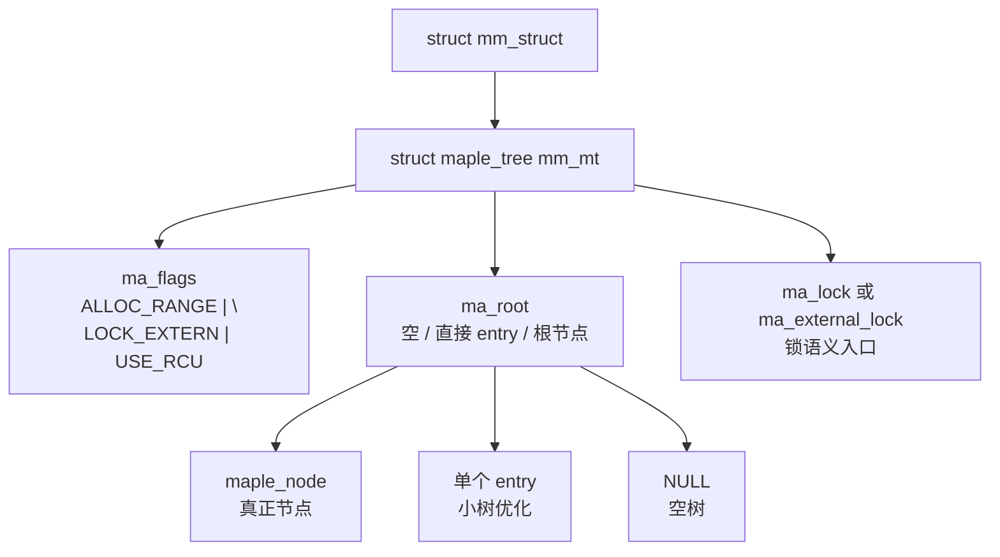

这里和红黑树的差别非常明显：

| 对比点 | Linux rbtree | Maple Tree |
| --- | --- | --- |
| 树根 | `struct rb_root` / `struct rb_root_cached` | `struct maple_tree` |
| 节点归属 | 使用者结构体内嵌 `struct rb_node` | Maple Tree 节点由数据结构内部管理，使用者存 entry 指针 |
| key 存在哪里 | 使用者结构体字段里，比较逻辑由使用者写 | index / range 由 Maple Tree API 状态传入 |
| 查找逻辑 | 使用者自己写 while 比较 | Maple Tree 提供 `mtree_load()` / `mt_find()` / `mas_find()` |
| 范围语义 | 不是原生范围树，需要使用者自己维护 | 原生支持 `[index, last]` 范围 |

这也是为什么 VMA 从 rbtree 切换到 Maple Tree 后，`struct vm_area_struct` 不再需要为“按地址索引”嵌入一个 `rb_node`。

------

## 15.4_struct_maple_node_真正装_pivot_和_slot_的节点

Maple Tree 的节点不是一个“只有左右孩子”的二叉节点，而是多路节点。

源码里先定义了节点容量：

```c
#if defined(CONFIG_64BIT) || defined(BUILD_VDSO32_64)
/* 64 位尺寸 */
#define MAPLE_NODE_SLOTS	31	/* 包含 ->parent 在内共 256 字节 */
#define MAPLE_RANGE64_SLOTS	16	/* 256 字节 */
#define MAPLE_ARANGE64_SLOTS	10	/* 240 字节 */
#define MAPLE_ALLOC_SLOTS	(MAPLE_NODE_SLOTS - 1)
#else
/* 32 位尺寸 */
#define MAPLE_NODE_SLOTS	63	/* 包含 ->parent 在内共 256 字节 */
#define MAPLE_RANGE64_SLOTS	32	/* 256 字节 */
#define MAPLE_ARANGE64_SLOTS	21	/* 240 字节 */
#define MAPLE_ALLOC_SLOTS	(MAPLE_NODE_SLOTS - 2)
#endif
```

这几个数字不是随便来的。源码注释里明确说明节点大小按 256 字节设计，并且节点也按 256 字节对齐。这样节点指针的低 8 位可以拿来编码额外信息。

`struct maple_node` 的骨架如下：

```c
struct maple_node {
	union {
		struct {
			struct maple_pnode *parent;
			void __rcu *slot[MAPLE_NODE_SLOTS];
		};
		struct {
			void *pad;
			struct rcu_head rcu;
			struct maple_enode *piv_parent;
			unsigned char parent_slot;
			enum maple_type type;
			unsigned char slot_len;
			unsigned int ma_flags;
		};
		struct maple_range_64 mr64;
		struct maple_arange_64 ma64;
		struct maple_alloc alloc;
	};
};
```

这个 union 非常有信息量：

| union 成员 | 作用 |
| --- | --- |
| `parent + slot[]` | 通用视角：一个父指针加很多槽位 |
| `rcu` 相关字段 | 节点移除后复用内存布局，用于 RCU 回收 |
| `mr64` | 64 位 range 节点 |
| `ma64` | 64 位 allocation range 节点，额外带 gap 信息 |
| `alloc` | 预分配节点链，用于复杂写操作 |

Maple Tree 节点类型由 `enum maple_type` 表示：

```c
enum maple_type {
	maple_dense,
	maple_leaf_64,
	maple_range_64,
	maple_arange_64,
};
```

本章先抓住两个常见节点：

```text
maple_range_64:
    负责普通范围索引，主要看 pivot[] + slot[]。

maple_arange_64:
    负责 allocation range 场景，除了 pivot[] + slot[]，还带 gap[]。
```

`maple_range_64` 可以简化理解成：

```text
parent
pivot[0..14]
slot[0..15]
metadata
```

`maple_arange_64` 可以简化理解成：

```text
parent
pivot[0..8]
slot[0..9]
gap[0..9]
metadata
```

为什么 allocation range 节点要多一个 `gap[]`？

因为 mmap 找空洞不是只问“这个地址有没有 VMA”，而是经常问：

```text
在 [low_limit, high_limit) 之间，能不能找到一段长度为 len 的空闲地址？
```

如果每次都线性扫所有 VMA，代价会很高。`gap[]` 的作用就是让节点缓存子树里的最大空洞信息，使得空洞搜索可以跳过不可能满足条件的子树。

下面用一个复杂一点的 VMA 地址空间来感受这个差别。

```text
已有 VMA：

A: [0x0000000000400000, 0x0000000000452000)
B: [0x0000000000600000, 0x0000000000610000)
C: [0x0000000000800000, 0x0000000000a80000)
D: [0x0000000004000000, 0x0000000004800000)
E: [0x00007f1000000000, 0x00007f1000200000)
F: [0x00007f1000600000, 0x00007f1000800000)
G: [0x00007fff00000000, 0x00007fff00021000)
```

普通 range 视角关心的是：

```text
某个 addr 命中哪个 VMA？
从某个 addr 开始，下一个 VMA 是谁？
某个范围是否和已有 VMA 相交？
```

allocation range 视角还要关心：

```text
[0x00007f1000200000, 0x00007f1000600000) 这段 gap 有多大？
[0x0000000000a80000, 0x0000000004000000) 这段 gap 能不能容纳新的 mmap？
从高地址往低地址找，哪个 gap 最合适？
```

画成节点信息大概是这样：

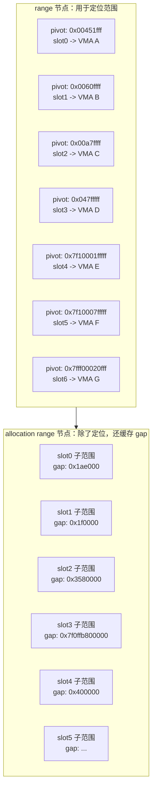

这张图不是精确还原某一棵真实 Maple Tree 的节点布局，而是帮助理解 `pivot[]`、`slot[]`、`gap[]` 分别服务什么问题。

源码注释里还有一句关键话：

```text
在普通 B-Tree 术语里，pivot 通常叫 key。
Maple Tree 使用 pivot 这个词，是因为它描述的是范围边界。
pivot 值包含在同下标 slot 的范围内。
```

也就是说：

```text
pivot[i] 是 slot[i] 覆盖范围的包含式上界。
```

这个细节非常重要。因为 VMA 本身是 `[vm_start, vm_end)`，进入 Maple Tree 后要变成 `[vm_start, vm_end - 1]`，而 pivot 又是包含式边界。

------

## 15.5_指针低位编码_Maple_Tree_的_隐形字段

源码里说 Maple Tree 会把一些信息挤进指针低位。

这和第 8 章里 Linux rbtree 把颜色压进 `__rb_parent_color` 有一点相似，但用途不同。

| 结构 | 指针低位保存什么 |
| --- | --- |
| Linux rbtree | 父指针 + 红黑颜色 |
| Maple Tree | 根标记、节点类型、slot offset、特殊状态、错误编码等 |

Maple Tree 这么做依赖一个事实：节点按 256 字节对齐。

```text
256 字节对齐
=> 节点地址低 8 位必然是 0
=> 低 8 位可以编码类型、槽位、根标记等信息
```

源码注释的大意是：

```c
/*
 * Maple Tree 会在一些不那么直观的位置塞入各种 bit。
 * 通常做法是利用指针按 N 字节对齐这一事实，因此低 log2(N) 位可用。
 * 不使用指针高位，因为无法确定某个体系结构上哪些高位一定不用。
 *
 * 节点大小为 256 字节，也按 256 字节对齐，所以低 8 位可以自用。
 * 当前节点大致分成 4 类：
 * 1. 单指针，也就是范围 0-0；
 * 2. 非叶 allocation range 节点；
 * 3. 非叶 range 节点；
 * 4. 叶 range 节点。
 */
```

指针低位编码带来的第一个阅读困难是：你在源码里看到的 `struct maple_enode *` 不一定是“裸节点指针”。

它可能是：

```text
节点地址 + 类型 bit
节点地址 + slot offset
根标记
错误状态
特殊状态
```

所以 Maple Tree 源码里会有大量 `mte_*()`、`mas_*()`、`ma_is_*()` 之类 helper，用来编码和解码这些状态。

第二个阅读困难是：entry 值本身也有保留模式。

源码注释里说：

```c
/*
 * 叶子节点不存子节点指针，而是存用户数据。
 * 用户几乎可以存任意 bit pattern。
 *
 * 但低两位为 10 且数值小于 4096 的值被保留给内部使用。
 * 也就是 2、6、10 ... 4094 这些值。
 *
 * 某些 API 会返回特殊 errno 编码：把负 errno 左移两位，
 * 再把低两位置成 10。把这些值存进数组不一定直接报错，
 * 但如果之后用 mas_is_err() 判断，就可能造成混淆。
 */
```

这就是为什么 Maple Tree 文档会提醒：如果使用者想存小整数，应该用 XArray 那套 value 编码，比如 `xa_mk_value()` / `xa_to_value()`。

在 VMA 场景中，entry 是 `struct vm_area_struct *`，正常对象指针对齐后不会落进这种保留小整数范围，所以风险小很多。

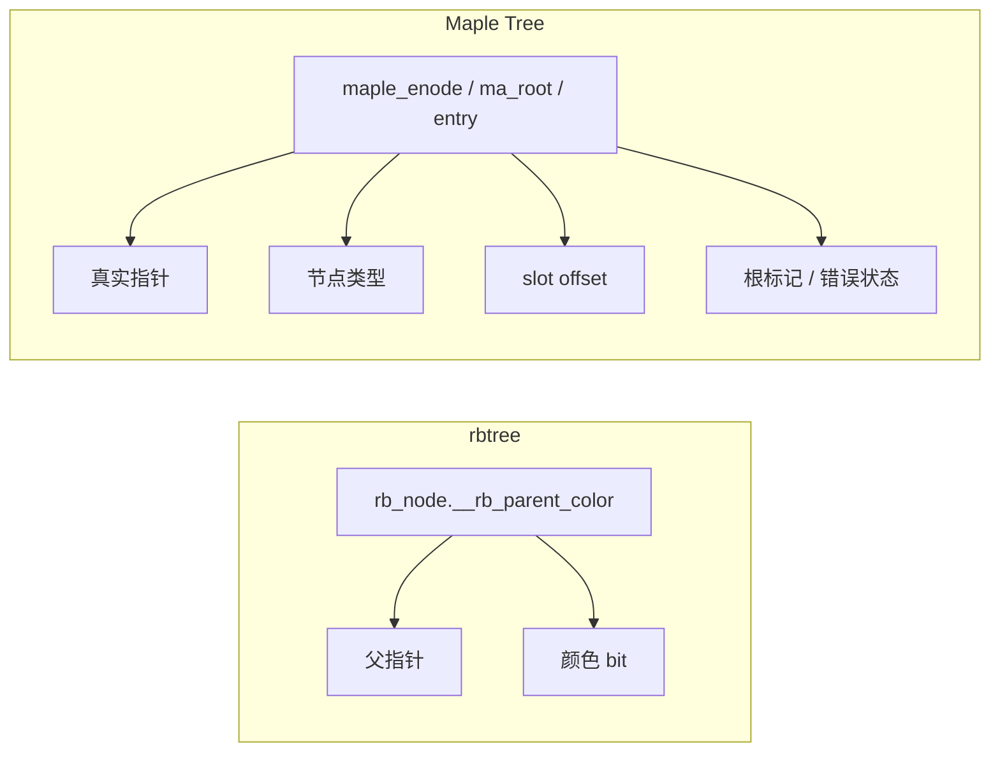

这里有一个很实用的源码阅读原则：

```text
看到 rb_node：
    重点追父子关系和颜色修复。

看到 maple_enode / ma_state.node：
    重点先判断它是裸指针、编码节点、根位置、none、error，还是 pause 状态。
```

------

## 15.6_struct_ma_state_Maple_Tree_高级_API_的状态机

如果说 `struct maple_tree` 是树对象，`struct maple_node` 是节点对象，那么 `struct ma_state` 就是“拿着地图在树里走的人”。

高级 API 几乎都围绕 `ma_state` 工作。

源码位置：[include/linux/maple_tree.h](../../../../research/source_reading/linux/include/linux/maple_tree.h)

简化骨架如下，注释译成中文：

```c
struct ma_state {
	struct maple_tree *tree;		/* 当前操作的树 */
	unsigned long index;		/* 当前操作的 index，也就是范围起点 */
	unsigned long last;		/* 当前操作的最后一个 index，也就是范围终点 */
	struct maple_enode *node;	/* 包含当前 entry 的节点 */
	unsigned long min;		/* 当前节点隐含的最小 index */
	unsigned long max;		/* 当前节点隐含的最大 index */
	struct maple_alloc *alloc;	/* 本次操作预分配出来的节点 */
	enum maple_status status;	/* 状态：active、start、none 等 */
	unsigned char depth;		/* 写操作期间下降到树中的深度 */
	unsigned char offset;		/* 当前关注的 slot / pivot 下标 */
	unsigned char mas_flags;
	unsigned char end;		/* 当前节点的末尾 slot */
	enum store_type store_type;	/* 本次 store 需要的写入类型 */
};
```

`ma_state` 里有三组字段最重要。

第一组是“我要操作哪个范围”：

```text
index
last
```

第二组是“我现在在树的哪里”：

```text
node
min
max
depth
offset
end
```

第三组是“我现在处于什么状态”：

```text
status
alloc
store_type
```

`MA_STATE()` 宏就是最常见的初始化方式：

```c
#define MA_STATE(name, mt, first, end)					\
	struct ma_state name = {					\
		.tree = mt,						\
		.index = first,						\
		.last = end,						\
		.node = NULL,						\
		.status = ma_start,					\
		.min = 0,						\
		.max = ULONG_MAX,					\
		.alloc = NULL,						\
		.mas_flags = 0,						\
		.store_type = wr_invalid,				\
	}
```

这段代码可以翻译成一句话：

```text
我要在 mt 这棵树里，从 first 到 end 这个闭区间开始一次 Maple Tree 操作；
当前还没走进树，所以 node = NULL，status = ma_start；
根节点隐含范围先认为是 [0, ULONG_MAX]。
```

`ma_state` 的状态值大致是：

```text
ma_start     还没开始，下一次操作要从根往下走
ma_active    已经定位到树中某个有效位置
ma_root      当前状态指向根位置
ma_none      没有找到 entry
ma_pause     暂停，之前缓存的节点可能已经过期，下次要重新走
ma_overflow  上一次操作撞到了上界
ma_underflow 上一次操作撞到了下界
ma_error     当前状态编码了错误
```

画成状态机：

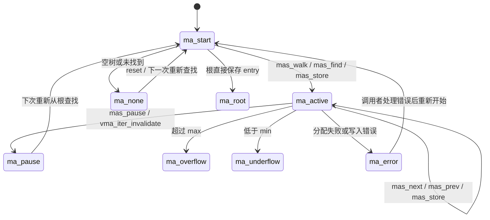

这里要特别注意 `ma_pause`。

VMA 修改路径里，树可能发生拆分、合并、删除、替换。如果某个 iterator 手里还缓存着旧节点位置，那么继续用旧位置可能不安全。所以 VMA 封装里有：

```c
static inline void vma_iter_invalidate(struct vma_iterator *vmi)
{
	mas_pause(&vmi->mas);
}
```

它不是“删除 iterator”，而是告诉 `ma_state`：

```text
你之前记住的 node / offset 可能过期了；
下次操作不要相信旧位置，重新从树根定位。
```

这就是高级 API 比普通 API 复杂的地方：它既保存位置以提高连续操作效率，又必须在结构变化后能失效重走。

------

## 15.7_用一个复杂_VMA_场景理解_ma_state

假设某进程地址空间里有下面这些 VMA：

```text
A: [0x0000000000400000, 0x0000000000452000)  text
B: [0x0000000000600000, 0x0000000000610000)  rodata
C: [0x0000000000610000, 0x0000000000639000)  data
D: [0x0000000000639000, 0x0000000000660000)  heap
E: [0x00007f1000000000, 0x00007f1000200000)  lib.so text
F: [0x00007f1000200000, 0x00007f1000240000)  lib.so relro
G: [0x00007f1000600000, 0x00007f1000800000)  anonymous mmap
H: [0x00007fff00000000, 0x00007fff00021000)  stack
```

转换到 Maple Tree 里，范围变成：

```text
A: [0x0000000000400000, 0x0000000000451fff]
B: [0x0000000000600000, 0x000000000060ffff]
C: [0x0000000000610000, 0x0000000000638fff]
D: [0x0000000000639000, 0x000000000065ffff]
E: [0x00007f1000000000, 0x00007f10001fffff]
F: [0x00007f1000200000, 0x00007f100023ffff]
G: [0x00007f1000600000, 0x00007f10007fffff]
H: [0x00007fff00000000, 0x00007fff00020fff]
```

现在发生一次缺页异常，地址是：

```text
addr = 0x00007f1000212345
```

这个地址应该命中 F。

如果用 `vma_lookup(mm, addr)`，最终会走：

```text
vma_lookup()
  -> mtree_load(&mm->mm_mt, addr)
       -> MA_STATE(mas, mt, addr, addr)
       -> mas_start()
       -> mtree_lookup_walk()
```

此时 `ma_state` 的语义大概是：

```text
tree  = &mm->mm_mt
index = 0x00007f1000212345
last  = 0x00007f1000212345
min/max = 当前节点隐含范围
node/offset = 查找过程中逐步定位出来
status = 从 ma_start 走向 ma_active
```

如果查到了 F，返回的是 `struct vm_area_struct *F`。

如果这时不是精确 lookup，而是问：

```text
从 0x00007f1000240000 开始，下一个 VMA 是谁？
```

那它应该跳过空洞，返回 G。

这时更像 `find_vma(mm, addr)`：

```text
find_vma()
  -> mt_find(&mm->mm_mt, &index, ULONG_MAX)
       -> MA_STATE(mas, mt, index, index)
       -> mas_state_walk()
       -> 如果当前位置没有 entry，就 mas_next_entry()
```

`mt_find()` 和 `mtree_load()` 的关键差别是：

```text
mtree_load(index):
    只问 index 这个点有没有 entry。

mt_find(&index, max):
    问 index 或 index 之后，直到 max 之间，第一个 entry 是谁。
```

这就是为什么 `find_vma()` 可以返回“命中地址的 VMA，或者地址之后的下一个 VMA”。

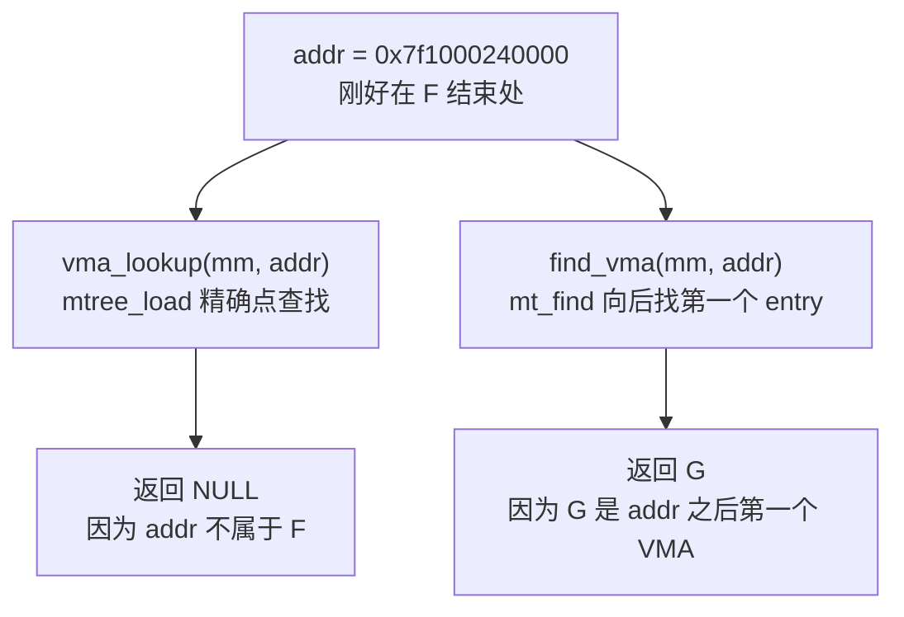

这个差别在读 `mm/mmap.c` 时非常重要。很多时候代码不是在判断“这个地址是否在 VMA 里”，而是在找“这个地址附近的 VMA 布局”。

------

## 15.8_普通_API_mtree_*()_和_mt_*()

普通 API 的特点是：调用者不用自己维护 `ma_state`。

典型函数声明在 [include/linux/maple_tree.h](../../../../research/source_reading/linux/include/linux/maple_tree.h)：

```c
void *mtree_load(struct maple_tree *mt, unsigned long index);

int mtree_store(struct maple_tree *mt, unsigned long index,
		void *entry, gfp_t gfp);

int mtree_store_range(struct maple_tree *mt, unsigned long first,
		unsigned long last, void *entry, gfp_t gfp);

void *mtree_erase(struct maple_tree *mt, unsigned long index);

void *mt_find(struct maple_tree *mt, unsigned long *index, unsigned long max);
```

### 15.8.1_mtree_load()_精确点查找

源码位置：[lib/maple_tree.c](../../../../research/source_reading/linux/lib/maple_tree.c)

简化并翻译注释后：

```c
/*
 * mtree_load() - 加载 Maple Tree 中某个 index 保存的值
 * @mt: Maple Tree
 * @index: 要加载的 index
 *
 * 返回：entry 或 NULL
 */
void *mtree_load(struct maple_tree *mt, unsigned long index)
{
	MA_STATE(mas, mt, index, index);
	void *entry;

	rcu_read_lock();
retry:
	entry = mas_start(&mas);
	if (unlikely(mas_is_none(&mas)))
		goto unlock;

	if (unlikely(mas_is_ptr(&mas))) {
		if (index)
			entry = NULL;

		goto unlock;
	}

	entry = mtree_lookup_walk(&mas);
	if (!entry && unlikely(mas_is_start(&mas)))
		goto retry;
unlock:
	rcu_read_unlock();
	if (xa_is_zero(entry))
		return NULL;

	return entry;
}
```

这段函数里有几个阅读点：

| 代码 | 含义 |
| --- | --- |
| `MA_STATE(mas, mt, index, index)` | 点查找，把范围起点和终点都设成同一个 index |
| `rcu_read_lock()` | 普通读取可以在 RCU 读侧进行 |
| `mas_start()` | 根据树根情况初始化状态 |
| `mas_is_ptr()` | 根可能直接保存 entry，而不是节点 |
| `mtree_lookup_walk()` | 真正向下走树 |
| `xa_is_zero(entry)` | XArray 风格的 zero entry 特殊处理 |

可以把 `mtree_load()` 理解成 Maple Tree 的“精确命中查询”：

```text
给我一个 index；
如果某个范围覆盖它，返回这个范围对应的 entry；
否则返回 NULL。
```

在 VMA 里，它对应：

```c
static inline
struct vm_area_struct *vma_lookup(struct mm_struct *mm, unsigned long addr)
{
	return mtree_load(&mm->mm_mt, addr);
}
```

### 15.8.2_mtree_store_range()_范围写入

源码简化后：

```c
/*
 * mtree_store_range() - 在指定范围内保存 entry
 * @mt: Maple Tree
 * @index: 范围起点
 * @last: 范围终点
 * @entry: 要保存的 entry
 * @gfp: 分配内存使用的 GFP 标志
 *
 * 返回：成功为 0；请求非法为 -EINVAL；无法分配内存为 -ENOMEM。
 */
int mtree_store_range(struct maple_tree *mt, unsigned long index,
		unsigned long last, void *entry, gfp_t gfp)
{
	MA_STATE(mas, mt, index, last);
	int ret = 0;

	if (WARN_ON_ONCE(xa_is_advanced(entry)))
		return -EINVAL;

	if (index > last)
		return -EINVAL;

	mtree_lock(mt);
	ret = mas_store_gfp(&mas, entry, gfp);
	mtree_unlock(mt);

	return ret;
}
```

这段函数暴露了普通 API 和高级 API 的关系：

```text
mtree_store_range()
    创建 ma_state
    检查参数
    加锁
    调用 mas_store_gfp()
    解锁
```

也就是说，普通 API 很多时候只是：

```text
帮调用者创建 ma_state
帮调用者处理锁
再转给 mas_* 高级接口
```

这和 rbtree 非常不一样。rbtree 没有这种通用写入 API，使用者必须自己写比较、自己找到插入位置、自己调用 `rb_link_node()` 和 `rb_insert_color()`。

### 15.8.3_mt_find()_从某点向后找第一个_entry

`mt_find()` 是理解 `find_vma()` 的关键。

源码注释翻译后：

```c
/*
 * 如果找到 entry，@index 会被更新到下一个可能 entry 的位置。
 * 不管找到的 entry 只占一个 index，还是占一段 range，都是如此。
 *
 * 返回：位于 @index 或 @index 之后的 entry；如果没有则返回 NULL。
 */
void *mt_find(struct maple_tree *mt, unsigned long *index, unsigned long max)
{
	MA_STATE(mas, mt, *index, *index);
	void *entry;

	if ((*index) > max)
		return NULL;

	rcu_read_lock();
retry:
	entry = mas_state_walk(&mas);
	if (mas_is_start(&mas))
		goto retry;

	if (unlikely(xa_is_zero(entry)))
		entry = NULL;

	if (entry)
		goto unlock;

	while (mas_is_active(&mas) && (mas.last < max)) {
		entry = mas_next_entry(&mas, max);
		if (likely(entry && !xa_is_zero(entry)))
			break;
	}

	if (unlikely(xa_is_zero(entry)))
		entry = NULL;
unlock:
	rcu_read_unlock();
	if (likely(entry))
		*index = mas.last + 1;

	return entry;
}
```

这段代码有两个细节很关键。

第一个细节：如果 `index` 位置本身没命中，它会继续向后找。

```text
entry = mas_state_walk(&mas)
如果当前位置没有 entry
    while mas.last < max
        entry = mas_next_entry(&mas, max)
```

第二个细节：找到 entry 后，会把 `*index` 更新成 `mas.last + 1`。

这对遍历特别重要：

```text
第一次找到 [100, 199] -> entry A
*index 更新为 200

下一次从 200 继续找
```

这就是为什么 `mt_for_each()` 可以用 `mt_find()` / `mt_find_after()` 实现。

------

## 15.9_高级_API_mas_*()_是真正的状态机接口

高级 API 的入口集中在 [include/linux/maple_tree.h](../../../../research/source_reading/linux/include/linux/maple_tree.h)：

```c
void *mas_walk(struct ma_state *mas);
void *mas_store(struct ma_state *mas, void *entry);
void *mas_erase(struct ma_state *mas);
int mas_store_gfp(struct ma_state *mas, void *entry, gfp_t gfp);
void *mas_find(struct ma_state *mas, unsigned long max);
void *mas_find_range(struct ma_state *mas, unsigned long max);
void *mas_find_rev(struct ma_state *mas, unsigned long min);
void *mas_next(struct ma_state *mas, unsigned long max);
void *mas_prev(struct ma_state *mas, unsigned long min);
int mas_empty_area(struct ma_state *mas, unsigned long min,
		   unsigned long max, unsigned long size);
int mas_empty_area_rev(struct ma_state *mas, unsigned long min,
		       unsigned long max, unsigned long size);
```

这些函数可以按用途分成几组：

| 分组 | 函数 | 作用 |
| --- | --- | --- |
| 定位 | `mas_walk()` | 按 `mas->index` / `mas->last` 定位 entry |
| 查找 | `mas_find()`、`mas_find_range()` | 从当前状态向后找 |
| 反向查找 | `mas_find_rev()`、`mas_prev()` | 从当前状态向前找 |
| 写入 | `mas_store()`、`mas_store_gfp()`、`mas_store_prealloc()` | 写入 entry 或范围 |
| 删除 | `mas_erase()` | 删除当前范围 |
| 空洞搜索 | `mas_empty_area()`、`mas_empty_area_rev()` | 找满足 size 的空洞 |
| 预分配 | `mas_preallocate()`、`mas_expected_entries()` | 写入前先准备节点 |
| 状态处理 | `mas_pause()`、`mas_reset()`、`mas_destroy()` | 暂停、重置、释放预分配 |

普通 API 和高级 API 的关系可以画成这样：

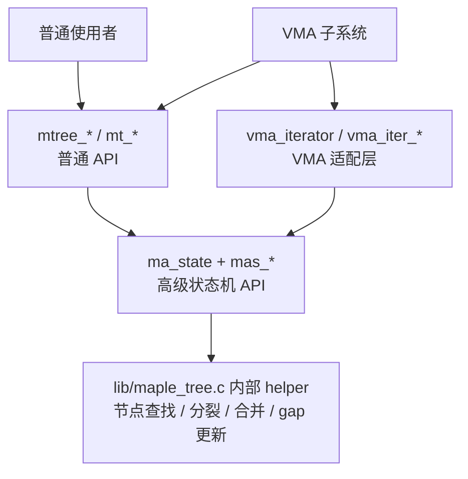

这里最容易误解的是：`mas_*()` 不是“比 `mtree_*()` 更底层所以普通人别看”。对于 VMA 来说，`mas_*()` 反而是主线，因为 VMA 修改常常是连续的、范围化的、需要复用 iterator 的。

例如 `vma_find()` 就不是直接调用 `mt_find()`，而是调用：

```c
static inline
struct vm_area_struct *vma_find(struct vma_iterator *vmi, unsigned long max)
{
	return mas_find(&vmi->mas, max - 1);
}
```

因为 `vma_iterator` 本身已经持有 `ma_state`，没必要每次都重新构造。

------

## 15.10_VMA_接入层_mm_struct.mm_mt

现在看 VMA 是怎么接入 Maple Tree 的。

源码位置：[include/linux/mm_types.h](../../../../research/source_reading/linux/include/linux/mm_types.h)

`struct mm_struct` 里直接包含：

```c
struct maple_tree mm_mt;
```

这表示每个进程地址空间有一棵 Maple Tree，用来索引这个进程的 VMA。

同一个文件里还有：

```c
#define MM_MT_FLAGS	(MT_FLAGS_ALLOC_RANGE | MT_FLAGS_LOCK_EXTERN | \
			 MT_FLAGS_USE_RCU)
```

这三个标志连起来看，VMA 这棵树的工程语义就很清楚：

```text
ALLOC_RANGE:
    mmap 需要找空洞，所以要使用带 gap 信息的 allocation range 能力。

LOCK_EXTERN:
    VMA 管理由 mmap_lock 等外部锁统筹，不只是 Maple Tree 自己一把锁。

USE_RCU:
    允许读侧在 RCU 语义下快速查找，配合 VMA 并发访问优化。
```

再看 `vma_iterator`：

```c
struct vma_iterator {
	struct ma_state mas;
};
```

它几乎就是 `ma_state` 的一层 VMA 语义包装。

初始化宏：

```c
#define VMA_ITERATOR(name, __mm, __addr)				\
	struct vma_iterator name = {					\
		.mas = {						\
			.tree = &(__mm)->mm_mt,				\
			.index = __addr,				\
			.node = NULL,					\
			.status = ma_start,				\
		},							\
	}
```

这段代码的中文语义是：

```text
创建一个 VMA iterator；
它背后的 Maple Tree 是当前 mm 的 mm_mt；
它从 __addr 这个地址开始；
它还没有进入树，所以 node = NULL，status = ma_start。
```

函数式初始化则是：

```c
static inline void vma_iter_init(struct vma_iterator *vmi,
		struct mm_struct *mm, unsigned long addr)
{
	mas_init(&vmi->mas, &mm->mm_mt, addr);
}
```

所以 VMA 层和 Maple Tree 层的关系非常薄：

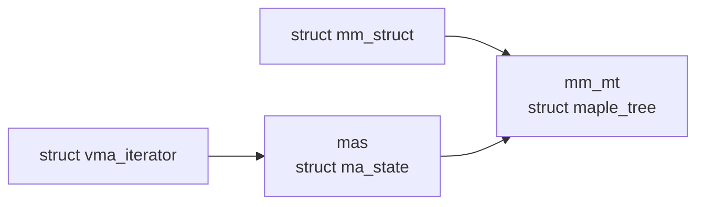

这种设计的好处是：VM 子系统可以把代码写成 `vma_next()`、`vma_prev()`、`vma_iter_bulk_store()` 这类有 VMA 语义的函数，而不是到处暴露 Maple Tree 的内部状态机细节。

------

## 15.11_VMA_封装函数_把半开区间翻译成_Maple_Tree_闭区间

源码位置：[include/linux/mm.h](../../../../research/source_reading/linux/include/linux/mm.h)

这一组函数是读 VMA 源码的必备入口。

```c
static inline
struct vm_area_struct *vma_find(struct vma_iterator *vmi, unsigned long max)
{
	return mas_find(&vmi->mas, max - 1);
}
```

注意 `max - 1`。

这说明 VMA 层传进来的 `max` 是半开区间右边界，而 `mas_find()` 需要闭区间最大值。

再看：

```c
static inline struct vm_area_struct *vma_next(struct vma_iterator *vmi)
{
	/*
	 * 使用 mas_find() 取得 iterator 开始位置上的第一个 VMA。
	 * 如果调用 mas_next()，可能会跳过第一个 entry。
	 */
	return mas_find(&vmi->mas, ULONG_MAX);
}
```

这个注释很值得停一下。

直觉上，“下一个 VMA”好像应该调用 `mas_next()`。但源码说不能这样，因为 iterator 刚开始时，当前位置本身可能就是第一个 VMA。如果直接 `mas_next()`，就可能把它跳过去。

所以 `vma_next()` 第一次也用 `mas_find()`。

其他几个封装：

```c
static inline
struct vm_area_struct *vma_iter_next_range(struct vma_iterator *vmi)
{
	return mas_next_range(&vmi->mas, ULONG_MAX);
}

static inline struct vm_area_struct *vma_prev(struct vma_iterator *vmi)
{
	return mas_prev(&vmi->mas, 0);
}

static inline int vma_iter_clear_gfp(struct vma_iterator *vmi,
			unsigned long start, unsigned long end, gfp_t gfp)
{
	__mas_set_range(&vmi->mas, start, end - 1);
	mas_store_gfp(&vmi->mas, NULL, gfp);
	if (unlikely(mas_is_err(&vmi->mas)))
		return -ENOMEM;

	return 0;
}

static inline int vma_iter_bulk_store(struct vma_iterator *vmi,
				      struct vm_area_struct *vma)
{
	vmi->mas.index = vma->vm_start;
	vmi->mas.last = vma->vm_end - 1;
	mas_store(&vmi->mas, vma);
	if (unlikely(mas_is_err(&vmi->mas)))
		return -ENOMEM;

	return 0;
}
```

可以看到 VMA 层反复做同一个转换：

```text
VMA:
    [start, end)

Maple Tree:
    [start, end - 1]
```

这不是细枝末节。munmap、mprotect、mremap 这类路径里，只要边界弄错 1，就可能造成：

```text
1. 少删最后一页；
2. 多删下一段 VMA 的第一页；
3. range intersection 判断错误；
4. gap search 返回不该返回的地址；
5. page fault 找到错误 VMA。
```

下面这张图把 VMA 封装函数按用途分开：

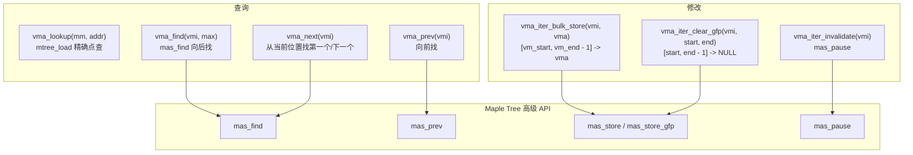

------

## 15.12_mmap.c_里的三个查找入口

VMA 相关源码里经常出现三个名字：

```text
vma_lookup()
find_vma()
find_vma_intersection()
```

它们不是同义词。

### 15.12.1_vma_lookup()_只查这个地址有没有_VMA

源码位置：[include/linux/mm.h](../../../../research/source_reading/linux/include/linux/mm.h)

```c
/*
 * vma_lookup() - 查找指定地址上的 VMA
 * @mm: 进程地址空间
 * @addr: 用户地址
 *
 * 返回：给定地址上的 vm_area_struct；如果没有则返回 NULL。
 */
static inline
struct vm_area_struct *vma_lookup(struct mm_struct *mm, unsigned long addr)
{
	return mtree_load(&mm->mm_mt, addr);
}
```

语义：

```text
addr 必须落在某个 VMA 范围内，才返回这个 VMA。
如果 addr 位于两个 VMA 之间的 gap，返回 NULL。
```

### 15.12.2_find_vma()_查这个地址_或者地址之后的第一个_VMA

源码位置：[mm/mmap.c](../../../../research/source_reading/linux/mm/mmap.c)

```c
/*
 * find_vma() - 查找给定地址上的 VMA，或者后面的下一个 VMA。
 * @mm: 要检查的 mm_struct
 * @addr: 地址
 *
 * 返回：与 addr 关联的 VMA，或者下一个 VMA。
 * 如果 addr 处以及 addr 之后都没有 VMA，则可能返回 NULL。
 */
struct vm_area_struct *find_vma(struct mm_struct *mm, unsigned long addr)
{
	unsigned long index = addr;

	mmap_assert_locked(mm);
	return mt_find(&mm->mm_mt, &index, ULONG_MAX);
}
```

语义：

```text
如果 addr 命中某个 VMA，返回它；
否则返回 addr 之后的第一个 VMA。
```

这和很多页表或内存布局检查有关，因为内核经常需要知道“当前位置附近的 VMA 顺序”。

### 15.12.3_find_vma_intersection()_查范围是否与_VMA_相交

源码位置：[mm/mmap.c](../../../../research/source_reading/linux/mm/mmap.c)

```c
/*
 * find_vma_intersection() - 查找第一个与区间相交的 VMA
 * @mm: 进程地址空间
 * @start_addr: 用户地址区间的包含式起点
 * @end_addr: 用户地址区间的排除式终点
 *
 * 返回：给定范围内的第一个 VMA；没有则返回 NULL。
 * 假设 start_addr < end_addr。
 */
struct vm_area_struct *find_vma_intersection(struct mm_struct *mm,
					     unsigned long start_addr,
					     unsigned long end_addr)
{
	unsigned long index = start_addr;

	mmap_assert_locked(mm);
	return mt_find(&mm->mm_mt, &index, end_addr - 1);
}
```

它和 `find_vma()` 的关键差别是上界：

```text
find_vma():
    max = ULONG_MAX

find_vma_intersection(start, end):
    max = end - 1
```

所以 `find_vma_intersection()` 只在指定范围内找，不会越过 `end_addr` 找到后面的 VMA。

下面用复杂例子对比三者。

```text
VMA:

A: [0x400000, 0x452000)
B: [0x600000, 0x610000)
C: [0x610000, 0x639000)
D: [0x639000, 0x660000)
```

查询：

| 调用 | 结果 | 原因 |
| --- | --- | --- |
| `vma_lookup(mm, 0x500000)` | `NULL` | `0x500000` 在 A 和 B 之间的 gap |
| `find_vma(mm, 0x500000)` | B | B 是 `0x500000` 之后第一个 VMA |
| `find_vma_intersection(mm, 0x500000, 0x580000)` | `NULL` | `[0x500000, 0x580000)` 范围内没有 VMA |
| `find_vma_intersection(mm, 0x500000, 0x601000)` | B | B 与该范围相交 |
| `vma_lookup(mm, 0x610000)` | C | `0x610000` 是 C 的起点，不属于 B |

图示：

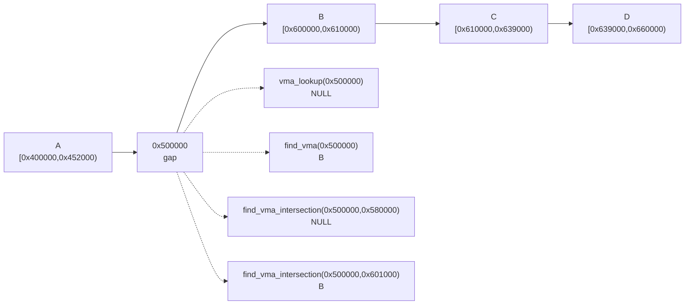

这也是 Maple Tree 比单纯 rbtree 更适合 VMA 的地方：这些范围查询和“找后继”的需求，不需要 VM 子系统自己维护一套链表缓存来兜底。

------

## 15.13_find_vma_prev()_为什么还要找_previous

`find_vma_prev()` 在 [mm/mmap.c](../../../../research/source_reading/linux/mm/mmap.c) 里：

```c
/*
 * find_vma_prev() - 查找给定地址上的 VMA，或者下一个 VMA，
 * 同时把前一个 VMA 写入 pprev。
 * @mm: 要检查的 mm_struct
 * @addr: 地址
 * @pprev: 用来接收前一个 VMA 的指针
 *
 * 注意这里缺少 RCU lock，因为使用的是外部 mmap_lock()。
 *
 * 返回：与 addr 关联的 VMA，或者下一个 VMA。
 * 如果 addr 处以及 addr 之后都没有 VMA，则可能返回 NULL。
 */
struct vm_area_struct *
find_vma_prev(struct mm_struct *mm, unsigned long addr,
			struct vm_area_struct **pprev)
{
	struct vm_area_struct *vma;
	VMA_ITERATOR(vmi, mm, addr);

	vma = vma_iter_load(&vmi);
	*pprev = vma_prev(&vmi);
	if (!vma)
		vma = vma_next(&vmi);
	return vma;
}
```

这个函数说明一件事：即使不再有全局 VMA 链表，VM 子系统仍然需要“前驱 / 后继”语义。

例如 mmap 新区域、扩展栈、合并 VMA 时，都需要看相邻 VMA：

```text
prev 是否能和新 VMA 合并？
next 是否能和新 VMA 合并？
prev 和 next 之间的 gap 是否够大？
addr 是否正好落在 prev 结束处？
```

复杂例子：

```text
prev: [0x0000000000600000, 0x0000000000610000)  rodata
vma : [0x0000000000610000, 0x0000000000639000)  data
next: [0x0000000000639000, 0x0000000000660000)  heap

addr = 0x0000000000618000
```

此时：

```text
vma_iter_load(&vmi) 命中 data；
vma_prev(&vmi) 返回 rodata；
函数返回 data，同时 pprev = rodata。
```

如果：

```text
addr = 0x0000000000500000
```

它位于 text 和 rodata 之间的 gap：

```text
vma_iter_load(&vmi) 返回 NULL；
vma_prev(&vmi) 返回 text；
vma_next(&vmi) 返回 rodata；
函数返回 rodata，同时 pprev = text。
```

图示：

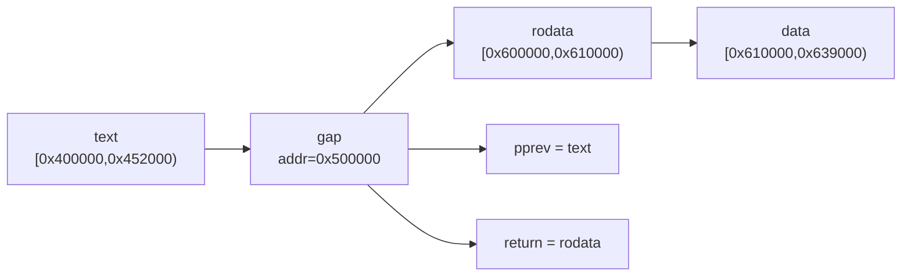

这类“同时拿到当前位置和前驱”的需求，就是 `vma_iterator` 封装存在的原因之一。

------

## 15.14_page_fault_unmap_free_pgtables_为什么也会碰_Maple_Tree

不要把 Maple Tree 只理解成 `mmap()` 时用的数据结构。

只要内核需要从虚拟地址找到 VMA，就会碰到它。

几个典型路径：

| 路径 | 为什么需要 VMA |
| --- | --- |
| page fault | fault 地址是否合法？权限是否允许？是匿名页、文件映射、栈增长还是特殊映射？ |
| `munmap()` | 删除范围内有哪些 VMA？是否要拆分边界 VMA？ |
| `mprotect()` | 修改权限的范围覆盖哪些 VMA？是否需要拆分、合并？ |
| `free_pgtables()` | 释放页表时需要按 VMA 边界遍历 |
| `unmap_vmas()` | 解除映射时要逐段处理 VMA |

[mm/memory.c](../../../../research/source_reading/linux/mm/memory.c) 里可以看到 `free_pgtables()` 和 `unmap_vmas()` 都接收 `struct ma_state *mas`：

```c
void free_pgtables(struct mmu_gather *tlb, struct ma_state *mas,
		   struct vm_area_struct *vma, unsigned long floor,
		   unsigned long ceiling, bool mm_wr_locked)
```

以及：

```c
void unmap_vmas(struct mmu_gather *tlb, struct ma_state *mas,
		struct vm_area_struct *vma, unsigned long start_addr,
		unsigned long end_addr, unsigned long tree_end,
		bool mm_wr_locked)
```

这说明 memory 管理路径不是只拿一个 `vma` 就完事，而是经常拿着 `ma_state` 继续往后遍历。

一个典型的 unmap 场景：

```text
用户调用：
munmap(0x00007f1000100000, 0x00600000)

覆盖范围：
[0x00007f1000100000, 0x00007f1000700000)

已有 VMA：
E: [0x00007f1000000000, 0x00007f1000200000)
F: [0x00007f1000200000, 0x00007f1000240000)
G: [0x00007f1000600000, 0x00007f1000800000)
```

这不是简单删除三个节点，而是：

```text
E 左半段保留，右半段被删；
F 整段被删；
G 左半段被删，右半段保留。
```

也就是说，VM 子系统需要：

```text
1. 找到第一个相交 VMA；
2. 沿 Maple Tree 继续遍历相交范围；
3. 必要时拆分边界 VMA；
4. 把删除范围从 mm_mt 中清掉；
5. 继续处理页表、反向映射、TLB gather 等工作。
```

图示：

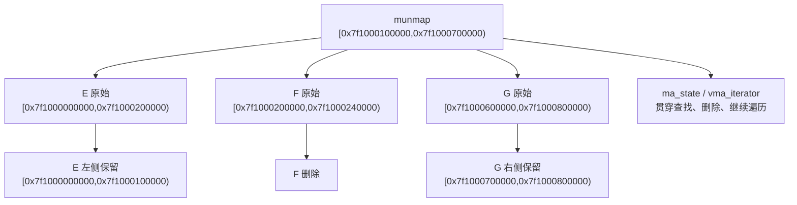

这就是后续读 `do_vmi_munmap()`、`do_vmi_align_munmap()` 时必须带着 `ma_state` 视角的原因。

------

## 15.15_ma_state_和_VMA_iterator_的一张总图

把前面的内容合并，可以得到下面这张源码调用地图。

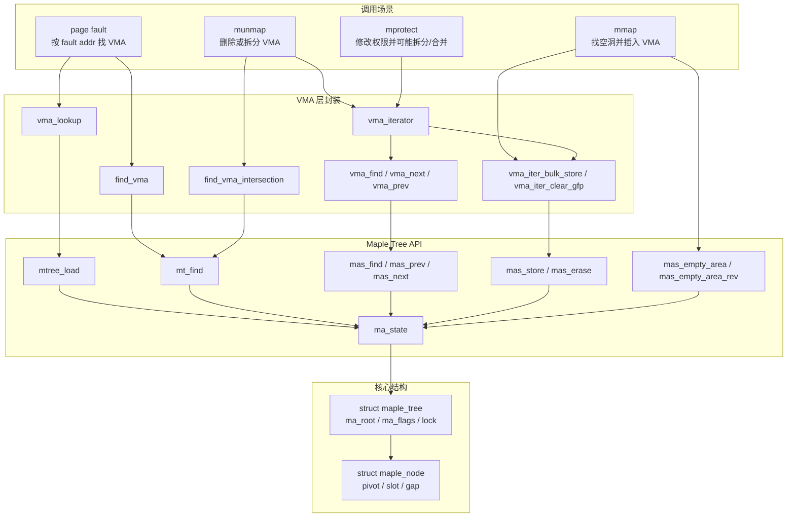

这张图里最重要的关系是：

```text
VMA 不是绕过 Maple Tree API 直接操作节点。
VMA 主要通过 vma_iterator / vma_iter_* 把 VMA 半开区间翻译成 Maple Tree 闭区间，
然后交给 ma_state / mas_* 状态机。
```

------

## 15.16_这一章没有展开的内容

本章只是源码结构和 API 分层，不展开这些细节：

```text
1. mas_store() 如何判断写入类型；
2. 节点满了之后如何 split；
3. 删除后如何合并或再平衡；
4. gap[] 如何更新；
5. RCU 模式下删除节点如何延迟释放；
6. 预分配节点链 maple_alloc 如何服务复杂写路径；
7. do_vmi_munmap() 如何拆 VMA、清 Maple Tree、释放页表；
8. mmap 找空洞时 bottom-up / top-down 分别如何调用 mas_empty_area。
```

这些内容如果塞进同一章，文件会再次膨胀，而且阅读顺序会变差。

更合理的拆法是：

| 后续章节 | 建议主题 | 核心问题 |
| --- | --- | --- |
| 第 16 章 | Maple Tree 查找路径：`mtree_load()`、`mt_find()`、`mas_find()` | 点查找、后继查找、范围遍历到底怎么走节点 |
| 第 17 章 | Maple Tree 写入路径：`mas_store()`、节点分裂与范围覆盖 | 插入、替换、覆盖、删除 NULL entry 如何影响树结构 |
| 第 18 章 | Maple Tree gap search：`mas_empty_area()` 与 mmap 地址选择 | mmap 如何找空洞，`gap[]` 如何避免线性扫描 |
| 第 19 章 | VMA 修改源码：`mmap()`、`munmap()`、`mprotect()` | VM 子系统如何用 iterator 串起查找、拆分、合并、删除 |

这样拆的好处是：

```text
第 15 章先让你知道“有哪些门”；
第 16 章专门讲“怎么查”；
第 17 章专门讲“怎么写”；
第 18 章专门讲“怎么找空洞”；
第 19 章再回到 VMA 场景，看 mmap/munmap/mprotect 如何组合这些能力。
```

------

## 15.17_本章小结

本章先把 Maple Tree 源码阅读的入口搭起来了。

几个结论要记住：

1. `struct maple_tree` 是树对象，核心字段是 `ma_root`、`ma_flags` 和锁语义。
2. `struct maple_node` 是多路节点，不是二叉节点；64 位下 range 节点和 allocation range 节点容量不同。
3. `pivot[]` 是范围边界，不是普通 B-Tree 里“唯一 key”的完全等价物；同下标 pivot 是 slot 的包含式上界。
4. `ma_state` 是高级 API 的状态机，保存当前树、操作范围、节点位置、隐含边界、状态和预分配节点。
5. `mtree_*()` / `mt_*()` 是普通接口，常常内部创建 `ma_state` 再转给 `mas_*()`。
6. VMA 层主要通过 `vma_iterator` 包装 `ma_state`，把 `[vm_start, vm_end)` 翻译成 `[vm_start, vm_end - 1]`。
7. `vma_lookup()` 是精确点查找，`find_vma()` 是“当前或后继”查找，`find_vma_intersection()` 是范围相交查找。
8. 后面继续读源码时，不要把 Maple Tree 当成“带更多孩子的红黑树”；它的核心是范围、状态机、gap 信息和工程并发语义。

到这里，源码地图已经有了。下一章就可以开始专门拆查找路径：从 `mtree_load()` 到 `mas_walk()`，再到节点里的 `pivot[]` / `slot[]` 如何决定下降方向。
