# 第15章\_Linux\_6.12\_Maple\_Tree\_源码结构与\_API\_分层

P14 用 G、H 两段 VMA 说明：地址命中、向后找对象和查找相交范围是不同的问题。P13 又说明多路节点只是承载方式，不能由树名推断对象位置和并发保证。现在进入固定版本，追问这些范围在哪里保存、调用者维护什么状态、返回对象能用多久。

本章有三层参与者：地址空间拥有共享 mm_mt，Maple 管理内部节点，调用方用 ma_state 或 vma_iterator 保存一次操作的游标。VMA 是被索引的独立对象。先区分这些所有者，再阅读普通接口、高级接口和 VMA 封装，才能判断某个字段属于树、当前操作，还是业务对象。

证据统一进入[Maple 源码阅读索引](../../../../research/source_reading/maple_tree/navigation/P01_Linux_6.12_Maple范围源码阅读索引.md#1.2_按读者问题进入证据)：NXP 官方 linux-imx，Linux 6.12.20，标签 lf-6.12.20-2.0.0，固定提交 dfaf2136deb2af2e60b994421281ba42f1c087e0。本文不以本地实验提交解释内核行为。正文建立职责和因果关系，具体宏、字段与函数体沿上游路径进入唯一实现标题；仓库补充的中文说明与上游原文分别标识。

## 15.1\_本章涉及的源码文件

面对“查一个地址”的任务，先不从几千行算法开头顺读。由调用者一路向内追踪：VMA 封装选择查询契约，普通或高级 API 进入共享树，节点编码与游标决定如何下行。遇到初始化或释放问题时，再回到树建立与退出的调用环境。

| 上游位置 | 带着什么问题阅读 |
| --- | --- |
| [Documentation/core-api/maple_tree.rst](../../../../research/source_reading/linux/Documentation/core-api/maple_tree.rst) | 存储的范围、空洞模式、普通/高级 API 和调用者锁责任是什么 |
| [include/linux/maple_tree.h](../../../../research/source_reading/linux/include/linux/maple_tree.h) | 共享根、节点类型、操作状态和模式位保存在哪里 |
| [lib/maple_tree.c](../../../../research/source_reading/linux/lib/maple_tree.c) | 怎样读取、写入、查空洞，以及管理节点资源 |
| [include/linux/mm_types.h](../../../../research/source_reading/linux/include/linux/mm_types.h) | mm_mt 属于哪个 mm，vma_iterator 封装什么 |
| [include/linux/mm.h](../../../../research/source_reading/linux/include/linux/mm.h) | VMA 封装怎样选择查询语义、翻译半开端点 |
| [mm/mmap.c](../../../../research/source_reading/linux/mm/mmap.c) | 查找、映射和退出过程怎样组织范围容器与锁 |
| [mm/memory.c](../../../../research/source_reading/linux/mm/memory.c) | 缺页、解除映射和页表释放为什么需要定位 VMA |
| kernel/fork.c | mm_init 怎样初始化 mm_mt 并登记外部 mmap_lock；固定 blob 见源码基线 |

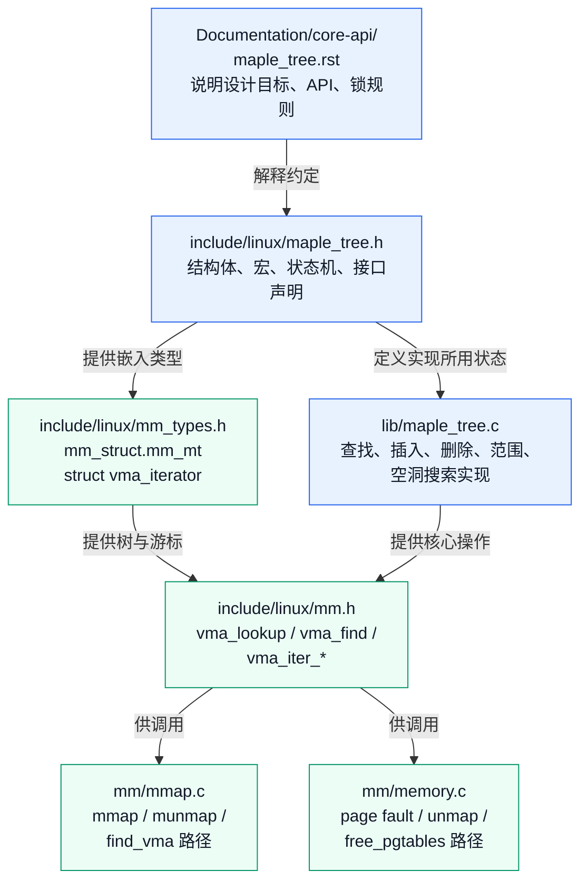
```mermaid
flowchart TD
    DOC["Documentation/core-api/<br/>maple_tree.rst<br/>说明设计目标、API、锁规则"]
    H["include/linux/maple_tree.h<br/>结构体、宏、状态机、接口声明"]
    C["lib/maple_tree.c<br/>查找、插入、删除、范围、<br/>空洞搜索实现"]

    MMT["include/linux/mm_types.h<br/>mm_struct.mm_mt<br/>struct vma_iterator"]
    MMH["include/linux/mm.h<br/>vma_lookup / vma_find /<br/> vma_iter_*"]
    MMAP["mm/mmap.c<br/>mmap / munmap / <br/>find_vma 路径"]
    MEM["mm/memory.c<br/>page fault / unmap / <br/>free_pgtables 路径"]

    DOC -->|解释约定| H
    H -->|定义实现所用状态| C
    H -->|提供嵌入类型| MMT
    MMT -->|提供树与游标| MMH
    MMH -->|供调用| MMAP
    MMH -->|供调用| MEM
    C -->|提供核心操作| MMH

    classDef core fill:#e8f2ff,stroke:#2563eb,color:#111827;
    classDef mm fill:#ecfdf5,stroke:#059669,color:#111827;
    class DOC,H,C core;
    class MMT,MMH,MMAP,MEM mm;
```

这张文件图中的连线表示阅读和使用关系，不代表这些文件中的所有函数都在一次查找中执行。算法路线先读官方契约，再读头文件状态与核心算法；VMA 路线先看 mm 的所有权和封装，再追具体调用点。两条路线在 Maple API 汇合，而不是彼此独立的两套范围树。

本章随后将依次回答根、节点、编码、游标、接口与 VMA 调用的问题。当前前三节的对应实现入口是[树模式与初始化导读](../../../../research/source_reading/maple_tree/navigation/P03_树对象与模式选择.md#3.2_从未发布到受保护使用)，先把外层的读写责任建立起来。

## 15.2\_从官方文档先抓住\_Maple\_Tree\_的语义

Maple Tree 为非重叠范围提供索引。这里的“非重叠”约束的是同一位置最终对应的映射，**不表示所有重叠写入都会失败**。普通 store 可以覆盖已有映射；要求目标全为空再接入时，应选择 insert 类接口并处理其失败。具体更新分支稍后再读，本节先限定数据模型。

红黑树通常由调用方比较业务键，从一条键找到一个对象；Maple 则把索引范围直接纳入接口，可以用 `[start,last] → entry` 表示。一个 entry 可以是 VMA 指针，也可以是其他允许的值，Maple 不是只为 VMA 定义的结构。查询得到 VMA 仍不等于已经找到物理页，也不等于已获准访问相应内存。

VMA 使用半开范围 `[vm_start,vm_end)`；<span style="color:red;">Maple Tree 内部使用的是闭区间</span>。对于已确认非空且端点合法的 VMA，写入范围是 `[vm_start,vm_end-1]`。例如 `[0x400000,0x452000)` 对应 `[0x400000,0x451fff]`：0x451fff 属于这段，0x452000 不属于。

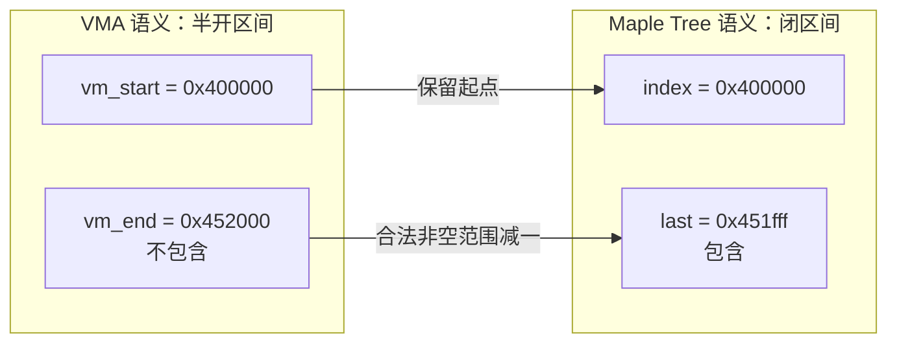
```mermaid
flowchart LR
    subgraph VMA["VMA 语义：半开区间"]
        A["vm_start = 0x400000"]
        B["vm_end = 0x452000<br/>不包含"]
    end

    subgraph MT["Maple Tree 语义：闭区间"]
        C["index = 0x400000"]
        D["last = 0x451fff<br/>包含"]
    end

    A -->|保留起点| C
    B -->|合法非空范围减一| D
```

减一的前提必须放在动作之前。空半开范围没有最后一个元素，end 为 0 时无符号减一会回绕；反过来，Maple 允许的闭上界 ULONG_MAX 也不能无条件加一转换。VMA 封装依赖调用方提供合法边界，不能把接口中的 end−1 当成输入合法性检查。

| 层次 | 典型入口 | 谁负责什么 |
| --- | --- | --- |
| 普通接口 | mtree_load、mtree_store_range、mtree_erase、mt_find | 封装常见查询和修改，按约定管理内部操作状态及相应同步；返回对象的后续保护仍属调用者 |
| 高级接口 | MA_STATE、mas_walk、mas_store、mas_find、mas_empty_area、mas_pause | 调用者持有 ma_state、选择有效锁或 RCU 读侧条件、处理状态和资源边界 |
| VMA 接入 | vma_lookup、vma_find、vma_next、vma_iter_* | 选择地址空间的树，把 VMA 问题和半开范围翻译为 Maple 操作 |

高级接口需要承担更多责任，不是默认“越高级越应该用”。一次简单点查可以使用普通接口；要在同一保护范围内连续走多个对象、预分配节点，或在批量修改之间保留游标时，显式状态才有价值。普通与高级操作可以组合，但锁契约必须相容，不能把普通修改函数再套进同一把不可重入内部锁而不查它是否自行加锁。

P14 的 mmap 空洞、mprotect 切分、munmap 删除以及缺页定位，使 VMA 接入需要这些不同能力。RCU 模式允许树在特定条件下支持读写并发，写者仍须串行化；游标、内部节点寿命和 VMA 属性保护各自有责任。普通查询内部的一段 RCU 读侧不会给返回对象自动增加长期引用，相关说明见[返回指针期限](../../../../research/source_reading/maple_tree/navigation/P02_范围契约与查询入口.md#2.4_返回指针的使用期限)。

可以回到[P14 完整 C++ 区间程序](P14_Maple_Tree_与_VMA_管理.md#14.9.3_运行G与H的区间模型)，先预测查询 G 的末地址、排除终点和 G 前空洞各自得到什么，再运行对照。该程序验证范围契约，不运行 Maple API，也不测试 RCU；下一步要把已经明确的契约落到树对象，而不是用宿主容器替换源码证据。

## 15.3\_struct\_maple\_tree\_树对象本身

如果一个查询者临时建立游标就拥有一整棵新树，另一个查询者便看不到同一个地址空间的变化。实际设计把共享索引放在 mm_struct.mm_mt 中，把当前操作的位置留在调用方状态里。多个线程可以共享同一个 mm；因此这里是每个地址空间的索引，不能按线程数量数树。

固定[maple_tree 定义](../../../../research/source_reading/maple_tree/source_explanations/include/linux/maple_tree.h.md#1.2_共享树字段与模式位)有三组职责：

| 位置 | 保存的状态 | 写入和使用责任 |
| --- | --- | --- |
| ma_root | 空、index 0 的直接 entry 或编码节点入口 | 初始化建立空根，树操作更新；查询按表示分支读取，不能总是强转节点 |
| ma_flags | 创建模式、锁选择、高度和 RCU 模式等位域 | 初始化确定基础模式，适当保护下的专用路径更新动态状态；不同读写路径读取相应掩码 |
| ma_lock / ma_external_lock | 内部自旋锁或外部锁的 lockdep 描述 | 内部锁由树使用；外部锁由调用者真正持有，描述信息只供锁依赖检查 |

先看根的小树优化。只在 **索引 0 上的一项** 可直接保存在根的条件下，才省去节点；不是“任意地方只存一个对象都可直接放根”。固定头说明低两位为 10 的 entry 不使用这种根直存，而允许的其他形式可直存。更大范围或其他布局需要节点。根中的编码不等于业务指针，稍后的编码节会分别讨论根、父指针与操作状态。

再看锁。ma_lock 和 ma_external_lock 是 union 的不同使用方式；选择外部锁后，不能继续把该存储当作已经初始化的内部自旋锁。[mt_init_flags](../../../../research/source_reading/maple_tree/source_explanations/include/linux/maple_tree.h.md#1.3_初始化先选择锁模式再建立空根)先写模式，只在内部锁模式下初始化自旋锁，然后建立空根。它不会分配 Maple 节点，不会建立 VMA，也不是清理活跃树后重新开始的销毁函数。

MM_MT_FLAGS 选择的三项能力见[唯一宏定义](../../../../research/source_reading/maple_tree/source_explanations/include/linux/mm_types.h.md#1.2_VMA树的三项模式)。下表为便于比较省略共同的 MT_FLAGS_ 前缀；三者都是 ma_flags 中的模式常量，回答不同问题：

| 模式 | 为什么需要 | 额外责任或成本 |
| --- | --- | --- |
| ALLOC_RANGE | mmap 等路径需要寻找足够大的空洞 | 节点增加空洞汇总信息，相应减少部分布局容量，并在更新时维护摘要 |
| LOCK_EXTERN | 地址空间操作还需统筹 VMA 属性和其他状态 | 调用者持有相应 mmap 锁；仅声明外部锁不会自动串行化写者 |
| USE_RCU | 内部树节点须满足允许的并发读侧访问 | 更新和退休节点路径遵守 RCU 模式；业务对象期限还需自己的协议 |

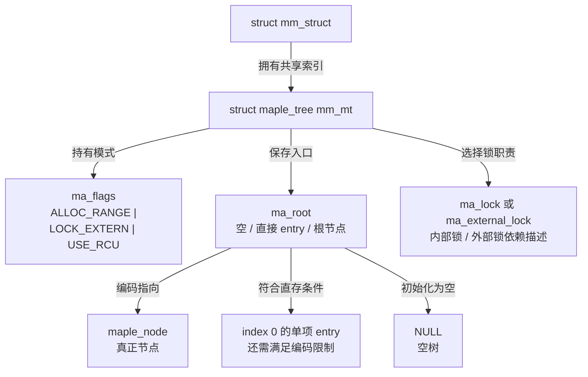
```mermaid
flowchart TD
    MM["struct mm_struct"]
    MT["struct maple_tree mm_mt"]
    FLAGS["ma_flags<br/>ALLOC_RANGE |<br/>LOCK_EXTERN | USE_RCU"]
    ROOT["ma_root<br/>空 / 直接 entry / 根节点"]
    LOCK["ma_lock 或 ma_external_lock<br/>内部锁 / 外部锁依赖描述"]

    MM -->|拥有共享索引| MT
    MT -->|持有模式| FLAGS
    MT -->|保存入口| ROOT
    MT -->|选择锁职责| LOCK

    ROOT -->|编码指向| N0["maple_node<br/>真正节点"]
    ROOT -->|符合直存条件| E0["index 0 的单项 entry<br/>还需满足编码限制"]
    ROOT -->|初始化为空| NULL["NULL<br/>空树"]
```

图中的 ma_external_lock 是锁依赖描述，不是锁定动作。固定 kernel/fork.c 的 mm_init 先用 MM_MT_FLAGS 初始化 mm_mt，再关联 mmap_lock 的描述；[mt_set_external_lock](../../../../research/source_reading/maple_tree/source_explanations/include/linux/maple_tree.h.md#1.4_外部锁登记不是取得锁)在锁依赖检查配置 CONFIG_LOCKDEP 关闭时没有这项登记工作，也不会因此取消实际的外部持锁要求。

最后看容易混淆的 RCU 模式。头文件的历史注释提到了为单用户复用节点而引入模式选择；不能把它缩写成“开 USE_RCU 就可立即复用”。固定[mas_free 分支](../../../../research/source_reading/maple_tree/source_explanations/lib/maple_tree.c.md#1.2_退休节点根据模式选择去向)实际是：RCU 模式交给 ma_free_rcu，非 RCU 模式推回当前 ma_state 的节点资源池。内部节点可复用与某个 VMA 对象可释放仍是两个问题。

[mt_clear_in_rcu 与 mt_set_in_rcu](../../../../research/source_reading/maple_tree/source_explanations/include/linux/maple_tree.h.md#1.5_RCU模式读写不代替生命周期协议)维护模式位及相应锁约定，没有调用 synchronize_rcu。持有写锁只排除了由这把锁串行化的参与者，不能单凭它证明所有无锁读者都已离开。固定 exit_mmap 在地址空间退出这一更大生命周期下清除模式；不能把那一行拿到仍可被并发访问的树上当作通用优化。

回到与 rbtree 的比较：后者通常把 rb_node 嵌入业务对象，比较键由调用者定义；Maple 管理内部范围节点，entry 指向独立对象，index/range 由接口传入。两者都需要清楚的对象保护，但不能把 rbtree 的“摘节点”直接套成 Maple 的“对象立刻死亡”。VMA 按地址索引无需为这项职责继续内嵌 rb_node，也不代表 VMA 的所有其他索引关系都消失。

到这里可以回答三个检查题：一个非零索引上的单项为什么不能直接按根 entry 读取；登记外部锁后，哪个参与者实际取得它；模式清零为什么不等于完成宽限期。答案分别来自根表示条件、调用者同步责任和模式函数没有等待动作。下一节继续看节点如何装下多个范围，以及为了记录空洞付出了多少槽位空间。

------

## 15.4\_struct\_maple\_node\_真正装\_pivot\_和\_slot\_的节点

共享根建立后，下一步是解释一个节点怎样划分地址、空洞在哪里、类型和构建条件怎样限制容量。这个问题已经拆为完整的[P38 节点与空洞](P38_Maple节点中的范围与空洞.md#38.1_从一个共享根继续向下)，保留原七个 VMA 的全部边界和间隔，并用 C++ 分区程序观察包含式 pivot。

阅读顺序是：先补齐 VMA 之间的 NULL 槽，再区分叶 entry 与非叶孩子入口；由找洞请求推导 gap 摘要的收益与维护责任，最后核对 32/64 位构建条件、union 和元数据的实际存储。具体定义只在[固定节点布局](../../../../research/source_reading/maple_tree/source_explanations/include/linux/maple_tree.h.md#1.6_构建条件决定数组容量)展开，原图中遗漏空洞的关系已在新单元修正。

完成 P38 后回到下一节，继续判断一个编码地址到底包含哪种信息。不要由 _64 名字推断 unsigned long 的宽度，也不要把数组容量当作每个节点的有效孩子数。

------

## 15.5\_指针低位编码\_Maple\_Tree\_的\_隐形字段

P38 说明了节点怎样组织范围。现在沿父子关系前进一步：如果一个 slot 保存的数值不是裸地址，读者凭什么知道该去掉哪些位？答案不是对所有 Maple 指针统一清低八位，而是先确认 **这个值存在哪个字段、表达哪种关系**。

节点容器按 256 字节对齐，为其地址留下低八位空间。但根节点的 parent 指向 maple_tree 对象，这个树对象并不因此也保证 256 字节对齐；叶 entry 指向的 VMA 更不是 Maple 节点。相同整数掩码作用到不同字段上，会改变完全不同的信息。

### 15.5.1\_编码节点与父指针是两套格式

固定[编码常量与节点入口](../../../../research/source_reading/maple_tree/source_explanations/lib/maple_tree.c.md#1.4_编码节点保存类型而不是父槽)中，mt_mk_node 把节点地址与类型放到一起；mte_node_type 从位 3～6 取类型，mte_to_node 清 MAPLE_NODE_MASK 所覆盖的低八位恢复节点地址。这些操作的前提是输入本来就是合法的编码节点，不是拿一个整数清位便证明地址可访问。

用整数 0x1000 表示已对齐的节点地址，type 为 2 时，构造结果是 `0x1000 | (2 << 3) | 4 = 0x1014`。其中 4 是构造函数加入的 MAPLE_ENODE_NULL 位，不属于地址；仅观察这个初始化位也不能代替真实空洞搜索或证明所有更新路径的摘要维护。根入口另外通过 mte_mk_root 加上 0x02，mte_safe_root 只撤掉这一根入口标记，**没有恢复裸节点地址**。

再看节点的 parent 字段。在本版本 range/arange 的非根父关系中，低位保存的是父关系格式与孩子在父里的槽号，而不是该孩子自身的 enum maple_type。具体写入见[mas_set_parent](../../../../research/source_reading/maple_tree/source_explanations/lib/maple_tree.c.md#1.5_父关系编码与根例外)。父地址同为 0x1000，槽号为 17 时，得到 `0x1000 | (17 << 3) | 6 = 0x108e`；取槽号应使用父槽掩码与位移，不能调用节点类型解码后解释成“第几个孩子”。

这里有一个需要按实际代码判断的版本细节：固定 maple_tree.h 的较早注释仍把部分父槽说成四位，lib/maple_tree.c 的实际 SLOT_MASK 是 0xF8，覆盖位 3～7，共五位，足以编码普通 ARM32 范围节点的 32 个槽号。正文以实际掩码与写入函数为依据，不把两个注释悄悄合并成同一种格式；16-bit 历史格式的常量也不表示当前四种节点类型都按它写入。

### 15.5.2\_根父关系不能套用节点地址掩码

根节点没有父 Maple 节点。它的 parent 以 bit 0 标识根，其余部分关联树对象；ma_is_root 读取的是这个 parent 低位。它与 ma_root 中标识“根内容为节点”的 bit 1 属于 **不同存储字段**，不能因都叫 root 就用同一测试。

假设树对象的抽象地址为 0x1232，只要求低一位可用，根 parent 可表示为 0x1233。去掉 bit 0 得到 0x1232；错误地清低八位则得到 0x1200，已经丢掉树对象地址的一部分。mte_parent 的普通父节点解码不能在未排除根关系时机械套用。

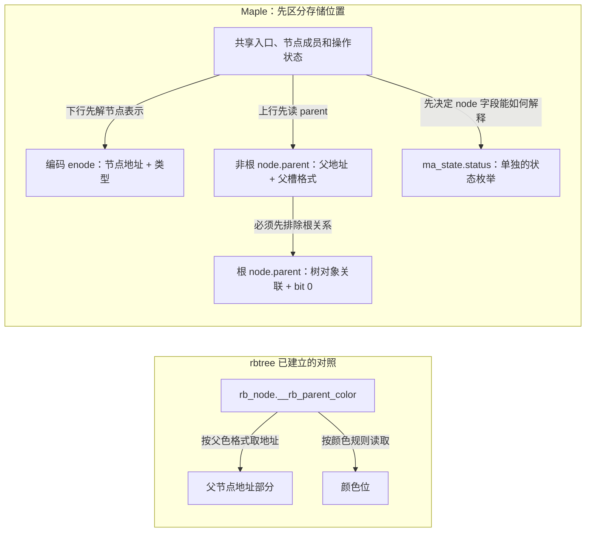
```mermaid
flowchart LR
    subgraph RB["rbtree 已建立的对照"]
        RB0["rb_node.__rb_parent_color"]
        RB1["父节点地址部分"]
        RB2["颜色位"]
        RB0 -->|按父色格式取地址| RB1
        RB0 -->|按颜色规则读取| RB2
    end
    subgraph MT["Maple：先区分存储位置"]
        MT0["共享入口、节点成员和操作状态"]
        MT1["编码 enode：节点地址 + 类型"]
        MT2["非根 node.parent：父地址 + 父槽格式"]
        MT3["根 node.parent：树对象关联 + bit 0"]
        MT4["ma_state.status：单独的状态枚举"]
        MT0 -->|下行先解节点表示| MT1
        MT0 -->|上行先读 parent| MT2
        MT2 -->|必须先排除根关系| MT3
        MT0 -->|先决定 node 字段能如何解释| MT4
    end
```

这保留了与 rbtree 的比较，却不再把 maple_enode、ma_root、entry 和状态画成一个混合的编码箱子。解码是对已有契约的解释，不能替代节点是否仍存活、调用者是否持有保护的检查。

### 15.5.3\_用户entry与错误状态分别判断

叶 entry 属于用户数据。Maple 的普通保留值检查[mt_is_reserved](../../../../research/source_reading/maple_tree/source_explanations/lib/maple_tree.c.md#1.6_保留entry与操作错误分别判断)要求同时满足“值小于 4096”和“低两位为 10”，例如 2、6、10 到 4094。4098 虽然低两位相同，却不属于这个 **小值保留区**；这不保证它适合所有接口、更不证明它是有效对象指针。

需要保存小整数时，官方文档建议使用 XArray 的 value 编码。固定[xa_mk_value/xa_to_value](../../../../research/source_reading/maple_tree/source_explanations/include/linux/xarray.h.md#1.2_整数值使用低位标记并限制有效位宽)把有效值左移一位并置低位，再右移还原；容量是 BITS_PER_LONG−1 位，不能把全 unsigned long 值域无损塞入。高位越界的 WARN_ON 不是拒绝返回，调用者必须满足输入边界。VMA entry 使用对象指针，但其有效性与使用期限仍要按 VM 协议判断。

操作错误又是另一层。固定[MA_ERROR 与 mas_is_err](../../../../research/source_reading/maple_tree/source_explanations/include/linux/maple_tree.h.md#1.9_错误载荷与独立状态)表明：错误号先转 unsigned long，再左移两位并置 2，载荷写入 mas->node；mas_set_err 还把 **单独的 mas->status 设为 ma_error**。mas_is_err 实际检查 status，并不靠扫描任意叶 entry 的位形来自动判错。

因此不要把 start、none、pause 全说成“ma_state.node 里的特殊指针值”。在这个版本，它们主要由独立状态枚举表达；只有先读对 status，才能知道 node 当前能否按编码节点使用。头文件关于 errno 的旧注释写过移位方向和混淆风险，当前证据应以 MA_ERROR 和实际状态检查函数为准，也不能写成对有符号负数直接左移。

### 15.5.4\_用定宽整数观察错误掩码

下面的完整 C11 程序只计算整数，不将编码值转换成宿主指针。它分别实现当前节点、range/arange 父槽和根父关联的算术形状；32/64 是模型位宽，不声称 Windows 的 unsigned long 或真实目标指针具有同一布局。状态转换和 RCU 不在该模型中。

```c
// SPDX-License-Identifier: MIT
#include <assert.h>
#include <inttypes.h>
#include <stdbool.h>
#include <stdint.h>
#include <stdio.h>

/* 只观察定宽整数，不构造或解引用宿主指针。 */
static uint64_t width_mask(unsigned width)
{
    assert(width == 32 || width == 64);
    return width == 32 ? UINT32_MAX : UINT64_MAX;
}

static bool node_word(uint64_t base, unsigned type, unsigned width, uint64_t *out)
{
    if (base > width_mask(width) || (base & 255) || type > 3)
        return false;
    *out = base | ((uint64_t)type << 3) | 4;
    return true;
}

static bool parent_word(uint64_t base, unsigned slot, unsigned width, uint64_t *out)
{
    if (base > width_mask(width) || (base & 255) || slot > 31)
        return false;
    /* 仅覆盖固定实现中 range/arange 的父槽格式。 */
    *out = base | ((uint64_t)slot << 3) | 6;
    return true;
}

static bool root_parent_word(uint64_t tree, unsigned width, uint64_t *out)
{
    if (tree > width_mask(width) || (tree & 1))
        return false;
    *out = tree | 1;
    return true;
}

static bool reserved_entry(uint64_t entry)
{
    return entry < 4096 && (entry & 3) == 2;
}

static uint64_t error_word(int error, unsigned width)
{
    assert(error < 0);
    /* 先转无符号再移位，最后保留目标位宽，避免有符号负数左移。 */
    return (((uint64_t)(int64_t)error << 2) | 2) & width_mask(width);
}

int main(void)
{
    uint64_t enode, parent, root_parent;
    assert(node_word(0x1000,2,32,&enode));
    assert(parent_word(0x1000,17,32,&parent));
    assert(root_parent_word(0x1232,32,&root_parent));
    printf("enode=0x%" PRIx64 " type=%" PRIu64 "\n", enode, (enode >> 3) & 15);
    printf("parent=0x%" PRIx64 " slot=%" PRIu64 "\n", parent, (parent & 248) >> 3);
    printf("root parent=0x%" PRIx64 " tree=0x%" PRIx64 " wrong mask=0x%" PRIx64 "\n",
           root_parent, root_parent & ~UINT64_C(1), root_parent & ~UINT64_C(255));
    assert((enode & ~UINT64_C(255)) == 0x1000);
    assert((parent & ~UINT64_C(255)) == 0x1000);
    assert((root_parent & ~UINT64_C(1)) == 0x1232);
    assert(reserved_entry(6) && !reserved_entry(4098));
    assert(!node_word(0x1232,2,32,&enode));
    assert(!parent_word(0x1000,32,32,&parent));
    assert(!root_parent_word(0x1233,32,&root_parent));
    printf("error -12: word32=0x%" PRIx64 " word64=0x%" PRIx64 "\n",
           error_word(-12,32),error_word(-12,64));
    unsigned checks=0;
    for(unsigned width=32;width<=64;width+=32) {
        for(uint64_t base=0;base<65536;base+=256) {
            for(unsigned type=0;type<4;++type) {
                assert(node_word(base,type,width,&enode));
                assert((enode & ~UINT64_C(255))==base && ((enode>>3)&15)==type);
                ++checks;
            }
            for(unsigned slot=0;slot<32;++slot) {
                assert(parent_word(base,slot,width,&parent));
                assert((parent & ~UINT64_C(255))==base && ((parent&248)>>3)==slot);
                ++checks;
            }
        }
        uint64_t last_aligned=width_mask(width) & ~UINT64_C(255);
        assert(node_word(last_aligned,3,width,&enode));
        assert((enode & ~UINT64_C(255))==last_aligned);
    }
    printf("node/parent round trips: %u\n",checks);
    return 0;
}
```

材料为[maple_encoded_words.c](../../../../labs/kernel/tree_basics/materials/maple_encoded_words.c)。保持断言启用，从仓库根目录运行：

```bash
cc -std=c11 -O2 -Wall -Wextra -Werror \
  labs/kernel/tree_basics/materials/maple_encoded_words.c -o /tmp/maple_encoded_words
/tmp/maple_encoded_words
```

输出应包含：

```text
enode=0x1014 type=2
parent=0x108e slot=17
root parent=0x1233 tree=0x1232 wrong mask=0x1200
error -12: word32=0xffffffd2 word64=0xffffffffffffffd2
node/parent round trips: 18432
```

先解释每一行属于哪个字段，再做三个修改：将父槽改为 31 与 32，观察容量边界；把根树对象地址改为另一个偶数但非 256 对齐值，判断两种掩码；将 -12 的错误载荷误当节点清位，说明得到一个整数为什么不等于得到可解引用的对象。最后一个实验只在纸上或整数模型里进行，不构造虚假的 C 指针访问。

本单元已经把相同低位位置上的不同职责分开。下一节继续追踪 ma_state 的 index、last、offset 和 status 怎样随一次查询变化，而不是再把这些状态压回一个指针比喻。

------

## 15.6\_struct\_ma\_state\_Maple\_Tree\_高级\_API\_的状态机

字段编码分清以后，还需要把一次操作串起来：谁拥有 index/last，暂停前后哪些字段保留，下一次调用从哪里继续？完整单元进入[P39 暂停与继续](P39_Maple操作游标的暂停与继续.md#39.1_从查一个对象走到继续遍历)，保留原结构、初始化和状态名称的教学责任，并用 S0～S6 与私有模块观察差别。

ma_state 是多组正交状态，不能由一个 status 名称推断所有字段；pause 与 reset 不等价，NULL 返回也不唯一对应 overflow。原状态图已经按固定入口修正到 P39，具体字段、宏与函数只在[游标源码模块](../../../../research/source_reading/maple_tree/navigation/P06_操作游标与暂停继续.md#6.2_沿一次遍历追踪状态)关联的实现标题展开。

读完 P39 后继续下一节，以八段地址图区分普通点查和向后查询；不要把高级游标的完整字段契约外推给普通查询的内部临时状态。

------

## 15.7\_用一个复杂\_VMA\_场景理解\_ma\_state

下面保留八段 VMA 的 64 位抽象地址图，用于比较查询任务，不表示当前 ARM32 目标可使用这些高地址：

```text
A: [0x0000000000400000, 0x0000000000452000)  text
B: [0x0000000000600000, 0x0000000000610000)  rodata
C: [0x0000000000610000, 0x0000000000639000)  data
D: [0x0000000000639000, 0x0000000000660000)  heap
E: [0x00007f1000000000, 0x00007f1000200000)  lib.so text
F: [0x00007f1000200000, 0x00007f1000240000)  lib.so relro
G: [0x00007f1000600000, 0x00007f1000800000)  anonymous mmap
H: [0x00007fff00000000, 0x00007fff00021000)  stack
```

转换到 Maple Tree 里，范围变成：

```text
A: [0x0000000000400000, 0x0000000000451fff]
B: [0x0000000000600000, 0x000000000060ffff]
C: [0x0000000000610000, 0x0000000000638fff]
D: [0x0000000000639000, 0x000000000065ffff]
E: [0x00007f1000000000, 0x00007f10001fffff]
F: [0x00007f1000200000, 0x00007f100023ffff]
G: [0x00007f1000600000, 0x00007f10007fffff]
H: [0x00007fff00000000, 0x00007fff00020fff]
```

现在发生一次缺页异常，地址是：

```c
addr = 0x00007f1000212345
```

这个地址应该命中 F。

如果用 `vma_lookup(mm, addr)`，最终会走：

```text
vma_lookup()
  -> mtree_load(&mm->mm_mt, addr)
       -> MA_STATE(mas, mt, addr, addr)
       -> mas_start()
       -> mtree_lookup_walk()
```

MA_STATE 初始化时 tree 关联 mm_mt，index 与 last 都是输入地址。上述调用链描述普通节点树的主要分支，根直接 entry 和空树会提前返回。尤其要注意：mtree_lookup_walk 的固定注释明确说明快速点查不维护完整状态，不能承诺返回时 node/offset 或 index/last 已更新为 F 的完整范围，也不能把高级遍历的 S0～S6 状态图套在这里。

如果查到了 F，返回的是 `struct vm_area_struct *F`。

如果这时不是精确 lookup，而是问：

```text
从 0x00007f1000240000 开始，下一个 VMA 是谁？
```

那它应该跳过空洞，返回 G。

这时更像 `find_vma(mm, addr)`：

```text
find_vma()
  -> mt_find(&mm->mm_mt, &index, ULONG_MAX)
       -> MA_STATE(mas, mt, index, index)
       -> mas_state_walk()
       -> 如果当前位置没有 entry，就 mas_next_entry()
```

`mt_find()` 和 `mtree_load()` 的关键差别是：

```text
mtree_load(index):
    只问 index 这个点有没有 entry。

mt_find(&index, max):
    问 index 或 index 之后，直到 max 之间，第一个 entry 是谁。
```

这就是为什么 `find_vma()` 可以返回“命中地址的 VMA，或者地址之后的下一个 VMA”。

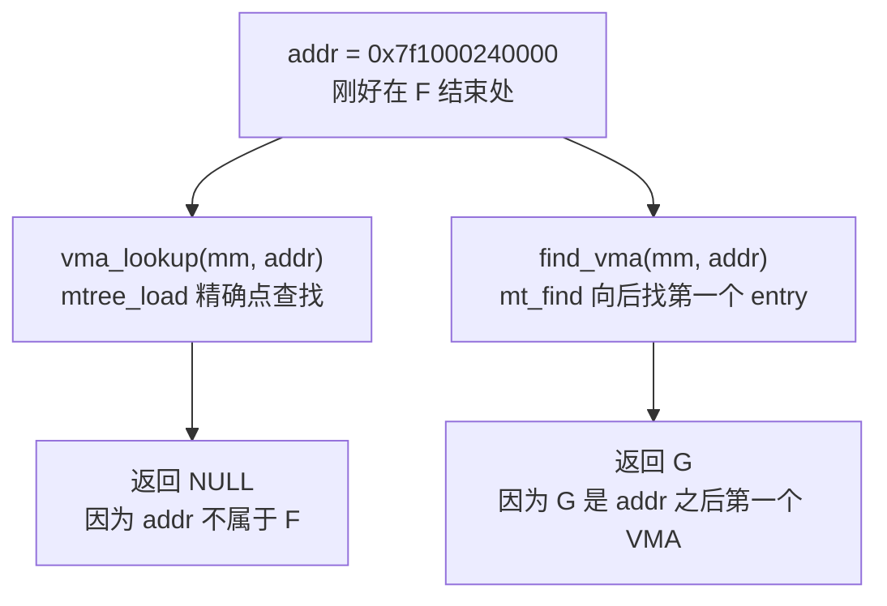
```mermaid
flowchart TD
    ADDR["addr = 0x7f1000240000<br/>刚好在 F 结束处"]

    L["vma_lookup(mm, addr)<br/>mtree_load 精确点查找"]
    FNULL["返回 NULL<br/>因为 addr 不属于 F"]

    FV["find_vma(mm, addr)<br/>mt_find 向后找第一个 entry"]
    VG["返回 G<br/>因为 G 是 addr 之后第一个 VMA"]

    ADDR --> L --> FNULL
    ADDR --> FV --> VG
```

这个差别在读 `mm/mmap.c` 时非常重要。很多时候代码不是在判断“这个地址是否在 VMA 里”，而是在找“这个地址附近的 VMA 布局”。

------

## 15.8\_普通\_API\_mtree\_*()\_和\_mt\_*()

普通接口在内部建立临时 ma_state，让调用者主要面对范围、返回值与业务对象所有权。完整单元进入[P40 范围与查询](P40_Maple普通接口中的范围与查询.md#40.1_从保存一个范围到选择操作契约)，以同一棵私有树观察覆盖、条件插入、清除和终止游标。

### 15.8.1\_mtree\_load()\_精确点查找

点查只返回覆盖当前索引的普通可见 entry，不跳到后面的对象。内部 RCU 读侧在返回前结束，业务对象的使用期需要外围协议。见[P40 点查](P40_Maple普通接口中的范围与查询.md#40.3.1_点查只回答当前索引)；vma_lookup 的固定函数体统一见[mm.h 实现](../../../../research/source_reading/maple_tree/source_explanations/include/linux/mm.h.md#1.2_vma_lookup只查询当前地址)。

### 15.8.2\_mtree\_store\_range()\_范围写入

范围 store 允许覆盖，insert 要求整段没有已有值；普通写封装直接使用 ma_lock，不能自动代替外部锁模式的协议。具体示例见[P40 覆盖政策](P40_Maple普通接口中的范围与查询.md#40.2_同一棵树中的覆盖与拒绝覆盖)，固定封装见[写入与擦除](../../../../research/source_reading/maple_tree/source_explanations/lib/maple_tree.c.md#1.11_普通写入与整段擦除)。rbtree 由业务自己比较并定位，Maple 则提供闭区间更新契约，这项职责差别仍然成立。

### 15.8.3\_mt\_find()\_从某点向后找第一个\_entry

向后查询可以跳过空洞，成功把游标推进到命中范围 last+1；max 不裁剪对象范围，ULONG_MAX 后的回绕由后续 mt_find_after 检查。原 [100,199] 命中后游标变为 200 的例子是这个规则的普通情形；见[P40 查询表和边界](P40_Maple普通接口中的范围与查询.md#40.3.2_向后查会跳过空洞)。

------

## 15.9\_高级\_API\_mas\_*()\_是真正的状态机接口

[P40](P40_Maple普通接口中的范围与查询.md#40.5_内部封装在哪里结束)已经区分普通封装与调用者责任。高级接口把 ma_state 保留在调用者手中，用于连续查询，也允许将可失败的资源准备与真正写入分开；它不自动建立外围同步。先进入[P41 写入准备与锁边界](P41_Maple写入准备与锁边界.md#41.1_为什么一次写入还需要准备阶段)，沿 S0～S5 和完整外部锁模块观察准备、取消、兑现与清理。

以下保留常用入口声明，作为已理解职责后的查询表；声明来自固定[maple_tree.h](../../../../research/source_reading/linux/include/linux/maple_tree.h)，不把函数名目录当作学习起点。

```c
void *mas_walk(struct ma_state *mas);
void *mas_store(struct ma_state *mas, void *entry);
void *mas_erase(struct ma_state *mas);
int mas_store_gfp(struct ma_state *mas, void *entry, gfp_t gfp);
void *mas_find(struct ma_state *mas, unsigned long max);
void *mas_find_range(struct ma_state *mas, unsigned long max);
void *mas_find_rev(struct ma_state *mas, unsigned long min);
void *mas_next(struct ma_state *mas, unsigned long max);
void *mas_prev(struct ma_state *mas, unsigned long min);
int mas_empty_area(struct ma_state *mas, unsigned long min,
		   unsigned long max, unsigned long size);
int mas_empty_area_rev(struct ma_state *mas, unsigned long min,
		       unsigned long max, unsigned long size);
```

| 任务 | 接口 | 选择前应明确的问题 |
| --- | --- | --- |
| 当前定位 | mas_walk | 由输入 index 定位，返回时范围字段按命中结果改变；见 P39 |
| 向后找值或走范围 | mas_find、mas_find_range | 第一次是否包含当前位置；range 变体后续可访问空范围，不能把任意 NULL 当遍历结束 |
| 反向遍历 | mas_find_rev、mas_prev | 包含当前项还是前一个，以及下界；后续源码单元分别处理 |
| 写入 | mas_store、mas_store_gfp、mas_store_prealloc | 返回旧 entry、整数结果还是依赖预先准备；详见 P41 |
| 擦除 | mas_erase | 删除的是命中整段，业务对象寿命另行负责 |
| 空洞搜索 | mas_empty_area、mas_empty_area_rev | allocation tree 中按哪个方向、窗口和 size 找空洞 |
| 资源准备 | mas_preallocate、mas_expected_entries | 单次写入准备与有序批量填充是不同任务 |
| 状态与资源 | mas_pause、mas_reset、mas_destroy | 暂停、重新定位与资源清理不可互换；分别见 P39/P41 |

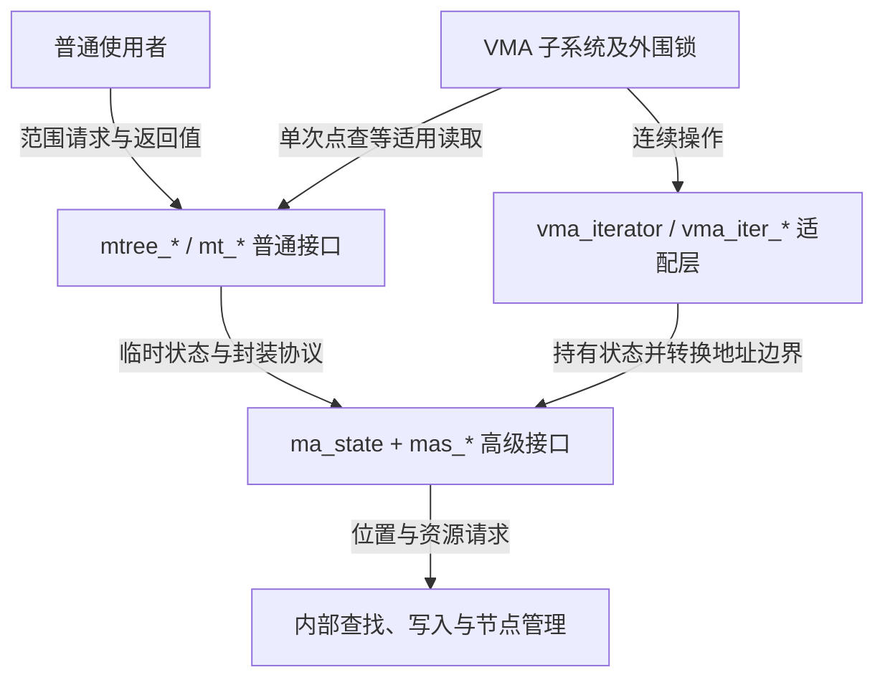
```mermaid
flowchart TD
    USER["普通使用者"] -->|范围请求与返回值| MTREE["mtree_* / mt_* 普通接口"]
    MTREE -->|临时状态与封装协议| MAS["ma_state + mas_* 高级接口"]
    VMA["VMA 子系统及外围锁"] -->|连续操作| VMI["vma_iterator / vma_iter_* 适配层"]
    VMI -->|持有状态并转换地址边界| MAS
    VMA -->|单次点查等适用读取| MTREE
    MAS -->|位置与资源请求| CORE["内部查找、写入与节点管理"]
```

保留这张分层图是为了区分谁构造状态、谁持有锁、谁转换地址语义；不能把 VMA 到普通接口的箭头理解为任意普通写入都适用于外部锁树。vma_find 复用 vmi->mas 调用 mas_find，并转换半开上界，固定函数只在[mm.h 唯一标题](../../../../research/source_reading/maple_tree/source_explanations/include/linux/mm.h.md#1.4_VMA查找复用高级游标)展开。读完 P41 后继续下一节，将请求、状态和锁放回真实 mm/VMA 调用者。

------

## 15.10\_VMA\_接入层\_mm\_struct.mm\_mt

[P41](P41_Maple写入准备与锁边界.md#41.3_沿S0到S5区分位置与资源)已把请求、节点位置、资源与锁分开。现在把它们放进真实地址空间：mm_struct 表示一个用户地址空间，它内嵌的 mm_mt 索引这个地址空间的 VMA；线程可以共享同一个 mm_struct，不能理解成每个线程必有一棵独立树。VMA 对象保存半开边界与属性，树中的 entry 指向这个对象，不是页表项或物理页号。

### 15.10.1\_树模式决定哪些职责交给调用者

固定源码沿[VMA 适配模块](../../../../research/source_reading/maple_tree/navigation/P09_VMA游标与边界适配.md#9.2_从地址空间到局部游标)进入。MM_MT_FLAGS 组合值仍由[mm_types.h 唯一标题](../../../../research/source_reading/maple_tree/source_explanations/include/linux/mm_types.h.md#1.2_VMA树的三项模式)解释；这里关心这三项对调用方的含义。

| 模式 | VMA 场景需要它的原因 | 不能据此推导什么 |
| --- | --- | --- |
| ALLOC_RANGE | 为 mmap 一类空洞搜索维护可用于排除子树的 gap 信息 | 不自动决定地址对齐、保护间隔和映射政策 |
| LOCK_EXTERN | mmap 锁等外围协议需要同时协调树与 VMA 属性，而不只是节点变化 | 登记不等于加锁，普通写封装不会自动转而获取 mmap_lock |
| USE_RCU | 树节点退休和受支持的读路径按 RCU 协议工作 | 不自动稳定返回后的 VMA，也不等于当前配置已启用所有无锁 VMA 读路径 |

固定 kernel/fork.c 初始化 mm_mt 时设置这些模式，并关联 mm->mmap_lock。这个关联是检查器能识别的保护关系；真正持锁范围由 MM 调用路径建立。当前已核对配置没有 CONFIG_PER_VMA_LOCK，不能从树的 USE_RCU 标志声称目标已走该配置下的缺页快路径。

### 15.10.2\_游标属于一次遍历

struct vma_iterator 内含一份 ma_state，让调用者连续操作同一棵 mm_mt。共享的是树，局部的是游标位置；创建一个新游标既没有复制 VMA 集合，也没有创建新地址空间。结构、VMA_ITERATOR 宏和 vma_iter_init 的完整固定实现见[游标初始化](../../../../research/source_reading/maple_tree/source_explanations/include/linux/mm_types.h.md#1.3_VMA游标与两种初始化)。

两种初始化有一个不能靠印象补齐的区别。VMA_ITERATOR 指定 tree、index、NULL node 和 ma_start，未显式初始化的 last 按聚合初始化规则为 0；vma_iter_init 调用 mas_init，后者把 index 与 last 都设为 addr。两者都为后续查询建立入口，但不表示初始化后的每个字段逐字节相同。不要把尚未执行查询时的 last 直接当成“已经命中的 VMA 末端”。

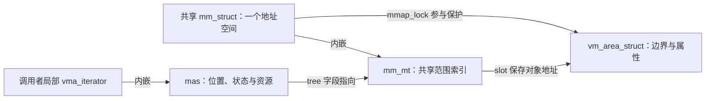
```mermaid
flowchart LR
    MM["共享 mm_struct：一个地址空间"] -->|内嵌| MT["mm_mt：共享范围索引"]
    VMI["调用者局部 vma_iterator"] -->|内嵌| MAS["mas：位置、状态与资源"]
    MAS -->|tree 字段指向| MT
    MT -->|slot 保存对象地址| VMA["vm_area_struct：边界与属性"]
    MM -->|mmap_lock 参与保护| VMA
```

适配层因此可以把调用意图写成 vma_next、vma_prev、vma_iter_bulk_store，但“包装很薄”只描述转发代码的体量，不能据此省略锁、对象期限和区间前置条件。下一节专门看这些转发究竟改变了什么。

------

## 15.11\_VMA\_封装函数\_把半开区间翻译成\_Maple\_Tree\_闭区间

范围模型已经建立，现在给出两个相邻 VMA：A=[0x1000,0x3000)，B=[0x3000,0x4000)。A 包含最后一个地址 0x2fff，不包含 0x3000；进入 Maple 后应分别表示为 A[0x1000,0x2fff] 和 B[0x3000,0x3fff]。这里的减一针对 **地址索引**，不是把页数减一。

### 15.11.1\_一次查询如何推进边界

vma_find(vmi,max) 把排除式上界 max 转成包含式 max-1，再调用 mas_find，见[唯一实现](../../../../research/source_reading/maple_tree/source_explanations/include/linux/mm.h.md#1.4_VMA查找复用高级游标)。如果上界为 0x3000，它最多搜索到 0x2fff，不应因为 B 从 0x3000 开始就越过窗口去返回 B。

vma_next 的第一次调用也使用 mas_find。游标若从 A 内部开始，当前范围就是应该访问的第一项；改成 mas_next 可能跳过它。后续调用再依据保存的状态继续。vma_prev 则转给 mas_prev，并以 0 为下界。完整转发见[方向与范围包装](../../../../research/source_reading/maple_tree/source_explanations/include/linux/mm.h.md#1.5_VMA方向与范围遍历)。

vma_iter_next_range 又承担不同任务：它调用 mas_next_range，推进到下一个范围槽，可能访问空范围。不能只见返回 NULL 就断定“状态一定越界”，还要按高级接口检查位置和边界状态；这与只遍历有值 VMA 的循环不是一回事。

### 15.11.2\_写入和清除的请求从哪里来

| 包装 | 请求区间的来源 | 传给 Maple 的动作与返回处理 |
| --- | --- | --- |
| vma_iter_bulk_store | vma->vm_start 与 vma->vm_end | 直接写入 index 与 end-1，再调用 mas_store；依据错误状态返回 0 或 -ENOMEM |
| vma_iter_clear_gfp | 调用者的 start/end | 使用 __mas_set_range 设置 start/end-1，写入 NULL；依错误状态返回 0 或 -ENOMEM |
| vma_iter_set | 调用者的单个 addr | 调 mas_set 改变后续查询起点，不修改共享树 |
| vma_iter_invalidate | 既有游标 | 调 mas_pause，清失效位置但不解锁；下一次行为沿 P39 的 pause 契约 |
| vma_iter_free | 本次状态关联的资源 | 调 mas_destroy，不释放 VMA 对象，不等于销毁 mm_mt |

固定代码分别见[写入和清理包装](../../../../research/source_reading/maple_tree/source_explanations/include/linux/mm.h.md#1.6_VMA写入请求与资源退出)及[已有 invalidate](../../../../research/source_reading/maple_tree/source_explanations/include/linux/mm.h.md#1.3_VMA游标失效调用暂停)。clear 与 bulk 的封装将状态错误映射为 -ENOMEM，不是通用地原样转发所有底层 errno；bulk 也不能通过 mas_store 返回 NULL 就判断成功。它们都没有在这里取得 mmap 锁。

__mas_set_range 保留已有操作的定位背景，不能把 clear 包装当成随时可用的独立普通写接口。准备、位置与批量资源应由真实调用方建立。与此同时，当前固定 mm/mmap.c 还使用 mm/vma.h 中的 config/prealloc/store 路径；本表保留旧文实际引用且固定版本仍存在的接口，不把它们宣称成所有 VMA 修改的完整调用链。后续源码阅读必须跟随真实调用点选择入口。

### 15.11.3\_减一之前必须知道什么

若误把 A 存成闭区间 [0x1000,0x3000]，它就侵入了本应属于 B 的地址 0x3000；根据写入先后，覆盖操作可能改掉该地址的映射。直接后果是一个地址索引归属错误，不能不经后续页对齐和 MM 路径分析就写成“删掉一整页”。相交查询、空洞搜索、缺页候选、munmap/mprotect/mremap 等修改依赖边界正确，因而会受到错误输入影响；具体故障仍要沿对应调用链判断。

空区间是另一类问题。start=end 没有成员，不能机械转换为 [start,end-1]；当 end=0 时，无符号减一得到 ULONG_MAX，反而把上界扩到最大值。上述短封装并未统一替调用者拒绝所有空、逆序或溢出请求。进入适配前，应已经证明 `start < end`，并保证 end 可由使用的地址类型表达；加法产生的 end 还须先排除溢出。

本章的边界程序主动检查这些前提，和内核包装按既有调用约定转发不同。代码保留失败输出不变，方便观察“没有产生一个闭区间结果”，而不是制造一个伪装成成功的巨大范围。

### 15.11.4\_运行边界等价性实验

完整材料[vma_boundary_contract.c](../../../../labs/kernel/tree_basics/materials/vma_boundary_contract.c)只处理整数区间，不操作真实进程或内核树。它逐一比较半开与闭区间的成员关系，另展示错误 end、零减一和最大可表示终点。

```c
#include <stdbool.h>
#include <stdint.h>
#include <inttypes.h>
#include <stdio.h>
#include <stdlib.h>

struct closed_range { uint64_t first, last; };

/* 教学转换器主动检查输入；不声称实际 VMA 包装函数都执行此检查。 */
static bool to_closed(uint64_t start, uint64_t end, struct closed_range *out)
{
    if (start >= end)
        return false;
    *out = (struct closed_range){start, end - 1};
    return true;
}

static bool contains(struct closed_range range, uint64_t address)
{
    return range.first <= address && address <= range.last;
}

static void require(bool condition, const char *message)
{
    if (!condition) {
        fprintf(stderr, "check failed: %s\n", message);
        exit(EXIT_FAILURE);
    }
}

int main(void)
{
    struct closed_range a, b;
    require(to_closed(0x1000, 0x3000, &a), "A input");
    require(to_closed(0x3000, 0x4000, &b), "B input");
    printf("A=[%" PRIx64 ",%" PRIx64 "] B=[%" PRIx64 ",%" PRIx64 "]\n",
           a.first, a.last, b.first, b.last);
    require(contains(a, 0x2fff) && !contains(a, 0x3000), "A excludes end");
    require(contains(b, 0x3000), "B owns boundary");
    struct closed_range wrong_a = {0x1000, 0x3000};
    require(contains(wrong_a, 0x3000) && contains(b, 0x3000), "wrong overlap");

    unsigned accepted = 0, rejected = 0, membership_checks = 0;
    for (uint64_t start = 0; start <= 32; ++start) {
        for (uint64_t end = 0; end <= 32; ++end) {
            struct closed_range result = {99, 100};
            bool ok = to_closed(start, end, &result);
            require(ok == (start < end), "validity");
            if (!ok) {
                require(result.first == 99 && result.last == 100, "failure unchanged");
                ++rejected;
                continue;
            }
            ++accepted;
            for (uint64_t address = 0; address <= 32; ++address) {
                require(contains(result, address) ==
                        (start <= address && address < end), "same membership");
                ++membership_checks;
            }
        }
    }
    /* 最大可表示 end 仍是排除式边界；本类型不能表示 2^64。 */
    require(to_closed(UINT64_MAX - 1, UINT64_MAX, &a), "high interval");
    require(a.last == UINT64_MAX - 1 && !contains(a, UINT64_MAX), "high boundary");
    uint64_t zero = 0;
    require(zero - 1 == UINT64_MAX, "unsigned wrap is not an empty interval");
    printf("accepted=%u rejected=%u membership_checks=%u; zero-1 wraps\n",
           accepted, rejected, membership_checks);
    return EXIT_SUCCESS;
}
```

```bash
cc -std=c11 -Wall -Wextra -Werror -O2 labs/kernel/tree_basics/materials/vma_boundary_contract.c -o /tmp/vma_boundary_contract
/tmp/vma_boundary_contract
```

本批宿主实际结果：

```text
A=[1000,2fff] B=[3000,3fff]
accepted=528 rejected=561 membership_checks=17424; zero-1 wraps
```

528 组有效区间分别核对 33 个地址，561 组空/逆序输入拒绝且输出不变。使用 uint64_t 是为了明确整数模型的宽度，不表示当前 ARM32 VMA 能使用任意 64 位地址。固定包装另用显式后端夹具检查转发参数、两种初始化和错误映射；真实内核 VMA 更新、锁竞争和页表操作未运行。

### 15.11.5\_把边界转换放回操作周期

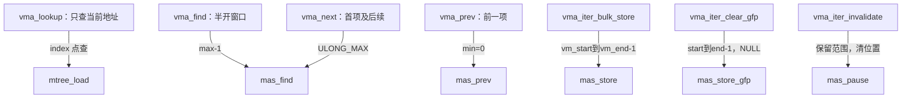
```mermaid
flowchart TD
    Q1["vma_lookup：只查当前地址"] -->|index 点查| LOAD["mtree_load"]
    Q2["vma_find：半开窗口"] -->|max-1| FIND["mas_find"]
    Q3["vma_next：首项及后续"] -->|ULONG_MAX| FIND
    Q4["vma_prev：前一项"] -->|min=0| PREV["mas_prev"]
    W1["vma_iter_bulk_store"] -->|vm_start到vm_end-1| STORE["mas_store"]
    W2["vma_iter_clear_gfp"] -->|start到end-1，NULL| CLEAR["mas_store_gfp"]
    W3["vma_iter_invalidate"] -->|保留范围，清位置| PAUSE["mas_pause"]
```

这保留了原查询/修改分组，并为原先孤立的点查节点补上真实转发箭头。把实际观察顺序写成 S0～S4：S0 调用者建立地址空间保护；S1 初始化局部游标；S2 查询包装转换窗口并更新局部位置；S3 调用者在保持对象有效的条件下使用结果；S4 完成遍历或按协议暂停再释放保护。树的模式位不代替 S0，得到指针也不允许跳过 S3。

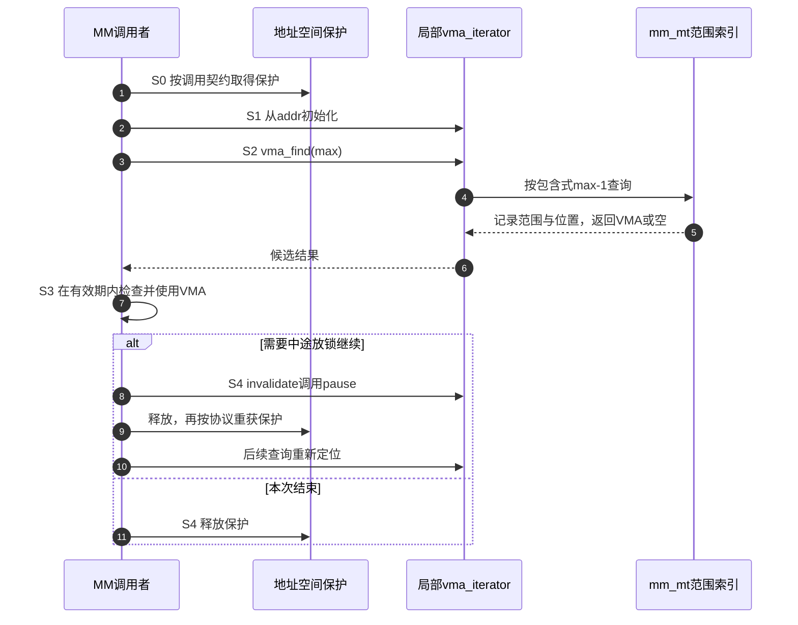
```mermaid
sequenceDiagram
    autonumber
    participant C as MM调用者
    participant L as 地址空间保护
    participant V as 局部vma_iterator
    participant T as mm_mt范围索引
    C->>L: S0 按调用契约取得保护
    C->>V: S1 从addr初始化
    C->>V: S2 vma_find(max)
    V->>T: 按包含式max-1查询
    T-->>V: 记录范围与位置，返回VMA或空
    V-->>C: 候选结果
    C->>C: S3 在有效期内检查并使用VMA
    alt 需要中途放锁继续
        C->>V: S4 invalidate调用pause
        C->>L: 释放，再按协议重获保护
        C->>V: 后续查询重新定位
    else 本次结束
        C->>L: S4 释放保护
    end
```

先预测三个结果再看下一节：从 A 内部首次 vma_next 是否返回 A；max=0 能否表示一个安全的空搜索窗口；得到 VMA 指针后是否能随意越过解锁点使用。答案分别是按首次查询包含当前位置、不能机械使用零上界、必须另有对象稳定协议。接下来沿三个查询入口进一步比较点查、向后查与范围相交。

------

## 15.12\_VMA的三个查找入口

VMA 相关源码里经常出现三个名字：

```text
vma_lookup()
find_vma()
find_vma_intersection()
```

它们不是同义词。上一节已经证明半开上界如何转换；现在保持同一组 A～D，只改变查询问题。返回的是完整候选 VMA，不把对象边界裁剪成查询窗口，也不由非空返回自动取得对象引用。

### 15.12.1\_vma\_lookup()\_只查这个地址有没有\_VMA

源码位置：[include/linux/mm.h](../../../../research/source_reading/linux/include/linux/mm.h)

完整固定版本函数体及仓库补充注释见[唯一实现讲解](../../../../research/source_reading/maple_tree/source_explanations/include/linux/mm.h.md#1.2_vma_lookup只查询当前地址)。这里继续用查询结果对照其职责，不重复展开函数体。

语义：

```text
addr 必须落在某个 VMA 范围内，才返回这个 VMA。
如果 addr 位于两个 VMA 之间的 gap，返回 NULL。
```

### 15.12.2\_find\_vma()\_查这个地址\_或者地址之后的第一个\_VMA

源码位置：[mm/mmap.c](../../../../research/source_reading/linux/mm/mmap.c)

完整固定版本函数体及仓库补充注释见[唯一实现讲解](../../../../research/source_reading/maple_tree/source_explanations/mm/mmap.c.md#1.2_find_vma与上界)。这里继续用查询结果对照其职责，不重复展开函数体。

语义：

```text
如果 addr 命中某个 VMA，返回它；
否则返回 addr 之后的第一个 VMA。
```

这适合需要继续遍历或查看后续布局的调用方。若用于判断故障地址是否已映射，还必须核对候选起点不大于 addr；“后面存在一个 VMA”并不使当前空洞变成有效映射。

### 15.12.3\_find\_vma\_intersection()\_查范围是否与\_VMA\_相交

源码位置：[mm/mmap.c](../../../../research/source_reading/linux/mm/mmap.c)

完整固定版本函数体及仓库补充注释见[唯一实现讲解](../../../../research/source_reading/maple_tree/source_explanations/mm/mmap.c.md#1.3_find_vma_intersection翻译排除式终点)。这里继续用查询结果对照其职责，不重复展开函数体。

它和 `find_vma()` 的关键差别是上界：

```text
find_vma():
    max = ULONG_MAX

find_vma_intersection(start, end):
    max = end - 1
```

所以 `find_vma_intersection()` 只在指定范围内找，不会越过 `end_addr` 找到后面的 VMA。

下面用复杂例子对比三者。

```text
VMA:

A: [0x400000, 0x452000)
B: [0x600000, 0x610000)
C: [0x610000, 0x639000)
D: [0x639000, 0x660000)
```

查询：

| 调用 | 结果 | 原因 |
| --- | --- | --- |
| `vma_lookup(mm, 0x500000)` | `NULL` | `0x500000` 在 A 和 B 之间的 gap |
| `find_vma(mm, 0x500000)` | B | B 是 `0x500000` 之后第一个 VMA |
| `find_vma_intersection(mm, 0x500000, 0x580000)` | `NULL` | `[0x500000, 0x580000)` 范围内没有 VMA |
| `find_vma_intersection(mm, 0x500000, 0x601000)` | B | B 与该范围相交 |
| `vma_lookup(mm, 0x610000)` | C | `0x610000` 是 C 的起点，不属于 B |

图示：

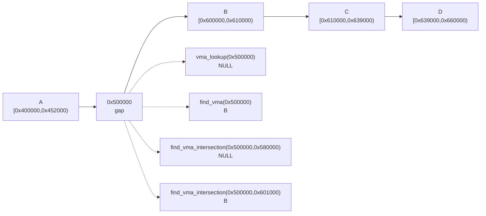
```mermaid
flowchart LR
    GAP["0x500000<br/>gap"]
    A["A<br/>[0x400000,0x452000)"]
    B["B<br/>[0x600000,0x610000)"]
    C["C<br/>[0x610000,0x639000)"]
    D["D<br/>[0x639000,0x660000)"]

    A --> GAP --> B --> C --> D

    L1["vma_lookup(0x500000)<br/>NULL"]
    F1["find_vma(0x500000)<br/>B"]
    I1["find_vma_intersection(0x500000,0x580000)<br/>NULL"]
    I2["find_vma_intersection(0x500000,0x601000)<br/>B"]

    GAP -.-> L1
    GAP -.-> F1
    GAP -.-> I1
    GAP -.-> I2
```

这些封装把范围和向后搜索的契约集中在 VMA/Maple 接口上；红黑树也能实现相同查询，不能由接口名称反推只有 Maple 才能查前驱或后继。

------

## 15.13\_find\_vma\_prev()\_为什么还要找\_previous

`find_vma_prev()` 在 [mm/mmap.c](../../../../research/source_reading/linux/mm/mmap.c) 里：

完整固定版本函数体及仓库补充注释见[唯一实现讲解](../../../../research/source_reading/maple_tree/source_explanations/mm/mmap.c.md#1.4_find_vma_prev保持两个结果)。这里继续用查询结果对照其职责，不重复展开函数体。

这个函数说明一件事：即使不再有全局 VMA 链表，VM 子系统仍然需要“前驱 / 后继”语义。

例如 mmap 新区域、扩展栈、合并 VMA 时，都需要看相邻 VMA：

```text
prev 是否能和新 VMA 合并？
next 是否能和新 VMA 合并？
prev 和 next 之间的 gap 是否够大？
addr 是否正好落在 prev 结束处？
```

复杂例子：

```text
prev: [0x0000000000600000, 0x0000000000610000)  rodata
vma : [0x0000000000610000, 0x0000000000639000)  data
next: [0x0000000000639000, 0x0000000000660000)  heap

addr = 0x0000000000618000
```

此时：

```text
vma_iter_load(&vmi) 命中 data；
vma_prev(&vmi) 返回 rodata；
函数返回 data，同时 pprev = rodata。
```

如果：

```c
addr = 0x0000000000500000
```

它位于 text 和 rodata 之间的 gap：

```text
vma_iter_load(&vmi) 返回 NULL；
vma_prev(&vmi) 返回 text；
vma_next(&vmi) 返回 rodata；
函数返回 rodata，同时 pprev = text。
```

图示：

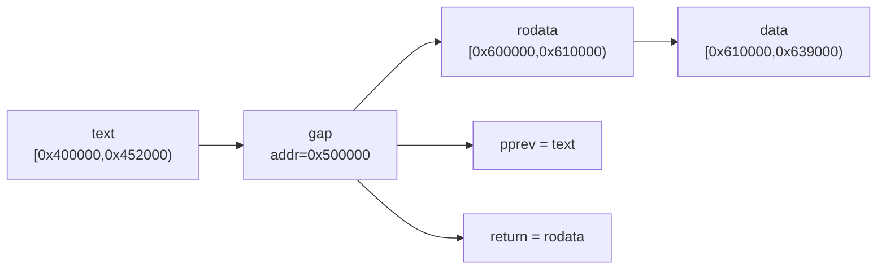
```mermaid
flowchart LR
    T["text<br/>[0x400000,0x452000)"]
    GAP["gap<br/>addr=0x500000"]
    R["rodata<br/>[0x600000,0x610000)"]
    D["data<br/>[0x610000,0x639000)"]

    T --> GAP --> R --> D

    GAP --> P["pprev = text"]
    GAP --> V["return = rodata"]
```

这类“同时拿到当前位置和前驱”的需求，就是 `vma_iterator` 封装存在的原因之一。若 addr 在第一项之前，返回第一项但 pprev 为 NULL；若 addr 在最后一项之后，返回 NULL 而 pprev 仍可能是最后一项。两个输出独立表达两个问题，不能只检查其中一个。

------

## 15.14\_page\_fault\_unmap\_free\_pgtables\_为什么也会碰\_Maple\_Tree

查到对象只是工作的入口。缺页、权限变更、撤销映射和页表清理分别需要哪些 VMA 信息，仍按下表区分；这些是场景职责，不表示所有路径都直接调用同一个短包装。

| 路径 | 为什么需要 VMA |
| --- | --- |
| page fault | fault 地址是否合法？权限是否允许？是匿名页、文件映射、栈增长还是特殊映射？ |
| `munmap()` | 删除范围内有哪些 VMA？是否要拆分边界 VMA？ |
| `mprotect()` | 修改权限的范围覆盖哪些 VMA？是否需要拆分、合并？ |
| `free_pgtables()` | 释放页表时需要按 VMA 边界遍历 |
| `unmap_vmas()` | 解除映射时要逐段处理 VMA |

完整 E/F/G 部分撤销场景已进入[P42 两棵树](P42_撤销映射中的两棵Maple树.md#42.2_保留原来的E与F与G场景)，原全部地址边界和保留结果不丢失。关键增量是：主树 mm_mt 按地址索引，临时 mt_detach 按处理序号保存待撤销对象，清主树后还要完成页表、对象与临时索引的退出。

free_pgtables 与 unmap_vmas 的完整固定签名和函数分别见[页表释放](../../../../research/source_reading/maple_tree/source_explanations/mm/memory.c.md#1.3_释放页表与上界哨兵)及[映射清除](../../../../research/source_reading/maple_tree/source_explanations/mm/memory.c.md#1.2_解除映射与继续遍历)，通过[撤销模块](../../../../research/source_reading/maple_tree/navigation/P10_撤销范围与临时索引.md#10.2_两棵树沿S0到S5分工)关联调用方。ma_state 的 tree、索引单位、首项参数与搜索上界必须一起看；exit_mmap 与对齐 munmap 传入的树并不相同。

P42 的 S0～S5 还解释失败恢复为何不承诺逆转所有拆分、页表 ceiling=0 为什么有该接口明确允许的哨兵含义，以及普通半开请求不能照搬该约定。读完后回到下一节，把局部协议放进职责总图。

------

## 15.15\_ma\_state\_和\_VMA\_iterator\_的一张总图

把前面的内容合并，可以得到下面的职责地图。场景到接口的箭头表示需要哪类能力，不声明每条边都是当前版本的一次直接 C 调用；真实调用点和条件分支以关联模块为准。

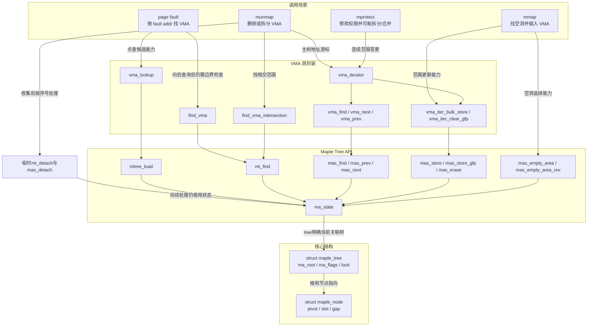
```mermaid
flowchart TD
    subgraph USERPATH["调用场景"]
        PF["page fault<br/>按 fault addr 找 VMA"]
        MMAP["mmap<br/>找空洞并插入 VMA"]
        MUNMAP["munmap<br/>删除或拆分 VMA"]
        MPROTECT["mprotect<br/>修改权限并可能拆分/合并"]
    end

    subgraph VMAAPI["VMA 层封装"]
        VL["vma_lookup"]
        FV["find_vma"]
        FVI["find_vma_intersection"]
        VMI["vma_iterator"]
        VIF["vma_find / vma_next / vma_prev"]
        VIS["vma_iter_bulk_store / vma_iter_clear_gfp"]
    end

    subgraph MTAPI["Maple Tree API"]
        ML["mtree_load"]
        MF["mt_find"]
        MAS["ma_state"]
        MASF["mas_find / mas_prev / mas_next"]
        MASS["mas_store / mas_store_gfp / mas_erase"]
        GAP["mas_empty_area / mas_empty_area_rev"]
    end

    subgraph CORE["核心结构"]
        TREE["struct maple_tree<br/>ma_root / ma_flags / lock"]
        NODE["struct maple_node<br/>pivot / slot / gap"]
    end

    PF -->|点查候选能力| VL
    PF -->|向后查询后仍需边界检查| FV
    MMAP -->|空洞选择能力| GAP
    MMAP -->|范围更新能力| VIS
    MUNMAP -->|找相交范围| FVI
    MUNMAP -->|主树地址游标| VMI
    MUNMAP -->|收集后按序号处理| DET["临时mt_detach与mas_detach"]
    DET -->|后续处理仍使用状态| MAS
    MPROTECT -->|连续范围变更| VMI

    VL --> ML
    FV --> MF
    FVI --> MF
    VMI --> VIF
    VMI --> VIS
    VIF --> MASF
    VIS --> MASS

    ML --> MAS
    MF --> MAS
    MASF --> MAS
    MASS --> MAS
    GAP --> MAS

    MAS -->|tree明确当前关联树| TREE
    TREE -->|根和节点指向| NODE
```

这张图里最重要的关系是：

```text
VMA 不是绕过 Maple Tree API 直接操作节点。
VMA 主要通过 vma_iterator / vma_iter_* 把 VMA 半开区间翻译成 Maple Tree 闭区间，
然后交给 ma_state / mas_* 状态机。
```

------

## 15.16\_这一章没有展开的内容

现在已经有真实存在的节点布局、字段编码、游标、普通接口、写入资源和撤销场景单元。完整内部算法仍有边界，不能因为所有接口都能定位，就宣称动态实现已讲完。

| 继续研究的问题 | 本轮已有基础 | 仍未由本章证明的部分 |
| --- | --- | --- |
| 节点搜索 | [P38 pivot 与范围](P38_Maple节点中的范围与空洞.md)、[P39 游标](P39_Maple操作游标的暂停与继续.md) | 内层搜索完整分支与失效节点重试证明 |
| 写入与删除 | [P40 契约](P40_Maple普通接口中的范围与查询.md)、[P41 资源](P41_Maple写入准备与锁边界.md) | store_type 分类、split、合并/再平衡与跨节点覆盖 |
| 空洞选择 | P38 的 gap 分区与窗口模型 | gap[] 动态更新、mmap 的 bottom-up/top-down 选择及对齐规则 |
| 资源与并发 | P41 的准备/重试/清理与已核对 RCU 模式 | maple_alloc 完整资源链及 RCU 删除节点的全部延迟释放过程 |
| MM 完整修改 | [P42 两棵树](P42_撤销映射中的两棵Maple树.md) | mmap/munmap/mprotect 的全部拆分、合并、通知和页表底层 |

旧文为这些未落地主题预留的“第16～19章”与本专题现有章节冲突，现以问题边界和真实链接表达，不再把未来设想伪装成可读章节。继续阅读从[源码总索引](../../../../research/source_reading/maple_tree/navigation/P01_Linux_6.12_Maple范围源码阅读索引.md#1.2_按读者问题进入证据)选择已经落地的模块；未展开内容保留为研究任务，不用不存在的链接填空。

------

## 15.17\_本章小结

本章沿树根、节点、编码、操作状态、接口与 VMA 建立了源码位置感，完整单元分别在 P38～P42 中兑现。共享 maple_tree 保存根与模式；节点用 pivot/slot 表达包含式范围，容量依类型和构建条件；ma_state 由范围、位置、状态和资源等正交信息组成，不能看一个枚举就猜完所有结果。

普通接口常创建临时状态，高级接口把连续位置和更多协议交给调用者。VMA 适配层把半开边界转成闭区间，但不代替有效输入、外围锁和对象寿命。点查、向后查、相交和前驱分别回答不同问题；进入撤销场景后，还必须区分地址主树与序号临时树。

回顾时先尝试解释这些变化：

1. 为什么节点数组里必须表示空洞，pivot 不能被当成普通 B-Tree 的唯一记录键？
2. 一个指针的低位属于节点编码、父关系还是业务 entry，应该先看哪个字段？
3. pause 与 reset 都可能清 node，为什么下一次 find 仍可能得到不同结果？
4. 预分配成功、补分配要求重试、范围已经发布，分别属于哪个阶段？
5. 主树清除后还要处理哪棵树？这时 index=1 是地址还是序号？

核对方向分别是 P38 的范围分区、15.5 的字段归属、P39 的继续规则、P41 的资源阶段和 P42 的待处理集合。能够沿这些状态解释行为，才比记住函数名多走了一步；本章的源码地图也不等于已经运行目标内核中的全部并发、分裂和回收路径。
