# 第15章\_Linux\_6.12\_Maple\_Tree\_源码结构与\_API\_分层

P14 用 G、H 两段 VMA 说明：地址命中、向后找对象和查找相交范围是不同的问题。P13 又说明多路节点只是承载方式，不能由树名推断对象位置和并发保证。现在进入固定版本，追问这些范围在哪里保存、调用者维护什么状态、返回对象能用多久。

本章有三层参与者：地址空间拥有共享 mm_mt，Maple 管理内部节点，调用方用 ma_state 或 vma_iterator 保存一次操作的游标。VMA 是被索引的独立对象。先区分这些所有者，再阅读普通接口、高级接口和 VMA 封装，才能判断某个字段属于树、当前操作，还是业务对象。

证据统一进入[Maple 源码阅读索引](../../../../research/source_reading/maple_tree/navigation/P01_Linux_6.12_Maple范围源码阅读索引.md#1.2_按读者问题进入证据)：NXP 官方 linux-imx，Linux 6.12.20，标签 lf-6.12.20-2.0.0，固定提交 dfaf2136deb2af2e60b994421281ba42f1c087e0。本文不以本地实验提交解释内核行为。正文建立职责和因果关系，具体宏、字段与函数体沿上游路径进入唯一实现标题；仓库补充的中文说明与上游原文分别标识。

## 15.1\_本章涉及的源码文件

面对“查一个地址”的任务，先不从几千行算法开头顺读。由调用者一路向内追踪：VMA 封装选择查询契约，普通或高级 API 进入共享树，节点编码与游标决定如何下行。遇到初始化或释放问题时，再回到树建立与退出的调用环境。

| 上游位置 | 带着什么问题阅读 |
| --- | --- |
| [Documentation/core-api/maple_tree.rst](../../../../research/source_reading/linux/Documentation/core-api/maple_tree.rst) | 存储的范围、空洞模式、普通/高级 API 和调用者锁责任是什么 |
| [include/linux/maple_tree.h](../../../../research/source_reading/linux/include/linux/maple_tree.h) | 共享根、节点类型、操作状态和模式位保存在哪里 |
| [lib/maple_tree.c](../../../../research/source_reading/linux/lib/maple_tree.c) | 怎样读取、写入、查空洞，以及管理节点资源 |
| [include/linux/mm_types.h](../../../../research/source_reading/linux/include/linux/mm_types.h) | mm_mt 属于哪个 mm，vma_iterator 封装什么 |
| [include/linux/mm.h](../../../../research/source_reading/linux/include/linux/mm.h) | VMA 封装怎样选择查询语义、翻译半开端点 |
| [mm/mmap.c](../../../../research/source_reading/linux/mm/mmap.c) | 查找、映射和退出过程怎样组织范围容器与锁 |
| [mm/memory.c](../../../../research/source_reading/linux/mm/memory.c) | 缺页、解除映射和页表释放为什么需要定位 VMA |
| kernel/fork.c | mm_init 怎样初始化 mm_mt 并登记外部 mmap_lock；固定 blob 见源码基线 |

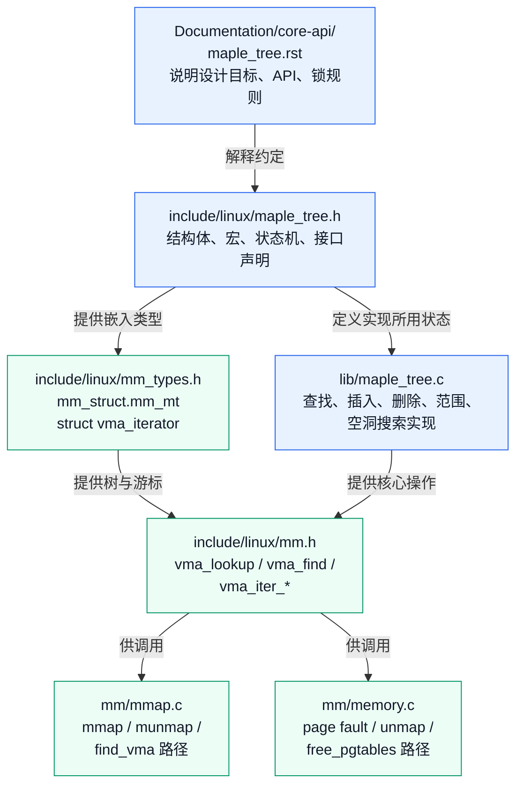
```mermaid
flowchart TD
    DOC["Documentation/core-api/<br/>maple_tree.rst<br/>说明设计目标、API、锁规则"]
    H["include/linux/maple_tree.h<br/>结构体、宏、状态机、接口声明"]
    C["lib/maple_tree.c<br/>查找、插入、删除、范围、<br/>空洞搜索实现"]

    MMT["include/linux/mm_types.h<br/>mm_struct.mm_mt<br/>struct vma_iterator"]
    MMH["include/linux/mm.h<br/>vma_lookup / vma_find /<br/> vma_iter_*"]
    MMAP["mm/mmap.c<br/>mmap / munmap / <br/>find_vma 路径"]
    MEM["mm/memory.c<br/>page fault / unmap / <br/>free_pgtables 路径"]

    DOC -->|解释约定| H
    H -->|定义实现所用状态| C
    H -->|提供嵌入类型| MMT
    MMT -->|提供树与游标| MMH
    MMH -->|供调用| MMAP
    MMH -->|供调用| MEM
    C -->|提供核心操作| MMH

    classDef core fill:#e8f2ff,stroke:#2563eb,color:#111827;
    classDef mm fill:#ecfdf5,stroke:#059669,color:#111827;
    class DOC,H,C core;
    class MMT,MMH,MMAP,MEM mm;
```

这张文件图中的连线表示阅读和使用关系，不代表这些文件中的所有函数都在一次查找中执行。算法路线先读官方契约，再读头文件状态与核心算法；VMA 路线先看 mm 的所有权和封装，再追具体调用点。两条路线在 Maple API 汇合，而不是彼此独立的两套范围树。

本章随后将依次回答根、节点、编码、游标、接口与 VMA 调用的问题。当前前三节的对应实现入口是[树模式与初始化导读](../../../../research/source_reading/maple_tree/navigation/P03_树对象与模式选择.md#3.2_从未发布到受保护使用)，先把外层的读写责任建立起来。

## 15.2\_从官方文档先抓住\_Maple\_Tree\_的语义

Maple Tree 为非重叠范围提供索引。这里的“非重叠”约束的是同一位置最终对应的映射，**不表示所有重叠写入都会失败**。普通 store 可以覆盖已有映射；要求目标全为空再接入时，应选择 insert 类接口并处理其失败。具体更新分支稍后再读，本节先限定数据模型。

红黑树通常由调用方比较业务键，从一条键找到一个对象；Maple 则把索引范围直接纳入接口，可以用 `[start,last] → entry` 表示。一个 entry 可以是 VMA 指针，也可以是其他允许的值，Maple 不是只为 VMA 定义的结构。查询得到 VMA 仍不等于已经找到物理页，也不等于已获准访问相应内存。

VMA 使用半开范围 `[vm_start,vm_end)`；<span style="color:red;">Maple Tree 内部使用的是闭区间</span>。对于已确认非空且端点合法的 VMA，写入范围是 `[vm_start,vm_end-1]`。例如 `[0x400000,0x452000)` 对应 `[0x400000,0x451fff]`：0x451fff 属于这段，0x452000 不属于。

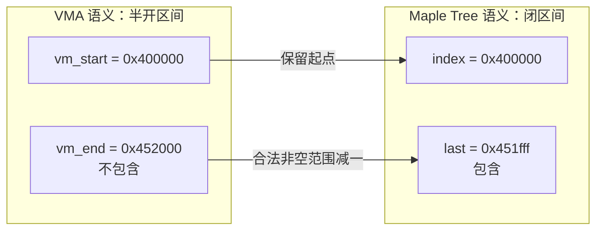
```mermaid
flowchart LR
    subgraph VMA["VMA 语义：半开区间"]
        A["vm_start = 0x400000"]
        B["vm_end = 0x452000<br/>不包含"]
    end

    subgraph MT["Maple Tree 语义：闭区间"]
        C["index = 0x400000"]
        D["last = 0x451fff<br/>包含"]
    end

    A -->|保留起点| C
    B -->|合法非空范围减一| D
```

减一的前提必须放在动作之前。空半开范围没有最后一个元素，end 为 0 时无符号减一会回绕；反过来，Maple 允许的闭上界 ULONG_MAX 也不能无条件加一转换。VMA 封装依赖调用方提供合法边界，不能把接口中的 end−1 当成输入合法性检查。

| 层次 | 典型入口 | 谁负责什么 |
| --- | --- | --- |
| 普通接口 | mtree_load、mtree_store_range、mtree_erase、mt_find | 封装常见查询和修改，按约定管理内部操作状态及相应同步；返回对象的后续保护仍属调用者 |
| 高级接口 | MA_STATE、mas_walk、mas_store、mas_find、mas_empty_area、mas_pause | 调用者持有 ma_state、选择有效锁或 RCU 读侧条件、处理状态和资源边界 |
| VMA 接入 | vma_lookup、vma_find、vma_next、vma_iter_* | 选择地址空间的树，把 VMA 问题和半开范围翻译为 Maple 操作 |

高级接口需要承担更多责任，不是默认“越高级越应该用”。一次简单点查可以使用普通接口；要在同一保护范围内连续走多个对象、预分配节点，或在批量修改之间保留游标时，显式状态才有价值。普通与高级操作可以组合，但锁契约必须相容，不能把普通修改函数再套进同一把不可重入内部锁而不查它是否自行加锁。

P14 的 mmap 空洞、mprotect 切分、munmap 删除以及缺页定位，使 VMA 接入需要这些不同能力。RCU 模式允许树在特定条件下支持读写并发，写者仍须串行化；游标、内部节点寿命和 VMA 属性保护各自有责任。普通查询内部的一段 RCU 读侧不会给返回对象自动增加长期引用，相关说明见[返回指针期限](../../../../research/source_reading/maple_tree/navigation/P02_范围契约与查询入口.md#2.4_返回指针的使用期限)。

可以回到[P14 完整 C++ 区间程序](P14_Maple_Tree_与_VMA_管理.md#14.9.3_运行G与H的区间模型)，先预测查询 G 的末地址、排除终点和 G 前空洞各自得到什么，再运行对照。该程序验证范围契约，不运行 Maple API，也不测试 RCU；下一步要把已经明确的契约落到树对象，而不是用宿主容器替换源码证据。

## 15.3\_struct\_maple\_tree\_树对象本身

如果一个查询者临时建立游标就拥有一整棵新树，另一个查询者便看不到同一个地址空间的变化。实际设计把共享索引放在 mm_struct.mm_mt 中，把当前操作的位置留在调用方状态里。多个线程可以共享同一个 mm；因此这里是每个地址空间的索引，不能按线程数量数树。

固定[maple_tree 定义](../../../../research/source_reading/maple_tree/source_explanations/include/linux/maple_tree.h.md#1.2_共享树字段与模式位)有三组职责：

| 位置 | 保存的状态 | 写入和使用责任 |
| --- | --- | --- |
| ma_root | 空、index 0 的直接 entry 或编码节点入口 | 初始化建立空根，树操作更新；查询按表示分支读取，不能总是强转节点 |
| ma_flags | 创建模式、锁选择、高度和 RCU 模式等位域 | 初始化确定基础模式，适当保护下的专用路径更新动态状态；不同读写路径读取相应掩码 |
| ma_lock / ma_external_lock | 内部自旋锁或外部锁的 lockdep 描述 | 内部锁由树使用；外部锁由调用者真正持有，描述信息只供锁依赖检查 |

先看根的小树优化。只在 **索引 0 上的一项** 可直接保存在根的条件下，才省去节点；不是“任意地方只存一个对象都可直接放根”。固定头说明低两位为 10 的 entry 不使用这种根直存，而允许的其他形式可直存。更大范围或其他布局需要节点。根中的编码不等于业务指针，稍后的编码节会分别讨论根、父指针与操作状态。

再看锁。ma_lock 和 ma_external_lock 是 union 的不同使用方式；选择外部锁后，不能继续把该存储当作已经初始化的内部自旋锁。[mt_init_flags](../../../../research/source_reading/maple_tree/source_explanations/include/linux/maple_tree.h.md#1.3_初始化先选择锁模式再建立空根)先写模式，只在内部锁模式下初始化自旋锁，然后建立空根。它不会分配 Maple 节点，不会建立 VMA，也不是清理活跃树后重新开始的销毁函数。

MM_MT_FLAGS 选择的三项能力见[唯一宏定义](../../../../research/source_reading/maple_tree/source_explanations/include/linux/mm_types.h.md#1.2_VMA树的三项模式)。下表为便于比较省略共同的 MT_FLAGS_ 前缀；三者都是 ma_flags 中的模式常量，回答不同问题：

| 模式 | 为什么需要 | 额外责任或成本 |
| --- | --- | --- |
| ALLOC_RANGE | mmap 等路径需要寻找足够大的空洞 | 节点增加空洞汇总信息，相应减少部分布局容量，并在更新时维护摘要 |
| LOCK_EXTERN | 地址空间操作还需统筹 VMA 属性和其他状态 | 调用者持有相应 mmap 锁；仅声明外部锁不会自动串行化写者 |
| USE_RCU | 内部树节点须满足允许的并发读侧访问 | 更新和退休节点路径遵守 RCU 模式；业务对象期限还需自己的协议 |

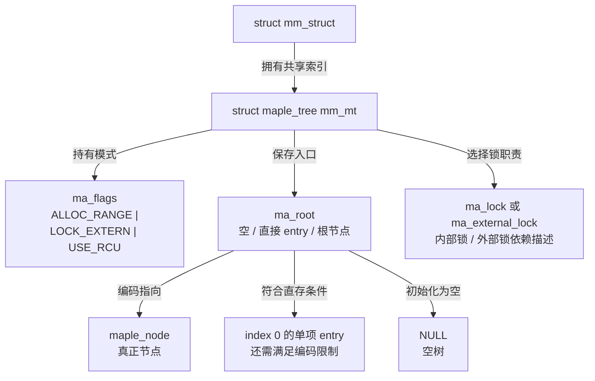
```mermaid
flowchart TD
    MM["struct mm_struct"]
    MT["struct maple_tree mm_mt"]
    FLAGS["ma_flags<br/>ALLOC_RANGE |<br/>LOCK_EXTERN | USE_RCU"]
    ROOT["ma_root<br/>空 / 直接 entry / 根节点"]
    LOCK["ma_lock 或 ma_external_lock<br/>内部锁 / 外部锁依赖描述"]

    MM -->|拥有共享索引| MT
    MT -->|持有模式| FLAGS
    MT -->|保存入口| ROOT
    MT -->|选择锁职责| LOCK

    ROOT -->|编码指向| N0["maple_node<br/>真正节点"]
    ROOT -->|符合直存条件| E0["index 0 的单项 entry<br/>还需满足编码限制"]
    ROOT -->|初始化为空| NULL["NULL<br/>空树"]
```

图中的 ma_external_lock 是锁依赖描述，不是锁定动作。固定 kernel/fork.c 的 mm_init 先用 MM_MT_FLAGS 初始化 mm_mt，再关联 mmap_lock 的描述；[mt_set_external_lock](../../../../research/source_reading/maple_tree/source_explanations/include/linux/maple_tree.h.md#1.4_外部锁登记不是取得锁)在锁依赖检查配置 CONFIG_LOCKDEP 关闭时没有这项登记工作，也不会因此取消实际的外部持锁要求。

最后看容易混淆的 RCU 模式。头文件的历史注释提到了为单用户复用节点而引入模式选择；不能把它缩写成“开 USE_RCU 就可立即复用”。固定[mas_free 分支](../../../../research/source_reading/maple_tree/source_explanations/lib/maple_tree.c.md#1.2_退休节点根据模式选择去向)实际是：RCU 模式交给 ma_free_rcu，非 RCU 模式推回当前 ma_state 的节点资源池。内部节点可复用与某个 VMA 对象可释放仍是两个问题。

[mt_clear_in_rcu 与 mt_set_in_rcu](../../../../research/source_reading/maple_tree/source_explanations/include/linux/maple_tree.h.md#1.5_RCU模式读写不代替生命周期协议)维护模式位及相应锁约定，没有调用 synchronize_rcu。持有写锁只排除了由这把锁串行化的参与者，不能单凭它证明所有无锁读者都已离开。固定 exit_mmap 在地址空间退出这一更大生命周期下清除模式；不能把那一行拿到仍可被并发访问的树上当作通用优化。

回到与 rbtree 的比较：后者通常把 rb_node 嵌入业务对象，比较键由调用者定义；Maple 管理内部范围节点，entry 指向独立对象，index/range 由接口传入。两者都需要清楚的对象保护，但不能把 rbtree 的“摘节点”直接套成 Maple 的“对象立刻死亡”。VMA 按地址索引无需为这项职责继续内嵌 rb_node，也不代表 VMA 的所有其他索引关系都消失。

到这里可以回答三个检查题：一个非零索引上的单项为什么不能直接按根 entry 读取；登记外部锁后，哪个参与者实际取得它；模式清零为什么不等于完成宽限期。答案分别来自根表示条件、调用者同步责任和模式函数没有等待动作。下一节继续看节点如何装下多个范围，以及为了记录空洞付出了多少槽位空间。

------

## 15.4\_struct\_maple\_node\_真正装\_pivot\_和\_slot\_的节点

Maple Tree 的节点不是一个“只有左右孩子”的二叉节点，而是多路节点。

源码里先定义了节点容量：

```c
#if defined(CONFIG_64BIT) || defined(BUILD_VDSO32_64)
/* 64 位尺寸 */
#define MAPLE_NODE_SLOTS	31	/* 包含 ->parent 在内共 256 字节 */
#define MAPLE_RANGE64_SLOTS	16	/* 256 字节 */
#define MAPLE_ARANGE64_SLOTS	10	/* 240 字节 */
#define MAPLE_ALLOC_SLOTS	(MAPLE_NODE_SLOTS - 1)
#else
/* 32 位尺寸 */
#define MAPLE_NODE_SLOTS	63	/* 包含 ->parent 在内共 256 字节 */
#define MAPLE_RANGE64_SLOTS	32	/* 256 字节 */
#define MAPLE_ARANGE64_SLOTS	21	/* 240 字节 */
#define MAPLE_ALLOC_SLOTS	(MAPLE_NODE_SLOTS - 2)
#endif
```

这几个数字不是随便来的。源码注释里明确说明节点大小按 256 字节设计，并且节点也按 256 字节对齐。这样节点指针的低 8 位可以拿来编码额外信息。

`struct maple_node` 的骨架如下：

```c
struct maple_node {
	union {
		struct {
			struct maple_pnode *parent;
			void __rcu *slot[MAPLE_NODE_SLOTS];
		};
		struct {
			void *pad;
			struct rcu_head rcu;
			struct maple_enode *piv_parent;
			unsigned char parent_slot;
			enum maple_type type;
			unsigned char slot_len;
			unsigned int ma_flags;
		};
		struct maple_range_64 mr64;
		struct maple_arange_64 ma64;
		struct maple_alloc alloc;
	};
};
```

这个 union 非常有信息量：

| union 成员 | 作用 |
| --- | --- |
| `parent + slot[]` | 通用视角：一个父指针加很多槽位 |
| `rcu` 相关字段 | 节点移除后复用内存布局，用于 RCU 回收 |
| `mr64` | 64 位 range 节点 |
| `ma64` | 64 位 allocation range 节点，额外带 gap 信息 |
| `alloc` | 预分配节点链，用于复杂写操作 |

Maple Tree 节点类型由 `enum maple_type` 表示：

```c
enum maple_type {
	maple_dense,
	maple_leaf_64,
	maple_range_64,
	maple_arange_64,
};
```

本章先抓住两个常见节点：

```text
maple_range_64:
    负责普通范围索引，主要看 pivot[] + slot[]。

maple_arange_64:
    负责 allocation range 场景，除了 pivot[] + slot[]，还带 gap[]。
```

`maple_range_64` 可以简化理解成：

```text
parent
pivot[0..14]
slot[0..15]
metadata
```

`maple_arange_64` 可以简化理解成：

```text
parent
pivot[0..8]
slot[0..9]
gap[0..9]
metadata
```

为什么 allocation range 节点要多一个 `gap[]`？

因为 mmap 找空洞不是只问“这个地址有没有 VMA”，而是经常问：

```text
在 [low_limit, high_limit) 之间，能不能找到一段长度为 len 的空闲地址？
```

如果每次都线性扫所有 VMA，代价会很高。`gap[]` 的作用就是让节点缓存子树里的最大空洞信息，使得空洞搜索可以跳过不可能满足条件的子树。

下面用一个复杂一点的 VMA 地址空间来感受这个差别。

```text
已有 VMA：

A: [0x0000000000400000, 0x0000000000452000)
B: [0x0000000000600000, 0x0000000000610000)
C: [0x0000000000800000, 0x0000000000a80000)
D: [0x0000000004000000, 0x0000000004800000)
E: [0x00007f1000000000, 0x00007f1000200000)
F: [0x00007f1000600000, 0x00007f1000800000)
G: [0x00007fff00000000, 0x00007fff00021000)
```

普通 range 视角关心的是：

```text
某个 addr 命中哪个 VMA？
从某个 addr 开始，下一个 VMA 是谁？
某个范围是否和已有 VMA 相交？
```

allocation range 视角还要关心：

```text
[0x00007f1000200000, 0x00007f1000600000) 这段 gap 有多大？
[0x0000000000a80000, 0x0000000004000000) 这段 gap 能不能容纳新的 mmap？
从高地址往低地址找，哪个 gap 最合适？
```

画成节点信息大概是这样：

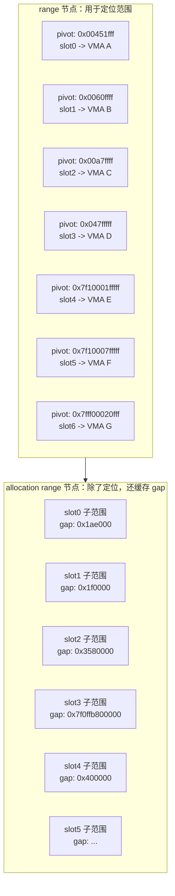
```mermaid
flowchart TD
    subgraph R["range 节点：用于定位范围"]
        R0["pivot: 0x00451fff<br/>slot0 -> VMA A"]
        R1["pivot: 0x0060ffff<br/>slot1 -> VMA B"]
        R2["pivot: 0x00a7ffff<br/>slot2 -> VMA C"]
        R3["pivot: 0x047fffff<br/>slot3 -> VMA D"]
        R4["pivot: 0x7f10001fffff<br/>slot4 -> VMA E"]
        R5["pivot: 0x7f10007fffff<br/>slot5 -> VMA F"]
        R6["pivot: 0x7fff00020fff<br/>slot6 -> VMA G"]
    end

    subgraph A["allocation range 节点：除了定位，还缓存 gap"]
        A0["slot0 子范围<br/>gap: 0x1ae000"]
        A1["slot1 子范围<br/>gap: 0x1f0000"]
        A2["slot2 子范围<br/>gap: 0x3580000"]
        A3["slot3 子范围<br/>gap: 0x7f0ffb800000"]
        A4["slot4 子范围<br/>gap: 0x400000"]
        A5["slot5 子范围<br/>gap: ..."]
    end

    R --> A
```

这张图不是精确还原某一棵真实 Maple Tree 的节点布局，而是帮助理解 `pivot[]`、`slot[]`、`gap[]` 分别服务什么问题。

源码注释里还有一句关键话：

```text
在普通 B-Tree 术语里，pivot 通常叫 key。
Maple Tree 使用 pivot 这个词，是因为它描述的是范围边界。
pivot 值包含在同下标 slot 的范围内。
```

也就是说：

```text
pivot[i] 是 slot[i] 覆盖范围的包含式上界。
```

这个细节非常重要。因为 VMA 本身是 `[vm_start, vm_end)`，进入 Maple Tree 后要变成 `[vm_start, vm_end - 1]`，而 pivot 又是包含式边界。

------

## 15.5\_指针低位编码\_Maple\_Tree\_的\_隐形字段

源码里说 Maple Tree 会把一些信息挤进指针低位。

这和第 8 章里 Linux rbtree 把颜色压进 `__rb_parent_color` 有一点相似，但用途不同。

| 结构 | 指针低位保存什么 |
| --- | --- |
| Linux rbtree | 父指针 + 红黑颜色 |
| Maple Tree | 根标记、节点类型、slot offset、特殊状态、错误编码等 |

Maple Tree 这么做依赖一个事实：节点按 256 字节对齐。

```text
256 字节对齐
=> 节点地址低 8 位必然是 0
=> 低 8 位可以编码类型、槽位、根标记等信息
```

源码注释的大意是：

```c
/*
 * Maple Tree 会在一些不那么直观的位置塞入各种 bit。
 * 通常做法是利用指针按 N 字节对齐这一事实，因此低 log2(N) 位可用。
 * 不使用指针高位，因为无法确定某个体系结构上哪些高位一定不用。
 *
 * 节点大小为 256 字节，也按 256 字节对齐，所以低 8 位可以自用。
 * 当前节点大致分成 4 类：
 * 1. 单指针，也就是范围 0-0；
 * 2. 非叶 allocation range 节点；
 * 3. 非叶 range 节点；
 * 4. 叶 range 节点。
 */
```

指针低位编码带来的第一个阅读困难是：你在源码里看到的 `struct maple_enode *` 不一定是“裸节点指针”。

它可能是：

```text
节点地址 + 类型 bit
节点地址 + slot offset
根标记
错误状态
特殊状态
```

所以 Maple Tree 源码里会有大量 `mte_*()`、`mas_*()`、`ma_is_*()` 之类 helper，用来编码和解码这些状态。

第二个阅读困难是：entry 值本身也有保留模式。

源码注释里说：

```c
/*
 * 叶子节点不存子节点指针，而是存用户数据。
 * 用户几乎可以存任意 bit pattern。
 *
 * 但低两位为 10 且数值小于 4096 的值被保留给内部使用。
 * 也就是 2、6、10 ... 4094 这些值。
 *
 * 某些 API 会返回特殊 errno 编码：把负 errno 左移两位，
 * 再把低两位置成 10。把这些值存进数组不一定直接报错，
 * 但如果之后用 mas_is_err() 判断，就可能造成混淆。
 */
```

这就是为什么 Maple Tree 文档会提醒：如果使用者想存小整数，应该用 XArray 那套 value 编码，比如 `xa_mk_value()` / `xa_to_value()`。

在 VMA 场景中，entry 是 `struct vm_area_struct *`，正常对象指针对齐后不会落进这种保留小整数范围，所以风险小很多。

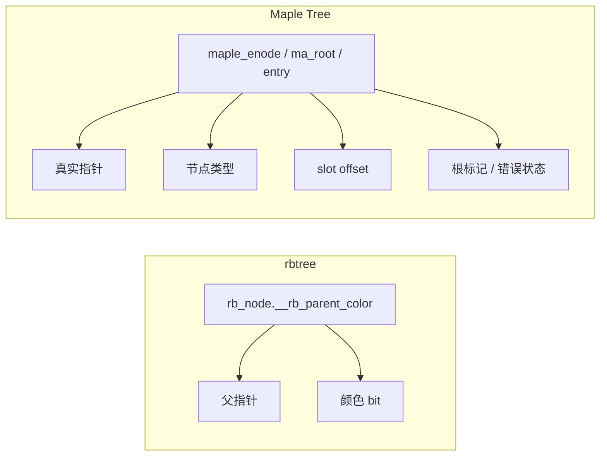
```mermaid
flowchart LR
    subgraph RB["rbtree"]
        RB0["rb_node.__rb_parent_color"]
        RB1["父指针"]
        RB2["颜色 bit"]
        RB0 --> RB1
        RB0 --> RB2
    end

    subgraph MT["Maple Tree"]
        MT0["maple_enode / ma_root / entry"]
        MT1["真实指针"]
        MT2["节点类型"]
        MT3["slot offset"]
        MT4["根标记 / 错误状态"]
        MT0 --> MT1
        MT0 --> MT2
        MT0 --> MT3
        MT0 --> MT4
    end
```

这里有一个很实用的源码阅读原则：

```text
看到 rb_node：
    重点追父子关系和颜色修复。

看到 maple_enode / ma_state.node：
    重点先判断它是裸指针、编码节点、根位置、none、error，还是 pause 状态。
```

------

## 15.6\_struct\_ma\_state\_Maple\_Tree\_高级\_API\_的状态机

如果说 `struct maple_tree` 是树对象，`struct maple_node` 是节点对象，那么 `struct ma_state` 就是“拿着地图在树里走的人”。

高级 API 几乎都围绕 `ma_state` 工作。

源码位置：[include/linux/maple_tree.h](../../../../research/source_reading/linux/include/linux/maple_tree.h)

简化骨架如下，注释译成中文：

```c
struct ma_state {
	struct maple_tree *tree;		/* 当前操作的树 */
	unsigned long index;		/* 当前操作的 index，也就是范围起点 */
	unsigned long last;		/* 当前操作的最后一个 index，也就是范围终点 */
	struct maple_enode *node;	/* 包含当前 entry 的节点 */
	unsigned long min;		/* 当前节点隐含的最小 index */
	unsigned long max;		/* 当前节点隐含的最大 index */
	struct maple_alloc *alloc;	/* 本次操作预分配出来的节点 */
	enum maple_status status;	/* 状态：active、start、none 等 */
	unsigned char depth;		/* 写操作期间下降到树中的深度 */
	unsigned char offset;		/* 当前关注的 slot / pivot 下标 */
	unsigned char mas_flags;
	unsigned char end;		/* 当前节点的末尾 slot */
	enum store_type store_type;	/* 本次 store 需要的写入类型 */
};
```

`ma_state` 里有三组字段最重要。

第一组是“我要操作哪个范围”：

```text
index
last
```

第二组是“我现在在树的哪里”：

```text
node
min
max
depth
offset
end
```

第三组是“我现在处于什么状态”：

```text
status
alloc
store_type
```

`MA_STATE()` 宏就是最常见的初始化方式：

```c
#define MA_STATE(name, mt, first, end)					\
	struct ma_state name = {					\
		.tree = mt,						\
		.index = first,						\
		.last = end,						\
		.node = NULL,						\
		.status = ma_start,					\
		.min = 0,						\
		.max = ULONG_MAX,					\
		.alloc = NULL,						\
		.mas_flags = 0,						\
		.store_type = wr_invalid,				\
	}
```

这段代码可以翻译成一句话：

```text
我要在 mt 这棵树里，从 first 到 end 这个闭区间开始一次 Maple Tree 操作；
当前还没走进树，所以 node = NULL，status = ma_start；
根节点隐含范围先认为是 [0, ULONG_MAX]。
```

`ma_state` 的状态值大致是：

```text
ma_start     还没开始，下一次操作要从根往下走
ma_active    已经定位到树中某个有效位置
ma_root      当前状态指向根位置
ma_none      没有找到 entry
ma_pause     暂停，之前缓存的节点可能已经过期，下次要重新走
ma_overflow  上一次操作撞到了上界
ma_underflow 上一次操作撞到了下界
ma_error     当前状态编码了错误
```

画成状态机：

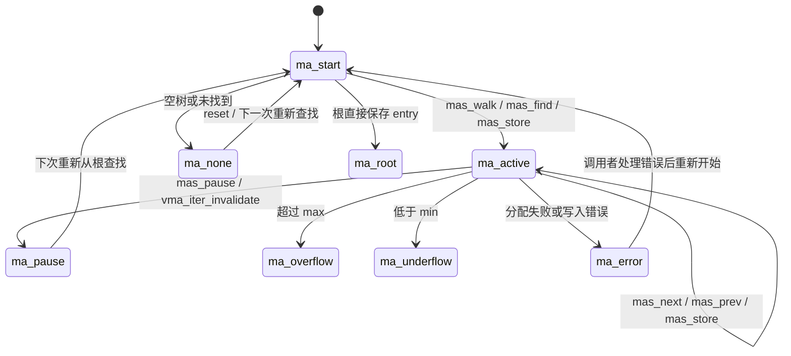
```mermaid
stateDiagram-v2
    [*] --> ma_start
    ma_start --> ma_active: mas_walk / mas_find / mas_store
    ma_start --> ma_none: 空树或未找到
    ma_start --> ma_root: 根直接保存 entry
    ma_active --> ma_active: mas_next / mas_prev / mas_store
    ma_active --> ma_pause: mas_pause / vma_iter_invalidate
    ma_pause --> ma_start: 下次重新从根查找
    ma_active --> ma_overflow: 超过 max
    ma_active --> ma_underflow: 低于 min
    ma_active --> ma_error: 分配失败或写入错误
    ma_none --> ma_start: reset / 下一次重新查找
    ma_error --> ma_start: 调用者处理错误后重新开始
```

这里要特别注意 `ma_pause`。

VMA 修改路径里，树可能发生拆分、合并、删除、替换。如果某个 iterator 手里还缓存着旧节点位置，那么继续用旧位置可能不安全。所以 VMA 封装里有：

```c
static inline void vma_iter_invalidate(struct vma_iterator *vmi)
{
	mas_pause(&vmi->mas);
}
```

它不是“删除 iterator”，而是告诉 `ma_state`：

```text
你之前记住的 node / offset 可能过期了；
下次操作不要相信旧位置，重新从树根定位。
```

这就是高级 API 比普通 API 复杂的地方：它既保存位置以提高连续操作效率，又必须在结构变化后能失效重走。

------

## 15.7\_用一个复杂\_VMA\_场景理解\_ma\_state

假设某进程地址空间里有下面这些 VMA：

```text
A: [0x0000000000400000, 0x0000000000452000)  text
B: [0x0000000000600000, 0x0000000000610000)  rodata
C: [0x0000000000610000, 0x0000000000639000)  data
D: [0x0000000000639000, 0x0000000000660000)  heap
E: [0x00007f1000000000, 0x00007f1000200000)  lib.so text
F: [0x00007f1000200000, 0x00007f1000240000)  lib.so relro
G: [0x00007f1000600000, 0x00007f1000800000)  anonymous mmap
H: [0x00007fff00000000, 0x00007fff00021000)  stack
```

转换到 Maple Tree 里，范围变成：

```text
A: [0x0000000000400000, 0x0000000000451fff]
B: [0x0000000000600000, 0x000000000060ffff]
C: [0x0000000000610000, 0x0000000000638fff]
D: [0x0000000000639000, 0x000000000065ffff]
E: [0x00007f1000000000, 0x00007f10001fffff]
F: [0x00007f1000200000, 0x00007f100023ffff]
G: [0x00007f1000600000, 0x00007f10007fffff]
H: [0x00007fff00000000, 0x00007fff00020fff]
```

现在发生一次缺页异常，地址是：

```c
addr = 0x00007f1000212345
```

这个地址应该命中 F。

如果用 `vma_lookup(mm, addr)`，最终会走：

```text
vma_lookup()
  -> mtree_load(&mm->mm_mt, addr)
       -> MA_STATE(mas, mt, addr, addr)
       -> mas_start()
       -> mtree_lookup_walk()
```

此时 `ma_state` 的语义大概是：

```text
tree  = &mm->mm_mt
index = 0x00007f1000212345
last  = 0x00007f1000212345
min/max = 当前节点隐含范围
node/offset = 查找过程中逐步定位出来
status = 从 ma_start 走向 ma_active
```

如果查到了 F，返回的是 `struct vm_area_struct *F`。

如果这时不是精确 lookup，而是问：

```text
从 0x00007f1000240000 开始，下一个 VMA 是谁？
```

那它应该跳过空洞，返回 G。

这时更像 `find_vma(mm, addr)`：

```text
find_vma()
  -> mt_find(&mm->mm_mt, &index, ULONG_MAX)
       -> MA_STATE(mas, mt, index, index)
       -> mas_state_walk()
       -> 如果当前位置没有 entry，就 mas_next_entry()
```

`mt_find()` 和 `mtree_load()` 的关键差别是：

```text
mtree_load(index):
    只问 index 这个点有没有 entry。

mt_find(&index, max):
    问 index 或 index 之后，直到 max 之间，第一个 entry 是谁。
```

这就是为什么 `find_vma()` 可以返回“命中地址的 VMA，或者地址之后的下一个 VMA”。

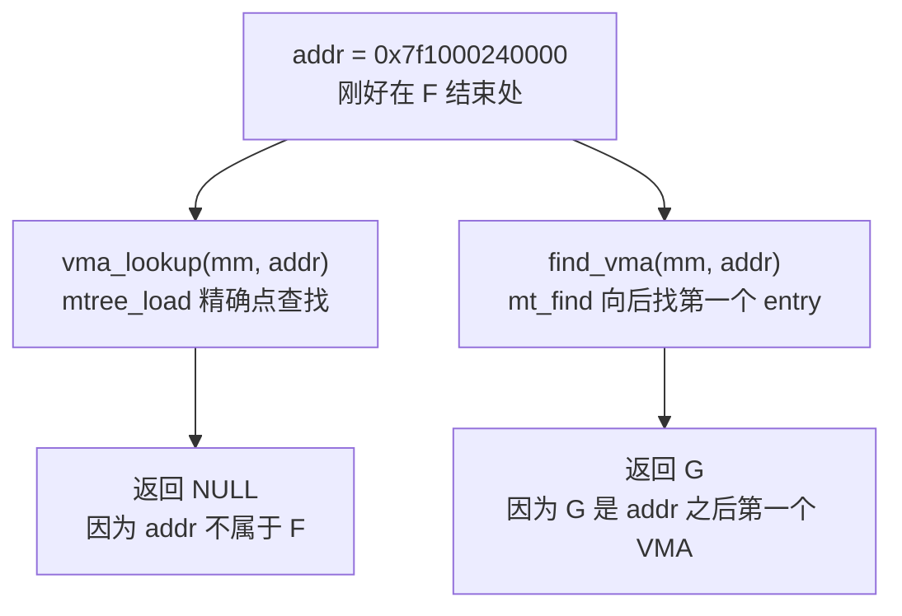
```mermaid
flowchart TD
    ADDR["addr = 0x7f1000240000<br/>刚好在 F 结束处"]

    L["vma_lookup(mm, addr)<br/>mtree_load 精确点查找"]
    FNULL["返回 NULL<br/>因为 addr 不属于 F"]

    FV["find_vma(mm, addr)<br/>mt_find 向后找第一个 entry"]
    VG["返回 G<br/>因为 G 是 addr 之后第一个 VMA"]

    ADDR --> L --> FNULL
    ADDR --> FV --> VG
```

这个差别在读 `mm/mmap.c` 时非常重要。很多时候代码不是在判断“这个地址是否在 VMA 里”，而是在找“这个地址附近的 VMA 布局”。

------

## 15.8\_普通\_API\_mtree\_*()\_和\_mt\_*()

普通 API 的特点是：调用者不用自己维护 `ma_state`。

典型函数声明在 [include/linux/maple_tree.h](../../../../research/source_reading/linux/include/linux/maple_tree.h)：

```c
void *mtree_load(struct maple_tree *mt, unsigned long index);

int mtree_store(struct maple_tree *mt, unsigned long index,
		void *entry, gfp_t gfp);

int mtree_store_range(struct maple_tree *mt, unsigned long first,
		unsigned long last, void *entry, gfp_t gfp);

void *mtree_erase(struct maple_tree *mt, unsigned long index);

void *mt_find(struct maple_tree *mt, unsigned long *index, unsigned long max);
```

### 15.8.1\_mtree\_load()\_精确点查找

源码位置：[lib/maple_tree.c](../../../../research/source_reading/linux/lib/maple_tree.c)

简化并翻译注释后：

```c
/*
 * mtree_load() - 加载 Maple Tree 中某个 index 保存的值
 * @mt: Maple Tree
 * @index: 要加载的 index
 *
 * 返回：entry 或 NULL
 */
void *mtree_load(struct maple_tree *mt, unsigned long index)
{
	MA_STATE(mas, mt, index, index);
	void *entry;

	rcu_read_lock();
retry:
	entry = mas_start(&mas);
	if (unlikely(mas_is_none(&mas)))
		goto unlock;

	if (unlikely(mas_is_ptr(&mas))) {
		if (index)
			entry = NULL;

		goto unlock;
	}

	entry = mtree_lookup_walk(&mas);
	if (!entry && unlikely(mas_is_start(&mas)))
		goto retry;
unlock:
	rcu_read_unlock();
	if (xa_is_zero(entry))
		return NULL;

	return entry;
}
```

这段函数里有几个阅读点：

| 代码 | 含义 |
| --- | --- |
| `MA_STATE(mas, mt, index, index)` | 点查找，把范围起点和终点都设成同一个 index |
| `rcu_read_lock()` | 普通读取可以在 RCU 读侧进行 |
| `mas_start()` | 根据树根情况初始化状态 |
| `mas_is_ptr()` | 根可能直接保存 entry，而不是节点 |
| `mtree_lookup_walk()` | 真正向下走树 |
| `xa_is_zero(entry)` | XArray 风格的 zero entry 特殊处理 |

可以把 `mtree_load()` 理解成 Maple Tree 的“精确命中查询”：

```text
给我一个 index；
如果某个范围覆盖它，返回这个范围对应的 entry；
否则返回 NULL。
```

在 VMA 里，它对应：

```c
static inline
struct vm_area_struct *vma_lookup(struct mm_struct *mm, unsigned long addr)
{
	return mtree_load(&mm->mm_mt, addr);
}
```

### 15.8.2\_mtree\_store\_range()\_范围写入

源码简化后：

```c
/*
 * mtree_store_range() - 在指定范围内保存 entry
 * @mt: Maple Tree
 * @index: 范围起点
 * @last: 范围终点
 * @entry: 要保存的 entry
 * @gfp: 分配内存使用的 GFP 标志
 *
 * 返回：成功为 0；请求非法为 -EINVAL；无法分配内存为 -ENOMEM。
 */
int mtree_store_range(struct maple_tree *mt, unsigned long index,
		unsigned long last, void *entry, gfp_t gfp)
{
	MA_STATE(mas, mt, index, last);
	int ret = 0;

	if (WARN_ON_ONCE(xa_is_advanced(entry)))
		return -EINVAL;

	if (index > last)
		return -EINVAL;

	mtree_lock(mt);
	ret = mas_store_gfp(&mas, entry, gfp);
	mtree_unlock(mt);

	return ret;
}
```

这段函数暴露了普通 API 和高级 API 的关系：

```text
mtree_store_range()
    创建 ma_state
    检查参数
    加锁
    调用 mas_store_gfp()
    解锁
```

也就是说，普通 API 很多时候只是：

```text
帮调用者创建 ma_state
帮调用者处理锁
再转给 mas_* 高级接口
```

这和 rbtree 非常不一样。rbtree 没有这种通用写入 API，使用者必须自己写比较、自己找到插入位置、自己调用 `rb_link_node()` 和 `rb_insert_color()`。

### 15.8.3\_mt\_find()\_从某点向后找第一个\_entry

`mt_find()` 是理解 `find_vma()` 的关键。

源码注释翻译后：

```c
/*
 * 如果找到 entry，@index 会被更新到下一个可能 entry 的位置。
 * 不管找到的 entry 只占一个 index，还是占一段 range，都是如此。
 *
 * 返回：位于 @index 或 @index 之后的 entry；如果没有则返回 NULL。
 */
void *mt_find(struct maple_tree *mt, unsigned long *index, unsigned long max)
{
	MA_STATE(mas, mt, *index, *index);
	void *entry;

	if ((*index) > max)
		return NULL;

	rcu_read_lock();
retry:
	entry = mas_state_walk(&mas);
	if (mas_is_start(&mas))
		goto retry;

	if (unlikely(xa_is_zero(entry)))
		entry = NULL;

	if (entry)
		goto unlock;

	while (mas_is_active(&mas) && (mas.last < max)) {
		entry = mas_next_entry(&mas, max);
		if (likely(entry && !xa_is_zero(entry)))
			break;
	}

	if (unlikely(xa_is_zero(entry)))
		entry = NULL;
unlock:
	rcu_read_unlock();
	if (likely(entry))
		*index = mas.last + 1;

	return entry;
}
```

这段代码有两个细节很关键。

第一个细节：如果 `index` 位置本身没命中，它会继续向后找。

```text
entry = mas_state_walk(&mas)
如果当前位置没有 entry
    while mas.last < max
        entry = mas_next_entry(&mas, max)
```

第二个细节：找到 entry 后，会把 `*index` 更新成 `mas.last + 1`。

这对遍历特别重要：

```text
第一次找到 [100, 199] -> entry A
*index 更新为 200

下一次从 200 继续找
```

这就是为什么 `mt_for_each()` 可以用 `mt_find()` / `mt_find_after()` 实现。

------

## 15.9\_高级\_API\_mas\_*()\_是真正的状态机接口

高级 API 的入口集中在 [include/linux/maple_tree.h](../../../../research/source_reading/linux/include/linux/maple_tree.h)：

```c
void *mas_walk(struct ma_state *mas);
void *mas_store(struct ma_state *mas, void *entry);
void *mas_erase(struct ma_state *mas);
int mas_store_gfp(struct ma_state *mas, void *entry, gfp_t gfp);
void *mas_find(struct ma_state *mas, unsigned long max);
void *mas_find_range(struct ma_state *mas, unsigned long max);
void *mas_find_rev(struct ma_state *mas, unsigned long min);
void *mas_next(struct ma_state *mas, unsigned long max);
void *mas_prev(struct ma_state *mas, unsigned long min);
int mas_empty_area(struct ma_state *mas, unsigned long min,
		   unsigned long max, unsigned long size);
int mas_empty_area_rev(struct ma_state *mas, unsigned long min,
		       unsigned long max, unsigned long size);
```

这些函数可以按用途分成几组：

| 分组 | 函数 | 作用 |
| --- | --- | --- |
| 定位 | `mas_walk()` | 按 `mas->index` / `mas->last` 定位 entry |
| 查找 | `mas_find()`、`mas_find_range()` | 从当前状态向后找 |
| 反向查找 | `mas_find_rev()`、`mas_prev()` | 从当前状态向前找 |
| 写入 | `mas_store()`、`mas_store_gfp()`、`mas_store_prealloc()` | 写入 entry 或范围 |
| 删除 | `mas_erase()` | 删除当前范围 |
| 空洞搜索 | `mas_empty_area()`、`mas_empty_area_rev()` | 找满足 size 的空洞 |
| 预分配 | `mas_preallocate()`、`mas_expected_entries()` | 写入前先准备节点 |
| 状态处理 | `mas_pause()`、`mas_reset()`、`mas_destroy()` | 暂停、重置、释放预分配 |

普通 API 和高级 API 的关系可以画成这样：

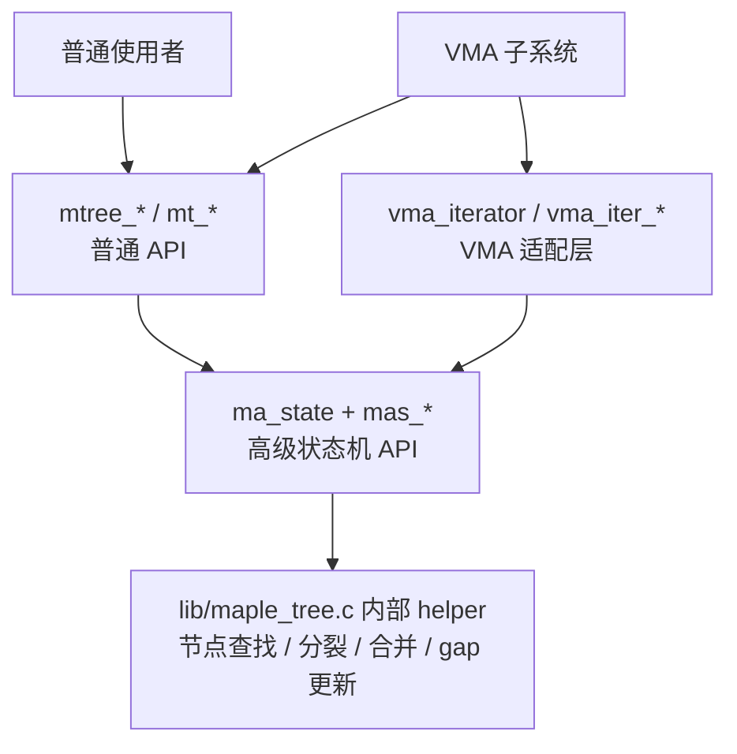
```mermaid
flowchart TD
    USER["普通使用者"]
    VMA["VMA 子系统"]

    MTREE["mtree_* / mt_*<br/>普通 API"]
    VMI["vma_iterator / vma_iter_*<br/>VMA 适配层"]
    MAS["ma_state + mas_*<br/>高级状态机 API"]
    CORE["lib/maple_tree.c 内部 helper<br/>节点查找 / 分裂 / 合并 / gap 更新"]

    USER --> MTREE --> MAS --> CORE
    VMA --> VMI --> MAS
    VMA --> MTREE
```

这里最容易误解的是：`mas_*()` 不是“比 `mtree_*()` 更底层所以普通人别看”。对于 VMA 来说，`mas_*()` 反而是主线，因为 VMA 修改常常是连续的、范围化的、需要复用 iterator 的。

例如 `vma_find()` 就不是直接调用 `mt_find()`，而是调用：

```c
static inline
struct vm_area_struct *vma_find(struct vma_iterator *vmi, unsigned long max)
{
	return mas_find(&vmi->mas, max - 1);
}
```

因为 `vma_iterator` 本身已经持有 `ma_state`，没必要每次都重新构造。

------

## 15.10\_VMA\_接入层\_mm\_struct.mm\_mt

现在看 VMA 是怎么接入 Maple Tree 的。

源码位置：[include/linux/mm_types.h](../../../../research/source_reading/linux/include/linux/mm_types.h)

`struct mm_struct` 里直接包含：

```c
struct maple_tree mm_mt;
```

这表示每个进程地址空间有一棵 Maple Tree，用来索引这个进程的 VMA。

同一个文件里还有：

MM_MT_FLAGS 的组合值见[唯一实现定义](../../../../research/source_reading/maple_tree/source_explanations/include/linux/mm_types.h.md#1.2_VMA树的三项模式)，这里继续观察调用者如何使用它。

这三个标志连起来看，VMA 这棵树的工程语义就很清楚：

```text
ALLOC_RANGE:
    mmap 需要找空洞，所以要使用带 gap 信息的 allocation range 能力。

LOCK_EXTERN:
    VMA 管理由 mmap_lock 等外部锁统筹，不只是 Maple Tree 自己一把锁。

USE_RCU:
    允许读侧在 RCU 语义下快速查找，配合 VMA 并发访问优化。
```

再看 `vma_iterator`：

```c
struct vma_iterator {
	struct ma_state mas;
};
```

它几乎就是 `ma_state` 的一层 VMA 语义包装。

初始化宏：

```c
#define VMA_ITERATOR(name, __mm, __addr)				\
	struct vma_iterator name = {					\
		.mas = {						\
			.tree = &(__mm)->mm_mt,				\
			.index = __addr,				\
			.node = NULL,					\
			.status = ma_start,				\
		},							\
	}
```

这段代码的中文语义是：

```text
创建一个 VMA iterator；
它背后的 Maple Tree 是当前 mm 的 mm_mt；
它从 __addr 这个地址开始；
它还没有进入树，所以 node = NULL，status = ma_start。
```

函数式初始化则是：

```c
static inline void vma_iter_init(struct vma_iterator *vmi,
		struct mm_struct *mm, unsigned long addr)
{
	mas_init(&vmi->mas, &mm->mm_mt, addr);
}
```

所以 VMA 层和 Maple Tree 层的关系非常薄：

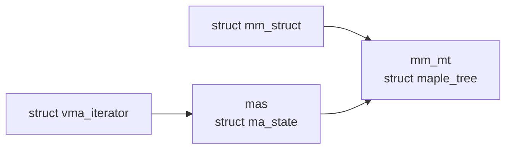
```mermaid
flowchart LR
    MM["struct mm_struct"]
    MT["mm_mt<br/>struct maple_tree"]
    VMI["struct vma_iterator"]
    MAS["mas<br/>struct ma_state"]

    MM --> MT
    VMI --> MAS
    MAS --> MT
```

这种设计的好处是：VM 子系统可以把代码写成 `vma_next()`、`vma_prev()`、`vma_iter_bulk_store()` 这类有 VMA 语义的函数，而不是到处暴露 Maple Tree 的内部状态机细节。

------

## 15.11\_VMA\_封装函数\_把半开区间翻译成\_Maple\_Tree\_闭区间

源码位置：[include/linux/mm.h](../../../../research/source_reading/linux/include/linux/mm.h)

这一组函数是读 VMA 源码的必备入口。

```c
static inline
struct vm_area_struct *vma_find(struct vma_iterator *vmi, unsigned long max)
{
	return mas_find(&vmi->mas, max - 1);
}
```

注意 `max - 1`。

这说明 VMA 层传进来的 `max` 是半开区间右边界，而 `mas_find()` 需要闭区间最大值。

再看：

```c
static inline struct vm_area_struct *vma_next(struct vma_iterator *vmi)
{
	/*
	 * 使用 mas_find() 取得 iterator 开始位置上的第一个 VMA。
	 * 如果调用 mas_next()，可能会跳过第一个 entry。
	 */
	return mas_find(&vmi->mas, ULONG_MAX);
}
```

这个注释很值得停一下。

直觉上，“下一个 VMA”好像应该调用 `mas_next()`。但源码说不能这样，因为 iterator 刚开始时，当前位置本身可能就是第一个 VMA。如果直接 `mas_next()`，就可能把它跳过去。

所以 `vma_next()` 第一次也用 `mas_find()`。

其他几个封装：

```c
static inline
struct vm_area_struct *vma_iter_next_range(struct vma_iterator *vmi)
{
	return mas_next_range(&vmi->mas, ULONG_MAX);
}

static inline struct vm_area_struct *vma_prev(struct vma_iterator *vmi)
{
	return mas_prev(&vmi->mas, 0);
}

static inline int vma_iter_clear_gfp(struct vma_iterator *vmi,
			unsigned long start, unsigned long end, gfp_t gfp)
{
	__mas_set_range(&vmi->mas, start, end - 1);
	mas_store_gfp(&vmi->mas, NULL, gfp);
	if (unlikely(mas_is_err(&vmi->mas)))
		return -ENOMEM;

	return 0;
}

static inline int vma_iter_bulk_store(struct vma_iterator *vmi,
				      struct vm_area_struct *vma)
{
	vmi->mas.index = vma->vm_start;
	vmi->mas.last = vma->vm_end - 1;
	mas_store(&vmi->mas, vma);
	if (unlikely(mas_is_err(&vmi->mas)))
		return -ENOMEM;

	return 0;
}
```

可以看到 VMA 层反复做同一个转换：

```text
VMA:
    [start, end)

Maple Tree:
    [start, end - 1]
```

这不是细枝末节。munmap、mprotect、mremap 这类路径里，只要边界弄错 1，就可能造成：

```text
1. 少删最后一页；
2. 多删下一段 VMA 的第一页；
3. range intersection 判断错误；
4. gap search 返回不该返回的地址；
5. page fault 找到错误 VMA。
```

下面这张图把 VMA 封装函数按用途分开：

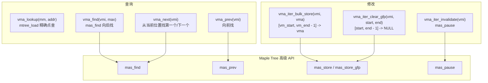
```mermaid
flowchart TD
    subgraph QUERY["查询"]
        Q1["vma_lookup(mm, addr)<br/>mtree_load 精确点查"]
        Q2["vma_find(vmi, max)<br/>mas_find 向后找"]
        Q3["vma_next(vmi)<br/>从当前位置找第一个/下一个"]
        Q4["vma_prev(vmi)<br/>向前找"]
    end

    subgraph WRITE["修改"]
        W1["vma_iter_bulk_store(vmi, vma)<br/>[vm_start, vm_end - 1] -> vma"]
        W2["vma_iter_clear_gfp(vmi, start, end)<br/>[start, end - 1] -> NULL"]
        W3["vma_iter_invalidate(vmi)<br/>mas_pause"]
    end

    subgraph CORE["Maple Tree 高级 API"]
        M1["mas_find"]
        M2["mas_prev"]
        M3["mas_store / mas_store_gfp"]
        M4["mas_pause"]
    end

    Q2 --> M1
    Q3 --> M1
    Q4 --> M2
    W1 --> M3
    W2 --> M3
    W3 --> M4
```

------

## 15.12\_VMA的三个查找入口

VMA 相关源码里经常出现三个名字：

```text
vma_lookup()
find_vma()
find_vma_intersection()
```

它们不是同义词。

### 15.12.1\_vma\_lookup()\_只查这个地址有没有\_VMA

源码位置：[include/linux/mm.h](../../../../research/source_reading/linux/include/linux/mm.h)

完整固定版本函数体及仓库补充注释见[唯一实现讲解](../../../../research/source_reading/maple_tree/source_explanations/include/linux/mm.h.md#1.2_vma_lookup只查询当前地址)。这里继续用查询结果对照其职责，不重复展开函数体。

语义：

```text
addr 必须落在某个 VMA 范围内，才返回这个 VMA。
如果 addr 位于两个 VMA 之间的 gap，返回 NULL。
```

### 15.12.2\_find\_vma()\_查这个地址\_或者地址之后的第一个\_VMA

源码位置：[mm/mmap.c](../../../../research/source_reading/linux/mm/mmap.c)

完整固定版本函数体及仓库补充注释见[唯一实现讲解](../../../../research/source_reading/maple_tree/source_explanations/mm/mmap.c.md#1.2_find_vma与上界)。这里继续用查询结果对照其职责，不重复展开函数体。

语义：

```text
如果 addr 命中某个 VMA，返回它；
否则返回 addr 之后的第一个 VMA。
```

这和很多页表或内存布局检查有关，因为内核经常需要知道“当前位置附近的 VMA 顺序”。

### 15.12.3\_find\_vma\_intersection()\_查范围是否与\_VMA\_相交

源码位置：[mm/mmap.c](../../../../research/source_reading/linux/mm/mmap.c)

完整固定版本函数体及仓库补充注释见[唯一实现讲解](../../../../research/source_reading/maple_tree/source_explanations/mm/mmap.c.md#1.3_find_vma_intersection翻译排除式终点)。这里继续用查询结果对照其职责，不重复展开函数体。

它和 `find_vma()` 的关键差别是上界：

```text
find_vma():
    max = ULONG_MAX

find_vma_intersection(start, end):
    max = end - 1
```

所以 `find_vma_intersection()` 只在指定范围内找，不会越过 `end_addr` 找到后面的 VMA。

下面用复杂例子对比三者。

```text
VMA:

A: [0x400000, 0x452000)
B: [0x600000, 0x610000)
C: [0x610000, 0x639000)
D: [0x639000, 0x660000)
```

查询：

| 调用 | 结果 | 原因 |
| --- | --- | --- |
| `vma_lookup(mm, 0x500000)` | `NULL` | `0x500000` 在 A 和 B 之间的 gap |
| `find_vma(mm, 0x500000)` | B | B 是 `0x500000` 之后第一个 VMA |
| `find_vma_intersection(mm, 0x500000, 0x580000)` | `NULL` | `[0x500000, 0x580000)` 范围内没有 VMA |
| `find_vma_intersection(mm, 0x500000, 0x601000)` | B | B 与该范围相交 |
| `vma_lookup(mm, 0x610000)` | C | `0x610000` 是 C 的起点，不属于 B |

图示：

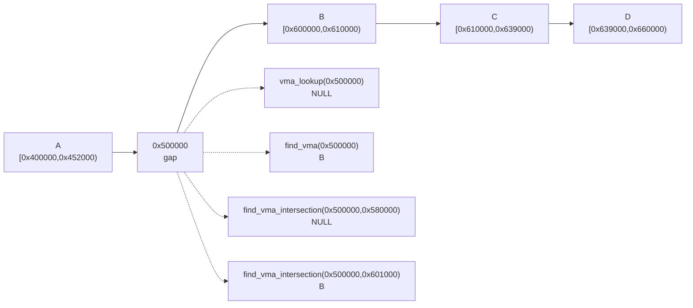
```mermaid
flowchart LR
    GAP["0x500000<br/>gap"]
    A["A<br/>[0x400000,0x452000)"]
    B["B<br/>[0x600000,0x610000)"]
    C["C<br/>[0x610000,0x639000)"]
    D["D<br/>[0x639000,0x660000)"]

    A --> GAP --> B --> C --> D

    L1["vma_lookup(0x500000)<br/>NULL"]
    F1["find_vma(0x500000)<br/>B"]
    I1["find_vma_intersection(0x500000,0x580000)<br/>NULL"]
    I2["find_vma_intersection(0x500000,0x601000)<br/>B"]

    GAP -.-> L1
    GAP -.-> F1
    GAP -.-> I1
    GAP -.-> I2
```

这些封装把范围和向后搜索的契约集中在 VMA/Maple 接口上；红黑树也能实现相同查询，不能由接口名称反推只有 Maple 才能查前驱或后继。

------

## 15.13\_find\_vma\_prev()\_为什么还要找\_previous

`find_vma_prev()` 在 [mm/mmap.c](../../../../research/source_reading/linux/mm/mmap.c) 里：

完整固定版本函数体及仓库补充注释见[唯一实现讲解](../../../../research/source_reading/maple_tree/source_explanations/mm/mmap.c.md#1.4_find_vma_prev保持两个结果)。这里继续用查询结果对照其职责，不重复展开函数体。

这个函数说明一件事：即使不再有全局 VMA 链表，VM 子系统仍然需要“前驱 / 后继”语义。

例如 mmap 新区域、扩展栈、合并 VMA 时，都需要看相邻 VMA：

```text
prev 是否能和新 VMA 合并？
next 是否能和新 VMA 合并？
prev 和 next 之间的 gap 是否够大？
addr 是否正好落在 prev 结束处？
```

复杂例子：

```text
prev: [0x0000000000600000, 0x0000000000610000)  rodata
vma : [0x0000000000610000, 0x0000000000639000)  data
next: [0x0000000000639000, 0x0000000000660000)  heap

addr = 0x0000000000618000
```

此时：

```text
vma_iter_load(&vmi) 命中 data；
vma_prev(&vmi) 返回 rodata；
函数返回 data，同时 pprev = rodata。
```

如果：

```c
addr = 0x0000000000500000
```

它位于 text 和 rodata 之间的 gap：

```text
vma_iter_load(&vmi) 返回 NULL；
vma_prev(&vmi) 返回 text；
vma_next(&vmi) 返回 rodata；
函数返回 rodata，同时 pprev = text。
```

图示：

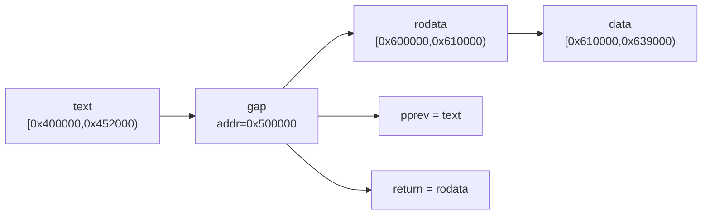
```mermaid
flowchart LR
    T["text<br/>[0x400000,0x452000)"]
    GAP["gap<br/>addr=0x500000"]
    R["rodata<br/>[0x600000,0x610000)"]
    D["data<br/>[0x610000,0x639000)"]

    T --> GAP --> R --> D

    GAP --> P["pprev = text"]
    GAP --> V["return = rodata"]
```

这类“同时拿到当前位置和前驱”的需求，就是 `vma_iterator` 封装存在的原因之一。

------

## 15.14\_page\_fault\_unmap\_free\_pgtables\_为什么也会碰\_Maple\_Tree

不要把 Maple Tree 只理解成 `mmap()` 时用的数据结构。

只要内核需要从虚拟地址找到 VMA，就会碰到它。

几个典型路径：

| 路径 | 为什么需要 VMA |
| --- | --- |
| page fault | fault 地址是否合法？权限是否允许？是匿名页、文件映射、栈增长还是特殊映射？ |
| `munmap()` | 删除范围内有哪些 VMA？是否要拆分边界 VMA？ |
| `mprotect()` | 修改权限的范围覆盖哪些 VMA？是否需要拆分、合并？ |
| `free_pgtables()` | 释放页表时需要按 VMA 边界遍历 |
| `unmap_vmas()` | 解除映射时要逐段处理 VMA |

[mm/memory.c](../../../../research/source_reading/linux/mm/memory.c) 里可以看到 `free_pgtables()` 和 `unmap_vmas()` 都接收 `struct ma_state *mas`：

```c
void free_pgtables(struct mmu_gather *tlb, struct ma_state *mas,
		   struct vm_area_struct *vma, unsigned long floor,
		   unsigned long ceiling, bool mm_wr_locked)
```

以及：

```c
void unmap_vmas(struct mmu_gather *tlb, struct ma_state *mas,
		struct vm_area_struct *vma, unsigned long start_addr,
		unsigned long end_addr, unsigned long tree_end,
		bool mm_wr_locked)
```

这说明 memory 管理路径不是只拿一个 `vma` 就完事，而是经常拿着 `ma_state` 继续往后遍历。

一个典型的 unmap 场景：

```text
用户调用：
munmap(0x00007f1000100000, 0x00600000)

覆盖范围：
[0x00007f1000100000, 0x00007f1000700000)

已有 VMA：
E: [0x00007f1000000000, 0x00007f1000200000)
F: [0x00007f1000200000, 0x00007f1000240000)
G: [0x00007f1000600000, 0x00007f1000800000)
```

这不是简单删除三个节点，而是：

```text
E 左半段保留，右半段被删；
F 整段被删；
G 左半段被删，右半段保留。
```

也就是说，VM 子系统需要：

```text
1. 找到第一个相交 VMA；
2. 沿 Maple Tree 继续遍历相交范围；
3. 必要时拆分边界 VMA；
4. 把删除范围从 mm_mt 中清掉；
5. 继续处理页表、反向映射、TLB gather 等工作。
```

图示：

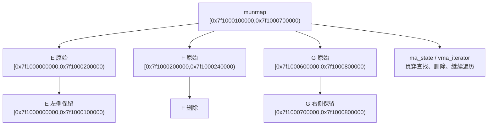
```mermaid
flowchart TD
    U["munmap<br/>[0x7f1000100000,0x7f1000700000)"]

    E["E 原始<br/>[0x7f1000000000,0x7f1000200000)"]
    F["F 原始<br/>[0x7f1000200000,0x7f1000240000)"]
    G["G 原始<br/>[0x7f1000600000,0x7f1000800000)"]

    E1["E 左侧保留<br/>[0x7f1000000000,0x7f1000100000)"]
    F1["F 删除"]
    G1["G 右侧保留<br/>[0x7f1000700000,0x7f1000800000)"]

    U --> E
    U --> F
    U --> G
    E --> E1
    F --> F1
    G --> G1

    U --> MAS["ma_state / vma_iterator<br/>贯穿查找、删除、继续遍历"]
```

这就是后续读 `do_vmi_munmap()`、`do_vmi_align_munmap()` 时必须带着 `ma_state` 视角的原因。

------

## 15.15\_ma\_state\_和\_VMA\_iterator\_的一张总图

把前面的内容合并，可以得到下面这张源码调用地图。

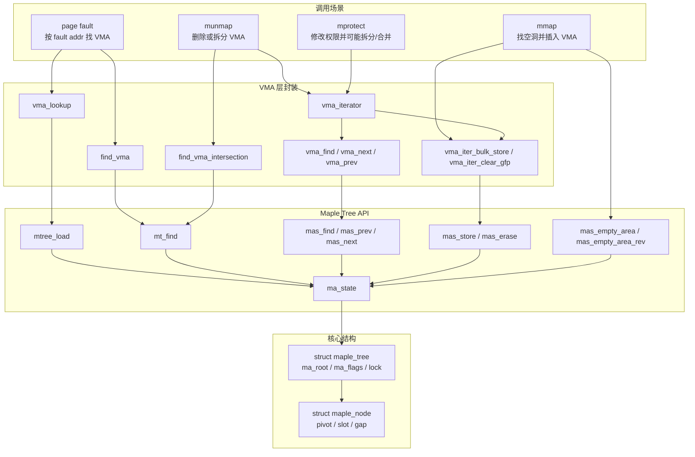
```mermaid
flowchart TD
    subgraph USERPATH["调用场景"]
        PF["page fault<br/>按 fault addr 找 VMA"]
        MMAP["mmap<br/>找空洞并插入 VMA"]
        MUNMAP["munmap<br/>删除或拆分 VMA"]
        MPROTECT["mprotect<br/>修改权限并可能拆分/合并"]
    end

    subgraph VMAAPI["VMA 层封装"]
        VL["vma_lookup"]
        FV["find_vma"]
        FVI["find_vma_intersection"]
        VMI["vma_iterator"]
        VIF["vma_find / vma_next / vma_prev"]
        VIS["vma_iter_bulk_store / vma_iter_clear_gfp"]
    end

    subgraph MTAPI["Maple Tree API"]
        ML["mtree_load"]
        MF["mt_find"]
        MAS["ma_state"]
        MASF["mas_find / mas_prev / mas_next"]
        MASS["mas_store / mas_erase"]
        GAP["mas_empty_area / mas_empty_area_rev"]
    end

    subgraph CORE["核心结构"]
        TREE["struct maple_tree<br/>ma_root / ma_flags / lock"]
        NODE["struct maple_node<br/>pivot / slot / gap"]
    end

    PF --> VL
    PF --> FV
    MMAP --> GAP
    MMAP --> VIS
    MUNMAP --> FVI
    MUNMAP --> VMI
    MPROTECT --> VMI

    VL --> ML
    FV --> MF
    FVI --> MF
    VMI --> VIF
    VMI --> VIS
    VIF --> MASF
    VIS --> MASS

    ML --> MAS
    MF --> MAS
    MASF --> MAS
    MASS --> MAS
    GAP --> MAS

    MAS --> TREE
    TREE --> NODE
```

这张图里最重要的关系是：

```text
VMA 不是绕过 Maple Tree API 直接操作节点。
VMA 主要通过 vma_iterator / vma_iter_* 把 VMA 半开区间翻译成 Maple Tree 闭区间，
然后交给 ma_state / mas_* 状态机。
```

------

## 15.16\_这一章没有展开的内容

本章只是源码结构和 API 分层，不展开这些细节：

```text
1. mas_store() 如何判断写入类型；
2. 节点满了之后如何 split；
3. 删除后如何合并或再平衡；
4. gap[] 如何更新；
5. RCU 模式下删除节点如何延迟释放；
6. 预分配节点链 maple_alloc 如何服务复杂写路径；
7. do_vmi_munmap() 如何拆 VMA、清 Maple Tree、释放页表；
8. mmap 找空洞时 bottom-up / top-down 分别如何调用 mas_empty_area。
```

这些内容如果塞进同一章，文件会再次膨胀，而且阅读顺序会变差。

更合理的拆法是：

| 后续章节 | 建议主题 | 核心问题 |
| --- | --- | --- |
| 第 16 章 | Maple Tree 查找路径：`mtree_load()`、`mt_find()`、`mas_find()` | 点查找、后继查找、范围遍历到底怎么走节点 |
| 第 17 章 | Maple Tree 写入路径：`mas_store()`、节点分裂与范围覆盖 | 插入、替换、覆盖、删除 NULL entry 如何影响树结构 |
| 第 18 章 | Maple Tree gap search：`mas_empty_area()` 与 mmap 地址选择 | mmap 如何找空洞，`gap[]` 如何避免线性扫描 |
| 第 19 章 | VMA 修改源码：`mmap()`、`munmap()`、`mprotect()` | VM 子系统如何用 iterator 串起查找、拆分、合并、删除 |

这样拆的好处是：

```text
第 15 章先让你知道“有哪些门”；
第 16 章专门讲“怎么查”；
第 17 章专门讲“怎么写”；
第 18 章专门讲“怎么找空洞”；
第 19 章再回到 VMA 场景，看 mmap/munmap/mprotect 如何组合这些能力。
```

------

## 15.17\_本章小结

本章先把 Maple Tree 源码阅读的入口搭起来了。

几个结论要记住：

1. `struct maple_tree` 是树对象，核心字段是 `ma_root`、`ma_flags` 和锁语义。
2. `struct maple_node` 是多路节点，不是二叉节点；64 位下 range 节点和 allocation range 节点容量不同。
3. `pivot[]` 是范围边界，不是普通 B-Tree 里“唯一 key”的完全等价物；同下标 pivot 是 slot 的包含式上界。
4. `ma_state` 是高级 API 的状态机，保存当前树、操作范围、节点位置、隐含边界、状态和预分配节点。
5. `mtree_*()` / `mt_*()` 是普通接口，常常内部创建 `ma_state` 再转给 `mas_*()`。
6. VMA 层主要通过 `vma_iterator` 包装 `ma_state`，把 `[vm_start, vm_end)` 翻译成 `[vm_start, vm_end - 1]`。
7. `vma_lookup()` 是精确点查找，`find_vma()` 是“当前或后继”查找，`find_vma_intersection()` 是范围相交查找。
8. 后面继续读源码时，不要把 Maple Tree 当成“带更多孩子的红黑树”；它的核心是范围、状态机、gap 信息和工程并发语义。

到这里，源码地图已经有了。下一章就可以开始专门拆查找路径：从 `mtree_load()` 到 `mas_walk()`，再到节点里的 `pivot[]` / `slot[]` 如何决定下降方向。
