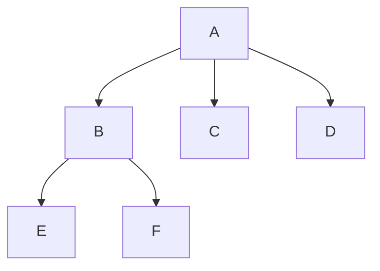
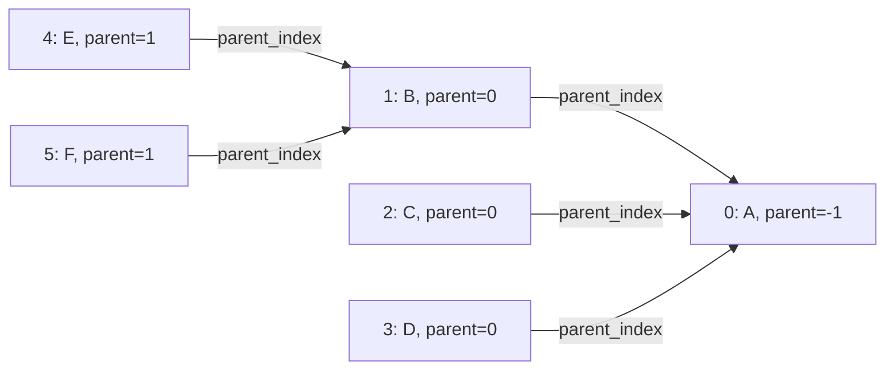
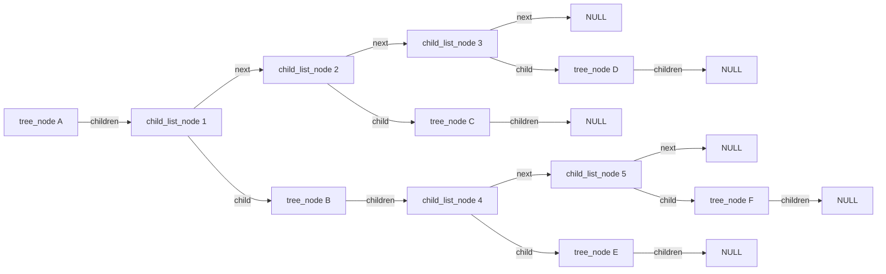
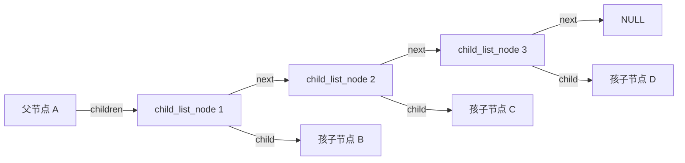
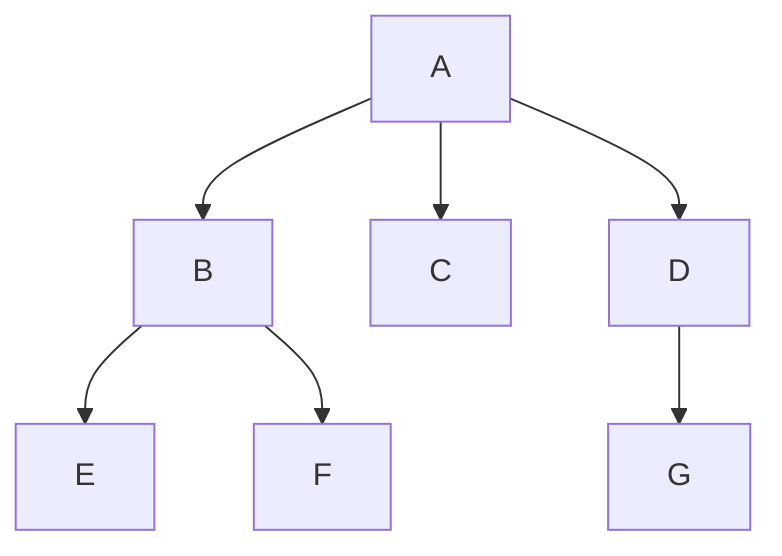
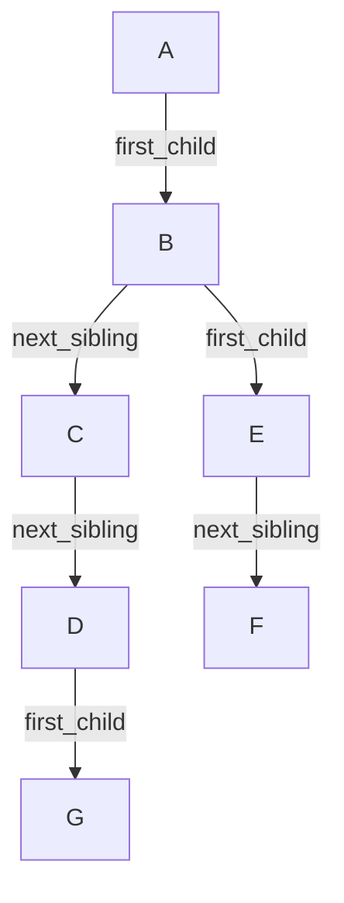
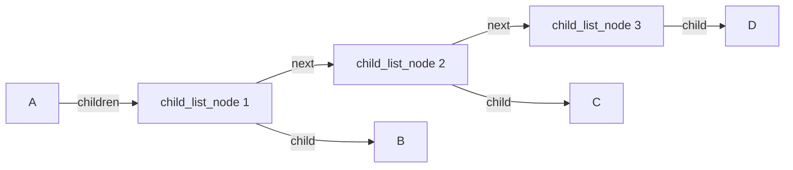
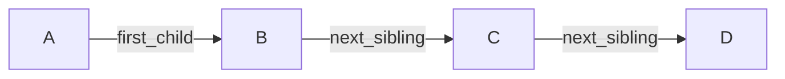

# 第16章\_普通树的表示与构建实验

先完成[P01 的树关系](P01_树的基本概念.md)，再读本章，之后进入[P02 二叉树](P02_二叉树.md)。这里的 P16 是稳定文件编号，不要求先读完 P02～P15。逻辑上仍是同一棵树，但“从孩子找父亲”和“从父亲列出孩子”需要的数据不同；我们按操作需求比较表示，再运行完整 C 程序。

前面讨论的是树的数学和结构概念。
这一节开始进入程序实现视角：树在代码中到底如何表示。

普通树与二叉树不同。
二叉树一个节点最多两个孩子，因此结构相对固定。
但普通树中，一个节点的子节点数量不固定，所以表示方式更多。

这一节重点讲常见的几种表示法：

- 顺序存储
- 双亲表示法
- 孩子表示法
- 孩子兄弟表示法

你不需要在这一章把所有实现细节都背住，但必须知道：

- 每种表示法在表达什么关系
- 它擅长什么操作
- 它的限制在哪里

------

## 16.1\_顺序存储与链式存储

逻辑父子关系并不决定物理地址。先固定“节点放在哪里”这一比较轴：连续数组可以用下标表达联系，独立节点可以用字段保存联系。后面的三种表示再分别回答怎样找父亲或列出孩子。

### 16.1.1\_顺序存储

顺序存储是指：
用一段连续存储单元来保存树的节点信息。

对于普通树，顺序存储并不天然方便，因为：

- 每个节点孩子数不固定
- 层级关系不规则
- 很难用简单下标公式直接定位所有父子关系

但对于某些特殊树，例如**完全二叉树**，顺序存储就非常合适。

完全二叉树先填满较浅层，最后一层从左到右连续占用位置；后续 P02 会展开这个形状定义。这里先看一个已填满三层的小例子，按层顺序放到数组里：

```text
下标: 0  1  2  3  4  5  6
值  : A  B  C  D  E  F  G
```

则常见关系可以用下标表达：

- 父节点下标为 `i`
- 左孩子下标为 `2 * i + 1`
- 右孩子下标为 `2 * i + 2`

这就是堆常用的数组表示方法。

### 16.1.2\_顺序存储的优点

- 内存连续
- 下标访问快
- 对完全二叉树非常自然
- 不需要显式指针域

### 16.1.3\_顺序存储的局限

对于普通树或不规则二叉树，问题很明显：

- 空洞可能很多
- 父子关系不容易统一表达
- 节点增删不灵活

所以顺序存储不是“树的一般表达方式”，而更适合规则较强的特殊树。

------

### 16.1.4\_链式存储

链式存储是指：
节点中显式保存结构连接信息，例如父指针、子指针、兄弟指针等。

它的优点是：

- 结构灵活
- 适合动态插入删除
- 更容易表达不规则树
- 更符合大多数高级树结构的实际实现方式

后面你学习：

- 二叉树
- BST
- 红黑树
- Linux 内核 `rbtree`

主要都会落在链式表示上。

------

## 16.2\_双亲表示法

双亲表示法的核心思想是：

> 每个节点单独占用一个表项，表项中不仅保存节点自身的数据，还保存其父节点在整张表中的位置。

它强调的是**向上关系**，也就是：

- 当前节点是谁
- 当前节点的父节点是谁
- 父节点在表中的哪个位置

因此，这种表示法最直接支持的操作不是“找孩子”，而是“找父节点”与“沿父链向上回溯”。

------

### 16.2.1\_逻辑形式

可以定义如下节点表项：

TREE_PARENT_NONE 是本例定义的“没有父项”哨兵宏，取 -1；value 与 parent_index 分别保存业务值和父项下标。下面各表示法的 tree_node 定义彼此独立，不是要求把同名结构体重复放入一个 C 源文件。

```c
#define TREE_PARENT_NONE	(-1)

struct parent_repr_node {
	int value;
	int parent_index;
};
```

其中：

- `value` 表示节点值
- `parent_index` 表示该节点父节点在数组中的下标
- 根节点没有父节点，因此通常记为 `TREE_PARENT_NONE`，这里取值为 `-1`

这说明：
双亲表示法并不直接保存“孩子链表”或“第一个孩子 / 下一个兄弟”之类的信息，而是把整棵树放进一个线性表中，再通过“父节点下标”恢复节点之间的层次关系。

------

### 16.2.2\_树结构示例

设有如下树：



这棵树的层次关系是：

- `A` 是根节点
- `B`、`C`、`D` 是 `A` 的孩子
- `E`、`F` 是 `B` 的孩子

------

### 16.2.3\_双亲表示法下的存储结果

如果用双亲表示法来表示这棵树，可以得到如下表：

| 下标 | 节点 | parent_index |
| ---- | ---- | ------------ |
| 0    | A    | -1           |
| 1    | B    | 0            |
| 2    | C    | 0            |
| 3    | D    | 0            |
| 4    | E    | 1            |
| 5    | F    | 1            |

这张表的含义是：

- `A` 位于下标 `0`，它没有父节点，所以 `parent_index = -1`
- `B` 的父节点是 `A`，而 `A` 在表中的位置是 `0`，所以 `B.parent_index = 0`
- `E` 的父节点是 `B`，而 `B` 在表中的位置是 `1`，所以 `E.parent_index = 1`

因此，这张表本质上就是：

> 每个节点通过一个整数下标，指向它的父节点表项。

------

### 16.2.4\_结构图

如果把上面的数组关系画成结构图，可以理解成下面这样：



这张图不是在画“父节点直接指向孩子”的树边，而是在画：

> 每个表项内部的 `parent_index` 最终指向哪个父节点表项。

所以，双亲表示法的恢复方式是“由子找父”，而不是“由父直接枚举全部孩子”。

------

### 16.2.5\_应该怎样理解这种表示法

双亲表示法有一个非常明确的特点：

- **父节点信息是直接保存的**
- **孩子节点信息不是直接保存的**

也就是说：

#### (1)\_找父节点很直接

例如要找 `F` 的父节点：

- 先找到 `F` 的表项，下标为 `5`
- 读取 `parent_index = 1`
- 再到表中查下标 `1`
- 得到父节点是 `B`

这个过程只需要一次整数索引跳转。

------

#### (2)\_找祖先链也很直接

例如从 `F` 一路向上找到根：

- `F.parent_index = 1`，父节点是 `B`
- `B.parent_index = 0`，父节点是 `A`
- `A.parent_index = -1`，到达根节点

所以路径为：

```text
F -> B -> A
```

这正是双亲表示法最擅长的地方。

------

#### (3)\_找孩子不直接

例如要找 `A` 的所有孩子，表中并没有一项写着：

```c
A.children = {B, C, D}
```

你必须扫描整张表，找出所有满足下面条件的节点：

```text
parent_index == A所在下标
```

如果 `A` 在下标 `0`，那么你要扫描整个数组，找出：

- `B.parent_index == 0`
- `C.parent_index == 0`
- `D.parent_index == 0`

这就是双亲表示法“向上方便，向下不方便”的本质原因。

------

### 16.2.6\_访问示例

下面给出两个典型操作示例。

两段辅助函数假定 node_index 和所有父索引均合法，且父链无环并以 TREE_PARENT_NONE 结束。它们演示访问方向，不是对任意输入提供越界和成环检测的接口。

------

#### (1)\_根据节点下标找父节点

```c
static int get_parent_index(const struct parent_repr_node *nodes,
			    int node_index)
{
	return nodes[node_index].parent_index;
}
```

如果传入的是 `F` 所在下标 `5`，则返回值为 `1`，表示它的父节点在表中的下标是 `1`。

------

#### (2)\_根据节点下标向上回溯到根

```c
static void print_to_root(const struct parent_repr_node *nodes,
			  int node_index)
{
	while (node_index != TREE_PARENT_NONE) {
		printf("%d ", nodes[node_index].value);
		node_index = nodes[node_index].parent_index;
	}
}
```

这个过程的逻辑非常直接：

- 先访问当前节点
- 再跳到它的父节点
- 一直重复，直到遇到根节点的 `TREE_PARENT_NONE`

因此，双亲表示法天然适合实现“从当前节点回溯到根”的操作。

------

### 16.2.7\_优点

双亲表示法的优点主要有以下几点：

- 结构简单，每个节点只需保存一个父节点下标
- 存储开销较小，不需要额外孩子链表或多个指针字段
- 查找父节点非常直接
- 适合做“向上回溯”类操作，例如查祖先、回溯路径、判断层级关系
- 如果节点总量固定，表结构实现比较稳定

------

### 16.2.8\_缺点

双亲表示法的缺点也非常明确：

- 找孩子节点不直接
- 找某个节点的全部孩子时，必须扫描整张表
- 不适合频繁进行“从父节点向下枚举所有孩子”的操作
- 如果树很大，向下查找的代价会比较高
- 对以“孩子访问”为主的树结构算法不够友好

也就是说：

> 它把“父信息”做成了直接索引，却把“孩子信息”变成了隐含关系。

------

### 16.2.9\_适用场景

双亲表示法更适合以下场景：

- 需要经常查找父节点
- 需要经常做祖先路径回溯
- 节点数量相对固定
- 树结构变化不频繁
- 更关注层级归属关系，而不是频繁做向下扩展

例如：

- 从某个节点回溯到根
- 查某节点的父节点或祖先节点
- 判断两个节点是否属于同一祖先分支
- 静态层级结构的存储

------

### 16.2.10\_和后续树结构实现的关系

双亲表示法通常不适合作为后续查找树、AVL 树、红黑树等结构的核心表示方式。

原因不是它不能表示树，而是因为这些树的核心操作高度依赖：

- 从当前节点快速访问左孩子 / 右孩子
- 沿着向下路径做查找、插入、旋转、重平衡

而双亲表示法并不擅长“向下访问”，它更擅长的是“向上回溯”。

所以在普通树的几种表示法里，双亲表示法更像是一种：

> 适合静态层级记录和祖先关系分析的表式表示法

而不是一种面向高频向下操作的动态链式结构。

------

### 16.2.11\_小结

双亲表示法的本质可以概括为：

> 把树中每个节点放到一张表里，并让每个节点通过 `parent_index` 记录自己的父节点位置。

因此：

- 它最擅长的是“由子找父”
- 它不擅长的是“由父找全部孩子”

你可以直接记住这句话：

> **双亲表示法强调的是向上关系。**
> **节点知道自己的父节点是谁，但父节点并不直接保存自己的孩子集合。**

------

## 16.3\_孩子表示法

下面是孩子表示法的代码简易描述：

**原始代码**

```c
struct child_list_node {
	struct tree_node *child;		// 指向本条记录对应的孩子节点
	struct child_list_node *next;	// 指向同一父节点的下一条孩子记录
};

struct tree_node {
	int value;
	struct child_list_node *children;
};
```

------

### 16.3.1\_先看它想表示的树

假设树结构是这样：


含义：

- `A` 的孩子是 `B C D`
- `B` 的孩子是 `E F`

------

### 16.3.2\_这段代码对应的内存组织图

这段代码不是让树节点直接互相串起来，而是：

- `tree_node.children` 指向一条“孩子链表”
- 链表中的每个 `child_list_node` 记录一个孩子
- `child` 指向真正的孩子节点
- `next` 指向下一个孩子链表节点

图如下：



------

### 16.3.3\_字段语义直接对应说明

#### (1)\_children

```c
struct child_list_node *children;
```

它表示：

> 当前树节点的孩子链表头指针

例如：

- `A.children` 指向 `EA1`
- `B.children` 指向 `EB1`

------

#### (2)\_child

```c
struct tree_node *child;
```

它表示：

> 当前这个 `child_list_node` 记录的那个孩子节点是谁

例如：

- `EA1.child = B`
- `EA2.child = C`
- `EA3.child = D`

所以 `child` 不是：

- 不是孩子链表头
- 不是状态机指针
- 不是“下一个孩子”

它就是：

> 这个链表节点对应的真正孩子节点

------

#### (3)\_next

```c
struct child_list_node *next;
```

它表示：

> 下一个孩子链表节点是谁

例如：

- `EA1.next = EA2`
- `EA2.next = EA3`

所以 `next` 串起来的是：

> `child_list_node` 链表节点

不是直接串 `tree_node`

------

### 16.3.4\_为什么你会觉得它像\_兄弟关系

因为从语义上看，`EA1`、`EA2`、`EA3` 分别对应 `B`、`C`、`D`。

所以：

- `EA1.next = EA2`
- `EA2.next = EA3`

就等价于：

- `B` 后面是 `C`
- `C` 后面是 `D`

也就是说：

> 在 `child_list_node` 这一层，`next` 确实表示同一父节点下孩子的兄弟顺序

但它的类型仍然是：

```c
struct child_list_node *next;
```

不是：

```c
struct tree_node *next;
```

所以更准确地说：

> **语义上它表达兄弟顺序**
> **实现上它链接的是兄弟孩子对应的链表节点**

------

### 16.3.5\_把\_实现层\_和\_语义层\_同时放在一张图里



这张图里同时成立两句话：

#### (1)\_实现层

- `E1.next = E2`
- `E2.next = E3`

说明：

> `next` 连的是 `child_list_node`

------

#### (2)\_语义层

- `E1.child = B`
- `E2.child = C`
- `E3.child = D`

说明：

> `E1.next = E2` 这件事，在语义上也可以理解为 `B` 的后一个兄弟是 `C`

------

### 16.3.6\_为什么会让人感觉\_别扭

因为它不是两种最直观的树表示法。

它不是这种：

> 树节点直接带“第一个孩子 / 下一个兄弟”指针

也不是这种：

> 父节点直接把所有孩子节点本体一串到底

它采用的是：

> 父节点先指向一条“孩子链表”，链表节点再去指向真正的孩子树节点

所以它天然有两层：

1. `tree_node`
2. `child_list_node`

读起来就会有一种：

> 既不是纯节点关系表示，也不是纯孩子直连表示

的感觉。

这个不适感是正常的，不是你理解错了。

------

### 16.3.7\_最后把这段结构压缩成一句话

这段代码表达的是：

> 每个 `tree_node` 通过 `children` 挂一条孩子链表；
> 链表中的每个 `child_list_node` 用 `child` 指向一个真正的孩子节点，用 `next` 指向下一个孩子链表节点。

如果从兄弟顺序角度看：

> `next` 在语义上确实表示同一父节点下孩子的先后顺序；
> 但它不是 `tree_node` 之间直接相连，而是 `child_list_node` 之间相连。

------

## 16.4\_孩子兄弟表示法

孩子兄弟表示法是普通树中非常经典的一种链式表示法。

它的核心思想不是“一个节点直接保存所有孩子”，而是：

- 每个节点只保留两个指针
- 一个指向自己的第一个孩子
- 一个指向自己的下一个兄弟

也就是说，某个节点的全部孩子，不再由父节点用一张“孩子表”统一管理，而是：

> 先找到第一个孩子，再沿着兄弟链依次找到后续孩子。

因此，它本质上是在做两件事：

1. 用 `first_child` 表示“向下进入下一层”
2. 用 `next_sibling` 表示“在同一层横向移动”

------

### 16.4.1\_结构定义

```c
struct tree_node {
	int value;
	struct tree_node *first_child;
	struct tree_node *next_sibling;
};
```

这两个字段分别表示：

- `first_child`：该节点的第一个孩子
- `next_sibling`：该节点的下一个兄弟

注意，这里的 `next_sibling` 是直接挂在树节点本体上的。
因此，兄弟关系不是由父节点额外维护的一张链表来表达，而是由兄弟节点自己串起来。

------

### 16.4.2\_示例树

仍然看这棵树：



这棵树的含义是：

- `A` 的孩子是 `B`、`C`、`D`
- `B` 的孩子是 `E`、`F`
- `D` 的孩子是 `G`

------

### 16.4.3\_孩子兄弟表示法下的结构关系

如果改用孩子兄弟表示法，则不再表示为“父节点直接连向所有孩子”，而是变成：

- `A.first_child = B`
- `B.next_sibling = C`
- `C.next_sibling = D`
- `B.first_child = E`
- `E.next_sibling = F`
- `D.first_child = G`

也就是说：

- 从 `A` 出发，先通过 `first_child` 找到第一个孩子 `B`
- 然后再通过 `B.next_sibling` 找到 `C`
- 再通过 `C.next_sibling` 找到 `D`

所以，`A` 的孩子集合 `B、C、D`，在这种表示法下实际上被组织成了一条兄弟链。

结构图如下：



------

### 16.4.4\_应该怎样理解这张图

这张图最关键的阅读方法是：

#### (1)\_看\_向下\_的关系

凡是 `first_child`，表示：

> 当前节点进入自己的下一层孩子集合

例如：

- `A.first_child = B`，表示 `B` 是 `A` 的第一个孩子
- `B.first_child = E`，表示 `E` 是 `B` 的第一个孩子
- `D.first_child = G`，表示 `G` 是 `D` 的第一个孩子

------

#### (2)\_看\_横向\_的关系

凡是 `next_sibling`，表示：

> 当前节点在同一层的下一个兄弟是谁

例如：

- `B.next_sibling = C`
- `C.next_sibling = D`

这说明：

- `B`、`C`、`D` 是同一父节点 `A` 下面的一组兄弟
- `E.next_sibling = F` 说明 `E` 和 `F` 是同一父节点 `B` 下面的一组兄弟

------

#### (3)\_每个节点只知道两件事

孩子兄弟表示法中，每个节点本体只关心两件事：

- 我的第一个孩子是谁
- 我的下一个兄弟是谁

至于“我一共有几个孩子”，并不会直接存成数组或链表头+计数，而是要：

- 先找到 `first_child`
- 再顺着兄弟链继续走

因此，它天然适合表示“孩子个数不固定”的普通树。

------

### 16.4.5\_为什么它看起来和孩子表示法有点像

这是一个非常容易混淆的点。

你会感觉它和孩子表示法很像，是因为：

> 对于某个父节点的一组孩子，这两种表示法最后都会形成一种“可线性遍历的顺序”。

例如，`A` 的孩子都是 `B、C、D`。

在孩子表示法中，这种顺序通常表现为：

- `A.children` 指向孩子链表头
- 链表中的若干个 `child_list_node` 依次对应 `B、C、D`

在孩子兄弟表示法中，这种顺序表现为：

- `A.first_child = B`
- `B.next_sibling = C`
- `C.next_sibling = D`

所以从“遍历 `A` 的全部孩子”这个局部动作来看，两者都能得到：

```text
B -> C -> D
```

这就是为什么你会感觉它们“落到子节点时很像”。

------

### 16.4.6\_它和孩子表示法的本质区别

虽然两者在“遍历孩子集合”时效果相近，但它们把兄弟顺序挂载在了不同的位置。

#### (1)\_孩子表示法

孩子表示法的典型思路是：

- 父节点有一个 `children`
- `children` 指向一条孩子链表
- 链表节点中再用 `child` 指向真正的孩子节点
- 链表节点之间再用 `next` 串起来

也就是说：

> 兄弟顺序保存在“父节点的孩子链表”里。

因此，兄弟关系不是直接挂在 `tree_node` 本体上，而是挂在辅助链表节点上。

------

#### (2)\_孩子兄弟表示法

孩子兄弟表示法中：

- `first_child` 直接挂在树节点上
- `next_sibling` 也直接挂在树节点上

也就是说：

> 兄弟顺序直接保存在“树节点本体”里。

因此，节点自己就知道“我的下一个兄弟是谁”。

------

### 16.4.7\_对照图

为了更直观看出差异，可以把两种表示法并列理解。

#### (1)\_孩子表示法的局部结构



这里可以看出：

- `B、C、D` 的顺序，是由 `child_list_node` 链表维护的
- 兄弟顺序挂在链表节点的 `next` 上

------

#### (2)\_孩子兄弟表示法的局部结构



这里可以看出：

- `B、C、D` 的顺序，是由树节点自己的 `next_sibling` 维护的
- 不再需要额外插入一层孩子链表节点

------

### 16.4.8\_为什么它重要

孩子兄弟表示法的重要性在于：

第一，它把普通树压缩成了“每个节点固定两个指针”的统一形式。
第二，它不需要为“孩子个数不固定”额外设计数组长度或专门的孩子链表节点结构。
第三，它把普通树的结构组织成一种非常适合递归处理的链式模型。
第四，它也为普通树与二叉树之间的某些结构转换提供了统一视角。

------

### 16.4.9\_优点

- 每个节点字段固定，结构统一
- 不需要额外的孩子链表节点
- 适合表示不定长孩子集合
- 递归处理较自然
- 从某个孩子节点出发，可以直接通过 `next_sibling` 找到它的下一个兄弟

------

### 16.4.10\_缺点

- 访问第 `k` 个孩子仍然需要沿兄弟链遍历
- 如果只看某个节点本体，不能直接得到“全部孩子数量”
- 结构阅读时需要同时区分“向下的孩子关系”和“横向的兄弟关系”
- 对初学者来说，容易把它和二叉树的左右孩子指针混淆

------

### 16.4.11\_小结

孩子兄弟表示法的核心不是“父节点保存所有孩子”，而是：

> 每个节点只保存“第一个孩子”和“下一个兄弟”，
> 从而用“第一孩子 + 兄弟链”的方式，把普通树组织成统一的链式结构。

它和孩子表示法的主要区别不在于“能不能表示兄弟顺序”，而在于：

> **孩子表示法把兄弟顺序挂在父节点的孩子链表上；**
> **孩子兄弟表示法把兄弟顺序直接挂在树节点本体上。**

所以两者在“遍历某个父节点的孩子集合”时看起来很像，但内部结构责任归属并不相同。

------

## 16.5\_为什么后续高级树大多采用固定指针结构

学完前面几种表示法之后，你需要形成一个整体判断：

> 普通树的表示法很多，但到了二叉树及其扩展结构，通常会收缩为字段固定的链式节点表示。

原因有三个。

### 16.5.1\_结构约束更强

二叉树规定每个节点最多两个孩子，因此可以直接用固定字段表示：

```c
struct binary_node {
	int value;
	struct binary_node *left;
	struct binary_node *right;
};
```

这比普通树的不定长孩子集合更直接。

### 16.5.2\_操作模式更明确

二叉树及其扩展结构通常主要依赖：

- 左子树
- 右子树
- 父节点

例如红黑树常见节点定义会进一步包含颜色和父指针。

### 16.5.3\_局部重排更方便

后面你要学旋转。
旋转本质上是对一小块父子指针关系做局部重排。

固定字段使这种局部连接更新更直接。连接也可以保存为稳定数组下标；旋转需要维护的是父子关系，并不在数学上要求使用机器指针。后面的 Linux rbtree 选择嵌入式指针节点，属于具体工程实现。

所以本章学习普通树表示法，并不是为了让你后面一直写多叉树节点，而是为了让你知道：

- 普通树的通用表示有很多
- 二叉树是更强约束下的特殊化
- 红黑树又是在二叉树之上的进一步约束

------

## 16.6\_示例\_普通树的一个简单链式实现

下面把已解释的两类指针连成一个完整程序。仍使用 /、home、etc、usr、ssh 五个节点，先预测缩进、节点数、高度和叶子数，再运行。程序先分配全部私有节点，成功后才挂接；这样分配失败时还没有形成子树，回收责任容易核对。名字借用字符串常量，不拥有单独的字符串分配。

```c
/* 普通树实验：名字借用字符串常量，节点内存由当前程序独占。 */
#include <errno.h>
#include <stdio.h>
#include <stdlib.h>

struct tree_node {
    const char *name;
    struct tree_node *first_child;
    struct tree_node *next_sibling;
};

static struct tree_node *tree_node_create(const char *name)
{
    struct tree_node *node = malloc(sizeof(*node));
    if (!node)
        return NULL;
    node->name = name;
    node->first_child = NULL;
    node->next_sibling = NULL;
    return node;
}

/* 仅接受尚未属于任何树的独立新节点；调用者保证没有环和重复挂接。 */
static void tree_add_child(struct tree_node *parent, struct tree_node *child)
{
    struct tree_node **slot = &parent->first_child;
    while (*slot)
        slot = &(*slot)->next_sibling;
    *slot = child;
}

static void tree_print_preorder(const struct tree_node *node, int depth)
{
    const struct tree_node *child;
    int index;

    if (!node)
        return;
    for (index = 0; index < depth; ++index)
        printf("  ");
    printf("%s\n", node->name);
    for (child = node->first_child; child; child = child->next_sibling)
        tree_print_preorder(child, depth + 1);
}

static size_t tree_count_nodes(const struct tree_node *node)
{
    const struct tree_node *child;
    size_t count = node ? 1 : 0;

    if (node)
        for (child = node->first_child; child; child = child->next_sibling)
            count += tree_count_nodes(child);
    return count;
}

/* 高度按边数计：空树为 -1，叶子为 0。 */
static int tree_height(const struct tree_node *node)
{
    const struct tree_node *child;
    int highest = -1;

    if (!node)
        return -1;
    for (child = node->first_child; child; child = child->next_sibling) {
        int child_height = tree_height(child);
        if (child_height > highest)
            highest = child_height;
    }
    return highest + 1;
}

static size_t tree_count_leaves(const struct tree_node *node)
{
    const struct tree_node *child;
    size_t count = 0;

    if (!node)
        return 0;
    if (!node->first_child)
        return 1;
    for (child = node->first_child; child; child = child->next_sibling)
        count += tree_count_leaves(child);
    return count;
}

static void tree_destroy(struct tree_node *node)
{
    struct tree_node *child;

    if (!node)
        return;
    child = node->first_child;
    while (child) {
        /* 下一兄弟保存在将释放对象中，必须先取出。 */
        struct tree_node *next = child->next_sibling;
        tree_destroy(child);
        child = next;
    }
    free(node);
}

int main(int argc, char **argv)
{
    const char *const names[] = { "/", "home", "etc", "usr", "ssh" };
    struct tree_node *nodes[5] = { NULL };
    size_t index, created = 0;
    long fail_at = 0;

    if (argc > 2) {
        fprintf(stderr, "用法：tree_representation [0..5]\n");
        return 2;
    }
    if (argc == 2) {
        char *end;
        errno = 0;
        fail_at = strtol(argv[1], &end, 10);
        if (errno || end == argv[1] || *end || fail_at < 0 || fail_at > 5) {
            fprintf(stderr, "失败序号必须为 0..5\n");
            return 2;
        }
    }
    /* 分配阶段没有建立连接；失败时逐一释放私有对象即可。 */
    for (index = 0; index < 5; ++index) {
        if (fail_at != (long)index + 1)
            nodes[index] = tree_node_create(names[index]);
        if (!nodes[index]) {
            fprintf(stderr, "第 %zu 次分配失败；回收 %zu 个私有节点\n",
                    index + 1, created);
            while (created)
                free(nodes[--created]);
            return 1;
        }
        ++created;
    }

    tree_add_child(nodes[0], nodes[1]);
    tree_add_child(nodes[0], nodes[2]);
    tree_add_child(nodes[0], nodes[3]);
    tree_add_child(nodes[2], nodes[4]);
    tree_print_preorder(nodes[0], 0);
    printf("nodes=%zu height=%d leaves=%zu\n", tree_count_nodes(nodes[0]),
           tree_height(nodes[0]), tree_count_leaves(nodes[0]));
    tree_destroy(nodes[0]); /* 成树后按唯一根回收，不再逐项 free 数组。 */
    return 0;
}
```

这个程序说明了几件事。

第一，普通树节点不一定直接保存“数组形式的所有孩子”。
第二，用“第一个孩子 + 兄弟链”就能把任意个孩子组织起来。
第三，遍历时的逻辑是：

- 先处理当前节点
- 再遍历第一孩子
- 再沿兄弟链处理其余孩子

这再次体现了树的递归结构。

------


## 16.7\_运行预测与资源回收

完整材料为[tree_representation.c](../../../../labs/kernel/tree_basics/materials/tree_representation.c)。在材料目录执行：

```bash
cc -std=c11 -Wall -Wextra -Werror -pedantic tree_representation.c -o tree_representation
./tree_representation
./tree_representation 3
```

正常输出先打印目录缩进，再打印 nodes=5 height=2 leaves=3。home、ssh、usr 是叶子；etc 仍有 ssh，所以不是叶子。根到 ssh 经过两条边。第三次分配前注入失败时，已经分配根与 home 两个私有节点，应报告回收 2 个并返回 1；参数非法返回 2。0 表示不主动注入，不保证真实 malloc 一定成功。

程序中的第一轮循环只创建节点，nodes 数组暂时拥有每个独立地址；连接成功后，根成为整棵树的回收入口，数组只是观察地址，不能再逐项 free 一遍。tree_destroy 先保存 next_sibling，再递归释放当前孩子，最后释放父节点。这与打印时先处理父节点相反：父节点先释放后再读取其 first_child，会访问已失效内存。

count、height 和 leaves 都只递归进入孩子，不把当前根的 next_sibling 当作其后代。孩子兄弟表示用两个字段表达关系，不意味着可以按“两个孩子”机械求普通树高度：横向移动兄弟不增加原树深度。

本程序只接受由自身构造的合法浅树，不检测任意地址、共享子树或环。递归深度随树高增长；极深链可能耗尽调用栈，生产代码需限制深度或采用显式栈。分配次数注入验证失败出口，不模拟真实内存压力。调用 tree_add_child 时必须保证 child 独立且非祖先，函数并不是一个带完整拓扑校验的容器 API。

练习按顺序做：

1. 预测 fail_at 从 1 到 5 时的回收数，再分别运行：应为 0、1、2、3、4。每次失败后重新正常运行，仍应得到完整五节点树。
2. 把 ssh 从 etc 的孩子改为根的孩子。节点总数不变，高度降为 1，叶子增为 4；这是关系变化，不是内存数量变化。
3. 对以 etc 为根的子树调用统计，应得到两节点、高度 1、一叶子，不能把 etc 的兄弟 usr 算进去。
4. 若回收循环先 tree_destroy(child) 再读 child->next_sibling，解释为什么错误：child 已被释放，仍读其字段构成使用已释放对象；应先保存下一地址。
5. 若主要操作变成从 ssh 找到父节点，当前结构有什么代价？它没有父字段，要从根搜索；可以增加父指针，但插入、移除和重排都要额外维护一致性。没有一种表示免费加速所有方向。


## 16.8\_本章小结

回到同一棵树：无论用父索引、辅助孩子记录还是孩子兄弟字段表示，根、父子、路径与子树的逻辑关系都应保持。本节把这些不变量与新完成的分配回收实验对照。

### 16.8.1\_本章的核心结论

P01 的逻辑结构与本章的物理表示合起来，建立了后续操作需要的共同前提。此处保留原章回顾，检查表示方案有没有改变已经成立的树关系。

你需要明确以下结论。

#### (1)\_第一\_树是层级型非线性结构

它不是数组和链表的简单变形，而是一种独立的数据组织方式。
它的核心关系是：

- 父子关系
- 兄弟关系
- 路径关系
- 子树关系

#### (2)\_第二\_树具有递归定义

一棵树由根和若干子树组成。
任意子树仍然是一棵树。
这决定了树的分析与实现天然适合递归思路。

#### (3)\_第三\_树必须满足连通和无环

这是树与一般图结构的重要分界。
如果不连通，结构会退化成森林。
如果有环，很多树性质会失效。

#### (4)\_第四\_除根节点外\_每个节点有且仅有一个父节点

这保证了：

- 向上路径唯一
- 节点归属唯一
- 深度定义稳定
- 父链回溯可行

#### (5)\_第五\_树的效率高度依赖\_形状

节点总数能描述规模，树高更能决定许多操作的代价。
这个结论会在后续 BST 与红黑树中变得非常重要。

#### (6)\_第六\_树的程序表示有多种方式

对于普通树，常见表示包括：

- 双亲表示法
- 孩子表示法
- 孩子兄弟表示法

对于更强约束的树，例如二叉树，通常会采用字段固定的链式节点结构。

------

### 16.8.2\_本章与后续章节的衔接关系

本章结束后，你已经具备了进入下一章的前提。

接下来进入第2章“二叉树”时，你要特别注意三件事。

第一，二叉树不是否定“树”的概念，而是在“树”的基础上增加更强约束。
也就是：

> 每个节点最多两个孩子，且左右位置有区分。

第二，二叉树中的左右方向具有明确结构意义。
这与普通树“孩子集合无固定左右次序”的情况不同。

第三，后续 BST、AVL、红黑树都属于二叉树体系，而不是普通多叉树体系。
所以从第2章开始，学习重点会从“树的一般概念”逐步收缩到“二叉结构上的有序与平衡问题”。

------

### 16.8.3\_学完本章后你应当能够做到的事

到这里，你应当已经能够稳定回答以下问题：

- 什么是树，为什么它是非线性结构
- 什么是根节点、父节点、子节点、兄弟节点、叶子节点
- 什么是路径、深度、高度、子树、森林
- 为什么树适合递归处理
- 为什么树必须连通且无环
- 普通树常见的表示法有哪些
- 为什么后续很多高级树结构更偏向链式固定字段表示

如果这些问题仍然回答不稳定，就不应急着跳进红黑树。
因为红黑树中的每一个术语，都会默认你已经掌握本章内容。

返回[专题大纲](大纲.md)。下一篇：[二叉树](P02_二叉树.md)。
