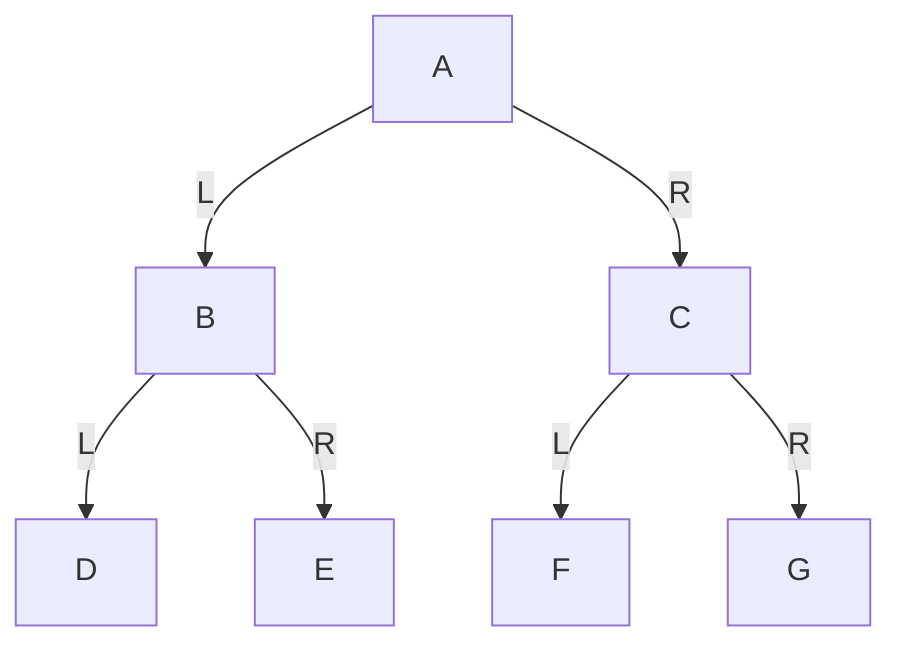
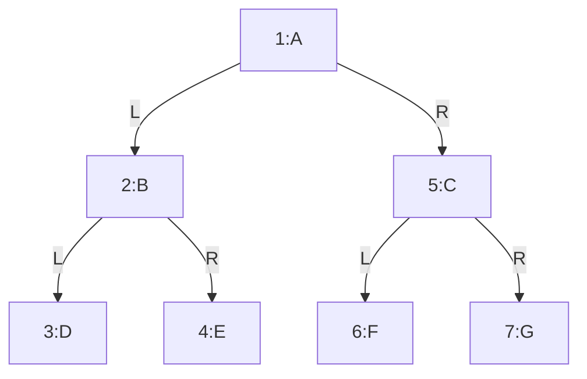

# 第17章\_前序遍历与先根处理

上一章已经分清左右槽位，现在要把树打印出来。同一张图可以产生不同输出，问题在于“什么时候处理当前节点”。本章先把当前节点放在它的两棵子树之前，跟随 A～G 的调用和返回，再运行同一规则的 C/C++ 程序。读完应能预测删去一条边后的输出；有序输出还要等下一章检查。

## 17.1\_二叉树的遍历

遍历是二叉树学习中的核心内容。
因为你后面几乎所有操作都会涉及“按某种顺序访问整棵树或局部子树”。

二叉树遍历之所以比普通树更规范，是因为：

- 只有左右两个方向
- 左右顺序本身有语义
- 因此访问顺序可以被严格定义

最基本的遍历有四种：

- 前序遍历
- 中序遍历
- 后序遍历
- 层序遍历

先从前序开始；后续三篇继续改变访问规则。

为了统一说明，下面四种遍历都使用同一棵树。

**图 2-10 遍历说明用例树**



------

当我们第一次接触二叉树遍历时，最容易犯的错误，不是代码写错，而是**没有真正理解“访问顺序”到底在定义什么**。

二叉树不是线性结构。
在线性表里，元素天然排成一行，从前到后访问即可。
但在二叉树里，每个节点都可能分出两个方向：

- 左子树
- 右子树

于是，只说“把整棵树访问一遍”是不够的。
我们必须进一步规定：

> 当一个节点同时有左子树和右子树时，当前节点、左子树、右子树，谁先谁后？

前序遍历，就是对这个问题给出的第一种标准答案。

------

## 17.2\_前序遍历到底在规定什么

前序遍历（Preorder Traversal）的规则是：

> **根 -> 左子树 -> 右子树**

这句话很短，但必须彻底吃透。

它不是在说“先把整棵树都看一遍，再看左边，再看右边”。
它真正的意思是：

对于**任意一个节点**，都遵循同样的访问规则：

1. 先访问当前节点自己
2. 再处理它的左子树
3. 最后处理它的右子树

注意这里的关键点：

> 这个规则不是只对整棵树的根节点生效，而是对整棵树中的每一个节点都重复生效。

这就是为什么二叉树遍历天然适合递归表达。

------

## 17.3\_先看一棵具体的树

我们先固定一棵示例树，后面的所有讲解都围绕它展开。

### 17.3.1\_图\_2-10\_前序遍历说明用例树


这棵树的结构很规整：

- `A` 是根节点
- `A` 的左孩子是 `B`，右孩子是 `C`
- `B` 的左孩子是 `D`，右孩子是 `E`
- `C` 的左孩子是 `F`，右孩子是 `G`

如果你只是“看图”，你会觉得这棵树是从上到下展开的。
但前序遍历并不是“按视觉顺序看图”，它是严格按“根 -> 左 -> 右”的规则走。

------

## 17.4\_前序遍历的最终结果

对图 2-10 进行前序遍历，结果是：

```text
A B D E C F G
```

这个结果不要死记。
你现在真正要学会的是：

> 它为什么一定是这个顺序，而不是别的顺序？

------

## 17.5\_一步一步手工推演

我们从根节点 `A` 开始。

### 17.5.1\_第一步\_访问\_A

前序遍历规定“根先访问”，所以第一个访问的一定是：

```text
A
```

此时结果序列是：

```text
A
```

但事情还没有结束，因为 `A` 还有左子树和右子树。

按照规则：

> 当前节点访问完以后，要先处理左子树，再处理右子树。

所以接下来进入 `A` 的左子树，也就是以 `B` 为根的那棵子树。

------

### 17.5.2\_第二步\_进入\_B

现在把 `B` 当作当前节点。
注意，规则又重新开始生效：

> 对于节点 `B`，仍然是“先访问 `B`，再处理 `B` 的左子树，再处理 `B` 的右子树”。

所以先访问 `B`：

```text
A B
```

接下来先处理 `B` 的左子树，也就是节点 `D`。

------

### 17.5.3\_第三步\_进入\_D

`D` 是一个叶子节点，没有左孩子，也没有右孩子。

按照前序规则：

1. 先访问 `D`
2. 左子树为空，结束
3. 右子树为空，结束

所以当前结果变成：

```text
A B D
```

`D` 的任务完成后，就要**回到 `B`**。

这是递归理解的关键：
不是“重新从根开始”，而是“回到刚才没做完的那个节点”。

对于 `B` 来说：

- 当前节点 `B` 已经访问过了
- 左子树 `D` 也已经处理完了
- 现在该处理右子树 `E`

------

### 17.5.4\_第四步\_进入\_E

`E` 也是叶子节点。

所以：

1. 访问 `E`
2. 左子树为空
3. 右子树为空

当前结果变成：

```text
A B D E
```

到这里，节点 `B` 的整棵子树就全部处理完了。

------

### 17.5.5\_第五步\_回到\_A\_进入右子树\_C

现在再回头看 `A`：

- `A` 自己已经访问过了
- `A` 的左子树 `B` 也已经全部处理完了
- 所以下一步轮到 `A` 的右子树 `C`

进入 `C` 后，前序规则再次生效：

1. 先访问 `C`
2. 再处理左子树 `F`
3. 最后处理右子树 `G`

所以先访问 `C`：

```text
A B D E C
```

------

### 17.5.6\_第六步\_进入\_F

`F` 是叶子节点，访问后结果为：

```text
A B D E C F
```

------

### 17.5.7\_第七步\_进入\_G

`G` 是叶子节点，访问后结果为：

```text
A B D E C F G
```

至此整棵树遍历结束。

------

## 17.6\_把访问过程画成编号图

为了更直观地看到访问次序，可以把访问编号直接写到图上。

### 17.6.1\_图\_2-11\_前序遍历访问顺序图



这张图建议你反复看两遍。

它清楚地告诉你：

- 每个父节点总是在自己的子节点之前访问
- 左子树永远先于右子树
- 但“先左后右”是在**当前节点已经被访问之后**才开始的

所以前序遍历最简洁的理解不是一句“根左右”，而是：

> **每到一个新节点，先立刻处理它自己；然后再把左右子树作为后续任务。**

------

## 17.7\_前序遍历的递归本质

现在我们把刚才的手工过程抽象成一个递归函数。

设 `preorder(node)` 表示“对以 `node` 为根的子树做前序遍历”。

那么它的逻辑是：

```text
preorder(node):
	如果 node == NULL:
		返回

	访问 node
	preorder(node.left)
	preorder(node.right)
```

这里有一个很重要的思维转换：

> “遍历整棵树” 和 “遍历一棵子树” 本质上是同一个问题。

因为对 `A` 的左子树 `B` 来说，它自己又是一棵完整的二叉树；
对 `C` 的右子树 `G` 来说，它也可以被看成一棵规模更小的树。

这就是递归成立的根本原因。

------

## 17.8\_为什么前序遍历要先访问当前节点

这是前序遍历的语义核心。

前序遍历最突出的特征是：

> **当前节点总在其子树之前被访问。**

这意味着什么？

意味着前序遍历特别适合那些“必须先知道父节点，再处理子树”的场景。
例如：

- 输出树结构时，先打印当前节点，再打印它的左右分支
- 拷贝树时，先创建当前节点，再递归创建左右子树
- 序列化树时，先记录当前节点，再记录左右子树

换句话说：

> 前序遍历是一种“先处理当前对象，再展开其组成部分”的顺序。

------

## 17.9\_前序遍历的\_C\_语言算法

下面先给出最核心的算法函数，不急着给完整程序。

```c
void preorder_traversal(const struct tree_node *root)
{
	if (!root)
		return;

	printf("%c ", root->value);
	preorder_traversal(root->left);
	preorder_traversal(root->right);
}
```

这段代码只有三步：

1. 空节点直接返回
2. 访问当前节点
3. 递归遍历左子树和右子树

它短，不是因为它偷懒，而是因为它正好精确对应了前序遍历的定义。

------

## 17.10\_C\_语言完整可执行示例

下面给出一个完整的 C 程序。
它会构造图 2-10 的那棵树，然后执行前序遍历。

```c
#include <errno.h>
#include <stdio.h>
#include <stdlib.h>

struct tree_node {
    char value;
    struct tree_node *left;
    struct tree_node *right;
};

void preorder_traversal(const struct tree_node *root)
{
    if (!root)
        return;
    printf("%c ", root->value);
    preorder_traversal(root->left);
    preorder_traversal(root->right);
}

static void destroy_tree(struct tree_node *root)
{
    if (!root)
        return;
    destroy_tree(root->left);
    destroy_tree(root->right);
    free(root);
}

static struct tree_node *build_demo_tree(int fail_at)
{
    struct tree_node *nodes[7] = {0};
    size_t made = 0;
    /* 全部分配成功前不连接，回滚只释放已经取得的独立节点。 */
    for (; made < 7; ++made) {
        if (fail_at == (int)made + 1)
            goto fail;
        nodes[made] = malloc(sizeof(*nodes[made]));
        if (!nodes[made])
            goto fail;
        *nodes[made] = (struct tree_node){(char)('A' + made), NULL, NULL};
    }
    for (size_t i = 0; i < 3; ++i) {
        nodes[i]->left = nodes[2 * i + 1];
        nodes[i]->right = nodes[2 * i + 2];
    }
    return nodes[0];
fail:
    while (made)
        free(nodes[--made]);
    return NULL;
}

static int parse_fail_at(int argc, char **argv)
{
    char *end;
    long value;
    if (argc == 1)
        return 0;
    if (argc != 2 || argv[1][0] == '\0')
        return -1;
    errno = 0;
    value = strtol(argv[1], &end, 10);
    if (errno || *end != '\0' || value < 0 || value > 7)
        return -1;
    return (int)value;
}

int main(int argc, char **argv)
{
    int fail_at = parse_fail_at(argc, argv);
    struct tree_node *root;
    if (fail_at < 0) {
        fprintf(stderr, "用法: %s [0..7]\n", argv[0]);
        return 2;
    }
    root = build_demo_tree(fail_at);
    if (!root) {
        fprintf(stderr, "构建失败，已释放先前节点\n");
        return 1;
    }
    printf("前序遍历结果: ");
    preorder_traversal(root);
    printf("\n");
    destroy_tree(root);
    return 0;
}
```

### 17.10.1\_编译与运行

```bash
gcc -Wall -Wextra -O2 -std=c11 preorder_demo.c -o preorder_demo
./preorder_demo
```

### 17.10.2\_运行结果

```text
前序遍历结果: A B D E C F G
```

------

## 17.11\_C++\_完整可执行示例

C 版本的资源责任先说明如下。

本程序沿用 P16 的私有构建：前七次分配尚未建立边，任一失败都只需释放已取得的独立节点；成功后才把所有权交给根入口。参数省略或为 0 表示正常构建，1～7 表示在相应分配之前失败。执行 `./preorder_demo 4` 应退出 1，且前三个节点全部回收；非法参数退出 2。它不是对系统内存耗尽的预测，只让失败出口可重复观察。实际 malloc 返回空指针也经过同一回滚出口。树无共享孩子、无环，递归深度由这个七节点例子界定。

下面给出同一访问规则的 C++17 版本。这里 `node_owners` 数组中的七个 `unique_ptr` 是唯一拥有者，`left/right` 只借用地址。每次成功分配立即交给一个拥有者；下一次分配抛出 `bad_alloc` 时，已经构造的拥有者会在异常展开中释放各自节点。返回数组转移拥有权，不复制节点。离开 main 的 try 块同样回收全部节点，因此此版本不再调用 C 的递归释放函数，也不能对这些借用指针再次 delete。

这是两种管理同一访问图的办法：C 成功后由根递归释放；C++ 由数组逐项释放。它们的遍历结果相同，不表示释放实现也必须相同。构建期间还没有外部读者。

```cpp
#include <array>
#include <cerrno>
#include <cstdlib>
#include <iostream>
#include <memory>
#include <new>

struct tree_node {
    char value;
    tree_node *left = nullptr;  // 两条边借用地址，不负责释放节点
    tree_node *right = nullptr;
    explicit tree_node(char ch) : value(ch) {}
};

using node_owners = std::array<std::unique_ptr<tree_node>, 7>;

static node_owners build_demo_tree(int fail_at)
{
    node_owners nodes;
    for (std::size_t i = 0; i < nodes.size(); ++i) {
        if (fail_at == static_cast<int>(i + 1))
            throw std::bad_alloc{};
        nodes[i] = std::make_unique<tree_node>(static_cast<char>('A' + i));
    }
    for (std::size_t i = 0; i < 3; ++i) {
        nodes[i]->left = nodes[2 * i + 1].get();
        nodes[i]->right = nodes[2 * i + 2].get();
    }
    return nodes;
}

void preorder_traversal(const tree_node *root)
{
    if (!root)
        return;
    std::cout << root->value << ' ';
    preorder_traversal(root->left);
    preorder_traversal(root->right);
}

static int parse_fail_at(int argc, char **argv)
{
    char *end;
    long value;
    if (argc == 1)
        return 0;
    if (argc != 2 || argv[1][0] == '\0')
        return -1;
    errno = 0;
    value = std::strtol(argv[1], &end, 10);
    if (errno || *end != '\0' || value < 0 || value > 7)
        return -1;
    return (int)value;
}

int main(int argc, char **argv)
{
    int fail_at = parse_fail_at(argc, argv);
    if (fail_at < 0) {
        std::cerr << "用法: " << argv[0] << " [0..7]\n";
        return 2;
    }
    try {
        auto nodes = build_demo_tree(fail_at);
        std::cout << "前序遍历结果: ";
        preorder_traversal(nodes[0].get());
        std::cout << '\n';
        // 正常离开与异常展开都会销毁拥有者，不能再手工 delete 借用的边。
    } catch (const std::bad_alloc &) {
        std::cerr << "存储分配失败，已取得的资源由拥有者回收\n";
        return 1;
    }
    return 0;
}
```

### 17.11.1\_编译与运行

```bash
g++ -Wall -Wextra -O2 -std=c++17 preorder_demo.cpp -o preorder_demo_cpp
./preorder_demo_cpp
```

### 17.11.2\_运行结果

```text
前序遍历结果: A B D E C F G
```

------

## 17.12\_如何验证你自己真的理解了

你可以不用看代码，先只看图，自己回答下面三个问题。

### 17.12.1\_问题\_1

为什么 `A` 一定是第一个访问的？

因为前序遍历规定：
对任意一棵子树，根节点总是先访问。
整棵树的根就是 `A`，所以它必须最先出现。

### 17.12.2\_问题\_2

为什么 `D` 会在 `E` 前面？

因为 `D` 和 `E` 都属于 `B` 的子树；
而对 `B` 来说，前序遍历是：

1. 访问 `B`
2. 先遍历左子树 `D`
3. 再遍历右子树 `E`

所以 `D` 必然在 `E` 前面。

### 17.12.3\_问题\_3

为什么 `C` 不会在 `D` 前面？

因为在 `A` 被访问后，前序遍历要求先处理 `A` 的左子树 `B`，再处理 `A` 的右子树 `C`。
而 `D` 属于 `B` 的左子树，所以必须先于 `C` 被访问。

如果这三个问题你都能顺着规则解释通，那么你已经不是“背答案”，而是真的理解了前序遍历。

------

## 17.13\_初学者最容易犯的三个错误

回到同一棵 A～G 的树，下面逐项检查：规则作用于哪一棵子树、返回时还有什么没做、当前节点的处理时机是否被误读。

### 17.13.1\_错误\_1\_把\_前序\_理解成\_从上到下看图

不是。
前序遍历不是视觉顺序，而是递归定义的访问顺序。

------

### 17.13.2\_错误\_2\_忘记\_规则对每一棵子树都重复成立

不是只有根节点 `A` 遵循“根左右”。
`B`、`C`、`D`、`E`、`F`、`G` 作为各自子树的根时，也都遵循同样规则。

------

### 17.13.3\_错误\_3\_把\_访问节点\_和\_进入节点\_混为一谈

进入某个节点，不等于已经完成它的全部工作。
以前序遍历为例：

- 一进入节点，就立刻访问它
- 但它的左右子树还没处理
- 必须等左右子树都处理完，这个节点的递归任务才算真正结束

------

## 17.14\_小结

前序遍历只做一件事：

> **每到一个节点，先访问它自己，再递归处理左子树，最后递归处理右子树。**

所以它的访问顺序本质上是：

> **当前节点总早于它的全部后代节点。**

对图 2-10 而言，最终结果是：

```text
A B D E C F G
```

如果再压缩成一句最适合记忆的话，那就是：

> **前序遍历不是“先看左边”，也不是“先看上面”，而是“每到一处，先处理当前节点”。**

------

## 17.15\_再改变一个条件

先不运行程序，把根的右边暂时断开，写出预计输出，再修改构建连边语句观察。C 中不能只断边后继续使用原回收方式，否则被断开的子树会失去拥有入口；应先保存它，分别回收两棵互不共享节点的树。C++ 的拥有者数组仍保存全部节点，但借用边必须保持指向活对象。这个练习改变的是可达性，不是分配责任。

仅访问剩余根时，结果应为 A B D E。先写出根和 B 两次递归各自留下的待处理任务，再解释 C F G 为什么不再可达；不要把不可达误读成已经释放。

完整材料为 [C 程序](../../../../labs/kernel/tree_basics/materials/preorder_demo.c)和 [C++ 程序](../../../../labs/kernel/tree_basics/materials/preorder_demo.cpp)。本篇已经规定当前节点何时出现；下一篇继续改变处理时机或等待方式。

上一篇：[二叉树](P02_二叉树.md)；下一篇：[中序遍历与有序性前提](P18_中序遍历与有序性前提.md)。
