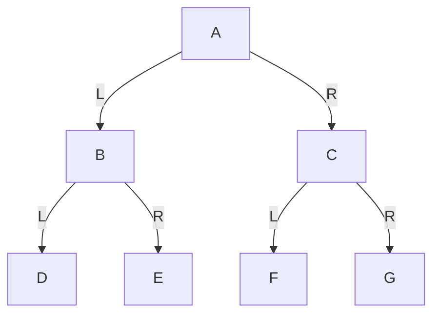
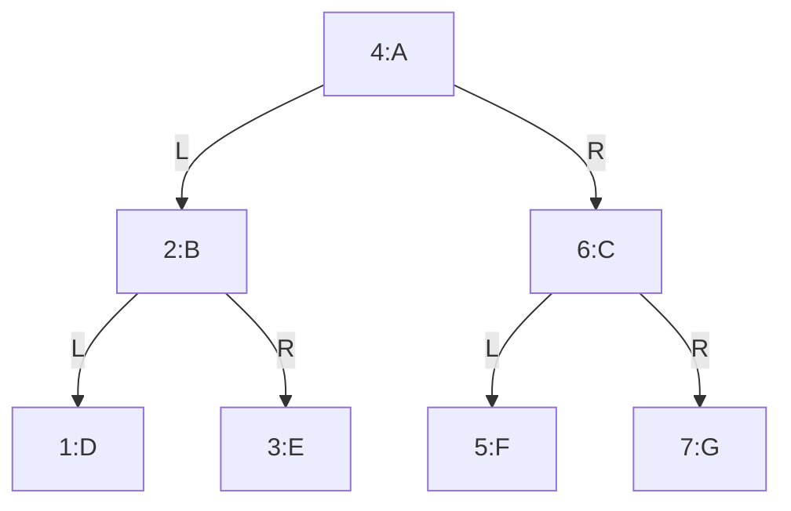

# 第18章\_中序遍历与有序性前提

前序让当前节点先出现，却不回答怎样把它夹在两棵子树之间。本章仍使用 A～G 的树，只移动当前节点的处理时机。先手工预测，再用同一构建方式运行程序，最后分清“左右位置”与“数值有序”。

在前序遍历里，我们学到的是：

> 每到一个节点，先处理当前节点自己，再去处理左右子树。

中序遍历故意把这个顺序改了一下。
它不再让当前节点最先出现，而是把当前节点放在左右子树之间。

这一个变化，会直接改变整棵树的访问结果，也会改变它最适合使用的场景。

所以学习中序遍历时，最重要的不是记住一句“左根右”，而是要真正理解：

> 为什么当前节点要被放在中间？
> 放在中间以后，整个遍历顺序会发生什么变化？

------

## 18.1\_中序遍历到底在规定什么

中序遍历（Inorder Traversal）的规则是：

> **左子树 -> 根 -> 右子树**

这句话要读得很慢。

它的真实意思是：

对于任意一个节点，都按下面顺序处理：

1. 先处理它的左子树
2. 再访问当前节点
3. 最后处理它的右子树

注意这里和前序遍历的根本区别：

- 前序遍历：当前节点最先访问
- 中序遍历：当前节点夹在左右子树中间访问

所以，中序遍历最核心的语义就是：

> **当前节点左边的内容先出来，当前节点自己居中，当前节点右边的内容最后出来。**

------

## 18.2\_仍然使用同一棵示例树

为了避免你被不同示例干扰，我们继续使用上一节的同一棵树。

### 18.2.1\_图\_2-12\_中序遍历说明用例树



这棵树的结构仍然是：

- `A` 是根
- `B` 是 `A` 的左孩子，`C` 是 `A` 的右孩子
- `D`、`E` 是 `B` 的左右孩子
- `F`、`G` 是 `C` 的左右孩子

树没有变，变的只是访问规则。

------

## 18.3\_中序遍历的最终结果

对图 2-12 进行中序遍历，结果是：

```text
D B E A F C G
```

先不要急着背。

你现在真正需要建立的是这样一种能力：

> 只要给你一棵树和“左根右”规则，你能自己一步一步推出这个结果。

------

## 18.4\_一步一步手工推演

我们仍然从根节点 `A` 开始。

但这次不能像前序遍历那样一上来就访问 `A`，因为中序遍历规定：

> 当前节点必须在左子树之后、右子树之前访问。

所以对于 `A` 来说，第一件事不是访问 `A`，而是先进入 `A` 的左子树，也就是以 `B` 为根的那棵子树。

------

### 18.4.1\_第一步\_从\_A\_进入左子树\_B

现在我们把 `B` 当作当前节点。
中序遍历的规则再次生效：

1. 先处理 `B` 的左子树
2. 再访问 `B`
3. 最后处理 `B` 的右子树

所以，仍然不能立刻访问 `B`。
还要继续向左进入 `D`。

------

### 18.4.2\_第二步\_进入\_D

`D` 是叶子节点。

对 `D` 来说，中序遍历仍然是：

1. 左子树
2. 当前节点
3. 右子树

但 `D` 没有左子树，所以“处理左子树”这一步什么都不做。
于是现在终于可以访问 `D`。

当前结果变成：

```text
D
```

访问完 `D` 以后，再处理 `D` 的右子树。
但 `D` 也没有右子树，所以 `D` 的任务完成。

这时要回到上一个还没完成任务的节点，也就是 `B`。

------

### 18.4.3\_第三步\_回到\_B\_访问\_B

现在再看 `B`：

- `B` 的左子树 `D` 已经处理完了
- 所以轮到访问 `B` 自己

当前结果变成：

```text
D B
```

访问完 `B` 以后，根据中序规则，下一步要处理 `B` 的右子树 `E`。

------

### 18.4.4\_第四步\_进入\_E

`E` 也是叶子节点。

所以它的处理过程和 `D` 一样：

- 左子树为空
- 访问 `E`
- 右子树为空

当前结果变成：

```text
D B E
```

到这里，`B` 整棵子树已经全部处理完毕。

------

### 18.4.5\_第五步\_回到\_A\_访问\_A

现在再回头看根节点 `A`：

- `A` 的左子树 `B` 已经处理完
- 所以终于轮到访问 `A` 自己

当前结果变成：

```text
D B E A
```

这一步非常关键。

它告诉你，中序遍历中的根节点通常不会最早出现，而是在左子树全部处理完之后才出现。

访问完 `A` 后，下一步再处理 `A` 的右子树 `C`。

------

### 18.4.6\_第六步\_进入\_C

对 `C` 应用同样规则：

1. 先处理左子树 `F`
2. 再访问 `C`
3. 最后处理右子树 `G`

所以先进入 `F`。

------

### 18.4.7\_第七步\_进入\_F

`F` 是叶子节点：

- 左子树为空
- 访问 `F`
- 右子树为空

当前结果变成：

```text
D B E A F
```

------

### 18.4.8\_第八步\_回到\_C\_访问\_C

因为 `C` 的左子树 `F` 已经处理完，所以现在访问 `C`：

```text
D B E A F C
```

然后进入 `C` 的右子树 `G`。

------

### 18.4.9\_第九步\_进入\_G

`G` 是叶子节点：

- 左子树为空
- 访问 `G`
- 右子树为空

最终结果变成：

```text
D B E A F C G
```

至此整棵树遍历结束。

------

## 18.5\_把访问顺序画成编号图

只看文字，有时你会觉得“回去、回来、再进入”有点乱。
所以最好再看一张编号图。

### 18.5.1\_图\_2-13\_中序遍历访问顺序图



这张图非常值得你慢慢观察。

它揭示了中序遍历的一个核心事实：

> 每个节点总是在自己的左子树之后出现，在自己的右子树之前出现。

例如：

- `B` 出现在 `D` 和 `E` 中间
- `A` 出现在整棵左子树和整棵右子树中间
- `C` 出现在 `F` 和 `G` 中间

所以，中序遍历不是在强调“谁最先被看见”，而是在强调：

> **当前节点在左右子树之间的相对位置。**

------

## 18.6\_中序遍历的递归本质

现在把手工推演抽象成递归过程。

设 `inorder(node)` 表示“对以 `node` 为根的子树做中序遍历”。

那么它的逻辑就是：

```text
inorder(node):
	如果 node == NULL:
		返回

	inorder(node.left)
	访问 node
	inorder(node.right)
```

这里要特别注意：

- 前序遍历是“访问 node”放在前面
- 中序遍历是“访问 node”放在中间

这一个位置变化，正是整个遍历定义的本质。

递归成立的原因和前序遍历完全一样：

> 对任意一棵子树，它仍然是一棵二叉树，因此可以重复应用同样的规则。

------

## 18.7\_为什么中序遍历特别重要

中序遍历在四种经典遍历里地位非常特殊。

原因不只是“它也是一种遍历顺序”，而是因为它和二叉搜索树之间有一个极其重要的对应关系：

> 如果满足严格的二叉搜索树次序、所有键互异，中序输出严格递增；若约定允许重复键，则相应输出只能保证非递减。普通二叉树没有这项保证。

为什么会这样？

因为二叉搜索树满足：

- 左子树所有节点都小于当前节点
- 右子树所有节点都大于当前节点

而中序遍历的顺序刚好是：

- 先左
- 再根
- 后右

也就是说，它天然按“从小到大”的逻辑访问节点。

所以，中序遍历不是只在教材里出现的一个概念，
它直接连接到后续的：

- 二叉搜索树
- AVL 树
- 红黑树
- 有序集合输出

这一整条知识线。

------

## 18.8\_中序遍历的\_C\_语言算法

先只看最核心的函数，不急着看完整程序。

```c
void inorder_traversal(const struct tree_node *root)
{
	if (!root)
		return;

	inorder_traversal(root->left);
	printf("%c ", root->value);
	inorder_traversal(root->right);
}
```

这段代码只有三步：

1. 先递归左子树
2. 再访问当前节点
3. 最后递归右子树

它之所以这么短，不是因为中序遍历很简单，而是因为：

> 递归函数的结构几乎与中序遍历的定义一一对应。

------

## 18.9\_C\_语言完整可执行示例

下面给出一个完整的 C 程序。
它会构造图 2-12 这棵树，然后执行中序遍历。

```c
#include <errno.h>
#include <stdio.h>
#include <stdlib.h>

struct tree_node {
    char value;
    struct tree_node *left;
    struct tree_node *right;
};

void inorder_traversal(const struct tree_node *root)
{
    if (!root)
        return;
    inorder_traversal(root->left);
    printf("%c ", root->value);
    inorder_traversal(root->right);
}

static void destroy_tree(struct tree_node *root)
{
    if (!root)
        return;
    destroy_tree(root->left);
    destroy_tree(root->right);
    free(root);
}

static struct tree_node *build_demo_tree(int fail_at)
{
    struct tree_node *nodes[7] = {0};
    size_t made = 0;
    /* 全部分配成功前不连接，回滚只释放已经取得的独立节点。 */
    for (; made < 7; ++made) {
        if (fail_at == (int)made + 1)
            goto fail;
        nodes[made] = malloc(sizeof(*nodes[made]));
        if (!nodes[made])
            goto fail;
        *nodes[made] = (struct tree_node){(char)('A' + made), NULL, NULL};
    }
    for (size_t i = 0; i < 3; ++i) {
        nodes[i]->left = nodes[2 * i + 1];
        nodes[i]->right = nodes[2 * i + 2];
    }
    return nodes[0];
fail:
    while (made)
        free(nodes[--made]);
    return NULL;
}

static int parse_fail_at(int argc, char **argv)
{
    char *end;
    long value;
    if (argc == 1)
        return 0;
    if (argc != 2 || argv[1][0] == '\0')
        return -1;
    errno = 0;
    value = strtol(argv[1], &end, 10);
    if (errno || *end != '\0' || value < 0 || value > 7)
        return -1;
    return (int)value;
}

int main(int argc, char **argv)
{
    int fail_at = parse_fail_at(argc, argv);
    struct tree_node *root;
    if (fail_at < 0) {
        fprintf(stderr, "用法: %s [0..7]\n", argv[0]);
        return 2;
    }
    root = build_demo_tree(fail_at);
    if (!root) {
        fprintf(stderr, "构建失败，已释放先前节点\n");
        return 1;
    }
    printf("中序遍历结果: ");
    inorder_traversal(root);
    printf("\n");
    destroy_tree(root);
    return 0;
}
```

### 18.9.1\_编译与运行

```bash
gcc -Wall -Wextra -O2 -std=c11 inorder_demo.c -o inorder_demo
./inorder_demo
```

### 18.9.2\_运行结果

```text
中序遍历结果: D B E A F C G
```

------

## 18.10\_C++\_完整可执行示例

C 版本的资源责任先说明如下。

本程序沿用 P16 的私有构建：前七次分配尚未建立边，任一失败都只需释放已取得的独立节点；成功后才把所有权交给根入口。参数省略或为 0 表示正常构建，1～7 表示在相应分配之前失败。执行 `./inorder_demo 4` 应退出 1，且前三个节点全部回收；非法参数退出 2。它不是对系统内存耗尽的预测，只让失败出口可重复观察。实际 malloc 返回空指针也经过同一回滚出口。树无共享孩子、无环，递归深度由这个七节点例子界定。

下面给出同一访问规则的 C++17 版本。这里 `node_owners` 数组中的七个 `unique_ptr` 是唯一拥有者，`left/right` 只借用地址。每次成功分配立即交给一个拥有者；下一次分配抛出 `bad_alloc` 时，已经构造的拥有者会在异常展开中释放各自节点。返回数组转移拥有权，不复制节点。离开 main 的 try 块同样回收全部节点，因此此版本不再调用 C 的递归释放函数，也不能对这些借用指针再次 delete。

这是两种管理同一访问图的办法：C 成功后由根递归释放；C++ 由数组逐项释放。它们的遍历结果相同，不表示释放实现也必须相同。构建期间还没有外部读者。

```cpp
#include <array>
#include <cerrno>
#include <cstdlib>
#include <iostream>
#include <memory>
#include <new>

struct tree_node {
    char value;
    tree_node *left = nullptr;  // 两条边借用地址，不负责释放节点
    tree_node *right = nullptr;
    explicit tree_node(char ch) : value(ch) {}
};

using node_owners = std::array<std::unique_ptr<tree_node>, 7>;

static node_owners build_demo_tree(int fail_at)
{
    node_owners nodes;
    for (std::size_t i = 0; i < nodes.size(); ++i) {
        if (fail_at == static_cast<int>(i + 1))
            throw std::bad_alloc{};
        nodes[i] = std::make_unique<tree_node>(static_cast<char>('A' + i));
    }
    for (std::size_t i = 0; i < 3; ++i) {
        nodes[i]->left = nodes[2 * i + 1].get();
        nodes[i]->right = nodes[2 * i + 2].get();
    }
    return nodes;
}

void inorder_traversal(const tree_node *root)
{
    if (!root)
        return;
    inorder_traversal(root->left);
    std::cout << root->value << ' ';
    inorder_traversal(root->right);
}

static int parse_fail_at(int argc, char **argv)
{
    char *end;
    long value;
    if (argc == 1)
        return 0;
    if (argc != 2 || argv[1][0] == '\0')
        return -1;
    errno = 0;
    value = std::strtol(argv[1], &end, 10);
    if (errno || *end != '\0' || value < 0 || value > 7)
        return -1;
    return (int)value;
}

int main(int argc, char **argv)
{
    int fail_at = parse_fail_at(argc, argv);
    if (fail_at < 0) {
        std::cerr << "用法: " << argv[0] << " [0..7]\n";
        return 2;
    }
    try {
        auto nodes = build_demo_tree(fail_at);
        std::cout << "中序遍历结果: ";
        inorder_traversal(nodes[0].get());
        std::cout << '\n';
        // 正常离开与异常展开都会销毁拥有者，不能再手工 delete 借用的边。
    } catch (const std::bad_alloc &) {
        std::cerr << "存储分配失败，已取得的资源由拥有者回收\n";
        return 1;
    }
    return 0;
}
```

### 18.10.1\_编译与运行

```bash
g++ -Wall -Wextra -O2 -std=c++17 inorder_demo.cpp -o inorder_demo_cpp
./inorder_demo_cpp
```

### 18.10.2\_运行结果

```text
中序遍历结果: D B E A F C G
```

------

## 18.11\_如何验证你自己真的理解了

现在不要看代码，只看图，试着回答下面几个问题。

### 18.11.1\_问题\_1

为什么 `A` 不是第一个被访问的？

因为中序遍历要求先处理左子树。
在 `A` 被访问之前，必须先把 `A` 的左子树全部处理完。

------

### 18.11.2\_问题\_2

为什么 `B` 出现在 `D` 和 `E` 之间？

因为对 `B` 来说，中序规则是：

- 先左子树 `D`
- 再访问 `B`
- 后右子树 `E`

所以 `B` 必然夹在 `D` 和 `E` 中间。

------

### 18.11.3\_问题\_3

为什么 `C` 一定在 `F` 后面、在 `G` 前面？

因为对 `C` 来说，中序规则仍然是：

- 左子树 `F`
- 当前节点 `C`
- 右子树 `G`

所以 `C` 的位置必须在 `F` 和 `G` 中间。

如果这些问题你都能顺着规则解释通，那说明你已经不只是记住了答案，而是真的掌握了中序遍历的结构逻辑。

------

## 18.12\_初学者最容易犯的三个错误

回到同一棵 A～G 的树，下面逐项检查：规则作用于哪一棵子树、返回时还有什么没做、当前节点的处理时机是否被误读。

### 18.12.1\_错误\_1\_把\_中序\_理解成\_访问到中间层节点再说

不是。
中序的“中”不是指树的高度中间，也不是视觉上的中间，
而是指：

> 当前节点在左子树和右子树之间被访问。

------

### 18.12.2\_错误\_2\_忘记\_左根右\_对每棵子树都成立

不是只有根节点 `A` 适用“左根右”。
对 `B`、`C`、`D` 这些节点来说，它们各自作为子树根时，也都必须遵循相同规则。

------

### 18.12.3\_错误\_3\_看到结果后反推\_误以为只是巧合排序

不是。
`D B E A F C G` 不是碰巧得到的序列。
它完全来自“左根右”的递归定义。

如果换一棵树，结果会变化；
但“左根右”的结构规则不会变。

------

## 18.13\_小结

中序遍历只做一件事：

> **对于任意节点，先处理左子树，再访问当前节点，最后处理右子树。**

所以它的核心特征不是“当前节点先出现”，而是：

> **当前节点总出现在自己的左子树之后、右子树之前。**

对图 2-12 而言，中序遍历结果是：

```text
D B E A F C G
```

如果把这一节再压缩成一句最适合记忆的话，那就是：

> **中序遍历不是先看根，而是先把左边处理完，再让当前节点出场。**

------


------

## 18.14\_再改变一个条件

只把根的字符 A 改成 Z，保持所有边不变。先预测中序输出，再运行观察：结果应为 D B E Z F C G。位置规则没有改变，也不会自动把 Z 挪到最后。这个反例说明，遍历只决定何时读值，不能替代构建时的全子树排序约束。再把左右子树入口交换，原两段输出会交换到根两侧；交换借用边不转移或释放节点拥有权。

完整材料为 [C 程序](../../../../labs/kernel/tree_basics/materials/inorder_demo.c)和 [C++ 程序](../../../../labs/kernel/tree_basics/materials/inorder_demo.cpp)。本篇已经规定当前节点何时出现；下一篇继续改变处理时机或等待方式。

上一篇：[前序遍历与先根处理](P17_前序遍历与先根处理.md)；下一篇：[后序遍历与子树完成](P19_后序遍历与子树完成.md)。
