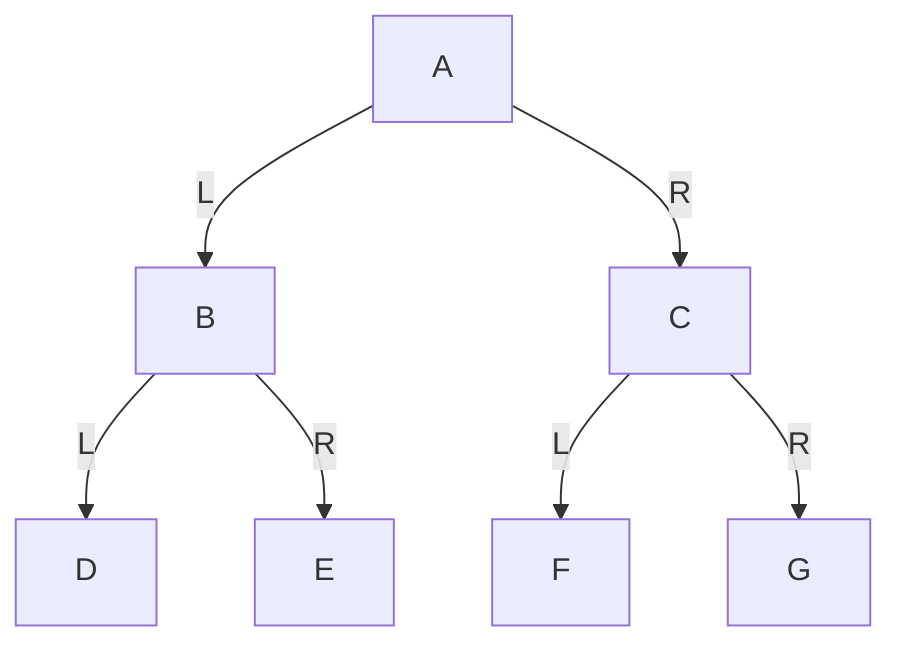
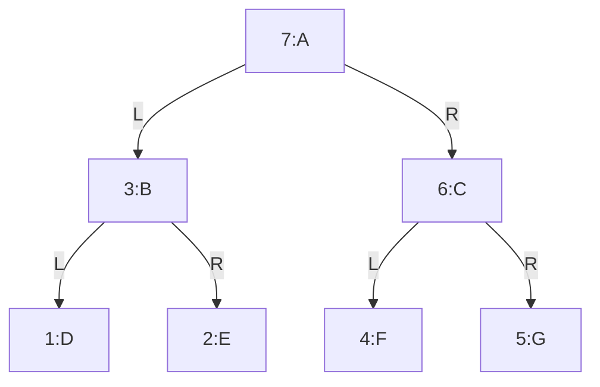

# 第19章\_后序遍历与子树完成

中序让当前节点位于两棵子树之间；如果当前结果必须使用两边已经算出的结果，这个时机还太早。本章把当前节点推迟到两棵子树之后，观察返回过程如何支持汇总与回收。节点图不变，改变的只有处理时机。

前序遍历把当前节点放在最前面。
中序遍历把当前节点放在左右子树之间。
后序遍历则更进一步，它把当前节点放到最后。

这不是一个小改动。
因为一旦把当前节点放到最后，整个遍历的思考方式就会改变：

> 不是“先看到当前节点，再展开它”，
> 而是“先把它下面的左右子树都处理完，最后才回来处理它自己”。

这使得后序遍历特别适合一种任务：

> **当前节点的处理依赖于子树已经完成。**

所以，学习后序遍历时，最关键的不是背“左右根”，而是理解：

> 为什么当前节点必须最后出现？
> 它最后出现，到底解决了什么问题？

------

## 19.1\_后序遍历到底在规定什么

后序遍历（Postorder Traversal）的规则是：

> **左子树 -> 右子树 -> 根**

它的真实意思是：

对于任意一个节点，都按下面顺序处理：

1. 先处理左子树
2. 再处理右子树
3. 最后访问当前节点

这个定义一定要和前序、中序对比着看：

- 前序：根最先
- 中序：根居中
- 后序：根最后

所以后序遍历的语义核心是：

> **当前节点总在自己的全部后代节点之后才被访问。**

这句话非常重要。
因为它直接解释了后序遍历为什么适合：

- 释放树
- 统计子树信息
- 表达式求值
- 自底向上的归约处理

------

## 19.2\_仍然使用同一棵示例树

为了不让你被多个例子打断，我们继续使用同一棵树。

### 19.2.1\_图\_2-14\_后序遍历说明用例树



这棵树的结构仍然是：

- `A` 是根节点
- `B`、`C` 是 `A` 的左右孩子
- `D`、`E` 是 `B` 的左右孩子
- `F`、`G` 是 `C` 的左右孩子

树没有变化，变化的只是访问规则。

------

## 19.3\_后序遍历的最终结果

对图 2-14 进行后序遍历，结果是：

```text
D E B F G C A
```

这个结果最容易让初学者感到不自然。
因为根节点 `A` 竟然最后才出现。

但这恰恰就是后序遍历最本质的地方：

> 在访问一个节点之前，必须先把它的左右子树全部处理完。

------

## 19.4\_一步一步手工推演

我们仍然从根节点 `A` 开始。

但这次和前序、中序都不同：

- 不能立刻访问 `A`
- 也不能只处理完左子树就访问 `A`

因为后序遍历要求：

> 左子树处理完，右子树处理完，最后才轮到当前节点自己。

所以对于 `A` 来说，第一步仍然是先进入左子树 `B`。

------

### 19.4.1\_第一步\_从\_A\_进入左子树\_B

现在把 `B` 当作当前节点。
后序遍历规则再次生效：

1. 先处理 `B` 的左子树
2. 再处理 `B` 的右子树
3. 最后访问 `B`

所以，仍然不能访问 `B`，而是继续进入 `D`。

------

### 19.4.2\_第二步\_进入\_D

`D` 是叶子节点。

对 `D` 来说，后序遍历仍然是：

1. 左子树
2. 右子树
3. 当前节点

但 `D` 没有左子树，也没有右子树。
所以前两步都什么也不做，最后访问 `D`。

当前结果变成：

```text
D
```

`D` 处理完成后，回到 `B`。

这时对 `B` 来说：

- 左子树 `D` 已完成
- 还没处理右子树 `E`

所以接下来进入 `E`。

------

### 19.4.3\_第三步\_进入\_E

`E` 也是叶子节点。

所以：

1. 左子树为空
2. 右子树为空
3. 访问 `E`

当前结果变成：

```text
D E
```

现在再回到 `B`。

对 `B` 而言：

- 左子树 `D` 已完成
- 右子树 `E` 已完成
- 所以现在终于轮到访问 `B`

当前结果变成：

```text
D E B
```

注意这一点：

> `B` 必须等 `D` 和 `E` 都完成后，自己才能出现。

这正是后序遍历的结构特征。

------

### 19.4.4\_第四步\_回到\_A\_进入右子树\_C

现在再看根节点 `A`：

- 左子树 `B` 已经全部处理完
- 右子树 `C` 还没处理

所以进入 `C`。

对 `C` 应用同样规则：

1. 先处理左子树 `F`
2. 再处理右子树 `G`
3. 最后访问 `C`

------

### 19.4.5\_第五步\_进入\_F

`F` 是叶子节点：

- 左子树为空
- 右子树为空
- 访问 `F`

当前结果变成：

```text
D E B F
```

------

### 19.4.6\_第六步\_进入\_G

`G` 也是叶子节点：

- 左子树为空
- 右子树为空
- 访问 `G`

当前结果变成：

```text
D E B F G
```

现在再回到 `C`。

因为：

- `C` 的左子树 `F` 已完成
- `C` 的右子树 `G` 已完成

所以现在访问 `C`：

```text
D E B F G C
```

------

### 19.4.7\_第七步\_回到\_A\_访问\_A

现在整棵树的左右子树都处理完了：

- 左子树 `B` 完成
- 右子树 `C` 完成

因此最后才访问根节点 `A`：

```text
D E B F G C A
```

至此整棵树遍历结束。

------

## 19.5\_把访问顺序画成编号图

只看文字时，你可能会觉得“为什么父节点总要等这么久”。
这时看编号图最清楚。

### 19.5.1\_图\_2-15\_后序遍历访问顺序图



这张图最值得观察的地方是：

- `B` 在 `D` 和 `E` 之后
- `C` 在 `F` 和 `G` 之后
- `A` 在整棵树所有其他节点之后

所以后序遍历的真正特征不是“先左后右”，而是：

> **父节点一定晚于自己的左右子树。**

这句话比背“左右根”更重要。

------

### 19.5.2\_后序遍历的递归本质

现在把手工推演抽象成递归过程。

设 `postorder(node)` 表示“对以 `node` 为根的子树做后序遍历”。

那么它的逻辑就是：

```text
postorder(node):
	如果 node == NULL:
		返回

	postorder(node.left)
	postorder(node.right)
	访问 node
```

你现在应该能明显看出三种深度优先遍历的区别只在一件事上：

> **访问当前节点的语句，放在什么位置。**

- 放最前面，就是前序
- 放中间，就是中序
- 放最后面，就是后序

而后序遍历的本质恰恰来自“访问语句放在最后”。

------

## 19.6\_为什么后序遍历特别重要

后序遍历的重要性，来自它的处理顺序：

> 只有当左右子树都处理完后，当前节点才被访问。

这意味着，当前节点在被处理时，可以默认：

- 左子树的信息已经准备好
- 右子树的信息已经准备好

这会带来非常强的工程价值。

### 19.6.1\_释放整棵树

对于本例“根入口负责整棵树、只沿节点内的边寻找孩子”的回收函数，先回收子树再释放当前节点最直接。
如果先 free 当前节点，再从它的 left/right 读取孩子地址，就是访问已释放对象。可以在释放前另存孩子地址来设计其他次序，但需要显式保存这些入口；“孩子必然丢失”不是所有回收方案的共同定理。

本例选用的直接顺序是：

- 先释放左子树
- 再释放右子树
- 最后释放当前节点

这正好就是后序遍历。

------

### 19.6.2\_统计子树信息

例如：

- 子树节点数
- 子树高度
- 子树权值和

这些量都依赖左右子树先算出来。
所以也天然适合后序遍历。

------

### 19.6.3\_表达式树求值

如果一个节点表示运算符，而左右子树表示操作数，
那么必须先算完左右子树，最后才能计算当前节点。

这也是典型的后序思路。

------

## 19.7\_后序遍历的\_C\_语言算法

先只看核心函数。

```c
void postorder_traversal(const struct tree_node *root)
{
	if (!root)
		return;

	postorder_traversal(root->left);
	postorder_traversal(root->right);
	printf("%c ", root->value);
}
```

这段代码只有三步：

1. 递归左子树
2. 递归右子树
3. 访问当前节点

它看起来和前序、中序极其相似。
但顺序一变，整个遍历语义就完全不同。

------

## 19.8\_C\_语言完整可执行示例

下面给出一个完整的 C 程序。
它会构造图 2-14 的那棵树，然后执行后序遍历。

```c
#include <errno.h>
#include <stdio.h>
#include <stdlib.h>

struct tree_node {
    char value;
    struct tree_node *left;
    struct tree_node *right;
};

void postorder_traversal(const struct tree_node *root)
{
    if (!root)
        return;
    postorder_traversal(root->left);
    postorder_traversal(root->right);
    printf("%c ", root->value);
}

static void destroy_tree(struct tree_node *root)
{
    if (!root)
        return;
    destroy_tree(root->left);
    destroy_tree(root->right);
    free(root);
}

static struct tree_node *build_demo_tree(int fail_at)
{
    struct tree_node *nodes[7] = {0};
    size_t made = 0;
    /* 全部分配成功前不连接，回滚只释放已经取得的独立节点。 */
    for (; made < 7; ++made) {
        if (fail_at == (int)made + 1)
            goto fail;
        nodes[made] = malloc(sizeof(*nodes[made]));
        if (!nodes[made])
            goto fail;
        *nodes[made] = (struct tree_node){(char)('A' + made), NULL, NULL};
    }
    for (size_t i = 0; i < 3; ++i) {
        nodes[i]->left = nodes[2 * i + 1];
        nodes[i]->right = nodes[2 * i + 2];
    }
    return nodes[0];
fail:
    while (made)
        free(nodes[--made]);
    return NULL;
}

static int parse_fail_at(int argc, char **argv)
{
    char *end;
    long value;
    if (argc == 1)
        return 0;
    if (argc != 2 || argv[1][0] == '\0')
        return -1;
    errno = 0;
    value = strtol(argv[1], &end, 10);
    if (errno || *end != '\0' || value < 0 || value > 7)
        return -1;
    return (int)value;
}

int main(int argc, char **argv)
{
    int fail_at = parse_fail_at(argc, argv);
    struct tree_node *root;
    if (fail_at < 0) {
        fprintf(stderr, "用法: %s [0..7]\n", argv[0]);
        return 2;
    }
    root = build_demo_tree(fail_at);
    if (!root) {
        fprintf(stderr, "构建失败，已释放先前节点\n");
        return 1;
    }
    printf("后序遍历结果: ");
    postorder_traversal(root);
    printf("\n");
    destroy_tree(root);
    return 0;
}
```

### 19.8.1\_编译与运行

```bash
gcc -Wall -Wextra -O2 -std=c11 postorder_demo.c -o postorder_demo
./postorder_demo
```

### 19.8.2\_运行结果

```text
后序遍历结果: D E B F G C A
```

------

## 19.9\_C++\_完整可执行示例

C 版本的资源责任先说明如下。

本程序沿用 P16 的私有构建：前七次分配尚未建立边，任一失败都只需释放已取得的独立节点；成功后才把所有权交给根入口。参数省略或为 0 表示正常构建，1～7 表示在相应分配之前失败。执行 `./postorder_demo 4` 应退出 1，且前三个节点全部回收；非法参数退出 2。它不是对系统内存耗尽的预测，只让失败出口可重复观察。实际 malloc 返回空指针也经过同一回滚出口。树无共享孩子、无环，递归深度由这个七节点例子界定。

下面给出同一访问规则的 C++17 版本。这里 `node_owners` 数组中的七个 `unique_ptr` 是唯一拥有者，`left/right` 只借用地址。每次成功分配立即交给一个拥有者；下一次分配抛出 `bad_alloc` 时，已经构造的拥有者会在异常展开中释放各自节点。返回数组转移拥有权，不复制节点。离开 main 的 try 块同样回收全部节点，因此此版本不再调用 C 的递归释放函数，也不能对这些借用指针再次 delete。

这是两种管理同一访问图的办法：C 成功后由根递归释放；C++ 由数组逐项释放。它们的遍历结果相同，不表示释放实现也必须相同。构建期间还没有外部读者。

```cpp
#include <array>
#include <cerrno>
#include <cstdlib>
#include <iostream>
#include <memory>
#include <new>

struct tree_node {
    char value;
    tree_node *left = nullptr;  // 两条边借用地址，不负责释放节点
    tree_node *right = nullptr;
    explicit tree_node(char ch) : value(ch) {}
};

using node_owners = std::array<std::unique_ptr<tree_node>, 7>;

static node_owners build_demo_tree(int fail_at)
{
    node_owners nodes;
    for (std::size_t i = 0; i < nodes.size(); ++i) {
        if (fail_at == static_cast<int>(i + 1))
            throw std::bad_alloc{};
        nodes[i] = std::make_unique<tree_node>(static_cast<char>('A' + i));
    }
    for (std::size_t i = 0; i < 3; ++i) {
        nodes[i]->left = nodes[2 * i + 1].get();
        nodes[i]->right = nodes[2 * i + 2].get();
    }
    return nodes;
}

void postorder_traversal(const tree_node *root)
{
    if (!root)
        return;
    postorder_traversal(root->left);
    postorder_traversal(root->right);
    std::cout << root->value << ' ';
}

static int parse_fail_at(int argc, char **argv)
{
    char *end;
    long value;
    if (argc == 1)
        return 0;
    if (argc != 2 || argv[1][0] == '\0')
        return -1;
    errno = 0;
    value = std::strtol(argv[1], &end, 10);
    if (errno || *end != '\0' || value < 0 || value > 7)
        return -1;
    return (int)value;
}

int main(int argc, char **argv)
{
    int fail_at = parse_fail_at(argc, argv);
    if (fail_at < 0) {
        std::cerr << "用法: " << argv[0] << " [0..7]\n";
        return 2;
    }
    try {
        auto nodes = build_demo_tree(fail_at);
        std::cout << "后序遍历结果: ";
        postorder_traversal(nodes[0].get());
        std::cout << '\n';
        // 正常离开与异常展开都会销毁拥有者，不能再手工 delete 借用的边。
    } catch (const std::bad_alloc &) {
        std::cerr << "存储分配失败，已取得的资源由拥有者回收\n";
        return 1;
    }
    return 0;
}
```

### 19.9.1\_编译与运行

```bash
g++ -Wall -Wextra -O2 -std=c++17 postorder_demo.cpp -o postorder_demo_cpp
./postorder_demo_cpp
```

### 19.9.2\_运行结果

```text
后序遍历结果: D E B F G C A
```

------

## 19.10\_如何验证你自己真的理解了

现在不要看代码，只看树，试着回答下面几个问题。

### 19.10.1\_问题\_1

为什么 `A` 一定最后出现？

因为后序遍历要求：

- 先左子树
- 再右子树
- 最后当前节点

而 `A` 是整棵树的根，只有等整棵左子树和右子树都处理完后，才轮到 `A`。

------

### 19.10.2\_问题\_2

为什么 `B` 会在 `D` 和 `E` 后面？

因为对 `B` 而言，后序规则也是：

- 左子树 `D`
- 右子树 `E`
- 最后 `B`

所以 `B` 不可能早于 `D` 或 `E`。

------

### 19.10.3\_问题\_3

为什么 `C` 会晚于 `F` 和 `G`？

同样因为对 `C` 来说，后序规则要求先处理左右子树，再处理自己。
所以 `C` 必须出现在 `F` 和 `G` 之后。

如果你能不用代码、只按规则解释清楚这三个问题，那说明你已经抓住了后序遍历的本质。

------

## 19.11\_初学者最容易犯的三个错误

回到同一棵 A～G 的树，下面逐项检查：规则作用于哪一棵子树、返回时还有什么没做、当前节点的处理时机是否被误读。

回到同一棵 A～G 的树，下面逐项检查：规则作用于哪一棵子树、返回时还有什么没做、当前节点的处理时机是否被误读。

### 19.11.1\_错误\_1\_把\_后序\_理解成\_最后一层先访问

不是。
后序不是按层来看的。
它不是“先访问底层节点”这样一个视觉规则，而是递归定义的结果。

更准确地说，它是：

> 当前节点必须在自己的左右子树之后出现。

------

### 19.11.2\_错误\_2\_以为\_后序只是把前序倒过来

不是。
前序是“根左右”，后序是“左右根”。
它们都递归地作用于每一棵子树，所以不能简单理解成把序列整体反过来。

------

### 19.11.3\_错误\_3\_看懂了访问顺序\_却没理解应用语义

后序遍历之所以重要，不是因为它也是一种输出顺序，
而是因为它天然满足：

> 子树先完成，父节点后处理。

这个语义决定了它在释放树、汇总子树信息、表达式求值中非常自然。

------

## 19.12\_小结

后序遍历只做一件事：

> **对于任意节点，先处理左子树，再处理右子树，最后访问当前节点。**

所以它最核心的特征是：

> **当前节点总在自己的全部后代节点之后被访问。**

对图 2-14 而言，后序遍历结果是：

```text
D E B F G C A
```

如果把这一节压缩成一句最适合记忆的话，那就是：

> **后序遍历不是先看当前节点，而是等它下面的事情全部做完，最后才回来处理它。**

------

## 19.13\_再改变一个条件

把“打印当前字符”想象成“汇总左右两边的节点数”：D、E 各交回 1，B 才能算出 3；F、G 同理，A 最后得到 7。如果改成前序就计算总数，孩子结果还没有产生，必须额外保存或重算。再检查 destroy_tree：释放根以后才读取 root->left 为什么错？因为指针变量仍有一个地址值，不等于其指向对象仍活着；本例的后序释放让读孩子地址发生在父对象存活期间。

完整材料为 [C 程序](../../../../labs/kernel/tree_basics/materials/postorder_demo.c)和 [C++ 程序](../../../../labs/kernel/tree_basics/materials/postorder_demo.cpp)。本篇已经规定当前节点何时出现；下一篇继续改变处理时机或等待方式。

上一篇：[中序遍历与有序性前提](P18_中序遍历与有序性前提.md)；下一篇：[层序遍历与队列边界](P20_层序遍历与队列边界.md)。
