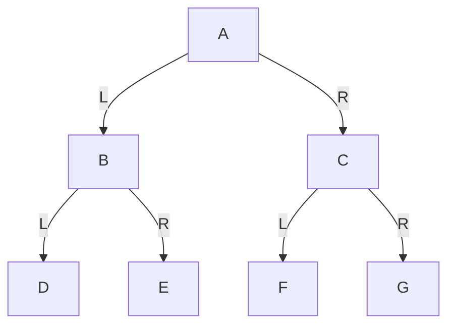
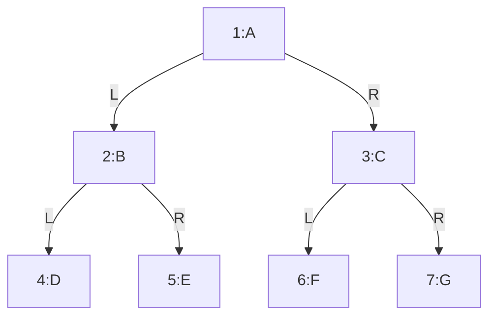

# 第20章\_层序遍历与队列边界

前三种遍历都会沿某条分支深入。如果希望先处理同层节点，递归下钻的次序就不合适。本章把已发现而尚未处理的地址排入队列，手算 head/tail，再运行带容量检查的 C 版本和自动管理存储的 C++ 版本。

前序、中序、后序有一个共同点：

> 它们都是沿着“子树定义”向下展开的深度优先遍历。

层序遍历不是这样。

层序遍历不关心“先把一棵子树做完再回来”，它关心的是：

> **同一层的节点，应该先被访问；下一层的节点，应该后被访问。**

因此，层序遍历的思考方式和前三种遍历完全不同。

- 前序、中序、后序：关注“当前节点与左右子树的先后关系”
- 层序遍历：关注“节点所处层次的先后关系”

所以学习层序遍历时，最关键的不是记一句“从上到下，从左到右”，而是要真正理解：

> 为什么要从上到下？
> 为什么同一层中是从左到右？
> 这种顺序到底靠什么数据结构才能保证？

------

## 20.1\_层序遍历到底在规定什么

层序遍历（Level-order Traversal）的规则是：

> **从根节点开始，按层次从上到下、从左到右依次访问所有节点。**

这句话可以拆成两层含义。

第一层是“按层次”：

- 必须先访问第 1 层
- 再访问第 2 层
- 再访问第 3 层

第二层是“同层内从左到右”：

- 如果某一层里有多个节点
- 那么它们的访问顺序由左到右决定

因此，层序遍历并不是递归定义优先的遍历方式，而是一种**广度优先**的遍历方式。

它的核心不是“先处理哪棵子树”，而是：

> **先把当前层全部处理完，再进入下一层。**

------

## 20.2\_仍然使用同一棵示例树

为了避免你被多个例子打断，我们继续使用同一棵树。

### 20.2.1\_图\_2-16\_层序遍历说明用例树



这棵树的结构仍然是：

- 第 1 层：`A`
- 第 2 层：`B`、`C`
- 第 3 层：`D`、`E`、`F`、`G`

层序遍历不是看“哪棵子树先递归完成”，而是严格按这个层次顺序访问。

------

## 20.3\_层序遍历的最终结果

对图 2-16 进行层序遍历，结果是：

```text
A B C D E F G
```

这个结果看起来最“自然”，因为它与我们从上到下读图的视觉顺序非常接近。

但要注意：

> 它之所以得到这个结果，不是因为“看图顺眼”，而是因为算法严格维护了一个“先到先处理”的队列。

本章用队列保存尚待访问的节点，让“按层”成为程序可以维持的不变量。

------

## 20.4\_为什么层序遍历需要队列

假设我们刚访问完根节点 `A`。

接下来要访问谁？

显然应该是 `A` 的左孩子 `B` 和右孩子 `C`，因为它们都在下一层，而且都比更深层的 `D`、`E`、`F`、`G` 更早被访问。

那么问题来了：

- 当 `A` 被访问后，我们发现了 `B` 和 `C`
- 这两个节点暂时还没访问
- 我们需要一个结构，把它们按“发现顺序”保存起来
- 以后按相同顺序再取出来访问

这正是队列的作用。

队列的特点是：

> **先进入队列的元素，先被取出。**

这正好符合层序遍历的需求：

- 先发现上一层的左节点，就先处理它
- 再发现上一层的右节点，就后处理它
- 当前层处理完后，下一层节点已经按顺序排在队列中

因此，层序遍历最自然、最标准的实现方式就是：

> **队列 + 循环**

------

## 20.5\_一步一步手工推演

下面我们不用代码，直接手工模拟层序遍历过程。

为了讲清楚，我们不仅写访问结果，还要写出**队列中的内容**。

------

### 20.5.1\_初始状态

开始时，根节点 `A` 是整棵树的入口。

所以第一步不是立刻递归，而是：

- 让 `A` 入队

此时队列状态为：

```text
[A]
```

访问结果还是空：

```text
(空)
```

------

### 20.5.2\_第一步\_出队\_A\_访问\_A

现在队列头部是 `A`，所以把 `A` 出队并访问。

访问结果变成：

```text
A
```

然后检查 `A` 的左右孩子：

- `A.left = B`
- `A.right = C`

按从左到右顺序，把它们依次入队。

此时队列状态变成：

```text
[B, C]
```

这里非常关键。

虽然 `B` 和 `C` 还没访问，但它们已经按照下一层的顺序排好了。

------

### 20.5.3\_第二步\_出队\_B\_访问\_B

队列头部现在是 `B`，所以先访问 `B`。

访问结果变成：

```text
A B
```

再检查 `B` 的左右孩子：

- `B.left = D`
- `B.right = E`

按从左到右顺序入队。

此时队列状态变成：

```text
[C, D, E]
```

注意这里的顺序：

- `C` 比 `D`、`E` 更早在队列里
- 所以虽然 `D`、`E` 是 `B` 的孩子，但它们属于更深一层
- 必须等 `C` 先访问完，才能轮到它们

这正是“按层遍历”的关键约束。

------

### 20.5.4\_第三步\_出队\_C\_访问\_C

现在队列头部是 `C`，所以访问 `C`。

访问结果变成：

```text
A B C
```

检查 `C` 的左右孩子：

- `C.left = F`
- `C.right = G`

按从左到右顺序入队。

此时队列状态变成：

```text
[D, E, F, G]
```

到这里你应该已经能看出来了：

- 第 2 层节点 `B`、`C` 全部访问完后
- 第 3 层节点 `D`、`E`、`F`、`G` 已经完整排在队列里
- 而且顺序恰好就是从左到右

这不是偶然，而是队列天然保证的。

------

### 20.5.5\_第四步\_出队\_D\_访问\_D

`D` 出队，访问结果变成：

```text
A B C D
```

`D` 没有孩子，所以队列变成：

```text
[E, F, G]
```

------

### 20.5.6\_第五步\_出队\_E\_访问\_E

访问结果变成：

```text
A B C D E
```

`E` 没有孩子，队列变成：

```text
[F, G]
```

------

### 20.5.7\_第六步\_出队\_F\_访问\_F

访问结果变成：

```text
A B C D E F
```

`F` 没有孩子，队列变成：

```text
[G]
```

------

### 20.5.8\_第七步\_出队\_G\_访问\_G

访问结果变成：

```text
A B C D E F G
```

`G` 没有孩子，队列变为空：

```json
[]
```

队列为空时，遍历结束。

------

## 20.6\_把访问顺序画成编号图

如果只看树图，你可能会把层序遍历误解成“视觉顺序”。
所以最好再看一张访问编号图。

### 20.6.1\_图\_2-17\_层序遍历访问顺序图



这张图最值得注意的地方是：

- 同一层节点一定整体先于下一层节点
- 在同一层内部，顺序由父节点出队顺序和左右孩子入队顺序共同决定

所以层序遍历的真正特征不是“先左后右”本身，而是：

> **先层后深，同层内保持从左到右。**

------

## 20.7\_层序遍历的算法本质

现在把上面的手工过程抽象成算法。

设 `Levelorder(root)` 表示“对以 `root` 为根的二叉树做层序遍历”。

其逻辑是：

```text
Levelorder(root):
	如果 root == NULL:
		返回

	创建队列 q
	root 入队

	当 q 非空时重复:
		node = q.front()
		q.pop()

		访问 node

		如果 node.left 不为空:
			node.left 入队

		如果 node.right 不为空:
			node.right 入队
```

这里你必须特别注意一个点：

> 层序遍历的控制结构不是递归，而是“循环 + 队列”。

这是它与前三种遍历最根本的算法差异。

------

## 20.8\_为什么层序遍历特别重要

层序遍历的重要性，不只在于它也是一种遍历方式，而在于它天然对应“广度优先搜索”的思想。

这使它在很多问题中都非常自然。

### 20.8.1\_按层打印树

如果你想看一棵树每一层长什么样，层序遍历是最直接的方法。

------

### 20.8.2\_计算树的宽度

某一层有多少节点，本质上就是层序遍历时对同层节点数量做统计。

------

### 20.8.3\_判断完全二叉树

很多完全二叉树判断逻辑，都基于层序遍历来做。

------

### 20.8.4\_最短路径类问题

广度优先搜索（Breadth-First Search，BFS）按从起点经过的边数分层，适合找“最少边数路径”；若各边具有相同正权，最少边数也对应最小权重之和。一般带权图不能仅按层数比较距离。
层序遍历就是树上的 BFS。推广到可能有环或多条路径到达同一节点的图时，还必须记录已发现状态，避免重复入队；本例利用树的唯一父节点条件，不需要这份额外状态。

所以层序遍历不是只是“另一种输出顺序”，它背后对应的是一个更一般的算法思想。

------

## 20.9\_层序遍历的\_C\_语言核心算法

先只看最核心的函数，不急着看完整程序。

下面这个版本为了让代码能直接运行，使用数组模拟队列。

```c
int levelorder_traversal(const struct tree_node *root,
                         const struct tree_node **queue, size_t capacity)
{
    size_t head = 0, tail = 0;
    if (!root)
        return 0;
    if (!queue || capacity == 0)
        return -1;
    queue[tail++] = root;
    while (head < tail) {
        const struct tree_node *node = queue[head++];
        printf("%c ", node->value);
        if (node->left) {
            if (tail == capacity)
                return -1;
            queue[tail++] = node->left;
        }
        if (node->right) {
            if (tail == capacity)
                return -1;
            queue[tail++] = node->right;
        }
    }
    return 0;
}
```

这段代码里最关键的是两个下标：

- `head`：当前出队位置
- `tail`：当前入队位置

条件 `head < tail` 表示队列非空。
这种写法让出队和入队位置直接可见，但数组不是环形队列：head 前面的槽位不会再用。capacity 必须至少覆盖这一次遍历的总入队数，而不是只覆盖同时等待的最大宽度。七节点例子用 32 个槽，只是给小例子留余量，不是一般树的容量保证。

每次写入前检查 tail == capacity；不足时返回 -1，保留已经打印的前缀，调用者仍负责回收整棵树。返回 0 才表示完整遍历成功。空树无需队列就成功；非空树至少需要一个有效槽。队列借用节点地址，不拥有节点，遍历期间调用者必须保持节点活着且拓扑稳定。

现在把 main 中传入的容量从 32 改成 3，仍给足实际数组空间，先预测在哪里停止。A 入队占槽 0，处理 A 后 B、C 占槽 1、2；处理 B 时已打印 A B，准备登记 D 才发现 tail 为 3，于是失败。head 已前移不等于可以再次使用槽 0。改变为 7 后本例成功；容量检查修复的是越界问题，并没有实现循环复用。

------

## 20.10\_C\_语言完整可执行示例

下面给出一个完整的 C 程序。
它会构造图 2-16 的那棵树，然后执行层序遍历。

```c
#include <errno.h>
#include <stdio.h>
#include <stdlib.h>

struct tree_node {
    char value;
    struct tree_node *left;
    struct tree_node *right;
};

int levelorder_traversal(const struct tree_node *root,
                         const struct tree_node **queue, size_t capacity)
{
    size_t head = 0, tail = 0;
    if (!root)
        return 0;
    if (!queue || capacity == 0)
        return -1;
    queue[tail++] = root;
    while (head < tail) {
        const struct tree_node *node = queue[head++];
        printf("%c ", node->value);
        if (node->left) {
            if (tail == capacity)
                return -1;
            queue[tail++] = node->left;
        }
        if (node->right) {
            if (tail == capacity)
                return -1;
            queue[tail++] = node->right;
        }
    }
    return 0;
}

static void destroy_tree(struct tree_node *root)
{
    if (!root)
        return;
    destroy_tree(root->left);
    destroy_tree(root->right);
    free(root);
}

static struct tree_node *build_demo_tree(int fail_at)
{
    struct tree_node *nodes[7] = {0};
    size_t made = 0;
    /* 全部分配成功前不连接，回滚只释放已经取得的独立节点。 */
    for (; made < 7; ++made) {
        if (fail_at == (int)made + 1)
            goto fail;
        nodes[made] = malloc(sizeof(*nodes[made]));
        if (!nodes[made])
            goto fail;
        *nodes[made] = (struct tree_node){(char)('A' + made), NULL, NULL};
    }
    for (size_t i = 0; i < 3; ++i) {
        nodes[i]->left = nodes[2 * i + 1];
        nodes[i]->right = nodes[2 * i + 2];
    }
    return nodes[0];
fail:
    while (made)
        free(nodes[--made]);
    return NULL;
}

static int parse_fail_at(int argc, char **argv)
{
    char *end;
    long value;
    if (argc == 1)
        return 0;
    if (argc != 2 || argv[1][0] == '\0')
        return -1;
    errno = 0;
    value = strtol(argv[1], &end, 10);
    if (errno || *end != '\0' || value < 0 || value > 7)
        return -1;
    return (int)value;
}

int main(int argc, char **argv)
{
    int fail_at = parse_fail_at(argc, argv);
    struct tree_node *root;
    const struct tree_node *queue[32];
    int result;
    if (fail_at < 0) {
        fprintf(stderr, "用法: %s [0..7]\n", argv[0]);
        return 2;
    }
    root = build_demo_tree(fail_at);
    if (!root) {
        fprintf(stderr, "构建失败，已释放先前节点\n");
        return 1;
    }
    printf("层序遍历结果: ");
    result = levelorder_traversal(root, queue, 32);
    printf("\n");
    destroy_tree(root);
    if (result) {
        fprintf(stderr, "队列容量不足，输出只是已访问前缀\n");
        return 1;
    }
    return 0;
}
```

### 20.10.1\_编译与运行

```bash
gcc -Wall -Wextra -O2 -std=c11 levelorder_demo.c -o levelorder_demo
./levelorder_demo
```

### 20.10.2\_运行结果

```text
层序遍历结果: A B C D E F G
```

------

## 20.11\_C++\_完整可执行示例

C 版本的资源责任先说明如下。

本程序沿用 P16 的私有构建：前七次分配尚未建立边，任一失败都只需释放已取得的独立节点；成功后才把所有权交给根入口。参数省略或为 0 表示正常构建，1～7 表示在相应分配之前失败。执行 `./levelorder_demo 4` 应退出 1，且前三个节点全部回收；非法参数退出 2。它不是对系统内存耗尽的预测，只让失败出口可重复观察。实际 malloc 返回空指针也经过同一回滚出口。树无共享孩子、无环，递归深度由这个七节点例子界定。

C++ 的 std::queue 会管理并增长内部存储，但增长仍可能失败。push 抛出 bad_alloc 时，队列和节点拥有者一起随异常展开销毁，之前已经打印的内容不会撤销；这里没有“内存无限”的保证。

下面给出同一访问规则的 C++17 版本。这里 `node_owners` 数组中的七个 `unique_ptr` 是唯一拥有者，`left/right` 只借用地址。每次成功分配立即交给一个拥有者；下一次分配抛出 `bad_alloc` 时，已经构造的拥有者会在异常展开中释放各自节点。返回数组转移拥有权，不复制节点。离开 main 的 try 块同样回收全部节点，因此此版本不再调用 C 的递归释放函数，也不能对这些借用指针再次 delete。

这是两种管理同一访问图的办法：C 成功后由根递归释放；C++ 由数组逐项释放。它们的遍历结果相同，不表示释放实现也必须相同。构建期间还没有外部读者。
这里直接使用 `std::queue`，更贴近 C++ 标准库用法。

```cpp
#include <array>
#include <cerrno>
#include <cstdlib>
#include <iostream>
#include <memory>
#include <new>
#include <queue>

struct tree_node {
    char value;
    tree_node *left = nullptr;  // 两条边借用地址，不负责释放节点
    tree_node *right = nullptr;
    explicit tree_node(char ch) : value(ch) {}
};

using node_owners = std::array<std::unique_ptr<tree_node>, 7>;

static node_owners build_demo_tree(int fail_at)
{
    node_owners nodes;
    for (std::size_t i = 0; i < nodes.size(); ++i) {
        if (fail_at == static_cast<int>(i + 1))
            throw std::bad_alloc{};
        nodes[i] = std::make_unique<tree_node>(static_cast<char>('A' + i));
    }
    for (std::size_t i = 0; i < 3; ++i) {
        nodes[i]->left = nodes[2 * i + 1].get();
        nodes[i]->right = nodes[2 * i + 2].get();
    }
    return nodes;
}

void levelorder_traversal(const tree_node *root)
{
    if (!root)
        return;
    std::queue<const tree_node *> queue;
    queue.push(root);
    while (!queue.empty()) {
        const tree_node *node = queue.front();
        queue.pop();
        std::cout << node->value << ' ';
        if (node->left)
            queue.push(node->left);
        if (node->right)
            queue.push(node->right);
    }
}

static int parse_fail_at(int argc, char **argv)
{
    char *end;
    long value;
    if (argc == 1)
        return 0;
    if (argc != 2 || argv[1][0] == '\0')
        return -1;
    errno = 0;
    value = std::strtol(argv[1], &end, 10);
    if (errno || *end != '\0' || value < 0 || value > 7)
        return -1;
    return (int)value;
}

int main(int argc, char **argv)
{
    int fail_at = parse_fail_at(argc, argv);
    if (fail_at < 0) {
        std::cerr << "用法: " << argv[0] << " [0..7]\n";
        return 2;
    }
    try {
        auto nodes = build_demo_tree(fail_at);
        std::cout << "层序遍历结果: ";
        levelorder_traversal(nodes[0].get());
        std::cout << '\n';
        // 正常离开与异常展开都会销毁拥有者，不能再手工 delete 借用的边。
    } catch (const std::bad_alloc &) {
        std::cerr << "存储分配失败，已取得的资源由拥有者回收\n";
        return 1;
    }
    return 0;
}
```

### 20.11.1\_编译与运行

```bash
g++ -Wall -Wextra -O2 -std=c++17 levelorder_demo.cpp -o levelorder_demo_cpp
./levelorder_demo_cpp
```

### 20.11.2\_运行结果

```text
层序遍历结果: A B C D E F G
```

------

## 20.12\_如何验证你自己真的理解了

现在不要看代码，只看树，试着回答下面几个问题。

### 20.12.1\_问题\_1

为什么 `C` 一定在 `D` 前面？

因为 `C` 与 `B` 同处第 2 层，而 `D` 已经是第 3 层。
层序遍历要求先完整访问上一层，再进入下一层。
所以 `C` 必须先于 `D`。

------

### 20.12.2\_问题\_2

为什么 `D` 一定在 `F` 前面？

因为在访问 `B` 时，`D`、`E` 先入队；
在访问 `C` 时，`F`、`G` 后入队。
队列保证先入队的节点先出队，所以 `D` 必须先于 `F`。

------

### 20.12.3\_问题\_3

为什么层序遍历不能只靠简单递归自然完成？

因为层序遍历要求优先保证“同层顺序”，而不是“子树先后”。
如果只用普通递归，你会很自然地先深入某棵子树，这会破坏“整层先访问完”的要求。
所以层序遍历最自然的控制方式是队列，而不是普通递归。

如果这三个问题你都能顺着算法解释清楚，那么你已经不是“知道结果”，而是真的理解了层序遍历。

------

## 20.13\_初学者最容易犯的三个错误

回到同一棵 A～G 的树，下面逐项检查：规则作用于哪一棵子树、返回时还有什么没做、当前节点的处理时机是否被误读。

### 20.13.1\_错误\_1\_把层序遍历理解成\_看图顺序

不是。
看图时从上到下、从左到右只是视觉现象。
层序遍历得到这个结果，是因为算法严格维护了一个先进先出的队列。

------

### 20.13.2\_错误\_2\_以为\_先左后右\_就是层序遍历的本质

不是。
“先左后右”只是在同一父节点的孩子入队时体现的局部规则。
层序遍历的本质是：

> 先层后深，且同层按进入队列的顺序访问。

------

### 20.13.3\_错误\_3\_把层序遍历当成另一种递归遍历

不是。
前序、中序、后序都天然来自递归定义。
层序遍历的自然实现方式是队列和循环，它本质上属于广度优先思想。

------

## 20.14\_小结

层序遍历只做一件事：

> **按层次从上到下、从左到右依次访问所有节点。**

所以它最核心的特征是：

> **同一层节点整体先于下一层节点被访问。**

对图 2-16 而言，层序遍历结果是：

```text
A B C D E F G
```

如果把这一节压缩成一句最适合记忆的话，那就是：

> **层序遍历不是先把某棵子树做完，而是先把当前层排好队，一个一个处理，再进入下一层。**

------

## 20.15\_再改变一个条件

把七节点树改画成一条右链，最大层宽只有 1。单调下标数组是否只需要一个槽？不能：取出第一个节点后，tail 已为 1，登记第二个节点就需要新槽。它不复用 head 之前的位置，所以 n 节点链仍需要 n 次可用入队位置。要把数组大小降到前沿宽度，需要另行实现循环复用并区分队满与队空；不能只把 capacity 改成 1。

完整材料为 [C 程序](../../../../labs/kernel/tree_basics/materials/levelorder_demo.c)和 [C++ 程序](../../../../labs/kernel/tree_basics/materials/levelorder_demo.cpp)。队列解决了按层等待，下一篇把调用栈、显式栈和基本查询放在一起比较。

上一篇：[后序遍历与子树完成](P19_后序遍历与子树完成.md)；下一篇：[递归状态与二叉树基本查询](P21_递归状态与二叉树基本查询.md)。
