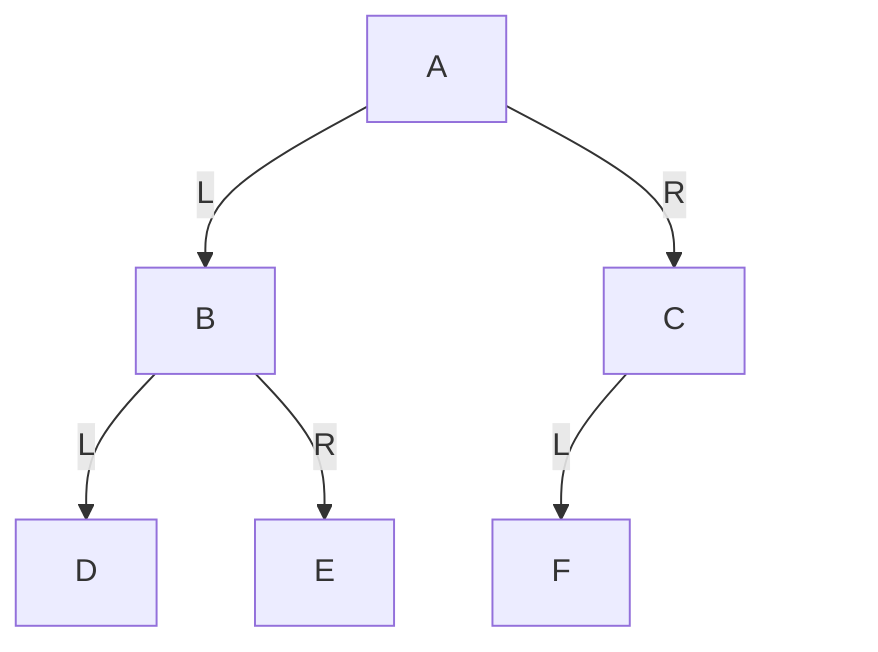
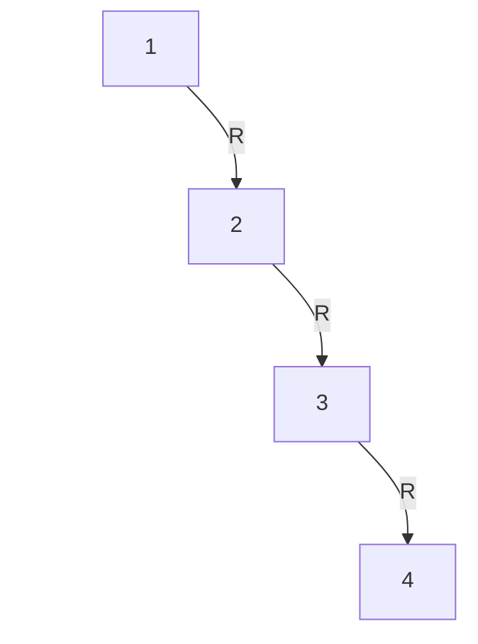

# 第21章\_递归状态与二叉树基本查询

四种输出次序已经建立；现在把“返回到哪里”和“等待谁完成”变成可检查的程序状态，再让同一棵小树回答高度、节点数、叶子与查找问题。这里保留各算法的对照，进入 BST 前还要分清访问顺序和剪枝依据。

## 21.1\_为什么遍历顺序必须严格区分

很多初学者会把前序、中序、后序理解成：

> “反正就是把节点走一遍。”

这是不准确的。

对于同一棵树，四种遍历结果完全不同：

| 遍历方式 | 结果            |
| -------- | --------------- |
| 前序     | `A B D E C F G` |
| 中序     | `D B E A F C G` |
| 后序     | `D E B F G C A` |
| 层序     | `A B C D E F G` |

也就是说：

- 节点集合相同
- 访问顺序不同
- 提取出的结构信息也不同

所以遍历不是简单“走一遍树”，而是：

> **你把当前节点放在左递归和右递归的哪个位置处理，会决定你得到的结构序列。**

这会在后续章节里直接体现在：

- 前序常用于先根处理
- 中序常用于 BST 有序性分析
- 后序常用于先子后父处理
- 层序常用于按层分析树结构

------

## 21.2\_示例\_递归版前序\_中序\_后序遍历

下面给出最基础的递归遍历代码。
这里的目标不是做泛型封装，而是让你看到：

> **遍历规则在代码里，实际上就是“当前节点处理语句写在什么位置”的差异。**

```c
#include <stdio.h>

struct binary_node {
	int value;
	struct binary_node *left;
	struct binary_node *right;
};

static void preorder_traverse(struct binary_node *node)
{
	if (!node)
		return;

	printf("%d ", node->value);
	preorder_traverse(node->left);
	preorder_traverse(node->right);
}

static void inorder_traverse(struct binary_node *node)
{
	if (!node)
		return;

	inorder_traverse(node->left);
	printf("%d ", node->value);
	inorder_traverse(node->right);
}

static void postorder_traverse(struct binary_node *node)
{
	if (!node)
		return;

	postorder_traverse(node->left);
	postorder_traverse(node->right);
	printf("%d ", node->value);
}
```

你要特别注意的是三者的唯一区别：

- 前序：`printf` 在两次递归之前
- 中序：`printf` 在中间
- 后序：`printf` 在两次递归之后

这三种写法看起来很像，但语义完全不同。

所以遍历规则本质上可以这样理解：

> **根节点的处理动作，放在左递归和右递归的前、中、后不同位置，就对应了前序、中序、后序。**

------

## 21.3\_把遍历规则交给实现

此前已经分别建立三个前提：

- 二叉树的定义与结构
- 二叉树的基本形态
- 二叉树的遍历

你现在应当建立以下几个关键认识。

第一，二叉树不是普通树的随意简化，而是一个有严格左右槽位约束的树结构。

第二，左子树和右子树本身就是结构信息，这会直接影响遍历、BST、旋转和红黑树修复。

第三，二叉树并不天然平衡。斜树说明：即使节点数不多，高度仍可能很大。

第四，满二叉树和完全二叉树是两种重要的规则形态，后续会关系到顺序存储和堆结构。

第五，遍历不是简单“走一遍树”，而是按不同顺序提取不同结构信息。其中中序遍历将在 BST 一章中变得非常关键。


下面的重点，不再是“二叉树长什么样”，而是开始回答三个更接近开发的问题：

1. 为什么二叉树遍历天然适合递归实现
2. 如果不用递归，为什么通常要借助栈或队列
3. 学二叉树时，最基本、最常见的几个问题应该如何分析与实现

你后面进入 BST、旋转、红黑树时，会反复依赖前面建立起来的思维方式。因为从本质上说：

- BST 只是“带有序约束的二叉树”
- 红黑树是在有序二叉搜索树上增加颜色与平衡约束

所以二叉树层面的遍历、求高度、求节点数、查找节点，这些能力不是旁枝末节，而是后续全部内容的直接基础。

------

## 21.4\_二叉树遍历的实现思想

先追踪一次下降后尚未完成的工作：访问者将来还要回来处理右边或当前节点，这些返回位置不能凭空消失。递归与迭代的差别，是把待完成任务交给谁保存。

### 21.4.1\_递归实现

二叉树遍历之所以最常先用递归讲，不是因为递归“更高级”，而是因为：

> **二叉树本身就是递归定义的数据结构。**

二叉树的递归定义是：

- 一棵二叉树由一个根节点、左子树、右子树组成
- 左子树和右子树本身仍然是二叉树

因此，遍历某个节点 `node` 时，天然可以写成：

1. 先决定当前节点什么时候处理
2. 再递归遍历左子树
3. 再递归遍历右子树

这正好对应前序、中序、后序三种深度优先遍历。

------

#### (1)\_递归版前序遍历

前序遍历规则：

> 根 -> 左 -> 右

代码如下：

```c
#include <stdio.h>

struct binary_node {
	int value;
	struct binary_node *left;
	struct binary_node *right;
};

static void preorder_traverse(struct binary_node *node)
{
	if (!node)
		return;

	printf("%d ", node->value);
	preorder_traverse(node->left);
	preorder_traverse(node->right);
}
```

这里的关键不是函数名，而是顺序：

- 先处理当前节点
- 再进左子树
- 再进右子树

------

#### (2)\_递归版中序遍历

中序遍历规则：

> 左 -> 根 -> 右

代码如下：

```c
static void inorder_traverse(struct binary_node *node)
{
	if (!node)
		return;

	inorder_traverse(node->left);
	printf("%d ", node->value);
	inorder_traverse(node->right);
}
```

中序遍历的关键特征是：

- 当前节点的处理动作位于左递归和右递归之间

这在后续 BST 中会非常重要，因为：

> **BST 的中序遍历结果是从小到大的有序序列。**

------

#### (3)\_递归版后序遍历

后序遍历规则：

> 左 -> 右 -> 根

代码如下：

```c
static void postorder_traverse(struct binary_node *node)
{
	if (!node)
		return;

	postorder_traverse(node->left);
	postorder_traverse(node->right);
	printf("%d ", node->value);
}
```

后序遍历的关键特征是：

- 当前节点最后处理
- 子树先处理完，根再处理

所以它很适合：

- 释放整棵树
- 先处理子结构、再处理整体的场景

------

#### (4)\_为什么递归写法自然

递归遍历之所以自然，是因为每一次调用都只做三件事：

1. 判断当前节点是否为空
2. 处理当前节点
3. 把相同问题交给左右子树

也就是说，递归并不是在“玩技巧”，而是在直接照着二叉树的定义写代码。

从结构上说，递归遍历本质上是：

> **函数调用栈替你记录了“当前处理到哪一层、从哪一层返回”的上下文。**

这一点非常关键，因为它会自然引出下一节：
如果不用递归，那么这些“返回路径信息”就必须由程序员自己保存。

------

### 21.4.2\_非递归实现的基本思路

递归实现虽然自然，但它并不是唯一方式。
非递归遍历的核心问题只有一个：

> **递归调用栈帮你保存的状态，如果不用递归，你准备放到哪里？**

答案通常是：

- 深度优先遍历：放到**栈**
- 层序遍历：放到**队列**

------

#### (1)\_为什么前序\_中序\_后序通常要用栈

前序、中序、后序都属于**深度优先遍历**。
所谓深度优先，意思是：

- 先沿着某条分支尽可能往下走
- 走不下去后，再回退到上层
- 然后切换到另一条分支

这个“往下走—回退—再切换”的过程，本质上就是：

> **后进先出**

因为最后进入的那个节点，最先需要被弹出回退。
这正好对应**栈（Stack）**的行为。

------

#### (2)\_以前序遍历为例看非递归思路

前序规则是：

> 根 -> 左 -> 右

非递归时，最常见思路是：

1. 根节点入栈
2. 弹出栈顶并访问
3. 先压右孩子，再压左孩子
4. 重复直到栈空

为什么要“先压右，再压左”？

因为栈是后进先出。
你希望访问顺序是“左先于右”，就必须让左孩子后入栈、先弹出。

------

#### (3)\_以中序遍历为例看非递归思路

中序规则是：

> 左 -> 根 -> 右

这里不能像前序那样简单地“弹出就访问”，因为必须先把整条左链走到底。

典型思路是：

1. 当前节点不断向左入栈
2. 走到空后，弹出栈顶并访问
3. 转向该节点的右子树
4. 对右子树重复相同步骤

所以中序非递归的关键不是“遍历”，而是：

> **用栈把尚未处理、但未来要回来的父节点先保存起来。**

------

#### (4)\_以后序遍历为例看非递归思路

后序规则是：

> 左 -> 右 -> 根

后序是三种深度优先遍历里最难非递归化的一种。
原因在于：

- 当前节点不能太早访问
- 左右子树都处理完之后，当前节点才能访问

所以非递归后序通常有两种常见思路：

1. 使用两个栈
2. 使用一个栈 + 最近一次访问节点指针

这说明一个事实：

> **当处理动作要等子树返回时，显式实现必须辨别当前处于“还未下降”还是“子树已完成”的阶段。**

这不等于每一种后序实现都比前序多用某个固定数量的字节。可以用阶段标记、上次访问节点或其他表示编码返回信息；比较空间之前，要先说清具体算法保存了什么。

------

### 21.4.3\_栈与队列在遍历中的作用

这一节把“为什么用栈、为什么用队列”统一收束一下。

#### (1)\_栈服务于深度优先

前序、中序、后序遍历都属于深度优先。
它们的共同点是：

- 优先沿一条路径深入
- 到底后再回退
- 再切换分支

这类过程天然符合：

> **先深入的那条路径，最后才会完全退出。**

因此，使用栈来模拟函数调用栈最自然。

------

#### (2)\_队列服务于层序遍历

层序遍历的规则是：

> 按层从上到下、从左到右访问

它的访问顺序本质上是：

- 先进入的一层节点，先被处理
- 后进入的下一层节点，后被处理

这正好是：

> **先进先出**

因此，层序遍历天然对应**队列（Queue）**。

------

#### (3)\_示例\_层序遍历怎样借队列维持次序

看下面这棵二叉树。

#### (4)\_图\_2-11\_层序遍历示意图



层序访问顺序是：

```text
A B C D E F
```

访问过程可以理解为：

1. 先把 `A` 放入队列
2. 取出 `A`，访问它，并把 `B`、`C` 入队
3. 取出 `B`，访问它，并把 `D`、`E` 入队
4. 取出 `C`，访问它，并把 `F` 入队
5. 再依次取出 `D`、`E`、`F`

这里你会看到：

- 新发现的节点不会立刻深入处理
- 而是排到当前层节点之后等待

这就是典型的先进先出行为。

------

#### (5)\_这一节真正要记住的结论

不是“非递归要用容器”这么简单，而是：

- 递归遍历依赖**函数调用栈**
- 本章的非递归深度优先方案用 **显式栈** 保存待完成任务
- 本章的线性时间层序方案用 **队列** 保存待访问地址

也就是说，选这些容器有明确的等待顺序依据。它们不是所有可能实现的唯一选择：父指针配合前驱状态可以回溯，临时改边的算法也可记录返回路径，但会增加表示或修改约束。按深度反复从根扫描也能得到层序，代价是在链形树上重复访问路径，最坏达到 Θ(n²)。本章保留不修改树、一次处理各节点的栈/队列方案。

递归深度优先最多保留一条活动路径，额外调用空间为 O(h)，退化时 O(n)。显式栈保存待处理节点或“返回后该做什么”的阶段，并不会让等待状态消失；单栈路径方案通常 O(h)，把完整结果压入第二个栈的后序写法可能需要 O(n)。层序队列保存一层交接中的前沿，合理复用存储时为 O(w)，w 是最大层宽；P20 的单调下标数组不复用旧槽，分配容量按总入队数计为 O(n)，不能拿 w 估算它的数组大小。

------

## 21.5\_二叉树的典型问题

这一节讲你学习二叉树时最应先掌握的几个基础问题。
这些问题看起来朴素，但后面几乎都会反复出现。

------

### 21.5.1\_求高度

树的高度用于限制路径长度和递归深度；完整遍历仍处理全部 n 个节点，不能只按高度计算工作量。

对于二叉树，某节点的高度定义为：

> 从该节点到最远叶子节点的最长路径边数

整棵树的高度，就是根节点的高度。

------

#### (1)\_递归求高度的思路

根据二叉树的递归定义，求高度的逻辑非常自然：

1. 空树高度记为 `-1`
2. 非空节点的高度
   = `max(左子树高度, 右子树高度) + 1`

代码如下：

```c
static int binary_tree_height(struct binary_node *node)
{
	int left_h;
	int right_h;

	if (!node)
		return -1;

	left_h = binary_tree_height(node->left);
	right_h = binary_tree_height(node->right);

	return (left_h > right_h ? left_h : right_h) + 1;
}
```

这里把空树高度记为 `-1`，则：

- 叶子节点左右都为空
- 叶子节点高度 = `max(-1, -1) + 1 = 0`

这个定义在代码里是非常方便的。

------

#### (2)\_右斜树的高度示例

为了说明“高度为何受形状影响”，看下面这棵右斜树。

#### (3)\_图\_2-12\_右斜树高度示意图



这棵树中：

- 节点 `4` 高度为 0
- 节点 `3` 高度为 1
- 节点 `2` 高度为 2
- 节点 `1` 高度为 3

你可以直接看出：

> 节点数并不算多，但高度已经很大。

这正是后面 BST 会出现退化问题的根源。

------

### 21.5.2\_求节点数

统计节点总数是最基本的问题之一。
它能帮助你建立“树由根和子树组成”的递归直觉。

#### (1)\_递归思路

对任意节点 `node`：

- 如果为空，节点数为 0
- 如果非空，节点数
  = 左子树节点数 + 右子树节点数 + 1

代码如下：

```c
static int binary_tree_count_nodes(struct binary_node *node)
{
	if (!node)
		return 0;

	return binary_tree_count_nodes(node->left) +
	       binary_tree_count_nodes(node->right) + 1;
}
```

这段代码很短，但它体现了一个核心思想：

> **整棵树的问题 = 左子树问题 + 右子树问题 + 当前节点自身。**

这也是后面很多树算法的共同骨架。

------

#### (2)\_为什么\_求节点数\_值得单独学

因为它能帮助你真正适应：

- 不是从数组下标线性推进
- 而是从一个节点分裂成左右两个递归子问题

如果这个问题你都写不稳，后面 BST 和红黑树的递归分析会很吃力。

------

### 21.5.3\_判断空树与叶子节点

这一节看起来简单，但其实是所有树递归代码的基本边界处理。

#### (1)\_空树判断

空树通常表示为：

```c
root == NULL
```

这意味着：

- 当前没有任何节点
- 遍历应立即结束
- 求节点数应返回 0
- 求高度应返回约定值

因此，“空树判断”通常是所有递归函数的第一个分支。

------

#### (2)\_叶子节点判断

叶子节点表示：

- 当前节点非空
- 左孩子为空
- 右孩子为空

代码如下：

```c
static int binary_tree_is_leaf(struct binary_node *node)
{
	if (!node)
		return 0;

	return !node->left && !node->right;
}
```

叶子节点判断在很多场景中都很重要，例如：

- 某些遍历只统计叶子
- 删除操作要区分叶子节点
- 求路径问题常以叶子为终点
- 红黑树教材中常会引入 NIL 叶子概念

------

#### (3)\_为什么边界判断必须稳

树代码很容易出错的一个根源就是：

> **边界判断不稳。**

常见错误包括：

- 对空指针继续解引用
- 把单孩子节点误判成叶子
- 高度定义混乱
- 空树返回值与叶子返回值不一致

所以学树时，空树和叶子节点的判断不是小事，而是后续全部代码正确性的底层前提。

------

### 21.5.4\_查找指定节点

查找指定节点，是从“遍历整棵树”走向“带目标搜索”的第一步。
在普通二叉树中，因为还没有 BST 的大小关系约束，所以查找通常只能依赖：

- 当前节点是否匹配
- 不匹配就去左子树找
- 左子树没找到再去右子树找

------

#### (1)\_递归查找思路

代码如下：

```c
static struct binary_node *
binary_tree_find(struct binary_node *node, int target)
{
	struct binary_node *found;

	if (!node)
		return NULL;

	if (node->value == target)
		return node;

	found = binary_tree_find(node->left, target);
	if (found)
		return found;

	return binary_tree_find(node->right, target);
}
```

这段代码体现的逻辑是：

1. 当前节点为空，返回空
2. 当前节点命中，直接返回
3. 左子树先查
4. 左边没找到，再查右边

------

#### (2)\_普通二叉树查找与\_BST\_查找的区别

这一点你现在就要先建立概念。

在普通二叉树中：

- 左右只是结构位置
- 没有大小关系语义
- 因此查找常常要遍历整棵树的大部分节点

在 BST 中：

- 左子树都比根小
- 右子树都比根大
- 因此查找可以根据比较结果只走一边

也就是说：

> **普通二叉树查找是“遍历式查找”，BST 查找是“决策式查找”。**

这一点会在下一章成为核心分水岭。

------

## 21.6\_本章小结

把形态、访问次序与查找条件分开后，可以逐项检查自己的预测，而不必用“看起来像树”代替算法契约。

### 21.6.1\_二叉树是红黑树的直接结构基础

本章最重要的收获，不只是“认识了二叉树”，而是建立了这样一个明确结论：

> **红黑树首先是一棵二叉树。**

因此，红黑树中后续你会看到的所有结构与动作，例如：

- 左子树 / 右子树
- 父节点 / 子节点
- 左旋 / 右旋
- 插入到某个空槽位
- 删除后重新挂接子树

都建立在本章内容之上。

如果你对下面这些概念还不稳：

- 左右槽位的结构意义
- 递归定义
- 高度
- 前序 / 中序 / 后序
- 左右子树的局部分析

那么后面一进入 BST 和红黑树，就会感觉术语很多、图很多、case 很乱。

所以本章真正完成的，是后续整条路线的“二叉结构地基”。

------

### 21.6.2\_中序遍历对后续\_BST\_的重要性

本章虽然还没有进入 BST，但有一个知识点必须提前锁定：

> **中序遍历将成为 BST 一章的核心桥梁。**

原因在于：

- 普通二叉树的中序遍历，只是一种访问顺序
- BST 的中序遍历，则会直接变成“有序输出”

也就是说，从下一章开始：

- 左子树不再只是“左边那棵子树”
- 而会带上“值更小”的语义
- 右子树也会带上“值更大”的语义

于是，中序遍历的意义就会从“遍历规则”升级为：

> **验证 BST 有序性的直接工具。**

所以你可以把本章与下一章的关系理解为：

- 本章建立“二叉结构”
- 下一章在这个结构上增加“大小关系”
- 再后面红黑树，则是在 BST 的基础上继续增加“平衡控制”

------

## 21.7\_本章结束说明

到这里，二叉结构、访问次序和基本查询已经连起来。
你现在应当已经具备进入下一章的前提：

- 理解二叉树是什么
- 理解左右槽位不能混淆
- 理解不同二叉树形态对高度的影响
- 理解前序、中序、后序、层序遍历
- 理解递归、栈、队列在遍历中的角色
- 能分析最基础的二叉树问题：高度、节点数、叶子判断、普通查找

## 21.8\_让查询接受一个反例

把值 9 放在根 4 的左边，把 2 放在右边。它仍是合法二叉树，却不是按键有序的搜索树。先预测查找 9 是否会成功，再运行下面完整 C11 程序：普通查找依次检查可能存在目标的两棵子树，不会仅因为 9 大于 4 就放弃左侧。

以下函数只处理无环、无共享孩子且仍存活的有限小树；高度和节点数使用 int，结果必须在其范围内。任意深度输入还要考虑调用栈预算。本例用自动数组保存四个对象，没有动态分配，也不把返回指针交给比数组更长寿的调用者。

```c
#include <assert.h>
#include <stdio.h>

struct binary_node {
    int value;
    struct binary_node *left;
    struct binary_node *right;
};

static int binary_tree_height(struct binary_node *node)
{
	int left_h;
	int right_h;

	if (!node)
		return -1;

	left_h = binary_tree_height(node->left);
	right_h = binary_tree_height(node->right);

	return (left_h > right_h ? left_h : right_h) + 1;
}

static int binary_tree_count_nodes(struct binary_node *node)
{
	if (!node)
		return 0;

	return binary_tree_count_nodes(node->left) +
	       binary_tree_count_nodes(node->right) + 1;
}

static int binary_tree_is_leaf(struct binary_node *node)
{
	if (!node)
		return 0;

	return !node->left && !node->right;
}

static struct binary_node *
binary_tree_find(struct binary_node *node, int target)
{
	struct binary_node *found;

	if (!node)
		return NULL;

	if (node->value == target)
		return node;

	found = binary_tree_find(node->left, target);
	if (found)
		return found;

	return binary_tree_find(node->right, target);
}

int main(void)
{
    /* 故意不是搜索树：较大的 9 放在根的左边。 */
    struct binary_node nodes[4] = {
        {4, NULL, NULL}, {9, NULL, NULL},
        {2, NULL, NULL}, {7, NULL, NULL}
    };
    struct binary_node *root = &nodes[0];
    root->left = &nodes[1];
    root->right = &nodes[2];
    nodes[1].right = &nodes[3];
    assert(binary_tree_height(NULL) == -1);
    assert(binary_tree_count_nodes(NULL) == 0);
    assert(!binary_tree_is_leaf(NULL));
    assert(binary_tree_find(NULL, 9) == NULL);
    assert(binary_tree_height(root) == 2);
    assert(binary_tree_count_nodes(root) == 4);
    assert(!binary_tree_is_leaf(root));
    assert(binary_tree_is_leaf(&nodes[2]));
    assert(binary_tree_find(root, 9) == &nodes[1]);
    assert(binary_tree_find(root, 8) == NULL);
    printf("height=%d nodes=%d found=%d\n",
           binary_tree_height(root), binary_tree_count_nodes(root),
           binary_tree_find(root, 9)->value);
    /* 节点属于自动数组，不能调用 free 或 delete。 */
    return 0;
}
```

保存为 [binary_queries.c](../../../../labs/kernel/tree_basics/materials/binary_queries.c)，运行：

```bash
gcc -std=c11 -Wall -Wextra -Werror -pedantic binary_queries.c -o binary_queries
./binary_queries
```

输出为 `height=2 nodes=4 found=9`。assert 在条件不成立时终止程序，编译时不要定义 NDEBUG，否则这些检查会被移除；输出仍不能替代边界断言。

再做三个小改动：把根变成 NULL，四个函数的结果怎样变化？把 9 改为另一个 4，普通查找返回哪个地址？若仅按“目标大于当前值就向右”找 9，为什么失败？前两问分别由空树分支和先检查当前节点的顺序决定；第三问缺少 BST 的全子树次序约束，不能把有序剪枝套在这棵普通树上。

本单元只证明这些具体输入和明确前提下的结果，不负责检测循环、悬空指针或算术溢出。接下来进入[P03 二叉搜索树](P03_二叉搜索树_BST.md)，在那里增加排序约束，才有依据少访问一边。

上一篇：[层序遍历与队列边界](P20_层序遍历与队列边界.md)；返回[专题路线](大纲.md#1.1_沿问题进入现有章节)。
