# 第22章\_BST删除与子树回接

[上一章](P03_二叉搜索树_BST.md)已把新键放到唯一空槽。删除要反过来移走已有键，但这个位置下面可能还连着两棵子树。本章保留同一组整数例子，先分三种拓扑，再跟随完整 C++ 程序的返回值；重点是哪个对象被释放、哪个槽位接收新根。

## 22.1\_BST\_的删除

BST 删除比查找和插入复杂得多，因为删除一个节点后，必须保证：

1. 树仍然是二叉树
2. BST 的有序性仍然成立
3. 父子连接关系仍然正确

删除要区分三类情况。

------

### 22.1.1\_删除叶子节点

叶子节点没有孩子，所以它最容易删除。

例如删除 `7`：

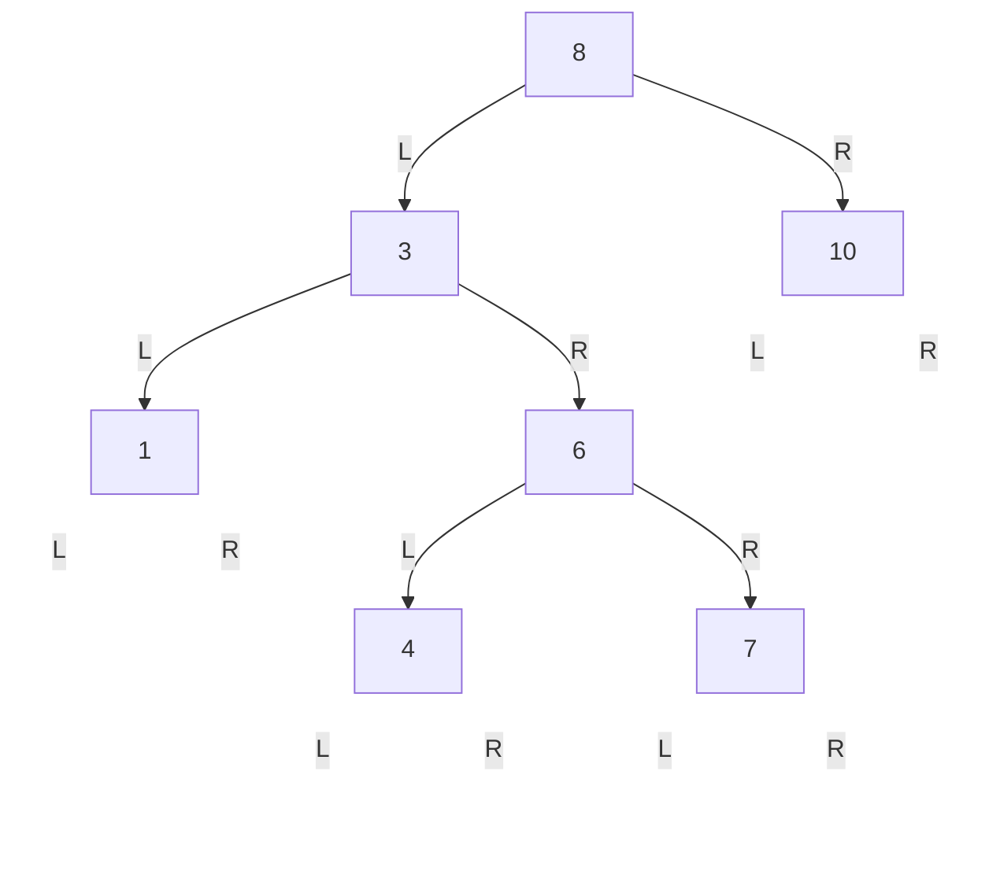
```mermaid
graph TD
		A["8"]

		B["3"]
		C["10"]

		D["1"]
		E["6"]
		C_L[" "]
		C_R[" "]

		D_L[" "]
		D_R[" "]
		F["4"]
		G["7"]

		F_L[" "]
		F_R[" "]
		G_L[" "]
		G_R[" "]

	A -->|L| B
	A -->|R| C

	B -->|L| D
	B -->|R| E

	C -->|L| C_L
	C -->|R| C_R

	D -->|L| D_L
	D -->|R| D_R

	E -->|L| F
	E -->|R| G

	F -->|L| F_L
	F -->|R| F_R

	G -->|L| G_L
	G -->|R| G_R

	classDef ghost fill:transparent,stroke:transparent,color:transparent;
	class C_L,C_R,D_L,D_R,F_L,F_R,G_L,G_R ghost;


	linkStyle 4 stroke:transparent;
	linkStyle 5 stroke:transparent;
	linkStyle 6 stroke:transparent;
	linkStyle 7 stroke:transparent;
	linkStyle 10 stroke:transparent;
	linkStyle 11 stroke:transparent;
	linkStyle 12 stroke:transparent;
	linkStyle 13 stroke:transparent;
```

`7` 没有左右孩子，因此直接把其父节点 `6` 的右指针置空即可。

删除后：

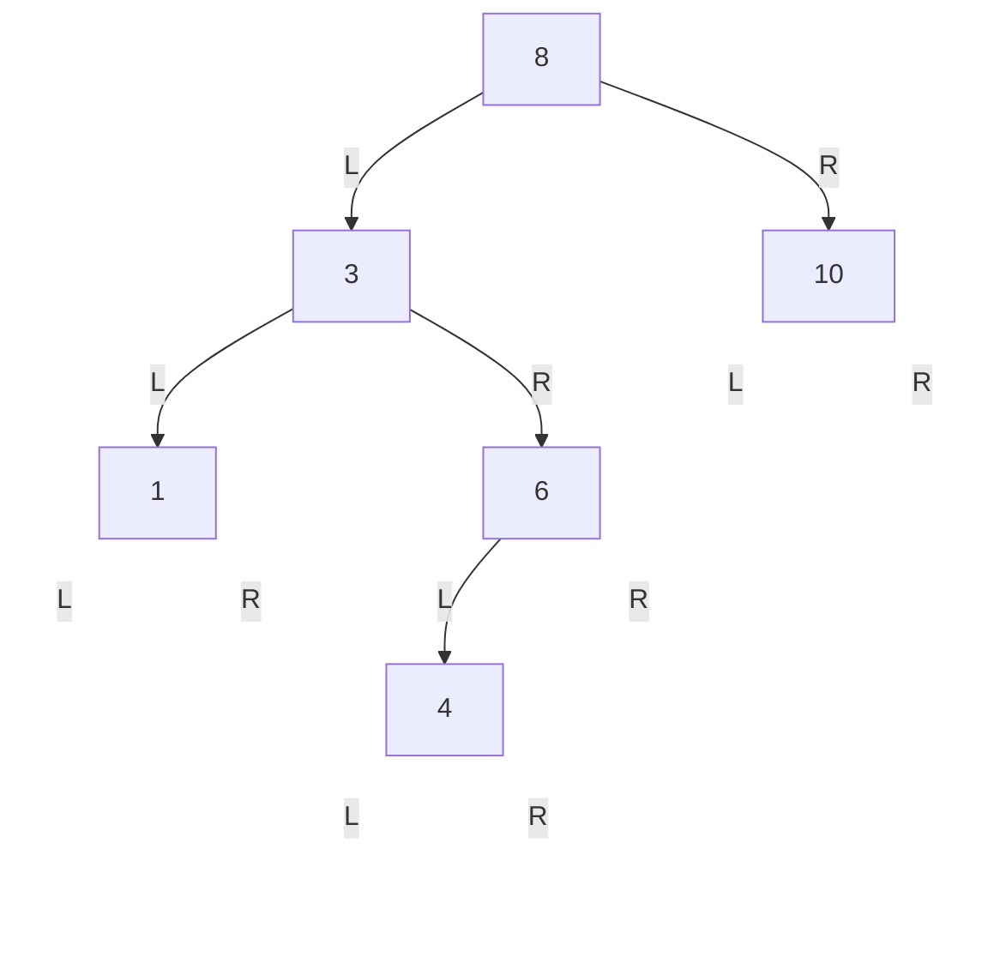
```mermaid
graph TD
		A["8"]

		B["3"]
		C["10"]

		D["1"]
		E["6"]
		C_L[" "]
		C_R[" "]

		D_L[" "]
		D_R[" "]
		F["4"]
		E_R[" "]

		F_L[" "]
		F_R[" "]

	A -->|L| B
	A -->|R| C

	B -->|L| D
	B -->|R| E

	C -->|L| C_L
	C -->|R| C_R

	D -->|L| D_L
	D -->|R| D_R

	E -->|L| F
	E -->|R| E_R

	F -->|L| F_L
	F -->|R| F_R

	classDef ghost fill:transparent,stroke:transparent,color:transparent;
	class C_L,C_R,D_L,D_R,E_R,F_L,F_R ghost;


	linkStyle 4 stroke:transparent;
	linkStyle 5 stroke:transparent;
	linkStyle 6 stroke:transparent;
	linkStyle 7 stroke:transparent;
	linkStyle 9 stroke:transparent;
	linkStyle 10 stroke:transparent;
	linkStyle 11 stroke:transparent;
```

这一类删除不涉及结构替换。

------

### 22.1.2\_删除只有一个孩子的节点

如果待删节点只有一个孩子，那么删除它后，需要让它的唯一孩子顶替它的位置。

例如删除 `10`，其只有右孩子 `14`：

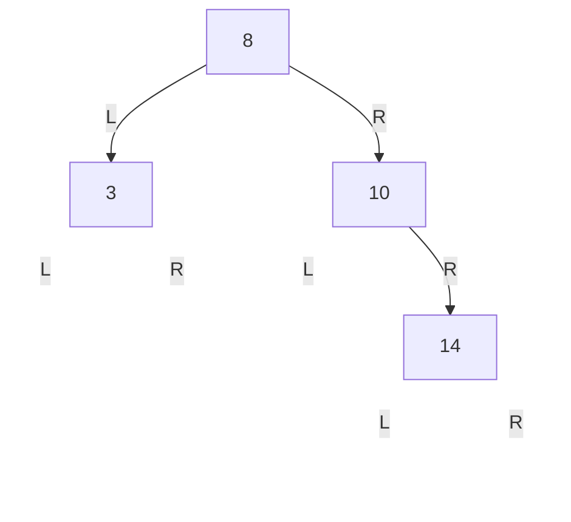
```mermaid
graph TD
		A["8"]

		B["3"]
		C["10"]

		B_L[" "]
		B_R[" "]
		C_L[" "]
		D["14"]

		D_L[" "]
		D_R[" "]

	A -->|L| B
	A -->|R| C

	B -->|L| B_L
	B -->|R| B_R

	C -->|L| C_L
	C -->|R| D

	D -->|L| D_L
	D -->|R| D_R

	classDef ghost fill:transparent,stroke:transparent,color:transparent;
	class B_L,B_R,C_L,D_L,D_R ghost;


	linkStyle 2 stroke:transparent;
	linkStyle 3 stroke:transparent;
	linkStyle 4 stroke:transparent;
	linkStyle 6 stroke:transparent;
	linkStyle 7 stroke:transparent;
```

删除 `10` 后，`14` 顶替 `10` 成为 `8` 的右孩子：

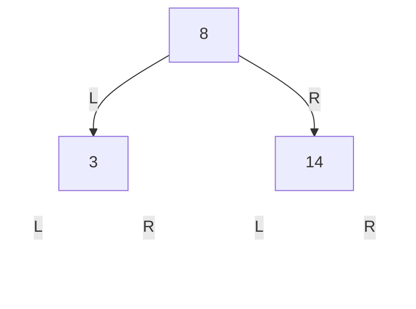
```mermaid
graph TD
		A["8"]

		B["3"]
		C["14"]

		B_L[" "]
		B_R[" "]
		C_L[" "]
		C_R[" "]

	A -->|L| B
	A -->|R| C

	B -->|L| B_L
	B -->|R| B_R

	C -->|L| C_L
	C -->|R| C_R

	classDef ghost fill:transparent,stroke:transparent,color:transparent;
	class B_L,B_R,C_L,C_R ghost;


	linkStyle 2 stroke:transparent;
	linkStyle 3 stroke:transparent;
	linkStyle 4 stroke:transparent;
	linkStyle 5 stroke:transparent;
```

为什么这样不会破坏 BST？

因为：

- `14` 原本就位于 `10` 的右侧子树
- 同时 `10` 原本位于 `8` 的右子树
- 所以 `14` 仍然合法地位于 `8` 的右边

更一般地说，单孩子替换之所以合法，是因为那个唯一孩子所在的整棵子树，本来就已经满足待删节点原位置的顺序约束。

------

### 22.1.3\_删除有两个孩子的节点

这是 BST 删除中最关键的一类。

设要删除节点 `x`，它同时有左子树和右子树。
此时不能直接删，因为删掉 `x` 后：

- 左右两棵子树都需要重新接回去
- 如果随意拼接，很容易破坏 BST 有序性

标准做法是：

- 用 `x` 的**前驱**或**后继**替换 `x`
- 然后再去删除那个前驱/后继节点

为什么这样做？

因为前驱或后继与 `x` 在有序序列中紧邻，替换后最容易保持顺序关系。

------

### 22.1.4\_前驱与后继替换思想

#### (1)\_前驱是什么

某节点的前驱，是其中序遍历序列中**排在它前面的那个最大值**。
当该节点有非空左子树时，它就是：

- 该节点左子树中
- 最右边的那个节点

#### (2)\_后继是什么

某节点的后继，是其中序遍历序列中**排在它后面的那个最小值**。
当该节点有非空右子树时，它就是：

- 该节点右子树中
- 最左边的那个节点

若相应子树为空，前驱或后继可能在祖先方向，也可能不存在。本节双孩子删除保证左右子树都非空，因此不需要祖先回溯分支。

#### (3)\_为什么可以替换

因为：

- 前驱 `< 当前节点 < 后继`
- 前驱是“左边最大”
- 后继是“右边最小”

完成替换并移除原前驱/后继后，严格中序有序性恢复。仅复制值而尚未移除原节点的中间状态会暂时存在重复键，本章的独占操作不允许外部访问者观察该状态。

------

### 22.1.5\_删除两个孩子节点的实例

删除 `8`：

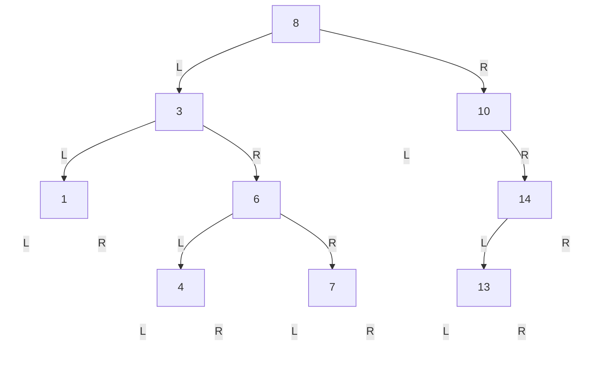
```mermaid
graph TD
		A["8"]

		B["3"]
		C["10"]

		D["1"]
		E["6"]
		C_L[" "]
		F["14"]

		D_L[" "]
		D_R[" "]
		G["4"]
		H["7"]
		I["13"]
		F_R[" "]

		G_L[" "]
		G_R[" "]
		H_L[" "]
		H_R[" "]
		I_L[" "]
		I_R[" "]

	A -->|L| B
	A -->|R| C

	B -->|L| D
	B -->|R| E

	C -->|L| C_L
	C -->|R| F

	D -->|L| D_L
	D -->|R| D_R

	E -->|L| G
	E -->|R| H

	F -->|L| I
	F -->|R| F_R

	G -->|L| G_L
	G -->|R| G_R

	H -->|L| H_L
	H -->|R| H_R

	I -->|L| I_L
	I -->|R| I_R

	classDef ghost fill:transparent,stroke:transparent,color:transparent;
	class C_L,D_L,D_R,F_R,G_L,G_R,H_L,H_R,I_L,I_R ghost;


	linkStyle 4 stroke:transparent;
	linkStyle 6 stroke:transparent;
	linkStyle 7 stroke:transparent;
	linkStyle 11 stroke:transparent;
	linkStyle 12 stroke:transparent;
	linkStyle 13 stroke:transparent;
	linkStyle 14 stroke:transparent;
	linkStyle 15 stroke:transparent;
	linkStyle 16 stroke:transparent;
	linkStyle 17 stroke:transparent;
```

这里选**后继**替换：

- `8` 的右子树是以 `10` 为根
- 右子树最左节点就是 `10`
- 所以后继是 `10`

第一步：用 `10` 的值覆盖 `8`
第二步：再删除原来的 `10`

而原来的 `10` 在这个例子中只有一个右孩子 `14`，所以删除变成了“单孩子删除”。

结果：

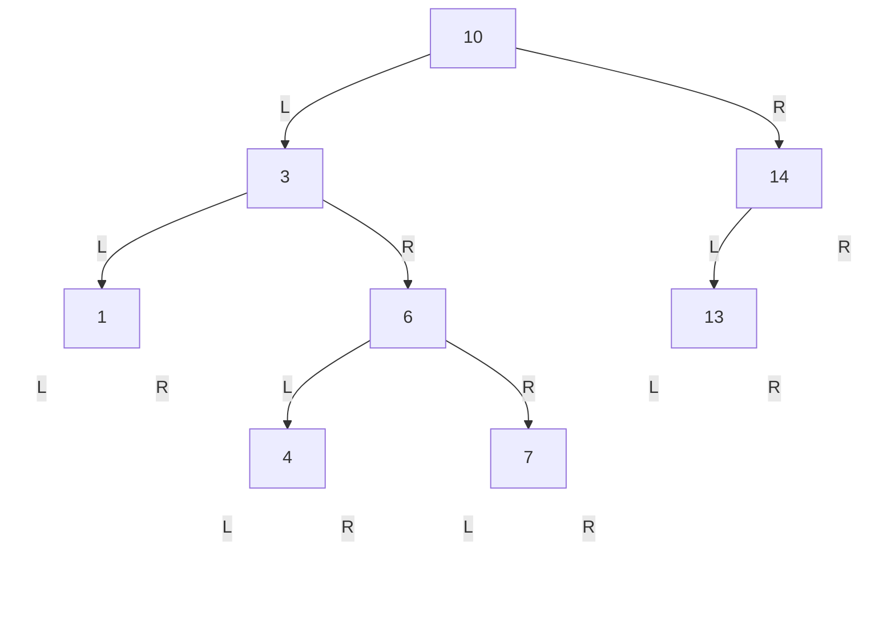
```mermaid
graph TD
		A["10"]

		B["3"]
		C["14"]

		D["1"]
		E["6"]
		F["13"]
		C_R[" "]

		D_L[" "]
		D_R[" "]
		G["4"]
		H["7"]
		F_L[" "]
		F_R[" "]

		G_L[" "]
		G_R[" "]
		H_L[" "]
		H_R[" "]

	A -->|L| B
	A -->|R| C

	B -->|L| D
	B -->|R| E

	C -->|L| F
	C -->|R| C_R

	D -->|L| D_L
	D -->|R| D_R

	E -->|L| G
	E -->|R| H

	F -->|L| F_L
	F -->|R| F_R

	G -->|L| G_L
	G -->|R| G_R

	H -->|L| H_L
	H -->|R| H_R

	classDef ghost fill:transparent,stroke:transparent,color:transparent;
	class C_R,D_L,D_R,F_L,F_R,G_L,G_R,H_L,H_R ghost;


	linkStyle 5 stroke:transparent;
	linkStyle 6 stroke:transparent;
	linkStyle 7 stroke:transparent;
	linkStyle 10 stroke:transparent;
	linkStyle 11 stroke:transparent;
	linkStyle 12 stroke:transparent;
	linkStyle 13 stroke:transparent;
	linkStyle 14 stroke:transparent;
	linkStyle 15 stroke:transparent;
```

你要注意一个关键事实：

> 删除两个孩子节点，真正难点不在“删”，而在“选择一个合法替代者”。

------

## 22.2\_从图中的替换走到地址上的回接

删除实现比查找和插入更长，因为它不是一个“找到就删”的单动作过程，而是一个**分类处理 + 子树回接**的过程。

BST 删除通常分为三类：

- **叶子删除**：目标节点没有孩子，直接断开父节点对应指针
- **单孩子删除**：目标节点只有一个孩子，让唯一孩子顶替其位置
- **双孩子删除**：目标节点有两个孩子，通常先找前驱或后继，用其值覆盖当前节点，再删除原前驱或后继节点

本节后面的 C++ 示例，采用的是最常见的一种写法：

- 不显式维护父指针
- 使用**递归返回“删除后的子树新根”**
- 调用者把返回值重新接回 `root->left` 或 `root->right`

也就是说，这个实现的关键不是“直接改父节点”，而是：

```text
删除左子树中的节点后，把返回的新子树根重新接回 root->left
删除右子树中的节点后，把返回的新子树根重新接回 root->right
删除当前节点后，把替代后的子树根返回给上一层
```

如果是双孩子删除，本实现采用的是：

- 找后继
- 用后继值覆盖当前节点
- 再递归删除原后继节点

所以核心流程可以先记成：

```text
找到待删节点
-> 判断孩子个数
-> 若有两个孩子，则找后继
-> 用后继值覆盖当前节点
-> 再去右子树中删除原后继节点
```

先分清 **删除一个键** 与 **释放原地址**。双孩子方案保留待删位置的对象，只把后继的整数 key 复制进去；真正释放的是后继对象。若业务把节点地址当成长期身份，或节点还拥有与 key 绑定的其他数据，这个实现就不能直接套用。此时要设计节点移植、业务数据转移或更严格的借用规则，不能只多复制一个整数后认为完成了对象删除。Linux 的嵌入式树节点另有对象契约，本例不是其实现替身。

以删除 8、后继为 10 为例，跟随同一轮状态：

| 阶段 | 读写者与具体位置 | 下一步依据 |
| --- | --- | --- |
| S0 查找 | 当前调用读取 root->key 及左右边，调用栈保存返回位置 | 命中 8 且两孩子非空 |
| S1 找替代 | 本地 succ 保存右子树沿 left 到达的最小节点地址 | succ 没有左孩子，最多一个右孩子 |
| S2 覆盖 | 当前调用写 root->key = succ->key，两个对象短暂含同值 | 仍在独占调用中，尚不能给读者返回完成 |
| S3 移除后继 | 右子树递归调用先保存后继的右孩子，再 delete 后继 | 返回仍活着的替代子树根，不再解引用 succ |
| S4 回接 | 上层调用写 root->right，最外层将返回值交回调用者根变量 | 键集合少一个，严格有序性恢复，才结束操作 |

叶子和单孩子分支没有 S1/S2，直接保存替代入口、释放当前对象、把新根返回给上层。流程中不涉及跨线程通信；并发版本必须额外约定保护范围和借用寿命，不能只在最后赋值处加锁。

图中颜色约定如下：

- **红色**：待删除节点
- **绿色**：替代节点 / 顶替节点
- **黄色**：需要修改子指针的父节点
- **蓝色**：被重新挂接的子树

------

## 22.3\_删除流程总览

下面集中画命中节点后的分类。若查找落到空子树，实际代码直接返回 nullptr，由上一层接回原来的空槽；不存在的键不会进入删除分类，也不会释放其他节点。

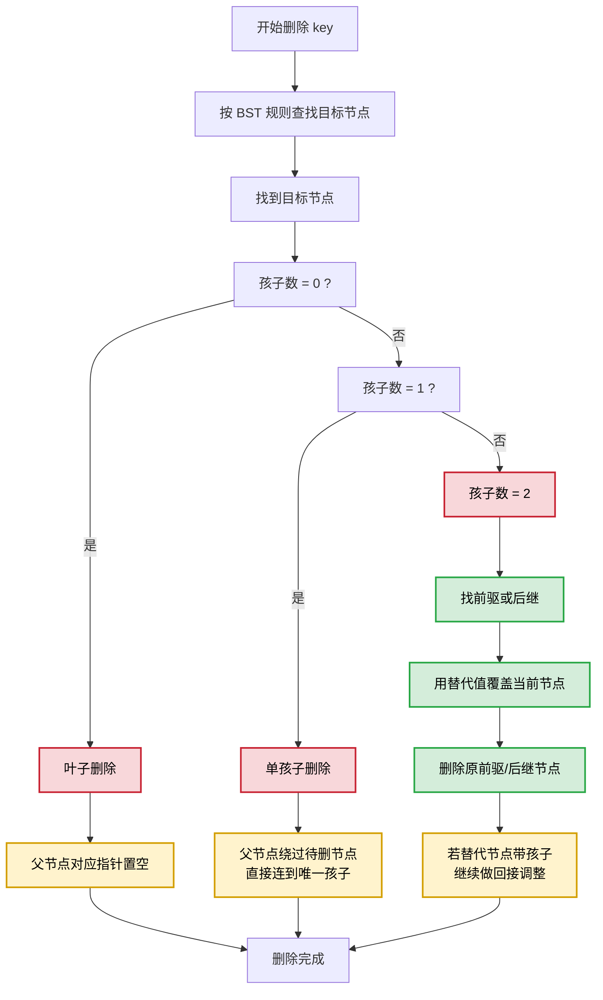
```mermaid
flowchart TD
	A["开始删除 key"] --> B["按 BST 规则查找目标节点"]
	B --> C["找到目标节点"]

	C --> D["孩子数 = 0 ?"]
	D -->|是| E["叶子删除"]
	E --> F["父节点对应指针置空"]

	D -->|否| G["孩子数 = 1 ?"]
	G -->|是| H["单孩子删除"]
	H --> I["父节点绕过待删节点<br/>直接连到唯一孩子"]

	G -->|否| J["孩子数 = 2"]
	J --> K["找前驱或后继"]
	K --> L["用替代值覆盖当前节点"]
	L --> M["删除原前驱/后继节点"]
	M --> N["若替代节点带孩子<br/>继续做回接调整"]

	F --> O["删除完成"]
	I --> O
	N --> O

	classDef target fill:#f8d7da,stroke:#c82333,stroke-width:2px,color:#000;
	classDef replace fill:#d4edda,stroke:#28a745,stroke-width:2px,color:#000;
	classDef parent fill:#fff3cd,stroke:#d39e00,stroke-width:2px,color:#000;
	classDef moved fill:#d1ecf1,stroke:#0c5460,stroke-width:2px,color:#000;

	class E,H,J target;
	class K,L,M replace;
	class F,I,N parent;
```

------

## 22.4\_删除叶子节点

在 `main()` 中，第一次删除的是 `7`。
此时 `7` 没有左右孩子，所以它属于**叶子删除**。

删除前：

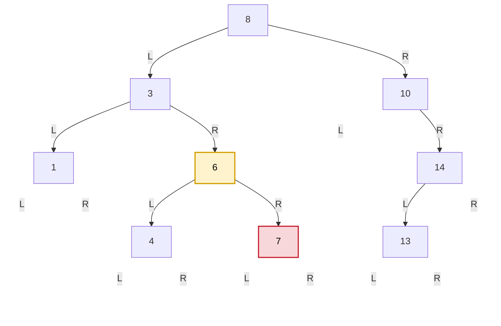
```mermaid
graph TD
		A["8"]

		B["3"]
		C["10"]

		D["1"]
		E["6"]
		C_L[" "]
		F["14"]

		D_L[" "]
		D_R[" "]
		G["4"]
		H["7"]
		I["13"]
		F_R[" "]

		G_L[" "]
		G_R[" "]
		H_L[" "]
		H_R[" "]
		I_L[" "]
		I_R[" "]

	A -->|L| B
	A -->|R| C

	B -->|L| D
	B -->|R| E

	C -->|L| C_L
	C -->|R| F

	D -->|L| D_L
	D -->|R| D_R

	E -->|L| G
	E -->|R| H

	F -->|L| I
	F -->|R| F_R

	G -->|L| G_L
	G -->|R| G_R

	H -->|L| H_L
	H -->|R| H_R

	I -->|L| I_L
	I -->|R| I_R

	classDef target fill:#f8d7da,stroke:#c82333,stroke-width:2px,color:#000;
	classDef replace fill:#d4edda,stroke:#28a745,stroke-width:2px,color:#000;
	classDef parent fill:#fff3cd,stroke:#d39e00,stroke-width:2px,color:#000;
	classDef moved fill:#d1ecf1,stroke:#0c5460,stroke-width:2px,color:#000;
	classDef ghost fill:transparent,stroke:transparent,color:transparent;

	class E parent;
	class H target;
	class C_L,D_L,D_R,F_R,G_L,G_R,H_L,H_R,I_L,I_R ghost;


	linkStyle 4 stroke:transparent;
	linkStyle 6 stroke:transparent;
	linkStyle 7 stroke:transparent;
	linkStyle 11 stroke:transparent;
	linkStyle 12 stroke:transparent;
	linkStyle 13 stroke:transparent;
	linkStyle 14 stroke:transparent;
	linkStyle 15 stroke:transparent;
	linkStyle 16 stroke:transparent;
	linkStyle 17 stroke:transparent;
```

删除后：

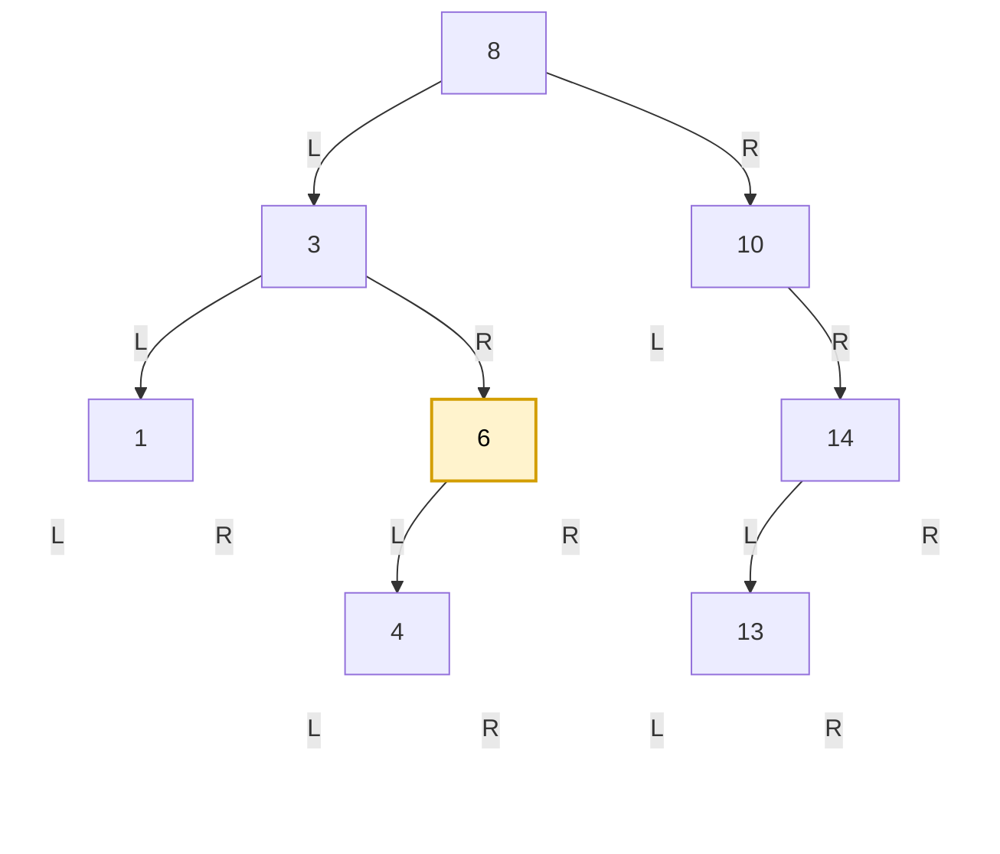
```mermaid
graph TD
		A["8"]

		B["3"]
		C["10"]

		D["1"]
		E["6"]
		C_L[" "]
		F["14"]

		D_L[" "]
		D_R[" "]
		G["4"]
		E_R[" "]
		I["13"]
		F_R[" "]

		G_L[" "]
		G_R[" "]
		I_L[" "]
		I_R[" "]

	A -->|L| B
	A -->|R| C

	B -->|L| D
	B -->|R| E

	C -->|L| C_L
	C -->|R| F

	D -->|L| D_L
	D -->|R| D_R

	E -->|L| G
	E -->|R| E_R

	F -->|L| I
	F -->|R| F_R

	G -->|L| G_L
	G -->|R| G_R

	I -->|L| I_L
	I -->|R| I_R

	classDef target fill:#f8d7da,stroke:#c82333,stroke-width:2px,color:#000;
	classDef replace fill:#d4edda,stroke:#28a745,stroke-width:2px,color:#000;
	classDef parent fill:#fff3cd,stroke:#d39e00,stroke-width:2px,color:#000;
	classDef moved fill:#d1ecf1,stroke:#0c5460,stroke-width:2px,color:#000;
	classDef ghost fill:transparent,stroke:transparent,color:transparent;

	class E parent;
	class C_L,D_L,D_R,E_R,F_R,G_L,G_R,I_L,I_R ghost;


	linkStyle 4 stroke:transparent;
	linkStyle 6 stroke:transparent;
	linkStyle 7 stroke:transparent;
	linkStyle 9 stroke:transparent;
	linkStyle 11 stroke:transparent;
	linkStyle 12 stroke:transparent;
	linkStyle 13 stroke:transparent;
	linkStyle 14 stroke:transparent;
	linkStyle 15 stroke:transparent;
```

这一类删除，代码里真正做的事情可以概括为：

```text
parent->right = nullptr
delete node
```

叶子删除的本质就是：

> **父节点原来指向它，现在改为不再指向它。**

------

## 22.5\_删除单孩子节点

继续执行 `main()`，第二次删除的是 `14`。
此时 `14` 只有一个左孩子 `13`，所以它属于**单孩子删除**。

这一类删除的关键不是“删掉一个节点”，而是：

> **父节点绕过待删节点，直接连到它的唯一孩子。**

删除前：

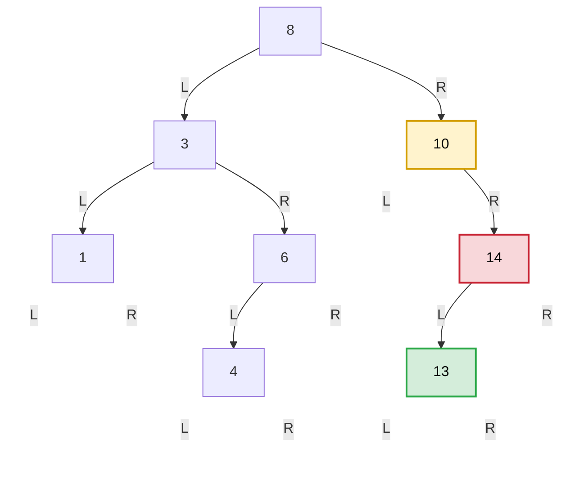
```mermaid
graph TD
		A["8"]

		B["3"]
		C["10"]

		D["1"]
		E["6"]
		C_L[" "]
		F["14"]

		D_L[" "]
		D_R[" "]
		G["4"]
		E_R[" "]
		H["13"]
		F_R[" "]

		G_L[" "]
		G_R[" "]
		H_L[" "]
		H_R[" "]

	A -->|L| B
	A -->|R| C

	B -->|L| D
	B -->|R| E

	C -->|L| C_L
	C -->|R| F

	D -->|L| D_L
	D -->|R| D_R

	E -->|L| G
	E -->|R| E_R

	F -->|L| H
	F -->|R| F_R

	G -->|L| G_L
	G -->|R| G_R

	H -->|L| H_L
	H -->|R| H_R

	classDef target fill:#f8d7da,stroke:#c82333,stroke-width:2px,color:#000;
	classDef replace fill:#d4edda,stroke:#28a745,stroke-width:2px,color:#000;
	classDef parent fill:#fff3cd,stroke:#d39e00,stroke-width:2px,color:#000;
	classDef moved fill:#d1ecf1,stroke:#0c5460,stroke-width:2px,color:#000;
	classDef ghost fill:transparent,stroke:transparent,color:transparent;

	class C parent;
	class F target;
	class H replace;
	class C_L,D_L,D_R,E_R,F_R,G_L,G_R,H_L,H_R ghost;


	linkStyle 4 stroke:transparent;
	linkStyle 6 stroke:transparent;
	linkStyle 7 stroke:transparent;
	linkStyle 9 stroke:transparent;
	linkStyle 11 stroke:transparent;
	linkStyle 12 stroke:transparent;
	linkStyle 13 stroke:transparent;
	linkStyle 14 stroke:transparent;
	linkStyle 15 stroke:transparent;
```

删除后：

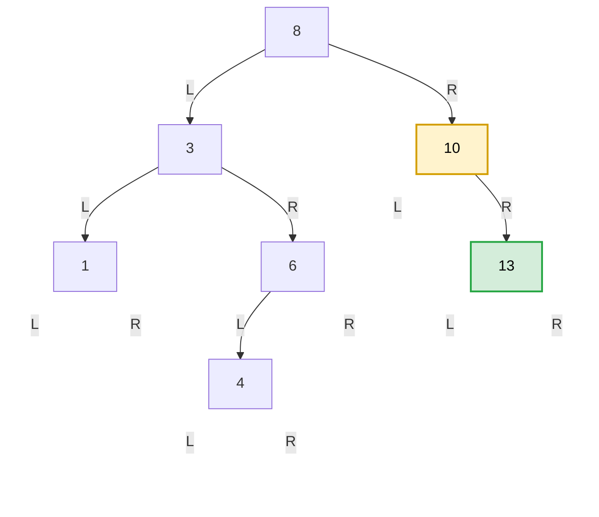
```mermaid
graph TD
		A["8"]

		B["3"]
		C["10"]

		D["1"]
		E["6"]
		C_L[" "]
		H["13"]

		D_L[" "]
		D_R[" "]
		G["4"]
		E_R[" "]
		H_L[" "]
		H_R[" "]

		G_L[" "]
		G_R[" "]

	A -->|L| B
	A -->|R| C

	B -->|L| D
	B -->|R| E

	C -->|L| C_L
	C -->|R| H

	D -->|L| D_L
	D -->|R| D_R

	E -->|L| G
	E -->|R| E_R

	H -->|L| H_L
	H -->|R| H_R

	G -->|L| G_L
	G -->|R| G_R

	classDef target fill:#f8d7da,stroke:#c82333,stroke-width:2px,color:#000;
	classDef replace fill:#d4edda,stroke:#28a745,stroke-width:2px,color:#000;
	classDef parent fill:#fff3cd,stroke:#d39e00,stroke-width:2px,color:#000;
	classDef moved fill:#d1ecf1,stroke:#0c5460,stroke-width:2px,color:#000;
	classDef ghost fill:transparent,stroke:transparent,color:transparent;

	class C parent;
	class H replace;
	class C_L,D_L,D_R,E_R,H_L,H_R,G_L,G_R ghost;


	linkStyle 4 stroke:transparent;
	linkStyle 6 stroke:transparent;
	linkStyle 7 stroke:transparent;
	linkStyle 9 stroke:transparent;
	linkStyle 10 stroke:transparent;
	linkStyle 11 stroke:transparent;
	linkStyle 12 stroke:transparent;
	linkStyle 13 stroke:transparent;
```

这一步代码里真正发生的事可以概括为：

```text
parent(10)->right = child(13)
delete node(14)
```

你要注意，这里虽然待删节点 `14` 不在“树的中间”，但代码动作已经体现出了单孩子删除的本质：

> **不是把节点删掉就结束，而是要把它唯一的孩子重新挂回去。**

------

## 22.6\_补充\_中间节点的单孩子删除

上面的 `14` 是右侧分支上的节点。
但从“实现理解”的角度，仅看这种边缘位置还不够，你还需要看一次**中间节点**的单孩子删除。

例如删除 `6`，并设 `6` 只有一个左孩子 `4`：

删除前：

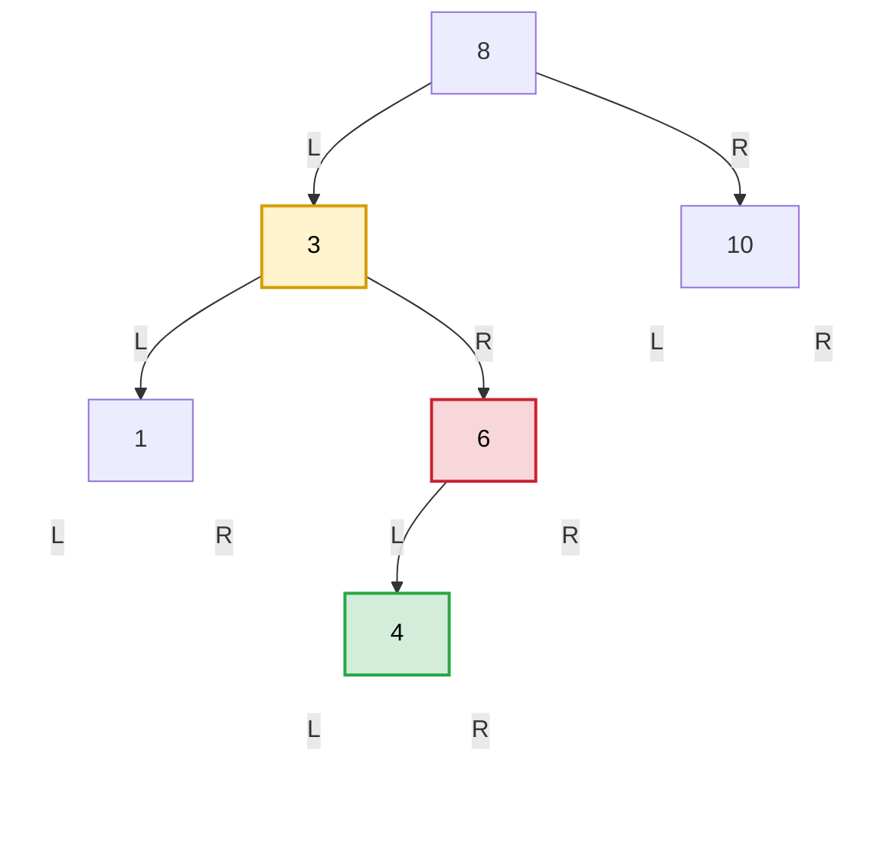
```mermaid
graph TD
		A["8"]

		B["3"]
		C["10"]

		D["1"]
		E["6"]
		C_L[" "]
		C_R[" "]

		D_L[" "]
		D_R[" "]
		F["4"]
		E_R[" "]

		F_L[" "]
		F_R[" "]

	A -->|L| B
	A -->|R| C

	B -->|L| D
	B -->|R| E

	C -->|L| C_L
	C -->|R| C_R

	D -->|L| D_L
	D -->|R| D_R

	E -->|L| F
	E -->|R| E_R

	F -->|L| F_L
	F -->|R| F_R

	classDef target fill:#f8d7da,stroke:#c82333,stroke-width:2px,color:#000;
	classDef replace fill:#d4edda,stroke:#28a745,stroke-width:2px,color:#000;
	classDef parent fill:#fff3cd,stroke:#d39e00,stroke-width:2px,color:#000;
	classDef moved fill:#d1ecf1,stroke:#0c5460,stroke-width:2px,color:#000;
	classDef ghost fill:transparent,stroke:transparent,color:transparent;

	class B parent;
	class E target;
	class F replace;
	class C_L,C_R,D_L,D_R,E_R,F_L,F_R ghost;


	linkStyle 4 stroke:transparent;
	linkStyle 5 stroke:transparent;
	linkStyle 6 stroke:transparent;
	linkStyle 7 stroke:transparent;
	linkStyle 9 stroke:transparent;
	linkStyle 10 stroke:transparent;
	linkStyle 11 stroke:transparent;
```

删除后：

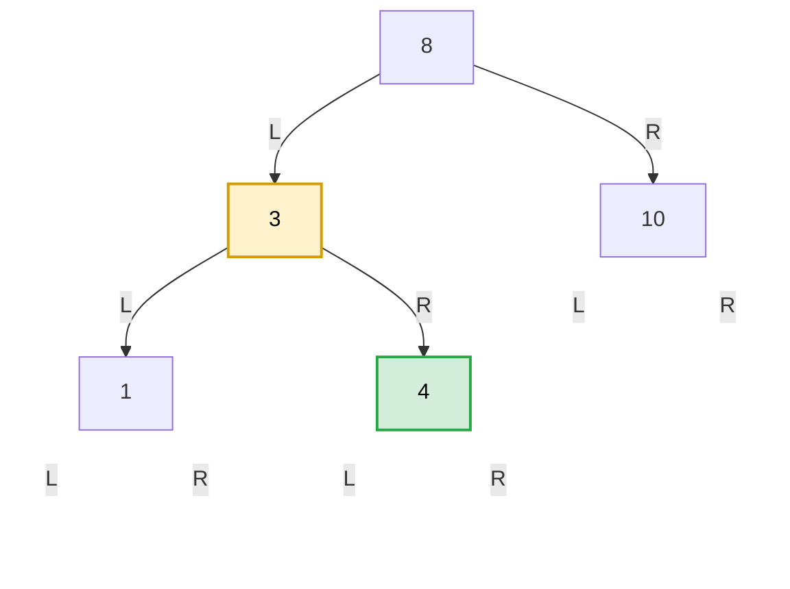
```mermaid
graph TD
		A["8"]

		B["3"]
		C["10"]

		D["1"]
		F["4"]
		C_L[" "]
		C_R[" "]

		D_L[" "]
		D_R[" "]
		F_L[" "]
		F_R[" "]

	A -->|L| B
	A -->|R| C

	B -->|L| D
	B -->|R| F

	C -->|L| C_L
	C -->|R| C_R

	D -->|L| D_L
	D -->|R| D_R

	F -->|L| F_L
	F -->|R| F_R

	classDef target fill:#f8d7da,stroke:#c82333,stroke-width:2px,color:#000;
	classDef replace fill:#d4edda,stroke:#28a745,stroke-width:2px,color:#000;
	classDef parent fill:#fff3cd,stroke:#d39e00,stroke-width:2px,color:#000;
	classDef moved fill:#d1ecf1,stroke:#0c5460,stroke-width:2px,color:#000;
	classDef ghost fill:transparent,stroke:transparent,color:transparent;

	class B parent;
	class F replace;
	class C_L,C_R,D_L,D_R,F_L,F_R ghost;


	linkStyle 4 stroke:transparent;
	linkStyle 5 stroke:transparent;
	linkStyle 6 stroke:transparent;
	linkStyle 7 stroke:transparent;
	linkStyle 8 stroke:transparent;
	linkStyle 9 stroke:transparent;
```

这一步的本质是：

```text
parent(3)->right = child(4)
delete node(6)
```

所以，单孩子删除的核心不在“删”，而在：

> **删掉目标节点以后，如何把它的唯一孩子重新挂回父节点。**

------

## 22.7\_删除双孩子节点

继续执行 `main()`，第三次删除的是 `8`。
此时 `8` 同时有左子树和右子树，所以它属于**双孩子删除**。

这一类不能直接把 `8` 断开，否则左右两棵子树都会失去连接位置。
标准做法是：

1. 找 `8` 的后继
2. 用后继值覆盖 `8`
3. 再去删除原来的后继节点

在当前这棵树里：

- `8` 的右子树根是 `10`
- `10` 没有左孩子
- 所以 `8` 的后继就是 `10`

------

### 22.7.1\_确定后继节点

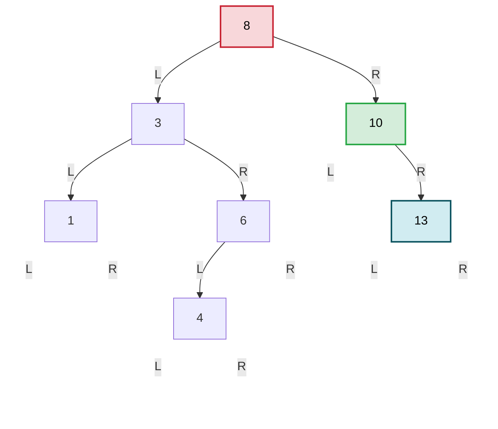
```mermaid
graph TD
		A["8"]

		B["3"]
		C["10"]

		D["1"]
		E["6"]
		C_L[" "]
		H["13"]

		D_L[" "]
		D_R[" "]
		G["4"]
		E_R[" "]
		H_L[" "]
		H_R[" "]

		G_L[" "]
		G_R[" "]

	A -->|L| B
	A -->|R| C

	B -->|L| D
	B -->|R| E

	C -->|L| C_L
	C -->|R| H

	D -->|L| D_L
	D -->|R| D_R

	E -->|L| G
	E -->|R| E_R

	H -->|L| H_L
	H -->|R| H_R

	G -->|L| G_L
	G -->|R| G_R

	classDef target fill:#f8d7da,stroke:#c82333,stroke-width:2px,color:#000;
	classDef replace fill:#d4edda,stroke:#28a745,stroke-width:2px,color:#000;
	classDef parent fill:#fff3cd,stroke:#d39e00,stroke-width:2px,color:#000;
	classDef moved fill:#d1ecf1,stroke:#0c5460,stroke-width:2px,color:#000;
	classDef ghost fill:transparent,stroke:transparent,color:transparent;

	class A target;
	class C replace;
	class H moved;
	class C_L,D_L,D_R,E_R,H_L,H_R,G_L,G_R ghost;


	linkStyle 4 stroke:transparent;
	linkStyle 6 stroke:transparent;
	linkStyle 7 stroke:transparent;
	linkStyle 9 stroke:transparent;
	linkStyle 10 stroke:transparent;
	linkStyle 11 stroke:transparent;
	linkStyle 12 stroke:transparent;
	linkStyle 13 stroke:transparent;
```

这一步要表达的是：

- 红色节点 `8` 是待删节点
- 绿色节点 `10` 是后继节点
- 蓝色节点 `13` 是后继节点原本带着的右子树，后面删除原 `10` 时要继续回接

------

### 22.7.2\_用后继替换并删除原后继

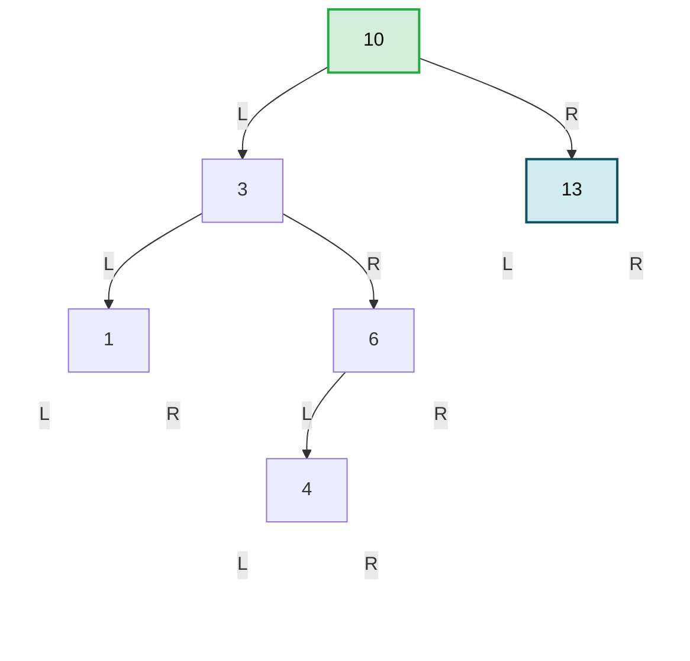
```mermaid
graph TD
		A["10"]

		B["3"]
		H["13"]

		D["1"]
		E["6"]
		H_L[" "]
		H_R[" "]

		D_L[" "]
		D_R[" "]
		G["4"]
		E_R[" "]

		G_L[" "]
		G_R[" "]

	A -->|L| B
	A -->|R| H

	B -->|L| D
	B -->|R| E

	H -->|L| H_L
	H -->|R| H_R

	D -->|L| D_L
	D -->|R| D_R

	E -->|L| G
	E -->|R| E_R

	G -->|L| G_L
	G -->|R| G_R

	classDef target fill:#f8d7da,stroke:#c82333,stroke-width:2px,color:#000;
	classDef replace fill:#d4edda,stroke:#28a745,stroke-width:2px,color:#000;
	classDef parent fill:#fff3cd,stroke:#d39e00,stroke-width:2px,color:#000;
	classDef moved fill:#d1ecf1,stroke:#0c5460,stroke-width:2px,color:#000;
	classDef ghost fill:transparent,stroke:transparent,color:transparent;

	class A replace;
	class H moved;
	class H_L,H_R,D_L,D_R,E_R,G_L,G_R ghost;


	linkStyle 4 stroke:transparent;
	linkStyle 5 stroke:transparent;
	linkStyle 6 stroke:transparent;
	linkStyle 7 stroke:transparent;
	linkStyle 9 stroke:transparent;
	linkStyle 10 stroke:transparent;
	linkStyle 11 stroke:transparent;
```

这里一定要看清楚一个实现细节：

这个代码不是“把整个 `10` 节点物理搬到根上”。
它真正做的是：

```text
root(8)->key = successor(10)->key
然后在 root->right 子树中删除原来的 10
```

也就是说，双孩子删除在代码层面通常分两步：

1. **值替换**
2. **再删原后继**

因此，这一类删除的难点不是“删掉根节点”，而是：

> **如何在替换之后，继续把原后继节点那一支删干净，同时保持 BST 有序性。**

------

## 22.8\_补充\_满二叉树中的中间节点删除

先看一个**完美 BST**。
删除的不是根，而是中间节点 `12`。

这棵树是：

```text
            8
         /     \
        4       12
      /  \     /  \
     2    6   10   14
    / \  / \  / \  / \
   1  3 5  7 9 11 13 15
```

这里：

- 待删节点：`12`
- 后继节点：`13`
- 后继节点 `13` 是叶子
- 后继节点的父节点是 `14`

所以删除时真正发生的是：

1. 用 `13` 覆盖 `12`
2. 再删除原来的 `13`
3. 然后把 `14->left` 置空

删除前：

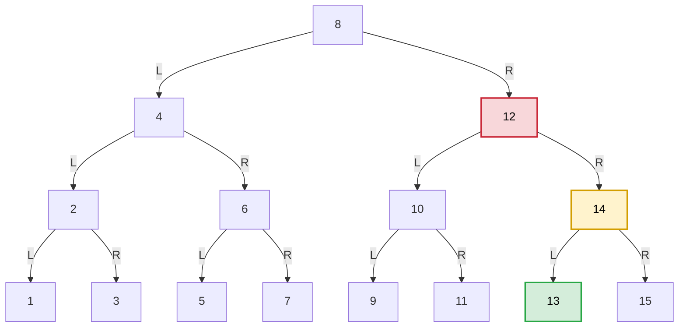
```mermaid
graph TD
		A["8"]

		B["4"]
		C["12"]

		D["2"]
		E["6"]
		F["10"]
		G["14"]

		H["1"]
		I["3"]
		J["5"]
		K["7"]
		L["9"]
		M["11"]
		N["13"]
		O["15"]

	A -->|L| B
	A -->|R| C

	B -->|L| D
	B -->|R| E

	C -->|L| F
	C -->|R| G

	D -->|L| H
	D -->|R| I

	E -->|L| J
	E -->|R| K

	F -->|L| L
	F -->|R| M

	G -->|L| N
	G -->|R| O

	classDef target fill:#f8d7da,stroke:#c82333,stroke-width:2px,color:#000;
	classDef replace fill:#d4edda,stroke:#28a745,stroke-width:2px,color:#000;
	classDef parent fill:#fff3cd,stroke:#d39e00,stroke-width:2px,color:#000;

	class C target;
	class N replace;
	class G parent;

```

删除后：

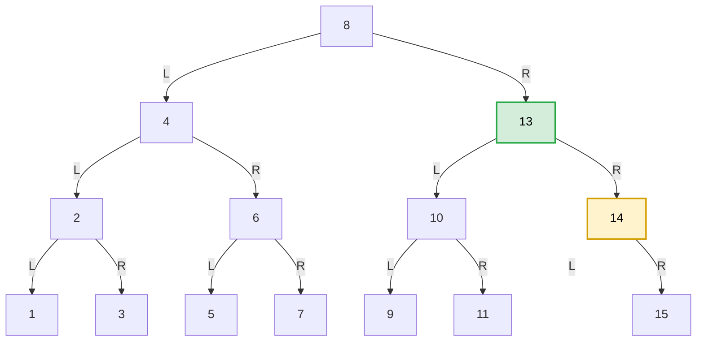
```mermaid
graph TD
		A["8"]

		B["4"]
		C["13"]

		D["2"]
		E["6"]
		F["10"]
		G["14"]

		H["1"]
		I["3"]
		J["5"]
		K["7"]
		L["9"]
		M["11"]
		G_L[" "]
		O["15"]

	A -->|L| B
	A -->|R| C

	B -->|L| D
	B -->|R| E

	C -->|L| F
	C -->|R| G

	D -->|L| H
	D -->|R| I

	E -->|L| J
	E -->|R| K

	F -->|L| L
	F -->|R| M

	G -->|L| G_L
	G -->|R| O

	classDef replace fill:#d4edda,stroke:#28a745,stroke-width:2px,color:#000;
	classDef parent fill:#fff3cd,stroke:#d39e00,stroke-width:2px,color:#000;
	classDef ghost fill:transparent,stroke:transparent,color:transparent;

	class C replace;
	class G parent;
	class G_L ghost;


	linkStyle 12 stroke:transparent;
```

这组图要你看清楚的是：

- 删除的是中间节点 `12`
- 真正被物理删掉的不是 `12` 这个位置，而是原来的后继叶子 `13`
- 调整动作是：`14->left = nullptr`

也就是：

```text
node(12)->key = 13
parent_of_successor(14)->left = nullptr
```

------

## 22.9\_补充\_中间节点删除\_且后继还带右孩子

上面那个例子虽然是“中间节点删除”，但因为原树是满二叉树，所以后继只能是叶子。
这样你还是看不到**回接调整**。

下面补一个更重要的例子：
删除中间节点 `10`，它的后继 `12` **自己还带一个右孩子 `13`**。

这棵树是：

```text
           20
         /    \
       10      30
      /  \
     5   15
        /  \
       12   18
         \
          13
```

这里：

- 待删节点：`10`
- 后继节点：`12`
- 后继父节点：`15`
- 后继节点的右孩子：`13`

所以删除时真正发生的是：

1. 用 `12` 覆盖 `10`
2. 再删除原来的 `12`
3. 由于原 `12` 还有右孩子 `13`
4. 所以不能直接把 `15->left` 置空
5. 而必须改成：`15->left = 13`

删除前：

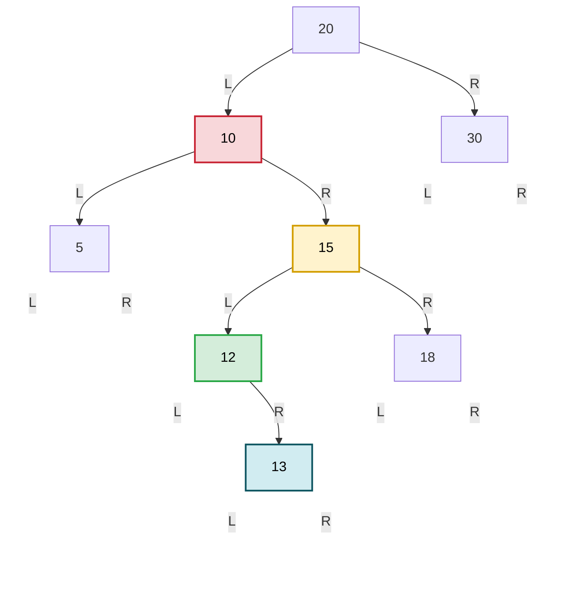
```mermaid
graph TD
		A["20"]

		B["10"]
		C["30"]

		D["5"]
		E["15"]
		C_L[" "]
		C_R[" "]

		D_L[" "]
		D_R[" "]
		H["12"]
		I["18"]

		H_L[" "]
		J["13"]
		I_L[" "]
		I_R[" "]

		J_L[" "]
		J_R[" "]

	A -->|L| B
	A -->|R| C

	B -->|L| D
	B -->|R| E

	C -->|L| C_L
	C -->|R| C_R

	D -->|L| D_L
	D -->|R| D_R

	E -->|L| H
	E -->|R| I

	H -->|L| H_L
	H -->|R| J

	I -->|L| I_L
	I -->|R| I_R

	J -->|L| J_L
	J -->|R| J_R

	classDef target fill:#f8d7da,stroke:#c82333,stroke-width:2px,color:#000;
	classDef replace fill:#d4edda,stroke:#28a745,stroke-width:2px,color:#000;
	classDef parent fill:#fff3cd,stroke:#d39e00,stroke-width:2px,color:#000;
	classDef moved fill:#d1ecf1,stroke:#0c5460,stroke-width:2px,color:#000;
	classDef ghost fill:transparent,stroke:transparent,color:transparent;

	class B target;
	class H replace;
	class E parent;
	class J moved;
	class C_L,C_R,D_L,D_R,H_L,I_L,I_R,J_L,J_R ghost;


	linkStyle 4 stroke:transparent;
	linkStyle 5 stroke:transparent;
	linkStyle 6 stroke:transparent;
	linkStyle 7 stroke:transparent;
	linkStyle 10 stroke:transparent;
	linkStyle 12 stroke:transparent;
	linkStyle 13 stroke:transparent;
	linkStyle 14 stroke:transparent;
	linkStyle 15 stroke:transparent;
```

删除后：

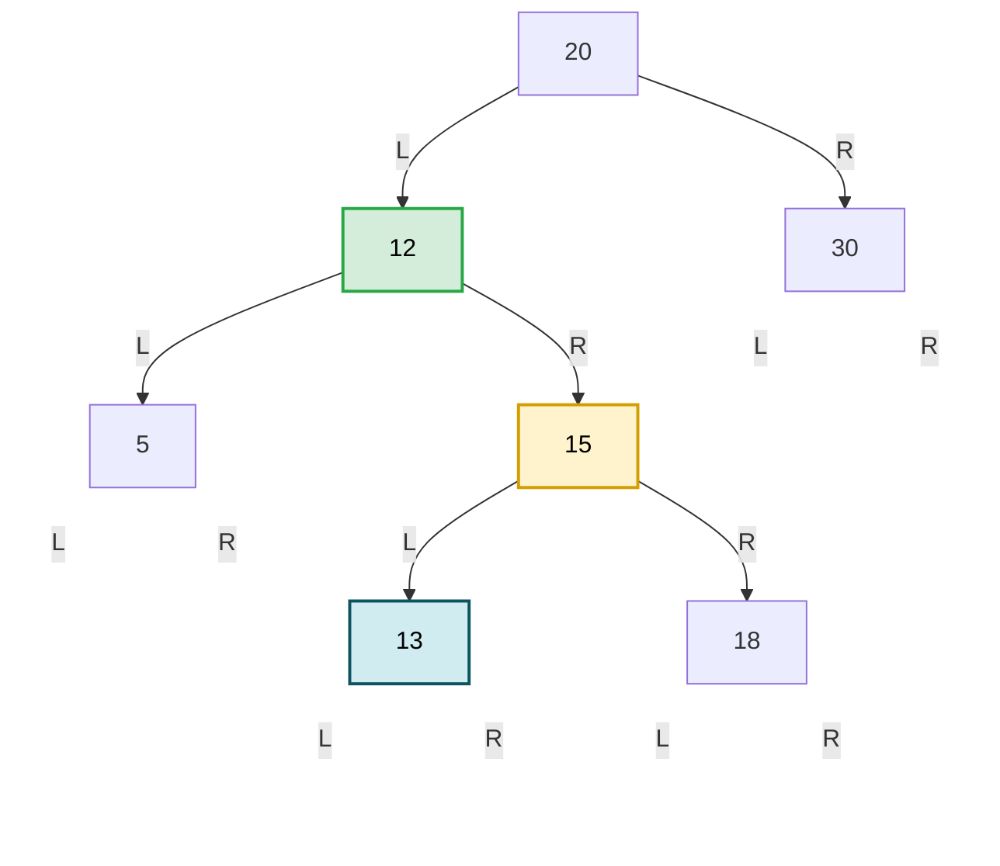
```mermaid
graph TD
		A["20"]

		B["12"]
		C["30"]

		D["5"]
		E["15"]
		C_L[" "]
		C_R[" "]

		D_L[" "]
		D_R[" "]
		J["13"]
		I["18"]

		J_L[" "]
		J_R[" "]
		I_L[" "]
		I_R[" "]

	A -->|L| B
	A -->|R| C

	B -->|L| D
	B -->|R| E

	C -->|L| C_L
	C -->|R| C_R

	D -->|L| D_L
	D -->|R| D_R

	E -->|L| J
	E -->|R| I

	J -->|L| J_L
	J -->|R| J_R

	I -->|L| I_L
	I -->|R| I_R

	classDef replace fill:#d4edda,stroke:#28a745,stroke-width:2px,color:#000;
	classDef parent fill:#fff3cd,stroke:#d39e00,stroke-width:2px,color:#000;
	classDef moved fill:#d1ecf1,stroke:#0c5460,stroke-width:2px,color:#000;
	classDef ghost fill:transparent,stroke:transparent,color:transparent;

	class B replace;
	class E parent;
	class J moved;
	class C_L,C_R,D_L,D_R,J_L,J_R,I_L,I_R ghost;


	linkStyle 4 stroke:transparent;
	linkStyle 5 stroke:transparent;
	linkStyle 6 stroke:transparent;
	linkStyle 7 stroke:transparent;
	linkStyle 10 stroke:transparent;
	linkStyle 11 stroke:transparent;
	linkStyle 12 stroke:transparent;
	linkStyle 13 stroke:transparent;
```

这一组图里，你真正应该盯住的不是“根变没变”，而是这一句：

```text
parent_of_successor(15)->left = successor->right(13)
```

也就是：

- 原来 `15->left = 12`
- 删除原来的 `12` 时，不能直接让 `15->left = nullptr`
- 必须改成 `15->left = 13`

这就是**回接调整**。

------

## 22.10\_完整\_C++\_示例

下面给出一个完整、可直接运行的 C++ 示例。
这个实现与上面的图保持一致：双孩子删除采用的是**后继值覆盖 + 递归删除原后继节点**。

```cpp
#include <iostream>
#include <new>

/*
 * BST 节点结构
 * key   : 当前节点保存的键值
 * left  : 指向左子树
 * right : 指向右子树
 */
struct bst_node {
	int key;
	bst_node *left;
	bst_node *right;
};

/*
 * 插入结果
 * ok        : 插入成功
 * duplicate : 已存在，保持原树不变
 * no_memory : 内存分配失败
 */
enum class bst_insert_result {
	ok,
	duplicate,
	no_memory,
};

/*
 * 创建一个新节点
 *
 * 参数：
 * key - 节点键值
 *
 * 返回值：
 * 成功时返回新节点地址
 * 失败时返回 nullptr
 *
 * 说明：
 * 这里使用 nothrow 版本的 new，
 * 分配失败时返回 nullptr；本例只有整数和指针的平凡初始化。
 * 若以后加入会抛异常的构造器，不能据此保证整个表达式不抛。
 */
bst_node *bst_create_node(int key) noexcept
{
	return new (std::nothrow) bst_node { key, nullptr, nullptr };
}

/*
 * 向 BST 中插入一个键值
 *
 * 参数：
 * root - 树根引用
 * key  - 待插入键值
 *
 * 返回值：
 * ok        : 插入成功
 * duplicate : 已存在，未分配节点
 * no_memory : 节点创建失败
 *
 * 说明：
 * 这里使用 bst_node **link 的方式向下查找插入位置。
 * link 一开始指向根指针本身，
 * 后续根据比较结果不断改为：
 *   - &(*link)->left
 *   - &(*link)->right
 *
 * 这样做的好处是：
 * 找到空位置后，可以直接通过 *link = node 完成挂接，
 * 不需要额外记录父节点再区分挂左还是挂右。
 *
 * 注意：
 * 这个实现不允许重复键值。
 * 重复键返回 duplicate，由调用者决定如何处理，树保持不变。
 */
bst_insert_result bst_insert(bst_node *&root, int key) noexcept
{
	bst_node **link = &root;
	bst_node *node;

	/* 沿着 BST 的比较规则向下查找插入位置 */
	while (*link) {
		if (key < (*link)->key)
			link = &(*link)->left;
		else if (key > (*link)->key)
			link = &(*link)->right;
		else {
			/* 唯一键策略：查重属于正常结果，不终止进程。 */
			return bst_insert_result::duplicate;
		}
	}

	/* 走到这里说明 *link 为空，当前位置就是插入点 */
	node = bst_create_node(key);
	if (!node)
		return bst_insert_result::no_memory;

	/* 直接把新节点挂到找到的空位置 */
	*link = node;
	return bst_insert_result::ok;
}

/*
 * 查找一棵子树中的最小节点
 *
 * 参数：
 * root - 子树根节点
 *
 * 返回值：
 * 最小节点地址；若 root 为空则返回 nullptr
 *
 * 说明：
 * BST 中最小节点一定在最左侧路径上。
 */
bst_node *bst_find_min(bst_node *root)
{
	if (!root)
		return nullptr;

	while (root->left)
		root = root->left;

	return root;
}

/*
 * 删除 BST 中指定键值的节点
 *
 * 参数：
 * root - 当前子树根节点
 * key  - 待删除键值
 *
 * 返回值：
 * 删除完成后，这棵子树的新根节点
 *
 * 这是一个非常关键的设计点：
 * 本函数不是“原地只改当前节点”，
 * 而是“删除后返回新的子树根”，
 * 这样上层调用者就可以写成：
 *
 *   root->left = bst_erase(root->left, key);
 *   root->right = bst_erase(root->right, key);
 *
 * 从而自然完成“子树回接”。
 */
bst_node *bst_erase(bst_node *root, int key)
{
	bst_node *succ;

	/* 空树，说明没找到待删节点 */
	if (!root)
		return nullptr;

	/*
	 * 若 key 更小，说明待删节点在左子树中。
	 * 删除完成后，左子树的根可能发生变化，
	 * 所以必须把返回值重新接回 root->left。
	 */
	if (key < root->key) {
		root->left = bst_erase(root->left, key);
		return root;
	}

	/*
	 * 若 key 更大，说明待删节点在右子树中。
	 * 同理，删除完成后要把新根重新接回 root->right。
	 */
	if (key > root->key) {
		root->right = bst_erase(root->right, key);
		return root;
	}

	/*
	 * 走到这里说明：
	 * 当前 root 就是待删除节点。因为 > 或者 < 都不适用于 ==，到这里自然是判断 == 了
	 *
	 * 接下来按孩子数量分类讨论。
	 */

	/*
	 * 情况 1：没有左孩子
	 *
	 * 包含两种子情况：
	 * 1) 左右孩子都没有       -> 叶子删除
	 * 2) 只有右孩子           -> 单孩子删除
	 *
	 * 统一处理方式：
	 * 当前节点删除后，让右子树顶替当前位置。
	 */
	if (!root->left) {
		bst_node *right = root->right;	// 记住右子树根节点
		delete root;
		return right;					// 返回右子树根节点
	}

	/*
	 * 情况 2：没有右孩子
	 *
	 * 说明只有左孩子。
	 * 当前节点删除后，让左子树顶替当前位置。
	 */
	if (!root->right) {
		bst_node *left = root->left;	// 记住左子树根节点
		delete root;
		return left;				  // 返回左子树根节点
	}

	/*
	 * 情况 3：左右孩子都存在
	 *
	 * 这是 BST 删除中最关键的一类情况。
	 * 不能直接粗暴删除当前节点，否则左右两棵子树的连接关系会丢失。
	 *
	 * 当前实现采用“后继替换”策略：
	 *
	 * 第一步：
	 *   在右子树中找到最小节点，它就是当前节点的中序后继。
	 *
	 * 第二步：
	 *   用后继节点的 key 覆盖当前节点的 key。
	 *   注意，这一步只是值替换，不是把整个节点物理搬过来。
	 *
	 * 第三步：
	 *   再到右子树中删除“原来的后继节点”。
	 *
	 * 为什么这样做合法？
	 * 因为后继节点是“比当前节点大的最小值”，
	 * 完成后继的移除后，整棵树重新满足严格中序有序性。
	 * 仅复制 key 的中间状态有两个相同键，不能让外部读者观察。
	 */
	succ = bst_find_min(root->right);
	root->key = succ->key;
	root->right = bst_erase(root->right, succ->key);

	return root;
}

/*
 * 中序遍历打印
 *
 * 参数：
 * root - 当前子树根节点
 *
 * 说明：
 * 对 BST 进行中序遍历，输出结果应当是严格递增的有序序列。
 * 这也是验证 BST 性质最直接的方法之一。
 */
void bst_inorder_print(const bst_node *root)
{
	if (!root)
		return;

	bst_inorder_print(root->left);
	std::cout << root->key << ' ';
	bst_inorder_print(root->right);
}

/*
 * 递归释放整棵树
 *
 * 参数：
 * root - 当前子树根节点
 *
 * 说明：
 * 采用后序方式释放：
 * 先释放左子树，再释放右子树，最后释放当前节点。
 * 这样可以避免访问已释放节点。
 */
void bst_destroy(bst_node *root)
{
	if (!root)
		return;

	bst_destroy(root->left);
	bst_destroy(root->right);
	delete root;
}

int main()
{
	/*
	 * 用一组固定数据构造示例 BST：
	 *
	 *           8
	 *         /   \
	 *        3     10
	 *       / \      \
	 *      1   6      14
	 *         / \     /
	 *        4   7   13
	 */
	const int initial_keys[] = { 8, 3, 10, 1, 6, 14, 4, 7, 13 };
	bst_node *root = nullptr;
	bst_insert_result insert_result;

	/* 逐个插入初始数据 */
	for (int key : initial_keys) {
		insert_result = bst_insert(root, key);
		if (insert_result != bst_insert_result::ok) {
			std::cout << "构建失败：重复键或内存不足\n";
			bst_destroy(root);
			return 1;
		}
	}

	/* 初始中序结果应为有序序列 */
	std::cout << "初始中序: ";
	bst_inorder_print(root);
	std::cout << '\n';

	/*
	 * 删除 7
	 * 7 是叶子节点，对应“叶子删除”
	 */
	root = bst_erase(root, 7);
	std::cout << "删除叶子节点 7 后: ";
	bst_inorder_print(root);
	std::cout << '\n';

	/*
	 * 删除 14
	 * 14 只有一个左孩子 13，对应“单孩子删除”
	 * 删除后由 13 顶替 14 的位置
	 */
	root = bst_erase(root, 14);
	std::cout << "删除单孩子节点 14 后: ";
	bst_inorder_print(root);
	std::cout << '\n';

	/*
	 * 删除 8
	 * 8 同时有左子树和右子树，对应“双孩子删除”
	 * 当前实现会：
	 * 1. 找到后继 10
	 * 2. 用 10 覆盖 8
	 * 3. 再删除原来的 10
	 */
	root = bst_erase(root, 8);
	std::cout << "删除双孩子节点 8 后: ";
	bst_inorder_print(root);
	std::cout << '\n';

	/* 释放整棵树 */
	bst_destroy(root);
	return 0;
}
```

------

## 22.11\_运行结果与观察重点

这个程序的中序输出应当是：

```text
初始中序: 1 3 4 6 7 8 10 13 14
删除叶子节点 7 后: 1 3 4 6 8 10 13 14
删除单孩子节点 14 后: 1 3 4 6 8 10 13
删除双孩子节点 8 后: 1 3 4 6 10 13
```

你在阅读这个示例时，需要重点观察下面四点：

1. 删除 `7` 时，代码没有做复杂调整，只是把父节点对应孩子指针置空
2. 删除 `14` 时，代码不是“删完就空”，而是让唯一孩子 `13` 顶替其位置
3. 删除 `8` 时，代码不是直接把整棵子树乱接，而是先找后继 `10`，做值覆盖，再递归删除原来的 `10`
4. 当后继节点本身还带孩子时，真正的难点在于：**如何把后继节点原来的那一支重新挂回去**

因此，这个删除实现最值得建立的认识不是“记住三种 case”，而是：

> **BST 删除的本质，是在删掉目标节点之后，仍然保持整棵树的连接关系和有序性不被破坏。**

------


## 22.12\_运行后再追一个地址

保存上面的完整程序为 [bst_erase_demo.cpp](../../../../labs/kernel/tree_basics/materials/bst_erase_demo.cpp)，运行：

```bash
g++ -std=c++17 -Wall -Wextra -Werror -pedantic bst_erase_demo.cpp -o bst_erase_demo
./bst_erase_demo
```

先核对上节四行中序输出，再把初始数据换成中间节点案例的 20、10、30、5、15、12、18、13，只删除 10。预期中序为 5 12 13 15 18 20 30，原来保存 10 的对象现在保存 12，15 的 left 接向 13。用 S1～S4 解释为何不能把这个入口直接置空。

再试空树、只有一个根、根只有右孩子和删除不存在的键。后两类应分别返回右孩子和保持原树；所有调用统一接收返回的新根。重复键的插入返回 duplicate，分配失败返回 no_memory，二者都保持原树，不用断言终止正常业务分支。

本程序由调用者独占拥有节点，构建失败回收已成功挂入的节点；删除只释放一个对象，其余最终由 bst_destroy 回收。nothrow 在本例平凡初始化下把分配失败转换为空指针，不是对任意 C++ 构造函数的保证。下一篇[有序性验证与高度边界](P23_BST验证与高度边界.md)检查怎样发现“局部看似正确、整体已经失序”。
