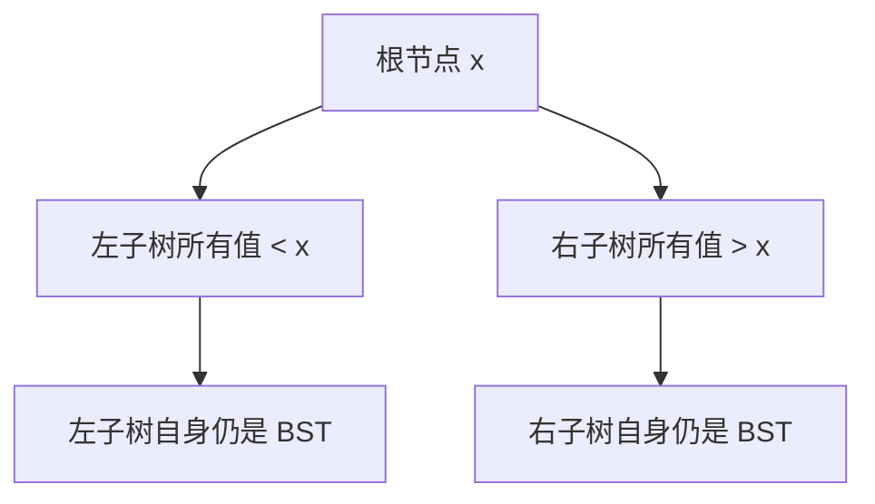
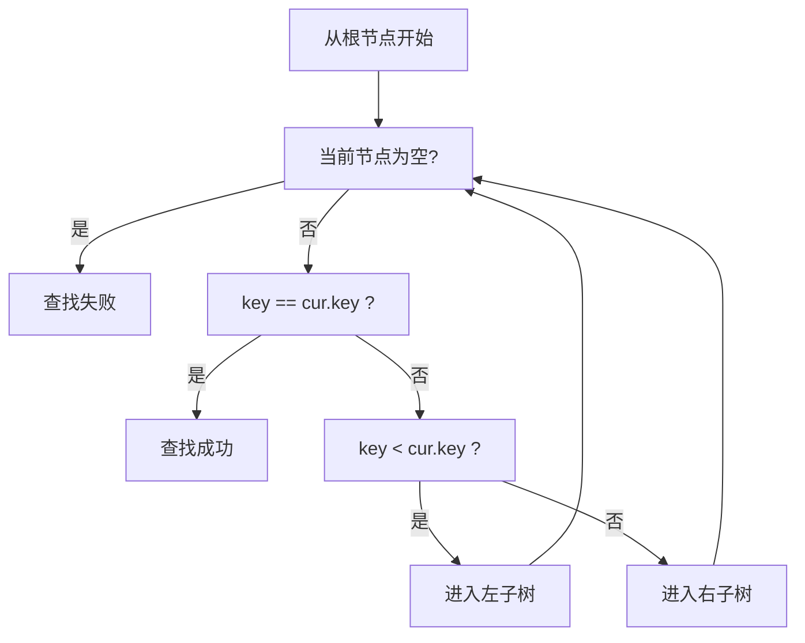
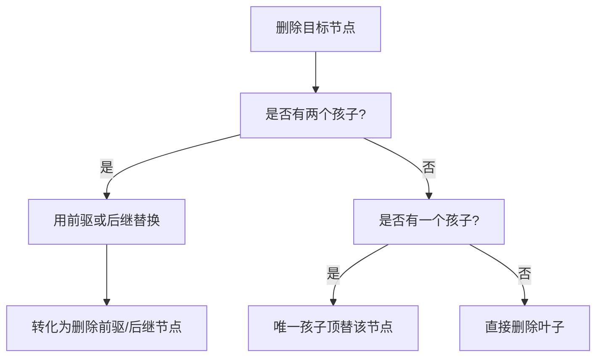

# 第23章\_BST验证与高度边界

删除返回以后，打印出一串数还不等于已经验证所有情况。前章建立了子树回接的过程，本章先比较高度决定的路径成本，再用中序次序检查整棵树的取值约束；最后明确这种检查无法证明哪些事情，为下一章的退化问题留下边界。

## 23.1\_BST\_的优点与局限

删除后排序正确，只能保证比较路径仍有依据。路径究竟多长，还要取决于树形；先把这两个问题分开，再选择检查方法。

### 23.1.1\_为什么\_BST\_查找通常较快

BST 的优势来自其有序性。
对比普通二叉树：

- 普通二叉树查找某值，可能需要遍历整棵树
- BST 每一步可排除左右两侧中的一侧，但被排除的节点数不保证为一半

因此，在树高受控时，BST 查找、插入、删除都能达到较高效率。

下面比较受控高度与任意输入；若谈“平均 O(log n)”，还需要给出概率模型，例如互异键按等概率随机排列顺序插入。不能用未定义的平均情况承诺业务数据的性能。

典型复杂度：

| 操作 | 高度为 O(log n) 时 | 任意输入最坏复杂度 |
| ---- | --------------- | ---------- |
| 查找 | `O(log n)`      | `O(n)`     |
| 插入 | `O(log n)`      | `O(n)`     |
| 删除 | `O(log n)`      | `O(n)`     |

### 23.1.2\_为什么\_BST\_不保证平衡

BST 只规定：

- 左边小
- 右边大

它**没有规定左右子树高度必须接近**，也没有规定树高上界。

所以如果插入序列不合适，比如：

- `1 2 3 4 5 6 7`

那么每次新节点都会落到最右边，最终形成单链结构。

也就是说：

> BST 约束每个节点的整棵左右子树取值，却不单独限制整体高度。

这就是它的根本局限。

### 23.1.3\_为何后续需要平衡树

如果树高失控，最坏路径上的时间优势会消失，有序输出能力仍然存在：

- 查找退化成线性扫描
- 插入前仍要沿长路径寻找空槽，不能当成已有尾指针的 O(1) 追加
- 删除前寻找目标可能线性扫描，找到后局部改边的成本与查找成本应分开

因此后续必须引入“平衡思想”：

- 不是让树绝对对称
- 而是让树高保持在可控范围内

这正是 AVL、红黑树等平衡搜索树出现的动机。

------

## 23.2\_可视化理解\_BST\_的核心关系图

下面三张图分别回顾排序约束、搜索循环和删除分类；用它们检查上一章返回后的连接结果，而不是把局部“左小右大”当成全局证明。

### 23.2.1\_BST\_基本约束图



### 23.2.2\_查找流程图



### 23.2.3\_删除分类图



------

## 23.3\_调试与验证

BST 在代码里最容易错的地方，不是查找，而是：

- 插入时父子挂接错误
- 删除时替换关系错误
- 删除后局部仍像树，但全局不再满足 BST 性质

### 23.3.1\_如何验证\_BST\_性质

最常见方法：**中序遍历检查是否严格递增**。

原因是：

- BST 的中序遍历结果应当是有序序列
- 如果中序结果不是递增，说明树已被破坏

下面是核心片段。每次新检查都要先令 prev = nullptr；如果沿用上一次遍历的末节点，下一次即使树没变也可能误报。这个函数假设输入已是无环、无共享孩子的存活树，不能先递归到非法地址，再指望排序比较保护内存安全。

```cpp
bool inorder_check(bst_node *root, bst_node *&prev)
{
	if (!root)
		return true;

	if (!inorder_check(root->left, prev))
		return false;

	if (prev && prev->key >= root->key)
		return false;

	prev = root;
	return inorder_check(root->right, prev);
}
```

### 23.3.2\_删除操作的常见错误

#### (1)\_忘记处理根节点被删除

删除零或单孩子根时，旧根对象被释放，返回值才是新根；丢弃它会让调用者继续持有悬空根入口。双孩子的键覆盖方案可能仍返回同一地址，但调用方式仍统一写为 root = bst_erase(root, key)。

#### (2)\_双孩子删除后没有继续删除后继节点

只做“值覆盖”而不删除原后继，会导致重复值残留。

#### (3)\_单孩子替换时漏改父指针

如果采用带父指针实现，这类错误非常常见。

### 23.3.3\_建议的手工测试集合

建议你用下面这些数据手工跑插入和删除：

| 测试目标       | 数据                   |
| -------------- | ---------------------- |
| 基本插入       | `8 3 10 1 6 14 4 7 13` |
| 顺序退化       | `1 2 3 4 5 6 7`        |
| 删除叶子       | 删 `7`                 |
| 删除单孩子     | 删 `14`                |
| 删除双孩子     | 删 `8`                 |
| 删除根节点     | 根为 `8` 时删 `8`      |
| 删除不存在元素 | 删 `100`               |

------

## 23.4\_本章小结

现在把不变量与操作次序合起来，看进入平衡树时哪些结论必须继续保持。

### 23.4.1\_红黑树首先是一棵\_BST

这一点必须牢牢记住。

红黑树不是“另外一种完全不同的树”，它首先满足：

- 左子树小于根
- 右子树大于根
- 中序遍历有序

也就是说：

> 红黑树的查找基础，完全继承自 BST。

### 23.4.2\_红黑树的所有旋转都不能破坏\_BST\_有序性

后续你学左旋、右旋、插入修复、删除修复时，会看到很多局部结构变化。
但无论怎么旋转、怎么染色，都必须维持 BST 的中序有序性。

所以你现在学 BST，不是为了停留在 BST，而是为了建立后续所有平衡树操作的**不变量基础**：

- 查找路径基于 BST 比较规则
- 插入位置基于 BST 比较规则
- 删除替换基于 BST 中序邻接关系
- 旋转修复不能破坏 BST 有序性

------

## 23.5\_与下一章的衔接

到这里，你已经具备了进入红黑树前真正需要的第一层能力：

- 会判断一棵树是不是 BST
- 会分析 BST 查找路径
- 会理解 BST 插入为什么成立
- 会区分 BST 删除的三种情形
- 会意识到 BST 的优势和致命局限

下一章将回答一个关键问题：

> **既然 BST 查找很高效，为什么还不够？**

答案是：

> **因为 BST 不控制树高，可能退化。**

## 23.6\_运行全子树边界反例

下面的 9 是 3 的右孩子，局部大小关系成立，却越过祖先 8 留下的上界。先预测每次改键的结果，然后运行独立 C++17 程序。这里的 prev 只是本轮观察状态，每次包装调用重新初始化。

程序用 climits 提供的 INT_MIN 和 INT_MAX，分别表示本编译环境 int 类型的最小值与最大值；它们用来检验比较是否错误地依赖越界加减，不表示所有平台的 int 宽度都相同。

```cpp
#include <cassert>
#include <climits>
#include <iostream>

struct bst_node {
    int key;
    const bst_node *left;
    const bst_node *right;
};

/* prev 记录本次中序遍历中刚访问的节点，不是跨次缓存。 */
static bool inorder_check(const bst_node *root, const bst_node *&prev)
{
    if (!root)
        return true;
    if (!inorder_check(root->left, prev))
        return false;
    if (prev && prev->key >= root->key)
        return false;
    prev = root;
    return inorder_check(root->right, prev);
}

static bool bst_order_valid(const bst_node *root)
{
    const bst_node *prev = nullptr;
    return inorder_check(root, prev);
}

int main()
{
    bst_node nodes[] = {
        {8, nullptr, nullptr}, {3, nullptr, nullptr},
        {10, nullptr, nullptr}, {9, nullptr, nullptr}
    };
    nodes[0].left = &nodes[1];
    nodes[0].right = &nodes[2];
    nodes[1].right = &nodes[3];
    assert(!bst_order_valid(nodes));  // 9 超过祖先 8 的上界
    nodes[3].key = 6;
    assert(bst_order_valid(nodes));
    assert(bst_order_valid(nodes));   // 再次检查，prev 必须重新置空
    nodes[3].key = 8;
    assert(!bst_order_valid(nodes));  // 本例不允许重复键
    assert(bst_order_valid(nullptr));
    bst_node extreme[] = {
        {INT_MIN, nullptr, nullptr}, {INT_MAX, nullptr, nullptr}
    };
    extreme[0].right = &extreme[1];
    assert(bst_order_valid(extreme)); // 不采用 key +/- 1，极值不溢出
    std::cout << "祖先边界、重复键、空树、极值和重复检查通过\n";
}
```

保存为 [bst_order_check.cpp](../../../../labs/kernel/tree_basics/materials/bst_order_check.cpp)，执行：

```bash
g++ -std=c++17 -Wall -Wextra -Werror -pedantic bst_order_check.cpp -o bst_order_check
./bst_order_check
```

输出“祖先边界、重复键、空树、极值和重复检查通过”。保留 assert，不定义关闭断言的 NDEBUG。这个检查直接比较相邻整数，不用 key±1 构造界限，因此 INT_MIN/INT_MAX 都可作为合法键。

如果人为让一个孩子指回祖先，会怎样？程序的树前提已经不成立，可能无限递归，不能把它当成返回 false 的正常排序用例。中序严格递增只在合法有限树上证明排序条件；对象是否存活、是否有环、是否共享以及是否平衡都要另行检查。于是还剩下一个重要问题：排序正确的树也可能很高，接着读[P04 为什么 BST 会退化](P04_为什么_BST_会退化.md)。

上一篇：[删除与子树回接](P22_BST删除与子树回接.md)；返回[专题路线](大纲.md#1.1_沿问题进入现有章节)。
