# 第24章\_组合旋转与形状判断


## 24.1\_章节内容说明

[P05 的左右旋实验](P05_旋转的作用与局部重排.md#5.4.11_用根引用运行一对互逆动作)已经说明中序保持、入口槽和父链。现在尝试按 30、10、20 插入三个键：根 30 的左子树先向左、再向右延伸。只对 30 右旋，会变成根 10、右孩子 30、30 的左孩子 20，高度仍是 2。一次单旋没有把中间键 20 放到局部根。

但如果后面要继续进入：

- AVL 的失衡修复
- 红黑树插入 / 删除修复
- Linux 内核 rbtree 源码理解

那么只会“左旋一次、右旋一次”还不够。
因为真正的修复问题不是“会不会某个旋转动作”，而是：

> **在已经确定需要调整的局部，怎样用两级方向描述形状，再组合单旋？**

这一节要解决的就是这个问题。

本节统一使用一组有语义的节点命名：

- `g`：选定的局部子树根
- `p`：沿选定方向的孩子
- `n`：沿第二个方向的孙子
- `T1 ~ T4`：保持 BST 区间关系的四棵子树

这样做的目的是把：

- Mermaid 图
- 文字描述
- 判定规则
- 代码实现

统一到同一套命名体系里，避免阅读时不断做映射转换。

------

## 24.2\_四类失衡结构总览

在原本合法的 AVL 树中插入一个新叶后，只有插入路径上的祖先可能改变高度。找到首个高度差达到 2 的祖先后，一次局部修复（一次单旋或一组双旋）就能使该子树回到插入前的高度；如何找到它和证明停止条件，留给后面的高度诊断。这里先把两个方向翻译为结构动作。

对选定的两条孩子边，每条只有左、右两种方向，共有四种组合：

- LL
- LR
- RR
- RL

设：

- `p` 是 `g` 的关键孩子
- `n` 是 `p` 的关键孩子

则四类结构的统一判定规则如下：

| 类型 | 判定条件                           | 修复方式                     |
| ---- | ---------------------------------- | ---------------------------- |
| LL   | `p == g->left` 且 `n == p->left`   | 对 `g` 做一次右旋            |
| LR   | `p == g->left` 且 `n == p->right`  | 先对 `p` 左旋，再对 `g` 右旋 |
| RR   | `p == g->right` 且 `n == p->right` | 对 `g` 做一次左旋            |
| RL   | `p == g->right` 且 `n == p->left`  | 先对 `p` 右旋，再对 `g` 左旋 |

LL/LR/RR/RL 分别表示 left-left、left-right、right-right、right-left，即两次向左、先左后右、两次向右、先右后左。这些是本章局部路径的名称，不是自动检测失衡的算法。

**表中的指针关系只识别形状。** 任意正常 BST 都可能包含这种形状，不应见到 LR 就旋转。对于三节点链，原高度为 2、根两侧高度差为 2，按表重排得到根为中间键的高度 1 树。若 T1～T4 非空，能否恢复 AVL 还依赖各子树高度；红黑修复则还要检查颜色与路径约束。下面图示先证明改边的区间正确性。

也就是说，后面真正进入算法时，不应该再靠“看起来像不像 LR”，而应该严格按下面两步判断：

1. `p` 在 `g` 的哪一侧
2. `n` 在 `p` 的哪一侧

于是：

- 左-左，就是 LL
- 左-右，就是 LR
- 右-右，就是 RR
- 右-左，就是 RL

------

## 24.3\_LL\_外侧失衡\_单右旋

LL 的含义是：

```text
p == g->left
n == p->left
```

也就是：

- `p` 在 `g` 的左边
- `n` 在 `p` 的左边

这是典型的“左侧的左侧过重”。

### 24.3.1\_LL\_初始结构

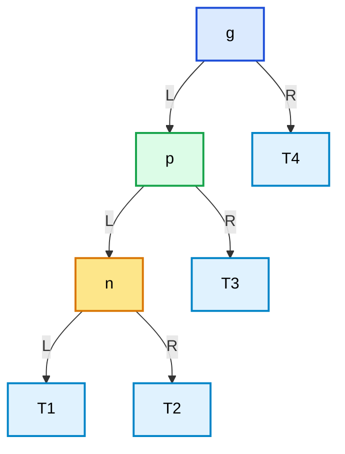

LL 的修复不需要双旋。
因为失衡已经发生在“外侧”，一次标准右旋就足够。

### 24.3.2\_LL\_修复后

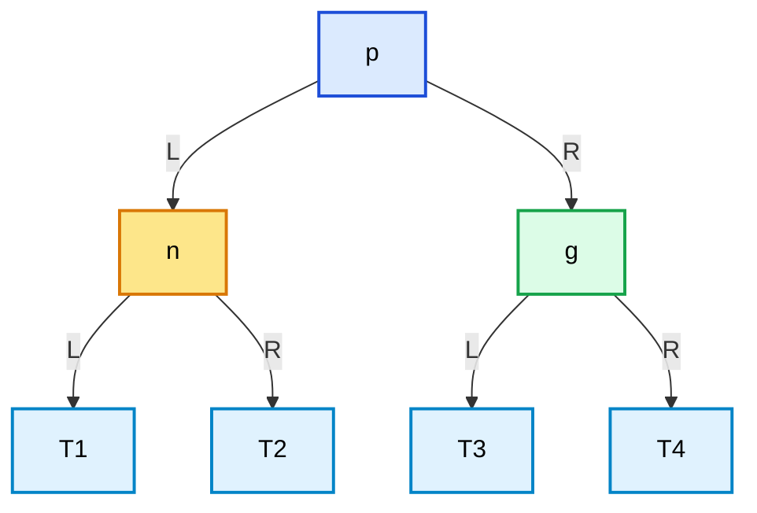

在满足上述 AVL 失衡条件的外侧情形中，LL 的结构动作是：

> **外侧失衡，直接一次右旋。**

------

## 24.4\_RR\_外侧失衡\_单左旋

RR 的含义是：

```text
p == g->right
n == p->right
```

也就是：

- `p` 在 `g` 的右边
- `n` 在 `p` 的右边

这是典型的“右侧的右侧过重”。

### 24.4.1\_RR\_初始结构

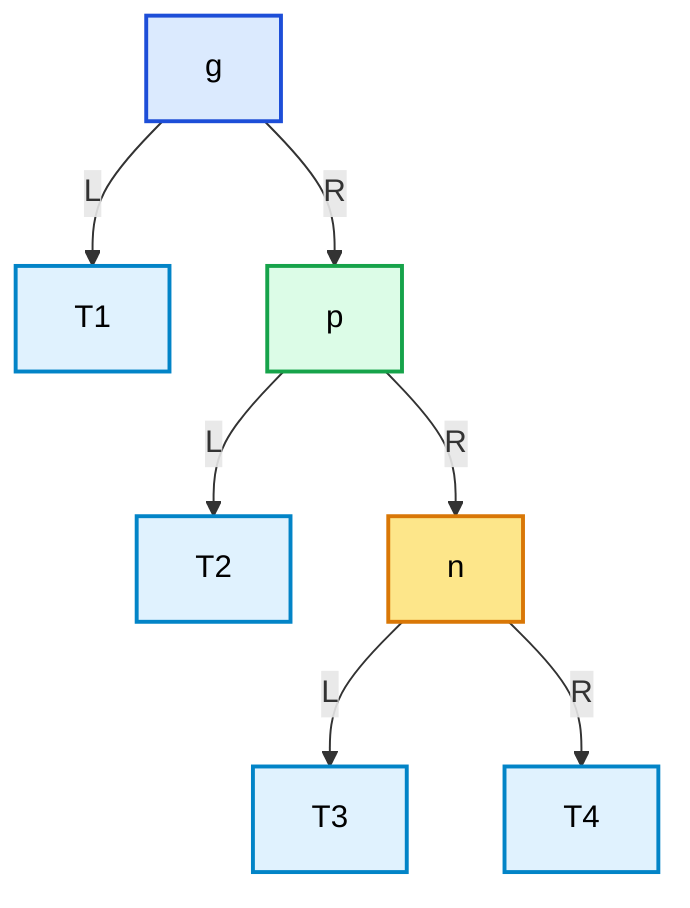

RR 同样不需要双旋。
因为失衡发生在“外侧”，一次标准左旋就足够。

### 24.4.2\_RR\_修复后

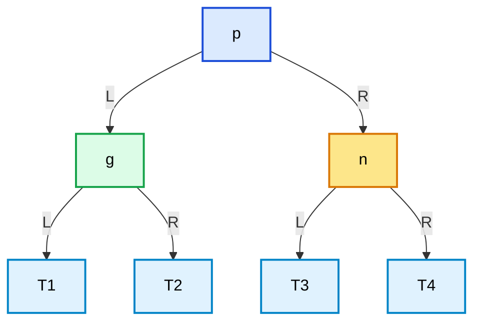

在满足上述 AVL 失衡条件的外侧情形中，RR 的结构动作是：

> **外侧失衡，直接一次左旋。**

------

## 24.5\_LR\_内侧失衡\_先左后右

LR 的含义是：

```text
p == g->left
n == p->right
```

也就是：

- `p` 在 `g` 的左边
- `n` 在 `p` 的右边

这不是外侧失衡，而是**内侧失衡**。

### 24.5.1\_LR\_初始结构

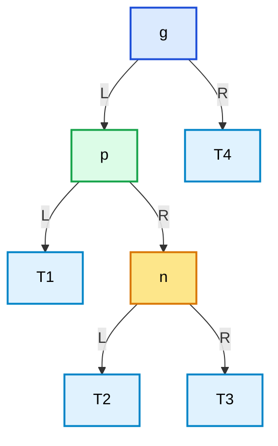

如果直接对 `g` 做一次右旋，虽然树形会变化，但 `n` 的位置仍然不理想。
原因在于：当前问题不是 LL，而是左子树内部先向右偏。

所以 LR 必须分两步做。

### 24.5.2\_第一步\_先对\_p\_左旋

这一步的目标是：

> **先把 LR 结构转换成 LL 结构。**

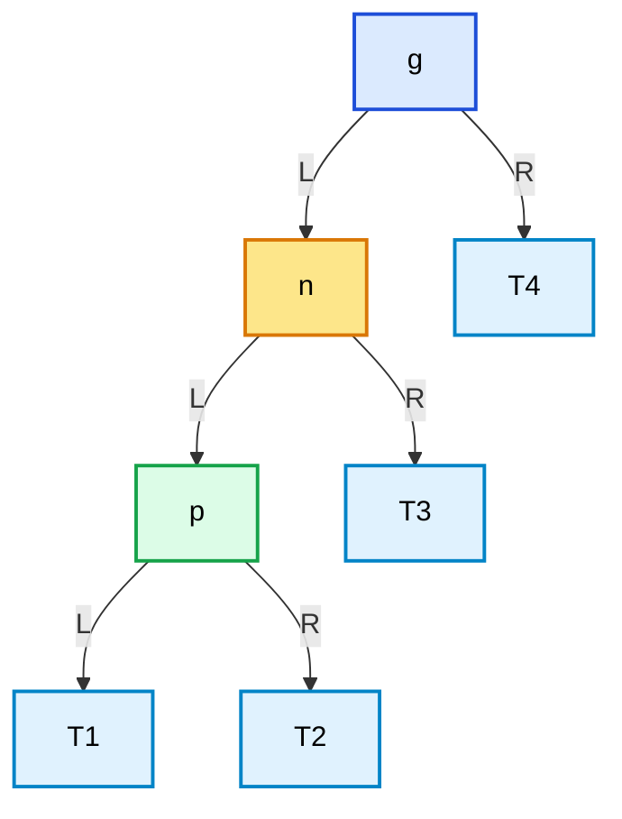

### 24.5.3\_第二步\_再对\_g\_右旋

这一步才是真正完成最终修复。

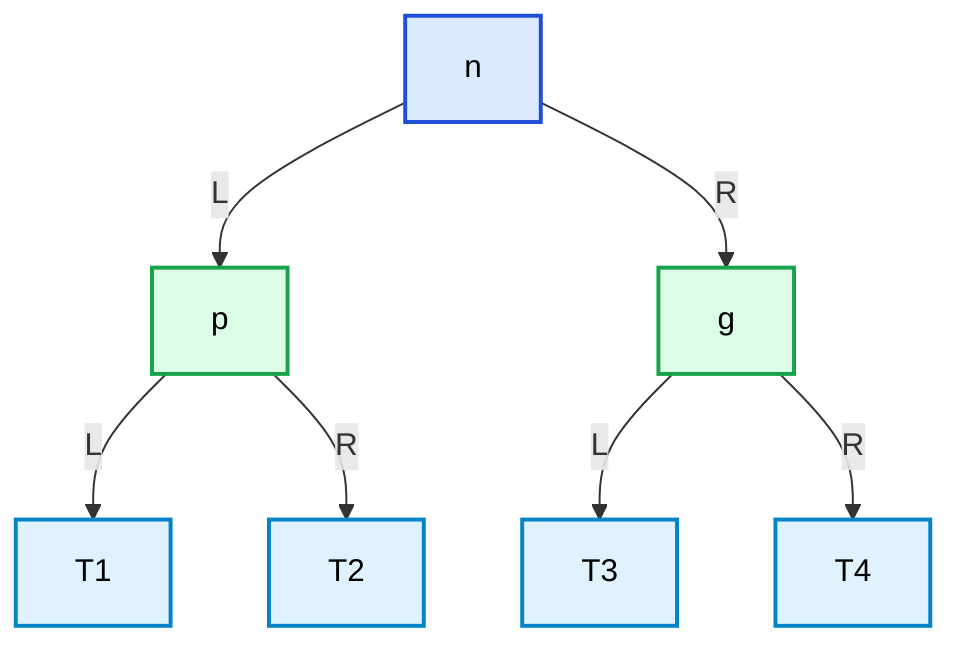

所以 LR 的本质是：

```text
先把 LR 转成 LL
再对 LL 做一次标准右旋
```

### 24.5.4\_直接对\_n\_右旋行不行

不能把它当作 LR 的替代修复。用本章的 30→10→20 反例检查：`n=20` 没有左孩子，右旋前提就不成立，并不会“变成 RL”。即使 n 有左子树，对 n 右旋也只调整 n 内部，不能把中间键 n 提升到 g 与 p 之间。

第一步必须对 p 左旋，才能让 n 接替 p 在 g 左槽的位置；第二步再对 g 右旋，才能让 n 成为整个局部的根。两步之间没有交换键。示意图说“转成 LL”，指中间形状的两级左边；此时参与上下关系的节点位置已经改变，不能继续把旧 p 误当作新的上层孩子。

------

## 24.6\_RL\_内侧失衡\_先右后左

RL 的含义是：

```text
p == g->right
n == p->left
```

也就是：

- `p` 在 `g` 的右边
- `n` 在 `p` 的左边

这同样属于**内侧失衡**。

### 24.6.1\_RL\_初始结构

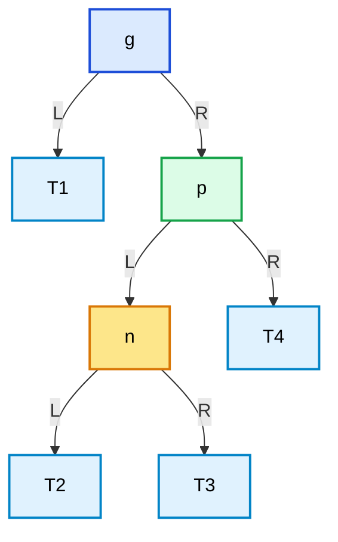

如果直接对 `g` 做一次左旋，也不能把局部重心提到理想位置。
原因和 LR 完全对称：当前问题不是 RR，而是右子树内部先向左偏。

所以 RL 也必须分两步做。

### 24.6.2\_第一步\_先对\_p\_右旋

这一步的目标是：

> **先把 RL 结构转换成 RR 结构。**

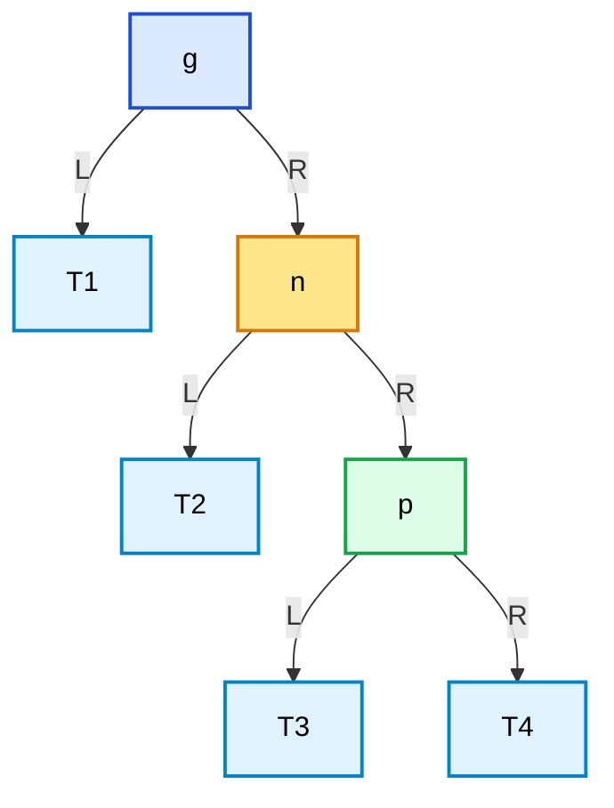

### 24.6.3\_第二步\_再对\_g\_左旋

这一步才是真正完成最终修复。

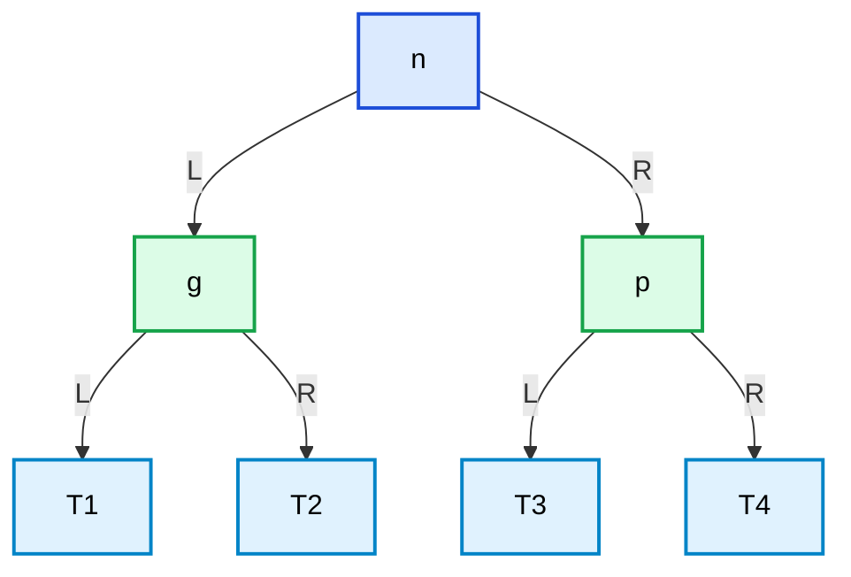

所以 RL 的本质是：

```text
先把 RL 转成 RR
再对 RR 做一次标准左旋
```

------

## 24.7\_四类结构的统一算法判定

到了算法和代码层，不能再只靠“看图像不像”。
真正进入实现时，必须把判定写成明确的指针关系。

设：

- `g`：当前失衡子树根
- `p`：`g` 的关键孩子
- `n`：`p` 的关键孩子

则四类结构统一判定如下：

| 类型 | 判定条件                         | 修复动作                              |
| ---- | -------------------------------- | ------------------------------------- |
| LL   | `p == g->left && n == p->left`   | `right_rotate(g)`                     |
| LR   | `p == g->left && n == p->right`  | `left_rotate(p)` 后 `right_rotate(g)` |
| RR   | `p == g->right && n == p->right` | `left_rotate(g)`                      |
| RL   | `p == g->right && n == p->left`  | `right_rotate(p)` 后 `left_rotate(g)` |

因此，在算法里识别当前到底是 LL、LR、RR 还是 RL，核心只需要两步：

1. `p` 在 `g` 的哪一侧
2. `n` 在 `p` 的哪一侧

------

## 24.8\_为什么四类结构都必须兼容\_当前节点只是子树根

在小图里，失衡点常常被画成整棵树根。
但真实算法里，失衡通常发生在某个**内部子树根**，而不是整棵树根。

下面仍用原来的 50/40/20/30/45/80 场景观察内部回接。图中的 `g(40)` 是人为选定的重排点；先不要把它叫作 AVL 失衡点：

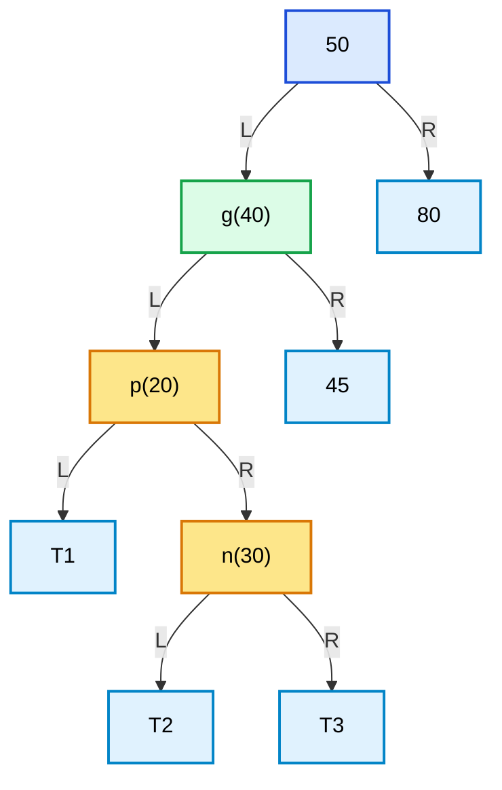

沿 40→20→30 的方向确实是 LR。若 T1～T3 为空、T4 为叶 45，40 的左高度为 1、右高度为 0，差值只有 1；50 的左高度为 2、右高度为 0，差值才是 2。**形状分类不能替代高度诊断。** 后面的完整程序保留这个场景，专门检验对内部节点改边后是否接回原父槽。

结构动作需要支持两种入口：

1. `g` 是整棵树根
2. `g` 只是某个父节点的一棵子树根

如果你的单旋实现已经是成品函数，能够正确处理：

- 根节点更新
- 父节点回接
- 中间子树回接
- `parent` 指针维护

那么 LL / LR / RR / RL 四类修复都不需要再写特殊的“根处理代码”。
它们都只是在调用：

- 一次单旋
- 或两次单旋

而单旋本身会自动把结果接回整棵树。

------

## 24.9\_C\_四类方向识别与完整观察

下面把普通旋转和方向分类接成完整 C 程序。它不读高度或颜色；`bst_identify_rotation_case()` 函数只比较两级孩子指针，枚举 `BST_CASE_*` 表示四种方向，`INVALID` 表示输入不能构成对应路径。`bst_rotate_by_case()` 函数执行指定的结构动作。
这里包含：

- 成品左旋
- 成品右旋
- 四类结构判定
- 四类结构统一调度与四次观察

```c
#include <stdio.h>
#include <stdlib.h>

struct bst_node {
	int key;
	struct bst_node *left;
	struct bst_node *right;
	struct bst_node *parent;
};

enum bst_rotation_case {
	BST_CASE_INVALID = 0,
	BST_CASE_LL,
	BST_CASE_LR,
	BST_CASE_RR,
	BST_CASE_RL,
};

void bst_left_rotate(struct bst_node **root, struct bst_node *x)
{
	struct bst_node *y;

	if (!root || !*root || !x || !x->right)
		return;

	y = x->right;

	x->right = y->left;
	if (y->left)
		y->left->parent = x;

	y->parent = x->parent;

	if (!x->parent) {
		*root = y;
	} else if (x == x->parent->left) {
		x->parent->left = y;
	} else {
		x->parent->right = y;
	}

	y->left = x;
	x->parent = y;
}

void bst_right_rotate(struct bst_node **root, struct bst_node *y)
{
	struct bst_node *x;

	if (!root || !*root || !y || !y->left)
		return;

	x = y->left;

	y->left = x->right;
	if (x->right)
		x->right->parent = y;

	x->parent = y->parent;

	if (!y->parent) {
		*root = x;
	} else if (y == y->parent->left) {
		y->parent->left = x;
	} else {
		y->parent->right = x;
	}

	x->right = y;
	y->parent = x;
}

enum bst_rotation_case
bst_identify_rotation_case(struct bst_node *g,
						   struct bst_node *p,
						   struct bst_node *n)
{
	if (!g || !p || !n)
		return BST_CASE_INVALID;

	if (p == g->left) {
		if (n == p->left)
			return BST_CASE_LL;
		if (n == p->right)
			return BST_CASE_LR;
	}

	if (p == g->right) {
		if (n == p->right)
			return BST_CASE_RR;
		if (n == p->left)
			return BST_CASE_RL;
	}

	return BST_CASE_INVALID;
}

void bst_rotate_by_case(struct bst_node **root,
						   struct bst_node *g,
						   enum bst_rotation_case rot_case)
{
	if (!root || !*root || !g)
		return;

	switch (rot_case) {
	case BST_CASE_LL:
		/* 先核对两级方向，避免双旋只执行后一半。 */
		if (!g->left || !g->left->left)
			return;
		bst_right_rotate(root, g);
		break;
	case BST_CASE_LR:
		/* 先核对两级方向，避免双旋只执行后一半。 */
		if (!g->left || !g->left->right)
			return;
		bst_left_rotate(root, g->left);
		bst_right_rotate(root, g);
		break;
	case BST_CASE_RR:
		/* 先核对两级方向，避免双旋只执行后一半。 */
		if (!g->right || !g->right->right)
			return;
		bst_left_rotate(root, g);
		break;
	case BST_CASE_RL:
		/* 先核对两级方向，避免双旋只执行后一半。 */
		if (!g->right || !g->right->left)
			return;
		bst_right_rotate(root, g->right);
		bst_left_rotate(root, g);
		break;
	default:
		break;
	}
}

int main(void)
{
    /* 四种插入方向各形成三节点链，局部高度由 2 降为 1。 */
    const int orders[4][3] = {{30,20,10}, {30,10,20}, {10,20,30}, {10,30,20}};
    const char *names[4] = {"LL", "LR", "RR", "RL"};
    for (int kind = 0; kind < 4; ++kind) {
        struct bst_node nodes[3] = {0};
        struct bst_node *root = NULL;
        for (int i = 0; i < 3; ++i) {
            struct bst_node **slot = &root, *parent = NULL;
            nodes[i].key = orders[kind][i];
            while (*slot) {
                parent = *slot;
                slot = nodes[i].key < parent->key ? &parent->left : &parent->right;
            }
            nodes[i].parent = parent;
            *slot = &nodes[i];
        }
        enum bst_rotation_case rot_case = bst_identify_rotation_case(root, &nodes[1], &nodes[2]);
        bst_rotate_by_case(&root, root, rot_case);
        printf("%s root=%d inorder=%d,%d,%d\n", names[kind], root->key,
               root->left->key, root->key, root->right->key);
    }
    return 0;
}
```

保存为 [rotation_cases.c](../../../../labs/kernel/tree_basics/materials/rotation_cases.c)，在材料目录编译运行：

```bash
cc -std=c11 -Wall -Wextra -Werror -pedantic rotation_cases.c -o rotation_cases_c
./rotation_cases_c
```

四行分别以 LL、LR、RR、RL 开头，后面均为 `root=20 inorder=10,20,30`。每轮节点属于 main 的自动数组，根和孩子边只借用地址，没有分配、释放或共享修改。先预测三节点关系，再检查根和两叶；这些输出不是完整 AVL 的验收。

调度函数先检查所选的两级方向所需孩子都存在，防止内侧孩子缺失时第一步无操作、第二步却擅自改树。这只是有限的输入防护，不能检验成员关系、悬空指针或失衡条件；仍需要 P05 的独占和有效树前提。

这段代码的职责是：

1. `bst_identify_rotation_case()` 解决了“**怎么在算法里识别四类结构**”
2. `bst_rotate_by_case()` 把形状分类和结构改边连接起来，不负责决定是否需要平衡修复
3. `BST_CASE_LR` 和 `BST_CASE_RL` 直接体现出：
   - 第一步在子树根上旋
   - 第二步在当前局部根上旋

------

## 24.10\_C++\_四类方向识别与完整观察

下面是相同输入、相同指针动作的完整 C++ 版本。枚举作用域改用 `bst_rotation_case::`，根入口用引用，其余结构契约相同。保存为 [rotation_cases.cpp](../../../../labs/kernel/tree_basics/materials/rotation_cases.cpp)，用 `c++ -std=c++17 -Wall -Wextra -Werror -pedantic rotation_cases.cpp -o rotation_cases_cpp` 编译后执行 `./rotation_cases_cpp`；输出应与 C 版四行一致。

```cpp
#include <iostream>

struct bst_node {
	int key;
	bst_node *left;
	bst_node *right;
	bst_node *parent;
};

enum class bst_rotation_case {
	invalid = 0,
	ll,
	lr,
	rr,
	rl,
};

void bst_left_rotate(bst_node *&root, bst_node *x)
{
	bst_node *y;

	if (!root || !x || !x->right)
		return;

	y = x->right;

	x->right = y->left;
	if (y->left)
		y->left->parent = x;

	y->parent = x->parent;

	if (!x->parent) {
		root = y;
	} else if (x == x->parent->left) {
		x->parent->left = y;
	} else {
		x->parent->right = y;
	}

	y->left = x;
	x->parent = y;
}

void bst_right_rotate(bst_node *&root, bst_node *y)
{
	bst_node *x;

	if (!root || !y || !y->left)
		return;

	x = y->left;

	y->left = x->right;
	if (x->right)
		x->right->parent = y;

	x->parent = y->parent;

	if (!y->parent) {
		root = x;
	} else if (y == y->parent->left) {
		y->parent->left = x;
	} else {
		y->parent->right = x;
	}

	x->right = y;
	y->parent = x;
}

bst_rotation_case
bst_identify_rotation_case(bst_node *g, bst_node *p, bst_node *n)
{
	if (!g || !p || !n)
		return bst_rotation_case::invalid;

	if (p == g->left) {
		if (n == p->left)
			return bst_rotation_case::ll;
		if (n == p->right)
			return bst_rotation_case::lr;
	}

	if (p == g->right) {
		if (n == p->right)
			return bst_rotation_case::rr;
		if (n == p->left)
			return bst_rotation_case::rl;
	}

	return bst_rotation_case::invalid;
}

void bst_rotate_by_case(bst_node *&root,
						   bst_node *g,
						   bst_rotation_case rot_case)
{
	if (!root || !g)
		return;

	switch (rot_case) {
	case bst_rotation_case::ll:
		/* 先核对两级方向，避免双旋只执行后一半。 */
		if (!g->left || !g->left->left)
			return;
		bst_right_rotate(root, g);
		break;
	case bst_rotation_case::lr:
		/* 先核对两级方向，避免双旋只执行后一半。 */
		if (!g->left || !g->left->right)
			return;
		bst_left_rotate(root, g->left);
		bst_right_rotate(root, g);
		break;
	case bst_rotation_case::rr:
		/* 先核对两级方向，避免双旋只执行后一半。 */
		if (!g->right || !g->right->right)
			return;
		bst_left_rotate(root, g);
		break;
	case bst_rotation_case::rl:
		/* 先核对两级方向，避免双旋只执行后一半。 */
		if (!g->right || !g->right->left)
			return;
		bst_right_rotate(root, g->right);
		bst_left_rotate(root, g);
		break;
	default:
		break;
	}
}

int main(void)
{
    /* 四种插入方向各形成三节点链，局部高度由 2 降为 1。 */
    const int orders[4][3] = {{30,20,10}, {30,10,20}, {10,20,30}, {10,30,20}};
    const char *names[4] = {"LL", "LR", "RR", "RL"};
    for (int kind = 0; kind < 4; ++kind) {
        bst_node nodes[3]{};
        bst_node *root = NULL;
        for (int i = 0; i < 3; ++i) {
            bst_node **slot = &root, *parent = NULL;
            nodes[i].key = orders[kind][i];
            while (*slot) {
                parent = *slot;
                slot = nodes[i].key < parent->key ? &parent->left : &parent->right;
            }
            nodes[i].parent = parent;
            *slot = &nodes[i];
        }
        bst_rotation_case rot_case = bst_identify_rotation_case(root, &nodes[1], &nodes[2]);
        bst_rotate_by_case(root, root, rot_case);
        std::cout << names[kind] << " root=" << root->key << " inorder="
                  << root->left->key << ',' << root->key << ','
                  << root->right->key << '\n';
    }
    return 0;
}
```

------

## 24.11\_内部子树上的\_LR\_重排反例

保留上一节的内部结构，用完整程序检查新局部根怎样写回 `50.left`。这里对 40 的操作是 **LR 结构演示**；40 本身未违反 AVL 高度差，因此不能称作根据 AVL 诊断执行的修复。

```c
#include <stdio.h>
#include <stdlib.h>

struct bst_node {
	int key;
	struct bst_node *left;
	struct bst_node *right;
	struct bst_node *parent;
};

enum bst_rotation_case {
	BST_CASE_INVALID = 0,
	BST_CASE_LL,
	BST_CASE_LR,
	BST_CASE_RR,
	BST_CASE_RL,
};

void bst_left_rotate(struct bst_node **root, struct bst_node *x)
{
	struct bst_node *y;

	if (!root || !*root || !x || !x->right)
		return;

	y = x->right;

	x->right = y->left;
	if (y->left)
		y->left->parent = x;

	y->parent = x->parent;

	if (!x->parent) {
		*root = y;
	} else if (x == x->parent->left) {
		x->parent->left = y;
	} else {
		x->parent->right = y;
	}

	y->left = x;
	x->parent = y;
}

void bst_right_rotate(struct bst_node **root, struct bst_node *y)
{
	struct bst_node *x;

	if (!root || !*root || !y || !y->left)
		return;

	x = y->left;

	y->left = x->right;
	if (x->right)
		x->right->parent = y;

	x->parent = y->parent;

	if (!y->parent) {
		*root = x;
	} else if (y == y->parent->left) {
		y->parent->left = x;
	} else {
		y->parent->right = x;
	}

	x->right = y;
	y->parent = x;
}

enum bst_rotation_case
bst_identify_rotation_case(struct bst_node *g,
						   struct bst_node *p,
						   struct bst_node *n)
{
	if (!g || !p || !n)
		return BST_CASE_INVALID;

	if (p == g->left) {
		if (n == p->left)
			return BST_CASE_LL;
		if (n == p->right)
			return BST_CASE_LR;
	}

	if (p == g->right) {
		if (n == p->right)
			return BST_CASE_RR;
		if (n == p->left)
			return BST_CASE_RL;
	}

	return BST_CASE_INVALID;
}

void bst_rotate_by_case(struct bst_node **root,
						   struct bst_node *g,
						   enum bst_rotation_case rot_case)
{
	if (!root || !*root || !g)
		return;

	switch (rot_case) {
	case BST_CASE_LL:
		/* 先核对两级方向，避免双旋只执行后一半。 */
		if (!g->left || !g->left->left)
			return;
		bst_right_rotate(root, g);
		break;
	case BST_CASE_LR:
		/* 先核对两级方向，避免双旋只执行后一半。 */
		if (!g->left || !g->left->right)
			return;
		bst_left_rotate(root, g->left);
		bst_right_rotate(root, g);
		break;
	case BST_CASE_RR:
		/* 先核对两级方向，避免双旋只执行后一半。 */
		if (!g->right || !g->right->right)
			return;
		bst_left_rotate(root, g);
		break;
	case BST_CASE_RL:
		/* 先核对两级方向，避免双旋只执行后一半。 */
		if (!g->right || !g->right->left)
			return;
		bst_right_rotate(root, g->right);
		bst_left_rotate(root, g);
		break;
	default:
		break;
	}
}

void inorder_print(const struct bst_node *root)
{
	if (!root)
		return;

	inorder_print(root->left);
	printf("%d ", root->key);
	inorder_print(root->right);
}

int main(void)
{
	/*
	 *            50
	 *           /  \
	 *         40    80
	 *        / \
	 *      20   45
	 *        \
	 *         30
	 *
	 * 当前选择的局部子树根：
	 * g = 40
	 * p = 20
	 * n = 30
	 *
	 * 这是一个内部子树上的 LR。
	 */
	struct bst_node n30 = { 30, NULL, NULL, NULL };
	struct bst_node n20 = { 20, NULL, &n30, NULL };
	struct bst_node n45 = { 45, NULL, NULL, NULL };
	struct bst_node n40 = { 40, &n20, &n45, NULL };
	struct bst_node n80 = { 80, NULL, NULL, NULL };
	struct bst_node n50 = { 50, &n40, &n80, NULL };

	struct bst_node *root = &n50;
	enum bst_rotation_case rot_case;

	n30.parent = &n20;
	n20.parent = &n40;
	n45.parent = &n40;
	n40.parent = &n50;
	n80.parent = &n50;

	printf("重排前中序: ");
	inorder_print(root);
	printf("\n");

	rot_case = bst_identify_rotation_case(&n40, &n20, &n30);
	printf("识别结果: %s\n",
		   rot_case == BST_CASE_LR ? "LR" : "INVALID");

	bst_rotate_by_case(&root, &n40, rot_case);

	printf("重排后中序: ");
	inorder_print(root);
	printf("\n");

	printf("整棵树根: %d\n", root->key);
	printf("左子树根: %d\n", root->left->key);

	return 0;
}
```

材料为 [rotation_internal_lr.c](../../../../labs/kernel/tree_basics/materials/rotation_internal_lr.c)。在材料目录用 `cc -std=c11 -Wall -Wextra -Werror -pedantic rotation_internal_lr.c -o rotation_internal_lr` 编译，再执行 `./rotation_internal_lr`。

重排前后中序均为 `20 30 40 45 50 80`，形状输出 LR，整树根为 50，左子树根为 30。请再算高度：新 30 的左边是叶 20，右边是 40→45，高度仍是 2，50 的高度差仍是 2。该调用通过了结构测试，却没有修复整树 AVL 平衡，正好验证本章的边界。

这个例子要观察的重点是：

- 整棵树根仍然是 `50`
- 但 `50->left` 会从 `40` 变成新的局部根
- 说明重排作用在 **内部子树根** 上，并接回原入口；它没有证明整树已平衡

这才是复杂场景下算法真正要解决的问题。

------

## 24.12\_本节小结

这一节最终要记住的，不是“LR / RL / LL / RR 的名字”，而是下面五件事：

1. **怎么识别**
   通过 `g / p / n` 三层节点关系，判定当前是 LL、LR、RR 还是 RL。
2. **为什么有的只需单旋，有的必须双旋**
   外侧失衡用单旋，内侧失衡用双旋。
3. **双旋怎么理解**
   LR 和 RL 不是新魔法，而是两个单旋的有序组合。
4. **复杂树中为什么仍然成立**
   因为成品单旋已经能处理：
   - 当前节点是整棵树根
   - 当前节点是内部子树根
   - 父节点回接
   - 根节点更新
   - 中间子树回接
5. **最核心的代码骨架是什么**

```text
LL = 对 g 右旋
RR = 对 g 左旋
LR = 先对 g.left 左旋，再对 g 右旋
RL = 先对 g.right 右旋，再对 g 左旋
```

因此，四类结构最值得建立的能力不是“看图会背”，而是：

> **在算法里识别当前到底是 LL / LR / RR / RL，并把它翻译成对应的单旋或双旋调用。**

继续 [P25 的高度诊断](P25_AVL高度诊断与更新传播.md#25.1_章节内容说明)，回答怎样从真实变化点选择 g/p/n。红黑树使用不同诊断信号，随后由 2-3-4 树和红黑性质章节逐步建立。

------

## 24.13\_先检查条件再选择动作

1. 三节点 LR 链 30→10→20，如果只对 30 右旋，新根、键序和高度分别是什么？为什么还需要第一步对 10 左旋？
2. 把内部示例的 45 移除，其余连接不变。40 是否失衡？这时对 40 的 LR 会怎样改变其高度？
3. 分类函数收到真实相邻的 g、p，但 n 来自另一棵树，能否凭键大小认定 LR？调度器的孩子非空检查又能否检测悬空 n？
4. 为什么双旋必须在完成第一步后，仍用原 g 对第二步进行定位，而不是把整树 root 直接传作旋转点？

核对：第一题得到根 10、右边 30 的左孩子 20，高度仍为 2；第一步把中间键 20 提到 30 的左边。第二题 40 左高度 1、右为空高度 -1，差为 2，LR 后局部高度从 2 降到 1，这才是相同方向下满足 AVL 条件的例子。第三题分类依赖地址关系而非相同键；前置的存活和成员关系不能由空指针检查证明。第四题第一步只调整 p 子树，原 g 的地址仍是第二步旧局部根；用整树 root 会在内部案例误旋 50。

本章建立了方向组合、改边次序和入口回接，没有把“看到一个名字”变成算法决定。接下来要让实际高度或颜色证据决定是否调用它。
