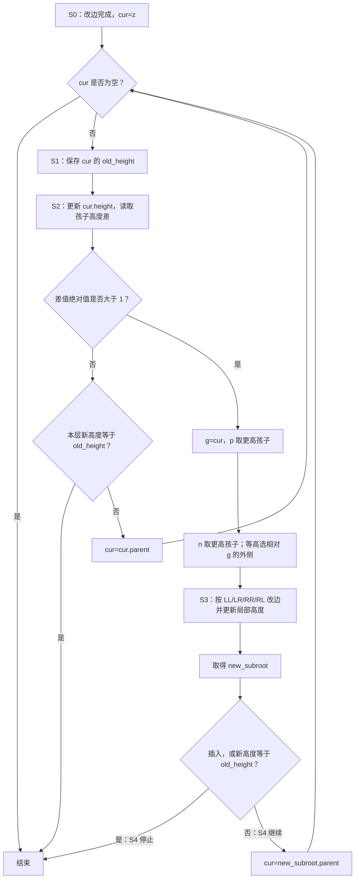
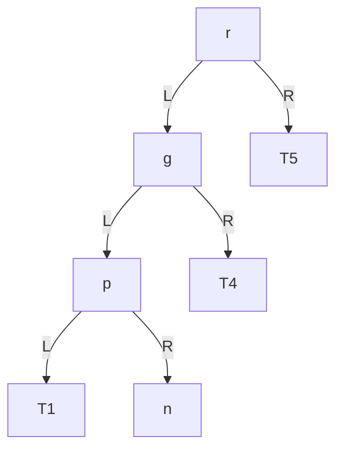

# 第25章\_AVL高度诊断与更新传播


## 25.1\_章节内容说明

[P24 的内部 LR 反例](P24_组合旋转与形状判断.md#24.11_内部子树上的_LR_重排反例)中，40→20→30 的方向符合 LR，却不代表 40 已经失衡；改边也没有解决 50 的高度差。我们已经会单旋和双旋，现在要让真实状态决定何时调用它们。

如果只停留在这里，你会得到一种“会用药，但不会看病”的状态。
也就是说：

- 你知道左旋、右旋、双旋分别怎么做
- 但你还不知道在一棵真实的 AVL 树里，**什么时候该用哪一种**

所以，从这一节开始，视角要从“旋转是什么”转向：

> **在 AVL 树中，如何诊断当前到底发生了哪一类失衡。**

这里专门选择 AVL 的规则：每个节点左右高度差最多为 1。其他平衡搜索树未必用相同的诊断或停止条件。
虽然最终会进入红黑树，但现在不需要一下子跳过去，因为红黑树的“诊断信号”不是高度差，而是：

- 颜色关系
- 黑高
- 父、叔、兄弟、侄子节点的局部关系

所以当前这一节的目标非常明确：

> **先把“AVL 树里的诊断流程”建立起来，让旋转动作和失衡类型真正接上。**

------

## 25.2\_为什么学完旋转之后\_必须继续学诊断

前面学左旋、右旋和双旋，本质上是在学习：

> **一旦知道病因，应该如何修复。**

例如：

- LL：右旋
- RR：左旋
- LR：先左后右
- RL：先右后左

但这只是“治疗表”。

真正写通用算法时，问题不会直接写成：

```text
现在是 LR，请执行先左后右
```

真实输入只会告诉你：

- 某个节点刚刚插入了
- 某个节点刚刚删除了
- 某条路径的高度变了
- 某个祖先开始失衡了

所以，通用算法真正面对的问题是：

```text
我现在手上只有“变化发生了”这个事实，
怎么一步一步诊断出当前属于 LL / LR / RR / RL？
```

这就是本节的意义。

------

## 25.3\_本节统一使用的诊断命名

为了让图、算法、代码保持一致，这一节统一使用下面这组名字：

- `z`：第一个高度可能改变的仍然存活的祖先
  插入时取新叶的父节点；采用后继键覆盖的删除时，取物理移除节点的父节点。新叶先初始化为高度 0，不需要把它当成待修复祖先。
- `g`：第一个失衡的祖先节点
  也就是当前真正需要修复的局部子树根
- `p`：`g` 的更高孩子
  也就是导致 `g` 失衡的那一侧
- `n`：`p` 的更高孩子；删除时两孩子等高，就选择相对 g 的外侧孩子
  它决定单旋或双旋，不能把两个等高孩子当成任意选择。

这四个名字里，真正决定失衡类型的是：

```text
g, p, n
```

其中：

- `g` 决定“当前修谁”
- `p` 决定“失衡偏向左边还是右边”
- `n` 决定“失衡落在外侧还是内侧”

------

本章采用单线程独占更新。每个节点的 `height` 是该子树高度的缓存，孩子指针决定实际形状，`parent` 让写者沿祖先路径返回；两类状态必须同步，不能把旧缓存当作新形状的事实。

空树高度为 -1，叶高度为 0。读取孩子缓存是 O(1)，更新当前节点只计算 `1 + max(left_height, right_height)`。若每次递归重算整棵子树，即使诊断路径为对数长度，也会反复访问大量后代，失去这里的维护成本保证。

```c
struct avl_node {
    int key;
    int height;
    struct avl_node *left, *right, *parent;
};

static int avl_height(const struct avl_node *node)
{
    return node ? node->height : -1;
}

static void avl_update_height(struct avl_node *node)
{
    int left = avl_height(node->left);
    int right = avl_height(node->right);
    node->height = 1 + (left > right ? left : right);
}
```

这些是下文完整程序的阅读片段，不要把所有片段与完整程序重复拼接。算法前提是操作前已经是合法 AVL，且本次只增加或移除一个节点；因此首个失衡点的高度差只会到 ±2。它不是修复任意坏树的通用工具。

## 25.4\_诊断的第一步\_从变化点\_z\_向上找第一个失衡祖先\_g

在 AVL 树里，失衡不会无缘无故出现在完全无关的分支里。
它一定出现在：

> **从本次变化点 `z` 向根回溯的这条路径上。**

所以只沿这条父链推进。下面先展示“寻找首个失衡点”的局部过程，后文再接上修复和停止；没有找到时，`cur == NULL` 表示已经到达根之外。

一次操作用同一组阶段描述。结构和缓存是两组有关联的状态，由本线程依次推进，没有后台线程替我们更新高度：

| 阶段 | 写者及状态落点 | 后续读取与退出条件 |
| --- | --- | --- |
| S0 | 插入/删除函数改根槽或父孩子槽，并修 child.parent；新叶 height=0 | z 指向第一处可能变化的存活祖先，未访问的祖先仍保存旧高度 |
| S1 | 回溯函数把 cur.height 读入局部 old_height | 两孩子的缓存已与各自结构一致，才能计算本层 |
| S2 | 写 cur.height，再读两孩子 height 得到高度差 | 平衡则转 S4；差为 ±2 才进入 S3 |
| S3 | 旋转函数改入口、孩子和 parent；先写下沉节点 height，再写上移节点 height | 返回 new_subroot，全部局部状态一致 |
| S4 | 比较本次局部新高度与 old_height | 相同则结束；不同则 cur 取新局部根的 parent，回到 S1；到空父也结束 |

这个顺序保证每层都读取已经修正的孩子。它解释为什么只需要保存本层旧高度，而不能一开始把整条路径的缓存覆盖成新值。

寻找首个失衡点的骨架为：

```text
cur = z
while (cur != NULL) {
	更新 cur 的高度
	检查 cur 是否失衡
	如果失衡:
		cur 就是 g
		停止
	cur = cur->parent
}
```

这里最关键的结论是：

> **`g` 不是事先知道的，它是沿着 `z -> root` 这条路径向上诊断出来的第一个失衡节点。**

这一步非常重要，因为后面的旋转不是围绕 `z` 做，也不是围绕整棵树根做，而是围绕：

```text
第一个失衡祖先 g
```

做。

------

## 25.5\_诊断的第二步\_如何判定一个节点是否失衡

在当前阶段，我们讨论的是 AVL 树，诊断信号就是：

> **左右子树高度差。**

定义平衡因子：

```text
balance_factor(x) = height(x->left) - height(x->right)
```

于是：

- 当 `balance_factor(x)` 为 `-1`、`0`、`1` 时，节点 `x` 仍然平衡
- 当 `abs(balance_factor(x)) > 1` 时，节点 `x` 失衡

所以，沿着 `z` 向上回溯时，第一件事就是反复做：

```text
更新当前节点高度
计算平衡因子
检查是否 abs(balance_factor) > 1
```

一旦第一次发现这个条件成立，那个节点就是 `g`。

------

## 25.6\_诊断的第三步\_由\_g\_找到\_p

一旦确定了 `g`，接下来就不能再笼统地说“它失衡了”，而必须进一步问：

> **它到底是左边高，还是右边高？**

这一步就是找 `p`。

定义：

```text
p = g 的更高孩子
```

也就是：

- 如果 `g->left` 更高，则 `p = g->left`
- 如果 `g->right` 更高，则 `p = g->right`

因此，`p` 的作用是回答：

```text
当前失衡的主方向在哪一侧？
```

这一步决定了我们后面是在讨论：

- 左侧失衡（LL / LR）
- 还是右侧失衡（RR / RL）

------

## 25.7\_诊断的第四步\_由\_p\_找到\_n

找到 `p` 之后，还不能立即决定是单旋还是双旋。
因为接下来还要继续判断：

> **在 `p` 这一层里，重心究竟落在外侧，还是内侧？**

这一步就是找 `n`。

定义：

```text
n = p 的更高孩子
```

也就是：

- 如果 `p->left` 更高，则 `n = p->left`
- 如果 `p->right` 更高，则 `n = p->right`
- 删除时两侧等高，取相对 g 的外侧：p 在左就取 p.left，p 在右就取 p.right

等高分支为何选择单旋，将在删除案例中用实际高度解释。在这些条件建立后，这一步决定最终动作类型。

也就是说：

- `p` 只告诉你是“左偏”还是“右偏”
- `n` 才告诉你是“外侧”还是“内侧”

------

## 25.8\_由\_g\_/\_p\_/\_n\_统一判定四类失衡

当 `g / p / n` 都确定之后，四类失衡就全部明朗了：

| 类型 | 判定条件                           | 修复方式                     |
| ---- | ---------------------------------- | ---------------------------- |
| LL   | `p == g->left` 且 `n == p->left`   | 对 `g` 做一次右旋            |
| LR   | `p == g->left` 且 `n == p->right`  | 先对 `p` 左旋，再对 `g` 右旋 |
| RR   | `p == g->right` 且 `n == p->right` | 对 `g` 做一次左旋            |
| RL   | `p == g->right` 且 `n == p->left`  | 先对 `p` 右旋，再对 `g` 左旋 |

所以，四类失衡的识别，本质上只是在做下面两步判断：

```text
先看 p 在 g 的哪一侧
再看 n 在 p 的哪一侧
```

于是：

- 左-左，就是 LL
- 左-右，就是 LR
- 右-右，就是 RR
- 右-左，就是 RL

这就是本节最核心的诊断结论。

------

## 25.9\_诊断流程图

为了把“变化发生”到“选定旋转”的流程串起来，可以先看下面这张图：



这张图的意义在于：

- 前半部分是“诊断”
- 后半部分是“治疗”

你前面学到的左旋 / 右旋 / 双旋，终于在这里接进了通用流程。

------

## 25.10\_为什么这套诊断天然兼容\_整棵树根\_和\_内部子树根

这里还必须补一个非常关键的点。
很多教材的小图都默认 `g` 是整棵树根，但真实情况往往不是。

真实算法里，`g` 也可能是：

> **内部某棵子树的根。**

例如：



这里：

- 整棵树根是 `r`
- 失衡子树根是 `g`

而我们的诊断流程为什么仍然成立？

因为：

1. `g` 是从 `z` 一路向上诊断出来的，不是事先假定它是整棵树根
2. 旋转函数本身已经是成品实现，天然支持：
   - `g` 是整棵树根时更新调用者保存的 `root`
   - `g` 是内部子树根时把新子树根接回原父节点

所以：

- 诊断流程不需要区分“整棵树根版本”和“内部子树版本”
- 它只负责诊断出 `g / p / n`
- 后续修复则由成品单旋 / 双旋自动完成接回

这就是通用框架真正稳定的原因。

------

## 25.11\_当前阶段与红黑树的边界

这一节虽然是为后面讲红黑树打基础，但当前的视角仍然停留在**AVL 树**。
因此，本节的诊断信号是：

```text
高度差 / 平衡因子
```

而不是红黑树中的：

- 红红冲突
- 黑高不一致
- 叔叔节点颜色
- 兄弟与侄子关系

也就是说，这一节要先把下面这件事彻底讲明白：

> **在 AVL 树里，如何从“结构变化”一路诊断到“该做哪一种旋转”。**

等这个过程建立稳了，后面再进入红黑树时，你就会发现：

- 红黑树的诊断信号变了
- 但修复动作底层仍然是旋转

这时跨度才是自然的。

------

## 25.12\_本节小结

到这里，旋转已经不再是孤立动作，而被放进了完整的诊断流程里。

你现在应该把前面各节内容连成下面这条主线：

```text
1. 树发生一次结构变化，变化起点记为 z
2. 从 z 向上回溯
3. 找到第一个失衡祖先 g
4. 取 g 的更高孩子 p
5. 取 p 的更高孩子 n
6. 由 g / p / n 判定 LL / LR / RR / RL
7. 调用对应的单旋或双旋
8. 由成品旋转函数自动处理根更新、父节点回接和中间子树回接
```

所以，本节真正解决的问题是：

> **如何诊断。**

而前面几节真正解决的问题是：

> **如何修复。**

两者合在一起，才构成 AVL 树里的完整旋转框架。

如果用一句最简练的话来概括本节，那就是：

> **前面学的是“手术动作”，这一节学的是“术前诊断”。**

---

## 25.13\_把诊断接到高度维护

前面几节已经分别讲清楚了：

- 左旋
- 右旋
- 四类失衡结构 `LL / LR / RR / RL`
- 失衡诊断中 `g / p / n` 的含义

如果这些内容只是分散记忆，仍然不足以直接写代码。
真正能落到实现里的，是下面这条完整链路：

```text
结构变化发生
-> 确定诊断起点
-> 向上更新高度
-> 找到第一个失衡祖先 g
-> 确定 p 和 n
-> 判定 LL / LR / RR / RL
-> 调用单旋或双旋
-> 决定是否继续向上
```

这一节的目标不是再重复概念，而是把本章内容收束成**可以直接转写成代码**的实现框架。

------

## 25.14\_先明确旋转函数的接口契约

本章在 P05 的普通结构旋转之上选择一套 **AVL 专用接口**：返回新局部根并维护高度。P05 的 void 函数负责结构回接，不会因此自动获得这些新职责；其他容器也可以采用不同接口。这里约定：

1. **同时提供整树根变量的地址，以及当前局部子树根**
   - 这个节点记为 `g`
   - `g` 可能就是整棵树根
   - `g` 也可能只是某个父节点的一棵子树根
2. **旋转函数必须自己处理两种情况**
   - 如果 `g` 是整棵树根，就更新调用者保存的 `root`
   - 如果 `g` 是内部子树根，就把新子树根重新接回 `g->parent`
3. **旋转函数必须返回旋转后的新局部根**
   - 左旋后返回上移节点
   - 右旋后返回上移节点
4. **本章 AVL 旋转同时维护**
   - 父节点连接
   - 中间子树回接
   - `parent` 指针
   - 旋转后相关节点高度

因此，旋转函数的最小接口应当类似于：

```c
struct avl_node *avl_left_rotate(struct avl_node **root,
								 struct avl_node *g);

struct avl_node *avl_right_rotate(struct avl_node **root,
								  struct avl_node *g);
```

这里返回值的语义必须明确：

```text
返回值 = 旋转后这棵局部子树的新根
```

这一点非常重要。
因为后面删除场景中，修完一个失衡点后，代码还可能需要继续沿着：

```text
new_subroot->parent
```

向上检查。

------

## 25.15\_四类失衡的判型规则\_必须能直接写成代码

本章后半部分最重要的诊断规则只有这一张表：

| 类型 | 条件                               | 修复                                  |
| ---- | ---------------------------------- | ------------------------------------- |
| LL   | `p == g->left` 且 `n == p->left`   | `right_rotate(g)`                     |
| LR   | `p == g->left` 且 `n == p->right`  | `left_rotate(p)` 后 `right_rotate(g)` |
| RR   | `p == g->right` 且 `n == p->right` | `left_rotate(g)`                      |
| RL   | `p == g->right` 且 `n == p->left`  | `right_rotate(p)` 后 `left_rotate(g)` |

因此，判型函数可以直接写成：

这里的枚举是本章程序定义的结果类型：`AVL_CASE_LL/LR/RR/RL` 与前面的四种方向一一对应，`AVL_CASE_INVALID` 表示给定指针没有构成有效的两级路径。它仍只负责判型，调用前的高度诊断负责证明确实需要修复。

```c
enum avl_rotation_case {
	AVL_CASE_INVALID = 0,
	AVL_CASE_LL,
	AVL_CASE_LR,
	AVL_CASE_RR,
	AVL_CASE_RL,
};

enum avl_rotation_case
avl_identify_rotation_case(struct avl_node *g,
						   struct avl_node *p,
						   struct avl_node *n)
{
	if (!g || !p || !n)
		return AVL_CASE_INVALID;

	if (p == g->left) {
		if (n == p->left)
			return AVL_CASE_LL;
		if (n == p->right)
			return AVL_CASE_LR;
	}

	if (p == g->right) {
		if (n == p->right)
			return AVL_CASE_RR;
		if (n == p->left)
			return AVL_CASE_RL;
	}

	return AVL_CASE_INVALID;
}
```

这段代码对应的就是前面全部图示与分类。
也就是说，**本章关于四类失衡的所有描述，最终都要收束成这样一个判型函数**。

------

## 25.16\_插入场景\_诊断起点\_停止条件\_修复时机

插入场景必须严谨区分下面两种情况：

### 25.16.1\_第一种\_真的插入了一个新节点

这是会改变树结构的情况。
标准 BST / AVL 插入里，新插入节点一定是**新叶子节点**：

- `left = NULL`
- `right = NULL`

所以这里不能把“新插入节点本身”当作失衡诊断对象。
真正合理的诊断起点应该是：

```text
z = 新插入叶子节点 x 的父节点
```

因为：

- `x` 本身一定平衡
- 真正可能受影响的是它的父节点及以上祖先

### 25.16.2\_第二种\_键已存在\_只是更新节点内容

这种情况没有新增边，没有改变树结构，因此：

```text
不进入平衡诊断流程
```

### 25.16.3\_插入后的统一诊断流程

设新插入叶子节点为 `x`，则代码层的统一流程应当是：

```text
1. 如果没有新建节点，只是更新已有节点内容：直接结束
2. 令 z = x->parent
3. 从 z 开始向上回溯
4. 对每个祖先：
   - 记录 old_height
   - 更新当前高度
   - 计算 balance_factor
5. 若当前节点失衡，则它就是第一个失衡祖先 g
6. 取 p 和 n
7. 判定 LL / LR / RR / RL
8. 执行对应旋转
9. 原树合法且只插入一个新叶时，修完第一个失衡点即恢复旧子树高度，可以结束
10. 若当前节点未失衡，且高度未变化，则直接结束
11. 若当前节点未失衡，且高度发生变化，则继续向上
```

为什么插入修一次就能停止？以左侧失衡为例，令插入前 g 的右子树高度为 t，左子树 p 为 t+1，故 g 原高度为 t+2。插入使 p 增高一层。

- LL：p 的外侧 n 由 t 增到 t+1，内侧仍为 t。右旋后下沉 g 的两孩子都是 t，因此 g 高度 t+1；上移 p 的两孩子都是 t+1，新局部高度回到 t+2。
- LR：内侧 n 高度增到 t+1，两孩子都不超过 t；p 外侧和 g 右侧仍为 t。双旋后下沉的 p、g 高度都为 t+1，中间 n 成根后高度为 t+2。

RR/RL 是同一高度推导的镜像。更高祖先看到的这棵子树高度与插入前一样，所以无需继续处理；这不是因为“旋转次数应该少”。这里一组双旋算一次局部修复，但含两次单旋。

未失衡分支中，最容易写错的是第 10 步。
插入场景里，**不是必须一路回溯到根**。
如果某个祖先节点在更新后：

- 仍然平衡
- 且高度没有变化

那么更高祖先也不会再受影响，可以立即停止。

------

## 25.17\_插入场景下\_p\_和\_n\_最稳的确定方式

在插入场景里，`p` 和 `n` 的确定方式不应只说“更高孩子”，而应进一步落到可编码的规则。

因为插入路径是确定的，所以最稳的做法是：

- `g` 找到之后
- `p` 取 **从 `g` 通往新插入节点 `x` 的那个孩子**
- `n` 取 **从 `p` 通往新插入节点 `x` 的那个孩子**

如果树中 key 唯一，可以直接写成：

```c
p = (x->key < g->key) ? g->left : g->right;
n = (x->key < p->key) ? p->left : p->right;
```

如果你不想依赖 key 比较，也可以在插入查找路径上记录祖先栈，或者直接利用 `parent` 链和指针关系回溯。

这里必须强调：

> **插入场景下，用“沿插入路径确定 `p / n`”比单纯说“更高孩子”更适合直接写代码。**

因为插入导致的第一个失衡祖先，其更高方向本来就由插入路径决定。

------

## 25.18\_删除场景\_诊断起点与继续向上的必要性

删除场景必须单独说明，因为它和插入不一样。

### 25.18.1\_删除后的诊断起点

删除不会像插入那样出现“新叶子节点 `x`”。
因此，删除场景里的诊断起点不再是“被删除键”本身，而应当是：

```text
z = 第一个子树高度可能减少的祖先节点
```

在代码实现里，这个 `z` 通常取为：

- 物理删除位置的父节点
- 或者做完替换 / 移植之后，第一个高度可能变化的节点

这取决于你的删除实现采用的是哪一种写法，但原则不变：

> **诊断必须从“高度真正开始变化的位置”起步。**

### 25.18.2\_删除后的关键区别

删除后，即使已经修复了一个失衡点，也**不一定可以立即结束**。
原因是：

- 删除会让某棵子树高度减少
- 修完一个失衡点之后，这棵子树的高度仍然可能继续比删除前更小
- 因此更高祖先还可能继续失衡

所以删除场景下的统一流程应当写成：

```text
1. 令 z = 第一个高度可能变化的祖先
2. 从 z 向上
3. 更新高度并检查平衡因子
4. 若失衡，则诊断 g / p / n 并执行旋转
5. 旋转后不能默认结束
6. 若新局部高度与旧高度相同则停止，否则从新局部根的父节点继续
7. 若当前节点未失衡且高度未变化，则停止
8. 若当前节点未失衡但高度减少，则继续向上
```

这一点决定了插入与删除的代码框架不能完全一样：

- **插入**：在前述前提下修一次局部就结束
- **删除**：可能需要循环修多个祖先

------

## 25.19\_更高孩子\_函数必须有确定性规则

先运行一个等高推演：原根 4，左子树根 2 带叶 1/3，右叶 5；原高度为 2。删除 5 后 g=4 左高 1、右高 -1，p=2 的两孩子同为 0。选择外侧 n=1，对 4 右旋，新根 2 左高 0、右边 4（带左叶 3）高 1，新局部高度仍为 2。因此 S4 应停止，不能把“发生过旋转”理解为一定还要上传。

相反，当删除后 p 的外侧更高，设其外侧高度 t、内侧 t-1，g 的较矮一侧为 t-1。单旋后下沉 g 高度 t，上移 p 高度 t+1；删除前旧 g 高度为 t+2，因此子树真的减少一层，要继续检查祖先。内侧更高时，双旋后两侧下沉节点高度为 t，新局部根高度 t+1，同样可能继续传播。

这说明等高选择不仅是“固定一个答案”：外侧单旋在上述有效 AVL 条件下已经能恢复平衡，并明确了是否继续传播。仅仅说“取更高孩子”还不够，因为可能出现：

- 左右等高

这时如果没有确定性规则，代码会变得不稳定。

因此，一个可直接写代码的 `taller_child()` 函数必须把“等高”情况也说清楚。
一种稳定写法是：

1. 左高，返回左
2. 右高，返回右
3. 左右等高时：
   - 如果当前节点是其父节点的左孩子，则优先返回左孩子
   - 如果当前节点是其父节点的右孩子，则优先返回右孩子
   - 如果当前节点本身是整棵树根，则优先返回非空左孩子，否则右孩子

对应代码可以写成：

```c
static struct avl_node *avl_taller_child(struct avl_node *node)
{
	int left_h;
	int right_h;

	if (!node)
		return NULL;

	left_h = avl_height(node->left);
	right_h = avl_height(node->right);

	if (left_h > right_h)
		return node->left;
	if (left_h < right_h)
		return node->right;

	if (!node->parent)
		return node->left ? node->left : node->right;

	if (node == node->parent->left)
		return node->left ? node->left : node->right;

	return node->right ? node->right : node->left;
}
```

这段函数的意义是：

> **让删除场景下的 `p / n` 选择也具备确定性。**

------

## 25.20\_统一修复函数应当怎样写

前面所有内容最终都应当收束成一个“统一修复入口”。

它的职责是：

1. 已经知道 `g / p / n`
2. 已经知道当前属于哪一类失衡
3. 执行对应单旋或双旋，先更新下沉节点高度再更新上移节点
4. 返回旋转后的新局部根

代码骨架应当类似：

```c
static struct avl_node *
avl_rebalance_at(struct avl_node **root, struct avl_node *g,
				 struct avl_node *p, enum avl_rotation_case rot_case)
{
	switch (rot_case) {
	case AVL_CASE_LL:
		return avl_right_rotate(root, g);

	case AVL_CASE_LR:
		avl_left_rotate(root, p);
		return avl_right_rotate(root, g);

	case AVL_CASE_RR:
		return avl_left_rotate(root, g);

	case AVL_CASE_RL:
		avl_right_rotate(root, p);
		return avl_left_rotate(root, g);

	default:
		return g;
	}
}
```

这里的关键点有两个：

- LL / RR 是单旋
- LR / RL 是先对子树根 `p` 旋，再对局部根 `g` 旋

而且，因为底层单旋已经是成品实现，所以这里不需要再额外区分：

- `g` 是整棵树根
- `g` 是内部子树根

这些细节都由单旋函数自己处理。

------

## 25.21\_能直接写代码的两套流程总结

为了让这一节真正能指导代码实现，最后把插入和删除分别压缩成两套可直接照着写的流程。

### 25.21.1\_插入后的修复流程

```text
输入：新插入叶子节点 x

1. 若没有新建节点，只是更新已有节点内容：结束
2. cur = x->parent
3. while cur != NULL:
   3.1 old_height = cur->height
   3.2 更新 cur->height
   3.3 bf = balance_factor(cur)

   3.4 若 abs(bf) > 1:
       g = cur
       p = 从 g 通往 x 的那个孩子
       n = 从 p 通往 x 的那个孩子
       rot_case = identify_case(g, p, n)
       rebalance_at(root, g, p, rot_case)
       结束

   3.5 若 cur->height == old_height:
       结束

   3.6 cur = cur->parent
```

### 25.21.2\_删除后的修复流程

```text
输入：第一个高度可能减少的祖先节点 z

1. cur = z
2. while cur != NULL:
   2.1 old_height = cur->height
   2.2 更新 cur->height
   2.3 bf = balance_factor(cur)

   2.4 若 abs(bf) > 1:
       g = cur
       p = taller_child(g)
       n = taller_child(p)
       rot_case = identify_case(g, p, n)
       new_subroot = rebalance_at(root, g, p, rot_case)
       若 new_subroot->height == old_height:
           结束
       cur = new_subroot->parent
       continue

   2.5 若 cur->height == old_height:
       结束

   2.6 cur = cur->parent
```

两套流程共享 S1～S4，区别在停止依据。下面的完整程序用 inserting 参数选择插入分支；它不会维护两套彼此漂移的旋转实现。

------

## 25.22\_本节小结

把这一节压缩到最核心，只需要记住下面几句话：

1. **旋转函数不是整棵树函数，而是局部子树根函数。**
   它必须自己处理根更新与父节点回接。
2. **四类失衡的判型永远依赖 `g / p / n`。**
   其中：
   - `g` 是第一个失衡祖先
   - `p` 是 `g` 的关键孩子
   - `n` 是 `p` 的关键孩子
3. **插入与删除的诊断起点不同。**
   - 插入：从新叶子节点的父节点开始
   - 删除：从第一个高度可能减少的祖先开始
4. **插入与删除的停止条件不同。**
   - 插入：在前述前提下修完首个失衡点就结束
   - 删除：可能要持续向上修复
5. **真正能指导写代码的不是概念，而是流程。**
   也就是：

```text
定位诊断起点
-> 向上更新高度
-> 找到 g
-> 确定 p 和 n
-> 判型
-> 调用单旋或双旋
-> 根据高度是否继续变化决定是否继续向上
```

如果把本章内容压成一句最接近代码实现的话，那就是：

> **前面学的是旋转动作本身，这一节学的是如何在通用平衡算法里找到该旋谁、什么时候停。**

这才是后面继续进入更复杂平衡树之前，真正能落到代码里的基础。

## 25.23\_运行完整高度维护程序

下面把 S0～S4 落到同一个 C11 程序。先沿构建输入画出树：50 的左子树为 30，右子树为 70；左边还有 20/40 及其四片叶。程序依次删除 80、70、60、10、25，每次输出新根、高度、局部修复次数和单旋次数。

`avl_rotation_count` 与 `avl_repair_count` 是本文件的观察计数器，分别在单旋函数和局部修复函数中增加；它们不参与 AVL 决策，也不是每棵树的持久元数据。高度只存在节点的 `height`，本次停止比较值存在栈上的 `old_height`。

节点由 `malloc` 私有建立，初始化后接入父槽。重复键返回 0，无内存返回 -1，都不改变树；成功返回 1。根拥有整棵树的回收责任。main 遇到失败先销毁已建部分，再返回标准库的 `EXIT_FAILURE`（进程失败状态）。删除两个孩子的节点时沿用 [P22 的后继键覆盖](P22_BST删除与子树回接.md#22.2_从图中的替换走到地址上的回接)：目标地址可能保留但键改变，真正释放后继，从其父节点更新高度。因此外部持有者不能把“键相同”或“旧节点地址还在”当作删除后的引用有效性保证。

本程序独占操作，有效 AVL 和正确父链是前提。旋转内部只由已经完成诊断的函数调用，直接取所需孩子；没有对任意非法输入提供容错接口。递归销毁和打印适用于这里的有限树，不是坏指针检查器。

完整材料 [avl_height_demo.c](../../../../labs/kernel/tree_basics/materials/avl_height_demo.c)：

```c
#include <stdbool.h>
#include <stdio.h>
#include <stdlib.h>

struct avl_node {
    int key;
    int height; /* 缓存按边计算的高度，空孩子高度为 -1。 */
    struct avl_node *left, *right, *parent;
};

enum avl_rotation_case {
    AVL_CASE_INVALID, AVL_CASE_LL, AVL_CASE_LR, AVL_CASE_RR, AVL_CASE_RL
};

/* 仅供本程序观察本次改边代价，不参与平衡判断。 */
static unsigned avl_rotation_count;
static unsigned avl_repair_count;

static int avl_height(const struct avl_node *node)
{
    return node ? node->height : -1;
}

static void avl_update_height(struct avl_node *node)
{
    int left = avl_height(node->left);
    int right = avl_height(node->right);
    node->height = 1 + (left > right ? left : right);
}

static int avl_balance_factor(const struct avl_node *node)
{
    return avl_height(node->left) - avl_height(node->right);
}

static struct avl_node *avl_left_rotate(struct avl_node **root,
                                      struct avl_node *g)
{
    struct avl_node *up = g->right;
    g->right = up->left;
    if (up->left) up->left->parent = g;
    up->parent = g->parent;
    if (!g->parent) *root = up;
    else if (g == g->parent->left) g->parent->left = up;
    else g->parent->right = up;
    up->left = g;
    g->parent = up;
    /* 新根高度依赖下沉节点，不能反过来更新。 */
    avl_update_height(g);
    avl_update_height(up);
    ++avl_rotation_count;
    return up;
}

static struct avl_node *avl_right_rotate(struct avl_node **root,
                                       struct avl_node *g)
{
    struct avl_node *up = g->left;
    g->left = up->right;
    if (up->right) up->right->parent = g;
    up->parent = g->parent;
    if (!g->parent) *root = up;
    else if (g == g->parent->left) g->parent->left = up;
    else g->parent->right = up;
    up->right = g;
    g->parent = up;
    avl_update_height(g);
    avl_update_height(up);
    ++avl_rotation_count;
    return up;
}

static struct avl_node *avl_taller_child(struct avl_node *node)
{
    if (!node) return NULL;
    int left = avl_height(node->left), right = avl_height(node->right);
    if (left > right) return node->left;
    if (left < right) return node->right;
    /* p 等高时选相对 g 的外侧，使用单旋。 */
    if (node->parent && node == node->parent->right)
        return node->right ? node->right : node->left;
    return node->left ? node->left : node->right;
}

static enum avl_rotation_case
avl_identify_rotation_case(struct avl_node *g, struct avl_node *p,
                          struct avl_node *n)
{
    if (!g || !p || !n) return AVL_CASE_INVALID;
    if (p == g->left) {
        if (n == p->left) return AVL_CASE_LL;
        if (n == p->right) return AVL_CASE_LR;
    }
    if (p == g->right) {
        if (n == p->right) return AVL_CASE_RR;
        if (n == p->left) return AVL_CASE_RL;
    }
    return AVL_CASE_INVALID;
}

static struct avl_node *
avl_rebalance_at(struct avl_node **root, struct avl_node *g,
                 struct avl_node *p, enum avl_rotation_case rot_case)
{
    ++avl_repair_count;
    switch (rot_case) {
    case AVL_CASE_LL: return avl_right_rotate(root, g);
    case AVL_CASE_LR:
        avl_left_rotate(root, p);
        return avl_right_rotate(root, g);
    case AVL_CASE_RR: return avl_left_rotate(root, g);
    case AVL_CASE_RL:
        avl_right_rotate(root, p);
        return avl_left_rotate(root, g);
    default: return g;
    }
}

static void avl_fix_up(struct avl_node **root, struct avl_node *cur,
                       bool inserting)
{
    while (cur) {
        /* 进入本层前，孩子的结构与高度已经一致；cur 仍保存旧高度。 */
        int old_height = cur->height;
        avl_update_height(cur);
        int bf = avl_balance_factor(cur);
        if (bf < -1 || bf > 1) {
            struct avl_node *p = avl_taller_child(cur);
            struct avl_node *n = avl_taller_child(p);
            enum avl_rotation_case kind = avl_identify_rotation_case(cur, p, n);
            struct avl_node *new_subroot = avl_rebalance_at(root, cur, p, kind);
            /* 插入恢复旧高度；删除等高孩子分支也可能无需再传播。 */
            if (inserting || new_subroot->height == old_height) return;
            cur = new_subroot->parent;
        } else {
            if (cur->height == old_height) return;
            cur = cur->parent;
        }
    }
}

static struct avl_node *avl_find(struct avl_node *root, int key)
{
    while (root && root->key != key)
        root = key < root->key ? root->left : root->right;
    return root;
}

/* 返回 1 表示插入，0 表示重复，-1 表示无内存；失败不改变原树。 */
static int avl_insert(struct avl_node **root, int key)
{
    struct avl_node **slot = root, *parent = NULL;
    while (*slot) {
        parent = *slot;
        if (key == parent->key) return 0;
        slot = key < parent->key ? &parent->left : &parent->right;
    }
    struct avl_node *node = malloc(sizeof(*node));
    if (!node) return -1;
    node->key = key;
    node->height = 0;
    node->left = node->right = NULL;
    node->parent = parent;
    *slot = node; /* 私有初始化完成后才接入根或父槽。 */
    avl_fix_up(root, parent, true);
    return 1;
}

/* 返回是否移除了键；独占调用期间允许暂时存在两份后继键。 */
static bool avl_erase(struct avl_node **root, int key)
{
    struct avl_node *victim = avl_find(*root, key);
    if (!victim) return false;
    if (victim->left && victim->right) {
        struct avl_node *successor = victim->right;
        while (successor->left) successor = successor->left;
        victim->key = successor->key;
        victim = successor; /* 真正释放的对象是后继。 */
    }
    struct avl_node *parent = victim->parent;
    struct avl_node *child = victim->left ? victim->left : victim->right;
    if (child) child->parent = parent;
    if (!parent) *root = child;
    else if (victim == parent->left) parent->left = child;
    else parent->right = child;
    free(victim);
    avl_fix_up(root, parent, false); /* 从物理删除位置的父节点起步。 */
    return true;
}

static void avl_destroy(struct avl_node *node)
{
    if (!node) return;
    avl_destroy(node->left);
    avl_destroy(node->right);
    free(node);
}

static void avl_print(const struct avl_node *node)
{
    if (!node) return;
    avl_print(node->left);
    printf("%d ", node->key);
    avl_print(node->right);
}

int main(void)
{
    const int input[] = {50,30,70,20,40,60,80,10,25,35,45};
    const int removed[] = {80,70,60,10,25};
    struct avl_node *root = NULL;
    for (unsigned i=0; i<sizeof(input)/sizeof(input[0]); ++i) {
        if (avl_insert(&root, input[i]) < 0) {
            fputs("节点分配失败，回收已建成的树。\n", stderr);
            avl_destroy(root);
            return EXIT_FAILURE;
        }
    }
    printf("built height=%d root=%d\n", avl_height(root), root->key);
    for (unsigned i=0; i<sizeof(removed)/sizeof(removed[0]); ++i) {
        avl_rotation_count = avl_repair_count = 0;
        bool erased = avl_erase(&root, removed[i]);
        printf("erase=%d found=%d height=%d root=%d repairs=%u rotations=%u\n",
               removed[i], erased, avl_height(root), root->key,
               avl_repair_count, avl_rotation_count);
    }
    printf("inorder: ");
    avl_print(root);
    printf("\n");
    avl_destroy(root);
    return 0;
}
```

在材料目录编译运行：

```bash
cc -std=c11 -Wall -Wextra -Werror -pedantic avl_height_demo.c -o avl_height_demo
./avl_height_demo
```

预期：

```text
built height=3 root=50
erase=80 found=1 height=3 root=50 repairs=0 rotations=0
erase=70 found=1 height=3 root=30 repairs=1 rotations=1
erase=60 found=1 height=3 root=30 repairs=1 rotations=1
erase=10 found=1 height=3 root=30 repairs=0 rotations=0
erase=25 found=1 height=2 root=40 repairs=1 rotations=1
inorder: 20 30 35 40 45 50
```

空格和换行仅用于观察。第一次删 80 不旋转，说明删除并不必然失衡；删 70 后根变成 30，但整树高度仍是 3，说明旋转也不必然让高度下降；最后删 25 才让整树高度降到 2。局部停止必须比较 **同一棵被更新子树** 的新旧高度，不能只看整树根是否换人。

插入沿查找路径访问 O(h) 个节点，最多一次局部修复；删除可能在多个祖先修复。孩子高度从缓存读取、每次单旋只改常数个地址，因此原树合法时更新总成本为 O(h)。

为什么这条高度约束能得到 O(log n)？记高度为 h 的合法 AVL 最少节点数为 N(h)。要用尽量少的节点撑到 h，一侧至少为 h-1，另一侧因高度差限制至少为 h-2，所以 N(h)=1+N(h-1)+N(h-2)，起点 N(-1)=0、N(0)=1。它至少满足 N(h)+1 ≥ 2×(N(h-2)+1)，每增加两层，最少节点数加一至少翻倍；反过来固定 n 时，高度只能按对数增长。

如果改成每层递归遍历来算高度，或者父链/缓存已经错误，就不能继续套这个成本与正确性结论。额外的 height、parent 存储与写入，以及每次变化的祖先检查，是得到高度保证的代价。

## 25.24\_练习停止与继续

1. 将输入改为 `4,2,5,1,3`，只删除 5。先计算删除前、刚删除、旋转后三个阶段的子树高度，再解释计数应是多少。
2. 保持原输入，插入重复键 30，随后删除不存在的 999。这两个操作会进入 S1 吗？为什么应该先查键再分配节点？
3. 在分配失败分支中只返回错误而不清理原树，为什么对 `avl_insert` 是正确的，对本程序 main 的失败出口却不够？
4. 要观察一次删除向上传播两次修复，将输入换成下面的顺序，将删除顺序换成第二行，逐次观察最后一次操作：

```text
插入：9 3 1 5 14 18 2 13 10 17 16 19 7 15 12 0 11 6 4 8
删除：8 3 0 4 5 14 6
```

核对：第一题原高度 2，删除后 g=4 高度仍为 2 但差值变成 2，右旋后新根 2 高度仍是 2，计数为一处修复、一次单旋，停止传播。第二题键集合和结构未变，不进入高度维护，也不用分配临时节点。第三题插入函数借用调用者的树，失败应保留它；main 此时决定结束，作为拥有者需要销毁已经成功建成的节点。第四题最后删除 6 会触发两处局部修复、合计三次单旋；若误在首次修复后无条件返回，就会漏掉较高祖先的处理。

现在可以从“发生变化”推导诊断点、局部状态更新和停止条件。继续 [P06 的 2-3-4 树桥梁](P06_2-3-4_树_从多路平衡到红黑树的结构桥梁.md#6.1_章节内容说明)，再理解另一套平衡规则怎样映射到红黑表示；不要把 AVL 的高度差测试直接移植到 Linux 红黑树。
