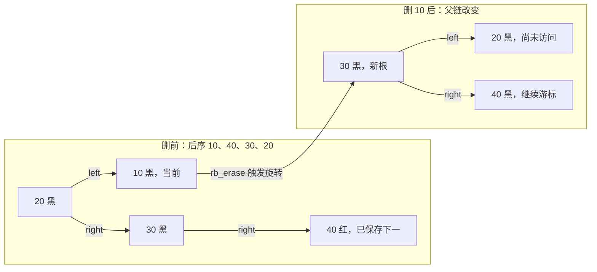

# 第27章\_Linux有序遍历与整树销毁

## 27.1\_从一次取消走到整轮处理

[P11 删除](P11_Linux_6.12_内核_rbtree_删除与缺黑修复.md#11.4_本章小结)保证摘除指定业务对象并恢复剩余树的性质。现在要取消全部请求：每次删除前保存的下一地址，是否仍是下一轮该处理的对象？如果不再需要查询剩余树，能否直接按孩子先于父的次序释放？

本章沿用前文的节点、父链和对象寿命，不重讲递归遍历定义。先以中序推进完成有序取消，再用四键反例找出后序 safe 与旋转的冲突，最后运行同一个完整模块比较两种正确回收。固定版本仍沿[源码总索引](../../../../research/source_reading/rbtree/navigation/P01_Linux_6.12_rbtree源码阅读索引.md#1.1_固定提交与阅读边界)。

## 27.2\_rbtree\_遍历接口

取消一个请求以后，程序可能要继续取消下一项；关闭整个私有索引时，又可能只想回收所有对象。这两种任务都会说“保存 next”，但下一对象的依据不同：前者沿中序排序，后者沿孩子先于父的完成关系。本节沿同一组节点解释为什么它们允许的修改不同，默认调用者独占树并保持需要读取的对象存活。

### 27.2.1\_遍历为什么本质上是\_BST\_中序关系

rbtree 是红黑树，也是 BST。

所以按 key 从小到大遍历，本质上是中序遍历：

```text
左子树
当前节点
右子树
```

Linux rbtree 没有递归遍历接口，而是提供：

```text
rb_first()
rb_last()
rb_next()
rb_prev()
```

它们允许调用者从某个节点开始按排序顺序前进或后退。前面的递归遍历需要栈记住从哪里回来；这里的 rb_node 父地址已经保存了回程，调用者只需当前游标。父链和孩子链都必须稳定，函数本身不取得锁或引用；不能把 P10 仅向下的 RCU 查询边界扩展成这些接口的保证。

以下把一轮记为 W0 建立根和寿命保护、W1 取得当前、W2 计算下一、W3 处理当前、W4 推进。阶段名属于讲解，内核没有对应的 W 字段；共享拓扑在 rb_node，pos/n 两个游标在调用者的局部变量中。版本函数与[模块导读](../../../../research/source_reading/rbtree/navigation/P05_有序推进与整树销毁导读.md#5.1_拓扑与游标分别保存在哪)分别承担代码证据与地址定位。

------

### 27.2.2\_rb\_first()\_与\_rb\_last()

`rb_first()` 返回最小节点。

逻辑很简单：

```text
从 root->rb_node 开始；
一直向 rb_left 走；
直到没有左孩子；
这个节点就是最小节点。
```

`rb_last()` 返回最大节点：

```text
从 root->rb_node 开始；
一直向 rb_right 走；
直到没有右孩子；
这个节点就是最大节点。
```

空树时二者都返回 `NULL`，这里的空是有效 root 对象内部的 rb_node=NULL；不是把 root 参数本身传为 NULL。完整语句见[中序端点与父链推进](../../../../research/source_reading/rbtree/source_explanations/lib/rbtree.c.md#1.7_中序端点与父链推进)。

这两个函数不关心颜色。

原因是：

```text
最小 / 最大只由 BST 有序性决定；
与红黑颜色无关。
```

------

### 27.2.3\_rb\_next()\_中序后继

`rb_next(node)` 返回中序后继，即中序序列里的下一对象。允许重复键时，下一对象的 key 可能相等；这个接口不会跳过全部同键节点寻找严格更大的值。

分两种情况。

第一，当前节点有右孩子：

```text
后继在右子树中；
具体是右子树里的最左节点。
```

逻辑：

```c
node = node->rb_right;
while (node->rb_left)
	node = node->rb_left;
return node;
```

第二，当前节点没有右孩子：

```text
后继在祖先方向。
```

向上找第一个满足：

```text
当前节点是其父节点的左孩子
```

的父节点。

这个父节点就是后继。理由是：从一个右孩子回到父时，父比这一侧更早，已经访问过，所以还要向上；第一次从左孩子回到父，父还排在已完成的左子树之后，正好是下一项。

源码逻辑：

```c
while ((parent = rb_parent(node)) && node == parent->rb_right)
	node = parent;

return parent;
```

如果一路向上都没有找到，说明当前节点已经是最大节点，返回 `NULL`。

------

### 27.2.4\_rb\_prev()\_中序前驱

`rb_prev(node)` 是 `rb_next()` 的镜像。

如果当前节点有左孩子：

```text
前驱是左子树里的最右节点。
```

如果当前节点没有左孩子：

```text
向上找第一个满足：
当前节点是其父节点右孩子
的父节点。
```

颜色同样不参与。

因为前驱 / 后继只取决于 BST 结构。

------

### 27.2.5\_RB\_EMPTY\_NODE()\_对遍历的保护

`rb_next()` 和 `rb_prev()` 开头都有：

```c
if (RB_EMPTY_NODE(node))
	return NULL;
```

`RB_EMPTY_NODE()` 判断的是：

```text
node->__rb_parent_color == (unsigned long)node
```

这是 `RB_CLEAR_NODE()` 设置出来的游离状态。

它用于表达：

```text
这个节点已知不在任何 rbtree 中。
```

如果一个节点已经从树中摘除并清理，再调用 `rb_next()` 没有意义。

这个保护可以让仍存活、已清标记的节点返回 NULL。它不允许把已经释放的内存传进去；rb_next/prev 在访问宏前也没有判断 node 是否为 NULL，不能用这个标记检查替代空指针判断。

但要注意：

```text
RB_EMPTY_NODE() 不是并发安全判断；
也不能替代“节点是否真的属于某棵树”的完整校验。
```

------

### 27.2.6\_后序遍历接口与整棵树销毁场景

Linux rbtree 还提供后序遍历：

```text
rb_first_postorder()
rb_next_postorder()
rbtree_postorder_for_each_entry_safe()
```

后序遍历顺序是：

```text
先访问孩子；
再访问父节点。
```

这很适合销毁整棵树。

原因是：

```text
释放父节点之前，先释放它的左右子树；
不会因为父节点先释放而丢失孩子指针。
```

`rb_first_postorder()` 会找到：

```text
从根开始，优先向左；没有左则向右；
直到这条左优先路径的叶子，并非寻找全树深度最大的叶子。
```

假设根左边是一片浅叶子、右边有三层分支，后序仍先处理左叶子，不能为了“最深”先去右侧。left_deepest 是上游辅助函数名，不是全树最大深度搜索。

`rb_next_postorder()` 根据当前节点和父节点关系决定下一位置：当前是左孩子且父有右子树时，进入右子树的第一个后序节点；否则下一项就是父。它不再下降进当前已经完成的孩子。完整实现见[后序推进](../../../../research/source_reading/rbtree/source_explanations/lib/rbtree.c.md#1.8_后序推进只跨向未完成部分)，宏的两个局部游标见[后序 safe](../../../../research/source_reading/rbtree/source_explanations/include/linux/rbtree.h.md#1.9_后序safe的两个局部游标)。

释放当前对象后，旧父的孩子字段可以暂时保留旧地址；它不是一棵可交给普通查询者的有效剩余树。后序算法不会再跟随那条已完成的孩子路径，整轮结束后由调用者重置根为空。其安全性依赖没有外部读者、没有重排、所有下一步所需对象仍存活，不是名称里的 safe 自动提供并发保护。

------

### 27.2.7\_遍历过程中删除节点的限制

`rbtree_postorder_for_each_entry_safe()` 名字里有 safe，但它的 safe 有边界。

它允许：

```text
循环体释放当前 pos 指向的对象内存；
因为下一步 n 已经提前保存。
```

但它不能处理：

```text
循环过程中调用 rb_erase() 导致树重新平衡。
```

原因是 `rb_erase()` 可能旋转。

旋转会改变尚未访问节点的结构关系，导致遍历漏节点。

所以文档语义是：

```text
适合整棵树销毁；
不适合边遍历边做会重排树结构的删除。
```

如果需要遍历并删除，常见做法是：

```text
先用 rb_first() / rb_next() 保存 next；
再删除当前节点；
在独占树、只删除当前对象且 next 仍存活的条件下继续；
或者每次重新从根取最左节点，再删除它。
```

------

### 27.2.8\_为什么一个保存的地址仍会漏访

按 10、20、30、40 插入后，树为根 20 黑、左 10 黑、右 30 黑且 30.right=40 红。原后序为 10、40、30、20。第一轮 W2 在旧结构中保存 40；W3 删除黑叶 10 后，平衡会让 30 成根，20 成它的左孩子，40 为右孩子。



W4 继续到保存的 40，它的父现在是 30；按新后序规则下一项为 30。到 30 时父为 NULL，于是循环结束。20 明明仍存活、仍在合法树里，却落在游标已经跨过的左侧。因此提前保存 next 只保护了这一个地址，没保存完整未来的完成次序。

为什么中序“保存 next 再删当前”可以成立？删除和旋转保留其他对象的排序及身份，所以原来的中序后继仍是幸存集合的下一项；后序却取决于父子形状，旋转后次序可以变化。这个结论以独占、只删当前和 next 全程存活为前提，不能用来容许其他写者随意修改。

| 当前目标 | 可采用的循环 | 每轮还保证什么 |
| --- | --- | --- |
| 按键取消并继续操作剩余索引 | rb_next 先保存，再 rb_erase 当前 | 剩余树仍合法；树操作本身仍需同步 |
| 只需清空，但想让每步剩余树都可查 | 每次 rb_first，再 rb_erase | 简单而有重复找最左及修复成本，整轮通常 O(n log n) 上界 |
| 排除外部使用者后的整树回收 | 后序 safe 只释放当前，最后置空根 | 不维持可查询剩余树，不调用会重排的删除 |

固定树只读的一轮中序或后序推进总计 O(n)、游标 O(1)，但单次 next 可以走高 h 的路径。中序取消额外执行 n 次删除，其总成本不能仍写成只读遍历的 O(n)。

### 27.2.9\_运行完整遍历与销毁模块

材料[note_rbtree_walk.c](../../../../labs/kernel/tree_basics/materials/note_rbtree_walk.c)使用与上节相同的四键。先反向读取，再按中序保存下一项、摘除并释放；重新构建后按后序 safe 回收。最后的错误混用只使用仍存活的自动对象，不释放它们，用漏访 20 展示限制。

该模块在初始化函数内独占各棵树，没有外部发布或其他读者。kmalloc 申请外层对象，GFP_KERNEL 表示当前可睡眠上下文的常规申请；申请失败返回 -ENOMEM。重复键拒绝入树，尚未入树的对象单独释放，已入树部分由后序回收；失败出口把根恢复为空。kfree 释放外层对象，因此必须先计算仍需读取当前节点的 next。基础模块声明、错误码和数组宏沿用前两节。

| 接口 | 本例的状态职责 | 必须满足的边界 | 固定实现 |
| --- | --- | --- | --- |
| rb_first/last、rb_next/prev | W1 起点、W2 中序前后对象 | 非空节点、稳定父孩子链、对象存活 | [四个遍历函数](../../../../research/source_reading/rbtree/source_explanations/lib/rbtree.c.md#1.7_中序端点与父链推进) |
| rb_erase | W3 中序取消，保留合法剩余树 | 只摘当前，保存的 next 仍存活 | [删除入口](../../../../research/source_reading/rbtree/source_explanations/lib/rbtree.c.md#1.6_删除入口与黑色位辅助) |
| rb_first_postorder/next_postorder | 找后序起点及未完成父/右子树 | 不与旋转重排混用 | [后序函数](../../../../research/source_reading/rbtree/source_explanations/lib/rbtree.c.md#1.8_后序推进只跨向未完成部分) |
| rbtree_postorder_for_each_entry_safe | 循环体前保存另一个局部游标 | 仅当前可失效，宏不取锁或引用 | [两个游标宏](../../../../research/source_reading/rbtree/source_explanations/include/linux/rbtree.h.md#1.9_后序safe的两个局部游标) |

```c
// SPDX-License-Identifier: GPL-2.0
/* 私有遍历实验：正确销毁使用堆对象，错误混用只用自动对象。 */
#include <linux/init.h>
#include <linux/module.h>
#include <linux/rbtree.h>
#include <linux/slab.h>
#include <linux/errno.h>

struct walk_item {
    int key;
    unsigned int id;
    struct rb_node rb;
};

static int insert_item(struct rb_root *root, struct walk_item *item)
{
    struct rb_node **slot = &root->rb_node;
    struct rb_node *parent = NULL;

    while (*slot) {
        struct walk_item *other = rb_entry(*slot, struct walk_item, rb);
        parent = *slot;
        if (item->key < other->key)
            slot = &parent->rb_left;
        else if (item->key > other->key)
            slot = &parent->rb_right;
        else
            return -EEXIST;
    }
    rb_link_node(&item->rb, parent, slot);
    rb_insert_color(&item->rb, root);
    return 0;
}

/* 调用者已排除外部读者；不调用 rb_erase，也不再查找半销毁的树。 */
static unsigned int destroy_tree(struct rb_root *root)
{
    struct walk_item *pos, *next;
    unsigned int count = 0;

    rbtree_postorder_for_each_entry_safe(pos, next, root, rb) {
        pr_info("walk destroy id=%u key=%d\n", pos->id, pos->key);
        ++count;
        kfree(pos);
    }
    *root = RB_ROOT;
    return count;
}

static int build_tree(struct rb_root *root, const int *keys, unsigned int count)
{
    unsigned int i;
    int error;

    *root = RB_ROOT;
    for (i = 0; i < count; ++i) {
        struct walk_item *item = kmalloc(sizeof(*item), GFP_KERNEL);
        if (!item) {
            error = -ENOMEM;
            goto fail;
        }
        item->key = keys[i];
        item->id = i;
        error = insert_item(root, item);
        if (error) {
            kfree(item); /* 尚未入树的对象单独回收。 */
            goto fail;
        }
    }
    return 0;
fail:
    destroy_tree(root); /* 已入树部分统一回收，失败返回空根。 */
    return error;
}

static int show_bad_mix(void)
{
    const int keys[] = {10, 20, 30, 40};
    struct walk_item items[4] = {0};
    struct rb_root root = RB_ROOT;
    struct rb_node *node, *next;
    unsigned int i, visited = 0;
    int error;

    for (i = 0; i < ARRAY_SIZE(items); ++i) {
        items[i].key = keys[i];
        items[i].id = i;
        error = insert_item(&root, &items[i]);
        if (error)
            return error;
    }
    for (node = rb_first_postorder(&root); node; node = next) {
        if (++visited > ARRAY_SIZE(items))
            return -EINVAL;
        next = rb_next_postorder(node);
        pr_info("walk bad_mix erase=%d\n",
                rb_entry(node, struct walk_item, rb)->key);
        rb_erase(node, &root); /* 故意重排，仅观察漏访；不释放任何对象。 */
    }
    if (visited != 3 || root.rb_node != &items[1].rb)
        return -EINVAL;
    pr_info("walk bad_mix missed=%d\n", items[1].key);
    return 0;
}

static int __init note_init(void)
{
    const int keys[] = {10, 20, 30, 40};
    struct rb_root root = RB_ROOT;
    struct rb_node *node, *next;
    int error;

    error = build_tree(&root, keys, ARRAY_SIZE(keys));
    if (error)
        return error;
    for (node = rb_last(&root); node; node = rb_prev(node))
        pr_info("walk reverse key=%d\n",
                rb_entry(node, struct walk_item, rb)->key);
    /* 独占树，保存的下一对象全程存活；每次只删除当前对象。 */
    for (node = rb_first(&root); node; node = next) {
        struct walk_item *item = rb_entry(node, struct walk_item, rb);
        next = rb_next(node);
        rb_erase(node, &root);
        pr_info("walk inorder erase=%d\n", item->key);
        kfree(item);
    }
    if (root.rb_node) {
        destroy_tree(&root);
        return -EINVAL;
    }

    error = build_tree(&root, keys, ARRAY_SIZE(keys));
    if (error)
        return error;
    if (destroy_tree(&root) != ARRAY_SIZE(keys))
        return -EINVAL;
    return show_bad_mix();
}

static void __exit note_exit(void)
{
    pr_info("walk observation unloaded\n");
}
module_init(note_init);
module_exit(note_exit);
MODULE_LICENSE("GPL");
MODULE_DESCRIPTION("有序取消与后序整树销毁观察");
```

预期反向输出 40、30、20、10；中序取消输出 10、20、30、40；后序销毁输出 10、40、30、20。错误混用输出取消 10、40、30 后报告漏掉 20。root=RB_ROOT 是调用者在整轮销毁后重置入口，safe 宏自身不会清根。

```bash
# 在已准备好匹配目标 ARM 的构建环境中执行。
: "${KERNEL_BUILD:?请先设置目标内核构建目录}"
: "${CROSS_COMPILE:?请先设置目标交叉工具链前缀}"
cd labs/kernel/tree_basics/materials
make -C "$KERNEL_BUILD" M="$PWD" ARCH=arm CROSS_COMPILE="$CROSS_COMPILE" modules
# 将 note_rbtree_walk.ko 放到目标机后，在目标机执行：
sudo insmod ./note_rbtree_walk.ko
sudo dmesg | tail -n 100
sudo rmmod note_rbtree_walk
```

本批已完成 ARM 语法检查；以明确宿主接口适配直接包含材料也得到上述顺序，并检查八个分配失败位置、重复键、空树和单节点的回收。另用固定遍历核心核对六对象全排列的三种次序与保存后继删除，包括重复键。宿主使用 uintptr_t 适配 Windows 父色位宽，GNU C 保留宏的语句表达式；这些都不是目标 Linux ABI、并发或真实内核执行。目标 Kbuild、装卸和实际日志仍未完成。

先做三道修改练习，再进入小结：

1. 把四键中的 40 改成 5，先手画最终树与两种访问次序。错误混用函数中的固定漏访检查是原四键实验的断言，改输入以后必须重新推导，不能期待所有树都恰好漏同一节点。
2. 只让 build_tree 处理空输入或单节点。说明后序 safe 为什么不会漏最后一个根，以及最终谁把 root 置空。
3. 在独立学习副本中给 build_tree 增加第几次申请失败的可控条件，依次试验每个失败位置，检查未入树对象和已入树部分分别由谁释放。不能仅看到返回 -ENOMEM 就认定不存在泄漏。

### 27.2.10\_本节小结

遍历接口的核心结论：

```text
第一，rb_first() / rb_last() 分别找最左 / 最右节点。

第二，rb_next() / rb_prev() 基于 BST 中序关系，不依赖颜色。

第三，RB_EMPTY_NODE() 可以识别已清理游离节点，但不是并发保护。

第四，后序遍历适合销毁整棵树。

第五，postorder safe 不等于可以任意 rb_erase() 并继续遍历。
```

------

## 27.3\_本章回顾与下一步

遍历路径要记成：

```text
rb_first / rb_last：
	找最左 / 最右。

rb_next / rb_prev：
	找中序后继 / 前驱。

postorder：
	适合整棵树销毁，但不能随意和 rb_erase() 重排混用。
```

“保存了地址”与“保住了它对应的关系”是两件事。中序取消依赖幸存对象的中序次序，后序整树销毁依赖不再旋转的完成关系；二者都需要对象寿命条件。下一篇进入[P28 同键替换](P28_Linux同键替换与旧对象退出.md#28.1_从保存地址走到交接地址)，观察成员数量不变而业务对象地址改变时，旧读者凭什么继续使用原对象。
