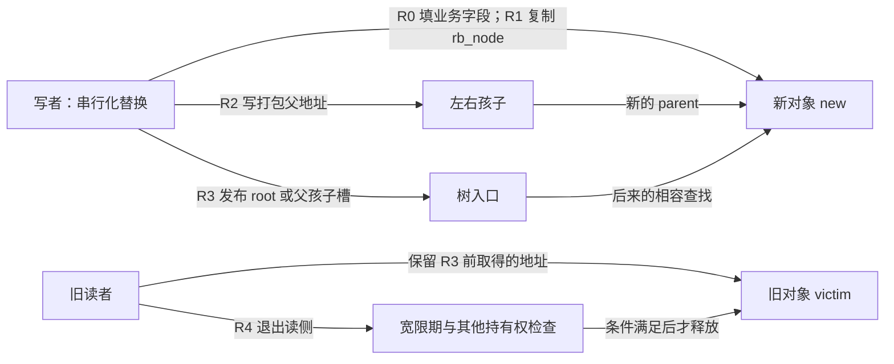
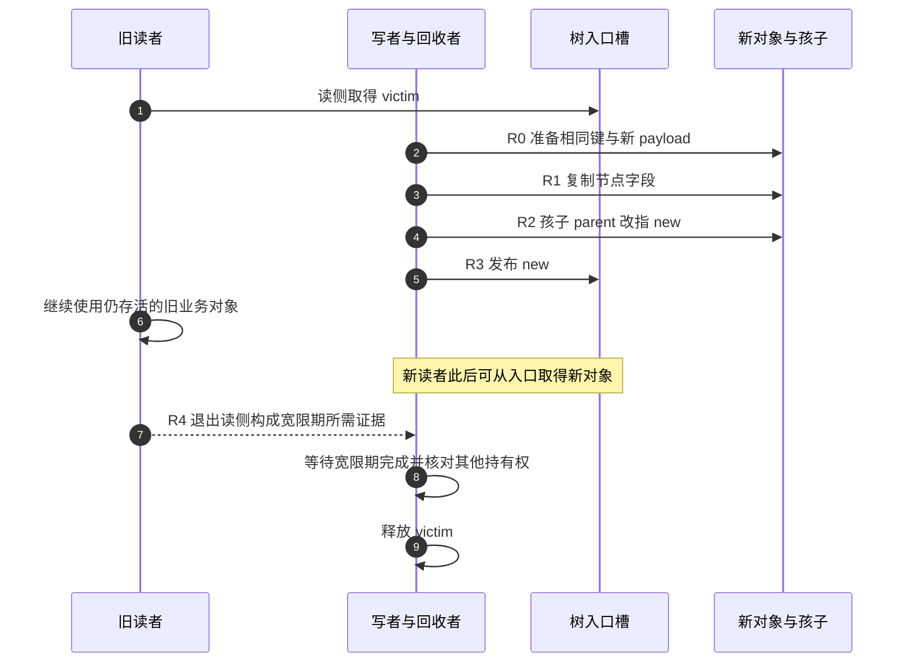

# 第28章\_Linux同键替换与旧对象退出

## 28.1\_从保存地址走到交接地址

[P27 遍历](P27_Linux有序遍历与整树销毁.md#27.3_本章回顾与下一步)说明局部游标不会随树关系自动更新。现在保留排序位置，但把该位置交给新业务对象：从根后来找到的对象与旧读者早先保存的对象可能同时存活。

本章只增加这一次地址交接，先读普通替换，再追踪 RCU 入口发布与 cached 额外入口；共享对象的读侧和宽限期先修沿[RCU 专题](../../synchronization_and_asynchrony/synchronization/rcu/大纲.md#1.1_专题定位)。完整模块只作私有树观察和单任务顺序重放，不承担并发证明。

## 28.2\_rb\_replace\_node()\_与\_rb\_replace\_node\_rcu()

取消请求会减少成员，销毁会结束对象寿命。现在换一个要求：队列里键为 20 的请求仍然存在，但其业务数据已在另一块内存里准备好。我们希望后续查询取得新对象，同时允许已经拿到旧对象的读者完成自己的工作。重新删除再插入能够实现新的排序，但如果排序根本没变，就没有必要重新寻找落点或修复树形。

本节沿用上一节的成员与地址区别，只增加“把一个已有位置交给另一个对象”。先在独占树中完成交接，再讨论 RCU 发布和 cached 额外入口；RCU 基本读侧与宽限期见[专题入口](../../synchronization_and_asynchrony/synchronization/rcu/大纲.md#1.1_专题定位)。固定版本的具体函数从[源码总索引](../../../../research/source_reading/rbtree/navigation/P01_Linux_6.12_rbtree源码阅读索引.md#1.2_按问题选择源码入口)进入，[替换模块导读](../../../../research/source_reading/rbtree/navigation/P06_同键替换与旧对象退出导读.md#6.2_一轮替换怎样交接入口)把下面的交接阶段对应到实际入口。

### 28.2.1\_替换节点与删除再插入的区别

`rb_replace_node()` 的语义是：

```text
用 new 替换 victim 在树中的位置；
不重新比较 key；
不重新平衡；
不改变排序位置。
```

它不是：

```text
删除旧节点，再按新 key 插入新节点。
```

因此它有一个硬性条件：

```text
new 必须和 victim 处在同一个排序位置。
```

也就是说：

```text
new 的 key 必须等价于 victim 的 key；
或者至少对树中所有其他节点的比较结果保持一致。
```

固定版本的接口文档要求相同 key。若排序由多个字段共同决定，“相同”须覆盖整个比较键，不能只比较展示出来的编号。不同键偶然仍落在左右子树允许的区间内，数学上未必立即破坏顺序；但替换函数既不检查这个区间，也不负责重新排序，不应把这种偶然当作修改 key 的接口保证。

这种情况应该：

```text
先 rb_erase(victim)；
再按新 key 搜索落点；
再 rb_link_node() + rb_insert_color()。
```

------

### 28.2.2\_*new\_=\_*victim\_的工程意义

源码中最关键的一句是：

```c
*new = *victim;
```

这会复制：

```text
victim->__rb_parent_color
victim->rb_left
victim->rb_right
```

含义是：

```text
new 直接继承 victim 的父指针、颜色、左右孩子。
```

然后修正左右孩子的父指针：

```text
如果 victim->rb_left 存在：
	它的 parent 改成 new。

如果 victim->rb_right 存在：
	它的 parent 改成 new。
```

最后：

```text
__rb_change_child(victim, new, parent, root)
```

把 victim 在父节点或 root 中的位置替换成 new。

整个过程没有旋转，也没有染色修复。这里的 `new` 和 `victim` 都是 `struct rb_node *`：赋值只复制嵌入节点，不会复制外层业务结构体的 payload、引用计数、其他索引或增广字段。新业务数据由调用者在交接前准备，不能指望这句赋值帮忙迁移。

原因是：

```text
树的结构形状没有改变；
new 完全接管 victim 的结构位置和颜色；
红黑性质保持不变。
```

调用开始前，victim 必须仍是这棵树的成员，new 必须是尚未挂入其他位置的有效节点；调用者负责串行化写者，并让读者遵循相容的访问协议。替换不会清空 victim 的三个结构字段，也不会调用 `RB_CLEAR_NODE()`。旧地址已经不属于从根可达的成员，`RB_EMPTY_NODE(victim)` 却仍可能为假：它是显式标记检查，不是成员搜索。保存旧地址只允许继续使用协议保住的业务数据，不授权从它调用普通后继遍历。

------

### 28.2.3\_为什么\_replacement\_必须保持相同排序位置

红黑树旋转和替换都默认 BST 中序顺序不被破坏。

`rb_replace_node()` 不调用比较函数。

它不会检查：

```text
new 是否大于左子树所有节点；
new 是否小于右子树所有节点；
new 是否符合父节点方向。
```

所以调用者必须保证：

```text
new 放在 victim 的位置仍然满足业务排序。
```

适合场景：

```text
替换对象壳子；
迁移对象内存；
同 key 对象更新；
需要保留树位置但换业务结构体实例。
```

不适合场景：

```text
修改 key；
从按地址排序改成按长度排序；
替换成另一个排序位置不同的对象。
```

------

### 28.2.4\_rb\_replace\_node\_rcu()\_与\_RCU\_读侧安全

RCU 版本和普通版本结构相似，也会：

```text
*new = *victim;
修正子节点 parent；
替换父节点孩子指针或 root。
```

区别在最后一步：

```text
__rb_change_child_rcu(victim, new, parent, root)
```

它使用：

```text
rcu_assign_pointer()
```

而且源码注释强调：

```text
最后才更新父节点指向 new 的指针。
```

原因是：

```text
RCU 读者一旦通过父节点看到 new；
在相容的 RCU 读取与发布协议下，应能看到发布前准备的新节点及向前的孩子链接。
```

所以 RCU 替换的顺序是：

```text
先准备 new；
先修正 new 周围的子节点关系；
最后发布父节点到 new 的指针。
```

这仍然不等于：

```text
可以不管理 victim 生命周期。
```

RCU 读者可能仍持有 victim，发布后立刻释放它会让旧读者访问已回收内存。旧对象退出索引后，必须完成该保护域要求的宽限期，并满足业务可能额外持有的引用条件；这两项不能随意互相替代。替换函数本身既不等待，也不安排释放。

把这件事放在同一个周期中，便能区分“树入口已经交接”和“旧对象可以释放”：

| 阶段 | 谁改什么 | 后续谁读取以及何时退出 |
| --- | --- | --- |
| R0 私有准备 | 写者填好新对象的相同键和新 payload；新节点尚未发布 | 写者确认旧成员、写者互斥和读者协议成立 |
| R1 继承结构 | 写者把旧 rb_node 的三个字段复制到新 rb_node | 后续操作据此继承孩子、父地址和颜色；业务字段仍是新对象自己的 |
| R2 修正回指 | 写者把两个孩子的打包父地址改向 new，保留孩子颜色 | 这是共享结构变化，发生在 R3 之前；普通父链读者不能据此获得一致快照 |
| R3 发布入口 | 写者通过 rcu_assign_pointer 修改父节点的孩子槽或 root->rb_node | 后来经过该入口的相容读者可以取得 new；此前持有 victim 的读者仍可能访问旧对象 |
| R4 退出与回收 | 旧读者退出保护域，回收者等待所需宽限期并核对其他持有权 | 只有所有回收前提均成立，才可释放或重用 victim |





图中的退出箭头表示 RCU 汇聚退出证据，不要求读者直接调用或通知这个写者。公共接口、实际 Tiny/Tree 实现怎样获得证据由 [RCU 源码索引](../../../../research/source_reading/rcu/navigation/P01_Linux_6.12_RCU源码总阅读索引.md#1.6_建议的源码阅读顺序)继续展开。

R2 先于 R3，说明发布的只是外部入口，不是把所有父子指针作为一个原子事务提交。它不能让普通 `rb_next()`、`rb_prev()` 自动成为并发安全遍历，也不能承诺多次查找属于同一快照。前文 `rb_find_rcu()` 对根的初次读取仍是普通读取，孩子路径才使用其具体 RCU 读取方式；替换函数不会替调用者改写查找协议。参见[最后发布的唯一实现](../../../../research/source_reading/rbtree/source_explanations/lib/rbtree.c.md#1.9_同键替换的普通与RCU入口)。

------

### 28.2.5\_rb\_replace\_node\_cached()\_如何维护最左缓存

cached rbtree 额外保存：

```text
root->rb_leftmost
```

所以替换时如果：

```text
victim 正好是 rb_leftmost
```

就要把缓存改成：

```text
new
```

实际先后顺序是：先判断 victim 是否为缓存的最左节点，若是就把 `rb_leftmost` 指向 new，然后调用普通替换。完整源码只在[缓存包装的唯一实现](../../../../research/source_reading/rbtree/source_explanations/include/linux/rbtree.h.md#1.10_替换时的最左缓存入口)展开。

这再次说明：

```text
cached 信息不属于普通 rb_root；
使用 cached 接口时，必须走 cached 包装函数维护它。
```

如果直接对 cached tree 调用普通 `rb_replace_node()`，最左缓存可能失效。

注意这个顺序的代价：cached 入口已经指向 new 时，普通替换还没有执行 R1，new 的结构字段可能尚未继承完成。因此调用者的保护必须覆盖整个包装调用，不能让无保护读者从缓存提前进入新节点。固定版本没有 `rb_replace_node_cached_rcu()` 这一组合接口；把名字接在一起不能产生一个新的并发协议。

增广树还多一层业务状态。子树最大值、计数等通常位于外层对象中，复制 rb_node 不会自动接管它们。即使形状和 key 没变，新 payload 若改变增广量的含义，调用者仍需按该量的定义重新计算、传播并保护读取；不能一律复制旧值后声称缓存正确。

------

### 28.2.6\_本节小结

替换接口的核心结论：

```text
第一，rb_replace_node() 是原地结构替换，不是删除再插入。

第二，new 会复制 victim 的父指针、颜色、左右孩子。

第三，replacement 必须保持相同排序位置，不能改变 key 语义。

第四，RCU 版本最后发布父节点孩子指针，使相容的 RCU 读者取得发布前准备的新节点；它不等待旧读者退出。

第五，cached tree 替换最左节点时必须维护 rb_leftmost。
```

------

### 28.2.7\_运行同键替换观察模块

先预测三种观察。普通场景用键 10、20、30 建树，把根上的键 20 换成 payload 为 1000 的新对象；cached 场景把最左的键 10 换掉；RCU 场景只用一个键 20，同时保留先前取得的旧地址和发布后取得的新地址。前两组仍应遍历到三个成员，后一组的两个地址应分别读到 payload 1 和 2。

下面是完整模块，材料为 [note_rbtree_replace.c](../../../../labs/kernel/tree_basics/materials/note_rbtree_replace.c)。普通与 cached 根都是函数内的私有自动对象；`RB_ROOT_CACHED` 是空缓存根的初始化宏，同时把普通根指针与最左缓存设为空。RCU 组在一个任务中顺序重放地址交接，没有其他线程或外部入口。这样能先观察接口究竟复制什么、留下什么，而不把调度时机混进第一个实验。

```c
// SPDX-License-Identifier: GPL-2.0
/* 私有替换观察：普通/cached 使用自动对象，RCU 场景只作单任务顺序重放。 */
#include <linux/init.h>
#include <linux/module.h>
#include <linux/rbtree.h>
#include <linux/rcupdate.h>
#include <linux/slab.h>
#include <linux/errno.h>

struct replace_item {
    int key;
    int payload;
    struct rb_node rb;
};

static int insert_item(struct rb_root *root, struct replace_item *item)
{
    struct rb_node **slot = &root->rb_node;
    struct rb_node *parent = NULL;
    while (*slot) {
        struct replace_item *entry = rb_entry(*slot, struct replace_item, rb);
        parent = *slot;
        if (item->key < entry->key)
            slot = &parent->rb_left;
        else if (item->key > entry->key)
            slot = &parent->rb_right;
        else
            return -EEXIST;
    }
    rb_link_node(&item->rb, parent, slot);
    rb_insert_color(&item->rb, root);
    return 0;
}

static int run_private(bool cached)
{
    struct replace_item items[3] = {0};
    struct replace_item replacement = {0};
    struct rb_root_cached root = RB_ROOT_CACHED;
    struct rb_node saved_rb, *node;
    struct replace_item *victim;
    unsigned int i, visited = 0;
    int error;

    for (i = 0; i < ARRAY_SIZE(items); ++i) {
        items[i].key = (i + 1) * 10;
        items[i].payload = i + 1;
        error = insert_item(&root.rb_root, &items[i]);
        if (error)
            return error;
    }
    /* 根尚未发布：完成私有构建后一次性建立最左缓存。 */
    root.rb_leftmost = rb_first(&root.rb_root);
    victim = cached ? &items[0] : &items[1];
    replacement.key = victim->key;
    replacement.payload = 1000;
    saved_rb = victim->rb;

    if (cached)
        rb_replace_node_cached(&victim->rb, &replacement.rb, &root);
    else
        rb_replace_node(&victim->rb, &replacement.rb, &root.rb_root);
    if (replacement.payload != 1000 || victim->key != replacement.key ||
        victim->rb.__rb_parent_color != saved_rb.__rb_parent_color ||
        victim->rb.rb_left != saved_rb.rb_left || victim->rb.rb_right != saved_rb.rb_right)
        return -EINVAL;
    if (cached && root.rb_leftmost != &replacement.rb)
        return -EINVAL;
    if (!cached && root.rb_root.rb_node != &replacement.rb)
        return -EINVAL;
    for (node = rb_first(&root.rb_root); node; node = rb_next(node)) {
        struct replace_item *entry = rb_entry(node, struct replace_item, rb);
        if (++visited > ARRAY_SIZE(items) || node == &victim->rb)
            return -EINVAL;
        if ((node->rb_left && rb_parent(node->rb_left) != node) ||
            (node->rb_right && rb_parent(node->rb_right) != node))
            return -EINVAL;
        pr_info("replace %s key=%d payload=%d\n",
                cached ? "cached" : "plain", entry->key, entry->payload);
    }
    pr_info("replace old key=%d payload=%d empty_marker=%d\n",
            victim->key, victim->payload, RB_EMPTY_NODE(&victim->rb));
    return visited == ARRAY_SIZE(items) ? 0 : -EINVAL;
}

static int run_rcu_replay(void)
{
    struct replace_item *old, *new, *saved, *published;
    struct rb_root root = RB_ROOT;
    struct rb_node *node;
    int error = 0;

    old = kmalloc(sizeof(*old), GFP_KERNEL);
    if (!old)
        return -ENOMEM;
    new = kmalloc(sizeof(*new), GFP_KERNEL);
    if (!new) {
        kfree(old);
        return -ENOMEM;
    }
    old->key = new->key = 20;
    old->payload = 1;
    new->payload = 2;
    rb_link_node(&old->rb, NULL, &root.rb_node);
    rb_insert_color(&old->rb, &root);

    /* 本任务既保存旧视图又执行替换，无其他写者；不是并发压力测试。 */
    rcu_read_lock();
    node = rcu_dereference(root.rb_node);
    saved = rb_entry(node, struct replace_item, rb);
    rb_replace_node_rcu(&old->rb, &new->rb, &root);
    node = rcu_dereference(root.rb_node);
    published = rb_entry(node, struct replace_item, rb);
    if (saved != old || published != new || saved->payload != 1 || published->payload != 2)
        error = -EINVAL;
    pr_info("replace rcu saved_payload=%d published_payload=%d\n",
            saved->payload, published->payload);
    rcu_read_unlock();

    /* 私有根不再使用；等待必须在退出读侧后，其他持有权本例不存在。 */
    rb_erase(&new->rb, &root);
    synchronize_rcu();
    kfree(old);
    kfree(new);
    return error;
}

static int __init note_init(void)
{
    int error = run_private(false);
    if (error)
        return error;
    error = run_private(true);
    if (error)
        return error;
    return run_rcu_replay();
}
static void __exit note_exit(void)
{
    pr_info("replace observation unloaded\n");
}
module_init(note_init);
module_exit(note_exit);
MODULE_LICENSE("GPL");
MODULE_DESCRIPTION("同键替换与旧对象寿命观察");
```

`run_private()` 在私有构建结束后建立最左缓存。它保存旧节点的三个字段，再检查替换没有清掉旧字段、新 payload 没有被复制覆盖、孩子 parent 指向新成员，而且从根遍历已经找不到 victim。自动对象退出函数时一起结束寿命；不存在外部引用，所以不需要把它们交给异步回收。

`run_rcu_replay()` 先申请两个对象，再进入读侧取得旧地址。在同一个读侧区间里执行不等待的替换，并重新取得新入口。这不是两个 CPU 的并发测试，而是对“地址在交接前后分别指向谁”的确定性重放。随后先退出读侧，停止使用私有树，再调用 `synchronize_rcu()`，最后释放两个对象。若第二次申请失败，只释放已经申请成功的旧对象；尚未建立树，无须执行删除或宽限期等待。

不能把等待移进 `rcu_read_lock()` 与 `rcu_read_unlock()` 之间。公共使用约束要求在允许等待的上下文调用；在当前记录的 UP、非抢占 Tiny RCU 配置中，[具体实现可能立即完成](../../../../research/source_reading/rcu/source_explanations/P13_Linux_6.12_Tiny_RCU源码实现.md#13.12_synchronize_rcu立即返回不等于没有宽限期语义)，但这不取消读侧约束，也不意味着该示例观察到了跨 CPU 等待。

在匹配目标内核的构建环境中，从仓库根执行：

```bash
# KDIR 指向已经准备好的目标内核构建目录。
make -C "$KDIR" M="$PWD/labs/kernel/tree_basics/materials" modules
# 把模块放到对应 Linux 目标后，在模块所在目录加载。
sudo insmod note_rbtree_replace.ko
sudo dmesg | tail -n 30
sudo rmmod note_rbtree_replace
```

交叉构建继续使用插入实验已说明的 ARCH、CROSS_COMPILE 和匹配配置，不把 Windows 宿主编译结果当成可加载模块。下面是按程序推演的核心日志，省略内核时间戳，**不是本次目标机运行实录**：

```text
replace plain key=10 payload=1
replace plain key=20 payload=1000
replace plain key=30 payload=3
replace old key=20 payload=2 empty_marker=0
replace cached key=10 payload=1000
replace cached key=20 payload=2
replace cached key=30 payload=3
replace old key=10 payload=1 empty_marker=0
replace rcu saved_payload=1 published_payload=2
```

先解释为什么 old 的 empty_marker 为 0，却已经不能从根找到它。再将普通场景改为替换叶子，预测哪些孩子回指步骤会跳过。最后为业务对象增加一个独立引用计数，回答：宽限期完成时计数仍非零，能否立即释放？答案仍是否定的；宽限期只完成其保护域内的读者条件，不撤销另一种持有权。

还可以做一个不需要并发的边界练习：把三键树的根 20 替换成键 25，顺序可能碰巧仍合法；换成 35 则会把原右孩子 30 放在错误的一侧。这个对照说明函数没有检查排序契约，不能用一次“看起来没坏”的运行证明改 key 正确。正式更新排序键仍应删除、重新搜索并插入。

现在我们能够分别解释结构交接、缓存入口与旧对象寿命。随后先回看 P29 的修复完成边界，再在这些具体限制之上处理并发保护、增广和工程验证，不能只因为某个函数名带 rcu 就跳过整套对象协议。

------

## 28.3\_本章回顾与下一步

替换路径要记成：

```text
rb_replace_node() 不比较 key；
new 必须保持 victim 的排序位置；
它只是复制结构关系并替换父节点指针。
```

入口交接完成不等于旧对象寿命结束；缓存和增广字段也不随嵌入节点赋值自动得到正确协议。下一篇回到[P29 普通旋转与 Linux 修复](P29_普通旋转与Linux修复的完成边界.md#29.1_为什么没有一一对应的旋转调用)，比较局部改边与整轮完成；随后由 P12 继续 cached rbtree、augmented rbtree、并发控制、示例代码、调试验证和内核使用场景。
