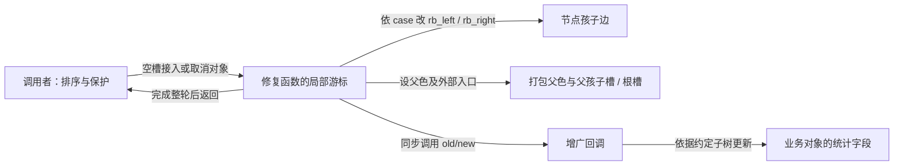
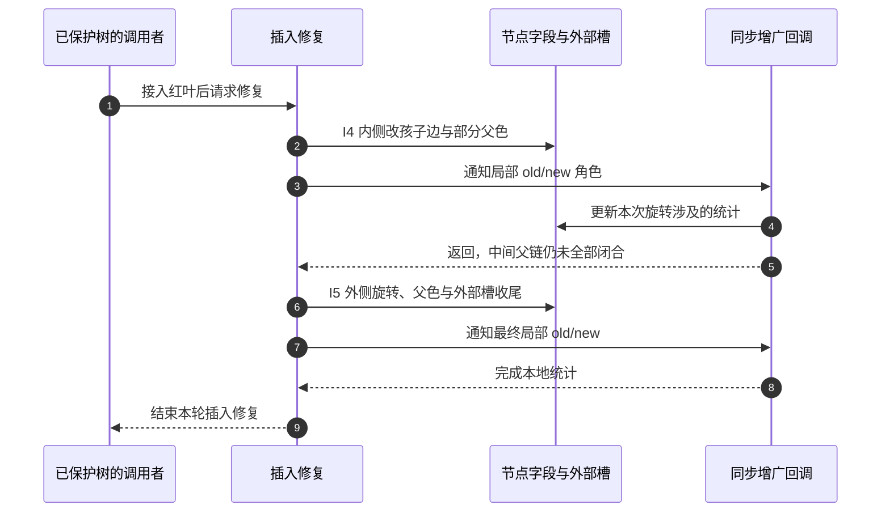

# 第29章\_普通旋转与Linux修复的完成边界

## 29.1\_为什么没有一一对应的旋转调用

P05 的普通单旋返回时，孩子边、父边和外部入口都已经一致。现在你已经沿 P26 和 P11 看过完整红黑修复，可以回头问：内核的一个 Case 2 刚做完“左旋”，为什么紧接着的回调仍不能任意沿 parent 遍历？

本章承接[P28 的交接边界](P28_Linux同键替换与旧对象退出.md#28.3_本章回顾与下一步)，把普通旋转的完整后置条件与修复分支的中间状态放在同一张图上比较。它不重讲红黑性质，也不建立第二套完整函数说明；读完应能从一段改边语句认出旋转方向，并说出“形状已变化”和“本轮修复已闭合”之间还缺什么。

## 29.2\_从普通单旋映射到内核修复

从普通单旋看内核，先找三类状态：孩子边决定向下形状，打包父色决定回程与颜色，父节点孩子槽或根槽决定外部入口。修复分支知道哪些对象必须非空、哪些颜色已由黑高推出，所以可以在本地安排这些写入，不必每次调用一份通用单旋。下面以当前固定实现追踪这些责任；版本证据从[源码总索引](../../../../research/source_reading/rbtree/navigation/P01_Linux_6.12_rbtree源码阅读索引.md#1.2_按问题选择源码入口)进入[插入模块](../../../../research/source_reading/rbtree/navigation/P03_红叶接入与冲突修复导读.md#3.2_一轮插入怎样推进)和[删除模块](../../../../research/source_reading/rbtree/navigation/P04_对象摘除与缺黑修复导读.md#4.2_从对象到缺黑父槽)。

### 29.2.1\_本节参照的源码文件

本节依据 NXP 官方 Linux 6.12.20，固定提交为 `dfaf2136deb2af2e60b994421281ba42f1c087e0`。后文的修复状态属于该版本，不能由代码相似推断另一个版本的接口集合或当前机器配置。主要文件按职责分开：

1. `lib/rbtree.c`
   红黑树插入修复、删除修复、旋转公共收尾逻辑都在这里。`__rb_insert()`、`____rb_erase_color()`、`__rb_rotate_set_parents()`、`rb_insert_color()`、`rb_erase()` 都属于这个文件的核心内容。([本地源码](../../../../research/source_reading/linux/lib/rbtree.c))
2. `include/linux/rbtree.h`
   对外基础接口在这里声明，例如 `rb_insert_color()`、`rb_erase()`，以及 `rb_link_node()`、`rb_replace_node()`、`rb_first()`、`rb_next()` 等基础辅助接口。([本地源码](../../../../research/source_reading/linux/include/linux/rbtree.h))
3. `include/linux/rbtree_augmented.h`
   增强红黑树接口和回调结构在这里定义，例如 `struct rb_augment_callbacks`、`rb_insert_augmented()` 等。这个文件同时也明确说明：只有增强树相关回调结构和接口是给使用者依赖的，其余很多内容是实现细节。([本地源码](../../../../research/source_reading/linux/include/linux/rbtree_augmented.h))
4. `Documentation/core-api/rbtree.rst`
   这是内核 rbtree 的文档源文件，对应生成文档页面 `core-api/rbtree.html`。它说明了用户如何搜索、插入、删除、遍历，以及增强红黑树如何使用。([本地源码](../../../../research/source_reading/linux/Documentation/core-api/rbtree.rst))

后面只保留足以辨认改边动作的忠实裁剪片段，不是可独立编译的函数。完整函数、中文注释和修改边界在唯一实现页；片段中的进入条件、未展开的镜像及退出动作都由相应完整函数兑现。普通单旋的独占模型不能直接充当内核并发更新协议。

------

### 29.2.2\_对外接口层\_调用者通常看不到\_左旋\_/\_右旋

从 Linux 内核对外提供的 rbtree 使用方式来看，调用者通常不会直接调用“左旋函数”或“右旋函数”。标准流程是：

1. 先由调用者自己按 BST 规则查找插入位置，再用 `rb_link_node()` 把节点接到树上，随后调用 `rb_insert_color()` 做插入后的红黑修复；
2. 删除时则调用 `rb_erase()`。
3. 因此，从使用者视角看，左右旋不是公开 API，而是被封装在插入 / 删除修复流程内部。固定版本文档对 rbtree 的基本使用方式也是这样描述的。([本地源码](../../../../research/source_reading/linux/include/linux/rbtree.h))

这说明内核对外暴露的是“**怎么把节点接上树并完成修复**”，而不是“**请你自己决定什么时候做左旋、什么时候做右旋**”。也就是说，左右旋在内核里首先是一种**内部实现动作**，而不是用户直接编排的公共算法接口。([本地源码](../../../../research/source_reading/linux/include/linux/rbtree.h))

------

### 29.2.3\_使用者负责什么\_rbtree\_代码又负责什么

`struct rb_node` 被嵌入业务对象，树本身不知道请求的排序键是什么。调用者定义比较规则，可以自己编写搜索循环，也可以把比较函数交给 `rb_add()`、`rb_find_add()`、`rb_find()` 等辅助入口。基础平衡接口不把比较器保存在树对象里，不等于头文件没有接收比较回调的辅助函数。无论走哪种入口，**比较结果由业务定义，红黑修复由树基础设施执行**。([本地源码](../../../../research/source_reading/linux/Documentation/core-api/rbtree.rst))

因此，从职责划分上看：

- **调用者负责**：比较规则、选择搜索入口、并发与寿命保护、业务数据结构组织。
- **rbtree 负责**：`rb_link_node()` 接点、`rb_insert_color()` 插入修复、`rb_erase()` 删除修复，以及遍历与替换等基础树操作。([本地源码](../../../../research/source_reading/linux/include/linux/rbtree.h))

这和很多教学版红黑树有明显差别。教学版通常把“比较、插入、旋转、修复”都写在一个类里，而 Linux 内核把“BST 决策”和“红黑修复”拆开了。这样做更符合内核通用容器的定位。([本地源码](../../../../research/source_reading/linux/Documentation/core-api/rbtree.rst))

------

### 29.2.4\_内核内部\_左右旋没有被做成一个统一公开旋转函数

如果继续往 `lib/rbtree.c` 里看，会发现内核内部**并没有把左旋和右旋彻底包装成一个对使用者公开的统一“旋转总函数”**。固定实现里，确实抽取出了一部分公共收尾逻辑，例如 `__rb_rotate_set_parents()`，它专门处理旋转之后“局部新根怎么继承父节点和颜色、旧局部根怎么重新标记、整棵树怎么接回去”的公共部分。([本地源码](../../../../research/source_reading/linux/lib/rbtree.c))

但真正的左右旋指针改接动作，并没有完全隐藏到一个 `rotate(dir, ...)` 的统一总入口里。相反，插入修复的 `__rb_insert()` 和删除修复的 `____rb_erase_color()` 中，左右镜像场景都是**按 case 直接展开**的。源码注释会直接写出`left rotate at parent`、`right rotate at gparent`、`left rotate at sibling`这类语义。也就是说，**内核内部当然在做左旋和右旋，但它们是被嵌在具体修复 case 中的，而不是先抽成一个教学式的完整旋转 API 再由上层调用**。([本地源码](../../../../research/source_reading/linux/lib/rbtree.c))

------

### 29.2.5\_rb\_rotate\_set\_parents()\_内核抽出来的公共收尾逻辑

`__rb_rotate_set_parents()` 是内部辅助函数，输入旧局部根 old、新局部根 new、整树 root 和旧根要获得的 color。它先保存 old 的原父地址，然后依次完成三项责任：

1. `new` 继承 `old` 原来的父节点和颜色域
2. `old` 的父节点改成 `new`，并被赋予新的颜色
3. 原来指向 `old` 的位置，统一改为指向 `new`

也就是说，内核抽出来的是“**旋转后的父节点 / 颜色公共收尾**”，不是“完整左旋”也不是“完整右旋”。左右旋本体仍然散落在插入 / 删除修复的具体 case 中。完整语句与 old/new 的写入顺序见[父槽与颜色收尾](../../../../research/source_reading/rbtree/source_explanations/lib/rbtree.c.md#1.2_父槽与颜色收尾)。这个助手不替调用者修改左右孩子，单独调用它不构成一次旋转。

------

### 29.2.6\_插入修复中的旋转\_直接写在\_rb\_insert()\_的\_case\_里

内核插入修复不是“先判断完，再调用一个公开 `left_rotate()` / `right_rotate()` 函数”，而是直接在 `__rb_insert()` 的 case 中把旋转动作展开写出来。

#### (1)\_Case\_2\_先在\_parent\_上做局部旋转

以“父节点是祖父左孩子”的分支为例，当新节点位于 `parent` 的右边时，源码注释会直接写出“**left rotate at parent**”。它的核心动作可以整理成下面这种骨架：

```c
tmp = node->rb_left;

WRITE_ONCE(parent->rb_right, tmp);
WRITE_ONCE(node->rb_left, parent);

if (tmp)
	rb_set_parent_color(tmp, parent, RB_BLACK);

rb_set_parent_color(parent, node, RB_RED);
augment_rotate(parent, node);

parent = node;
tmp = node->rb_right;
```

你可以把它和前面学到的教学版左旋直接对照：

- `node` 这里扮演上移节点
- `parent` 这里是下沉节点
- `tmp` 这里就是中间子树 `T2`

结构角色相同，完成点却不同。此时 new 对应的上移节点仍可能保留旧的 parent，祖父的孩子槽也尚未完成最终交接；回调发生在这个中间态，而不是普通单旋返回后的完整树。后续 Case 3 负责闭合关系。具体语句与两侧分支见[插入修复唯一实现](../../../../research/source_reading/rbtree/source_explanations/lib/rbtree.c.md#1.3_插入修复的两侧分支)，不能把此片段当作可独立调用的旋转函数。

#### (2)\_Case\_3\_再在\_gparent\_上做局部旋转并收尾

紧接着，源码注释会写“**right rotate at gparent**”。其核心动作可以整理成：

```c
WRITE_ONCE(gparent->rb_left, tmp);      /* tmp == parent->rb_right */
WRITE_ONCE(parent->rb_right, gparent);

if (tmp)
	rb_set_parent_color(tmp, gparent, RB_BLACK);

__rb_rotate_set_parents(gparent, parent, root, RB_RED);
augment_rotate(gparent, parent);
```

从最终结构看，它对应“双旋分两步完成”；从写入过程中看，两个 case 共用状态，第一段不承担独立成品旋转的完整后置条件。上面 Case 3 片段止于回调，完整分支随后 break 退出修复：

- Case 2 先把“内侧”结构转成“外侧”
- Case 3 再在 `gparent` 上完成最终旋转与收尾

镜像分支则反过来：

- 先“right rotate at parent”
- 再“left rotate at gparent” ([本地源码](../../../../research/source_reading/linux/lib/rbtree.c))

------

### 29.2.7\_删除修复中的旋转\_直接写在\_rb\_erase\_color()\_的\_case\_里

以下裁剪自固定提交的[缺黑修复唯一实现](../../../../research/source_reading/rbtree/source_explanations/lib/rbtree.c.md#1.5_缺黑修复的四种转换)。前提沿[P11 取消周期](P11_Linux_6.12_内核_rbtree_删除与缺黑修复.md#11.1.3_一轮取消经过哪些状态)：缺口位置、兄弟颜色与近远侄由已经成立的黑高关系推出。不要把抽象先染色的图直接当作 Case 3 回调时的字段值。

删除修复同样不是通过一个“公开右旋 / 左旋 API”来组织，而是直接在 `____rb_erase_color()` 的四类 case 中展开。

#### (1)\_Case\_1\_兄弟为红\_先围绕\_parent\_旋转

当当前节点在左侧、兄弟在右侧且兄弟为红时，源码注释会直接写“**Case 1 - left rotate at parent**”。其关键动作可以整理为：

```c
tmp1 = sibling->rb_left;

WRITE_ONCE(parent->rb_right, tmp1);
WRITE_ONCE(sibling->rb_left, parent);

rb_set_parent_color(tmp1, parent, RB_BLACK);
__rb_rotate_set_parents(parent, sibling, root, RB_RED);
augment_rotate(parent, sibling);

sibling = tmp1;
```

红兄弟的孩子为黑；在这一缺黑前提下，它们也不能是空叶，因此这里直接改 tmp1 的父色，不再写 if 判断。这一步的作用不是直接修复结束，而是先把红兄弟提上来，把结构改造成后续 case 容易处理的形态。镜像分支则是“**right rotate at parent**”。([本地源码](../../../../research/source_reading/linux/lib/rbtree.c))

#### (2)\_Case\_3\_先在\_sibling\_上旋转\_把近侄红转换成远侄红

删除修复里最典型的“先变形、再终结”动作，就是 Case 3。源码注释会写“**right rotate at sibling**”或镜像的“**left rotate at sibling**”。其骨架整理如下：

```c
tmp1 = tmp2->rb_right;

WRITE_ONCE(sibling->rb_left, tmp1);
WRITE_ONCE(tmp2->rb_right, sibling);
WRITE_ONCE(parent->rb_right, tmp2);

if (tmp1)
	rb_set_parent_color(tmp1, sibling, RB_BLACK);

augment_rotate(sibling, tmp2);

tmp1 = sibling;
sibling = tmp2;
```

它的作用不是“修复结束”，而是：

```text
把近侄对应的结构位置上移，为接下来的终结旋转准备形状；
抽象模型的“近红变远红”不能当作此处回调时已经完成的染色。
```

在这里，旧 sibling 仍为黑，上移的 tmp2 仍为红，若干父地址要由 Case 4 继续修正。`augment_rotate()` 只能依赖约定的局部子树关系，不能假设全树 parent 链已稳定。Case 4 可直接进入，也可接在 Case 3 后：后者的 tmp1 指向旧黑 sibling，不能一律称作“红色远侄”。这与教学模型中“Case 3 为 Case 4 准备形状”相符，但必须保留实现的中间态区别。([本地源码](../../../../research/source_reading/linux/lib/rbtree.c))

#### (3)\_Case\_4\_最后围绕\_parent\_旋转并做颜色翻转

Case 4 是删除修复的最终收尾场景。源码注释会写“**left rotate at parent + color flips**”或镜像的“**right rotate at parent + color flips**”。其骨架整理如下：

```c
tmp2 = sibling->rb_left;

WRITE_ONCE(parent->rb_right, tmp2);
WRITE_ONCE(sibling->rb_left, parent);

rb_set_parent_color(tmp1, sibling, RB_BLACK);
if (tmp2)
	rb_set_parent(tmp2, parent);

__rb_rotate_set_parents(parent, sibling, root, RB_BLACK);
augment_rotate(parent, sibling);
break;
```

这一段非常适合和你前面学到的“删除修复最终通过一次旋转 + 颜色调整恢复黑高”对照起来看。由 Case 3 进入与直接进入时，tmp1 的原色不同；此处都将其设为黑，不能用抽象图的先染色次序替换真实语句。([本地源码](../../../../research/source_reading/linux/lib/rbtree.c))

------

### 29.2.8\_内核版与教学版的差别到底在哪里

如果把前面学的“成品左旋 / 成品右旋”与内核版对照起来，差别主要不在**结构语义**，而在**组织方式**。

#### (1)\_教学版

教学版通常写成：

```c
left_rotate(root, x);
right_rotate(root, y);
```

优点是：

- 左旋 / 右旋骨架清楚
- 便于先学结构本体
- 便于独立验证算法正确性

#### (2)\_内核版

内核版更像这样：

```text
在 __rb_insert() / ____rb_erase_color() 的具体 case 中，
直接把旋转涉及的指针改接写出来，
然后调用 __rb_rotate_set_parents() 做公共收尾
```

优点是：

- case 与具体修复逻辑贴得更近
- 左右镜像分支可以就地展开
- 已知分支前提允许就地处理，不必通过公开通用旋转接口再次分派；是否更快仍需指定编译器、输入和测量，不能由写法单独推出性能幅度
- 增强树回调 `augment_rotate()` 能直接跟在旋转点之后执行 ([本地源码](../../../../research/source_reading/linux/lib/rbtree.c))

所以你后面看内核 rbtree 源码时，最重要的不是找一个“完整 `left_rotate()` 函数”，而是要能识别：

- 这里正在做的是不是左旋
- 那里正在做的是不是右旋
- 当前这一段是插入修复的 Case 2 / 3，还是删除修复的 Case 1 / 3 / 4
- `__rb_rotate_set_parents()` 为什么恰好出现在这里

这些识别能力，才是从教学版过渡到内核版的关键。([本地源码](../../../../research/source_reading/linux/lib/rbtree.c))

------

### 29.2.9\_增强树视角\_为什么还要看\_include/linux/rbtree\_augmented.h

如果只看普通使用接口，`include/linux/rbtree.h` 和 `lib/rbtree.c` 是主要入口；若要追踪结构删除，即使不使用增广统计，也需要 `include/linux/rbtree_augmented.h` 中的内部辅助实现。但如果你要理解：

- 为什么内核在旋转点旁边会出现 `augment_rotate(old, new)`
- 为什么增强红黑树要求用户提供 `rotate` 回调
- 为什么增强信息能在旋转后保持正确

那就必须看 `include/linux/rbtree_augmented.h` 和文档中的增强树部分。这个头文件明确说明：对增强红黑树而言，用户需要提供 `struct rb_augment_callbacks`，其中就包括 `rotate(old, new)` 回调；文档也明确说，增强红黑树在插入 / 删除重平衡时会回调用户函数来更新受影响子树的增强信息。([本地源码](../../../../research/source_reading/linux/include/linux/rbtree_augmented.h))

因此，`augment_rotate(parent, node)` 这一类调用不是多余装饰，而是增强树实现中“**旋转之后顺便更新增强数据**”的关键钩子。这也是为什么 `include/linux/rbtree_augmented.h` 也是本节必须列出的参考文件之一。([本地源码](../../../../research/source_reading/linux/include/linux/rbtree_augmented.h))

------

### 29.2.10\_内核实现还有一个额外约束\_WRITE\_ONCE()

固定版本的 `lib/rbtree.c` 在开头说明了两项必须同时满足的要求：

- 对树结构字段 `rb_left` 和 `rb_right` 的写入必须使用 `WRITE_ONCE()`
- 并且不能在程序顺序上形成临时环路

这是为了支持 **lockless lookups** 的有限向下路径：使用者先保证对象寿命和比较字段有效，孩子写入再同时满足单次访问与不成环的改边顺序要求。即使旋转后的根和所有节点都有效，拿着旧入口的查询仍可能漏掉子树；这个论证不涵盖沿父指针上行的遍历，也不替调用者取得对象引用。固定 Linux 6.12.20 的边界及完整 C 反例见[P10 查找单元](P10_Linux_6.12_内核_rbtree_查找与返回边界.md#10.2.7_rb_find_rcu%28%29_的边界)。教学版单旋假定独占，不能因为最终树形正确就直接搬到并发读者面前。

因此，内核版旋转的关注点不只是：

```text
旋转逻辑对不对
```

还包括：

```text
并发下中间态能不能保证遍历不会形成结构性灾难
```

这也是为什么你在内核源码里看到很多左右孩子写入都用了 `WRITE_ONCE()`，而不是普通赋值。([本地源码](../../../../research/source_reading/linux/lib/rbtree.c))

------

### 29.2.11\_本节小结

本节固定版本的 rbtree 在旋转组织上，可以总结为下面四点：

1. **对外接口层**：调用者通常只看到 `rb_link_node()`、`rb_insert_color()`、`rb_erase()`，看不到单独公开的左旋 / 右旋接口。([本地源码](../../../../research/source_reading/linux/include/linux/rbtree.h))
2. **对内实现层**：左右旋仍然明确存在，但它们被直接嵌在 `__rb_insert()` 和 `____rb_erase_color()` 的具体修复 case 中，只把父节点 / 颜色收尾提炼成 `__rb_rotate_set_parents()`。([本地源码](../../../../research/source_reading/linux/lib/rbtree.c))
3. **增强树层**：若使用增强红黑树，则 `include/linux/rbtree_augmented.h` 中定义的回调机制会让旋转动作顺便触发增强信息更新。([本地源码](../../../../research/source_reading/linux/include/linux/rbtree_augmented.h))
4. **工程约束层**：此处源码考虑 lockless lookup 场景，对 `rb_left` / `rb_right` 强调 `WRITE_ONCE()` 和不产生临时环的改边顺序；两者仍不提供完整查询、父链遍历或对象寿命保证。([固定原文](../../../../research/source_reading/linux/lib/rbtree.c))

因此，学习内核 rbtree 时，正确的关注点不是：

> “内核有没有一个漂亮的 `left_rotate()` / `right_rotate()` 公开函数？”

而是：

> “我能不能在 `__rb_insert()` 和 `____rb_erase_color()` 的 case 展开代码里，识别出这一步本质上是在做左旋还是右旋？” ([本地源码](../../../../research/source_reading/linux/lib/rbtree.c))

这才是把教学版红黑树真正过渡到 Linux 内核实现版红黑树的关键。

---


## 29.3\_相同形状不等于相同中间状态

用 P26 的 LR 三键输入 30、10、20 回想插入：中间键 20 先越过父 10，随后越过祖父 30。树形变化与普通双旋一致，但完整算法可以把第一次父槽收尾留给下一段。局部 tmp、parent、gparent 在修复者栈上，孩子边与打包父色在共享 rb_node 上，增强回调在同一更新调用栈同步执行，不是另一个接收通知的线程。





这里的 I4/I5 沿用插入章的阶段。第 3 步“已经发生旋转”不能替换第 9 步“修复返回”的保证；删除的近侄转换同样要结合后续终结旋转判断。同步回调只发生在实际旋转点，没有每 CPU 状态、轮询或远端汇聚。共享读者能否在这些步骤间前进，仍由它自己的方向、发布与寿命协议决定。

回到[P26 的完整插入模块](P26_Linux红叶接入与插入修复.md#26.3.15_在内核模块中观察五组插入)，先运行已有 LR/RL 输入，观察操作返回后的根；再到源码唯一实现标出两次回调之间的字段写入。前者不能观察回调中间态，后者不能代替实际并发验证。删除则对照[P11 完整取消模块](P11_Linux_6.12_内核_rbtree_删除与缺黑修复.md#11.3.12_用完整模块观察取消请求)，解释为什么保持对象身份和修复黑高是同一轮的不同责任。本章复用这些完整实验，不要求把裁剪片段拼成一个不可编译的“新程序”。

## 29.4\_怎样读历史版本而不混用证据

仓库保留的上游 Linux 6.1 发布提交为 `830b3c68c1fb1e9176028d02ef86f3cf76aa2476`，四份原文仍在[历史证据目录说明](../../../../research/source_reading/linux/SOURCE_BASELINE.md#1.9_上游旧版本对照证据)登记。它与本章 NXP 固定提交是两个明确的对象，不用分支名或目录名代替提交。

逐文件比较得到以下有限结论；不是对所有内核版本的概括：

| 比较位置 | 上游 6.1 | NXP 固定 6.12.20 | 阅读影响 |
| --- | --- | --- | --- |
| 插入修复与旋转收尾函数 | 本章涉及的函数语句相同 | 同一组语句 | 可复用结构认识，仍须分别确认入口集合 |
| 缺黑修复函数 | Case 3 图中右侧标签曾写成大写 Sr | 对应图改成小写 sr；函数语句相同 | 注释图也会修正，不可把大小写当作实际染色语句 |
| rb_set_parent / rb_set_parent_color | 父地址与颜色以按位或组合 | 改为加法组合 | 低位编码依赖对齐，不可把同一写法当作所有版本原文 |
| rb_set_black | 按位或设置黑色位 | 加法增加黑色位 | 新写法依赖调用点确知原来是红，不是任意颜色输入的幂等置黑函数 |
| rbtree.h 辅助入口 | 已有接收比较回调的查询与插入辅助 | 增加 rb_find_add_rcu、rb_find_rcu | “不保存比较器”从来不等于“没有比较回调辅助入口” |
| rbtree_augmented.h | 无此组合辅助 | 增加 rb_add_augmented_cached | 不从旧头文件推断当前接口缺失 |
| core-api/rbtree.rst | 四份对照之一 | 文件 blob 与旧版相同 | 文档相同不意味着头文件接口也完全相同 |

为最后一行找一个具体例子：同一份接口教程仍主要展示手写搜索循环，而新头文件已经提供更多便捷入口。工程选择应同时核对教程说明和实际声明，不能把教程未举例的东西判为不存在。

这张表只比较上述两个固定提交，不向 5.15 或其他版本外推。历史文件用于确认实际差异，当前完整函数仍沿唯一实现标题阅读。

## 29.5\_回顾与练习

试着解释三个判断。第一，普通单旋结束后的检查程序能否直接放进每个内核旋转回调？不能，必须先证明回调时父链和外部入口满足它的读取前提。第二，结构相同是否说明赋值次序可以自由交换？不能，临时环、旧入口路径和同步回调都可能观察中间态。第三，当前 rb_set_black 能否用于任意已黑节点？不能把它当作幂等接口；调用点的红色前提是加法版本的一部分。

这次回看得到的是一套读源码的方法：从完整操作的承诺定位局部步骤的责任，再检查状态何时闭合。下一篇进入[P12 工程扩展](P12_Linux_6.12_内核_rbtree_工程扩展_并发与验证.md#12.1_章节内容说明)，沿缓存和增广的业务约束继续完善使用协议。
