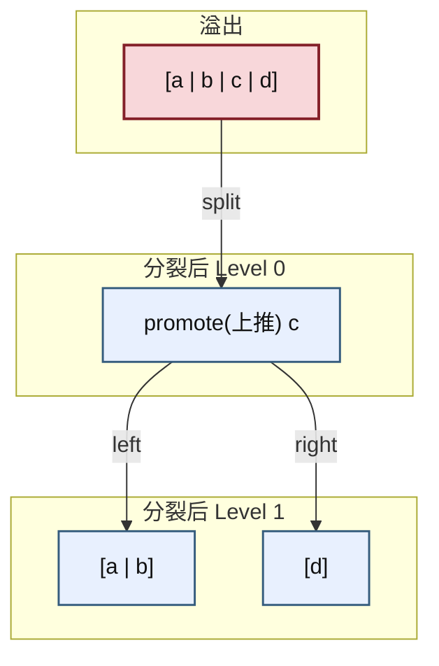
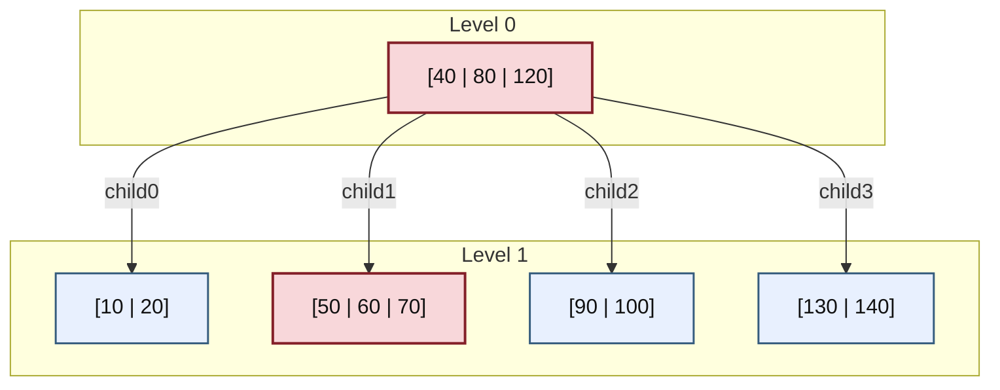
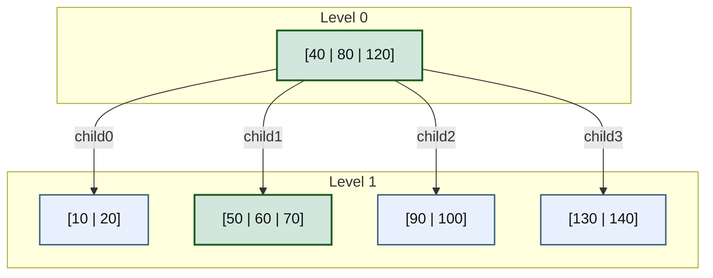
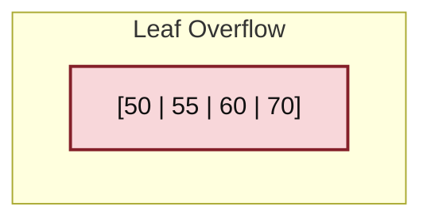
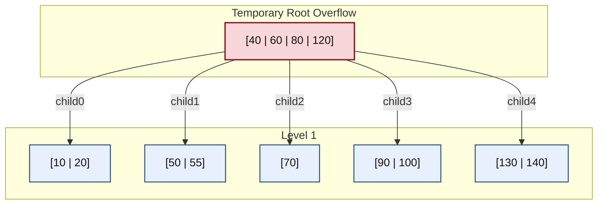
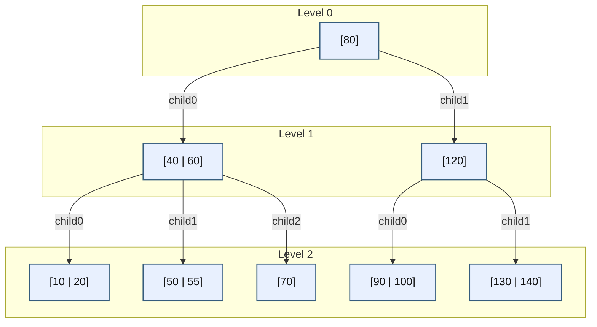
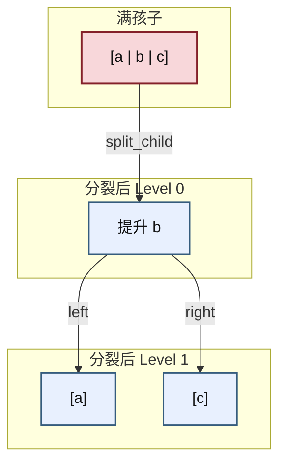
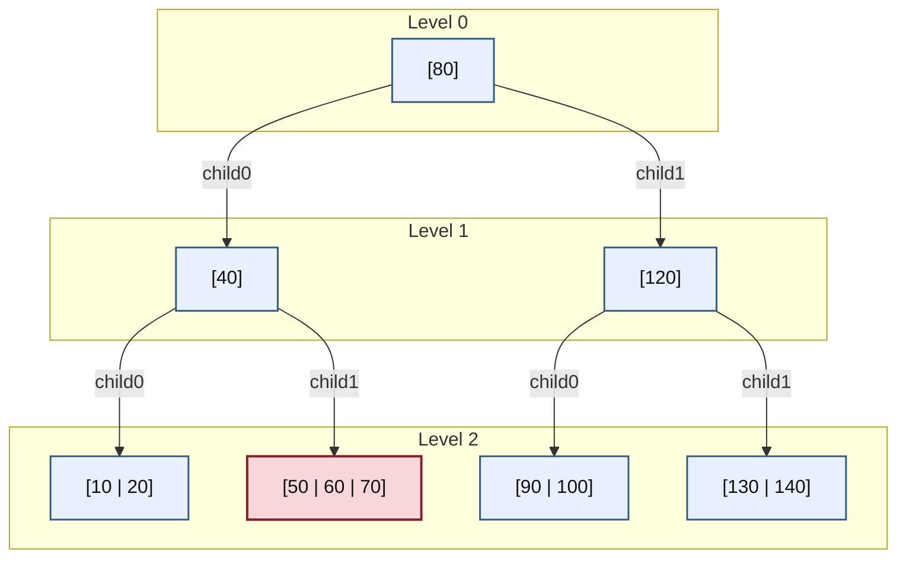
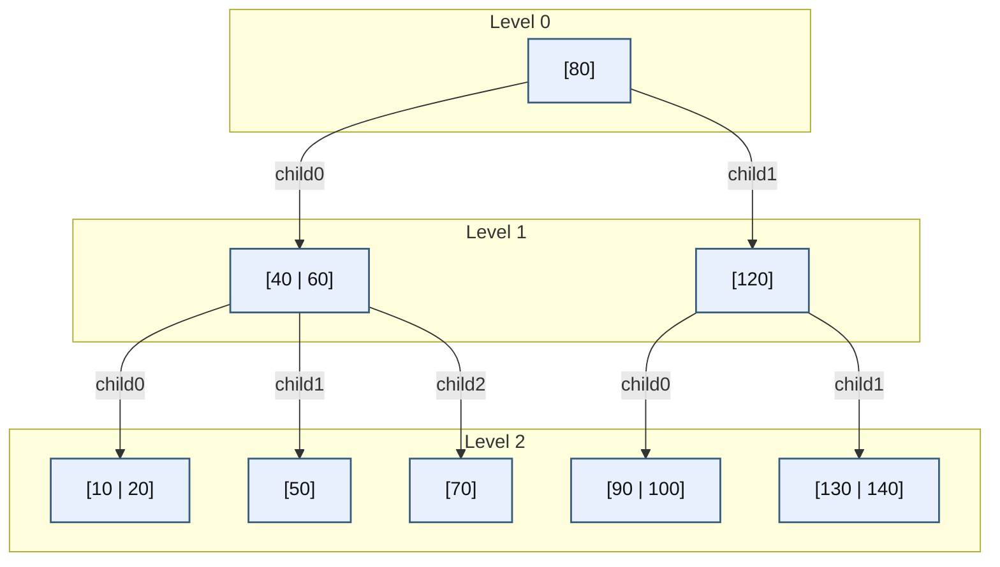

# 第30章\_2-3-4树插入与分裂时机

## 30.1\_满叶子怎样接收一个新键

[P06 查找](P06_2-3-4_树_从多路平衡到红黑树的结构桥梁.md#6.4.7_用完整C程序观察区间下行)已经确定目标应该进入哪个区间。现在叶子 [50|60|70] 还要接收 55，三个键槽已经用完。直接加第四个键破坏容量，另挂一层又破坏所有叶子同层；因此需要把一个分隔键交给父，把原区间拆成两个同层节点。

本章先保留这个“插入造成溢出，再向上报告”的过程，再比较“下降之前先拆满节点”。唯一键、严格区间和同层叶子都沿用 P06；两个版本各自完整建立以后，才比较状态、提前分裂和失败处理的代价。树归单个调用者独占，本章没有并发更新。

## 30.2\_从叶子落点到两种分裂时机

先让插入真正造成一次溢出，沿父子区间追踪它怎样向上传播；掌握这条过程后，再把分裂移到下降之前。两组推演使用同一个插入 55 的场景，因此能把分裂时机带来的差异与输入不同造成的差异分开。

### 30.2.1\_章节内容说明

2-3-4 树的插入，真正需要讲清楚的，不是“插进去之后图长什么样”，而是下面四件事：

第一，为什么先在叶子寻找新增键的落点，以及分裂如何把某个键继续上推。
第二，节点满了以后，分裂到底按什么规则执行。
第三，为什么有时会一路向上冲击到根。
第四，代码实现时，到底是“先插到底再回头修”，还是“沿途先修再继续下降”。

这一节必须明确：

> **本章比较两种典型组织方式：自底向上插入、自顶向下插入。**

它们的树规则不是两套，
它们的区别只在于：

- **分裂发生的时机不同**
- **代码组织方式不同**
- **中间是否允许出现临时溢出节点不同**

因此，本节分成两部分来讲：

1. **自底向上插入**
2. **自顶向下插入**

每一种都给出：

- 核心思想
- 图示过程
- 算法代码

先手工推演，再把同一初始树交给完整程序；图说明关键字和区间去向，程序补上容量、返回值和失败条件。

------

### 30.2.2\_自底向上插入

#### (1)\_核心思想

自底向上插入的组织方式是：

1. 先按查找规则一直下降到目标叶子；
2. 在叶子里尝试插入新关键字；
3. 若叶子因此溢出，则分裂该叶子；
4. 中位关键字上推到父节点；
5. 若父节点也因此溢出，则继续向上修；
6. 修复沿祖先链一路向上传播，直到某一层不再溢出，或传播到根。

因此，自底向上插入最适合讲清楚下面这条因果链：

> **叶子插入 → 节点溢出 → 分裂 → 上推 → 继续分裂**

它的优点是结构传播关系非常直观。
它的难点是代码实现时需要处理“递归返回分裂结果”。

------

#### (2)\_本小节必须固定的代码约定

如果你要把自底向上写成代码，就必须先把“溢出节点如何分裂”说死。
否则像 `[40 | 60 | 80 | 120]` 这种 4-key 临时溢出节点，到底提升 `60` 还是 `80`，代码根本不唯一。

因此，本小节统一采用下面这条**确定性规则**：

> 对于一个按升序排列的 4-key 临时溢出节点
> `[a | b | c | d]`
> **提升上中位数 `c`**，分裂成：
>
> - 左节点 `[a | b]`
> - 右节点 `[d]`

也就是说：

```text
[a | b | c | d]
=> promote c
=> left  = [a | b]
=> right = [d]
```

这个约定必须在本小节一开始就固定，否则后面的代码与图示都不唯一。

请注意：

- 这只是**本小节自底向上实现的固定约定**
- 它不是唯一可能的数学分裂方式
- 但它必须是**代码中的唯一规则**

------

#### (3)\_自底向上的局部分裂图

先看一个最小局部图，固定“4-key 临时溢出如何分裂”。



这个图对应的不是“理论想象”，而是你后面代码里必须写死的一条规则。

------

#### (4)\_自底向上完整示例

下面给一个完整示例，展示：

- 插入先到叶子；
- 叶子溢出；
- 上推冲击到根；
- 根再分裂。

设当前树为：

- 根：`[40 | 80 | 120]`
- 四个叶子孩子分别为：
  - `[10 | 20]`
  - `[50 | 60 | 70]`
  - `[90 | 100]`
  - `[130 | 140]`

现在插入 `55`。



##### 1)\_第一步\_查找到目标叶子

`55` 满足：

- `40 < 55 < 80`

所以应进入 `child1`，也就是叶子 `[50 | 60 | 70]`。

这一点先用路径图标出来：



##### 2)\_第二步\_叶子先插入\_形成临时溢出

自底向上写法里，先落到叶子再处理。
因此会先把 `55` 插入叶子 `[50 | 60 | 70]` 中，形成一个临时 4-key 溢出节点：

```text
[50 | 55 | 60 | 70]
```

把这个中间状态单独画出来：



注意：

> 这个节点已经不是合法的 2-3-4 树节点。
> 它只是自底向上插入过程中，叶子“先插入、后修复”的临时溢出状态。

##### 3)\_第三步\_分裂叶子\_并向父节点上推

根据本小节固定规则：

```text
[50 | 55 | 60 | 70]
=> promote 60
=> left  = [50 | 55]
=> right = [70]
```

于是，原根 `[40 | 80 | 120]` 接收 `60` 后，临时变为：

```text
[40 | 60 | 80 | 120]
```

并且孩子变成五个：

- `[10 | 20]`
- `[50 | 55]`
- `[70]`
- `[90 | 100]`
- `[130 | 140]`

临时状态如下：



##### 4)\_第四步\_根节点继续分裂

根现在是一个临时 4-key 溢出节点：

```text
[40 | 60 | 80 | 120]
```

仍按本小节固定规则：

```text
promote 80
left  = [40 | 60]
right = [120]
```

于是得到最终树：



这个例子完整体现了自底向上的特征：

- 先落到叶子；
- 叶子先溢出；
- 分裂后向上推；
- 根再被冲击并分裂。

------

#### (5)\_自底向上插入算法代码

下面先保留分裂传播的伪代码。其共同前提是：输入键尚不存在，当前树合法，临时数组能装 4 键/5 孩子，所有 create_* 所需节点已由入口准备，因此更新期间不会分配失败。这个前提必须由可运行版本兑现；后面的完整程序先只读查重和容量预检，再允许进入这些修改步骤。以下片段不具备独立翻译单元所需的全部定义。

下面给出一种适合直接编码的伪代码写法。
它采用的是**自底向上插入**思路，也就是：

1. 先递归下降到目标叶子；
2. 叶子先尝试插入；
3. 若叶子溢出，则在当前层完成分裂；
4. 把“分裂结果”返回给父节点；
5. 父节点接收后若也溢出，则继续向上分裂；
6. 一直传播到根，必要时创建新根。

这里的临时 4-key 不是向只有三个槽的数组越界写入；临时存储容量必须先扩大，或者使用独立暂存区。完整程序选择四键/五孩子数组，同时只允许操作返回后最多三个活动键。

它的核心思想可以概括成一句话：

> **递归函数不仅负责“往下插入”，还负责把“子树分裂结果”往上带回。**

------

##### 1)\_返回结构

```cpp
struct split_result {
	bool 	 did_split;   // 当前节点是否发生了分裂
	int 	 promote_key; // 若分裂，则需要向父节点上推的关键字
	node_234 *right_node; // 若分裂，则新产生的右兄弟节点
};
```

###### a)\_解释

这个结构的作用，是让递归函数在“返回上一层”时，顺便把分裂信息一并带回去。

如果某个子节点没有分裂，那么父节点什么都不用做：

```cpp
{ false, 0, nullptr }
```

如果某个子节点分裂了，那么父节点就必须知道三件事：

1. **确实发生了分裂**
2. **哪个 key 要插入到父节点**
3. **新产生的右兄弟是谁**

因此这里不是普通“插入成功/失败”的返回值，而是一个**插入 + 修复传播状态**。

------

##### 2)\_递归插入伪代码

```cpp
split_result insert_bottom_up(node_234 *node, int key)
{
	int i = 0;

	// 在当前节点中找到 key 应该进入的孩子编号 i
	// 若当前节点 keys = [k0, k1, ...]，则最终会找到：
	// child[i] 是 key 所属的目标子树
	while (i < node->key_count && key > node->keys[i])
		++i;

	// 情况 1：当前节点已经是叶子
	// 那么自底向上的做法就是：先把 key 插进去，再判断是否溢出
	if (node->leaf) {
		insert_key_into_node(node, key);

		// 若插入后 key_count <= 3，说明当前节点仍然合法
		// 不需要继续向上修复
		if (node->key_count <= 3)
			return { false, 0, nullptr };

		// 若插入后 key_count == 4，说明当前节点临时溢出
		// 需要在当前层执行分裂，并把分裂结果返回给父节点
		return split_overflow_node(node);
	}

	// 情况 2：当前节点不是叶子
	// 先递归把 key 插入到目标子树中
	split_result child_res = insert_bottom_up(node->child[i], key);

	// 如果子节点没有分裂，说明下面那棵子树已经处理完毕
	// 当前节点无需额外修复，直接返回“未分裂”
	if (!child_res.did_split)
		return { false, 0, nullptr };

	// 如果子节点分裂了，那么当前节点必须“接收”这个分裂结果：
	// 1. 把 promote_key 插入到当前节点的 keys[]
	// 2. 把 right_node 挂到正确的位置
	insert_promote_into_parent(node, i, child_res.promote_key, child_res.right_node);

	// 接收完子节点的上推之后，检查当前节点自己是否溢出
	if (node->key_count <= 3)
		return { false, 0, nullptr };

	// 如果当前节点也溢出了，则继续在当前层分裂，
	// 把新的分裂结果再向上一层返回
	return split_overflow_node(node);
}
```

###### a)\_解释

这段代码可以按“叶子逻辑”和“内部节点逻辑”两部分理解。

------

###### b)\_第一部分\_叶子逻辑

如果当前节点是叶子，那么说明查找已经到底了。
这时自底向上的策略是：

- **先插入**
- **再检查是否溢出**

所以叶子部分的流程是：

1. 调用 `insert_key_into_node(node, key)`，把 key 插入当前叶子；
2. 若当前节点插入后仍然只有 1~3 个 key，则合法，直接返回“不分裂”；
3. 若当前节点插入后变成 4 个 key，则说明发生临时溢出，调用 `split_overflow_node()` 在当前层分裂，并把结果返回给父节点。

这正是“自底向上”的本质特征：

> **先让叶子出问题，再把问题往上交。**

------

###### c)\_第二部分\_内部节点逻辑

如果当前节点不是叶子，那么当前层本身不直接插入 key，
而是先递归把 key 插到某个子节点中去。

这里的关键点是：

> **内部节点并不直接知道子树内部发生了什么，它只能通过 `child_res` 来知道子树是否分裂。**

所以内部节点的处理流程是：

1. 递归下降到目标子树；
2. 看 `child_res.did_split`：
   - 若为 `false`，说明子树已经插完且未分裂，当前层不用管；
   - 若为 `true`，说明子树裂开了，当前层必须接住上推的 key 和新右兄弟；
3. 接住后，当前节点自己也可能因此溢出；
4. 若自己也溢出，则继续分裂并把结果往上返回。

也就是说，这段代码把“向下插入”和“向上修复”合在了一个递归函数里完成。

------

##### 3)\_顶层入口伪代码

```cpp
void tree_insert_bottom_up(tree_234 &tree, int key)
{
	// 空树情况：直接创建根节点
	if (tree.root == nullptr) {
		tree.root = create_leaf_with_one_key(key);
		return;
	}

	// 从根开始执行自底向上插入
	split_result res = insert_bottom_up(tree.root, key);

	// 如果根节点最终没有分裂，那么整棵树已经修复完毕
	if (!res.did_split)
		return;

	// 如果根节点也分裂了，就说明原根已经无法继续作为根存在
	// 此时必须新建一个根节点，把上推 key 放进去
	node_234 *new_root = create_internal_node();
	new_root->key_count = 1;
	new_root->keys[0] = res.promote_key;

	// 新根的左孩子仍然是“原来的根（被截断后的左半部分）”
	new_root->child[0] = tree.root;

	// 新根的右孩子是根分裂后新产生的右兄弟
	new_root->child[1] = res.right_node;

	// 更新整棵树的根指针
	tree.root = new_root;
}
```

###### a)\_解释

顶层入口的作用很单纯：

- 先调用递归插入；
- 最后只关心一件事：**原来的根有没有分裂**。

如果根没有分裂，那么树高不变，事情结束。
如果根分裂了，说明整个分裂传播已经冲到了最顶层。

这时原来的根已经不够当根用了，因此必须：

1. 新建一个根节点；
2. 把根分裂产生的 `promote_key` 放到新根中；
3. 把旧根当作新根左孩子；
4. 把新生成的右兄弟挂到新根右边。

这也是为什么：

> **只有根分裂，才会让树高增加 1。**

因为只有在这里增加了原根之上的一层；新节点来自堆、节点池还是其他分配器，不改变这个结构事实。

------

##### 4)\_溢出节点分裂伪代码

这里明确使用本小节固定规则：

> 对 `[a | b | c | d]` 提升 `c`。

```cpp
split_result split_overflow_node(node_234 *node)
{
	// 假设 node 当前临时有 4 个 key：k0, k1, k2, k3
	// 本小节固定规则：提升 k2
	int promote = node->keys[2];

	// 新建右兄弟节点，叶子属性与当前节点一致
	node_234 *right = create_node(node->leaf);

	// 右节点拿最右边的 key：k3
	right->key_count = 1;
	right->keys[0] = node->keys[3];

	if (!node->leaf) {
		// 如果当前节点不是叶子，那么分裂时不仅要分 key，还要分孩子
		// 固定规则如下：
		// left  保留 child0, child1, child2
		// right 得到 child3, child4
		right->child[0] = node->child[3];
		right->child[1] = node->child[4];
	}

	// 左节点保留 k0, k1
	// 这里不需要真的搬动 k0, k1，因为它们本来就在 node 里
	// 只要把 key_count 截断为 2，就等价于左边保留 [k0, k1]
	node->key_count = 2;

	// 返回给父节点：
	// 1. 当前节点发生了分裂
	// 2. 需要上推的 key 是 promote
	// 3. 新产生的右兄弟是 right
	return { true, promote, right };
}
```

###### a)\_解释

这个函数是整个自底向上插入里最关键的“局部修复动作”。

它做的事情可以概括成三步：

1. **决定谁上推**
2. **构造右兄弟**
3. **截断左节点**

------

###### b)\_第一步\_决定谁上推

当前临时溢出节点有 4 个 key：

```text
[k0 | k1 | k2 | k3]
```

本小节规定提升 `k2`，
也就是把第三个 key 作为向父节点报告的 `promote_key`。

这一步如果不先固定，后面的代码根本没法唯一实现。

------

###### c)\_第二步\_构造右兄弟

右兄弟只拿最右边的 key：

```text
[k3]
```

如果当前节点不是叶子，还必须把最右边两棵孩子也移交给右兄弟。
因为 key 分开了，孩子区间也必须跟着重新分配。

------

###### d)\_第三步\_截断左节点

左节点保留：

```text
[k0 | k1]
```

这里代码没有显式地再复制一份左节点，
因为当前 `node` 本身就继续充当左节点。
只要把 `key_count` 改成 `2`，活动键区间就变成左半部分；孩子所有权也必须按新的活动数量解释。完整程序还清掉已经移交的非活动孩子槽，避免后续代码误把旧指针当成仍由左半拥有。

所以这段代码体现的是一个常见工程技巧：

> **分裂时往往复用原节点作为左节点，只新建右节点。**

相对于为左右两半各申请一个新对象，这次局部分裂只需新增右半对象。若还要创建新根，仍须另计；不能把局部少申请一个节点泛化为整个操作的内存减少一半。

------

##### 5)\_这一组代码整体上到底在做什么

把这四段代码连起来看，其实就是一个完整的“递归上传修复协议”：

- 叶子先插入；
- 叶子若溢出，则本层分裂；
- 分裂结果返回给父节点；
- 父节点接住后，若自己也溢出，则继续分裂；
- 一直传播到根；
- 根若分裂，则新建根。

你可以把它理解成一条非常稳定的控制流：

```text
先往下找到叶子
-> 再从出问题的地方开始逐层往上修
-> 若根也被冲击，则补一个新根
```

这就是“自底向上插入”的代码本质。

------

### 30.2.3\_自顶向下插入

#### (1)\_核心思想

自顶向下插入与自底向上最大的区别，不在“树规则”，而在“分裂时机”。

它的组织方式是：

1. 从根开始下降；
2. 每次准备进入某个孩子前，先检查该孩子是否已满；
3. 如果目标孩子已满，就**先分裂这个孩子**；
4. 分裂后，当前父节点会新增一个关键字，于是重新判断接下来应走左边还是右边；
5. 始终保证：真正进入的下一个节点一定不是满节点；
6. 最终到达叶子时，叶子一定非满，因此可以直接完成插入。

因此，自顶向下插入的核心不变量是：

> **下降过程中不进入满节点。**

这把修复放在下降前，使主插入过程不需要递归上传分裂结果；代价是可能预先分裂本次插入本来不会撑爆的祖先。

------

#### (2)\_本小节必须固定的代码约定

自顶向下插入时，不允许先出现 4-key 临时溢出节点再去决定“提升谁”。
它分裂的对象永远是一个**合法的满节点**，即恰好 3 个 key 的节点。

对于一个满节点：

```text
[a | b | c]
```

本小节固定规则是：

> **提升中间关键字 `b`**

分裂为：

- 左节点 `[a]`
- 右节点 `[c]`

即：

```text
[a | b | c]
=> promote b
=> left  = [a]
=> right = [c]
```

这个规则与标准 B-tree `split_child()` 写法一致。
它是唯一的、无歧义的，因为 3-key 节点只有一个中间关键字。

这里必须再强调一次：

- 自顶向下分裂的是**满节点**
- 满节点只有 3 个 key
- 所以“谁上推”在代码里是唯一确定的

这正是它比自底向上更容易直接编码的一个重要原因。

------

#### (3)\_自顶向下的局部分裂图

先固定局部规则：



这张图对应的，就是后面代码里的 `split_child(parent, i)` 逻辑。

需要注意的是，这张图表达的不是“父节点自己被分裂”，而是：

> **父节点的第 `i` 个孩子被分裂，其中间 key 被插入父节点。**

也就是说，`split_child(parent, i)` 的语义是：

- `parent->child[i]` 原来是满节点 `[a | b | c]`
- 分裂后：
  - 左半部分仍留在 `child[i]`
  - 新生成右兄弟挂到 `child[i + 1]`
  - `b` 被插入 `parent->keys[]`

------

#### (4)\_自顶向下完整示例

仍然使用与前面相同的初始树和相同的插入关键字 `55`，这样你能直接比较两种方法的区别。

设当前树为：

- 根：`[40 | 80 | 120]`
- 四个叶子孩子分别为：
  - `[10 | 20]`
  - `[50 | 60 | 70]`
  - `[90 | 100]`
  - `[130 | 140]`


##### 1)\_第一步\_根已满\_先分裂根

在 **自顶向下插入** 中：

> **只要根节点已满，就先分裂根。**

它不是因为当前插入的 `55` 已经“算出来一定会把根撑爆”。
 而是因为自顶向下算法要强行维持一个不变量：

> **后续下降过程中，不进入满节点。**

根节点是整条下降路径的起点。

> 如果根本身就是满节点，那么它首先就不满足这条不变量，所以必须先处理。

根是满节点 `[40 | 80 | 120]`，
自顶向下写法会在下降前先分裂根。

按固定规则：

```text
[40 | 80 | 120]
=> promote 80
=> left  = [40]
=> right = [120]
```

得到：



此时根已经稳定，后面 `60` 不会再有机会去决定“谁做新根”。

这一步非常关键，因为它说明：

> 自顶向下代码不会先把根变成一个 4-key 临时溢出节点，再临时决定谁上推。
> 它一开始就把满根按固定规则拆开了。

##### 2)\_第二步\_继续查找\_准备进入目标孩子

插入 `55`：

- 在根 `[80]` 中比较，`55 < 80`，进入左子树 `[40]`
- 在 `[40]` 中比较，`55 > 40`，准备进入右孩子 `[50 | 60 | 70]`

但该目标孩子已经满了。
所以自顶向下算法不会立即进入，而是**先分裂这个孩子**。

这里要注意，当前的控制顺序是：

1. 先决定目标孩子是谁；
2. 检查该孩子是否满；
3. 若满，则在当前层先拆这个孩子；
4. 再决定继续往哪边走。

不是“先走进去，再看里面怎么裂”。

##### 3)\_第三步\_分裂目标孩子\_再重新判定路径

对满孩子 `[50 | 60 | 70]` 分裂：

```text
[50 | 60 | 70]
=> promote 60
=> left  = [50]
=> right = [70]
```

`60` 上推到父节点 `[40]`，父变成 `[40 | 60]`。

局部结构变为：



现在重新判断 `55` 的去向：

- `40 < 55 < 60`

所以它应进入中间孩子 `[50]`。

这里必须重新判断路径，原因是：

> 分裂前，父节点只有 `[40]`
> 分裂后，父节点变成 `[40 | 60]`
> 区间划分已经改变，因此不能沿用分裂前的孩子编号。

这也是自顶向下实现里最容易漏掉的一步。

##### 4)\_第四步\_最终在非满叶子中落位

当前叶子 `[50]` 不是满节点，
所以直接插入：

```text
[50] -> [50 | 55]
```

最终得到：


这个例子说明：

- 根先分裂；
- 后面子节点再分裂；
- 最终新 key 仍然只是在叶子中落位；
- 整个过程中，不会出现“先有 `[40 | 60 | 80 | 120]` 再决定谁做根”的代码状态。

------

#### (5)\_自顶向下插入算法代码

本组伪代码沿用“键已查重、资源已准备”的前提；否则分裂后遇到相等键还继续下降，会把集合变成含重复键的结构。入口先查重也让 duplicate 返回时保证树形不变。

自顶向下写法最经典的结构，就是：

- 若根满，先 `split root`
- 之后调用 `insert_non_full()`
- 在 `insert_non_full()` 里，下降前若目标孩子满，则先 `split_child()`

它和自底向上最大的代码差别在于：

> **它不需要通过返回值把分裂结果往上传。**
> 因为每次分裂都在“下降之前”已经处理完了。

在 **自顶向下插入** 中：

> **只要根节点已满，就先分裂根。**

它不是因为当前插入的 节点 已经“算出来一定会把根撑爆”。
 而是因为自顶向下算法要强行维持一个不变量：

> **后续下降过程中，不进入满节点。**

根节点是整条下降路径的起点。
 如果根本身就是满节点，那么它首先就不满足这条不变量，所以必须先处理。

##### 1)\_顶层入口伪代码

当前接口只处理根节点，不适用处理子树根节点的通用情况：

```cpp
void tree_insert_top_down(tree_234 &tree, int key)
{
	// 空树情况：直接创建一个只有 1 个 key 的叶子根节点
	if (tree.root == nullptr) {
		tree.root = create_leaf_with_one_key(key);
		return;
	}

	// 如果根节点已满，则不能直接往下走
	// 必须先拆根，保证后续下降时不会进入满节点
	if (tree.root->key_count == 3) {
		node_234 *new_root = create_internal_node();

		// 旧根先挂到新根的 child0，随后 split_child() 会把它拆开
		new_root->child[0] = tree.root;

		// 分裂 old root：
		// old root = [a | b | c]
		// promote b
		// left = [a], right = [c]
		split_child(new_root, 0);

		// 分裂之后，新根就成为整棵树的新入口
		tree.root = new_root;
	}

	// 经过上面的处理后，root 一定不是满节点
	// 于是可以安全地进入“向非满节点插入”的流程
	insert_non_full(tree.root, key);
}
```

###### a)\_解释

这段代码只做两件事：

第一，处理空树。
第二，处理“根已满”的特殊情况。

这里最关键的是第二点。
因为自顶向下插入要求：

> **下降时不进入满节点。**

而根节点正是整条下降路径的起点。
所以如果根本身已满，就必须在任何递归下降之前先把它分裂掉。

这也是为什么自顶向下代码里，根分裂会显得“发生得很早”：
不是因为根在结构上更特殊，而是因为代码组织要求先把入口节点处理成非满状态。

##### 2)\_insert\_non\_full\_伪代码

在这里就是在递归解决子树根节点，查找、裂变判断和插入操作。

```cpp
void insert_non_full(node_234 *node, int key)
{
	// 情况 1：当前节点是叶子
	// 由于自顶向下算法保证“进入的节点一定不是满节点”，
	// 因此这里可以直接插入，不必再担心叶子溢出
	if (node->leaf) {
		insert_key_into_node(node, key);
		return;
	}

	// 情况 2：当前节点不是叶子
	// 先找出 key 应当进入哪个孩子
	int i = find_child_index(node, key);

	// 如果目标孩子是满节点，则不能直接进入
	// 必须先分裂这个孩子
	if (node->child[i]->key_count == 3) {
		split_child(node, i);

		// 分裂之后，原 child[i] 被拆成：
		// left child  仍在 child[i]
		// right child 挂到 child[i+1]
		// 同时中间 key 被提升到了 node->keys[i]
		//
		// 这时必须重新判断 key 应进入左边还是右边
		if (key > node->keys[i])
			++i;
	}

	// 经过上面的处理后，node->child[i] 一定不是满节点
	// 可以安全地继续递归下降
	insert_non_full(node->child[i], key);
}
```

###### a)\_解释

这段代码是自顶向下插入的主体。
它的控制流可以概括成一句话：

> **先检查前方节点是否合法，再决定是否进入。**

如果当前节点是叶子，那么说明已经到达最终落点。
而由于前面已经保证不会进入满节点，因此这里可以直接插入，不需要再判断是否分裂。

如果当前节点是内部节点，那么必须先找到目标孩子编号 `i`。
但找到以后还不能立刻进入它，而是要先检查：

```cpp
node->child[i]->key_count == 3
```

若这个孩子已满，则必须先调用 `split_child(node, i)`。
分裂后，父节点结构改变，因此还要重新判断 key 应进入左子还是右子。
这就是：

```cpp
if (key > node->keys[i])
	++i;
```

这一句的来源。

所以这里最本质的逻辑不是“向下递归”，而是：

> **递归之前先修路。**

##### 3)\_split\_child\_伪代码

这里明确对应规则：

```text
[a | b | c]
=> promote b
=> left  = [a]
=> right = [c]
```

```cpp
void split_child(node_234 *parent, int i)
{
	// parent->child[i] 必须是一个满节点
	node_234 *full = parent->child[i];

	// 新建右兄弟，叶子属性与原节点一致
	node_234 *right = create_node(full->leaf);

	// 满节点 full 当前有 3 个 key：
	// full = [a | b | c]
	// 固定规则：提升中间 key b
	int promote = full->keys[1];

	// 右兄弟拿最右边 key c
	right->key_count = 1;
	right->keys[0] = full->keys[2];

	// 原节点 full 继续作为左节点，只保留最左边 key a
	full->key_count = 1;

	// 如果 full 不是叶子，则孩子也要跟着重分配
	// 原来:
	// full.child[0], full.child[1], full.child[2], full.child[3]
	// 分裂后:
	// left  保留 child0, child1
	// right 得到 child2, child3
	if (!full->leaf) {
		right->child[0] = full->child[2];
		right->child[1] = full->child[3];
	}

	// 现在需要把 promote 插入到 parent 的 keys[] 中，
	// 并把 right 插入到 parent 的 child[] 中
	insert_key_and_right_child_into_parent(parent, i, promote, right);
}
```

###### a)\_解释

`split_child()` 是自顶向下写法中最关键的局部修复操作。
它的语义不是“把当前节点分裂”，而是：

> **把当前节点的第 `i` 个满孩子分裂。**

这点一定要理解清楚。

它做的事情可以拆成四步：

第一，读取满孩子 `full = parent->child[i]`。
第二，取出其中间 key `full->keys[1]` 作为上推 key。
第三，复用原节点作为左节点，新建一个右兄弟节点。
第四，把上推 key 插入 `parent`，把新右兄弟挂到 `parent->child[i+1]`。

如果被分裂的是内部节点，还必须同步搬迁孩子。
否则 key 分裂以后，孩子区间就会错位。

这段代码最重要的价值在于：

> **它让“上推谁”这件事完全由数组下标决定，而不是靠图形想象。**

所以当你在代码里看到：

```cpp
int promote = full->keys[1];
```

你就应当立刻理解：

- 这里不是“随便选一个”
- 也不是“看图哪个更顺眼”
- 而是**满节点只有 3 个 key，中间 key 唯一确定**

------

### 30.2.4\_两种方式的关系

#### (1)\_它们的树规则不是两套

无论自底向上还是自顶向下，下面这些规则都不变：

- 先按搜索区间找到叶子落点；自底向上分裂可能继续把新键本身上推，最终位置未必仍在叶子；
- 内部节点关键字增加仍然来自子节点分裂上推；
- 容量必须保持在上界内；何时处理满节点由具体组织方式决定；
- 根分裂是唯一会使整棵树增高的分裂。

所以它们不是两种不同的树。

------

#### (2)\_它们的区别只在分裂时机

##### 1)\_自底向上

- 先落叶；
- 叶子先溢出；
- 然后回头一路向上修。

##### 2)\_自顶向下

- 沿途先拆满节点；
- 不进入满孩子；
- 到叶子时直接稳定落位。

所以它们的核心差别不是“树规则变了”，而是：

> **修复动作到底安排在“问题发生之后”，还是“问题发生之前”。**

------

#### (3)\_按状态和代价选择组织方式

如果希望主更新只向下走，可以选择预分裂：进入孩子前它必定非满，父节点也有接收上推键的空间。但这个简单条件需要付出提前分裂的成本。例如根满而目标叶子未满，自底向上可能只在叶子添键，预分裂仍先拆根。

如果希望只在本次插入造成溢出后修复，可以保留自底向上的传播：需要临时第四个键槽、第五个孩子槽，以及返回上推键/右兄弟的状态。两者都要处理重复键和资源不足，这些责任不会因递归改为循环而消失。

还要区分结构合法与形状唯一。对初始叶子 [10|20|30] 插入 25，本章自底向上规则从 [10|20|25|30] 提升 25；自顶向下先把旧满叶提升 20，再把 25 插入右半。两种结果都合法，却不相同。前面的 55 示例恰好得到同一最终形状，不能据此推断所有输入都一样。

------

### 30.2.5\_本节小结

这一节必须记住下面七点。

第一，本章比较 **自底向上** 与 **自顶向下** 两种典型组织方式，不把它们当作所有可能实现的穷举。
第二，两者的树规则相同，区别只在于**何时分裂**。
第三，自底向上是“先插到底，再回头修”，因此更容易展示结构传播链。
第四，自顶向下是“沿途先修，再继续下降”，使下降前提更简单，但可能提前增加节点。
第五，自底向上若允许出现 4-key 临时溢出节点，就必须事先固定“提升谁”的代码规则。
第六，自顶向下分裂的对象始终是合法满节点 `[a | b | c]`，提升的始终是唯一的中间关键字 `b`。
第七，选择依据包括传播状态、临时容量、允许提前分裂的代价及资源失败契约；不能仅凭哪个伪代码较短判断工程上总是更好。

------


## 30.3\_运行完整的两种插入

图中初始树要相同，才能比较分裂时机。下面先直接构造根 [40|80|120] 和四个叶子，再分别插入 55；随后用空树依次插入 10、20、30、25，观察两种合法形状的差异。完整材料为 [tree234_insert.cpp](../../../../labs/kernel/tree_basics/materials/tree234_insert.cpp)。

程序用 64 个节点组成的固定池拥有对象，孩子和根只是借用地址。没有逐节点堆分配，也没有更新中途的堆申请失败；退出作用域时整个池一起结束寿命。它不提供删除、持久化或共享读者。禁止复制 tree_234，因为默认复制会让内部指针仍指向旧池。

入口的只读 plan_insert 同时查重和计算此次需要多少新节点。自底向上只数从叶子起连续满的祖先，传播碰到非满节点就结束；若一直数到根，还需要一个新根。自顶向下则数原查找路径上的每个满节点，根满时另加一个新根。拆分会把原孩子区间重新分组，但目标仍进入其中原来所属的孩子子树，因此这次只读路径能确定将被预分裂的满节点数量。

在树不被其他写者修改的前提下，容量不足就直接返回，尚未修改任何键、孩子槽或根；容量足够才开始实际插入。这个协议多走了一次查找路径，换来 duplicate/no_capacity 都保持原树不变。它是本教学实现选择的失败契约，不是所有 2-3-4 树必须使用的唯一方案。

```cpp
#include <array>
#include <cassert>
#include <cstddef>
#include <iostream>

/* 节点池拥有所有节点；树中的指针只借用池内地址。 */
constexpr std::size_t pool_capacity = 64;

struct node_234 {
    unsigned int key_count = 0;
    bool leaf = true;
    std::array<int, 4> keys{};               // 第四槽只供自底向上的临时溢出
    std::array<node_234 *, 5> child{};       // 内部溢出时临时有五个孩子
};

struct tree_234 {
    std::array<node_234, pool_capacity> pool{};
    std::size_t used = 0;
    std::size_t limit = pool_capacity;
    node_234 *root = nullptr;

    tree_234() = default;
    tree_234(const tree_234 &) = delete;    // 复制对象会让内部指针仍指向旧池
    tree_234 &operator=(const tree_234 &) = delete;
};

enum class insert_result { inserted, duplicate, no_capacity };
enum class insert_mode { bottom_up, top_down };

static node_234 *take_node(tree_234 &tree, bool leaf)
{
    /* 只能在入口已经完成容量预检后调用。 */
    assert(tree.used < tree.limit && tree.limit <= pool_capacity);
    node_234 *node = &tree.pool[tree.used++];
    *node = node_234{};
    node->leaf = leaf;
    return node;
}

static unsigned int find_slot(const node_234 *node, int key)
{
    unsigned int i = 0;
    while (i < node->key_count && node->keys[i] < key)
        ++i;
    return i;
}

struct insert_plan {
    bool duplicate = false;
    std::size_t new_nodes = 0;
};

static insert_plan plan_insert(const tree_234 &tree, int key, insert_mode mode)
{
    if (!tree.root)
        return {false, 1};
    std::array<const node_234 *, pool_capacity> path{};
    std::size_t depth = 0, full_count = 0;
    const node_234 *node = tree.root;
    while (node) {
        assert(depth < path.size());
        path[depth++] = node;
        unsigned int i = find_slot(node, key);
        if (i < node->key_count && node->keys[i] == key)
            return {true, 0};
        if (node->key_count == 3)
            ++full_count;
        node = node->leaf ? nullptr : node->child[i];
    }
    if (mode == insert_mode::top_down) {
        /* 原路径上的每个满节点都会预分裂；满根还需一个新根。 */
        return {false, full_count + (tree.root->key_count == 3 ? 1U : 0U)};
    }
    std::size_t splits = 0;
    while (depth && path[depth - 1]->key_count == 3) {
        ++splits;
        --depth;
    }
    /* 只有从叶到根都满，传播才会穿过根并新增一层。 */
    return {false, splits + (depth == 0 ? 1U : 0U)};
}

static void insert_key(node_234 *node, unsigned int index, int key)
{
    assert(node->key_count < 4 && index <= node->key_count);
    for (unsigned int j = node->key_count; j > index; --j)
        node->keys[j] = node->keys[j - 1];
    node->keys[index] = key;
    ++node->key_count;
}

static void attach_right(node_234 *parent, unsigned int index,
                         int key, node_234 *right)
{
    unsigned int old_count = parent->key_count;
    for (unsigned int j = old_count + 1; j > index + 1; --j)
        parent->child[j] = parent->child[j - 1];
    parent->child[index + 1] = right;
    insert_key(parent, index, key);
}

struct split_result {
    bool did_split = false;
    int promote_key = 0;
    node_234 *right_node = nullptr;
};

static split_result split_overflow(tree_234 &tree, node_234 *node)
{
    assert(node->key_count == 4);
    int promote = node->keys[2];             // 固定提升上中位数
    node_234 *right = take_node(tree, node->leaf);
    right->key_count = 1;
    right->keys[0] = node->keys[3];
    if (!node->leaf) {
        right->child[0] = node->child[3];
        right->child[1] = node->child[4];
        node->child[3] = node->child[4] = nullptr;
    }
    node->key_count = 2;                     // 原对象继续拥有左半部分
    return {true, promote, right};
}

static split_result insert_bottom(tree_234 &tree, node_234 *node, int key)
{
    unsigned int i = find_slot(node, key);
    if (node->leaf)
        insert_key(node, i, key);
    else {
        split_result child_result = insert_bottom(tree, node->child[i], key);
        if (!child_result.did_split)
            return {};
        attach_right(node, i, child_result.promote_key, child_result.right_node);
    }
    return node->key_count == 4 ? split_overflow(tree, node) : split_result{};
}

static void split_child(tree_234 &tree, node_234 *parent, unsigned int i)
{
    node_234 *full = parent->child[i];
    assert(parent->key_count < 3 && full->key_count == 3);
    node_234 *right = take_node(tree, full->leaf);
    int promote = full->keys[1];
    right->key_count = 1;
    right->keys[0] = full->keys[2];
    if (!full->leaf) {
        right->child[0] = full->child[2];
        right->child[1] = full->child[3];
        full->child[2] = full->child[3] = nullptr;
    }
    full->key_count = 1;
    attach_right(parent, i, promote, right);
}

static void insert_non_full(tree_234 &tree, node_234 *node, int key)
{
    while (!node->leaf) {
        unsigned int i = find_slot(node, key);
        if (node->child[i]->key_count == 3) {
            split_child(tree, node, i);
            if (key > node->keys[i])
                ++i;
        }
        node = node->child[i];
    }
    insert_key(node, find_slot(node, key), key);
}

static insert_result insert(tree_234 &tree, int key, insert_mode mode)
{
    assert(tree.used <= tree.limit && tree.limit <= pool_capacity);
    insert_plan plan = plan_insert(tree, key, mode);
    if (plan.duplicate)
        return insert_result::duplicate;
    if (plan.new_nodes > tree.limit - tree.used)
        return insert_result::no_capacity;
    std::size_t before = tree.used;
    if (!tree.root) {
        tree.root = take_node(tree, true);
        insert_key(tree.root, 0, key);
    } else if (mode == insert_mode::bottom_up) {
        split_result result = insert_bottom(tree, tree.root, key);
        if (result.did_split) {
            node_234 *new_root = take_node(tree, false);
            new_root->keys[0] = result.promote_key;
            new_root->key_count = 1;
            new_root->child[0] = tree.root;
            new_root->child[1] = result.right_node;
            tree.root = new_root;
        }
    } else {
        if (tree.root->key_count == 3) {
            node_234 *new_root = take_node(tree, false);
            new_root->child[0] = tree.root;
            split_child(tree, new_root, 0);
            tree.root = new_root;
        }
        insert_non_full(tree, tree.root, key);
    }
    assert(tree.used - before == plan.new_nodes);
    return insert_result::inserted;
}

static void print_tree(const node_234 *node, unsigned int depth = 0)
{
    for (unsigned int i = 0; i < depth; ++i)
        std::cout << "  ";
    std::cout << '[';
    for (unsigned int i = 0; i < node->key_count; ++i)
        std::cout << (i ? "|" : "") << node->keys[i];
    std::cout << "]\n";
    if (!node->leaf)
        for (unsigned int i = 0; i <= node->key_count; ++i)
            print_tree(node->child[i], depth + 1);
}

/* 按正文初始图构造，避免两种算法的早期历史造成不同初始树。 */
static void build_example(tree_234 &tree)
{
    assert(!tree.root && tree.used == 0 && tree.limit >= 5);
    static const int leaf_keys[4][3] = {{10, 20, 0}, {50, 60, 70},
                                      {90, 100, 0}, {130, 140, 0}};
    tree.root = take_node(tree, false);
    tree.root->key_count = 3;
    tree.root->keys = {40, 80, 120, 0};
    for (unsigned int i = 0; i < 4; ++i) {
        node_234 *leaf = take_node(tree, true);
        leaf->key_count = i == 1 ? 3 : 2;
        for (unsigned int j = 0; j < leaf->key_count; ++j)
            leaf->keys[j] = leaf_keys[i][j];
        tree.root->child[i] = leaf;
    }
}

int main()
{
    for (insert_mode mode : {insert_mode::bottom_up, insert_mode::top_down}) {
        tree_234 tree;
        build_example(tree);
        insert_plan plan = plan_insert(tree, 55, mode);
        assert(plan.new_nodes == 3);
        tree.limit = tree.used + plan.new_nodes - 1;
        if (insert(tree, 55, mode) != insert_result::no_capacity)
            return 1;
        assert(tree.used == 5 && tree.root->key_count == 3);
        tree.limit = pool_capacity;
        if (insert(tree, 55, mode) != insert_result::inserted ||
            insert(tree, 55, mode) != insert_result::duplicate)
            return 1;
        std::cout << (mode == insert_mode::bottom_up ? "bottom_up" : "top_down")
                  << " nodes=" << tree.used << "\n";
        print_tree(tree.root);
        tree_234 promotion;
        for (int key : {10, 20, 30, 25}) {
            if (insert(promotion, key, mode) != insert_result::inserted)
                return 1;
        }
        std::cout << "promotion root_key=" << promotion.root->keys[0] << "\n";
    }
    return 0;
}
```

前面的伪代码负责看清流程，这份程序补齐具体操作：insert_key 从右往左挪键，attach_right 从右往左挪孩子，再把上推键和右节点放入相邻槽。反向搬移是为了保住尚未复制的源元素。split_overflow 对应临时四键提升第三键，split_child 对应合法满节点提升第二键；剩余非活动键不会被读取，已移交的孩子槽显式清空。

程序中的 limit 可以小于实际池容量，用来确定性制造“本轮资源不够”。例子需要新增三个节点：一个叶子右半、一个原根右半和一个新根。先只允许再取两个，观察失败不改树，再恢复容量完成插入。这里模拟的是固定池容量不足，不是声称处理了 C++ 堆分配异常。

从材料目录执行：

```bash
c++ -std=c++17 -Wall -Wextra -Werror -pedantic tree234_insert.cpp -o tree234_insert
./tree234_insert
```

两组 55 都输出下面这棵八节点树，组名前缀分别是 bottom_up 和 top_down：

```text
[80]
  [40|60]
    [10|20]
    [50|55]
    [70]
  [120]
    [90|100]
    [130|140]
```

随后，promotion 场景分别输出 root_key=25 与 root_key=20。新键 25 在自底向上版本成为内部根，说明“先在叶子插入”不能写成“新键最终必在叶子”。本例普通键集合相同、区间与叶深都合法；具体形状还受分裂时机和中位数选择约定影响。

## 30.4\_沿容量与传播做练习

先把 55 场景的可用新节点数依次设为 0、1、2、3，预测前三次为何都在修改前退出，最后一次为何恰好够用。再查找已经存在的 60：即使根满，也应先返回 duplicate，不允许为了发现重复而先改变根的形状。

接着在纸上选择“根满、目标叶子未满”的输入，分别计算两种方法的新增节点数。自底向上不应为不存在的溢出预先分裂；自顶向下则按本章规则先拆满根。最后沿一次内部节点分裂，把每个孩子的祖先区间写出来，说明为什么上中位分裂保留前三个孩子、转交后两个，而三键预分裂保留前两个、转交后两个。

我们现在能从“目标叶子没有容量”推到两套完整插入过程，并把资源不足放在结构修改前处理。下一步回到[P06 删除单元](P06_2-3-4_树_从多路平衡到红黑树的结构桥梁.md#6.6_2-3-4_树的删除_借位_合并与向下修复)：删除面对的是容量下界，需要借位、合并及可能的根收缩。
