# 第31章\_2-3-4树预修复删除

## 31.1\_从装不下走到不能删空

[P30 插入](P30_2-3-4树插入与分裂时机.md#30.3_运行完整的两种插入)解决了节点容量上界：满叶子接收新键后需要分裂。现在把 [20] 的唯一键删除，留下的空节点无法继续承担子树区间；如果直接摘掉它，又会使同层叶子的路径不同。这次约束来自容量下界。

本章沿用唯一整数键、严格子树区间、叶子等深和单调用者独占，选择“下降前先准备余量”的删除。我们先把借位与合并各自讲清，再处理内部命中和根，最后将原四组例子交给完整 C++ 程序。下一单元再比较删除后向上修复，不把两套控制流混用。

## 31.2\_让下一层保留删除余量

以下先建立局部动作，再让它们进入完整查找路径。每次动作都要同时维护键和它划分的孩子区间；只观察键的顺序，无法发现孩子地址接错这一类问题。

### 31.2.1\_为什么删除比插入更复杂

插入的核心问题是“节点装不下”。
删除的核心问题是“节点删空了怎么办”。

更具体地说，删除有两个复杂点：

1. 删除内部关键字时，不能直接破坏区间划分；
2. 删除后可能导致节点关键字数低于下界。

因此删除通常比插入更难。

------

### 31.2.2\_删除关键字时为什么常常先转换成叶子删除

如果目标关键字位于内部节点，直接删掉会破坏该节点对子树的区间划分。
所以常见处理方式是：

- 用前驱替换；
- 或用后继替换；
- 然后转成叶子层删除。

这样真正执行“物理删掉一个关键字”的位置，通常落在叶子层。

------

### 31.2.3\_删除前为什么要先保证\_下行路径不落到\_2-node

2-node 只有 1 个关键字。
如果直接删掉一个非根叶子 2-node 的唯一键，它会留下 0-key 节点，违反容量下界。只经过内部 2-node 并不意味着一定把它删空，但它若向下一层合并捐出唯一分隔键，也会失去全部键。根是例外：单键根叶删除后可变成空树，内部根可在失去最后一个键后收缩。

本单元选择自顶向下预修复，维持以下稳定纪律；下一单元再讨论允许暂时下溢的自底向上方式：

> **下降之前，保证即将进入的孩子不是 2-node。**

如果它是 2-node，就必须先修复，再进入。

这与插入中的“下降前不进入满节点”是对偶关系。

------

### 31.2.4\_什么叫借位(redistribution)

借位的含义是：

- 当前准备进入的孩子是 2-node；
- 但它的某个兄弟不是最小节点，而是还有多余关键字；
- 于是从兄弟那边“借”一个关键字，通过父节点重新分配。

例如：

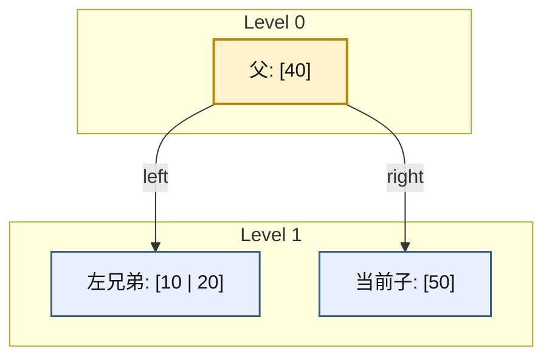

借位后会变成：

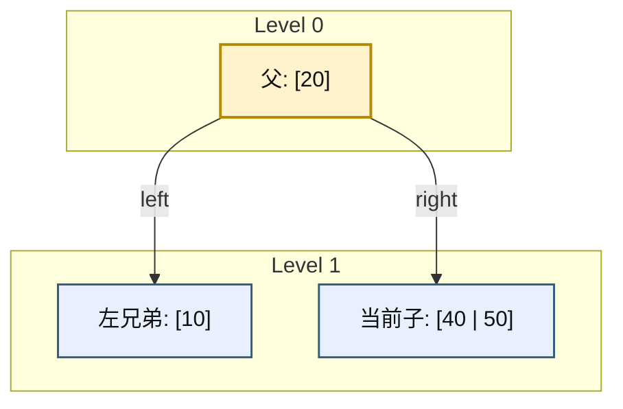

为什么不能直接把左兄弟的 20 塞到右孩子？父分隔键仍是 40 时，右孩子必须全部大于 40，20 会越过祖先边界。正确做法是同时移动分隔键，把边界也改为 20：

- 兄弟给父；
- 父再给当前子。

------

### 31.2.5\_什么叫合并(merge)

如果兄弟也没有多余关键字，借不到，就只能合并。

合并的含义是：

- 把父节点中间那个分隔关键字下移；
- 和当前 2-node 以及兄弟节点合成一个更大的节点；
- 父节点少一个关键字，少一个孩子。

例如：

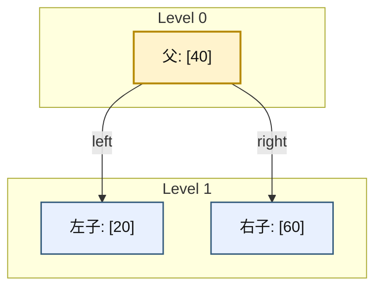

合并后：

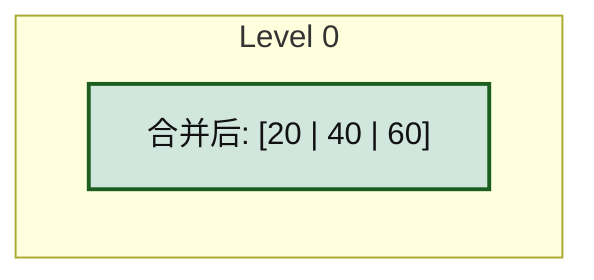

------

### 31.2.6\_兄弟节点可借位时的处理逻辑

若准备下降的孩子是 2-node，优先看兄弟能否借。

#### (1)\_左兄弟可借

- 左兄弟关键字数至少 2；
- 父中的分隔关键字下移到当前子；
- 左兄弟最大关键字上移到父。

#### (2)\_右兄弟可借

- 右兄弟关键字数至少 2；
- 父中的分隔关键字下移到当前子；
- 右兄弟最小关键字上移到父。

如果不是叶子，还必须同步移动一棵孩子子树。向左兄弟借时，原左兄弟最右孩子的区间位于“上移键”和“旧父键”之间；父边界改成上移键后，这个区间应成为目标节点最左孩子。向右兄弟借时对称：原右兄弟最左孩子成为目标最右孩子。不搬这条边，即使键数组看起来有序，子树仍挂在错误的祖先区间内。

------

### 31.2.7\_兄弟节点不可借位时的合并逻辑

若左右兄弟都只有 1 个关键字，则都没有冗余。
这时只能：

- 当前子 + 父中分隔关键字 + 某个兄弟
- 三者合并成一个 4-node

父节点因此少一个键。本单元在进入非根节点时已保证它至少有两个键，所以它向下一层捐出一个后仍至少有一个，不必回头补父。只有根允许以一个键开始，这时合并会清空根，由入口收缩。删除后再处理下溢的自底向上算法才可能继续向上传播，不能把两种组织方式的控制流混在这里。

------

### 31.2.8\_根节点缩减的含义

删除中还有一个特殊边界：**根缩减**。

当根只剩 1 个关键字，且两个孩子都是 2-node 时，合并后根可能被清空。
这时新合并出来的节点直接成为根。

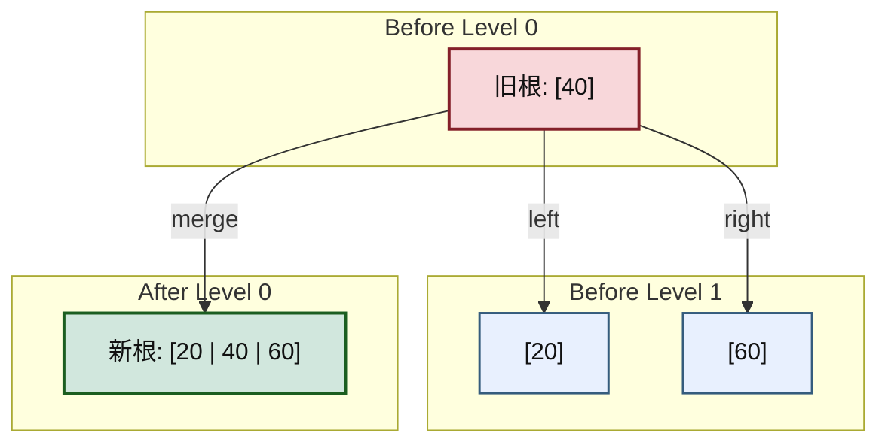

这意味着：

- 整棵树高度减少 1；
- 但所有叶子仍然同层。

------

### 31.2.9\_删除算法的完整诊断与修复流程

这一小节不能只写成一句“先查找、再借位、再合并”。
因为 2-3-4 树删除真正困难的地方，不在动作名词，而在：

- **什么时候必须先处理 2-node**
- **什么时候可以直接继续下降**
- **什么时候要把内部节点删除转换成叶子删除**
- **什么时候根会收缩**

如果这些判断条件不写清楚，读者看到“借位 / 合并”三个字，仍然不知道代码该怎么组织。

因此，本小节统一采用**自顶向下删除**口径，并把完整流程整理成：

1. 固定删除不变量；
2. 固定诊断顺序；
3. 固定修复动作；
4. 用具体示例把每一步跑通。

------

#### (1)\_本小节采用的删除口径

本小节默认采用 **自顶向下删除**。
它的核心纪律不是“删完了再补”，而是：

> **在准备下降到某个孩子之前，先保证这个孩子不是 2-node。**

这里的理由必须先说死：

- 2-node 只有 1 个关键字，没有再少一个的余量；
- 叶子直接删唯一键，或内部节点为一次合并捐出唯一分隔键，都可能造成下溢；
- 本组织方式先保证每个非根递归入口至少有两个键，避免退回父层修复；允许临时下溢是另一种可行算法，后文另讲。

所以自顶向下删除的真正不变量是：

> **真正进入的目标孩子，必须至少有 2 个关键字。**

这和前面自顶向下插入的“不进入满节点”是完全对应的。

------

#### (2)\_先把完整流程写成一句可执行的话

自顶向下删除可以压缩成下面这句“代码化语言”：

> 从根开始定位目标键；内部命中时，左孩子有余量则改删前驱，否则右孩子有余量则改删后继，两侧都是 2-node 则先合并并在合并节点中继续删原键。普通未命中下降前，先借位或合并使目标孩子至少有两个键，再按更新后的槽位进入。最终在叶子删键，操作入口处理空根。

这一句已经比“先借位再合并”更精确，但还不够。
下面必须拆成可检查的步骤。

------

#### (3)\_完整诊断顺序

删除时的诊断顺序固定如下。

##### 1)\_第一步\_在当前节点内部定位\_key

在当前节点 `node` 中，先找第一个满足：

```text
node.keys[i] >= key
```

的位置。

此时有两种情况：

- 若 `i < node.key_count` 且 `node.keys[i] == key`，说明目标 key 就在当前节点中；
- 若未命中，则说明目标 key 若存在，一定在某个孩子子树中。

这一步沿用查找的下界位置。若所有键都小于目标，i 等于 key_count，是最右孩子槽；此时不能读取 keys[i] 判断命中。在叶子未命中就返回不存在，不能再去访问孩子。

------

##### 2)\_第二步\_若当前节点命中\_key\_先判断它是叶子还是内部节点

若当前节点就是目标 key 所在节点，则分两类：

###### a)\_情况\_A\_当前节点是叶子

这时可以直接删除当前 key。
因为它不会破坏更下层子树区间。

###### b)\_情况\_B\_当前节点是内部节点

这时不能直接把 key 从当前节点抠掉。
因为当前 key 同时是孩子区间的分隔点。
所以必须先把“内部删除”转换成“叶子删除”。

本算法先检查紧邻目标键的两个孩子：

- 左孩子至少有两个键时，用左子树最大键即 **前驱** 替换，再在左子树删前驱；
- 否则右孩子至少有两个键时，用右子树最小键即 **后继** 替换，再在右子树删后继；
- 两个孩子都只有一个键时，将“左孩子 + 原目标键 + 右孩子”合并成三键节点，再进入它继续删除原目标。

第三种不能漏掉：如果无条件复制前驱后再借位，借位可能重新改动刚替换的父分隔键，操作责任就对不上了。这里复制的是整数键，若键还携带业务记录，则关联记录也必须按容器契约一起处理。

替换后，真正要物理删除的对象就被转移到了更下层，通常最终落到叶子。

所以这里不是“内部节点也能直接删”，而是：

> **内部命中先按相邻孩子余量选择前驱、后继或合并，不能无条件先替换。**

------

##### 3)\_第三步\_若准备下降到某个孩子\_先检查该孩子是否为\_2-node

这是整个自顶向下删除里最关键的诊断点。

设当前准备进入：

```text
child[i]
```

此时必须先判断：

```text
child[i].key_count == 1 ?
```

如果答案是“否”，说明这个孩子不是 2-node，
可以直接进入。

如果答案是“是”，说明它是 2-node，
此时不能直接进入，必须先处理。

------

##### 4)\_第四步\_若目标孩子是\_2-node\_先决定\_借位还是合并

若目标孩子是 2-node，则看它相邻兄弟是否有富余关键字。

###### a)\_情况\_A\_某个相邻兄弟至少有\_2\_个关键字

这说明兄弟不是 2-node，有冗余。
那么可以执行**借位**：

- 父节点中间分隔 key 下移到当前 2-node；
- 兄弟中一个 key 上移到父节点；
- 若不是叶子，还要同步移动一棵孩子子树。

###### b)\_情况\_B\_相邻兄弟都只有\_1\_个关键字

这说明左右兄弟也都是 2-node，无法借位。
那么只能执行**合并**：

- 把父节点中间分隔 key 下移；
- 与当前 2-node 及相邻 2-node 合成一个更大的节点；
- 父节点失去一个 key 和一个 child。

所以借位与合并的诊断条件可以写得非常明确：

| 目标孩子 | 兄弟情况                         | 动作 |
| -------- | -------------------------------- | ---- |
| 2-node   | 有兄弟可借（兄弟 key_count ≥ 2） | 借位 |
| 2-node   | 左右兄弟都不可借                 | 合并 |

------

##### 5)\_第五步\_保证目标孩子不再是\_2-node\_后\_再继续下降

一旦借位或合并完成，原来准备进入的那条路径就被“修安全”了。
此时才允许继续进入对应子树。合并若复用左兄弟，原来的 child[i] 已被并入 child[i-1]，必须先令 i 减一；不能使用移动前的下标继续下降。借位或与右兄弟合并时，目标仍留在 child[i]。

因此删除控制流不是：

```text
先进入，再看坏没坏
```

而是：

```text
先检查目标孩子
如果它危险，就先修
修好后再进入
```

这就是自顶向下删除的本质。

------

##### 6)\_第六步\_最终在叶子层完成物理删除

因为内部命中已经按余量转为前驱 / 后继删除，或先合并后继续删除原键，
并且一路下降时保证“不会落到危险 2-node 中”，
所以最终的物理删除通常发生在叶子层。

这一步才是：

- 真正移除 key；
- 更新节点 key_count；
- 完成删除落地。

------

##### 7)\_第七步\_若根被清空\_则收缩根

如果某次合并把根节点最后一个 key 也消掉了，
那么根就不能再作为根存在。

这时要做的不是保留一个 0-key 根，
而是：

- 若根还有唯一孩子，则让这个孩子上升为新根；
- 若根本来就是叶子，则整棵树变空。

这一步叫做**根收缩**。

因此删除流程最后还必须检查：

> **根是否已经变成 0-key 节点。**

------

#### (4)\_把流程画成一张总图

下面先给出一张总流程图，把诊断顺序固定下来。

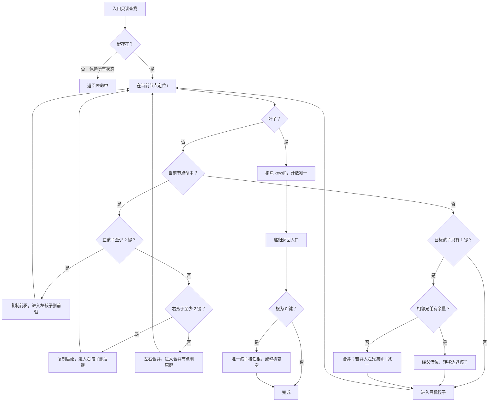

这张图把缺失结果、内部命中的三种分支和移动后的槽位都纳入同一过程。入口的只读查找是本章完整程序的选择：没有这次预检的合法实现，也可能为了查找一个不存在的键而先借位或合并，最后虽然键集合未变，树形已经变化。调用者若要求失败连形状也不改，就要明确这份额外成本。

------

#### (5)\_具体示例一\_目标\_key\_已经在叶子中\_且目标叶子不是\_2-node

先看最简单的一类删除。
这一类是为了说明：**不是所有删除都会触发借位 / 合并。**

设当前树如下：

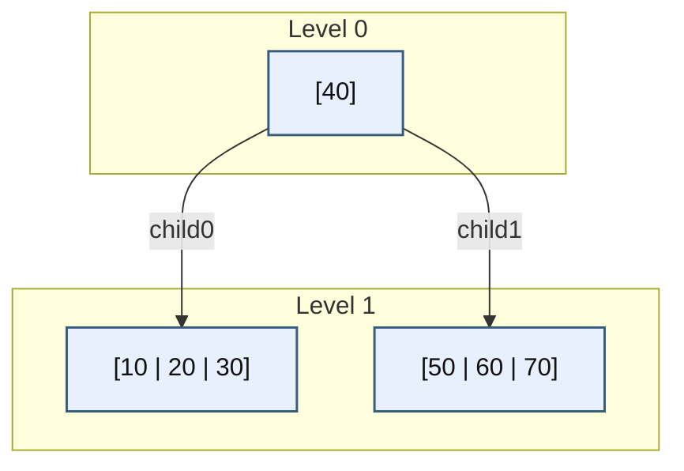

现在删除 `20`。

##### 1)\_诊断过程

- 在根 `[40]` 中比较，`20 < 40`，准备进入左孩子；
- 左孩子 `[10 | 20 | 30]` 不是 2-node，它有 3 个 key；
- 直接进入；
- 在叶子中命中 `20`；
- 叶子删除后得到 `[10 | 30]`。

##### 2)\_删除后结果

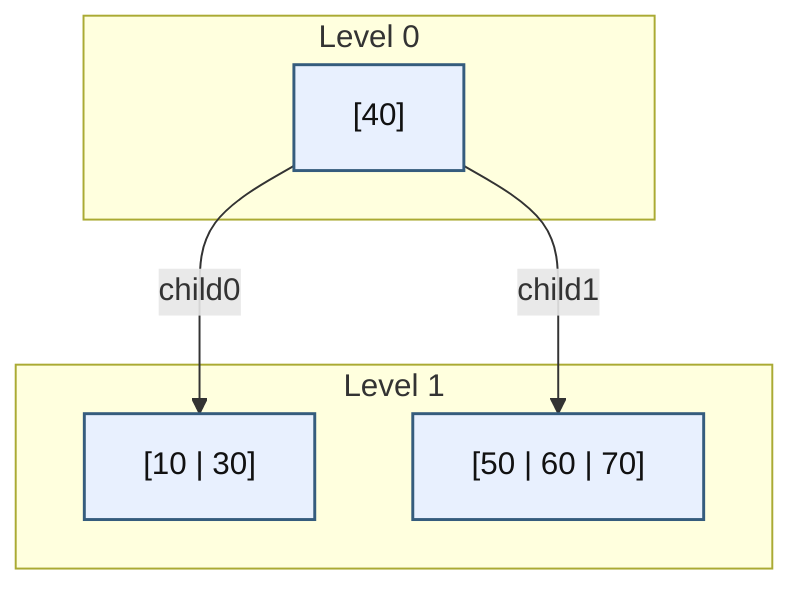

这个例子说明：

- 若目标叶子本身不是 2-node；
- 则不需要借位，也不需要合并；
- 删除可以直接落地。

------

#### (6)\_具体示例二\_目标孩子是\_2-node\_但兄弟可借位

这一类例子用来说明：**下降前先借位**。

设当前树如下：

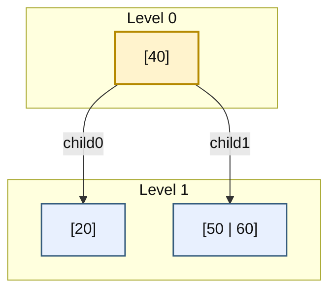

现在删除 `20`。

##### 1)\_如果直接进入左孩子会怎样

左孩子 `[20]` 是 2-node。
若你直接进入它并删除 `20`，它就会变成空节点，非法。

所以必须先处理。

##### 2)\_观察兄弟是否可借

右兄弟是 `[50 | 60]`，它有 2 个 key，说明可以借位。

##### 3)\_借位过程

- 父节点中的 `40` 下移到左孩子；
- 右兄弟中最小 key `50` 上移到父节点；
- 左孩子由 `[20]` 变为 `[20 | 40]`
- 父节点由 `[40]` 变为 `[50]`
- 右兄弟由 `[50 | 60]` 变为 `[60]`

中间结果如下：

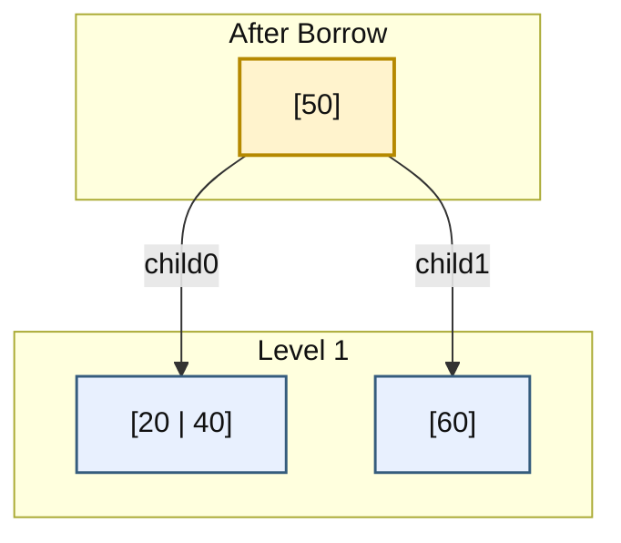

##### 4)\_然后再删除

现在左孩子已经不是 2-node，
可以安全进入并删除 `20`：

- `[20 | 40] -> [40]`

最终结果：

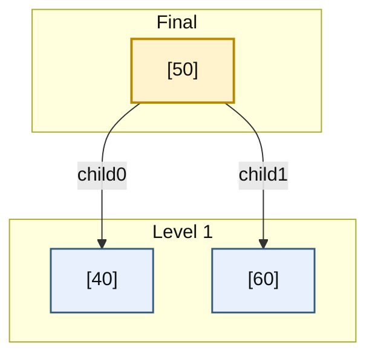

这个例子说明：

- 删除前不是直接进 2-node；
- 而是先借位，把它扩成非 2-node；
- 然后再继续删除。

------

#### (7)\_具体示例三\_目标孩子是\_2-node\_兄弟也不可借\_只能合并

这一类例子用来说明：**下降前先合并**。

设当前树如下：


现在删除 `20`。

##### 1)\_先看目标孩子是否危险

目标左孩子 `[20]` 是 2-node，不能直接进入。

##### 2)\_再看兄弟能不能借

右兄弟 `[60]` 也只有 1 个 key，说明它也是 2-node，不能借位。

##### 3)\_只能合并

把父节点中的 `40` 下移，和左右两个 2-node 合成一个节点：

```text
[20] + 40 + [60] => [20 | 40 | 60]
```

这一步之后，父节点被清空。
结构变成：

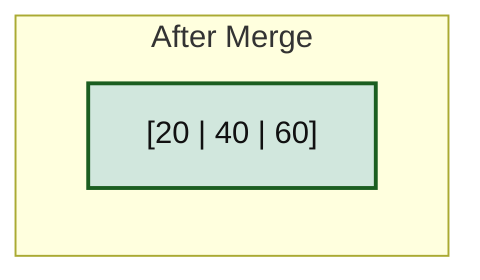

##### 4)\_然后再删除

在合并后的节点中删除 `20`：

```text
[20 | 40 | 60] -> [40 | 60]
```

最后，由于旧根已清空，合并后的节点直接收缩成新根：

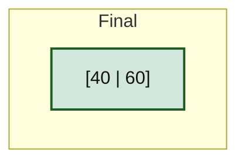

这个例子说明：

- 若兄弟不能借位，就只能合并；
- 合并可能把父节点清空；
- 若被清空的是根，则必须收缩根。

------

#### (8)\_具体示例四\_目标\_key\_在内部节点中\_先转成前驱删除

前面三个例子都在删叶子。
现在补上最关键的一类：**内部节点删除**。

设当前树如下：

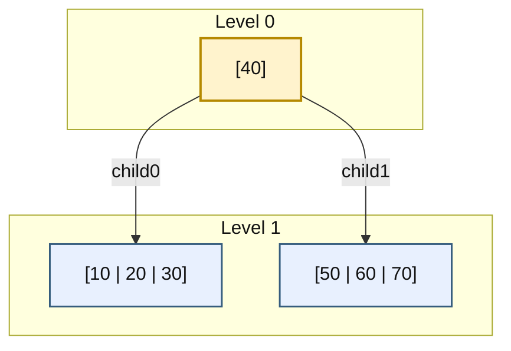

现在删除根中的 `40`。

##### 1)\_为什么不能直接删

因为 `40` 是左右两棵子树区间的分隔点。
如果直接从根删掉它，根的区间语义就断掉了。

##### 2)\_转成前驱删除

选左子树中的最大 key 作为前驱。
左子树 `[10 | 20 | 30]` 中，最大 key 是 `30`。

于是先替换：

```text
根：[40] -> [30]
```

然后，把真正的删除目标改成“从左叶中删除 `30`”。

中间状态如下：

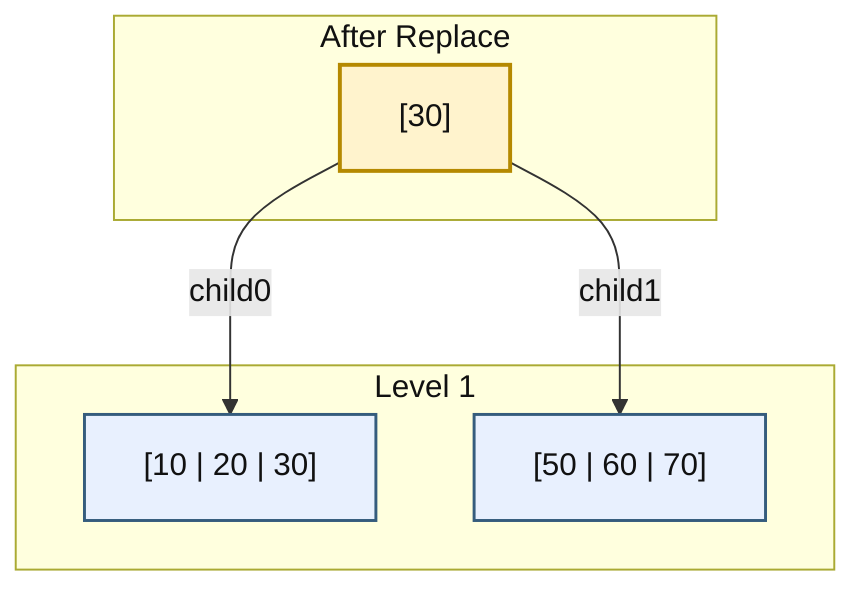

这里根和左叶暂时同时保存 30，严格唯一键及父子边界在操作中间尚未恢复。它是独占更新的暂态，不能把这张图发布给并发读者，或在这时返回给调用者。下面删掉原前驱后才恢复完整不变量。

##### 3)\_再删除叶子中的\_30

左叶不是 2-node，可以直接删：

```text
[10 | 20 | 30] -> [10 | 20]
```

最终结果：

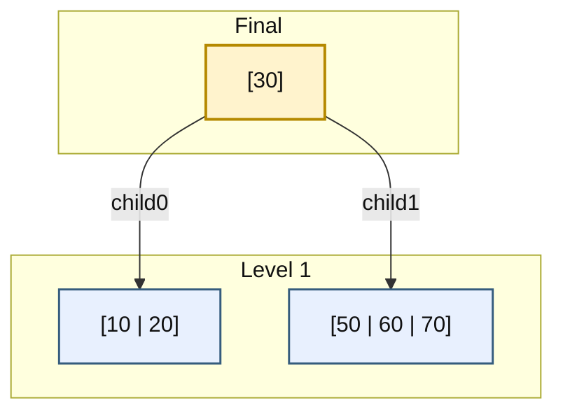

这个例子说明：

- 内部节点删除并不是直接抠掉内部 key；
- 而是先把它转成前驱 / 后继删除；
- 真正的物理删除仍然通常落到叶子层。

------

#### (9)\_这一小节对应的伪代码骨架

最后把这一节整理成一份伪代码骨架，便于直接映射到实现。

```text
erase(node, key):
    在 node 中找到第一个 >= key 的位置 idx

    if idx 命中 key:
        if node 是叶子:
            直接删除 node.keys[idx]
            return
        else:
            if 左孩子不是 2-node:
                用前驱替换，再去左子树删除前驱
            else if 右孩子不是 2-node:
                用后继替换，再去右子树删除后继
            else:
                先把左右孩子与中间 key 合并
                再在合并后的孩子中继续删除
            return

    if node 是叶子:
        return not_found

    // 准备下降到 child[idx]
    if child[idx] 是 2-node:
        if 相邻兄弟可借位:
            先借位
        else:
            若与左兄弟合并，先令 idx = idx - 1
            合并 child[idx]、分隔键和 child[idx+1]

    继续递归删除 child[idx] 中的 key
```

这份伪代码的关键不是语法，而是两条纪律：

第一，**内部命中时按两个孩子的余量选择前驱、后继或合并。**
第二，**下降到孩子之前，先保证该孩子不是 2-node。**

------

#### (10)\_本小节小结

这一小节最应该记住的不是“借位、合并”这几个名词，而是下面四条顺序规则。

第一，删除时的第一步永远是：**先判断当前节点是否命中 key。**
第二，内部命中必须先看左右孩子余量，再选择 **前驱、后继或合并后继续删除原键**。
第三，若准备下降到某个孩子，则必须先检查这个孩子是否是 **2-node**；若是，就先借位或合并。
第四，真正的物理删除通常最终发生在叶子层；若根在过程中被清空，则必须执行**根收缩**。

这样整理之后，你再看“自顶向下删除”，就不再会把它理解成：

- 删完再修；
- 或一大堆零散 case。

它其实是一套非常严格的流程控制：

> **先把前方路径修安全，再继续下降，直到能在叶子层稳定完成删除。**

------


## 31.3\_运行完整预修复删除

完整材料 [tree234_erase.cpp](../../../../labs/kernel/tree_basics/materials/tree234_erase.cpp)是独立 C++17 程序。前四组就是上面的直接删除、向右借、根合并和前驱替换；后两组补上向左借与后继替换。构建函数只接收本例受控的合法形状，不是任意输入校验器。

tree_234 的固定池拥有全部节点，root/child 只是借用地址；alive 表示是否仍在活动拓扑中。合并复用左节点，将右节点的孩子转交以后才清空右节点；根收缩先保存新入口，再清空旧根。清空不是释放池内对象，池仍在直到作用域退出。本例不提供插入或空槽复用，used 记录最初取过多少节点，删除时不减；不要把它当作当前活动节点数。禁止复制含有池内指针的 tree_234。

erase 先只读查找，未命中时不改节点和根；确认存在后，erase_known 每次递归入口除整树根外至少有两个键。借位与合并只重排既存槽，没有删除途中的资源申请。程序不提供共享读者、异常恢复或业务对象稳定地址承诺：这里搬动的是整数键，地址属于容器节点。

```cpp
#include <array>
#include <cassert>
#include <cstddef>
#include <initializer_list>
#include <iostream>

/* 固定池拥有节点；alive 只表示节点是否仍属于树，不释放单个对象。 */
constexpr std::size_t pool_capacity = 64;
struct node_234 {
    unsigned int key_count = 0;
    bool leaf = true;
    bool alive = false;
    std::array<int, 3> keys{};
    std::array<node_234 *, 4> child{};
};
struct tree_234 {
    std::array<node_234, pool_capacity> pool{};
    std::size_t used = 0;
    node_234 *root = nullptr;
    tree_234() = default;
    tree_234(const tree_234 &) = delete;
    tree_234 &operator=(const tree_234 &) = delete;
};
struct erase_counts {
    unsigned int borrow_left = 0, borrow_right = 0, merge = 0;
    unsigned int predecessor = 0, successor = 0, shrink = 0;
};

static unsigned int find_slot(const node_234 *node, int key)
{
    unsigned int i = 0;
    while (i < node->key_count && node->keys[i] < key)
        ++i;
    return i;
}

static bool contains(const tree_234 &tree, int key)
{
    const node_234 *node = tree.root;
    while (node) {
        unsigned int i = find_slot(node, key);
        if (i < node->key_count && node->keys[i] == key)
            return true;
        node = node->leaf ? nullptr : node->child[i];
    }
    return false;
}

static void retire_node(node_234 *node)
{
    /* 全部入口和孩子已移交后清空；池的拥有关系不变。 */
    *node = node_234{};
}

static void borrow_left(node_234 *parent, unsigned int i)
{
    node_234 *target = parent->child[i];
    node_234 *left = parent->child[i - 1];
    assert(target->key_count == 1 && left->key_count >= 2);
    target->keys[1] = target->keys[0];
    target->keys[0] = parent->keys[i - 1];
    parent->keys[i - 1] = left->keys[left->key_count - 1];
    if (!target->leaf) {
        target->child[2] = target->child[1];
        target->child[1] = target->child[0];
        target->child[0] = left->child[left->key_count];
        left->child[left->key_count] = nullptr;
    }
    --left->key_count;
    ++target->key_count;
}

static void borrow_right(node_234 *parent, unsigned int i)
{
    node_234 *target = parent->child[i];
    node_234 *right = parent->child[i + 1];
    assert(target->key_count == 1 && right->key_count >= 2);
    target->keys[1] = parent->keys[i];
    parent->keys[i] = right->keys[0];
    if (!target->leaf) {
        target->child[2] = right->child[0];
        for (unsigned int j = 0; j < right->key_count; ++j)
            right->child[j] = right->child[j + 1];
        right->child[right->key_count] = nullptr;
    }
    for (unsigned int j = 0; j + 1 < right->key_count; ++j)
        right->keys[j] = right->keys[j + 1];
    --right->key_count;
    ++target->key_count;
}

/* 合并 child[i]、keys[i]、child[i+1]，返回仍存活的左节点。 */
static node_234 *merge_children(node_234 *parent, unsigned int i)
{
    node_234 *left = parent->child[i];
    node_234 *right = parent->child[i + 1];
    assert(left->key_count == 1 && right->key_count == 1);
    left->keys[1] = parent->keys[i];
    left->keys[2] = right->keys[0];
    if (!left->leaf) {
        left->child[2] = right->child[0];
        left->child[3] = right->child[1];
    }
    left->key_count = 3;
    for (unsigned int j = i; j + 1 < parent->key_count; ++j)
        parent->keys[j] = parent->keys[j + 1];
    for (unsigned int j = i + 1; j < parent->key_count; ++j)
        parent->child[j] = parent->child[j + 1];
    parent->child[parent->key_count] = nullptr;
    --parent->key_count;
    retire_node(right);
    return left;
}

static int extreme_key(const node_234 *node, bool maximum)
{
    while (!node->leaf)
        node = node->child[maximum ? node->key_count : 0];
    return node->keys[maximum ? node->key_count - 1 : 0];
}

/* 入口已确认 key 存在；除最外层根外，递归入口至少有两个键。 */
static void erase_known(node_234 *node, int key, erase_counts &counts)
{
    unsigned int i = find_slot(node, key);
    bool found = i < node->key_count && node->keys[i] == key;
    if (node->leaf) {
        assert(found);
        for (unsigned int j = i; j + 1 < node->key_count; ++j)
            node->keys[j] = node->keys[j + 1];
        --node->key_count;
        return;
    }
    if (found) {
        if (node->child[i]->key_count >= 2) {
            ++counts.predecessor;
            int replacement = extreme_key(node->child[i], true);
            node->keys[i] = replacement;
            erase_known(node->child[i], replacement, counts);
        } else if (node->child[i + 1]->key_count >= 2) {
            ++counts.successor;
            int replacement = extreme_key(node->child[i + 1], false);
            node->keys[i] = replacement;
            erase_known(node->child[i + 1], replacement, counts);
        } else {
            ++counts.merge;
            erase_known(merge_children(node, i), key, counts);
        }
        return;
    }
    if (node->child[i]->key_count == 1) {
        if (i > 0 && node->child[i - 1]->key_count >= 2) {
            ++counts.borrow_left;
            borrow_left(node, i);
        } else if (i < node->key_count && node->child[i + 1]->key_count >= 2) {
            ++counts.borrow_right;
            borrow_right(node, i);
        } else {
            /* 最右孩子只能与左兄弟合并，新的落点必须改为 i-1。 */
            if (i == node->key_count)
                --i;
            ++counts.merge;
            merge_children(node, i);
        }
    }
    erase_known(node->child[i], key, counts);
}

static bool erase(tree_234 &tree, int key, erase_counts &counts)
{
    /* 多一次只读查找，换取未命中时连树形也不变的契约。 */
    if (!contains(tree, key))
        return false;
    erase_known(tree.root, key, counts);
    if (tree.root->key_count == 0) {
        node_234 *old_root = tree.root;
        tree.root = old_root->leaf ? nullptr : old_root->child[0];
        retire_node(old_root);
        ++counts.shrink;
    }
    return true;
}

static node_234 *make_node(tree_234 &tree, std::initializer_list<int> keys)
{
    /* 仅用于本例受控构建；不是接收任意外部数据的解析接口。 */
    assert(tree.used < pool_capacity && keys.size() >= 1 && keys.size() <= 3);
    node_234 *node = &tree.pool[tree.used++];
    node->alive = true;
    for (int key : keys)
        node->keys[node->key_count++] = key;
    return node;
}

static void build_example(tree_234 &tree, unsigned int scenario)
{
    tree.root = make_node(tree, {40});
    tree.root->leaf = false;
    if (scenario == 0) {
        tree.root->child[0] = make_node(tree, {10, 20, 30});
        tree.root->child[1] = make_node(tree, {50, 60, 70});
    } else if (scenario == 1) {
        tree.root->child[0] = make_node(tree, {20});
        tree.root->child[1] = make_node(tree, {50, 60});
    } else if (scenario == 2) {
        tree.root->child[0] = make_node(tree, {20});
        tree.root->child[1] = make_node(tree, {60});
    } else {
        tree.root->child[0] = make_node(tree, {10, 20});
        tree.root->child[1] = make_node(tree, {50});
    }
}

static void print_tree(const node_234 *node, unsigned int depth = 0)
{
    if (!node) {
        std::cout << "(empty)\n";
        return;
    }
    for (unsigned int i = 0; i < depth; ++i)
        std::cout << "  ";
    std::cout << '[';
    for (unsigned int i = 0; i < node->key_count; ++i)
        std::cout << (i ? "|" : "") << node->keys[i];
    std::cout << "]\n";
    if (!node->leaf)
        for (unsigned int i = 0; i <= node->key_count; ++i)
            print_tree(node->child[i], depth + 1);
}

int main()
{
    for (unsigned int scenario = 0; scenario < 6; ++scenario) {
        tree_234 tree;
        unsigned int fixture = scenario == 3 ? 0 : (scenario == 5 ? 1 : scenario);
        if (scenario == 4)
            fixture = 3;
        build_example(tree, fixture);
        int key = scenario == 3 || scenario == 5 ? 40 : (scenario == 4 ? 50 : 20);
        erase_counts counts;
        if (erase(tree, 999, counts) || !erase(tree, key, counts))
            return 1;
        std::cout << "case=" << scenario << " erase=" << key
                  << " left=" << counts.borrow_left << " right=" << counts.borrow_right
                  << " merge=" << counts.merge << " pred=" << counts.predecessor
                  << " succ=" << counts.successor << " shrink=" << counts.shrink << "\n";
        print_tree(tree.root);
    }
    return 0;
}
```

borrow_left 把目标的原键和孩子向右挪，腾出最左区间；borrow_right 则向目标末尾追加父键和右兄弟最左孩子。merge_children 把父键和右节点加入左节点，再压紧父的 keys/child。父最后一个孩子槽清空，防止后续误沿非活动指针访问退休节点。

内部命中的 extreme_key 只读取极值，真正删除仍经过 erase_known 的余量检查，因此“找到了前驱叶子”不等于可以跳过它路径上的修复。复制前驱到父后短暂存在重复键，整个过程受独占前提保护，返回时才恢复唯一键。counts 只是观察动作次数，不参与正确性判断。

从材料目录执行：

```bash
c++ -std=c++17 -Wall -Wextra -Werror -pedantic tree234_erase.cpp -o tree234_erase
./tree234_erase
```

运行前先预测四个原例；输出中的 case 从 0 开始。下面列出每组的根与动作计数，完整程序还会逐层输出剩余子树：

| case | 删除键 | 最终根 | 非零计数 |
| --- | --- | --- | --- |
| 0 | 20 | [40] | 无，直接删叶键 |
| 1 | 20 | [50] | right=1 |
| 2 | 20 | [40\|60] | merge=1、shrink=1 |
| 3 | 40 | [30] | pred=1 |
| 4 | 50 | [20] | left=1 |
| 5 | 40 | [50] | succ=1 |

每组之前还尝试删除不存在的 999，入口返回 false。这里没有计时，也不能从六组动作数推出哪种算法在真实业务中更快；它们用于把控制流与原图对应。

## 31.4\_把遗漏分支变成练习

先用根 [40]、左叶 [20]、右叶 [60] 删除内部键 40。左右都没有余量，所以必须先合并，再在合并叶中删除 40，最后得到 [20|60]。对比同一棵树删除右叶 60：未命中路径选择最右孩子，下标从 1 改成 0 后继续，结果应为 [20|40]；若忘记改下标，会走到父已经清空的槽。

接着用内部节点的区间检验搬孩子：父 [40]，左孩子 [10|20]，右孩子 [60]，左右叶子依次是 [5]、[15]、[30]、[50]、[70]。准备从右孩子继续删除 70 前向左借位，父应变 [20]，目标变 [40|60]，原 [30] 子树成为目标最左孩子。它仍大于新父边界 20、小于目标首键 40；这个区间说明孩子必须跟着键一起转移。

最后把树缩到一个根叶 [20]，删除 20 后 root 应为空；随后再删 20 返回 false。单键根叶是递归入口“至少两键”的例外，不能把非根规则机械施加到整树入口。

现在可以解释本算法为什么无需向上回溯修复容量：非根节点进入时的余量足够它捐出一个父键。它付出的代价是可能在真正删除前改变路径，且为“未命中保持形状”多查一次。下一步回到[P06 自底向上单元](P06_2-3-4_树_从多路平衡到红黑树的结构桥梁.md#6.6.1_2-3-4_树的自底向上删除)，比较先删再处理下溢怎样改变传播状态。
