# 第32章\_2-3-4树下溢回溯与根收缩

## 32.1\_把余量准备改成下溢报告

[P31 预修复删除](P31_2-3-4树预修复删除.md#31.3_运行完整预修复删除)保证进入非根节点时至少有两个键。这个纪律把修复放在下降前；如果希望沿途只查找、确实删掉一个键后才修改结构，就需要允许一个暂时的零键节点，并把它交回父层处理。

本章保留同一组图例和唯一整数键的模型，重新安排修复时机。重点是零键节点仍拥有什么、返回值如何报告、何时停止传播以及何时改变根。树仍归单调用者独占，不能让共享读者观察重复键或下溢中间态。

## 32.2\_从叶子删除到父层回补

先看不会下溢的删除，再逐步增加借位、合并和内部键替换。图中的空框表示“键计数为零”，并不自动表示该地址已经可以回收。

### 32.2.1\_为什么还要讲\_自底向上删除

[P31](P31_2-3-4树预修复删除.md#31.3_运行完整预修复删除)已经完成 **自顶向下删除**。
它的核心纪律是：

> **在准备下降到某个孩子之前，先保证这个孩子不是 2-node。**

这份预修复写法维持进入孩子前的容量余量，所以不需要让下溢向上传播。现在换一个选择：下降时不改结构，真正删掉键以后才判断是否需要修复。

但是，从算法组织方式上讲，**2-3-4 树并不是只能自顶向下删除**。
也可以采用一种更接近“先完成删除，再向上回补”的方式，也就是这里要讲的：

> **自底向上删除**

它的核心思想是：

1. 先尽可能把目标 key 删除掉；
2. 若删除后当前节点出现下溢，再把“下溢”这个问题向父节点返回；
3. 父节点决定是借位还是合并；
4. 若父节点自己也因此失衡，则继续向上修复；
5. 必要时一直传播到根，并触发根收缩。

所以，这一节的重点不再是“下降前预防”，而是：

> **删除后，如何识别下溢、如何把下溢往上层修回去。**

------

### 32.2.2\_自底向上删除与自顶向下删除的本质区别

两者都能删掉同一个 key，也都能恢复 2-3-4 树不变量。
区别不在树规则，而在**修复时机**。

| 组织方式     | 核心策略                     | 代码风格           |
| ------------ | ---------------------------- | ------------------ |
| 自顶向下删除 | 下降前先避免进入危险 2-node  | 先修路，再下降     |
| 自底向上删除 | 先删除，再处理下溢并向上回补 | 先出问题，再回溯修 |

也就是说：

- 自顶向下删除更像“提前排险”
- 自底向上删除更像“事后修复”

这一点和前面插入的“自顶向下 / 自底向上”组织差别是对应的。

------

### 32.2.3\_自底向上删除的核心状态\_下溢

自底向上删除里，必须先引入一个状态：

> **下溢（underflow）**

对于 2-3-4 树，非根节点最少必须有 1 个关键字。
所以如果某个非根节点在删除后变成：

```text
[]
```

也就是 `key_count == 0`，那么它就发生了下溢。

这是操作过程中刻意允许的 **暂时下溢状态**，不能作为一次成功操作的最终结果。空叶没有孩子；下溢的内部节点却保留唯一的 child[0]：它在一次合并中丢掉最后一个分隔键和一个孩子，剩下的整棵子树仍然存活。零键不等于没有数据，更不等于可以直接释放对象。

------

### 32.2.4\_自底向上删除的总流程

自底向上删除可以压缩成下面这条流程：

1. 从根开始查找目标 key；
2. 若目标 key 在内部节点中，先把它转换成前驱 / 后继所在位置的删除；
3. 继续递归下降，直到真正执行物理删除；
4. 若删除后当前节点仍合法，则直接返回；
5. 若删除后当前节点下溢，则把“下溢”返回给父节点；
6. 父节点检查相邻兄弟是否可借位；
7. 若可借位，则借位消除下溢；
8. 若不可借位，则执行合并；
9. 若父节点因此也下溢，则继续向上返回；
10. 若根被清空，则收缩根。

这套流程的关键是：

> **删除动作先发生，修复动作后发生。**

这和前面的自顶向下删除正好相反。

------

### 32.2.5\_具体示例一\_叶子删除后不下溢

先看最简单的情况。
这一类是为了说明：

> **不是所有自底向上删除都会进入借位 / 合并。**

设当前树如下：

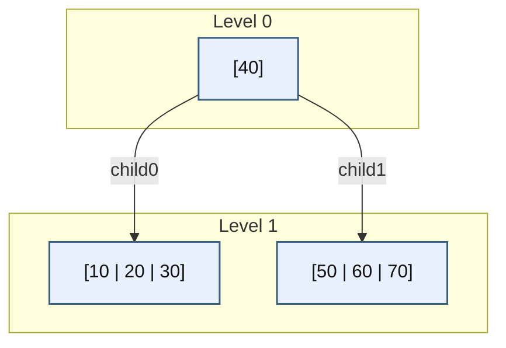

现在删除 `20`。

删除过程：

1. 从根 `[40]` 开始查找，`20 < 40`，进入左叶；
2. 在左叶 `[10 | 20 | 30]` 中命中 `20`；
3. 删除后变成 `[10 | 30]`。

结果如下：

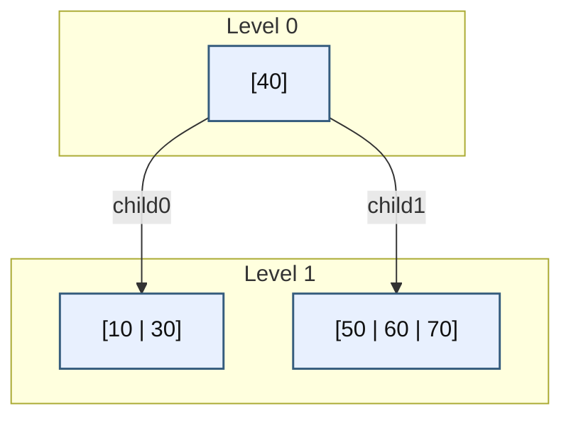

这里没有下溢，因为叶子删完之后仍然有 2 个关键字。
所以这一类删除不需要回溯修复。

------

### 32.2.6\_具体示例二\_叶子删除后下溢\_兄弟可借位

现在看第一类真正的回溯修复。

设当前树如下：

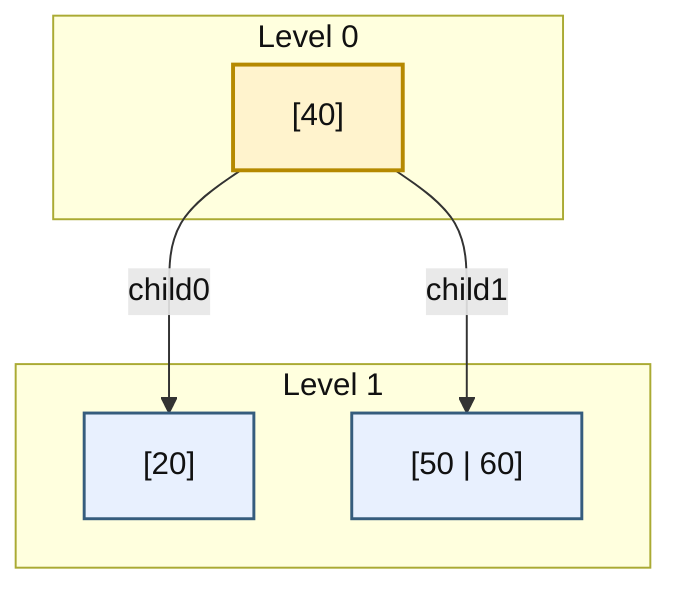

现在删除 `20`。

#### (1)\_第一步\_先删除

目标 key 在左叶 `[20]` 中。
删除后，左叶立刻变成空节点：

```text
[]
```

中间状态如下：

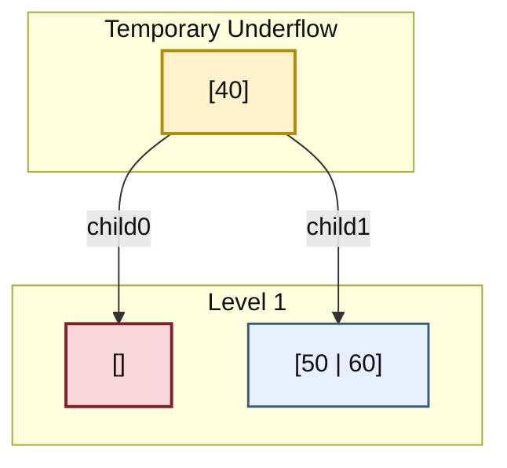

这里就是自底向上删除的关键特征：

> **先完成删除，再将允许的暂时下溢交给父节点修复。**

#### (2)\_第二步\_父节点处理下溢

父节点看到左孩子下溢，接着检查右兄弟 `[50 | 60]`。
右兄弟有 2 个关键字，说明可以借位。

借位规则是：

- 父节点中的 `40` 下移到左孩子；
- 右兄弟中的最小 key `50` 上移到父节点；
- 右兄弟剩下 `[60]`

修复后得到：

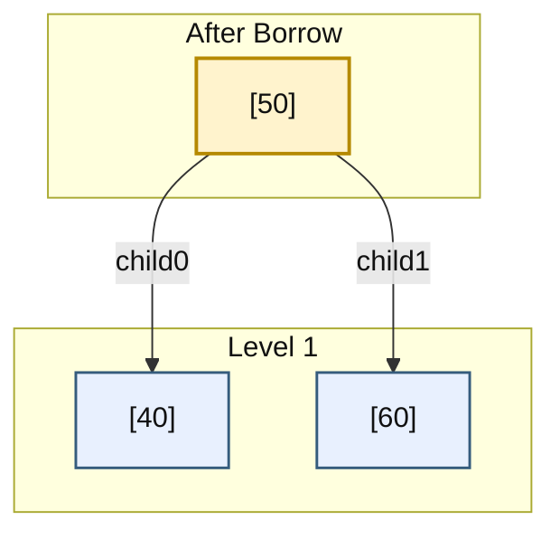

这个例子说明：

- 自底向上删除可以先产生下溢；
- 修复不是提前做，而是由父节点在回溯阶段完成；
- 若兄弟可借位，则借位会直接终止修复传播。

------

### 32.2.7\_具体示例三\_叶子删除后下溢\_兄弟不可借\_只能合并

现在看第二类回溯修复：兄弟也帮不上忙。

设当前树如下：

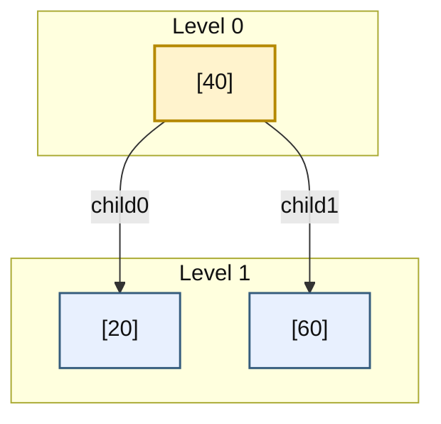

现在删除 `20`。

#### (1)\_第一步\_先删除

左叶 `[20]` 删除后变成空节点：

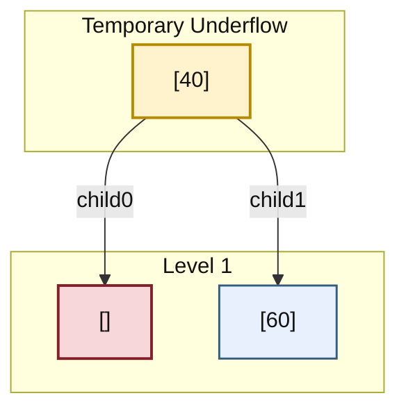

#### (2)\_第二步\_父节点检查兄弟

右兄弟 `[60]` 也只有 1 个关键字，说明它也是最小节点，不能借位。
于是只能执行合并：

- 把父节点中的 `40` 下移；
- 与空左节点及右兄弟 `[60]` 合成一个更大的节点；
- 父节点被清空。

合并后得到：

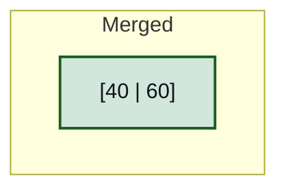

合并得到的是两键节点：0 个键的目标 + 1 个父分隔键 + 1 个兄弟键。P31 的预合并则是 1 + 1 + 1 = 3，两个版本的借位/合并函数不能直接共用原来的计数前提。

由于旧根已经清空，因此这里立即发生 **根收缩**。
合并后的节点直接成为新根。

这个例子说明：

- 自底向上删除的“合并”也是在删除之后才判断出来的；
- 父节点可能因此被清空；
- 若被清空的是根，则必须收缩根。

------

### 32.2.8\_具体示例四\_内部节点删除\_先转成前驱删除\_再自底向上修复

前面三个例子都在删叶子。
现在补上内部节点删除。

设当前树如下：

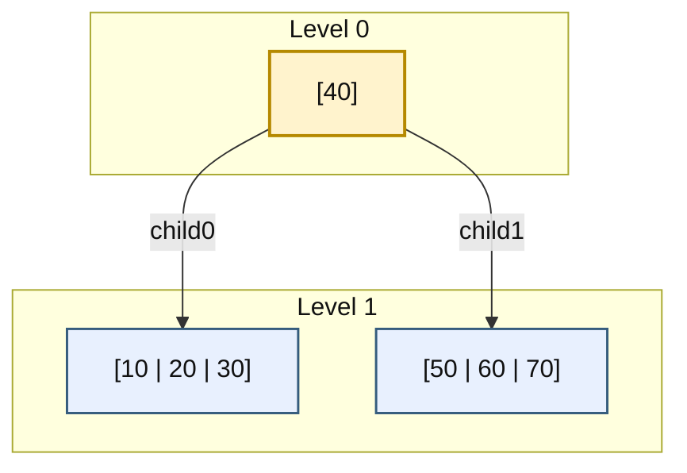

现在删除根中的 `40`。

#### (1)\_第一步\_不能直接删内部\_key

`40` 是左右子树区间的分隔点。
若直接删除，根的区间语义会丢失。

#### (2)\_第二步\_转换成前驱删除

选左子树的最大 key 作为前驱。
左叶 `[10 | 20 | 30]` 中，最大 key 是 `30`。

于是：

- 根 `[40]` 先改写为 `[30]`
- 真正要删的对象变成左叶中的 `30`

中间状态如下：

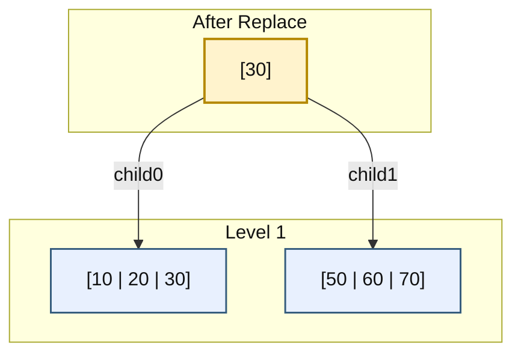

这里 30 暂时同时保存在父节点和原前驱位置，仍是独占操作的中间态；删掉原前驱并修复后才恢复唯一键约束。本算法不在下降前借位，因此可以先固定选前驱，再在回溯时连同更新后的父分隔键一起修复。

#### (3)\_第三步\_再删叶子中的\_30

左叶删掉 `30` 后得到 `[10 | 20]`，没有下溢。
最终结果：

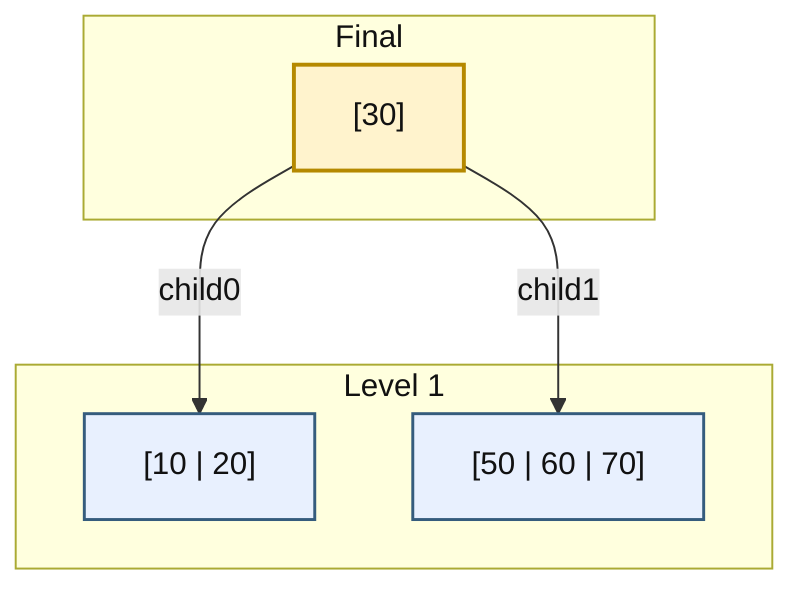

这个例子说明：

- 自底向上删除并不改变“内部节点删除通常先转成前驱 / 后继删除”的本质；
- 真正不同的是：若后续叶子删除引发下溢，修复是在回溯阶段完成。

------

### 32.2.9\_自底向上删除的伪代码骨架

为了把这套流程落到代码，需要一个“向上报告下溢”的返回结构。

可以先定义：

```cpp
struct erase_result {
	bool deleted;     // 是否真的删到了 key
	bool underflow;   // 当前节点删完后是否发生下溢
};
```

以下是接口协作骨架，find_first_ge、get_predecessor 和 fix_child_underflow 的具体槽操作由本章完整程序兑现；不是独立可编译程序。然后递归骨架可以整理成：

```cpp
erase_result erase_bottom_up(node_234 *node, int key)
{
	int idx = find_first_ge(node, key);

	// 情况 1：当前节点是叶子
	if (node->leaf) {
		if (idx < node->key_count && node->keys[idx] == key) {
			remove_key_from_leaf(node, idx);

			// 零键通过返回值报告；若调用者是顶层入口则由它收根
			if (node->key_count == 0)
				return { true, true };

			return { true, false };
		}

		return { false, false };
	}

	// 情况 2：当前节点内部命中 key
	if (idx < node->key_count && node->keys[idx] == key) {
		int pred = get_predecessor(node->child[idx]);
		node->keys[idx] = pred;

		erase_result res = erase_bottom_up(node->child[idx], pred);

		if (res.underflow)
			fix_child_underflow(node, idx);

		return { true, node->key_count == 0 };
	}

	// 情况 3：继续下降到 child[idx]
	erase_result res = erase_bottom_up(node->child[idx], key);

	if (!res.deleted)
		return { false, false };

	if (res.underflow)
		fix_child_underflow(node, idx);

	return { true, node->key_count == 0 };
}
```

顶层入口还要再补一层根处理：

```cpp
void tree_erase_bottom_up(tree_234 &tree, int key)
{
	if (tree.root == nullptr)
		return;

	erase_result res = erase_bottom_up(tree.root, key);
	if (!res.deleted)
		return;

	if (tree.root->key_count == 0) {
		if (tree.root->leaf) {
			delete tree.root;
			tree.root = nullptr;
		} else {
			node_234 *old_root = tree.root;
			tree.root = tree.root->child[0];
			delete old_root;
		}
	}
}
```

上面的顶层伪代码用 delete 表示“节点是逐个 new 出来的”这一存储前提；它不能直接用于本章池内对象。完整程序由池拥有节点，只在孩子和根已移交后清空退休节点，直到整池离开作用域才结束对象寿命。

这里的关键点是：

- `erase_bottom_up()` 既负责向下删除，也负责把“下溢”向上传；
- `fix_child_underflow()` 才是真正执行借位 / 合并的地方；
- 根收缩不交给普通节点逻辑，而交给顶层入口统一处理。

------

### 32.2.10\_本小节小结

两种组织方式维护同一组容量、区间和等叶深不变量，区别在于何时修改，以及需要向上一层报告什么。不能凭哪个在某份教程中先出现，就推断其工程适用性。

这一节最重要的结论有四条：

第一，自底向上删除的核心不是“下降前排险”，而是“删除后修复下溢”。
第二，下溢的本质是：**非根节点删除后变成 0-key 非法节点。**
第三，父节点收到下溢后，先判断兄弟能否借位；可借则借，不可借则合并。
第四，若修复一路传播到根并使根清空，则必须执行根收缩。

从组织方式上看：

- 自顶向下删除是“先修路径，再下降”
- 自底向上删除是“先删节点，再回补”

自底向上省去预防性修改，却必须携带 deleted/underflow 状态并处理内部零键节点；自顶向下省去回溯修复，却可能先重排一个最终未命中的路径，若要求未命中不改形状需另行保证。选择取决于回溯状态、失败契约和结构修改时机，而不是泛称某一种总更简单或更快。

------


## 32.3\_内部零键节点怎样继续传播

前三个叶子例子只需要修复一层。把树扩成根 [40]，左右内部节点 [20]/[60]，四个叶子 [10]/[30]/[50]/[70]，再删除 10，就能看见两次合并如何连起来。这个例子只使用已建立的动作，新增的观察点是“空内部节点保留唯一孩子”。

| 阶段 | 写入者与状态位置 | 改动与下一步 |
| --- | --- | --- |
| U0 定位 | 当前递归调用读取各层 keys/child | 沿 child[0] 走到叶子 [10]；普通未命中路径此时尚未写任何节点 |
| U1 删键 | 叶子调用写 node.key_count | 从 1 变 0，返回 deleted=true、underflow=true；父调用仍保存孩子下标 0 |
| U2 局部合并 | [20] 的调用写自身键槽和两个孩子 | []、20、[30] 合成 [20,30]，复用左对象；右叶移交后退休；原 [20] 变成零键内部节点，只保留 child[0] |
| U3 向上报告 | [20] 的调用读取修复后的自身 key_count | 仍为 0，所以把 underflow=true 返回给 [40]；传上去的是新的父层缺口 |
| U4 根层合并与收缩 | [40] 的调用写左右节点与根槽 | 零键左节点、40、[60] 合成 [40,60]，三个孩子是 [20,30]/[50]/[70]；顶层把它设为新根，退休旧根 |

父子调用通过普通返回值传递 deleted/underflow，通过 child[i] 访问同一块节点内存；没有并发消息、轮询或隐含全局队列。一个返回值描述“当前调用根的容量”，不能把叶子的下溢标志不加判断地一路转发。借位后目标从零键变一键且父键数不变，传播结束；合并使父少一个键，只有父因此变零键才继续传播。

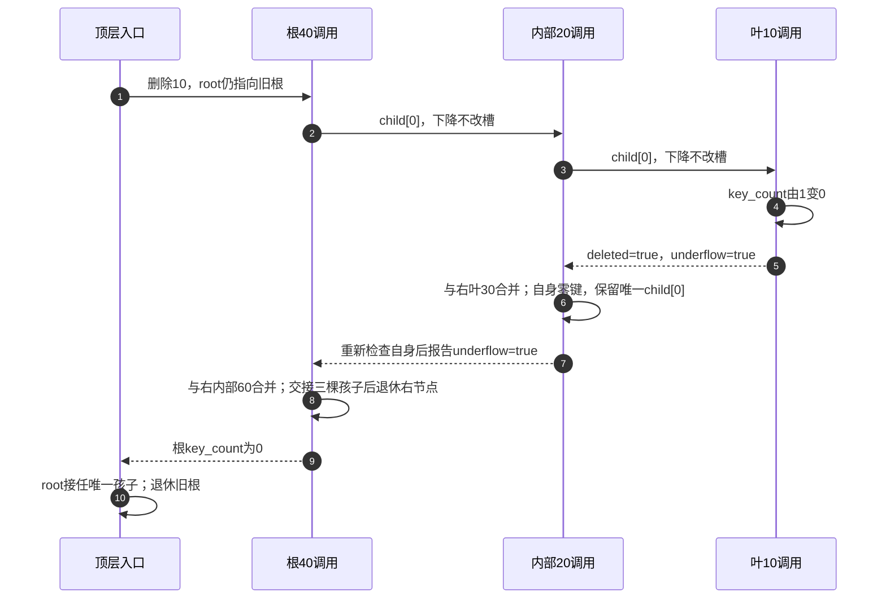

内部借位同样保住这棵唯一子树。向左借时，原唯一 child[0] 后移到 child[1]，接收左兄弟最右孩子作为新 child[0]；向右借时，原 child[0] 保持，接收右兄弟最左孩子作为 child[1]。这些位置由父边界决定，不能仅把 P31 的“一键目标”计数改为零而漏掉指针位置。

## 32.4\_运行完整回溯删除

完整材料 [tree234_erase_bottom.cpp](../../../../labs/kernel/tree_basics/materials/tree234_erase_bottom.cpp)独立编译，不依赖拼接上一章。它沿用固定池的拥有关系和 alive 标记，前四组重放原图，第五组补左借，第六组就是 U0～U4。合并函数接受一侧零键、另一侧一键，返回两键节点；孩子全数移交后才退休右对象。

普通下降不写树，直到叶子命中才删键；如果某内部节点已经命中，键存在这一事实已成立，固定换成其前驱后再递归删除前驱。因此不必像 P31 的强失败契约实现那样额外运行 contains，未命中仍能逐字段保持原树。找前驱本身需要一次最右路径读取，不能把没有预查说成“整次操作绝不重复访问路径”。

```cpp
#include <array>
#include <cassert>
#include <cstddef>
#include <initializer_list>
#include <iostream>

/* 固定池拥有节点；alive 只表示节点是否仍属于树，不释放单个对象。 */
constexpr std::size_t pool_capacity = 64;
struct node_234 {
    unsigned int key_count = 0;
    bool leaf = true;
    bool alive = false;
    std::array<int, 3> keys{};
    std::array<node_234 *, 4> child{};
};
struct tree_234 {
    std::array<node_234, pool_capacity> pool{};
    std::size_t used = 0;
    node_234 *root = nullptr;
    tree_234() = default;
    tree_234(const tree_234 &) = delete;
    tree_234 &operator=(const tree_234 &) = delete;
};
struct erase_counts {
    unsigned int borrow_left = 0, borrow_right = 0, merge = 0;
    unsigned int predecessor = 0, underflow = 0, shrink = 0;
};

static unsigned int find_slot(const node_234 *node, int key)
{
    unsigned int i = 0;
    while (i < node->key_count && node->keys[i] < key)
        ++i;
    return i;
}

static void retire_node(node_234 *node)
{
    /* 全部入口和孩子已移交后清空；池的拥有关系不变。 */
    *node = node_234{};
}

static void borrow_left(node_234 *parent, unsigned int i)
{
    node_234 *target = parent->child[i];
    node_234 *left = parent->child[i - 1];
    assert(target->key_count == 0 && left->key_count >= 2);
    target->keys[0] = parent->keys[i - 1];
    parent->keys[i - 1] = left->keys[left->key_count - 1];
    if (!target->leaf) {
        target->child[1] = target->child[0];
        target->child[0] = left->child[left->key_count];
        left->child[left->key_count] = nullptr;
    }
    --left->key_count;
    ++target->key_count;
}

static void borrow_right(node_234 *parent, unsigned int i)
{
    node_234 *target = parent->child[i];
    node_234 *right = parent->child[i + 1];
    assert(target->key_count == 0 && right->key_count >= 2);
    target->keys[0] = parent->keys[i];
    parent->keys[i] = right->keys[0];
    if (!target->leaf) {
        target->child[1] = right->child[0];
        for (unsigned int j = 0; j < right->key_count; ++j)
            right->child[j] = right->child[j + 1];
        right->child[right->key_count] = nullptr;
    }
    for (unsigned int j = 0; j + 1 < right->key_count; ++j)
        right->keys[j] = right->keys[j + 1];
    --right->key_count;
    ++target->key_count;
}

/* 合并 child[i]、keys[i]、child[i+1]，返回仍存活的左节点。 */
static node_234 *merge_children(node_234 *parent, unsigned int i)
{
    node_234 *left = parent->child[i];
    node_234 *right = parent->child[i + 1];
    assert(left->key_count + right->key_count == 1);
    unsigned int left_count = left->key_count;
    left->keys[left_count] = parent->keys[i];
    for (unsigned int j = 0; j < right->key_count; ++j)
        left->keys[left_count + 1 + j] = right->keys[j];
    if (!left->leaf)
        for (unsigned int j = 0; j <= right->key_count; ++j)
            left->child[left_count + 1 + j] = right->child[j];
    left->key_count = 2;
    for (unsigned int j = i; j + 1 < parent->key_count; ++j)
        parent->keys[j] = parent->keys[j + 1];
    for (unsigned int j = i + 1; j < parent->key_count; ++j)
        parent->child[j] = parent->child[j + 1];
    parent->child[parent->key_count] = nullptr;
    --parent->key_count;
    retire_node(right);
    return left;
}

static int extreme_key(const node_234 *node, bool maximum)
{
    while (!node->leaf)
        node = node->child[maximum ? node->key_count : 0];
    return node->keys[maximum ? node->key_count - 1 : 0];
}

/* 下溢内部节点仍保留 child[0]，不能因零键就把它当空叶释放。 */
static void fix_child_underflow(node_234 *parent, unsigned int i, erase_counts &counts)
{
    assert(parent->child[i]->key_count == 0);
    ++counts.underflow;
    if (i > 0 && parent->child[i - 1]->key_count >= 2) {
        ++counts.borrow_left;
        borrow_left(parent, i);
    } else if (i < parent->key_count && parent->child[i + 1]->key_count >= 2) {
        ++counts.borrow_right;
        borrow_right(parent, i);
    } else {
        if (i == parent->key_count)
            --i;
        ++counts.merge;
        merge_children(parent, i);
    }
}

struct erase_result {
    bool deleted;
    bool underflow;
};

static erase_result erase_bottom_up(node_234 *node, int key, erase_counts &counts)
{
    unsigned int i = find_slot(node, key);
    bool found = i < node->key_count && node->keys[i] == key;
    if (node->leaf) {
        if (!found)
            return {false, false};
        for (unsigned int j = i; j + 1 < node->key_count; ++j)
            node->keys[j] = node->keys[j + 1];
        --node->key_count;
        return {true, node->key_count == 0};
    }
    if (found) {
        /* 本版本固定选前驱；修复发生在它真正删掉之后。 */
        ++counts.predecessor;
        key = extreme_key(node->child[i], true);
        node->keys[i] = key;
    }
    erase_result result = erase_bottom_up(node->child[i], key, counts);
    if (!result.deleted)
        return result;
    if (result.underflow)
        fix_child_underflow(node, i, counts);
    return {true, node->key_count == 0};
}

static bool erase(tree_234 &tree, int key, erase_counts &counts)
{
    if (!tree.root)
        return false;
    /* 下降只读，未命中原路返回，无须额外执行一次 contains。 */
    erase_result result = erase_bottom_up(tree.root, key, counts);
    if (!result.deleted)
        return false;
    if (tree.root->key_count == 0) {
        node_234 *old_root = tree.root;
        tree.root = old_root->leaf ? nullptr : old_root->child[0];
        retire_node(old_root);
        ++counts.shrink;
    }
    return true;
}

static node_234 *make_node(tree_234 &tree, std::initializer_list<int> keys)
{
    /* 仅用于本例受控构建；不是接收任意外部数据的解析接口。 */
    assert(tree.used < pool_capacity && keys.size() >= 1 && keys.size() <= 3);
    node_234 *node = &tree.pool[tree.used++];
    node->alive = true;
    for (int key : keys)
        node->keys[node->key_count++] = key;
    return node;
}

static void build_example(tree_234 &tree, unsigned int scenario)
{
    tree.root = make_node(tree, {40});
    tree.root->leaf = false;
    if (scenario == 4) {
        node_234 *left = make_node(tree, {20});
        node_234 *right = make_node(tree, {60});
        tree.root->child[0] = left;
        tree.root->child[1] = right;
        left->leaf = right->leaf = false;
        left->child[0] = make_node(tree, {10});
        left->child[1] = make_node(tree, {30});
        right->child[0] = make_node(tree, {50});
        right->child[1] = make_node(tree, {70});
    } else if (scenario == 0) {
        tree.root->child[0] = make_node(tree, {10, 20, 30});
        tree.root->child[1] = make_node(tree, {50, 60, 70});
    } else if (scenario == 1) {
        tree.root->child[0] = make_node(tree, {20});
        tree.root->child[1] = make_node(tree, {50, 60});
    } else if (scenario == 2) {
        tree.root->child[0] = make_node(tree, {20});
        tree.root->child[1] = make_node(tree, {60});
    } else {
        tree.root->child[0] = make_node(tree, {10, 20});
        tree.root->child[1] = make_node(tree, {50});
    }
}

static void print_tree(const node_234 *node, unsigned int depth = 0)
{
    if (!node) {
        std::cout << "(empty)\n";
        return;
    }
    for (unsigned int i = 0; i < depth; ++i)
        std::cout << "  ";
    std::cout << '[';
    for (unsigned int i = 0; i < node->key_count; ++i)
        std::cout << (i ? "|" : "") << node->keys[i];
    std::cout << "]\n";
    if (!node->leaf)
        for (unsigned int i = 0; i <= node->key_count; ++i)
            print_tree(node->child[i], depth + 1);
}

int main()
{
    for (unsigned int scenario = 0; scenario < 6; ++scenario) {
        tree_234 tree;
        unsigned int fixture = scenario == 3 ? 0 : (scenario == 5 ? 4 : scenario);
        if (scenario == 4)
            fixture = 3;
        build_example(tree, fixture);
        int key = scenario == 3 ? 40 : (scenario == 4 ? 50 : (scenario == 5 ? 10 : 20));
        erase_counts counts;
        if (erase(tree, 999, counts) || !erase(tree, key, counts))
            return 1;
        std::cout << "case=" << scenario << " erase=" << key
                  << " left=" << counts.borrow_left << " right=" << counts.borrow_right
                  << " merge=" << counts.merge << " pred=" << counts.predecessor
                  << " underflow=" << counts.underflow << " shrink=" << counts.shrink << "\n";
        print_tree(tree.root);
    }
    return 0;
}
```

从材料目录执行：

```bash
c++ -std=c++17 -Wall -Wextra -Werror -pedantic tree234_erase_bottom.cpp -o tree234_erase_bottom
./tree234_erase_bottom
```

前五组最终树与 P31 的对应例子相同，动作发生时刻已经改变。第六组的输出为：

```text
case=5 erase=10 left=0 right=0 merge=2 pred=0 underflow=2 shrink=1
[40|60]
  [20|30]
  [50]
  [70]
```

underflow 统计父层实际收到并处理的零键孩子次数，shrink 统计入口收根次数；它们不参与修复决策。本次两个 underflow 对应 U1 的空叶和 U3 的空内部节点，不能都解释成两次物理删除。

## 32.5\_比较失败路径与传播代价

先在第六组原树中尝试删除 11。查找会到 [10]，但不命中；没有发生任何删键，所以 deleted=false 原路返回，所有节点、根和计数不变。再删 10，预测两次合并与一次收根；对照 P31 的同一输入，观察它在下行阶段合并，再在叶子删除。最终集合一致，不代表中间容量、节点退休时刻或树形总相同。

接着在纸上构造“内部零键节点向左借”的例子：父 [40]，左兄弟 [10,20] 带 [5]/[15]/[30]，目标暂时零键且 child[0] 指向 [50]。借后父为 [20]、左为 [10]、目标为 [40]；[30] 必须成为目标 child[0]，原 [50] 成为 child[1]。若先清空目标再想找回 child[0]，就已丢失一棵仍有数据的子树。

最后比较需要保存的状态。预修复版在进入孩子前保证容量，回溯版保留调用栈中的父节点和孩子下标，并用 deleted/underflow 分清未命中与成功后的容量缺口。两者都要处理独占更新、键记录搬移和根寿命；它们都没有自动提供并发安全或业务对象地址稳定性。

我们已经分别建立两种删除过程。下一步回到[P06 叶层与编码桥梁](P06_2-3-4_树_从多路平衡到红黑树的结构桥梁.md#6.7_更新怎样维持叶子同层)，先建立合法静态编码，再沿 P07 正式定义进入 P33 的成熟删除对照。
