# 第33章\_从多路删除到红黑缺口

## 33.1\_在两套规则建立以后对照

先完成 [P31 预修复](P31_2-3-4树预修复删除.md#31.3_运行完整预修复删除)、[P32 回溯](P32_2-3-4树下溢回溯与根收缩.md#32.3_内部零键节点怎样继续传播)，再读 P07 的[颜色与黑高性质](P07_红黑树_把_2-3-4_树映射成二叉表示.md#7.3_红黑树的五条性质)。本章是两套模型都成立后的比较，不在定义之前要求读者先背删除 case。

图中 B/R 分别是 black/red，即黑/红。红节点与黑父合成一个逻辑多路节点；黑高统计约定须一致，本文计算包含当前黑节点及末端的黑色空边界 NIL。BB 是 double black“双重黑”的记账写法，表示某路径欠一个黑层，不是第三种颜色。P(?) 表示父颜色尚未分支，图框底色不替代括号中的状态。

下面重点追问：局部左右等高以后，为什么有时还要回到上一层？回答需要同时看缺口、兄弟余量、父原色和对象的旧位置。

## 33.2\_按同一删除阶段比较局部动作

多路图既可以画删除前预修复，也可以画删除后下溢，本章统一按删除后回溯解释容量缺口。必要的删除前图会显式标明，避免把同一张图上的三键和两键当成同一步。

### 33.2.1\_为什么红黑树删除总让人觉得\_比\_2-3-4\_树更绕

2-3-4 树删除时，你看到的动作是：

- 借位
- 合并
- 根收缩
- 问题向上继续传播

这些动作非常“结构化”，因为 2-3-4 树直接把“一个逻辑节点里有几个 key”暴露出来了。
一个节点不够用，就是不够用；兄弟能借，就是能借；兄弟不能借，就只能合并。

但红黑树不是这样。
红黑树把同样的结构信息，编码进了：

- 节点颜色
- 父子关系
- 旋转方向
- 黑高是否少了一个

所以红黑树删除看起来更绕，不是因为它在做别的事，而是因为：

> **它在用二叉树的局部旋转与染色，表达 2-3-4 树里“借位 / 合并 / 下溢传播”这些多路树动作。**

因此，这一节不再把红黑树删除当作一堆孤立 case 来讲，
而是直接把它和 2-3-4 树删除放在一张图里、一类结构里、一条逻辑线上对照。

------

### 33.2.2\_先把红黑树删除的目标重新说死

红黑树删除时，表面上是：

1. 先按 BST 规则找到目标对象 z；
2. 若 z 有两个孩子，选后继 y，以它的旧位置作为后续缺口的来源；
3. 本章采用对象移位：y 接替 z 的位置，z 才是交给调用者退出的对象；y 的旧位置至多有一个非空孩子 x；
4. 判断 y 在旧位置的颜色，而不是仅看 z 的颜色；少掉黑层时，还要区分红孩子顶替可直接涂黑与需要继续缺黑修复。

如果采用只复制键/记录的另一种 BST 删除组织，对象身份会不同。多路语义比较不授权混用两种所有权契约；下面的移位伪代码始终让 z 离开树。

这一套动作里，真正困难的不是“把节点摘掉”，而是：

> **某个原为黑色的位置被移走后，若没有把红色接替孩子涂黑补足，该侧会少一个黑层。**

2-3-4 树里，这对应的是：

> **某个逻辑节点可能删完键后容量不足。若原逻辑节点仍有其他键，可以在局部重新编码，未必产生向上的缺口。**

所以红黑树删除 fix-up 的本质不是“修 BST”，而是：

- 修黑高
- 修逻辑节点容量
- 修 2-3-4 树编码后的局部结构失衡

------

### 33.2.3\_先把\_2-3-4\_树与红黑树的编码关系摆在眼前

在真正讲删除 case 之前，必须先把这层映射摆在前面。
否则对比会很飘。

#### (1)\_2-node\_与红黑树

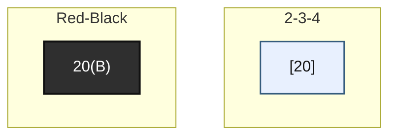

#### (2)\_3-node\_与红黑树

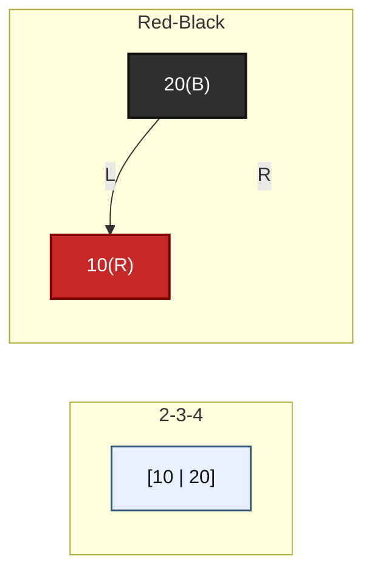

#### (3)\_4-node\_与红黑树

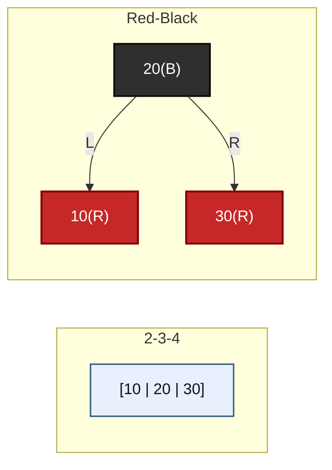

上面三张图必须记住。
因为后面所有“红黑树删除为什么这么修”的答案，最终都要回到一句话：

> **当前这片红黑树局部，到底对应 2-3-4 树里的哪一种逻辑节点状态。**

------

### 33.2.4\_红黑树删除的四类局部语义\_分别对应\_2-3-4\_树的什么

先给一张总表，再逐个讲图。

| 红黑树局部现象         | 2-3-4 树语义                                                |
| ---------------------- | ----------------------------------------------------------- |
| 结构化简后的原位置为红，且移除的是红叶 | 逻辑节点减少一个键但仍合法，未减少黑层 |
| 兄弟黑，两个侄子都黑   | 合并；红父吸收，黑父才继续上推，抵达根可整体收缩 |
| 兄弟黑，远侄红         | 可以借位，当前层就地修好                                    |
| 兄弟黑，近侄红而远侄黑 | 先调整兄弟内部编码，再进入远侄红的借位步骤 |
| 兄弟红                 | 当前结构不适合直接借 / 合并，要先旋转转成“兄弟黑”的标准形态 |

下面沿原四组图展开，并在借位中补齐近侄红的准备步骤。近侄是兄弟靠近缺口一侧的孩子，远侄是另一侧；下文假设缺口在左，右缺口完全镜像。黑孩子包含 NIL 空边界。局部图省略侄子以下的子树，框不是宣称实际叶子：两边未受影响的子树必须具有相应的相等黑高，不能将一个画成黑框的近侄任意理解为非空黑叶、同时把红远侄当成没有后续边界的终点。

------

### 33.2.5\_第一类\_删的是红节点\_对应\_2-3-4\_树里\_逻辑节点仍够用

这是最容易被忽略、但最能建立直觉的一类。

在已化简到至多一个非空孩子的旧位置上，红节点实际上只能是红叶：若它有一个非空黑孩子而另一侧是 NIL，黑高不等；红孩子又违反不相邻为红。因此红叶移除不减少黑层，例如：

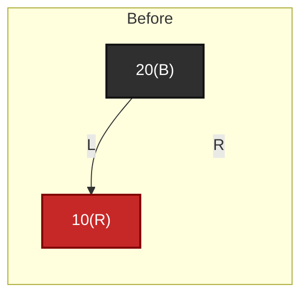

删除红节点 `10(R)` 之后：

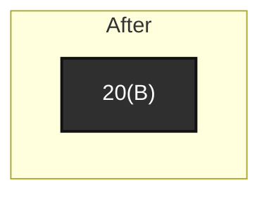

这件事为什么不需要缺黑循环？
因为它在 2-3-4 树里的语义其实只是：

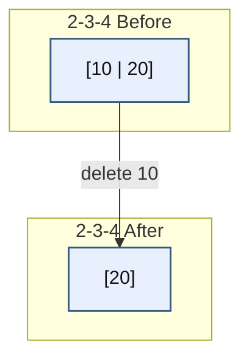

也就是说，本来是一个 3-node，删掉一个 key 后退成 2-node，
但它仍然是合法节点，没有下溢。

所以这里最重要的对照结论是：

> **旧位置上移除红叶，不产生黑层缺口，对应逻辑节点仍有容量。不能只看请求删除对象 z 是红色就跳过修复：若 z 有两个孩子，后继旧位置的颜色可能是黑。**

另一个局部完成分支是黑节点只有一个红孩子：让红孩子接替并涂黑即可补足这一层。合法输入下，这个唯一非空孩子必为红叶，不能随意推广为任意红子树都能接替。

------

### 33.2.6\_第二类\_兄弟黑且两个侄子都黑\_对应合并与父层吸收

这是红黑树删除里最像 2-3-4 树“合并传播”的一类。

先看红黑树局部。
设当前 x 所在路径少了一个黑，w 是它的兄弟，P 是两者的父节点；wl/wr 表示 w 的左/右孩子：

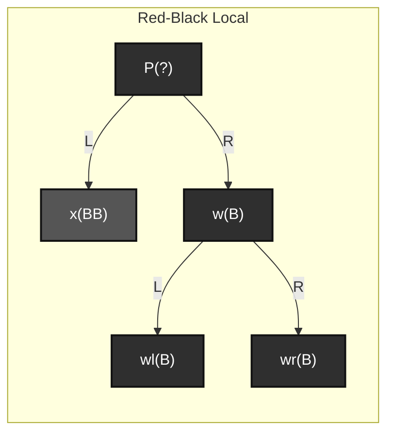

这里的 `x(BB)` 不是说真的有个“双重黑颜色”，
而是表示：**这条路径当前少了一个黑，需要修复。**

当 w 为黑、wl/wr 都为黑时，把 w 染红，使兄弟侧也少计一个黑；两侧在 P 内部于是等高。接下来必须检查 P 的原颜色：

- P 原为红：把 P 涂黑，补回局部整体的一个黑，修复结束；
- P 原为黑：P 的整个子树比操作前少一个黑，把缺口交给 P 的父层；
- 若 P 已是整树根，没有更高一层要求维持原黑高，可以结束，所有路径一起少一层。

所以“局部左右等高”与“局部对上层仍提供原黑高”是两件事。P 原色决定合并是否继续传播。

为什么？
因为这在 2-3-4 树里的对应语义就是：**当前层借不到，只能合并。**

看 2-3-4 树的等价结构：

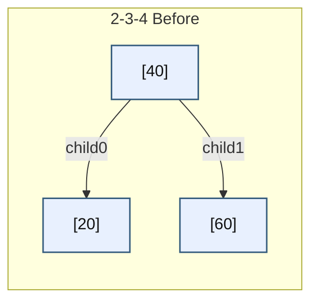

上图先给出删除前的 [20]。删除 20 后左孩子应为 []；此时右兄弟也只有最小容量，
那就没法借位，只能把父节点 key `40` 拉下来合并：

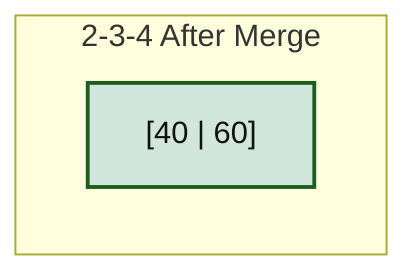

这里按删除后回溯比较，合并是 0+1+1=2，不能画成预修复的三键合并。图中父是单键根，因此直接收根。一般父逻辑节点若还有别的键就能吸收；只有它也下溢才继续上推，对应红黑编码中红父吸收与黑父传播的区别。

所以这里最关键的对照句是：

> **兄弟黑且两侄黑对应合并，但合并不必然继续传播；还要看父层能否吸收缺口。**

------

### 33.2.7\_第三类\_兄弟黑且远侄红\_对应\_2-3-4\_树里的\_借位成功\_当前层结束

这一类是红黑树删除里最像 2-3-4 树“借位”的一类。

先看红黑树局部。
仍设 `x` 路径少黑，兄弟 `w` 为黑，并且远侄为红：

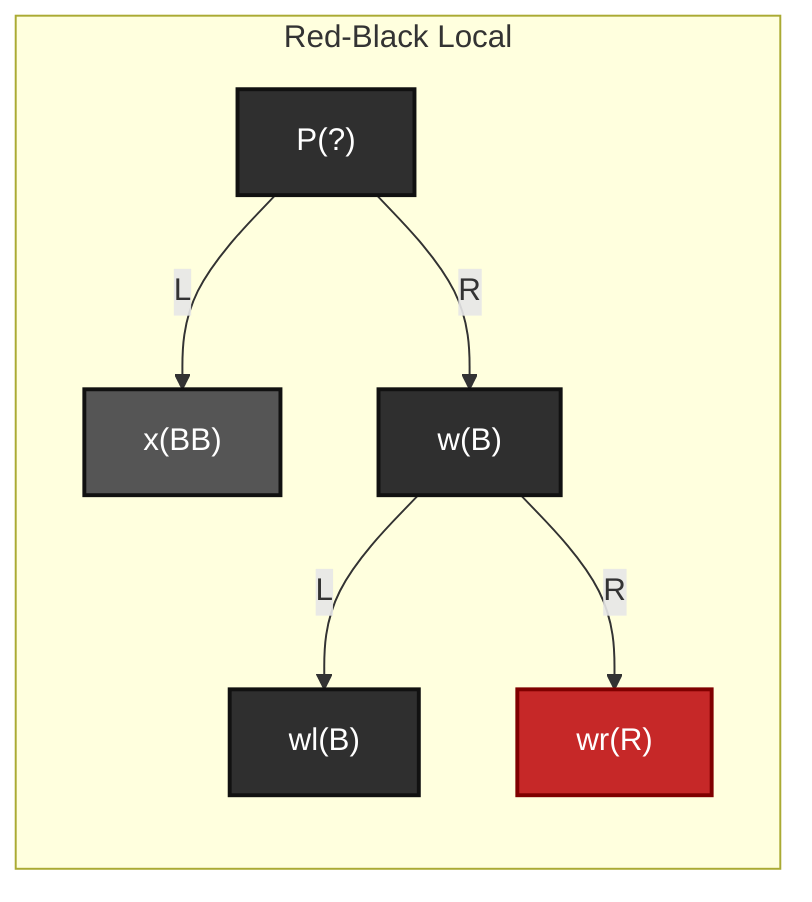

这时通过：

- 围绕父节点旋转
- 兄弟继承旧父颜色，旧父变黑，远侄变黑

可以在当前层把“少一个黑”的问题直接补平。
不会继续向上传播。

为什么这对应“借位”？
因为在 2-3-4 树里，这恰好就是：

- 目标孩子太小
- 兄弟有富余 key
- 父节点做中转
- 借一个 key 过来
- 当前层立刻恢复合法

看删除后回溯的多路局部。这里假设已经删掉左叶唯一键 20，所以左边是 []；右侧 [50|60] 按 50 黑、60 红编码，对应上图远侄红：

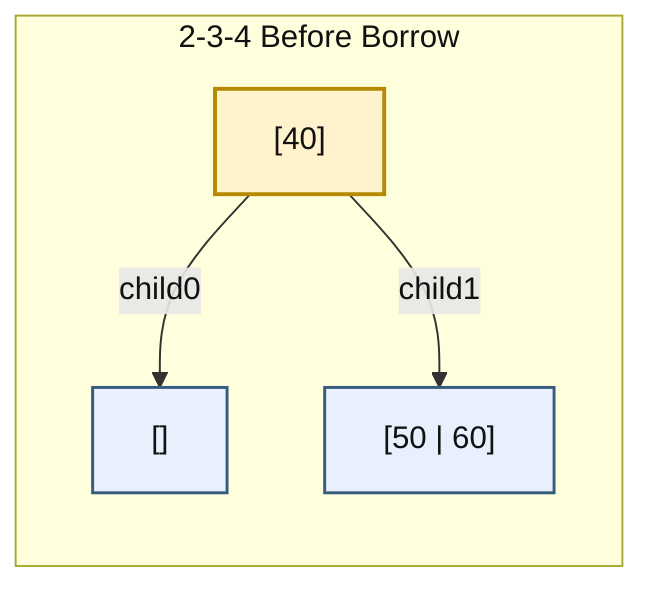

借位之后：

- 父中的 `40` 下移到左边
- 右兄弟中的最小 key `50` 上移到父

得到：

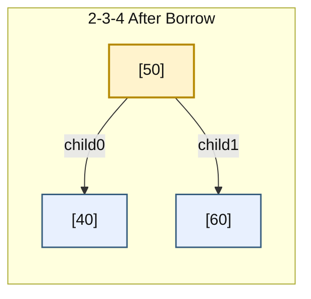

问题当场解决，不再上推。
这说明两边都从兄弟的逻辑节点取出余量，经父分隔位置补到缺口。具体旋转数和二叉形状依赖编码约定，不能把抽象对应说成每行代码或对象位置都一一相同。

所以这里最关键的结论是：

> **远侄红提供可借余量，按规定旋转和染色后，当前局部恢复原来对上层提供的黑高。**

如果只有近侄红、远侄黑，余量仍在兄弟逻辑节点里，只是位置不适合直接套上述动作。缺口在左时，先把近侄涂黑、兄弟涂红，对兄弟右旋：原近侄成为新的黑兄弟，原兄弟成为其红色远侄，再对父左旋完成借位。这是抽象分步算法的完整染色边界；某个优化实现可能把中间染色合并到后一步，不能将本段直接当作 Linux 回调时刻的字段快照。

------

### 33.2.8\_第四类\_兄弟红\_对应\_先把局部改造成标准借位\_/\_合并形态

这一类如果只看红黑树教材，会觉得特别突兀：
为什么兄弟一红，就先旋转一下，再把问题转成别的 case？

原因是：
**兄弟红并不是最终修复态，而是“当前局部编码方式不方便直接借位 / 合并”的中间态。**

先看红黑树局部：

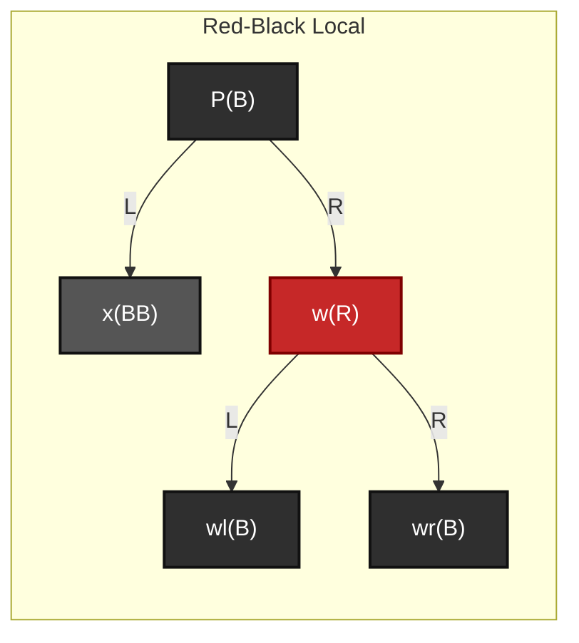

红黑树在这里通常会：

- 先对 `P` 旋转
- 交换 `P` 与 `W` 的颜色
- 令原 w 的左孩子 wl 成为 x 的新兄弟，它原本为黑；x 仍在原 P 之下，缺口没有就此消失
- 再继续按借位 / 合并逻辑处理

也就是说，兄弟红这一类本质上是在做：

> **结构预处理**

它不是最终语义动作。
它的目的，是把局部红黑树编码变换成一个“能直接看出是借位还是合并”的标准局面。

所以这一类在 2-3-4 树里没有一个“一步对应”的单独动作，
更接近于：

> **先把局部编码形式整理成标准借位 / 合并局面。**

如果必须用一句话压缩：

> **兄弟红不是 2-3-4 树里的独立新操作，而是红黑树二叉编码下的一次“转场动作”。**

------

### 33.2.9\_给出一张\_红黑树删除\_case\_to\_2-3-4\_树删除语义\_总图

为了让对比更强烈，最后给一张总图，把四类关系放到一张图里。

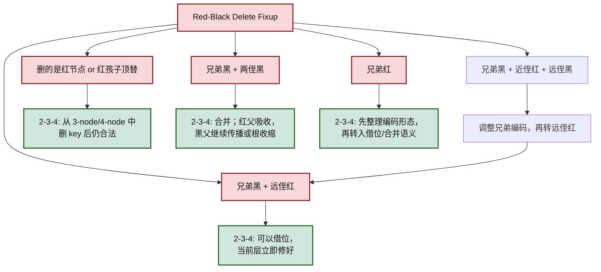

这张图的作用不是总结名词，而是帮你牢牢记住：

- 红黑树删除 fix-up 不是凭空存在的
- 它始终在表达 2-3-4 树删除中的那几类核心语义

------

### 33.2.10\_红黑树删除代码骨架\_应该怎样理解

下面使用经典黑色 NIL 哨兵的抽象伪代码，NIL 表示空孩子，BLACK 是黑色常量，fixup 表示恢复颜色/黑高约束的修复过程。transplant 负责父槽/根槽并把替代对象的 parent 写好，即使替代对象是 NIL。独占调用期间允许这个哨兵记录当前缺口的父节点，根的父亲也以 NIL 表示。它不是使用 NULL 空指针的 Linux 代码，不能将 x=NIL 换成 NULL 后照抄 x.parent。

```text
rb_delete(tree, z):
    y = z
    y_original_color = y.color

    if z.left == NIL:
        x = z.right
        transplant(z, z.right)

    else if z.right == NIL:
        x = z.left
        transplant(z, z.left)

    else:
        y = tree_minimum(z.right)
        y_original_color = y.color
        x = y.right

        if y.parent == z:
            x.parent = y      // x 即使是 NIL，也需要记录缺口父节点
        else:
            transplant(y, y.right)
            y.right = z.right
            y.right.parent = y

        transplant(z, y)
        y.left = z.left
        y.left.parent = y
        y.color = z.color

    if y_original_color == BLACK:
        rb_delete_fixup(tree, x)
```

这段代码的关键不是“记住 transplant 怎么写”，而是理解：

- 前半段做的是 BST 删除化简；
- rb_delete_fixup 的输入包含 x 所在缺口及其父关系；若 x 为红，先涂黑即可，不必进入缺黑循环；
- `fixup` 里的旋转与染色，不是在修 BST，而是在补 2-3-4 树删除后的黑高 / 容量问题。

所以你看红黑树删除代码时，应当在脑子里同步翻译：

- 这是在借位吗？
- 这是在合并吗？
- 这是在把问题往上推吗？
- 这是在先做一次结构预处理吗？

只要这样看，红黑树删除就不会再是一堆“为什么突然旋转”的孤立片段。

------

### 33.2.11\_本小节小结

这一版重新整理后，最应该记住的是下面五条。

第一，多路模型帮助解释容量与黑高，但二叉指针交接、对象身份和中间状态仍需独立核对，不能由一个抽象比喻替代。
第二，化简后的旧位置移除红叶不减少黑层；黑位置由红孩子接替时涂黑可局部完成，不仅看原目标对象颜色。
第三，两侄黑对应合并，红父能吸收，黑父才继续传播或在根结束。
第四，远侄红对应可借余量；只有近侄红时先调整兄弟编码，再按远侄红收尾。
第五，兄弟红不是一种最终修复语义，而是红黑树编码下的一次“转场动作”，目的是把局部形态转成标准借位 / 合并局面。

------


## 33.3\_用黑高收支检查父层是否仍有缺口

设缺口侧从 x 开始的黑高为 h，未修复兄弟侧为 h+1。h 包含下面统一的黑色空边界；不需要知道子树每个节点，只需子树内部已经满足等黑高。父原为红时贡献 0，原为黑时贡献 1，故删除前局部应提供“父贡献 + h+1”。

两侄黑时将兄弟染红，兄弟侧降为 h，左右终于相等。若父原红，再把父涂黑，两侧都得到 h+1，恢复旧值；若父原黑，父仍只贡献 1，局部只有 h+1，而旧值是 h+2，缺口转移到整个父子树。远侄红的旋转则把旧父和远侄都置黑，新根兄弟继承父原色，两条路线都得到“父原贡献 + 1+h”，所以完整恢复。

下面完整 C++17 程序 [rbtree_height_balance.cpp](../../../../labs/kernel/tree_basics/materials/rbtree_height_balance.cpp)把这两笔计算写出来。它是黑高算术模型，h=1～8、父两种颜色的枚举只是检查表达式与上述推导一致；没有执行指针旋转，不是红黑树实现验证器。

```cpp
#include <cassert>
#include <iostream>

/* 只统计从当前局部入口到空边界的黑节点数，不执行指针旋转。 */
struct height_result {
    int left;
    int right;
    int expected;
    bool propagate;
};

static height_result merge_black_sibling(int h, bool parent_red)
{
    int parent_before = parent_red ? 0 : 1;
    int expected = parent_before + h + 1;
    // 兄弟由黑变红；红父可变黑，黑父则把缺口交给上层。
    int parent_after = 1;
    return {parent_after + h, parent_after + h, expected, !parent_red};
}

static height_result borrow_far_red(int h, bool parent_red)
{
    int old_parent_black = parent_red ? 0 : 1;
    int expected = old_parent_black + h + 1;
    // 旋转后兄弟继承旧父颜色，旧父和远侄都黑。
    int new_root_black = old_parent_black;
    int old_parent_subtree = 1 + h;
    int far_nephew_subtree = 1 + h;
    return {new_root_black + old_parent_subtree,
            new_root_black + far_nephew_subtree, expected, false};
}

int main()
{
    for (int h = 1; h <= 8; ++h) {
        for (bool parent_red : {false, true}) {
            auto merged = merge_black_sibling(h, parent_red);
            assert(merged.left == merged.right);
            assert(merged.expected - merged.left == (merged.propagate ? 1 : 0));
            auto borrowed = borrow_far_red(h, parent_red);
            assert(borrowed.left == borrowed.right);
            assert(borrowed.left == borrowed.expected && !borrowed.propagate);
        }
    }
    for (bool parent_red : {false, true}) {
        auto merged = merge_black_sibling(1, parent_red);
        auto borrowed = borrow_far_red(1, parent_red);
        std::cout << "parent=" << (parent_red ? "red" : "black")
                  << " merge_height=" << merged.left
                  << " expected=" << merged.expected
                  << " propagate=" << merged.propagate
                  << " borrow_height=" << borrowed.left << "\n";
    }
    return 0;
}
```

```bash
c++ -std=c++17 -Wall -Wextra -Werror -pedantic rbtree_height_balance.cpp -o rbtree_height_balance
./rbtree_height_balance
```

输出：

```text
parent=black merge_height=2 expected=3 propagate=1 borrow_height=3
parent=red merge_height=2 expected=2 propagate=0 borrow_height=2
```

两种合并都得到相同的局部高度 2，但对父层原先承诺不同，因此只有黑父需要继续传播。不要只比较左右相等就宣布整树恢复，也不能从本程序推断对象引用、父槽和内存回收已经正确。

## 33.4\_用边界检验映射

先把两侄黑图中的父分别设成红、黑，说明为什么一组结束、一组向上；再把缺口放在整树根，解释为什么无需保持删除前的绝对黑高。随后把远侄红改为仅近侄红，写出“兄弟右旋、父左旋”前后哪一个地址担任兄弟，不能沿用旧 w 而忽略角色已经换人。

对移位伪代码，再取 z 的右孩子恰好就是后继 y 且 y.right 为 NIL 的场景。y 接替 z 后，缺口仍在 y 的右边，故 x.parent 必须是 y；否则 fixup 无法从空位置找到正确父槽。最后说明为何判断 y_original_color 而不是 z.color，以及哪个对象最终交给调用者释放。

这些结论把多路容量与二叉黑高接起来，但没有给出完整对象回收或并发契约。沿[树大纲](大纲.md#1.1_沿问题进入现有章节)继续 P08/P09 的 Linux 节点与调用者责任；后续版本化删除在 P11 展开，不能将本章哨兵伪代码直接当作内核实现。
