# 第34章\_从多路节点到页级索引

## 34.1\_高度相同不等于访问成本相同

P30～P33 已经建立容量、更新和二叉编码。现在把任务改成查询一百万条记录，其中大部分还不在内存：只知道树高是 O(log n)，不足以估算还要从后端读取多少数据。我们需要把“访问一个节点”继续拆成页请求、驻留查询、页内比较和必要的后端读取。

本章先建立页布局与键区间，再比较逻辑顺序、实际位置和写入维护。完整 C++ 模型只读四个页，用同一范围观察冷/热状态；数据库和文件系统例子用于限定工程含义，不把一个实现的格式当成所有 B 树的定义。

## 34.2\_从比较次数走到页与记录

沿同一查询依次问“比较什么、下一页在哪里、页是否已在内存、取到页后怎样找到记录”。每增加一个层次，都明确它的管理单位和拥有者；最后再比较把部分维护延后到后台合并的方案。

### 34.2.1\_章节内容说明

前面的多路节点、更新和红黑编码已经说明怎样控制查找高度。到这里还需要回答一个更现实的问题：

> 既然已经有 AVL 树、红黑树这样的平衡 BST，为什么还需要研究 2-3-4 树以及它扩展出的 B 树、B+ 树？

这个问题不能只从“比较次数”上理解。
KV 是 key-value“键值”存储，以键查对应值。先看软件怎样取得数据：引擎可把常用页保存在自己的 buffer pool（页缓存）中，操作系统也可在 page cache（文件页缓存）中保留文件内容；下层未命中时才可能发生设备 I/O（input/output，输入输出），例如从 SSD（solid-state drive，固态存储设备）读取。

页驻留后，CPU 仍要访问其内存地址。cache line 是硬件按块保存相邻字节的缓存行；TLB（Translation Lookaside Buffer，地址转换后备缓冲）缓存地址翻译结果。这些硬件缓存与引擎是否已取得一个逻辑页是不同问题。沿这两个视角，CPU 比较次数之外还要关心：

```text
访问了多少个节点；
节点内部数据与相邻节点分别是否连续；
是否命中 cache line；
是否命中 TLB；
是否命中 buffer pool；
是否命中 page cache；
是否触发磁盘或 SSD 随机 I/O；
是否支持范围扫描；
写入之后能否形成可被高效读取的有序结构。
```

2-3-4 树本身可以看作低阶 B 树。它的现实意义不只是帮助理解红黑树，更重要的是：

```text
它把“一个节点只存一个 key 的二叉搜索模型”，
扩展成了“一个节点存多个 key 的多路搜索模型”。
```

数据库页是引擎管理记录和读写的单位，操作系统内存页是地址映射的单位，存储块是文件/设备寻址单位，CPU 缓存行则是硬件搬运缓存数据的单位；它们不保证同大小，也不是同一层的“页”。后文说页请求时，指向索引或存储管理层请求一个逻辑页，不直接计作一次设备 I/O。

这为 B 树、B+ 树组织数据库、文件系统和 KV 索引提供了起点。实际性能仍取决于具体布局和负载。

------

### 34.2.2\_为什么不能只从\_平衡\_BST\_理解查找树

AVL 树、红黑树已经解决了普通 BST 的退化问题。它们保证树高在对数级，因此在常数时间键比较等前提下，树路径长度有对数上界；长字符串比较、分配和并发等待另算。

但是 AVL 树和红黑树的节点模型仍然是二叉节点：

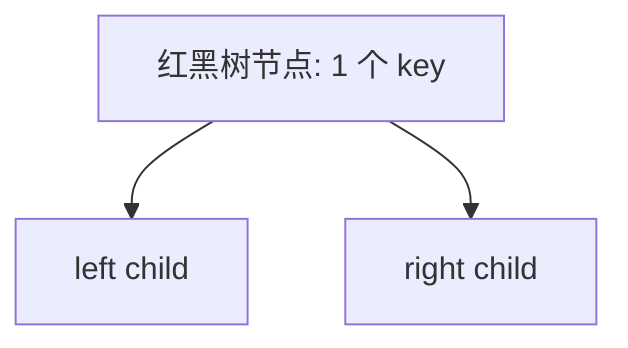

这种结构适合内存对象管理，例如 Linux 内核中的 rbtree：

```c
struct demo_node {
	int 			key;
	struct rb_node 	 node;
};
```

这里是嵌入式（intrusive）节点示意：业务对象内放一个固定布局的链接成员，业务对象本身未必等大。具体接口沿前文 Linux 节点模型阅读，不将这段结构声明当作可独立运行程序。

但是数据库、文件系统、KV 存储面对的问题并不只是：

```text
如何比较 key；
如何保持树高为 O(log n)。
```

它们还要面对：

```text
如何减少 page 访问；
如何减少 block 访问；
如何减少随机 I/O；
如何让范围扫描尽量连续；
如何让上层索引页常驻缓存；
如何让逻辑有序映射到物理局部性。
```

因此，多路平衡树并不是在“替代红黑树”，而是在解决另一个层面的工程问题：

```text
红黑树常用于对象级有序索引；
B/B+ 树可按页/块组织更大扇出的有序索引；
两者的使用环境有交集，内存中也可采用 B 树布局。
```

------

### 34.2.3\_从\_2-3-4\_树看多路节点的意义

2-3-4 树的节点可以保存 1、2、3 个 key，内部节点分别有 2、3、4 个非空孩子，叶子没有孩子。本专题此前使用唯一键：节点内命中立即返回，孩子区间不包含已存在的分隔键。

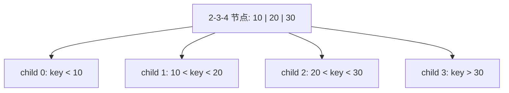

这个结构说明：

```text
一个节点不一定只能做一次二分判断；
一个节点可以通过多个 key，把数据集合切成多个区间。
```

红黑树中，一个节点通常只保存一个 key，因此每访问一个节点，只能决定向左还是向右。

2-3-4 树中，一个节点保存多个 key，因此一次节点访问可以选择多个分支之一。

这个思想继续扩展，就形成了 B 树和 B+ 树：

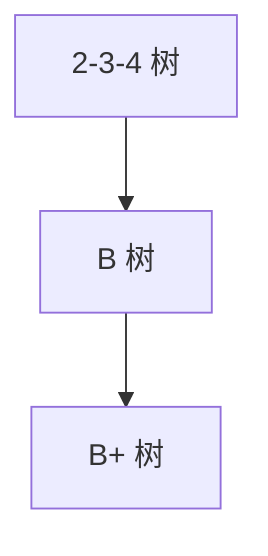

2-3-4 树是最大四路的一种低阶 B 树，不是所有多路树中的“最低阶”；还存在 2-3 树等模型。上图表示学习扩展关系，不是某产品的历史演化或自动转换流程。

这里按经典区分建立两种布局：B 树允许内部键携带记录；B+ 树把记录或记录引用集中在叶层，内部键只为选择孩子服务。常见 B+ 布局再连接相邻叶页，便于范围推进。内部可以保存叶层边界键的副本，所以后面的相等键路由与刚才 2-3-4 树不同；复制边界不表示业务记录重复。

例如教学页大小 4096 字节，页头 128，固定分隔键 16、孩子引用 8。容纳 m 个键需 16m+8(m+1)≤3968，因此最多 165 键、166 路。假设一百万条记录每叶页装 100 条，10000 个叶页上方约需 61 个内部页和一个根，形成三层。这里是给定布局的容量推算，不含填充率、可变长键、溢出页和缓存；也不能把二叉树约二十次节点访问直接等同二十次磁盘 I/O。

------

### 34.2.4\_key\_是什么\_它是排序规则和范围划分的载体

在 B+ 树家族中，key 不只是一个普通数值。更准确地说：

```text
key = 可比较、可排序、可用于划分搜索范围的字段或字段组合。
```

例如数据库中：

```sql
create index idx_age on user_record(age);
```

此时 `age` 是索引 key。

又例如：

```sql
create index idx_city_age on user_record(city, age);
```

此时 `(city, age)` 是联合 key，按先比较 city、相等再比较 age 的顺序建立一个排序轴。SQL 两行是已有表上的索引声明示意，未提供数据库环境，不属于后文 C++ 实验。

比较器必须定义一致顺序；字符串排序规则、NULL 位置和重复业务键需要由具体引擎规定。常见做法把记录身份作为附加排序成分，或者为相等键维护记录集合，不能直接沿用前文“整个树不允许重复整数”的全部实现。

B+ 树并不关心业务语义，它只要求 key 能够比较：

```text
key_a < key_b
key_a = key_b
key_a > key_b
```

key 在 B+ 树中主要有三种角色：

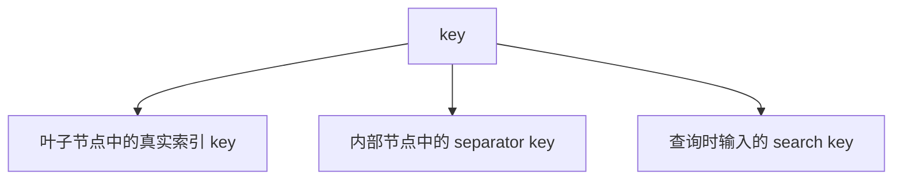

其中，内部节点中的 key 通常不是完整数据，而是用于划分子树范围的 separator key。

例如：

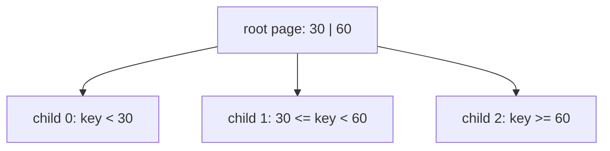

本图约定分隔键是右子树的下界，因此等于 30 要进入中间孩子、等于 60 进入最右孩子。别的格式可以采用左侧上界约定，算法必须与页格式一致。如果查询 key=45，根据 separator key 判断：

```text
30 <= 45 < 60
```

然后访问 `child_1`。

所以 key 的核心用途是：

```text
在内部节点中裁剪搜索范围；
在叶子节点中定位真实记录或记录引用；
在范围扫描中确定起点和终点。
```

------

### 34.2.5\_随机插入与有序结果

写入可能升序、降序、随机或成批到来。这里选一个乱序输入，观察结构维护怎样保证排序：

例如插入顺序可能是：

```text
50, 3, 90, 17, 62, 8, 100, 41
```

一般在线接口不要求调用者提前排序，但批量导入可以利用已排序输入；不能把“输入必然不可预测”当作树的性质。

但是 B+ 树会在每次插入时执行受控插入：

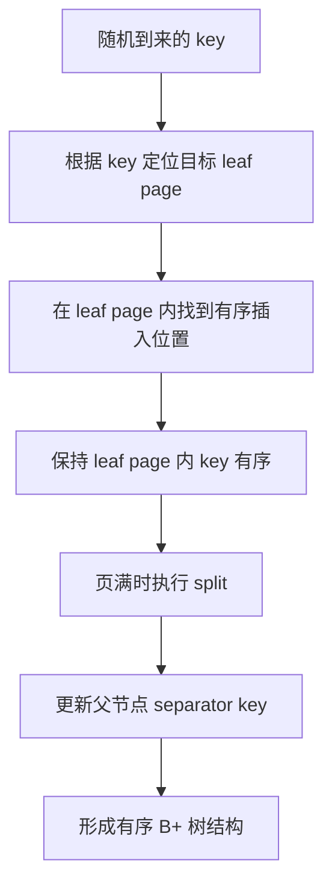

因此，关键不是：

```text
插入输入是否有序。
```

而是：

```text
随机输入经过 B+ 树维护之后，结果结构是否有序。
```

维护有序索引不会把业务到达顺序变成有序输入，却会改变写入如何组织。输入分布仍影响分裂位置、锁竞争和页占用；相同键集合不能据此推出相同写成本。

可以概括为：

```text
随机写入是输入；
受控插入是过程；
有序索引是结果；
高效查询是收益。
```

------

### 34.2.6\_有序页维护怎样同时约束读写成本

B+ 树写入时需要维护结构：

```text
页内插入；
页内移动；
页分裂；
父节点 separator key 更新；
必要时继续向上分裂；
根节点可能增长。
```

这些都是写入阶段的成本。

但是这些成本换来的结果是：查询时可以使用稳定的有序结构。

点查路径如下：

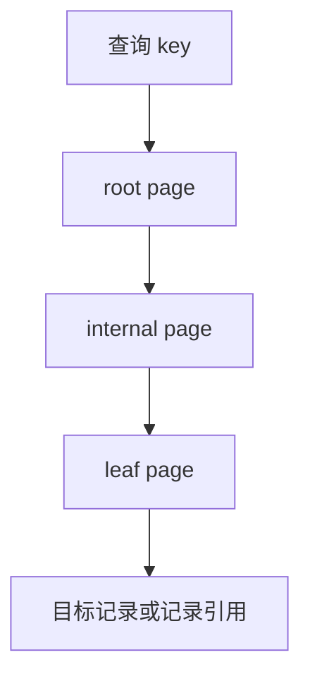

范围查询路径如下：

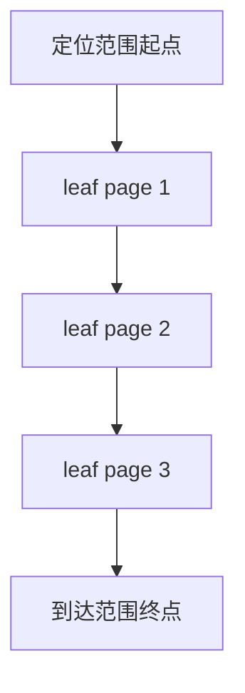

读路径可利用以下条件：

```text
点查时减少树高；
索引下降通常每层选择一个子页，溢出记录和回表另算；
页内按比较算法定位键，不必是线性连续扫描；
root/internal page 更容易被缓存；
范围扫描可以沿叶子层推进；
不需要每个 key 都重新从 root 查找。
```

所以不能说 B+ 树让随机写入本身消失。
更准确地说：

```text
B+ 树维护有序页来支持点查和范围推进，同时承担页更新与分裂成本；
读写都受扇出、缓存、填充率、持久化和并发协议影响。
```

------

### 34.2.7\_为什么\_减少访问页面次数\_有物理意义

在抽象算法中，通常只计算比较次数。
但在真实系统中，访问一个地址并不是统一成本。

回到开头区分的软件取页与硬件访存。访问 buffer pool 自身也是 CPU 的内存访问，不能画成 CPU 先穿过所有硬件层，最后才访问软件缓存。

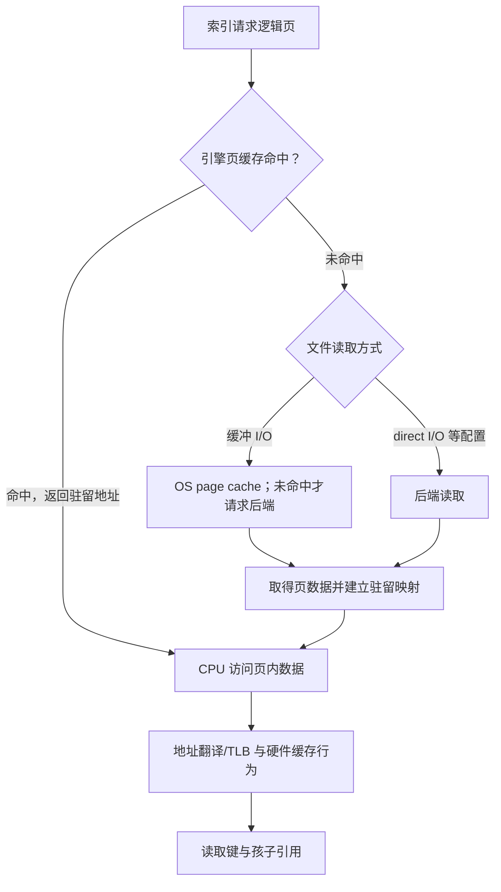

图中的硬件框只提示另一个观察维度，不规定 TLB 与缓存的串行先后，不同处理器可以并行查找或采用不同缓存索引方式。RocksDB 的官方概览明确区分自身 block cache 与可选择的 direct I/O，说明软件页缓存链也不是唯一固定路径。[RocksDB I/O 与缓存](https://github.com/facebook/rocksdb/wiki/RocksDB-Overview#block-cache----compressed-and-uncompressed-data)。

减少索引页请求可能减少下列成本，但每一项都要结合命中、复用和实现核实，不能把请求减少直接写成所有 miss 都减少：

```text
减少 cache miss；
减少 TLB miss；
减少 buffer pool miss；
减少 page cache miss；
减少随机 block I/O；
减少页锁或闩锁获取次数；
减少范围扫描时的重复路径查找。
```

红黑树的访问模式通常是指针追逐：

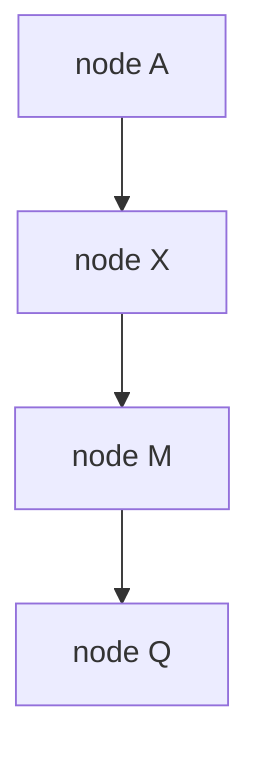

下一次访问哪个节点，必须等当前节点加载后才能知道。

这种访问属于依赖式加载：

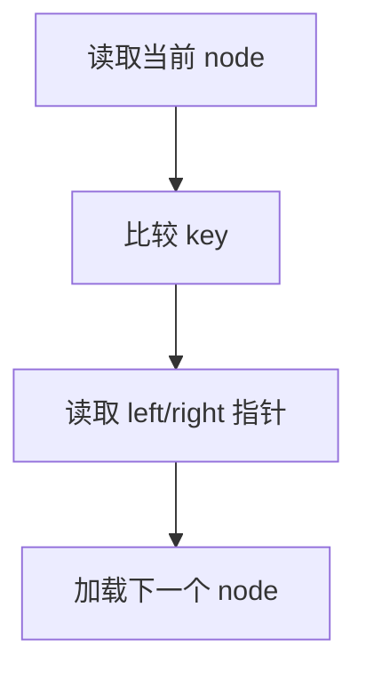

B+ 树的访问模式则不同：

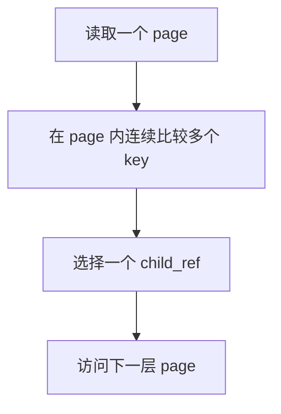

B+ 树同样依赖当前页内容选择下一页，仍有层间依赖。较大扇出有机会减少串行层数，一页内可完成多个范围判断；若相关数据已驻留，页请求可能根本不产生后端读取。后面的模型会把请求和未命中分开计数。

------

### 34.2.8\_页内连续访问为什么比指针跳转更容易优化

固定宽度数组允许按基址和下标计算地址。若实际访问模式也有局部性，它可能利用下列条件；这些是机会，不是仅凭 array[i] 语法就保证更快：

```text
地址可计算；
数据连续；
cache line 利用率高；
TLB 局部性好；
硬件预取器容易识别访问模式。
```

先看“定长键紧密排在数组里”这一教学布局：

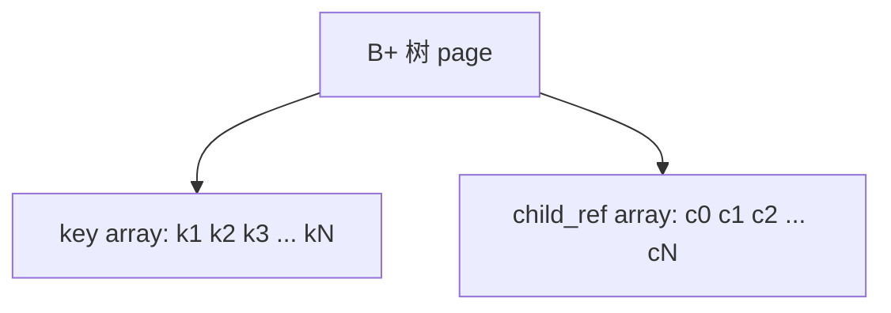

CPU 访问一个 key 时，可能会把同一个 cache line 中的相邻 key 一起带入缓存。

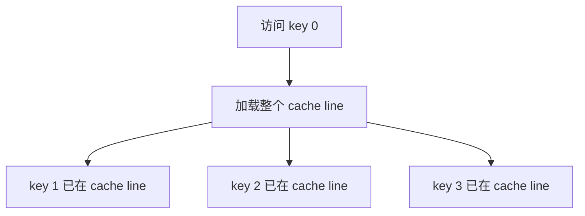

而指针跳转访问中，节点可能分布在不同地址甚至不同页中：

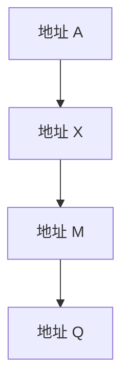

这种依赖会限制提前发起下一次访问的机会，但节点分配、软件预取、硬件能力和多条并行查询都可能改变效果，不能据此宣称所有指针结构都无法预取。

所以，“访问谁不是访问”在抽象逻辑中看似成立，但在真实硬件中不成立。

真实差异在于：

```text
连续访问更容易命中 cache；
随机跳转更容易 cache miss；
连续访问更容易命中 TLB；
随机跳转更容易 TLB miss；
规律访问可能被预取；
依赖式指针访问能否隐藏延迟取决于具体布局和并行度。
```

真实页也不必把记录按键紧邻存储。SQLite 文件格式把 cell pointer array 按键排序，而 cell 内容可以位于页内其他位置；页内存在空闲块和碎片时，可再整理。这里“同页”不等于“定长键数组连续”，图只是选定布局的示意。[SQLite 页结构](https://www.sqlite.org/fileformat.html#b_tree_pages)。

------

### 34.2.9\_B+\_树中的\_指针\_实际是什么

在内存教学模型中，可以把 B+ 树节点写成：

```c
#define DEMO_MAX_KEYS	128

struct demo_bplus_node {
	unsigned int nr_keys;
	int keys[DEMO_MAX_KEYS];
	struct demo_bplus_node *children[DEMO_MAX_KEYS + 1];
};
```

这里的 children[] 是运行时地址，仅示意内部节点，不含叶记录、叶链接、序列化和更新协议，不能作为完整 B+ 树结构直接使用。

但是数据库、文件系统、KV 存储中的持久化结构通常不会直接保存裸指针。

因为裸指针只在当前进程、当前虚拟地址空间、当前运行时有效。
持久化文件中通常保存的是稳定定位符，例如：

```text
内部孩子定位：page id、block number、file offset 或 block handle；
叶层记录定位：tuple id、row id 或 primary key 等；
这些名称不属于同一角色，primary key 通常还需要再查一次索引。
```

可以这样理解：

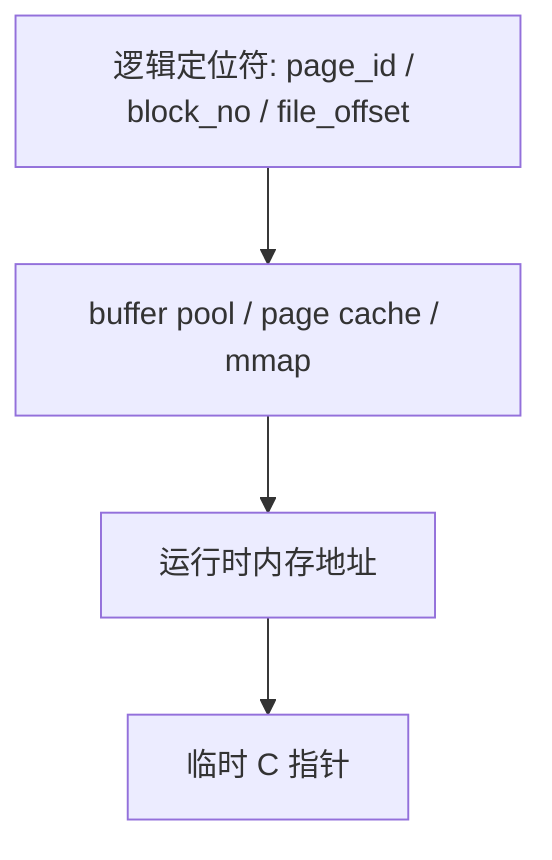

所以真实系统中不是没有指针，而是分成两层：

```text
持久化结构：保存稳定定位符；
运行时访问：通过缓存映射得到临时内存地址；
地址可用还依赖页被固定、引用或锁定，不能在缓存逐出后继续保存裸地址。
```

------

### 34.2.10\_逻辑有序不等于物理连续

B+ 树能够保证：

```text
key 逻辑有序；
子树范围有序；
叶子层逻辑有序；
所有叶子处于同一层；
节点容量受控。
```

但是它不能单独保证：

```text
逻辑相邻的 leaf page 在物理内存中一定相邻；
逻辑相邻的 leaf page 在磁盘块上一定连续；
随机插入产生的新页一定分配在旧页旁边。
```

例如逻辑顺序可能是：

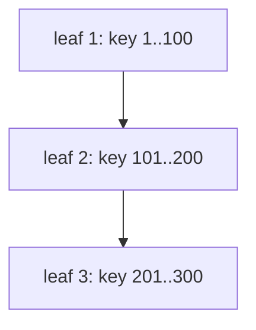

但是物理块可能是：

```text
leaf_1 -> block 1000
leaf_2 -> block 8921
leaf_3 -> block 331
```

这说明：

```text
B+ 树直接维护逻辑有序；
物理局部性需要空间分配器进一步配合。
```

空间分配器可以尝试让逻辑相邻页物理上也尽量接近：

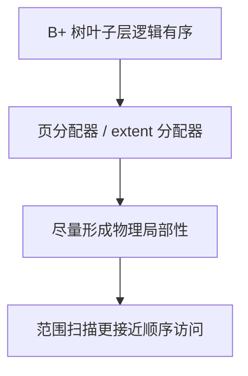

因此，本节要明确区分：

| 层次           | B+ 树是否直接保证 | 说明                  |
| -------------- | ----------------- | --------------------- |
| key 逻辑有序   | 保证              | B+ 树核心不变量       |
| 树高平衡       | 保证              | 所有叶子同层          |
| 页内 key 紧凑  | 不是结构不变量    | 由具体页格式与碎片管理决定 |
| 叶子层逻辑顺序 | 保证              | 支持范围扫描          |
| 物理地址连续   | 不保证            | 依赖分配器            |
| 磁盘块连续     | 不保证            | 依赖文件系统/存储引擎 |

所以，正确理解是：

```text
B+ 树为物理局部性创造条件；
但物理局部性不是 B+ 树单独完成的结果。
```

------

### 34.2.11\_写操作可以拆成逻辑修改与空间分配

B+ 树的写操作可以分成几个阶段：

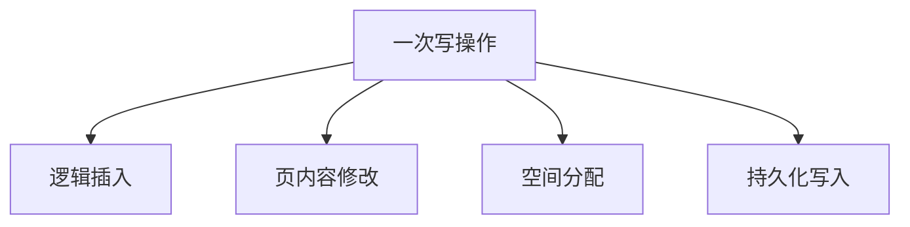

其中：

```text
逻辑插入：根据 key 找到 leaf page；
页内容修改：插入 key，必要时移动记录；
空间分配：页满时分配新页；
持久化写入：按恢复协议组织日志、数据页与根/元数据发布。
```

WAL（write-ahead logging，预写日志）要求相应日志先于相关脏数据页持久化；COW（copy-on-write，写时复制）保留旧版本并写新页，再按协议发布新入口；后台刷盘只是调度手段，不能与前两种恢复策略当作互斥同类选项。它们也不自动保证业务提交已经耐久。

写入顺序可以被系统组织，输入也可能批量已排序。例如：

例如：

```text
WAL 可以顺序写；
dirty page 可以延迟刷盘；
多个脏页可以批量写回；
页分配器可以尽量分配邻近页；
bulk load 可以先排序再构建索引；
fill factor 可以预留页内空间，减少分裂。
```

因此，不能说写操作完全不可优化。
更准确地说：

```text
在线接口不依赖输入预排序；
已知分布、批量排序和资源余量都可以用于优化写入路径。
```

B+ 树写操作的直接目标是维护有序结构。
空间分配和持久化系统则进一步尝试把逻辑有序转化为物理局部性。

------

### 34.2.12\_数据库中的\_B+\_树应用

数据库索引通常需要支持：

```text
等值查询；
范围查询；
排序；
分页；
前缀匹配；
聚簇存储；
二级索引回表。
```

这些需求常能利用有序索引，但各项还有条件：联合键必须匹配排序前缀，字符串前缀查询受比较规则约束，大 OFFSET 分页仍可能走过许多记录。PostgreSQL 18 文档对范围比较、字符串前缀和排序用途分别给出条件，也明确索引顺序并非总比扫描后排序更快。[PostgreSQL 18 B-tree 用途](https://www.postgresql.org/docs/18/indexes-types.html#INDEXES-TYPES-BTREE)。

以数据库表为例：

```text
id      name      age
----------------------
10      a         18
20      b         21
30      c         25
40      d         30
```

如果对 `id` 建立 B+ 树索引，则叶子层可以保存：

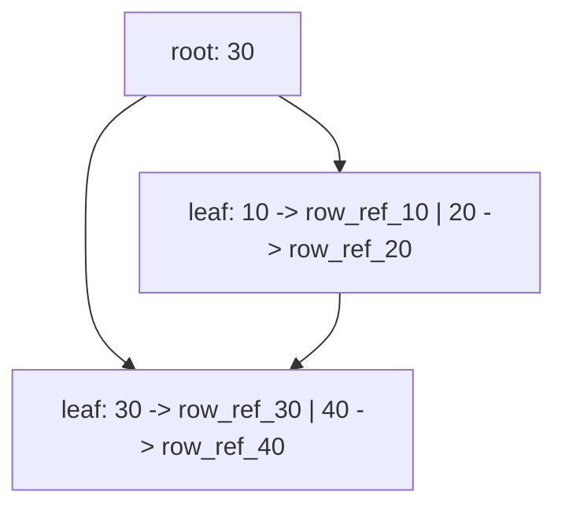

查询 `id = 40` 时：

```text
访问 root；
判断 40 >= 30；
访问右侧 leaf；
在 leaf 中找到 40。
```

范围查询 `id between 20 and 40` 时：

```text
先定位 key = 20 所在 leaf；
然后沿叶子层继续扫描到 key = 40。
```

普通平衡 BST 也能通过中序后继有序扫描，无须每个键重查根；B+ 页布局的区别在于一页容纳多条记录和页间推进的组织。对当前图，潜在收益是：

```text
点查路径短；
范围扫描天然有序；
叶子页可以顺序推进；
上层内部页容易缓存。
```

图中的 row_ref 是通用记录引用，不固定为磁盘块。以 MySQL 8.4 InnoDB 为例，聚簇索引保存行数据，二级索引记录包含主键列；需要完整行而未被当前索引覆盖时，用主键再查聚簇索引。不能把所有叶层都画成同一种裸行地址。[InnoDB 聚簇与二级索引](https://dev.mysql.com/doc/refman/8.4/en/innodb-index-types.html)。

------

### 34.2.13\_文件系统中的\_B/B+\_树应用

文件系统中可能需要索引以下元数据；具体文件系统采用哪些树和格式要分别核对：

```text
inode；
目录项；
文件逻辑偏移；
物理块地址；
extent；
空闲空间；
checksum；
引用计数；
快照元数据。
```

例如文件 extent 映射可以抽象为：

```text
文件逻辑偏移范围 -> 磁盘物理块范围
```

图示如下：

```mermaid
graph TD
	file_offset["文件逻辑偏移"]
	extent_tree["extent tree"]
	extent_item["extent: logical_start, length, physical_start"]
	disk_blocks["磁盘物理块范围"]

	file_offset --> extent_tree
	extent_tree --> extent_item
	extent_item --> disk_blocks
```

当文件很大时，如果没有有序索引，查找某个文件偏移对应的物理块就可能需要扫描大量元数据。

使用按文件偏移排序的范围索引后，可以排除不相关区间，定位 extent（连续范围描述）。以本仓库固定 NXP Linux 提交为边界，ext4 的 Documentation/filesystems/ext4/ifork.rst 区分内部 extent_idx 与叶层 extent，根还可直接放在 inode.i_block 中；一个逻辑节点未必总独占外部页。这里只核对格式职责，不声称覆盖挂载配置和运行时性能。[固定文档](https://github.com/nxp-imx/linux-imx/blob/dfaf2136deb2af2e60b994421281ba42f1c087e0/Documentation/filesystems/ext4/ifork.rst)，[基线记录](../../../../research/source_reading/linux/SOURCE_BASELINE.md#1.27_页级索引与ext4范围格式证据)。

文件系统中的 B 树家族通常用于：

```text
从文件偏移查物理块；
从目录 key 查目录项；
从物理块查引用者；
从地址范围查 checksum；
从空间范围查空闲块；
管理快照和引用计数。
```

所以 B/B+ 树在文件系统中的意义是：

```text
组织大规模有序元数据；
支持范围查找；
支持局部更新；
支持页/块级缓存；
降低元数据查找路径长度。
```

------

### 34.2.14\_KV\_存储中的\_B+\_树与\_LSM\_对比

在持续更新同一组键的 KV 任务中，可以维护在线页树，也可以先积累有序批次再合并。后者称 LSM（log-structured merge-tree，日志结构合并树）。它没有取消排序责任，而是把部分重排推迟到批量维护，先建立这条新约束再比较两类路线：

```mermaid
graph TD
	kv_store["KV 存储"]
	bplus_kv["B+ 树型 KV"]
	lsm_kv["LSM 树型 KV"]

	kv_store --> bplus_kv
	kv_store --> lsm_kv
```

B+ 树型 KV 的特点是：

```text
直接维护有序树；
点查和范围推进可利用当前页索引；事务能力还由恢复与并发协议提供；
写入可能触发页分裂和随机页修改。
```

LSM 型 KV 的特点是：

```text
通常先记录日志并更新内存中的有序表 memtable；
刷出排序批次形成 SST（sorted string table，有序键值表文件）；
compaction 读取旧批次、合并覆盖/删除版本并重写新文件；
查询可能需要在多个候选批次中筛选可见版本，再组合结果。
```

这说明一个重要事实：

```text
B+ 树优化的是持续在线维护有序页结构；
LSM 将部分随机页维护转为批量刷出和后台合并；
写放大、读放大和临时空间成本仍然存在。
```

二者都围绕同一个核心问题：

```text
随机写入输入如何变成可高效读取的有序结构。
```

只是策略不同：

| 结构  | 写入策略           | 读取策略            | 典型优势         |
| ----- | ------------------ | ------------------- | ---------------- |
| B+ 树 | 在线维护页和分隔键 | 沿页索引查找，范围时推进叶层 | 检查分裂、缓存与脏页写回成本 |
| LSM   | 内存整理、批量刷出、持续合并 | 多个候选批次中合并版本 | 检查合并带宽、写放大、读放大与停顿 |

RocksDB 的官方概览说明 memtable 刷为文件、compaction 整理版本，以及后台工作积压可能使前台写入停顿。Bloom Filter（布隆过滤器）可排除部分“不可能含此键”的文件，但阳性仍需检查，也不免除一般范围扫描。故应以相同数据量、键宽度、读写分布、耐久与尾延迟目标比较，不能由“LSM”三个字直接断言吞吐更高。[RocksDB 合并与停顿](https://github.com/facebook/rocksdb/wiki/RocksDB-Overview#multi-threaded-compactions)。

------

### 34.2.15\_将页请求与实现成本放回同一模型

针对 B+ 树家族，可以建立下面这套模型：

```mermaid
graph TD
	random_write["随机写入 key"]
	controlled_write["受控写入: 定位、插入、分裂、上推"]
	logical_order["形成逻辑有序结构"]
	page_layout["形成页级组织"]
	read_path["读操作按 key 裁剪路径"]
	range_scan["范围扫描沿叶子层推进"]
	cache_benefit["提高缓存与页访问效率"]
	allocator["空间分配器尝试优化物理局部性"]

	random_write --> controlled_write
	controlled_write --> logical_order
	controlled_write --> page_layout

	logical_order --> read_path
	logical_order --> range_scan
	page_layout --> cache_benefit

	logical_order --> allocator
	allocator --> cache_benefit
```

可以总结为：

```text
1. B+ 树接受任意到达顺序，已排序批量输入也可以利用。

2. B+ 树不能让随机写入输入天然有序。

3. B+ 树通过受控插入，把随机 key 持续整理成有序、平衡、页级组织的索引结构。

4. 有序布局提供可利用的读取条件，并承担相应写维护成本：
   点查时减少访问层数；
   范围查时沿叶子层推进；
   页内访问更连续；
   root/internal page 更容易缓存。

5. B+ 树直接保证逻辑有序，不直接保证物理连续。

6. 分配器影响布局，缓存影响驻留，恢复协议影响持久化顺序，
   它们各自承担不同责任，不能统一等同为让物理地址连续。
```

------

### 34.2.16\_本节小结

本节从 2-3-4 树扩展到了 B 树、B+ 树，目的不是提前进入数据库实现细节，而是回答 2-3-4 树的现实意义。

2-3-4 树说明了：

```text
一个搜索树节点可以保存多个 key；
多个 key 可以划分多个子区间；
多路节点可以降低树高；
所有叶子同层可以保证平衡。
```

B 树、B+ 树进一步把这个思想扩展到 page/block 粒度：

```text
节点常按逻辑页组织，但小根内嵌、溢出页等是实现边界；
一个 page 保存多个 key；
一次 page 访问完成多个范围判断；
较大扇出可能减少层数，实际收益还取决于填充率和缓存；
范围扫描可以沿叶子层推进；
上层索引页更容易缓存。
```

因此，本节最终结论是：

> **B+ 树以页内排序和分隔键维护有序索引。扇出、页布局、缓存命中、分配与持久化共同决定读写代价；页请求、缓存未命中和设备 I/O 必须分别核对。**

这也解释了为什么 2-3-4 树不只是红黑树的结构解释工具。
它同时也是理解 B 树、B+ 树、数据库索引、文件系统元数据索引和 KV 存储索引的最小模型。

------


## 34.3\_运行页请求与未命中的计数模型

完整材料 [page_index_model.cpp](../../../../labs/kernel/tree_basics/materials/page_index_model.cpp)固定一层内部页和三个叶页。根分隔键为 30/60，采用右侧下界规则；叶页 next 保存逻辑页号。三个叶页的物理块标签分别是 1000、8921、331，逻辑连续不要求块号相邻。

page_cache.resident 保存本次模型已驻留哪些页，fetch 每次增加 requests，首次访问才增加 misses。页数据实际一直在宿主常量数组里，没有文件读写、逐出、操作系统缓存或硬件计时；misses 只是“如果这一层此前没有缓存，需要向下一层取页”的事件数，不是磁盘 I/O 数。模型只接受构造好的合法四页树，不提供插入、持久化、任意页校验或并发。

```cpp
#include <array>
#include <cassert>
#include <cstddef>
#include <iostream>

/* 四个逻辑页驻留在宿主数组中；物理块号只是模型标签。 */
struct page {
    bool leaf;
    unsigned int count;
    std::array<int, 3> keys;
    std::array<unsigned int, 3> child;
    int next;
    unsigned int block;
};
static const std::array<page, 4> pages{{
    {false, 2, {30, 60, 0}, {1, 2, 3}, -1, 9},
    {true, 3, {10, 20, 25}, {}, 2, 1000},
    {true, 3, {30, 40, 50}, {}, 3, 8921},
    {true, 3, {60, 70, 80}, {}, -1, 331}
}};
struct page_cache {
    std::array<bool, 4> resident{};
    unsigned int requests = 0;
    unsigned int misses = 0;
    const page &fetch(unsigned int id) {
        assert(id < pages.size());
        ++requests;
        if (!resident[id]) {
            resident[id] = true;
            ++misses;
        }
        return pages[id];
    }
};
struct scan_result {
    std::array<int, 9> keys{};
    std::size_t count = 0;
};

static unsigned int locate_leaf(page_cache &cache, int key)
{
    const page &root = cache.fetch(0);
    unsigned int i = 0;
    // 内部键复制右侧最小边界，相等时必须向右。
    while (i < root.count && key >= root.keys[i])
        ++i;
    return root.child[i];
}
static bool point_lookup(page_cache &cache, int key)
{
    unsigned int id = locate_leaf(cache, key);
    const page &leaf = cache.fetch(id);
    for (unsigned int i = 0; i < leaf.count; ++i)
        if (leaf.keys[i] == key)
            return true;
    return false;
}
static scan_result range_scan(page_cache &cache, int low, int high)
{
    scan_result result;
    if (low > high)
        return result;
    int id = static_cast<int>(locate_leaf(cache, low));
    while (id >= 0) {
        const page &leaf = cache.fetch(static_cast<unsigned int>(id));
        for (unsigned int i = 0; i < leaf.count; ++i) {
            int key = leaf.keys[i];
            if (key > high)
                return result;
            if (key >= low) {
                assert(result.count < result.keys.size());
                result.keys[result.count++] = key;
            }
        }
        if (leaf.keys[leaf.count - 1] >= high)
            return result;
        id = leaf.next;                     // 跟随逻辑页号，不把物理块号加一
    }
    return result;
}
static void print_counts(const char *label, const page_cache &cache)
{
    std::cout << label << " requests=" << cache.requests
              << " misses=" << cache.misses << "\n";
}
int main()
{
    page_cache range_cache;
    auto result = range_scan(range_cache, 20, 70);
    for (std::size_t i = 0; i < result.count; ++i)
        std::cout << result.keys[i] << (i + 1 == result.count ? "\n" : " ");
    print_counts("range cold", range_cache);

    page_cache point_cache;
    for (int key : {20, 25, 30, 40, 50, 60, 70})
        if (!point_lookup(point_cache, key)) return 1;
    print_counts("points cold", point_cache);

    range_cache.requests = range_cache.misses = 0; // 保留已驻留页，开始下一轮
    range_scan(range_cache, 20, 70);
    print_counts("range warm", range_cache);
    page_cache root_cached;
    root_cached.resident[0] = true;
    range_scan(root_cached, 20, 70);
    print_counts("root cached", root_cached);

    const std::array<int, 9> expected{{10, 20, 25, 30, 40, 50, 60, 70, 80}};
    for (int low = 0; low <= 90; ++low)
        for (int high = 0; high <= 90; ++high) {
            page_cache cache;
            auto actual = range_scan(cache, low, high);
            std::size_t pos = 0;
            for (int key : expected)
                if (key >= low && key <= high) {
                    assert(pos < actual.count && actual.keys[pos] == key);
                    ++pos;
                }
            assert(pos == actual.count);
        }
    return 0;
}
```

从材料目录执行：

```bash
c++ -std=c++17 -Wall -Wextra -Werror -pedantic page_index_model.cpp -o page_index_model
./page_index_model
```

输出为：

```text
20 25 30 40 50 60 70
range cold requests=4 misses=4
points cold requests=14 misses=4
range warm requests=4 misses=0
root cached requests=4 misses=3
```

范围查询只查一次根再依次访问三个叶页，逐键点查七次各查根和一叶，所以 requests 是 4 与 14。但本模型缓存不逐出，访问过的页都会保留，两种冷启动最终都只缺失四个不同页。这说明减少逻辑请求确实减少重复处理，却不必等比例减少下一层读取。热查询仍发四次逻辑请求，misses 已为零；根预先驻留时只缺三个叶页。

完整程序还把 0～90 的所有起止组合与独立有序集合比较，包括 low>high 的空范围。它检查结果、端点与相等分隔键下行，不验证缓存替换策略、真实 B+ 更新或吞吐。

## 34.4\_改变一个条件再选择方案

先查询 30：根中命中分隔键仍应进入第二个叶页，不能像 P06 的唯一键多路查找那样直接把内部 30 当作记录。再把范围改成 [31,49]，只输出 40；改成 [81,90] 没有结果，但仍需要到最后一个叶页确认。low>high 则在请求任何页之前返回空集。

接着只改三页的 block 标签为连续数字，预测输出是否变化。本模型不计设备布局成本，所以所有计数不变；这不是“物理位置没有影响”，而是模型没有测那个维度。若要比较真实顺序/随机 I/O，必须再固定设备、缓存状态、页大小、并发与读写方式。

最后选择三个不同任务：小型驻留对象集合、远大于缓存的范围查询、持续高频更新并允许后台维护。分别列出你要测的路径层数、驻留率、页修改/合并量和尾延迟，再考虑二叉对象索引、页树或 LSM；不能仅凭“读多选 B+、写多选 LSM”结束判断。

后续沿[P13 B 树扩展](P13_再扩展到_B_树与_B+_树.md)继续比较页组织；内核 VMA（virtual memory area，虚拟内存区域）描述进程地址空间中的一段范围，是另一个索引任务。沿[P06 Maple 入口](P06_2-3-4_树_从多路平衡到红黑树的结构桥梁.md#6.10_Linux_VMA_管理为什么从红黑树走向_Maple_Tree)阅读时仍要重新核对对象、版本与约束，不能把数据库页模型直接套过去。
