# 第35章\_红黑插入与红红冲突上推

## 35.1\_从检查一棵树走到增加一个键

[P07 的性质检查](P07_红黑树_把_2-3-4_树映射成二叉表示.md#7.3.9_让程序区分三种非法结构)已经能判断稳定树是否合法。现在在 30 黑、20 红的树中插入 10：BST 顺序要求把它放到 20 左侧，颜色规则却不允许两个红节点连在一起。我们要保持刚才找到的键区间，同时消除这处违例。

本章使用普通红黑树的 **自底向上插入**，唯一键、空指针表示 NIL、单线程独占整棵树。先修是 P05 的单旋和 P06/P30 的多路编码与分裂；无需先了解 Linux 指针打包或内核内存分配。暂不处理删除、多线程访问和左倾红黑树的额外约束。

先把角色放到对象上：X 是当前检查节点，P 是它的父亲，G 是祖父，U 是 G 的另一个孩子，也就是叔叔。程序中的 root_ 是整树入口指针，slot 是指向某个指针槽的局部变量；shade 成员保存颜色。对象地址保持不变，但旋转会改变谁是父亲、谁是祖父。

一次插入经过以下阶段。搜索路径与颜色修复属于同一轮操作，但承担不同责任；修复中的临时状态不能交给外部读取者当成稳定树。

| 阶段 | 进入条件与写入位置 | 保持的保证与下一步 |
| --- | --- | --- |
| S0 找空槽 | 局部 `slot` 指向 `root_` 或某节点的 left/right 成员；沿键值比较下行 | 相等则返回重复；空槽确定全部祖先给出的区间 |
| S1 接红叶 | 先在拥有对象的容器中构造节点，再写节点 parent 与 `*slot` | BST 和黑高不变；可能红父红子，进入修复 |
| S2 叔红上推 | 当前循环写 P/U/G 的 shade，再把局部 current 改为 G | 不改链接，局部入口黑贡献不变；重新检查父颜色 |
| S3 叔黑收尾 | 可先改父的局部结构，再旋祖父、改颜色、写外部父槽或根入口 | 同时恢复红红与入口黑贡献；无需再向上旋转 |
| S4 返回稳定树 | 把最终 root_ 的 shade 写黑 | 包括首插和上推到根；此后才检查整树性质 |

节点对象拥有 key、shade、parent、left、right；`root_` 拥有的是入口指针，对象的内存寿命交给 `std::list<node>`。current/P/G/U 只是在修复栈帧中保存地址，旋转会改变这些地址所代表的“父/祖父”位置，不会搬移对象。这里没有线程间通信或异步通知；同一个调用者依次写链接，后面的循环和检查器再读取完成后的结构。

## 35.2\_从红红冲突推导修复分支

所谓红红冲突，就是：

> **当前红节点 `X` 的父节点 `P` 也是红节点。**

这直接违反了红黑树的局部性质：

> **红节点不能有红孩子。**

因此，红红冲突首先是一个**局部违例**。
判定红红只需查看相邻的 X/P；决定怎样修才需要继续看 G/U。这里限定为 **从合法树出发的自底向上插入**，四个角色是：

- `X`：当前节点
- `P`：父节点
- `G`：祖父节点
- `U`：叔叔节点

X 起初是新叶子，上推以后可以是原祖父；角色名字不表示固定对象身份。U 是 G 的另一个孩子，可以为黑色 NIL。循环中 P 红，而原树根黑，所以 G 必然存在且为黑；不能把这套分支拿来修任意颜色损坏的树。

------

### 35.2.1\_先看一个最小红红冲突示例

下面这棵树就是一个最小的红红冲突局部：

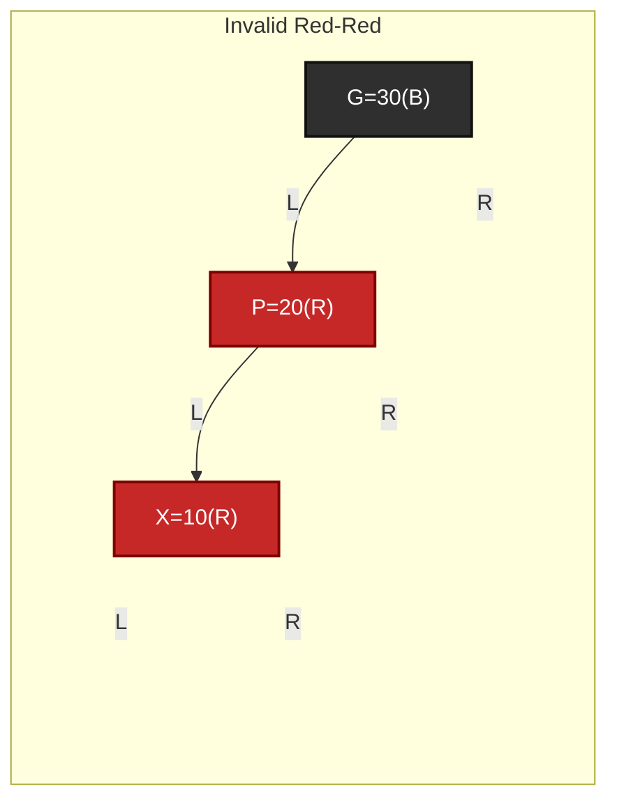
```mermaid
graph LR
	subgraph "Invalid Red-Red"
		G["G=30(B)"]
		P["P=20(R)"]
		RG[" "]
		X["X=10(R)"]
		PG[" "]
		XL[" "]
		XR[" "]
	end

	G -->|"L"| P
	G -->|"R"| RG

	P -->|"L"| X
	P -->|"R"| PG

	X -->|"L"| XL
	X -->|"R"| XR

	classDef black fill:#2f2f2f,stroke:#111,color:#fff,stroke-width:2px;
	classDef red fill:#c62828,stroke:#7f0000,color:#fff,stroke-width:2px;
	classDef ghost fill:transparent,stroke:transparent,color:transparent;

	class G black;
	class P,X red;
	class RG,PG,XL,XR ghost;

	linkStyle 1 stroke:transparent;
	linkStyle 3 stroke:transparent;
	linkStyle 4 stroke:transparent;
	linkStyle 5 stroke:transparent;
```

这里：

- `G=30(B)` 是祖父节点；
- `P=20(R)` 是父节点；
- `X=10(R)` 是当前节点。

问题就在于：

```text
P 是红，X 也是红
```

因此这是标准的红红冲突。

------

### 35.2.2\_红红冲突最常出现在哪里

红红冲突最常出现在**插入之后**。

因为红黑树插入时，通常会先按 BST 规则把新节点挂到合适位置，然后把新节点**默认染成红色**。
这样一来，如果父节点 `P` 恰好本来就是红色，那么新节点 `X` 一接上去，就会立刻形成红红冲突。

下面给一个最典型的插入过程。

插入前：

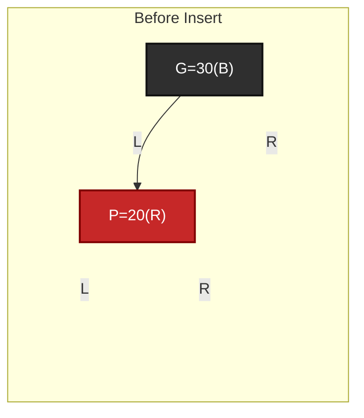
```mermaid
graph LR
	subgraph "Before Insert"
		G["G=30(B)"]
		P["P=20(R)"]
		RG[" "]
		PL[" "]
		PR[" "]
	end

	G -->|"L"| P
	G -->|"R"| RG

	P -->|"L"| PL
	P -->|"R"| PR

	classDef black fill:#2f2f2f,stroke:#111,color:#fff,stroke-width:2px;
	classDef red fill:#c62828,stroke:#7f0000,color:#fff,stroke-width:2px;
	classDef ghost fill:transparent,stroke:transparent,color:transparent;

	class G black;
	class P red;
	class RG,PL,PR ghost;

	linkStyle 1 stroke:transparent;
	linkStyle 2 stroke:transparent;
	linkStyle 3 stroke:transparent;
```

现在插入关键字 `10`。
按 BST 路径：

- `10 < 30`，进入左子树；
- `10 < 20`，挂到 `P` 的左侧。

插入后，新节点默认染红：

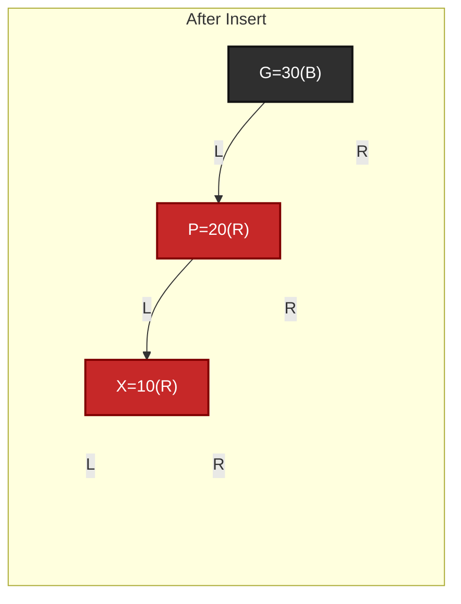
```mermaid
graph LR
	subgraph "After Insert"
		G["G=30(B)"]
		P["P=20(R)"]
		RG[" "]
		X["X=10(R)"]
		PR[" "]
		XL[" "]
		XR[" "]
	end

	G -->|"L"| P
	G -->|"R"| RG

	P -->|"L"| X
	P -->|"R"| PR

	X -->|"L"| XL
	X -->|"R"| XR

	classDef black fill:#2f2f2f,stroke:#111,color:#fff,stroke-width:2px;
	classDef red fill:#c62828,stroke:#7f0000,color:#fff,stroke-width:2px;
	classDef ghost fill:transparent,stroke:transparent,color:transparent;

	class G black;
	class P,X red;
	class RG,PR,XL,XR ghost;

	linkStyle 1 stroke:transparent;
	linkStyle 3 stroke:transparent;
	linkStyle 4 stroke:transparent;
	linkStyle 5 stroke:transparent;
```

于是立刻得到：

- `P` 红
- `X` 红

这就是插入后最典型的红红冲突来源。

------

### 35.2.3\_为什么红叶把问题限制在颜色相邻

红红冲突最常出现在**插入之后**。

红黑树插入算法不是直接把新节点插入成完全合法的红黑树结构，而是分成两个阶段：

```text
红黑树插入 = BST 结构插入 + 红黑性质修复
```

第一阶段是 **BST 插入阶段**。

新节点先按照二叉搜索树规则寻找插入位置：

```text
左子树 key < 当前节点 key < 右子树 key
```

也就是说，新节点插入到哪里，首先由 key 的大小关系决定，而不是由颜色决定。

第二阶段是 **红黑树修复阶段**。

新红叶替换的原来是一处 NIL。从这条入口继续向下，原先遇到一个黑 NIL，现在经过零个新增黑节点，再到两个黑 NIL 之一；两条新路径的黑节点数量都与旧路径相同。于是原树所有黑高仍相等，只可能新增红父红子的相邻违例。若这是空树的首个节点，则没有父节点，最后把新根染黑即可。

若在非空树某处改接黑叶，经过这个入口的路径会多一个黑节点，其他路径不变。颜色相邻可局部定位，黑高差却会影响沿途分叉的比较；先染红是主动把待修问题限制为前一种。

因此红黑树插入时通常采用：

```text
新插入节点默认染红
```

------

插入前，树中已经存在一个黑色祖父节点 `G=30(B)` 和一个红色父节点 `P=20(R)`：

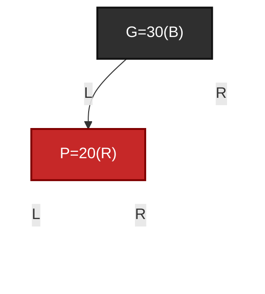
```mermaid
graph TD
	rb_g_before["G=30(B)"]
	rb_p_before["P=20(R)"]
	rb_g_right_nil[" "]
	rb_p_left_nil[" "]
	rb_p_right_nil[" "]

	rb_g_before -->|"L"| rb_p_before
	rb_g_before -->|"R"| rb_g_right_nil

	rb_p_before -->|"L"| rb_p_left_nil
	rb_p_before -->|"R"| rb_p_right_nil

	classDef rb_black fill:#2f2f2f,stroke:#111,color:#fff,stroke-width:2px;
	classDef rb_red fill:#c62828,stroke:#7f0000,color:#fff,stroke-width:2px;
	classDef rb_nil fill:transparent,stroke:transparent,color:transparent;

	class rb_g_before rb_black;
	class rb_p_before rb_red;
	class rb_g_right_nil,rb_p_left_nil,rb_p_right_nil rb_nil;

	linkStyle 1 stroke:transparent;
	linkStyle 2 stroke:transparent;
	linkStyle 3 stroke:transparent;
```

这些最小实例的透明端点表示省略绘制的 NIL，不是隐藏的数据节点。后面推广到内部子树时，会另外给出各侧黑高前提，不能把非空叔叔一律当成 NIL。

现在插入关键字 `10`。按照 BST 规则：

```text
10 < 30，进入左子树
10 < 20，挂到 20 的左侧
```

插入后，新节点默认染红：

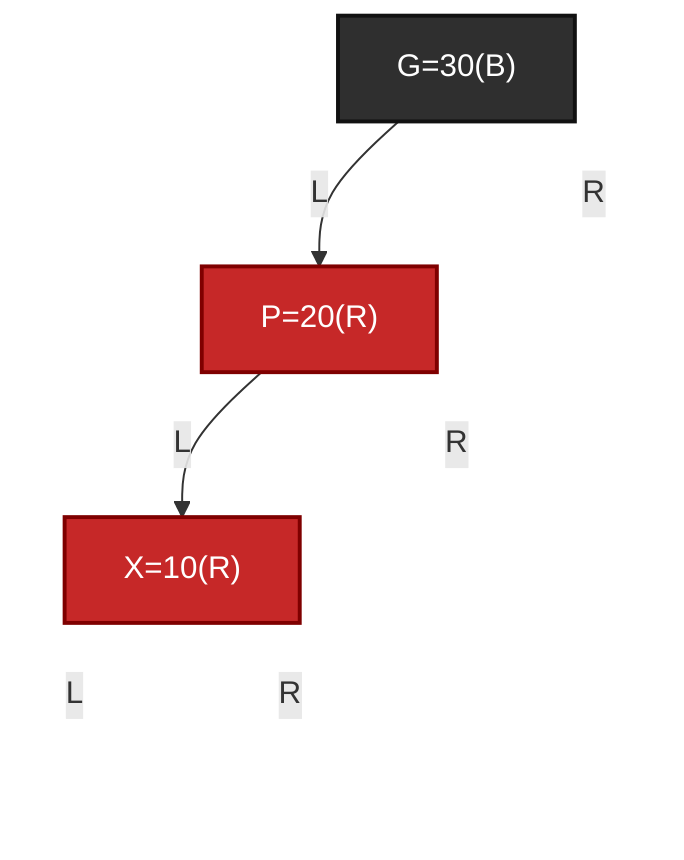
```mermaid
graph TD
	rb_g_after["G=30(B)"]
	rb_p_after["P=20(R)"]
	rb_g_right_nil_after[" "]
	rb_x_after["X=10(R)"]
	rb_p_right_nil_after[" "]
	rb_x_left_nil_after[" "]
	rb_x_right_nil_after[" "]

	rb_g_after -->|"L"| rb_p_after
	rb_g_after -->|"R"| rb_g_right_nil_after

	rb_p_after -->|"L"| rb_x_after
	rb_p_after -->|"R"| rb_p_right_nil_after

	rb_x_after -->|"L"| rb_x_left_nil_after
	rb_x_after -->|"R"| rb_x_right_nil_after

	classDef rb_black fill:#2f2f2f,stroke:#111,color:#fff,stroke-width:2px;
	classDef rb_red fill:#c62828,stroke:#7f0000,color:#fff,stroke-width:2px;
	classDef rb_nil fill:transparent,stroke:transparent,color:transparent;

	class rb_g_after rb_black;
	class rb_p_after,rb_x_after rb_red;
	class rb_g_right_nil_after,rb_p_right_nil_after,rb_x_left_nil_after,rb_x_right_nil_after rb_nil;

	linkStyle 1 stroke:transparent;
	linkStyle 3 stroke:transparent;
	linkStyle 4 stroke:transparent;
	linkStyle 5 stroke:transparent;
```

此时 `P=20(R)` 和 `X=10(R)` 连续出现：

```text
20(R) -> 10(R)
```

这就是插入后最典型的红红冲突。

红红冲突不是算法错误，而是红黑树插入过程中允许出现的临时非法状态。插入算法正是通过检测这个临时状态，进一步执行变色、旋转和向上修复，最终恢复红黑树性质。

------

从 2-3-4 树视角看，插入 `10` 相当于把 key 插入到原来的逻辑节点中：

```text
[20 | 30] 插入 10
```

逻辑结果应该是：

```text
[10 | 20 | 30]
```

也就是一个合法的 4-node。

但是红黑树刚完成 BST 插入后的局部形态是：

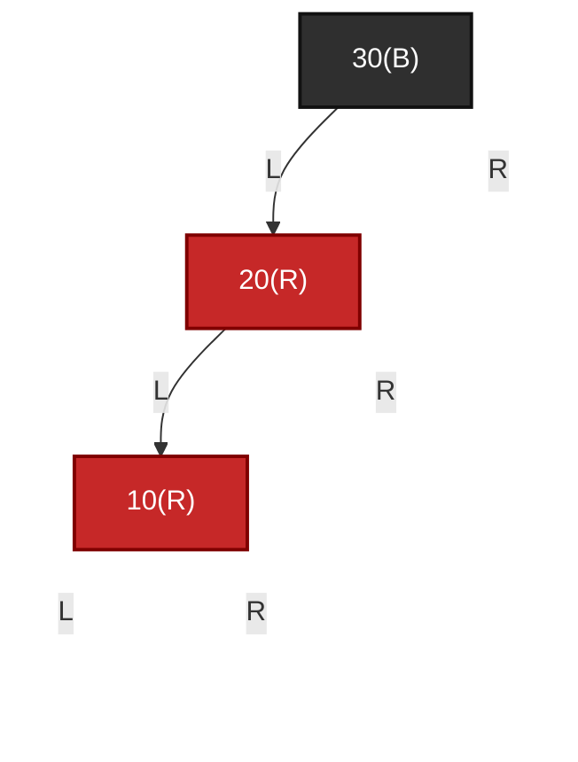
```mermaid
graph TD
	rb_g_temp["30(B)"]
	rb_p_temp["20(R)"]
	rb_g_right_nil_temp[" "]
	rb_x_temp["10(R)"]
	rb_p_right_nil_temp[" "]
	rb_x_left_nil_temp[" "]
	rb_x_right_nil_temp[" "]

	rb_g_temp -->|"L"| rb_p_temp
	rb_g_temp -->|"R"| rb_g_right_nil_temp

	rb_p_temp -->|"L"| rb_x_temp
	rb_p_temp -->|"R"| rb_p_right_nil_temp

	rb_x_temp -->|"L"| rb_x_left_nil_temp
	rb_x_temp -->|"R"| rb_x_right_nil_temp

	classDef rb_black fill:#2f2f2f,stroke:#111,color:#fff,stroke-width:2px;
	classDef rb_red fill:#c62828,stroke:#7f0000,color:#fff,stroke-width:2px;
	classDef rb_nil fill:transparent,stroke:transparent,color:transparent;

	class rb_g_temp rb_black;
	class rb_p_temp,rb_x_temp rb_red;
	class rb_g_right_nil_temp,rb_p_right_nil_temp,rb_x_left_nil_temp,rb_x_right_nil_temp rb_nil;

	linkStyle 1 stroke:transparent;
	linkStyle 3 stroke:transparent;
	linkStyle 4 stroke:transparent;
	linkStyle 5 stroke:transparent;
```

这个形态还没有调整成 4-node 对应的标准红黑表达。

标准表达应该是：

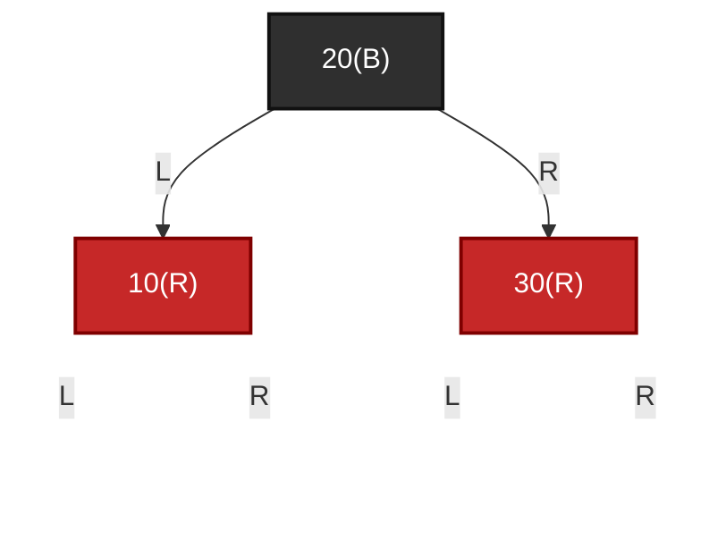
```mermaid
graph TD
	rb_root_fixed["20(B)"]
	rb_left_fixed["10(R)"]
	rb_right_fixed["30(R)"]
	rb_left_left_nil_fixed[" "]
	rb_left_right_nil_fixed[" "]
	rb_right_left_nil_fixed[" "]
	rb_right_right_nil_fixed[" "]

	rb_root_fixed -->|"L"| rb_left_fixed
	rb_root_fixed -->|"R"| rb_right_fixed

	rb_left_fixed -->|"L"| rb_left_left_nil_fixed
	rb_left_fixed -->|"R"| rb_left_right_nil_fixed

	rb_right_fixed -->|"L"| rb_right_left_nil_fixed
	rb_right_fixed -->|"R"| rb_right_right_nil_fixed

	classDef rb_black fill:#2f2f2f,stroke:#111,color:#fff,stroke-width:2px;
	classDef rb_red fill:#c62828,stroke:#7f0000,color:#fff,stroke-width:2px;
	classDef rb_nil fill:transparent,stroke:transparent,color:transparent;

	class rb_root_fixed rb_black;
	class rb_left_fixed,rb_right_fixed rb_red;
	class rb_left_left_nil_fixed,rb_left_right_nil_fixed,rb_right_left_nil_fixed,rb_right_right_nil_fixed rb_nil;

	linkStyle 2 stroke:transparent;
	linkStyle 3 stroke:transparent;
	linkStyle 4 stroke:transparent;
	linkStyle 5 stroke:transparent;
```

这个结构对应 2-3-4 树中的一个 4-node：

```text
[10 | 20 | 30]
```

------

最终结论是：

> 红黑树插入时，结构位置先由 BST 规则决定；新节点默认染红；如果父节点也是红色，就会产生红红冲突；随后通过红黑树修复流程恢复合法结构。

也可以概括为：

```text
BST 规则负责 key 的有序性；
红黑规则负责树的平衡约束；
插入修复负责把临时非法结构恢复为合法红黑树。
```

所以，红红冲突最常出现在插入之后，原因不是红黑树规则失效，而是红黑树插入算法本身允许先产生局部非法状态，再通过变色和旋转恢复红黑性质。

------

### 35.2.4\_区分编码非法与节点容量溢出

这一点必须结合 2-3-4 树来看。

先看一个合法的 `3-node` 映射：

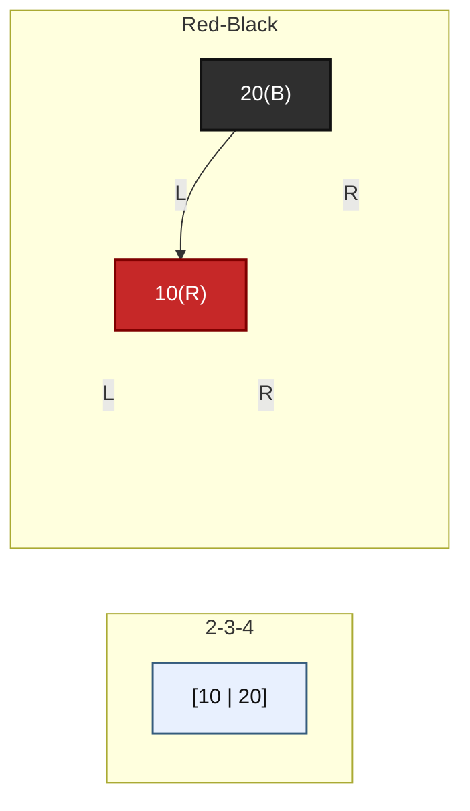
```mermaid
graph LR
	subgraph "2-3-4"
		A["[10 | 20]"]
	end

	subgraph "Red-Black"
		B["20(B)"]
		C["10(R)"]
		RG[" "]
		CL[" "]
		CR[" "]
	end

	B -->|"L"| C
	B -->|"R"| RG

	C -->|"L"| CL
	C -->|"R"| CR

	classDef node234 fill:#e8f0fe,stroke:#355c7d,color:#111,stroke-width:1.5px;
	classDef black fill:#2f2f2f,stroke:#111,color:#fff,stroke-width:2px;
	classDef red fill:#c62828,stroke:#7f0000,color:#fff,stroke-width:2px;
	classDef ghost fill:transparent,stroke:transparent,color:transparent;

	class A node234;
	class B black;
	class C red;
	class RG,CL,CR ghost;

	linkStyle 1 stroke:transparent;
	linkStyle 2 stroke:transparent;
	linkStyle 3 stroke:transparent;
```

再看一个合法的 `4-node` 映射：

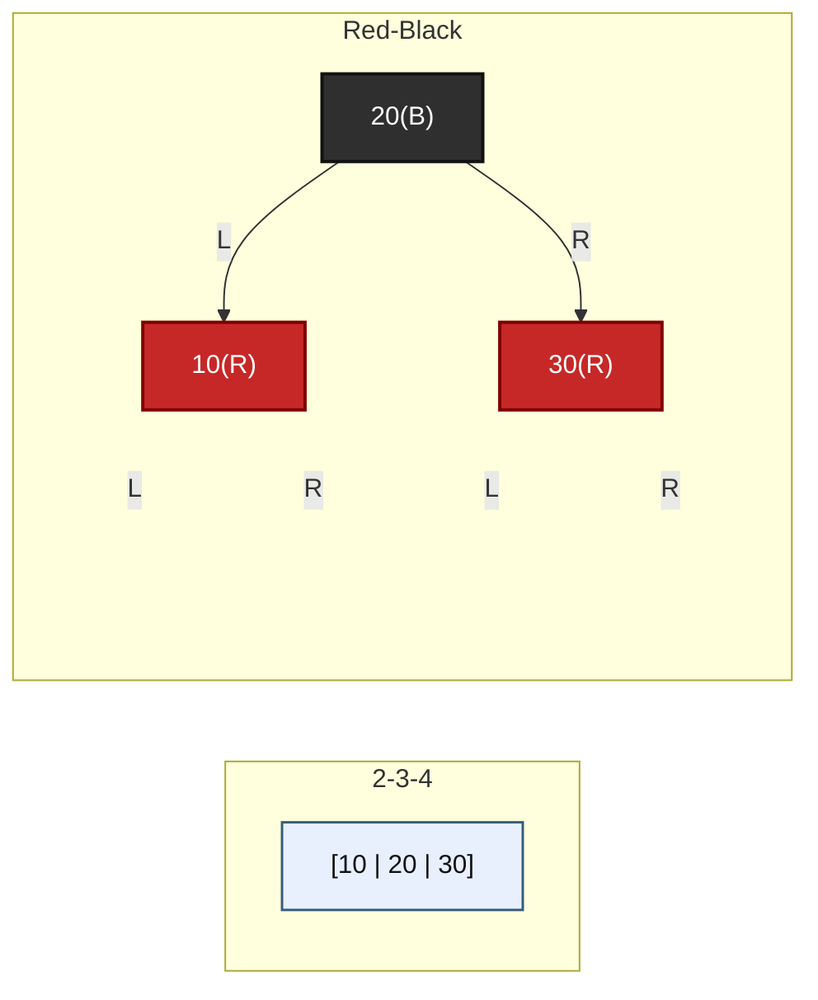
```mermaid
graph LR
	subgraph "2-3-4"
		A["[10 | 20 | 30]"]
	end

	subgraph "Red-Black"
		B["20(B)"]
		C["10(R)"]
		D["30(R)"]
		CL[" "]
		CR[" "]
		DL[" "]
		DR[" "]
	end

	B -->|"L"| C
	B -->|"R"| D

	C -->|"L"| CL
	C -->|"R"| CR

	D -->|"L"| DL
	D -->|"R"| DR

	classDef node234 fill:#e8f0fe,stroke:#355c7d,color:#111,stroke-width:1.5px;
	classDef black fill:#2f2f2f,stroke:#111,color:#fff,stroke-width:2px;
	classDef red fill:#c62828,stroke:#7f0000,color:#fff,stroke-width:2px;
	classDef ghost fill:transparent,stroke:transparent,color:transparent;

	class A node234;
	class B black;
	class C,D red;
	class CL,CR,DL,DR ghost;

	linkStyle 2 stroke:transparent;
	linkStyle 3 stroke:transparent;
	linkStyle 4 stroke:transparent;
	linkStyle 5 stroke:transparent;
```

现在再看红红冲突：

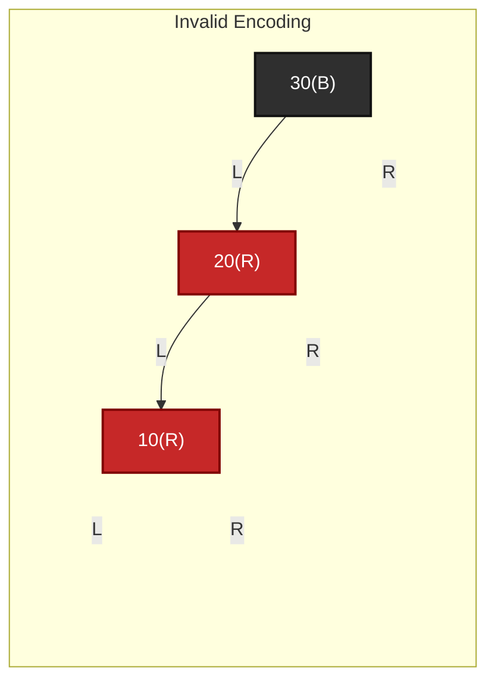
```mermaid
graph LR
	subgraph "Invalid Encoding"
		G["30(B)"]
		P["20(R)"]
		RG[" "]
		X["10(R)"]
		PR[" "]
		XL[" "]
		XR[" "]
	end

	G -->|"L"| P
	G -->|"R"| RG

	P -->|"L"| X
	P -->|"R"| PR

	X -->|"L"| XL
	X -->|"R"| XR

	classDef black fill:#2f2f2f,stroke:#111,color:#fff,stroke-width:2px;
	classDef red fill:#c62828,stroke:#7f0000,color:#fff,stroke-width:2px;
	classDef ghost fill:transparent,stroke:transparent,color:transparent;

	class G black;
	class P,X red;
	class RG,PR,XL,XR ghost;

	linkStyle 1 stroke:transparent;
	linkStyle 3 stroke:transparent;
	linkStyle 4 stroke:transparent;
	linkStyle 5 stroke:transparent;
```

这里的问题在于：

- `P=20(R)` 本来就表示它应并入某个黑节点；
- `X=10(R)` 又继续并入 `P`；
- 于是这不再对应一个合法的 `2-node / 3-node / 4-node` 编码；
- 这说明二叉编码非法，但此例仍只有三个键，完全装得进一个 4-node。

因此，**红红不等于容量溢出**。叔黑时，三个键可借旋转重新编码；叔红时，G/P/U 已组成三键满节点，再接入 X 才出现四键临时容量，需要分裂上推。

因此，红红冲突更准确的结构解释是：

> **当前局部红黑树，不再对应合法的 2-3-4 树节点编码。**

所以修复红红冲突，本质上是在把一个非法编码重新压回合法编码。

------

### 35.2.5\_红红冲突的修复目标

我们要消除的是非法编码；只有其中一部分分支涉及容量溢出。整个修复要做到：

> **把当前局部重新整理成一个合法的 2-node / 3-node / 4-node 编码。**

红黑树里真正能用的动作只有两类：

- **染色**
- **旋转**

它们服务的结构目标是统一的：

1. 消除红父红子的直接相邻关系；
2. 不破坏 BST 有序性；
3. 保持各侧黑高相等，并维持局部入口向上层承诺的黑节点数；
4. 把非法局部重新编码成合法结构。

红红冲突最经典地分成三类来修。

------

### 35.2.6\_解法一\_叔叔为红\_染色上推

先给角色和位置。

- `G`：祖父
- `P`：父
- `U`：叔叔
- `X`：当前节点

现在看这种局部：

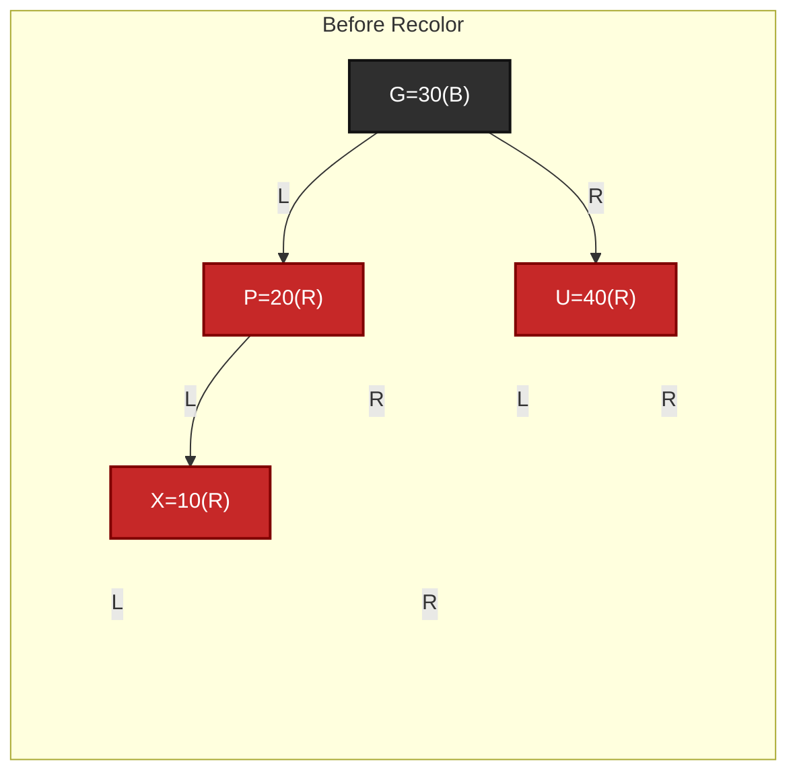
```mermaid
graph LR
	subgraph "Before Recolor"
		G["G=30(B)"]
		P["P=20(R)"]
		U["U=40(R)"]
		X["X=10(R)"]
		PR[" "]
		UL[" "]
		UR[" "]
		XL[" "]
		XR[" "]
	end

	G -->|"L"| P
	G -->|"R"| U

	P -->|"L"| X
	P -->|"R"| PR

	U -->|"L"| UL
	U -->|"R"| UR

	X -->|"L"| XL
	X -->|"R"| XR

	classDef black fill:#2f2f2f,stroke:#111,color:#fff,stroke-width:2px;
	classDef red fill:#c62828,stroke:#7f0000,color:#fff,stroke-width:2px;
	classDef ghost fill:transparent,stroke:transparent,color:transparent;

	class G black;
	class P,U,X red;
	class PR,UL,UR,XL,XR ghost;

	linkStyle 3 stroke:transparent;
	linkStyle 4 stroke:transparent;
	linkStyle 5 stroke:transparent;
	linkStyle 6 stroke:transparent;
	linkStyle 7 stroke:transparent;
```

这里的特点是：

- `P` 红
- `U` 红
- `X` 红

也就是祖父 `G` 的两侧都已经是“红色并入部分”。
从 2-3-4 树语义看，插入前的 G/P/U 是一个满逻辑节点，X 的新键使它暂时成为四键；当前需要分裂上推。

把这个局部还原成 2-3-4 树视角，可以这样看：

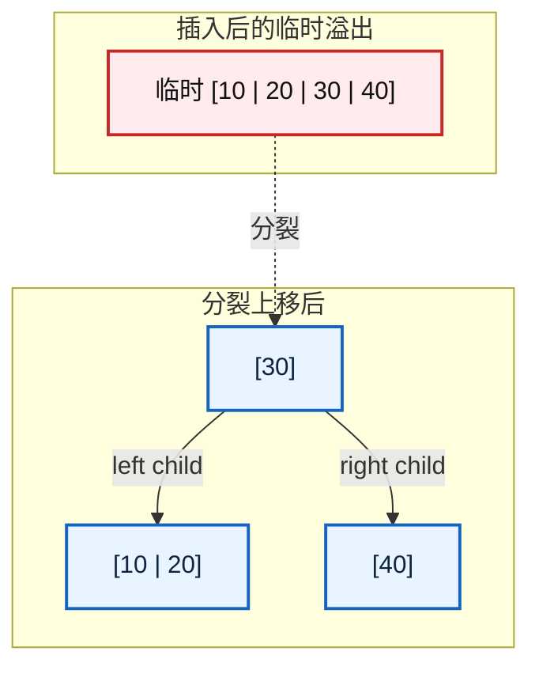
```mermaid
graph TD
	subgraph "插入后的临时溢出"
		A["临时 [10 | 20 | 30 | 40]"]
	end

	subgraph "分裂上移后"
		B["[30]"]
		C["[10 | 20]"]
		D["[40]"]
	end

	A -. "分裂" .-> B
	B -->|"left child"| C
	B -->|"right child"| D

	classDef overflow fill:#ffebee,stroke:#c62828,color:#111,stroke-width:2px;
	classDef node234 fill:#e8f4ff,stroke:#1565c0,color:#0d253f,stroke-width:2px;

	class A overflow;
	class B,C,D node234;
```

也就是说，叔叔为红时，红黑树的染色并不是“随便换颜色”，
而是在模拟 2-3-4 树里满节点被插入后发生的分裂：

- 四键有两个中间候选，本分支按原黑代表选择 `30` 上推；
- 左侧 `[10 | 20]` 留作一个子节点；
- 右侧 `[40]` 留作另一个子节点。

红黑树里的对应动作就是：

- `P` 染黑
- `U` 染黑
- `G` 染红

得到：

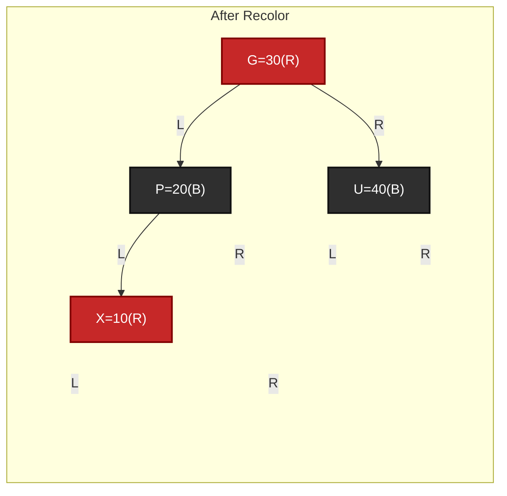
```mermaid
graph LR
	subgraph "After Recolor"
		G["G=30(R)"]
		P["P=20(B)"]
		U["U=40(B)"]
		X["X=10(R)"]
		PR[" "]
		UL[" "]
		UR[" "]
		XL[" "]
		XR[" "]
	end

	G -->|"L"| P
	G -->|"R"| U

	P -->|"L"| X
	P -->|"R"| PR

	U -->|"L"| UL
	U -->|"R"| UR

	X -->|"L"| XL
	X -->|"R"| XR

	classDef black fill:#2f2f2f,stroke:#111,color:#fff,stroke-width:2px;
	classDef red fill:#c62828,stroke:#7f0000,color:#fff,stroke-width:2px;
	classDef ghost fill:transparent,stroke:transparent,color:transparent;

	class P,U black;
	class G,X red;
	class PR,UL,UR,XL,XR ghost;

	linkStyle 3 stroke:transparent;
	linkStyle 4 stroke:transparent;
	linkStyle 5 stroke:transparent;
	linkStyle 6 stroke:transparent;
	linkStyle 7 stroke:transparent;
```

这样一来：

- `P` 与 `X` 的红红冲突被消除；
- G 的子树内部不再有这处红红，且两侧黑高仍相等；
- 若 G 的父亲红，新的红红位于 G 与其父亲之间；
- 若 G 已是根，临时红根仍需染黑，不能在此直接宣称整树完成。

所以这一类修法叫：

> **染色上推**

它的特点是：

- 当前层不旋转；
- 当前局部先“分裂”；
- 问题可能继续向上传播。

为什么染色没有制造缺黑？从 G 的入口看，每条路径原来经过 G 黑，再经过 P 或 U 红；现在经过 G 红，再经过 P 或 U 黑。两段贡献都恰好为一个黑节点，其下子树没有搬动。入口黑贡献不变，原上层仍可使用同样的路径计数；如果 G 与红父相邻，只把检查点设为 G，再执行同一轮判断。到根后统一染黑，所有根到 NIL 路径同时增加一，仍然等高。

**提问：**

叔叔节点为红色，一定是染色上推吗？不是属于按照算法应用来区分吗？

> 对，要**按算法上下文区分**，不能孤立地说“叔叔节点为红色一定怎么处理”。
>
> 更精确的结论是：
>
> ```txt
> 在标准红黑树“自底向上插入修复”算法中，只要进入的是“父节点红、叔叔节点红”的插入修复分支，那么处理方式就是染色上推：`P`、`U` 染黑，`G` 染红，然后继续从 `G` 向上检查。
> ```
>
> “叔叔为红”不是脱离算法上下文的绝对规则。
>
> 在标准红黑树插入修复中，当前节点 X 和父节点 P 已经形成红红冲突，若叔叔 U 也是红色，则说明祖父 G、父 P、叔 U 共同对应一个2-3-4 树中的满 4-node。此时修复的本质不是旋转，而是满节点分裂：P、U 染黑，G 染红，并把当前检查点上移到 G。
>
> 但在自顶向下 2-3-4 插入或 LLRB 实现中，同样的语义可能表现为提前分裂、颜色翻转或与旋转组合出现。因此应按具体算法阶段理解，而不是把“叔叔为红”脱离插入修复上下文单独判断。

提问中的 LLRB 是左倾红黑树（Left-Leaning Red-Black Tree），它对红链接方向施加额外约束。本章只实现普通红黑树，不能把后者的停止条件直接移植到左倾算法；这里保留提问，是为了明确“颜色条件必须连同算法阶段一起解释”。

------

### 35.2.7\_解法二\_叔叔为黑\_外侧\_单旋\_+\_染色

现在看第二类。
这一类可以在当前层一次修好。

先看左左外侧的局部：

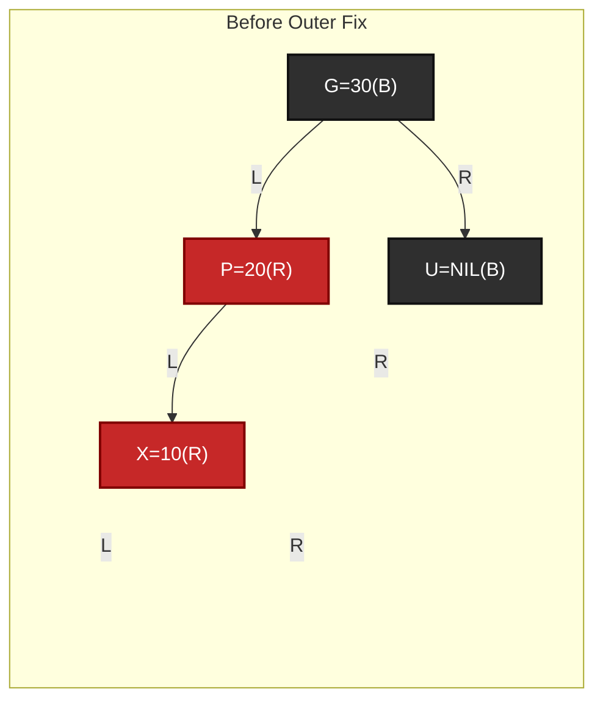
```mermaid
graph LR
	subgraph "Before Outer Fix"
		G["G=30(B)"]
		P["P=20(R)"]
		U["U=NIL(B)"]
		X["X=10(R)"]
		PR[" "]
		XL[" "]
		XR[" "]
	end

	G -->|"L"| P
	G -->|"R"| U

	P -->|"L"| X
	P -->|"R"| PR

	X -->|"L"| XL
	X -->|"R"| XR

	classDef black fill:#2f2f2f,stroke:#111,color:#fff,stroke-width:2px;
	classDef red fill:#c62828,stroke:#7f0000,color:#fff,stroke-width:2px;
	classDef ghost fill:transparent,stroke:transparent,color:transparent;

	class G,U black;
	class P,X red;
	class PR,XL,XR ghost;

	linkStyle 3 stroke:transparent;
	linkStyle 4 stroke:transparent;
	linkStyle 5 stroke:transparent;
```

这里：

- `P` 是 `G` 的左孩子；
- `X` 是 `P` 的左孩子；
- `U` 是黑色叔叔（这里用黑色 NIL 表示）

这是一个**外侧结构**。

从 2-3-4 树语义看，这个局部的修复目标很明确：


```mermaid
graph TD
	subgraph "Invalid RB Encoding"
		A["30(B)"]
		B["20(R)"]
		C["10(R)"]
	end

	subgraph "Target 2-3-4 Node"
		D["[10 | 20 | 30]"]
	end

	A --> B
	B --> C
	A -. "re-encode" .-> D

	classDef black fill:#2f2f2f,stroke:#111,color:#fff,stroke-width:2px;
	classDef red fill:#c62828,stroke:#7f0000,color:#fff,stroke-width:2px;
	classDef node234 fill:#e8f4ff,stroke:#1565c0,color:#0d253f,stroke-width:2px;

	class A black;
	class B,C red;
	class D node234;
```

也就是把 `10、20、30` 重新编码成一个合法 4-节点 `[10 | 20 | 30]`。
外侧结构本身已经满足“中间关键字 `20` 应该上来当局部黑根”的形状，
所以只需要一次围绕 `G` 的旋转。

修法是：

1. 围绕 `G` 做一次右旋；
2. 交换 `P` 和 `G` 的颜色。

得到：

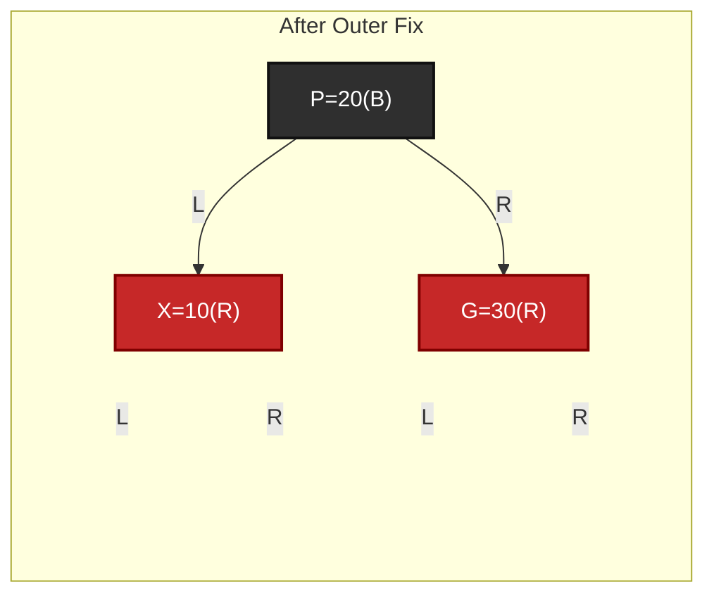
```mermaid
graph LR
	subgraph "After Outer Fix"
		P["P=20(B)"]
		X["X=10(R)"]
		G["G=30(R)"]
		XL[" "]
		XR[" "]
		GL[" "]
		GR[" "]
	end

	P -->|"L"| X
	P -->|"R"| G

	X -->|"L"| XL
	X -->|"R"| XR

	G -->|"L"| GL
	G -->|"R"| GR

	classDef black fill:#2f2f2f,stroke:#111,color:#fff,stroke-width:2px;
	classDef red fill:#c62828,stroke:#7f0000,color:#fff,stroke-width:2px;
	classDef ghost fill:transparent,stroke:transparent,color:transparent;

	class P black;
	class X,G red;
	class XL,XR,GL,GR ghost;

	linkStyle 2 stroke:transparent;
	linkStyle 3 stroke:transparent;
	linkStyle 4 stroke:transparent;
	linkStyle 5 stroke:transparent;
```

这样之后：

- 红红冲突消失；
- 当前局部立刻恢复合法；
- 不需要继续上推。

对应回 2-3-4 树，就是这个合法 4-节点：

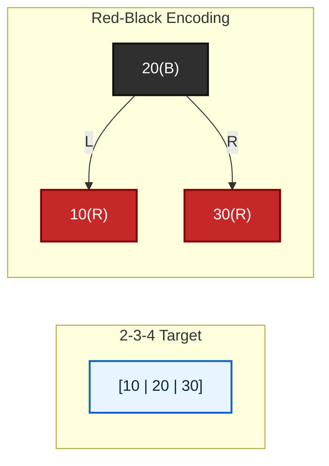
```mermaid
graph LR
	subgraph "2-3-4 Target"
		A["[10 | 20 | 30]"]
	end

	subgraph "Red-Black Encoding"
		B["20(B)"]
		C["10(R)"]
		D["30(R)"]
	end

	B -->|"L"| C
	B -->|"R"| D

	classDef node234 fill:#e8f4ff,stroke:#1565c0,color:#0d253f,stroke-width:2px;
	classDef black fill:#2f2f2f,stroke:#111,color:#fff,stroke-width:2px;
	classDef red fill:#c62828,stroke:#7f0000,color:#fff,stroke-width:2px;

	class A node234;
	class B black;
	class C,D red;
```

最小三键图还不足以证明内部子树也能这样修。把 X 的左右子树记为 A/B，把 P 的右子树记为 C，把黑叔 U 整棵子树记为 D。由于进入分支前黑高仍相等，而 X/P 都红，这四棵边界子树从自身入口起计的黑贡献必须都是 h；它们可以非空，U 也不必是 NIL。这里 h **包含边界子树根及末尾 NIL**，有别于 P07 的 bh(x) 排除 x。

旋转前顺序为 `A < X < B < P < C < G < D`。右旋后 X 仍连 A/B，G 的左槽接 C、右槽保留 D，P 的左右槽分别接 X/G；所以中序与各子树的合法区间未变。颜色变成 P 黑、X/G 红：经 X 或 G 到任一边界的黑贡献都是 `1+h`，等于原 G 黑入口的 `1+h`。边界 A/B/C 的根原来在红父之下，因此为黑；D 的根也因叔黑为黑。新红节点不会与边界形成红红，局部新根 P 又是黑色，与外部父亲无论何色都不冲突。这才是 **收尾后可以停止** 的依据。

右右外侧把左右互换：P 是 G 的右孩子，X 是 P 的右孩子，围绕 G 左旋，P 黑、G 红；同样要接回原祖父的父槽，若 G 原来是整树根，就更新根入口。

------

### 35.2.8\_解法三\_叔叔为黑\_内侧\_先转外侧\_再旋转\_+\_染色

第三类是最容易让人觉得“为什么要多转一次”的情形。
实际上，它只是在做一次**结构预处理**。

先看左-右内侧：

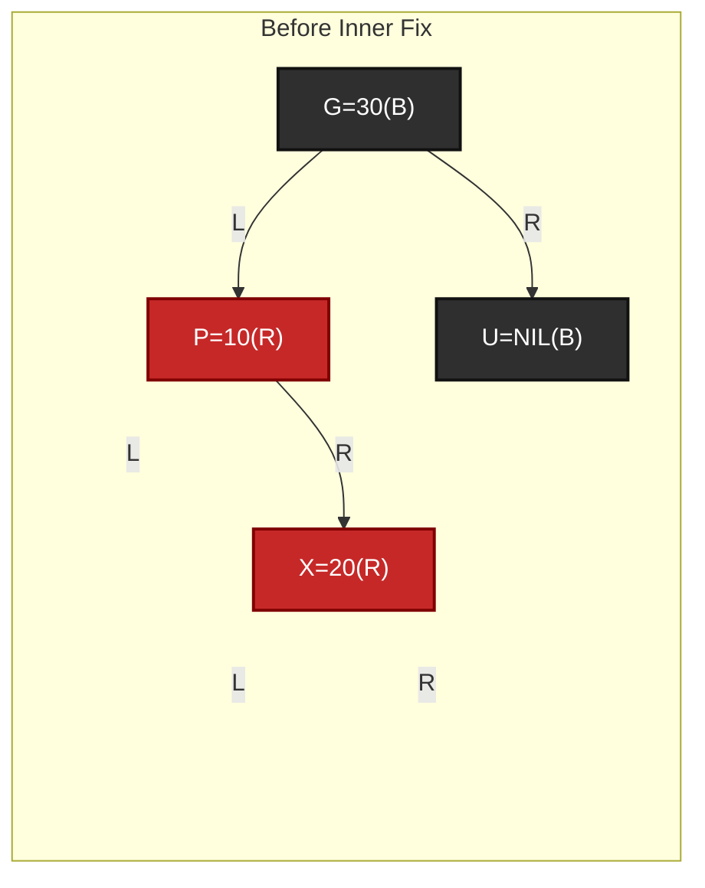
```mermaid
graph LR
	subgraph "Before Inner Fix"
		G["G=30(B)"]
		P["P=10(R)"]
		U["U=NIL(B)"]
		PL[" "]
		X["X=20(R)"]
		XL[" "]
		XR[" "]
	end

	G -->|"L"| P
	G -->|"R"| U

	P -->|"L"| PL
	P -->|"R"| X

	X -->|"L"| XL
	X -->|"R"| XR

	classDef black fill:#2f2f2f,stroke:#111,color:#fff,stroke-width:2px;
	classDef red fill:#c62828,stroke:#7f0000,color:#fff,stroke-width:2px;
	classDef ghost fill:transparent,stroke:transparent,color:transparent;

	class G,U black;
	class P,X red;
	class PL,XL,XR ghost;

	linkStyle 2 stroke:transparent;
	linkStyle 4 stroke:transparent;
	linkStyle 5 stroke:transparent;
```

这里：

- `P` 是 `G` 的左孩子；
- `X` 是 `P` 的右孩子；

所以 `X` 在“内侧”。

这种结构不能直接套用上一类“外侧单旋”的修法。
因为此时中间关键字 `20` 还夹在 `10` 和 `30` 之间，
红黑树形态却没有先把 `20` 放到适合上升的位置。

从 2-3-4 树目标看，它仍然应该被整理成同一个 4-节点：

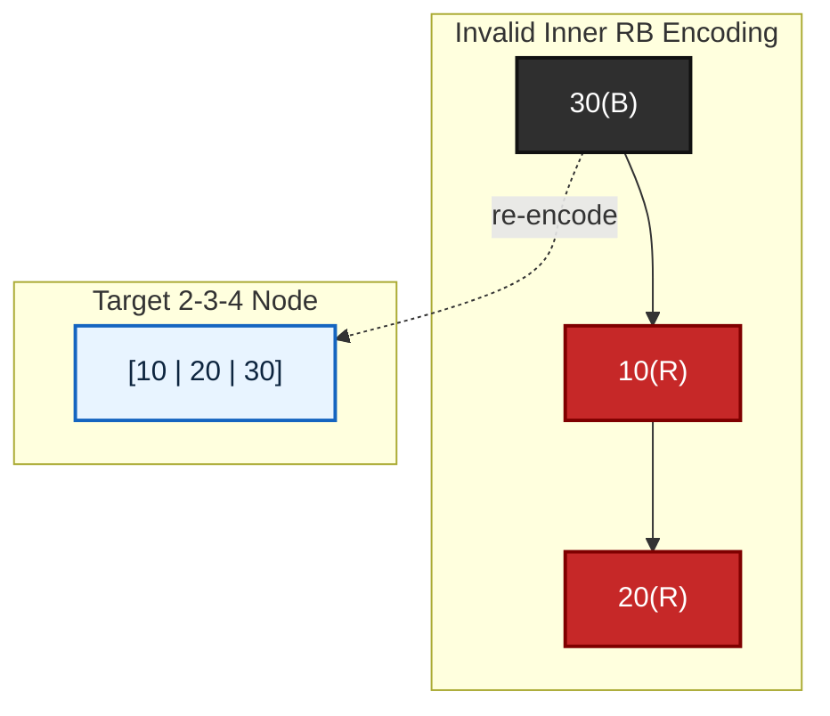
```mermaid
graph TD
	subgraph "Invalid Inner RB Encoding"
		A["30(B)"]
		B["10(R)"]
		C["20(R)"]
	end

	subgraph "Target 2-3-4 Node"
		D["[10 | 20 | 30]"]
	end

	A --> B
	B --> C
	A -. "re-encode" .-> D

	classDef black fill:#2f2f2f,stroke:#111,color:#fff,stroke-width:2px;
	classDef red fill:#c62828,stroke:#7f0000,color:#fff,stroke-width:2px;
	classDef node234 fill:#e8f4ff,stroke:#1565c0,color:#0d253f,stroke-width:2px;

	class A black;
	class B,C red;
	class D node234;
```

因此第一步先围绕 `P` 左旋，把它转成外侧：

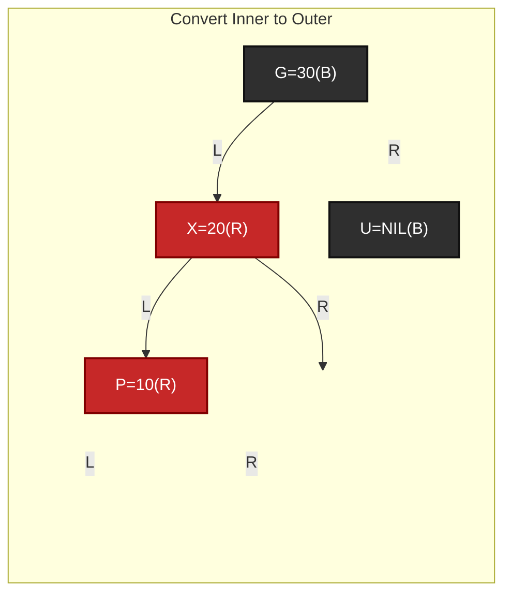
```mermaid
graph LR
	subgraph "Convert Inner to Outer"
		G["G=30(B)"]
		X["X=20(R)"]
		U["U=NIL(B)"]
		P["P=10(R)"]
		XR[" "]
		PL[" "]
		PR[" "]
	end

	G -->|"L"| X
	G -->|"R"| U

	X -->|"L"| P
	X -->|"R"| XR

	P -->|"L"| PL
	P -->|"R"| PR

	classDef black fill:#2f2f2f,stroke:#111,color:#fff,stroke-width:2px;
	classDef red fill:#c62828,stroke:#7f0000,color:#fff,stroke-width:2px;
	classDef ghost fill:transparent,stroke:transparent,color:transparent;

	class G,U black;
	class X,P red;
	class XR,PL,PR ghost;

	linkStyle 1 stroke:transparent;
	linkStyle 4 stroke:transparent;
	linkStyle 5 stroke:transparent;
```

图中的 X/P 标识仍指原对象。第一旋之后，原 X 成为 G 的左孩子，原 P 成为它的左孩子；程序若继续复用“当前/父”变量，必须把当前改为原 P、父改为原 X，不能沿用旧位置判断。两者都红，第一旋不改变局部黑贡献，也还没有消除红红。

然后围绕 G 右旋，把原 X 染黑、G 染红，得到最终结果：

```mermaid
graph LR
	subgraph "Final After Inner Fix"
		X["X=20(B)"]
		P["P=10(R)"]
		G["G=30(R)"]
		PL[" "]
		PR[" "]
		GL[" "]
		GR[" "]
	end

	X -->|"L"| P
	X -->|"R"| G

	P -->|"L"| PL
	P -->|"R"| PR

	G -->|"L"| GL
	G -->|"R"| GR

	classDef black fill:#2f2f2f,stroke:#111,color:#fff,stroke-width:2px;
	classDef red fill:#c62828,stroke:#7f0000,color:#fff,stroke-width:2px;
	classDef ghost fill:transparent,stroke:transparent,color:transparent;

	class X black;
	class P,G red;
	class PL,PR,GL,GR ghost;

	linkStyle 2 stroke:transparent;
	linkStyle 3 stroke:transparent;
	linkStyle 4 stroke:transparent;
	linkStyle 5 stroke:transparent;
```

所以“内侧多转一次”的本质不是额外魔法，而是：

> **先把内侧结构变成外侧结构，再用外侧的标准修法一次解决。**

最终结果对应的 2-3-4 树原型仍然是：

```mermaid
graph LR
	subgraph "2-3-4 Target"
		A["[10 | 20 | 30]"]
	end

	subgraph "Red-Black Encoding"
		B["20(B)"]
		C["10(R)"]
		D["30(R)"]
	end

	B -->|"L"| C
	B -->|"R"| D

	classDef node234 fill:#e8f4ff,stroke:#1565c0,color:#0d253f,stroke-width:2px;
	classDef black fill:#2f2f2f,stroke:#111,color:#fff,stroke-width:2px;
	classDef red fill:#c62828,stroke:#7f0000,color:#fff,stroke-width:2px;

	class A node234;
	class B black;
	class C,D red;
```

当中间子树非空时，第一旋还要把原 X 的左子树接到原 P 的右槽，修正该子树根的父指针。由于原 P/X 都红，第一旋只在红节点之间重新分配同黑高边界；接着使用上一分支的入口黑贡献证明。右-左内侧先围绕右父右旋，再围绕祖父左旋；新局部黑根是原 X。

------

### 35.2.9\_把三类修法压缩成一张总图

到这里，红红冲突的修法可以压缩成一张总流程图：

```mermaid
flowchart TD
    start["S1 已接入红叶或 S2 检查点上推"] --> parent{"父节点是红色？"}
    parent -- "否，含当前已是根" --> root["S4 根染黑并返回"]
    parent -- "是：G 必存在且黑" --> uncle{"叔叔 U 为红？"}
    uncle -- "是" --> push["S2 P/U 黑，G 红；当前改为 G"]
    push --> parent
    uncle -- "否，含 NIL" --> inner{"当前与父在内侧？"}
    inner -- "是" --> convert["S3 先转父；重定向当前和父"]
    inner -- "否" --> finish["S3 父黑、G 红；转 G 并接回上层入口"]
    convert --> finish
    finish --> root
```

这张图就是红黑树插入修复的最小骨架。

------

### 35.2.10\_本小节小结

现在这一小节已经把“红红冲突是什么、为什么出现、怎么修”合在了一起。
最应该记住的是下面六点。

第一，红红冲突的定义非常直接：**红节点的父节点也是红节点。**
第二，它最常出现在插入之后，因为新节点通常先染红。
第三，它首先是一个**局部违例**，判定只依赖当前节点 `X` 与父节点 `P`。
第四，在本章的红叶插入和上推不变量下，黑高一直相等；红红表示编码非法，不能据此断言容量溢出。
第五，它的修复目标不是“随便改颜色”，而是**把非法局部重新整理成合法的 2-node / 3-node / 4-node 编码。**
第六，它的修法可以统一压成三类：

- **叔叔红：染色上推**
- **叔叔黑且外侧：单旋 + 染色**
- **叔叔黑且内侧：先转外侧，再旋转 + 染色**

现在我们已经知道每个分支改了什么，也知道何时继续、何时停止。接下来把图中的对象、父槽与根入口落实到可以运行的程序；颜色正确而父指针错误，同样不是一棵可维护的树。

------

## 35.3\_运行完整插入程序

程序用 LL/LR/RR/RL 分别标记从祖父到父、再到当前节点的左左、左右、右右、右左两级方向。先预测四组输入：`30,20,10` 与 `10,20,30` 各需要几次旋转？改用 `30,10,20` 和 `10,30,20`，得到 LR/RL 时会多哪一步？再预测 `30,20,40,10`：叔叔已经是红色，最终根为何仍是 30，而不是三键实例里的 20？

下面的完整 C++17 程序也保存为材料 [rbtree_insert.cpp](../../../../labs/kernel/tree_basics/materials/rbtree_insert.cpp)。`std::list` 是拥有节点的标准容器，添加元素不搬移已有对象，因此 parent/left/right 中的地址保持有效；树链接负责查找顺序，链表的内部顺序不参与比较。树销毁时容器释放所有节点，不沿树递归释放。禁止默认复制或移动，是为了避免默认复制后入口仍指向别的树的对象。

`insert` 先查重再创建对象，只有创建成功才写空槽。若标准容器分配抛出异常，调用者可在外层处理，旧树链接仍未改变；链接发布以后，repair 不再申请内存。示例 main 省略资源异常处理以便观察算法，资源不足会由运行时终止。valid/keys 是教学观察工具，可能另外申请内存，它们不属于插入的无后续分配承诺。

```cpp
#include <algorithm>
#include <cassert>
#include <cstddef>
#include <initializer_list>
#include <iostream>
#include <list>
#include <optional>
#include <unordered_set>
#include <vector>

enum class color { red, black };

struct node {
    int key;
    color shade = color::red;
    node* parent = nullptr;
    node* left = nullptr;
    node* right = nullptr;
};

struct repair_counts {
    unsigned recolors = 0;  // 叔红分支次数，不是单个颜色写入次数
    unsigned inner = 0;     // 内侧转换次数
    unsigned outer = 0;     // 外侧收尾次数
};

class rb_tree {
    std::list<node> storage_;  // 拥有对象，增加元素不会搬移已有节点
    node* root_ = nullptr;
    repair_counts counts_;

    static bool is_red(const node* current) {
        return current != nullptr && current->shade == color::red;
    }

    void rotate_left(node* old_root) {
        node* new_root = old_root->right;
        assert(new_root != nullptr);
        old_root->right = new_root->left;
        if (new_root->left) new_root->left->parent = old_root;
        new_root->parent = old_root->parent;
        if (!old_root->parent) root_ = new_root;
        else if (old_root == old_root->parent->left)
            old_root->parent->left = new_root;
        else old_root->parent->right = new_root;
        new_root->left = old_root;
        old_root->parent = new_root;
    }

    void rotate_right(node* old_root) {
        node* new_root = old_root->left;
        assert(new_root != nullptr);
        old_root->left = new_root->right;
        if (new_root->right) new_root->right->parent = old_root;
        new_root->parent = old_root->parent;
        if (!old_root->parent) root_ = new_root;
        else if (old_root == old_root->parent->right)
            old_root->parent->right = new_root;
        else old_root->parent->left = new_root;
        new_root->right = old_root;
        old_root->parent = new_root;
    }

    void repair(node* current) {
        while (is_red(current->parent)) {
            node* parent = current->parent;
            node* grand = parent->parent;  // 黑根不可能是红父，祖父存在
            assert(grand != nullptr);
            if (parent == grand->left) {
                node* uncle = grand->right;
                if (is_red(uncle)) {
                    parent->shade = color::black;
                    uncle->shade = color::black;
                    grand->shade = color::red;
                    current = grand;  // 检查点换成原祖父，不再是新叶子
                    ++counts_.recolors;
                    continue;
                }
                if (current == parent->right) {
                    current = parent;  // 转换后原父成为新的下层红节点
                    rotate_left(current);
                    parent = current->parent;
                    ++counts_.inner;
                }
                parent->shade = color::black;
                grand->shade = color::red;
                rotate_right(grand);
                ++counts_.outer;
                break;
            } else {
                node* uncle = grand->left;
                if (is_red(uncle)) {
                    parent->shade = color::black;
                    uncle->shade = color::black;
                    grand->shade = color::red;
                    current = grand;
                    ++counts_.recolors;
                    continue;
                }
                if (current == parent->left) {
                    current = parent;
                    rotate_right(current);
                    parent = current->parent;
                    ++counts_.inner;
                }
                parent->shade = color::black;
                grand->shade = color::red;
                rotate_left(grand);
                ++counts_.outer;
                break;
            }
        }
        root_->shade = color::black;  // 空树首插或上推到根时统一收尾
    }

    static int inspect(const node* current, const node* parent,
                       std::optional<int> low, std::optional<int> high,
                       std::unordered_set<const node*>& seen) {
        if (!current) return 1;  // 内部计数包含当前黑节点和终点 NIL
        if (!seen.insert(current).second || current->parent != parent ||
            (low && current->key <= *low) || (high && current->key >= *high) ||
            (is_red(parent) && is_red(current))) return -1;
        const int left = inspect(current->left, current, low, current->key, seen);
        if (left < 0) return -1;
        const int right = inspect(current->right, current, current->key, high, seen);
        if (right < 0 || left != right) return -1;
        return left + (current->shade == color::black ? 1 : 0);
    }

public:
    rb_tree() = default;
    rb_tree(const rb_tree&) = delete;  // 默认复制会让指针仍指向另一棵树
    rb_tree& operator=(const rb_tree&) = delete;
    rb_tree(rb_tree&&) = delete;
    rb_tree& operator=(rb_tree&&) = delete;

    bool insert(int key) {
        counts_ = {};
        node* parent = nullptr;
        node** slot = &root_;
        while (*slot) {
            parent = *slot;
            if (key == parent->key) return false;  // 唯一键，重复不改结构
            slot = key < parent->key ? &parent->left : &parent->right;
        }
        storage_.push_back(node{key});  // 若分配抛异常，此时还没有改动树链接
        node* inserted = &storage_.back();
        inserted->parent = parent;
        *slot = inserted;
        repair(inserted);  // 此后只写指针/颜色，不再申请资源
        return true;
    }

    const node* root() const { return root_; }
    repair_counts counts() const { return counts_; }
    std::size_t size() const { return storage_.size(); }

    bool valid() const {
        if (!root_) return storage_.empty();
        if (root_->parent || is_red(root_)) return false;
        std::unordered_set<const node*> seen;
        return inspect(root_, nullptr, {}, {}, seen) >= 0 && seen.size() == size();
    }

    std::vector<int> keys() const {
        std::vector<int> result;
        auto visit = [&](auto&& self, const node* current) -> void {
            if (!current) return;
            self(self, current->left);
            result.push_back(current->key);
            self(self, current->right);
        };
        visit(visit, root_);
        return result;
    }
};

static void run_case(const char* name, std::initializer_list<int> input) {
    rb_tree tree;
    repair_counts total;
    for (int key : input) {
        const bool inserted = tree.insert(key);
        assert(inserted && tree.valid());
        const auto step = tree.counts();
        total.recolors += step.recolors;
        total.inner += step.inner;
        total.outer += step.outer;
    }
    std::cout << name << ": root=" << tree.root()->key
              << " recolors=" << total.recolors << " inner=" << total.inner
              << " outer=" << total.outer << " keys=";
    for (int key : tree.keys()) std::cout << ' ' << key;
    std::cout << '\n';
}

int main() {
    run_case("LL", {30, 20, 10});
    run_case("LR", {30, 10, 20});
    run_case("RR", {10, 20, 30});
    run_case("RL", {10, 30, 20});
    run_case("red uncle", {30, 20, 40, 10});
    run_case("propagate", {1, 2, 3, 4, 5, 6, 7, 8, 9, 10});
    return 0;
}
```

将材料复制到实验目录，在该目录运行：

```bash
g++ -std=c++17 -Wall -Wextra -Wpedantic -Werror rbtree_insert.cpp -o rbtree_insert
./rbtree_insert
```

这里不要定义关闭标准断言的宏 `NDEBUG`，以保留示例的断言检查。正常输出为：

```text
LL: root=20 recolors=0 inner=0 outer=1 keys= 10 20 30
LR: root=20 recolors=0 inner=1 outer=1 keys= 10 20 30
RR: root=20 recolors=0 inner=0 outer=1 keys= 10 20 30
RL: root=20 recolors=0 inner=1 outer=1 keys= 10 20 30
red uncle: root=30 recolors=1 inner=0 outer=0 keys= 10 20 30 40
propagate: root=4 recolors=5 inner=0 outer=5 keys= 1 2 3 4 5 6 7 8 9 10
```

输出的 recolors 是 **叔红分支执行次数**，一次会写三个颜色；inner 与 outer 各对应一次旋转。前三键四组实例因此分别旋转 1、2、1、2 次。最后一行是十次插入的累计量，不能把 outer=5 误读成一次插入转了五次。

可以在循环内打印每次 insert 后的 counts 来定位传播。递增输入的最后一次插入 10 会执行两次叔红上推：先在原祖父 8 处把 7/9 染黑、8 染红，当前改为 8；此时它与红父 6 冲突，再把 2/6 染黑、4 染红；4 已是根，最后统一染黑。这两次都是 S2，没有进入 S3，最终根 4 保持原地址。不要只检查最后一棵树，逐次输出才能区别“多次插入各修一次”和“一次插入连续上推”。

再对照内侧代码。在 `current = parent` 之后旋转原父，接着重新读取 `current->parent`；新 parent 才是应染黑并提升的对象。两次旋转之间的状态仍有红红，所以仅能调用结构旋转，不能在中间要求 valid 返回 true。最后一次旋转把新黑根接回外部父槽，随后 S4 才形成公开结果。

检查器除了颜色与祖先区间，还核对每个孩子的 parent、重复地址和可达节点数。空树合法；重复键返回 false，counts 清零，已有键、颜色、链接与地址不变。它只观察本类自身拥有的对象，不能用它读取已经释放的任意地址。`keys` 在正常树上中序遍历，不能用于检查未知损坏结构；示例在调用前先运行 valid。

## 35.4\_修改实例并解释停止条件

先做预测，再运行，最后用具体写入解释结果：

1. 重复插入 20。记录根地址、节点数和中序序列，确认 false 不等于“插入了一份相同键”；再比较已有每个节点的颜色和链接。
2. 把四组输入全部取相反数，观察左右分支交换。中序仍递增，内侧是否仍需两旋？不要仅凭根值判断修复成功。
3. 在递增例中逐次打印 counts，找出 10 的两次上推。把输入继续扩到 32，区分一次操作的最大上推次数与整轮总次数。
4. 暂时删掉内侧分支的 `parent = current->parent`，只运行 LR/RL。先画第一旋后的对象地址，再观察哪条断言失败；恢复代码后继续。错误不是键比较，而是变量仍指旧父。
5. 用整数最小值和最大值替换两端的键。比较采用关系运算和可选边界，未做 `key±1`，因此无需给极值保留人为余量。

前两项的解释是：重复在 S0 返回，镜像只交换方向；第三项验证 S2 可连续发生。第四项指出“角色变了、对象没搬”，第五项回到 P23 的祖先区间契约。每个练习都要检查结构，不把一行输出的相似当作正确性证明。

从控制流还能推出代价边界。只有 S2 能回到循环，每次 current 都向上跨两级，所以颜色上推至多与树高同阶。S3 中内侧最多一旋，外侧再一旋就退出，**这套算法一次成功插入至多旋转两次**；这一计数不自动适用于其他红黑算法或删除。搜索与最坏染色传播仍是 O(log n)，对象分配、缓存访问和业务比较另有成本，不能从“两旋”推出所有负载都比 AVL 快。

本章已经从合法输入推导并运行了完整插入，却还没有解释移走黑节点会发生什么。回到 [P07 删除缺黑](P07_红黑树_把_2-3-4_树映射成二叉表示.md#7.4.3_删除黑色节点_以及异常场景处理方法)，再与 [P33 多路删除](P33_从多路删除到红黑缺口.md#33.1_在两套规则建立以后对照)比较；需要进入 Linux 时，沿 [P26 插入单元](P26_Linux红叶接入与插入修复.md#26.1_章节内容说明)读取固定版本的父槽交接与完整模块。返回[大纲](大纲.md#1.1_沿问题进入现有章节)。
