# 第36章\_红黑删除与缺黑位置传播

## 36.1\_移走对象为何不一定马上产生缺口

[P35 插入](P35_红黑插入与红红冲突上推.md#35.3_运行完整插入程序)用红叶保住黑高，再处理红红。删除无法总选一个红对象退出：从 20 黑、10 黑、30 黑的树中移走 10，左入口变为 NIL，左路径就少一黑。本章先确定 **少黑的是哪个入口**，再沿完整图例推导合并、借位与方向转换。

先修是 P07 的颜色/黑高、P22 的 BST 删除以及 P31/P32 的多路下溢。本章仍是唯一键、单线程独占、空指针作 NIL 的教学树；不引入内核接口或并发生命周期。

### 36.1.1\_先区分退出对象与抽走颜色的位置

设用户要删除的对象是 T。如果 T 至多有一个非空孩子，直接把孩子接到 T 的旧父槽；若 T 有两个孩子，选择右子树最小对象 Y，即中序后继，把 **Y 对象整体搬到 T 的结构位置**，键值不复制、对象内存不搬，Y 继承 T 的旧颜色。退出的仍是 T，但要判断是否少黑，必须保存 **Y 移动前的颜色**，查看它原位置接上的右孩子 X。

为什么只剩一个孩子或 NIL？Y 是右子树最小值，所以没有左孩子。在合法红黑树中，一个实节点若只有一个非空孩子，它必然黑、孩子必然是红叶：另一侧 NIL 贡献为一，非空侧要相等，只能用不增加黑数的红节点接两个 NIL。因此初始摘除有三个结果：

| 被抽走位置原颜色 | 接入的 X | 接下来做什么 |
| --- | --- | --- |
| 红 | NIL | 没少黑，无需进入缺黑循环 |
| 黑 | 红叶 | X 染黑，补回原黑贡献，结束 |
| 黑 | NIL | 若已是根则得到合法空树；否则用父槽位置进入缺黑循环 |

上推以后 X 还可能是一棵非空黑根子树，因此后续图不能永远把 X 写成 NIL。DB 是 Double Black 的缩写，表示入口欠一黑的 **逻辑标记**，不是节点里的第三种颜色，更不能把空指针当成有 parent 字段的对象。

### 36.1.2\_用同一组阶段保存缺口

程序的节点保存 key、shade、parent、left、right 与观察用的 alive 标志；root_ 保存整树入口。当前操作栈帧中的 current/parent/on_left 三元组保存缺口子树地址、其父地址与方向。current 为空时，后两个值仍能唯一指出是哪一个孩子槽欠黑。兄弟与侄子每次旋转后从更新的链接重新读取，不能缓存旧位置后一直复用。

图和表把 current 指出的入口记为 X，父节点记为 P，P 的另一侧孩子记为兄弟 S。S 朝向 X 一侧的孩子是近侄 N，另一侧是远侄 F；它们不是固定的左/右孩子。X 位于左侧时 N 在左、F 在右，镜像后恰好相反。

| 阶段 | 谁写什么状态 | 退出条件与下一读取者 |
| --- | --- | --- |
| D0 查找 | erase 沿 key 比较找到 T，未命中不写结构 | T 存在才进入摘除 |
| D1 接替与定位 | replace 写外部父槽或 root_；两孩子时 Y 接替 T，保存 Y 原颜色和旧位置的 X/P/方向，清 T 链接并撤销 alive | 红色位置可完成；黑色位置交给 repair |
| D2 红兄弟转换 | repair 改 S/P 色并旋转 P，再从 P 读取新 S | 缺口位置仍是原 X/P，继续 D3 或 D4 |
| D3 合并与传播 | S 染红；current 改为 P，再读新父与方向 | 红 current 在出口染黑吸收；黑 current 继续；根允许结束 |
| D4 借位收尾 | 必要时先转近侄；重新取 S/F，继承父色并旋转 P | 局部入口黑贡献恢复，直接完成 |
| D5 返回 | T 已摘除，活节点构成合法树，操作结束 | 调用者此时再运行完整检查；实际内存由拥有者管理 |

本例是串行函数调用，写入者始终是当前操作；不存在另一 CPU 等待通知的过程。教学对象池在整棵树销毁时统一释放，摘除 T 只清链接并把 alive 设为 false。该寿命安排使实验还能观察旧地址，不能据此推断内核调用者可以随时访问已经释放的对象。

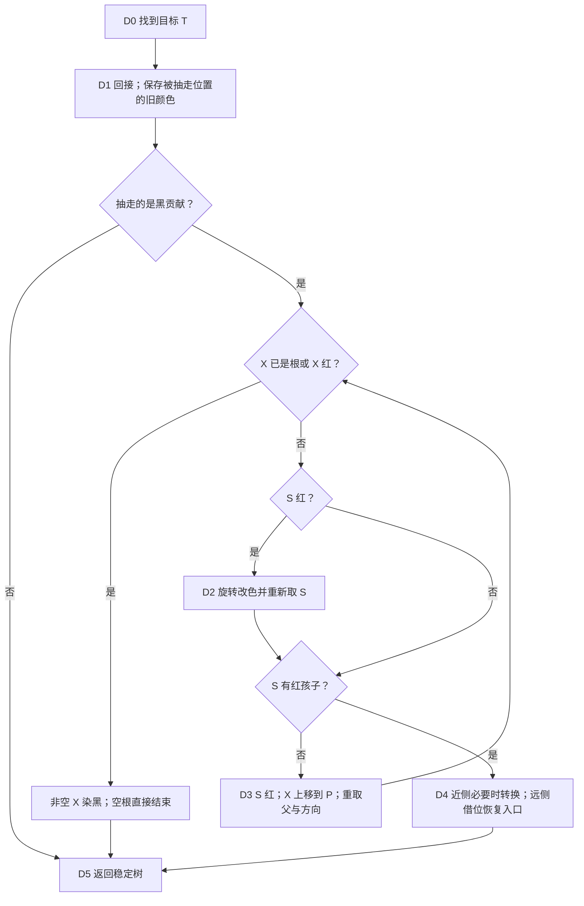

进入循环时，X 的实际黑贡献至少为 NIL 的一，S 比它多一，所以 S 不可能是 NIL。程序可以在这个已证明前提下读取 S 的孩子，而不能在任意损坏树上依赖这一断言。下节先固定 X 在左，最后的完整程序用方向变量覆盖左右两侧。

## 36.2\_沿兄弟与侄子修复缺口

缺口的位置已经明确，但还不能决定借位还是合并。下面先从兄弟没有红孩子的最小树出发，再增加远侄红、近侄红和红兄弟，逐步检查每个动作怎样维持排序、改变黑贡献，以及为什么能够停止或必须继续。

### 36.2.1\_删除黑节点后\_真正要看的是兄弟能不能\_借

假设删除后缺黑位置是 `X`：

```text
      P
     / \
    X   S
```

其中：

```text
X：删除黑节点后留下的缺黑位置
P：X 的父节点
S：X 的兄弟节点
```

删除修复真正要判断的是：

```text
S 这个兄弟节点有没有多余的黑高结构可以借？
```

对应到 2-3-4 树就是：

```text
兄弟是 2-node：不能借，只能合并，缺黑可能上推；
兄弟是 3-node / 4-node：可以借 key，通过旋转和变色修复，通常直接结束。
```

红黑树里怎么判断兄弟能不能借？

```text
S 是黑色，并且 S 的两个孩子都是黑色：
	兄弟对应 2-node，不能借。

S 是黑色，并且 S 至少有一个红孩子：
	兄弟对应 3-node 或 4-node，可以借。

S 是红色：
	先旋转，把它转换成黑兄弟情况，再继续判断。
```

------

### 36.2.2\_第一类\_兄弟没有红孩子\_不能借\_只能合并

先从最小的黑父、黑叶兄弟开始；这例会走到整树根，随后再推广到红父与内部黑父。

删除前：

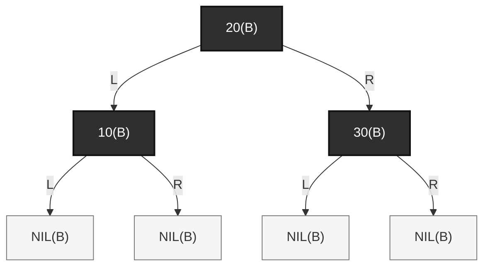

对应 2-3-4 树：


现在删除 `10(B)`。

红黑树变成：

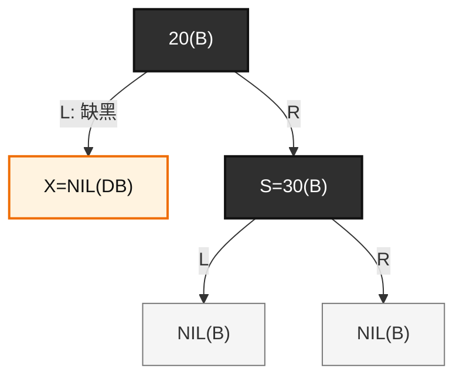

对应 2-3-4 树：

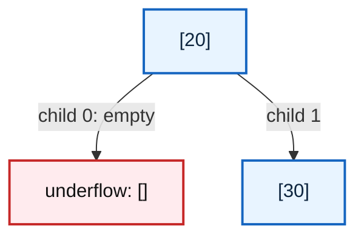

此时右兄弟 `[30]` 是 2-node，只有一个 key，不能借。

所以只能合并：

```text
[] + 20 + [30]
	↓
[20 | 30]
```

红黑树里对应动作是：

```text
S=30(B) 染红，让兄弟侧也少一个黑，当前两侧重新对齐；
若 P 原来红，P 染黑补回共同少的一黑并结束；
若 P 原来黑且不是根，把缺口连同父位置上推到 P；
若 P 已是整树根，各路径共同少一黑，无上层承诺需要补回，结束。
```

修复后：

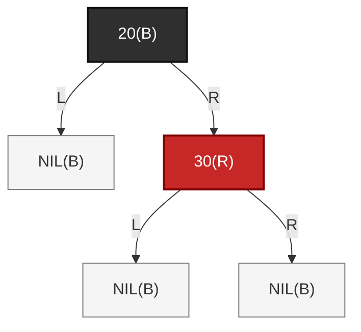

对应 2-3-4 树：

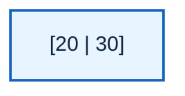

这里“当前两侧对齐”不等于“恢复了上层需要的高度”。设 X 实际贡献为 h，原兄弟为 h+1，P 的旧颜色贡献为 c（黑取 1、红取 0）。S 染红后两侧都为 h，局部入口是 c+h；删除前向上层承诺的是 c+h+1。红 P 可以由 0 改 1 填回一黑；黑 P 没法再黑一次，只能把一黑缺口移到它的入口；若那里已是整树根，则所有路径共同缩短一黑，允许结束。所谓双黑 DB（Double Black）只是在账本里记“应有值比实际值多一”，不是给 shade 新增第三种枚举。

这一类的本质是：

```text
兄弟没有多余 key；
不能借；
只能把父 key 拉下来合并；
如果父节点因此也缺 key，问题继续上推。
```

------

### 36.2.3\_第二类\_兄弟有远侧红孩子\_可以直接借

原笔记保留了一个值得继续追问的问题：

> 子节点原来是黑色，它底下的子子节点是红色怎么办？

这就是兄弟可以借的情况。

删除前红黑树：

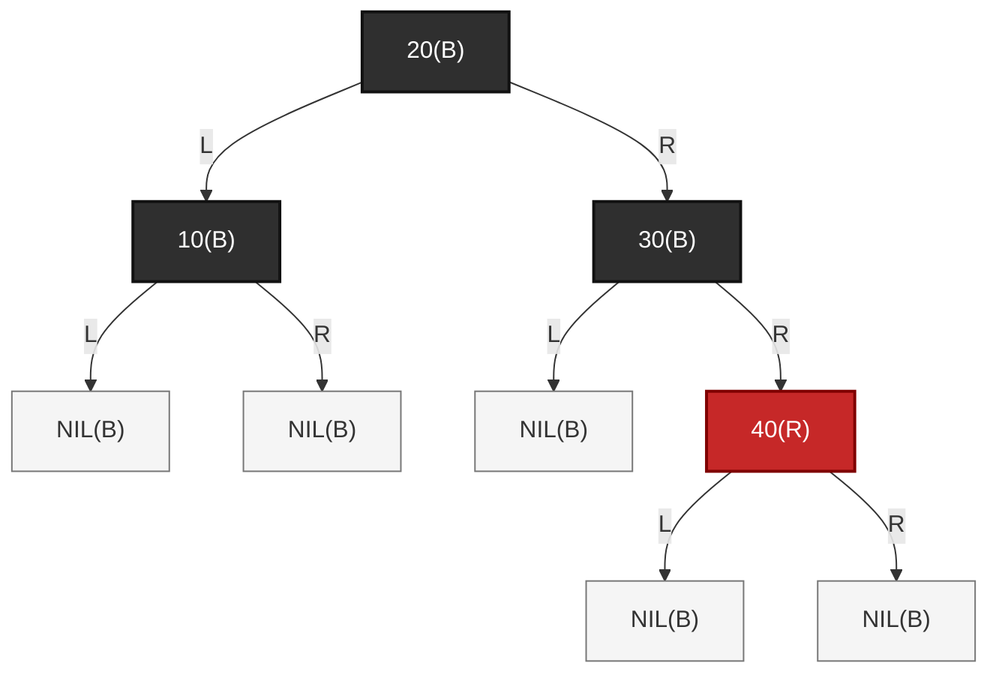

这棵树删除前是合法的。

对应 2-3-4 树：

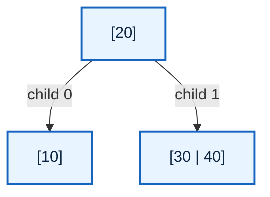

注意右兄弟不是 `[30]`，而是：

```text
[30 | 40]
```

它是 3-node，有两个 key。
这意味着它可以借一个 key 给左侧 underflow 节点。

现在删除 `10(B)`。

红黑树变成：

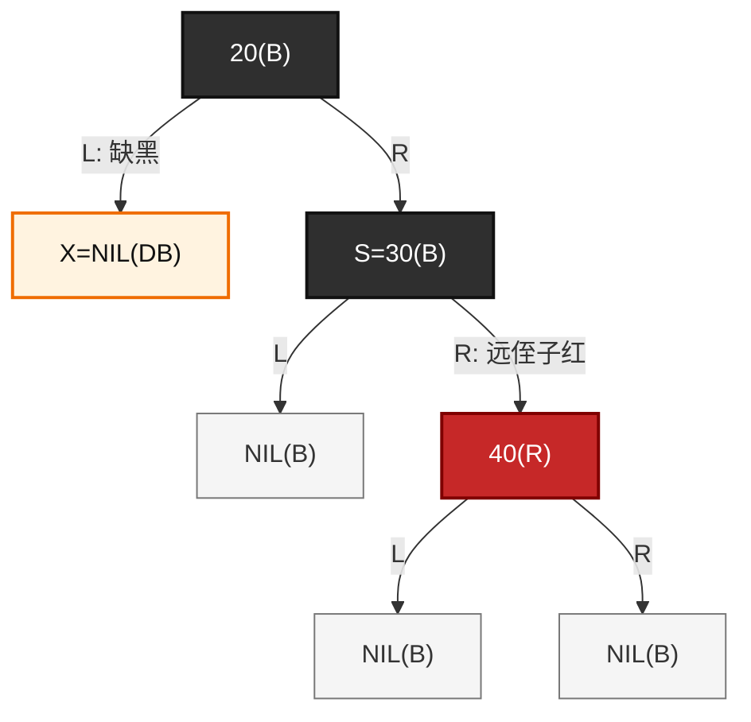

对应 2-3-4 树：

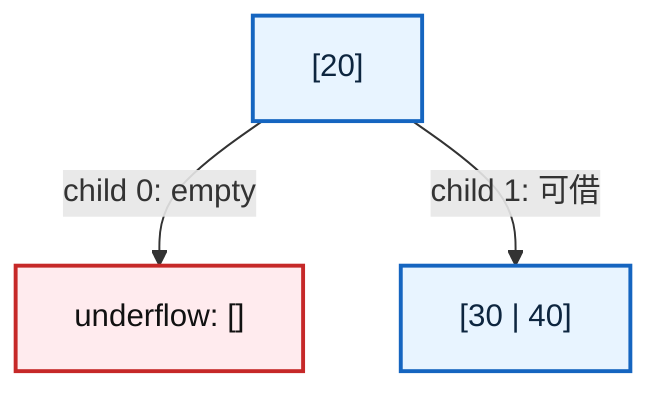

这时修复不是合并，而是**借 key**。

2-3-4 树操作是：

```text
父 key 20 下移到左侧空节点；
右兄弟最小 key 30 上移到父节点；
右兄弟剩下 [40]。
```

结果：

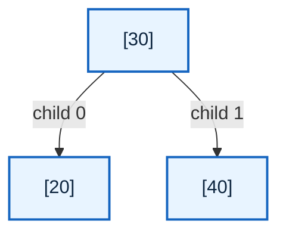

红黑树中对应的是：

```text
S=30(B) 继承 P 的颜色；
P=20 染黑；
远侄子 40(R) 染黑；
对 P=20 左旋；
修复结束。
```

修复后：


这个结果和 2-3-4 树完全对应：

```text
红黑树：
        30(B)
       /     \
   20(B)    40(B)

2-3-4 树：
        [30]
       /    \
    [20]   [40]
```

这一类的本质是：

```text
兄弟不是 2-node，而是 3-node 或 4-node；
兄弟可以借 key；
所以通过旋转和变色把兄弟的一个 key 移到父层，
再把父 key 下移补到缺黑侧；
修复直接结束。
```

------

### 36.2.4\_第三类\_兄弟有近侧红孩子\_需要先转换

还有一种情况：

```text
S 是黑色；
近侄子红；
远侄子黑（包括 NIL）。
```

这里先固定讨论方向：

```text
X 是 P 的左孩子；
S 是 P 的右孩子；
S 的左孩子 SL 是近侄子；
S 的右孩子 SR 是远侄子。
```

也就是：

```text
        P
       / \
      X   S
         / \
        SL  SR
```

其中：

```text
X  = 删除黑节点后留下的缺黑位置；
P  = X 的父节点；
S  = X 的兄弟节点；
SL = S 的左孩子，也就是近侄子；
SR = S 的右孩子，也就是远侄子。
```

对应图如下：

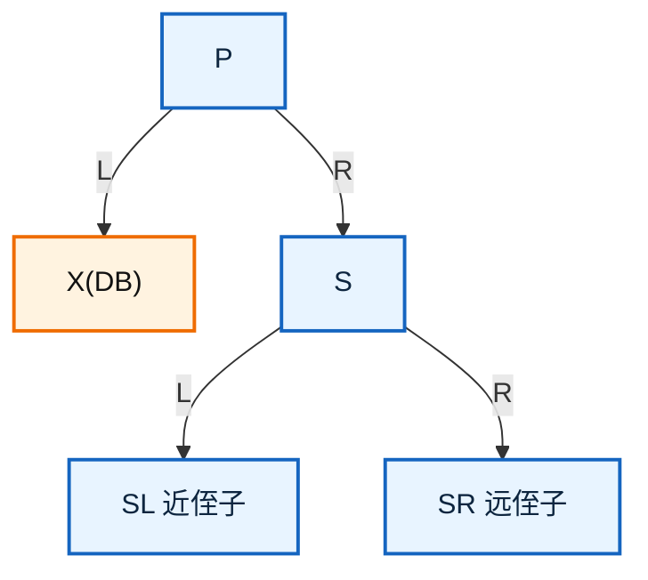

如果 `X` 在右侧，那么所有方向左右镜像。

------

#### (1)\_删除前\_兄弟是黑色\_近侄子是红色

先看删除前的合法红黑树局部：

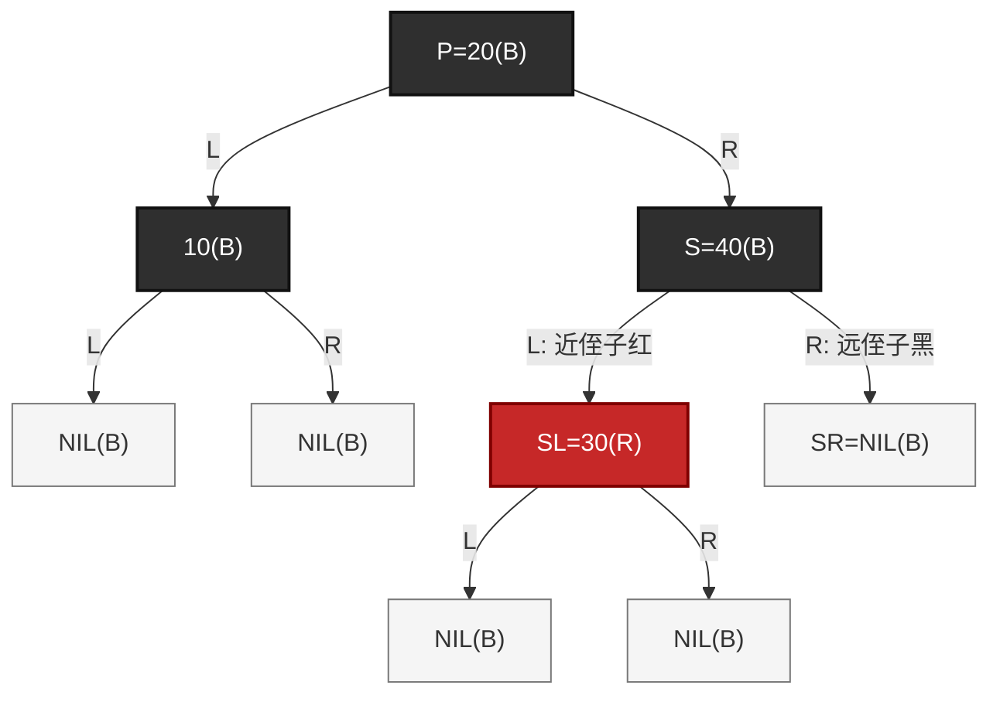

这个结构删除前是合法的。

从 2-3-4 树视角看：

```text
40(B) + 30(R)
```

表示一个 2-3-4 逻辑节点：

```text
[30 | 40]
```

所以删除前对应的 2-3-4 树是：


这里要注意：

```text
30(R) 不是 2-3-4 树中的下一层节点；
30(R) 是并入 40(B) 的红 key；
因此 30 和 40 共同组成兄弟逻辑节点 [30 | 40]。
```

也就是说，右兄弟不是 2-node，而是 3-node：

```text
[30 | 40]
```

这说明：

```text
兄弟有多余 key；
兄弟可以借；
这类情况不是合并修复，而是借位修复。
```

------

#### (2)\_删除\_10(B)\_后\_左侧出现黑高缺失

现在删除 `10(B)`。

`10(B)` 是黑色叶子节点。删除后，它原来的位置变成 `X=NIL(DB)`：

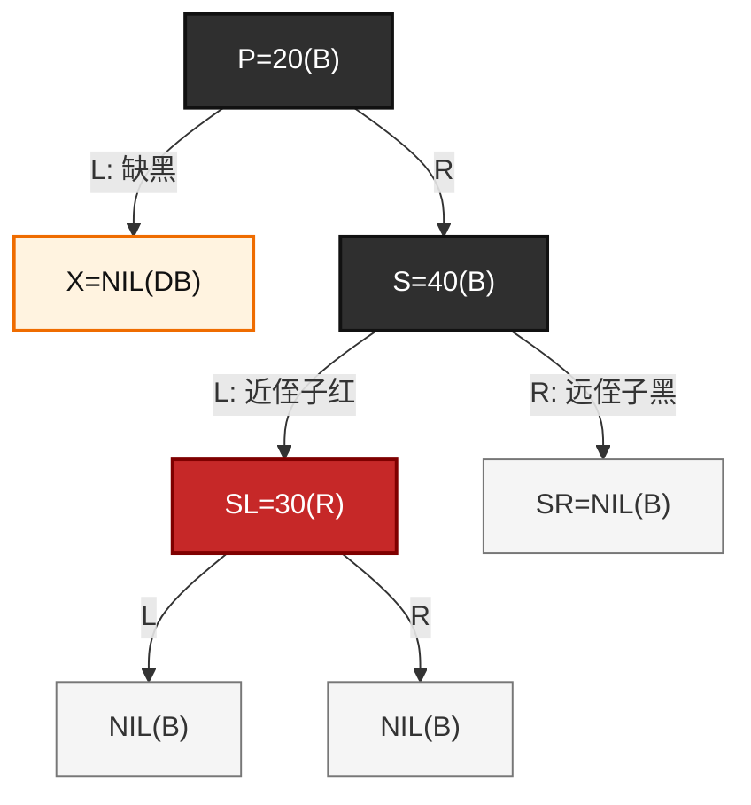

这里的 `X=NIL(DB)` 表示：

```text
原来的 10(B) 被删除；
左侧路径少了一个黑；
这个少掉的黑还没有被修复。
```

对应到 2-3-4 树，就是左孩子 `[10]` 删除唯一 key 后变成空节点：

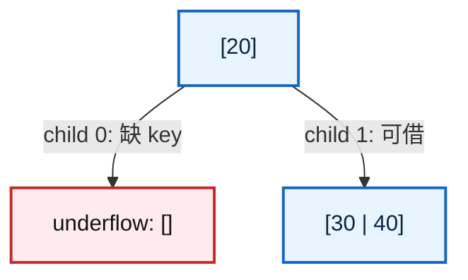

此时问题不是：

```text
右兄弟不能借，所以合并。
```

而是：

```text
右兄弟 [30 | 40] 有两个 key，可以借。
```

但是它在红黑树中的表达是：

```text
        40(B)
       /
    30(R)
```

红色 key `30` 位于近侧，不在远侧。

------

#### (3)\_为什么近侄子红不能直接修复

当前局部是：

```text
        20(B)
       /     \
  X=NIL(DB)  40(B)
             /
          30(R)
```

`X` 在左边缺黑，兄弟 `S=40(B)` 在右边。

要通过兄弟借 key 直接补黑，理想状态应该是：

```text
        20(B)
       /     \
  X=NIL(DB)  30(B)
                \
                40(R)
```

也就是：

```text
远侄子为红。
```

本算法的最终借位模板要求远侄为红。旋转后，原 P 位于缺口侧，新局部根继承 P 旧颜色，P 染黑使缺口侧多出一黑；远侄留在另一侧，染黑是为了让这一侧也保持同样的入口贡献。远侄并没有搬进 X 子树，不能把它想成直接送给 X 的一个黑节点。

若当前远侄已经黑，照抄模板的“染黑”不会新增贡献，这时两侧仍不等高。因此先把近侄红的二叉表示转为模板要求的远侄红，之后才能使用同一证明。

但现在红色节点 `30(R)` 在兄弟 `40(B)` 的左侧：

```text
        40(B)
       /
    30(R)
```

它是近侄子红。

所以不能直接对 `P=20` 左旋完成最终修复。
必须先把近侄子红转换成远侄子红。

------

#### (4)\_转换前保留完整子树关系

为了避免误解，下面不用全 NIL 图，而是用 `A/B/C` 表示可能非空的边界子树。

转换前：

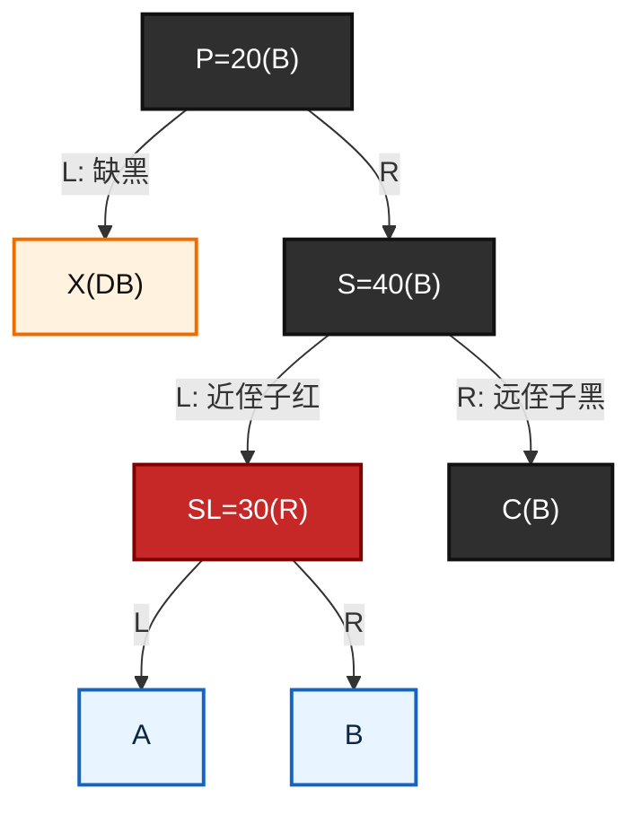

对应的局部结构是：

```text
        20(B)
       /      \
    X(DB)     40(B)
             /     \
          30(R)     C(B)
          /   \
         A     B
```

A/B 是原红近侄的孩子，因此根为黑或 NIL；C 原来就是黑远侄。设这些边界子树从自身入口起计的黑贡献均为 h，则缺口侧 X 当前也为 h，兄弟 S 的贡献为 h+1。X 可以是一整棵非空黑根子树，不能因为前一张叶子例用了 NIL，就把这里的 X 也缩成空节点。

这里的 BST 顺序关系是：

```text
X < 20 < A < 30 < B < 40 < C
```

这几个子树不能随便丢，因为旋转之后：

```text
B 会从 30 的右子树，变成 40 的左子树。
```

------

#### (5)\_第一步\_对兄弟\_40\_做右旋\_把近侄子红转换成远侄子红

转换动作是：

```text
1. SL=30(R) 染黑；
2. S=40(B) 染红；
3. 对 S=40 做右旋；
4. 新兄弟变成 30(B)；
5. 旧兄弟 40(R) 变成新兄弟 30(B) 的右孩子；
6. 对 X 来说，40(R) 变成新的远侄子红。
```

旋转后：

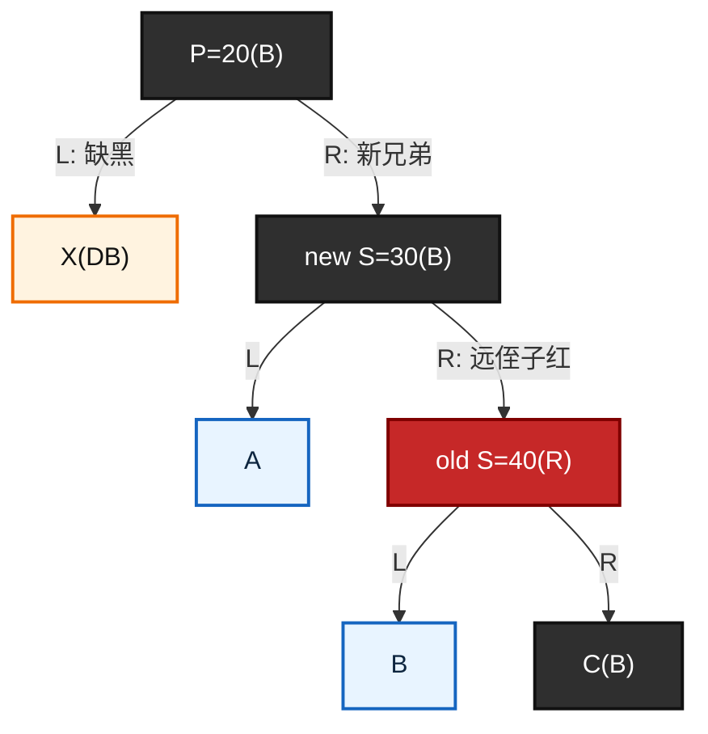

这个转换必须满足：

```text
旋转前：
        40
       /  \
     30    C
    /  \
   A    B

旋转后：
        30
       /  \
      A    40
          /  \
         B    C
```

所以位置关系是：

```text
30 变成 20 的新右孩子；
40 变成 30 的右孩子；
B 从 30 的右子树，变成 40 的左子树。
```

这一步的本质不是最终修复，而是**形态转换**：

```text
近侄子红
    ↓
远侄子红
```

此时 `X(DB)` 仍然存在，缺黑还没有真正消除。转换前 S 黑加任一边界是 1+h；转换后新兄弟 30 黑，其左 A 为 h，右侧旧 S 红加 B/C 仍为 h，合计仍是 1+h。X 没变，S 的入口贡献也没变，因此这一步只改变朝向，不偿还缺口。

------

#### (6)\_转换后\_已经进入远侄子红分支

转换后局部变成：

```text
        20(B)
       /      \
    X(DB)     30(B)
             /     \
            A      40(R)
                  /     \
                 B       C(B)
```

对于 `X` 来说：

```text
新兄弟 S = 30(B)；
新兄弟的右孩子 40(R) 是远侄子红。
```

所以现在进入第二类：

```text
兄弟是黑色；
远侄子是红色；
可以直接借；
通过旋转和染色完成最终修复。
```

------

#### (7)\_第二步\_对父节点\_20\_左旋\_完成真正的借位修复

最终修复动作是：

```text
1. 新兄弟 S=30 继承父节点 P=20 的颜色；
2. P=20 染黑；
3. 远侄子 40 染黑；
4. 对 P=20 做左旋；
5. X 的缺黑被消除；
6. 删除修复结束。
```

左旋前：

```mermaid
graph TD
	rb_p_final_before["P=20(B)"]
	rb_x_final_before["X(DB)"]
	rb_s_final_before["S=30(B)"]
	rb_a_final_before["A"]
	rb_far_final_before["F=40(R)"]
	rb_b_final_before["B"]
	rb_c_final_before["C(B)"]

	rb_p_final_before -->|"L: 缺黑"| rb_x_final_before
	rb_p_final_before -->|"R"| rb_s_final_before

	rb_s_final_before -->|"L"| rb_a_final_before
	rb_s_final_before -->|"R: 远侄子红"| rb_far_final_before

	rb_far_final_before -->|"L"| rb_b_final_before
	rb_far_final_before -->|"R"| rb_c_final_before

	classDef rb_black fill:#2f2f2f,stroke:#111,color:#fff,stroke-width:2px;
	classDef rb_red fill:#c62828,stroke:#7f0000,color:#fff,stroke-width:2px;
	classDef rb_subtree fill:#e8f4ff,stroke:#1565c0,color:#0d253f,stroke-width:2px;
	classDef rb_db fill:#fff3e0,stroke:#ef6c00,color:#111,stroke-width:2px;

	class rb_p_final_before,rb_s_final_before,rb_c_final_before rb_black;
	class rb_far_final_before rb_red;
	class rb_a_final_before,rb_b_final_before rb_subtree;
	class rb_x_final_before rb_db;
```

最终修复后：

```mermaid
graph TD
	rb_s_final_after["S=30(B)"]
	rb_p_final_after["P=20(B)"]
	rb_far_final_after["F=40(B)"]
	rb_x_final_after["X(B) 缺口已解除"]
	rb_a_final_after["A"]
	rb_b_final_after["B"]
	rb_c_final_after["C(B)"]

	rb_s_final_after -->|"L"| rb_p_final_after
	rb_s_final_after -->|"R"| rb_far_final_after

	rb_p_final_after -->|"L"| rb_x_final_after
	rb_p_final_after -->|"R"| rb_a_final_after

	rb_far_final_after -->|"L"| rb_b_final_after
	rb_far_final_after -->|"R"| rb_c_final_after

	classDef rb_black fill:#2f2f2f,stroke:#111,color:#fff,stroke-width:2px;
	classDef rb_nil fill:#f5f5f5,stroke:#777,color:#333,stroke-width:1px;
	classDef rb_subtree fill:#e8f4ff,stroke:#1565c0,color:#0d253f,stroke-width:2px;

	class rb_s_final_after,rb_p_final_after,rb_far_final_after,rb_c_final_after rb_black;
	class rb_x_final_after rb_nil;
	class rb_a_final_after,rb_b_final_after rb_subtree;
```

如果 `P=20` 原来是黑色，那么新局部根 `30` 继承黑色，所以最终是：

```text
        30(B)
       /     \
    20(B)   40(B)
```

如果 `P=20` 原来是红色，那么 `30` 继承红色：

```text
        30(R)
       /     \
    20(B)   40(B)
```

这也合法。因为 `30` 继承的是 `P` 原来的颜色，原来 `P` 如果是红色，它的父节点必然是黑色，旋转后不会凭空制造新的上层红红冲突。图中 X 的缺口标记已经解除，但它仍是原来那棵子树，既没有消失，也不一定是 NIL。

------

#### (8)\_2-3-4\_树视角\_这就是借\_key\_不是合并

删除 `10(B)` 后，2-3-4 树处于：

```mermaid
graph TD
	tree_root_borrow_before["[20]"]
	tree_left_borrow_before["underflow: []"]
	tree_right_borrow_before["[30 | 40]"]

	tree_root_borrow_before -->|"child 0: 缺 key"| tree_left_borrow_before
	tree_root_borrow_before -->|"child 1: 可借"| tree_right_borrow_before

	classDef node234 fill:#e8f4ff,stroke:#1565c0,color:#0d253f,stroke-width:2px;
	classDef underflow fill:#ffebee,stroke:#c62828,color:#111,stroke-width:2px;

	class tree_root_borrow_before,tree_right_borrow_before node234;
	class tree_left_borrow_before underflow;
```

因为右兄弟 `[30 | 40]` 有两个 key，所以可以借。

借位过程是：

```text
父 key 20 下移到左侧空节点；
右兄弟最小 key 30 上移到父节点；
右兄弟剩余 key 40 留在右侧。
```

结果：

```mermaid
graph TD
	tree_root_borrow_after["[30]"]
	tree_left_borrow_after["[20]"]
	tree_right_borrow_after["[40]"]

	tree_root_borrow_after -->|"child 0"| tree_left_borrow_after
	tree_root_borrow_after -->|"child 1"| tree_right_borrow_after

	classDef node234 fill:#e8f4ff,stroke:#1565c0,color:#0d253f,stroke-width:2px;

	class tree_root_borrow_after,tree_left_borrow_after,tree_right_borrow_after node234;
```

所以从 2-3-4 树看，完整过程是：

```text
删除前：
        [20]
       /    \
    [10]  [30 | 40]

删除 10 后：
        [20]
       /    \
      []  [30 | 40]

借位后：
        [30]
       /    \
    [20]   [40]
```

这个过程没有降低树高，也没有合并节点。
它只是把右兄弟的一个 key 借给左侧 underflow 节点。

------

#### (9)\_为什么红黑树要分两步\_而\_2-3-4\_树看起来一步完成

在 2-3-4 树里，借位动作可以直接描述为：

```text
[20] 的右兄弟 [30 | 40] 借出 30；
30 上移；
20 下移；
得到 [30]，左右孩子为 [20] 和 [40]。
```

但是红黑树是二叉表示。
右兄弟 `[30 | 40]` 在红黑树里可能有两种表达：

第一种：远侄子红表达：

```text
30(B)
    \
    40(R)
```

第二种：近侄子红表达：

```text
    40(B)
   /
30(R)
```

当前属于第二种。

所以红黑树不能一步完成最终修复，必须先做一次兄弟内部旋转：

```text
40(B) 左红 30(R)
    ↓
30(B) 右红 40(R)
```

然后再执行远侄子红分支的最终修复。

因此：

```text
第一步右旋兄弟 40：
	只是改变 [30 | 40] 的红黑树二叉表达；
	没有真正消除 X 的缺黑。

第二步左旋父节点 20：
	才是真正完成借 key；
	消除 X 的黑高缺失。
```

------

#### (10)\_这一类的本质总结

这一类的本质是：

```text
兄弟确实能借；
但红 key 在近侧；
近侧红不能直接补 X 的缺黑；
所以先把近侧红转换成远侧红；
再执行真正的借 key 修复。
```

可以把它记成：

```text
近侄子红，不是不够借；
而是可借 key 的二叉位置不对。

第一步：
	对兄弟做反向旋转；
	把近侄子红转换成远侄子红。

第二步：
	对父节点做最终旋转；
	完成借 key；
	消除 double black。
```

对应红黑树动作是：

```text
SL 染黑；
S 染红；
对 S 右旋；
转换成远侄子红。

然后：

新兄弟继承 P 的颜色；
P 染黑；
远侄子染黑；
对 P 左旋；
修复结束。
```

对应 2-3-4 树动作是：

```text
      [20]
     /    \
   []   [30 | 40]

借位后：

      [30]
     /    \
  [20]   [40]
```

这一类不是合并修复，而是借位修复。
它之所以多一步，是因为红黑树当前的二叉表达把可借 key 放在了近侧，需要先转换成远侧红形态。

------

### 36.2.5\_第四类\_兄弟是红色\_先转换\_不是直接修复

还有一种容易漏掉的情况：

```text
S 是红色。
```

这里仍然固定讨论一个方向：

```text
X 是 P 的左孩子；
S 是 P 的右孩子；
S 是 X 的兄弟节点。
```

也就是：

```text
        P
       / \
      X   S
```

其中：

```text
X = 删除黑节点后留下的缺黑位置；
P = X 的父节点；
S = X 的兄弟节点。
```

如果 `S` 是红色，那么根据红黑树规则：

```text
P 必须是黑色；
S 的两个直接孩子必须是黑色。
```

注意，这里说的是：

```text
S 的两个直接孩子必须是黑色。
```

不是说：

```text
S 的两个孩子下面不能再有红色节点。
```

也就是说，`S` 的直接孩子是黑色，但这些黑色孩子的子树内部仍然可能包含红色节点。
因此，兄弟红分支旋转之后，仍然需要重新判断新的黑兄弟能不能借。

------

#### (1)\_删除前\_兄弟是红色的合法局部

先看一个删除前合法的红黑树局部。这里先取 A/B/C/D 全部为 NIL，得到五个实节点的最小例子；后面的通用图才允许满足黑高约束的非空子树，不能任意替换这些边界。

```mermaid
graph TD
	rb_p_before["P=20(B)"]
	rb_x_before["10(B)"]
	rb_s_before["S=40(R)"]
	rb_x_left_before["NIL(B)"]
	rb_x_right_before["NIL(B)"]
	rb_sl_before["SL=30(B)"]
	rb_sr_before["SR=50(B)"]
	rb_sl_left_before["A"]
	rb_sl_right_before["B"]
	rb_sr_left_before["C"]
	rb_sr_right_before["D"]

	rb_p_before -->|"L"| rb_x_before
	rb_p_before -->|"R"| rb_s_before

	rb_x_before -->|"L"| rb_x_left_before
	rb_x_before -->|"R"| rb_x_right_before

	rb_s_before -->|"L"| rb_sl_before
	rb_s_before -->|"R"| rb_sr_before

	rb_sl_before -->|"L"| rb_sl_left_before
	rb_sl_before -->|"R"| rb_sl_right_before

	rb_sr_before -->|"L"| rb_sr_left_before
	rb_sr_before -->|"R"| rb_sr_right_before

	classDef rb_black fill:#2f2f2f,stroke:#111,color:#fff,stroke-width:2px;
	classDef rb_red fill:#c62828,stroke:#7f0000,color:#fff,stroke-width:2px;
	classDef rb_nil fill:#f5f5f5,stroke:#777,color:#333,stroke-width:1px;
	classDef rb_subtree fill:#e8f4ff,stroke:#1565c0,color:#0d253f,stroke-width:2px;

	class rb_p_before,rb_x_before,rb_sl_before,rb_sr_before rb_black;
	class rb_s_before rb_red;
	class rb_x_left_before,rb_x_right_before rb_nil;
	class rb_sl_left_before,rb_sl_right_before,rb_sr_left_before,rb_sr_right_before rb_subtree;
```

这里的颜色关系是：

```text
P = 20(B)
S = 40(R)
SL = 30(B)
SR = 50(B)
```

由于 `S=40` 是红色，所以它的父节点 `P=20` 必须是黑色。
同时，`S` 的两个直接孩子 `30` 和 `50` 必须是黑色。

------

#### (2)\_对应到\_2-3-4\_树\_P\_和\_S\_属于同一个逻辑节点

红黑树里的：

```text
20(B) + 40(R)
```

表示 2-3-4 树中的一个 3-node：

```text
[20 | 40]
```

`30(B)` 和 `50(B)` 不是并入 `[20 | 40]` 的 key，而是这个 2-3-4 逻辑节点的孩子。

所以删除前对应的 2-3-4 树是：

```mermaid
graph TD
	tree_root_before["[20 | 40]"]
	tree_child_0_before["[10]"]
	tree_child_1_before["[30]"]
	tree_child_2_before["[50]"]

	tree_root_before -->|"child 0"| tree_child_0_before
	tree_root_before -->|"child 1"| tree_child_1_before
	tree_root_before -->|"child 2"| tree_child_2_before

	classDef node234 fill:#e8f4ff,stroke:#1565c0,color:#0d253f,stroke-width:2px;

	class tree_root_before,tree_child_0_before,tree_child_1_before,tree_child_2_before node234;
```

也就是说，兄弟为红时，红黑树局部的 2-3-4 语义不是：

```text
[20] 的右兄弟是 [40]
```

而是：

```text
20 和 40 本来就属于同一个 2-3-4 逻辑节点 [20 | 40]。
```

这一点很重要。
如果只从二叉树角度看，会以为 `40(R)` 是普通兄弟；但从 2-3-4 树角度看，`40(R)` 是和 `20(B)` 合并在一起的同层 key。

------

#### (3)\_删除\_10(B)\_后\_左侧\_child\_0\_发生\_underflow

现在删除 `10(B)`。

`10(B)` 是黑色叶子节点。删除后，它的位置变成缺黑位置 `X=NIL(DB)`：

```mermaid
graph TD
	rb_p_delete["P=20(B)"]
	rb_x_delete["X=NIL(DB)"]
	rb_s_delete["S=40(R)"]
	rb_sl_delete["SL=30(B)"]
	rb_sr_delete["SR=50(B)"]
	rb_sl_left_delete["A"]
	rb_sl_right_delete["B"]
	rb_sr_left_delete["C"]
	rb_sr_right_delete["D"]

	rb_p_delete -->|"L: 缺黑"| rb_x_delete
	rb_p_delete -->|"R"| rb_s_delete

	rb_s_delete -->|"L"| rb_sl_delete
	rb_s_delete -->|"R"| rb_sr_delete

	rb_sl_delete -->|"L"| rb_sl_left_delete
	rb_sl_delete -->|"R"| rb_sl_right_delete

	rb_sr_delete -->|"L"| rb_sr_left_delete
	rb_sr_delete -->|"R"| rb_sr_right_delete

	classDef rb_black fill:#2f2f2f,stroke:#111,color:#fff,stroke-width:2px;
	classDef rb_red fill:#c62828,stroke:#7f0000,color:#fff,stroke-width:2px;
	classDef rb_db fill:#fff3e0,stroke:#ef6c00,color:#111,stroke-width:2px;
	classDef rb_subtree fill:#e8f4ff,stroke:#1565c0,color:#0d253f,stroke-width:2px;

	class rb_p_delete,rb_sl_delete,rb_sr_delete rb_black;
	class rb_s_delete rb_red;
	class rb_x_delete rb_db;
	class rb_sl_left_delete,rb_sl_right_delete,rb_sr_left_delete,rb_sr_right_delete rb_subtree;
```

对应到 2-3-4 树，就是 `[20 | 40]` 的最左孩子 `[10]` 删除后变成空节点：

```mermaid
graph TD
	tree_root_delete["[20 | 40]"]
	tree_child_0_delete["underflow: []"]
	tree_child_1_delete["[30]"]
	tree_child_2_delete["[50]"]

	tree_root_delete -->|"child 0: 缺 key"| tree_child_0_delete
	tree_root_delete -->|"child 1"| tree_child_1_delete
	tree_root_delete -->|"child 2"| tree_child_2_delete

	classDef node234 fill:#e8f4ff,stroke:#1565c0,color:#0d253f,stroke-width:2px;
	classDef underflow fill:#ffebee,stroke:#c62828,color:#111,stroke-width:2px;

	class tree_root_delete,tree_child_1_delete,tree_child_2_delete node234;
	class tree_child_0_delete underflow;
```

这里的 underflow 发生在：

```text
[20 | 40] 的 child 0。
```

也就是：

```text
      [20 | 40]
      /    |    \
    []   [30]  [50]
```

------

#### (4)\_为什么兄弟红时不能直接修复

当前红黑树局部是：

```text
        20(B)
       /     \
  X(DB)      40(R)
             /    \
          30(B)  50(B)
```

从 2-3-4 树看，它对应：

```text
      [20 | 40]
      /    |    \
    []   [30]  [50]
```

这时不能直接套用：

```text
兄弟黑，两个侄子黑；
兄弟染红，缺黑上推。
```

也不能直接套用：

```text
兄弟黑，远侄子红；
旋转染色，直接修复。
```

原因是：

```text
当前兄弟 S 是红色，不是黑色兄弟场景。
```

红黑树删除修复的借位/合并判断，需要建立在：

```text
X 的兄弟是黑色。
```

因为黑色兄弟在红黑树中对应一个独立的 2-3-4 逻辑节点，可以判断它是：

```text
2-node：不能借；
3-node / 4-node：可以借。
```

但红色兄弟 `S=40(R)` 不是独立的 2-3-4 子节点，它和 `P=20(B)` 属于同一个逻辑节点 `[20 | 40]`。

所以必须先转换。

------

#### (5)\_转换动作\_把红兄弟转换成黑兄弟场景

转换动作是：

```text
1. S=40(R) 染黑；
2. P=20(B) 染红；
3. 对 P=20 左旋；
4. 重新计算 X 的兄弟。
```

旋转前：

```mermaid
graph TD
	rb_p_conv_before["P=20(B)"]
	rb_x_conv_before["X(DB)"]
	rb_s_conv_before["S=40(R)"]
	rb_sl_conv_before["SL=30(B)"]
	rb_sr_conv_before["SR=50(B)"]
	rb_a_conv_before["A"]
	rb_b_conv_before["B"]
	rb_c_conv_before["C"]
	rb_d_conv_before["D"]

	rb_p_conv_before -->|"L: 缺黑"| rb_x_conv_before
	rb_p_conv_before -->|"R"| rb_s_conv_before

	rb_s_conv_before -->|"L"| rb_sl_conv_before
	rb_s_conv_before -->|"R"| rb_sr_conv_before

	rb_sl_conv_before -->|"L"| rb_a_conv_before
	rb_sl_conv_before -->|"R"| rb_b_conv_before

	rb_sr_conv_before -->|"L"| rb_c_conv_before
	rb_sr_conv_before -->|"R"| rb_d_conv_before

	classDef rb_black fill:#2f2f2f,stroke:#111,color:#fff,stroke-width:2px;
	classDef rb_red fill:#c62828,stroke:#7f0000,color:#fff,stroke-width:2px;
	classDef rb_db fill:#fff3e0,stroke:#ef6c00,color:#111,stroke-width:2px;
	classDef rb_subtree fill:#e8f4ff,stroke:#1565c0,color:#0d253f,stroke-width:2px;

	class rb_p_conv_before,rb_sl_conv_before,rb_sr_conv_before rb_black;
	class rb_s_conv_before rb_red;
	class rb_x_conv_before rb_db;
	class rb_a_conv_before,rb_b_conv_before,rb_c_conv_before,rb_d_conv_before rb_subtree;
```

对 `P=20` 左旋后：

```mermaid
graph TD
	rb_s_conv_after["S=40(B)"]
	rb_p_conv_after["P=20(R)"]
	rb_sr_conv_after["SR=50(B)"]
	rb_x_conv_after["X(DB)"]
	rb_sl_conv_after["new S=30(B)"]
	rb_a_conv_after["A"]
	rb_b_conv_after["B"]
	rb_c_conv_after["C"]
	rb_d_conv_after["D"]

	rb_s_conv_after -->|"L"| rb_p_conv_after
	rb_s_conv_after -->|"R"| rb_sr_conv_after

	rb_p_conv_after -->|"L: 缺黑"| rb_x_conv_after
	rb_p_conv_after -->|"R: 新兄弟"| rb_sl_conv_after

	rb_sl_conv_after -->|"L"| rb_a_conv_after
	rb_sl_conv_after -->|"R"| rb_b_conv_after

	rb_sr_conv_after -->|"L"| rb_c_conv_after
	rb_sr_conv_after -->|"R"| rb_d_conv_after

	classDef rb_black fill:#2f2f2f,stroke:#111,color:#fff,stroke-width:2px;
	classDef rb_red fill:#c62828,stroke:#7f0000,color:#fff,stroke-width:2px;
	classDef rb_db fill:#fff3e0,stroke:#ef6c00,color:#111,stroke-width:2px;
	classDef rb_subtree fill:#e8f4ff,stroke:#1565c0,color:#0d253f,stroke-width:2px;

	class rb_s_conv_after,rb_sr_conv_after,rb_sl_conv_after rb_black;
	class rb_p_conv_after rb_red;
	class rb_x_conv_after rb_db;
	class rb_a_conv_after,rb_b_conv_after,rb_c_conv_after,rb_d_conv_after rb_subtree;
```

这里必须看清楚位置变化：

```text
旋转前：
        20
       /  \
      X    40
          /  \
        30    50

旋转后：
          40
         /  \
       20    50
      /  \
     X    30
```

也就是说：

```text
40 变成局部根；
20 变成 40 的左孩子；
30 从 40 的左孩子，变成 20 的右孩子；
X 仍然是 20 的左孩子；
X 的新兄弟变成 30。
```

这一步完成后，`X` 的兄弟不再是红色的 `40`，而是黑色的 `30`。

------

#### (6)\_这一步的\_2-3-4\_语义\_逻辑节点还没有真正修复

转换前的 2-3-4 树是：

```text
      [20 | 40]
      /    |    \
    []   [30]  [50]
```

转换后，红黑树形态变了，但 2-3-4 逻辑状态本质上仍然是在处理同一个 underflow：

```text
      [20 | 40]
      /    |    \
    []   [30]  [50]
```

因为这一步只是把红黑树二叉表达从：

```text
20(B) + 右红 40(R)
```

转换成：

```text
40(B) + 左红 20(R)
```

它没有真正消除 `X` 的缺黑。

所以转换后必须继续处理：

```text
X 的新兄弟是 30(B)；
接下来要判断 30(B) 能不能借。
```

这就是为什么说：

```text
兄弟红是转换分支，不是最终修复分支。
```

------

#### (7)\_转换后继续判断\_新兄弟\_30(B)\_能不能借

转换后局部是：

```text
          40(B)
         /     \
     20(R)    50(B)
     /   \
 X(DB)  30(B)
```

现在对于 `X` 来说：

```text
P = 20(R)
S = 30(B)
```

也就是说，新兄弟已经是黑色兄弟。

接下来按黑兄弟分支继续判断：

```text
如果 30(B) 的两个孩子都是黑色：
	进入“兄弟黑，两个侄子黑”分支。

如果 30(B) 有红孩子：
	进入“兄弟黑，近侄子红”或“兄弟黑，远侄子红”分支。
```

在当前最简单示例里，`30(B)` 没有红孩子，因此进入：

```text
兄弟黑，两个侄子黑。
```

动作是：

```text
30(B) 染红；
因为 P=20 是红色，所以 P 染黑；
X 的缺黑被 P 的红色消化；
修复结束。
```

修复后：

```mermaid
graph TD
	rb_root_after_case2["40(B)"]
	rb_left_after_case2["20(B)"]
	rb_right_after_case2["50(B)"]
	rb_x_after_case2["X=NIL(B)"]
	rb_mid_after_case2["30(R)"]
	rb_30_left_after_case2["A"]
	rb_30_right_after_case2["B"]
	rb_50_left_after_case2["C"]
	rb_50_right_after_case2["D"]

	rb_root_after_case2 -->|"L"| rb_left_after_case2
	rb_root_after_case2 -->|"R"| rb_right_after_case2

	rb_left_after_case2 -->|"L"| rb_x_after_case2
	rb_left_after_case2 -->|"R"| rb_mid_after_case2

	rb_mid_after_case2 -->|"L"| rb_30_left_after_case2
	rb_mid_after_case2 -->|"R"| rb_30_right_after_case2

	rb_right_after_case2 -->|"L"| rb_50_left_after_case2
	rb_right_after_case2 -->|"R"| rb_50_right_after_case2

	classDef rb_black fill:#2f2f2f,stroke:#111,color:#fff,stroke-width:2px;
	classDef rb_red fill:#c62828,stroke:#7f0000,color:#fff,stroke-width:2px;
	classDef rb_nil fill:#f5f5f5,stroke:#777,color:#333,stroke-width:1px;
	classDef rb_subtree fill:#e8f4ff,stroke:#1565c0,color:#0d253f,stroke-width:2px;

	class rb_root_after_case2,rb_left_after_case2,rb_right_after_case2 rb_black;
	class rb_mid_after_case2 rb_red;
	class rb_x_after_case2 rb_nil;
	class rb_30_left_after_case2,rb_30_right_after_case2,rb_50_left_after_case2,rb_50_right_after_case2 rb_subtree;
```

对应 2-3-4 树是：

```mermaid
graph TD
	tree_root_after_case2["[40]"]
	tree_left_after_case2["[20 | 30]"]
	tree_right_after_case2["[50]"]

	tree_root_after_case2 -->|"child 0"| tree_left_after_case2
	tree_root_after_case2 -->|"child 1"| tree_right_after_case2

	classDef node234 fill:#e8f4ff,stroke:#1565c0,color:#0d253f,stroke-width:2px;

	class tree_root_after_case2,tree_left_after_case2,tree_right_after_case2 node234;
```

从 2-3-4 树角度看，这相当于：

```text
      [20 | 40]
      /    |    \
    []   [30]  [50]

修复后：

        [40]
       /    \
 [20 | 30] [50]
```

这里发生的是：

```text
空节点 [] 与父 key 20、相邻兄弟 [30] 合并；
父节点 [20 | 40] 失去 20 后剩下 [40]。
```

所以在这个具体例子里，最终修复不是靠 `40` 借，而是转换后让 `[] + 20 + [30]` 合并，并由父节点剩余的 key `40` 保持结构合法。

------

#### (8)\_如果转换后的新兄弟有红孩子怎么办

前面示例中，新兄弟 `30(B)` 没有红孩子，所以转换后进入“兄弟黑，两个侄子黑”。

但是一般情况不能这么死记。

转换后要重新判断新兄弟：

```text
新兄弟 = 原来的 SL
```

如果新兄弟有红孩子，那么它对应 2-3-4 树中的 3-node 或 4-node，可以借 key。

这时继续进入：

```text
兄弟黑，近侄子红；
或者
兄弟黑，远侄子红。
```

也就是说，兄弟红分支只保证一件事：

```text
把红兄弟变成黑兄弟。
```

它不保证：

```text
转换后一定马上结束。
```

也不保证：

```text
转换后一定是合并。
```

转换后的后续动作，取决于新的黑兄弟是否有红孩子。

------

#### (9)\_这一类的本质总结

兄弟红分支的本质是：

```text
当前兄弟 S 是红色；
S 不是独立的 2-3-4 兄弟节点；
S 和 P 属于同一个 2-3-4 逻辑节点；
因此不能直接判断 S 能不能借，也不能直接合并。
```

所以必须先做转换：

```text
S 染黑；
P 染红；
对 P 旋转；
让 X 的新兄弟变成黑色。
```

转换后再继续判断：

```text
新兄弟没有红孩子：
	按“兄弟黑，两个侄子黑”合并；
	由于转换后 P 必红，紧接着把 P 染黑吸收缺口，不会继续向更高层传播。

新兄弟有红孩子：
	按“兄弟黑，近侄子红”或“兄弟黑，远侄子红”处理；
	通过借 key 修复。
```

所以这类情况可以记成：

```text
兄弟红，不是最终修复；
兄弟红，是把当前局部转换成黑兄弟场景。

转换前：
        20(B)
       /     \
   X(DB)    40(R)
            /   \
        30(B)  50(B)

转换后：
          40(B)
         /     \
     20(R)    50(B)
     /   \
 X(DB)  30(B)

此时 X 的新兄弟是 30(B)，然后继续按黑兄弟规则处理。
```

最终一句话：

```text
兄弟是红色时，红黑树不是在这一分支直接补黑；
它只是通过旋转和变色，把“红兄弟”转换成“黑兄弟”，
然后重新进入兄弟黑的借位或合并逻辑。
```

------

### 36.2.6\_删除黑节点后的完整判断链

删除黑节点后的修复，不应该记成“看到什么颜色就机械改颜色”，而应该记成：

```text
删除黑节点后，先产生缺黑位置 X；
然后围绕 X 的兄弟 S 判断：

1. S 是红色：
	先转换成黑兄弟场景。

2. S 是黑色，并且没有红孩子：
	说明兄弟是 2-node，不能借，只能合并，缺黑可能上推。

3. S 是黑色，并且有红孩子：
	说明兄弟是 3-node 或 4-node，可以借；
	如果红孩子在远侧，可以直接修复；
	如果红孩子在近侧，先转换成远侧红，再修复。
```

这里先固定一个方向：

```text
X 是缺黑位置；
X 是 P 的左孩子；
S 是 P 的右孩子；
SL 是 S 的左孩子；
SR 是 S 的右孩子。
```

也就是：

```mermaid
graph TD
	rb_p_base["P"]
	rb_x_base["X(DB)"]
	rb_s_base["S"]
	rb_sl_base["SL 近侄子"]
	rb_sr_base["SR 远侄子"]

	rb_p_base -->|"L"| rb_x_base
	rb_p_base -->|"R"| rb_s_base

	rb_s_base -->|"L"| rb_sl_base
	rb_s_base -->|"R"| rb_sr_base

	classDef rb_normal fill:#e8f4ff,stroke:#1565c0,color:#0d253f,stroke-width:2px;
	classDef rb_db fill:#fff3e0,stroke:#ef6c00,color:#111,stroke-width:2px;

	class rb_p_base,rb_s_base,rb_sl_base,rb_sr_base rb_normal;
	class rb_x_base rb_db;
```

如果 `X` 是右孩子，则所有方向左右镜像：

```text
X 是 P 的右孩子；
S 是 P 的左孩子；
S 的右孩子是近侄子；
S 的左孩子是远侄子。
```

------

#### (1)\_第一步\_先看兄弟\_S\_是红色还是黑色

在已确认 X 非根且为黑或 NIL、确实携带缺口之后，本轮才先看兄弟 S 的颜色。红替代孩子可直接染黑，缺口到根也可结束，不应先无条件解引用父亲。

原因是：

```text
只有黑色兄弟才对应一个独立的 2-3-4 兄弟节点；
红色兄弟表示它和父节点 P 属于同一个 2-3-4 逻辑节点。
```

所以：

```text
S 是红色：
	不能直接判断能不能借；
	必须先旋转变色，把它转换成黑兄弟场景。

S 是黑色：
	可以继续判断 S 对应的 2-3-4 节点能不能借。
```

------

#### (2)\_情况一\_S\_是红色\_先转换成黑兄弟

条件：

```text
S 是红色。
```

局部形态：

```mermaid
graph TD
	rb_p_red_case["P=20(B)"]
	rb_x_red_case["X(DB)"]
	rb_s_red_case["S=40(R)"]
	rb_sl_red_case["SL=30(B)"]
	rb_sr_red_case["SR=50(B)"]

	rb_p_red_case -->|"L: 缺黑"| rb_x_red_case
	rb_p_red_case -->|"R"| rb_s_red_case

	rb_s_red_case -->|"L"| rb_sl_red_case
	rb_s_red_case -->|"R"| rb_sr_red_case

	classDef rb_black fill:#2f2f2f,stroke:#111,color:#fff,stroke-width:2px;
	classDef rb_red fill:#c62828,stroke:#7f0000,color:#fff,stroke-width:2px;
	classDef rb_db fill:#fff3e0,stroke:#ef6c00,color:#111,stroke-width:2px;

	class rb_p_red_case,rb_sl_red_case,rb_sr_red_case rb_black;
	class rb_s_red_case rb_red;
	class rb_x_red_case rb_db;
```

动作：

```text
S 染黑；
P 染红；
对 P 左旋；
重新取得 X 的兄弟 S；
继续进入黑兄弟分支。
```

转换后：

```mermaid
graph TD
	rb_s_red_after["40(B)"]
	rb_p_red_after["20(R)"]
	rb_sr_red_after["50(B)"]
	rb_x_red_after["X(DB)"]
	rb_new_s_red_after["30(B)"]

	rb_s_red_after -->|"L"| rb_p_red_after
	rb_s_red_after -->|"R"| rb_sr_red_after

	rb_p_red_after -->|"L: 缺黑"| rb_x_red_after
	rb_p_red_after -->|"R: 新兄弟"| rb_new_s_red_after

	classDef rb_black fill:#2f2f2f,stroke:#111,color:#fff,stroke-width:2px;
	classDef rb_red fill:#c62828,stroke:#7f0000,color:#fff,stroke-width:2px;
	classDef rb_db fill:#fff3e0,stroke:#ef6c00,color:#111,stroke-width:2px;

	class rb_s_red_after,rb_sr_red_after,rb_new_s_red_after rb_black;
	class rb_p_red_after rb_red;
	class rb_x_red_after rb_db;
```

这一步的重点是：

```text
兄弟红不是最终修复；
它只是把“红兄弟”转换成“黑兄弟”。

转换后，X 仍然缺黑；
只是 X 的新兄弟变成了黑色。
```

所以后面还要继续判断：

```text
新兄弟有没有红孩子？
能不能借？
不能借是否需要合并？
```

------

#### (3)\_情况二\_S\_是黑色\_SL\_和\_SR\_都是黑色\_兄弟不能借

条件：

```text
S 是黑色；
SL 是黑色；
SR 是黑色。
```

其中 `NIL` 也按黑色处理。

局部形态：

```mermaid
graph TD
	rb_p_case2["P(?)"]
	rb_x_case2["X(DB)"]
	rb_s_case2["S(B)"]
	rb_sl_case2["SL(B)"]
	rb_sr_case2["SR(B)"]

	rb_p_case2 -->|"L: 缺黑"| rb_x_case2
	rb_p_case2 -->|"R"| rb_s_case2

	rb_s_case2 -->|"L"| rb_sl_case2
	rb_s_case2 -->|"R"| rb_sr_case2

	classDef rb_black fill:#2f2f2f,stroke:#111,color:#fff,stroke-width:2px;
	classDef rb_unknown fill:#e8f4ff,stroke:#1565c0,color:#0d253f,stroke-width:2px;
	classDef rb_db fill:#fff3e0,stroke:#ef6c00,color:#111,stroke-width:2px;

	class rb_s_case2,rb_sl_case2,rb_sr_case2 rb_black;
	class rb_p_case2 rb_unknown;
	class rb_x_case2 rb_db;
```

这表示：

```text
兄弟 S 对应 2-3-4 树中的 2-node；
兄弟没有多余 key；
不能借。
```

所以只能合并。

动作：

```text
S 染红；
X 的缺黑在当前层被局部对齐；
缺黑问题转移到 P。
```

然后分两种情况：

```text
如果 P 原来是红色：
	P 染黑；
	缺黑被 P 消化；
	修复结束。

如果 P 原来是黑色：
	把 X 更新为 P；
	缺黑继续向上修复。
```

这对应 2-3-4 树中的：

```text
underflow [] + 父 key + 兄弟 2-node
	↓
合并成一个节点
```

例如：

```text
      [20]
     /    \
   []    [30]

合并后：

[20 | 30]
```

但是如果父节点因此失去 key，问题可能继续向上。

------

#### (4)\_情况三\_S\_是黑色\_SR\_是红色\_远侄子红\_可以直接借

条件：

```text
S 是黑色；
SR 是红色。
```

局部形态：

```mermaid
graph TD
	rb_p_case3["P(?)"]
	rb_x_case3["X(DB)"]
	rb_s_case3["S(B)"]
	rb_sl_case3["SL(?)"]
	rb_sr_case3["SR(R)"]

	rb_p_case3 -->|"L: 缺黑"| rb_x_case3
	rb_p_case3 -->|"R"| rb_s_case3

	rb_s_case3 -->|"L"| rb_sl_case3
	rb_s_case3 -->|"R: 远侄子红"| rb_sr_case3

	classDef rb_black fill:#2f2f2f,stroke:#111,color:#fff,stroke-width:2px;
	classDef rb_red fill:#c62828,stroke:#7f0000,color:#fff,stroke-width:2px;
	classDef rb_unknown fill:#e8f4ff,stroke:#1565c0,color:#0d253f,stroke-width:2px;
	classDef rb_db fill:#fff3e0,stroke:#ef6c00,color:#111,stroke-width:2px;

	class rb_s_case3 rb_black;
	class rb_sr_case3 rb_red;
	class rb_p_case3,rb_sl_case3 rb_unknown;
	class rb_x_case3 rb_db;
```

这表示：

```text
兄弟 S 对应 2-3-4 树中的 3-node 或 4-node；
兄弟有多余 key；
可以借。
```

动作：

```text
S 继承 P 的颜色；
P 染黑；
SR 染黑；
对 P 左旋；
X 的缺黑被消除；
修复结束。
```

对应 2-3-4 树借位：

```text
      [20]
     /    \
   []   [30 | 40]

借位后：

      [30]
     /    \
  [20]   [40]
```

把近侧子树记为 N，远侄的两棵子树记为 A/B，三者的黑贡献都为 h；X 实际也为 h，而兄弟黑加红远侄贡献 h+1。设 P 原颜色为 c。旋转后 P 黑的两侧是 X/N，各为 h，远侄染黑的两侧 A/B 也各为 h；它们都向新根贡献 h+1。新根继承 c，所以局部入口恢复 c+h+1，等于删除前的承诺。远侄变黑补的是旋转后它所在的一侧；缺口侧多出来的黑来自 P 与新根的重新分布。

这一类可以直接结束，因为：

```text
新局部根 S 继承旧 P 的颜色，P 染黑并移到缺口侧；
远侄仍在另一侧，染黑让该侧取得同样的黑贡献；
两侧各为 h+1，入口总贡献恢复为旧承诺 c+h+1。
```

------

#### (5)\_情况四\_S\_是黑色\_SL\_是红色\_SR\_是黑色\_近侄子红\_需要先转换

条件：

```text
S 是黑色；
SL 是红色；
SR 是黑色。
```

局部形态：

```mermaid
graph TD
	rb_p_case4["P(?)"]
	rb_x_case4["X(DB)"]
	rb_s_case4["S(B)"]
	rb_sl_case4["SL(R)"]
	rb_sr_case4["SR(B)"]

	rb_p_case4 -->|"L: 缺黑"| rb_x_case4
	rb_p_case4 -->|"R"| rb_s_case4

	rb_s_case4 -->|"L: 近侄子红"| rb_sl_case4
	rb_s_case4 -->|"R: 远侄子黑"| rb_sr_case4

	classDef rb_black fill:#2f2f2f,stroke:#111,color:#fff,stroke-width:2px;
	classDef rb_red fill:#c62828,stroke:#7f0000,color:#fff,stroke-width:2px;
	classDef rb_unknown fill:#e8f4ff,stroke:#1565c0,color:#0d253f,stroke-width:2px;
	classDef rb_db fill:#fff3e0,stroke:#ef6c00,color:#111,stroke-width:2px;

	class rb_s_case4,rb_sr_case4 rb_black;
	class rb_sl_case4 rb_red;
	class rb_p_case4 rb_unknown;
	class rb_x_case4 rb_db;
```

这表示：

```text
兄弟确实能借；
但可借的红 key 位于近侧；
不能直接补 X 的缺黑。
```

所以先转换成远侄子红。

动作：

```text
SL 染黑；
S 染红；
对 S 右旋；
重新取得 S；
转换成“远侄子红”情况。
```

转换前：

```text
        S=40(B)
       /
   SL=30(R)
```

转换后：

```text
      SL=30(B)
             \
             S=40(R)
```

然后进入情况三：

```text
新兄弟继承 P 的颜色；
P 染黑；
远侄子染黑；
对 P 左旋；
修复结束。
```

所以近侄子红分支分两步：

```text
第一步：兄弟内部旋转，近侧红变远侧红；
第二步：父节点旋转，完成借位修复。
```

------

#### (6)\_完整判断链伪代码

循环入口保存三个值：X 地址、P 地址、X 位于 P 的哪一侧。X 可以为空，所以 P 不能从 `parent(X)` 临时猜出。下面以左侧一轮说明，右侧必须镜像；上推后还要重新计算方向，不能把第一次的方向一直沿用。

```text
while X 不是整树根，并且 X 为黑或 NIL：
    S = P 的另一侧孩子
    若 S 红：
        S 黑，P 红，向 X 的方向旋转 P
        从 P 的另一侧重新读取 S
    重新读取 S 的近侄 N 和远侄 F
    若 N/F 都黑：
        S 红
        X = P，P = X 的父亲，重新计算 X 的方向
        继续循环
    若 F 黑：                 # 此时 N 必红
        N 黑，S 红，向远侧旋转 S
        重新读取 S，以及它新的远侄 F
    S 继承 P 的旧颜色，P 黑，F 黑
    向 X 的方向旋转 P，修复完成并返回

循环出口：
    若 X 非空，将 X 染黑       # 红替代或红父吸收；根也在此统一为黑
    若 X 为空且也是根，空树合法
```

要注意：

```text
情况一：兄弟红，只是转换。
情况二：兄弟黑，两个侄子黑，可能上推。
情况三：兄弟黑，远侄子红，最终修复。
情况四：兄弟黑，近侄子红，先转换成情况三。
```

------

### 36.2.7\_用\_2-3-4\_树重新总结

红黑树删除黑节点后的修复，本质上不是“为了旋转而旋转”，而是在模拟 2-3-4 树删除后的三种动作：

```text
1. 兄弟能借：借 key；
2. 兄弟不能借：合并；
3. 红兄弟：先转换表达，再重新判断借还是合并。
```

------

#### (1)\_兄弟能借

2-3-4 树中，如果 underflow 节点的兄弟是 3-node 或 4-node，就说明兄弟有多余 key，可以借。

例如：

```text
      [20]
     /    \
   []   [30 | 40]
```

右兄弟 `[30 | 40]` 有两个 key，可以借。

借位过程：

```text
父 key 20 下移到空节点；
兄弟最小 key 30 上移到父节点；
兄弟剩余 key 40 留在右侧。
```

修复后：

```text
      [30]
     /    \
  [20]   [40]
```

红黑树表现为：

```text
兄弟 S 是黑色；
S 至少有一个红孩子；
说明兄弟对应 3-node 或 4-node；
通过旋转和变色完成借位；
修复通常直接结束。
```

对应关系：

```text
远侄子红：
	可以直接借。

近侄子红：
	可以借，但红 key 位置不对；
	先把近侄子红转换成远侄子红；
	再借。
```

------

#### (2)\_兄弟不能借

2-3-4 树中，如果 underflow 节点的兄弟是 2-node，就说明兄弟没有多余 key，不能借。

例如：

```text
      [20]
     /    \
   []    [30]
```

右兄弟 `[30]` 是 2-node，不能借。

只能合并：

```text
[] + 20 + [30]
	↓
[20 | 30]
```

红黑树表现为：

```text
兄弟 S 是黑色；
S 的两个孩子都是黑色；
说明兄弟对应 2-node；
兄弟不能借；
S 染红；
缺黑可能上推到 P。
```

如果 `P` 原来是红色：

```text
P 染黑；
缺黑被 P 消化；
修复结束。
```

如果 `P` 原来是黑色：

```text
缺黑继续上推到 P；
继续修复。
```

------

#### (3)\_兄弟是红色

红黑树里如果兄弟 `S` 是红色，说明：

```text
S 不是一个独立的 2-3-4 兄弟节点；
S 和 P 属于同一个 2-3-4 逻辑节点。
```

例如：

```text
        20(B)
       /     \
   X(DB)    40(R)
            /   \
        30(B)  50(B)
```

对应 2-3-4 树：

```text
      [20 | 40]
      /    |    \
    []   [30]  [50]
```

此时不能直接说：

```text
兄弟能借
```

也不能直接说：

```text
兄弟不能借
```

因为红色兄弟 `40(R)` 不是独立兄弟节点。

所以先旋转转换：

```text
40(R) 染黑；
20(B) 染红；
对 20 左旋。
```

得到：

```text
          40(B)
         /     \
     20(R)    50(B)
     /   \
 X(DB)  30(B)
```

此时 `X` 的新兄弟变成 `30(B)`，它是黑兄弟。
然后再判断：

```text
30(B) 能不能借？
```

所以兄弟红分支的本质是：

```text
先把红兄弟局面转换成黑兄弟局面；
再进入借位或合并判断。
```

------

### 36.2.8\_最终结论

删除黑节点触发修复的根本原因不是：

```text
看到黑节点就要调整。
```

而是：

```text
删除了一个黑节点；
替代位置不能提供黑色贡献；
导致某条路径少了一个黑；
于是产生 X(DB) 缺黑位置。
```

删除修复不是盲目旋转，而是围绕 `X` 的兄弟 `S` 判断：

```text
兄弟能不能借 key？
```

完整逻辑是：

```text
1. 如果 S 是红色：
	S 和 P 属于同一个 2-3-4 逻辑节点；
	S 不是独立兄弟节点；
	先旋转变色，转换成黑兄弟；
	然后重新判断。

2. 如果 S 是黑色，并且没有红孩子：
	S 对应 2-3-4 树中的 2-node；
	兄弟不能借；
	只能合并；
	缺黑可能上推。

3. 如果 S 是黑色，并且有红孩子：
	S 对应 2-3-4 树中的 3-node 或 4-node；
	兄弟可以借；
	通过旋转和变色把一个 key 借到缺黑侧；
	修复通常直接结束。

4. 如果红孩子在近侧：
	说明能借，但位置不对；
	先旋转兄弟，把近侧红转换成远侧红；
	再执行最终借位修复。

5. 如果红孩子在远侧：
	可以直接执行最终借位修复。
```

一句话总结：

> **删除黑节点后的修复，本质是处理 2-3-4 树中的 underflow：兄弟能借就借，兄弟不能借就合并，兄弟是红色就先转换成黑兄弟后再判断。红黑树中的旋转和变色，只是这些 2-3-4 树借位、合并、转换动作的二叉树表达。**

------


## 36.3\_用完整程序删除图中的对象

这次让程序直接装入图中已经验证的颜色结构，避免为了制造某个删除分支，先把插入顺序的另一套推演混进来。`node_spec` 每行给出键、颜色和左右孩子下标；-1 表示 NIL，第零行是根。例如 `{20,black,1,2}` 表示根 20 的两个孩子在第一、第二行。构造器一次性建立对象池，然后核对索引、父链、唯一键、颜色和黑高，不合法的输入抛出 `std::invalid_argument` 异常；它不是给任意进程内存做修复的工具。

完整文件也在材料 [rbtree_erase.cpp](../../../../labs/kernel/tree_basics/materials/rbtree_erase.cpp)。初始构造和 valid 观察器会分配内存，erase 本身不分配；摘除后的对象保留在固定池里，alive=false 且链接清空，直到整棵树销毁才一起释放。没有对象槽重用或重新插入功能。与 P35 的插入程序分别编译运行，不把两个含 main 的教学文件链接成同一个程序。

```cpp
#include <cassert>
#include <cstddef>
#include <iostream>
#include <optional>
#include <stdexcept>
#include <unordered_set>
#include <vector>

enum class color { red, black };

struct node {
    int key = 0;
    color shade = color::black;
    node* parent = nullptr;
    node* left = nullptr;
    node* right = nullptr;
    bool alive = true;
};

struct node_spec {
    int key;
    color shade;
    int left = -1;   // -1 表示 NIL，其余值是输入数组的下标
    int right = -1;
};

struct repair_counts {
    unsigned red_sibling = 0;
    unsigned merge = 0;
    unsigned near = 0;
    unsigned far = 0;
    unsigned absorbed = 0;
    unsigned rotations = 0;
};

class erase_tree {
    std::vector<node> storage_;  // 构造后不扩容，节点地址固定到树销毁
    node* root_ = nullptr;
    repair_counts counts_;

    static bool is_red(const node* current) {
        return current && current->shade == color::red;
    }

    void replace(node* old_node, node* replacement) {
        node* parent = old_node->parent;
        if (!parent) root_ = replacement;
        else if (old_node == parent->left) parent->left = replacement;
        else parent->right = replacement;
        if (replacement) replacement->parent = parent;
    }

    void rotate_left(node* old_root) {
        node* new_root = old_root->right;
        assert(new_root);
        old_root->right = new_root->left;
        if (new_root->left) new_root->left->parent = old_root;
        replace(old_root, new_root);
        new_root->left = old_root;
        old_root->parent = new_root;
        ++counts_.rotations;
    }

    void rotate_right(node* old_root) {
        node* new_root = old_root->left;
        assert(new_root);
        old_root->left = new_root->right;
        if (new_root->right) new_root->right->parent = old_root;
        replace(old_root, new_root);
        new_root->right = old_root;
        old_root->parent = new_root;
        ++counts_.rotations;
    }

    void repair(node* current, node* parent, bool on_left) {
        // current 可为空，父节点和方向由调用方显式保存
        while (current != root_ && !is_red(current)) {
            assert(parent);
            node* sibling = on_left ? parent->right : parent->left;
            assert(sibling);  // 合法树中缺黑侧比兄弟恰少一黑，兄弟不可能是 NIL
            if (is_red(sibling)) {
                sibling->shade = color::black;
                parent->shade = color::red;
                if (on_left) rotate_left(parent);
                else rotate_right(parent);
                sibling = on_left ? parent->right : parent->left;
                ++counts_.red_sibling;
            }
            if (!is_red(sibling->left) && !is_red(sibling->right)) {
                sibling->shade = color::red;
                current = parent;
                parent = current->parent;
                on_left = parent && current == parent->left;
                ++counts_.merge;
                continue;  // 红父在循环出口染黑，黑父继续携带缺口
            }
            node* far_child = on_left ? sibling->right : sibling->left;
            if (!is_red(far_child)) {
                node* near_child = on_left ? sibling->left : sibling->right;
                assert(is_red(near_child));
                near_child->shade = color::black;
                sibling->shade = color::red;
                if (on_left) rotate_right(sibling);
                else rotate_left(sibling);
                sibling = on_left ? parent->right : parent->left;
                ++counts_.near;
            }
            far_child = on_left ? sibling->right : sibling->left;
            assert(is_red(far_child));
            sibling->shade = parent->shade;
            parent->shade = color::black;
            far_child->shade = color::black;
            if (on_left) rotate_left(parent);
            else rotate_right(parent);
            ++counts_.far;
            return;
        }
        if (current) {
            if (is_red(current)) ++counts_.absorbed;
            current->shade = color::black;
        }
    }

    static int inspect(const node* current, const node* parent,
                       std::optional<int> low, std::optional<int> high,
                       std::unordered_set<const node*>& seen) {
        if (!current) return 1;
        if (!seen.insert(current).second || !current->alive ||
            current->parent != parent ||
            (current->shade != color::red && current->shade != color::black) ||
            (low && current->key <= *low) || (high && current->key >= *high) ||
            (is_red(parent) && is_red(current))) return -1;
        const int left = inspect(current->left, current, low, current->key, seen);
        if (left < 0) return -1;
        const int right = inspect(current->right, current, current->key, high, seen);
        if (right < 0 || right != left) return -1;
        return left + (current->shade == color::black ? 1 : 0);
    }

public:
    explicit erase_tree(const std::vector<node_spec>& input) : storage_(input.size()) {
        for (std::size_t i = 0; i < input.size(); ++i) {
            storage_[i].key = input[i].key;
            storage_[i].shade = input[i].shade;
        }
        for (std::size_t i = 0; i < input.size(); ++i) {
            auto attach = [&](int index, node*& slot) {
                if (index == -1) return;
                if (index < 0 || static_cast<std::size_t>(index) >= input.size())
                    throw std::invalid_argument("child index");
                node* child = &storage_[static_cast<std::size_t>(index)];
                if (child->parent) throw std::invalid_argument("shared child");
                slot = child;
                child->parent = &storage_[i];
            };
            attach(input[i].left, storage_[i].left);
            attach(input[i].right, storage_[i].right);
        }
        root_ = storage_.empty() ? nullptr : &storage_[0];
        if (!valid()) throw std::invalid_argument("invalid red-black fixture");
    }
    erase_tree(const erase_tree&) = delete;
    erase_tree& operator=(const erase_tree&) = delete;
    erase_tree(erase_tree&&) = delete;
    erase_tree& operator=(erase_tree&&) = delete;

    const node* root() const { return root_; }
    repair_counts counts() const { return counts_; }

    const node* find(int key) const {
        const node* current = root_;
        while (current && key != current->key)
            current = key < current->key ? current->left : current->right;
        return current;
    }

    bool valid() const {
        std::size_t live = 0;
        for (const auto& object : storage_) live += object.alive;
        if (!root_) return live == 0;
        if (root_->parent || is_red(root_)) return false;
        std::unordered_set<const node*> seen;
        return inspect(root_, nullptr, {}, {}, seen) >= 0 && seen.size() == live;
    }

    bool erase(int key) {
        counts_ = {};
        node* target = root_;
        while (target && key != target->key)
            target = key < target->key ? target->left : target->right;
        if (!target) return false;
        node* removed_from = target;  // 记录抽走黑贡献的原位置，不等同于退出对象
        color removed_color = target->shade;
        node* current = nullptr;
        node* parent = nullptr;
        bool on_left = false;
        if (!target->left || !target->right) {
            current = target->left ? target->left : target->right;
            parent = target->parent;
            on_left = parent && target == parent->left;
            replace(target, current);
        } else {
            removed_from = target->right;
            while (removed_from->left) removed_from = removed_from->left;
            removed_color = removed_from->shade;  // 必须在继承目标颜色以前保存
            current = removed_from->right;
            if (removed_from->parent == target) {
                parent = removed_from;
                on_left = false;
                if (current) current->parent = removed_from;
            } else {
                parent = removed_from->parent;
                on_left = true;  // 非直接后继是原父的左孩子
                replace(removed_from, current);
                removed_from->right = target->right;
                removed_from->right->parent = removed_from;
            }
            replace(target, removed_from);
            removed_from->left = target->left;
            removed_from->left->parent = removed_from;
            removed_from->shade = target->shade;
        }
        target->alive = false;  // 只摘除目标对象，不复制键，不立即释放池内存
        target->parent = target->left = target->right = nullptr;
        if (removed_color == color::black) repair(current, parent, on_left);
        return true;
    }
};

static void run_case(const char* name, const std::vector<node_spec>& input, int key) {
    erase_tree tree(input);
    const node* target = tree.find(key);
    const bool erased = tree.erase(key);
    assert(erased && tree.valid() && !target->alive);
    const auto count = tree.counts();
    std::cout << name << ": root=" << (tree.root() ? tree.root()->key : -1)
              << " red=" << count.red_sibling << " merge=" << count.merge
              << " near=" << count.near << " far=" << count.far
              << " absorbed=" << count.absorbed << " rotations=" << count.rotations << '\n';
}

int main() {
    using c = color;
    run_case("merge", {{20,c::black,1,2},{10,c::black},{30,c::black}}, 10);
    run_case("far", {{20,c::black,1,2},{10,c::black},{30,c::black,-1,3},{40,c::red}}, 10);
    run_case("near", {{20,c::black,1,2},{10,c::black},{40,c::black,3},{30,c::red}}, 10);
    run_case("red sibling", {{20,c::black,1,2},{10,c::black},{40,c::red,3,4},
                            {30,c::black},{50,c::black}}, 10);
    run_case("three rotations", {{20,c::black,1,2},{10,c::black},{50,c::red,3,5},
                                {40,c::black,4},{30,c::red},{60,c::black}}, 10);
    run_case("red replacement", {{20,c::black,1},{10,c::red}}, 20);
    return 0;
}
```

在保存该材料的目录执行：

```bash
g++ -std=c++17 -Wall -Wextra -Wpedantic -Werror rbtree_erase.cpp -o rbtree_erase
./rbtree_erase
```

不要定义关闭断言的 NDEBUG 宏。先预测前三行分别需要几次旋转，再核对输出：

```text
merge: root=20 red=0 merge=1 near=0 far=0 absorbed=0 rotations=0
far: root=30 red=0 merge=0 near=0 far=1 absorbed=0 rotations=1
near: root=30 red=0 merge=0 near=1 far=1 absorbed=0 rotations=2
red sibling: root=40 red=1 merge=1 near=0 far=0 absorbed=1 rotations=1
three rotations: root=50 red=1 merge=0 near=1 far=1 absorbed=0 rotations=3
red replacement: root=10 red=0 merge=0 near=0 far=0 absorbed=1 rotations=0
```

red 统计红兄弟转换，merge 统计合并，near/far 统计近侧转换与最终借位，absorbed 统计红 X 在循环出口染黑。它们是分支次数，不是颜色写入次数。空根在本输出格式中用 -1 表示，仅用于显示；内部依然使用空指针，-1 仍是允许存入的普通键。

第四行说明红兄弟并不是一个结束分支：先变成黑兄弟，随后合并，新红父再吸收缺口。第五行把新兄弟安排成仅近侄红，于是连续走 D2、D4 的近侧转换与远侧收尾，共三旋；“已经转过一次”并不能成为返回条件。最后一行直接由红孩子继承被删黑根的位置并染黑，没有看兄弟。

再看程序中容易写错的两处分工。两孩子删除时，removed_from 指向 Y；先保存 Y 原颜色，再把 Y 接到 T 的结构位置并继承 T 色。如果 Y 就是 T 的右孩子，缺口在 **移动后的 Y 的右槽**，parent 必须设成 Y。若 Y 在更深左链，缺口留在 Y 原父的左槽，parent 保存那个原父。两个分支都不能把已经退出的 T 当成缺口父亲。

repair 中的 current 可以为 nullptr，所以 parent 和 on_left 始终与它一起传递。合并上推时，current 改为旧 parent，重新取它的新父及方向；近侄转换后重新读 sibling/far_child。这样伪代码中的“继续处理”才有明确地址，不需要给 NIL 偷塞 parent 字段。

## 36.4\_从一次成功扩展到完整删除周期

1. 将任一合法实例全部键取相反数，并交换每行左右下标，删除对应的相反数。近/远侧跟缺口相对，动作应左右镜像；颜色条件不变。
2. 对三黑节点例先删 20，再删 30、10，观察直接后继接替、红替代和空根。保存目标地址与另两个地址，确认退出的是指定对象，其余对象的键与地址不变。
3. 构造根 20 黑，左 10 黑，右 40 红，其左 30 黑、右 50 黑。改删 20，让深后继 30 从 40 的左槽退出并接替根；原缺口父亲应是 40，不是已退出的 20。可先用本章的节点下标格式表达，再交给构造器验证。
4. 用七节点完全二叉树、全部染黑，连续从最小键删除。逐次记录 merge 和根地址，寻找同一次删除的多层合并；检查结束后每一层的实际黑高，而不是只看图形仍像树。
5. 重复删除已经不存在的键，并尝试空树删除，确认返回 false 且原树链接、颜色和 alive 不变。再将一个合法输入改为共享孩子、越界下标或红根，确认构造阶段拒绝它，而不是拿非法树验证修复算法。

第二项删 20 时，30 接替根并继承黑色；它原来也是黑，因此从其右侧 NIL 进入修复，10 染红，根处允许结束。第三项则从右子树内部的左侧缺口开始；两项有相同的“删根”业务操作，却有不同的缺口父地址。第四项只有合并能多层上推，旋转不能靠次数猜测完成；第五项把输入契约与算法正确性分开。

为什么本算法至多三次旋转？D3 合并不旋转，可以一直上推；一旦遇到红兄弟，D2 把父变红，后面要么合并后被红父吸收，要么借位结束，所以不会再到更高层重复 D2。D4 最多一次近侧转换加一次最终借位，故总上限是一次 D2 加两次 D4。这个界只属于这里的标准自底向上算法，不能自动外推到别的实现；最坏合并层数、查找与后继定位仍是 O(log n)，观察器扫描整树的成本也不能算作单次更新成本。

现在，插入的红红上推和删除的一黑缺口各有了可运行周期。进入 [P33 多路删除对照](P33_从多路删除到红黑缺口.md#33.2_按同一删除阶段比较局部动作)，用同阶段的容量与黑高比较两种表示；再回 [P07 映射](P07_红黑树_把_2-3-4_树映射成二叉表示.md#7.5_2-3-4_树与红黑树的映射关系)收束抽象模型。Linux 的具体对象回调与发布边界由 [P11 删除单元](P11_Linux_6.12_内核_rbtree_删除与缺黑修复.md#11.1.3_一轮取消经过哪些状态)独立讲解，本例对象池不代表其回收契约。返回[大纲](大纲.md#1.1_沿问题进入现有章节)。
