# 第37章\_构建rbtree调用者接口

本章的接口与类型采用[固定源码总索引](../../../../research/source_reading/rbtree/navigation/P01_Linux_6.12_rbtree源码阅读索引.md#1.1_固定提交与阅读边界)所列 NXP Linux 6.12.20 提交。先完成 P09 的对象、比较和寿命实验，再把已经成立的约定接到实际接口；源码修复算法仍由后续章节负责。

## 37.1\_使用者视角\_如何在内核中使用\_rbtree

[P09 的嵌入与寿命实验](P09_Linux_6.12_内核_rbtree_嵌入式节点与使用者接口.md#9.2.8_节点生命周期为什么由调用者管理)已经区分成员地址、比较规则和对象持有。现在把这些约定组成可调用的接口：整数 key 唯一，插入成功后树拥有对象；查询在锁内复制 value，摘除时把独占对象交回。整章只构建这一个主框架，其他结构体片段是讨论变化条件的替代设计，不能拼成同一个 C 文件。

```text
rbtree 不保存 key；
rbtree 不保存 value；
rbtree 不替业务制定比较规则；
rbtree 不负责对象分配；
rbtree 不负责对象释放；
rbtree 不负责并发保护。
```

所以使用 Linux rbtree 时，调用者必须自己完成一整套外部逻辑：

```text
定义业务结构体；
在业务结构体中嵌入 struct rb_node；
定义树根 struct rb_root；
明确 key 字段；
明确排序规则；
明确重复 key 策略；
编写查找函数；
编写插入搜索路径；
调用 rb_link_node() 挂接节点；
调用 rb_insert_color() 修复红黑性质；
调用 rb_erase() 摘除节点；
删除后决定何时释放业务对象；
分别设计树结构保护、对象取得和回收条件。
```

这就是 Linux rbtree 的使用者视角。

它不像用户态容器那样：

```c
map.insert(key, value);
map.find(key);
map.erase(key);
```

内核 rbtree 更像是给你一组底层零件：

```text
rb_node；
rb_root；
rb_link_node()；
rb_insert_color()；
rb_erase()；
rb_first()；
rb_next()；
```

然后你自己把它们拼成适合业务对象的管理结构。

整体流程如下：

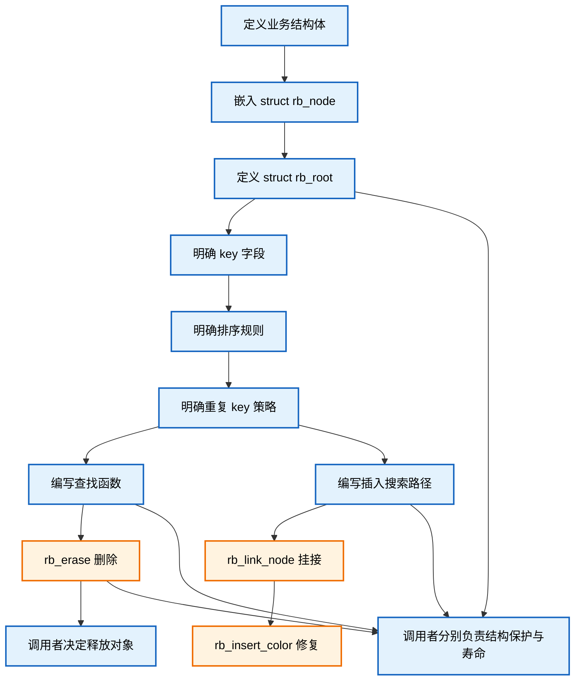

这张图说明一个核心事实：

```text
Linux rbtree 的完整使用，不是只会调用 rb_insert_color()。
真正的使用闭环，是调用者把“业务语义”和“rbtree 结构维护”正确拼接起来。
```

------


进入接口之前，先把一次对象操作的状态地址对齐。树拓扑、业务 count 和对象持有权是不同状态，不能用一次返回值替代全部检查：

| 阶段 | 写入者、位置与变化 | 谁读取以及退出条件 |
| --- | --- | --- |
| U0 准备 | 调用者在锁外分配，初始化 item.key/value 与私有游离标记 | 分配失败直接进入 U5；成功前对象仍归调用者 |
| U1 搜索 | 插入者持 tree.lock，读取根与孩子槽、比较键，局部 link 保存空槽地址 | 重复键或非游离节点立即失败，不修改 count，持有权不移交 |
| U2 接入 | 挂接与修复写节点/根/孩子/父色，同一锁内 count 加一 | 完整修复后解锁返回成功，树取得对象持有权 |
| U3 查询 | 查询者持同一锁读取树和 value，将值复制到调用者输出槽 | 解锁后只使用复制值，不向外借出 item 地址 |
| U4 摘除 | 删除者在锁内搜索、摘除、写游离标记并减 count，再把地址写入 removed | 本章没有其他持有者，解锁后调用者可释放；未找到时 removed=NULL |
| U5 清理 | 私有退出路径反复取首节点并摘除，减 count，解锁后释放 | 所有对象归还且根空、count=0；初始化失败也在返回前走这里 |

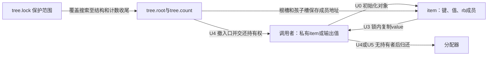

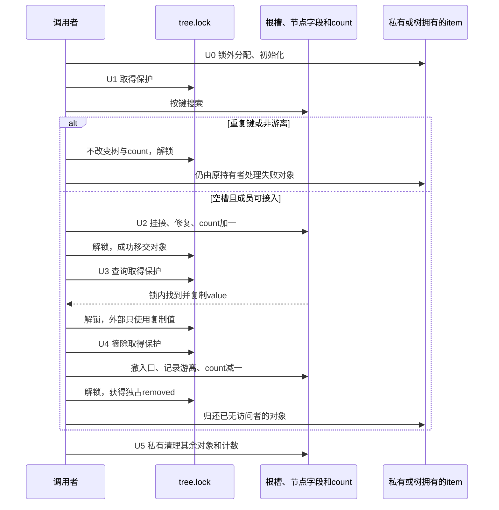

U1 不能只保护搜索而放开挂接；U3 不能把复制值悄悄改成裸指针；U4 的清标记与释放前提也不能直接移植到 RCU 读者仍在运行的方案。后面的完整程序只在模块初始化中顺序执行这些路径，锁用于表达接口范围，不是并发压力验证。

## 37.2\_定义业务结构体

使用 Linux rbtree 的第一步，是定义业务结构体。

因为 Linux rbtree 不提供通用 key/value 节点，所以你必须先回答一个问题：

```text
我要用红黑树管理什么对象？
```

例如，你要管理一组按整数 key 排序的对象，可以定义：

```c
struct demo_rb_item {
	int key;
	int value;
	struct rb_node rb;
};
```

本章主例只用 key、value、rb；下面的引用计数、RCU 与多索引结构用于说明什么时候需要另一份接口契约，不是主例已经自动具备的能力。这里有三类字段：

```text
key   ：排序字段；
value ：业务数据；
rb    ：挂入 Linux rbtree 的节点。
```

关系如下：

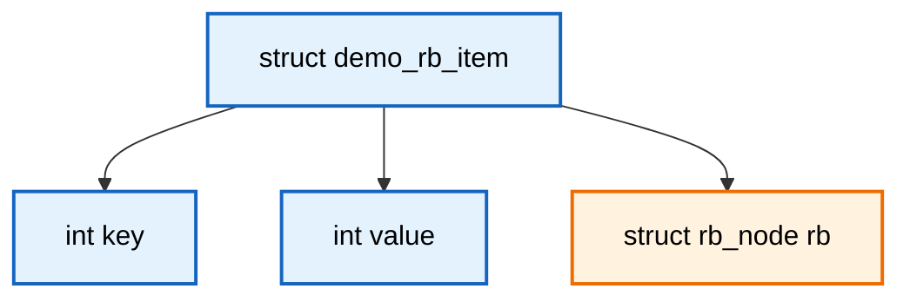

这个结构体的含义不是：

```text
rb_node 里面保存 demo_rb_item。
```

而是：

```text
demo_rb_item 里面嵌入 rb_node。
```

所以 `demo_rb_item` 才是真正的业务对象。

`struct rb_node rb` 只是让它具备“挂入红黑树”的能力。

------

业务结构体可以很简单，也可以很复杂。

简单对象：

```c
struct demo_rb_item {
	int key;
	struct rb_node rb;
};
```

带业务值的对象：

```c
struct demo_rb_item {
	int key;
	int value;
	struct rb_node rb;
};
```

带引用计数的对象：

```c
struct demo_rb_item {
	int key;
	int value;
	refcount_t refcnt;
	struct rb_node rb;
};
```

带 RCU 释放能力的对象：

```c
struct demo_rb_item {
	int key;
	int value;
	struct rb_node rb;
	struct rcu_head rcu;
};
```

带多个管理结构的对象：

```c
struct demo_rb_item {
	int key;
	int value;

	struct rb_node rb;
	struct list_head list;
	struct hlist_node hnode;
	refcount_t refcnt;
};
```

这体现了 Linux 内核对象的常见风格：

```text
业务对象可以同时挂入多个基础设施；
rbtree 只是其中一种组织方式。
```

图示如下：

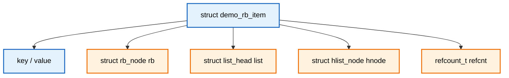

所以定义业务结构体时，不能只想：

```text
我要放一个 rb_node。
```

还要想清楚：

```text
这个对象由谁分配？
谁持有它？
是否允许并发访问？
是否需要引用计数？
是否需要 RCU？
删除后是否马上释放？
是否还挂在别的数据结构里？
```

这些问题决定了后面插入、删除、释放的安全边界。

------

## 37.3\_在业务结构体中嵌入\_struct\_rb\_node

定义业务结构体后，必须在其中嵌入：

```c
struct rb_node rb;
```

例如：

```c
struct demo_rb_item {
	int key;
	int value;
	struct rb_node rb;
};
```

这一步非常关键。

因为 Linux rbtree 操作的不是 `struct demo_rb_item *`，而是：

```c
struct rb_node *
```

也就是说，真正挂入树的是：

```c
&item->rb
```

不是：

```c
item
```

插入时：

```c
rb_link_node(&item->rb, parent, link);
rb_insert_color(&item->rb, root);
```

删除时：

```c
rb_erase(&item->rb, root);
```

遍历时：

```c
struct rb_node *node;

for (node = rb_first(root); node; node = rb_next(node)) {
	struct demo_rb_item *item;

	item = rb_entry(node, struct demo_rb_item, rb);
}
```

完整关系如下：

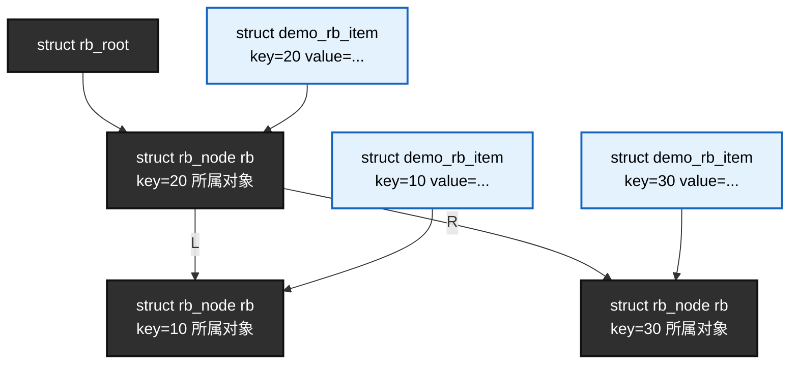

这个图要注意：

```text
树结构由 rb_node 组成；
业务对象通过内嵌 rb_node 参与树结构；
从 rb_node 回到业务对象，需要 rb_entry()。
```

如果一个业务结构体里有多个 `struct rb_node`，那么它可以同时挂入多棵不同的 rbtree。

例如：

```c
struct demo_rb_item {
	int id;
	unsigned long deadline;

	struct rb_node id_node;
	struct rb_node deadline_node;
};
```

这表示：

```text
id_node 可以挂入按 id 排序的树；
deadline_node 可以挂入按 deadline 排序的树。
```

图示如下：

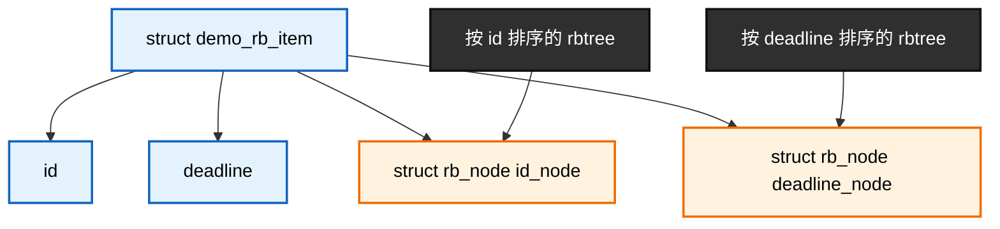

这种设计非常灵活，但也带来一个要求：

```text
每棵树必须使用对应的 rb_node 成员；
rb_entry() 还原对象时，也必须填写对应的成员名。
```

例如：

```c
item = rb_entry(node, struct demo_rb_item, id_node);
```

和：

```c
item = rb_entry(node, struct demo_rb_item, deadline_node);
```

是两个不同含义。

同类型成员写错可能通过编译，却减去错误偏移；类型或布局碰巧同偏移也不能证明对象身份。具体对照已在[P09 双成员实验](P09_Linux_6.12_内核_rbtree_嵌入式节点与使用者接口.md#%281%29_两个嵌入成员还原同一个任务)运行，这里用正确成员构造接口。

------

## 37.4\_定义\_struct\_rb\_root\_根节点

有了业务节点，还需要定义树根。

普通 rbtree 使用：

```c
struct rb_root root = RB_ROOT;
```

或者封装到自己的树对象里：

```c
struct demo_rb_tree {
	struct rb_root root;
	spinlock_t lock;
};
```

初始化时：

```c
static struct demo_rb_tree demo_tree = {
	.root = RB_ROOT,
	.lock = __SPIN_LOCK_UNLOCKED(demo_tree.lock),
};
```

或者在运行时初始化：

```c
static void demo_tree_init(struct demo_rb_tree *tree)
{
	tree->root = RB_ROOT;
	spin_lock_init(&tree->lock);
}
```

`struct rb_root` 只保存根指针，完整定义集中在[普通根实现](../../../../research/source_reading/rbtree/source_explanations/include/linux/rbtree_types.h.md#1.2_rb_root保存外部入口槽)。

它指向整棵红黑树的根节点。

空树时：

```c
root.rb_node == NULL
```

图示如下：

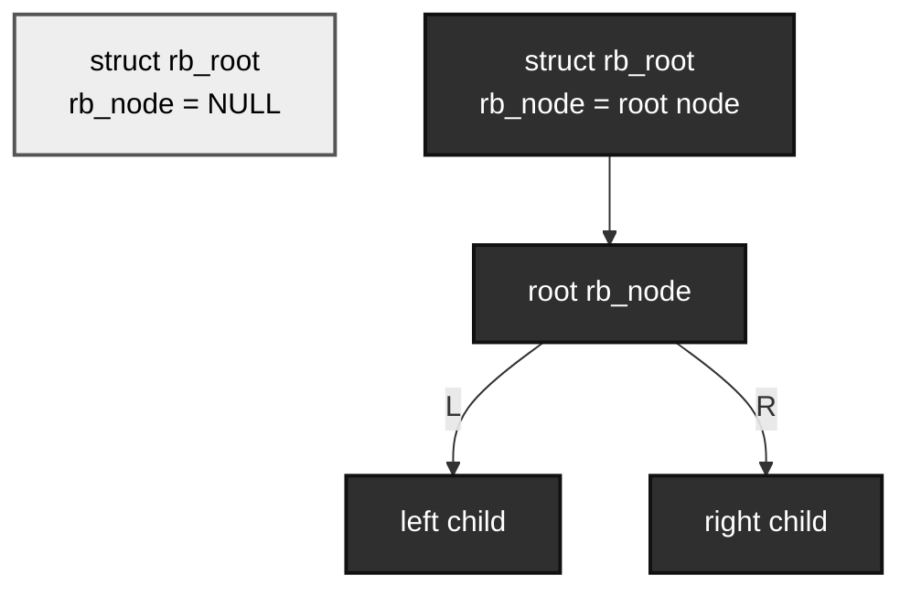

根节点只是树入口，不保存：

```text
节点数量；
比较函数；
锁；
key 信息；
value 信息；
释放函数。
```

所以如果业务需要这些信息，需要自己封装。

例如：

```c
struct demo_rb_tree {
	struct rb_root root;
	spinlock_t lock;
	unsigned int count;
};
```

这时 `count` 需要调用者在与结构修改相同的保护范围内维护：只有成功插入才加一，查到并摘除对象才减一，重复键与查找失败不改变计数。完整程序会把这条规则落实到每个返回分支。下面两行表示两个不同成功路径，不是连续执行：

```c
tree->count++;
tree->count--;
```

rbtree 核心不会帮你统计节点数量。

图示如下：

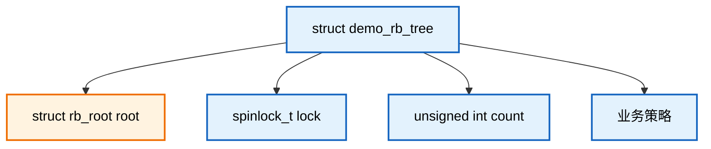

封装树对象的好处是：

```text
把 root、lock、count、业务策略放在一起；
避免到处传裸 struct rb_root；
便于后续扩展 cached rbtree 或 augmented rbtree；
便于把查找、插入、删除接口封装成统一模块。
```

若业务只有一个私有索引、没有计数和共享访问需要，普通根已足够：

```c
static struct rb_root root = RB_ROOT;
```

本章要统一保护和计数，所以把三者封装：

```c
struct demo_rb_tree {
	struct rb_root root;
	spinlock_t lock;
	unsigned int count;
};
```

------

## 37.5\_明确\_key\_字段和排序规则

定义完业务结构体和根节点后，下一步必须明确 key 字段。

例如：

```c
struct demo_rb_item {
	int key;
	int value;
	struct rb_node rb;
};
```

这里的排序 key 是：

```c
item->key
```

排序规则是：

```text
key 小的在左子树；
key 大的在右子树；
key 相等按业务策略处理。
```

最基础的 BST 关系如下：

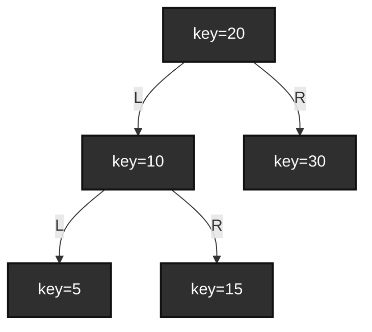

这棵树满足：

```text
5 < 10 < 15 < 20 < 30
```

rbtree 的颜色和平衡，是在这个 BST 有序关系基础上维护的。

也就是说：

```text
红黑树首先是一棵二叉搜索树；
然后才是带颜色平衡约束的二叉搜索树。
```

如果 BST 排序规则本身错了，红黑修复也救不了。

例如，插入时用 `key` 排序：

```c
if (item->key < this->key)
	link = &parent->rb_left;
else if (item->key > this->key)
	link = &parent->rb_right;
```

但是查找时用 `value` 查：

```c
if (value < this->value)
	node = node->rb_left;
else if (value > this->value)
	node = node->rb_right;
```

这就是错误的。

因为树是按 `key` 排出来的，不能按 `value` 路径查找。

错误关系如下：

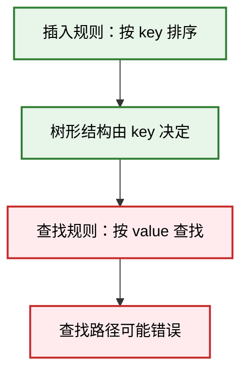

所以排序规则必须统一：

```text
插入用什么规则；
查找就用什么规则；
删除定位也必须用什么规则；
遍历结果也按这个规则有序。
```

------

排序规则也可以是复合 key。

例如：

```c
struct demo_rb_item {
	u32 major;
	u32 minor;
	struct rb_node rb;
};
```

排序规则：

```text
先比较 major；
major 相等再比较 minor。
```

可以写成比较函数：

```c
static int demo_item_cmp_key(u32 major, u32 minor,
			     const struct demo_rb_item *item)
{
	if (major < item->major)
		return -1;
	if (major > item->major)
		return 1;

	if (minor < item->minor)
		return -1;
	if (minor > item->minor)
		return 1;

	return 0;
}
```

也可以比较两个对象：

```c
static int demo_item_cmp_item(const struct demo_rb_item *a,
			      const struct demo_rb_item *b)
{
	if (a->major < b->major)
		return -1;
	if (a->major > b->major)
		return 1;

	if (a->minor < b->minor)
		return -1;
	if (a->minor > b->minor)
		return 1;

	return 0;
}
```

这种比较规则形成的是一个全序关系：

```text
(major, minor)
```

图示如下：

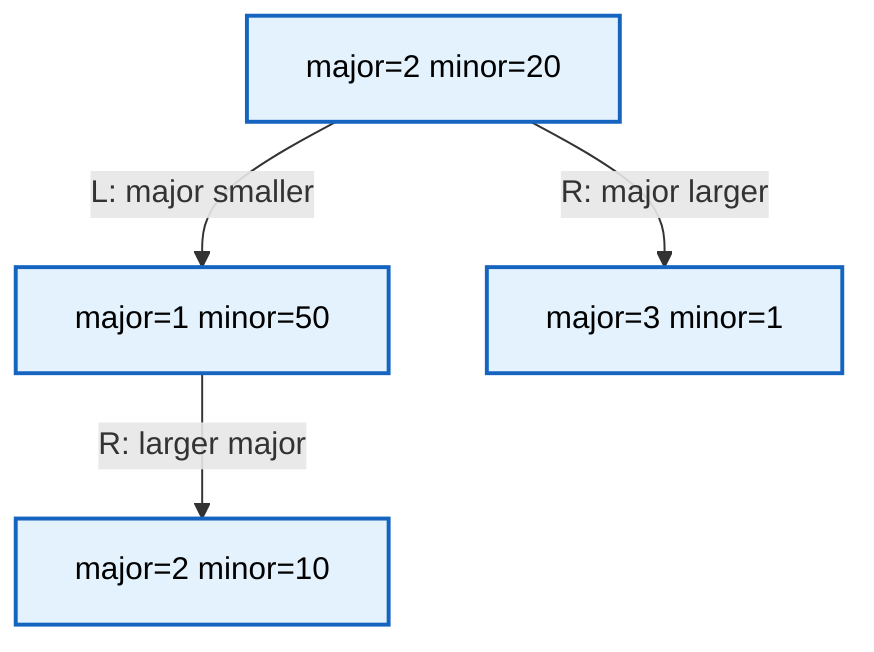

这里是复合键允许的一种 BST 形状：`(2,10)` 在根的左侧，又在 `(1,50)` 的右侧；不是两个对象共用根的左孩子槽。最终形状与颜色还受插入顺序和修复影响。

对本章拒绝重复完整键的主例，不管形状怎样变化，都满足下面的严格区间；若允许等价键，则中序只要求非递减，不能原样套用严格不等式：

```text
左子树所有 key < 当前 key；
右子树所有 key > 当前 key。
```

------

## 37.6\_明确重复\_key\_的业务语义

使用 rbtree 前必须明确一个问题：

```text
key 相等时怎么办？
```

这不是 rbtree 自动替你决定的。

常见策略有三种。

第一种：不允许重复 key。

本章用 `-EEXIST` 错误码表示键已存在；`-EINVAL` 表示接口参数或标记约定不满足，`-ENOENT` 表示按键没有找到对象。失败分支必须明确是否接入过节点，不能只让调用者看到一个负数却猜对象归谁。

这是最简单、最常见的工程模板。

插入时：

```c
if (item->key < this->key)
	link = &parent->rb_left;
else if (item->key > this->key)
	link = &parent->rb_right;
else
	return -EEXIST;
```

这种策略适合：

```text
id -> object；
fd -> object；
address -> object；
handle -> object；
唯一 key 资源管理。
```

图示如下：

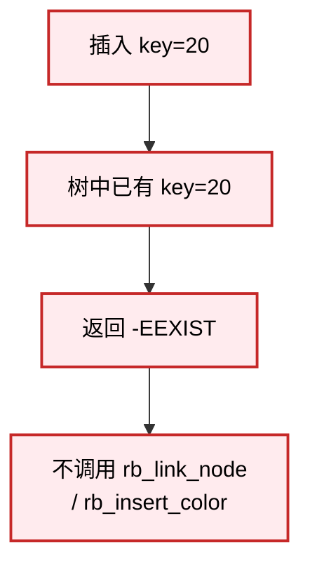

这里非常重要：

```text
如果发现重复 key，不能调用 rb_link_node()；
也不能调用 rb_insert_color()。
```

因为节点没有被正确挂入树，调用修复函数没有意义，还可能破坏结构。

------

第二种：允许重复 key，重复 key 统一插到一边。

例如本次搜索遇到相等时继续向右寻找空槽：

```c
if (item->key < this->key)
	link = &parent->rb_left;
else
	link = &parent->rb_right;
```

这种策略简单，但有一个问题：

```text
查找 key 时只能找到其中一个；
如果要找到所有相同 key，需要继续遍历相邻节点；
输出 k 个匹配本来就至少需要处理 k 个结果；红黑树高仍受对数上界约束。
```

图示如下：

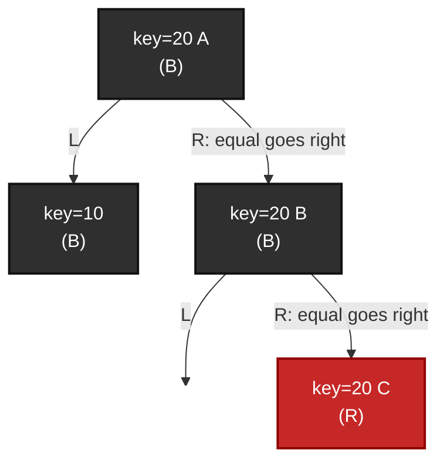

图是一种可能的合法形状，不是“相等永久只在右边”的不变量。旋转会把相等节点放到另一侧，返回所有等价对象要先定位区间起点再沿中序推进。大量相等键不会取消红黑平衡保证，扫描结果多与树高退化是两件事。

------

第三种：key 相等后引入第二排序条件，形成严格全序。

例如：

```c
if (item->key < this->key)
	link = &parent->rb_left;
else if (item->key > this->key)
	link = &parent->rb_right;
else if (item->id < this->id)
	link = &parent->rb_left;
else if (item->id > this->id)
	link = &parent->rb_right;
else
	return -EEXIST;
```

这表示：

```text
先按 key 排序；
key 相等时按稳定业务 id 排序；
完整键相等时仍拒绝重复。
```

这种策略适合需要允许同 key 但又希望树结构有严格排序的场景。

这里额外需要一个稳定 id 字段，并保证目标对象集合中的唯一性；若仍允许完整键重复，它就不是对象身份的唯一顺序。不能把独立分配对象的指针 `<` 作为可移植 C 通用顺序。完整键、极值比较与调用形式见[P09 比较实验](P09_Linux_6.12_内核_rbtree_嵌入式节点与使用者接口.md#%281%29_让同一个比较规则走两种调用路径)。

所以实际工程中更常见的做法是：

```text
如果 key 应该唯一，就拒绝重复；
如果 key 天然重复，就设计专门的重复 key 管理方式；
例如 key 对应一个链表，或者使用 rb_find_first()/rb_next_match() 一类辅助模式。
```

重复 key 策略对后续函数有直接影响：

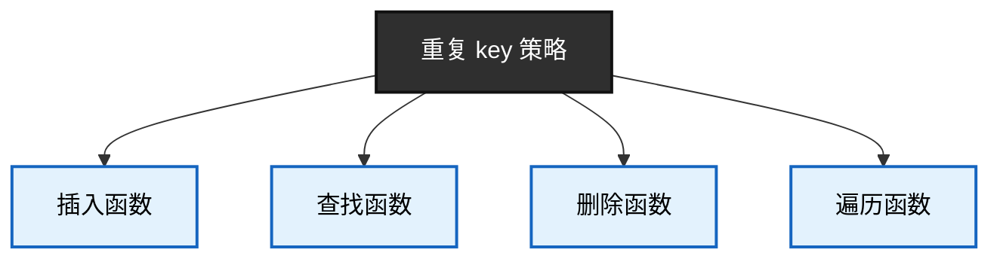

结论是：

```text
重复 key 不是 rbtree 的小细节，而是业务索引语义的一部分。
```

------

## 37.7\_编写查找函数

查找的比较语义必须由使用者定义，但搜索循环可以手写，也可调用固定版本的 rb_find 等辅助接口；两种入口的边界见 [P08 工程分工](P08_Linux_6.12_内核_rbtree_基础结构与工程模型.md#8.2.5_rbtree_在内核中的工程定位)。本节演示手写方式。

因为 rbtree 不知道你的 key 在哪里，也不知道怎么比较。

对于最简单的整数 key，可以写成：

```c
static struct demo_rb_item *
demo_rb_search(struct rb_root *root, int key)
{
	struct rb_node *node = root->rb_node;

	while (node) {
		struct demo_rb_item *item;

		item = rb_entry(node, struct demo_rb_item, rb);

		if (key < item->key)
			node = node->rb_left;
		else if (key > item->key)
			node = node->rb_right;
		else
			return item;
	}

	return NULL;
}
```

这段代码的结构非常重要。

第一步，从根节点开始：

```c
struct rb_node *node = root->rb_node;
```

第二步，只要当前节点不为空，就继续比较：

```c
while (node) {
	...
}
```

第三步，通过 `rb_entry()` 找回业务对象：

```c
item = rb_entry(node, struct demo_rb_item, rb);
```

第四步，按照同一套排序规则决定向左还是向右：

```c
if (key < item->key)
	node = node->rb_left;
else if (key > item->key)
	node = node->rb_right;
else
	return item;
```

第五步，走到空节点说明没找到：

```c
return NULL;
```

查找路径如下：

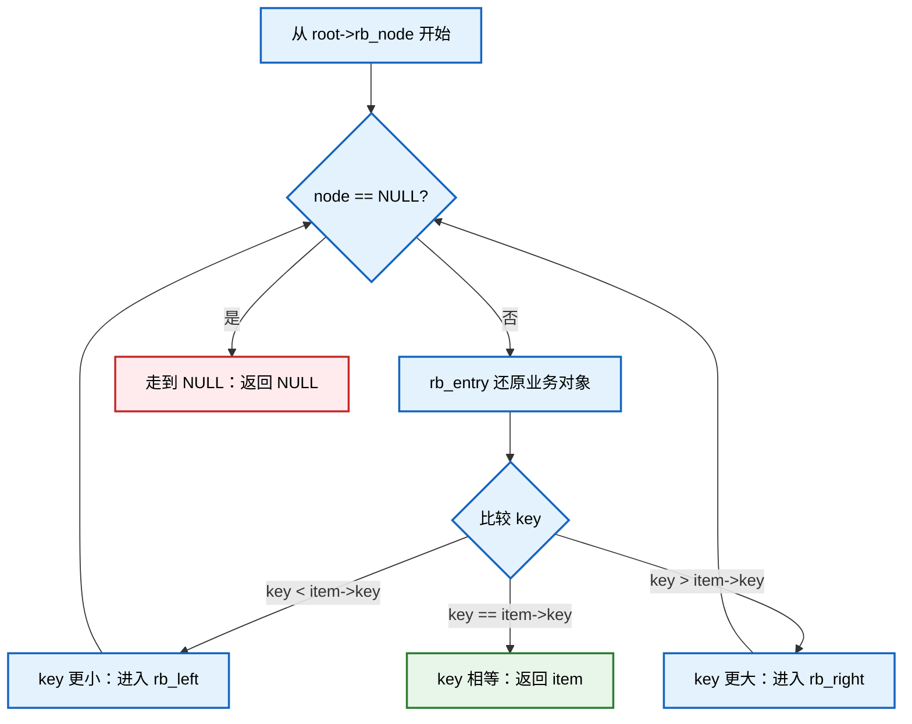

这个查找函数依赖一个前提：

```text
树中所有节点都是按照 item->key 排序插入的。
```

如果插入时用了别的规则，查找就不可靠。

------

如果树对象带锁，则可以分成两个版本。

内部版本要求调用者已经持锁：

```c
static struct demo_rb_item *
demo_rb_search_locked(struct demo_rb_tree *tree, int key)
{
	struct rb_node *node = tree->root.rb_node;

	while (node) {
		struct demo_rb_item *item;

		item = rb_entry(node, struct demo_rb_item, rb);

		if (key < item->key)
			node = node->rb_left;
		else if (key > item->key)
			node = node->rb_right;
		else
			return item;
	}

	return NULL;
}
```

下面的外部版本 **是待修正反例**：它只保护搜索过程，却把没有持有权的地址带出保护范围。先预测解锁后另一线程会做什么，再看后面的修正：

```c
static struct demo_rb_item *
demo_rb_search(struct demo_rb_tree *tree, int key)
{
	struct demo_rb_item *item;

	spin_lock(&tree->lock);
	item = demo_rb_search_locked(tree, key);
	spin_unlock(&tree->lock);

	return item;
}
```

但是这个外部版本有一个生命周期问题：

```text
如果解锁后返回 item，而其他线程可能删除并释放 item，
那么调用者拿到的 item 可能变成悬空指针。
```

所以并发场景下，查找函数不能随便返回裸指针。

更安全的模型通常是：

```text
查找后在锁内使用；
或者查找成功后增加引用计数；
或者使用 RCU 并保证释放延迟；
或者把需要的数据复制出来。
```

错误模型：

```c
spin_lock(&tree->lock);
item = demo_rb_search_locked(tree, key);
spin_unlock(&tree->lock);

return item; /* 如果 item 可能被并发释放，这就危险 */
```

安全模型之一：锁内使用。`do_something` 必须符合这把锁的执行约束，不能把会睡眠或任意回调的工作直接塞入自旋锁。

```c
spin_lock(&tree->lock);

item = demo_rb_search_locked(tree, key);
if (item)
	do_something(item);

spin_unlock(&tree->lock);
```

安全模型之二：树中对象已经持有一份有效引用，在保护窗口内为返回值再取得一份；调用者使用后必须 put。这需要带 refcnt 的另一种对象类型，不是仅给主例多贴一行即可。主例完整程序选择锁内复制一个 int 值，不返回裸地址。

```c
spin_lock(&tree->lock);

item = demo_rb_search_locked(tree, key);
if (item)
	refcount_inc(&item->refcnt);

spin_unlock(&tree->lock);

return item;
```

这说明：

```text
查找函数不只是算法问题，还涉及对象生命周期。
```

------

## 37.8\_编写插入搜索函数

插入不是直接调用 `rb_insert_color()`。

Linux rbtree 插入分为两段：

```text
第一段：调用者按 BST 规则搜索插入落点；
第二段：rbtree 负责挂接节点并修复红黑性质。
```

插入搜索阶段需要维护两个变量：

```c
struct rb_node **link;
struct rb_node *parent;
```

典型写法：

```c
static int
demo_rb_insert(struct demo_rb_tree *tree, struct demo_rb_item *item)
{
	struct rb_node **link = &tree->root.rb_node;
	struct rb_node *parent = NULL;

	spin_lock(&tree->lock);

	while (*link) {
		struct demo_rb_item *this;

		parent = *link;
		this = rb_entry(parent, struct demo_rb_item, rb);

		if (item->key < this->key)
			link = &parent->rb_left;
		else if (item->key > this->key)
			link = &parent->rb_right;
		else {
			spin_unlock(&tree->lock);
			return -EEXIST;
		}
	}

	rb_link_node(&item->rb, parent, link);
	rb_insert_color(&item->rb, &tree->root);

	spin_unlock(&tree->lock);
	return 0;
}
```

这里最关键的是：

```c
struct rb_node **link = &tree->root.rb_node;
```

`link` 是二级指针。

它表示：

```text
当前要检查的“子节点指针本身”的地址。
```

初始时，它指向根指针：

```c
link = &root->rb_node
```

如果往左走：

```c
link = &parent->rb_left
```

如果往右走：

```c
link = &parent->rb_right
```

最终当：

```c
*link == NULL
```

说明找到了新节点应该挂入的位置。

图示如下：

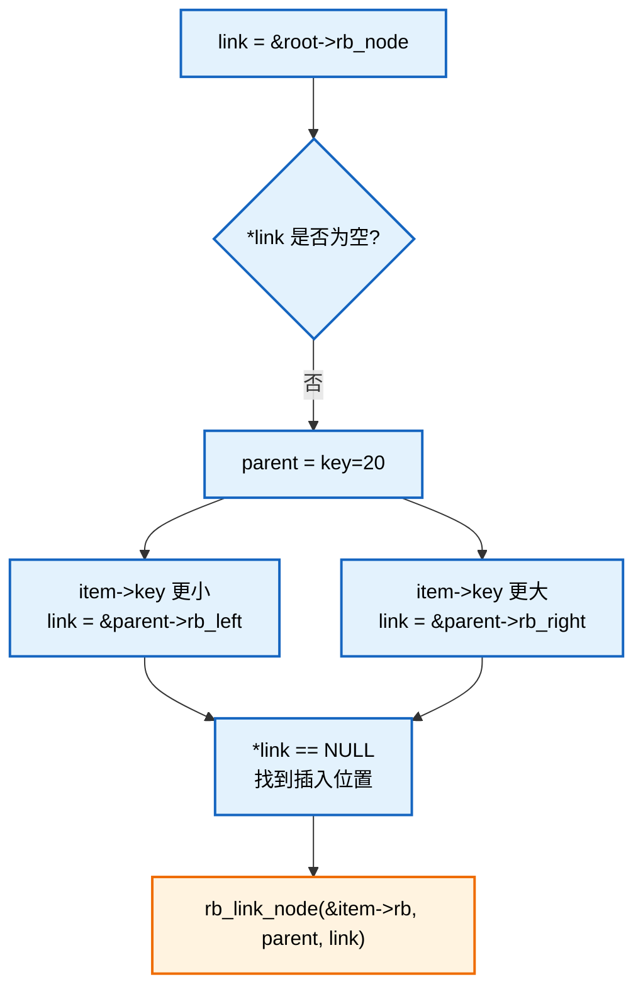

`parent` 则记录：

```text
新节点最终要挂在哪个父节点下面。
```

如果树为空：

```c
parent == NULL
link == &root->rb_node
```

这时新节点会成为根节点。

如果树不为空，`parent` 就是新节点的父节点。

插入搜索的状态关系如下：

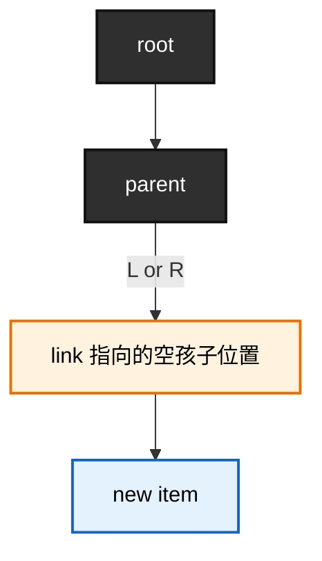

这就是为什么插入函数需要两个变量：

```text
parent：告诉新节点它的父节点是谁；
link：告诉父节点的哪个孩子指针要指向新节点。
```

------

插入前还应该考虑节点状态。

如果模板中使用 `RB_EMPTY_NODE()` 判断节点是否已经挂树，那么对象初始化时应调用：

```c
RB_CLEAR_NODE(&item->rb);
```

插入前检查（属于采用该标记约定的方案；要保护这次检查到接入完成的整个过程，不能在另一条路径同时插入同一对象）：

```c
if (!RB_EMPTY_NODE(&item->rb))
	return -EINVAL;
```

完整示意：

```c
static void demo_rb_item_init(struct demo_rb_item *item,
			      int key, int value)
{
	item->key = key;
	item->value = value;
	RB_CLEAR_NODE(&item->rb);
}
```

插入时：

```c
if (!RB_EMPTY_NODE(&item->rb))
	return -EINVAL;
```

注意：

```text
RB_EMPTY_NODE() 只能作为状态检查；
不能替代锁；
不能解决并发插入/删除问题。
```

------

## 37.9\_调用\_rb\_link\_node()\_完成\_BST\_挂接

插入搜索完成后，会得到：

```text
parent：新节点的父节点；
link：新节点应该挂入的位置。
```

然后调用：

```c
rb_link_node(&item->rb, parent, link);
```

`rb_link_node()` 的作用是把新节点接入普通 BST 结构。

它大致完成三件事：

```text
设置新节点的父节点；
清空新节点的左右孩子；
让 *link 指向新节点。
```

固定语句集中在[红叶挂接实现](../../../../research/source_reading/rbtree/source_explanations/include/linux/rbtree.h.md#1.5_红叶挂接与发布)：在节点父色槽写入父地址、低颜色位为红，清左右槽，再把外部空槽改成该节点地址。父槽、节点和根是不同存储位置，保护范围必须覆盖这组更新及后续修复。

注意这里还没有完成红黑树修复。

也就是说，调用 `rb_link_node()` 后，树只是满足了普通 BST 的挂接关系，还没有保证红黑树性质完全成立。

挂接前：

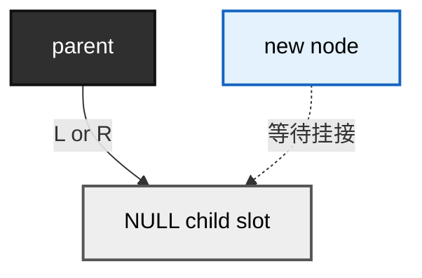

挂接后：

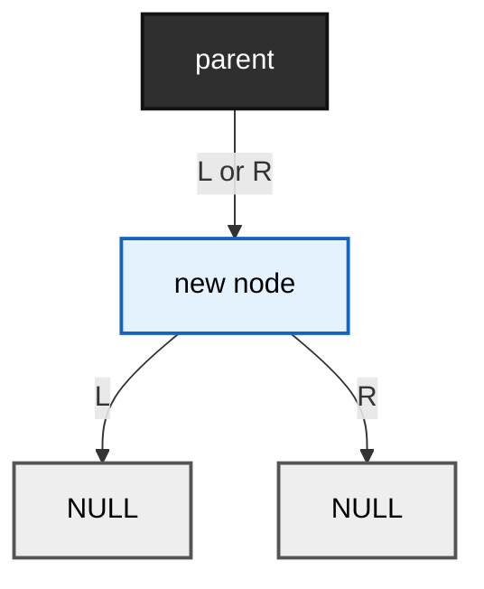

从 BST 角度看，这一步已经把节点放进了正确位置。

但是从红黑树角度看，还可能出现问题。

最典型的问题是：

```text
新节点是红色；
如果父节点也是红色；
就会出现连续红节点；
违反红黑树性质。
```

所以 `rb_link_node()` 后必须继续调用：

```c
rb_insert_color(&item->rb, &tree->root);
```

------

`rb_link_node()` 的职责边界非常重要。

它不负责：

```text
比较 key；
查找插入位置；
处理重复 key；
修复红黑颜色；
旋转；
加锁；
释放对象；
维护业务计数。
```

它只负责：

```text
把 node 放到搜索得到的空槽；空树时该槽是 root.rb_node，否则是 parent 的一个孩子槽。
```

所以错误用法是：

```c
rb_link_node(&item->rb, parent, link);
/* 忘记 rb_insert_color() */
```

这样树可能暂时还是 BST，但不再保证红黑树平衡。

另一个错误用法是：

```c
rb_link_node(&item->rb, parent, link);
rb_insert_color(&item->rb, root);
```

但是 `parent` 和 `link` 不是通过同一套比较规则搜索得到的。

这会破坏 BST 有序性。红黑树修复只能修颜色和旋转，不能帮你纠正业务排序错误。

------

## 37.10\_调用\_rb\_insert\_color()\_完成红黑修复

`rb_link_node()` 完成 BST 挂接后，必须调用：

```c
rb_insert_color(&item->rb, &tree->root);
```

这一步负责恢复红黑树性质。

插入分层如下：

```mermaid
graph TD
	insert_start["插入新业务对象"]
	search_pos["调用者搜索 BST 位置"]
	link_node["rb_link_node 挂接"]
	bst_ok["BST 位置正确"]
	color_maybe_bad["可能出现红黑性质破坏"]
	insert_fix["rb_insert_color 修复"]
	rbtree_ok["重新成为合法 rbtree"]

	insert_start --> search_pos
	search_pos --> link_node
	link_node --> bst_ok
	bst_ok --> color_maybe_bad
	color_maybe_bad --> insert_fix
	insert_fix --> rbtree_ok

	classDef user fill:#e3f2fd,stroke:#1565c0,color:#000,stroke-width:2px;
	classDef rb fill:#fff3e0,stroke:#ef6c00,color:#000,stroke-width:2px;
	classDef ok fill:#e8f5e9,stroke:#2e7d32,color:#000,stroke-width:2px;
	classDef warn fill:#ffebee,stroke:#c62828,color:#000,stroke-width:2px;

	class insert_start,search_pos user;
	class link_node,insert_fix rb;
	class bst_ok,rbtree_ok ok;
	class color_maybe_bad warn;
```

要理解 `rb_insert_color()`，先记住插入修复的基本事实：

```text
新插入节点按红色处理；
如果父节点是黑色，不破坏红黑性质；
如果父节点是红色，会出现红红冲突；
修复逻辑围绕父节点、叔叔节点、祖父节点展开。
```

为什么新节点按红色处理？

因为如果新节点直接作为黑色插入，会让某些路径黑高增加，影响范围更大。

红色插入的好处是：

```text
不会改变路径黑高；
非空树中可能制造红红冲突，空树中需把新根改黑；
红红冲突通常可以通过染色和旋转局部修复。
```

插入后的典型冲突如下：

```mermaid
graph TD
	g_node["G(B)"]
	p_node["p(R)"]
	u_node["U=NIL，黑"]
	n_node["n(R)"]

	p_nil_right[" "]

	g_node -->|L| p_node
	g_node -->|R| u_node

	p_node -->|L| n_node
	p_node --> p_nil_right


	classDef black fill:#2f2f2f,stroke:#111,color:#fff,stroke-width:2px;
	classDef red fill:#c62828,stroke:#8e0000,color:#fff,stroke-width:2px;
	classDef nil fill:#eeeeee,stroke:#555,color:#000,stroke-width:2px;
	classDef ghost fill:transparent,stroke:transparent,color:transparent;

	class g_node black;
	class u_node nil;
	class p_node,n_node red;
	class p_nil_right ghost;

	linkStyle 3 stroke:transparent;
```

这里 `n(R)` 和 `p(R)` 连续为红，违反红黑树性质。

`rb_insert_color()` 就是用颜色翻转和旋转消除这种冲突。

但是从使用者角度，不需要在插入函数里自己处理这些 case。

使用者只需要保证：

```text
节点已经按 BST 规则挂到正确位置；
然后把新节点和 root 传给 rb_insert_color()。
```

也就是说：

```c
rb_link_node(&item->rb, parent, link);
rb_insert_color(&item->rb, &tree->root);
```

在本章普通手写插入路径中，两句按此顺序执行；若使用 rb_add 等已经包办挂接与修复的接口，不应再补调一次修复。新节点必须尚未占据其他树中的同一成员，不能对重复或已在树对象再次接入。

如果插入失败，比如重复 key：

```c
return -EEXIST;
```

就不能调用 `rb_link_node()`，也不能调用 `rb_insert_color()`。

正确结构：

```c
if (duplicate)
	return -EEXIST;

rb_link_node(&item->rb, parent, link);
rb_insert_color(&item->rb, root);
```

错误结构：

```c
if (duplicate)
	goto out;

rb_link_node(&item->rb, parent, link);

out:
rb_insert_color(&item->rb, root); /* 错误：重复 key 时 item 根本没挂入树 */
```

所以插入函数要保持一个清晰状态机：

```mermaid
graph TD
	start["开始插入"]
	search["搜索插入位置"]
	dup{"发现重复 key?"}
	fail["返回 -EEXIST<br/>不挂接，不修复"]
	link["rb_link_node"]
	fix["rb_insert_color"]
	success["返回 0"]

	start --> search
	search --> dup
	dup -->|是| fail
	dup -->|否| link
	link --> fix
	fix --> success

	classDef flow fill:#e3f2fd,stroke:#1565c0,color:#000,stroke-width:2px;
	classDef rb fill:#fff3e0,stroke:#ef6c00,color:#000,stroke-width:2px;
	classDef fail_class fill:#ffebee,stroke:#c62828,color:#000,stroke-width:2px;
	classDef ok fill:#e8f5e9,stroke:#2e7d32,color:#000,stroke-width:2px;

	class start,search,dup flow;
	class link,fix rb;
	class fail fail_class;
	class success ok;
```

------

## 37.11\_调用\_rb\_erase()\_删除节点

删除节点时，使用：

```c
rb_erase(&item->rb, &tree->root);
```

但是要注意，`rb_erase()` 的输入不是 key，而是节点本身。

所以删除一般分两步：

```text
第一步：根据 key 查找到业务对象；
第二步：对该对象内嵌的 rb_node 调用 rb_erase()。
```

例如：

```c
static int demo_rb_remove(struct demo_rb_tree *tree, int key,
			  struct demo_rb_item **removed)
{
	struct demo_rb_item *item;

	if (!removed)
		return -EINVAL;

	*removed = NULL;

	spin_lock(&tree->lock);

	item = demo_rb_search_locked(tree, key);
	if (!item) {
		spin_unlock(&tree->lock);
		return -ENOENT;
	}

	rb_erase(&item->rb, &tree->root);
	RB_CLEAR_NODE(&item->rb);

	*removed = item;

	spin_unlock(&tree->lock);
	return 0;
}
```

这个示意接口与完整程序都采用“主树独占对象、没有外借指针或延迟读者”的契约，成功时把持有权交给 removed；若只是返回共享对象地址，这个函数名本身不能完成持有权转移。这里故意没有在函数内部 kfree。

原因是：

```text
rb_erase() 只是把节点从树中摘除；
对象是否可以释放，要由调用者根据生命周期决定。
```

删除流程如下：

```mermaid
graph TD
	remove_start["开始删除 key"]
	search_key["根据 key 查找 item"]
	found{"是否找到?"}
	not_found["返回 -ENOENT"]
	erase_node["rb_erase(&item->rb, root)"]
	clear_node["RB_CLEAR_NODE 可选"]
	return_item["返回 removed item"]
	lifetime_decide["调用者决定释放 / 延迟释放 / put 引用"]

	remove_start --> search_key
	search_key --> found
	found -->|否| not_found
	found -->|是| erase_node
	erase_node --> clear_node
	clear_node --> return_item
	return_item --> lifetime_decide

	classDef flow fill:#e3f2fd,stroke:#1565c0,color:#000,stroke-width:2px;
	classDef rb fill:#fff3e0,stroke:#ef6c00,color:#000,stroke-width:2px;
	classDef fail fill:#ffebee,stroke:#c62828,color:#000,stroke-width:2px;
	classDef life fill:#e8f5e9,stroke:#2e7d32,color:#000,stroke-width:2px;

	class remove_start,search_key,found,return_item flow;
	class erase_node,clear_node rb;
	class not_found fail;
	class lifetime_decide life;
```

`rb_erase()` 内部会处理三类结构删除情况：

```text
被删节点没有左孩子；
被删节点没有右孩子；
被删节点左右孩子都存在。
```

如果删除导致红黑性质破坏，内部会继续做删除修复。

使用者不用手写这些 case。

但是使用者必须保证：

```text
传入的 item 确实在这棵树中；
当前没有并发修改破坏树；
删除期间持有必要的锁；
删除后不再通过这棵树访问 item；
对象释放时没有其他访问者。
```

错误用法：

```c
rb_erase(&item->rb, &tree_a->root);
```

但 `item` 实际挂在 `tree_b` 中。

这会直接破坏树结构。

所以工程模板中要避免“裸 `rb_erase()` 到处调用”，更推荐封装为：

```c
demo_rb_remove(tree, key, &removed);
```

或者：

```c
demo_rb_remove_item(tree, item);
```

这样可以在统一入口里维护锁、状态、计数、生命周期策略。

------

## 37.12\_删除后为什么要由调用者释放业务对象

[P09 寿命模型](P09_Linux_6.12_内核_rbtree_嵌入式节点与使用者接口.md#9.2.8_节点生命周期为什么由调用者管理)已区分入口与回收，这里只把它应用到接口返回值。

`rb_erase()` 的语义是：

```text
把 rb_node 从 rbtree 中摘除。
```

它不是：

```text
释放业务对象。
```

所以：

```c
rb_erase(&item->rb, &tree->root);
```

执行后，只能说明：

```text
item->rb 不再属于这棵 rbtree。
```

不能说明：

```text
item 可以马上 kfree。
```

是否可以释放，要看对象所有权。

最简单的独占场景：

```c
ret = demo_rb_remove(&tree, key, &item);
if (!ret)
	kfree(item);
```

这个场景成立的前提是：

```text
没有并发读者；
没有引用计数；
没有 RCU；
没有其他结构持有 item；
没有异步回调可能访问 item。
```

若重新设计为引用协议，remove 必须移交一份确实由树持有的引用；相应调用可以是：

```c
ret = demo_rb_remove(&tree, key, &item);
if (!ret)
	demo_item_put(item);
```

若改为 RCU 方案，还必须重写 remove 的旧字段处理与读写发布协议，不能照搬本章清标记的独占版本。下面仅表达回收登记的位置，不是完整实现：

```c
ret = demo_rb_remove(&tree, key, &item);
if (!ret)
	call_rcu(&item->rcu, demo_item_rcu_free);
```

对象释放策略图如下：

```mermaid
graph TD
	removed["item 已从 rbtree 摘除"]
	no_ref{"是否有并发读者 / 引用 / RCU?"}
	direct_free["可以直接 kfree"]
	ref_put["引用计数 put"]
	rcu_free["call_rcu 延迟释放"]
	wait_done["满足本协议全部持有条件<br/>混合方案不能二选一"]
	final_free["最终释放对象"]

	removed --> no_ref
	no_ref -->|没有| direct_free
	no_ref -->|引用计数| ref_put
	no_ref -->|RCU| rcu_free

	direct_free --> final_free
	ref_put --> wait_done
	rcu_free --> wait_done
	wait_done --> final_free

	classDef state fill:#e8f5e9,stroke:#2e7d32,color:#000,stroke-width:2px;
	classDef decision fill:#f3e5f5,stroke:#6a1b9a,color:#000,stroke-width:2px;
	classDef action fill:#e3f2fd,stroke:#1565c0,color:#000,stroke-width:2px;
	classDef free fill:#fff3e0,stroke:#ef6c00,color:#000,stroke-width:2px;

	class removed state;
	class no_ref decision;
	class ref_put,rcu_free,wait_done action;
	class direct_free,final_free free;
```

这就是为什么通用删除接口最好不要在内部无条件 `kfree()`。

更好的分层是：

```text
remove：从树中摘除；
release：根据生命周期策略释放。
```

------

## 37.13\_插入\_查找\_删除为什么必须使用同一套比较规则

这是使用 rbtree 最关键的工程不变量之一。

红黑树的平衡修复只保证：

```text
树高受控；
红黑性质成立；
中序遍历仍然是 BST 顺序。
```

但前提是：

```text
调用者插入时放对了 BST 位置。
```

如果查询方向与建树顺序不相容，就可能排除真正包含目标的子树。查询失败本身不会修改结构，但会破坏接口应当找到对象的承诺；若由此操作了错误对象，又会造成更新错误。

例如，插入时按 `key`：

```c
if (item->key < this->key)
	link = &parent->rb_left;
else if (item->key > this->key)
	link = &parent->rb_right;
```

查找时也必须按 `key`：

```c
if (key < item->key)
	node = node->rb_left;
else if (key > item->key)
	node = node->rb_right;
else
	return item;
```

按 key 删除时用相容规则找到对象；若已有受保护的成员地址，也可以直接摘除而不再比较。按 key 的主例是：

```c
item = demo_rb_search_locked(tree, key);
if (!item)
	return -ENOENT;

rb_erase(&item->rb, &tree->root);
```

统一关系如下：

```mermaid
graph TD
	compare_rule["统一比较规则"]
	insert_path["插入路径"]
	search_path["查找路径"]
	delete_path["删除定位"]
	traverse_order["中序遍历顺序"]

	compare_rule --> insert_path
	compare_rule --> search_path
	compare_rule --> delete_path
	compare_rule --> traverse_order

	classDef rule fill:#2f2f2f,stroke:#111,color:#fff,stroke-width:2px;
	classDef path fill:#e3f2fd,stroke:#1565c0,color:#000,stroke-width:2px;

	class compare_rule rule;
	class insert_path,search_path,delete_path,traverse_order path;
```

错误情况：

```text
插入按 key；
查找按 value；
删除按 id；
遍历却假设按 timestamp 有序。
```

这会导致：

```text
明明节点存在却查不到；
删除错节点；
中序遍历结果不符合预期；
重复 key 处理混乱；
后续 rb_erase() 可能操作错误对象。
```

红黑树不会帮你发现这个问题。

因为对 rbtree 核心来说，它只看到 `rb_node` 指针和颜色，它不知道你业务上的 key 是否一致。

------

比较规则最好封装成统一函数。

例如：

```c
static int demo_item_cmp_key(int key, const struct demo_rb_item *item)
{
	if (key < item->key)
		return -1;
	if (key > item->key)
		return 1;
	return 0;
}
```

查找使用它：

```c
cmp = demo_item_cmp_key(key, item);
if (cmp < 0)
	node = node->rb_left;
else if (cmp > 0)
	node = node->rb_right;
else
	return item;
```

插入也可以使用对象比较函数：

```c
static int demo_item_cmp_item(const struct demo_rb_item *a,
			      const struct demo_rb_item *b)
{
	if (a->key < b->key)
		return -1;
	if (a->key > b->key)
		return 1;
	return 0;
}
```

插入时：

```c
cmp = demo_item_cmp_item(item, this);
if (cmp < 0)
	link = &parent->rb_left;
else if (cmp > 0)
	link = &parent->rb_right;
else
	return -EEXIST;
```

这样做的好处是：

```text
比较规则集中；
查找和插入不容易写偏；
复合 key 更容易维护；
后续切换重复 key 策略时更清楚。
```

------

## 37.14\_使用者还需要负责锁和节点生命周期

Linux rbtree 本身不加锁。

所以如果这棵树可能被多个上下文访问，调用者必须自己提供同步机制。

例如：

```c
struct demo_rb_tree {
	struct rb_root root;
	spinlock_t lock;
	unsigned int count;
};
```

插入时：

```c
spin_lock(&tree->lock);
/* search + rb_link_node + rb_insert_color */
spin_unlock(&tree->lock);
```

删除时：

```c
spin_lock(&tree->lock);
/* search + rb_erase + RB_CLEAR_NODE */
spin_unlock(&tree->lock);
```

查找保护同时取决于树拓扑的读写协议和对象寿命，只有对象不被释放仍不够。主例全部查询与更新都取同一把锁，复制结果后才解锁。它只面向任务上下文，不为中断共享或任意可睡眠操作建立承诺。

如果查找后只在锁内使用对象：

```c
spin_lock(&tree->lock);

item = demo_rb_search_locked(tree, key);
if (item)
	do_something(item);

spin_unlock(&tree->lock);
```

这是比较简单的模型。

如果查找后要把对象指针返回给调用者，就必须保证对象不会在解锁后被释放。

常见方式有：

```text
引用计数；
RCU；
更高层对象锁；
调用者约定树生命周期；
复制数据而不是返回裸指针。
```

风险图如下：

```mermaid
graph TD
	search_lock["加锁查找 item"]
	unlock_tree["释放 tree lock"]
	return_ptr["返回 item 指针"]
	other_delete["其他线程删除并释放 item"]
	use_after_free["调用者使用悬空指针"]

	search_lock --> unlock_tree
	unlock_tree --> return_ptr
	unlock_tree --> other_delete
	return_ptr --> use_after_free
	other_delete --> use_after_free

	classDef danger fill:#ffebee,stroke:#c62828,color:#000,stroke-width:2px;
	class search_lock,unlock_tree,return_ptr,other_delete,use_after_free danger;
```

安全模型之一：引用计数。

```mermaid
graph TD
	search_lock["加锁查找 item"]
	get_ref["找到后增加引用计数"]
	unlock_tree["释放 tree lock"]
	return_ptr["返回 item 指针"]
	user_done["使用完成"]
	put_ref["释放引用"]
	ref_zero{"引用归零?"}
	free_obj["释放对象"]
	keep_obj["继续存活"]

	search_lock --> get_ref
	get_ref --> unlock_tree
	unlock_tree --> return_ptr
	return_ptr --> user_done
	user_done --> put_ref
	put_ref --> ref_zero
	ref_zero -->|是| free_obj
	ref_zero -->|否| keep_obj

	classDef safe fill:#e8f5e9,stroke:#2e7d32,color:#000,stroke-width:2px;
	classDef action fill:#e3f2fd,stroke:#1565c0,color:#000,stroke-width:2px;

	class search_lock,get_ref,unlock_tree,return_ptr,user_done,put_ref,ref_zero action;
	class free_obj,keep_obj safe;
```

另一种协议是 RCU，图中 GP 指 grace period，即确认相关旧读侧退出的宽限期。必须使用支持该读侧方式的下行与发布操作，并保留旧对象和所需字段；这不是把主例的自旋锁两行删除后的结果。

```mermaid
graph TD
	rcu_read["rcu_read_lock"]
	search_rcu["RCU 查找 item"]
	use_item["读侧使用 item"]
	rcu_unlock["rcu_read_unlock"]

	writer_lock["写侧加锁"]
	erase_node["rb_erase 摘除"]
	call_rcu_node["call_rcu 延迟释放"]
	grace_period["GP 覆盖摘除前潜在旧读者"]
	free_obj["释放对象"]

	rcu_read --> search_rcu
	search_rcu --> use_item
	use_item --> rcu_unlock

	writer_lock --> erase_node
	erase_node --> call_rcu_node
	call_rcu_node --> grace_period
	grace_period --> free_obj

	classDef rcu fill:#fff3e0,stroke:#ef6c00,color:#000,stroke-width:2px;
	classDef writer fill:#e3f2fd,stroke:#1565c0,color:#000,stroke-width:2px;
	classDef free fill:#e8f5e9,stroke:#2e7d32,color:#000,stroke-width:2px;

	class rcu_read,search_rcu,use_item,rcu_unlock rcu;
	class writer_lock,erase_node,call_rcu_node writer;
	class grace_period,free_obj free;
```

但是 RCU 不是简单把锁去掉。

它要求：

```text
读侧使用 rcu_read_lock()；
写侧仍然需要同步多个写者；
删除后不能立即释放对象；
对象字段访问要符合 RCU 规则；
更新指针要注意发布顺序。
```

因此，对普通工程模板来说，第一版建议使用锁保护：

```text
先把 spinlock/mutex 模型写正确；
后续再扩展 RCU 版本。
```

------

## 37.15\_本节小结

本节从使用者视角梳理了 Linux rbtree 的完整使用流程。

它不是一个自动管理对象的泛型容器，而是一套需要调用者配合的树结构基础设施。

完整使用闭环如下：

```mermaid
graph TD
	step_1["1. 定义业务结构体"]
	step_2["2. 嵌入 struct rb_node"]
	step_3["3. 定义 struct rb_root"]
	step_4["4. 明确 key 和排序规则"]
	step_5["5. 明确重复 key 策略"]
	step_6["6. 编写 search"]
	step_7["7. 编写插入搜索路径"]
	step_8["8. rb_link_node 挂接"]
	step_9["9. rb_insert_color 修复"]
	step_10["10. search 后 rb_erase 删除"]
	step_11["11. 调用者处理释放"]
	step_12["12. 调用者负责锁和生命周期"]

	step_1 --> step_2
	step_2 --> step_3
	step_3 --> step_4
	step_4 --> step_5
	step_5 --> step_6
	step_5 --> step_7
	step_7 --> step_8
	step_8 --> step_9
	step_6 --> step_10
	step_10 --> step_11
	step_1 --> step_12
	step_6 --> step_12
	step_7 --> step_12
	step_10 --> step_12

	classDef step fill:#e3f2fd,stroke:#1565c0,color:#000,stroke-width:2px;
	classDef rb fill:#fff3e0,stroke:#ef6c00,color:#000,stroke-width:2px;
	classDef warn fill:#ffebee,stroke:#c62828,color:#000,stroke-width:2px;

	class step_1,step_2,step_3,step_4,step_5,step_6,step_7,step_11,step_12 step;
	class step_8,step_9,step_10 rb;
```

本节需要记住以下结论。

第一，使用 rbtree 前，必须先定义业务结构体，并在其中嵌入 `struct rb_node`。

```c
struct demo_rb_item {
	int key;
	int value;
	struct rb_node rb;
};
```

第二，`struct rb_root` 只是树根，不保存比较函数、节点数量、锁或生命周期策略。

```c
struct demo_rb_tree {
	struct rb_root root;
	spinlock_t lock;
	unsigned int count;
};
```

第三，查找、插入、删除必须使用同一套排序规则。

```text
插入按 key；
查找也必须按 key；
删除定位也必须按 key。
```

第四，重复 key 策略必须在插入前明确。

```text
不允许重复；
允许重复并统一插一侧；
或者 key 相等后引入第二排序条件。
```

第五，插入不是直接调用 `rb_insert_color()`，而是先搜索 BST 落点，再挂接，再修复。

```c
rb_link_node(&item->rb, parent, link);
rb_insert_color(&item->rb, &tree->root);
```

第六，rb_erase 接收有效成员地址；按 key 的接口先查找并检查是否命中，再摘除对应成员。

```c
item = demo_rb_search_locked(tree, key);
if (item)
	rb_erase(&item->rb, &tree->root);
```

第七，`rb_erase()` 只负责从树中摘除节点，不负责释放业务对象。

```text
摘除节点 != 释放对象。
```

第八，调用者分别解决结构保护、取得有效对象以及最后回收；锁、RCU 与引用计数不能被列为可任意互换的同一种手段。

本节可以用一句话收束：

```text
Linux rbtree 的使用者不是调用一个现成 map，而是把业务对象、排序规则、生命周期和 rbtree 底层接口组合成一个可靠的工程容器。
```

下面把这些接口放进同一份完整程序，先核对正常、失败与清理分支，再进入查询和修复的内部实现。

## 37.16\_运行完整的私有调用者框架

前面的片段分别讲字段和控制流，现在使用唯一键 20、10、30，再尝试插入第二个 20。主例的接口契约是：insert_item 成功移交持有权，失败仍由原调用者持有；read_value 成功只写出一个 int 值；remove_item 成功交还一个独占对象，失败将 removed 清空。count 只随成功结构变化更新。

完整材料 [note_rbtree_owner.c](../../../../labs/kernel/tree_basics/materials/note_rbtree_owner.c) 如下。它不建立设备、文件、定时器或其他外部入口，所有对象在初始化返回前清理；所以示例不会让读者误以为一个导出的并发服务已经完成。GFP_KERNEL 分配可能睡眠，因此位于自旋锁之外；EBUSY 表示成员按本协议已经占用，ENOMEM 表示分配失败，其他错误已在前面定义。ARRAY_SIZE 是取真实数组元素个数的宏，本例作用于 keys 数组，不用于已经退化成指针的参数。文件首行 SPDX 是机器可读的许可证标记，GPL-2.0 表示该示例声明采用的许可证，不参与运行逻辑。

```c
// SPDX-License-Identifier: GPL-2.0
/* 私有初始化实验：不发布外部入口；查询只复制值，移除交还独占对象。 */
#include <linux/init.h>
#include <linux/module.h>
#include <linux/rbtree.h>
#include <linux/slab.h>
#include <linux/spinlock.h>
#include <linux/errno.h>

struct demo_item {
    int key;
    int value;
    struct rb_node rb;
};

struct demo_tree {
    struct rb_root root;
    spinlock_t lock;
    unsigned int count;
};

static struct demo_item *search_locked(struct demo_tree *tree, int key)
{
    struct rb_node *node = tree->root.rb_node;
    while (node) {
        struct demo_item *item = rb_entry(node, struct demo_item, rb);
        if (key < item->key)
            node = node->rb_left;
        else if (key > item->key)
            node = node->rb_right;
        else
            return item;
    }
    return NULL;
}

/* 调用者独占游离 item；成功移交给树，失败仍由调用者持有。 */
static int insert_item(struct demo_tree *tree, struct demo_item *item)
{
    struct rb_node **link = &tree->root.rb_node;
    struct rb_node *parent = NULL;
    int ret = 0;
    spin_lock(&tree->lock);
    if (!RB_EMPTY_NODE(&item->rb)) {
        ret = -EBUSY;
        goto out;
    }
    while (*link) {
        struct demo_item *entry = rb_entry(*link, struct demo_item, rb);
        parent = *link;
        if (item->key < entry->key)
            link = &parent->rb_left;
        else if (item->key > entry->key)
            link = &parent->rb_right;
        else {
            ret = -EEXIST;
            goto out;
        }
    }
    rb_link_node(&item->rb, parent, link);
    rb_insert_color(&item->rb, &tree->root);
    ++tree->count;
out:
    spin_unlock(&tree->lock);
    return ret;
}

static int read_value(struct demo_tree *tree, int key, int *value)
{
    struct demo_item *item;
    int ret = -ENOENT;
    if (!value)
        return -EINVAL;
    spin_lock(&tree->lock);
    item = search_locked(tree, key);
    if (item) {
        *value = item->value;
        ret = 0;
    }
    spin_unlock(&tree->lock);
    return ret;
}

/* 本例没有外借指针、引用或 RCU 读者，可把树持有权移交给调用者。 */
static int remove_item(struct demo_tree *tree, int key, struct demo_item **removed)
{
    struct demo_item *item;
    if (!removed)
        return -EINVAL;
    *removed = NULL;
    spin_lock(&tree->lock);
    item = search_locked(tree, key);
    if (!item) {
        spin_unlock(&tree->lock);
        return -ENOENT;
    }
    rb_erase(&item->rb, &tree->root);
    RB_CLEAR_NODE(&item->rb);
    --tree->count;
    *removed = item;
    spin_unlock(&tree->lock);
    return 0;
}

static void destroy_tree(struct demo_tree *tree)
{
    for (;;) {
        struct rb_node *node;
        struct demo_item *item;
        spin_lock(&tree->lock);
        node = rb_first(&tree->root);
        if (!node) {
            spin_unlock(&tree->lock);
            break;
        }
        item = rb_entry(node, struct demo_item, rb);
        rb_erase(node, &tree->root);
        --tree->count;
        spin_unlock(&tree->lock);
        /* 已无使用者且不复用节点，无须为了即将释放再写游离标记。 */
        kfree(item);
    }
}

static int __init note_owner_init(void)
{
    const int keys[] = {20, 10, 30, 20};
    struct demo_tree tree;
    struct demo_item *item = NULL;
    int ret = 0, value = 0;
    unsigned int i;
    tree.root = RB_ROOT;
    tree.count = 0;
    spin_lock_init(&tree.lock);

    for (i = 0; i < ARRAY_SIZE(keys); ++i) {
        item = kmalloc(sizeof *item, GFP_KERNEL); /* 在自旋锁之外分配。 */
        if (!item) {
            ret = -ENOMEM;
            goto done;
        }
        item->key = keys[i];
        item->value = keys[i] * 10;
        RB_CLEAR_NODE(&item->rb);
        ret = insert_item(&tree, item);
        if (ret)
            kfree(item);         /* 失败未移交持有权；成功由整树清理回收。 */
        item = NULL;
        if (i == 3) {
            if (ret != -EEXIST) {
                ret = -EINVAL;
                goto done;
            }
            ret = 0;
        } else if (ret) {
            goto done;
        }
    }
    if (tree.count != 3 || read_value(&tree, 20, &value) || value != 200) {
        ret = -EINVAL;
        goto done;
    }
    pr_info("note_owner: duplicate rejected, count=3, value=200\n");
    ret = remove_item(&tree, 20, &item);
    if (ret)
        goto done;
    kfree(item);
    item = NULL;
    if (tree.count != 2 || read_value(&tree, 20, &value) != -ENOENT ||
        remove_item(&tree, 99, &item) != -ENOENT || item) {
        ret = -EINVAL;
        goto done;
    }
    pr_info("note_owner: remove 20, count=2, missing returns ENOENT\n");
done:
    destroy_tree(&tree);         /* 初始化失败也清理，不能等待模块退出。 */
    if (tree.count != 0)
        ret = -EINVAL;
    if (!ret)
        pr_info("note_owner: cleanup count=0\n");
    return ret;
}

static void __exit note_owner_exit(void)
{
    /* 实验在初始化返回前已撤销全部私有对象。 */
}
module_init(note_owner_init);
module_exit(note_owner_exit);
MODULE_LICENSE("GPL");
MODULE_DESCRIPTION("Private rbtree ownership and copied-value exercise");
```

先按 U0～U5 预测三条消息。第四次申请得到的是另一个独立对象，重复 key 返回 EEXIST 后仍归调用者，必须由调用者释放；前面三个成功对象留在树里。read_value 在锁内复制 200，解锁后不再访问该对象。remove_item 交出 20 对应的对象后，主例立即释放，第二次查找得到 ENOENT，输出 value 此时不保证被改写。

初始化函数若返回失败，内核不会替它再调用正常模块退出函数。因此 done 路径必须回收此前已经成功接入的对象。destroy_tree 每次重新从根取得首节点并摘除，不保存可能被旋转改写的 next 游标；对象已经不复用，不额外写游离标记。空树退出后 count 应为零。退出函数没有剩余资源，是因为 U5 已在初始化返回前完成，而不是退出清理可以普遍省略。

在匹配目标运行内核的 Linux 构建环境中，先设置 KDIR 为已配置、可用于外部模块构建的目录，ARCH/CROSS_COMPILE 按目标工具链设置；本机原生构建时不要照抄别的架构工具链前缀。仓库 [Makefile](../../../../labs/kernel/tree_basics/materials/Makefile) 已登记该模块。从仓库根目录执行：

```bash
: "${KDIR:?先设置匹配目标内核的构建目录}"
make -C "$KDIR" M="$PWD/labs/kernel/tree_basics/materials" modules
```

将 note_rbtree_owner.ko 放到匹配的目标环境后，从它所在目录执行：

```bash
sudo insmod ./note_rbtree_owner.ko
sudo dmesg | tail -n 30
sudo rmmod note_rbtree_owner
```

成功时预期有以下三行（日志时间戳与级别省略）：

```text
note_owner: duplicate rejected, count=3, value=200
note_owner: remove 20, count=2, missing returns ENOENT
note_owner: cleanup count=0
```

若 insmod 因版本、签名、符号或初始化失败而拒绝装入，应先读取错误和内核日志；模块没有成功加载时不把 rmmod 的“找不到模块”当成资源回收失败。不要把强制装入当成匹配构建环境的替代。

本轮实际进行了 ARMv7 前端语法检查和明确适配的宿主执行，没有执行目标 Kbuild、MODPOST、装卸或取得上述目标日志。宿主以 uintptr_t 适配父色位宽，锁替身只记录串行持锁范围；它能发现计数、持有权和失败清理问题，不能验证 SMP、抢占、中断、弱内存序或真实自旋锁。

## 37.17\_改变条件并检查接口承诺

1. 把四个输入改为 30、10、20、20。中间根可以改变，但三条结果为什么应保持一致？键集合、唯一性规则与删除目标相同，不能把当前根是谁写进调用者的正确性条件。
2. 让第一个、第二个、第三个或第四个申请失败，U5 分别应回收多少个在树对象？分别是 0、1、2、3；失败申请本身没有对象可释放，成功接入者由树清理。不要在失败分支同时释放整树仍拥有的对象。
3. read_value 未找到键时，为什么仍需检查返回值后才能用 value？该接口仅在成功时写出数据，旧输出槽值不代表本次查询结果。若希望失败时也写默认值，应明确改变契约和测试。
4. 将查询结果改为 item 指针，只保留现有锁范围，缺少什么？对象会逃出保护；必须选择复制、合法引用或覆盖整个使用期的另一协议，不能只给函数换名字。
5. 给对象增加第二个索引，能否继续在 U4 后直接 kfree？不能，另一索引还保存地址。先回看[P09 双索引模型](P09_Linux_6.12_内核_rbtree_嵌入式节点与使用者接口.md#%281%29_两个入口关闭之后谁还在使用对象)，再为所有入口设计一致的撤销和持有权规则。

现在调用者接口可以把成功、失败与清理连起来。继续沿[P10 查询与返回边界](P10_Linux_6.12_内核_rbtree_查找与返回边界.md#10.1_从业务对象走到一条查询路径)观察具体查询，再沿[P26 红叶接入](P26_Linux红叶接入与插入修复.md#26.1_章节内容说明)进入修复内部状态；该框架不重复展开那些函数体。
