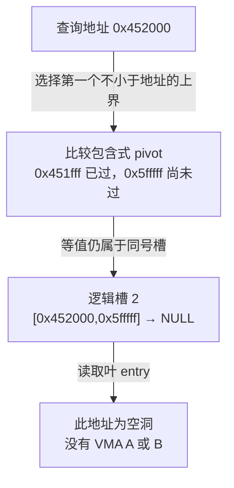
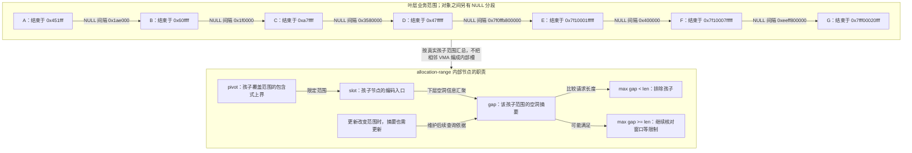

# 第38章\_Maple节点中的范围与空洞

## 38.1\_从一个共享根继续向下

P15 已区分共享树、调用者游标与独立 VMA 对象。根如果指向一个节点，节点要怎样说明“哪些地址去哪个槽”？P13 的 B+ 示例使用右子树最小值，等值向右；Maple 本节使用 **包含同号槽的上界 pivot**，等值留在该槽。只记住“都是多路树”会在边界上走错方向。

本章从包含空洞的范围分区推导 pivot 和 slot，再解释为何寻找空洞需要额外 gap 信息，最后运行完整 C++ 分区程序。固定实现通过[Maple 总索引](../../../../research/source_reading/maple_tree/navigation/P01_Linux_6.12_Maple范围源码阅读索引.md#1.2_按读者问题进入证据)和[节点布局导读](../../../../research/source_reading/maple_tree/navigation/P04_节点布局与范围分区.md#4.2_按问题读取布局)进入；版本仍为 NXP 官方固定 Linux 6.12.20，不把下面的独立模型当作内核节点镜像。

## 38.2\_先把空洞也放进范围分区

保留原来的七个 VMA。A～D 落在较低地址，E～G 使用较高的 64 位示例地址；这是一份解释索引的抽象地址图，不是声称 ARM32 当前进程能映射这些高地址。VMA 边界都是半开形式：

| VMA | 起点 | 排除式终点 |
| --- | --- | --- |
| A | 0x400000 | 0x452000 |
| B | 0x600000 | 0x610000 |
| C | 0x800000 | 0xa80000 |
| D | 0x4000000 | 0x4800000 |
| E | 0x7f1000000000 | 0x7f1000200000 |
| F | 0x7f1000600000 | 0x7f1000800000 |
| G | 0x7fff00000000 | 0x7fff00021000 |

如果只画 `pivot=0x451fff → A`、`pivot=0x60ffff → B`，就会丢失 A 与 B 之间的空洞。范围节点的槽覆盖相邻连续分段，B 前一个槽的上界必须到 0x5fffff，才能让 B 从 0x600000 开始。因此空洞也要有 entry 为 NULL 的范围，不能以“图只是示意”掩盖一段地址被错误地归给 B。

假设我们先观察覆盖 `[0,0x7fffffffffff]` 的一层逻辑叶分区：槽 0 为 A 之前的空洞，槽 1 为 A，槽 2 为空洞，槽 3 才是 B。共七个 VMA 与前、中、后八个空洞，得到十五个分段。它们是否在某次真实更新后装进同一叶节点，另由真实树形与有效槽规则决定；本章不凭这份输入伪造实际内核布局。



一般情况下，第一个槽从节点继承的最小值开始；中间槽从前一个 pivot 加一开始，到自己的 pivot 结束。最后一个有效槽的上界可能由父范围或当前状态隐含提供，不能对最后一个槽也强行读取并不存在的额外 pivot。对空洞的精确查询返回空，向后查找则还会继续找非空项，二者契约仍按 P14 区分。

## 38.3\_同一块节点存储有几种解释

先看 slot 放什么，再看类型名。**叶节点 slot 保存用户 entry，非叶 slot 保存下一层节点的编码指针**。两个地方都叫 slot，不表示非叶也直接装着 A、B、C。dense 布局的 pivot 由槽号和当前最小值隐含计算；范围布局则显式保存上界。

固定[节点类型及布局](../../../../research/source_reading/maple_tree/source_explanations/include/linux/maple_tree.h.md#1.7_范围布局与元数据)使用 maple_dense、maple_leaf_64、maple_range_64、maple_arange_64 等类型。其中 maple_range_64 这个名字同时出现在布局结构和类型枚举中；读代码时应区分“怎样解释字节”与“当前节点承担什么层级职责”。带 `_64` 的名字也不改变 pivot 实际声明为 unsigned long 这一事实。

| 构建分支 | dense 槽数组 | range/leaf 槽数组 | allocation-range 槽数组 |
| --- | --- | --- | --- |
| CONFIG_64BIT 或 BUILD_VDSO32_64 | 31 | 16 | 10 |
| 其余固定头文件分支 | 63 | 32 | 21 |

CONFIG_64BIT 是构建配置，BUILD_VDSO32_64 是该条件中的另一个构建标记；不能只凭主机或目录名字选行。当前 ARM32 普通内核使用第二行。表中是 **声明的数组容量**，不是每个节点当前都有这么多个有效槽，更不是恒定扇出；类型、有效数据终点和元数据复用还会限制解释。

range 布局有 parent、pivot 数组和一个 union：slot 数组的末端存储也可解释成 metadata。metadata 的 end/gap 分别用于数据终点与空洞位置相关信息，并不是另加在所有槽之后的一整块独立数组。arange 布局除 pivot/slot 外另有 gap 数组与 metadata，用更多信息换取更少槽位。

最外层[maple_node union](../../../../research/source_reading/maple_tree/source_explanations/include/linux/maple_tree.h.md#1.8_容器复用与节点资源)又在同一块存储中提供几种视角：普通 parent/slot、mr64、ma64、预分配 alloc，以及供退休处理的 rcu 和其他字段。union 不意味着这些字段同时有效。节点退出与读者保护按上一单元的协议处理后，算法才可在其允许的阶段复用存储，不能把业务 VMA 放进这个 union 后直接销毁。

源码注释将节点容器描述为 256 字节并按 256 字节对齐；[缓存初始化](../../../../research/source_reading/maple_tree/source_explanations/lib/maple_tree.c.md#1.3_节点缓存按实际结构大小申请对齐)实际把 sizeof(maple_node) 同时传作对象大小和对齐要求。容量宏旁的 arange “240 bytes” 注释不能直接当成完整结构 sizeof：元数据和尾部填充也占空间。对固定定义作明确类型适配后的 ARM32 与 x86_64 前端检查，节点容器均为 256 字节；arange 分别为 256 与 248 字节。它只核对这些 ABI 下的布局，不是完整内核构建、所有架构或运行时分配器验证。

## 38.4\_空洞摘要改变了哪一段搜索

只做精确查找，pivot 足以按地址缩小范围。现在请求“在允许窗口里找长度至少为 len 的空闲段”。逐个遍历 VMA 并计算相邻间隔仍可得到正确答案，但没有摘要时，需要亲自读到某个子树中的空洞，才能知道该子树无处可放。

allocation-range 非叶节点为孩子范围保存 gap 信息。若一个孩子内最大的可用空洞尚小于 len，该子树就可以排除，减少继续读取其节点的必要性。若足够大，只说明值得进一步查找；还要结合窗口裁剪、搜索方向以及上层要求的对齐等条件决定最终地址。实际向上汇总和重平衡维护属于后续算法，本章先建立摘要为何有用、为何要维护的因果关系。

原 A～G 间隔可以逐一验算：

| 相邻对象 | 中间空洞长度 |
| --- | --- |
| A 与 B | 0x1ae000 |
| B 与 C | 0x1f0000 |
| C 与 D | 0x3580000 |
| D 与 E | 0x7f0ffb800000 |
| E 与 F | 0x400000 |
| F 与 G | 0xeeff800000 |

这些是 **业务对象间的具体间隔**，不是凭空指定给某个内部节点 gap[i] 的值。内部摘要必须基于它实际覆盖的孩子范围汇总。下面保留原“范围信息 → 空洞信息”的对照图，分别标明对象和汇总职责：



E 与 F 之间有 4 MiB 空洞。若请求 3 MiB 且允许窗口覆盖整个空洞，起点可为 0x7f1000200000；若窗口下界缩到 0x7f1000400000，剩余只有 2 MiB，仍应失败。背下一个最大 gap 值不足以选出地址。反向找洞还会改变优先选哪个候选，但不改变边界和窗口必须满足的条件。

## 38.5\_运行包含空槽的分区程序

下面用 uint64_t 表示索引，把模型地址域限定为 `[0,0x800000000000)`。它根据已合法排序的半开 VMA 构造完整闭区间分区，以 `'-'` 代表 NULL 空洞；lookup 使用包含式上界，first_fit 则检查窗口内第一个足够长的空洞。程序不构造真实多层 Maple 节点，不模拟 RCU、gap 向上传播、对齐约束或动态更新。

```cpp
// SPDX-License-Identifier: MIT
// 有限地址域的范围分区模型；不调用 Maple API，也不模拟真实节点分裂。
#include <algorithm>
#include <cassert>
#include <cstdint>
#include <iomanip>
#include <iostream>
#include <optional>
#include <vector>

using address = std::uint64_t;
struct region { address start, end; char owner; };
struct slot { address first, last; char entry; };

class partition {
    address domain_end;
    std::vector<slot> slots;
public:
    // 输入须已按起点排序、不重叠且落在 [0,end)；entry '-' 表示空洞。
    partition(address end, const std::vector<region> &regions) : domain_end(end) {
        assert(end != 0);
        address next = 0;
        for (const auto &item : regions) {
            assert(next <= item.start && item.start < item.end && item.end <= end);
            assert(item.owner != '-');
            if (next < item.start)
                slots.push_back({next, item.start - 1, '-'});
            slots.push_back({item.start, item.end - 1, item.owner});
            next = item.end;
        }
        if (next < end)
            slots.push_back({next, end - 1, '-'});
    }

    std::optional<char> lookup(address index) const {
        if (index >= domain_end)
            return std::nullopt;
        // 等于包含式上界时留在同号槽，而不是进入右边槽。
        auto found = std::lower_bound(slots.begin(), slots.end(), index,
            [](const slot &part, address key) { return part.last < key; });
        return found->entry;
    }

    address max_gap() const {
        address maximum = 0;
        for (const auto &part : slots)
            if (part.entry == '-')
                maximum = std::max(maximum, part.last - part.first + 1);
        return maximum;
    }

    std::optional<address> first_fit(address low, address high, address length) const {
        if (length == 0 || low >= high || high > domain_end)
            return std::nullopt;
        for (const auto &part : slots) {
            if (part.entry != '-')
                continue;
            address begin = std::max(low, part.first);
            address end = std::min(high, part.last + 1);
            // 先求交集、再做差，避免用 begin + length 判定造成溢出。
            if (begin < end && length <= end - begin)
                return begin;
        }
        return std::nullopt;
    }

    void print() const {
        for (std::size_t i = 0; i < slots.size(); ++i) {
            const auto &part = slots[i];
            std::cout << std::dec << i << ' ' << part.entry << " [0x"
                      << std::hex << part.first << ",0x" << part.last << "]\n";
        }
    }
};

int main() {
    const std::vector<region> regions{
        {0x400000,0x452000,'A'}, {0x600000,0x610000,'B'},
        {0x800000,0xa80000,'C'}, {0x4000000,0x4800000,'D'},
        {0x7f1000000000,0x7f1000200000,'E'},
        {0x7f1000600000,0x7f1000800000,'F'},
        {0x7fff00000000,0x7fff00021000,'G'}
    };
    partition tree(0x800000000000, regions);
    tree.print();
    for (const auto &item : regions) {
        assert(tree.lookup(item.start) == item.owner);
        assert(tree.lookup(item.end - 1) == item.owner);
        assert(tree.lookup(item.end) == '-');
    }
    assert(!tree.lookup(0x800000000000));
    auto fit = tree.first_fit(0x7f1000200000,0x7f1000600000,0x300000);
    assert(fit && *fit == 0x7f1000200000);
    auto clipped = tree.first_fit(0x7f1000400000,0x7f1000600000,0x300000);
    assert(!clipped);
    std::cout << "E-F gap: 0x400000; fit: 0x" << std::hex << *fit
              << "; clipped window: no fit\n";
    return 0;
}
```

完整材料为[maple_pivot_slots.cpp](../../../../labs/kernel/tree_basics/materials/maple_pivot_slots.cpp)，从仓库根目录编译，保持默认断言开启：

```bash
c++ -std=c++17 -O2 -Wall -Wextra -Werror \
  labs/kernel/tree_basics/materials/maple_pivot_slots.cpp -o /tmp/maple_pivot_slots
/tmp/maple_pivot_slots
```

前四行应为：

```text
0 - [0x0,0x3fffff]
1 A [0x400000,0x451fff]
2 - [0x452000,0x5fffff]
3 B [0x600000,0x60ffff]
```

最后输出 E-F gap 为 0x400000，完整窗口找到 0x7f1000200000，而裁剪窗口无可用位置。每个对象末地址仍命中自身，排除终点都落入紧随的空洞。本例没有相邻相接的 VMA，但检查另外覆盖了这种排列。

宿主验证枚举八地址域的全部 256 种占用图，以逐地址扫描为独立对照，检查 207360 个窗口/长度组合、点查和最大连续空洞；另查最大可表示排除终点附近的加减边界。该证据只覆盖本程序的范围分区，不能外推为真实 Maple 算法、内存安全或性能证明。

## 38.6\_修改条件再作判断

1. 把 B 起点改为 A 的排除终点。先预测两个对象之间是否还需要 NULL 槽，再观察边界属于谁。两个对象相接不等于同一对象，模型仍保留各自 owner。
2. 把 lookup 的比较从 `part.last < key` 改成 `part.last <= key`。查询 A 的最后地址会发生什么？等值被错误跳过，会走到后面的空洞，这正是把 B+ 的另一套边界规则搬过来的后果。
3. 请求长度不变，只缩小 E-F 窗口。解释为什么全局 max_gap 很大也不能直接返回成功；真正候选必须落在裁剪后的交集中。
4. 根据表推导普通 ARM32 range 的 pivot/slot 数量，再解释为何不能把 32 槽直接说成“当前 32 个孩子”。数组、有效终点、节点是否为叶和元数据解释是四个不同条件。

我们现在可以由非重叠分区推出包含式 pivot，由找洞需求推出摘要，再由节点字节预算理解容量代价。下一步回到[P15 编码](P15_Linux_6.12_Maple_Tree_源码结构与_API_分层.md#15.5_指针低位编码_Maple_Tree_的_隐形字段)，区分父指针、编码节点与操作状态，不能把这些额外信息统称为一种“特殊指针”。
