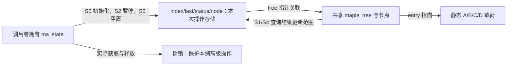
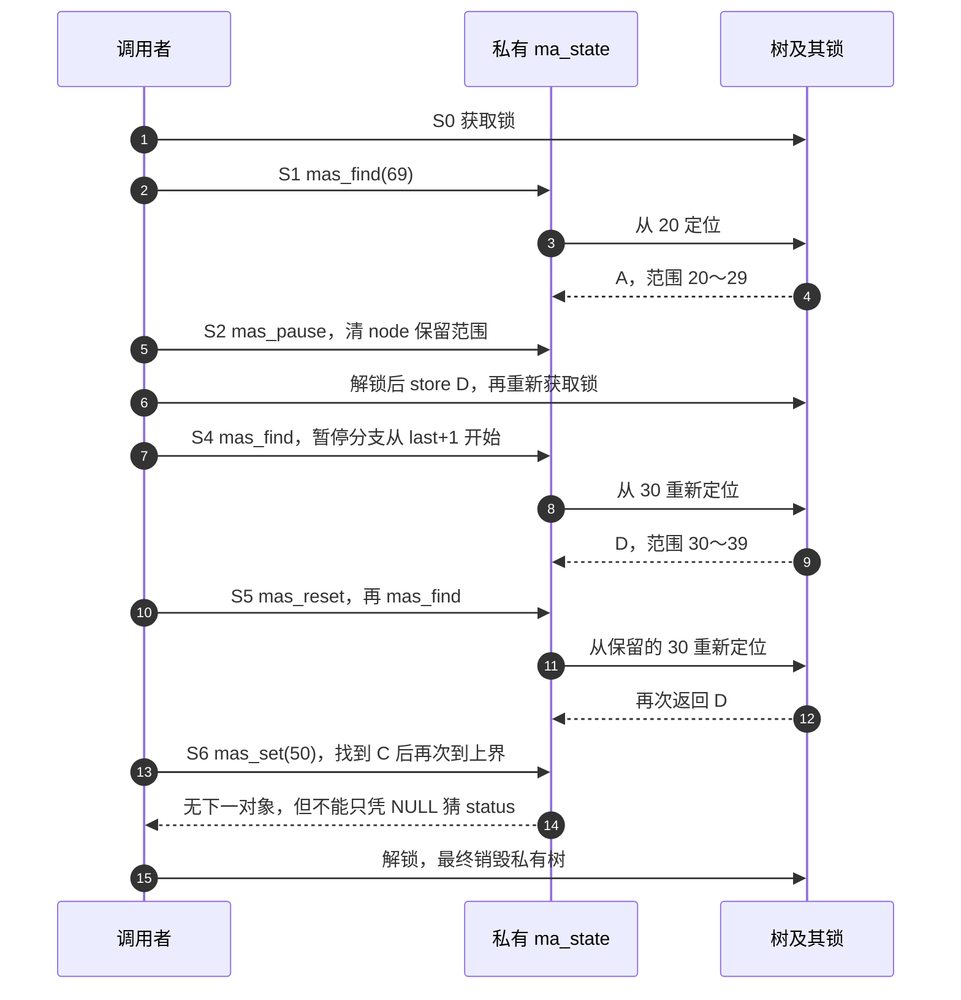
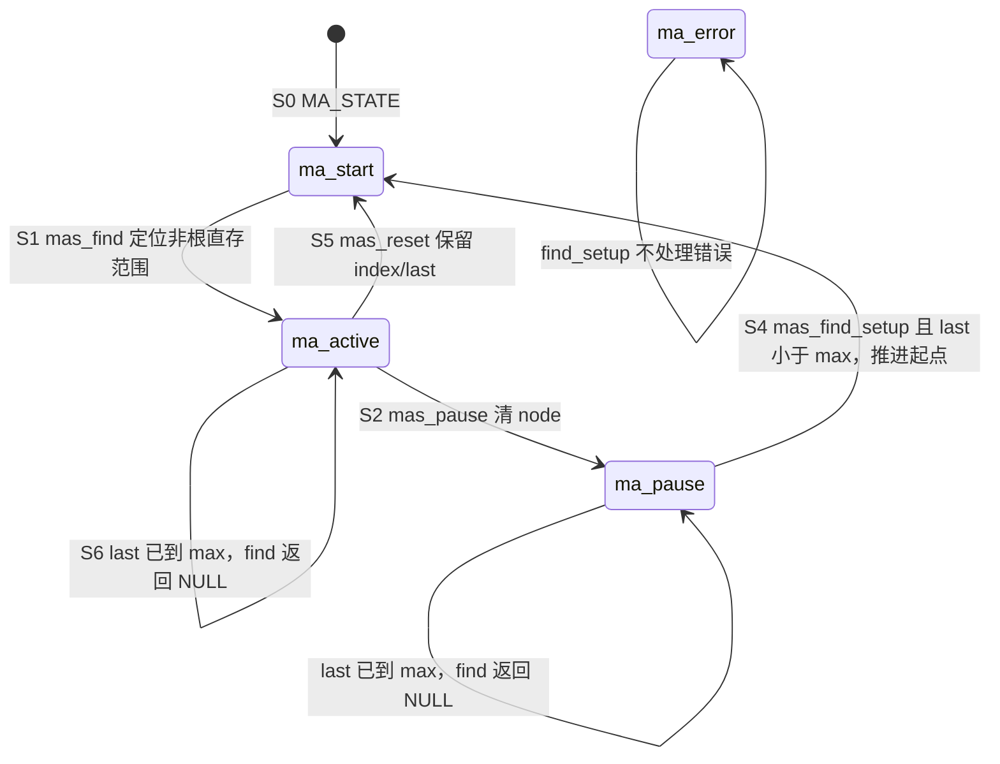

# 第39章\_Maple操作游标的暂停与继续

## 39.1\_从查一个对象走到继续遍历

P38 建立了范围分区，P15 编码单元区分了 node 与 status。现在需要连续读取多个范围：第一次查询从指定地址开始，第二次希望返回后一个对象，而不是每次重新拿到同一对象。调用者必须记住上次观察到的范围以及当前位置是否仍可使用，这就是 ma_state 的任务。

它不是共享树自己的全局状态。树入口保存在 mm_mt 等 maple_tree 对象中，节点和 entry 由各自协议管理；ma_state 是调用者持有的一次操作状态。两个操作可以关联同一棵树，但不能未经同步共享同一个可变游标。源码版本沿[Maple 总索引](../../../../research/source_reading/maple_tree/navigation/P01_Linux_6.12_Maple范围源码阅读索引.md#1.2_按读者问题进入证据)进入，[游标模块](../../../../research/source_reading/maple_tree/navigation/P06_操作游标与暂停继续.md#6.2_沿一次遍历追踪状态)定位具体实现。

## 39.2\_游标不是只有一个status

固定[ma_state 与初始化](../../../../research/source_reading/maple_tree/source_explanations/include/linux/maple_tree.h.md#1.10_操作状态与初始化)包含几组正交信息，不能把整个操作约简成一张只写 active/start 的图：

| 状态组 | 具体存储 | 为什么需要 |
| --- | --- | --- |
| 关联与请求/结果范围 | tree、index、last | 选择共享树；调用前提出索引或范围，返回时某些 API 将其改为对象的完整闭范围 |
| 位置与继承范围 | node、min、max、offset、end、depth | 记录当前位置和父层传来的边界；哪些字段有意义取决于状态和调用路径 |
| 操作控制 | status、mas_flags、store_type | 决定下一步重新定位、继续或处理错误，区分操作选项和写入类型 |
| 节点资源 | alloc | 记录本次操作的分配请求或预分配资源，不是 status 的另一个枚举值 |

MA_STATE 为一个新变量指定 tree、输入 index/last、ma_start 和空 node 等初值；未显式指定的聚合成员按 C 初始化规则归零。mas_init 对已有存储先清零再设置初值，因此不能拿它“重启”仍拥有未处理分配资源的操作，假装清零等于资源释放。mas_reset 更小：只设置 ma_start 和 NULL node，保留 index/last 及其他字段，下一条操作按状态决定哪些旧字段应重新建立。

这里沿用固定头的八个状态名，但按契约理解：ma_active 表示已有可继续操作的位置，不保证该 slot 非空；ma_root 是根直接 entry 的表示分支，查询不覆盖 index 0 时仍可能返回 NULL；ma_none 表示当前查找没有可用节点位置，不是所有 NULL 返回的统一状态。ma_pause 说明缓存位置不可再信赖；ma_overflow/ma_underflow 记录某路径遇到的边界；ma_error 需要按错误协议处理；ma_start 则要求重新从根建立位置。

## 39.3\_沿S0到S6比较暂停与重置

选一棵私有树，先存 A=[20,29]、B=[40,49]、C=[60,69]。同一个调用者遍历到 A 后暂时释放锁，并在空洞存入 D=[30,39]，再继续查询。这里同一线程顺序改变树，目的是观察游标，不模拟真实并发读写。

| 阶段 | 触发与写入者 | 状态地址与变化 | 下一步怎样使用 |
| --- | --- | --- | --- |
| S0 初始化 | 调用者建立 ma_state | index=last=20，status=ma_start，node=NULL，tree 关联共享树 | 在适当保护下第一次 mas_find |
| S1 定位 A | 查询路径写操作状态 | 返回 A，index=20、last=29、status=ma_active | 上层消费结果，决定继续或暂停 |
| S2 暂停后解锁 | 调用者先 mas_pause 再解锁 | status=ma_pause、node=NULL；index/last 仍为 20/29 | 旧节点位置失效，范围边界仍用于继续 |
| S3 改变树 | 普通 store 接口在自身锁约定内写树 | 新增 D；原游标没有自动变为一个有效节点位置 | 调用者重新持锁后才能继续 |
| S4 继续 | mas_find_setup 解释 ma_pause | 确认 last 小于上界后将 index 与 last 推到 30，状态转 ma_start，再定位 D | 返回 D 的完整范围 30～39 |
| S5 重置后再查 | 调用者 mas_reset，随后 mas_find | reset 保留 30/39；重新从当前 index 找，仍返回 D | 与 pause 的“从末端之后继续”不同 |
| S6 改起点与到达边界 | mas_set(50)，再 mas_find 到 69 | 返回 C 的 60～69；再次以 69 为上界返回 NULL，仍可保持 ma_active | 返回值和状态要结合具体路径解释 |





暂停函数本身没有释放锁，也没有等待其他线程；它把下一轮需要的控制状态写好，由调用者安排释放与重新建立保护。VMA 的 vma_iter_invalidate 包装同一暂停动作，所以“失效后从根重新定位”只说了一半：若后续是 mas_find 的暂停继续路径，还会先推进到原 last 之后。相关固定语句见[暂停与继续](../../../../research/source_reading/maple_tree/source_explanations/lib/maple_tree.c.md#1.9_暂停继续与有界find)和[VMA 失效封装](../../../../research/source_reading/maple_tree/source_explanations/include/linux/mm.h.md#1.3_VMA游标失效调用暂停)。

## 39.4\_状态图必须对应实际入口

原有 start/active/pause 示意有助于记住名字，却容易把每条 API 都想成相同状态机。下面保留其阅读用途，只画本例已核对的路径，并把 NULL 返回不改状态的分支画出来：



没有画入本例的 root/none/underflow/overflow 仍是合法状态，不能据此删除它们；它们的入口条件见[定位与重走实现](../../../../research/source_reading/maple_tree/source_explanations/lib/maple_tree.c.md#1.8_从根定位与walk重走)。例如固定 mas_find 在进入 mas_next_slot 后会将 status 设回 ma_active，这与“所有越界都停在 ma_overflow”的记忆法不一致。mas_walk 的固定条件用 `!active || !start`，一个 status 不能同时属于两者，因此进入时会设为 ma_start；不能只照注释推测它必然复用旧路径。本文说明当前执行语句，不修改外部内核树。

如果只是读取当前位置的一项，普通 mtree_load 使用的快速查找并不保证维护完整游标字段。高级游标契约、普通查询的临时状态以及结果对象期限必须分开，不能观察到一个函数用了 MA_STATE 就承诺所有字段都有相同意义。

## 39.5\_运行完整私有模块

下面使用真实 Maple API 组织 S0～S6，静态载荷在实验期间始终存活，不注册设备或后台工作。普通修改自行管理内部锁，高级查找在调用者持锁期间运行；本例没有设置 RCU 模式，也没有外部读者。

```c
// SPDX-License-Identifier: GPL-2.0
#include <linux/init.h>
#include <linux/module.h>
#include <linux/maple_tree.h>
#include <linux/errno.h>

/* 载荷在模块寿命内保持存活；实验不注册任何外部访问入口。 */
struct demo_item { int id; };
static struct demo_item items[] = {{1}, {2}, {3}, {4}};

static int expect_state(struct ma_state *mas, void *entry, int id,
                        unsigned long first, unsigned long last,
                        enum maple_status status, const char *stage)
{
    struct demo_item *item = entry;
    int actual = item ? item->id : 0;

    pr_info("maple_state %s: id=%d index=%lu last=%lu status=%u\n",
            stage, actual, mas->index, mas->last, mas->status);
    if (actual != id || mas->index != first || mas->last != last ||
        mas->status != status)
        return -EINVAL;
    return 0;
}

static int __init note_maple_state_init(void)
{
    struct maple_tree tree;
    MA_STATE(mas, &tree, 20, 20);
    void *entry;
    int ret;

    mt_init(&tree);
    ret = mtree_store_range(&tree, 20, 29, &items[0], GFP_KERNEL);
    if (ret)
        goto destroy;
    ret = mtree_store_range(&tree, 40, 49, &items[1], GFP_KERNEL);
    if (ret)
        goto destroy;
    ret = mtree_store_range(&tree, 60, 69, &items[2], GFP_KERNEL);
    if (ret)
        goto destroy;

    /* 高级遍历在锁内运行；暂停不执行解锁，仍由调用者安排。 */
    mtree_lock(&tree);
    entry = mas_find(&mas, 69);
    ret = expect_state(&mas, entry, 1, 20, 29, ma_active, "first");
    if (ret)
        goto unlock;
    mas_pause(&mas);
    ret = expect_state(&mas, NULL, 0, 20, 29, ma_pause, "pause");
    if (ret || mas.node) {
        ret = -EINVAL;
        goto unlock;
    }
    mtree_unlock(&tree);

    /* 普通写接口自行管理内部锁；不要在同一内部锁中再次调用。 */
    ret = mtree_store_range(&tree, 30, 39, &items[3], GFP_KERNEL);
    if (ret)
        goto destroy;
    mtree_lock(&tree);
    entry = mas_find(&mas, 69);
    ret = expect_state(&mas, entry, 4, 30, 39, ma_active, "resume");
    if (ret)
        goto unlock;

    /* reset 保留索引，不按 pause 的规则跳过刚才的范围。 */
    mas_reset(&mas);
    ret = expect_state(&mas, NULL, 0, 30, 39, ma_start, "reset");
    if (ret)
        goto unlock;
    entry = mas_find(&mas, 69);
    ret = expect_state(&mas, entry, 4, 30, 39, ma_active, "repeat");
    if (ret)
        goto unlock;

    mas_set(&mas, 50);
    entry = mas_find(&mas, 69);
    ret = expect_state(&mas, entry, 3, 60, 69, ma_active, "after_hole");
    if (ret)
        goto unlock;
    entry = mas_find(&mas, 69);
    ret = expect_state(&mas, entry, 0, 60, 69, ma_active, "bounded_end");
unlock:
    mtree_unlock(&tree);
destroy:
    /* 销毁的是内部节点，静态载荷不由 Maple 释放。 */
    mtree_destroy(&tree);
    if (!ret)
        pr_info("maple_state private sequence checked\n");
    return ret;
}

static void __exit note_maple_state_exit(void)
{
    /* 初始化实验结束前已清理私有树，无后台状态。 */
}

module_init(note_maple_state_init);
module_exit(note_maple_state_exit);
MODULE_LICENSE("GPL");
MODULE_DESCRIPTION("Private Maple iterator state observation");
```

材料为[note_maple_state.c](../../../../labs/kernel/tree_basics/materials/note_maple_state.c)，同目录 [Makefile](../../../../labs/kernel/tree_basics/materials/Makefile)登记模块。应在与目标内核匹配的构建环境中从仓库根目录执行：

```bash
make -C "$KDIR" M="$PWD/labs/kernel/tree_basics/materials" modules
sudo insmod labs/kernel/tree_basics/materials/note_maple_state.ko
sudo dmesg | tail -n 16
sudo rmmod note_maple_state
```

KDIR 指向已经准备好配置与生成头文件的目标内核构建树；交叉构建还需按目标设置 ARCH 和工具链，模块应在该目标运行。`make` 可能同时构建该目录已登记的其他材料。本章没有在当前目标执行这些命令，以下为固定源码推导的预期检查点：

| 输出阶段 | id | index/last | status |
| --- | --- | --- | --- |
| first | 1 | 20/29 | ma_active |
| pause | 0，暂停步骤无返回对象 | 20/29 | ma_pause |
| resume | 4 | 30/39 | ma_active |
| reset | 0，重置步骤无返回对象 | 30/39 | ma_start |
| repeat | 4 | 30/39 | ma_active |
| after_hole | 3 | 60/69 | ma_active |
| bounded_end | 0，无下一对象 | 60/69 | ma_active |

当前完成 ARM 前端语法检查，消费的 348 份头文件中非生成部分与固定提交无差量。宿主检查使用固定的暂停、重置、set 和 find/setup 函数，但用显式的范围行走替身代替 Maple 核心，并注入四个 store 失败位置核对退出清理；这不是模块真实装卸记录。完整 Kbuild、MODPOST、目标日志、RCU 和并发验证均未执行。

## 39.6\_用反例检查自己是否理解继续位置

1. 在第一次返回 A 后使用 reset 而非 pause，下次会不会看到新 D？重置保留 index=20，先再次命中 A；这不同于保留“下一项”的位置。
2. 暂停后把 max 设为上次的 last。find_setup 为什么不执行 last+1？先检查边界可避免越过允许范围，极值时也避免回绕。
3. 若解锁期间有人把一个 entry 扩展为覆盖旧 last+1 的更大范围，继续遍历能否被理解为固定快照？不能；暂停只重建位置条件，不承诺跨修改的快照或固定对象恰好访问一次。
4. reset 清了 node，是否同时释放 alloc？没有。重新初始化状态、放弃预分配资源和销毁共享树是不同动作；本例只有查找状态，不留下预分配资源。

本章已经能按字段重建一次暂停与继续，而不是背状态名字。接着回到[P15 的地址场景](P15_Linux_6.12_Maple_Tree_源码结构与_API_分层.md#15.7_用一个复杂_VMA_场景理解_ma_state)，区分普通点查与向后查询实际维护了哪些结果。
