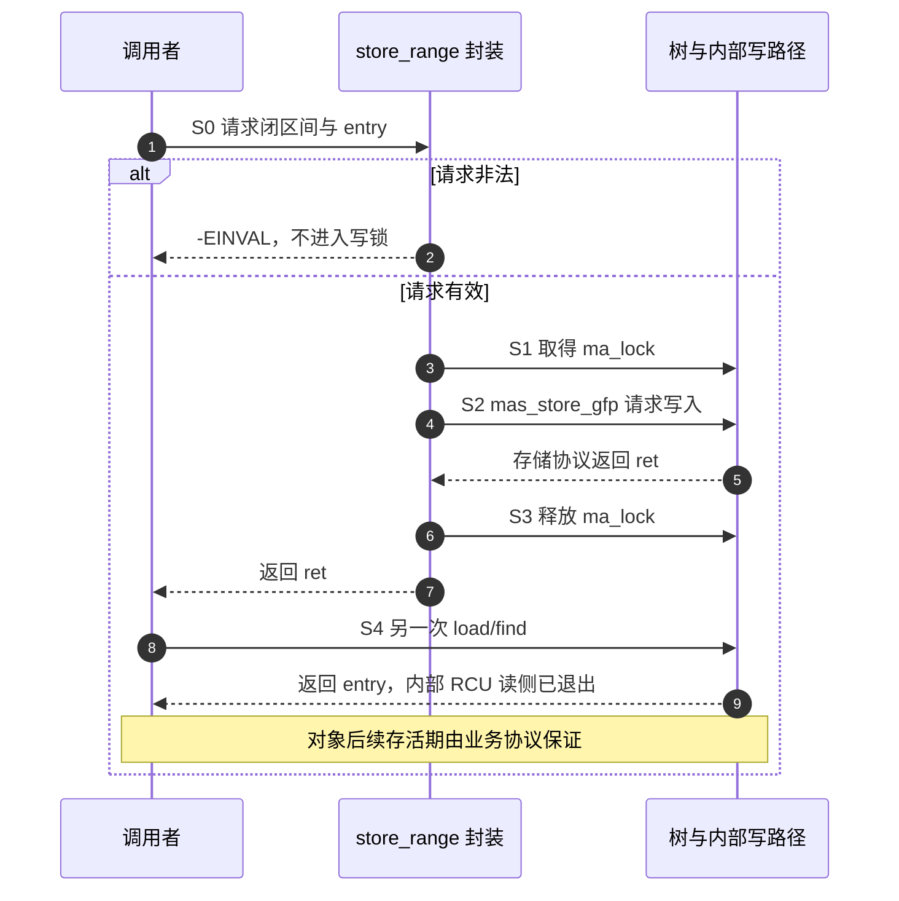

# 第40章\_Maple普通接口中的范围与查询

## 40.1\_从保存一个范围到选择操作契约

[P39](P39_Maple操作游标的暂停与继续.md#39.3_沿S0到S6比较暂停与重置)已经让我们手持 ma_state，观察暂停和重置怎样改变下一次查询。许多调用者只需要“把这段编号交给对象 A”或“查出覆盖编号 175 的对象”，并不需要跨调用保留节点位置。普通接口把临时 ma_state 藏在函数内，让调用者主要面对范围和返回值。

减少状态管理不等于减少业务选择。假设资源管理器先把闭区间 [100,199] 分给 A，随后请求把 [150,249] 分给 B。如果这是一次映射更新，覆盖旧范围可能正是意图；如果这是一次新资源分配，同样的覆盖会悄悄夺走 A 的一部分资源。树无法替业务决定哪种含义正确。本章用一棵私有树区分这两类操作，再观察删除和查询怎样沿用范围语义。

这里只使用互不相同、对齐且一直存活的对象地址作为 entry。Maple 管理内部索引节点，业务管理对象本身。完整程序没有后台线程，没有把树或对象交给外部调用方，因而可以先建立顺序契约；并发对象生命周期仍须另行设计。

固定源码入口是[普通接口模块](../../../../research/source_reading/maple_tree/navigation/P07_普通接口与范围契约.md#7.2_沿一次调用划分责任)。版本为 NXP 官方 Linux 6.12.20、提交 `dfaf2136deb2af2e60b994421281ba42f1c087e0`，具体函数只在模块关联的上游路径讲解中展开。

## 40.2\_同一棵树中的覆盖与拒绝覆盖

先执行 store_range(100,199,A)，树内 [100,199] 指向 A。再执行 store_range(150,249,B)，**请求区间内的旧映射被替换**：A 留在 [100,149]，B 占据 [150,249]。旧 A 对象没有被树释放；改变的是哪些索引还能找到它。

此时若执行 insert_range(240,299,C)，[240,249] 仍属于 B。即使 [250,299] 空闲，完整请求也不满足“整段没有已有值”的条件，返回 `-EEXIST`。调用者不必先 load 再 store；在共享树上，两次独立调用之间可能插入其他写者，先查空并不使后来写入成为排他申请。insert_range 把检查与条件写入放进自身协议中。

| 操作 | 调用前的局部状态 | 成功后或预期拒绝后的状态 |
| --- | --- | --- |
| store A 到 [100,199] | 空 | A[100,199] |
| store B 到 [150,249] | A[100,199] | A[100,149]、B[150,249] |
| insert C 到 [240,299] | B 覆盖请求前十个索引 | 返回 -EEXIST，B 保留，250 仍为空 |
| store C 到 [300,349] | 此段空 | C[300,349] |

这里的成功都以返回 0 为前提。store_range 也可能因分配失败返回 `-ENOMEM`，不能忽略结果后把打印的“拟写入范围”当成树内事实。起点大于终点是 `-EINVAL`；本章完整程序用 [2,1] 观察这个无需触发警告的非法请求。

源码的入参检查使用 `xa_is_advanced(entry)`。它与[P15 的 mt_is_reserved](P15_Linux_6.12_Maple_Tree_源码结构与_API_分层.md#15.5_指针低位编码_Maple_Tree_的_隐形字段)不是同一个谓词：前者判断 internal 编码且不大于 XA_RETRY_ENTRY，后者以 4096 为小值边界。不要从“没有被这个检查拒绝”反推“任意整数都能当业务指针”。本章只传有效对象地址或 NULL，也不以故意触发 WARN_ON_ONCE 作为普通实验步骤。具体比较和 zero-entry 转换见[值编码实现](../../../../research/source_reading/maple_tree/source_explanations/include/linux/xarray.h.md#1.3_普通接口检查与零entry)。

## 40.3\_点查与向后查的游标终点

写入完成以后，资源管理器还面临两个不同的问题：当前编号是否已分配，以及从当前位置出发下一段已分配区域在哪里。下面保留同一棵树，只改变查询请求，观察返回值和输入游标怎样变化。

### 40.3.1\_点查只回答当前索引

`mtree_load(&tree,175)` 返回 B，因为 B 当前覆盖 175；load(250) 返回 NULL，虽然 C 在后面的 [300,349]。这就是[原先 VMA 问题](P14_Maple_Tree_与_VMA_管理.md)中“地址自身是否属于某个对象”的问题。

实现会在内部进入、退出 RCU 读侧，并把 XA_ZERO_ENTRY 转换为 NULL。共享树能否在读写并行时这样遍历，还取决于树的 RCU 模式和调用者的同步协议；仅看到这里有 rcu_read_lock，不能认定任意模式下的并发写入都安全。由此得到的是普通接口可见的值，不是原始槽的所有编码；NULL 也不能用来区分“空槽”与被该接口隐藏的 zero-entry。

更要紧的是：**返回时内部 RCU 读侧已经结束**。这个函数不增加业务对象引用，也不替调用者建立返回后的存活期。若其他线程能够删除映射并回收对象，必须用外围锁、适合该对象的 RCU 生命周期或引用取得协议保护实际使用。树节点的遍历保护与载荷的解引用保护是两件事。VMA 的 vma_lookup 只是调用这一点查，见[唯一实现](../../../../research/source_reading/maple_tree/source_explanations/include/linux/mm.h.md#1.2_vma_lookup只查询当前地址)，不能把这个短封装当作 mmap/VMA 锁协议的替代物。

### 40.3.2\_向后查会跳过空洞

若从 index=250 调用 `mt_find(&tree,&index,349)`，它发现当前位置为空，继续向后找到 C，并把 index 写成 350。输入的 index 是搜索起点，成功后的 index 是 **命中范围末尾之后的位置**，不再是原起点，也不是 C 的起点。

再试 index=0、max=119。树中第一个可见范围是 A[100,149]，100 没超过上界，因此返回 A；成功后 index=150。max 限制搜索要检查的位置，不把 A 裁剪成 [100,119]，也不承诺输出游标一定小于等于 max。

| 调用前 index / max | 返回 | 调用后 index | 解释 |
| --- | --- | --- | --- |
| 0 / 119 | A | 150 | 命中范围可以跨过搜索上界 |
| 250 / 349 | C | 350 | 跳过空洞，跨过完整 C 范围 |
| 350 / 399 | NULL | 350 | 未找到时不写回游标 |
| 400 / 399 | NULL | 400 | 起点已越界，直接结束 |

### 40.3.3\_最大索引怎样结束遍历

最后在 ULONG_MAX 保存 D。find 从该索引出发能返回 D，但 `mas.last + 1` 是无符号运算，结果回绕到 0。若程序再次无条件调用 mt_find，就可能重新从树头开始。

固定版本的 mt_for_each 首次调用 mt_find，后续调用 mt_find_after；后者看到 index=0 就返回 NULL。这种分工既允许第一次从零搜索，又让回绕的零表示后续迭代终止。它没有增加一位更宽的索引，也不返回隐藏的起止范围结构。见[find 与终止检查](../../../../research/source_reading/maple_tree/source_explanations/lib/maple_tree.c.md#1.12_向后查找与回绕终止)和[迭代宏](../../../../research/source_reading/maple_tree/source_explanations/include/linux/maple_tree.h.md#1.12_普通接口的锁与迭代宏)。

## 40.4\_删除一个索引还是删除整段映射

现在执行 erase(175)。它先定位 B 的当前范围 [150,249]，再把 **整段** 清空，返回原 entry B。它不是把 B 切成 [150,174] 与 [176,249]，也没有调用 B 对象的析构或释放函数。

如果需求是仅撤销 A 的 [110,119]，则 store_range(110,119,NULL) 明确指定了清空范围。结果是 A[100,109]、空洞[110,119]、A[120,149]。同一对象仍从两段索引可达；业务不能因为某次清除或 erase 返回了 A，就推断 A 在整棵树中已无其他引用。

这个差别使 API 选择直接取决于业务语义：想撤销“当前命中的这一条范围”，用 erase；想修改确定的子区间，用 store_range。对象何时真正死亡，应依据业务所有权，而不是依据函数名里的 erase。

## 40.5\_内部封装在哪里结束

普通接口替调用者建立临时 ma_state，不能抹去共享树、临时游标和业务对象的分工。下面用同一组 S0～S4 描述一次 store_range；这是顺序阶段，并不是声称三种对象合成了一个枚举状态机。

| 阶段 | 进入事件与状态写入 | 下一位读取者与退出条件 |
| --- | --- | --- |
| S0 构造请求 | 调用线程在自身栈上建立 mas，写 tree/index/last；entry 地址仍归业务 | 参数检查读请求，非法请求直接返回 |
| S1 进入写路径 | 有效请求取得 `tree.ma_lock`；mas 仍为本次操作私有 | 写入实现读取当前树结构 |
| S2 完成存储协议 | mas_store_gfp 组织所需节点与范围更新，把结果状态留给本次操作 | 内部算法决定成功或错误；不能把分配等待期间是否放锁凭空简化成整段持锁 |
| S3 返回结果 | 普通封装释放内部锁，向调用者返回 ret | 调用者检查 ret，才决定是否继续依赖新映射 |
| S4 后续读取 | load/find 建立自己的临时状态读取共享树，不复用上次栈变量 | 返回 entry 后由业务协议保证对象使用期 |




这里最容易误用的是锁模式。固定头文件中的 mtree_lock 宏直接调用 `spin_lock(&mt->ma_lock)`，没有“若 external 模式则自动取得外部锁”的分支。因此本章使用 mt_init 初始化的私有树，而且不在已持有同一内部锁时再调用这些写入封装。VMA 的 mm_mt 登记外部锁，写入需服从其高级接口和外围 mmap 锁协议，不能仅凭“普通 API 会加锁”就改成 mtree_store_range。外部锁登记的意义回看[P15 树模式](P15_Linux_6.12_Maple_Tree_源码结构与_API_分层.md#15.3_struct_maple_tree_树对象本身)。

本章没有展开 mas_store_gfp 的重试、预分配或分裂算法，也不把失败等同于“从未分配任何节点”。这一层只规定调用者如何提交请求、识别返回，以及选择正确的树模式；高级写入的资源阶段留给后续单元。

## 40.6\_运行完整私有模块

材料为[note_maple_basic.c](../../../../labs/kernel/tree_basics/materials/note_maple_basic.c)。它检查同一棵树的覆盖、部分重叠拒绝、边界查询、两种清除以及最大索引终止。所有操作在初始化中顺序完成，退出前销毁内部树；静态载荷在整个过程中存活。GFP_KERNEL 是传给分配路径的标志，允许该路径按相应协议睡眠；本例从模块初始化的可睡眠环境调用，不把它搬到中断或已持有自旋锁的路径。许可声明沿用前一模块，和范围操作无关。

```c
// SPDX-License-Identifier: GPL-2.0
#include <linux/init.h>
#include <linux/module.h>
#include <linux/maple_tree.h>
#include <linux/errno.h>
#include <linux/limits.h>

/* 载荷保持到模块退出；私有树没有并发读者或发布入口。 */
struct basic_item { int id; };
static struct basic_item basic_items[] = {{1}, {2}, {3}, {4}};

static int expect_entry(void *entry, unsigned int item)
{
    void *expected = item ? &basic_items[item - 1] : NULL;

    /* 比较地址即可验证映射，不需要解引用不符合预期的返回值。 */
    return entry == expected ? 0 : -EINVAL;
}

static int __init note_maple_basic_init(void)
{
    struct maple_tree tree;
    unsigned long index;
    void *entry;
    int ret;

    mt_init(&tree);
    ret = mtree_store_range(&tree, 100, 199, &basic_items[0], GFP_KERNEL);
    if (ret)
        goto destroy;
    ret = mtree_store_range(&tree, 150, 249, &basic_items[1], GFP_KERNEL);
    if (ret)
        goto destroy;
    ret = expect_entry(mtree_load(&tree, 125), 1);
    if (!ret)
        ret = expect_entry(mtree_load(&tree, 175), 2);
    if (!ret)
        ret = expect_entry(mtree_load(&tree, 225), 2);
    if (ret)
        goto destroy;
    pr_info("maple_basic overwrite: A[100,149] B[150,249]\n");

    /* insert 的契约是整段空闲；即使只有一部分重叠也不能覆盖。 */
    ret = mtree_insert_range(&tree, 240, 299, &basic_items[2], GFP_KERNEL);
    if (ret != -EEXIST) {
        ret = -EINVAL;
        goto destroy;
    }
    ret = expect_entry(mtree_load(&tree, 249), 2);
    if (!ret)
        ret = expect_entry(mtree_load(&tree, 250), 0);
    if (ret)
        goto destroy;
    ret = mtree_store_range(&tree, 300, 349, &basic_items[2], GFP_KERNEL);
    if (ret)
        goto destroy;
    ret = mtree_store_range(&tree, 2, 1, &basic_items[3], GFP_KERNEL);
    if (ret != -EINVAL) {
        ret = -EINVAL;
        goto destroy;
    }

    /* max 限制搜索位置，不把命中条目的右端裁剪到 max。 */
    index = 0;
    entry = mt_find(&tree, &index, 119);
    ret = expect_entry(entry, 1);
    if (ret || index != 150) {
        ret = -EINVAL;
        goto destroy;
    }
    index = 250;
    entry = mt_find(&tree, &index, 349);
    ret = expect_entry(entry, 3);
    if (ret || index != 350) {
        ret = -EINVAL;
        goto destroy;
    }
    index = 400;
    entry = mt_find(&tree, &index, 399);
    if (entry || index != 400) {
        ret = -EINVAL;
        goto destroy;
    }
    pr_info("maple_basic find: bounded cursor=150, gap cursor=350\n");

    /* erase 删除当前命中的整段 B；局部清空则明确写入 NULL。 */
    ret = expect_entry(mtree_erase(&tree, 175), 2);
    if (!ret)
        ret = expect_entry(mtree_load(&tree, 150), 0);
    if (!ret)
        ret = expect_entry(mtree_load(&tree, 249), 0);
    if (ret)
        goto destroy;
    ret = mtree_store_range(&tree, 110, 119, NULL, GFP_KERNEL);
    if (ret)
        goto destroy;
    ret = expect_entry(mtree_load(&tree, 109), 1);
    if (!ret)
        ret = expect_entry(mtree_load(&tree, 115), 0);
    if (!ret)
        ret = expect_entry(mtree_load(&tree, 120), 1);
    if (ret)
        goto destroy;
    pr_info("maple_basic clear: A[100,109] hole[110,119] A[120,149]\n");

    ret = mtree_store(&tree, ULONG_MAX, &basic_items[3], GFP_KERNEL);
    if (ret)
        goto destroy;
    index = ULONG_MAX;
    entry = mt_find(&tree, &index, ULONG_MAX);
    ret = expect_entry(entry, 4);
    if (ret || index || mt_find_after(&tree, &index, ULONG_MAX)) {
        ret = -EINVAL;
        goto destroy;
    }
    pr_info("maple_basic end: wrapped cursor=0, find_after stopped\n");
destroy:
    /* 内部节点与载荷不是同一所有权；destroy 不释放静态载荷。 */
    mtree_destroy(&tree);
    return ret;
}

static void __exit note_maple_basic_exit(void)
{
    /* 私有树已在初始化结束前清理。 */
}

module_init(note_maple_basic_init);
module_exit(note_maple_basic_exit);
MODULE_LICENSE("GPL");
MODULE_DESCRIPTION("Private Maple normal API contracts");
```

在配置匹配的目标内核构建环境中，按[材料说明](../../../../labs/kernel/tree_basics/materials/README.md)准备目录，并在仓库根目录执行：

```bash
make -C "$KDIR" M="$PWD/labs/kernel/tree_basics/materials" modules
sudo insmod labs/kernel/tree_basics/materials/note_maple_basic.ko
sudo dmesg | tail -n 16
sudo rmmod note_maple_basic
```

KDIR 指向已准备好配置和生成头的目标构建树；交叉编译还需设置匹配的 ARCH 和工具链，模块在该目标运行。Makefile 已登记本模块；目标必须具备与模块匹配的符号、配置和构建结果。成功路径的预期信息是：

```text
maple_basic overwrite: A[100,149] B[150,249]
maple_basic find: bounded cursor=150, gap cursor=350
maple_basic clear: A[100,109] hole[110,119] A[120,149]
maple_basic end: wrapped cursor=0, find_after stopped
```

本批执行了 ARM 前端编译和明确替代树后端的宿主检查，包含五个分配失败出口、zero/retry entry 与整轮迭代终止；Windows 宿主的 internal 值到指针转换显式经 uintptr_t 适配宽度，其余所选普通封装保持固定语句。目标 Kbuild、MODPOST、加载、卸载和上述目标日志 **未执行**。宿主检查只能核对请求顺序、返回处理及固定封装的控制行为，不能替代实际 Maple 分裂、RCU、并发和回收验证。预期输出不是实测记录。

## 40.7\_练习与回顾

1. A[100,199] 已存在时，store B[120,129] 与 insert B[120,129] 分别意味着什么？先画区间，再解释为何业务分配器可能更需要后者。
2. A[100,149] 与 C[300,349] 之间为空。load(200)、find 从 200 搜索到 299、find 从 200 搜索到 300，各返回什么，输入游标是否改变？
3. 只想撤销 [110,119]，为何 erase(110) 不够精确？若 A 还有另一段映射，返回 A 是否足以证明可以释放它？
4. 把遍历中的后续 mt_find_after 改为 mt_find，会在哪个上界暴露重复？为什么不能把所有首次 index=0 也当作结束？
5. 在已持有 ma_lock 的路径中调用 store_range，会在哪里再次取锁？把树设成外部锁模式后，它又会自动取得哪把外部锁？请用宏体否定这个假设。

核对思路：题 1 的 store 将 A 切开，insert 返回 -EEXIST；题 2 依次为 NULL、NULL且保持200、C且游标350。题 3 需要带范围的 NULL 写入，对象释放还缺少完整所有权证据。题 4 要处理 ULONG_MAX 后的无符号回绕，同时允许首次从零起步。题 5 的内部自旋锁不能递归取得，宏也不提供外部锁自动分派。

现在能够按覆盖政策、查询方向、清除范围及生命周期选择普通接口。沿[P15 高级接口](P15_Linux_6.12_Maple_Tree_源码结构与_API_分层.md#15.9_高级_API_mas_*%28%29_是真正的状态机接口)继续时，下一步要回答：调用者接管 ma_state 和锁以后，如何把资源准备与真正写入分开。
