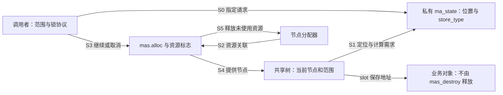
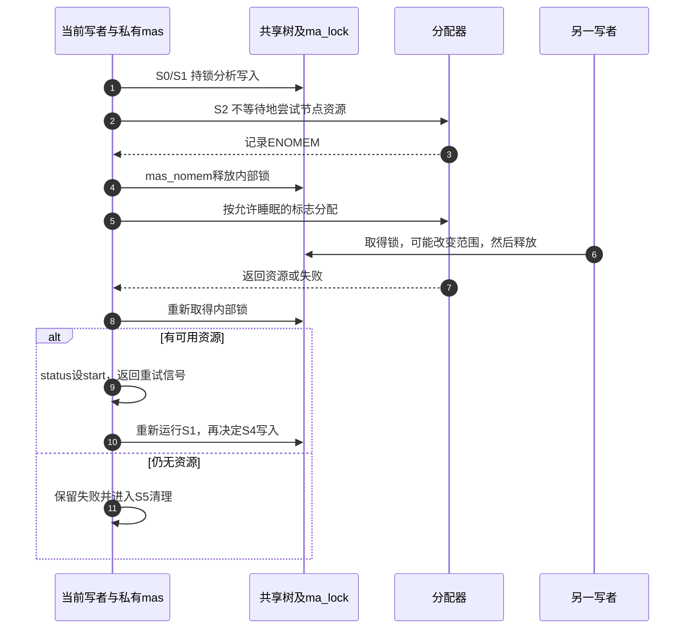

# 第41章\_Maple写入准备与锁边界

## 41.1\_为什么一次写入还需要准备阶段

[P40](P40_Maple普通接口中的范围与查询.md#40.2_同一棵树中的覆盖与拒绝覆盖)已经确定范围写入的业务含义。现在设想一个管理器要同时更新索引和自己的账本：如果先宣布资源属于 B，随后树分配节点失败，账本与索引就分离了。只检查最终返回值还不够，调用者需要决定哪些可失败动作必须先做，哪些状态必须等准备完成后再发布。

Maple 的一次范围写入可能需要更多内部节点。例如把一个空洞切成前空洞、新映射和后空洞，叶槽数量可能增加；当前节点放不下时，后续结构调整也需要资源。这里先不展开分裂算法，只抓住问题的来源：业务对象已经存在，并不意味着索引表达这个范围所需的节点也已经存在。

高级接口允许调用者持有 ma_state，分别安排资源和写入。它也把责任交回调用者：请求 index/last 是否有效、树由哪把锁保护、当前能否睡眠、准备之后树和请求是否仍符合条件，都不能仅靠“高级 API”这个名称成立。本章只完成写入资源协议，反向遍历、空洞选择和完整动态分裂仍由各自单元负责。

固定证据沿[写入资源模块](../../../../research/source_reading/maple_tree/navigation/P08_写入准备与资源清理.md#8.2_沿S0到S5追踪资源)，来源仍是 NXP 官方 Linux 6.12.20 固定提交 `dfaf2136deb2af2e60b994421281ba42f1c087e0`。

## 41.2\_先区别三种写入入口

同样是保存 entry，三个接口交给调用者的结果并不相同。

| 接口 | 调用者提交什么 | 如何理解结果 |
| --- | --- | --- |
| mas_store | 已受保护的 ma_state 及 entry | 返回范围内被覆盖的第一个 entry；NULL 既可能原来为空，也可能失败，必须结合 mas_is_err |
| mas_store_gfp | 同一请求加分配标志 | 返回整数结果；内部组织重试和本次状态资源清理 |
| mas_preallocate 再 mas_store_prealloc | 先准备当前请求，再在有效条件下兑现它 | 前者返回准备结果；后者无返回值，依赖已满足的准备契约，并清理剩余资源 |

mas_store 返回的不是一个代表所有旧对象的列表。覆盖多个范围时，只返回第一个旧 entry，业务不能据此释放全部被覆盖对象。本章不把 NULL 当成“写入成功且原来没有对象”的充分证据。

普通封装的范围检查也不能被自动套到高级函数上。固定 mas_store 的起点大于终点检查位于内核 Kconfig 调试选项 CONFIG_DEBUG_MAPLE_TREE 控制的分支；其他入口也没有统一的普通入参过滤。调用者应先建立有效闭区间和合法 entry，再进入写入。完整实现见[写入入口](../../../../research/source_reading/maple_tree/source_explanations/lib/maple_tree.c.md#1.13_高级写入与准备兑现)。

## 41.3\_沿S0到S5区分位置与资源

ma_state 同时保存多组信息：index/last 是业务请求，node/status 是行走位置与结果，store_type 记录本次写入分类，alloc 和 mas_flags 参与资源管理。它们不是一条简单的“空闲—忙碌—完成”枚举。准备资源时可能已定位节点；取消资源并不等于删除树，位置失效也不自动释放预留节点。

| 阶段 | 谁修改什么状态 | 退出条件与后续读取者 |
| --- | --- | --- |
| S0 建立请求 | 调用者写私有 mas 的树、index/last，并建立树保护 | 范围与对象有效，进入分析当前树的阶段 |
| S1 识别所需写入 | 写路径读取共享树，设置位置和 store_type，并计算节点需求 | 无新节点需求可直接进入后续；否则准备资源 |
| S2 准备资源 | 分配路径把节点资源关联到 mas->alloc；必要时记录错误 | 成功后由写入消费，失败由当前接口清理或重试 |
| S3 决定是否兑现 | 调用者保持准备所需的保护和请求条件，选择继续或取消 | 取消时 mas_destroy 回收操作资源；不发布请求映射 |
| S4 更新共享树 | store 路径使用已准备条件更新节点和索引映射 | 业务检查结果后才依赖新映射，不能先宣布成功 |
| S5 收束资源 | 本次接口或调用者按契约调用 mas_destroy | 未使用的节点释放，alloc 归空；树内映射与对象仍有各自寿命 |



一个容易误判的分支是“需求为零”。mas_preallocate 在 request 为零时直接返回 0，不必设置 MA_STATE_PREALLOC；因此 **返回成功** 才是接口结果，不能用“标志一定置位、alloc 一定非空”代替判断。反过来，分配失败路径会保存错误值、清理资源并 reset 状态，返回给调用者的整数错误不能再靠清理后的 mas_is_err 重建。

准备也不是预约了永久有效的树形位置。调用者不能预分配后随意改区间、换对象或放锁让其他写者改树，再拿旧 store_type 和节点位置直接写入。若需要这种变化，必须重新满足写入路径的条件。本章实验采用更容易证明的安排：整个准备、取消或兑现阶段保持同一把外部互斥锁，请求保持一致。

## 41.4\_缺内存时为什么要重新检查树

mas_store_gfp 先尝试准备节点。固定内部路径先使用分配标志 GFP_NOWAIT 与 __GFP_NOWARN，表达不等待且不因本次分配失败告警的请求，不能满足时让 mas_nomem 处理。mas_nomem 并不是一个只读的“是不是缺内存”判断：它可能实际分配，并改变锁的持有状态。

在 **内部锁模式且分配标志允许睡眠** 时，它先释放 ma_lock，再分配，之后重新取得 ma_lock。自旋锁不能包住可能睡眠的分配路径；把分配移出临界区避免了这个冲突，但交换来的代价是别人可能在这段时间修改树。成功后 status 置为 ma_start，调用者按协议重试，而不能继续相信放锁前的树位置。



如果采用外部锁，mas_nomem 不替调用者解锁；若标志不允许睡眠，它也不走上述放锁分支。因此调用者选用的外部锁与分配标志必须相容。本章用互斥锁保护可睡眠的初始化路径，不在内部自旋锁下直接调用带 GFP_KERNEL 的 mas_preallocate。该预分配入口经 mas_node_count_gfp 直接进入分配，并没有借用 mas_nomem 自动放锁，见[节点准备与补分配](../../../../research/source_reading/maple_tree/source_explanations/lib/maple_tree.c.md#1.14_节点准备与补分配锁边界)。

mas_nomem 返回 true 表示应重新尝试，不表示业务写入已经发生，也不保证从此永不需要更多节点。mas_store_gfp 遇到 true 会重试；对 entry=NULL 的范围清除，它还恢复保存的原 index/last，避免把上轮内部定位后的范围误当成新的业务请求。

## 41.5\_取消操作与销毁树是两件事

准备成功后放弃，调用 mas_destroy 释放本次状态关联的未用节点。它不等于 mtree_destroy，不删除已经发布的所有映射，也不释放 entry 指向的业务对象。对于批量构建状态，它还可能执行尾部重平衡；因此不能把它理解成与树保护无关的简单 free。

mas_expected_entries 又是另一种任务：调用者计划有序批量填充尚未对外使用的树，告诉实现预期条目数，让它按布局估算节点并进入批量模式。它不是 mas_preallocate 的计数版通用替代品，更不是任意后续写入序列永不失败的承诺。固定代码按叶/非叶容量留工作空间，设置批量及预分配标志；实际条目数或写入形状不符合预期时，不能凭预期数掩盖边界。结束或提前停止都需遵守 mas_destroy 的清理与可能重平衡责任，见[资源清理与批量准备](../../../../research/source_reading/maple_tree/source_explanations/lib/maple_tree.c.md#1.15_资源清理与批量准备)。

树最终销毁也要尊重锁模式。mtree_destroy 自行取得内部 ma_lock；`__mt_destroy` 不安排锁。因此下面的外部锁示例在仍持互斥锁时调用 __mt_destroy。仅给函数名多加两条下划线不是理由，选择来自我们已建立的锁所有权，见[两种树销毁入口](../../../../research/source_reading/maple_tree/source_explanations/lib/maple_tree.c.md#1.16_树销毁的锁责任)。

## 41.6\_运行外部锁下的完整私有模块

[note_maple_prealloc.c](../../../../labs/kernel/tree_basics/materials/note_maple_prealloc.c)先准备 A 然后取消，检查树仍为空；再次准备并写入 A，最后用 mas_store_gfp 覆盖部分范围为 B。对象地址在模块生命周期内有效，树没有发布给其他线程。示例观察的是协议顺序，不制造并发写者，也不宣称测到了放锁重试。

这里的 mutex 是进程上下文可用的互斥锁：同一时刻只允许一个持有者，等待者可以睡眠，持有者也可以在允许睡眠的上下文内进行分配。宏 DEFINE_MUTEX 静态建立这把锁；MT_FLAGS_LOCK_EXTERN 声明树采用外部锁，mt_set_external_lock 只登记检查关系，真正取得和释放仍由 mutex_lock/mutex_unlock 执行。MA_STATE 初始化及错误常量沿前两章，不在此重新定义。

```c
// SPDX-License-Identifier: GPL-2.0
#include <linux/init.h>
#include <linux/module.h>
#include <linux/maple_tree.h>
#include <linux/mutex.h>
#include <linux/errno.h>

struct prealloc_item { int id; };
static struct prealloc_item prealloc_items[] = {{1}, {2}};
static DEFINE_MUTEX(prealloc_lock);

static int __init note_maple_prealloc_init(void)
{
    struct maple_tree tree;
    MA_STATE(mas, &tree, 100, 199);
    int ret;

    /* 外部互斥锁允许当前进程上下文的分配路径睡眠。登记并不取得锁。 */
    mt_init_flags(&tree, MT_FLAGS_LOCK_EXTERN);
    mt_set_external_lock(&tree, &prealloc_lock);
    mutex_lock(&prealloc_lock);

    ret = mas_preallocate(&mas, &prealloc_items[0], GFP_KERNEL);
    if (ret)
        goto destroy_tree;
    /* 准备后取消：释放当前操作资源，树中尚未发布 A。 */
    mas_destroy(&mas);
    if (mtree_load(&tree, 100)) {
        ret = -EINVAL;
        goto destroy_tree;
    }
    pr_info("maple_prealloc cancel: tree still empty\n");

    mas_set_range(&mas, 100, 199);
    ret = mas_preallocate(&mas, &prealloc_items[0], GFP_KERNEL);
    if (ret)
        goto destroy_tree;
    /* 同一保护期、同一写入请求；中间没有解锁或修改其他树范围。 */
    mas_store_prealloc(&mas, &prealloc_items[0]);
    if (mtree_load(&tree, 100) != &prealloc_items[0] ||
        mtree_load(&tree, 199) != &prealloc_items[0]) {
        ret = -EINVAL;
        goto destroy_tree;
    }
    pr_info("maple_prealloc publish: A[100,199]\n");

    /* gfp 封装自行处理状态资源；外部锁仍由本调用者持有。 */
    mas_set_range(&mas, 150, 249);
    ret = mas_store_gfp(&mas, &prealloc_items[1], GFP_KERNEL);
    if (ret)
        goto destroy_tree;
    if (mtree_load(&tree, 125) != &prealloc_items[0] ||
        mtree_load(&tree, 175) != &prealloc_items[1]) {
        ret = -EINVAL;
        goto destroy_tree;
    }
    pr_info("maple_prealloc overwrite: A then B, external lock retained\n");
destroy_tree:
    /* 外部锁模式使用不自行取得 ma_lock 的销毁入口。 */
    __mt_destroy(&tree);
    mutex_unlock(&prealloc_lock);
    return ret;
}

static void __exit note_maple_prealloc_exit(void)
{
    /* 初始化结束前已撤销私有树，无异步参与者。 */
}

module_init(note_maple_prealloc_init);
module_exit(note_maple_prealloc_exit);
MODULE_LICENSE("GPL");
MODULE_DESCRIPTION("Private Maple allocation and external-lock protocol");
```

在匹配目标的构建和运行环境中，从仓库根目录执行：

```bash
make -C "$KDIR" M="$PWD/labs/kernel/tree_basics/materials" modules
sudo insmod labs/kernel/tree_basics/materials/note_maple_prealloc.ko
sudo dmesg | tail -n 16
sudo rmmod note_maple_prealloc
```

KDIR 是已准备配置和生成头的内核构建树；交叉构建应设置匹配目标的 ARCH 与工具链。材料 Makefile 可能同时构建同目录其他模块。成功路径的预期输出如下：

```text
maple_prealloc cancel: tree still empty
maple_prealloc publish: A[100,199]
maple_prealloc overwrite: A then B, external lock retained
```

本批只执行 ARM 前端和带明确后端替身的固定控制函数检查。目标 Kbuild、MODPOST、装卸、上述目标日志以及真实分配/节点重平衡均未执行；预期输出与宿主模型结果不能称为目标运行结果。

## 41.7\_练习与回顾

1. mas_store 返回 NULL，是否已经证明写入成功？还应读取什么，为什么？
2. mas_preallocate 返回 0，但 alloc 为空。是否必然是实现出错？沿 request=0 分支解释。
3. 内部自旋锁下缺内存，为什么不能简单改为始终持锁分配？放锁之后又丢掉了什么保证？
4. 准备成功后取消，应该销毁 ma_state 的资源还是整棵树？批量状态为什么还要求考虑树保护？
5. 把示例中的 __mt_destroy 改成 mtree_destroy，哪一层又会尝试取得内部锁？外部锁登记是否能自动修正它？

核对思路：NULL 可能是旧值为空，也可能是失败；结合状态错误检查。零需求可以无分配置位地成功。允许睡眠的分配与自旋锁上下文冲突，放锁则允许共享树变化，需要重试。取消单次准备使用 mas_destroy，而批量收尾可能涉及树重平衡。外部锁树的销毁入口要沿调用者实际保护选择，普通封装不会自动转换锁。

现在能够分开业务请求、索引位置、预留资源与发布结果。回到[P15 VMA 接入层](P15_Linux_6.12_Maple_Tree_源码结构与_API_分层.md#15.10_VMA_接入层_mm_struct.mm_mt)，继续追踪这一套职责如何落在地址空间和 VMA 包装上。
