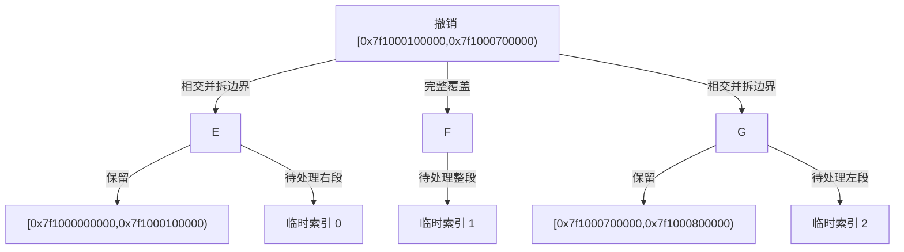
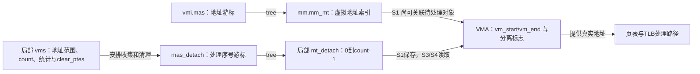
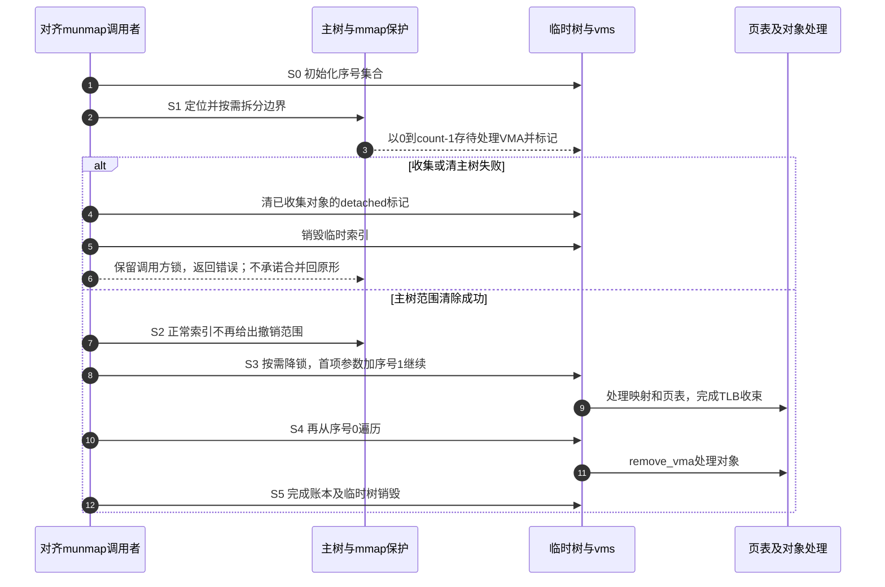

# 第42章\_撤销映射中的两棵Maple树

## 42.1\_从查到VMA到不再允许找到它

[P15 的查询比较](P15_Linux_6.12_Maple_Tree_源码结构与_API_分层.md#15.12_VMA的三个查找入口)已经能回答一个地址位于谁、后面是谁、前驱是谁。撤销映射需要继续回答另一个问题：对象不再从正常地址空间索引可达以后，谁还保存它，才能完成页表处理和对象释放？只把一段索引写成 NULL，会让后续工作失去待处理对象的入口。

固定 NXP Linux 6.12.20 的一条对齐 munmap 路径使用 **两棵不同索引域的树**。mm->mm_mt 用虚拟地址索引当前 VMA；调用者栈上的 mt_detach 用 0、1、2……这样的序号保存本次待处理 VMA。两棵树可以在一个阶段指向相同对象，但不能因此把它们当作同一个共享根或同一种索引。

本章只追踪 do_vmi_align_munmap 的收集、清主树、后续处理与退出，不展开完整系统调用、每种页表格式或全部错误恢复。固定入口见[撤销范围模块](../../../../research/source_reading/maple_tree/navigation/P10_撤销范围与临时索引.md#10.2_两棵树沿S0到S5分工)。外部实验提交不参与证据。

## 42.2\_保留原来的E与F与G场景

仍用 P15 的 64 位抽象地址图；它不是当前 ARM32 机器可直接运行的地址。设调用请求长度为 0x00600000，起点为 0x7f1000100000，则结束地址为 0x7f1000700000。三个相关 VMA 为：

| 对象 | 原半开区间 | 撤销部分 | 应保留的部分 |
| --- | --- | --- | --- |
| E | [0x7f1000000000,0x7f1000200000) | [0x7f1000100000,0x7f1000200000) | 左侧 [0x7f1000000000,0x7f1000100000) |
| F | [0x7f1000200000,0x7f1000240000) | 全段 | 无 |
| G | [0x7f1000600000,0x7f1000800000) | [0x7f1000600000,0x7f1000700000) | 右侧 [0x7f1000700000,0x7f1000800000) |

F 与 G 之间的空洞没有 VMA，不因为请求跨过它就凭空产生一个待清理对象。E、G 的边界部分需要先分开，才能把完整待撤销 VMA 放进临时处理集合；对象拆分的具体内存分配和属性复制仍由 MM 算法处理。



这保留了原场景的全部边界，同时多回答了一件事：主索引撤下这些范围以后，D0～D2 仍是后续处理的入口。

## 42.3\_沿S0到S5观察职责转移

此处是由共享映射、VMA 分离标志、局部收集计数与页表处理状态组成的分阶段协议，不是 ma_state 的单一枚举。下面的阶段同时约束两个游标，不能只跟踪其中一个 node 字段。

| 阶段 | 修改者与存储位置 | 后续读取者与退出条件 |
| --- | --- | --- |
| S0 准备 | 调用者持有约定的 mmap 写锁；局部 mt_detach/mas_detach 和 vms 记录本次任务 | 主树游标 vmi 仍关联 mm_mt，临时计数从零开始 |
| S1 收集 | gather 在主树定位并按需拆边界；用 vma_count 作为临时索引存 entry，标记对象 detached，累计页数和账本 | 临时树保留待处理对象，主树范围尚未在这一阶段整体清除 |
| S2 撤下主索引 | do_vmi_align_munmap 用原地址区间调用 vma_iter_clear_gfp | 成功后进入源码标注的不可返回原状阶段；失败转恢复分支 |
| S3 处理映射 | complete 更新统计，按请求可能把 mmap 写锁降为读锁；clear_ptes 遍历临时序号集合并处理实际地址 | unmap_vmas 清除相关页映射，free_pgtables 处理页表资源，TLB gather 完成收束 |
| S4 退出对象 | complete 再从临时序号零开始调用 remove_vma | 对象关闭/释放职责由该路径继续承担，不能在 S2 就认为全部释放完成 |
| S5 销毁临时索引 | 完成账本、检查及需要的解锁后，__mt_destroy 释放临时树资源 | 临时树不再承担待处理集合；主树保留未撤销区间 |

TLB 是 CPU 缓存地址转换结果的结构；修改页表后还需协调相应转换失效和回收。这里的 mmu_gather 记录清理过程所需工作，不能把一个 mas_find 返回或一次树清空等同于页表和 TLB 已经处理完。体系结构上的具体实现不在本章验证范围。



S1 的“标记分离”与 S2 的“从主索引清掉范围”也不是同一个写动作。旧文若把“沿一棵 Maple Tree 查、删、继续遍历”压成一句话，就会抹掉对象仍由谁持有的关键阶段。

## 42.4\_为什么临时遍历从序号一继续

vms_clear_ptes 把第一个 VMA 直接作为参数传给 unmap_vmas，同时先将 mas_detach 设到 1。这样被调函数先处理已经拿到的第零项，再从序号 1 继续，不会再次处理第零项。这里的 `tree_end=vma_count` 是临时树的排除式序号上界，和 start/end 虚拟地址不是同一单位。

之后 free_pgtables 前又把临时状态设到 1，同样保留首项由参数提供的约定。但它的 floor/ceiling 描述页表释放的地址边界，不能因为接口也接收 ma_state 就把所有参数统称成地址游标。固定 free_pgtables 内部还将 ceiling-1 用作后续搜索上界；它明确允许 USER_PGTABLES_CEILING 为零并以无符号回绕表达该路径的上界约定。

这不是对上一单元“空 VMA 范围应先排除”的否定：**同一个整数运算在不同接口中承担不同契约**。VMA 半开请求 end=0 不应被擅自当作合法空区间；页表清理的 ceiling=0 则有该路径明确声明的哨兵含义。先确认调用者、索引域和参数职责，再判断是否发生错误。

两函数的完整固定入口见[页映射与页表遍历](../../../../research/source_reading/maple_tree/source_explanations/mm/memory.c.md#1.2_解除映射与继续遍历)及[页表释放边界](../../../../research/source_reading/maple_tree/source_explanations/mm/memory.c.md#1.3_释放页表与上界哨兵)。它们也可被别的调用方使用，例如 exit_mmap 传入关联 mm_mt 的状态；“ma_state 指向临时树”同样不能反向变成所有调用的唯一结论。

## 42.5\_失败恢复不等于所有拆分都撤销

收集失败时，已经放入临时集合的对象需要取消 detached 标记，再销毁临时索引。主树清除失败也进入相应恢复。固定 reattach_vmas 执行的是“恢复已收集对象的分离标记并清理临时树”，并没有逐个把先前拆开的 VMA 合回原状。

源码在 gather 的 userfaultfd 错误说明中也明确提到，先前拆分可能保留。因而本章不把错误返回描述成整个系统逐字节不变。保留映射有效性、恢复可达/可用条件和恢复原来的结构形状是不同保证。后续完整 MM 专题还应分别审查 split、用户通知和分配失败的路径。



图以实际收集到映射的正常任务为主；源码中的零页数早退和全部辅助算法以实现文档为准。它没有模拟多 CPU 缺页竞争，也不把降锁自动解读为所有对象都能被任意读者安全访问。

## 42.6\_运行分区与序号模型

下面的[unmap_partition.cpp](../../../../labs/kernel/tree_basics/materials/unmap_partition.cpp)保留原 E/F/G 输入，用值对象生成保留片段与待处理序列。它用 vector 表示处理顺序，帮助看清“序号”和“地址”的区别；它不实现真正的 Maple、对象引用、VMA 分裂回滚或页表回收。

```cpp
#include <cstdint>
#include <iomanip>
#include <iostream>
#include <stdexcept>
#include <utility>
#include <vector>

using unmap_address = std::uint64_t;
struct unmap_region { unmap_address start, end; char owner; };
struct unmap_plan { std::vector<unmap_region> keep, detached; };

// 只建区间分区计划；不模拟内核 VMA 对象、锁、页表或释放动作。
static unmap_plan partition(const std::vector<unmap_region>& input,
                            unmap_address start, unmap_address end)
{
    if (start >= end)
        throw std::invalid_argument("empty or reversed request");
    unmap_plan plan;
    unmap_address previous_end = 0;
    for (const auto& item : input) {
        if (item.start >= item.end || item.start < previous_end)
            throw std::invalid_argument("invalid input regions");
        previous_end = item.end;
        if (item.end <= start || item.start >= end) {
            plan.keep.push_back(item);
            continue;
        }
        if (item.start < start)
            plan.keep.push_back({item.start, start, item.owner});
        const auto first = item.start > start ? item.start : start;
        const auto last = item.end < end ? item.end : end;
        plan.detached.push_back({first, last, item.owner});
        if (item.end > end)
            plan.keep.push_back({end, item.end, item.owner});
    }
    return plan;
}

static void print_region(const unmap_region& item)
{
    std::cout << item.owner << " [" << std::hex << item.start << ','
              << item.end << ")\n";
}

int main()
{
    std::vector<unmap_region> live{
        {0x7f1000000000, 0x7f1000200000, 'E'},
        {0x7f1000200000, 0x7f1000240000, 'F'},
        {0x7f1000600000, 0x7f1000800000, 'G'}
    };
    const auto plan = partition(live, 0x7f1000100000, 0x7f1000700000);
    // detached 的下标是处理序号，元素中的 start/end 才是地址。
    std::cout << "prepared: live_count=" << live.size() << '\n';
    for (std::size_t i = 0; i < plan.detached.size(); ++i) {
        std::cout << "ordinal=" << std::dec << i << ' ';
        print_region(plan.detached[i]);
    }
    live = plan.keep;
    std::cout << "published survivors:\n";
    for (const auto& item : live)
        print_region(item);
    // 在模型中仍可读处理计划；这不是内核对象已被引用或释放的证据。
    std::cout << "pending cleanup=" << std::dec << plan.detached.size() << '\n';
    return 0;
}
```

```bash
c++ -std=c++17 -Wall -Wextra -Werror -O2 labs/kernel/tree_basics/materials/unmap_partition.cpp -o /tmp/unmap_partition
/tmp/unmap_partition
```

本批宿主实际输出：

```text
prepared: live_count=3
ordinal=0 E [7f1000100000,7f1000200000)
ordinal=1 F [7f1000200000,7f1000240000)
ordinal=2 G [7f1000600000,7f1000700000)
published survivors:
E [7f1000000000,7f1000100000)
G [7f1000700000,7f1000800000)
pending cleanup=3
```

在模型中准备计划不改变 live，发布保留区间后仍能读取 detached。Linux 的真实 gather 则可能已经拆分共享 VMA，所以不能把模型“准备时输入数组不变”的性质转送给内核错误恢复。

## 42.7\_练习与回顾

1. 临时树索引为 1 时，为什么不能拿它当作虚拟地址 1 进行页表处理？应该从哪个对象取地址？
2. 清除主树成功，是否可以立即宣布 VMA 对象和页表都已释放？指出 S3～S5 的剩余工作。
3. 为什么 unmap_vmas 首项由参数传入，而临时游标设到 1？若从 0 继续，可能重复哪个对象？
4. gather 在后半段失败，reattach 为什么不足以证明所有边界拆分恢复成原来的 VMA 个数？
5. 将实验的结束地址改为 G 起点，预测 detached 集合是否包含 G，再运行验证；继而把整个请求放进 F/G 之间的空洞，观察两组输出。

答案线索：序号只用于选取对象，地址来自 VMA 字段；主树不可达与对象回收是分离阶段；第零项已经由参数交付；恢复函数不调用逆向合并；排除式结束点不包含 G，纯空洞请求没有待处理片段。

回到[P15 总图与收束](P15_Linux_6.12_Maple_Tree_源码结构与_API_分层.md#15.15_ma_state_和_VMA_iterator_的一张总图)，用“当前状态关联哪棵树、该树索引的单位是什么”检查后续源码，而不凭同一个结构名猜测职责。
