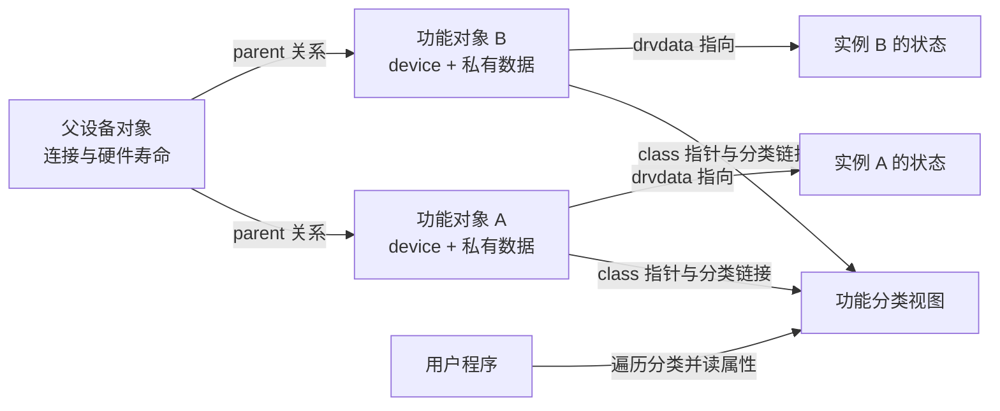
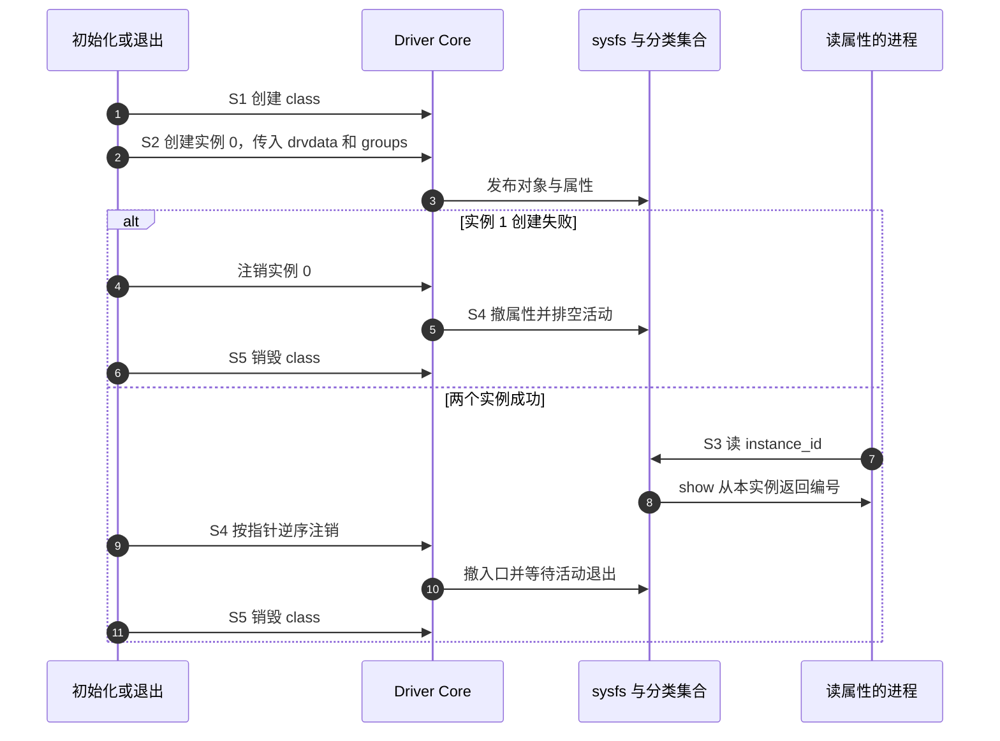

# 第1章\_两个没有设备节点的分类实例

在[驱动框架入门](../../../driver_model/fundamentals/framework_model/大纲.md)中，我们已经把描述设备的对象、操作设备的驱动与用户入口分开。本章保留这个区分，只解决一个新问题：两个设备通过不同总线连接，应用怎样按“它们能做什么”找到它们？

先别编写字符设备。我们会注册两个只有编号属性的对象，观察它们出现在同一个分类目录中，却没有对应的设备节点。完成实验后，你应能解释 class 究竟增加了什么，以及它为什么不能代替 cdev。

## 1.1\_从连接位置走到功能视图

假设两个温度传感器分别接在板载总线和外接适配器上。硬件访问程序需要知道地址、中断和传输方式；读取温度的应用更关心哪个对象提供温度、单位是什么。把所有程序都绑在一条具体连接路径上，换一次接线就可能改一批应用。

设备模型因此保留不同的关系。`device.parent` 表达父设备关系，`device.bus` 把对象放进匹配与管理的总线域；`device.class` 为功能相近的对象提供用户可见分类。class 不取代前两者，一个设备对象最多指向一个 class；一块硬件若提供多个功能，可以由子系统建立多个功能对象，共同关联到硬件父对象。不能为了让同一个 device 同时出现在两个类中，反复覆盖它的 class 指针。



图中没有字符分派表。分类解决“按功能找到对象”，cdev 解决“用字符设备号找到文件操作”；两件事可以在同一个驱动中配合，也可以独立存在。网卡的 class 目录就是功能视图，不能据此推导系统必有 `/dev/eth0`。已有 hwmon、input、tty 等子系统时，应先使用它们的注册接口与 ABI，而不是用自创类名绕开共同契约。misc 也不是只能做原型：简单独立字符服务使用它仍然成立，选择依据是所需语义，而非项目是否“正式”。

本组具体源码均限定为 NXP 官方 Linux 6.12.20 固定提交；第一次跟源码请从[驱动入口总索引](../../../../research/source_reading/driver_entries/navigation/P01_Linux_6.12_驱动入口源码阅读索引.md#1.1_版本与范围)开始。以下 `class_create` 在该基线只接收名字，不再接收 `THIS_MODULE`。

## 1.2\_先把每个实例的数据放对位置

创建两个对象时，我们要让同一个 show 回调返回不同的编号。用两个全局回调函数当然能凑出结果，但第三个实例又要新增一份代码。更直接的设计是每个实例有一个 `note_instance`，其中的 `instance_id` 在发布前写好，设备的驱动数据指针指向这个实例。回调收到 device 后，通过 `dev_get_drvdata` 找到本次应读的状态。

这里的编号发布后不再修改，不需要为它引入业务锁。若以后允许写入，不能沿用这个理由；下一章会增加第二个执行者和同步约束。`devt=0` 则明确表示本例没有关联的字符或块设备号，两个对象使用相同的零值是有意设计。

程序用 `ARRAY_SIZE` 取得数组元素数，让创建与清理覆盖同一组实例；错误指针检查沿用前置章节的 `IS_ERR/PTR_ERR`。保存为 `note_class.c`，完整材料也见[实验入口](../../../../labs/kernel/class_sysfs/materials/README.md)：

```c
// SPDX-License-Identifier: GPL-2.0
#include <linux/module.h>
#include <linux/device.h>
#include <linux/err.h>
#include <linux/sysfs.h>

struct note_instance {
    unsigned int instance_id;
    struct device *dev;
};

static struct class *note_class;
static struct note_instance note_instances[2];

static ssize_t instance_id_show(struct device *dev,
                               struct device_attribute *attr, char *buf)
{
    const struct note_instance *instance = dev_get_drvdata(dev);

    /* 每个设备保存自己的实例地址，共享同一段回调。 */
    return sysfs_emit(buf, "%u\n", instance->instance_id);
}
static DEVICE_ATTR_RO(instance_id);

static struct attribute *note_attrs[] = {
    &dev_attr_instance_id.attr,
    NULL,
};
ATTRIBUTE_GROUPS(note);

static int __init note_class_init(void)
{
    int index;
    int ret;

    note_class = class_create("note_class");
    if (IS_ERR(note_class))
        return PTR_ERR(note_class);

    for (index = 0; index < ARRAY_SIZE(note_instances); ++index) {
        note_instances[index].instance_id = index;
        /* devt 为零：创建分类对象及属性，不申请字符设备号码。 */
        note_instances[index].dev = device_create_with_groups(
            note_class, NULL, 0, &note_instances[index],
            note_groups, "note_class%d", index);
        if (IS_ERR(note_instances[index].dev)) {
            ret = PTR_ERR(note_instances[index].dev);
            goto undo_devices;
        }
    }
    return 0;

undo_devices:
    /* 只注销已经成功创建的对象，零设备号不能区分两个实例。 */
    while (index-- > 0)
        device_unregister(note_instances[index].dev);
    class_destroy(note_class);
    return ret;
}

static void __exit note_class_exit(void)
{
    int index = ARRAY_SIZE(note_instances);

    while (index-- > 0)
        device_unregister(note_instances[index].dev);
    class_destroy(note_class);
}

module_init(note_class_init);
module_exit(note_class_exit);
MODULE_LICENSE("GPL");
MODULE_DESCRIPTION("两个只有 sysfs 属性的分类实例");
```

`DEVICE_ATTR_RO(instance_id)` 把属性名、只读模式与 `instance_id_show` 关联起来；show 必须先定义，缺少它通常在编译阶段就失败，不能当成某种运行期“读不到”的现象。`ATTRIBUTE_GROUPS(note)` 根据以 NULL 结尾的属性数组生成组表。创建时一并传入组表，使初始属性随对象发布，减少“用户已经看到添加事件，属性却还没补上”的窗口。

`device_create_with_groups` 为 device 分配内存并建立释放协议；它不复制 drvdata 指向的数据。数组在整个模块存续期都存在，所以回调有有效的实例地址。创建失败返回错误指针，保留 `PTR_ERR` 得到的真实原因，不能把命名冲突、内存不足等不同失败都改成 `-EINVAL`。

失败清理为什么保存 device 指针？两个对象的 devt 都是零，用 `device_destroy(class, 0)` 只是在类中按设备号找对象，不能表达“刚才成功创建的那一个”。代码按保存的指针逆序注销，仅归还已取得的资源。若第二个对象创建失败，第一个被注销；若第一个就失败，没有设备需要注销。class 最后销毁。

## 1.3\_构建并预测目录

按[模块构建四章](../../../../engineering/build/kernel_modules/大纲.md)准备与运行内核一致的构建树，材料目录已有 Makefile。下面命令在目标 Linux 的材料目录执行，KDIR 必须由实际环境设置，不从目录名字猜版本。

```bash
make -C "$KDIR" M="$PWD" modules
sudo insmod ./note_class.ko
for entry in /sys/class/note_class/note_class*; do
    printf '%s -> ' "$entry"
    readlink -f "$entry"
    cat "$entry/instance_id"
done
test ! -e /sys/class/note_class/note_class0/dev
test ! -e /dev/note_class0
sudo rmmod note_class
```

在没有同名残留文件、sysfs 已挂载且模块加载成功的环境中，两个编号应依次为 0、1。分类入口指向设备对象在 `/sys/devices` 下的真实位置；无硬件父对象的本例属于虚拟设备。前两个 test 是预测检查，不是本文已经执行过的目标日志；如果 `/dev/note_class0` 原来就有静态节点，它可以继续存在，并不能推翻 class 实验。

目录存在而没有 `dev` 属性，是关键观察。设备添加路径只在主设备号非零时建立设备号属性、号码索引并请求 devtmpfs 建节点。我们没有申请号码、没有登记 cdev，也没有注册字符文件操作，因此 `/proc/devices` 不应因为本例增加一个 note_class 字符主号。

## 1.4\_这次创建经历了哪些阶段

这是分类注册、设备可见性和对象引用共同组成的周期，不能压成“已创建”一个布尔状态。

| 阶段 | 谁写什么状态 | 下一位读取者与退出条件 |
| --- | --- | --- |
| S0 准备 | 初始化函数写实例编号；对象尚未发布 | 创建回调之前，drvdata 必须可用 |
| S1 建类 | class 注册路径建立内部集合及分类目录 | device 添加路径取得对应的分类管理状态 |
| S2 建设备 | 创建路径写 device 的 class、parent、groups、drvdata，添加 sysfs 与类关系 | 用户可查目录，属性回调可取得实例 |
| S3 读取 | kernfs/sysfs 分派 show，show 读取实例编号 | 将格式化字节数返回读路径 |
| S4 撤入口 | 注销路径移除属性及关系，等待活动访问退出 | 不再有本例属性回调需要实例数组 |
| S5 归还引用 | device 初始引用归还，最后引用按 release 销毁；随后销毁 class | 模块退出可以结束；引用释放不等于任意硬件工作自动停止 |



内部 class 管理使用另行分配的 `subsys_private`，其中有 kset、设备集合和锁。公开的 `struct class` 不是 kset 的别名，也不是直接包含所有设备的数组。具体字段与创建路径见[分类与属性导读](../../../../research/source_reading/driver_entries/navigation/P03_分类对象与属性事务导读.md)，创建契约直达[core.c 的设备创建实现](../../../../research/source_reading/driver_entries/source_explanations/drivers/base/core.c.md#1.1_设备创建便利函数的所有权)。

## 1.5\_回顾与练习

本章已经证明：class 增加功能分类，device 承载实例与属性，设备号和字符分派需要另行建立。两个共享回调不需要共享业务数据；注销时也应根据真正拥有的对象来清理。

1. 把实例数改成三个，需要复制 show 吗？预测第三个属性的内容。
2. 第二次创建故意与第一次使用同名，失败路径应注销几次设备、销毁几次 class？不要只判断 insmod 失败。
3. 若一个 USB 设备既有输入又有测量功能，是否应该给同一个 device 连续赋两个 class？
4. 给编号增加写接口后，“初始化后不变”的证明还成立吗？

解答：第一题仍复用同一回调，数组长度与循环共同决定实例，第三个值为 2。第二题只有第一个创建成功，应注销一次设备、销毁一次 class，返回真实创建错误；故障测试应同时观察没有遗留目录。第三题由合适子系统建立不同功能对象并关联父设备，不能覆盖已发布关系。第四题不成立，独立打开的两个属性文件可以同时进入业务回调；下一章将给共享状态增加互斥和明确提交点。

下一篇：[让属性控制字符读取](P02_让属性控制字符读取.md)。返回[专题大纲](大纲.md)。
