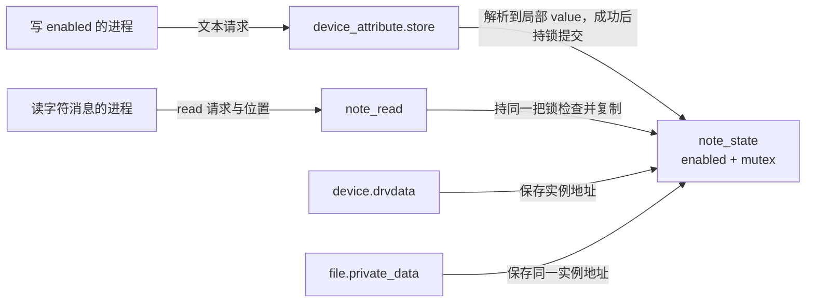

# 第2章\_让属性控制字符读取

上一章的属性只观察不变编号。现在我们让属性产生一个可验证的作用：把 enabled 写成 0 后，字符文件的非零长度读取返回权限错误；再写成 1，读取恢复。这里的“启用”只控制一条内存消息的读取，没有假装启动真实硬件，也不把写成功冒充已完成电源切换。

本章沿用[字符读写契约](../../../driver_model/character_device/P05_文件操作契约与数据路径.md)中的实际复制进度与位置规则。新的问题是：一个 sysfs 写回调和另一个字符读回调怎样对同一状态达成一致？

## 2.1\_把两个入口接到同一份状态

sysfs 是对象属性入口，字符设备是数据入口。我们的共同状态只有一个 `enabled`，放在静态 `note_state` 中。设备的 drvdata 与打开文件的 private_data 都指向它；两条路径用同一把 mutex 保护它。锁不是保护文件名字，而是保护“检查允许读取”和“实际复制”这段业务决策。



若把检查放在锁内而把复制移到锁外，读者可以先看到 1，写者随后设成 0 并返回，旧读者再复制消息。那也是可以设计的契约，但不符合本例要演示的“禁用提交与一段读取互斥”。因此我们把复制也留在 mutex 内。用户内存访问可能睡眠，不能把它机械换成自旋锁；代价是写属性可能等待一次读取的缺页处理。

## 2.2\_完整模块与输入契约

属性接受十进制整数 0 或 1，允许 kstrtoint 支持的正负号和结尾单个换行；其他数值、垃圾尾巴和嵌入零字节被拒绝。它不是流式命令解析器：应用应一次 write 提交完整值。`show` 用 `sysfs_emit` 格式化带换行的文本并返回字节数；`store` 完整接受后返回本次 count，失败返回负错误码。

```c
// SPDX-License-Identifier: GPL-2.0
#include <linux/module.h>
#include <linux/device.h>
#include <linux/cdev.h>
#include <linux/fs.h>
#include <linux/err.h>
#include <linux/mutex.h>
#include <linux/string.h>
#include <linux/sysfs.h>
#include <linux/kstrtox.h>

static const char note_message[] = "hello class\n";

struct note_state {
    struct mutex lock;
    int enabled;
    dev_t devt;
    struct cdev cdev;
    struct class *class;
    struct device *dev;
};
static struct note_state note_state;

static ssize_t enabled_show(struct device *dev,
                            struct device_attribute *attr, char *buf)
{
    struct note_state *state = dev_get_drvdata(dev);
    int value;

    mutex_lock(&state->lock);
    value = state->enabled;
    mutex_unlock(&state->lock);
    return sysfs_emit(buf, "%d\n", value);
}

static ssize_t enabled_store(struct device *dev,
                             struct device_attribute *attr,
                             const char *buf, size_t count)
{
    struct note_state *state = dev_get_drvdata(dev);
    int value;
    int ret;

    /* 内核在 count 之外补终止零；拒绝请求内部的零字节。 */
    if (memchr(buf, '\0', count))
        return -EINVAL;
    ret = kstrtoint(buf, 10, &value);
    if (ret)
        return ret;
    if (value != 0 && value != 1)
        return -EINVAL;

    /* 解析只改局部量，完整验证成功后才提交共享状态。 */
    mutex_lock(&state->lock);
    state->enabled = value;
    mutex_unlock(&state->lock);
    return count;
}
static DEVICE_ATTR_RW(enabled);

static struct attribute *note_attrs[] = {
    &dev_attr_enabled.attr,
    NULL,
};
ATTRIBUTE_GROUPS(note);

static int note_open(struct inode *inode, struct file *file)
{
    file->private_data = &note_state;
    /* 普通共享文件位置由 VFS 串行更新，禁止定位式读取。 */
    file->f_mode |= FMODE_ATOMIC_POS;
    return nonseekable_open(inode, file);
}

static ssize_t note_read(struct file *file, char __user *buf,
                         size_t count, loff_t *pos)
{
    struct note_state *state = file->private_data;
    ssize_t ret;

    if (!count)
        return 0;
    mutex_lock(&state->lock);
    if (!state->enabled)
        ret = -EACCES;
    else
        ret = simple_read_from_buffer(buf, count, pos, note_message,
                                      sizeof(note_message) - 1);
    mutex_unlock(&state->lock);
    return ret;
}

static const struct file_operations note_fops = {
    .owner = THIS_MODULE,
    .open = note_open,
    .read = note_read,
};

static int __init note_control_init(void)
{
    struct note_state *state = &note_state;
    int ret;

    mutex_init(&state->lock);
    state->enabled = 1;
    ret = alloc_chrdev_region(&state->devt, 0, 1, "note_control");
    if (ret)
        return ret;
    state->class = class_create("note_control");
    if (IS_ERR(state->class)) {
        ret = PTR_ERR(state->class);
        goto undo_number;
    }
    cdev_init(&state->cdev, &note_fops);
    state->cdev.owner = THIS_MODULE;
    state->dev = device_create_with_groups(state->class, NULL,
                                          state->devt, state,
                                          note_groups, "note_control0");
    if (IS_ERR(state->dev)) {
        ret = PTR_ERR(state->dev);
        goto undo_class;
    }
    /* 最后才发布字符分派；成功后没有另一个可失败的初始化步骤。 */
    ret = cdev_add(&state->cdev, state->devt, 1);
    if (ret)
        goto undo_device;
    return 0;

undo_device:
    device_unregister(state->dev);
undo_class:
    class_destroy(state->class);
undo_number:
    unregister_chrdev_region(state->devt, 1);
    return ret;
}

static void __exit note_control_exit(void)
{
    struct note_state *state = &note_state;

    cdev_del(&state->cdev);
    /* 不持业务锁等待 sysfs 回调排空。 */
    device_unregister(state->dev);
    class_destroy(state->class);
    unregister_chrdev_region(state->devt, 1);
}

module_init(note_control_init);
module_exit(note_control_exit);
MODULE_LICENSE("GPL");
MODULE_DESCRIPTION("用 sysfs 属性控制字符消息的读取");
```

`DEVICE_ATTR_RW(enabled)` 提供 0644 模式，即通常所有者可读写、其他用户可读；具体访问还受目录、挂载与安全策略约束。devtmpfs 的默认字符节点模式在本基线为 0600，节点与属性的权限互相独立。

解析先写局部 value，而不是直接覆盖 `state->enabled`。`kstrtoint` 返回 0 表示转换成功，不表示业务值一定合法，所以随后仍要判断是否属于 {0, 1}。整数超范围返回 `-ERANGE`，非数字或格式不合法返回 `-EINVAL`；我们保留这种区别。普通 sysfs 写路径在复制来的数据末尾补终止零，但用户提交的数据中仍可能自带零字节，`memchr` 的范围只覆盖 count，专门拒绝这种隐藏尾部的输入。

`simple_read_from_buffer` 继续负责短读取、部分复制和位置推进。禁用时返回 `-EACCES`，不推进位置；零长度读取直接返回 0。消息耗尽后的非零请求在启用时返回 EOF，禁用时仍按本例契约先返回权限错误。重新启用不会重置每个打开文件的位置；重新 open 才得到从头开始的文件状态。

## 2.3\_发布顺序为何这样选择

`alloc_chrdev_region` 预留号码，`cdev_init` 准备操作表，但都还没有完成字符分派发布。创建模型对象会公开属性，可能已经请求生成节点；最后 `cdev_add` 才把设备号接到操作表。因此目录或节点短暂出现而 open 尚未成功，是本例允许的初始化窗口。

这种顺序使 cdev_add 成功之后没有其他可能失败的初始化步骤。它并不保证两个入口原子地同时出现。sysfs 回调可能在 cdev_add 之前执行，所以 mutex 和 enabled 必须早已准备好；初始化不能在发布后再次随意覆盖用户已提交的值。

| 取得的资源 | 失败后的处理 | 为什么可以这样处理 |
| --- | --- | --- |
| 号码 | unregister_chrdev_region | 预留不等于已有可调用的操作表 |
| class | class_destroy，再归还号码 | 类内还没有成功的设备 |
| device 与初始属性 | device_unregister，再撤 class 和号码 | 移除属性等待活动回调，静态 state 仍在 |
| cdev 发布成功 | 初始化立即成功 | 普通卸载等待已有文件归还模块引用，退出再撤 cdev、device、class、号码 |

把 device_create 移到 cdev_add 后面并非一律错误，但此时创建失败必须面对可能已经打开的文件：cdev_del 不会关闭旧 file，单纯返回初始化失败可能留下指向即将消失的模块数据的使用者。应先重新证明失败与持有关系，不能只调整 goto 标签。

## 2.4\_一次保留文件位置的观察

构建同前一章。在目标 Linux 加载 `note_control.ko` 后，以有权读节点和写属性的用户执行下面完整程序。程序退出时恢复 enabled=1；它只改变这个教学模块的状态。

```bash
sudo insmod ./note_control.ko
sudo python3 - <<'PY'
import errno
import os

attribute = "/sys/class/note_control/note_control0/enabled"
def set_enabled(value):
    with open(attribute, "w", encoding="ascii") as stream:
        stream.write(value)

fd = os.open("/dev/note_control0", os.O_RDONLY)
try:
    print(os.read(fd, 5))
    set_enabled("0\n")
    try:
        os.read(fd, 3)
        raise AssertionError("禁用后的读取意外成功")
    except OSError as error:
        assert error.errno == errno.EACCES
        print("禁用：EACCES")
    set_enabled("1\n")
    print(os.read(fd, 64))
    print(os.read(fd, 1))
finally:
    try:
        set_enabled("1\n")
    finally:
        os.close(fd)
PY
sudo rmmod note_control
```

预期先读出 `b'hello'`，禁用时报告 EACCES，再启用后得到 `b' class\n'`，最后得到空字节串。第二次成功读取不应再次出现 hello，因为失败的读取没有消费字节，也没有重置位置。这里描述的是实验预测，实际目标装卸和输出仍须在匹配内核上执行。

进一步用 `printf '2\n'`、`printf 'x\n'` 或一个超出 int 的数字写属性，写调用应失败，随后读 enabled 应保持原值。`sudo echo ... > 路径` 的重定向由当前 shell 先打开文件，未必取得提权；使用有权限的完整进程，或理解 `sudo tee` 才是实际打开者。排错应先区分打不开文件与进入 store 后被拒绝。

## 2.5\_回顾与练习

属性把文本请求翻译成状态变化，但转换成功、业务允许和提交成功是三个不同判断。本例的 mutex 把 sysfs 与字符文件联系起来，文件位置仍由每次打开管理；class 本身没有替我们提供这份业务锁。

1. 把输入校验改成直接对 enabled 调用 kstrtoint，会失去什么保证？
2. 在一次成功读取后禁用再启用，为什么剩余内容没有从头开始？
3. 若 store 只是把请求排进工作队列，返回 count 可以表示硬件已切换吗？
4. 若要支持两个端点，应复制全部回调，还是改变状态寻址？

解答：第一题会让通过转换但业务不允许的值污染共享状态，并引入无锁写；先解析局部量再提交才能保持失败不改变状态。第二题 enabled 与 file 的位置是不同状态，属性不拥有其他打开文件的位置。第三题只能说明请求被接受，还需要完成状态、错误和通知协议。第四题应给每个实例分配独立状态，让 open 由 cdev 找回所属实例，属性由 drvdata 找回同一实例；锁的归属也随实例走，不能仍把所有入口硬编码到一个全局 state。

上一篇：[两个分类实例](P01_两个没有设备节点的分类实例.md)。

下一篇：[从发布到设备节点](P03_从发布到设备节点.md)。返回[专题大纲](大纲.md)。
