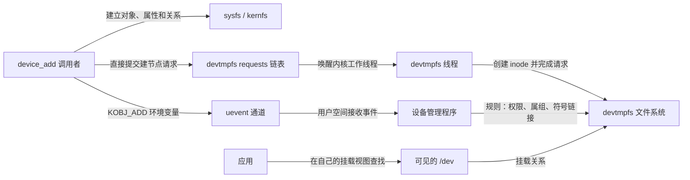
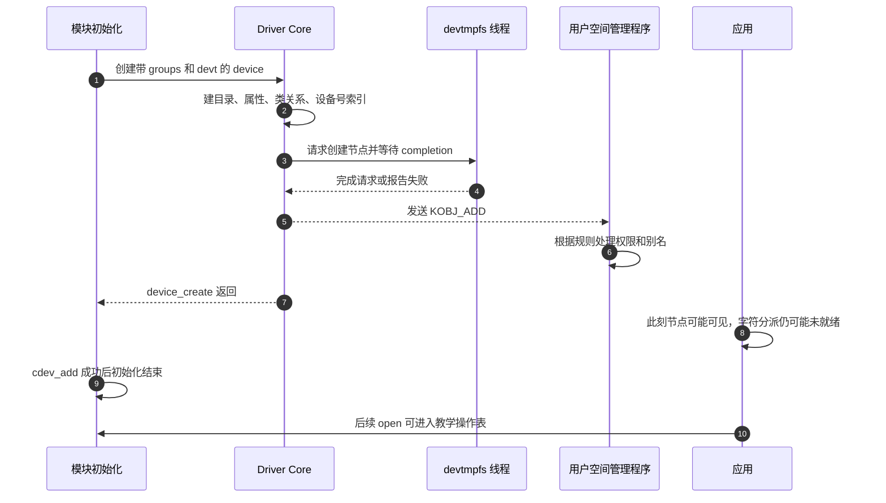

# 第3章\_从发布到设备节点

上一章把设备号、分类对象和字符分派接了起来。现在假设模块加载成功，`/sys/class/note_control/note_control0` 也存在，应用却找不到 `/dev/note_control0`。重新创建 class 能解决吗？

先沿发布过程找出每一份状态由谁保存。分类目录、devtmpfs 中的 inode、用户空间规则和字符分派表不属于同一个事务；其中一层成功不能证明其余层都完成。这个区分也解释了为什么“udev 没运行”有时并不妨碍设备节点出现。

## 3.1\_两条不同的发布路径

设备添加时，Driver Core 创建对象目录、类链接和属性组。对具有非零主设备号的对象，它还建立 `dev` 属性及 `/sys/dev/char/主号:次号` 或块设备索引，并直接请求 devtmpfs 创建节点。之后发送 KOBJ_ADD 事件，用户空间管理程序可据此执行权限和别名策略。



devtmpfs 没有在图中监听 uevent。固定实现把请求放入 `requests` 链表，用 `req_lock` 保护，唤醒专用线程，调用方等待请求中的 completion；工作线程处理请求后报告结果。这是内核内部的请求与完成通信。udev 等用户空间程序走另一条事件路径，通常在 devtmpfs 基础上执行策略。

当前基线的 device_add 调用了 `devtmpfs_create_node`，但没有把它的返回值作为 device_add 的整体失败条件。因此“device_create 成功”不能单独证明节点一定创建成功。即使节点已经在 devtmpfs 内生成，进程看到的 `/dev` 也可能来自另一挂载或容器视图。源码入口见[发布与事件导读](../../../../research/source_reading/driver_entries/navigation/P03_分类对象与属性事务导读.md#3.2_发布的两条通信路径)。

## 3.2\_事件能说明什么

uevent 携带动作、对象路径、子系统以及适用时的设备号、设备名和 MODALIAS 等信息。MODALIAS 是按总线或子系统契约构造的匹配提示，用户空间可用它查找模块别名并请求加载。普通 class 对象不一定有它；没有该字段不能直接判定驱动坏了。

事件发生也不等于 probe 成功。总线设备登记与驱动绑定是不同状态，device_add 的添加事件可以早于后续探测完成。由总线已经登记并交给 probe 的设备，不应在 probe 中再对同一对象调用 device_add；若需要功能入口，应按子系统契约注册另一个功能对象。

在准备加载教学模块之前，可在另一个终端执行只读监视：

```bash
udevadm monitor --kernel --udev --property
```

工具必须在系统安装且实际使用相应设备管理服务时才有意义。加载后再打开监视器，错过一次事件是正常的；读取 sysfs 中的 `uevent` 文件得到的是当前可生成的属性信息，不是历史送达记录。内核事件、用户空间处理完成和文件系统最终状态应分别核对，不能从一段 monitor 输出推断全部成立。



用户空间接收与执行规则是异步的。图中用户程序的工作与模块继续初始化可能交错；没有一个“事件已发出”的标志自动把它们串行化。

## 3.3\_名字与权限分属不同对象

设备对象名称、节点路径和稳定别名也应分开。设备号是字符分派身份，名字是查找入口；重建节点或加符号链接不改变操作表。动态分配的号码可能在下次加载改变，不能把本次 stat 的结果写成长期 ABI。

| 目标 | 设置位置 | 不能替代的事情 |
| --- | --- | --- |
| sysfs 属性读写位 | attribute.mode，常用 DEVICE_ATTR_RO/RW | 不替字符节点授权，也不提供 store 内容校验 |
| devtmpfs 节点初始模式 | device type/class 的 devnode 回调与默认策略 | 不改变 sysfs 属性模式 |
| 用户空间节点策略 | udev 等管理程序的规则 | 不创建 cdev 分派，不保证任意环境都运行该服务 |
| 对象目录属主 | class 的 get_ownership 等机制 | 不等同于给所有属性或所有节点统一授权 |

例如，在实际存在相应组的系统上，可以为本例设计以下规则；它只是配置样本，本实验无需安装它：

```text
SUBSYSTEM=="note_control", KERNEL=="note_control0", GROUP="noteusers", MODE="0640", SYMLINK+="note_message"
```

MODE 针对设备节点，不会让 enabled 属性也变成 0640。SYMLINK 提供别名，不能把普通设备节点重命名理解为通用规则能力。最终权限仍受后续规则、挂载和 Linux 安全模块策略影响；不要照抄一个 SELinux 类型名称假装适用于所有发行版。

如果使用 class.devnode 自定名字，其返回值类型是 `char *`，需要遵守调用者回收临时字符串的协议，不能返回随后会被释放的字符串常量。只修改 mode 可以返回 NULL，交回默认名称选择。对于本例，默认 0600 已足够，没必要添加无意义的回调。

## 3.4\_按已知事实缩小故障范围

先只读检查，不覆盖运行系统的 `/dev` 挂载，也不为了实验重放真实设备的添加事件：

```bash
findmnt -T /dev
readlink -f /sys/class/note_control/note_control0
cat /sys/class/note_control/note_control0/dev
cat /sys/class/note_control/note_control0/uevent
ls -l /dev/note_control0
stat -c '类型=%F 主号十六进制=%t 次号十六进制=%T' /dev/note_control0
```

这些命令的失败同样是观察结果。sysfs 的 dev 通常用十进制，GNU stat 的 %t/%T 是十六进制，不能按字符串相等比较。使用主次号解码的方法见[设备号与节点](../../../driver_model/character_device/P02_设备号_注册与设备节点.md)。

| 观察 | 已经知道 | 下一步 |
| --- | --- | --- |
| 模块加载失败 | 初始化没有完成 | 保存 errno 与内核日志，按原错误定位，不先猜 udev |
| 分类目录不存在 | 当前 sysfs 视图没有对应入口 | 检查 class/device 创建返回值、名字、挂载视图及注销 |
| 目录有，dev 属性无 | 对象可能本就没有非零主号 | 对照第一章零 devt 实例，不强行补节点 |
| dev 有，节点无 | 对象身份可见，节点层仍未证实 | 核对 DEVTMPFS 配置、内核请求失败、可见挂载和用户空间策略 |
| 节点有，open 失败 | 路径存在不等于分派可用 | 比较号码，检查 cdev 是否发布，再区分访问权限和驱动 open 错误 |
| open 成功，read 失败 | 已经过了打开层 | 本例检查 enabled 与 EACCES；别把业务拒绝当节点失踪 |

内核自动挂载 devtmpfs 的配置有启动场景边界：`CONFIG_DEVTMPFS_MOUNT` 不替 initramfs 的初始化程序完成所需挂载。静态节点、BusyBox mdev、devtmpfs 加管理程序都是配置选择，不能简化成“某一内核年代必用某一方案”。mknod 能创建带号码的 inode，但不注册服务；它可用于受控排错，不是修复所有设备发布问题的通用按钮。

## 3.5\_回顾与练习

我们现在可以把“设备没有出现”拆成对象、号码、节点、挂载、权限、分派六个可观察问题。退出方向也要按真实源码理解：device_del 会撤节点与属性，再发移除事件，不能假定用户程序总在旧路径仍完整时收到通知。

1. 关闭用户空间设备管理服务后仍有节点，是否说明规则还在运行？
2. monitor 没显示刚才的添加事件，能否证明内核没有发过？
3. 用正确号码手工建节点，是否可以绕过 enabled=0？
4. 修改节点模式后仍不能写 enabled，应查哪一层？

解答：第一题不能，devtmpfs 可独立完成建节点。第二题先确认监听时间与通道，事件观察没有补历史的保证。第三题不能，节点只改变查找路径，同一设备号仍进入同一业务回调。第四题查 sysfs 属性模式、打开者身份、挂载与安全策略；进入 store 后还需检查输入格式，节点模式不控制这个属性。

上一篇：[让属性控制读取](P02_让属性控制字符读取.md)。

下一篇：[并发访问与撤销](P04_并发访问与撤销.md)。返回[大纲](大纲.md)。
